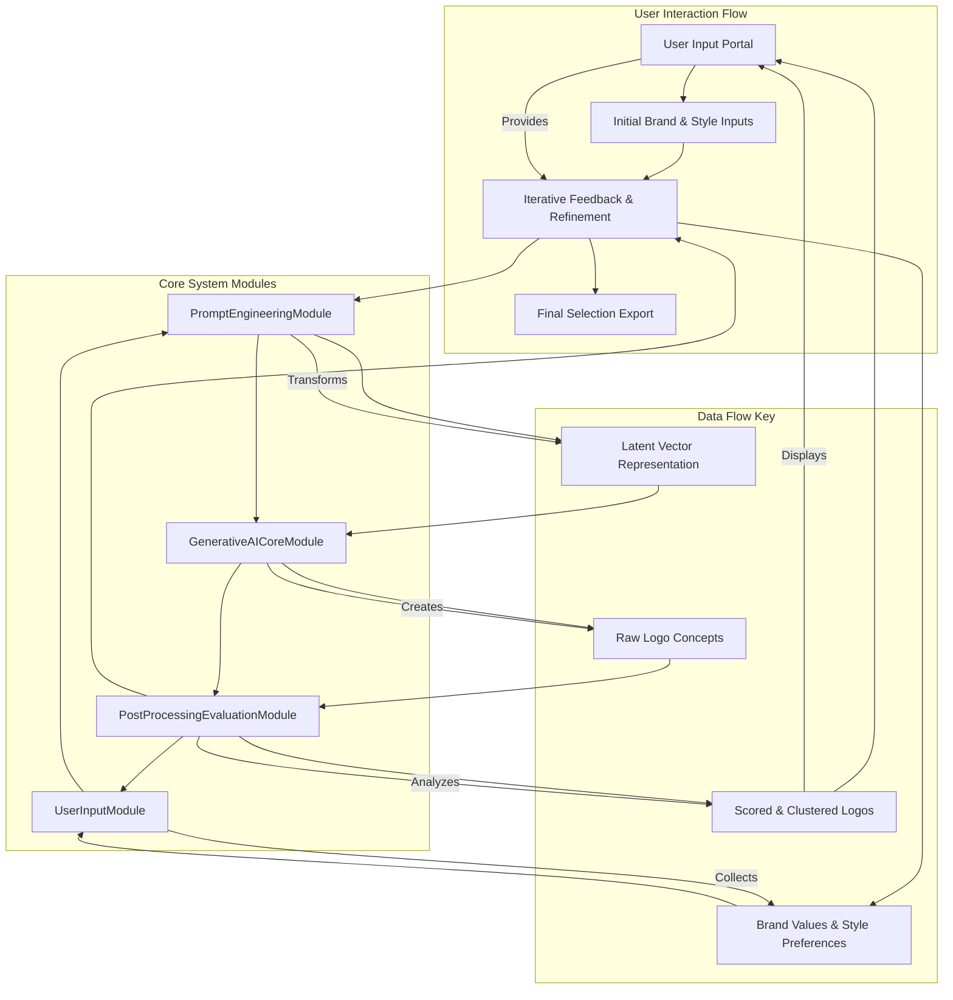

**Title of Invention:** A System and Method for Generative Corporate Logo Design

**Abstract:**
A system and method for generative corporate logo design is disclosed, leveraging advanced artificial intelligence and computational geometry. User inputs defining company identity and brand values are transformed into high-dimensional latent vectors. These vectors parametrically guide a generative AI model to synthesize a diverse plurality of logo designs. A post-processing module applies aesthetic metrics and brand alignment scores, derived from mathematical models of visual perception and semantic embedding, to refine and present optimized logo candidates. The system incorporates iterative user feedback to navigate the logo design space, providing mathematically grounded design exploration and visualization.

**Detailed Description:**
A startup founder needs a logo. They input: Name: "Apex Robotics," Values: "precision, speed, intelligence." The system calls an AI image model with prompts like: `minimalist logo for a robotics company called "Apex Robotics", conveying speed and precision` and `emblem logo for "Apex Robotics", featuring a stylized eagle and a circuit pattern`. The AI generates a dozen different logo options, which are displayed in a gallery for the founder to review.

The system significantly extends beyond basic prompt generation through a structured, mathematically informed pipeline for creative exploration and refinement.

**Core System Modules:**

1.  **UserInputModule:** This module is responsible for capturing and validating initial user requirements.
    *   **Functionality:** Receives company name, industry sector, primary brand values, desired aesthetic styles e.g. "minimalist", "modern", "classic", and optional visual cues e.g. "geometric shapes", "organic forms".
    *   **Interaction:** Provides an intuitive graphical interface for input collection and initial preference setting.

2.  **PromptEngineeringModule:** This module translates abstract user inputs into precise, effective prompts for the generative AI model, incorporating a mathematical representation of design attributes.
    *   **BrandValueEmbedding:** Transforms textual brand values e.g. "trust", "innovation" into dense numerical vectors `V_brand` within a high-dimensional semantic space, utilizing pre-trained language models.
    *   **StyleModifierEmbedding:** Converts desired aesthetic styles e.g. "minimalist", "emblem" into corresponding style vectors `V_style`.
    *   **PromptVectorSynthesis:** Mathematically combines `V_brand`, `V_style`, and company name embeddings into a comprehensive latent prompt vector `V_prompt`. This synthesis often involves weighted summation, concatenation, or non-linear transformations to encapsulate the desired visual characteristics.
    *   **PromptTextGeneration:** Converts `V_prompt` into specific textual prompts optimized for various generative AI models, ensuring diversity across multiple artistic interpretations e.g. "logo for Apex Robotics depicting speed and precision minimalist style", "emblem for Apex Robotics with circuit patterns".

3.  **GenerativeAICoreModule:** This module interfaces with one or more generative AI models to produce logo designs.
    *   **ModelSelection:** Dynamically selects appropriate generative models e.g. Diffusion Models, GANs based on prompt complexity, desired style, or performance metrics.
    *   **BatchGeneration:** Executes parallel generation of a diverse set of logo concepts based on the prompts received from the PromptEngineeringModule.
    *   **ResourceManagement:** Manages API calls, ensures efficient use of computational resources, and handles model-specific parameters.

4.  **PostProcessingEvaluationModule:** This module analyzes and refines the generated logos, applying quantitative metrics to assess quality and brand alignment.
    *   **FeatureExtraction:** Extracts key visual features from generated logos e.g. color palette, geometric structure, texture, semantic elements using pre-trained visual encoders.
    *   **AestheticScoring:** Assigns an aesthetic score to each logo based on computational models of visual balance, composition, uniqueness, and adherence to specified style guidelines. This score is derived from trained neural networks or mathematically defined perceptual metrics.
    *   **BrandAlignmentMetrics:** Quantitatively measures how well a logo visually expresses the initial brand values. This involves comparing the logo's visual feature vector to the brand value embeddings `V_brand` in the latent space, calculating a cosine similarity or other distance metric.
    *   **DiversityClustering:** Groups similar logo designs using clustering algorithms e.g. k-means, DBSCAN on their feature vectors, ensuring the presented gallery offers a broad range of distinct options to the user.
    *   **QualityFiltering:** Automatically filters out low-quality or incoherent designs.

5.  **UserFeedbackIterationModule:** This module facilitates user interaction for refinement and iterative design exploration.
    *   **InteractiveDisplay:** Presents the filtered and clustered logo options in a user-friendly gallery interface.
    *   **FeedbackCapture:** Captures explicit user feedback e.g. "like this one", "make it more modern", "change color to blue", and implicit feedback e.g. hover time, clicks.
    *   **ParameterRefinement:** Translates user feedback into adjustments for the PromptEngineeringModule, allowing for iterative generation or refinement of existing logos. This closes the design loop, enabling users to navigate the complex logo design space efficiently.

**Mathematical Foundation for Generative Design:**
The system's innovative core lies in its rigorous mathematical framework, distinguishing it from mere prompt-based image generation.
1.  **Latent Vector Space Embeddings:** All design attributes e.g. brand values, styles, visual elements are represented as points or vectors in a continuous, high-dimensional latent vector space. This allows for arithmetic operations on concepts, e.g., `V_brand_trust + V_style_minimalist` to derive a new design direction.
2.  **Computational Geometry for Visual Semantics:** The generation process itself is a complex manifold learning problem within this latent space. Generative models e.g. Diffusion Models, operate by iteratively denoising a random latent vector conditioned by `V_prompt`, effectively sampling a high-probability region of the image manifold that corresponds to the desired logo characteristics.
3.  **Optimization for Brand Alignment and Aesthetic Appeal:**
    *   An objective function `O(Logo, V_brand, V_style)` is defined to quantify the "goodness" of a logo. This function combines the BrandAlignmentMetrics and AestheticScoring, often as a weighted sum or product.
    *   The system aims to find logos that maximize `O`, either through direct generation guided by the prompt vector `V_prompt` or through post-hoc ranking and selection of generated variations.
    *   Iterative user feedback refines the `V_prompt` or directly adjusts parameters within the optimization landscape, allowing for guided traversal of the design space.
4.  **Graph Theory for Visual Composition Analysis:** Advanced versions of the PostProcessingEvaluationModule can employ graph theory to analyze the spatial relationships and connectivity of elements within a generated logo, assessing balance, flow, and visual hierarchy more rigorously than simple pixel-based metrics.

By anchoring the design process in these quantifiable mathematical concepts, the system provides a robust and provable methodology for navigating the vast design space, ensuring generated logos are not only aesthetically pleasing but also semantically aligned with explicit brand objectives.



```mermaid
graph TD
    subgraph Generative Logo Design Process Detail
        P1[Start Process] --> P2[Receive User CompanyName Industry]
        P2 --> P3[Receive User BrandValues e.g. Precision Speed]
        P3 --> P4[Receive User AestheticStyles e.g. Minimalist Emblem]

        P4 --> PE1[Prompt Engineering Module Start]
        PE1 --> PE2[Embed BrandValues to V_brand Vector]
        PE2 --> PE3[Embed AestheticStyles to V_style Vector]
        PE3 --> PE4[Synthesize Composite PromptVector V_prompt]
        PE4 --> PE5[Generate Diverse TextPrompts]
        PE5 --> PE6[Prompt Engineering Module End]

        PE6 --> GA1[Generative AI Core Module Start]
        GA1 --> GA2[Select Optimal Generative Model]
        GA2 --> GA3[Generate Batch of LogoVariations]
        GA3 --> GA4[Generative AI Core Module End]

        GA4 --> PP1[Post Processing Evaluation Module Start]
        PP1 --> PP2[Extract VisualFeatures from Logos]
        PP2 --> PP3[Calculate AestheticScores MathematicalMetrics]
        PP3 --> PP4[Measure BrandAlignmentMetrics LatentSpaceComparison]
        PP4 --> PP5[Filter LowQuality Logos]
        PP5 --> PP6[Cluster Logos by Similarity VisualGrouping]
        PP6 --> PP7[Post Processing Evaluation Module End]

        PP7 --> UF1[User Feedback Iteration Module Start]
        UF1 --> UF2[Present Logos to User InteractiveGallery]
        UF2 --> UF3[Capture UserFeedback ExplicitImplicit]
        UF3 --> UF4[Identify PreferredLogos & RefinementNeeds]

        UF4 -- If Refinement Needed --> PE1
        UF4 -- If Final Selection --> UF5[Export SelectedLogos]
        UF5 --> UF6[User Feedback Iteration Module End]
        UF6 --> P_END[End Process]
    end

    Note right of P3: Brand values mapped to a semantic latent space
    Note right of PE4: V_prompt = fV_brand V_style V_keywords
    Note left of GA3: Leverages Diffusion or GAN models
    Note right of PP4: Cosine similarity in latent space
    Note left of PP6: Kmeans or DBSCAN on feature vectors
    Note right of UF3: Feedback informs V_prompt adjustment
```

**Claims:**
1.  A method for generative corporate logo design, comprising:
    a.  Receiving a set of user inputs comprising a company name, industry sector, and at least one brand value;
    b.  Transforming said at least one brand value into a brand value vector `V_brand` within a high-dimensional latent semantic space;
    c.  Generating a plurality of textual prompts by combining said brand value vector `V_brand` with said company name and optional aesthetic style modifiers, forming a composite latent prompt vector `V_prompt`;
    d.  Transmitting said plurality of textual prompts to a generative artificial intelligence model;
    e.  Generating by said generative artificial intelligence model a plurality of logo designs in response to said textual prompts;
    f.  Extracting a set of visual features from each of said plurality of logo designs;
    g.  Calculating an aesthetic score for each logo design based on mathematically defined perceptual metrics applied to said extracted visual features;
    h.  Calculating a brand alignment score for each logo design by comparing its extracted visual features to said brand value vector `V_brand` within said latent semantic space;
    i.  Displaying a subset of said generated logo designs, selected based on their aesthetic scores and brand alignment scores, to the user.

2.  The method of claim 1, further comprising:
    a.  Receiving user feedback on the displayed logo designs;
    b.  Adjusting said composite latent prompt vector `V_prompt` based on said user feedback; and
    c.  Repeating steps d-i to generate and display refined logo designs.

3.  The method of claim 1, wherein the generative artificial intelligence model comprises a diffusion model or a generative adversarial network GAN.

4.  The method of claim 1, further comprising clustering said plurality of logo designs into distinct groups based on the similarity of their extracted visual features, prior to displaying them to the user.

5.  The method of claim 1, wherein transforming said at least one brand value into a brand value vector `V_brand` utilizes a pre-trained language model embedding.

6.  The method of claim 1, wherein the aesthetic score calculation includes evaluating visual balance, compositional harmony, and uniqueness of the logo design.

7.  The method of claim 1, wherein the brand alignment score is determined by a cosine similarity metric between the logo's visual feature vector and the brand value vector `V_brand`.

8.  A system for generative corporate logo design, comprising:
    a.  A User Input Module configured to receive a company name, industry, and brand values from a user;
    b.  A Prompt Engineering Module communicatively coupled to the User Input Module, configured to:
        i.  Generate a brand value vector `V_brand` from said brand values in a latent semantic space;
        ii. Synthesize a composite latent prompt vector `V_prompt`; and
        iii. Produce a plurality of textual prompts based on `V_prompt`;
    c.  A Generative AI Core Module communicatively coupled to the Prompt Engineering Module, configured to generate a plurality of logo designs from said textual prompts;
    d.  A Post Processing Evaluation Module communicatively coupled to the Generative AI Core Module, configured to:
        i.  Extract visual features from the logo designs;
        ii. Calculate aesthetic scores and brand alignment scores for each logo design using mathematical models; and
        iii. Filter and cluster logo designs;
    e.  A User Feedback Iteration Module communicatively coupled to the Post Processing Evaluation Module and the Prompt Engineering Module, configured to display logo designs, capture user feedback, and refine `V_prompt` for subsequent generations.

9.  The system of claim 8, wherein the Prompt Engineering Module utilizes neural network embeddings for `V_brand` generation.

10. The system of claim 8, wherein the Post Processing Evaluation Module employs perceptual loss functions for aesthetic scoring and vector similarity measures for brand alignment.