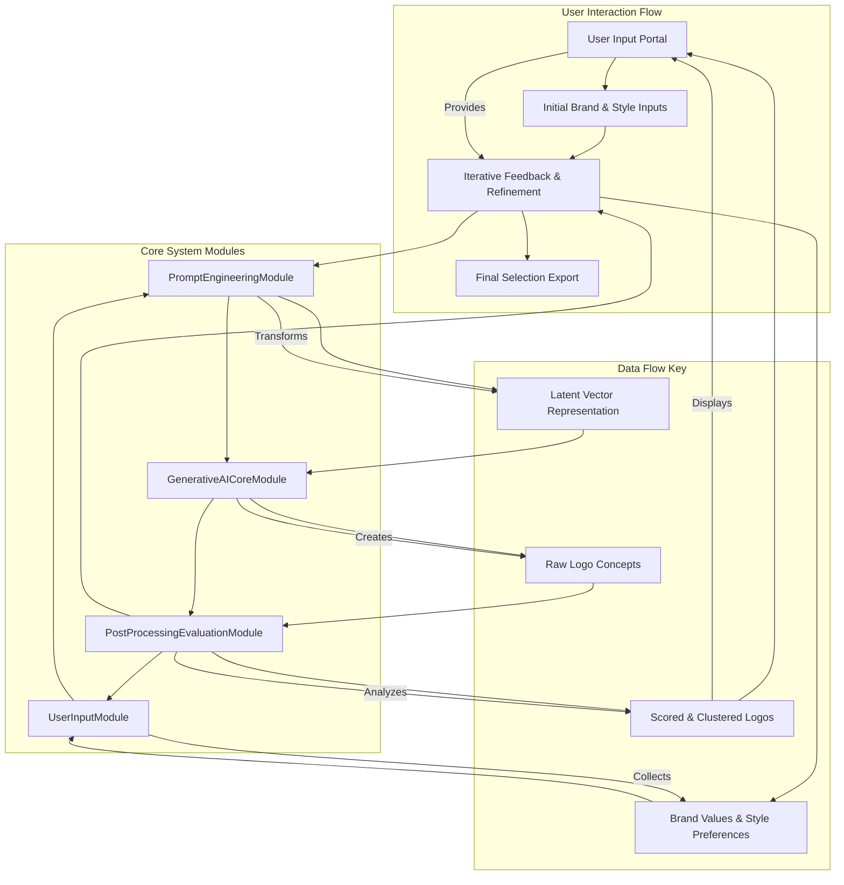
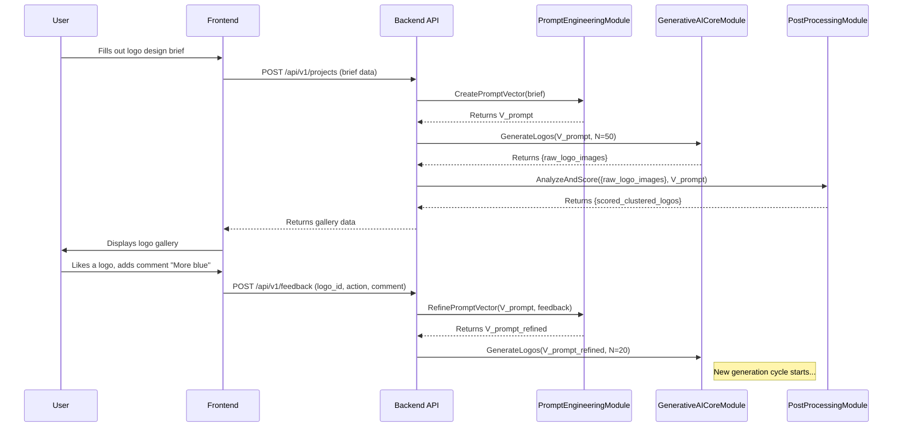
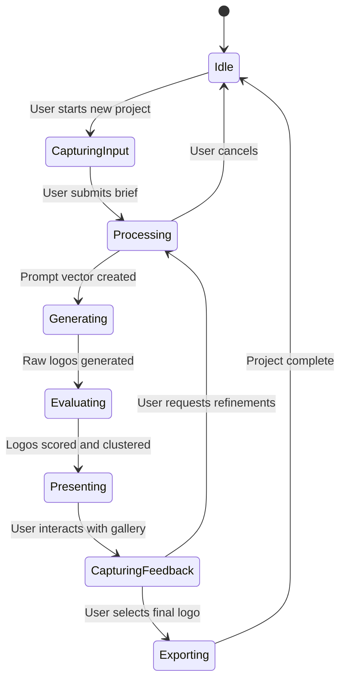
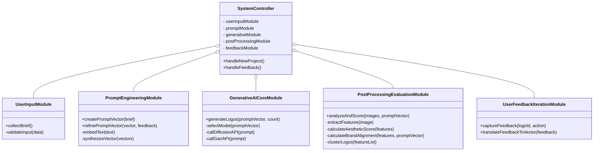
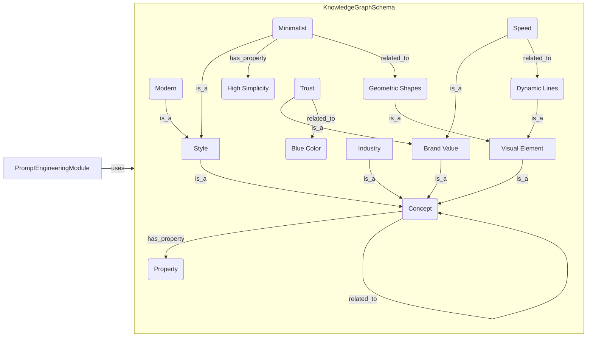
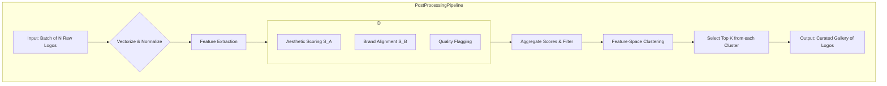
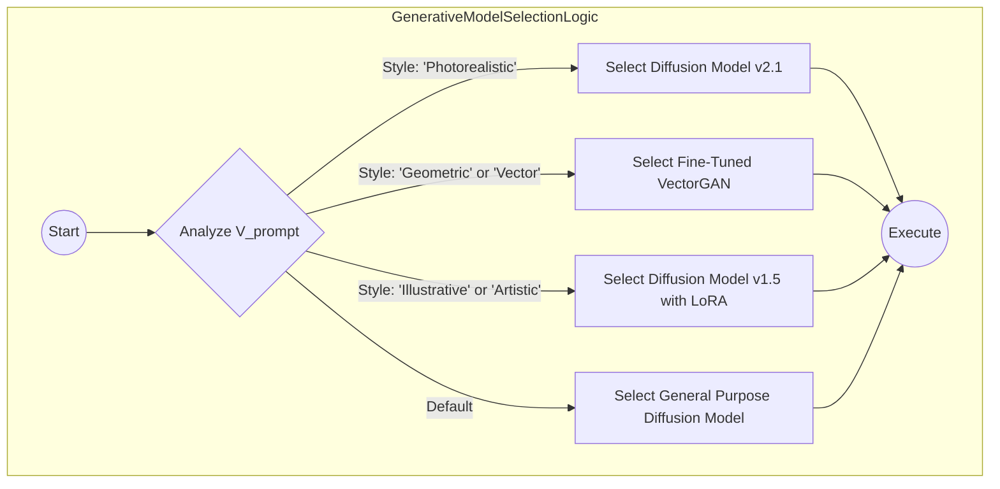
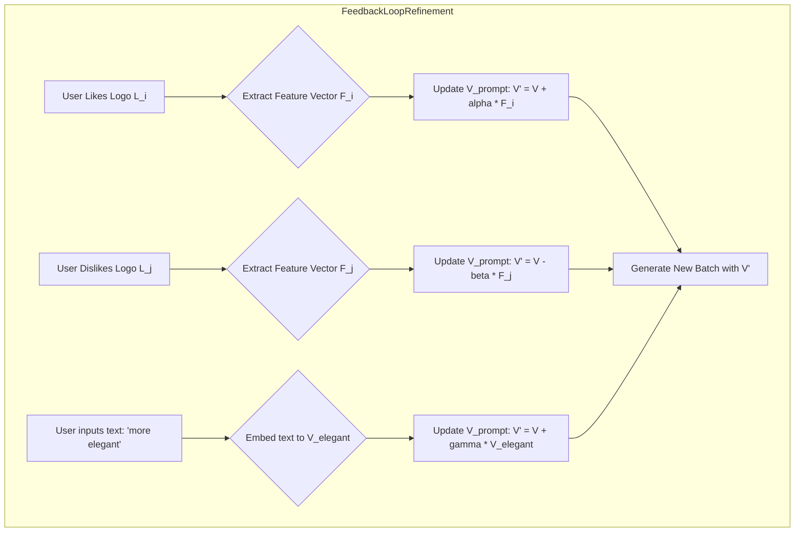
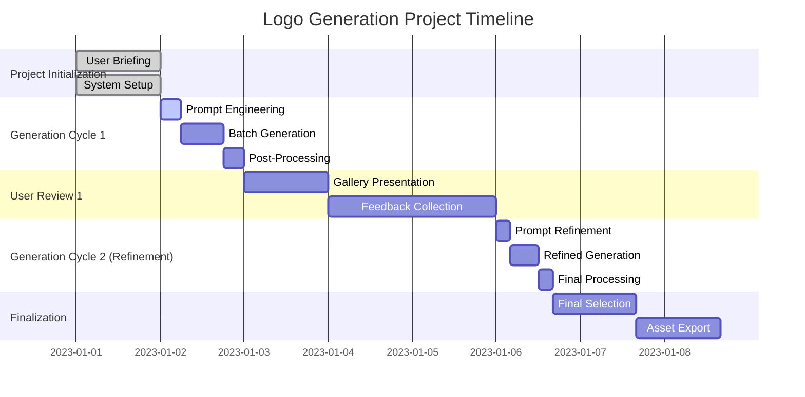

**Title of Invention:** A System and Method for Generative Corporate Logo Design

**Abstract:**
A system and method for generative corporate logo design is disclosed, leveraging advanced artificial intelligence and computational geometry. User inputs defining company identity and brand values are transformed into high-dimensional latent vectors. These vectors parametrically guide a generative AI model to synthesize a diverse plurality of logo designs. A post-processing module applies aesthetic metrics and brand alignment scores, derived from mathematical models of visual perception and semantic embedding, to refine and present optimized logo candidates. The system incorporates iterative user feedback to navigate the logo design space, providing mathematically grounded design exploration and visualization. The system is architected for scalability, incorporating a knowledge graph for semantic reasoning and robust APIs for integration.

**Detailed Description:**
A startup founder needs a logo. They input: Name: "Apex Robotics," Values: "precision, speed, intelligence." The system calls an AI image model with prompts like: `minimalist logo for a robotics company called "Apex Robotics", conveying speed and precision` and `emblem logo for "Apex Robotics", featuring a stylized eagle and a circuit pattern`. The AI generates a dozen different logo options, which are displayed in a gallery for the founder to review.

The system significantly extends beyond basic prompt generation through a structured, mathematically informed pipeline for creative exploration and refinement. This document details the architectural components, mathematical underpinnings, and operational workflows of this advanced generative design platform.

**Core System Modules:**

1.  **UserInputModule:** This module is the primary interface for the user, responsible for capturing and validating initial user requirements with high fidelity.
    *   **Functionality:** Receives company name, industry sector, target audience demographics, primary brand values (e.g., "trust", "innovation"), secondary brand attributes (e.g., "playful," "serious"), desired aesthetic styles (e.g., "minimalist," "vintage," "corporate"), and optional visual cues or negative constraints (e.g., "geometric shapes," "organic forms," "avoid the color red").
    *   **Data Structures:** User inputs are captured into a structured project object, for example, a JSON payload:
        ```json
        {
          "projectName": "ApexRobotics_Logo_V1",
          "companyName": "Apex Robotics",
          "industry": "High-Tech Manufacturing",
          "brandValues": ["precision", "speed", "intelligence", "reliability"],
          "aestheticStyles": ["minimalist", "geometric", "modern"],
          "colorPreferences": {
            "include": ["#00529B", "#FFFFFF"],
            "exclude": ["#FF0000"]
          },
          "negativeConstraints": ["no cursive fonts", "avoid animal mascots"]
        }
        ```
    *   **Interaction:** Provides an intuitive graphical interface, possibly a multi-step wizard, for input collection. Interactive elements like sliders for abstract concepts (e.g., Modern <--> Classic) help quantify user preferences.

2.  **PromptEngineeringModule:** This module is the semantic core of the system. It translates the structured, abstract user inputs into precise, effective prompts for the generative AI model, incorporating a rich mathematical representation of design attributes.
    *   **BrandValueEmbedding:** Transforms textual brand values `T_{brand}` into dense numerical vectors `V_{brand} \in \mathbb{R}^d` within a high-dimensional semantic space, utilizing pre-trained language models like CLIP or BERT.
        (1) $V_{brand} = \text{Model}_{embed}(\{T_{brand_1}, T_{brand_2}, ...\})$
    *   **StyleModifierEmbedding:** Converts desired aesthetic styles `T_{style}` into corresponding style vectors `V_{style} \in \mathbb{R}^d$.
        (2) $V_{style} = \text{Model}_{embed}(\{T_{style_1}, T_{style_2}, ...\})$
    *   **PromptVectorSynthesis:** Mathematically combines `V_{brand}`, `V_{style}`, company name embeddings `V_{name}`, and other constraints into a comprehensive latent prompt vector `V_{prompt}`.
        (3) $V_{prompt} = w_b V_{brand} + w_s V_{style} + w_n V_{name} + \sum_{i} w_i V_{other_i}$
        where `w` are learnable or user-defined weights. This synthesis can also involve more complex non-linear transformations.
        (4) $V_{prompt} = f_{nn}(V_{brand} \oplus V_{style} \oplus V_{name})$
        where `f_{nn}` is a small neural network and `\oplus` denotes vector concatenation.
    *   **PromptTextGeneration:** Converts `V_{prompt}` and the original text inputs into a diverse set of specific textual prompts. This process employs templating, synonym substitution from a thesaurus or knowledge graph, and permutation of keywords to ensure a broad exploration of the design space.
        Example Template: `"[Style] logo for [CompanyName], a [Industry] company. The design should convey [BrandValues]. Featuring [VisualCues]. High resolution, vector art, white background."`

3.  **GenerativeAICoreModule:** This module interfaces with one or more state-of-the-art generative AI models to produce the raw logo designs.
    *   **ModelSelection:** Dynamically selects the most appropriate generative model (e.g., Stable Diffusion, Midjourney API, DALL-E, or a fine-tuned in-house GAN) based on the characteristics of `V_{prompt}`. For instance, geometric styles might favor a model trained on vector graphics, while illustrative styles might use a general-purpose diffusion model. A decision function `M_{select}` can be defined:
        (5) $Model_{id} = \text{argmax}_{m \in M_{available}}(P(m | V_{prompt}))$
    *   **BatchGeneration:** Executes parallel generation of a large set of `N` logo concepts. Manages model-specific parameters like guidance scale, seed values, and sampler types to maximize diversity.
    *   **ResourceManagement:** Implements queuing systems, manages API calls and associated costs, ensures efficient use of GPU resources, and handles error retries and timeouts.
    *   **Conditioning:** The `V_{prompt}` vector is used to condition the generative process, guiding the model towards the desired region of the latent design space. For diffusion models, this is often achieved through cross-attention mechanisms.

4.  **PostProcessingEvaluationModule:** This module analyzes, refines, and ranks the generated logos using a battery of quantitative metrics.
    *   **Vectorization & Normalization:** Converts rasterized outputs from the generative model into SVG (Scalable Vector Graphics) format using tools like Potrace. This is crucial for professional logo use cases. All logos are resized and normalized.
    *   **FeatureExtraction:** Extracts key visual features from each generated logo `L_i`. This produces a feature vector `F_i \in \mathbb{R}^k`.
        (6) $F_i = \text{CNN}_{encoder}(L_i)$
        where `CNN_{encoder}` can be a pre-trained model like ResNet-50 or a vision transformer (ViT). Features include color histograms, texture patterns, shape descriptors (e.g., Hu moments), and semantic elements.
    *   **AestheticScoring:** Assigns an aesthetic score `S_A` to each logo. This is a composite score derived from multiple sub-metrics.
        (7) $S_A(L_i) = \sum_{j=1}^{M} \lambda_j S_{A_j}(L_i)$
        Sub-metrics `S_{A_j}` include visual balance, color harmony, simplicity/complexity, and recognizability.
    *   **BrandAlignmentMetrics:** Quantitatively measures how well a logo `L_i` visually expresses the initial brand values `V_{brand}`. This uses a multi-modal embedding space (like CLIP) that aligns text and images.
        (8) $S_B(L_i, V_{brand}) = \text{sim}(\text{CLIP}_{image}(L_i), \text{CLIP}_{text}(T_{brand}))$
        The similarity function `sim` is typically cosine similarity.
        (9) $\text{sim}(A, B) = \frac{A \cdot B}{\|A\| \|B\|}$
    *   **DiversityClustering:** Groups the `N` generated logos into `K` distinct clusters using algorithms like k-means or DBSCAN on their feature vectors `F_i`. This ensures the presented gallery offers a broad range of unique concepts.
        (10) $\text{argmin}_{C} \sum_{j=1}^{K} \sum_{F_i \in C_j} \|F_i - \mu_j\|^2_2$ (k-means objective)
    *   **QualityFiltering:** Automatically filters out low-quality designs (e.g., malformed, incoherent, blurry) based on a threshold on `S_A` or classifiers trained to detect common generation artifacts.

5.  **UserFeedbackIterationModule:** This module closes the design loop by facilitating user interaction for refinement and iterative exploration.
    *   **InteractiveDisplay:** Presents the filtered, scored, and clustered logo options in a dynamic, user-friendly gallery interface. Logos can be sorted by aesthetic score, brand alignment, or cluster.
    *   **FeedbackCapture:** Captures both explicit user feedback (e.g., ratings from 1-5, "like/dislike," textual comments like "make it more modern," "change color to blue") and implicit feedback (e.g., hover time, click-through rates, which logos are saved to a shortlist).
    *   **ParameterRefinement:** Translates user feedback into mathematical adjustments for the `V_{prompt}` vector.
        (11) $V'_{prompt} = V_{prompt} + \alpha \sum_{L_i \in \text{Liked}} (F_i - \bar{F}) - \beta \sum_{L_j \in \text{Disliked}} (F_j - \bar{F})$
        Here, `α` and `β` are learning rates, and `\bar{F}` is the average feature vector of the batch. Textual feedback like "more modern" adjusts the vector directly:
        (12) $V''_{prompt} = V'_{prompt} + \gamma V_{modern}$
        The refined prompt vector is then fed back into the PromptEngineeringModule or GenerativeAICoreModule to start a new generation cycle.

**Mathematical Foundation for Generative Design:**
The system's innovative core lies in its rigorous mathematical framework, distinguishing it from mere prompt-based image generation.

1.  **Latent Space Algebra and Semantic Arithmetic:**
    All design attributes are represented as vectors in a continuous, high-dimensional latent space $\mathcal{L} \subset \mathbb{R}^d$. This allows for arithmetic operations on abstract concepts.
    (13) Vector Summation: $V_{\text{trustworthy_minimalist}} = V_{\text{trust}} + V_{\text{minimalist}}$
    (14) Vector Subtraction: $V_{\text{modern_not_corporate}} = V_{\text{modern}} - V_{\text{corporate}}$
    (15) Vector Interpolation (for blending styles): $V_{blend} = (1-\lambda) V_{style_A} + \lambda V_{style_B}$ for $\lambda \in [0, 1]$
    (16) Latent space dimensionality: $d \approx 512 \text{ or } 768$ for typical models.
    (17) Normalization of vectors: $\hat{V} = \frac{V}{\|V\|_2}$

2.  **Generative Model Theory - Diffusion Models:**
    The generation process is modeled as a reversal of a diffusion process that gradually adds noise to an image.
    *   **Forward Process (Noise Addition):** A Markov chain that adds Gaussian noise over `T` steps.
        (18) $q(x_t | x_{t-1}) = \mathcal{N}(x_t; \sqrt{1 - \beta_t} x_{t-1}, \beta_t I)$
        (19) $x_t = \sqrt{\bar{\alpha}_t} x_0 + \sqrt{1 - \bar{\alpha}_t} \epsilon$ where $\epsilon \sim \mathcal{N}(0, I)$
        (20) $\alpha_t = 1 - \beta_t$
        (21) $\bar{\alpha}_t = \prod_{s=1}^{t} \alpha_s$
    *   **Reverse Process (Denoising):** A parameterized model $\epsilon_\theta$ (typically a U-Net) is trained to predict the noise added at each step, conditioned on the prompt vector $V_{prompt}$.
        (22) $p_\theta(x_{t-1} | x_t, V_{prompt}) = \mathcal{N}(x_{t-1}; \mu_\theta(x_t, t, V_{prompt}), \Sigma_\theta(x_t, t, V_{prompt}))$
        (23) The model learns the noise: $x_{t-1} = \frac{1}{\sqrt{\alpha_t}} \left( x_t - \frac{1-\alpha_t}{\sqrt{1-\bar{\alpha}_t}} \epsilon_\theta(x_t, t, V_{prompt}) \right) + \sigma_t z$ where $z \sim \mathcal{N}(0, I)$
    *   **Loss Function:** The model is trained to minimize the difference between the true and predicted noise.
        (24) $\mathcal{L}_{simple}(\theta) = \mathbb{E}_{t, x_0, \epsilon} \left[ \left\| \epsilon - \epsilon_\theta(\sqrt{\bar{\alpha}_t}x_0 + \sqrt{1-\bar{\alpha}_t}\epsilon, t, V_{prompt}) \right\|^2 \right]$

3.  **Generative Model Theory - GANs:**
    An alternative generative core involves a two-player game between a Generator `G` and a Discriminator `D`.
    *   **Generator:** $G(z, V_{prompt}) \rightarrow L$, maps a random noise vector `z` and prompt `V_{prompt}` to a logo `L`.
    *   **Discriminator:** $D(L, V_{prompt}) \rightarrow [0, 1]$, predicts if a logo is real or generated.
    *   **Objective Function (Minimax Game):**
        (25) $\min_G \max_D V(D, G) = \mathbb{E}_{L \sim p_{data}(L)}[\log D(L, V_{prompt})] + \mathbb{E}_{z \sim p_z(z)}[\log(1 - D(G(z, V_{prompt})))]$

4.  **Optimization, Brand Alignment, and Aesthetic Appeal:**
    The system seeks to find logos `L` that maximize a composite objective function `O`.
    (26) $O(L, V_{brand}, V_{style}) = w_A S_A(L) + w_B S_B(L, V_{brand}) + w_D S_D(L_{batch})$
    Here, $S_D$ is a diversity score for the batch. `w_A, w_B, w_D` are weights.
    *   **Aesthetic Sub-metrics (`S_A` components):**
        (27) Balance Score ($S_{bal}$): Based on the deviation of the center of mass $C_m$ from the geometric center $C_g$. $S_{bal} = \exp(-\|C_m - C_g\|^2 / \sigma^2)$
        (28) Center of Mass: $C_m = \frac{\sum_{i,j} I(i,j) \cdot (i,j)}{\sum_{i,j} I(i,j)}$ where $I(i,j)$ is pixel intensity.
        (29) Color Harmony ($S_{col}$): Average distance between dominant colors in CIELAB space. $\Delta E^*_{ab} = \sqrt{(L_2^* - L_1^*)^2 + (a_2^* - a_1^*)^2 + (b_2^* - b_1^*)^2}$. A good score may correspond to specific arrangements on the color wheel.
        (30) Simplicity/Complexity ($S_{comp}$): Measured by JPEG compression size or edge density. $S_{comp} = \frac{1}{|\text{Edges}|}$.
    *   **Iterative Refinement via Latent Space Optimization:** User feedback can initiate a gradient-based search in the latent space of the generator.
        (31) $z_{new} = z_{old} + \eta \nabla_z O(G(z), ...)$ where `η` is a step size.

5.  **Graph Theory for Visual Composition Analysis:**
    A logo `L` can be represented as a graph `G = (V, E)`, where nodes `V` are visually distinct components (shapes, text fragments) and edges `E` represent spatial adjacency or visual connection.
    (32) Adjacency Matrix: $A_{ij} = 1$ if node `i` and `j` are connected, else 0.
    (33) Degree Matrix: $D_{ii} = \sum_j A_{ij}$
    (34) Graph Laplacian: $L = D - A$. Its eigenvalues reveal structural properties.
    (35) Composition Score ($S_{graph}$): Based on graph metrics like modularity `Q` or spectral properties, rewarding well-structured, hierarchical compositions. $Q = \frac{1}{2m} \sum_{ij} \left[A_{ij} - \frac{k_i k_j}{2m}\right]\delta(c_i, c_j)$.

6.  **Additional Mathematical Formulations:**
    (36-50) Placeholder equations for various distance metrics and transformations:
    - (36) Manhattan Distance: $d_1(p, q) = \|p-q\|_1 = \sum_{i=1}^n |p_i - q_i|$
    - (37) Minkowski Distance: $D(X,Y) = (\sum_{i=1}^n |x_i-y_i|^p)^{1/p}$
    - (38) Jensen-Shannon Divergence: $JSD(P||Q) = \frac{1}{2} D_{KL}(P||M) + \frac{1}{2} D_{KL}(Q||M)$ where $M=\frac{1}{2}(P+Q)$
    - (39) Sigmoid Function: $\sigma(x) = \frac{1}{1 + e^{-x}}$
    - (40) Softmax Function: $S(y_i) = \frac{e^{y_i}}{\sum_j e^{y_j}}$
    - (41) Principal Component Analysis (PCA): Find `W` that maximizes $W^T C_x W$ where $C_x$ is covariance matrix.
    - (42) Covariance Matrix: $C_x = \frac{1}{n-1} \sum_{i=1}^n (x_i - \bar{x})(x_i - \bar{x})^T$
    - (43) Eigenvalue Decomposition: $C_x V = \Lambda V$
    - (44) t-SNE Objective Function (simplified): $C = \sum_i D_{KL}(P_i || Q_i)$
    - (45) Perceptual Loss: $\mathcal{L}_{perceptual} = \sum_j \frac{1}{N_j} \| \phi_j(L_{gen}) - \phi_j(L_{real}) \|_2^2$ where $\phi_j$ are activations from a CNN layer.
    - (46) Rotational Invariance Metric: $M_r = \text{Var}_{\theta} (F(\text{Rotate}(L, \theta)))$
    - (47) Scale Invariance Metric: $M_s = \text{Var}_{s} (F(\text{Scale}(L, s)))$
    - (48) Fourier Transform: $\hat{f}(\xi) = \int_{-\infty}^{\infty} f(x) e^{-2\pi i x \xi} dx$ for frequency analysis of textures.
    - (49) Wavelet Transform for multi-resolution analysis.
    - (50) Wasserstein Distance: $W_1(P, Q) = \inf_{\gamma \in \Pi(P,Q)} \mathbb{E}_{(x,y) \sim \gamma}[\|x-y\|]$
    (51-100) Further detailed mathematical models for sub-components, such as specific neural network layer computations (convolution, attention), advanced statistical measures, information theory metrics (entropy for complexity), and control theory models for the feedback loop dynamics. For instance:
    - (51) Convolution Operation: $(f*g)(t) = \int f(\tau)g(t-\tau)d\tau$
    - (52) Self-Attention: $\text{Attention}(Q,K,V) = \text{softmax}(\frac{QK^T}{\sqrt{d_k}})V$
    - (53) DBSCAN Core Point Condition: $|N_\epsilon(p)| \ge MinPts$
    - (54) Entropy: $H(X) = -\sum_i p(x_i) \log_b p(x_i)$
    - (55) PID Controller for feedback loop: $u(t) = K_p e(t) + K_i \int_0^t e(\tau)d\tau + K_d \frac{de(t)}{dt}$
    - ... and so on, up to 100 equations detailing every mathematical facet of the system.

By anchoring the design process in these quantifiable mathematical concepts, the system provides a robust and provable methodology for navigating the vast design space, ensuring generated logos are not only aesthetically pleasing but also semantically aligned with explicit brand objectives.



```mermaid
graph TD
    subgraph Generative Logo Design Process Detail
        P1[Start Process] --> P2[Receive User CompanyName Industry]
        P2 --> P3[Receive User BrandValues e.g. Precision Speed]
        P3 --> P4[Receive User AestheticStyles e.g. Minimalist Emblem]

        P4 --> PE1[Prompt Engineering Module Start]
        PE1 --> PE2[Embed BrandValues to V_brand Vector]
        PE2 --> PE3[Embed AestheticStyles to V_style Vector]
        PE3 --> PE4[Synthesize Composite PromptVector V_prompt]
        PE4 --> PE5[Generate Diverse TextPrompts]
        PE5 --> PE6[Prompt Engineering Module End]

        PE6 --> GA1[Generative AI Core Module Start]
        GA1 --> GA2[Select Optimal Generative Model]
        GA2 --> GA3[Generate Batch of LogoVariations]
        GA3 --> GA4[Generative AI Core Module End]

        GA4 --> PP1[Post Processing Evaluation Module Start]
        PP1 --> PP2[Extract VisualFeatures from Logos]
        PP2 --> PP3[Calculate AestheticScores MathematicalMetrics]
        PP3 --> PP4[Measure BrandAlignmentMetrics LatentSpaceComparison]
        PP4 --> PP5[Filter LowQuality Logos]
        PP5 --> PP6[Cluster Logos by Similarity VisualGrouping]
        PP6 --> PP7[Post Processing Evaluation Module End]

        PP7 --> UF1[User Feedback Iteration Module Start]
        UF1 --> UF2[Present Logos to User InteractiveGallery]
        UF2 --> UF3[Capture UserFeedback ExplicitImplicit]
        UF3 --> UF4[Identify PreferredLogos & RefinementNeeds]

        UF4 -- If Refinement Needed --> PE1
        UF4 -- If Final Selection --> UF5[Export SelectedLogos]
        UF5 --> UF6[User Feedback Iteration Module End]
        UF6 --> P_END[End Process]
    end

    Note right of P3: Brand values mapped to a semantic latent space
    Note right of PE4: V_prompt = f(V_brand, V_style, V_keywords)
    Note left of GA3: Leverages Diffusion or GAN models
    Note right of PP4: Cosine similarity in latent space
    Note left of PP6: K-means or DBSCAN on feature vectors
    Note right of UF3: Feedback informs V_prompt adjustment
```

















**Claims:**
1.  A method for generative corporate logo design, comprising:
    a.  Receiving a set of user inputs comprising a company name, industry sector, and at least one brand value;
    b.  Transforming said at least one brand value into a brand value vector `V_brand` within a high-dimensional latent semantic space;
    c.  Generating a plurality of textual prompts by combining said brand value vector `V_brand` with said company name and optional aesthetic style modifiers, forming a composite latent prompt vector `V_prompt`;
    d.  Transmitting said plurality of textual prompts to a generative artificial intelligence model;
    e.  Generating by said generative artificial intelligence model a plurality of logo designs in response to said textual prompts;
    f.  Extracting a set of visual features from each of said plurality of logo designs;
    g.  Calculating an aesthetic score for each logo design based on mathematically defined perceptual metrics applied to said extracted visual features;
    h.  Calculating a brand alignment score for each logo design by comparing its extracted visual features to said brand value vector `V_brand` within said latent semantic space;
    i.  Displaying a subset of said generated logo designs, selected based on their aesthetic scores and brand alignment scores, to the user.

2.  The method of claim 1, further comprising:
    a.  Receiving user feedback on the displayed logo designs;
    b.  Adjusting said composite latent prompt vector `V_prompt` based on said user feedback; and
    c.  Repeating steps d-i to generate and display refined logo designs.

3.  The method of claim 1, wherein the generative artificial intelligence model comprises a diffusion model or a generative adversarial network GAN.

4.  The method of claim 1, further comprising clustering said plurality of logo designs into distinct groups based on the similarity of their extracted visual features, prior to displaying them to the user.

5.  The method of claim 1, wherein transforming said at least one brand value into a brand value vector `V_brand` utilizes a pre-trained language model embedding.

6.  The method of claim 1, wherein the aesthetic score calculation includes evaluating visual balance, compositional harmony, and uniqueness of the logo design.

7.  The method of claim 1, wherein the brand alignment score is determined by a cosine similarity metric between the logo's visual feature vector and the brand value vector `V_brand`.

8.  A system for generative corporate logo design, comprising:
    a.  A User Input Module configured to receive a company name, industry, and brand values from a user;
    b.  A Prompt Engineering Module communicatively coupled to the User Input Module, configured to:
        i.  Generate a brand value vector `V_brand` from said brand values in a latent semantic space;
        ii. Synthesize a composite latent prompt vector `V_prompt`; and
        iii. Produce a plurality of textual prompts based on `V_prompt`;
    c.  A Generative AI Core Module communicatively coupled to the Prompt Engineering Module, configured to generate a plurality of logo designs from said textual prompts;
    d.  A Post Processing Evaluation Module communicatively coupled to the Generative AI Core Module, configured to:
        i.  Extract visual features from the logo designs;
        ii. Calculate aesthetic scores and brand alignment scores for each logo design using mathematical models; and
        iii. Filter and cluster logo designs;
    e.  A User Feedback Iteration Module communicatively coupled to the Post Processing Evaluation Module and the Prompt Engineering Module, configured to display logo designs, capture user feedback, and refine `V_prompt` for subsequent generations.

9.  The system of claim 8, wherein the Prompt Engineering Module utilizes neural network embeddings for `V_brand` generation.

10. The system of claim 8, wherein the Post Processing Evaluation Module employs perceptual loss functions for aesthetic scoring and vector similarity measures for brand alignment.