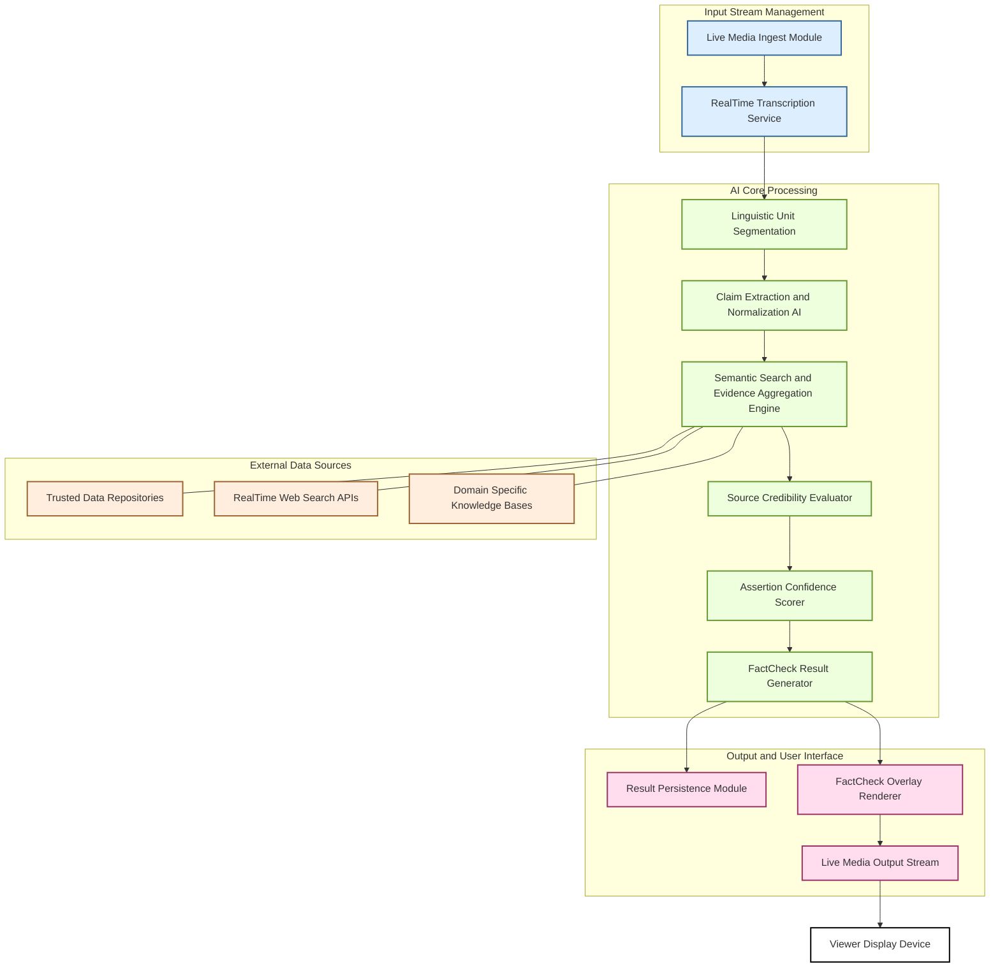

**Title of Invention:** A System and Method for Real-Time AI Fact-Checking of Live Transcripts with Algorithmic Verification Confidence

**Abstract:**
A robust system and method for real-time fact-checking of live-streamed content are disclosed. The system precisely ingests live audio or video streams and corresponding real-time transcripts. Critical to its operation, as new linguistic units such as sentences or key phrases are transcribed, they are rigorously analyzed by a sophisticated Generative AI Core. This AI Core is engineered to identify specific verifiable assertions or claims within the linguistic unit, subsequently initiating a rapid, multi-source external data verification process. This process leverages an optimized algorithmic framework encompassing claim decomposition, source credibility scoring, and evidence aggregation, culminating in an assertion confidence metric. The system dynamically generates and overlays a "Fact Check" indicator on the live stream, categorizing the claim's veracity as True, False, Partially True, Unverified, or Misleading, accompanied by a quantifiable confidence score and direct links to primary evidence sources. This approach provides a mathematically grounded framework for real-time information validation, moving beyond simple lookups to include sophisticated probabilistic and logical inference.

**System Architecture Overview:**

The RealTimeFactCheck system comprises several interconnected modules operating in a low-latency pipeline to ensure immediate processing and display of verification results.

**Detailed Description:**

The system initiates operation by receiving a continuous live media input stream. This stream is processed by the **Live Media Ingest Module**, which handles various input formats and protocols. The ingested media is then forwarded to a **RealTime Transcription Service**, which converts spoken audio into a textual transcript in near instantaneous fashion.

As the transcript is generated, individual textual units, typically sentences or semantically complete phrases, are identified by the **Linguistic Unit Segmentation** component. These segments are then transmitted to the **Claim Extraction and Normalization AI**. This advanced AI component, leveraging natural language understanding NLU and named entity recognition NER, parses the linguistic unit to identify explicit and implicit verifiable claims. For example, from "Our economy grew by 5% last year," it extracts the structured claim `[subject: economy, predicate: grew_by, value: 5%, timeframe: last_year]`. This structured representation facilitates unambiguous querying.

The structured claims are then passed to the **Semantic Search and Evidence Aggregation Engine**. This engine concurrently queries multiple external data sources, including **Trusted Data Repositories** (e.g., government statistical agencies, peer-reviewed scientific databases), **RealTime Web Search APIs** (for broader context and news, filtered for reliability), and **Domain Specific Knowledge Bases** (e.g., medical journals, legal databases). The engine employs sophisticated semantic matching algorithms to retrieve relevant evidence, not just keyword matches.

Simultaneously, the **Source Credibility Evaluator** assigns a dynamic credibility score to each piece of retrieved evidence based on source reputation, publication date, methodological rigor, peer review status, and historical accuracy performance. This score is a real-valued function `S(source_url, timestamp)` that quantifies trustworthiness.

The retrieved evidence, along with their associated source credibility scores, are then fed into the **Assertion Confidence Scorer**. This module employs a multi-variate probabilistic model to assess the veracity of the initial claim. It considers the consistency of evidence, the aggregate credibility of supporting versus contradicting sources, and the statistical significance of discrepancies. The output is a multi-modal truth value (e.g., True, False, Partially True, Unverified, Misleading) coupled with a quantitative confidence score, represented as a probability `P(claim_is_true | evidence)`.

Finally, the **FactCheck Result Generator** compiles the verdict, confidence score, and primary source links. This consolidated result is passed to the **Result Persistence Module** for archival and historical analysis. Critically for the real-time experience, the result is sent to the **FactCheck Overlay Renderer**. This renderer dynamically creates a graphical overlay containing the fact-check verdict, confidence, and source information, which is then composited onto the original **Live Media Output Stream**. This augmented stream is then presented to the **Viewer Display Device** in near real-time, typically within milliseconds of the claim being uttered.

**Formal Verification Algorithmic Framework:**

This invention introduces a mathematically robust framework for real-time claim verification, providing an "overstanding" of the problem space through quantifiable metrics and probabilistic reasoning.

1.  **Claim Formalization CF:**
    Let `L` be a linguistic unit extracted from the transcript. The **Claim Extraction and Normalization AI** performs a mapping `f_CF : L -> C_s`, where `C_s` is a set of structured claims. Each claim `c_i ∈ C_s` is represented as a tuple `c_i = (E_i, P_i, V_i, T_i)`, where `E_i` is an entity, `P_i` is a property or predicate, `V_i` is a value, and `T_i` is a temporal or contextual frame.
    Example: `L = "Our economy grew by 5% last year."` becomes `c_1 = (economy, growth_rate, 5%, last_year)`.

2.  **Evidence Aggregation EA:**
    For each claim `c_i`, the **Semantic Search and Evidence Aggregation Engine** retrieves a set of evidence items `D_i = {d_{ij}}`. Each `d_{ij}` is a data point from an external source, containing relevant information to `c_i`.
    `f_EA : (c_i, {SourceAPI_k}) -> D_i`.

3.  **Source Credibility Scoring SCS:**
    Each source `s_k` from which `d_{ij}` originates is assigned a credibility score `C_k ∈ [0, 1]` by the **Source Credibility Evaluator**. This score is derived from an accumulated history of accuracy, editorial standards, and expert consensus.
    `f_SCS : s_k -> C_k`.
    The credibility of an individual evidence item `d_{ij}` is `cred(d_{ij}) = C_{source(d_{ij})} * freshness_factor(d_{ij})`.

4.  **Assertion Confidence Metric ACM:**
    The core mathematical innovation lies in the **Assertion Confidence Scorer**. For a given claim `c_i` and its evidence set `D_i`, we define a probabilistic confidence `P(c_i | D_i)`.
    Let `D_i^+= {d_{ij} ∈ D_i | d_{ij} supports c_i}` and `D_i^-= {d_{ij} ∈ D_i | d_{ij} contradicts c_i}`.
    The aggregate support for `c_i` is `A^+ = Σ_{d ∈ D_i^+} cred(d) * match_strength(c_i, d)`.
    The aggregate contradiction for `c_i` is `A^- = Σ_{d ∈ D_i^-} cred(d) * match_strength(c_i, d)`.
    `match_strength` is a semantic similarity function `[0, 1]`.

    The `RawConfidence` for `c_i` is a function `g(A^+, A^-)`.
    One formulation for `RawConfidence` could be:
    `RawConfidence(c_i) = (A^+ - A^-) / (A^+ + A^- + ε)` where `ε` is a small constant to prevent division by zero. This yields a score in `[-1, 1]`.

    This `RawConfidence` is then mapped to a `TruthValue ∈ {True, False, Partially True, Unverified, Misleading}` and a final `ConfidenceScore ∈ [0, 1]`.
    For example:
    *   If `RawConfidence > θ_true` and `A^+` is significant: `TruthValue = True, ConfidenceScore = RawConfidence`.
    *   If `RawConfidence < θ_false` and `A^-` is significant: `TruthValue = False, ConfidenceScore = |RawConfidence|`.
    *   If `|RawConfidence| < θ_unverified` or `A^+ + A^-` is insufficient: `TruthValue = Unverified, ConfidenceScore = 0.5`.
    *   If `A^+ > 0` and `A^- > 0` but `A^+` is slightly dominant: `TruthValue = Partially True`.

    This framework allows for a nuanced, non-binary assessment, reflecting real-world information complexity. The thresholds `θ_true, θ_false, θ_unverified` are dynamically tuned based on domain and context.

5.  **RealTime Latency Constraint RTC:**
    The entire process `T_total = T_ingest + T_transcribe + T_segment + T_claim_extract + T_search + T_credibility + T_score + T_render`.
    The system is optimized to ensure `T_total < T_max_response`, where `T_max_response` is typically set to 200-500 milliseconds for perceptibly real-time feedback. This is achieved through parallel processing, optimized data structures, and highly efficient AI models.
    `T_total = Σ_{j=1}^{N_steps} T_j`, where `T_j` is the processing time for step `j`. We aim to minimize `T_total` under the constraint of accuracy `ACC(TruthValue, ConfidenceScore) > ACC_min`.

**Claims:**

1.  A method for real-time fact-checking of live-streamed content, comprising:
    a.  Receiving a continuous live media input stream.
    b.  Generating a real-time text transcript from said live media input stream.
    c.  Segmenting said real-time text transcript into discrete linguistic units.
    d.  Transmitting said linguistic units to a **Claim Extraction and Normalization AI** for identifying and structuring verifiable assertions as formalized claims.
    e.  Concurrently executing a multi-source evidence retrieval process via a **Semantic Search and Evidence Aggregation Engine**, using said formalized claims to query external data repositories.
    f.  Dynamically evaluating the credibility of each retrieved external data source using a **Source Credibility Evaluator** to generate a credibility score for each piece of evidence.
    g.  Applying a **Assertion Confidence Scorer** that utilizes a probabilistic model to assess the veracity of each formalized claim by aggregating supporting and contradicting evidence weighted by their respective source credibility scores and semantic match strengths, thereby generating a multi-modal truth value and a quantitative confidence score.
    h.  Compiling the truth value, confidence score, and primary source links into a fact-check result.
    i.  Rendering a visual fact-check overlay comprising said fact-check result onto a live media output stream.
    j.  Displaying said live media output stream with said overlay to a viewer in near real-time, where the total processing latency from linguistic unit identification to display is below a predefined threshold.

2.  The method of claim 1, wherein the formalized claims are represented as tuples comprising at least an entity, a property, a value, and a temporal or contextual frame.

3.  The method of claim 1, wherein the external data repositories include at least one of trusted government statistical agencies, peer-reviewed scientific databases, real-time web search APIs, and domain specific knowledge bases.

4.  The method of claim 1, wherein the source credibility score is derived from historical accuracy, editorial standards, and an accumulated reputation metric.

5.  The method of claim 1, wherein the probabilistic model for assertion confidence accounts for the consistency of evidence, the aggregate credibility of supporting versus contradicting sources, and the statistical significance of observed discrepancies.

6.  The method of claim 1, wherein the multi-modal truth value categorizes claims as at least one of True, False, Partially True, Unverified, or Misleading.

7.  The method of claim 1, further comprising a **Result Persistence Module** for archiving all fact-check results, associated evidence, and confidence scores for historical analysis and model retraining.

8.  A system for real-time fact-checking of live-streamed content, comprising:
    a.  A **Live Media Ingest Module** configured to receive and process a continuous live media input stream.
    b.  A **RealTime Transcription Service** coupled to the Live Media Ingest Module, configured to generate a real-time text transcript.
    c.  A **Linguistic Unit Segmentation** component coupled to the RealTime Transcription Service, configured to identify discrete linguistic units within the transcript.
    d.  A **Claim Extraction and Normalization AI** coupled to the Linguistic Unit Segmentation component, configured to identify and structure verifiable assertions as formalized claims from said linguistic units.
    e.  A **Semantic Search and Evidence Aggregation Engine** coupled to the Claim Extraction and Normalization AI and to a plurality of external data repositories, configured to retrieve evidence relevant to the formalized claims.
    f.  A **Source Credibility Evaluator** coupled to the Semantic Search and Evidence Aggregation Engine, configured to assign credibility scores to retrieved evidence sources.
    g.  An **Assertion Confidence Scorer** coupled to the Semantic Search and Evidence Aggregation Engine and the Source Credibility Evaluator, configured to compute a multi-modal truth value and a quantitative confidence score for each formalized claim based on aggregated evidence and source credibility.
    h.  A **FactCheck Result Generator** coupled to the Assertion Confidence Scorer, configured to compile fact-check results.
    i.  A **FactCheck Overlay Renderer** coupled to the FactCheck Result Generator, configured to generate a visual overlay of the fact-check results onto the live media output stream.
    j.  An output interface configured to transmit the live media output stream with the rendered overlay to a viewer display device, maintaining a total system latency below a critical threshold for real-time user perception.

9.  The system of claim 8, wherein the Claim Extraction and Normalization AI utilizes natural language understanding NLU and named entity recognition NER techniques.

10. The system of claim 8, further comprising an **Algorithmic Framework for Formal Verification** defining the mathematical operations for claim formalization, evidence aggregation, source credibility scoring, and assertion confidence metric calculation.

11. The system of claim 10, wherein the Assertion Confidence Scorer calculates confidence based on `RawConfidence(c_i) = (A^+ - A^-) / (A^+ + A^- + ε)`, where `A^+` is aggregate supporting evidence, `A^-` is aggregate contradicting evidence, and `ε` is a small constant.

12. The system of claim 8, wherein the critical latency threshold is less than 500 milliseconds.