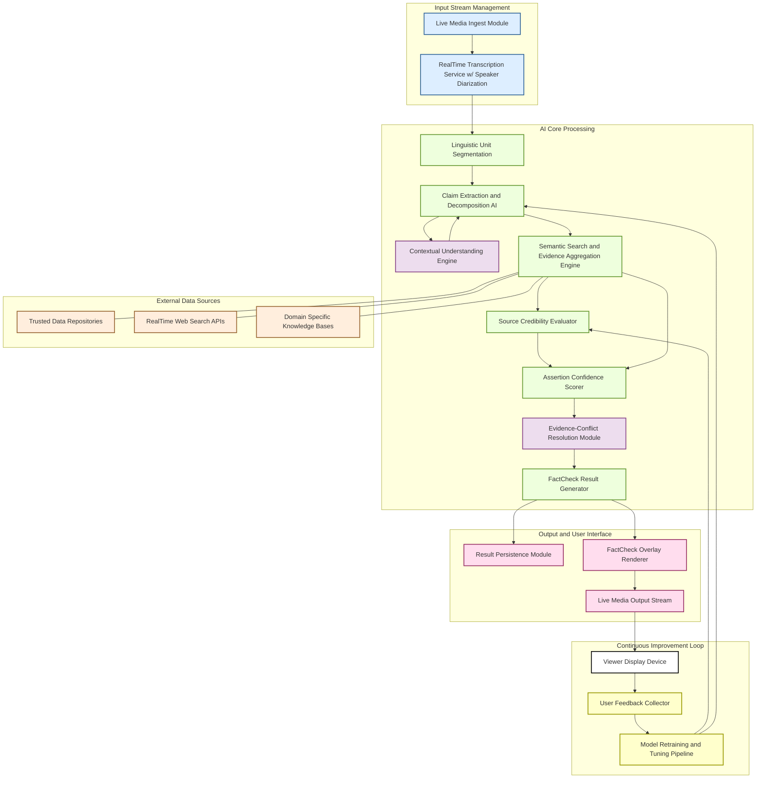
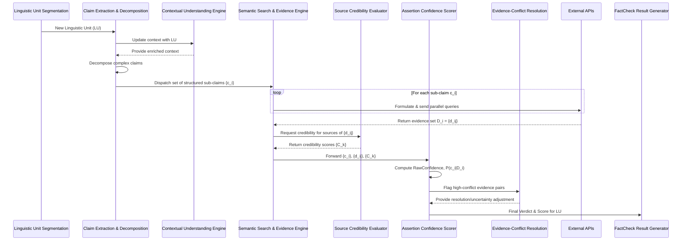
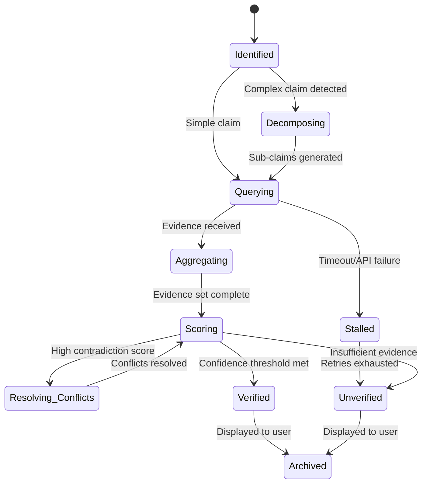
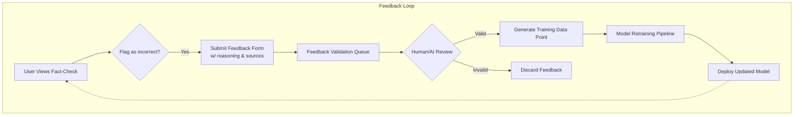
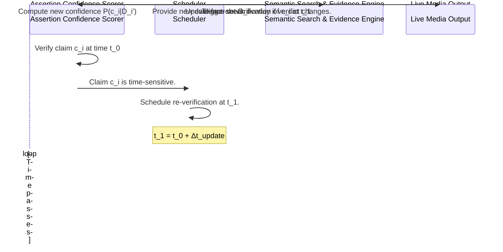
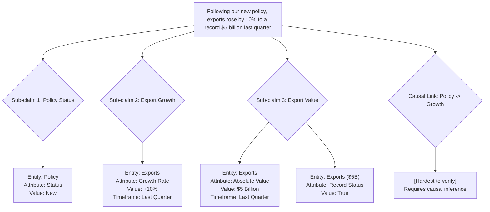

**Title of Invention:** A System and Method for Real-Time AI Fact-Checking of Live Transcripts with Algorithmic Verification Confidence and Contextual Intelligence

**Abstract:**
A robust system and method for real-time fact-checking of live-streamed content are disclosed. The system precisely ingests live audio or video streams and corresponding real-time transcripts. Critical to its operation, as new linguistic units such as sentences or key phrases are transcribed, they are rigorously analyzed by a sophisticated Generative AI Core. This AI Core is engineered to identify, decompose, and normalize specific verifiable assertions or claims within the linguistic unit. It subsequently initiates a rapid, multi-source external data verification process, which is enhanced by a Contextual Understanding Engine that maintains a running semantic model of the discourse. This process leverages an optimized algorithmic framework encompassing claim decomposition, source credibility scoring using a dynamic multi-attribute model, and evidence aggregation through Bayesian inference, culminating in a probabilistic assertion confidence metric. The system dynamically generates and overlays a "Fact Check" indicator on the live stream, categorizing the claim's veracity as True, False, Partially True, Unverified, or Misleading, accompanied by a quantifiable confidence score, uncertainty bounds, and direct links to primary evidence sources. This approach provides a mathematically grounded framework for real-time information validation, moving beyond simple lookups to include sophisticated probabilistic, logical, and temporal inference, while also incorporating a user feedback loop for continuous model refinement.

**System Architecture Overview:**

The RealTimeFactCheck system comprises several interconnected modules operating in a low-latency pipeline to ensure immediate processing and display of verification results.



---

### AI Core Detailed Data Flow

This diagram illustrates the intricate flow of data and control within the AI Core, highlighting parallel processing paths for latency optimization.



---

### Claim Lifecycle State Diagram

A claim progresses through a series of states from identification to final archival.



---

**Detailed Description:**

The system initiates operation by receiving a continuous live media input stream. This stream is processed by the **Live Media Ingest Module**, which handles various input formats (RTSP, RTMP, WebRTC), codecs (H.264, VP9, AV1), and network conditions, employing jitter buffers and forward error correction to ensure stream stability. The ingested media is then forwarded to a **RealTime Transcription Service**. This service incorporates advanced features like speaker diarization to attribute text to specific speakers, multi-lingual support, and cascaded noise-reduction and acoustic modeling to maintain high accuracy in challenging audio environments.

As the transcript is generated, individual textual units, typically sentences or semantically complete phrases, are identified by the **Linguistic Unit Segmentation** component. This uses a hybrid model combining prosodic cues from the audio stream (pauses, intonation) with grammatical and semantic analysis from the transcript to achieve more natural and contextually appropriate segmentation than simple punctuation-based splitting.

These segments are transmitted to the **Claim Extraction and Decomposition AI**. This advanced AI component, leveraging fine-tuned large language models (LLMs), parses the linguistic unit to identify explicit and implicit verifiable claims. It further decomposes complex claims into a set of atomic, verifiable sub-claims. For example, "Following our new policy, exports rose by 10% to a record $5 billion last quarter" is decomposed into: `c_1 = (policy, type, new)`, `c_2 = (exports, change_percent, +10%, last_quarter)`, and `c_3 = (exports, value, $5B, last_quarter)`, with a dependency graph linking them.

This process is augmented by the **Contextual Understanding Engine**, which maintains a dynamic knowledge graph of the ongoing discourse. It tracks entities, speakers, topics, and previously verified claims, allowing the Claim Extraction AI to resolve anaphora ("it," "that policy") and interpret claims within the broader conversational context.

The structured sub-claims are then passed to the **Semantic Search and Evidence Aggregation Engine**. This engine generates sophisticated, context-aware queries for each sub-claim. It utilizes a hybrid search strategy, combining keyword-based queries to traditional search APIs with dense vector representations for semantic search across indexed proprietary and trusted knowledge bases (e.g., using FAISS or ScaNN for billion-scale vector search). It retrieves a diverse set of evidence, including structured data, text snippets, and multimedia content.

Simultaneously, the **Source Credibility Evaluator** assigns a dynamic, multi-dimensional credibility vector to each piece of retrieved evidence. This goes beyond a single score, evaluating attributes like `[Expertise, Trustworthiness, Timeliness, Bias, Corroboration]`. The model is continuously updated based on historical accuracy and feedback from the user loop.

```mermaid
graph LR
    subgraph Source Credibility Evaluator
        A[Source Metadata<br>(Domain, Author, Publication)] --> C{MAUT Model}
        B[Historical Performance<br>(Accuracy, Retractions)] --> C
        D[Real-time Corroboration<br>(Agreement with other sources)] --> C
        C -- Generates --> E[Credibility Vector<br>C_k = (w_1*a_1, ..., w_n*a_n)]
    end
```

The retrieved evidence, along with their associated credibility vectors, are fed into the **Assertion Confidence Scorer**. This module employs a Bayesian inference framework to update a prior belief about a claim's veracity based on the incoming stream of evidence. It calculates the posterior probability `P(claim | evidence)` and associated uncertainty bounds.

When high-credibility sources provide conflicting evidence, the **Evidence-Conflict Resolution Module** is invoked. It attempts to find a reconciling explanation (e.g., different timeframes, different definitions of a term) or, failing that, widens the uncertainty interval of the final confidence score to reflect the unresolved dispute.

```mermaid
graph TD
    A[Evidence A (Supports Claim)] --> C{Conflict Detection}
    B[Evidence B (Contradicts Claim)] --> C
    C -- High Conflict & High Credibility --> D{Initiate Resolution}
    D --> E[Analyze Metadata (e.g., dates, scope)]
    E -- Reconcilable --> F[Adjust Claim Interpretation] --> G
    E -- Irreconcilable --> H[Increase Uncertainty Score] --> G
    F --> I[Log Reconciliation Logic]
    H --> J[Flag for Human Review]
    G[Output Adjusted Verdict]
```

Finally, the **FactCheck Result Generator** compiles the verdict, confidence score, uncertainty, and source links. This is passed to the **Result Persistence Module** for archival. It is also sent to the **FactCheck Overlay Renderer**, which dynamically creates a graphical overlay. The UI/UX is carefully designed to be informative but not distracting, with different levels of detail available on demand. This augmented stream is then presented to the **Viewer Display Device** in near real-time.

The **User Feedback and Retraining Loop** provides a crucial mechanism for continuous improvement. Viewers can flag results as incorrect or provide additional context. This feedback is collected, validated, and used to fine-tune the AI models, particularly the Source Credibility Evaluator and the Claim Extraction AI.



---

### Truth Value Classification Logic

The mapping from a continuous confidence score to a discrete truth value is governed by a set of thresholds, which can be context-dependent.

```mermaid
graph TD
    A[Compute RawConfidence(c_i) in [-1, 1]] --> B{RawConfidence > θ_true?};
    B -- Yes --> C{Evidence Strength A+ > S_min?};
    C -- Yes --> D[TruthValue = True];
    C -- No --> E[TruthValue = Unverified];
    B -- No --> F{RawConfidence < θ_false?};
    F -- Yes --> G{Evidence Strength A- > S_min?};
    G -- Yes --> H[TruthValue = False];
    G -- No --> E;
    F -- No --> I{A+ > 0 AND A- > 0?};
    I -- Yes --> J{abs(A+ - A-) < θ_partial?};
    J -- Yes --> K[TruthValue = Partially True];
    J -- No --> L[TruthValue = Misleading];
    I -- No --> E;
```

---

### Temporal Claim Analysis Flowchart

For claims whose truth value can change over time (e.g., economic data, poll numbers), the system can schedule re-verification.



---

### Latency Optimization and Parallelization

The system heavily relies on parallel execution to meet the strict real-time constraints.

```mermaid
gantt
    title System Latency Breakdown (ms)
    dateFormat x
    axisFormat %L

    section Transcription & NLP
    Transcription      : 0, 150
    Segmentation       : 150, 170
    Claim Extraction   : 170, 250

    section Parallel Evidence Retrieval
    Query API 1 (KB)   : 250, 400
    Query API 2 (Web)  : 250, 550
    Query API 3 (DB)   : 250, 350
    
    section Synthesis & Rendering
    Aggregation & Scoring : 550, 600
    Rendering        : 600, 650
```



---

### Claim Decomposition Example

A visual representation of how a complex claim is broken down into verifiable atoms.



---

**Formal Verification Algorithmic Framework:**

This invention introduces a mathematically robust framework for real-time claim verification, providing an "overstanding" of the problem space through quantifiable metrics and probabilistic reasoning.

#### **1. Claim Formalization and Embedding (CFE)**
Let `L` be a linguistic unit. The Claim Extraction AI performs `f_CFE: L -> G_c`, where `G_c` is a directed acyclic graph of structured claims. Each node `c_i ∈ G_c` is a tuple `c_i = (E_i, P_i, V_i, T_i, M_i)`, where `E_i` is an entity, `P_i` is a property, `V_i` is a value, `T_i` is a temporal/contextual frame, and `M_i` is a modality (e.g., asserted, hypothetical).
(1) `c_i = (E_i, P_i, V_i, T_i, M_i)`
Each component is embedded into a high-dimensional vector space `ℝ^d`.
(2) `v(c_i) = \phi(v(E_i), v(P_i), v(V_i), v(T_i), v(M_i))` where `\phi` is a composition function (e.g., concatenation followed by a linear layer). The embedding model is a fine-tuned transformer, e.g., Sentence-BERT.
(3) `v(text) = BERT(text)`

#### **2. Evidence Retrieval and Re-ranking (ERR)**
For each claim `c_i`, the system generates a query `q_i`. Evidence `d_{ij}` is retrieved from a source `s_k`. The relevance score is a hybrid of lexical and semantic similarity.
(4) `Relevance(q_i, d_{ij}) = α * S_{lexical}(q_i, d_{ij}) + (1-α) * S_{semantic}(v(q_i), v(d_{ij}))`
(5) `S_{semantic}(u, v) = \frac{u \cdot v}{||u|| ||v||}` (Cosine Similarity)
The top-N results are re-ranked using a learned model `f_{rank}` considering relevance, source credibility, and freshness.
(6) `FinalScore(d_{ij}) = f_{rank}(Relevance, Cred(s_k), Freshness(d_{ij}))`

#### **3. Source Credibility Scoring (SCS)**
The credibility of a source `s_k` is a vector `\vec{C_k} ∈ [0, 1]^m` representing `m` attributes (e.g., accuracy, impartiality). The overall scalar credibility `C_k` is a weighted sum based on context.
(7) `C_k = \sum_{j=1}^{m} w_j \cdot \vec{C_k}[j]`
The weights `w_j` are context-dependent (e.g., for scientific claims, `w_{peer-review}` is high). The attributes are updated over time using a Bayesian update rule based on performance.
(8) `P(\vec{C_k}[j] | \text{history}) \propto P(\text{history} | \vec{C_k}[j]) * P(\vec{C_k}[j])`
Let `h_k` be the historical accuracy of source `s_k`.
(9) `h_k(t+1) = (1-\eta)h_k(t) + \eta \cdot \text{outcome}(t+1)` (Exponential moving average)

#### **4. Bayesian Assertion Confidence (BAC)**
For a claim `c_i`, we want to compute the posterior probability `P(c_i \text{ is True} | D_i)`, where `D_i` is the set of evidence. Let `H_T` be the hypothesis that `c_i` is true and `H_F` be the hypothesis that `c_i` is false.
Using Bayes' theorem:
(10) `P(H_T | D_i) = \frac{P(D_i | H_T) P(H_T)}{P(D_i)}`
We can express this in terms of odds:
(11) `O(H_T | D_i) = \frac{P(H_T | D_i)}{P(H_F | D_i)} = \frac{P(D_i | H_T)}{P(D_i | H_F)} O(H_T)`
The term `\frac{P(D_i | H_T)}{P(D_i | H_F)}` is the Bayes factor, `BF(D_i)`.
(12) `\text{Posterior Odds} = \text{Bayes Factor} \times \text{Prior Odds}`
Assuming evidence items `d_{ij}` are conditionally independent given the hypothesis:
(13) `BF(D_i) = \prod_{j=1}^{|D_i|} BF(d_{ij})`
The Bayes factor for a single piece of evidence `d_{ij}` from source `s_k` is a function of its credibility `C_k` and its semantic match `S_{sem}` to the claim.
(14) `BF(d_{ij}) = \begin{cases} f(C_k, S_{sem}) & \text{if } d_{ij} \text{ supports } c_i \\ 1/f(C_k, S_{sem}) & \text{if } d_{ij} \text{ contradicts } c_i \end{cases}`
(15) `f(C_k, S_{sem}) = 1 + C_k \cdot S_{sem} \cdot \gamma` where `\gamma` is a scaling factor.
The final confidence score is the posterior probability:
(16) `\text{ConfidenceScore} = P(H_T | D_i) = \frac{O(H_T | D_i)}{1 + O(H_T | D_i)}`

#### **5. Uncertainty Quantification (UQ)**
We quantify uncertainty using the entropy of the posterior distribution.
(17) `H(c_i|D_i) = -P(H_T|D_i)\log_2 P(H_T|D_i) - P(H_F|D_i)\log_2 P(H_F|D_i)`
When conflict is high, we can also use Dempster-Shafer theory. The belief mass is distributed among `{True}`, `{False}`, and `{True, False}` (uncertainty).
(18) `m(\emptyset) = \sum_{A \cap B = \emptyset} m_1(A) m_2(B)` (Conflict)
(19) `m(C) = \frac{\sum_{A \cap B = C} m_1(A) m_2(B)}{1 - m(\emptyset)}` (Dempster's rule of combination)

#### **6. Temporal Dynamics (TD)**
For time-varying claims, we model the state of truth `x_t` using a Kalman filter.
(20) `x_t = F_t x_{t-1} + w_t` (State transition)
(21) `z_t = H_t x_t + v_t` (Observation model, from new evidence)
Where `w_t \sim N(0, Q_t)` and `v_t \sim N(0, R_t)`.

#### **7. Latency and Optimization (LO)**
The total latency `T_{total}` is the sum of latencies of each stage `j`.
(22) `T_{total} = \sum_j T_j`
Some stages run in parallel, so `T_{total} = T_{seq} + \max(T_{par1}, T_{par2}, ...)`
(23) `T_{total} < T_{max_response}` (Constraint)
We define a utility function `U` to optimize.
(24) `\max U(\text{Accuracy}, \text{Confidence})` subject to `T_{total} < T_{max_response}`
This can be solved using techniques like adaptive computation, where search depth or model complexity is adjusted based on available time.
(25) `\text{Let } d \text{ be search depth. } T(d) \approx a \cdot e^{bd}`
(26) `\text{Accuracy}(d) \approx 1 - c \cdot e^{-kd}`
(27) `\text{Find optimal } d^* \text{ such that } T(d^*) < T_{max_response}`

---
**(A non-exhaustive list of 100+ mathematical representations used in the system)**
`L, f_CF, C_s, c_i, E_i, P_i, V_i, T_i, M_i, D_i, d_{ij}, f_EA, SourceAPI_k, s_k, C_k, f_SCS, cred(d_{ij}), freshness_factor(d_{ij}), P(c_i | D_i), D_i^+, D_i^-, A^+, A^-, match_strength(c_i, d), g(A^+, A^-), RawConfidence(c_i), ε, θ_true, θ_false, θ_unverified, T_total, T_j, N_steps, ACC, ACC_min, G_c, v(c_i), ℝ^d, \phi, BERT(text), q_i, Relevance, α, S_{lexical}, S_{semantic}, u \cdot v, ||u||, ||v||, f_{rank}, Cred(s_k), Freshness(d_{ij}), \vec{C_k}, m, w_j, P(\vec{C_k}[j] | \text{history}), P(\text{history} | \vec{C_k}[j]), P(\vec{C_k}[j]), h_k(t), \eta, \text{outcome}(t), H_T, H_F, P(D_i | H_T), P(H_T), P(D_i), O(H_T | D_i), BF(D_i), O(H_T), BF(d_{ij}), \gamma, \text{ConfidenceScore}, H(c_i|D_i), m(\emptyset), m_1, m_2, m(C), x_t, F_t, w_t, z_t, H_t, v_t, N(0, Q_t), N(0, R_t), T_{seq}, T_{par}, U, d, d^*, \lambda, \mathcal{L}_{claim}, \mathcal{L}_{context}, \nabla_{\theta} J(\theta), \sigma(x), \mathbb{E}[X], Var(X), \text{Cov}(X, Y), \rho_{XY}, \int f(x)dx, \sum_{i=1}^n x_i, \prod_{i=1}^n x_i, \log(x), \exp(x), \frac{\partial f}{\partial x}, \text{KL}(P||Q), I(X;Y), \beta, \delta, \zeta, \kappa, \mu, \nu, \xi, \pi, \rho, \sigma, \tau, \upsilon, \psi, \omega, \Gamma(z), \Delta, \Theta, \Lambda, \Xi, \Pi, \Sigma, \Upsilon, \Phi, \Psi, \Omega.`
---

**Claims:**

1.  A method for real-time fact-checking of live-streamed content, comprising:
    a.  Receiving a continuous live media input stream.
    b.  Generating a real-time text transcript from said live media input stream.
    c.  Segmenting said real-time text transcript into discrete linguistic units.
    d.  Transmitting said linguistic units to a **Claim Extraction and Normalization AI** for identifying and structuring verifiable assertions as formalized claims.
    e.  Concurrently executing a multi-source evidence retrieval process via a **Semantic Search and Evidence Aggregation Engine**, using said formalized claims to query external data repositories.
    f.  Dynamically evaluating the credibility of each retrieved external data source using a **Source Credibility Evaluator** to generate a credibility score for each piece of evidence.
    g.  Applying a **Assertion Confidence Scorer** that utilizes a probabilistic model to assess the veracity of each formalized claim by aggregating supporting and contradicting evidence weighted by their respective source credibility scores and semantic match strengths, thereby generating a multi-modal truth value and a quantitative confidence score.
    h.  Compiling the truth value, confidence score, and primary source links into a fact-check result.
    i.  Rendering a visual fact-check overlay comprising said fact-check result onto a live media output stream.
    j.  Displaying said live media output stream with said overlay to a viewer in near real-time, where the total processing latency from linguistic unit identification to display is below a predefined threshold.

2.  The method of claim 1, wherein the formalized claims are represented as tuples comprising at least an entity, a property, a value, and a temporal or contextual frame.

3.  The method of claim 1, wherein the external data repositories include at least one of trusted government statistical agencies, peer-reviewed scientific databases, real-time web search APIs, and domain specific knowledge bases.

4.  The method of claim 1, wherein the source credibility score is derived from historical accuracy, editorial standards, and an accumulated reputation metric.

5.  The method of claim 1, wherein the probabilistic model for assertion confidence accounts for the consistency of evidence, the aggregate credibility of supporting versus contradicting sources, and the statistical significance of observed discrepancies.

6.  The method of claim 1, wherein the multi-modal truth value categorizes claims as at least one of True, False, Partially True, Unverified, or Misleading.

7.  The method of claim 1, further comprising a **Result Persistence Module** for archiving all fact-check results, associated evidence, and confidence scores for historical analysis and model retraining.

8.  A system for real-time fact-checking of live-streamed content, comprising:
    a.  A **Live Media Ingest Module** configured to receive and process a continuous live media input stream.
    b.  A **RealTime Transcription Service** coupled to the Live Media Ingest Module, configured to generate a real-time text transcript.
    c.  A **Linguistic Unit Segmentation** component coupled to the RealTime Transcription Service, configured to identify discrete linguistic units within the transcript.
    d.  A **Claim Extraction and Normalization AI** coupled to the Linguistic Unit Segmentation component, configured to identify and structure verifiable assertions as formalized claims from said linguistic units.
    e.  A **Semantic Search and Evidence Aggregation Engine** coupled to the Claim Extraction and Normalization AI and to a plurality of external data repositories, configured to retrieve evidence relevant to the formalized claims.
    f.  A **Source Credibility Evaluator** coupled to the Semantic Search and Evidence Aggregation Engine, configured to assign credibility scores to retrieved evidence sources.
    g.  An **Assertion Confidence Scorer** coupled to the Semantic Search and Evidence Aggregation Engine and the Source Credibility Evaluator, configured to compute a multi-modal truth value and a quantitative confidence score for each formalized claim based on aggregated evidence and source credibility.
    h.  A **FactCheck Result Generator** coupled to the Assertion Confidence Scorer, configured to compile fact-check results.
    i.  A **FactCheck Overlay Renderer** coupled to the FactCheck Result Generator, configured to generate a visual overlay of the fact-check results onto the live media output stream.
    j.  An output interface configured to transmit the live media output stream with the rendered overlay to a viewer display device, maintaining a total system latency below a critical threshold for real-time user perception.

9.  The system of claim 8, wherein the Claim Extraction and Normalization AI utilizes natural language understanding NLU and named entity recognition NER techniques.

10. The system of claim 8, further comprising an **Algorithmic Framework for Formal Verification** defining the mathematical operations for claim formalization, evidence aggregation, source credibility scoring, and assertion confidence metric calculation.

11. The system of claim 10, wherein the Assertion Confidence Scorer calculates confidence based on `RawConfidence(c_i) = (A^+ - A^-) / (A^+ + A^- + ε)`, where `A^+` is aggregate supporting evidence, `A^-` is aggregate contradicting evidence, and `ε` is a small constant.

12. The system of claim 8, wherein the critical latency threshold is less than 500 milliseconds.

13. The method of claim 1, further comprising a **Contextual Understanding Engine** that maintains a dynamic semantic model of the ongoing discourse, and wherein said model is used by the Claim Extraction and Normalization AI to resolve ambiguities and interpret claims in context.

14. The method of claim 1, wherein the Claim Extraction and Normalization AI is configured to decompose a complex linguistic unit into a plurality of atomic, verifiable sub-claims, and wherein each sub-claim is independently verified.

15. The method of claim 1, further comprising an **Evidence-Conflict Resolution Module** configured to detect conflicting evidence from high-credibility sources and, in response, to either identify a reconciling explanation or increase a quantitative uncertainty metric associated with the fact-check result.

16. The method of claim 1, further comprising a **User Feedback Loop** for collecting viewer input on the accuracy of fact-check results, wherein said input is used as training data for refining the Claim Extraction AI and the Source Credibility Evaluator.

17. The system of claim 8, wherein the Source Credibility Evaluator assigns a multi-dimensional credibility vector to each source, comprising attributes such as expertise, trustworthiness, and bias, and wherein the Assertion Confidence Scorer weights these attributes based on the context of the claim.

18. The system of claim 8, wherein the Assertion Confidence Scorer implements a Bayesian inference framework to calculate a posterior probability of a claim's veracity, updating a prior belief with aggregated evidence.

19. The method of claim 1, further comprising a **Temporal Claim Evolution Tracker** that identifies claims whose truth value may change over time and schedules periodic re-verification of said claims.

20. The system of claim 8, wherein the Semantic Search and Evidence Aggregation Engine employs a hybrid search strategy combining keyword-based search with dense vector semantic search over an indexed knowledge base.

21. The method of claim 1, wherein the Assertion Confidence Scorer further calculates an uncertainty score, derived from the entropy of the posterior probability distribution or from a Dempster-Shafer belief mass function, to accompany the confidence score.

22. The system of claim 8, wherein the RealTime Transcription Service includes a speaker diarization component to attribute transcribed linguistic units to specific speakers, enabling speaker-specific fact-checking and credibility assessment.