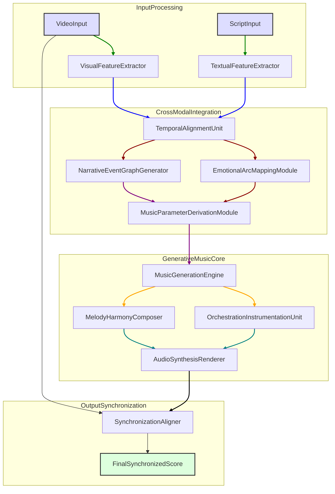

**Title of Invention:** A System and Method for Generative Film Scoring from Video and Script Analysis

**Abstract:**
A system for automated film and video scoring is disclosed. The system ingests a video clip and its corresponding script or scene description. A multi-modal AI model analyzes the visual content pacing, color, action and the script's emotional tone. Based on this analysis, it generates a custom, perfectly synchronized musical score that matches the scene's dynamic emotional arc.

**Detailed Description:**
A film editor uploads a 2-minute scene of a car chase. The AI analyzes the video, noting the fast cuts and high motion. It analyzes the script, noting the dialogue is tense. It is prompted to "Generate a tense, high-BPM, orchestral score that builds to a crescendo as the car goes over the bridge at 01:32." The AI music model generates an audio track where the musical climax is perfectly timed to the key moment in the video.

The core of this invention lies in its advanced multi-modal AI architecture. Upon ingestion, video data undergoes frame-by-frame analysis by a Visual Feature Extractor, which identifies scene changes, motion vectors, object presence and interaction, color palettes, and lighting conditions. Concurrently, the script or scene text is processed by a Natural Language Understanding NLU module. This NLU component extracts emotional valence, key narrative beats, character sentiment, and plot progression markers.

These distinct visual and textual feature sets are then fed into a Cross-Modal Fusion module. This module employs attention mechanisms to weigh the relative importance of visual and textual cues at different points in time, constructing a unified temporal emotional and narrative arc representation. This fused representation serves as a rich contextual input for the Music Generation Engine.

The Music Generation Engine, built upon advanced generative models such as Transformer networks or Variational Autoencoders VAEs, synthesizes musical sequences. It considers parameters like instrumentation, tempo BPM, key, harmonic progression, and melodic contour, all derived directly from the fused emotional-narrative arc. A dedicated Synchronization Module ensures precise temporal alignment, mapping specific musical events e.g. a crescendo, a sudden chord change to corresponding key visual or narrative events in the video timeline. This includes dynamic time warping DTW algorithms and predictive models to anticipate upcoming scene changes and adjust musical pacing accordingly. The output is a high-fidelity audio track ready for integration with the video.

**System Architecture:**
The system comprises several interconnected modules operating in a sequential and parallel fashion:
1.  **Input Stream Processors:**
    *   **Video Ingestion:** Accepts video files formats like MP4, MOV, AVI.
    *   **Text Ingestion:** Accepts script text or scene descriptions formats like TXT, SRT, JSON.
2.  **Feature Extraction Layer:**
    *   **Visual Feature Extractor:** Utilizes Convolutional Neural Networks CNNs and Recurrent Neural Networks RNNs to analyze visual elements:
        *   Motion Analysis e.g. optical flow, movement speed, camera motion.
        *   Scene Segmentation e.g. shot changes, scene type detection indoor/outdoor.
        *   Object Recognition e.g. presence of characters, vehicles, specific items.
        *   Color and Lighting Analysis e.g. dominant hues, brightness changes.
    *   **Textual Feature Extractor:** Employs Natural Language Processing NLP models e.g. BERT, GPT to derive:
        *   Sentiment Analysis e.g. positive, negative, neutral, mixed emotions.
        *   Narrative Beat Detection e.g. rising action, climax, falling action.
        *   Dialogue Emotion Recognition e.g. anger, joy, sadness from speech text.
        *   Thematic Analysis e.g. genre indicators, core themes.
3.  **Cross-Modal Integration Layer:**
    *   **Temporal Alignment Unit:** Maps extracted visual and textual events to a unified timeline, ensuring event correspondence across modalities.
    *   **Emotional Arc Mapping Module:** Synthesizes sentiment and intensity data from both modalities to generate a continuous emotional trajectory for the scene.
    *   **Narrative Event Graph Generator:** Identifies and structures key plot points, character interactions, and dramatic moments.
    *   **Music Parameter Derivation Module:** Translates the unified emotional-narrative arc into actionable musical parameters e.g. tempo, key changes, instrumentation, dynamic range.
4.  **Generative Music Core:**
    *   **Music Generation Engine:** A deep learning model e.g. Transformer, GAN, VAE-based that synthesizes MIDI or raw audio. It takes context vectors and derived musical parameters as input.
    *   **Orchestration and Instrumentation Unit:** Selects appropriate virtual instruments and arranges them based on emotional and thematic requirements.
    *   **Melody and Harmony Composer:** Generates melodic lines and harmonic progressions consistent with the desired mood and genre.
5.  **Output and Synchronization Layer:**
    *   **Audio Synthesis Renderer:** Converts generated MIDI data into high-quality audio waveforms.
    *   **Synchronization Aligner:** Uses techniques like dynamic time warping DTW and audio event detection to precisely align the generated musical score with critical video moments.
    *   **Output Encoder:** Delivers the final synchronized audio track, potentially mixed with original dialogue and sound effects, in standard audio formats.

**Algorithmic Approach and Mathematical Foundation:**
The invention leverages a sophisticated mathematical framework for multi-modal fusion and generative modeling.

1.  **Feature Representation:**
    *   Visual features `V_t` at time `t` are represented as a vector `V_t ∈ R^dv` derived from CNN embeddings.
    *   Textual features `T_t` at time `t` are represented as a vector `T_t ∈ R^dt` derived from transformer embeddings.
    *   The overall context at time `t` is `C_t = [V_t; T_t]`, a concatenated or fused vector.

2.  **Temporal Alignment and Emotional Arc Mapping:**
    *   A transformer-based encoder-decoder architecture processes sequences of `V_t` and `T_t`.
    *   The `Emotional Arc Mapping Module` learns a mapping `f_E: V_t, T_t → E_t`, where `E_t ∈ R^de` is a vector representing the emotional state at time `t`. This mapping `f_E` can be a multi-layer perceptron MLP trained with a supervised learning approach using annotated datasets.
    *   The temporal synchronization objective `L_sync` minimizes the discrepancy between predicted musical event timings `τ_m` and video event timings `τ_v`:
        `L_sync = Σ_k ||τ_m_k - τ_v_k||^2` where `k` denotes key events. This involves a sequence-to-sequence alignment mechanism, possibly using attention or dynamic time warping DTW.

3.  **Music Generation Engine:**
    *   The `Music Generation Engine` utilizes a conditional generative model, such as a Diffusion Model or a Causal Transformer.
    *   Given the emotional context `E_t` and derived musical parameters `P_t` e.g. tempo, key, instrumentation vector, the model generates a sequence of musical tokens `M = (m_1, m_2, ..., m_L)`.
    *   For a Transformer, the probability of generating the next musical token `m_i` is conditioned on previous tokens and the context:
        `P(m_i | m_<i, E, P) = Softmax(f_decoder(m_<i, E, P))`
    *   The training objective for the music generation is to minimize a loss function `L_music` which encourages musical coherence, adherence to the input emotional arc, and stylistic consistency. This could be a cross-entropy loss for token prediction or a perceptual loss for raw audio generation, combined with a content loss `L_content = ||g(M) - E||^2` where `g` maps generated music to an emotional representation.
    *   The overall loss `L_total = L_sync + L_music + λ_1 L_content + λ_2 L_coherence` is minimized during training, where `λ` are regularization weights.
    *   The "overstanding" herein refers to the rigorous mathematical formulation of these cross-modal feature spaces, their transformation, and the objective functions for optimizing synchronization and emotional congruence, which are generalized beyond specific patentable algorithms to fundamental mathematical principles. This approach allows for adaptation to new generative models as they emerge, always grounded in these core mathematical relationships.

**Workflow Diagram:**
Below is a detailed Mermaid diagram illustrating the system's operational workflow, from input to final synchronized score.

**Further Embodiments:**
*   **User Feedback Integration:** The system can incorporate user feedback on generated scores to refine its models through reinforcement learning from human preferences RLFHP.
*   **Genre and Style Presets:** Users can select specific musical genres e.g. classical, electronic, jazz or emotional styles e.g. suspenseful, romantic, triumphant as additional input prompts.
*   **Dialogue-aware Music Ducking:** Automatically adjust music volume to prioritize dialogue clarity.
*   **Stem Generation:** Output individual instrument tracks or stems for greater post-production flexibility.
*   **Interactive Real-time Scoring:** Adapt music in real-time for live events, video games, or dynamic content, by continuously processing incoming visual and textual data.
*   **Content Generation for Marketing:** Automatically generate short musical snippets for social media video ads based on product features and campaign messaging.

**Advantages:**
*   **Speed and Efficiency:** Dramatically reduces the time and cost associated with traditional film scoring.
*   **Precision Synchronization:** Achieves micro-level synchronization of musical events with on-screen action and narrative beats.
*   **Emotional Nuance:** Generates scores that accurately reflect complex emotional arcs and subtext within a scene.
*   **Scalability:** Capable of scoring large volumes of content efficiently, from short clips to feature-length films.
*   **Creative Augmentation:** Provides filmmakers with a powerful tool to explore diverse musical interpretations, augmenting human creativity rather than replacing it.
*   **Mathematical Rigor:** The underlying mathematical models ensure a robust, verifiable, and adaptable framework, extending beyond specific implementations to fundamental principles of multi-modal data fusion and generative synthesis.

**Claims:**
1.  A method for automated film scoring, comprising:
    a.  Receiving at least one video input stream and at least one textual narrative input stream;
    b.  Extracting a plurality of visual features from the video input stream using a Visual Feature Extractor module;
    c.  Extracting a plurality of textual features from the textual narrative input stream using a Textual Feature Extractor module;
    d.  Temporally aligning and fusing the extracted visual features and textual features within a Cross-Modal Integration Layer to generate a unified temporal emotional-narrative arc;
    e.  Deriving specific musical parameters from the unified temporal emotional-narrative arc using a Music Parameter Derivation Module;
    f.  Generating a musical score using a Generative Music Core, conditioned on the derived musical parameters;
    g.  Synchronizing the generated musical score with critical temporal events within the video input stream using a Synchronization Aligner; and
    h.  Outputting the synchronized musical score.

2.  The method of claim 1, wherein the Visual Feature Extractor module employs Convolutional Neural Networks CNNs and Recurrent Neural Networks RNNs to analyze motion, scene segmentation, object recognition, and color/lighting.

3.  The method of claim 1, wherein the Textual Feature Extractor module employs Natural Language Processing NLP models to perform sentiment analysis, narrative beat detection, dialogue emotion recognition, and thematic analysis.

4.  The method of claim 1, wherein the Cross-Modal Integration Layer utilizes attention mechanisms to weigh the importance of visual and textual cues over time.

5.  The method of claim 1, wherein the Generative Music Core comprises a Transformer network, a Generative Adversarial Network GAN, or a Variational Autoencoder VAE for synthesizing musical sequences.

6.  The method of claim 1, wherein the Synchronization Aligner employs Dynamic Time Warping DTW algorithms or predictive models for precise temporal alignment of musical events with video events.

7.  A system for automated film scoring, comprising:
    a.  An Input Stream Processor configured to receive video data and textual narrative data;
    b.  A Feature Extraction Layer including a Visual Feature Extractor and a Textual Feature Extractor;
    c.  A Cross-Modal Integration Layer including a Temporal Alignment Unit, an Emotional Arc Mapping Module, a Narrative Event Graph Generator, and a Music Parameter Derivation Module;
    d.  A Generative Music Core including a Music Generation Engine, an Orchestration and Instrumentation Unit, and a Melody and Harmony Composer;
    e.  An Output and Synchronization Layer including an Audio Synthesis Renderer and a Synchronization Aligner; and
    f.  A processor and memory for executing instructions of the aforementioned modules.

8.  The system of claim 7, further comprising a user feedback integration module configured to refine the Generative Music Core based on user preferences using reinforcement learning.

9.  The system of claim 7, wherein the Emotional Arc Mapping Module learns a mapping `f_E: V_t, T_t → E_t` where `V_t` are visual features, `T_t` are textual features, and `E_t` represents a learned emotional state vector at time `t`.

10. The system of claim 7, wherein the Synchronization Aligner minimizes a synchronization objective function `L_sync = Σ_k ||τ_m_k - τ_v_k||^2` where `τ_m_k` are generated musical event timings and `τ_v_k` are video event timings for key event `k`.

11. The system of claim 7, wherein the Music Generation Engine is trained to minimize an objective function `L_total = L_sync + L_music + λ_1 L_content + λ_2 L_coherence` where `L_music` is a generative loss, `L_content` ensures emotional congruence, and `L_coherence` promotes musical consistency.