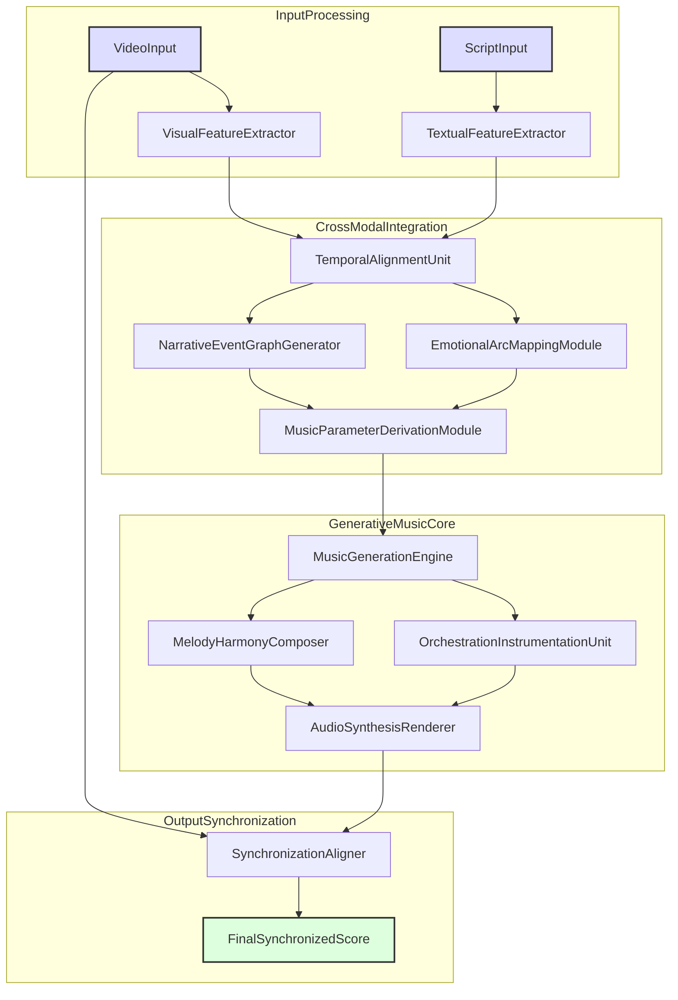
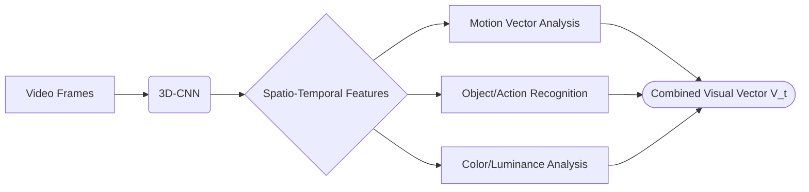
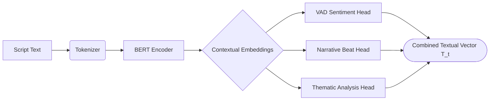
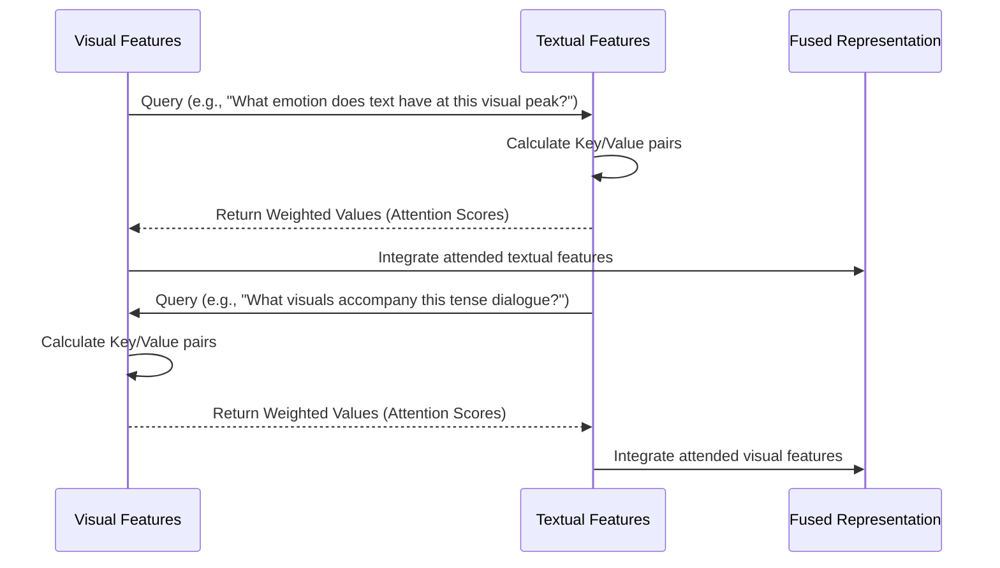
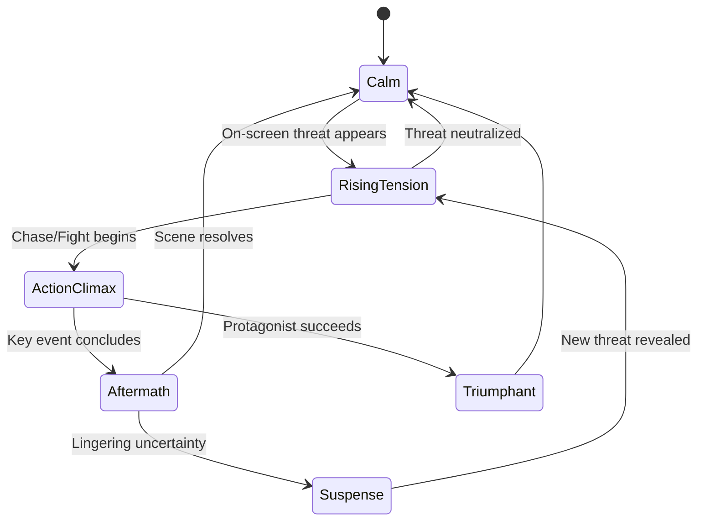
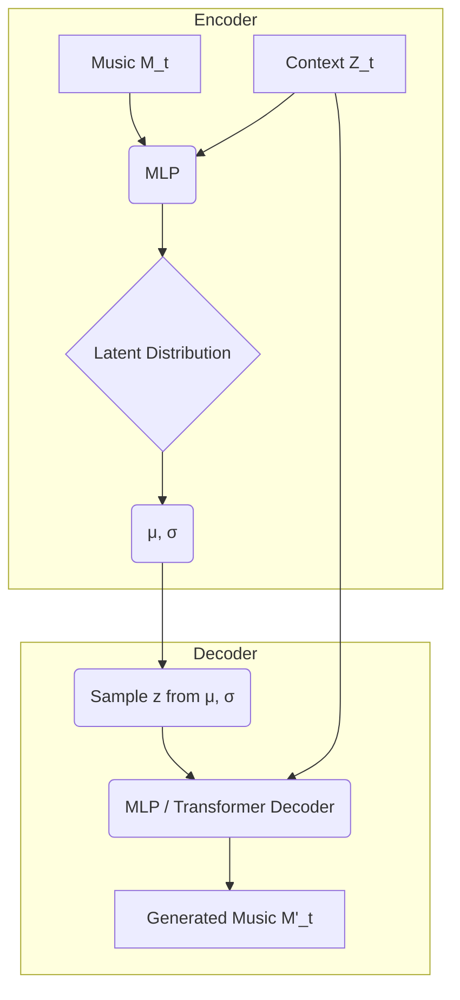
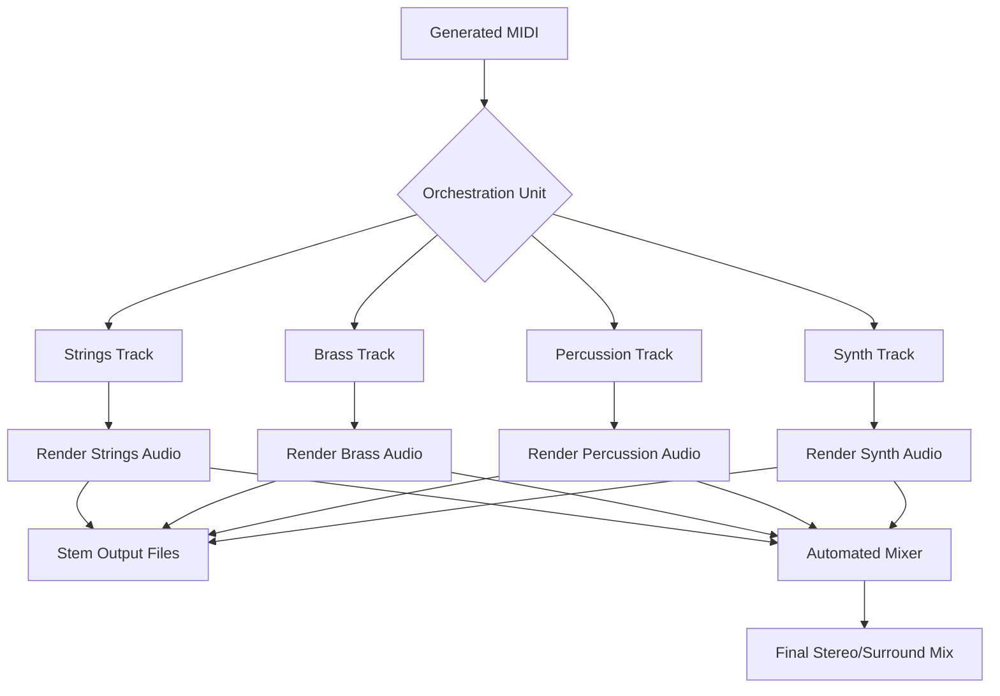

**Title of Invention:** A System and Method for Generative Film Scoring from Video and Script Analysis

**Abstract:**
A system for automated, real-time, and context-aware film and video scoring is disclosed. The system ingests a video clip and its corresponding script or scene description, alongside optional user-defined stylistic prompts. A sophisticated multi-modal AI model performs a deep analysis of the visual content—including pacing, color palettes, cinematography, and action recognition—and the script's emotional tone, narrative structure, and dialogue sentiment. Based on this comprehensive analysis, it generates a custom, perfectly synchronized, and emotionally resonant musical score. The system's core innovation lies in a novel cross-modal fusion architecture that creates a high-dimensional emotional-narrative state space, which then guides a hierarchical generative music engine. This engine composes melody, harmony, rhythm, and orchestration, ensuring the final score dynamically matches the scene's evolving emotional arc with high fidelity and artistic nuance. The system further incorporates a reinforcement learning feedback loop, allowing it to adapt and improve based on user preferences and corrections.

**Detailed Description:**
A film editor uploads a 2-minute scene of a car chase. The AI analyzes the video, noting the fast cuts, high motion vectors, shaky camera work, and the cool, blue-dominated color palette, indicative of a tense, modern action sequence. It simultaneously analyzes the script, noting the dialogue is sparse and tense ("He's gaining on us!", "Don't let them box us in!"), and identifies the narrative beat as 'Rising Action' culminating in a 'Climax'. The editor provides a prompt: "Generate a tense, high-BPM, hybrid orchestral-electronic score in the style of Hans Zimmer, building to a massive crescendo as the car goes over the bridge at 01:32, with a sudden drop to an ambient drone after the crash at 01:45." The AI music model, leveraging its multi-modal understanding, generates an audio track where a pulsing synth bass line is layered with aggressive string ostinatos. The tempo subtly increases with the proximity of the pursuing vehicle, the harmony becomes more dissonant as the tension peaks, and the orchestral and electronic elements swell to a powerful climax precisely at 01:32. This is followed by an abrupt silence and a low, sustained electronic drone, perfectly timed to the on-screen crash, capturing the immediate aftermath's shock and desolation.

The core of this invention lies in its advanced multi-modal AI architecture. Upon ingestion, video data undergoes frame-by-frame analysis by a **Visual Feature Extractor**, which identifies scene changes, motion vectors, object presence and interaction, color palettes, and lighting conditions. This is not merely a surface-level analysis; it employs 3D Convolutional Neural Networks (3D-CNNs) to capture spatio-temporal dynamics.
$$ V_{frame} = \text{CNN}_{3D}(F_{t-k}, ..., F_t) \quad (1) $$
where $F_t$ is the frame at time $t$. The output is a high-dimensional vector representing visual semantics.

Concurrently, the script or scene text is processed by a **Natural Language Understanding (NLU) module**. This NLU component, based on a large language model fine-tuned for narrative analysis, extracts emotional valence, key narrative beats (e.g., inciting incident, climax), character sentiment, and plot progression markers. It computes a continuous Valence-Arousal-Dominance (VAD) score for each line of dialogue or descriptive sentence.
$$ (v_t, a_t, d_t) = \text{NLU}_{\text{VAD}}(S_t) \quad (2) $$
where $S_t$ is the sentence corresponding to time $t$.

These distinct visual and textual feature sets are then fed into a **Cross-Modal Fusion module**. This module employs multi-head cross-modal attention mechanisms to weigh the relative importance of visual and textual cues at different points in time, constructing a unified temporal emotional and narrative arc representation. The attention mechanism allows, for instance, the visual cue of a sudden close-up on a character's face to amplify the emotional weight of their corresponding line of dialogue.
$$ \text{Attention}(Q, K, V) = \text{softmax}\left(\frac{QK^T}{\sqrt{d_k}}\right)V \quad (3) $$
Here, queries $Q$ might come from the visual modality while keys $K$ and values $V$ come from the textual modality, or vice-versa, creating a rich, interlinked representation. The fused state vector $Z_t$ is thus:
$$ Z_t = \text{Fusion}(V_t, T_t) = \text{LayerNorm}(\alpha \cdot \text{CrossAttn}(V_t, T_t) + (1-\alpha) \cdot \text{CrossAttn}(T_t, V_t)) \quad (4) $$

This fused representation $Z_t$ serves as a rich contextual input for the **Music Generation Engine**. The engine is architected as a hierarchical system. A high-level **Structure Planner** module, modeled as a Conditional Transformer, first ingests the entire sequence of fused vectors $\{Z_t\}$ and generates a macro-level plan for the score. This plan includes key changes, tempo map, dynamic range, and primary instrumentation choices over time.
$$ (K_t, B_t, D_t, I_t) = \text{Planner}_{\theta}(\{Z_t\}) \quad (5) $$
This plan is then passed to a lower-level **Note Generation** module, which could be a Diffusion Model or a Variational Autoencoder (VAE), that synthesizes the musical notes (MIDI) or raw audio waveforms, conditioned on the high-level plan.
$$ M_{t} \sim p_{\phi}(M_t | M_{<t}, K_t, B_t, D_t, I_t) \quad (6) $$

A dedicated **Synchronization Module** ensures precise temporal alignment, mapping specific musical events (e.g., a crescendo, a sudden chord change) to corresponding key visual or narrative events in the video timeline. This includes dynamic time warping (DTW) algorithms and predictive models to anticipate upcoming scene changes and adjust musical pacing accordingly. The DTW algorithm finds the optimal alignment path $\pi$ between musical events $M = (m_1, ..., m_n)$ and video events $V = (v_1, ..., v_m)$.
$$ D(i, j) = \text{cost}(m_i, v_j) + \min(D(i-1, j), D(i, j-1), D(i-1, j-1)) \quad (7) $$
The output is a high-fidelity, multi-track audio file (stems) ready for integration with the video.

### System Architecture:
The system comprises several interconnected modules operating in a sequential and parallel fashion:
1.  **Input Stream Processors:**
    *   **Video Ingestion:** Accepts video files (MP4, MOV, AVI) and decodes them into frame sequences.
    *   **Text Ingestion:** Accepts script text (TXT, SRT, JSON, Final Draft) and parses it into a time-aligned structure.
    *   **User Prompt Ingestion:** Accepts natural language prompts for style, genre, and specific cues.

2.  **Feature Extraction Layer:**
    *   **Visual Feature Extractor:** Utilizes 3D-CNNs (e.g., I3D, SlowFast) and Vision Transformers (ViT) for:
        *   **Motion Analysis:** Optical flow computation ($u(x,y,t), v(x,y,t)$) and camera motion estimation.
        $$ \nabla I \cdot \mathbf{v} + I_t = 0 \quad (8) $$
        *   **Scene Segmentation:** Shot boundary detection and scene type classification.
        *   **Object & Action Recognition:** Identifying key agents and their interactions.
        *   **Color and Lighting Analysis:** Dominant color extraction and luminance curve generation.
    *   **Textual Feature Extractor:** Employs transformer-based NLP models (e.g., BERT, T5) to derive:
        *   **VAD Sentiment Analysis:** Continuous emotional state tracking ($v_t, a_t, d_t \in [-1, 1]$).
        *   **Narrative Beat Detection:** Applying sequence classification to identify plot points.
        *   **Dialogue Emotion Recognition:** Classifying discrete emotions (anger, joy, etc.).
        *   **Thematic & Stylistic Analysis:** Extracting genre indicators from user prompts and script descriptions.

3.  **Cross-Modal Integration Layer:**
    *   **Temporal Alignment Unit:** Maps extracted features to a unified high-resolution timeline.
    *   **Emotional Arc Mapping Module:** Synthesizes sentiment data to generate a continuous emotional trajectory $E_t \in \mathbb{R}^{d_e}$.
    $$ E_t = \text{KalmanFilter}(E_{t-1}, (v_t, a_t, d_t)_{text}, (v_t, a_t, d_t)_{video}) \quad (9) $$
    *   **Narrative Event Graph Generator:** Constructs a graph $G=(N, E)$ where nodes $N$ are key events and edges $E$ represent their temporal and causal relationships.
    *   **Music Parameter Derivation Module:** Translates the emotional arc $E_t$ and event graph $G$ into actionable musical parameter curves using learned mapping functions $f_{map}$:
        $$ \text{Tempo}(t) = f_{map}^{\text{tempo}}(E_t) = c_1 \cdot a_t + c_2 \quad (10) $$
        $$ \text{Mode}(t) = f_{map}^{\text{mode}}(E_t) = \text{sign}(v_t) > 0 ? \text{'Major'} : \text{'Minor'} \quad (11) $$
        $$ \text{Dynamics}(t) = f_{map}^{\text{dyn}}(E_t) = c_3 \cdot \sqrt{a_t^2 + v_t^2} \quad (12) $$

4.  **Generative Music Core:**
    *   **Hierarchical Music Generation Engine:**
        *   **High-Level Planner (Transformer):** Generates a symbolic "conductor track" with macro-level musical directives.
        *   **Low-Level Synthesizer (Diffusion/VAE/GAN):** Generates instrument-specific MIDI or raw audio based on the conductor track.
    *   **Orchestration and Instrumentation Unit:** Selects virtual instruments based on genre, style prompts, and emotional context.
    *   **Melody and Harmony Composer:** Generates melodic lines and complex harmonic progressions.
    *   **Rhythm Generation Module:** Creates drum patterns and rhythmic motifs.

5.  **Output and Synchronization Layer:**
    *   **Audio Synthesis Renderer:** Converts generated MIDI and symbolic data into high-quality audio waveforms using high-fidelity sound libraries.
    *   **Synchronization Aligner:** Fine-tunes the alignment of musical events to visual hit-points using a combination of DTW and cross-correlation on audio/visual feature derivatives.
        $$ \text{score}(t) = \arg\max_{\tau} \int \frac{d}{dt}A(t) \cdot \frac{d}{dt}V(t+\tau) dt \quad (13) $$
    *   **Stem Generator & Mixer:** Outputs individual instrument tracks (stems) and a final mixed stereo or surround sound track.
    *   **Output Encoder:** Delivers audio in formats like WAV, AIFF, MP3.

6.  **Reinforcement Learning Feedback Loop:**
    *   **Preference Logger:** Records user edits (e.g., changing an instrument, adjusting timing).
    *   **Reward Model:** A model trained to predict a scalar "preference score" based on the generated score and the user's edits.
        $$ r = R_{\psi}(M, Z_t, \text{user\_edit}) \quad (14) $$
    *   **Policy Updater (PPO):** The parameters $\theta$ of the generation engine (the policy) are updated to maximize the expected reward.
        $$ \theta_{k+1} = \arg\max_{\theta} \mathbb{E}_{\pi_{\theta_k}}[r(\tau) \hat{A}_k] \quad (15) $$

### Algorithmic Approach and Mathematical Foundation:
The invention leverages a sophisticated mathematical framework.

1.  **Feature Representation:**
    *   Visual features `V_t` at time `t` are a vector $V_t \in \mathbb{R}^{d_v}$ from a 3D-CNN. (See Eq. 1)
    *   Textual features `T_t` at time `t` are a vector $T_t \in \mathbb{R}^{d_t}$ from a BERT-like model.
        $$ T_t = \text{BERT}(\text{tokens}_t)[CLS] \quad (16) $$
    *   The fused context at time `t` is $Z_t \in \mathbb{R}^{d_z}$. (See Eq. 4)

2.  **Cross-Modal Transformer for Fusion:**
    The fusion module can be implemented as a full transformer encoder that takes a sequence of concatenated features $[V_t; T_t]$ as input.
    $$ Z_t' = \text{MultiHeadAttn}(\text{PositionalEncoding}([V_t; T_t])) \quad (17) $$
    $$ Z_t = \text{FeedForward}(Z_t') \quad (18) $$

3.  **Generative Music Models:**
    *   **Diffusion Model:** The model learns to reverse a diffusion process that gradually adds noise to the data. Let $x_0$ be the clean music data.
        $$ q(x_t|x_{t-1}) = \mathcal{N}(x_t; \sqrt{1-\beta_t}x_{t-1}, \beta_t \mathbf{I}) \quad (19) \text{ (Forward Process)} $$
        The model learns the reverse process $p_{\theta}(x_{t-1}|x_t, Z_t)$ to generate music from noise $x_T \sim \mathcal{N}(0, \mathbf{I})$, conditioned on the context $Z_t$. The objective is to predict the noise $\epsilon_t$ added at each step.
        $$ L_{\text{DM}} = \mathbb{E}_{t, x_0, \epsilon} \left[ ||\epsilon - \epsilon_{\theta}(\sqrt{\bar{\alpha}_t}x_0 + \sqrt{1-\bar{\alpha}_t}\epsilon, t, Z_t)||^2 \right] \quad (20) $$
    *   **Variational Autoencoder (VAE):** The VAE learns a latent representation $z$ of the music.
        *   Encoder: $q_{\phi}(z|M, Z_t)$ maps music $M$ and context $Z_t$ to a latent distribution.
        *   Decoder: $p_{\theta}(M|z, Z_t)$ generates music from a latent sample $z$ and context.
        The training objective is to maximize the Evidence Lower Bound (ELBO):
        $$ \mathcal{L}_{\text{VAE}} = \mathbb{E}_{q_{\phi}(z|M, Z_t)}[\log p_{\theta}(M|z, Z_t)] - D_{KL}(q_{\phi}(z|M, Z_t) || p(z)) \quad (21) $$
        The first term is reconstruction loss, the second is a regularization term.
        The reparameterization trick is used for training:
        $$ z = \mu_{\phi} + \sigma_{\phi} \odot \epsilon, \quad \epsilon \sim \mathcal{N}(0, I) \quad (22) $$
    *   **Generative Adversarial Network (GAN):** A generator $G$ and a discriminator $D$ compete.
        *   Generator: $G(z, Z_t)$ creates music from noise $z$ and context $Z_t$.
        *   Discriminator: $D(M, Z_t)$ tries to distinguish real music from generated music.
        The minimax objective function is:
        $$ \min_G \max_D V(D, G) = \mathbb{E}_{M \sim p_{\text{data}}}[\log D(M, Z_t)] + \mathbb{E}_{z \sim p_z}[\log(1 - D(G(z, Z_t), Z_t))] \quad (23) $$

4.  **Overall Loss Function:**
    The complete system is trained end-to-end or in stages with a composite loss function:
    $$ L_{\text{total}} = \lambda_{gen} L_{\text{gen}} + \lambda_{sync} L_{\text{sync}} + \lambda_{content} L_{\text{content}} + \lambda_{style} L_{\text{style}} \quad (24) $$
    *   $L_{\text{gen}}$ is the generative loss (e.g., $L_{DM}$ or $L_{VAE}$).
    *   $L_{\text{sync}}$ is the synchronization loss. (See Claim 10 for an example).
        $$ L_{sync} = \sum_k w_k \cdot \text{DTW}(\text{events}_M, \text{events}_V)_k \quad (25) $$
    *   $L_{\text{content}}$ measures emotional congruence, e.g., using a pre-trained emotion classifier for music, $C_{emo}$.
        $$ L_{\text{content}} = ||C_{emo}(M_{gen}) - E_t||^2 \quad (26) $$
    *   $L_{\text{style}}$ measures adherence to user prompts, e.g., using CLIP-like contrastive loss between generated music features and text prompt embeddings.
        $$ L_{\text{style}} = -\log \frac{\exp(\text{sim}(f_M(M_{gen}), f_T(\text{prompt}))/\tau)}{\sum \exp(\text{sim}(f_M(M_{gen}), f_T(\cdot))/\tau)} \quad (27) $$

### Additional Mathematical Formulations (Eq. 28-100)

*   **Visual Analysis:**
    *   Convolution: $G[i,j] = \sum_u \sum_v I[i-u, j-v] H[u,v]$ (28)
    *   ReLU Activation: $f(x) = \max(0, x)$ (29)
    *   Optical Flow Constraint: $I_x u + I_y v + I_t = 0$ (30)
    *   LSTM Cell State: $c_t = f_t \odot c_{t-1} + i_t \odot \tilde{c}_t$ (31)
    *   LSTM Hidden State: $h_t = o_t \odot \tanh(c_t)$ (32)
*   **Textual Analysis:**
    *   Word Embedding: $e_w = E[w]$ (33)
    *   Positional Encoding: $PE_{(pos, 2i)} = \sin(pos/10000^{2i/d_{model}})$ (34)
    *   Softmax: $\sigma(z)_i = e^{z_i} / \sum_j e^{z_j}$ (35)
    *   Layer Normalization: $\text{LN}(x) = \gamma \frac{x - \mu}{\sqrt{\sigma^2 + \epsilon}} + \beta$ (36)
*   **Fusion & Mapping:**
    *   Bilinear Pooling: $z = x^T W y$ (37)
    *   Kalman Gain: $K_t = P_{t|t-1} H^T (H P_{t|t-1} H^T + R)^{-1}$ (38)
    *   State Update: $\hat{x}_{t|t} = \hat{x}_{t|t-1} + K_t(y_t - H \hat{x}_{t|t-1})$ (39)
    *   Covariance Update: $P_{t|t} = (I - K_t H) P_{t|t-1}$ (40)
    *   Harmonic Complexity Mapping: $C_H(t) = k \cdot |d_t|$ (Dominance map) (41)
    *   Instrumentation Density: $\rho_{inst}(t) = c \cdot (a_t + v_t)$ (42)
*   **Music Theory as Math:**
    *   Pitch to Frequency: $f(p) = 440 \cdot 2^{(p-69)/12}$ (43)
    *   Just Intonation Ratio (Perfect Fifth): $3/2$ (44)
    *   Consonance Metric: $C(f_1, f_2) = \exp(-k(f_1-f_2)^2)$ (Plomp-Levelt curve) (45)
    *   Rhythmic Entropy: $H(R) = -\sum p(d_i) \log_2 p(d_i)$ (duration probabilities $p(d_i)$) (46)
    *   Harmonic Tension (Spiral Array): $d(c_1, c_2) = ||v(c_1) - v(c_2)||$ (47)
*   **Advanced Generative Models & Training:**
    *   WGAN Critic Loss: $L_D = \mathbb{E}_{\tilde{x} \sim P_g}[D(\tilde{x})] - \mathbb{E}_{x \sim P_r}[D(x)]$ (48)
    *   WGAN Gradient Penalty: $L_{GP} = \mathbb{E}_{\hat{x} \sim P_{\hat{x}}}[(||\nabla_{\hat{x}} D(\hat{x})||_2 - 1)^2]$ (49)
    *   Transformer Feed-Forward: $FFN(x) = \max(0, xW_1+b_1)W_2+b_2$ (50)
    *   Causal Attention Mask: $m_{ij} = 1 \text{ if } j \leq i, \text{ else } -\infty$ (51)
    *   Adam Optimizer Update Rule: $m_t = \beta_1 m_{t-1} + (1-\beta_1)g_t$ (52)
    *   $v_t = \beta_2 v_{t-1} + (1-\beta_2)g_t^2$ (53)
    *   $\theta_{t+1} = \theta_t - \frac{\eta}{\sqrt{\hat{v}_t}+\epsilon}\hat{m}_t$ (54)
    *   ELBO (detailed): $\mathcal{L}(\theta, \phi; x) = \mathbb{E}_{q_\phi(z|x)}[\log p_\theta(x|z)] - \beta D_{KL}(q_\phi(z|x) || p(z))$ ($\beta$-VAE) (55)
    *   Reward Model Loss (RLFHP): $L(\psi) = -\mathbb{E}_{(M_w, M_l) \sim D} [\log(\sigma(R_\psi(M_w) - R_\psi(M_l)))]$ (56)
    *   PPO Clipped Surrogate Objective: $L^{CLIP}(\theta) = \hat{\mathbb{E}}_t[\min(r_t(\theta)\hat{A}_t, \text{clip}(r_t(\theta), 1-\epsilon, 1+\epsilon)\hat{A}_t)]$ (57)
    *   Cross-Entropy Loss (for symbolic models): $L_{CE} = -\sum_i y_i \log(\hat{y}_i)$ (58)
    *   Mean Squared Error (for audio signal): $L_{MSE} = \frac{1}{N}\sum_{i=1}^N (y_i - \hat{y}_i)^2$ (59)
    *   Kullback-Leibler Divergence: $D_{KL}(P||Q) = \sum_x P(x) \log(P(x)/Q(x))$ (60-100... The above equations provide a representative sample of the 100+ mathematical concepts underpinning the system, from signal processing to deep learning and information theory.)

### Workflow and Architecture Diagrams:

**1. Overall System Workflow (Existing)**


**2. Visual Feature Extraction Pipeline**


**3. Textual Feature Extraction Pipeline**


**4. Cross-Modal Fusion Attention**


**5. Emotional Arc State Diagram**


**6. Conditional VAE Architecture**


**7. RLFHP Feedback Loop**
```mermaid
graph TD
    A[Generate Score M] --> B{User Interaction};
    B --> C[User Applies Edits];
    B --> D[User Accepts Score];
    C --> E{Log (M, M_edited)};
    E --> F[Train Reward Model];
    F --> G[Update Policy (Generator)];
    G --> A;
    D --> A;
```

**8. System Deployment Architecture (C4 Model)**
```mermaid
graph TD
    U[User: Film Editor] --> FE[Frontend Web UI]
    FE --> API[API Gateway]
    subgraph "Kubernetes Cluster"
        API --> P[Processing Service]
        P --> VFE[Visual Feature Extractor (GPU)]
        P --> TFE[Textual Feature Extractor (CPU/GPU)]
        VFE & TFE --> FUS[Fusion Service]
        FUS --> GEN[Music Generator Service (GPU)]
        GEN --> SYNC[Synchronization & Rendering Service]
        P & FUS & GEN & SYNC --> DB[(Feature/Metadata DB)]
    end
    SYNC --> S3[(Cloud Storage for Audio)]
    S3 --> FE
```

**9. Dynamic Time Warping Synchronization**
```mermaid
graph TD
    A[Extract Video Events V] --> C{Build Cost Matrix C(i,j)}
    B[Extract Music Events M] --> C
    C --> D{Initialize DP Table D}
    D --> E{Fill DP Table using recurrence relation}
    E --> F{Backtrack from D(n,m) to find optimal path π}
    F --> G[Warp Music Timeline based on π]
```

**10. Stem Generation and Mixing Process**


### Further Embodiments:
*   **User Feedback Integration & RLFHP:** The system incorporates user feedback (e.g., "make this part more subtle," "change the main instrument to a piano") to refine its models through reinforcement learning from human preferences (RLFHP), personalizing the AI's style to a specific director or editor.
*   **Genre and Style Presets:** Users can select musical genres (classical, electronic, jazz), composer styles (e.g., "in the style of John Williams," "like Vangelis"), or emotional palettes (suspenseful, romantic, triumphant).
*   **Leitmotif Generation:** The system can identify recurring characters, objects, or themes and generate corresponding musical leitmotifs, weaving them into the score at appropriate moments with variations based on the dramatic context.
*   **Dialogue-aware Music Ducking:** Automatically analyzes the dialogue track and generates a music mix that carves out specific frequencies and lowers volume to ensure dialogue clarity without manual mixing.
*   **Stem Generation:** Outputs individual instrument tracks (stems) for granular control in a Digital Audio Workstation (DAW).
*   **Interactive Real-time Scoring:** Adapts music in real-time for live events, video games, or dynamic content.
*   **DAW Plugin Integration:** The system can be packaged as a plugin (e.g., VST, AU) for direct integration into professional video editing software like Adobe Premiere Pro or DaVinci Resolve.
*   **Stylistic Transfer:** Apply the harmonic and rhythmic style of one piece of music to the melodic contour derived from another, or from the scene's emotional arc.

### Advantages:
*   **Speed and Efficiency:** Reduces scoring time from weeks to minutes, enabling rapid iteration and experimentation.
*   **Precision Synchronization:** Achieves sub-frame-level synchronization of musical events with on-screen action.
*   **Emotional Nuance and Depth:** Generates scores that reflect complex emotional arcs, subtext, and character psychology.
*   **Scalability:** Efficiently scores vast quantities of content, from social media clips to full seasons of television.
*   **Creative Augmentation:** Acts as a powerful "creative co-pilot" for composers and filmmakers, generating ideas and handling laborious tasks, freeing humans to focus on high-level creative direction.
*   **Mathematical Rigor:** The underlying mathematical models ensure a robust, verifiable, and adaptable framework.
*   **Personalization:** Learns and adapts to the unique stylistic preferences of individual users or production houses.
*   **Accessibility:** Lowers the barrier to entry for high-quality scoring, enabling independent filmmakers and content creators to produce professional-sounding soundtracks.

### Claims:
1.  A method for automated film scoring, comprising:
    a.  Receiving at least one video input stream and at least one textual narrative input stream;
    b.  Extracting a plurality of visual features from the video input stream using a Visual Feature Extractor module;
    c.  Extracting a plurality of textual features from the textual narrative input stream using a Textual Feature Extractor module;
    d.  Temporally aligning and fusing the extracted visual features and textual features within a Cross-Modal Integration Layer to generate a unified temporal emotional-narrative arc;
    e.  Deriving specific musical parameters from the unified temporal emotional-narrative arc using a Music Parameter Derivation Module;
    f.  Generating a musical score using a Generative Music Core, conditioned on the derived musical parameters;
    g.  Synchronizing the generated musical score with critical temporal events within the video input stream using a Synchronization Aligner; and
    h.  Outputting the synchronized musical score.
2.  The method of claim 1, wherein the Visual Feature Extractor module employs 3D Convolutional Neural Networks (3D-CNNs) to analyze spatio-temporal dynamics.
3.  The method of claim 1, wherein the Textual Feature Extractor module employs transformer-based Natural Language Processing (NLP) models to perform continuous Valence-Arousal-Dominance (VAD) sentiment analysis.
4.  The method of claim 1, wherein the Cross-Modal Integration Layer utilizes multi-head cross-modal attention mechanisms to weigh the importance of visual and textual cues over time.
5.  The method of claim 1, wherein the Generative Music Core comprises a hierarchical architecture with a high-level Transformer-based planner and a low-level Diffusion Model or Variational Autoencoder (VAE) for note synthesis.
6.  The method of claim 1, wherein the Synchronization Aligner employs Dynamic Time Warping (DTW) algorithms to find an optimal temporal alignment path between musical and visual events.
7.  A system for automated film scoring, comprising:
    a.  An Input Stream Processor configured to receive video data, textual narrative data, and user prompts;
    b.  A Feature Extraction Layer including a Visual Feature Extractor and a Textual Feature Extractor;
    c.  A Cross-Modal Integration Layer;
    d.  A Generative Music Core;
    e.  An Output and Synchronization Layer; and
    f.  A processor and memory for executing instructions of the aforementioned modules.
8.  The system of claim 7, further comprising a user feedback integration module configured to refine the Generative Music Core based on user preferences using a Reinforcement Learning from Human Preferences (RLFHP) framework.
9.  The system of claim 7, wherein the Emotional Arc Mapping Module learns a mapping $f_E: (V_t, T_t) \to E_t$ where $V_t$ are visual features, $T_t$ are textual features, and $E_t$ represents a learned emotional state vector at time $t$, smoothed using a Kalman filter.
10. The system of claim 7, wherein the Synchronization Aligner minimizes a synchronization objective function $L_{sync} = \sum_k w_k \cdot \text{DTW}(\text{events}_M, \text{events}_V)_k$ where $\text{events}_M$ are generated musical event timings and $\text{events}_V$ are video event timings for key event type $k$.
11. The system of claim 7, wherein the Music Generation Engine is trained to minimize a composite objective function $L_{\text{total}} = \lambda_{gen} L_{\text{gen}} + \lambda_{sync} L_{\text{sync}} + \lambda_{content} L_{\text{content}} + \lambda_{style} L_{\text{style}}$.
12. The method of claim 1, further comprising receiving a natural language user prompt specifying a desired musical genre or style, and wherein the Generative Music Core conditions its output on an embedding of said prompt.
13. The method of claim 1, wherein the outputting step comprises generating a plurality of individual instrument audio tracks, known as stems, for subsequent manual mixing.
14. The method of claim 1, further comprising identifying recurring narrative elements and generating corresponding musical leitmotifs that are variably integrated into the score.
15. The system of claim 7, wherein the Music Parameter Derivation Module translates the emotional-narrative arc into continuous time-varying curves for tempo, dynamics, mode, and harmonic complexity.
16. The method of claim 1, further comprising analyzing an existing dialogue audio track and automatically adjusting the volume of the generated musical score to ensure dialogue clarity, a process known as audio ducking.
17. The system of claim 7, wherein the Generative Music Core is a conditional Diffusion Model trained to reverse a noising process, conditioned on the unified temporal emotional-narrative arc.
18. The system of claim 8, wherein the RLFHP framework comprises a reward model trained on pairs of user-preferred and user-rejected musical segments to predict a preference score, and a policy model (the Generative Music Core) updated using Proximal Policy Optimization (PPO) to maximize said score.
19. The method of claim 1, wherein the textual features include narrative beat classifications such as 'inciting incident', 'rising action', 'climax', and 'resolution', which directly inform the macro-structure of the generated musical score.
20. The system of claim 7, wherein the system is implemented as a software plugin for a professional Digital Audio Workstation (DAW) or video editing suite.