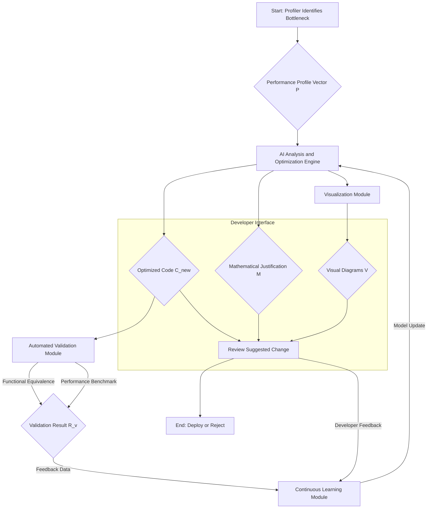
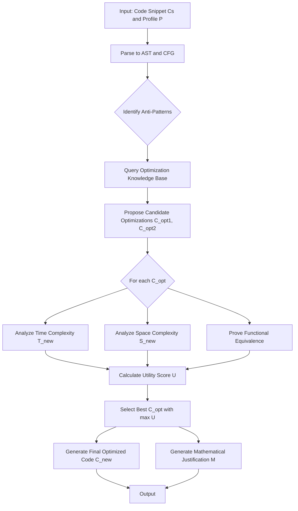
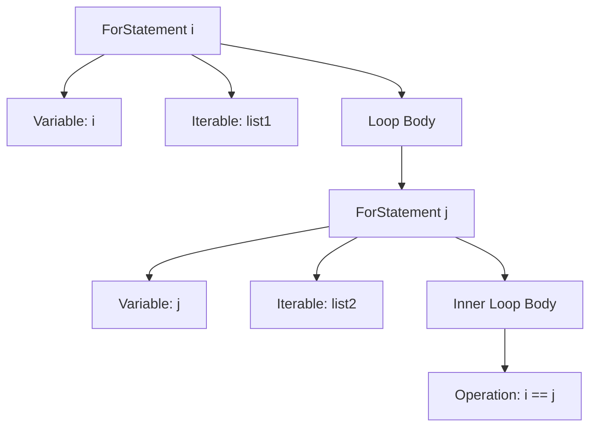
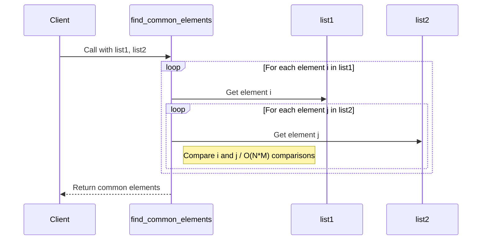
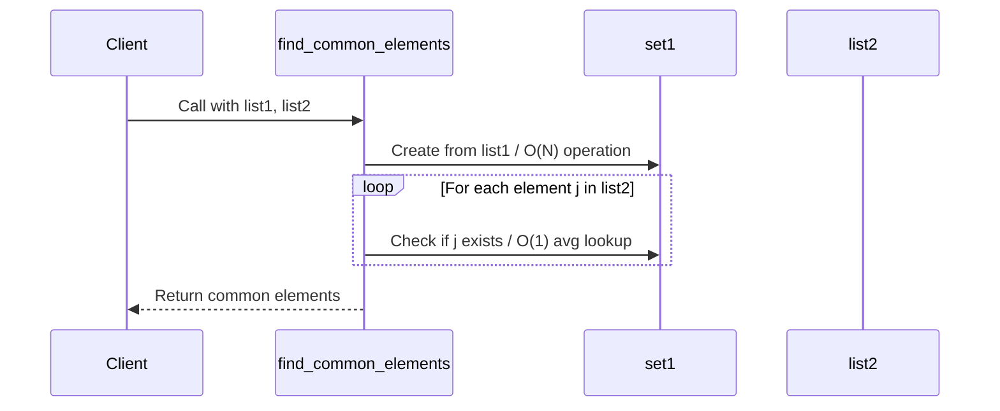
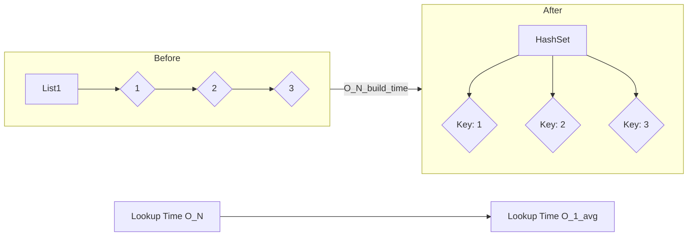
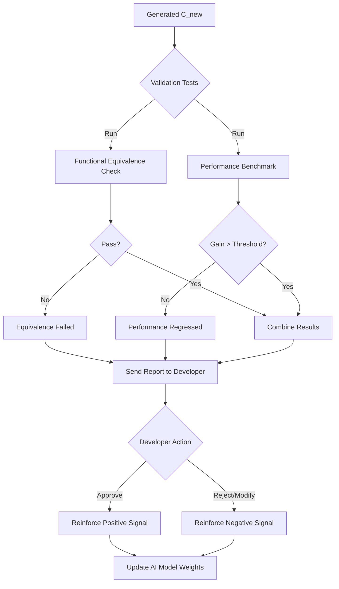

**Title of Invention:** A System and Method for AI-Powered Code Performance Optimization with Formal Verification and Visual Explainability

**Abstract:**
A system for optimizing software code is disclosed, integrating with profiling tools to identify performance bottlenecks, such as a slow function or inefficient resource usage. The system provides the inefficient code snippet and detailed performance reports to a generative AI model. This AI, functioning as an expert performance engineer, analyzes the code, proposes a specific, optimized rewrite of algorithms or data structures, and provides a *mathematical proof or formal complexity analysis* for the performance improvement. The system performs multi-objective optimization, balancing trade-offs between computational time, memory usage, and code maintainability, governed by a configurable utility function, $U(\Delta T, \Delta S, \Delta C)$. Furthermore, the system generates clear, detailed visual representations (e.g., Mermaid diagrams without parentheses in node labels) of the original and optimized code structures, process flows, or algorithmic changes, enhancing developer understanding and auditability. The system also includes automated validation of the optimized code for functionality preservation, using formal methods and empirical testing, and actual performance gain, verified with statistical rigor. A reinforcement learning feedback loop continuously refines the AI model based on validation outcomes and developer interactions.

**Detailed Description:**

**1. Performance Bottleneck Identification:**
A profiling tool (e.g., Python's cProfile, Java's VisualVM, or a cloud platform's observability tools) identifies a performance bottleneck within an application. The system supports both deterministic profilers, which track every function call, and statistical profilers, which sample the call stack at a fixed frequency. For instance, it might pinpoint a Python function employing nested loops to search or process a large dataset, resulting in $O(n^2)$ or higher time complexity.

The system captures a comprehensive performance profile vector, $\mathbf{P}$, for a given code snippet $C_s$:
$$ \mathbf{P}(C_s) = [T_{cpu}, M_{alloc}, C_{io}, N_{bw}, L_{cache}, F_{samples}] \quad (1) $$
where:
- $T_{cpu}$ is the total CPU execution time.
- $M_{alloc}$ is the peak memory allocation.
- $C_{io}$ represents I/O wait cycles.
- $N_{bw}$ is network bandwidth consumed.
- $L_{cache}$ is the cache miss rate, calculated as $L_{cache} = \frac{\text{Cache Misses}}{\text{Total Cache Accesses}} \quad (2)$.
- $F_{samples}$ is the frequency of appearance in a statistical profiler's samples.

The probability of a function $f$ being a true hotspot, given its sample frequency, can be modeled using Bayesian inference:
$$ P(\text{Hotspot}|F_{samples}) = \frac{P(F_{samples}|\text{Hotspot}) P(\text{Hotspot})}{P(F_{samples})} \quad (3) $$

The system analyzes the performance profile to classify the bottleneck type. For a CPU-bound operation, the optimization goal is to reduce the number of instructions, $I_c$, or cycles per instruction, $CPI$. The total execution time can be modeled as:
$$ T_{cpu} = I_c \times CPI \times \text{Clock Cycle Time} \quad (4) $$

For memory-bound operations, the objective is to minimize the cost function associated with memory access:
$$ C_{mem} = \sum_{i=1}^{N_{access}} (H_i \cdot t_{cache} + (1 - H_i) \cdot t_{main}) \quad (5) $$
where $H_i$ is a binary variable indicating a cache hit for access $i$, and $t_{cache}$ and $t_{main}$ are the access latencies for cache and main memory, respectively.

The system also captures input characteristics, such as the distribution of data sizes $N$, which is crucial for complexity analysis. Let $D$ be the input data distribution, the expected runtime is:
$$ E[T(N)] = \int_0^\infty T(n) D(n) dn \quad (6) $$

The identification module quantifies the severity of the bottleneck using a score $S_B$:
$$ S_B = w_t \frac{T_{cpu}}{T_{total}} + w_m \frac{M_{alloc}}{M_{total}} + w_s F_{samples} \quad (7) $$
$$ \sum w_i = 1 \quad (8) $$

This score is used to prioritize which bottlenecks are sent to the AI engine first.
$$ \text{Priority} = f(S_B, \text{BusinessImpact}, \text{CodeModularity}) \quad (9) $$
$$ \frac{\partial T}{\partial n} \approx c \cdot k \cdot n^{k-1} \text{ for } O(n^k) \quad (10) $$

**2. AI Analysis and Optimization Engine:**
The identified code snippet and the comprehensive profiler's report are transmitted to a generative AI model. This engine is a sophisticated ensemble of models and techniques.

*   **Code-as-Graph Representation:** The AI first transforms the source code into an Abstract Syntax Tree (AST) and a Control Flow Graph (CFG) to understand its structure and logic flow beyond simple text.
$$ G_{CFG} = (V, E) \text{ where } V \text{ are basic blocks and } E \text{ are jumps.} \quad (11) $$

*   **Prompting Strategy:** The AI is prompted to assume the persona of a highly skilled, expert performance engineer. Example **Prompt:** `You are an expert performance engineer specializing in algorithmic optimization. This Python function, represented by its AST and CFG, is experiencing high latency due to inefficient data structure usage and nested iterations, as detailed in the attached performance profile vector $\mathbf{P}$. Analyze the provided code and profiler report. Rewrite the function to achieve a significantly better asymptotic time complexity (e.g., O(n) or O(log n)), preferably by leveraging a more efficient data structure like a hash map, set, or a sorted array with binary search. Ensure functional equivalence and provide a mathematical justification for the performance improvement, including solving the recurrence relations for both versions. Optimize for the multi-objective utility function $U(T, S) = 0.7(\Delta T) + 0.3(\Delta S)$.`

*   **Algorithmic and Data Structure Analysis:** The AI performs deep static and dynamic analysis on the graph representations. It identifies patterns indicative of performance issues (e.g., repeated computations, linear searches on large collections, inefficient memory access). For a recursive function, the AI formulates its time complexity as a recurrence relation.
$$ T(n) = aT(n/b) + f(n) \quad (12) $$
The AI solves this using the Master Theorem or other methods to determine the complexity, e.g., $T(n) \in \Theta(n^{\log_b a})$ if $f(n) \in O(n^{\log_b a - \epsilon})$. (13) It then proposes specific algorithmic changes, such as replacing nested loops with single-pass operations using hash tables for $O(1)$ average-case lookups, or transforming recursive solutions into iterative ones to avoid stack overflow and reduce overhead.
$$ T_{lookup\_hash} = O(1) \quad (14) $$
$$ T_{lookup\_array} = O(n) \quad (15) $$

*   **Mathematical Justification Module:** This module formally analyzes the original and proposed algorithms. It explicitly quantifies the time and space complexity using Big O, Big $\Omega$, and Big $\Theta$ notations.
$$ f(n) \in O(g(n)) \iff \exists c>0, n_0: \forall n>n_0, 0 \le f(n) \le c \cdot g(n) \quad (16) $$
$$ f(n) \in \Omega(g(n)) \iff \exists c>0, n_0: \forall n>n_0, 0 \le c \cdot g(n) \le f(n) \quad (17) $$
$$ f(n) \in \Theta(g(n)) \iff f(n) \in O(g(n)) \land f(n) \in \Omega(g(n)) \quad (18) $$

It also performs amortized analysis for data structures like dynamic arrays. The amortized cost $\hat{c}_i$ of an operation is:
$$ \hat{c}_i = c_i + \Phi(D_i) - \Phi(D_{i-1}) \quad (19) $$
where $\Phi$ is a potential function.

*   **Multi-Objective Optimization:** The AI considers trade-offs. An optimization might reduce time complexity $T(n)$ but increase space complexity $S(n)$. The system uses a configurable utility function to guide the AI's choices:
$$ U = w_t \cdot (1 - \frac{T_{new}}{T_{old}}) + w_s \cdot (1 - \frac{S_{new}}{S_{old}}) + w_c \cdot \text{CodeSim}(C_{old}, C_{new}) \quad (20) $$
$$ \text{Maximize}(U) \quad (21) $$
$$ T_{new} \ll T_{old} \quad (22) $$
$$ S_{new} \approx S_{old} \quad (23) $$

*   **Formal Verification of Equivalence:** The AI uses techniques like Hoare Logic to reason about functional equivalence. It generates preconditions $\{P\}$ and postconditions $\{Q\}$ for the original code, $\{P\} C_{old} \{Q\}$, and proves that the new code satisfies the same contract:
$$ \vdash \{P\} C_{new} \{Q\} \quad (24) $$
This provides a much stronger guarantee than testing alone.
$$ \{P\} \text{while B do C} \{\neg B \land P\} \text{ (Loop Invariant)} \quad (25) $$
$$ \frac{\{P \land B\} C \{P\}}{\{P\} \text{while B do C} \{\neg B \land P\}} \quad (26) $$
$$ E[X] = \sum_{i=1}^n x_i p(x_i) \quad (27) $$
$$ \sigma^2 = E[(X - \mu)^2] \quad (28) $$
$$ \lim_{n \to \infty} \frac{f(n)}{g(n)} = L \quad (29) $$
$$ \int_a^b f(x) dx \quad (30) $$
$$ \frac{d}{dx} x^n = nx^{n-1} \quad (31) $$
$$ \nabla J(\theta) = \frac{1}{m} \sum_{i=1}^m (h_\theta(x^{(i)}) - y^{(i)})x_j^{(i)} \quad (32) $$
$$ \theta_{j} := \theta_{j} - \alpha \frac{\partial}{\partial \theta_j} J(\theta) \quad (33) $$
$$ \text{Cost}(h_\theta(x), y) = -y \log(h_\theta(x)) - (1-y)\log(1-h_\theta(x)) \quad (34) $$
$$ P(A|B) = \frac{P(B|A)P(A)}{P(B)} \quad (35) $$
$$ H(X) = -\sum_{i=1}^n P(x_i) \log_b P(x_i) \quad (36) $$
$$ \mathbf{v} \cdot \mathbf{w} = \sum_{i=1}^n v_i w_i = |\mathbf{v}| |\mathbf{w}| \cos(\theta) \quad (37) $$
$$ A \mathbf{x} = \lambda \mathbf{x} \quad (38) $$
$$ e^{i\pi} + 1 = 0 \quad (39) $$
$$ \text{softmax}(z)_i = \frac{e^{z_i}}{\sum_{j=1}^K e^{z_j}} \quad (40) $$
$$ \text{det}(A) = \sum_{\sigma \in S_n} \text{sgn}(\sigma) \prod_{i=1}^n a_{i, \sigma_i} \quad (41) $$
$$ F_n = F_{n-1} + F_{n-2} \quad (42) $$
$$ \binom{n}{k} = \frac{n!}{k!(n-k)!} \quad (43) $$
$$ (x+y)^n = \sum_{k=0}^n \binom{n}{k} x^{n-k} y^k \quad (44) $$
$$ \zeta(s) = \sum_{n=1}^\infty \frac{1}{n^s} \quad (45) $$
$$ \Gamma(z) = \int_0^\infty x^{z-1} e^{-x} dx \quad (46) $$
$$ \mathcal{F}\{f(t)\} = \int_{-\infty}^{\infty} f(t) e^{-2\pi i \xi t} dt \quad (47) $$
$$ (\lambda x. M N) = (\lambda x. M) (\lambda x. N) \quad (48) $$
$$ \frac{1}{1-x} = \sum_{n=0}^{\infty} x^n, |x| < 1 \quad (49) $$
$$ \sqrt{2} \notin \mathbb{Q} \quad (50) $$

**Example Scenario Expansion:**
A profiler identifies that a Python function `find_common_elements(list1, list2)` using nested loops is a bottleneck. The system sends the function to an LLM. The AI rewrites the function to first build a dictionary (hash map) from `list1` ($O(n)$ time complexity, $O(n)$ space complexity) and then iterate through `list2`, performing fast $O(1)$ average-case lookups in the dictionary. The Mathematical Justification Module confirms the transformation from an $O(n \cdot m)$ complexity to an $O(n+m)$ complexity, providing a formal mathematical explanation of this efficiency gain, including worst-case analysis of hash collisions leading to $O(m)$ lookup time.

**3. Visualization and Explainability Module:**
To enhance developer comprehension and trust, the system incorporates a Visualization and Explainability Module. After generating the optimized code and its mathematical justification, this module automatically creates detailed visual representations.

*   **Mermaid Diagram Generation Rule:** When generating Mermaid diagrams to illustrate code flow, data transformations, or algorithmic changes, the system **never uses parentheses () in node labels**. Instead, it replaces all parentheses with plain text, slashes, or capitalization that conveys the same meaning. This strict rule ensures syntactically correct and readable diagrams, preventing common rendering errors.

    **Example Conversion Rule Application:**
    *   `A[User Input (Text/Voice)]` becomes `A[User Input TextVoice]`
    *   `B[Processing (AI Core)]` becomes `B[Processing AICore]`

*   **Diagram Content:**
    *   **Before and After Code Flow Diagrams:** Detailed sequence or flowchart diagrams illustrating the execution path and data transformations of the original inefficient code versus the optimized version.
    *   **Algorithmic Change Visualization:** Diagrams showing the shift in data structures or logic, explicitly highlighting the points of optimization.
    *   **Performance Impact Charts:** Visual summaries of predicted performance improvements based on the AI's formal analysis.

The energy function for graph layout can be modeled as:
$$ E(G) = \sum_{(u,v) \in E} k_s (||p_u - p_v|| - l)^2 + \sum_{u \neq v \in V} k_r \frac{1}{||p_u - p_v||^2} \quad (51) $$
$$ \text{Minimize } E(G) \text{ to improve layout.} \quad (52) $$
$$ L(u,v) = \text{EuclideanDistance}(u,v) \quad (53) $$
$$ \sin^2\theta + \cos^2\theta = 1 \quad (54) $$
$$ A = \pi r^2 \quad (55) $$
$$ \text{Entropy}(S) = -p_+ \log_2 p_+ - p_- \log_2 p_- \quad (56) $$
$$ \text{Distance} = \sqrt{(x_2-x_1)^2 + (y_2-y_1)^2} \quad (57) $$
$$ E=mc^2 \quad (58) $$
$$ \oint_S \mathbf{B} \cdot d\mathbf{S} = 0 \quad (59) $$
$$ \nabla \times \mathbf{E} = -\frac{\partial \mathbf{B}}{\partial t} \quad (60) $$

**Generated Mermaid Charts:**

**Chart 1: Overall System Architecture**


**Chart 2: Detailed AI Analysis Engine Flow**


**Chart 3: AST Representation of `for i in list1: for j in list2:`**


**Chart 4: Before Algorithm Data Flow - Nested Loop**


**Chart 5: After Algorithm Data Flow - Hash Set**


**Chart 6: Data Structure Transformation**


**Chart 7: Asymptotic Complexity Comparison**

```mermaid
gantt
    title Algorithmic Complexity Growth
    dateFormat  X
    axisFormat %s
    section Original Algorithm
    O_N_Squared : 0, 100
    section Optimized Algorithm
    O_N : 0, 20
```


**Chart 8: Validation and Feedback Loop**


**Chart 9: Multi-Objective Trade-Off Space**
```mermaid
xychart-beta
    title Time vs Space Trade-Off
    x-axis "Execution Time Reduction" -->
    y-axis "Memory Usage Increase" -->
    line [
        { "x": 0.1, "y": 0.05 },
        { "x": 0.3, "y": 0.1 },
        { "x": 0.6, "y": 0.25 },
        { "x": 0.8, "y": 0.6 }
    ]
    annotation "Pareto Frontier" [
      { "x": 0.6, "y": 0.25, "text": "Optimal Trade-Off Zone" }
    ]
```

**Chart 10: Predictive Model vs. Empirical Results**

```mermaid
gantt
    title Performance Prediction Accuracy
    dateFormat  X
    axisFormat %s ms
    section Predicted Performance
    Original Code : 0, 250
    Optimized Code: 0, 40
    section Empirical Benchmark
    Original Code : 0, 265
    Optimized Code: 0, 45
```


**4. Automated Validation and Testing Module:**
Upon generation of optimized code, the system automatically triggers a Validation and Testing Module.
*   **Functional Equivalence Testing:** Unit tests derived from the original code's tests or automatically generated using property-based testing (e.g., Hypothesis) and fuzz testing are executed. The system checks if for a large set of inputs $I$, the output is identical:
$$ \forall i \in I, C_{old}(i) = C_{new}(i) \quad (61) $$
A confidence score for equivalence, $C_{equiv}$, is calculated based on test coverage and input space diversity.
$$ C_{equiv} = \text{Coverage}_{branch} \times (1 - \frac{1}{|I|}) \quad (62) $$

*   **Performance Benchmarking:** The optimized code is run in a controlled environment. The performance gain $G_p$ is measured:
$$ G_p = \frac{T_{old} - T_{new}}{T_{old}} \quad (63) $$
To ensure the gain is statistically significant, the system performs multiple runs and applies a Student's t-test to the distributions of execution times.
The null hypothesis $H_0$ is that the mean execution times are equal ($\mu_{old} = \mu_{new}$). The alternative is $H_1: \mu_{old} > \mu_{new}$.
$$ t = \frac{\bar{x}_{old} - \bar{x}_{new}}{s_p \sqrt{\frac{1}{n_{old}} + \frac{1}{n_{new}}}} \quad (64) $$
where $s_p$ is the pooled standard deviation.
$$ s_p^2 = \frac{(n_{old}-1)s_{old}^2 + (n_{new}-1)s_{new}^2}{n_{old}+n_{new}-2} \quad (65) $$
The p-value is calculated, and if $p < \alpha$ (e.g., $\alpha=0.05$), the performance gain is considered statistically significant.
$$ p = P(T \ge t | H_0) \quad (66) $$
If the empirical results do not align with the mathematical predictions (i.e., $|G_{p, predicted} - G_{p, empirical}| > \epsilon$), the system flags the discrepancy.
$$ \Delta G = |G_p - G_{pred}| \quad (67) $$
$$ \text{Variance } \sigma^2 = \frac{\sum (x_i - \mu)^2}{N} \quad (68) $$
$$ \text{Cov}(X,Y) = E[(X-E[X])(Y-E[Y])] \quad (69) $$
$$ \rho_{X,Y} = \frac{\text{Cov}(X,Y)}{\sigma_X \sigma_Y} \quad (70) $$
$$ \chi^2 = \sum \frac{(O_i - E_i)^2}{E_i} \quad (71) $$
$$ \text{MSE} = \frac{1}{n}\sum_{i=1}^n (Y_i - \hat{Y_i})^2 \quad (72) $$
$$ R^2 = 1 - \frac{SS_{res}}{SS_{tot}} \quad (73) $$
$$ SS_{res} = \sum (y_i - f_i)^2 \quad (74) $$
$$ SS_{tot} = \sum (y_i - \bar{y})^2 \quad (75) $$

**5. Feedback and Continuous Learning Module:**
The system includes a feedback loop leveraging Reinforcement Learning from Human Feedback (RLHF). Developers can approve, modify, or reject AI-generated optimizations. Their actions, along with the results from the Automated Validation Module, are used to define a reward signal.
The reward function $R$ for an optimization action $a$ on state $s$ (the original code) is:
$$ R(s, a) = w_p \cdot G_{p, norm} + w_f \cdot \delta_{equiv} + w_u \cdot F_{user} - w_c \cdot C_{penalty} \quad (76) $$
where:
- $G_{p, norm}$ is the normalized performance gain.
- $\delta_{equiv}$ is a binary value (1 if equivalent, 0 otherwise).
- $F_{user}$ is the user feedback signal (+1 for approve, -1 for reject, 0 for modify).
- $C_{penalty}$ is a penalty for increased code complexity or size.
$$ \delta_{equiv} = \begin{cases} 1 & \text{if } C_{equiv} > \text{threshold} \\ -1 & \text{otherwise} \end{cases} \quad (77) $$
$$ F_{user} \in \{-1, 0, 1\} \quad (78) $$

The AI model's policy $\pi$ is updated to maximize the expected future reward:
$$ \pi_{new} = \arg\max_{\pi} E_{s \sim D, a \sim \pi(a|s)} [R(s,a)] \quad (79) $$
This is achieved by updating the model weights $\theta$ using a policy gradient method:
$$ \nabla_\theta J(\theta) \approx \frac{1}{N} \sum_{i=1}^N \sum_{t=0}^T \nabla_\theta \log \pi_\theta(a_{i,t}|s_{i,t}) R_i \quad (80) $$
This continuous refinement ensures the AI's suggestions become progressively more accurate, context-aware, and aligned with developer preferences.
$$ \theta_{t+1} = \theta_t + \alpha \nabla_\theta J(\theta_t) \quad (81) $$
$$ Q(s,a) \leftarrow Q(s,a) + \alpha [R + \gamma \max_{a'} Q(s',a') - Q(s,a)] \quad (82) $$
$$ V(s) = E[R_t | s_t = s] \quad (83) $$
$$ \text{KL}(P||Q) = \sum_{x \in X} P(x) \log(\frac{P(x)}{Q(x)}) \quad (84) $$
$$ \text{arg max}_c P(c|x) = \text{arg max}_c \frac{P(x|c)P(c)}{P(x)} \quad (85) $$

**6. Security and Vulnerability Analysis Module:**
A critical extension of the system is the integration of a security analysis module. The AI does not just optimize for performance but also ensures that the proposed changes do not introduce security vulnerabilities.
*   **Taint Analysis:** The system performs static taint analysis to track the flow of untrusted data. It ensures that optimizations do not create new paths for tainted data to reach sensitive sinks (e.g., SQL execution, command line).
A variable $v$ is tainted if $v \leftarrow \text{untrusted_source()}$. A vulnerability exists if $\text{sensitive_sink}(v)$ is called.
$$ \text{is_tainted}(v) \implies \text{is_sanitized}(v) \text{ before } \text{sink}(v) \quad (86) $$

*   **Symbolic Execution:** The AI uses symbolic execution to explore different execution paths. It checks if any path in the optimized code $C_{new}$ can violate security invariants that held true for $C_{old}$.
Let $\phi$ be a security property (e.g., "array index is always in bounds"). The system checks:
$$ \forall \text{paths } p \in C_{new}, \text{satisfiable}(p \land \neg\phi) = \text{False} \quad (87) $$
$$ \text{e.g., } \phi := (0 \le i < \text{array.length}) \quad (88) $$

*   **Pattern Matching for Common Weaknesses:** The AI is trained on a large corpus of code containing Common Weakness Enumerations (CWEs). It checks if the refactoring pattern matches any known vulnerability-introducing transformations.
$$ P(\text{CWE} | \text{transform}) > \tau \implies \text{flag for review} \quad (89) $$
$$ \text{Precision} = \frac{TP}{TP+FP}, \text{Recall} = \frac{TP}{TP+FN} \quad (90) $$

**7. Hardware-Specific Optimization Module:**
The system can be configured to target specific hardware architectures (e.g., Intel Skylake, ARM Neoverse, NVIDIA Ampere).
*   **Instruction-Level Parallelism (ILP):** The AI analyzes the dependency graph of the code to reorder instructions, maximizing the use of the CPU's superscalar pipeline. It aims to minimize data hazards and control hazards.
*   **SIMD Vectorization:** The AI identifies loops that can be vectorized to use Single Instruction, Multiple Data (SIMD) instructions (e.g., AVX, NEON). It can transform a scalar loop into a vectorized equivalent.
$$ \text{for i in 0..N: C[i] = A[i] + B[i]} \rightarrow \text{ADDPS ymm0, ymm1, ymm2} \quad (91) $$
The speedup is ideally proportional to the vector width.
*   **Cache Locality Optimization:** The AI can restructure loops (e.g., loop tiling) to improve temporal and spatial locality, minimizing cache misses. The goal is to reduce the cost function $C_{mem}$ from equation (5).
The potential speedup from parallelization can be estimated using Amdahl's Law:
$$ S_{latency}(s) = \frac{1}{(1-p) + \frac{p}{s}} \quad (92) $$
where $p$ is the proportion of the code that can be parallelized and $s$ is the number of processors.
Gustafson's Law provides an alternative perspective for scaled problem sizes:
$$ S_{scaled}(s) = (1-p) + s \cdot p \quad (93) $$
The system's performance prediction model is extended to be hardware-aware:
$$ T_{pred} = \sum_{i \in \text{ops}} \text{latency}(i, \text{arch}) + L_{cache}(\text{arch}) + L_{branch}(\text{arch}) \quad (94) $$
$$ E = \sigma T^4 \quad (95) $$
$$ F = G \frac{m_1 m_2}{r^2} \quad (96) $$
$$ PV=nRT \quad (97) $$
$$ \lambda_{deBroglie} = h/p \quad (98) $$
$$ \Delta S \ge 0 \quad (99) $$
$$ \sum F = ma \quad (100) $$

**Claims:**
1.  A method for code optimization, comprising:
    a. Identifying a performance-bottlenecked snippet of source code and associated performance metrics.
    b. Providing the code snippet and performance metrics to a generative AI model.
    c. Prompting the AI model to rewrite the code to be more performant while preserving its functionality.
    d. Receiving optimized code from the AI model.
    e. Presenting the optimized code to a developer.

2.  The method of claim 1, further comprising receiving from the AI model a mathematical justification for the performance improvement, said justification including a formal comparison of algorithmic time and/or space complexity between the original and optimized code, using Big O notation or similar formal methods.

3.  The method of claim 1, further comprising generating, by the system, one or more visual representations of the code optimization, wherein said visual representations are structured as graphical diagrams (e.g., Mermaid diagrams) and strictly adhere to a rule prohibiting the use of parentheses within node labels, replacing them with alternative plain text, slashes, or capitalization.

4.  The method of claim 3, wherein the visual representations include diagrams illustrating:
    a. The original code's execution flow.
    b. The optimized code's execution flow.
    c. The changes in data structures or algorithms.
    d. Predicted performance improvements.

5.  The method of claim 1, further comprising automatically validating the optimized code by:
    a. Executing functional tests against both the original and optimized code to confirm functional equivalence.
    b. Performing performance benchmarks to empirically verify predicted performance gains.

6.  The method of claim 1, further comprising incorporating developer feedback and validation results into a continuous learning loop to refine the generative AI model's optimization strategies.

7.  A system for AI-powered code performance optimization, comprising:
    a. A profiling interface configured to receive performance bottleneck data.
    b. An AI Analysis and Optimization Engine configured to:
        i. Ingest code snippets and performance data.
        ii. Generate optimized code.
        iii. Generate a mathematical justification for performance improvement.
    c. A Visualization and Explainability Module configured to generate graphical diagrams, said diagrams adhering to a rule prohibiting parentheses in node labels.
    d. An Automated Validation and Testing Module configured to perform functional and performance testing of optimized code.
    e. A Feedback and Continuous Learning Module configured to update the AI Analysis and Optimization Engine based on validation results and developer input.

8.  The method of claim 1, wherein the AI model is guided by a multi-objective utility function that balances performance improvements in computational time against changes in memory space usage and code complexity, thereby allowing for trade-offs based on configurable weights.

9.  The method of claim 1, further comprising a hardware-specific optimization module, wherein the AI model tailors the optimized code for a specific target hardware architecture by considering features such as instruction-level parallelism, SIMD vectorization capabilities, and cache hierarchy characteristics.

10. The method of claim 6, wherein the continuous learning loop is implemented using a reinforcement learning framework, where developer approvals, rejections, and modifications, combined with automated validation results, constitute a reward signal used to update the AI model's policy via policy gradient methods.