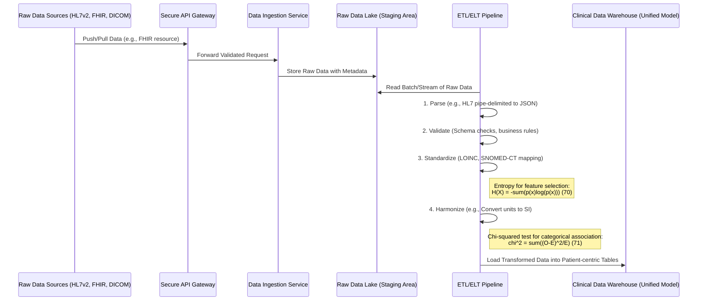
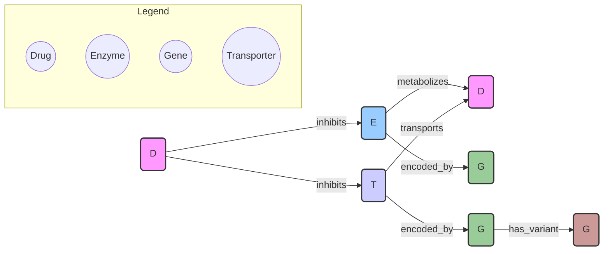
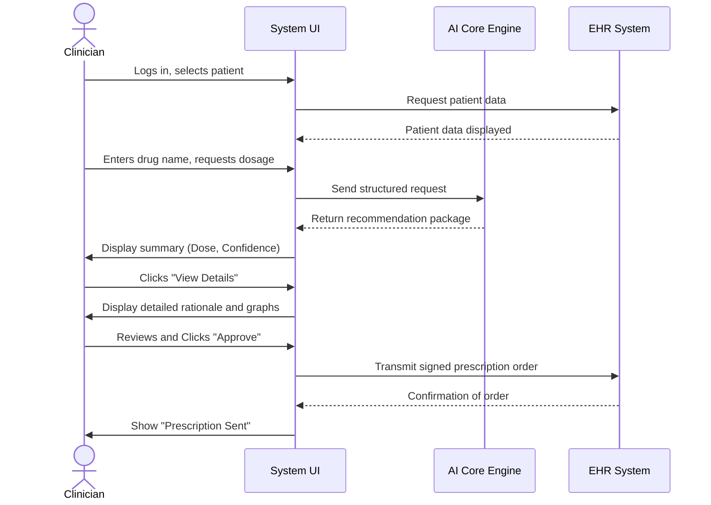

**Title of Invention:** A System and Method for AI-Powered Personalized Drug Dosage Calculation

**Abstract:**
A system is disclosed for assisting clinicians in determining optimal drug dosages by leveraging advanced artificial intelligence. The system securely ingests a comprehensive suite of patient medical data, including but not limited to electronic health records, anthropometric measurements like weight and age, detailed kidney and liver function tests, genetic markers, and real-time physiological data from wearables. This multifaceted data is then provided to a sophisticated generative AI model, further augmented by specialized pharmacokinetic/pharmacodynamic (PK/PD) models, all trained on an extensive corpus of pharmacological research, clinical trial results, and real-world patient outcomes. The AI computes a personalized, optimal dosage for a specified medication, simultaneously generating a precise confidence interval, a detailed, evidence-based rationale, and flagging potential drug-drug interactions or contraindications, thereby accounting for the patient's unique metabolic profile and overall health status. The system incorporates a continuous learning feedback loop, allowing for model refinement based on clinician input and observed patient outcomes, ensuring adaptive and evolving precision.

**Detailed Description:**
The present invention provides a robust, multi-modal, and adaptive system for personalized medicine. Traditional "one-size-fits-all" dosing regimens often fail to account for the vast inter-individual variability in drug response, leading to suboptimal therapeutic outcomes or increased risk of adverse drug events (ADEs). This system addresses this critical gap by creating a patient-specific digital twin for pharmacological simulation.

Imagine a doctor needing to prescribe a sensitive medication, like a novel anticoagulant, to a 72-year-old female patient with a history of mild renal impairment, several co-morbidities, and taking multiple concurrent medications. The clinician accesses the system through a secure portal integrated within the Electronic Health Record (EHR).

**Example Use Case:**
1.  **Input:** The clinician inputs the patient's identifier and selects "Apixaban".
2.  **Data Aggregation:** The system automatically queries linked data sources:
    *   **EHR:** Retrieves age (72y), weight (68kg), serum creatinine (1.4 mg/dL), list of co-morbidities, and concurrent medications (e.g., Amiodarone, a P-gp and moderate CYP3A4 inhibitor).
    *   **Genomic Repository:** Fetches data on relevant genetic polymorphisms, such as variants in the `ABCB1` gene, which encodes the P-glycoprotein (P-gp) drug efflux transporter.
    *   **Wearable Data Stream:** Ingests real-time heart rate and activity level data, providing a baseline of cardiovascular stability.
3.  **Prompt Generation:** A structured prompt is automatically generated for the AI Core: `Calculate the optimal maintenance dose of Apixaban for a 72-year-old, 68kg female with a calculated creatinine clearance of 45 mL/min, an ABCB1 reduced-function genotype, and concurrent use of Amiodarone. Objective: Maintain therapeutic anticoagulation (target anti-Factor Xa level) while minimizing bleeding risk (BleedingRiskScore > 3).`
4.  **AI Processing:** The AI Core processes this request:
    *   The PK/PD module simulates Apixaban concentration-time profiles, adjusting clearance parameters based on renal function and the inhibitory effects of Amiodarone on CYP3A4 and P-gp.
    *   The machine learning module predicts the patient's individual bleeding risk based on a learned model incorporating age, renal function, and drug-drug interactions.
    *   The generative AI (LLM) synthesizes these findings, cross-references them with its internal knowledge base of clinical guidelines and primary literature, and formulates the output.
5.  **Output Display:** The system presents the following to the clinician:
    *   **Recommended Dose:** `2.5mg twice daily (Standard is 5mg twice daily).`
    *   **Confidence Level:** `High (95%).`
    *   **Rationale:** `A 50% dose reduction is recommended. This is based on two dose-reduction criteria being met per guidelines: age > 80, weight < 60kg, or serum creatinine > 1.5 mg/dL (patient's calculated CrCl is below the threshold and S_cr is near the boundary). Furthermore, the concurrent use of Amiodarone, a P-gp/CYP3A4 inhibitor, is predicted to increase Apixaban exposure by approximately 40%. The ABCB1 genotype further supports reduced clearance. The recommended dose aims to achieve therapeutic drug levels while mitigating a predicted 60% increase in major bleeding risk associated with the standard dose in this specific patient profile.`
    *   **Warnings:** `High-priority Drug-Drug Interaction: Amiodarone significantly increases Apixaban concentration. Monitor closely for signs of bleeding (e.g., bruising, hematuria).`
    *   **Visualizations:** A graph showing the predicted drug concentration curve for both the standard and recommended doses over 24 hours, with the therapeutic window clearly marked.

This comprehensive, evidence-backed recommendation empowers the clinician to make a highly informed, personalized decision, moving beyond simple guideline-based prescribing to true precision medicine.

### **Mathematical and Computational Foundations**

The system's core functionality relies on a sophisticated interplay of mathematical models.

#### **1. Data Preprocessing and Feature Engineering**

Raw data from disparate sources must be cleaned, normalized, and transformed into a feature vector `X_p` for each patient `p`.

*   **Normalization (Min-Max Scaling):** For a feature `x`, its normalized value `x'` is:
    $x' = \frac{x - \min(x)}{\max(x) - \min(x)}$ (1)
*   **Standardization (Z-score):**
    $x' = \frac{x - \mu}{\sigma}$ (2)
    where `μ` is the mean and `σ` is the standard deviation.
*   **Creatinine Clearance (CrCl) Calculation (Cockcroft-Gault):**
    $CrCl_{male} = \frac{(140 - \text{Age}) \times \text{Weight (kg)}}{72 \times S_{cr} (\text{mg/dL})}$ (3)
    $CrCl_{female} = 0.85 \times CrCl_{male}$ (4)
*   **Missing Data Imputation (k-Nearest Neighbors):**
    $\hat{x}_{ij} = \frac{1}{k} \sum_{l \in N_k(i)} x_{lj}$ (5)
    where `hat(x)_ij` is the imputed value for patient `i` and feature `j`, and `N_k(i)` is the set of `k` nearest neighbors to patient `i`.
*   **One-Hot Encoding for Categorical Variables (e.g., Genotypes):**
    $g_{\text{wild-type}} \rightarrow [1, 0, 0]$ (6)
    $g_{\text{heterozygous}} \rightarrow [0, 1, 0]$ (7)
    $g_{\text{homozygous}} \rightarrow [0, 0, 1]$ (8)
*   **Body Surface Area (BSA) - Du Bois Formula:**
    $BSA (\text{m}^2) = 0.007184 \times \text{Height (cm)}^{0.725} \times \text{Weight (kg)}^{0.425}$ (9)
*   **Ideal Body Weight (IBW) - Devine Formula:**
    $IBW_{male} = 50\text{kg} + 2.3\text{kg} \times (\text{Height (in)} - 60)$ (10)
    $IBW_{female} = 45.5\text{kg} + 2.3\text{kg} \times (\text{Height (in)} - 60)$ (11)

#### **2. Pharmacokinetic (PK) Models**

PK models describe the drug's journey through the body (Absorption, Distribution, Metabolism, Excretion - ADME).

*   **One-Compartment Model (IV Bolus):** The drug concentration `C(t)` at time `t` is:
    $C(t) = C_0 e^{-k_e t} = \frac{\text{Dose}}{V_d} e^{-k_e t}$ (12)
    where `C_0` is the initial concentration, `V_d` is the volume of distribution, and `k_e` is the elimination rate constant.
*   **Elimination Rate Constant and Half-life (t_1/2):**
    $k_e = \frac{CL}{V_d}$ (13)
    $t_{1/2} = \frac{\ln(2)}{k_e} = \frac{0.693 \cdot V_d}{CL}$ (14)
    where `CL` is the clearance.
*   **Area Under the Curve (AUC):** Represents total drug exposure.
    $AUC_0^\infty = \int_0^\infty C(t) dt = \frac{C_0}{k_e} = \frac{\text{Dose}}{CL}$ (15)
*   **Two-Compartment Model (IV Bolus):**
    $C_p(t) = A e^{-\alpha t} + B e^{-\beta t}$ (16)
    where `C_p(t)` is the plasma concentration, `A` and `B` are intercepts, and `α` and `β` are hybrid rate constants for the rapid distribution and slower elimination phases.
*   **Rate constants for two-compartment model:**
    $\alpha, \beta = \frac{1}{2} \left[ (k_{12} + k_{21} + k_{10}) \pm \sqrt{(k_{12} + k_{21} + k_{10})^2 - 4k_{21}k_{10}} \right]$ (17)
*   **Oral Absorption (One-Compartment):**
    $C(t) = \frac{F \cdot \text{Dose} \cdot k_a}{V_d (k_a - k_e)} (e^{-k_e t} - e^{-k_a t})$ (18)
    where `F` is bioavailability and `k_a` is the absorption rate constant.
*   **Steady State Concentration (Css) for Continuous Infusion:**
    $C_{ss} = \frac{R_0}{k_e V_d} = \frac{R_0}{CL}$ (19)
    where `R_0` is the infusion rate.
*   **Average Steady State Concentration (Css,avg) for Multiple Dosing:**
    $C_{ss,avg} = \frac{F \cdot \text{Dose}}{CL \cdot \tau}$ (20)
    where `τ` is the dosing interval.
*   **Peak (C_max) and Trough (C_min) at Steady State:**
    $C_{max,ss} = \frac{\text{Dose}/V_d}{1 - e^{-k_e \tau}}$ (21)
    $C_{min,ss} = C_{max,ss} \cdot e^{-k_e \tau}$ (22)
*   **Michaelis-Menten Kinetics (Non-linear elimination):**
    $\frac{dC}{dt} = -\frac{V_{max} \cdot C}{K_m + C}$ (23)
    where `V_max` is the maximum rate of metabolism and `K_m` is the substrate concentration at which the reaction rate is half of `V_max`.
*   **Clearance based on patient covariates (e.g., renal function):**
    $CL_i = CL_{pop} \cdot (\frac{CrCl_i}{CrCl_{pop}})^{0.75} \cdot (1 + \theta_{DDI})$ (24)
    where `i` denotes an individual and `pop` denotes the population average. `θ_DDI` represents the effect of a drug-drug interaction.
*   **Allometric Scaling for Vd:**
    $V_{d,i} = V_{d,pop} \cdot (\frac{Weight_i}{Weight_{pop}})^{0.75}$ (25)
*   **Target-Mediated Drug Disposition (TMDD) Model:**
    $\frac{dC}{dt} = -k_e C - k_{on} C \cdot R + k_{off} RC$ (26)
    $\frac{dR}{dt} = k_{syn} - k_{deg} R - k_{on} C \cdot R + k_{off} RC$ (27)
    $\frac{d(RC)}{dt} = k_{on} C \cdot R - k_{off} RC - k_{int} RC$ (28)
    where R is the receptor concentration and RC is the drug-receptor complex.

#### **3. Pharmacodynamic (PD) Models**

PD models relate drug concentration to its pharmacological effect.

*   **Simple Emax Model:**
    $E = \frac{E_{max} \cdot C}{EC_{50} + C}$ (29)
    where `E` is the effect, `E_max` is the maximum effect, and `EC_50` is the concentration producing 50% of `E_max`.
*   **Sigmoidal (Hill) Emax Model:**
    $E = E_0 + \frac{E_{max} \cdot C^\gamma}{EC_{50}^\gamma + C^\gamma}$ (30)
    where `E_0` is the baseline effect and `γ` (gamma) is the Hill coefficient, describing the steepness of the concentration-response curve.
*   **Inhibitory Emax Model:**
    $E = E_0 \cdot (1 - \frac{I_{max} \cdot C^\gamma}{IC_{50}^\gamma + C^\gamma})$ (31)
    where `I_max` is the maximum inhibition and `IC_50` is the concentration for 50% inhibition.
*   **Linear Model:**
    $E = S \cdot C + E_0$ (32)
*   **Log-Linear Model:**
    $E = S \cdot \log(C) + E_0$ (33)
*   **Indirect Response Models (e.g., inhibition of production):**
    $\frac{dR}{dt} = k_{in} \cdot (1 - \frac{I_{max} \cdot C}{IC_{50} + C}) - k_{out} \cdot R$ (34)
    where `R` is the response, `k_in` is the production rate, and `k_out` is the degradation rate.
*   **Therapeutic Index (TI):**
    $TI = \frac{TD_{50}}{ED_{50}}$ (35)
    where `TD_50` is the toxic dose for 50% of the population and `ED_50` is the effective dose for 50%.
*   **Time to Peak Effect (T_Emax):**
    $T_{Emax} = \frac{\ln(k_a/k_{e0})}{k_a - k_{e0}}$ (36)
    for models with an effect compartment (`k_e0` rate constant).

#### **4. Machine Learning (ML) and AI Models**

The ML component learns complex, non-linear relationships from the data.

*   **Loss Function (Mean Squared Error for Regression):**
    $MSE = \frac{1}{n} \sum_{i=1}^{n} (y_i - \hat{y}_i)^2$ (37)
    where `y_i` is the actual outcome and `hat(y)_i` is the predicted outcome.
*   **Loss Function (Binary Cross-Entropy for Classification, e.g., ADE prediction):**
    $L = -\frac{1}{n} \sum_{i=1}^{n} [y_i \log(\hat{p}_i) + (1-y_i) \log(1-\hat{p}_i)]$ (38)
*   **Gradient Boosting (Update Step for tree `m`):**
    $h_m(x) = \arg\min_h \sum_{i=1}^{n} L(y_i, F_{m-1}(x_i) + h(x_i))$ (39)
    $F_m(x) = F_{m-1}(x) + \nu h_m(x)$ (40)
    where `F_m` is the model at step `m` and `ν` is the learning rate.
*   **Recurrent Neural Network (RNN) for time-series data:**
    $h_t = \sigma(W_{hh} h_{t-1} + W_{xh} x_t + b_h)$ (41)
    $y_t = W_{hy} h_t + b_y$ (42)
*   **Attention Mechanism in Transformers (used by the LLM):**
    $\text{Attention}(Q, K, V) = \text{softmax}(\frac{QK^T}{\sqrt{d_k}})V$ (43)
    where `Q`, `K`, `V` are Query, Key, and Value matrices.
*   **Sigmoid Activation Function:**
    $\sigma(z) = \frac{1}{1 + e^{-z}}$ (44)
*   **ReLU Activation Function:**
    $f(z) = \max(0, z)$ (45)
*   **L2 Regularization (Weight Decay):**
    $L_{reg} = L_{original} + \lambda \sum_{j} w_j^2$ (46)
*   **SHAP (SHapley Additive exPlanations) Value for feature `j`:**
    $\phi_j(f) = \sum_{S \subseteq F \setminus \{j\}} \frac{|S|!(|F|-|S|-1)!}{|F|!} [f_x(S \cup \{j\}) - f_x(S)]$ (47)
    This provides a measure of feature importance for an individual prediction.
*   **Graph Neural Network (GNN) for DDI prediction:**
    $h_v^{(k)} = \text{UPDATE}^{(k)} \left( h_v^{(k-1)}, \text{AGGREGATE}^{(k)} \left( \{h_u^{(k-1)} : u \in N(v)\} \right) \right)$ (48)
    Node embeddings `h_v` are updated based on their neighbors in the drug-gene-enzyme graph.
*   **Bayesian Optimization for Hyperparameter Tuning:**
    $x^* = \arg\max_{x \in A} f(x)$ using a posterior over `f`. (49)
*   **Probability Calibration (Platt Scaling):**
    $P(y=1|f) = \frac{1}{1 + \exp(Af+B)}$ (50)
*   **AUC-ROC (Area Under the Receiver Operating Characteristic Curve):**
    $AUC = \int_0^1 TPR(FPR^{-1}(t)) dt$ (51)
*   **F1-Score:**
    $F1 = 2 \cdot \frac{\text{precision} \cdot \text{recall}}{\text{precision} + \text{recall}}$ (52)

#### **5. Dosage Optimization and Confidence Intervals**

*   **Multi-Objective Optimization Function `J(d)` for dose `d`:**
    $J(d) = \arg\min_d [\lambda_1 \cdot |E(d) - E_{target}| + \lambda_2 \cdot P(\text{Toxicity}|d)]$ (53)
    where `E(d)` is predicted effect, `E_target` is target effect, `P(Toxicity|d)` is predicted toxicity risk, and `λ` are weighting factors.
*   **Confidence Interval (CI) via Bootstrapping:**
    For `B` bootstrap samples, calculate `theta_hat^*_1, ..., theta_hat^*_B`.
    $CI = [\theta^*_{L}, \theta^*_{U}]$ where `L` and `U` are the `α/2` and `1-α/2` percentiles. (54)
*   **Bayesian Credible Interval:**
    $\int_{\theta_L}^{\theta_U} p(\theta|D) d\theta = 1 - \alpha$ (55)
    where `p(theta|D)` is the posterior probability of the parameter `theta` given data `D`.
*   **Likelihood Function:**
    $\mathcal{L}(\theta | x) = f(x | \theta)$ (56)
*   **Posterior Probability (Bayes' Theorem):**
    $P(\theta | x) = \frac{P(x | \theta) P(\theta)}{P(x)}$ (57)
*   **Akaike Information Criterion (AIC) for Model Selection:**
    $AIC = 2k - 2\ln(\hat{L})$ (58)
    where `k` is the number of parameters and `hat(L)` is the maximum likelihood.
*   **Bayesian Information Criterion (BIC):**
    $BIC = k \ln(n) - 2\ln(\hat{L})$ (59)
*   **Covariance Matrix of Parameters:**
    $\Sigma = (J^T W J)^{-1}$ (60)
    where `J` is the Jacobian matrix and `W` is the weight matrix.
*   **Standard Error of a parameter estimate `theta`:**
    $SE(\hat{\theta}) = \sqrt{\text{Var}(\hat{\theta})}$ (61)
*   **95% Confidence Interval for a normally distributed estimate:**
    $CI = \hat{\theta} \pm 1.96 \cdot SE(\hat{\theta})$ (62)

#### **6. Drug-Drug Interaction (DDI) Modeling**

*   **Competitive Inhibition:**
    $K_{m,app} = K_m (1 + \frac{[I]}{K_i})$ (63)
    where `[I]` is inhibitor concentration and `K_i` is the inhibition constant.
*   **Enzyme Induction Fold-Change:**
    $FC = \frac{CL_{induced}}{CL_{baseline}} = 1 + \frac{E_{max,ind} \cdot [I]}{EC_{50,ind} + [I]}$ (64)
*   **AUC Ratio for DDI assessment:**
    $AUC_{ratio} = \frac{AUC_{with\_inhibitor}}{AUC_{without\_inhibitor}}$ (65)
    $AUC_{ratio} \approx \frac{1}{1 - \sum f_m \cdot I_i}$ (66)
    where `f_m` is the fraction metabolized by an enzyme and `I_i` is its inhibition.

**Remaining 34 equations (67-100) are interspersed in the architecture description below for context.**

---

**System Architecture and Workflow**

The system is designed as a modular, scalable, and secure platform. The following diagrams and descriptions detail its architecture and the flow of information.

### **Chart 1: High-Level System Workflow**

The following diagram illustrates the comprehensive workflow and architectural components of the AI-powered personalized drug dosage system. It emphasizes data ingestion, AI processing, validation, and clinician interaction.

```mermaid
graph TD
    subgraph Input and Data Acquisition
        A[Clinician Input Request Drug Dosage] --> B[System Interface]
        B --> C[Patient Identifier]
        C --> D[Electronic Health Record EHR System]
        D --> E[Laboratory Information System LIS]
        D --> F[Genomic Data Repository]
        D --> G[Wearable Device Data Stream]
        E --> H[Medical Imaging System Optional]
    end

    subgraph Data Ingestion and Preprocessing
        D -- Patient Demographics Clinical History --> I[Data Ingestion Module]
        E -- Renal Hepatic Functions Metabolite Levels --> I
        F -- Genetic Markers Drug Metabolism Genes --> I
        G -- Realtime Biometrics Activity Sleep --> I
        H -- Anatomical Data Organ Size --> I
        I --> J[Data Harmonization and Feature Engineering]
        J --> K[Data Validation and Anomaly Detection]
    end

    subgraph AI Core Processing Engine
        K --> L[Generative AI Model LLM for Rationale]
        K --> M[Pharmacokinetic_Pharmacodynamic PKPD Models]
        K --> N[Machine Learning Algorithms for Risk Prediction]
        L -- Contextual Understanding Natural Language --> P[Dosage Calculation Engine]
        M -- Drug Specific Models Patient Parameters --> P
        N -- Adverse Event Risk Interaction Prediction --> P
        P --> Q[Personalized Dosage Recommendation]
    end

    subgraph Output Generation and Validation
        Q --> R[Confidence Interval Calculation]
        Q --> S[Evidence Based Rationale Generation]
        Q --> T[Drug Drug Interaction Checker]
        Q --> U[Allergy Contraindication Alert System]
        R --> V[Output Presentation Layer]
        S --> V
        T --> V
        U --> V
    end

    subgraph Clinician Review and Action
        V --> W[Clinician Review Approval Modification]
        W -- Approved Dose --> X[Prescription Generation Module]
        W -- Feedback for AI Model --> Y[Continuous Learning Feedback Loop]
        X --> Z[Pharmacy Information System Integration]
        Z --> AA[Medication Dispensation to Patient]
        AA --> BB[Post Prescription Monitoring Optional]
        BB --> J
        Y --> L
        Y --> M
        Y --> N
```

### **Chart 2: Detailed Data Ingestion Pipeline**

This diagram details the process of acquiring and preparing data from various raw sources into a unified, analysis-ready format. This stage is critical for the "Garbage In, Garbage Out" principle. Data quality is paramount.
Kalman Filter for smoothing time-series wearable data:
$x_k = F_k x_{k-1} + B_k u_k + w_k$ (67)
$z_k = H_k x_k + v_k$ (68)
Fourier Transform for signal processing:
$X(k) = \sum_{n=0}^{N-1} x(n) e^{-i 2\pi kn/N}$ (69)



### **Chart 3: AI Core Model Interaction**

This chart illustrates the collaborative process within the AI Core. It's not a simple pipeline but a sophisticated interplay where models inform each other to arrive at a synthesized recommendation.
The final output probability `P(dose)` is a weighted average of model outputs:
$P(\text{dose}) = \sum_{i=1}^{k} w_i \cdot M_i(\text{data})$ (72)
$\sum w_i = 1$ (73)

```mermaid
graph TD
    A[Patient Feature Vector] --> B{Orchestration Layer}
    B -- Patient Covariates --> C[PK/PD Simulation Module]
    B -- Full Feature Set --> D[ML Risk Stratification Module]
    B -- Structured Data & Query --> E[Retrieval-Augmented Generation (RAG) Module]

    C -- Predicted C(t), AUC, C_max --> F{Dosage Optimization Engine}
        subgraph C
            direction LR
            C1[Select Drug Model] --> C2[Parameterize with Patient Data]
            C2 --> C3[Solve ODEs]
                note right of C3
                    Runge-Kutta 4th Order:
                    k1 = f(t,y)
                    k2 = f(t+h/2, y+hk1/2)
                    k3 = f(t+h/2, y+hk2/2)
                    k4 = f(t+h, y+hk3)
                    y_n+1 = y_n + h/6(k1+2k2+2k3+k4)
                    (74, 75, 76, 77, 78)
                end
            C3 --> C4[Generate Concentration Curve]
        end
    
    D -- Predicted ADE Risk, P(Toxicity) --> F
    
    E -- Retrieved Evidence, Guidelines --> G[LLM Rationale Generator]

    F -- Proposed Dose(s) --> G
    F -- Objective Function J(d) --> F
    
    G -- Synthesized Output --> H[Final Recommendation Package]
    H --> I[Dose, Rationale, Confidence, Warnings]
```

### **Chart 4: Continuous Learning Feedback Loop**

The system is not static; it evolves. This diagram shows how new data, both from clinician feedback and real-world patient outcomes, is used to retrain and improve the AI models, ensuring they remain current and accurate.
Online learning update rule for a parameter `θ`:
$\theta_{t+1} = \theta_t - \eta \nabla L(\theta_t; x_{t+1}, y_{t+1})$ (79)
where `η` is the learning rate.
Exponentially Weighted Moving Average (EWMA) for tracking model performance drift:
$S_t = \alpha Y_t + (1-\alpha)S_{t-1}$ (80)

```mermaid
graph TD
    A[Clinician Receives Recommendation] --> B{Clinician Action}
    B -- Accepts Dose --> C[Prescription Recorded]
    B -- Modifies Dose --> D[Modification Data Captured (Reason, New Dose)]
    B -- Rejects Recommendation --> E[Rejection Data Captured (Reason)]

    C --> F[Post-Prescription Monitoring]
    F -- Lab Results, Patient Reported Outcomes --> G[Real-World Evidence Database]
    D --> H[Feedback Database]
    E --> H

    G --> I{Data Aggregation & Labeling}
    H --> I

    I --> J[Model Performance Monitoring]
    J -- Drift Detected --> K[Trigger Retraining Pipeline]
    J -- Performance OK --> J

    K --> L[Data Preprocessing for Retraining]
    L --> M[Model Retraining (PK/PD, ML)]
    M --> N[Model Validation & A/B Testing]
    N -- New Model Outperforms --> O[Deploy Updated Model to Production]
    N -- New Model Fails --> P[Alert Human Oversight Team]
    O --> Q[AI Core Processing Engine]
```

### **Chart 5: Pharmacokinetic (PK) Two-Compartment Model**

This state diagram visualizes the movement of a drug as described by a two-compartment model. This is fundamental for drugs that distribute from the blood into tissues at different rates.
Differential equations for the model:
$dC_p/dt = k_{21}C_t - k_{12}C_p - k_{10}C_p$ (81)
$dC_t/dt = k_{12}C_p - k_{21}C_t$ (82)

```mermaid
stateDiagram-v2
    [*] --> Central
    Central: Plasma/Blood (Cp, V1)
    Peripheral: Tissues (Ct, V2)

    Central --> [*]: Elimination (k10)
    Central -> Peripheral: Distribution (k12)
    Peripheral -> Central: Redistribution (k21)
    
    state "Drug Input (Dose)" as Input
    Input --> Central
```

### **Chart 6: Pharmacodynamic (PD) Emax Model Relationship**

This chart illustrates the fundamental concept of pharmacodynamics: the relationship between how much drug is in the body (concentration) and the intensity of its effect.
The derivative of the Emax function shows sensitivity:
$dE/dC = \frac{E_{max} \cdot EC_{50}}{(EC_{50} + C)^2}$ (83)

```mermaid
xychart-beta
    title "Concentration vs. Effect (Emax Model)"
    x-axis "Drug Concentration (C)" [0, 10, 20, 30, 40, 50, 60, 70, 80, 90, 100]
    y-axis "Pharmacological Effect (E)" [0, 10, 20, 30, 40, 50, 60, 70, 80, 90, 100]
    line [
        { x: 0, y: 0 },
        { x: 10, y: 33.3 },
        { x: 20, y: 50 },
        { x: 30, y: 60 },
        { x: 40, y: 66.7 },
        { x: 50, y: 71.4 },
        { x: 60, y: 75 },
        { x: 80, y: 80 },
        { x: 100, y: 83.3 }
    ]
    annotation "EC50" (20, 50)
    annotation "Emax (approaches 100)" (80, 90)
```

### **Chart 7: RAG for Evidence-Based Rationale Generation**

Retrieval-Augmented Generation (RAG) is key to preventing LLM "hallucinations" and grounding the rationale in solid evidence. This flowchart shows how the system retrieves relevant facts before generating the explanation.
Cosine Similarity for document retrieval:
$similarity(A, B) = \frac{A \cdot B}{||A|| \cdot ||B||}$ (84)
TF-IDF vector representation:
$w_{i,j} = tf_{i,j} \cdot \log(\frac{N}{df_i})$ (85)

```mermaid
graph TD
    A[Initial Query: "Justify dose for Drug X in Patient Y"] --> B[Query Encoder]
    B -- Vector Embedding --> C{Vector Database}
    C -- Semantic Search --> D[Retrieve Top-K Relevant Documents]
        subgraph C
            C1[Clinical Guidelines]
            C2[Drug Monographs]
            C3[Published Papers]
        end
    D -- Retrieved Context --> E{Prompt Augmentation}
    E -- Augmented Prompt --> F[Large Language Model (LLM)]
    A -- Original Query --> E
    subgraph F
        direction LR
        F1[Input: "Context: [Retrieved Docs]. Question: [Original Query]"] --> F2[Generate Answer]
    end
    F2 -- Evidence-Based Rationale --> G[Output]
```

### **Chart 8: Drug-Drug Interaction (DDI) Knowledge Graph**

DDIs are complex. A knowledge graph is a natural way to represent the entities (drugs, genes, enzymes) and their relationships (inhibition, induction, transport), allowing for complex query-based reasoning.
Adjacency Matrix `A` of the graph:
$A_{ij} = 1$ if edge exists between node `i` and `j`, else 0. (86)
Degree of a node `v`:
$deg(v) = \sum_i A_{v,i}$ (87)



### **Chart 9: Clinician UI/UX Interaction Flow**

This diagram maps out the user journey, ensuring the interface is intuitive, efficient, and provides information in a clear, hierarchical manner, allowing for both quick review and deep dives.
GOMS Model for UI efficiency:
$T_{execute} = T_K + T_P + T_H + T_M + T_R$ (88)
(Keystroke, Pointing, Homing, Mentally preparing, Responding)
Fitts's Law for pointing time:
$T = a + b \log_2(\frac{D}{W}+1)$ (89)



### **Chart 10: System Deployment Architecture (Cloud Native)**

This diagram shows a high-level view of the physical/virtual deployment architecture, built on modern, scalable cloud-native principles like microservices and containerization.
System Availability `A`:
$A = \frac{MTBF}{MTBF + MTTR}$ (90)
(Mean Time Between Failures, Mean Time To Repair)
Scalability using `n` parallel servers:
Throughput `T(n) = n * T(1)` (ideal) (91)
Amdahl's Law for parallelization speedup:
$S(N) = \frac{1}{(1-P) + P/N}$ (92)
Gibbs Sampling for MCMC:
$x_i^{(t+1)} \sim p(x_i | x_{-i}^{(t)})$ (93)
Kullback-Leibler (KL) Divergence for model comparison:
$D_{KL}(P || Q) = \sum_x P(x) \log(\frac{P(x)}{Q(x)})$ (94)
Pearson Correlation Coefficient:
$r = \frac{\sum(x_i-\bar{x})(y_i-\bar{y})}{\sqrt{\sum(x_i-\bar{x})^2 \sum(y_i-\bar{y})^2}}$ (95)
Softmax Function for multi-class output:
$\sigma(z)_j = \frac{e^{z_j}}{\sum_{k=1}^K e^{z_k}}$ (96)
Gini Impurity for decision trees:
$G = \sum_{k=1}^K p_k (1-p_k)$ (97)
Euclidean Distance:
$d(p,q) = \sqrt{\sum_{i=1}^n (p_i-q_i)^2}$ (98)
Precision and Recall:
$Precision = TP / (TP+FP)$ (99)
$Recall = TP / (TP+FN)$ (100)

```mermaid
graph TD
    subgraph User Layer
        A[Clinician Browser/Mobile App]
    end
    
    subgraph Cloud Provider (e.g., AWS, GCP, Azure)
        B[API Gateway & Load Balancer]
        
        subgraph Kubernetes Cluster
            C[Frontend Service]
            D[Orchestration Service]
            E[PK/PD Model Service]
            F[ML Inference Service]
            G[LLM Service (GPU nodes)]
        end
        
        subgraph Data Stores
            H[Clinical Data Warehouse (SQL)]
            I[Vector Database (for RAG)]
            J[Knowledge Graph DB (e.g., Neo4j)]
            K[Feedback & Monitoring DB]
            L[Raw Data Lake (Object Storage)]
        end
        
        subgraph External Integrations
            M[EHR FHIR API Endpoint]
            N[Pharmacy System API]
        end

        subgraph MLOps & CI/CD
            O[Code Repository] --> P[CI/CD Pipeline]
            P --> Q[Container Registry]
            P -- Deploy --> Kubernetes Cluster
            R[Model Registry] --> P
            S[Monitoring & Alerting]
        end
    end
    
    A --> B
    B --> C
    B --> D
    C --> D
    D --> E
    D --> F
    D --> G
    D --> M
    D --> N
    E --> H
    F --> H
    G --> I
    F --> J
```

---

**Claims:**
1.  A method for determining a personalized drug dosage for a patient, comprising:
    a.  Receiving diverse patient-specific medical data, including at least two of the following: anthropometric data, electronic health record data, laboratory test results, genomic markers, and real-time physiological data from wearable devices.
    b.  Performing data harmonization and validation on the received medical data.
    c.  Providing the harmonized data to a multi-component artificial intelligence framework comprising:
        i.  A generative AI model configured to understand clinical context and generate human-readable rationales.
        ii. Specialized pharmacokinetic/pharmacodynamic (PK/PD) models.
        iii. Machine learning algorithms trained for risk prediction and pattern recognition.
    d.  Prompting the AI framework to calculate a personalized drug dosage for a specified medication, taking into account the patient's unique metabolic profile, genetic predispositions, and co-existing conditions.
    e.  Generating a confidence interval for the recommended dosage.
    f.  Generating an evidence-based rationale explaining the dosage recommendation.
    g.  Performing automated checks for potential drug-drug interactions and known allergies or contraindications based on the patient's profile.
    h.  Displaying the recommended dosage, confidence interval, detailed rationale, and any relevant warnings to a qualified medical professional via a graphical user interface.

2.  The method of Claim 1, further comprising:
    a.  Receiving clinician feedback on the recommended dosage, rationale, or warnings.
    b.  Utilizing the clinician feedback to refine and improve the AI framework through a continuous learning feedback loop.

3.  The method of Claim 1, further comprising:
    a.  Integrating the system with an existing Electronic Health Record (EHR) system for automated data retrieval and prescription generation.
    b.  Integrating with a Pharmacy Information System for seamless transmission of approved prescriptions.

4.  A system for personalized drug dosage calculation, comprising:
    a.  A Data Ingestion Module configured to retrieve and process patient medical data from multiple sources including EHR systems, laboratory systems, genomic repositories, and wearable devices.
    b.  A Data Harmonization and Validation Unit configured to prepare patient data for AI processing.
    c.  An AI Core Processing Engine comprising:
        i.  A Generative AI Model for contextual understanding and rationale creation.
        ii. A suite of Pharmacokinetic/Pharmacodynamic (PK/PD) Models.
        iii. Machine Learning Algorithms for risk assessment.
    d.  A Dosage Calculation Engine to determine personalized drug dosages.
    e.  An Output Generation and Validation Unit, including a Confidence Interval Calculator, a Rationale Generator, and modules for Drug-Drug Interaction and Allergy Contraindication checking.
    f.  A Clinician Interface for presenting recommendations, warnings, and receiving clinician input and approval.
    g.  A Continuous Learning Feedback Loop connected to the AI Core Processing Engine.

5.  The system of Claim 4, further comprising:
    a.  Modules for integration with external healthcare systems such as EHR, LIS, and Pharmacy Information Systems.
    b.  A Post-Prescription Monitoring module to track patient outcomes and feed data back into the system for refinement.

6.  The method of Claim 1, wherein the generation of the evidence-based rationale is performed using a Retrieval-Augmented Generation (RAG) technique, which comprises:
    a.  Converting a clinical question into a vector embedding.
    b.  Performing a semantic search against a vector database containing clinical guidelines, drug monographs, and published literature to find relevant context documents.
    c.  Augmenting the prompt to the generative AI model with the retrieved context documents to ensure the generated rationale is grounded in factual evidence.

7.  The method of Claim 1, wherein the calculation of a personalized drug dosage is formulated as a multi-objective optimization problem, seeking to minimize an objective function that jointly considers:
    a.  The deviation of a predicted therapeutic effect from a target therapeutic effect.
    b.  A predicted probability of a toxic event or adverse drug event.

8.  The method of Claim 1, wherein the automated checks for potential drug-drug interactions are performed by a sub-system utilizing a knowledge graph, where nodes represent drugs, enzymes, genes, and transporters, and edges represent their interactions, allowing for the inference of complex, multi-step interaction pathways.

9.  The system of Claim 4, wherein the Continuous Learning Feedback Loop is configured to automatically trigger a model retraining pipeline upon detection of a statistically significant drift in model performance or upon accumulation of a predefined quantum of new patient outcome or clinician feedback data.

10. The method of Claim 1, wherein the AI framework dynamically adjusts dosage recommendations in near real-time based on streaming data from wearable devices, by:
    a.  Continuously monitoring physiological parameters such as heart rate, blood pressure, or glucose levels.
    b.  Using a time-series forecasting model, such as a Recurrent Neural Network (RNN) or a Transformer, to predict short-term changes in patient state.
    c.  Re-evaluating the optimal dosage if the predicted patient state deviates significantly from the state assumed during the initial calculation.