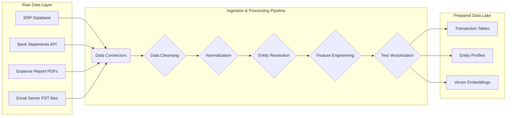
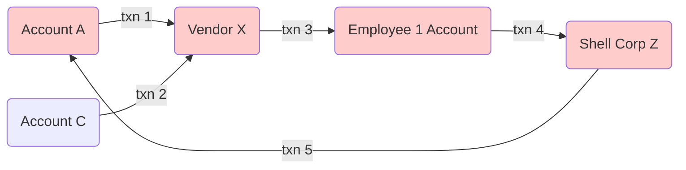
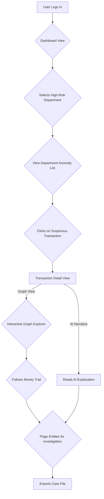
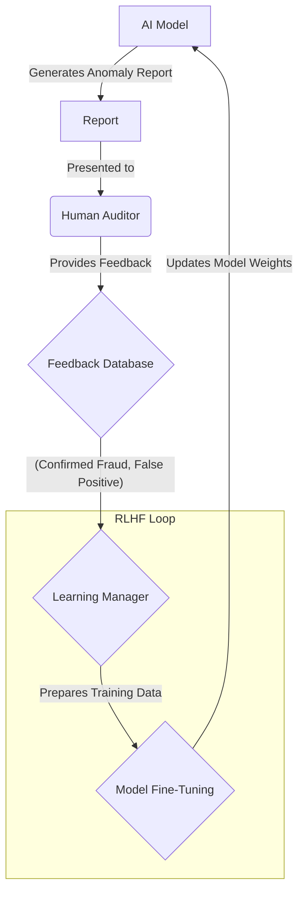
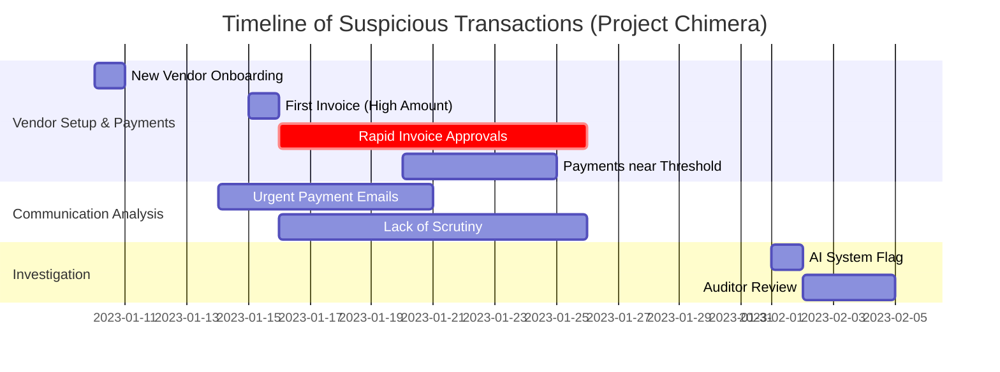
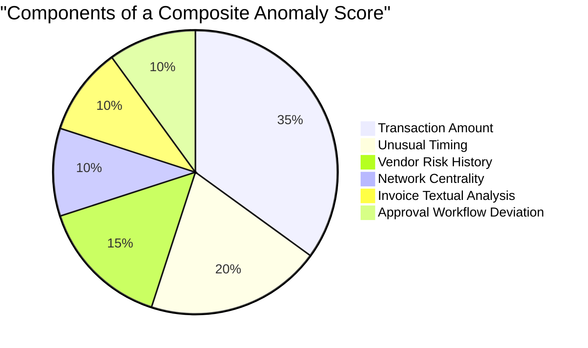

**Title of Invention:** A System and Method for AI-Powered Forensic Accounting

**Abstract:**
A system, method, and computer-readable medium for automating and enhancing forensic accounting are disclosed. The system ingests a large volume of heterogeneous financial data, including transaction ledgers, bank statements, expense reports, emails, and corporate communications. A hybrid generative and analytical AI model, trained on global accounting principles, regulatory standards, and a vast corpus of known fraud patterns, analyzes the multi-modal data to identify complex anomalies indicative of fraudulent activity. The AI identifies and correlates suspicious patterns such as Benford's Law deviations, round-number transactions, unusual payment timings, collusive vendor networks, and sentiment shifts in communications. The system generates a dynamic, interactive, and detailed report of high-risk transactions, entities, and temporal periods, providing a prioritized workflow for a human auditor to investigate with unprecedented depth and efficiency.

**Field of the Invention:**
The present invention relates generally to the field of financial auditing and accounting. More specifically, it pertains to systems and methods that leverage artificial intelligence, machine learning, and natural language processing for the purpose of forensic accounting and fraud detection.

**Background of the Invention:**
Forensic accounting is a specialized practice area of accountancy that describes engagements that result from actual or anticipated disputes or litigation. "Forensic" means "suitable for use in a court of law". Forensic accountants, also referred to as forensic auditors or investigative auditors, are often called upon to provide expert evidence at trial. Traditional forensic accounting is a labor-intensive, time-consuming, and expensive process. Auditors must manually sift through mountains of documents, spreadsheets, and databases to uncover irregularities. The sheer volume of modern digital financial data makes comprehensive manual review practically impossible, forcing auditors to rely on sampling techniques, which may miss sophisticated, deeply embedded fraud schemes. Existing software tools offer some automation for specific tests (like Benford's Law) but lack the cognitive, contextual, and correlational capabilities to understand and investigate complex fraud narratives that span multiple data sources and types. There is a pressing need for a more intelligent, holistic, and efficient solution.

**Summary of the Invention:**
The disclosed invention addresses the limitations of prior art by providing an integrated AI-powered system that automates the detection, analysis, and reporting of potential financial fraud. The system employs a hybrid AI architecture, combining the pattern recognition strengths of analytical machine learning models with the contextual understanding and natural language capabilities of large language models (LLMs). This synergistic approach enables the system to not only identify statistical anomalies in transactional data but also to understand the context behind them by analyzing related communications, contracts, and reports. The system constructs a knowledge graph of financial entities and transactions to uncover hidden relationships and collusive networks. A continuous learning mechanism using Reinforcement Learning from Human Feedback (RLHF) ensures the AI model's efficacy improves over time by learning from the expertise and conclusions of human auditors. The final output is an interactive dashboard that visualizes high-risk areas, provides AI-generated narratives for suspicious activities, and offers drill-down capabilities for granular investigation, thereby transforming the role of the forensic accountant from a manual data cruncher to a strategic investigator.

**Brief Description of the Drawings:**
The invention will be more fully understood from the following detailed description taken in conjunction with the accompanying drawings, in which:
- Figure 1 is a Mermaid diagram illustrating the high-level system architecture.
- Figure 2 is a Mermaid diagram showing the data ingestion and preprocessing pipeline.
- Figure 3 is a Mermaid diagram detailing the hybrid AI core model architecture.
- Figure 4 is a Mermaid chart visualizing a Benford's Law analysis.
- Figure 5 is a Mermaid diagram representing a transaction graph for collusion detection.
- Figure 6 is a Mermaid flowchart illustrating the user interaction and investigation workflow.
- Figure 7 is a Mermaid diagram depicting the continuous model training and RLHF loop.
- Figure 8 is a Mermaid diagram of the fraud risk scoring funnel.
- Figure 9 is a Mermaid Gantt chart showing a timeline of suspicious transaction clusters.
- Figure 10 is a Mermaid pie chart breaking down the components of a composite anomaly score.

**Detailed Description of the Preferred Embodiments:**

### 1.0 System Architecture and Overview

The system is designed as a modular, scalable platform. The core components include: (1) a multi-source data ingestion module, (2) a data preprocessing and normalization engine, (3) the core AI analysis engine, (4) a fraud detection pattern library, (5) an interactive reporting and visualization dashboard, and (6) a continuous learning module.

```mermaid
graph TD
    A[Data Sources] --> B{Data Ingestion Module};
    A -- ERP Systems --> B;
    A -- Bank Feeds --> B;
    A -- Expense Reports --> B;
    A -- Emails & Comms --> B;
    B --> C{Data Preprocessing & Normalization};
    C --> D[Structured & Vectorized Data Lake];
    D --> E{Core AI Analysis Engine};
    E -- Analytical Models --> F[Anomaly Detection];
    E -- Generative LLM --> G[Contextual Analysis & Reporting];
    E -- Graph Neural Networks --> H[Network Analysis];
    F & G & H --> I{Risk Scoring & Aggregation};
    I --> J[Interactive Reporting Dashboard];
    J -- Auditor Feedback --> K{Continuous Learning Module (RLHF)};
    K --> E;

    subgraph "AI Core"
        E
        F
        G
        H
    end

    style J fill:#f9f,stroke:#333,stroke-width:2px
```
*Figure 1: High-level system architecture.*

### 2.0 Data Ingestion and Preprocessing Module

This module securely connects to a wide array of data sources. It uses dedicated connectors for major ERP systems (e.g., SAP, Oracle), APIs for bank feeds and credit card statements, and parsers for unstructured data like PDFs (invoices, contracts) and emails. The ingestion process is governed by strict data governance and security protocols.

The preprocessing stage involves:
1.  **Data Cleansing:** Handling missing values, correcting data types, and removing duplicates.
    Let $$X$$ be a dataset matrix. A missing value at $$X_{ij}$$ can be imputed using the mean of column $$j$$:
    $$ X_{ij} = \frac{1}{m-1} \sum_{k=1, k \neq i}^{m} X_{kj} \quad (1) $$
2.  **Normalization/Standardization:** Scaling numerical features to a common range, e.g., using Z-score normalization:
    $$ z = \frac{x - \mu}{\sigma} \quad (2) $$
    where $$\mu$$ is the mean and $$\sigma$$ is the standard deviation.
3.  **Entity Resolution:** Identifying and merging records that refer to the same real-world entity (e.g., "Corp Inc." and "Corp Incorporated").
4.  **Feature Engineering:** Creating new, informative features from raw data.
5.  **Vectorization:** Converting textual data into numerical vectors using techniques like TF-IDF or word embeddings.
    $$ \text{tf-idf}(t, d, D) = \text{tf}(t, d) \times \text{idf}(t, D) \quad (3) $$


*Figure 2: Data ingestion and preprocessing pipeline.*

### 3.0 Core AI-Powered Analysis Engine

This is the brain of the system, comprising a hybrid of different AI models.

#### 3.1 Hybrid AI Model Architecture

The engine integrates multiple AI paradigms for a comprehensive analysis.

```mermaid
graph TD
    subgraph Input Data
        ID[Structured & Vectorized Data]
    end

    subgraph Core AI Engine
        A[Analytical AI Subsystem]
        B[Graph AI Subsystem]
        C[Generative AI Subsystem (LLM)]
    end

    subgraph Outputs
        O1[Anomaly Scores]
        O2[Network Visualizations]
        O3[Natural Language Reports]
    end

    ID --> A;
    ID --> B;
    ID --> C;

    A -- Statistical Outliers --> O1;
    B -- Collusive Patterns --> O2;
    C -- Explanations & Summaries --> O3;

    A -- Features --> C;
    B -- Graph Insights --> C;

    O1 & O2 & O3 --> F[Final Aggregated Report];
```
*Figure 3: Hybrid AI core model architecture.*

The analytical models (e.g., Isolation Forests, Autoencoders) excel at identifying statistical rarities in high-dimensional numerical data. The graph models (e.g., GraphSAGE, GCN) are purpose-built to understand relationships and network structures. The generative LLM provides contextual understanding, semantic search, and the crucial ability to synthesize findings into human-readable reports.

#### 3.2 Feature Engineering and Representation

Dozens of features are engineered for each transaction, including:
- **Transaction Intrinsic Features:** Amount, currency, time of day, day of week.
- **Behavioral Features:** Deviation from account's historical mean/median transaction amount. The mean $$ \bar{x} $$ is $$ \frac{1}{n}\sum_{i=1}^{n} x_i $$ (4). The variance $$ \sigma^2 $$ is $$ \frac{1}{n-1}\sum_{i=1}^{n} (x_i - \bar{x})^2 $$ (5).
- **Relational Features:** Is the vendor new? Is the payment to a subsidiary?
- **Textual Features:** Keywords in invoice descriptions or related emails.
- **Temporal Features:** Frequency of payments to a vendor. Time between invoice and payment.

For a transaction $$T_i$$, a feature vector $$V_i$$ is constructed:
$$ V_i = [f_1, f_2, ..., f_n] \quad (6) $$
These vectors are the primary input for the machine learning models.

#### 3.3 Anomaly Detection Sub-Module

This module uses a suite of unsupervised learning algorithms to flag unusual transactions without prior labeling.

1.  **Isolation Forest:** This algorithm isolates observations by randomly selecting a feature and then randomly selecting a split value. The path length to isolate a sample is averaged over a forest of trees. Anomalies are those with shorter average path lengths.
    The anomaly score $$s(x, n)$$ for a sample $$x$$ is given by:
    $$ s(x, n) = 2^{-\frac{E[h(x)]}{c(n)}} \quad (7) $$
    where $$h(x)$$ is the path length, $$E[h(x)]$$ is the average path length from a forest of iTrees, and $$c(n)$$ is the average path length of an unsuccessful search in a Binary Search Tree. $$ c(n) = 2H(n-1) - (2(n-1)/n) $$ (8), where $$H(i)$$ is the harmonic number, which can be estimated by $$ \ln(i) + 0.5772156649 $$ (Euler's constant) (9).

2.  **Autoencoder:** A neural network trained to reconstruct its input. Fraudulent transactions, being different from the norm, will have a higher reconstruction error.
    The loss function is typically Mean Squared Error (MSE):
    $$ L(x, x') = \frac{1}{n} \sum_{i=1}^{n} (x_i - x'_i)^2 \quad (10) $$
    where $$x$$ is the input and $$x'$$ is the reconstructed output. An anomaly score can be defined as $$ A(x) = ||x - D(E(x))||^2 $$ (11), where E is the encoder and D is the decoder.

3.  **Clustering (DBSCAN):** Groups similar transactions together. Transactions that do not belong to any cluster are flagged as noise/anomalies. DBSCAN requires two parameters: epsilon ($$\epsilon$$) (12) and the minimum number of points (minPts) (13) required to form a dense region.

#### 3.4 Graph-Based Fraud Analytics Sub-Module

Transactions are modeled as a directed graph $$G = (V, E)$$ (14), where nodes $$V$$ are entities (accounts, vendors, employees) and edges $$E$$ are transactions.


*Figure 5: Transaction graph for collusion detection (circular payment).*

Graph algorithms are used to find:
- **Circular Payments:** Using cycle detection algorithms like Depth First Search (DFS).
- **Anomalous Centrality:** Entities with unusually high Degree Centrality ($$C_D(v) = \deg(v)$$) (15) or Betweenness Centrality ($$ C_B(v) = \sum_{s \neq v \neq t} \frac{\sigma_{st}(v)}{\sigma_{st}} $$) (16).
- **Suspicious Communities:** Using community detection algorithms like Louvain Modularity maximization. Modularity $$ Q = \frac{1}{2m} \sum_{i,j} \left[ A_{ij} - \frac{k_i k_j}{2m} \right] \delta(c_i, c_j) $$ (17).
- **Graph Neural Networks (GNNs):** A GNN layer can be defined as $$ H^{(l+1)} = \sigma(\tilde{D}^{-\frac{1}{2}}\tilde{A}\tilde{D}^{-\frac{1}{2}}H^{(l)}W^{(l)}) $$ (18), where $$\tilde{A} = A + I_N$$ (19) is the adjacency matrix with self-loops and $$\tilde{D}_{ii} = \sum_j \tilde{A}_{ij}$$ (20). These models learn node embeddings that capture network topology, useful for node classification (e.g., 'fraudulent entity').

#### 3.5 Natural Language Processing (NLP) Sub-Module

The NLP module, powered by a fine-tuned LLM, analyzes textual data.
- **Sentiment Analysis:** Detects negative or stressed sentiment in communications related to payments.
    $$ \text{Sentiment}(d) = \sum_{w \in d} \text{polarity}(w) \quad (21) $$
- **Topic Modeling (LDA):** Identifies latent topics in a corpus of documents. The probability of a word given a topic is $$ p(w_i|\phi_k, \theta_d) $$ (22).
- **Named Entity Recognition (NER):** Extracts names, organizations, and locations from text to link them to the financial graph.
- **Semantic Search:** Allows auditors to ask questions in natural language, like "Show me all payments to new vendors for 'consulting services' over $50,000 in the last quarter." The query vector $$q$$ and document vectors $$d_i$$ are compared using cosine similarity: $$ \text{similarity} = \cos(\theta) = \frac{q \cdot d_i}{||q|| ||d_i||} \quad (23) $$.

### 4.0 Specific Fraud Detection Methodologies

The system operationalizes several classic and advanced forensic accounting tests.

#### 4.1 Benford's Law Analysis

Benford's Law states that in many naturally occurring sets of numerical data, the leading digit is likely to be small. The probability of a first digit $$d$$ is given by:
$$ P(d) = \log_{10}\left(1 + \frac{1}{d}\right), \quad d \in \{1, 2, ..., 9\} \quad (24) $$
The system calculates the actual distribution of first digits in transaction amounts and compares it to the expected Benford distribution using a Chi-squared test.
$$ \chi^2 = \sum_{i=1}^{9} \frac{(O_i - E_i)^2}{E_i} \quad (25) $$
where $$O_i$$ is the observed frequency and $$E_i$$ is the expected frequency for digit $$i$$.

```mermaid
xychart-beta
  title "Benford's Law: First-Digit Distribution"
  x-axis [1, 2, 3, 4, 5, 6, 7, 8, 9]
  y-axis "Frequency (%)"
  bar [30.1, 17.6, 12.5, 9.7, 7.9, 6.7, 5.8, 5.1, 4.6]
  bar [15.0, 14.0, 13.0, 18.0, 11.0, 9.0, 7.0, 8.0, 5.0]
  line [30.1, 17.6, 12.5, 9.7, 7.9, 6.7, 5.8, 5.1, 4.6]
```


*Figure 4: A sample Benford's Law chart showing actual distribution (blue bars) deviating significantly from the expected distribution (orange line).*

#### 4.2 Spatiotemporal Anomaly Detection

This involves looking for transactions that are unusual in their timing or geographic location.
- **Time-of-Day/Day-of-Week Analysis:** Using a Poisson distribution to model expected transaction frequency at different times.
    $$ P(k \text{ events in interval}) = \frac{\lambda^k e^{-\lambda}}{k!} \quad (26) $$
    A transaction occurring at 3 AM on a Sunday might have a very low probability.
- **Geographic Analysis:** Flagging payments to vendors in high-risk jurisdictions or locations inconsistent with the business's operations. This uses Haversine distance for geographic calculations:
    $$ a = \sin^2(\frac{\Delta\phi}{2}) + \cos(\phi_1)\cos(\phi_2)\sin^2(\frac{\Delta\lambda}{2}) \quad (27) $$
    $$ c = 2 \cdot \text{atan2}(\sqrt{a}, \sqrt{1-a}) \quad (28) $$
    $$ d = R \cdot c \quad (29) $$

#### 4.3 Round Number and Threshold Analysis

Fraudsters often use round numbers (e.g., $10,000) or amounts just below an approval threshold (e.g., $4,999 if the threshold is $5,000). The system specifically flags these transactions for review.
A filter function can be expressed as:
$$ \text{flag}(T) = \begin{cases} 1 & \text{if } T_{amount} \pmod{1000} = 0 \\ 1 & \text{if } \theta - \delta \le T_{amount} < \theta \\ 0 & \text{otherwise} \end{cases} \quad (30) $$
where $$\theta$$ is a known approval threshold and $$\delta$$ is a small margin.

#### 4.4 Entity Risk Scoring

Each entity (vendor, employee) is assigned a dynamic risk score, $$S_{risk}$$.
$$ S_{risk}(E) = w_1 f_{benford} + w_2 f_{temporal} + w_3 f_{network} + w_4 f_{nlp} + ... \quad (31) $$
This is a weighted sum of anomaly scores from different modules. The weights $$w_i$$ can be learned using a logistic regression model trained on past confirmed fraud cases.
$$ p(y=1|x) = \frac{1}{1 + e^{-(\beta_0 + \beta_1 x_1 + ...)}} \quad (32) $$

```mermaid
funnel
    title "Risk Scoring Funnel"
    "All Transactions" : 1000000
    "Statistical Outliers" : 50000
    "Network Anomalies" : 10000
    "High-Risk Entities" : 1500
    "Investigative Priority" : 250
```
*Figure 8: Fraud risk scoring funnel, narrowing down transactions for investigation.*

### 5.0 Interactive Reporting and Visualization Dashboard

The system's output is not a static report. It's a web-based, interactive dashboard.
- **Global Heatmap:** Visualizes risk concentration by department, region, or business process.
- **Transaction Explorer:** Allows auditors to filter, sort, and search all transactions.
- **Anomaly Narrative Generator:** For each high-risk transaction, the LLM generates a plain-English summary explaining *why* it was flagged, citing evidence from multiple data sources.
- **Graph Explorer:** An interactive tool to visualize the transaction graph, allowing auditors to explore connections and paths between entities.


*Figure 6: User interaction and investigation workflow.*

### 6.0 Continuous Learning and Model Adaptation

The system incorporates a "human-in-the-loop" feedback mechanism. When an auditor investigates a flagged transaction, their conclusion (e.g., "Confirmed Fraud," "False Positive," "Policy Violation") is fed back into the system. This feedback is used to continuously fine-tune the AI models using Reinforcement Learning from Human Feedback (RLHF).
The reward model $$r_\theta(x, y)$$ (33) is trained to predict the quality of a model's output $$y$$ for a prompt $$x$$. The policy (the LLM itself) is then fine-tuned to maximize the reward. The RL objective function combines the reward with a penalty term to avoid diverging too far from the original model:
$$ \text{objective}(\pi_\phi) = E_{(x,y) \sim D} [r_\theta(x, y) - \beta \text{KL}(\pi_\phi(\cdot|x) || \rho(\cdot|x))] \quad (34) $$


*Figure 7: Continuous model training and RLHF loop.*


*Figure 9: Gantt chart showing a timeline of suspicious transaction clusters.*


*Figure 10: Pie chart breaking down the components of a composite anomaly score.*

### Mathematical Foundations

This section provides a list of additional mathematical formulae and concepts that underpin the various algorithms used within the system.

35. **Activation Function (ReLU):** $$ f(x) = \max(0, x) $$
36. **Activation Function (Sigmoid):** $$ \sigma(x) = \frac{1}{1 + e^{-x}} $$
37. **Cross-Entropy Loss:** $$ L = -\frac{1}{N}\sum_{i=1}^N \sum_{j=1}^C y_{ij} \log(\hat{y}_{ij}) $$
38. **L2 Regularization (Weight Decay):** $$ L_{total} = L_{original} + \lambda \sum_{i} w_i^2 $$
39. **L1 Regularization (Lasso):** $$ L_{total} = L_{original} + \lambda \sum_{i} |w_i| $$
40. **Gradient Descent Update Rule:** $$ w_{t+1} = w_t - \eta \nabla L(w_t) $$
41. **Momentum Update Rule:** $$ v_{t+1} = \gamma v_t + \eta \nabla L(w_t); w_{t+1} = w_t - v_{t+1} $$
42. **Adam Optimizer Update (simplified):** $$ m_t = \beta_1 m_{t-1} + (1-\beta_1)g_t $$
43. $$ v_t = \beta_2 v_{t-1} + (1-\beta_2)g_t^2 $$
44. $$ w_{t+1} = w_t - \eta \frac{\hat{m}_t}{\sqrt{\hat{v}_t} + \epsilon} $$
45. **Principal Component Analysis (PCA) Objective:** $$ \max_{W} \text{Tr}(W^T X^T X W) \text{ s.t. } W^T W = I $$
46. **Covariance Matrix:** $$ \Sigma = \frac{1}{n-1}(X - \bar{X})^T(X - \bar{X}) $$
47. **Eigenvalue Problem:** $$ \Sigma v = \lambda v $$
48. **Support Vector Machine (SVM) Objective:** $$ \min_{w, b} \frac{1}{2}||w||^2 \text{ s.t. } y_i(w \cdot x_i - b) \ge 1 $$
49. **Kernel Trick:** $$ K(x_i, x_j) = \phi(x_i) \cdot \phi(x_j) $$
50. **Gaussian (RBF) Kernel:** $$ K(x, y) = \exp(-\frac{||x-y||^2}{2\sigma^2}) $$
51. **Gini Impurity:** $$ G = \sum_{k=1}^{K} p_k (1 - p_k) = 1 - \sum_{k=1}^{K} p_k^2 $$
52. **Information Entropy:** $$ H = -\sum_{k=1}^{K} p_k \log_2(p_k) $$
53. **K-Means Clustering Objective:** $$ \arg\min_S \sum_{i=1}^{k} \sum_{x \in S_i} ||x - \mu_i||^2 $$
54. **Euclidean Distance:** $$ d(p, q) = \sqrt{\sum_{i=1}^n (q_i - p_i)^2} $$
55. **Manhattan Distance:** $$ d(p, q) = \sum_{i=1}^n |q_i - p_i| $$
56. **Bayes' Theorem:** $$ P(A|B) = \frac{P(B|A)P(A)}{P(B)} $$
57. **Naive Bayes Classifier:** $$ P(C_k|x) \propto P(C_k) \prod_{i=1}^n P(x_i|C_k) $$
58. **Laplacian Matrix of a Graph:** $$ L = D - A $$
59. **Normalized Laplacian:** $$ L_{sym} = D^{-1/2}LD^{-1/2} = I - D^{-1/2}AD^{-1/2} $$
60. **PageRank Algorithm:** $$ PR(p_i) = \frac{1-d}{N} + d \sum_{p_j \in M(p_i)} \frac{PR(p_j)}{L(p_j)} $$
61. **Fourier Transform:** $$ \hat{f}(\xi) = \int_{-\infty}^{\infty} f(x) e^{-2\pi i x \xi} dx $$
62. **Discrete Fourier Transform (DFT):** $$ X_k = \sum_{n=0}^{N-1} x_n e^{-i2\pi kn/N} $$
63. **Wavelet Transform:** $$ T(a,b) = \frac{1}{\sqrt{a}} \int_{-\infty}^{\infty} x(t) \psi^*(\frac{t-b}{a}) dt $$
64. **Kalman Filter Prediction Step (State):** $$ \hat{x}_{k|k-1} = F_k \hat{x}_{k-1|k-1} + B_k u_k $$
65. **Kalman Filter Prediction Step (Covariance):** $$ P_{k|k-1} = F_k P_{k-1|k-1} F_k^T + Q_k $$
66. **Kalman Filter Update Step (Gain):** $$ K_k = P_{k|k-1} H_k^T (H_k P_{k|k-1} H_k^T + R_k)^{-1} $$
67. **Kalman Filter Update Step (State):** $$ \hat{x}_{k|k} = \hat{x}_{k|k-1} + K_k(z_k - H_k \hat{x}_{k|k-1}) $$
68. **Kalman Filter Update Step (Covariance):** $$ P_{k|k} = (I - K_k H_k) P_{k|k-1} $$
69. **Current Ratio:** $$ \text{CR} = \frac{\text{Current Assets}}{\text{Current Liabilities}} $$
70. **Debt-to-Equity Ratio:** $$ \text{D/E} = \frac{\text{Total Debt}}{\text{Shareholder Equity}} $$
71. **Herfindahl-Hirschman Index (HHI):** $$ H = \sum_{i=1}^N s_i^2 $$
72. **Sharpe Ratio:** $$ S_r = \frac{R_p - R_f}{\sigma_p} $$
73. **Black-Scholes Formula (Call Option):** $$ C(S, t) = N(d_1)S - N(d_2)Ke^{-r(T-t)} $$
74. **Where $$d_1 = \frac{1}{\sigma\sqrt{T-t}}[\ln(\frac{S}{K}) + (r + \frac{\sigma^2}{2})(T-t)]$$**
75. **And $$d_2 = d_1 - \sigma\sqrt{T-t}$$**
76. **Moving Average (Simple):** $$ SMA_k = \frac{p_{n-k+1} + ... + p_n}{k} $$
77. **Exponential Moving Average:** $$ EMA_t = (V_t \times \frac{s}{1+d}) + EMA_y \times (1 - \frac{s}{1+d}) $$
78. **Mahalanobis Distance:** $$ D_M(x) = \sqrt{(x - \mu)^T S^{-1} (x - \mu)} $$
79. **Jaccard Index:** $$ J(A, B) = \frac{|A \cap B|}{|A \cup B|} $$
80. **Lehmer Mean:** $$ L_p(x_1, ..., x_n) = \frac{\sum_{k=1}^n x_k^p}{\sum_{k=1}^n x_k^{p-1}} $$
81. **Softmax Function:** $$ \sigma(z)_j = \frac{e^{z_j}}{\sum_{k=1}^K e^{z_k}} $$
82. **Gaussian Mixture Model (GMM) Likelihood:** $$ p(x|\lambda) = \sum_{i=1}^M w_i g(x|\mu_i, \Sigma_i) $$
83. **Where $$g(x|\mu_i, \Sigma_i) = \frac{1}{(2\pi)^{D/2}|\Sigma_i|^{1/2}} \exp(-\frac{1}{2}(x-\mu_i)^T \Sigma_i^{-1} (x-\mu_i))$$**
84. **Probability Density Function (Normal):** $$ f(x | \mu, \sigma^2) = \frac{1}{\sqrt{2\pi\sigma^2}} e^{-\frac{(x-\mu)^2}{2\sigma^2}} $$
85. **Cumulative Distribution Function (Normal):** $$ F(x|\mu, \sigma^2) = \frac{1}{2}[1 + \text{erf}(\frac{x-\mu}{\sigma\sqrt{2}})] $$
86. **Error Function (erf):** $$ \text{erf}(x) = \frac{2}{\sqrt{\pi}} \int_0^x e^{-t^2} dt $$
87. **Linear Congruential Generator (for simulation):** $$ X_{n+1} = (aX_n + c) \pmod m $$
88. **Box-Muller Transform (for normal random variables):** $$ Z_1 = \sqrt{-2 \ln U_1} \cos(2\pi U_2) $$
89. $$ Z_2 = \sqrt{-2 \ln U_1} \sin(2\pi U_2) $$
90. **Pearson Correlation Coefficient:** $$ \rho_{X,Y} = \frac{\text{cov}(X,Y)}{\sigma_X \sigma_Y} $$
91. **Spearman's Rank Correlation Coefficient:** $$ r_s = \rho_{rg_X, rg_Y} $$
92. **KL-Divergence:** $$ D_{KL}(P||Q) = \sum_{x \in X} P(x) \log(\frac{P(x)}{Q(x)}) $$
93. **Jensen-Shannon Divergence:** $$ JSD(P||Q) = \frac{1}{2}D_{KL}(P||M) + \frac{1}{2}D_{KL}(Q||M) $$ where $$ M=\frac{1}{2}(P+Q) $$
94. **Matrix Inverse:** $$ A^{-1} = \frac{1}{\det(A)} \text{adj}(A) $$
95. **Matrix Determinant (3x3):** $$ \det(A) = a(ei-fh) - b(di-fg) + c(dh-eg) $$
96. **Dot Product:** $$ a \cdot b = \sum_{i=1}^n a_i b_i = ||a|| ||b|| \cos(\theta) $$
97. **Cross Product:** $$ ||a \times b|| = ||a|| ||b|| \sin(\theta) $$
98. **Chain Rule (calculus):** $$ \frac{dz}{dx} = \frac{dz}{dy} \cdot \frac{dy}{dx} $$
99. **Integration by Parts:** $$ \int u dv = uv - \int v du $$
100. **Taylor Series Expansion:** $$ f(a) + \frac{f'(a)}{1!}(x-a) + \frac{f''(a)}{2!}(x-a)^2 + ... $$

**Claims:**
1. A method for AI-powered forensic accounting, comprising:
   a. Ingesting a set of heterogeneous financial data, including structured transactional data and unstructured textual data.
   b. Providing the data to a hybrid AI model comprising an analytical anomaly detection component and a generative language model component.
   c. Prompting the analytical component to identify statistical anomalies and calculate risk scores for transactions and entities.
   d. Prompting the generative component to analyze the textual data for contextual evidence and to synthesize findings from the analytical component into a natural language report.
   e. Displaying a list of suspicious transactions and associated natural language explanations identified by the hybrid model to a user via an interactive dashboard.

2. A system for forensic accounting, comprising:
   a. A data ingestion module configured to connect to a plurality of financial data sources.
   b. A data preprocessing module for cleansing, normalizing, and structuring the ingested data.
   c. A processing unit executing a hybrid AI model, said model including machine learning algorithms for statistical anomaly detection and a large language model for contextual analysis and report generation.
   d. A data store containing the ingested data and the analytical results from the AI model.
   e. A user interface module configured to render an interactive dashboard displaying transactions flagged as high-risk, their associated risk scores, and AI-generated narrative explanations.

3. The method of claim 1, wherein the analytical anomaly detection component comprises at least one of an Isolation Forest, an Autoencoder neural network, or a density-based clustering algorithm.

4. The method of claim 1, further comprising:
   a. Constructing a graph representation of the financial data, wherein nodes represent entities and edges represent transactions.
   b. Applying graph-based algorithms, including centrality analysis and community detection, to identify collusive networks and anomalously connected entities.
   c. Incorporating the results of the graph-based algorithms into the risk scores.

5. The method of claim 1, further comprising:
   a. Capturing feedback from a human auditor on the classifications of suspicious transactions.
   b. Using said feedback to fine-tune the hybrid AI model through a Reinforcement Learning from Human Feedback (RLHF) process, thereby improving the model's accuracy over time.

6. The method of claim 1, wherein the natural language report for a suspicious transaction includes a plain-English explanation of the anomaly, a list of contributing risk factors, and excerpts from relevant unstructured data sources as supporting evidence.

7. A method for financial entity risk scoring, comprising:
   a. For each entity (vendor, employee, or account), aggregating all associated financial transactions and communications.
   b. Computing a plurality of feature scores for the entity based on Benford's Law compliance, temporal patterns, transaction amounts, and network-based metrics.
   c. Computing a textual risk score based on sentiment and topic analysis of associated communications.
   d. Combining the plurality of feature scores into a single, dynamic risk score using a weighted model.
   e. Flagging entities whose risk score exceeds a predetermined threshold for review.

8. The system of claim 2, wherein the data ingestion module is configured to process data from Enterprise Resource Planning (ERP) systems, bank account feeds, credit card statements, PDF invoices, and email archives.

9. The method of claim 1, wherein analyzing textual data comprises performing sentiment analysis on emails and other communications to detect indicators of duress, urgency, or collusion related to financial transactions.

10. A non-transitory computer-readable medium having instructions stored thereon, which, when executed by a processor, cause the processor to perform the method of:
    a. Ingesting financial transaction data and associated textual communications data.
    b. Building a multi-modal data representation combining numerical features from transactions and vector embeddings from textual data.
    c. Executing a suite of analytical models on the numerical features to detect statistical outliers.
    d. Executing a graph neural network on a graph representation of the data to identify network anomalies.
    e. Executing a large language model on the textual data and the outputs of the analytical and graph models to generate a synthesized, prioritized list of suspicious activities with narrative explanations.
    f. Rendering the list on an interactive user interface for auditor investigation.