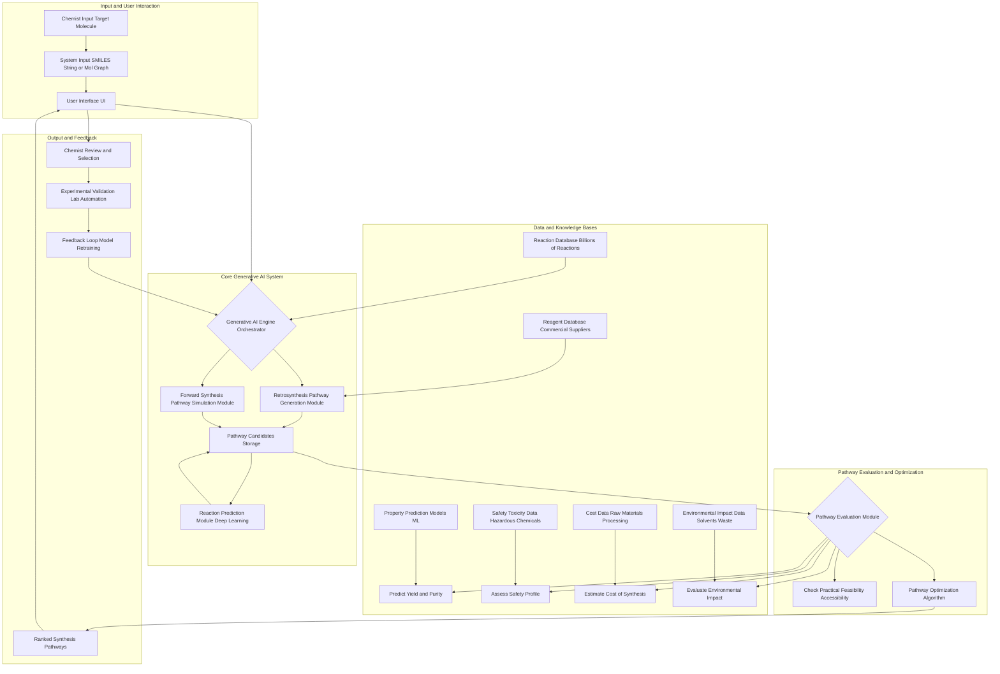

**Title of Invention:** A System and Method for Generative Design of Novel Drug Synthesis Pathways

**Abstract:**
A system for accelerating pharmaceutical development is disclosed. A chemist provides a target molecular structure for a drug. A generative AI model, trained on a massive database of chemical reactions, retrosynthetic principles, and forward synthesis outcomes, designs one or more novel, efficient synthesis pathways to create the target molecule from commercially available starting materials. The system evaluates the generated pathways for predicted yield, estimated cost, safety profile, environmental impact, and practical feasibility, providing chemists with a ranked set of viable manufacturing routes. This continuous learning system refines its generative capabilities through experimental validation feedback.

**Detailed Description:**
A pharmaceutical chemist inputs the SMILES string or a molecular graphical representation for a new drug candidate into the system's user interface. The system prompts a sophisticated generative AI: `Generate three distinct, high-yield chemical synthesis pathways for the molecule [SMILES string]. Prioritize pathways starting from commercially available reagents and minimizing hazardous intermediates.`

The AI, acting as an expert organic chemist, leverages a multi-module architecture to achieve this. Initially, a **Retrosynthesis Module** proposes precursor molecules by recursively breaking down the target molecule into simpler fragments, working backward through known or predicted chemical transformations. Simultaneously, a **Forward Synthesis Simulation Module** explores plausible reactions from a curated list of commercially available starting materials, attempting to build towards the target.

These proposed reaction steps and pathways are then funneled through a **Reaction Prediction Engine**, which uses deep learning models to predict the most likely products, byproducts, and reaction conditions for each proposed transformation. All generated pathways are extensively cross-referenced with a comprehensive **Reaction Database** containing millions of known chemical reactions, a **Reagent Database** detailing commercially available compounds and their suppliers, and a **Property Prediction Module** capable of estimating physical and chemical properties of intermediates.

Subsequently, a **Pathway Evaluation Module** rigorously assesses each candidate pathway based on several critical criteria:
*   **Yield Prediction:** AI models estimate the overall yield for multi-step sequences.
*   **Cost Estimation:** Integration with supplier databases provides reagent cost and estimated processing costs.
*   **Safety Assessment Toxicity:** Prediction of hazardous intermediates, byproducts, and required reaction conditions.
*   **Environmental Impact:** Assessment of solvent usage, waste generation, and energy consumption.
*   **Feasibility and Accessibility:** Evaluation of required reaction conditions, purity challenges, and availability of specialized equipment.

Pathways are then ranked, optimized, and presented to the chemist via a user-friendly interface. The chemist reviews these options, potentially selecting one or more for experimental validation in the laboratory. Crucially, the system incorporates a **Feedback Loop**, where experimental outcomes and chemist insights are used to retrain and refine the generative AI models and evaluation metrics, ensuring continuous learning and improvement of pathway design capabilities. This iterative process accelerates drug discovery and development by significantly reducing the time and resources spent on traditional, manual synthesis planning.

**System Architecture Overview:**

**Key Components and Features:**
*   **Target Molecule Input:** Accepts standard chemical formats like SMILES, InChI, or molecular graph files.
*   **Generative AI Engine Orchestrator:** Manages the overall process, coordinating retrosynthesis, forward synthesis, and reaction prediction.
*   **Retrosynthesis Pathway Generation Module:** Employs advanced algorithms to decompose target molecules into simpler, commercially available precursors.
*   **Forward Synthesis Pathway Simulation Module:** Explores building block strategies from available reagents towards the target.
*   **Reaction Prediction Module Deep Learning:** Predicts products, byproducts, and optimal conditions for potential reactions using neural networks trained on vast chemical datasets.
*   **Pathway Evaluation Module:** A sophisticated multi-criteria analysis engine, predicting outcomes and assessing risks.
*   **Yield and Purity Prediction:** Machine learning models that estimate reaction efficiency and byproduct formation at each step.
*   **Safety Profile Assessment:** Utilizes predictive toxicology and hazardous reaction databases to flag unsafe steps or intermediates.
*   **Cost Estimation Module:** Integrates with real-time chemical supplier data to provide accurate cost projections.
*   **Environmental Impact Module:** Quantifies solvent usage, atom economy, and waste generation for sustainable design.
*   **Practical Feasibility Checker:** Assesses experimental conditions, equipment requirements, and synthetic accessibility.
*   **Pathway Optimization Algorithm:** Refines candidate pathways based on user-defined weights for criteria like cost, yield, and safety.
*   **User Interface UI:** Provides intuitive visualization of pathways, comparison tools, and interaction points for chemists.
*   **Feedback Loop Model Retraining:** A crucial component for continuous improvement, updating AI models with new experimental data and chemist expert knowledge.

**Claims:**
1.  A method for chemical synthesis planning, comprising:
    a. Receiving a target molecular structure.
    b. Providing the structure to a generative AI model trained on chemical reaction data, retrosynthetic principles, and forward synthesis outcomes.
    c. Prompting the model to generate one or more multi-step synthesis pathways to produce the target molecule from commercially available reagents.
    d. Presenting the generated pathways to a user via a user interface.
2.  The method of claim 1, further comprising employing a Retrosynthesis Pathway Generation Module to decompose the target molecule into precursor molecules.
3.  The method of claim 1, further comprising employing a Forward Synthesis Pathway Simulation Module to construct pathways from available starting materials.
4.  The method of claim 1, further comprising integrating a Reaction Prediction Module utilizing deep learning to predict reaction outcomes for each step in a pathway.
5.  The method of claim 1, further comprising a Pathway Evaluation Module that assesses each generated pathway based on predicted yield, estimated cost, and safety profile.
6.  The method of claim 5, wherein the Pathway Evaluation Module further assesses environmental impact and practical feasibility of the pathways.
7.  The method of claim 1, further comprising a feedback loop mechanism that incorporates experimental validation data to retrain and refine the generative AI model.
8.  A system for generative design of novel drug synthesis pathways, comprising:
    a. An input module configured to receive a target molecular structure.
    b. A generative AI engine comprising a retrosynthesis module and a forward synthesis simulation module.
    c. A reaction prediction module coupled to the generative AI engine.
    d. A plurality of databases, including a reaction database, a reagent database, a property prediction models database, a safety toxicity data database, a cost data database, and an environmental impact data database.
    e. A pathway evaluation module configured to assess generated pathways based on multiple criteria including predicted yield, estimated cost, safety profile, and environmental impact, utilizing data from the plurality of databases.
    f. An output module configured to present ranked synthesis pathways to a user.
    g. A feedback loop mechanism configured to update the generative AI engine based on experimental validation outcomes.