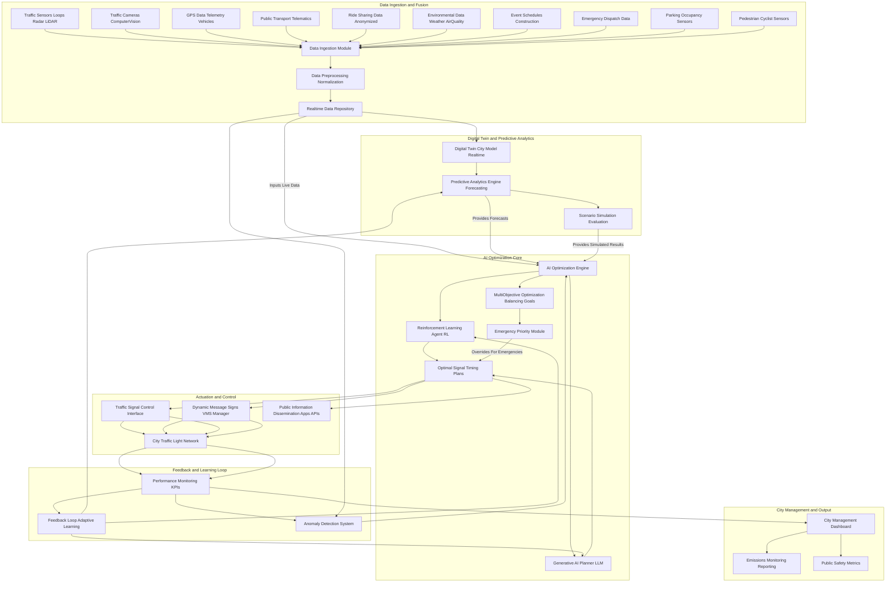

**Title of Invention:** A System and Method for Real-Time, AI-Driven Urban Traffic Flow Optimization

**Abstract:**
A comprehensive system for intelligent urban traffic management is disclosed. This system integrates diverse real-time data sources including traffic sensors, high-resolution cameras, GPS telemetry, public transport telematics, and environmental data. A sophisticated AI core, comprising a Digital Twin City Model, Predictive Analytics Engine, Reinforcement Learning Agent, and Generative AI Planner, analyzes current and forecasted traffic conditions across the entire urban network. This AI core acts as a central traffic control authority, generating and implementing optimal, coordinated signal timing plans for all traffic lights, managing dynamic message signs, and providing public transport prioritization. The primary objectives are to minimize overall congestion, reduce travel times, decrease vehicle emissions, enhance pedestrian and cyclist safety, and prioritize emergency vehicle movement, all while continuously learning and adapting to dynamic urban environments.

**Detailed Description:**

The proposed system, the AI Urban Traffic Optimization System AUTOS, represents a paradigm shift from reactive to proactive and predictive traffic management. It addresses the growing challenges of urban mobility, environmental impact, and public safety by leveraging advanced artificial intelligence and ubiquitous data collection.

**1. Data Ingestion and Fusion Layer:**
The system continuously ingests a rich stream of real-time and historical data from a multitude of sources.
*   **Traffic Sensors:** Inductive loops, radar sensors, LiDAR, and magnetic sensors embedded in road infrastructure provide granular data on vehicle count, speed, occupancy, and classification for each lane segment.
*   **Traffic Cameras:** High-resolution cameras with computer vision capabilities detect vehicle queues, incident alerts, pedestrian and cyclist presence, and provide visual verification of traffic flow anomalies.
*   **GPS Data Telemetry:** Anonymized data from GPS-enabled vehicles, smartphones, and fleet management systems provides origin-destination matrices, travel times, and real-time position updates across the network.
*   **Public Transport Telematics:** Real-time location and schedule adherence data from buses, trams, and other public transport vehicles allow for prioritization and dynamic route adjustments.
*   **Ride Sharing Data:** Anonymized data from ride-sharing platforms contributes to understanding demand patterns and localized congestion hot spots.
*   **Environmental Data:** Weather conditions rainfall, fog, ice, temperature, air quality metrics, and seasonal variations influence traffic behavior and are integrated into predictive models.
*   **Event and Infrastructure Data:** Schedules for major public events, construction zones, road closures, school timings, and emergency service dispatch information are incorporated to anticipate demand surges or disruptions.
*   **Parking Occupancy Sensors:** Data from smart parking systems informs the AI about parking availability, which can influence route guidance.
*   **Pedestrian and Cyclist Sensors:** Dedicated sensors and camera analytics monitor pedestrian and cyclist volumes at intersections and crossings to enhance safety and optimize crossing times.

**2. Digital Twin and Predictive Analytics Engine:**
A core component of AUTOS is a dynamic **Digital Twin City Model** which creates a real-time, high-fidelity virtual replica of the urban transportation network. This model continuously updates with ingested data, representing current traffic conditions, vehicle positions, signal states, and environmental factors.

Layered on this Digital Twin is the **Predictive Analytics Engine**. This engine utilizes machine learning algorithms, including recurrent neural networks and deep learning models, to forecast future traffic conditions. It predicts congestion build-up, travel times, and demand shifts based on historical patterns, current data, and anticipated events. This foresight is crucial for proactive optimization.

**3. AI Optimization Core:**
This is the brain of AUTOS, responsible for strategic planning and tactical control.
*   **Reinforcement Learning RL Agent:** Multiple distributed or a centralized RL agent continuously learns optimal signal timing strategies through trial and error within the Digital Twin environment. It receives rewards for reducing travel times, minimizing stops, improving throughput, and lowering emissions. This agent is particularly adept at handling dynamic and unforeseen traffic patterns.
*   **Generative AI Planner LLM:** A large language model or a similar generative AI component acts as a high-level strategic planner. When prompted with specific optimization goals or complex scenarios e.g., "Given the current accident on Elm Street and expected rush hour surge, generate a comprehensive plan for the next 30 minutes to reroute traffic and minimize impact," it provides human-readable strategies and coordinated signal plans. The prompt is sophisticated, drawing upon real-time data and the predictive outputs of the Digital Twin. For example: `You are an expert urban traffic engineer. Current state: High congestion on Main Street due to a sporting event, moderate traffic on Oak Avenue, and an ambulance en route via Maple Street. Forecast: Increasing evening peak flow in 20 minutes. Goal: Prioritize ambulance, clear Main Street, prevent gridlock on Oak, and prepare for peak flow. Generate a 30 minute coordinated signal timing plan and dynamic message sign strategy for intersections M1 through M10.`
*   **Multi-Objective Optimization Module:** This module balances various, often conflicting, optimization goals such as:
    *   Minimizing overall travel time and delays.
    *   Reducing vehicle emissions by optimizing flow and minimizing stop-and-go traffic.
    *   Prioritizing emergency vehicles e.g., ambulances, fire trucks, police by creating green waves.
    *   Enhancing pedestrian and cyclist safety by providing adequate crossing times and smart detection.
    *   Optimizing public transport efficiency through signal priority.
    *   Ensuring equitable distribution of delays across the network.

**4. Actuation and Control Layer:**
Once a new plan is generated and validated by the AI Optimization Core, it is translated into executable commands for the city's infrastructure.
*   **Traffic Signal Control Interface:** Programmatic commands are sent to the network of intelligent traffic light controllers, updating signal phases, durations, and coordination patterns in real-time. This includes adaptive signal control based on immediate traffic detection.
*   **Dynamic Message Signs VMS Management:** Variable Message Signs are updated to provide drivers with real-time information on congestion, alternative routes, incident alerts, and parking availability.
*   **Public Information Dissemination:** Real-time traffic information, estimated travel times, and recommended routes are published via city APIs, public facing apps, and navigation services to assist commuters.
*   **Emergency Override System:** Provides instant, manual or semi-autonomous override capabilities for critical situations like major incidents or civil emergencies.

**5. Feedback Loop and Adaptive Learning:**
AUTOS is a self-improving system.
*   **Performance Monitoring:** The system continuously monitors key performance indicators KPIs such as average travel time, number of stops, fuel consumption, emissions levels, incident response times, and pedestrian crossing compliance.
*   **Anomaly Detection:** Machine learning models detect unusual traffic patterns or system malfunctions, alerting operators and potentially triggering automated recovery actions.
*   **Model Adaptation:** The RL agent continuously refines its policies based on observed outcomes, and the generative AI models are periodically retrained or fine-tuned with new data and performance metrics, ensuring the system evolves with the city's needs.

**Security and Privacy:**
Robust security protocols are implemented to protect the infrastructure from cyber threats. Data privacy is ensured through anonymization, aggregation, and strict access controls, especially for GPS and personal mobility data.

**Claims:**
1.  A system for urban traffic optimization, comprising:
    a.  A data ingestion layer configured to receive real-time traffic data from a plurality of sensor types including traffic cameras, inductive loops, GPS telemetry, and public transport telematics;
    b.  A Digital Twin City Model continuously updating a high-fidelity virtual representation of the urban transportation network;
    c.  A Predictive Analytics Engine integrated with the Digital Twin, configured to forecast future traffic conditions based on real-time data, historical patterns, and event information;
    d.  An AI Optimization Core, including a Reinforcement Learning Agent and a Generative AI Planner, configured to analyze the Digital Twin and predictive analytics to generate coordinated signal timing plans and traffic management strategies;
    e.  A MultiObjective Optimization Module within the AI Optimization Core, configured to balance multiple optimization goals including travel time minimization, emissions reduction, emergency vehicle prioritization, and pedestrian cyclist safety;
    f.  An actuation and control layer configured to implement the generated plans by communicating with traffic signal controllers and dynamic message signs; and
    g.  A feedback loop and adaptive learning mechanism configured to monitor system performance, detect anomalies, and continuously refine the AI Optimization Core's models and strategies.

2.  The system of claim 1, wherein the data ingestion layer further receives environmental data, event schedules, ride-sharing data, parking occupancy data, and emergency dispatch information.

3.  The system of claim 1, wherein the Reinforcement Learning Agent learns optimal signal timing strategies through simulation within the Digital Twin City Model, driven by reward functions based on traffic flow efficiency and environmental impact.

4.  The system of claim 1, wherein the Generative AI Planner processes complex prompts incorporating real-time data, forecasted conditions, and specific optimization goals to produce human-readable and executable traffic management strategies.

5.  The system of claim 1, further comprising an Emergency Priority Module capable of instantly overriding standard optimization plans to facilitate emergency vehicle movement.

6.  A method for real-time urban traffic optimization, comprising:
    a.  Ingesting diverse real-time data streams from an urban transportation network;
    b.  Constructing and continuously updating a Digital Twin City Model with the ingested data;
    c.  Forecasting future traffic conditions using a Predictive Analytics Engine informed by the Digital Twin and historical data;
    d.  Applying an AI Optimization Core, including a Reinforcement Learning Agent and a Generative AI Planner, to evaluate the Digital Twin and forecasts, and generate optimized traffic management plans for a plurality of traffic lights and dynamic message signs, considering multiple objectives;
    e.  Implementing the generated traffic management plans across the urban infrastructure; and
    f.  Continuously monitoring the performance of the implemented plans and feeding performance metrics back into the AI Optimization Core for adaptive learning and model refinement.

7.  The method of claim 6, wherein the multiple objectives include minimizing travel time, reducing vehicle emissions, prioritizing emergency services, enhancing pedestrian and cyclist safety, and improving public transport efficiency.

8.  The method of claim 6, further comprising disseminating real-time traffic information and recommended routes to the public via digital platforms.

9.  The method of claim 6, further comprising detecting traffic anomalies and automatically triggering recovery or adaptive actions from the AI Optimization Core.