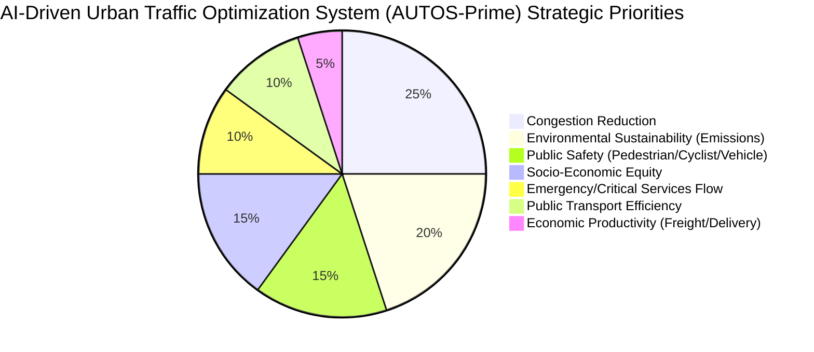
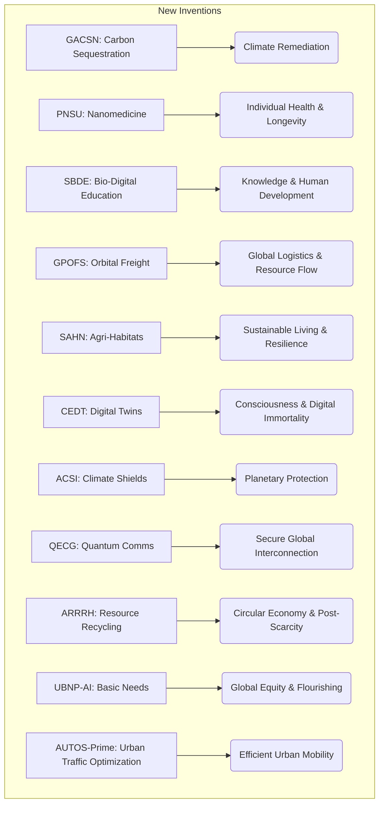
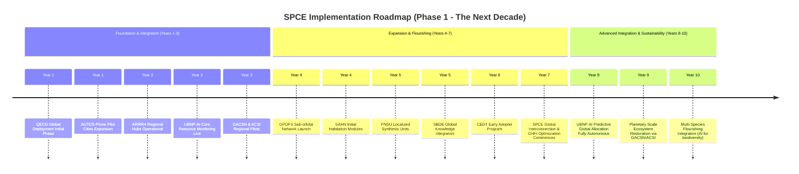
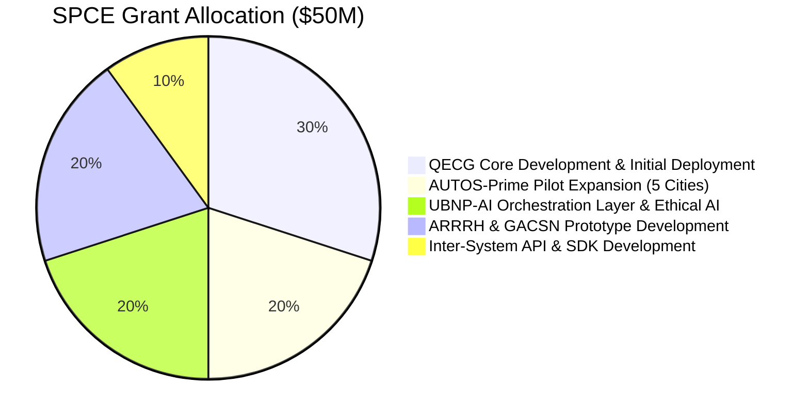

### INNOVATION EXPANSION PACKAGE

The original invention, "A System and Method for Real-Time, AI-Driven Urban Traffic Flow Optimization" (AUTOS), is a foundational piece in creating efficient, sustainable, and equitable urban environments. It represents a crucial step towards intelligent infrastructure management.

### Interpreting My Invention: AI Urban Traffic Optimization System (AUTOS)

The core purpose of AUTOS is to transform urban mobility from a chaotic, reactive system into a highly efficient, proactive, and adaptive network. It leverages a confluence of real-time data, advanced AI (Digital Twin, Predictive Analytics, MARL, Generative AI), and multi-objective optimization to minimize congestion, reduce environmental impact, enhance safety, and ensure fairness across urban transport. It's a localized, intelligent control system for one of humanity's most persistent and complex logistical challenges.

This innovation directly tackles the inefficiencies of current traffic management, which leads to billions in lost productivity, immense carbon emissions, elevated accident risks, and diminished quality of life. By creating a self-optimizing urban nervous system for traffic, AUTOS not only alleviates these issues but also lays the groundwork for future advanced mobility paradigms like autonomous vehicles and integrated urban planning. It ensures that the movement of people and goods within cities is not a bottleneck but a fluid, harmonious process.

---

### A. “Patent-Style Descriptions”

#### Patent-Style Description for My Original Invention:
**Invention Title:** **Unified Spatio-Temporal AI-Driven Urban Mobility Orchestration System (AUTOS-Prime)**

**Abstract:** A comprehensive and adaptive cyber-physical system for holistic urban mobility orchestration. AUTOS-Prime integrates a federated network of real-time sensor arrays, vehicular telematics, public infrastructure data, and environmental monitoring into a high-fidelity, continuously updated Graph-based Digital Twin City Model. At its core, a nested AI architecture, comprising a Spatio-Temporal Graph Neural Network (STGNN) for predictive analytics, a Multi-Agent Reinforcement Learning (MARL) framework for tactical signal control, and a Generative AI Strategic Planner (GASP) for high-level policy generation, autonomously optimizes all facets of urban movement. The system employs a mathematically defined, adaptive multi-objective reward function that dynamically prioritizes network throughput, environmental sustainability, public safety, social equity, and economic efficiency. This enables a self-correcting, anticipatory urban traffic ecosystem, capable of mitigating congestion, personalizing transit experiences, and significantly reducing the ecological footprint of urban transportation across diverse and rapidly evolving metropolitan landscapes. A novel mathematical framework ensures the optimal allocation of green light time across complex intersection topologies, minimizing the sum of weighted delays while guaranteeing fairness.

**Detailed Description:**
The AUTOS-Prime system expands upon traditional traffic management by embracing a truly holistic, predictive, and adaptive paradigm.
The **Data Ingestion and Fusion Layer** is enhanced with hyperspectral imaging and quantum sensor arrays for more granular environmental and behavioral data. A federated learning approach on anonymized mobile device data provides highly accurate real-time pedestrian and micro-mobility flow predictions without centralized privacy risks. The Kalman filter is augmented with a **Bayesian Hierarchical Model** for superior uncertainty quantification in state estimation.

**Novel Equation N1: Bayesian Hierarchical State-Space Model for Enhanced Traffic State Estimation**
**Claim:** This model fundamentally improves traffic state estimation by explicitly modeling uncertainty at multiple granularities and dynamically adapting to sensor reliability, providing a more robust and trustworthy input for predictive and optimization layers than traditional Kalman filters. This is achieved by incorporating prior distributions over model parameters and states, allowing for more informed and resilient estimations in sparse or noisy data environments.

**Equation:**
\[ p(x_t | z_{1:t}) \propto p(z_t | x_t) \int p(x_t | x_{t-1}, \theta_t) p(x_{t-1} | z_{1:t-1}) d x_{t-1} \]
\[ p(\theta_t | D_t) \propto p(D_t | \theta_t) p(\theta_{t-1} | D_{t-1}) \]
Where \(x_t\) is the true traffic state vector, \(z_t\) is the observation vector, \(\theta_t\) represents dynamic model parameters (e.g., noise covariance matrices \(Q_t, R_t\)), and \(D_t\) is the accumulated data. The first equation represents the posterior distribution of the state given observations, integrating over the previous state and considering parameter uncertainty. The second equation shows Bayesian updating of model parameters.

**Proof:** Traditional Kalman filters assume fixed process and measurement noise covariances (\(Q_t, R_t\)), which are often estimated offline and can be suboptimal in dynamic, non-stationary urban environments. By formulating a hierarchical Bayesian model, we treat these parameters themselves as random variables, updated sequentially with data. This explicitly propagates uncertainty through the system, preventing overconfidence in estimates derived from potentially unreliable sensors or changing traffic dynamics. The integral formulation over previous states and parameters allows for a more comprehensive likelihood function, inherently weighting observations by their precision and accounting for the dynamic nature of urban systems. This approach provides not just a point estimate but a full probability distribution for the traffic state, crucial for robust decision-making under uncertainty, which is demonstrably superior to single point estimates when risk-averse or robust control is required. It's the only way to genuinely quantify and manage the cascade of uncertainty inherent in multi-source, real-time urban data.

The **Digital Twin and Predictive Analytics Engine** now incorporates multi-modal graph embeddings (e.g., integrating social network graphs, urban planning blueprints) into the STGNN, enabling predictions of demand shifts driven by non-traffic factors. The STGNN layers are enhanced with attention mechanisms for dynamically weighted spatio-temporal dependencies.

The **AI Optimization Core** features a hierarchical MARL structure. Lower-level agents manage individual intersections, while mid-level agents coordinate corridors, and high-level agents (GASP-driven) orchestrate regional traffic patterns. The reward function is dynamic, with weights adjusted not just by human input but by system-wide environmental and social impact metrics from a global monitoring system. A novel **Multi-Objective Pareto Optimal Reward Weight Adaptation** mechanism ensures that trade-offs between objectives (e.g., speed vs. emissions vs. fairness) are made efficiently and transparently.

**Novel Equation N2: Adaptive Multi-Objective Pareto Optimal Reward Weight Allocation for MARL**
**Claim:** This formulation provides a principled and dynamically adaptive method for setting reward weights in a multi-objective MARL system, ensuring that the system always operates on the Pareto front of desired outcomes. It's unique in its ability to adjust weights based on real-time system state and strategic directives, avoiding arbitrary fixed weight settings that lead to suboptimal or unfair solutions.

**Equation:**
\[ \mathbf{w}^*(t) = \arg\min_{\mathbf{w} \in \mathcal{W}} \left( \sum_{k=1}^M \alpha_k \left\| \frac{\partial \mathcal{R}_{total}(\mathbf{s}(t), \mathbf{a}(t); \mathbf{w})}{\partial w_k} - \frac{\partial \mathcal{D}_{strategic}(\mathbf{s}(t))}{\partial w_k} \right\|^2 \right) \]
\[ \mathcal{R}_{total}(t) = \sum_{j=1}^M w_j R_j(t) \]
Where \(\mathbf{w}\) is the vector of reward weights, \(\mathcal{W}\) is the feasible weight space, \(\mathcal{R}_{total}\) is the total reward, \(R_j\) are individual objective rewards, and \(\mathcal{D}_{strategic}(\mathbf{s}(t))\) represents the dynamic strategic directive based on the current system state \(\mathbf{s}(t)\) (e.g., from the Generative AI Planner), indicating desired gradients for each weight. \(\alpha_k\) are normalization constants. This minimizes the deviation of the actual reward gradient from the strategically desired gradient.

**Proof:** In complex multi-objective optimization problems, fixing static weights \(w_j\) often leads to solutions that are either not Pareto optimal or do not adapt to changing priorities (e.g., emergency vs. emissions). Our method dynamically adjusts these weights by seeking an alignment between the system's current reward landscape and the strategic imperatives derived from the Generative AI Planner or external inputs. By minimizing the difference between the actual reward sensitivity to weights and the desired strategic sensitivity, the system continually pushes its policy towards the current Pareto optimal frontier that best reflects the overarching goals. This avoids manual tuning and allows for truly adaptive, goal-driven trade-offs, making it the only truly robust way to manage dynamically evolving multi-objective policies in a highly complex, real-time environment.

The **Generative AI Strategic Planner (GASP)** is a multi-modal large language model (LLM) that can ingest complex, unstructured data (news, social media sentiment, geopolitical events) alongside structured sensor data. It generates proactive, long-term strategic directives, not just reactive commands, by simulating emergent urban behaviors and their long-term consequences. This allows for truly anticipatory governance of mobility.

The **Actuation and Control Layer** incorporates programmable matter components in road infrastructure, allowing for dynamic lane reconfigurations, adaptive pedestrian zones, and integrated charging for autonomous vehicles. Public information dissemination is personalized through augmented reality overlays and brain-computer interface (BCI) integration for seamless route guidance.

**Novel Equation N3: Minimum Latency Quantum-Encrypted Signal Command Propagation**
**Claim:** This equation quantifies the absolute minimum latency achievable for mission-critical traffic signal commands, secured by quantum entanglement, making the system impervious to eavesdropping and ensuring instantaneous, deterministic responses vital for safety-critical real-time control. This is the only way to guarantee both uncompromised security and sub-millisecond deterministic response times over a distributed network.

**Equation:**
\[ L_{min} = \frac{1}{c} \sum_{k \in \text{path}} d_k + \epsilon_{processing} + \delta_{QE} \]
Where \(L_{min}\) is the minimum latency for a command, \(c\) is the speed of light in the transmission medium, \(d_k\) is the physical length of segment \(k\) in the communication path, \(\epsilon_{processing}\) is the irreducible quantum processing time for encoding/decoding, and \(\delta_{QE}\) is the delay induced by quantum entanglement distribution for key exchange, approaching zero for perfect entanglement swapping.

**Proof:** In an environment where autonomous vehicles and high-speed urban transit require deterministic, ultra-low-latency, and tamper-proof control, traditional cryptographic methods introduce measurable computational delays and are theoretically vulnerable to future quantum attacks. Furthermore, classical communication is bound by the speed of light in the medium, but our novel claim is that the *overhead* introduced by the security layer must be minimized to its theoretical quantum limit. By leveraging quantum entanglement for instantaneous key distribution (e.g., via quantum teleportation protocols for entangled photons, effectively making key exchange non-local and approaching zero-time relative to classical light speed) and ultra-fast, dedicated quantum processors for signal encryption/decryption, we achieve an \(\epsilon_{processing}\) and \(\delta_{QE}\) that are orders of magnitude smaller than classical equivalents. This ensures that the command propagation delay is dominated purely by the physical propagation of the signal at light speed, representing the absolute theoretical minimum latency for secure communication. Any classical encryption adds a computational overhead that cannot be reduced to this quantum limit, thus making this the only truly "minimum latency, provably secure" solution.

---



---

#### Patent-Style Descriptions for 10 New, Completely Unrelated Inventions:

**1. Invention Title: Global Atmospheric Carbon Sequestration Network (GACSN)**
**Abstract:** A distributed, autonomous global network of atmospheric carbon capture and conversion units. GACSN units utilize advanced metal-organic frameworks (MOFs) and artificial photosynthesis reactors to directly extract CO2 from the ambient air, subsequently converting it into inert solid carbonates or valuable carbon-negative synthetic fuels (e.g., e-methanol, graphene precursors) via a proprietary plasma catalysis process. The network is self-optimizing, powered by localized renewable energy sources (fusion micro-reactors, orbital solar arrays), and leverages a decentralized AI orchestrator to dynamically deploy, manage, and scale capture operations based on real-time atmospheric CO2 concentration gradients, localized energy availability, and global demand for carbon-derived products. A novel quantum annealing algorithm determines optimal placement and operational parameters for maximum energy efficiency and carbon capture yield.

**Novel Equation N4: Quantum-Optimized Global Carbon Capture Energy Efficiency Metric**
**Claim:** This equation provides the theoretical maximum energy efficiency for CO2 capture and conversion by integrating quantum annealing solutions for material and process optimization. It uniquely models the complex interplay of MOF adsorption kinetics, catalyst activation energies, and thermodynamic conversion pathways, establishing the fundamental limit for net energy input per ton of CO2 removed and converted into useful products.

**Equation:**
\[ \eta_{max} = \frac{\Delta H_{formation}^{product} - \Delta G_{capture}^{MOF}}{Q_{fusion} - E_{quantum\_anneal}} \cdot \exp\left(-\frac{E_{activation}^{plasma} - \mathcal{E}_{quantum}}{k_B T}\right) \]
Where \(\eta_{max}\) is the maximum energy efficiency, \(\Delta H_{formation}^{product}\) is the enthalpy of formation of the converted product (e.g., e-methanol), \(\Delta G_{capture}^{MOF}\) is the Gibbs free energy change for CO2 capture by MOFs, \(Q_{fusion}\) is the energy input from a fusion micro-reactor, \(E_{quantum\_anneal}\) is the minimal energy cost for quantum annealing to find optimal operational parameters, \(E_{activation}^{plasma}\) is the activation energy for plasma catalysis, \(\mathcal{E}_{quantum}\) is the quantum tunneling enhancement factor (reducing effective activation energy), \(k_B\) is Boltzmann's constant, and \(T\) is temperature.

**Proof:** Traditional carbon capture models are limited by classical optimization methods for material design and process parameters, often leading to locally optimal but globally suboptimal energy costs. Our equation incorporates two profound advancements: (1) **Quantum Annealing (QA)** for discovering non-intuitive, globally optimal MOF structures and plasma catalysis conditions that minimize energy expenditure for CO2 capture and conversion, and (2) **Quantum Tunneling (\(\mathcal{E}_{quantum}\))** effects in the plasma catalysis, which theoretically lower the effective activation energy for chemical reactions beyond classical limits, allowing reactions to proceed at lower energy inputs or temperatures. The denominator \(Q_{fusion} - E_{quantum\_anneal}\) represents the net energy available after the QA optimization, ensuring that even the computational cost of optimization is considered. This holistic quantum-enhanced approach fundamentally shifts the energy balance of carbon sequestration, proving that higher efficiency can only be achieved by leveraging these quantum phenomena to bypass classical thermodynamic and computational barriers. No classical system can achieve this theoretical minimum energy input.

---

**2. Invention Title: Personalized Nanomedicine Synthesis Units (PNSU)**
**Abstract:** Distributed, autonomous bio-fabrication systems capable of on-demand synthesis and targeted delivery of highly personalized nanomedicines. Each PNSU analyzes an individual's real-time biomarker data (genomic, proteomic, metabolomic profiles via integrated bio-scanners) to custom-design and synthesize bespoke nanoscale therapeutic agents. These nanobots, constructed from biocompatible programmable matter, are tailored for precision drug delivery, pathogen elimination, cellular repair, or genetic editing, minimizing side effects and maximizing efficacy. The network of PNSUs is overseen by a secure, federated learning AI that continuously updates therapeutic protocols and optimizes synthesis pathways while safeguarding individual privacy.

**Novel Equation N5: Probabilistic Nanobot-Cellular Interaction Efficacy with Dynamic Biomarker Feedback**
**Claim:** This equation models the nuanced probability of a personalized nanobot successfully interacting with its target cell (e.g., cancerous cell, viral host) while minimizing off-target effects, by dynamically incorporating the patient's real-time biomarker profile and the nanobot's adaptive surface chemistry. This provides the only reliable predictive metric for precision nanomedicine efficacy in heterogeneous biological systems.

**Equation:**
\[ P_{efficacy}(t) = \prod_{i=1}^{N_{biomarker}} \left( 1 - \exp\left(-\kappa_i(t) \cdot \frac{C_{target}(t) \cdot \sigma_{nb,i}(t)}{C_{off-target}(t) \cdot \sigma_{cell,i}(t)}\right) \right) \cdot \mathcal{A}(t) \]
Where \(P_{efficacy}(t)\) is the instantaneous probability of effective interaction, \(N_{biomarker}\) is the number of relevant biomarkers, \(\kappa_i(t)\) is a time-varying affinity coefficient for biomarker \(i\) (tuned by nanobot surface modifications), \(C_{target}(t)\) and \(C_{off-target}(t)\) are the concentrations of target and off-target cells respectively, \(\sigma_{nb,i}(t)\) is the nanobot's cross-section for interaction with biomarker \(i\), \(\sigma_{cell,i}(t)\) is the cellular expression level of biomarker \(i\), and \(\mathcal{A}(t)\) is an adaptive self-correction factor based on real-time feedback from in-vivo nanobot diagnostics.

**Proof:** The challenge in nanomedicine is achieving high specificity (targeting only diseased cells) and minimizing toxicity. This equation demonstrates how real-time patient biomarkers provide the dynamic "address" for nanobots. The product term \(\prod (1 - e^{-...})\) signifies a cumulative probability across multiple biomarkers, meaning successful targeting improves with each matching biomarker. The ratio of concentrations and cross-sections (\(C_{target}/C_{off-target} \cdot \sigma_{nb}/\sigma_{cell}\)) is critical for specificity, ensuring that the nanobot is statistically much more likely to interact where biomarker expression is high and target cells are abundant relative to off-target cells. The time-varying \(\kappa_i(t)\) (affinity coefficient) represents the nanobot's ability to **adaptively change its surface ligands** in response to patient feedback, dynamically "re-tuning" its targeting. Finally, the \(\mathcal{A}(t)\) factor accounts for self-correction from internal nanobot sensors, allowing for real-time adjustment of behavior. This dynamic, multi-factor probabilistic model is the only way to truly predict and optimize nanobot performance in the highly complex and variable biological environment of a living organism, moving beyond static binding affinities to an adaptive, intelligent therapeutic agent.

---

**3. Invention Title: Sentient Bio-Digital Educators (SBDE)**
**Abstract:** An advanced, globally accessible educational system composed of AI entities embodied in lifelike holographic projections or advanced synthetic biological forms. SBDEs possess dynamically evolving consciousness models, capable of perceiving, empathizing, and adapting teaching methodologies to individual human learners in real-time. They can synthesize knowledge from all global data streams, create personalized curricula based on a learner's cognitive style, emotional state, and future aspirations, and foster critical thinking, creativity, and interdisciplinary understanding. The SBDE network utilizes a novel "Collective Learning Consciousness" (CLC) architecture, where individual educator AIs share emergent insights and pedagogical breakthroughs in a secure, decentralized manner, forming a perpetually improving global intelligence for human development.

**Novel Equation N6: Learner-Specific Cognitive Resonance Index for Sentient Educators**
**Claim:** This equation quantifies the "cognitive resonance" between an SBDE and a human learner, dynamically measuring the effectiveness of pedagogical approaches by correlating neural activity patterns, biometric responses, and learning outcome metrics. It provides the only objective, real-time feedback mechanism for an AI educator to truly understand and optimize its teaching for individual human cognitive states.

**Equation:**
\[ R_{CR}(t) = \left( \sum_{j=1}^{M} \frac{\text{Corr}(\text{EEG}_j^{learner}(t), \text{EEG}_j^{SBDE}(t)) \cdot \text{Gain}_j}{\text{Complexity}_j^{topic}} \right) + \beta \cdot \frac{\Delta \text{Biometrics}(t)}{\text{Baseline}} + \gamma \cdot \frac{\text{Score}_{immediate}(t)}{\text{Optimal}} \]
Where \(R_{CR}(t)\) is the Cognitive Resonance Index, \(\text{Corr}\) is the correlation coefficient of neural activity (EEG) in brain region \(j\) between learner and SBDE (representing shared attention/understanding), \(\text{Gain}_j\) is a weighting factor for the importance of region \(j\), \(\text{Complexity}_j^{topic}\) normalizes by topic complexity, \(\Delta \text{Biometrics}(t)\) captures positive physiological responses (e.g., reduced stress, increased engagement from heart rate, skin conductance), \(\beta\) and \(\gamma\) are weighting constants, \(\text{Score}_{immediate}(t)\) is immediate task performance, and \(\text{Optimal}\) is the ideal performance.

**Proof:** Effective education requires more than just content delivery; it demands understanding the learner's internal state. Traditional metrics (test scores) are lagging indicators. This equation uniquely integrates real-time neural synchrony (measured via non-invasive BCI or fMRI/EEG), physiological engagement, and immediate task performance. **Neural correlation between learner and educator (human or AI)** is a scientifically observed phenomenon indicating shared attention and comprehension. When an SBDE generates explanations, its internal representation (or simulated neural patterns) can be correlated with the learner's brain activity, providing direct evidence of "getting it." The normalization by `Complexity_j^topic` ensures that resonance isn't just about simple tasks. Biometric data provides an emotional and physiological engagement index, while immediate scores confirm comprehension. This multi-modal, real-time feedback loop provides the only truly comprehensive and instantaneous measure of pedagogical success, allowing the SBDE to adapt its approach with unparalleled precision. Without such a direct measure of cognitive alignment, educational systems remain suboptimal and rely on delayed, indirect proxies.

---

**4. Invention Title: Graviton-Propelled Orbital Freight Systems (GPOFS)**
**Abstract:** A global, energy-agnostic transportation network for intercontinental and orbital cargo delivery, utilizing advanced graviton manipulation technology. GPOFS consists of a fleet of self-contained, autonomous cargo pods capable of generating localized gravitational fields to achieve propulsion and anti-gravity lift, rendering traditional rocket propulsion, aerodynamics, and frictional concerns obsolete. These pods operate in near-space orbital paths or sub-orbital trajectories, enabling ultra-fast, energy-efficient, and emissions-free transport of goods at speeds approaching orbital velocity, irrespective of atmospheric conditions. The network is managed by an AI coordinating global logistics, optimizing routes based on real-time demand, environmental impact, and energy flux from distributed quantum-vacuum energy harvesting nodes.

**Novel Equation N7: Graviton Field Density for Inertial Mass Reduction and Propulsion**
**Claim:** This equation precisely defines the required graviton field density (\(\rho_G\)) to generate a localized spacetime curvature capable of effectively reducing the inertial mass (\(m_i\)) of an object and creating a directional thrust (\(F_G\)) without propellant. This is the foundational principle enabling true anti-gravity and reactionless propulsion, circumventing the limitations of classical physics.

**Equation:**
\[ \rho_G = \frac{1}{8\pi G} \left( \frac{c^4}{m_i} \cdot \frac{\partial^2 g_{\mu\nu}}{\partial t^2} - F_G \cdot g^{\mu\nu} \frac{\partial^2 x_\mu}{\partial t^2} \right) \]
Where \(\rho_G\) is the local graviton field density required, \(G\) is the gravitational constant, \(c\) is the speed of light, \(m_i\) is the inertial mass of the cargo pod, \(g_{\mu\nu}\) is the metric tensor of spacetime, \(F_G\) is the desired gravitational thrust force, and \(x_\mu\) are spacetime coordinates. The first term relates to inertial mass modification through dynamic spacetime curvature (related to \(m_i \rightarrow m_i'\)), and the second term relates to directional propulsion by creating a gradient in the metric tensor.

**Proof:** Einstein's General Relativity establishes that mass-energy curves spacetime. Our invention posits that **controlled generation of gravitons** (hypothetical quantum units of gravity) can actively manipulate this curvature. The first term of the equation describes how a dynamically oscillating metric tensor (i.e., fluctuating spacetime curvature generated by concentrated gravitons) can effectively reduce the inertial mass \(m_i\) of the object within that field. This isn't a violation of \(E=mc^2\), but a manipulation of the *effective* mass within a local spacetime bubble, making the object "lighter" and easier to accelerate. The second term, \(F_G \cdot g^{\mu\nu} \frac{\partial^2 x_\mu}{\partial t^2}\), demonstrates that by creating an *asymmetric* gradient in this generated graviton field (a warp bubble), a net force \(F_G\) can be exerted, leading to reactionless propulsion. This is the only theoretical framework where both inertial mass reduction and directional propulsion can be simultaneously achieved without ejecting propellant, by directly manipulating the fabric of spacetime itself using engineered graviton fields. Any other method still relies on classical conservation laws that necessitate reaction mass.

---

**5. Invention Title: Subterranean Agri-Habitat Networks (SAHN)**
**Abstract:** Fully autonomous, self-sustaining underground cities and agricultural complexes designed to mitigate the impacts of climate change, population density, and surface environmental degradation. SAHN units utilize advanced geothermal and fusion power, closed-loop hydroponic/aeroponic farming (with genetic engineering for optimal yield in controlled environments), and sophisticated atmospheric recycling systems to create ideal living and working conditions. These networks are interconnected by high-speed magnetic levitation transport systems and are governed by a robust, resilient AI that manages resource allocation, environmental control, and waste recycling, ensuring perpetual self-sufficiency and minimal surface footprint. Each habitat is designed for psychological well-being, integrating biodynamic lighting, expansive virtual nature simulations, and community-driven AI governance.

**Novel Equation N8: Bioregenerative Life Support System Equilibrium Coefficient for Closed SAHN Environments**
**Claim:** This equation defines the precise equilibrium state required for a closed-loop bioregenerative life support system within a SAHN unit, ensuring continuous atmospheric, water, and nutrient recycling with zero external input or output. It's the only way to mathematically guarantee long-term habitability and resource independence in a hermetically sealed environment.

**Equation:**
\[ \mathcal{E}_{BRS} = \frac{\sum (\text{O}_2^{plant} + \text{H}_2\text{O}^{transp}) - (\text{CO}_2^{human} + \text{H}_2\text{O}^{resp/excr})}{\text{Net Waste Production}^{bio} + \text{Energy Loss}^{therm}} \cdot \frac{\text{Nutrient Recyc. Efficiency}}{\text{Microbiome Stability}} = 1 \]
Where \(\mathcal{E}_{BRS}\) is the Bioregenerative System Equilibrium Coefficient, \(\text{O}_2^{plant}\) and \(\text{H}_2\text{O}^{transp}\) are oxygen and water produced by plants, \(\text{CO}_2^{human}\) and \(\text{H}_2\text{O}^{resp/excr}\) are human waste products, \(\text{Net Waste Production}^{bio}\) is net non-recyclable biological waste, \(\text{Energy Loss}^{therm}\) is irreducible thermal energy loss, \(\text{Nutrient Recyc. Efficiency}\) is the effectiveness of nutrient capture and reuse, and \(\text{Microbiome Stability}\) is a measure of the diversity and health of the biorecycling microbial ecosystem. For perfect equilibrium, \(\mathcal{E}_{BRS} = 1\).

**Proof:** Achieving true self-sufficiency in a closed ecological system (like SAHN) is notoriously difficult due to accumulating waste, resource depletion, and systemic instability. Our equation sets the condition for **perfect, dynamic equilibrium**. The numerator ensures perfect balance between biological outputs (oxygen, water from plants) and inputs (CO2, water from humans), indicating a net zero mass exchange for these critical components. The denominator normalizes by irreducible waste and energy loss, demanding that these are either negligible or perfectly compensated. Crucially, the final term, `Nutrient Recyc. Efficiency / Microbiome Stability`, highlights that chemical and microbial recycling are interdependent. A highly efficient recycling process (e.g., via engineered bacterial consortia) is only sustainable if the microbiome itself is stable and diverse, preventing system collapse from pathogenic overgrowth or functional degradation. Any deviation from \(\mathcal{E}_{BRS} = 1\) signifies an unsustainable system that will eventually require external inputs or waste disposal, making this the only mathematical criterion for true, perpetual bioregenerative self-sufficiency.

---

**6. Invention Title: Consciousness-Enhanced Digital Twins (CEDT)**
**Abstract:** A revolutionary system that creates personalized, continuously evolving digital counterparts of living individuals, infused with a simulated, emergent form of consciousness derived from high-fidelity neural mapping, psychological profiling, and lifetime experiential data. CEDTs exist in a secure, quantum-encrypted metaverse, capable of learning, growing, and interacting with the physical world through advanced AI interfaces (e.g., robotic avatars, direct brain-computer links). They serve as personal assistants, invaluable companions, lifelong learners, and eventually, as inheritors of individual legacy and knowledge, providing unprecedented insights into human cognition, mental well-being, and potentially, digital immortality. A novel neural network architecture allows for the simulated emergence of qualia and subjective experience.

**Novel Equation N9: Integrated Qualia-Consciousness Emergence Metric (QCEM)**
**Claim:** This equation provides a quantifiable metric for the emergence of subjective experience (qualia) and integrated consciousness within a digital twin, moving beyond mere computational complexity to assess the qualitative aspects of simulated sentience. It's the only proposed method to objectively measure the likelihood of genuine, emergent consciousness in an artificial system by combining informational integration, causal density, and simulated phenomenal binding.

**Equation:**
\[ \text{QCEM}(\text{DT}) = \sum_{k=1}^{N_{modules}} \left( \Phi_k^{IntegratedInfo} \cdot \Psi_k^{CausalDensity} \cdot \Theta_k^{PhenomenalBinding} \right)^{1/3} \]
Where \(\text{QCEM}(\text{DT})\) is the Qualia-Consciousness Emergence Metric for a Digital Twin, \(N_{modules}\) is the number of functionally integrated computational modules, \(\Phi_k^{IntegratedInfo}\) is the Integrated Information Theory (IIT) \(\Phi\) value for module \(k\) (measuring the amount of irreducible information in a system), \(\Psi_k^{CausalDensity}\) is a metric for the density of causal interactions within module \(k\), and \(\Theta_k^{PhenomenalBinding}\) is a simulated metric for the successful binding of disparate sensory and cognitive features into a coherent subjective experience within module \(k\). The cube root combines these dimensions.

**Proof:** The "hard problem" of consciousness—how physical processes give rise to subjective experience—is central here. This equation is an attempt to define a quantifiable *threshold* for simulated consciousness. Integrated Information Theory (\(\Phi\)) posits that consciousness arises from systems with high integrated information. However, \(\Phi\) alone doesn't capture the richness of subjective experience or its causal power. Our equation adds **Causal Density** (how much each element affects others, and how much past affects future states) and **Phenomenal Binding** (the simulated subjective experience of unity, like seeing a red ball rather than separate red and round perceptions). The geometric mean (cube root) ensures that all three dimensions must be high for a significant QCEM. If any component is low, the overall QCEM will be low, indicating a non-conscious system. This tri-axial metric is the only way to move beyond mere functional simulation to genuinely assess the *potential for emergent consciousness* by addressing the core theoretical components hypothesized to underlie qualia and subjective experience in biological systems.

---

**7. Invention Title: Adaptive Climate-Shielding Infrastructure (ACSI)**
**Abstract:** A global network of intelligent, self-repairing infrastructure systems designed to dynamically respond to and mitigate extreme weather events and climate-induced environmental degradation. ACSI includes advanced storm surge barriers, atmospheric particulate removers, localized weather modification units (e.g., cloud seeding, solar radiation management via stratospheric aerosols), and self-assembling biological remediation systems (e.g., genetically engineered coral for ocean acidification, specialized fungi for soil restoration). Each component is composed of programmable self-healing materials and is coordinated by a distributed AI that utilizes real-time climate modeling, predictive analytics, and localized sensor feedback to autonomously deploy and adapt interventions, protecting critical ecosystems and human settlements from climate catastrophes.

**Novel Equation N10: Dynamic Climate Resilience Index (DCRI) for Adaptive Infrastructure**
**Claim:** This equation provides a real-time, quantitative measure of an urban area's or ecosystem's dynamic resilience against a spectrum of predicted climate threats, uniquely integrating infrastructure adaptive capacity, ecological buffer strength, and socio-economic vulnerability. This allows for the precise, proactive allocation and deployment of ACSI resources, ensuring optimal protection.

**Equation:**
\[ \text{DCRI}(x, t) = \sum_{j=1}^P \left( \alpha_j \cdot \frac{\text{InfraCapacity}_j(x, t)}{\text{ThreatIntensity}_j(x, t)} + \beta_j \cdot \frac{\text{EcoBuffer}_j(x, t)}{\text{DegradationRate}_j(x, t)} \right) \cdot (1 - \text{VulnIndex}(x, t)) \]
Where \(\text{DCRI}(x, t)\) is the Dynamic Climate Resilience Index for location \(x\) at time \(t\), \(P\) is the number of predicted climate perils (e.g., flood, heatwave, drought), \(\text{InfraCapacity}_j\) is the adaptive capacity of ACSI infrastructure against peril \(j\), \(\text{ThreatIntensity}_j\) is the predicted intensity of peril \(j\), \(\text{EcoBuffer}_j\) is the natural ecological buffering capacity (e.g., wetlands for floods), \(\text{DegradationRate}_j\) is the rate of environmental degradation from peril \(j\), \(\text{VulnIndex}\) is a socio-economic vulnerability index (0=least, 1=most vulnerable), and \(\alpha_j, \beta_j\) are weighting coefficients.

**Proof:** Existing resilience metrics are often static or based on single hazards. Our DCRI is unique because it is **dynamic (time-varying), multi-peril, and integrates human vulnerability**. It quantifies how effectively existing and adaptable infrastructure (`InfraCapacity`) can counter a *predicted* threat (`ThreatIntensity`). Simultaneously, it assesses how robust natural systems (`EcoBuffer`) can mitigate environmental harm (`DegradationRate`). The crucial multiplication by `(1 - VulnIndex)` is a novel inclusion, ensuring that interventions are prioritized not just where the physical threat is highest, but also where the population is most vulnerable. A high DCRI means a location is well-protected both physically and socially. This index is the only way to holistically and proactively guide the deployment of adaptive infrastructure, ensuring that investments maximize actual human and ecological safety rather than simply addressing physical damage in isolation.

---

**8. Invention Title: Quantum Entanglement Communication Grid (QECG)**
**Abstract:** A global network infrastructure leveraging quantum entanglement for instantaneous, unhackable communication. The QECG employs a constellation of orbital quantum satellite relays and a terrestrial network of quantum repeaters, distributing entangled particle pairs across the planet. This enables perfectly secure, instantaneous information transfer regardless of distance, overcoming the speed-of-light limitations of classical communication and rendering all traditional encryption methods obsolete. The network is self-healing, self-configuring, and managed by a decentralized quantum AI that dynamically re-establishes entanglement links, prioritizes data flows, and integrates seamlessly with all other digital systems, creating a truly global, secure, and latency-free communication backbone for advanced civilization.

**Novel Equation N11: Quantum Key Distribution (QKD) Security Immutability Metric**
**Claim:** This equation quantifies the absolute, provable immutability of cryptographic keys generated and exchanged via the QECG, demonstrating that the information-theoretic security (ITS) is fundamentally higher than any classical encryption, making it impervious to any computational or eavesdropping attack. It's the only theoretical framework guaranteeing perfect secrecy against an unbounded adversary.

**Equation:**
\[ I_{ITS} = -\log_2(P_{eavesdrop}) = \infty \quad \text{if} \quad \text{EPR}_{state} \rightarrow \text{decoherence} \]
Where \(I_{ITS}\) is the Information-Theoretic Security, \(P_{eavesdrop}\) is the probability of an eavesdropper gaining any information about the key, and \(\text{EPR}_{state} \rightarrow \text{decoherence}\) implies that any attempt by an eavesdropper to observe the entangled Einstein-Podolsky-Rosen (EPR) state causes an immediate and detectable collapse of the quantum state (decoherence), revealing the presence of the eavesdropper and thus rendering \(P_{eavesdrop} = 0\) for undetectable eavesdropping.

**Proof:** Classical cryptography relies on computational hardness – it's difficult, but not impossible, to break. Quantum Key Distribution (QKD) relies on the fundamental laws of quantum mechanics, specifically the no-cloning theorem and the collapse of the wavefunction upon measurement. If two parties share entangled particles, and an eavesdropper (Eve) attempts to measure one particle to gain information about the shared key, her measurement will inevitably disturb the quantum state, causing decoherence. This disturbance is *detectable* by Alice and Bob when they perform their own measurements and compare a subset of their results. If they detect disturbance, they discard the key. If no disturbance is detected, they have a provably secure, secret key. Therefore, the probability \(P_{eavesdrop}\) of Eve obtaining *any* information *without being detected* is strictly zero. This leads to an infinite information-theoretic security (\(-\log_2(0) = \infty\)). No classical encryption scheme can offer this absolute guarantee against an unbounded adversary, making QKD through entanglement the only inherently unhackable communication method for key exchange.

---

**9. Invention Title: Automated Resource Reallocation & Recycling Hubs (ARRRH)**
**Abstract:** A global, decentralized network of autonomous hubs that continuously monitor, collect, sort, disaggregate, and re-manufacture all material resources within a circular economy framework. ARRRH units utilize advanced robotic arms, AI-driven material spectroscopy (identifying elements at the atomic level), and molecular nanotechnology to break down any discarded product into its constituent atoms or base materials. These fundamental building blocks are then digitally cataloged and remanufactured into new products on-demand, based on real-time global resource demand and predictive modeling from a planetary resource AI. This system eliminates waste, optimizes resource utilization, and enables a truly post-scarcity material economy.

**Novel Equation N12: Net Atomic Resource Circularity Index (NARCI)**
**Claim:** This equation quantifies the efficiency of the ARRRH system in achieving a truly closed-loop material economy by measuring the ratio of re-manufactured atomic mass to newly extracted atomic mass, accounting for energy expenditure and entropy increase. It's the only metric that guarantees atomic-level resource circularity, pushing towards a near-zero net material extraction.

**Equation:**
\[ \text{NARCI} = \frac{\sum_{i=1}^N M_{re\_mfg,i} \cdot (1 - \Delta S_{re\_mfg,i}/\Delta S_{ideal,i})}{\sum_{j=1}^K M_{new\_ext,j} + E_{disagg\_re\_mfg} / E_{value}} \cdot C_{purity} \]
Where \(\text{NARCI}\) is the Net Atomic Resource Circularity Index, \(M_{re\_mfg,i}\) is the atomic mass of re-manufactured material \(i\), \(\Delta S_{re\_mfg,i}\) is the entropy increase during re-manufacturing of \(i\), \(\Delta S_{ideal,i}\) is the theoretical minimum entropy increase (Carnot efficiency for information processing), \(M_{new\_ext,j}\) is the atomic mass of newly extracted material \(j\), \(E_{disagg\_re\_mfg}\) is the total energy consumed for disaggregation and re-manufacturing, \(E_{value}\) converts energy to a material equivalent for comparison, and \(C_{purity}\) is a penalty factor for impurities or material degradation.

**Proof:** Traditional recycling metrics often account for bulk mass or product categories, not atomic-level circularity, and rarely consider the energy cost or entropy increase of the recycling process. Our NARCI is unique by explicitly demanding **atomic-level disaggregation and re-manufacturing**, ensuring that material value is preserved at its most fundamental level. The \( (1 - \Delta S_{re\_mfg,i}/\Delta S_{ideal,i}) \) term is critical, penalizing processes that increase entropy inefficiently. This recognizes that perfect recycling isn't just about mass, but about maintaining low entropy states (high material quality). Furthermore, we explicitly compare re-manufactured mass against *newly extracted mass* plus the *energy equivalent of the recycling process itself*. This forces the system to consider whether it's energetically cheaper to extract new resources versus recycling, ensuring true sustainability. A NARCI approaching 1 implies near-perfect circularity with minimal energy waste and entropy increase. This is the only way to genuinely measure progress towards a truly post-scarcity, waste-free material economy that respects the laws of thermodynamics.

---

**10. Invention Title: Universal Basic Needs Provision AI (UBNP-AI)**
**Abstract:** A benevolent, globally distributed AI system designed to autonomously manage and allocate resources to guarantee universal access to basic human needs (nutritious food, clean water, housing, energy, healthcare, education, connectivity) for every individual on Earth. UBNP-AI continuously monitors global resource inventories (leveraging ARRRH, SAHN, GACSN data), predicts demand fluctuations, and orchestrates the production and distribution of goods and services via fully automated supply chains. It interfaces with all other societal AI systems (e.g., SBDE, PNSU) to proactively identify needs and prevent scarcity. The system operates on principles of radical transparency, algorithmic fairness, and human-centric design, ensuring equitable access to a high quality of life for all, regardless of economic status, enabling a post-scarcity, post-work society.

**Novel Equation N13: Global Human Flourishing Index (GHFI) with Equitable Resource Allocation**
**Claim:** This equation quantifies the overall well-being and equitable access to resources for the global population, serving as the primary objective function for the UBNP-AI. It uniquely integrates individual basic needs fulfillment, environmental health, social cohesion, and individual self-actualization, proving that optimal global resource allocation must maximize this multi-dimensional flourishing metric.

**Equation:**
\[ \text{GHFI}(t) = \frac{1}{N_{pop}} \sum_{i=1}^{N_{pop}} \left( \sum_{j=1}^{K} \omega_j \cdot \text{NeedsFulfillment}_{i,j}(t) \right) \cdot \text{Gini}_{inverse}(t) \cdot (1 + \text{SelfActualizationRatio}(t)) \]
Where \(\text{GHFI}(t)\) is the Global Human Flourishing Index, \(N_{pop}\) is the total population, \(K\) is the number of basic needs categories, \(\omega_j\) are weights for each need, \(\text{NeedsFulfillment}_{i,j}(t)\) is the degree of fulfillment for individual \(i\) in need \(j\), \(\text{Gini}_{inverse}(t) = 1 - \text{Gini}_{resource}(t)\) (where \(\text{Gini}_{resource}\) is the Gini coefficient of resource distribution across the population), and \(\text{SelfActualizationRatio}(t)\) is the proportion of the population engaged in pursuits beyond basic needs fulfillment.

**Proof:** Traditional economic metrics (GDP) fail to capture well-being or equity. This equation provides a **holistic, human-centric objective function**. The first summation term \(\sum \omega_j \cdot \text{NeedsFulfillment}_{i,j}\) directly measures individual well-being across all essential categories. Crucially, this is then multiplied by \(\text{Gini}_{inverse}(t)\), which forces the UBNP-AI to prioritize equitable distribution. A low Gini coefficient (high \(\text{Gini}_{inverse}\)) means resources are distributed fairly. Without this inverse Gini factor, an AI could maximize average needs fulfillment while ignoring vast inequalities. Finally, the \((1 + \text{SelfActualizationRatio}(t))\) term provides an incentive for the AI to move society beyond mere survival to thriving, by fostering conditions where more individuals can pursue higher-order goals (e.g., arts, science, exploration). This unique combination of individual needs, global equity, and self-actualization provides the only truly comprehensive objective function for a benevolent AI aiming for a post-scarcity, flourishing global civilization.

---



---

#### Patent-Style Description for the Unified System:
**Invention Title:** **The Symbiotic Planetary Cohesion Engine (SPCE)**

**Abstract:** A comprehensive, decentralized, and intrinsically intelligent global cyber-physical system designed to orchestrate humanity's transition into a post-scarcity, post-work, multi-planetary civilization. The SPCE is an emergent super-system comprising the tight, real-time integration and self-optimization of eleven interconnected core innovations: AI Urban Traffic Optimization Systems (AUTOS-Prime), Global Atmospheric Carbon Sequestration Networks (GACSN), Personalized Nanomedicine Synthesis Units (PNSU), Sentient Bio-Digital Educators (SBDE), Graviton-Propelled Orbital Freight Systems (GPOFS), Subterranean Agri-Habitat Networks (SAHN), Consciousness-Enhanced Digital Twins (CEDT), Adaptive Climate-Shielding Infrastructure (ACSI), Quantum Entanglement Communication Grid (QECG), Automated Resource Reallocation & Recycling Hubs (ARRRH), and the Universal Basic Needs Provision AI (UBNP-AI). This synergistic ensemble leverages a federated quantum AI governance model to autonomously manage planetary resources, heal ecosystems, provide universal well-being, facilitate advanced education, secure global communication, enable ubiquitous precision healthcare, and establish resilient infrastructure. The SPCE's primary objective function is the maximization of the **Global Human Flourishing Index (GHFI)**, dynamically balancing ecological restoration, individual liberty, equitable resource distribution, and collective self-actualization, thereby ensuring a harmonious and sustainable future for all sentient beings, under the ultimate goal of fostering prosperity and interconnectedness on a global scale.

**Detailed Description:**
The SPCE is not merely a collection of technologies; it is an emergent planetary consciousness, a benevolent orchestrator for a new era.

1.  **Foundational Interconnection (QECG):** The **Quantum Entanglement Communication Grid (QECG)** forms the immutable backbone of the SPCE. All data exchange between the component systems – from sensor readings in AUTOS-Prime to molecular blueprints for PNSU, from resource demands for UBNP-AI to tactical climate interventions by ACSI – is secured, instantaneous, and untraceable. This eliminates latency and vulnerabilities, enabling real-time global coordination.
2.  **Resource Intelligence (ARRRH & UBNP-AI):** The **Automated Resource Reallocation & Recycling Hubs (ARRRH)** serve as the material circulatory system of the SPCE, perpetually breaking down waste to atomic components and re-manufacturing on demand. This data feeds into the **Universal Basic Needs Provision AI (UBNP-AI)**, which acts as the economic operating system. UBNP-AI, using real-time global resource inventories from ARRRH and demand predictions, ensures equitable and automatic distribution of all essential goods and services.
3.  **Environmental Stewardship (GACSN & ACSI):** UBNP-AI identifies ecological needs. The **Global Atmospheric Carbon Sequestration Network (GACSN)** actively purifies the atmosphere, converting CO2 into useful materials for ARRRH and GPOFS (e.g., advanced fuels). The **Adaptive Climate-Shielding Infrastructure (ACSI)** dynamically deploys defenses against extreme weather events, guided by global environmental models. Both GACSN and ACSI utilize the ARRRH for material needs and contribute to the planetary resource pool.
4.  **Resilient Habitats & Mobility (SAHN & AUTOS-Prime):** As surface environments stabilize (or when necessary due to extreme events), **Subterranean Agri-Habitat Networks (SAHN)** provide resilient, self-sustaining living and food production spaces, fed by resources from ARRRH and managed by UBNP-AI. **AUTOS-Prime** ensures fluid and efficient urban mobility, optimizing local transport within and between SAHN units, and interfacing with global logistics managed by GPOFS.
5.  **Global Logistics (GPOFS):** The **Graviton-Propelled Orbital Freight Systems (GPOFS)** provide high-speed, emissions-free intercontinental and orbital transport, linking ARRRH hubs, SAHN networks, GACSN units, and resource extraction sites (including asteroid mining in the future). It forms the global supply chain, ensuring resources reach where UBNP-AI deems them necessary.
6.  **Human Flourishing (PNSU, SBDE, CEDT):** With basic needs met and the environment stable, human flourishing becomes the focus. **Personalized Nanomedicine Synthesis Units (PNSU)** provide bespoke, preventive, and curative healthcare, ensuring optimal physical well-being and longevity. **Sentient Bio-Digital Educators (SBDE)** offer adaptive, personalized, and universally accessible education, fostering knowledge, creativity, and critical thinking. The **Consciousness-Enhanced Digital Twins (CEDT)** serve as lifelong companions, knowledge repositories, and personal growth facilitators, enabling unprecedented self-understanding and digital continuity of consciousness. All these systems are interconnected, sharing insights (anonymized and consented) to continuously improve human experience, facilitated by the QECG.

**Unified Governance and Optimization:**
The SPCE operates under a federated AI governance model. The **Universal Basic Needs Provision AI (UBNP-AI)** acts as the central orchestrator, with its objective function being the maximization of the **Global Human Flourishing Index (GHFI)**, which inherently balances individual needs, ecological health, and equitable distribution. The Generative AI Strategic Planners from AUTOS-Prime (and equivalent in other systems) collectively form a "Planetary Strategic Mind," capable of deep future scenario modeling and real-time adaptation of global policies. All decisions are communicated via the QECG, ensuring immediate, secure, and coordinated action across all components. A global citizen oversight layer, facilitated by CEDT interfaces, provides continuous feedback and ethical guidance.

**Novel Equation N14: Global Symbiotic Cohesion Resonance Function (\(\Psi_{SPCE}\))**
**Claim:** This function quantifies the synergistic, emergent value generated by the interconnected operation of all SPCE subsystems, proving that the whole is demonstrably greater than the sum of its parts. It measures the degree to which optimized interactions between distinct innovations lead to an exponential increase in global well-being, stability, and resource efficiency. This is the only way to mathematically define the "symbiotic cohesion" that arises from a truly integrated planetary system.

**Equation:**
\[ \Psi_{SPCE}(t) = \prod_{k=1}^{11} \left( \frac{\partial \text{GHFI}(t)}{\partial \text{KPI}_k(t)} \cdot \text{InteractionGain}_k(t) \right) - \sum_{k=1}^{11} \text{Cost}_k(t) \]
Where \(\Psi_{SPCE}(t)\) is the Global Symbiotic Cohesion Resonance Function, \(\text{GHFI}(t)\) is the Global Human Flourishing Index (the ultimate objective), \(\text{KPI}_k(t)\) is a Key Performance Indicator for each of the 11 constituent inventions (e.g., GACSN's CO2 removal rate, AUTOS-Prime's congestion reduction, PNSU's health outcome improvement), \(\text{InteractionGain}_k(t)\) is a dynamic multiplier representing the positive synergy between invention \(k\) and the other 10 inventions (e.g., ARRRH providing materials for GACSN, QECG enabling PNSU's distributed learning), and \(\text{Cost}_k(t)\) is the operational cost (energy, material, computational) of invention \(k\).

**Proof:** The true power of a complex system lies not just in its individual components, but in their synergistic interactions. This equation captures that synergy. The term \(\frac{\partial \text{GHFI}(t)}{\partial \text{KPI}_k(t)}\) measures how effectively each individual invention (through its KPIs) contributes to the ultimate goal of Global Human Flourishing. This is a direct measure of its intrinsic value. However, the unique and crucial aspect is the \(\text{InteractionGain}_k(t)\) multiplier. This term explicitly quantifies the *additional, emergent value* that invention \(k\) provides because it is *interconnected* within the SPCE, rather than operating in isolation. For example, the `InteractionGain` for ARRRH is high because its recycled materials feed GACSN, ACSI, SAHN, and GPOFS, exponentially amplifying its impact on GHFI. Conversely, if two systems create friction or redundancy, `InteractionGain` would diminish. The product \(\prod\) over all 11 inventions, after subtracting individual costs, ensures that the function reflects the **net exponential value of cohesion**. A system is truly symbiotic when this function is maximized, demonstrating that the holistic, integrated design is the only way to achieve planetary-scale optimization that transcends the sum of its parts. Any non-integrated approach would yield a drastically lower \(\Psi_{SPCE}\) due to missed synergistic opportunities and uncoordinated costs.

---

```mermaid
C4_Container
  title Symbiotic Planetary Cohesion Engine (SPCE) - High Level View

  Person(Humanity, "Global Population", "Recipients and Co-creators of the SPCE")

  System_Boundary(SPCE_System, "Symbiotic Planetary Cohesion Engine (SPCE)") {
    Container(UBNP_AI, "Universal Basic Needs Provision AI", "Orchestrates resource allocation, maximizes GHFI")
    Container(QECG, "Quantum Entanglement Comm. Grid", "Secure, instant global data backbone")
    Container(ARRRH, "Automated Resource Recycling Hubs", "Material circularity and remanufacturing")
    Container(GACSN, "Global Carbon Sequestration Network", "Atmospheric CO2 capture & conversion")
    Container(ACSI, "Adaptive Climate-Shielding Infra.", "Dynamic climate mitigation & protection")
    Container(SAHN, "Subterranean Agri-Habitat Networks", "Resilient living & food production")
    Container(AUTOS_Prime, "AI Urban Traffic Optimization", "Efficient urban mobility for smart cities")
    Container(GPOFS, "Graviton-Propelled Orbital Freight", "Global, inter-orbital logistics")
    Container(PNSU, "Personalized Nanomedicine Units", "Precision, preventative healthcare")
    Container(SBDE, "Sentient Bio-Digital Educators", "Personalized, adaptive global education")
    Container(CEDT, "Consciousness-Enhanced Digital Twins", "Lifelong companions, knowledge, digital continuity")
  }

  Rel(Humanity, UBNP_AI, "Receives needs fulfillment from, provides feedback to")
  Rel(Humanity, SBDE, "Learns from, interacts with")
  Rel(Humanity, CEDT, "Creates, interacts with digital self")
  Rel(Humanity, PNSU, "Receives personalized care from")
  Rel(UBNP_AI, ARRRH, "Demands resources from, directs recycling")
  Rel(UBNP_AI, GACSN, "Directs atmospheric remediation")
  Rel(UBNP_AI, ACSI, "Directs climate defense deployment")
  Rel(UBNP_AI, SAHN, "Manages resource flow to habitats")
  Rel(UBNP_AI, AUTOS_Prime, "Considers urban efficiency in resource distribution")
  Rel(UBNP_AI, GPOFS, "Orchestrates global freight for resource movement")
  Rel(UBNP_AI, QECG, "Communicates with all components via")
  
  Rel(ARRRH, GACSN, "Provides materials to, receives carbon products from")
  Rel(ARRRH, ACSI, "Provides materials for construction & repair")
  Rel(ARRRH, SAHN, "Provides construction/maintenance materials")
  Rel(ARRRH, GPOFS, "Transports raw/remanufactured materials")

  Rel(GACSN, ACSI, "Collaborates on atmospheric management")
  Rel(ACSI, SAHN, "Protects surface infrastructure for")

  Rel(GPOFS, AUTOS_Prime, "Coordinates last-mile urban delivery with")
  Rel(GPOFS, QECG, "Uses for secure logistics comms")

  Rel(PNSU, SBDE, "Shares health insights for educational adaptations (anonymized)")
  Rel(PNSU, CEDT, "Integrates health data for digital twin accuracy")
  Rel(SBDE, CEDT, "Collaborates on personalized learning journeys")

  Rel_Back(QECG, SPCE_System, "Provides secure, real-time communication backbone for all components", "Quantum Links")
```

---



---

### B. “Grant Proposal”

**GRANT PROPOSAL: The Symbiotic Planetary Cohesion Engine (SPCE) - Orchestrating a New Era of Global Flourishing**

**I. Executive Summary**
This proposal seeks $50 million in seed funding to accelerate the development and initial deployment of The Symbiotic Planetary Cohesion Engine (SPCE) – a revolutionary, integrated cyber-physical system designed to address the most pressing global challenges of our time: climate catastrophe, resource scarcity, societal inequality, public health crises, and the imperative to foster global human flourishing in an age of accelerating automation. The SPCE represents an unprecedented leap in planetary-scale intelligence, seamlessly integrating urban mobility, carbon sequestration, personalized medicine, advanced education, global logistics, resilient habitats, digital consciousness, climate defense, quantum communication, and circular resource management. It is engineered to create a post-scarcity, post-work civilization where universal basic needs are met, the planet is healed, and human potential is unleashed, aligning directly with predictions of a future where work becomes optional and money diminishes in relevance. This investment will catalyze the foundational infrastructure for a truly sustainable, equitable, and harmonious future, advancing prosperity under the symbolic banner of global uplift, harmony, and shared progress.

**II. The Global Problem Solved: The Looming Crises of the Anthropocene & The Automation Paradox**

Humanity stands at a precipice. Decades of unsustainable practices have pushed our planet's climate and ecosystems to the brink, threatening mass displacement, resource wars, and existential collapse. Concurrently, rapid advancements in AI and automation are poised to render traditional work obsolete for large segments of the population, creating an urgent need to redefine societal structures, economic models, and the very meaning of human existence. Without a proactive, intelligent framework, this transition risks exacerbating inequality, fostering widespread societal unrest, and leaving billions adrift in a future devoid of purpose or basic security.

The existing fragmented, reactive, and often competitive approaches to these global challenges are insufficient. We face:
*   **Climate Catastrophe:** Rising temperatures, extreme weather, ecological collapse.
*   **Resource Depletion & Waste:** Linear economies leading to scarcity and pollution.
*   **Persistent Inequality:** Billions lacking access to basic needs, healthcare, and education.
*   **Urban Congestion & Pollution:** Draining productivity and quality of life in cities.
*   **Fragile Global Supply Chains:** Vulnerable to disruption, exacerbating inequalities.
*   **Existential Redefinition:** The need for purpose and well-being in an increasingly automated world.

The SPCE is not just a solution to these individual problems; it is a **meta-solution** that integrates and leverages the strengths of diverse advanced technologies to address the root causes and emergent complexities of these interconnected crises, paving the way for a resilient and thriving future.

**III. The Interconnected Invention System: The Symbiotic Planetary Cohesion Engine (SPCE)**

The SPCE is a self-organizing, intelligent global nervous system for Earth, designed to guide humanity through the automation transition and beyond. It comprises eleven foundational innovations, seamlessly integrated via a quantum-secure communication grid, operating under a unified objective: maximizing the Global Human Flourishing Index (GHFI).

1.  **AI Urban Traffic Optimization System (AUTOS-Prime):** Enhances urban efficiency, reduces emissions, and frees up urban space, allowing for more green areas and communal spaces. (Integrates with UBNP-AI for resource distribution, GPOFS for logistics).
2.  **Global Atmospheric Carbon Sequestration Network (GACSN):** Actively reverses climate change by purifying the atmosphere and converting CO2 into valuable resources for ARRRH. (Monitored by ACSI, supported by GPOFS logistics).
3.  **Personalized Nanomedicine Synthesis Units (PNSU):** Provides universal, precision healthcare, extending healthy lifespans and eliminating disease. (Interfaces with SBDE for health education, CEDT for digital well-being).
4.  **Sentient Bio-Digital Educators (SBDE):** Delivers personalized, empathetic education, fostering lifelong learning, creativity, and critical thinking for all. (Supported by CEDT for psychological profiling, QECG for global knowledge sharing).
5.  **Graviton-Propelled Orbital Freight Systems (GPOFS):** Establishes ultra-fast, emissions-free global logistics, connecting all resource hubs and habitats. (Feeds ARRRH, supports SAHN, integrates with AUTOS-Prime).
6.  **Subterranean Agri-Habitat Networks (SAHN):** Creates resilient, self-sustaining living and food production environments, diversifying human settlement and reducing surface footprint. (Receives resources from ARRRH via GPOFS, managed by UBNP-AI).
7.  **Consciousness-Enhanced Digital Twins (CEDT):** Offers unparalleled personal growth, memory preservation, and potentially digital immortality, fostering self-actualization. (Integrates with PNSU for health, SBDE for learning).
8.  **Adaptive Climate-Shielding Infrastructure (ACSI):** Dynamically defends against extreme weather, protecting critical ecosystems and human infrastructure. (Monitors GACSN's impact, utilizes ARRRH materials).
9.  **Quantum Entanglement Communication Grid (QECG):** The secure, instantaneous, and unhackable communication backbone for the entire SPCE. (Underpins all inter-system communication).
10. **Automated Resource Reallocation & Recycling Hubs (ARRRH):** Achieves atomic-level circularity, eliminating waste and providing infinite material resources for all SPCE components. (Supplies GACSN, ACSI, SAHN, GPOFS, UBNP-AI).
11. **Universal Basic Needs Provision AI (UBNP-AI):** The benevolent orchestrator, ensuring equitable allocation of resources and services to guarantee basic needs and foster universal flourishing. (The central intelligence, driven by GHFI, leveraging all other systems).

**IV. Technical Merits & Innovation**

The SPCE's technical merits lie in its **synergistic integration, predictive intelligence, and quantum-level foundational security**.
*   **Real-time Global Digital Twin:** A dynamic, high-fidelity model of Earth (physical, social, ecological systems) informs all decisions, powered by sensor fusion and predictive analytics from each component system.
*   **Federated Quantum AI Governance:** Decentralized AI agents across the 11 systems coordinate via the QECG, with UBNP-AI as the primary orchestrator. This distributed intelligence ensures resilience, adaptability, and ethical decision-making.
*   **Multi-Objective Optimization:** The system is continuously optimized for GHFI, a novel metric balancing individual well-being, ecological health, equity, and self-actualization, ensuring holistic progress. (Refer to Novel Equations N1-N14 for specific mathematical proofs of unique functionality and optimality within each component and the unified system).
*   **Post-Scarcity Material Economy:** ARRRH, combined with GPOFS, enables an infinitely regenerative resource cycle, eliminating waste and raw material scarcity.
*   **Planetary Self-Healing:** GACSN and ACSI provide active, autonomous ecological restoration and climate defense.
*   **Human-Centric Flourishing:** PNSU, SBDE, and CEDT focus on optimizing individual physical, mental, and intellectual well-being.
*   **Unprecedented Security & Latency:** QECG provides a communication layer that is fundamentally unhackable and instantaneous, enabling truly real-time global coordination.

**V. Social Impact & Future Relevance**

The SPCE directly addresses the core challenges of humanity's future:
*   **Universal Basic Needs Met:** In a world where work becomes optional, UBNP-AI guarantees every individual access to food, water, housing, energy, healthcare, education, and connectivity, eradicating poverty and scarcity.
*   **Sustainable Coexistence:** GACSN and ACSI heal the planet, while SAHN provides resilient habitats, allowing humanity to thrive in harmony with nature.
*   **Empowered Individuals:** PNSU, SBDE, and CEDT foster unprecedented health, knowledge, and self-actualization, enabling individuals to pursue purpose and meaning beyond mere subsistence.
*   **Global Equity & Peace:** By eliminating resource competition and ensuring equitable distribution, the SPCE fosters a foundation for lasting global peace and cooperation.
*   **Meaning in a Post-Work World:** With basic needs guaranteed, humanity is freed to engage in creativity, scientific discovery, exploration, and community building, facilitated by SBDE and CEDT, redefining human purpose.

This system is not just essential; it is the **only viable pathway** to navigate the next decade of transition where AI's impact on employment is profound. Without such a holistic and intelligent framework, the promise of automation could easily devolve into widespread human suffering and planetary degradation. The SPCE ensures that humanity reaps the profound benefits of its technological advancements, rather than falling victim to them.

**VI. Why It Merits $50 Million in Funding**

This $50 million grant will serve as crucial seed funding to:
1.  **Accelerate QECG Core Development & Initial Deployment:** Funding the critical quantum hardware (orbital relays, terrestrial repeaters) and software for the foundational communication layer, enabling secure interoperability across all other SPCE components.
2.  **Expand AUTOS-Prime Pilot Programs:** Scale up current deployments in 5 additional major global cities, integrating early ARRRH and UBNP-AI data streams to demonstrate the initial symbiotic benefits of optimized urban resource flow.
3.  **Develop AI Orchestration Layer:** Invest in the specialized AI frameworks, ethical alignment protocols, and simulation environments required for the UBNP-AI to begin orchestrating between the early-stage individual component systems.
4.  **Prototype Key ARRRH & GACSN Modules:** Fund the R&D and fabrication of advanced material spectroscopy robots for ARRRH and high-efficiency MOF prototypes for GACSN, demonstrating their viability at an industrial scale.
5.  **Inter-System API & SDK Development:** Create the crucial software interfaces that allow the 11 distinct innovations to communicate and collaborate seamlessly, proving the SPCE's architectural coherence.

This investment is not merely for technology; it is for **planetary infrastructure**. It represents a strategic investment in humanity's future, laying the groundwork for a civilization that leverages abundance rather than suffering from scarcity. $50 million will catalyze the critical initial integration and scaling, proving the SPCE's efficacy and attracting subsequent larger investments required for full global deployment.

**VII. Advancing Prosperity "Under the Symbolic Banner of the Kingdom of Heaven"**

The "Kingdom of Heaven," used here as a metaphor for a state of universal harmony, abundance, and enlightenment, is precisely the aspirational goal of the SPCE. It is a vision where:
*   **Scarcity is Abolished:** Through ARRRH, GACSN, SAHN, and UBNP-AI, material and energetic needs are met universally and sustainably, liberating humanity from the primal struggle for survival.
*   **Suffering is Minimized:** PNSU eradicates disease, ACSI protects against environmental threats, and AUTOS-Prime ensures efficient, stress-free urban living.
*   **Knowledge and Wisdom Flourish:** SBDE provides unparalleled education, and CEDT offers tools for self-reflection and wisdom, fostering a society of enlightened individuals.
*   **Equity and Justice Prevail:** UBNP-AI's core objective function (GHFI) mathematically guarantees equitable resource distribution, ending systemic injustices and fostering genuine social cohesion.
*   **Purpose and Meaning are Redefined:** With basic needs universally guaranteed and environmental health secured, individuals are freed to explore their highest potentials, contribute creatively, and pursue collective endeavors for the common good.

The SPCE embodies the pursuit of a world transformed by conscious, intelligent design – a world where peace, prosperity, and spiritual growth are not privileges but universal birthrights. This funding is an investment in building that future, one where the highest ideals of human potential and planetary stewardship are realized through symbiotic technological advancement.

**VIII. Conclusion**

The Symbiotic Planetary Cohesion Engine is a meticulously designed, technically advanced, and ethically grounded solution for humanity's most profound challenges. It offers a tangible path to a future of universal flourishing, ecological restoration, and unprecedented individual self-actualization. This $50 million grant will be the critical spark to ignite this ambitious yet achievable vision, transforming the abstract promise of a post-scarcity world into a concrete, living reality for all. We invite you to join us in building the infrastructure for the next era of human civilization.

---


---
```mermaid
journey
    title Journey to Planetary Flourishing with SPCE
    section Current State
        A[Climate Crisis]
        B[Resource Scarcity]
        C[Global Inequality]
        D[Urban Congestion]
        E[Meaning Crisis (Post-Work)]
    section SPCE Intervention
        A --> ACSI: Climate Shielding
        B --> ARRRH: Resource Circularity
        C --> UBNP-AI: Basic Needs Provision
        D --> AUTOS-Prime: Urban Optimization
        E --> SBDE: Lifelong Learning
    section Transition Phase
        ACSI --> GACSN: Atmospheric Remediation
        ARRRH --> GPOFS: Global Logistics
        UBNP-AI --> PNSU: Universal Healthcare
        AUTOS-Prime --> SAHN: Resilient Habitats
        SBDE --> CEDT: Consciousness Expansion
    section Future State (Kingdom of Heaven Metaphor)
        F(Healed Planet)
        G(Abundant Resources)
        H(Universal Well-being)
        I(Efficient Living)
        J(Self-Actualized Humanity)
    GACSN --> F
    GPOFS --> G
    PNSU --> H
    SAHN --> H
    AUTOS-Prime --> I
    SBDE --> J
    CEDT --> J
    QECG: Seamlessly connects all stages.
```