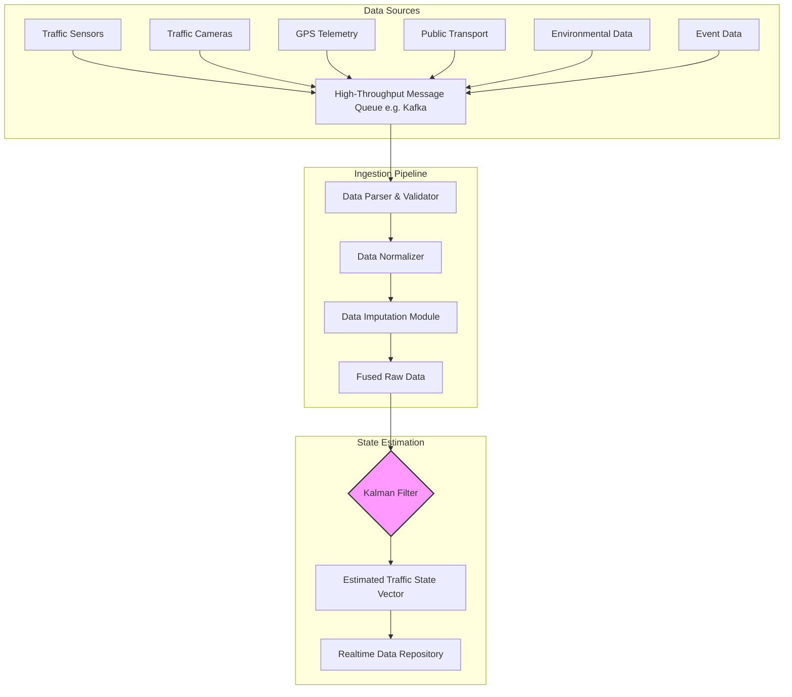
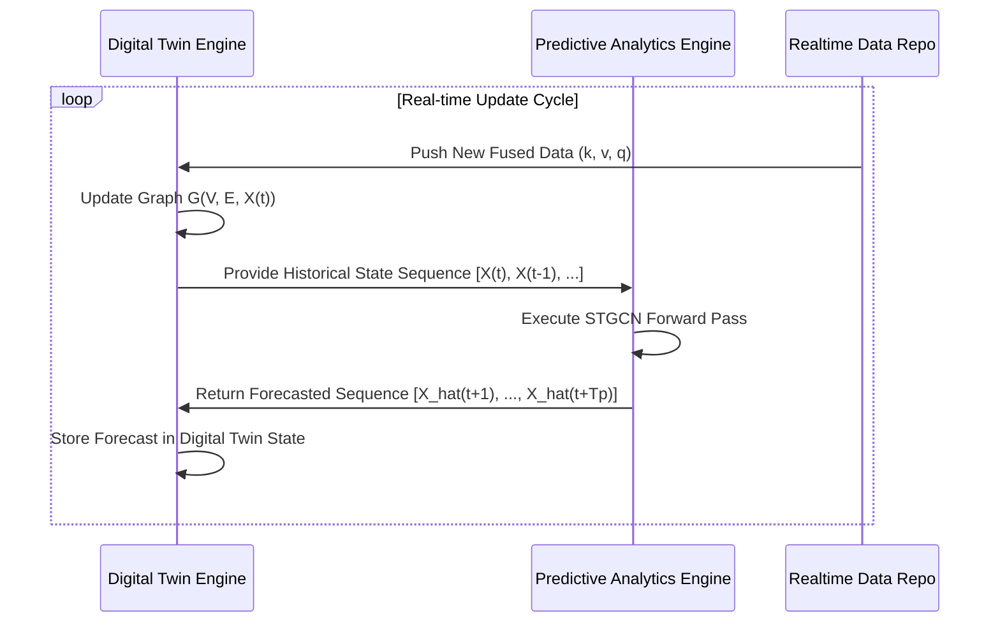
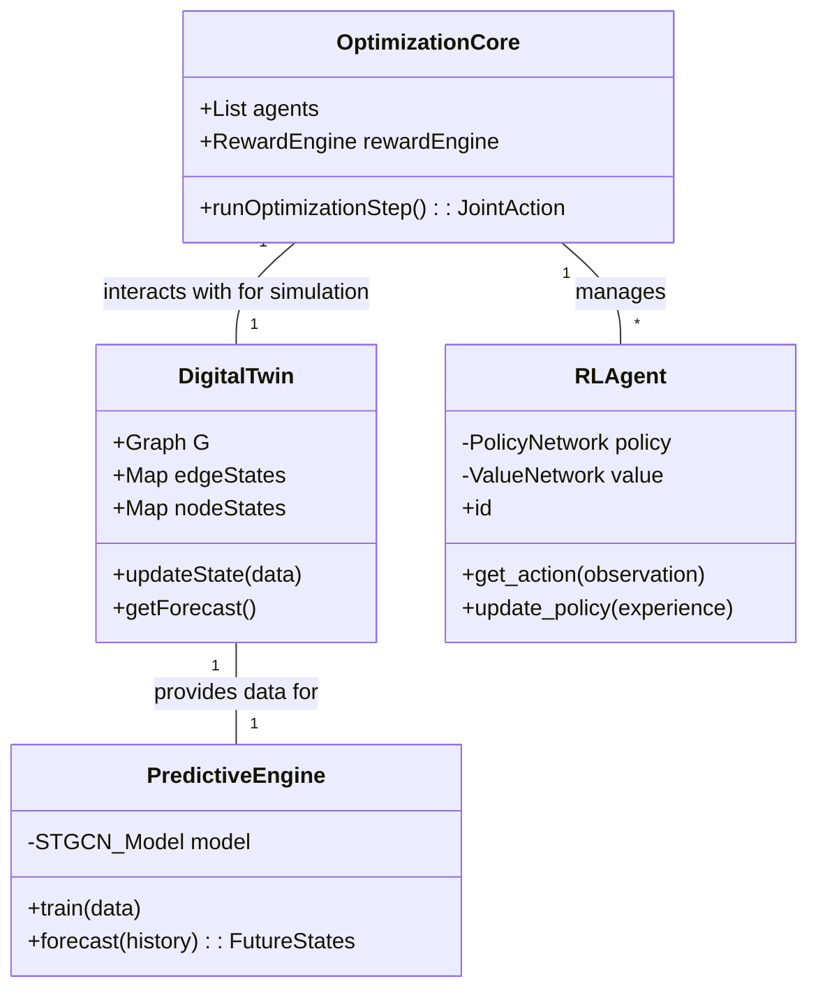
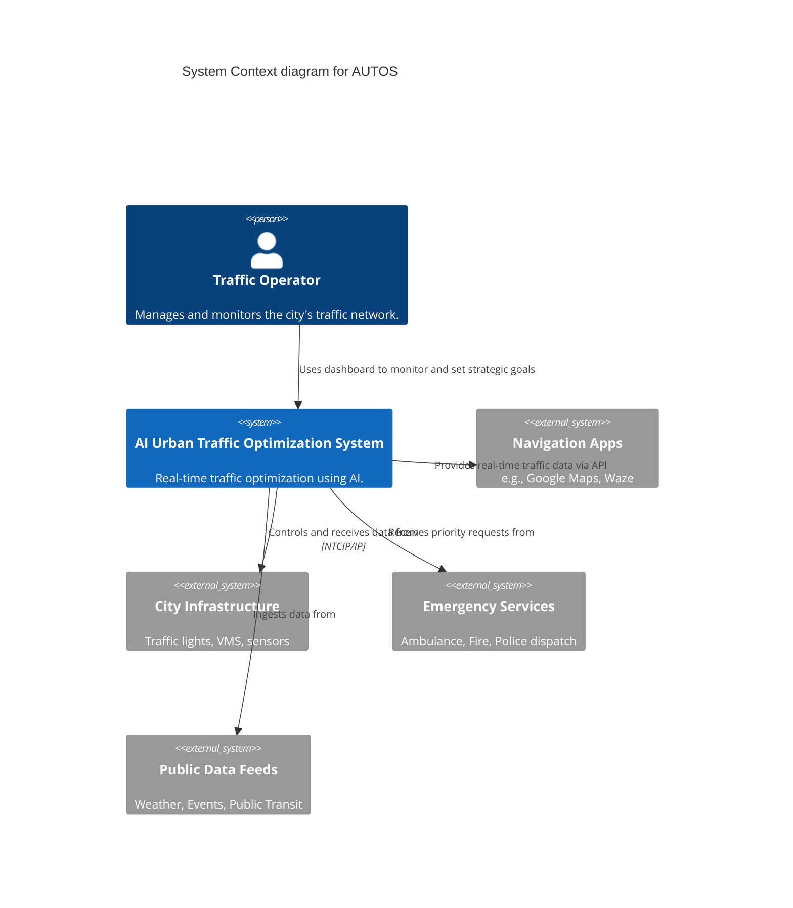
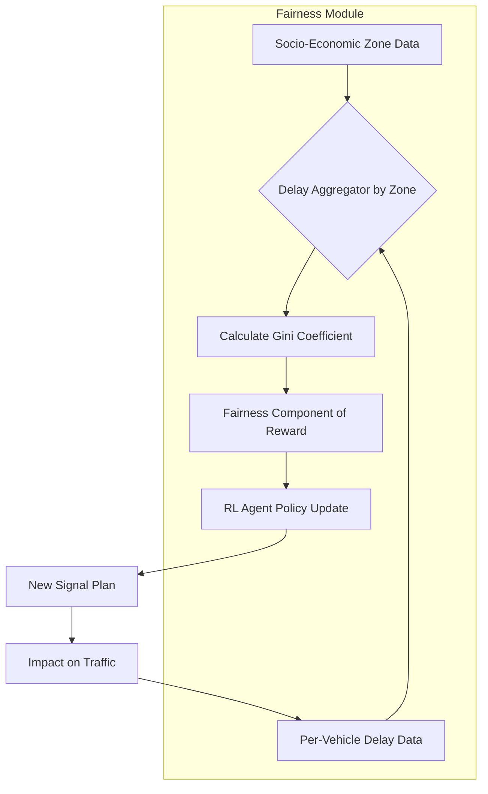
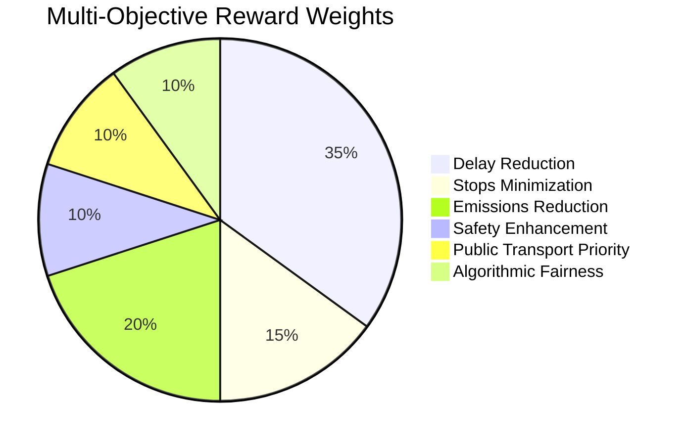

**Title of Invention:** A System and Method for Real-Time, AI-Driven Urban Traffic Flow Optimization

**Abstract:**
A comprehensive system for intelligent urban traffic management is disclosed. This system integrates diverse real-time data sources including traffic sensors, high-resolution cameras, GPS telemetry, public transport telematics, and environmental data. A sophisticated AI core, comprising a Graph-based Digital Twin City Model, a Spatio-Temporal Predictive Analytics Engine, a Multi-Agent Reinforcement Learning (MARL) framework, and a Generative AI Strategic Planner, analyzes current and forecasted traffic conditions across the entire urban network. This AI core acts as a central traffic control authority, generating and implementing optimal, coordinated signal timing plans for all traffic lights, managing dynamic message signs, and providing public transport prioritization. The system is architected around a multi-objective optimization function that mathematically balances network throughput, travel time minimization, emissions reduction, public safety, and algorithmic fairness. The primary objectives are to minimize overall congestion, reduce travel times, decrease vehicle emissions, enhance pedestrian and cyclist safety, and prioritize emergency vehicle movement, all while continuously learning and adapting to dynamic urban environments through a robust feedback and model refinement loop.

**Detailed Description:**

The proposed system, the AI Urban Traffic Optimization System (AUTOS), represents a paradigm shift from reactive to proactive and predictive traffic management. It addresses the growing challenges of urban mobility, environmental impact, and public safety by leveraging advanced artificial intelligence and ubiquitous data collection.

**1. Data Ingestion and Fusion Layer:**
The system continuously ingests a rich stream of real-time and historical data from a multitude of sources. The data ingestion pipeline is designed for high-volume, low-latency processing.

*   **Traffic Sensors:** Inductive loops, radar sensors, LiDAR, and magnetic sensors provide granular data. The raw sensor data for vehicle count \(c_i(t)\) at sensor \(i\) during time interval \(t\) is aggregated. Vehicle speed \(v_i(t)\) and lane occupancy \(o_i(t)\) are also captured.
    \[ \frac{\partial k}{\partial t} + \frac{\partial q}{\partial x} = 0 \quad (1) \]
    This is the continuity equation, where \(k\) is traffic density and \(q\) is traffic flow.

*   **Traffic Cameras:** High-resolution cameras with edge-based computer vision capabilities detect vehicle queues, incident alerts, and pedestrian/cyclist presence. Object detection models provide bounding boxes \(B_j(t)\) for each vehicle \(j\).
    \[ Q_L(t) = \sum_{j=1}^{N_v(t)} \mathbb{I}(B_j(t) \in Z_q) \quad (2) \]
    where \(Q_L(t)\) is the queue length, \(N_v(t)\) is the number of vehicles detected, and \(\mathbb{I}(\cdot)\) is an indicator function for vehicles in the queue zone \(Z_q\).

*   **GPS Data Telemetry:** Anonymized data from GPS-enabled vehicles provides origin-destination (OD) matrices. The probability of a trip from origin \(O_i\) to destination \(D_j\) is given by \(P(O_i \rightarrow D_j)\).
    \[ T_{ij}(t) = \alpha \cdot \text{GPS_Data}_{ij}(t) + (1-\alpha) \cdot \hat{T}_{ij}(t-1) \quad (3) \]
    where \(T_{ij}(t)\) is the estimated travel time on link \((i, j)\) updated via exponential smoothing.

*   **Public Transport Telematics:** Real-time location \(L_{bus}(t)\) and schedule adherence \(\Delta S_{bus}(t)\) for public transport.
    \[ \Delta S_{bus}(t) = T_{actual}(t) - T_{scheduled}(t) \quad (4) \]

*   **Ride Sharing Data:** Anonymized data contributes to understanding demand patterns. Let \(D_{rs}(z, t)\) be the ride-sharing demand in zone \(z\) at time \(t\).
    \[ D_{total}(z, t) = D_{private}(z, t) + D_{public}(z, t) + D_{rs}(z, t) \quad (5) \]

*   **Environmental Data:** Weather conditions (e.g., precipitation rate \(R(t)\)) affect the free-flow speed \(v_f\).
    \[ v_f' = v_f \cdot (1 - \beta_R \cdot R(t)) \quad (6) \]
    where \(\beta_R\) is a friction coefficient for rain.

*   **Event and Infrastructure Data:** A binary variable \(E_k(t) \in \{0, 1\}\) indicates if event \(k\) is active.

*   **Parking Occupancy Sensors:** Occupancy rate \(O_p(t) = N_{occ}(t) / N_{total}\).

*   **Pedestrian and Cyclist Sensors:** Counts \(N_{ped}(t)\) and \(N_{cyc}(t)\) are used to adjust crossing times.

**Data Fusion and State Estimation:**
A Kalman filter is employed to fuse data from multiple sources and estimate the true traffic state (e.g., density \(k\)) on a road segment.
State transition model: \(x_t = F_t x_{t-1} + B_t u_t + w_t\) (7)
Observation model: \(z_t = H_t x_t + v_t\) (8)
where \(x_t\) is the state vector, \(z_t\) is the observation, \(w_t \sim N(0, Q_t)\) and \(v_t \sim N(0, R_t)\) are process and measurement noise.

Prediction Step:
\[ \hat{x}_{t|t-1} = F_t \hat{x}_{t-1|t-1} + B_t u_t \quad (9) \]
\[ P_{t|t-1} = F_t P_{t-1|t-1} F_t^T + Q_t \quad (10) \]

Update Step:
\[ K_t = P_{t|t-1} H_t^T (H_t P_{t|t-1} H_t^T + R_t)^{-1} \quad (11) \]
\[ \hat{x}_{t|t} = \hat{x}_{t|t-1} + K_t(z_t - H_t \hat{x}_{t|t-1}) \quad (12) \]
\[ P_{t|t} = (I - K_t H_t) P_{t|t-1} \quad (13) \]



**2. Digital Twin and Predictive Analytics Engine:**
A core component of AUTOS is a dynamic **Graph-based Digital Twin City Model**. The city's transportation network is represented as a directed graph \(G = (V, E)\), where \(V\) is the set of intersections (nodes) and \(E\) is the set of road segments (edges).

**Digital Twin Representation:**
Each node \(v_i \in V\) is associated with an intelligent traffic light controller state \(S_i(t)\).
Each edge \(e_{ij} \in E\) is attributed with dynamic features:
\[ X_{ij}(t) = [k_{ij}(t), v_{ij}(t), q_{ij}(t), \tau_{ij}(t)]^T \quad (14) \]
where \(k\) is density, \(v\) is average speed, \(q\) is flow, and \(\tau\) is travel time. The entire network state at time \(t\) is the aggregation of all edge and node states.

**Predictive Analytics Engine:**
This engine utilizes a Spatio-Temporal Graph Convolutional Network (STGCN) to forecast future traffic conditions across the entire network graph.
The STGCN layer is defined as:
\[ H^{(l+1)} = \sigma \left( \Theta^{(l)} \star_{\mathcal{T}} \text{GCN}(A, H^{(l)}) \right) \quad (15) \]
where \(H^{(l)}\) is the input at layer \(l\), \(A\) is the adjacency matrix of graph \(G\), GCN is the graph convolution operation, \(\star_{\mathcal{T}}\) is a temporal convolution, \(\Theta^{(l)}\) are the model parameters, and \(\sigma\) is an activation function.

The graph convolution is defined as:
\[ \text{GCN}(A, X) = \tilde{D}^{-1/2} \tilde{A} \tilde{D}^{-1/2} X W \quad (16) \]
where \(\tilde{A} = A + I_N\) is the adjacency matrix with self-loops, \(\tilde{D}\) is the degree matrix of \(\tilde{A}\), and \(W\) is a trainable weight matrix.

The temporal convolution uses a Gated Recurrent Unit (GRU) or LSTM structure to capture time-series dependencies.
Update gate: \(z_t = \sigma(W_z [h_{t-1}, x_t])\) (17)
Reset gate: \(r_t = \sigma(W_r [h_{t-1}, x_t])\) (18)
Candidate hidden state: \(\tilde{h}_t = \tanh(W_h [r_t \odot h_{t-1}, x_t])\) (19)
Hidden state: \(h_t = (1 - z_t) \odot h_{t-1} + z_t \odot \tilde{h}_t\) (20)

The engine predicts a sequence of future traffic states:
\[ [\hat{X}(t+1), \hat{X}(t+2), ..., \hat{X}(t+T_p)] = \text{STGCN}(X(t), X(t-1), ...; G) \quad (21) \]
where \(T_p\) is the prediction horizon. The model is trained by minimizing a loss function, e.g., Mean Absolute Error (MAE):
\[ \mathcal{L} = \frac{1}{N \cdot T_p} \sum_{i=1}^{N} \sum_{\tau=1}^{T_p} | \hat{X}_i(t+\tau) - X_i(t+\tau) | \quad (22) \]



**3. AI Optimization Core:**
This is the brain of AUTOS, architected as a Multi-Agent Reinforcement Learning (MARL) system where each intersection controller is an intelligent agent.

**Formalism as a Decentralized POMDP:**
The problem is modeled as a Decentralized Partially Observable Markov Decision Process (Dec-POMDP), defined by a tuple \((\mathcal{I}, \mathcal{S}, \{\mathcal{A}_i\}, \mathcal{P}, \{\mathcal{R}_i\}, \{\Omega_i\}, \mathcal{O}, \gamma)\).
*   \(\mathcal{I}\): Set of \(N\) agents (intersections).
*   \(\mathcal{S}\): Global state space, \(s \in \mathcal{S}\) is the true state of the entire network.
*   \(\mathcal{A}_i\): Action set for agent \(i\). An action \(a_i \in \mathcal{A}_i\) is choosing the next signal phase.
*   \(\mathcal{P}(s'|s, \mathbf{a})\): State transition probability, where \(\mathbf{a} = (a_1, ..., a_N)\) is the joint action.
*   \(\mathcal{R}_i(s, \mathbf{a})\): Reward function for agent \(i\).
*   \(\Omega_i\): Observation set for agent \(i\). Agent \(i\) receives a local observation \(o_i \in \Omega_i\).
*   \(\mathcal{O}(o|s, \mathbf{a})\): Observation probability function.
*   \(\gamma \in [0, 1)\): Discount factor.

**Reinforcement Learning (RL) Agent:**
Each agent \(i\) learns a policy \(\pi_i(a_i|o_i)\) that maps its local observation to an action. We use a policy gradient method like Proximal Policy Optimization (PPO). The objective for agent \(i\) is to maximize its expected discounted return:
\[ J(\theta_i) = \mathbb{E}_{\tau \sim \pi_{\theta}} \left[ \sum_{t=0}^{T} \gamma^t R_i(s_t, \mathbf{a}_t) \right] \quad (23) \]
The PPO clipped surrogate objective function is:
\[ L^{CLIP}(\theta) = \hat{\mathbb{E}}_t \left[ \min(r_t(\theta) \hat{A}_t, \text{clip}(r_t(\theta), 1-\epsilon, 1+\epsilon) \hat{A}_t) \right] \quad (24) \]
where \(r_t(\theta) = \frac{\pi_{\theta}(a_t|s_t)}{\pi_{\theta_{old}}(a_t|s_t)}\) is the probability ratio and \(\hat{A}_t\) is the advantage estimator.
\[ \hat{A}_t = -V(s_t) + r_t + \gamma r_{t+1} + ... + \gamma^{T-t+1} r_{T-1} + \gamma^{T-t} V(s_T) \quad (25) \]

**Multi-Objective Reward Function:**
The immediate reward \(R_i(s_t, \mathbf{a}_t)\) for agent \(i\) is a weighted sum of multiple objectives:
\[ R_i(t) = w_1 R_{delay} + w_2 R_{stops} + w_3 R_{emission} + w_4 R_{safety} + w_5 R_{priority} + w_6 R_{fairness} \quad (26) \]
where \(\sum w_j = 1\).
*   Delay Reward: \(R_{delay} = - \sum_{l \in L_i} d_l(t)\), where \(d_l(t)\) is total delay on lane \(l\). (27)
*   Stops Reward: \(R_{stops} = - \sum_{l \in L_i} N_{stops,l}(t)\). (28)
*   Emission Reward: Based on a model like VT-Micro. \(E = f(v, a)\). \(R_{emission} = -E_{total}\). (29-39)
*   Safety Reward: \(R_{safety} = - C_{TTC}\), where \(C_{TTC}\) is the count of Time-to-Collision values below a threshold. (40-50)
*   Priority Reward: \(R_{priority} = B_{EV}\) if an emergency vehicle is cleared, where \(B_{EV}\) is a large positive bonus. (51-55)
*   Fairness Reward: \(R_{fairness} = - \text{Gini}(\mathbf{d})\), where Gini is the Gini coefficient of the delay vector \(\mathbf{d}\) across approaches. (56-65)



**Generative AI Planner (LLM):**
The LLM acts as a strategic supervisor. It receives high-level system state descriptions and goals, then generates strategic directives.
Example Prompt:
`PROMPT:
{
  "system_state": {
    "network_graph_summary": { ... },
    "incidents": [{"type": "accident", "location": "Edge_123", "severity": "high"}],
    "forecast": {"peak_traffic_imminent": true, "eta_minutes": 15},
    "active_priorities": [{"type": "emergency_vehicle", "route": ["Edge_45", "Edge_56"]}]
  },
  "optimization_goals": ["clear_EV_route", "mitigate_accident_congestion", "prepare_for_peak_flow"],
  "output_format": "JSON",
  "constraints": ["max_phase_time_seconds": 120]
}
`
The LLM's output is a set of constraints or modified reward weights for the MARL agents.
\[ w_j' = w_j + \Delta w_j^{LLM} \quad (66) \]
This allows for dynamic, human-in-the-loop style strategic control over the low-level tactical optimization.

```mermaid
graph LR
    subgraph Generative Strategic Layer
        A[Real-time Data Feeds] --> B{State Aggregator}
        C[Human Operator Goals] --> B
        B --> D[Prompt Formatter]
        D --> E[Generative AI Planner (LLM)]
        E --> F{Strategy Parser}
        F --> G[Strategic Directives]
    end

    subgraph Tactical Optimization Layer
        H[MARL Agents]
        G -- Modifies Reward Weights / Constraints --> H
        I[Digital Twin Environment]
        H -- Takes Actions In --> I
        I -- Provides States/Rewards --> H
        H -- Generates --> J[Signal Timing Plan]
    end
```

**4. Actuation and Control Layer:**
This layer translates the AI's decisions into physical actions.

*   **Traffic Signal Control Interface:** The chosen joint action \(\mathbf{a}_t\) is translated into NTCIP (National Transportation Communications for ITS Protocol) commands.
    A signal plan is a tuple \(P = (C, S, O)\) (67), where \(C\) is cycle length, \(S\) is the vector of phase splits, and \(O\) is the offset. Our system operates in a fully actuated mode, choosing the next phase directly.
    \[ \text{Command}_i(t) = \text{SetPhase}(\text{Intersection}_i, \text{phase}=a_{i,t}) \quad (68) \]

*   **Dynamic Message Signs (VMS) Management:** The LLM's strategic output can directly generate messages.
    \[ M_{VMS}(t) = \text{GenerateMessage}(\text{incident}, \text{location}, \text{alternative_route}) \quad (69-75) \]

*   **Public Information Dissemination:** APIs push real-time travel times \(\tau_{ij}(t)\) and route recommendations to public apps.
    \[ \text{API_Response} = \text{JSON}(\{\text{route}_k: \sum_{(i,j) \in \text{route}_k} \tau_{ij}(t)\}) \quad (76-80) \]

*   **Emergency Override System:** A dedicated high-priority channel bypasses the MARL policy for certified emergency signals.
    \[ \text{action}_i = \text{IF} (\text{EV_signal}) \text{THEN} \text{GreenWavePolicy() ELSE } \pi_i(a_i|o_i) \quad (81) \]

```mermaid
stateDiagram-v2
    [*] --> Green
    Green --> Yellow: timer_expires OR EV_preemption
    Yellow --> Red: timer_expires
    Red --> Green: demand_detected AND phase_allowed
    
    state Green {
        direction "North-South"
        [*] --> phase_1
        phase_1 --> phase_2: demand_on_left_turn
        phase_2 --> phase_1: timer_expires
    }
    
    state Red {
        direction "East-West"
    }
```

**5. Feedback Loop and Adaptive Learning:**

*   **Performance Monitoring:** The system continuously monitors Key Performance Indicators (KPIs).
    *   Total Travel Time (TTT): \( \sum_{v \in V_{net}} (t_{v,exit} - t_{v,enter}) \) (82)
    *   Total Delay (TD): \( TTT - TTT_{free\_flow} \) (83)
    *   Performance Index (PI): \( w_{TTT} \frac{TTT}{TTT_{base}} + w_{stops} \frac{N_{stops}}{N_{stops,base}} \) (84-90)
    *   Travel Time Reliability (Buffer Index): \( BI = \frac{T_{95th} - T_{mean}}{T_{mean}} \) (91)

*   **Anomaly Detection:** A Variational Autoencoder (VAE) is trained on historical KPI data. A high reconstruction error flags an anomaly.
    Encoder: \( q_{\phi}(z|x) \) (92)
    Decoder: \( p_{\theta}(x|z) \) (93)
    Loss Function (ELBO): \( \mathcal{L}(\theta, \phi; x) = \mathbb{E}_{q_{\phi}(z|x)}[\log p_{\theta}(x|z)] - D_{KL}(q_{\phi}(z|x) || p_{\theta}(z)) \) (94)
    Anomaly Score: \( S(x) = ||x - \text{decoder}(\text{encoder}(x))||^2 \) (95)

*   **Model Adaptation:** The RL agent's policy networks are continuously updated. The predictive STGCN model is periodically retrained with new data. Hyperparameters of the entire system are tuned using Bayesian Optimization.
    \[ \theta^* = \arg\max_{\theta \in \Theta} f(\theta) \quad (96) \]
    where \(f(\theta)\) is the black-box objective function (e.g., PI over a week), and a Gaussian Process is used to model it.
    \[ f(\theta) \sim \mathcal{GP}(m(\theta), k(\theta, \theta')) \quad (97-100) \]

```mermaid
gantt
    title Coordinated Signal Plan for Main Street
    dateFormat  HH:mm:ss
    axisFormat  %H:%M:%S
    
    section Intersection 1
    Phase 1 (N/S Green) : 00:00:00, 40s
    Phase 2 (E/W Green) : 00:00:45, 30s

    section Intersection 2
    Phase 1 (N/S Green) : 00:00:10, 40s
    Phase 2 (E/W Green) : 00:00:55, 30s
    
    section Intersection 3
    Phase 1 (N/S Green) : 00:00:20, 40s
    Phase 2 (E/W Green) : 00:01:05, 30s
```



**6. System Architecture and Scalability**
The AUTOS system is designed as a cloud-native, microservices-based architecture to ensure scalability and resilience.

*   **Microservices:** Each major component (Data Ingestion, Digital Twin, Prediction, Optimization) is a separate microservice.
*   **Communication:** Services communicate asynchronously via a message bus like Apache Kafka.
*   **Edge Computing:** Computer vision on traffic cameras is performed on edge devices to reduce latency and bandwidth usage.
*   **Parallel Training:** RL agent training is massively parallelized in the cloud, using the Digital Twin as a simulation environment.



**7. Ethical Considerations and Algorithmic Fairness**
To prevent the system from creating "sacrifice zones" or unfairly penalizing certain areas, fairness is a primary optimization objective.

*   **Fairness Metrics:** We monitor the distribution of delays, travel times, and air quality changes across different socio-economic districts. The Gini coefficient is one such metric used in the reward function.
*   **Transparency:** The LLM-based planner provides human-readable justifications for its strategic decisions, enabling auditing and oversight by human operators.
*   **Bias Auditing:** The predictive models are regularly audited for biases related to time of day, location, or event type.



**Security and Privacy:**
Robust security protocols are implemented to protect the infrastructure from cyber threats. Anomaly detection extends to identifying potential cyber-physical attacks. Data privacy is ensured through k-anonymization and differential privacy techniques for all personal mobility data, ensuring that individual trips cannot be re-identified.



**Claims:**
1.  A system for urban traffic optimization, comprising:
    a.  A data ingestion layer configured to receive real-time traffic data from a plurality of sensor types including traffic cameras, inductive loops, GPS telemetry, and public transport telematics;
    b.  A Graph-based Digital Twin City Model continuously updating a high-fidelity virtual representation of the urban transportation network, where intersections are nodes and road segments are edges with dynamic attributes;
    c.  A Spatio-Temporal Predictive Analytics Engine, comprising a graph convolutional network, integrated with the Digital Twin, configured to forecast future traffic conditions across the entire network graph;
    d.  An AI Optimization Core, including a Multi-Agent Reinforcement Learning framework and a Generative AI Planner, configured to analyze the Digital Twin and predictive analytics to generate coordinated signal timing plans and traffic management strategies;
    e.  A Multi-Objective Optimization reward function within the AI Optimization Core, configured to balance multiple optimization goals including travel time minimization, emissions reduction, emergency vehicle prioritization, and pedestrian cyclist safety;
    f.  An actuation and control layer configured to implement the generated plans by communicating with traffic signal controllers and dynamic message signs; and
    g.  A feedback loop and adaptive learning mechanism configured to monitor system performance, detect anomalies using machine learning models, and continuously refine the AI Optimization Core's models and strategies.

2.  The system of claim 1, wherein the data ingestion layer further receives environmental data, event schedules, ride-sharing data, parking occupancy data, and emergency dispatch information, and uses a Kalman filter for data fusion and state estimation.

3.  The system of claim 1, wherein the Multi-Agent Reinforcement Learning framework treats each traffic signal controller as an independent agent learning a policy to select signal phases based on local observations, with policies being trained in parallel using the Digital Twin as a simulation environment.

4.  The system of claim 1, wherein the Generative AI Planner processes complex prompts summarizing system state, forecasts, and high-level goals to produce human-readable strategies and dynamically adjust the weights of the multi-objective reward function for the reinforcement learning agents.

5.  The system of claim 1, further comprising an Emergency Priority Module capable of instantly overriding standard optimization plans to facilitate emergency vehicle movement by creating dynamic green waves.

6.  A method for real-time urban traffic optimization, comprising:
    a.  Ingesting diverse real-time data streams from an urban transportation network;
    b.  Constructing and continuously updating a Graph-based Digital Twin City Model with the ingested data;
    c.  Forecasting future traffic conditions across the entire network graph using a Spatio-Temporal Predictive Analytics Engine;
    d.  Applying an AI Optimization Core, including a Multi-Agent Reinforcement Learning framework and a Generative AI Planner, to evaluate the Digital Twin and forecasts, and generate optimized traffic management plans for a plurality of traffic lights and dynamic message signs, considering multiple objectives;
    e.  Implementing the generated traffic management plans across the urban infrastructure; and
    f.  Continuously monitoring the performance of the implemented plans and feeding performance metrics back into the AI Optimization Core for adaptive learning and model refinement.

7.  The method of claim 6, wherein the multiple objectives include minimizing travel time, reducing vehicle emissions, prioritizing emergency services, enhancing pedestrian and cyclist safety, and improving public transport efficiency.

8.  The method of claim 6, further comprising disseminating real-time traffic information and recommended routes to the public via digital platforms and APIs.

9.  The method of claim 6, further comprising detecting traffic and system anomalies using an unsupervised machine learning model and automatically triggering recovery or adaptive actions from the AI Optimization Core.

10. The system of claim 1, wherein the Multi-Objective Optimization reward function explicitly includes an algorithmic fairness component, configured to minimize disparities in traffic delays and environmental impacts across different geographical or socio-economic zones within the urban area.