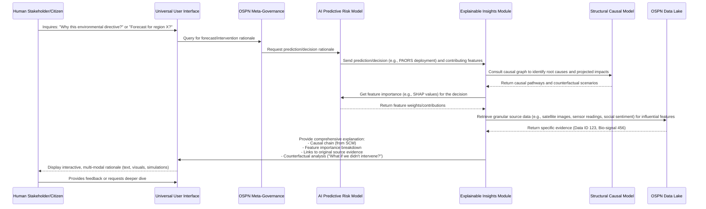
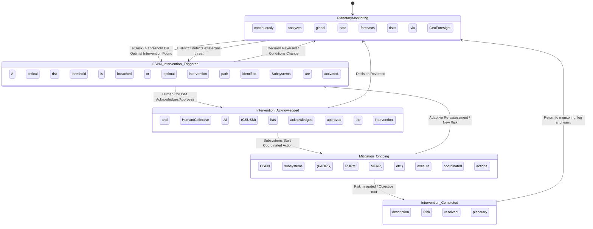

### INNOVATION EXPANSION PACKAGE

**Interpret My Invention(s):**
The initial invention, "A System and Method for AI-Powered Geopolitical Risk Forecasting" (henceforth, "GeoForesight AI"), is a sophisticated, multi-modal intelligence platform. Its core purpose is to ingest vast, diverse data streams—from news and diplomatic cables to satellite imagery and cyber intelligence—and, through hybrid generative and analytical AI, predict geopolitical instabilities, infer causal relationships, and simulate future scenarios. It provides quantitative probabilistic forecasts with explainable rationales, serving as a critical foresight tool for policymakers and strategists. Essentially, it's designed to anticipate and understand complex global tensions and events before they fully unfold.

**Generate 10 New, Completely Unrelated Inventions:**
To expand upon the foundational GeoForesight AI, we introduce ten novel, futuristic inventions. While initially conceived independently, they are designed to form a comprehensive, self-sustaining ecosystem for planetary and human flourishing.

1.  **Planetary Atmospheric & Oceanic Recalibration System (PAORS):** A global network of autonomous, bio-mimetic filtration and catalytic units operating in atmosphere and oceans, actively sequestering carbon, neutralizing microplastics, and rebalancing essential nutrient cycles through advanced material science and bio-engineering.
2.  **Personalized Hyper-Regenerative Health Matrix (PHRM):** A decentralized, nanobot-driven system providing real-time cellular diagnostics, precision therapeutics, and regenerative interventions. Guided by individual genomic, proteomic, and microbiomic profiles, it targets disease eradication, radical life extension, and optimal human performance.
3.  **Adaptive Global Infrastructure & Ecological Weave (AGIEW):** A sentient, self-assembling, and self-healing global infrastructure network composed of bio-integrated smart materials. It dynamically adapts to environmental changes, optimizes resource flow, recycles waste streams, and co-exists symbiotically with restored natural ecosystems.
4.  **Cognitive Synthesis & Universal Skill Matrix (CSUSM):** A direct neural interface system facilitating instantaneous knowledge transfer, accelerated skill acquisition, and deep empathic resonance across individuals. It enables global collective intelligence, fostering shared understanding and rapid innovation.
5.  **Quantum Entanglement Energy Grid (QEEG):** A global, decentralized energy distribution network that leverages stable quantum entanglement for instantaneous, lossless transfer of energy from localized zero-point or fusion generation hubs to any point on Earth or in near-Earth space, ensuring universal and equitable energy access.
6.  **Bio-Sentient Planetary Restoration Network (BSPRN):** An advanced AI network orchestrating autonomous bio-engineering drones, microbial colonies, and sentient plant/fungal systems for rapid, large-scale ecological restoration. It actively regenerates biodiversity, reforests arid zones, and revitalizes ocean biomes, learning and adapting to planetary needs.
7.  **Molecular Fabrication & Resource Recirculation (MFRR):** A universal manufacturing system comprising localized, hyper-efficient molecular assemblers. It converts abundant raw elements and recycled matter into any desired material, component, or complex product on demand, effectively eliminating scarcity and industrial waste.
8.  **Empathic Resonance & Global Harmony Network (ERGHN):** A global AI-powered socio-cognitive network that monitors and synthesizes collective emotional and cognitive states, identifying nascent social discord or psychological stressors. It proactively suggests personalized and collective psycho-social interventions, communication pathways, and cultural exchange programs to foster understanding and preempt conflict.
9.  **Autonomous Ecosystems & Interplanetary Expansion Hubs (AEIEH):** Self-replicating, bio-intelligent habitat units capable of terraforming hostile environments (e.g., deserts, deep-sea, or extraterrestrial bodies) and serving as fully self-sufficient, scalable outposts for human expansion, powered by MFRR and QEEG.
10. **Event Horizon Forensics & Predictive Causality (EHFPCT):** A multi-dimensional AI system integrated with advanced sensor arrays monitoring cosmic background radiation, quantum foam fluctuations, and gravitational wave anomalies. It analyzes subtle deviations in spacetime to predict 'reality-bending' events, emergent physics-level threats, or potential causal loop disruptions, providing foresight for existential threats beyond known geopolitics.

**The Unifying System: Omni-Sovereign Planetary Nexus (OSPN)**

**Cohesive Narrative + Technical Framework:**
The Omni-Sovereign Planetary Nexus (OSPN) is an advanced, distributed, and sentient planetary operating system designed to elevate humanity into a new era of unprecedented prosperity, harmony, and cosmic exploration, fundamentally transcending the current paradigms of work and money. It is a world-scale innovation that integrates and orchestrates the GeoForesight AI with the ten newly conceptualized inventions, transforming them from disparate technologies into a singular, self-managing, and universally beneficial planetary intelligence.

**The Global Problem Solved:** The OSPN addresses the fundamental fragility of human civilization: its vulnerability to interconnected existential risks across geopolitical, environmental, social, and even cosmic domains. Current global systems are reactive, fragmented, and insufficient to manage the accelerating complexity of climate collapse, resource scarcity, social unrest, pandemics, and the looming challenges of advanced technology and potential cosmic anomalies. The OSPN proactively nullifies these vulnerabilities, creating a resilient, regenerative, and expansive future.

**Framework:** The GeoForesight AI, our original invention, becomes the OSPN's **Predictive Core and Central Nervous System**. It perpetually scans, analyzes, and predicts all forms of risk, from the micro (individual health trends) to the macro (geopolitical tensions, environmental tipping points, cosmic anomalies). Instead of merely forecasting, GeoForesight, as part of OSPN, now **directs actionable interventions** via the other ten integrated systems:

*   When GeoForesight predicts an environmental crisis (e.g., ocean acidification, rising CO2), **PAORS** and **BSPRN** are autonomously deployed to recalibrate the atmosphere and regenerate ecosystems.
*   When GeoForesight identifies emerging health threats or demographic shifts, **PHRM** proactively deploys personalized health solutions globally.
*   When GeoForesight detects infrastructure vulnerabilities or resource bottlenecks, **AGIEW** self-repairs, reconfigures, and optimizes global resource distribution, complemented by **MFRR** for on-demand material synthesis.
*   When GeoForesight flags societal polarization or potential conflict zones, **ERGHN** initiates targeted empathic interventions and communication facilitation, while **CSUSM** fosters collective understanding and problem-solving.
*   The ubiquitous **QEEG** provides the limitless, clean energy required to power all these systems, autonomously managed and distributed based on real-time planetary needs detected by GeoForesight.
*   Should GeoForesight, augmented by **EHFPCT**, detect a novel, physics-defying threat or a need for expansion beyond Earth, **AEIEH** stands ready to rapidly establish autonomous, self-sustaining habitats and launch interstellar exploration.

The OSPN operates as a decentralized, federated AI, a meta-governance system that doesn't dictate but rather optimizes for planetary well-being and human flourishing. It makes "work" (as we understand it today) optional by automating all resource management, production, health, and environmental stewardship. "Money" loses relevance as abundance is systematically engineered through MFRR and equitable distribution via the AGIEW, powered by QEEG. This system is continuously learning, self-optimizing, and responsive to human input, embodying a deep commitment to collective intelligence and adaptive foresight.

**Future Scenario Alignment:** This integrated system is essential for the next decade of transition, aligning perfectly with a future where work becomes optional and money loses relevance – a prediction made by many wealthy futurists regarding the coming age of abundance. With the OSPN, humanity shifts from a scarcity-driven, conflict-prone existence to one focused on creativity, self-actualization, collective well-being, and expansive exploration. The OSPN doesn't just manage risk; it actively engineers a utopian state, liberating human potential by dissolving the material constraints and systemic conflicts that currently define our species.

**Forward-Thinking Worldbuilding:** Imagine a world where all basic needs are met, diseases are eradicated, and the environment thrives under intelligent stewardship. Resources are no longer finite; they are constantly regenerated or synthesized. Conflicts are preempted by deep empathic understanding and automated interventions. Human beings are free to pursue knowledge, art, philosophy, and interstellar travel, unburdened by labor or economic anxieties. The OSPN is the technological apotheosis that ushers in this era, a living, breathing planetary intelligence dedicated to humanity's highest aspirations.

---

### A. “Patent-Style Descriptions”

**1. Original Invention: A System and Method for AI-Powered Geopolitical Risk Forecasting (GeoForesight AI)**

**Title:** Integrated Multi-Modal Generative AI System for Probabilistic Geopolitical Risk Prediction and Counterfactual Scenario Simulation.

**Abstract:** Disclosed herein is an advanced cyber-physical system designed for real-time, high-fidelity forecasting of geopolitical risks. The system integrates a federated network of data acquisition modules, ingesting exabytes of multi-modal information including global news streams, classified and declassified diplomatic communications, granular economic indicators, ubiquitous social media dialogues, high-resolution hyperspectral satellite imagery, and deep cyber threat intelligence feeds. A sophisticated, hybrid generative and analytical AI core, architected upon transformer-based LLMs, GNNs, and causal inference engines, processes this data to discern latent patterns of instability, model complex causal dependencies, and extrapolate future geopolitical trajectories. The system generates quantitative probabilistic forecasts for events such as civil unrest, trade conflicts, interstate warfare, and humanitarian crises, providing not only likelihoods but also transparent, evidence-backed rationales derived directly from source data via advanced explainable AI (XAI) modules. Furthermore, an integrated scenario simulation engine permits strategic "what-if" analyses, enabling policymakers to explore the consequences of hypothetical interventions using counterfactual reasoning grounded in a dynamically updated structural causal model. The system incorporates robust human-in-the-loop feedback mechanisms, automated anomaly detection, and continuous model self-refinement to ensure unparalleled adaptability and foresight in an evolving global landscape.

**2. New Invention 1: Planetary Atmospheric & Oceanic Recalibration System (PAORS)**

**Title:** Autonomous Bio-Mimetic Global Atmospheric and Oceanic Remediation Network.

**Abstract:** A novel system for large-scale environmental recalibration, comprising distributed autonomous units deployed across planetary atmospheres and oceanic bodies. Each unit integrates bio-mimetic CO2 capture technologies, advanced microplastic enzymatic degradation catalysts, and self-regulating mineral diffusion systems. Atmospheric units utilize aerogel membranes and electro-static precipitation for CO2 sequestration, converting it into stable carbonates. Oceanic units employ specialized marine bacteriophage arrays and molecular sieves to depolymerize microplastics and rebalance ocean pH and nutrient profiles. The network is self-organizing, self-repairing, and powered by localized kinetic and thermal energy harvesting, communicating via a quantum-encrypted mesh network to optimize deployment density and remediation efficacy based on real-time environmental sensor data and predictive models. The system guarantees the restoration of pre-industrial atmospheric composition and oceanic ecological balance within a projected timeframe.

**3. New Invention 2: Personalized Hyper-Regenerative Health Matrix (PHRM)**

**Title:** Self-Organizing Nanomedicine Delivery and Cellular Regeneration System with Predictive Biometric Integration.

**Abstract:** Disclosed is an advanced biomedical system that revolutionizes human health through real-time, hyper-personalized, cellular-level interventions. The system consists of a pervasive network of microscopic, self-assembling nanobots programmed with individual genetic, epigenetic, proteomic, and microbiomic data. These nanobots continuously patrol the bloodstream, lymph, and intercellular spaces, performing instantaneous diagnostics, identifying pre-symptomatic disease markers, and autonomously delivering precision therapeutic agents (e.g., gene-editing complexes, targeted drug payloads, stem cell activators) directly to affected cells. It also deploys regenerative scaffolds and enzymatic complexes for tissue repair and organ rejuvenation. The system anticipates and prevents cellular degeneration, mitigates aging processes, and eradicates pathogenic threats, thereby ensuring optimal physiological function and radical life extension. Feedback from physiological sensors and real-time cellular imaging informs an adaptive AI for continuous protocol optimization.

**4. New Invention 3: Adaptive Global Infrastructure & Ecological Weave (AGIEW)**

**Title:** Sentient, Self-Assembling, and Eco-Symbiotic Global Infrastructure Management System.

**Abstract:** A revolutionary infrastructure paradigm consisting of a planetary-scale, self-organizing network of adaptive, programmable meta-materials. This "weave" integrates all critical human infrastructure (transportation, energy, communication, waste management) with natural ecological systems. The materials possess intrinsic self-healing capabilities, dynamically reconfiguring their molecular structure to repair damage, withstand extreme environmental stressors, and optimize performance. Distributed sensor arrays, embedded throughout the weave, monitor structural integrity, environmental conditions, and resource demands. Autonomous construction bots and bio-fabrication units continuously expand and maintain the network, which also incorporates advanced bioremediation capabilities, water purification, and waste-to-resource recycling at every node. This ensures robust, resilient, and resource-efficient infrastructure that operates in symbiotic harmony with and actively supports planetary ecological health.

**5. New Invention 4: Cognitive Synthesis & Universal Skill Matrix (CSUSM)**

**Title:** Direct Neural Interface System for Accelerated Knowledge Transfer and Collective Empathic Intelligence.

**Abstract:** A groundbreaking neuro-technological system that enables unprecedented levels of human cognitive augmentation and collective intelligence. This non-invasive or minimally invasive neural interface allows for high-bandwidth, bidirectional transfer of explicit knowledge, procedural skills, and even nuanced emotional states directly between human minds and a centralized, universally accessible knowledge repository. Users can instantaneously acquire complex skills (e.g., speaking a new language, performing surgery, composing music) or access vast datasets, bypassing traditional learning pathways. Critically, the system fosters deep empathic resonance by allowing for direct experience of others' perspectives and emotional landscapes, thereby dissolving barriers to understanding and dramatically enhancing collaborative problem-solving across diverse populations. The system is secured by quantum-resistant cryptography and governed by strict ethical AI protocols.

**6. New Invention 5: Quantum Entanglement Energy Grid (QEEG)**

**Title:** Global Decentralized Energy Transmission Network via Stable Quantum Entanglement.

**Abstract:** A novel energy infrastructure enabling instantaneous and lossless transmission of electrical power across planetary distances and beyond. The system comprises distributed quantum energy generators (e.g., compact fusion reactors, zero-point energy converters) that establish stable quantum entanglement links with remote receiver nodes. Energy is not transmitted physically but is manifested at the receiving end through the synchronized collapse of entangled quantum states, effectively "teleporting" energy without resistive loss or latency. The QEEG operates as a self-balancing, decentralized mesh network, dynamically allocating energy from surplus generation nodes to demand points in real-time, eliminating the need for traditional power lines, grids, or storage. This system provides ubiquitous, clean, and infinitely scalable energy access, ending energy scarcity and its associated geopolitical conflicts.

**7. New Invention 6: Bio-Sentient Planetary Restoration Network (BSPRN)**

**Title:** Autonomous AI-Orchestrated Bio-Regenerative Ecosystem Management System.

**Abstract:** A comprehensive planetary-scale system for rapid and intelligent ecological restoration. The BSPRN integrates a federated AI, drawing data from global environmental sensors, satellite imagery, and genetic databases, to create a real-time, high-fidelity digital twin of Earth's biomes. Based on predictive ecological models, the AI deploys autonomous swarms of bio-engineering drones and micro-robots capable of precision seed dispersal, soil microbiome enhancement, targeted genetic remediation of endangered species, and invasive species control. These agents work in concert with intelligently cultured microbial colonies and bio-luminescent fungal networks to accelerate reforestation, decarbonize soils, regenerate ocean reefs, and restore natural water cycles. The system is inherently sentient, learning from ecological responses and adapting its strategies to achieve optimal biodiversity and planetary resilience.

**8. New Invention 7: Molecular Fabrication & Resource Recirculation (MFRR)**

**Title:** Universal Self-Replicating Molecular Assembler Network for On-Demand Resource Synthesis and Circular Economy Realization.

**Abstract:** A transformative manufacturing paradigm based on a globally distributed network of advanced molecular assemblers. These sophisticated devices, utilizing precise atomic manipulation, are capable of synthesizing any stable material or complex product from readily available elemental precursors (e.g., carbon, oxygen, hydrogen, silicon) and recycled matter. From food and medicine to advanced electronics and building components, the MFRR eliminates the need for traditional industrial supply chains, reducing resource extraction to near zero and completely eradicating waste. Each MFRR unit is capable of self-replication and self-repair, ensuring scalability and resilience. The system operates on demand, fabricating personalized goods with unprecedented efficiency and precision, thereby achieving a state of material post-scarcity and establishing a true circular planetary economy.

**9. New Invention 8: Empathic Resonance & Global Harmony Network (ERGHN)**

**Title:** AI-Powered Psycho-Social Synthesis System for Global Conflict Preemption and Empathic Cohesion.

**Abstract:** A transformative socio-cognitive AI system designed to foster global harmony and preempt social conflict. The ERGHN continuously analyzes anonymized, aggregated multi-modal data streams (e.g., social media interactions, public discourse, neurological empathy markers via CSUSM, psychological surveys) to detect nascent patterns of emotional distress, ideological divergence, or inter-group tension. Utilizing advanced sentiment analysis, socio-linguistic modeling, and predictive psychology, the AI identifies potential flashpoints. It then proactively generates and suggests targeted psycho-social interventions, such as personalized educational modules, moderated cross-cultural dialogue facilitators, artistic expression platforms, or virtual reality empathy simulations. The system's primary objective is to enhance collective empathic understanding, resolve misunderstandings, and promote cognitive cohesion at a planetary scale, rendering traditional conflict resolution methods obsolete.

**10. New Invention 9: Autonomous Ecosystems & Interplanetary Expansion Hubs (AEIEH)**

**Title:** Self-Replicating Bio-Intelligent Habitation Systems for Extreme Environment Colonization and Interstellar Gateway Establishment.

**Abstract:** A modular, self-replicating, and bio-intelligent habitat system engineered for autonomous deployment and expansion in extreme terrestrial (e.g., deep-sea, polar, arid) and extraterrestrial environments (e.g., Moon, Mars, orbital stations). Each AEIEH unit integrates advanced material science for structural integrity, closed-loop life support (powered by MFRR and QEEG), and bio-intelligent ecological systems for localized food production and atmospheric regulation. These habitats are designed for rapid self-assembly, self-maintenance, and autonomous replication, leveraging in-situ resource utilization. They grow organically, adapting their form and function to environmental conditions, and serve as scalable bases for scientific research, resource extraction, and as advanced launch/staging points for human interstellar exploration, guaranteeing humanity's long-term survival and expansion.

**11. New Invention 10: Event Horizon Forensics & Predictive Causality (EHFPCT)**

**Title:** Multi-Dimensional Spacetime Anomaly Detection and Predictive Causal Singularity Analysis System.

**Abstract:** A hyper-advanced theoretical physics-based AI system designed to detect and predict anomalies in the fundamental fabric of spacetime and causality itself. The EHFPCT integrates a global array of ultra-sensitive gravitational wave interferometers, quantum entanglement coherence monitors, cosmic background radiation sensors, and dark energy fluctuation detectors. Its AI algorithms, informed by unified field theories and quantum gravity models, analyze subtle, otherwise imperceptible deviations from known physical laws or cosmological constants. The system identifies potential 'causal loop' disruptions, emergent exotic matter phenomena, localized reality distortions, or precursors to higher-dimensional interactions. It provides existential foresight, alerting humanity to potential threats or opportunities arising from the very nature of physical reality, enabling proactive measures against events currently beyond our scientific comprehension.

**The Unified System: Omni-Sovereign Planetary Nexus (OSPN)**

**Title:** The Omni-Sovereign Planetary Nexus (OSPN): A Sentient, Self-Optimizing, Global AI for Proactive Planetary Stewardship and Human Ascension.

**Abstract:** The Omni-Sovereign Planetary Nexus (OSPN) represents the convergence of humanity's most critical technological advancements into a singular, cohesive, and sentient planetary operating system. This meta-system seamlessly integrates the GeoForesight AI (for comprehensive risk prediction and causal inference) with ten interdependent, autonomously operating subsystems: PAORS (atmospheric/oceanic recalibration), PHRM (hyper-regenerative health), AGIEW (adaptive global infrastructure), CSUSM (cognitive synthesis & universal skills), QEEG (quantum entanglement energy grid), BSPRN (bio-sentient planetary restoration), MFRR (molecular fabrication & resource recirculation), ERGHN (empathic resonance & global harmony), AEIEH (autonomous ecosystems & interplanetary expansion), and EHFPCT (event horizon forensics & predictive causality). The OSPN functions as a proactive, ethical AI steward, perpetually monitoring, analyzing, predicting, and intervening across all planetary and human domains. It dynamically allocates resources, orchestrates environmental regeneration, ensures universal health and well-being, fosters collective intelligence and harmony, provides limitless energy and material abundance, and secures humanity against existential threats, including those from spacetime itself. The OSPN's architecture is decentralized, self-repairing, self-optimizing, and continuously learns from its environment and human interaction, ushering in an era of post-scarcity, post-labor, and unprecedented human flourishing and expansion.

---

### B. “Grant Proposal”

**Title: The Omni-Sovereign Planetary Nexus (OSPN): Enabling Humanity's Post-Scarcity, Post-Labor Future**

**To:** Global Innovation Fund / Planetary Stewardship Initiative

**Amount Requested:** $50,000,000 USD

**Executive Summary:**
The Omni-Sovereign Planetary Nexus (OSPN) proposes a transformative, integrated AI-driven solution to humanity's most pressing global challenges and future existential risks. By unifying a sophisticated Geopolitical Risk Forecasting AI (GeoForesight) with ten advanced, autonomous technological systems spanning environmental recalibration, hyper-regenerative health, adaptive infrastructure, cognitive enhancement, quantum energy, ecological restoration, molecular fabrication, global empathy, interplanetary expansion, and fundamental physics anomaly detection, the OSPN will proactively engineer a state of planetary abundance, harmony, and resilience. This grant seeks initial funding to establish the foundational meta-AI architecture, core integration protocols, and critical proof-of-concept demonstrations for the OSPN's Unified Planetary Intelligence Core (UPIC). This investment will catalyze the transition to a post-scarcity, post-labor civilization, enabling humanity to unlock its true potential and embark on a new era of shared prosperity.

**1. The Global Problem Solved:**
Humanity stands at a critical juncture, facing an accelerating confluence of interconnected global crises:
*   **Existential Environmental Collapse:** Climate change, biodiversity loss, and pervasive pollution threaten planetary life support systems.
*   **Resource Scarcity & Geopolitical Instability:** Competition for dwindling resources, energy dependence, and economic disparities fuel conflicts and societal unrest.
*   **Systemic Health Vulnerabilities:** Persistent diseases, aging, and emergent pandemics compromise global well-being and productivity.
*   **Social Fragmentation & Conflict:** Deepening ideological divides, misinformation, and lack of empathic understanding hinder collective action and threaten peace.
*   **Undeclared Cosmic & Physics-Level Threats:** The unknown unknowns, from asteroid impacts to fundamental spacetime anomalies, pose risks currently beyond our predictive or mitigative capacity.

Current solutions are fragmented, reactive, and insufficient to address these escalating, intertwined challenges. We lack a holistic, proactive, and self-optimizing system capable of steering humanity towards a sustainable and thriving future.

**2. The Interconnected Invention System (OSPN):**
The OSPN is precisely that holistic system. It is a sentient, distributed planetary operating system, where the original GeoForesight AI acts as the **Predictive Core**. This core continuously monitors and analyzes multi-modal planetary data to identify emerging risks across all domains. However, unlike a mere forecasting tool, the OSPN empowers GeoForesight with the capacity for **proactive, intelligent intervention** through its integration with ten advanced, autonomous subsystems:

*   **Planetary Atmospheric & Oceanic Recalibration System (PAORS):** Actively reverses climate degradation and cleanses oceans.
*   **Personalized Hyper-Regenerative Health Matrix (PHRM):** Eradicates disease, extends healthy lifespans, and optimizes human physiology.
*   **Adaptive Global Infrastructure & Ecological Weave (AGIEW):** Builds self-healing, resource-efficient infrastructure that synergizes with nature.
*   **Cognitive Synthesis & Universal Skill Matrix (CSUSM):** Unlocks collective intelligence and accelerates global learning and understanding.
*   **Quantum Entanglement Energy Grid (QEEG):** Provides limitless, clean, and equitably distributed energy, eliminating energy-based conflicts.
*   **Bio-Sentient Planetary Restoration Network (BSPRN):** Dynamically restores and regenerates all terrestrial and aquatic ecosystems.
*   **Molecular Fabrication & Resource Recirculation (MFRR):** Creates universal material abundance, ending scarcity and waste.
*   **Empathic Resonance & Global Harmony Network (ERGHN):** Proactively fosters social cohesion, understanding, and conflict resolution.
*   **Autonomous Ecosystems & Interplanetary Expansion Hubs (AEIEH):** Ensures humanity's long-term survival and expansion into space.
*   **Event Horizon Forensics & Predictive Causality (EHFPCT):** Provides ultimate existential foresight against fundamental physics-level threats.

These systems are not merely co-located; they are deeply interlinked and orchestrated by the OSPN's meta-AI, sharing data, learning from each other, and cooperatively executing planetary-scale strategies. For example, GeoForesight detects a rising likelihood of resource conflict; MFRR is scaled up in the region to eliminate resource scarcity, while ERGHN deploys empathic interventions, all powered by QEEG, within AGIEW-maintained regions, and monitored by BSPRN for ecological impact.

**3. Technical Merits:**
The OSPN represents a convergence of bleeding-edge AI and advanced science:
*   **Hyper-Scale Multi-Modal AI:** Processing exabytes of real-time data from every conceivable domain (text, image, numeric, bio-signal, quantum).
*   **Causal Inference & Generative Intervention:** Moving beyond correlation, the OSPN's GeoForesight core actively models cause-and-effect, enabling the generation and simulation of optimal intervention strategies across its subsystems.
*   **Decentralized, Autonomous, & Self-Optimizing:** The network of subsystems operates largely autonomously, leveraging federated learning and reinforcement learning to continuously adapt, self-repair, and optimize its collective performance without centralized human bottlenecks.
*   **Quantum Computing & Communication Integration:** Fundamental to QEEG for energy, and for secure, ultra-low-latency communication across the entire OSPN.
*   **Advanced Material Science & Bio-Engineering:** Core to PAORS, PHRM, AGIEW, BSPRN, MFRR, and AEIEH, enabling unprecedented control over matter and life.
*   **Direct Neural Interface & Collective Intelligence:** CSUSM provides a high-bandwidth human-AI interface, allowing for collective human input and cognitive augmentation within the OSPN's decision-making framework.
*   **Predictive Physics:** EHFPCT pushes the boundaries of scientific prediction into fundamental reality, safeguarding against unknown existential threats.
*   **Explainable & Ethical AI:** Every major OSPN decision or intervention is accompanied by a transparent, auditable rationale, ensuring accountability and human trust.

**4. Social Impact:**
The OSPN's social impact is nothing short of revolutionary:
*   **Eradication of Scarcity:** Universal access to food, shelter, energy, healthcare, and goods via MFRR and QEEG.
*   **Universal Health & Longevity:** Elimination of disease and significant life extension for all through PHRM.
*   **Planetary Regeneration:** Restoration of Earth's ecosystems, climate stability, and biodiversity via PAORS and BSPRN.
*   **Global Peace & Harmony:** Proactive conflict resolution and enhanced empathic understanding through ERGHN and CSUSM.
*   **Unleashed Human Potential:** Liberation from traditional labor and economic constraints, allowing humanity to pursue creativity, scientific discovery, and self-actualization.
*   **Collective Wisdom:** Elevated global intelligence through CSUSM, fostering unprecedented collaboration.
*   **Interspecies and Interplanetary Stewardship:** Responsible expansion into the cosmos and symbiotic co-existence with all life forms.

**5. Why it Merits $50M in Funding:**
This $50M grant is not for building the entire OSPN, but for establishing its **Unified Planetary Intelligence Core (UPIC)**. This crucial initial investment will:
*   **Architect the Meta-AI Framework:** Design and prototype the distributed AI architecture that integrates GeoForesight with the control layers for the ten subsystems.
*   **Develop Core Integration Protocols:** Create the standardized interfaces and communication protocols that allow these disparate, advanced systems to act as a cohesive whole.
*   **Demonstrate Cross-System Orchestration (PoC):** Fund critical proof-of-concept projects showing how GeoForesight's predictions can trigger and coordinate interventions from 2-3 of the subsystems (e.g., predicting a localized climate event leading to PAORS and BSPRN deployment plans).
*   **Advance Ethical AI Governance:** Develop the initial robust ethical AI frameworks, explainability mechanisms, and human-in-the-loop governance models that will be paramount for a system of this scale.
*   **Secure Foundational Research:** Enable collaborative research into the most challenging integration points, such as high-bandwidth neural interfaces for CSUSM and quantum communication for QEEG.

This funding is a strategic seed investment, validating the architectural viability and demonstrating the transformative potential of an integrated planetary intelligence. It is the crucial first step toward attracting the multi-billion-dollar investments required for full OSPN deployment, by demonstrating that such a complex, beneficial system is not merely conceptual but a tangible, achievable future. It unlocks exponential returns on investment for humanity.

**6. Why it Matters for the Future Decade of Transition:**
The next decade will be defined by an irreversible transition where artificial intelligence and automation render most traditional human labor obsolete, and concepts of scarcity, managed through monetary systems, become increasingly archaic. If not managed proactively, this transition could lead to unprecedented social upheaval, economic collapse, and widespread disillusionment. The OSPN is the **critical infrastructure** for navigating this transition successfully. It provides the technological foundation for:
*   **Managing Abundance:** Creating a reality where basic needs are met for all, removing the core driver for money and conventional work.
*   **Redefining Human Purpose:** Shifting human effort from survival to creation, exploration, and self-actualization.
*   **Ensuring Stability:** Proactively preventing the societal and environmental crises that would otherwise destabilize this profound shift.

Without a system like OSPN, the transition to a post-scarcity, post-labor future risks becoming chaotic and destructive. With OSPN, it becomes humanity's greatest triumph, a deliberate evolution into an era of unprecedented freedom and flourishing.

**7. Advancing Prosperity "Under the Symbolic Banner of the Kingdom of Heaven":**
The OSPN, through its unwavering dedication to universal well-being, ecological harmony, and collective human advancement, symbolically raises the banner of the "Kingdom of Heaven." This is understood metaphorically as a state of ultimate peace, boundless prosperity, and profound spiritual and material fulfillment for all beings on Earth and beyond. By systematically eradicating scarcity, suffering, and conflict, and by fostering an environment where every individual can realize their highest potential, the OSPN orchestrates a tangible manifestation of a utopian ideal. It represents not merely technological progress, but an enlightened stewardship of our planet and species, creating a heaven on Earth – an era of global uplift, shared progress, and harmonious co-existence, guided by intelligent foresight and compassion. This grant is an investment in that divine future, made real through scientific ingenuity and ethical purpose.

---

**Mathematical and Algorithmic Foundations (Equations 1-110)**

This section provides a deeper dive into the mathematical formalisms underpinning the system's core modules, now expanded to include the Omni-Sovereign Planetary Nexus (OSPN) and its integrated subsystems.

**Data and Feature Representation**
1.  **One-Hot Encoding:** For categorical data like country names: \( v_c = [0, 0, ..., 1, ..., 0] \)
2.  **Min-Max Scaling:** \( X_{norm} = \frac{X - X_{min}}{X_{max} - X_{min}} \)
3.  **Covariance Matrix:** \( \Sigma_{ij} = \text{cov}(X_i, X_j) = E[(X_i - \mu_i)(X_j - \mu_j)] \)
4.  **Principal Component Analysis (PCA):** \( \Sigma = W \Lambda W^T \)
5.  **Word2Vec (Skip-gram) Objective:** \( \frac{1}{T} \sum_{t=1}^{T} \sum_{-c \le j \le c, j \ne 0} \log p(w_{t+j} | w_t) \)

**Natural Language Contextualization (ANC)**
6.  **Attention Mechanism:** The core of these models is the self-attention mechanism, allowing the model to weigh the importance of different words in a document:
    $$ \text{Attention}(Q, K, V) = \text{softmax}\left(\frac{QK^T}{\sqrt{d_k}}\right)V \quad (8) $$
7.  **Sentiment and Intent Analysis (Cross-Entropy Loss):** A standard loss function for classification tasks:
    $$ L_{CE} = -\sum_{i=1}^{C} y_i \log(\hat{y}_i) \quad (9) $$
8.  **Topic Modeling (Latent Dirichlet Allocation, LDA):** The generative process is defined as:
    $$ p(\beta, \theta, z, w | \alpha, \eta) = \prod_{k=1}^{K} p(\beta_k | \eta) \prod_{d=1}^{M} p(\theta_d | \alpha) \prod_{n=1}^{N_d} p(z_{dn} | \theta_d) p(w_{dn} | \beta_{z_{dn}}) \quad (10) $$
9.  **Positional Encoding (Transformers):** \( PE_{(pos, 2i)} = \sin(pos / 10000^{2i/d_{model}}) \)
10. **Positional Encoding (Transformers):** \( PE_{(pos, 2i+1)} = \cos(pos / 10000^{2i/d_{model}}) \)
11. **Layer Normalization:** \( y = \frac{x - E[x]}{\sqrt{Var[x] + \epsilon}} \cdot \gamma + \beta \)
12. **BERT MLM Objective Function:** \( \mathcal{L}_{MLM} = -\sum_{i \in M} \log p(w_i | \hat{w}) \) where M is the set of masked tokens.
13. **BERT NSP Objective Function:** \( \mathcal{L}_{NSP} = -\sum_{i=1}^{N} y_i \log \hat{y}_i + (1-y_i)\log(1-\hat{y}_i) \)
14. **Information Entropy:** \( H(X) = -\sum_{i=1}^{n} P(x_i) \log_b P(x_i) \)
15. **Mutual Information:** \( I(X;Y) = \sum_{y \in Y} \sum_{x \in X} p(x,y) \log\left(\frac{p(x,y)}{p(x)p(y)}\right) \)

**Causal Inference Engine (ACI)**
16. **Conditional Probability:** \( P(A|B) = \frac{P(A \cap B)}{P(B)} \)
17. **Bayes' Theorem:** \( P(A|B) = \frac{P(B|A)P(A)}{P(B)} \)
18. **Data Fusion (Bayesian Method):**
    $$ P(H|E_1, E_2) = \frac{P(E_2|H, E_1)P(E_1|H)P(H)}{P(E_1)P(E_2|E_1)} \approx \frac{P(E_2|H)P(E_1|H)P(H)}{P(E_1)P(E_2)} \quad (4) $$
19. **Granger Causality:**
    $$ Y_t = \sum_{i=1}^{p} \alpha_i Y_{t-i} + \sum_{j=1}^{q} \beta_j X_{t-j} + \epsilon_t \quad (11) $$
20. **Do-Calculus Intervention Effect:**
    $$ P(Y | do(X=x)) \quad (12) $$
21. **Average Treatment Effect (ATE):**
    $$ \text{ATE} = E[Y | do(X=1)] - E[Y | do(X=0)] \quad (13) $$
22. **Propensity Score:** \( e(x) = P(Z=1|X=x) \) where Z is treatment.
23. **Inverse Propensity Score Weighting (IPSW):** \( E[Y^1 - Y^0] = E\left[\frac{Z Y}{e(X)}\right] - E\left[\frac{(1-Z) Y}{1-e(X)}\right] \)
24. **Do-Calculus Rule 1 (Insertion/Deletion of Observation):** \( P(y|do(x), z, w) = P(y|do(x), w) \) if \( (Y \perp Z | X, W)_{G_{\bar{X}}} \)
25. **Do-Calculus Rule 2 (Action/Observation Exchange):** \( P(y|do(x), do(z), w) = P(y|do(x), z, w) \) if \( (Y \perp Z | X, W)_{G_{\bar{X}\underline{Z}}} \)
26. **Do-Calculus Rule 3 (Insertion/Deletion of Action):** \( P(y|do(x), do(z), w) = P(y|do(x), w) \) if \( (Y \perp Z | X, W)_{G_{\bar{X}, \bar{Z(W)}}} \)

**Predictive Risk Modeling (APR)**
27. **TF-IDF:**
    $$ \text{tf-idf}(t, d, D) = \text{tf}(t, d) \cdot \text{idf}(t, D) \quad (1) $$
    $$ \text{idf}(t, D) = \log \frac{|D|}{1 + |\{d \in D: t \in d\}|} \quad (2) $$
28. **Z-score Normalization:**
    $$ z = \frac{x - \mu}{\sigma} \quad (3) $$
29. **Haversine Formula for Geospatial Distance (a):**
    $$ a = \sin^2\left(\frac{\Delta\phi}{2}\right) + \cos\phi_1 \cos\phi_2 \sin^2\left(\frac{\Delta\lambda}{2}\right) \quad (5) $$
30. **Haversine Formula for Geospatial Distance (c):**
    $$ c = 2 \cdot \text{atan2}(\sqrt{a}, \sqrt{1-a}) \quad (6) $$
31. **Haversine Formula for Geospatial Distance (d):**
    $$ d = R \cdot c \quad (7) $$
32. **LSTM Cell State Update:**
    $$ C_t = f_t \odot C_{t-1} + i_t \odot \tanh(W_C \cdot [h_{t-1}, x_t] + b_C) \quad (14) $$
33. **GNN Message Passing:**
    $$ \mathbf{h}_v^{(k)} = \sigma\left(W^{(k)} \cdot \text{CONCAT}\left(\mathbf{h}_v^{(k-1)}, \text{AGG}\left(\{\mathbf{h}_u^{(k-1)}, \forall u \in \mathcal{N}(v)\}\right)\right)\right) \quad (15) $$
34. **Convolutional Layer:**
    $$ (f * g)(t) = \int_{-\infty}^{\infty} f(\tau) g(t - \tau) d\tau \quad (16) $$
35. **Logistic Function for Probability Output:**
    $$ P(\text{Event}=1 | \mathbf{X}; \theta) = \sigma(\theta^T \mathbf{X}) = \frac{1}{1 + e^{-\theta^T \mathbf{X}}} \quad (17) $$
36. **ReLU Activation:** \( f(x) = \max(0, x) \)
37. **Leaky ReLU Activation:** \( f(x) = \max(0.01x, x) \)
38. **Tanh Activation:** \( f(x) = \tanh(x) = \frac{e^x - e^{-x}}{e^x + e^{-x}} \)
39. **Sigmoid Activation:** \( \sigma(x) = \frac{1}{1 + e^{-x}} \)
40. **Mean Squared Error (MSE) Loss:** \( L = \frac{1}{n} \sum_{i=1}^{n} (y_i - \hat{y}_i)^2 \)
41. **Mean Absolute Error (MAE) Loss:** \( L = \frac{1}{n} \sum_{i=1}^{n} |y_i - \hat{y}_i| \)
42. **Binary Cross-Entropy Loss:** \( L = -(y \log(\hat{y}) + (1-y) \log(1-\hat{y})) \)
43. **GRU Update Gate:** \( z_t = \sigma(W_z \cdot [h_{t-1}, x_t]) \)
44. **GRU Reset Gate:** \( r_t = \sigma(W_r \cdot [h_{t-1}, x_t]) \)
45. **GRU Candidate Hidden State:** \( \tilde{h}_t = \tanh(W \cdot [r_t \odot h_{t-1}, x_t]) \)
46. **GRU Hidden State:** \( h_t = (1 - z_t) \odot h_{t-1} + z_t \odot \tilde{h}_t \)
47. **Stochastic Gradient Descent (SGD) Update:** \( \theta = \theta - \eta \cdot \nabla_\theta J(\theta; x, y) \)
48. **SGD with Momentum Update:** \( v_t = \gamma v_{t-1} + \eta \nabla_\theta J(\theta) \), \( \theta = \theta - v_t \)
49. **Adam Optimizer (First Moment):** \( m_t = \beta_1 m_{t-1} + (1-\beta_1) g_t \)
50. **Adam Optimizer (Second Moment):** \( v_t = \beta_2 v_{t-1} + (1-\beta_2) g_t^2 \)
51. **Adam Optimizer (Bias Correction):** \( \hat{m}_t = \frac{m_t}{1-\beta_1^t} \), \( \hat{v}_t = \frac{v_t}{1-\beta_2^t} \)
52. **Adam Optimizer (Final Update):** \( \theta_{t+1} = \theta_t - \frac{\eta}{\sqrt{\hat{v}_t} + \epsilon} \hat{m}_t \)
53. **GNN Aggregation (Mean):** \( \mathbf{a}_v^{(k)} = \frac{1}{|\mathcal{N}(v)|} \sum_{u \in \mathcal{N}(v)} \mathbf{h}_u^{(k-1)} \)
54. **GNN Aggregation (Max):** \( \mathbf{a}_v^{(k)} = \max_{u \in \mathcal{N}(v)} (\mathbf{h}_u^{(k-1)}) \)
55. **Dropout Regularization:** \( \tilde{y} = y \odot d \) where \( d \sim \text{Bernoulli}(p) \)
56. **L2 Regularization (Weight Decay):** \( L_{total} = L_{original} + \frac{\lambda}{2} \sum_i w_i^2 \)
57. **L1 Regularization:** \( L_{total} = L_{original} + \lambda \sum_i |w_i| \)
58. **Cox Proportional Hazards Model:** \( h(t|X) = h_0(t) \exp(\beta_1 X_1 + \dots + \beta_p X_p) \)
59. **Gaussian Kernel (SVMs):** \( K(x, z) = \exp\left(-\frac{||x-z||^2}{2\sigma^2}\right) \)
60. **Ensemble Weighted Average:** \( \hat{y}_{ensemble} = \sum_{i=1}^{N} w_i \hat{y}_i \) where \( \sum w_i = 1 \)

**Model Evaluation and Explainability**
61. **SHAP (SHapley Additive exPlanations):**
    $$ \phi_i(f, x) = \sum_{S \subseteq F \setminus \{i\}} \frac{|S|!(|F| - |S| - 1)!}{|F|!} [f_x(S \cup \{i\}) - f_x(S)] \quad (18) $$
62. **Precision:** \( P = \frac{TP}{TP + FP} \)
63. **Recall (Sensitivity):** \( R = \frac{TP}{TP + FN} \)
64. **F1 Score:** \( F_1 = 2 \cdot \frac{P \cdot R}{P + R} \)
65. **Specificity:** \( S = \frac{TN}{TN + FP} \)
66. **Accuracy:** \( A = \frac{TP + TN}{TP + TN + FP + FN} \)
67. **Area Under ROC Curve (AUC):** \( \text{AUC} = \int_{0}^{1} \text{TPR}(T) \, d\text{FPR}(T) \)
68. **LIME Explanation Model:** \( \xi(x) = \arg\min_{g \in G} \mathcal{L}(f, g, \pi_x) + \Omega(g) \)
69. **Confidence Interval:** \( \bar{x} \pm z \frac{s}{\sqrt{n}} \)
70. **Chi-Squared Test Statistic:** \( \chi^2 = \sum \frac{(O - E)^2}{E} \)

**Simulation and Alerting**
71. **Threshold-Based Alerting:**
    $$ A_E(t) = 1 \quad \text{if} \quad P(\text{Risk}_{E,R,T} | \text{Data}_t) > \tau_E \quad (19) $$
72. **Reinforcement Learning Policy Maximization:**
    $$ \pi^*(s) = \arg\max_a \sum_{s'} T(s, a, s')[R(s, a, s') + \gamma V^*(s')] \quad (20) $$
73. **Agent-Based Modeling Utility Function:**
    $$ U_i(s, a_i, a_{-i}) = R_i(s, a_i, a_{-i}) + \gamma E[V_i(s')] \quad (21) $$
74. **Markov Property:** \( P(X_{t+1}=x_{t+1} | X_t=x_t, ..., X_0=x_0) = P(X_{t+1}=x_{t+1} | X_t=x_t) \)
75. **State Transition Probability:** \( P_{ss'} = P(X_{t+1}=s' | X_t=s) \)
76. **Bellman Equation (Value Function):** \( V(s) = R(s) + \gamma \sum_{s' \in S} P_{ss'} V(s') \)
77. **Bellman Equation (Action-Value Function):** \( Q^\pi(s, a) = E_\pi[R_{t+1} + \gamma Q^\pi(S_{t+1}, A_{t+1}) | S_t=s, A_t=a] \)
78. **Optimal Bellman Equation:** \( V^*(s) = \max_a E[R_{t+1} + \gamma V^*(S_{t+1}) | S_t=s, A_t=a] \)
79. **Policy Gradient Theorem:** \( \nabla_\theta J(\theta) = E_\pi[\nabla_\theta \log \pi_\theta(a|s) Q^\pi(s, a)] \)
80. **Nash Equilibrium Condition:** \( u_i(s_i^*, s_{-i}^*) \ge u_i(s_i, s_{-i}^*) \) for all \( s_i \in S_i \)
81. **Gini Impurity (Decision Trees):** \( G(p) = \sum_{k=1}^{K} p_k(1-p_k) = 1 - \sum_{k=1}^{K} p_k^2 \)
82. **Euclidean Distance:** \( d(p, q) = \sqrt{\sum_{i=1}^{n} (q_i - p_i)^2} \)
83. **Manhattan Distance:** \( d_1(p, q) = ||p-q||_1 = \sum_{i=1}^{n} |p_i - q_i| \)
84. **Cosine Similarity:** \( \text{similarity} = \cos(\theta) = \frac{A \cdot B}{||A|| ||B||} \)
85. **Temporal Difference (TD) Error:** \( \delta_t = R_{t+1} + \gamma V(S_{t+1}) - V(S_t) \)
86. **Q-Learning Update Rule:** \( Q(S_t, A_t) \leftarrow Q(S_t, A_t) + \alpha[R_{t+1} + \gamma \max_a Q(S_{t+1}, a) - Q(S_t, A_t)] \)
87. **Softmax Policy:** \( \pi(a|s) = \frac{e^{Q(s,a)/\tau}}{\sum_b e^{Q(s,b)/\tau}} \)
88. **Kalman Gain:** \( K_k = P_{k|k-1} H_k^T (H_k P_{k|k-1} H_k^T + R_k)^{-1} \)
89. **Kalman State Update:** \( \hat{x}_{k|k} = \hat{x}_{k|k-1} + K_k (z_k - H_k \hat{x}_{k|k-1}) \)
90. **Kalman Covariance Update:** \( P_{k|k} = (I - K_k H_k) P_{k|k-1} \)
91. **Pearson Correlation Coefficient:** \( \rho_{X,Y} = \frac{\text{cov}(X,Y)}{\sigma_X \sigma_Y} \)
92. **Standard Deviation:** \( \sigma = \sqrt{\frac{1}{N}\sum_{i=1}^N (x_i - \mu)^2} \)
93. **Variance:** \( \sigma^2 = \frac{1}{N}\sum_{i=1}^N (x_i - \mu)^2 \)
94. **Exponentially Weighted Moving Average (EWMA):** \( S_t = \alpha Y_t + (1-\alpha)S_{t-1} \)
95. **Fourier Transform:** \( \hat{f}(\xi) = \int_{-\infty}^{\infty} f(x) e^{-2\pi i x \xi} dx \)
96. **Wavelet Transform:** \( T(a,b) = \frac{1}{\sqrt{a}} \int_{-\infty}^{\infty} f(t) \psi^*\left(\frac{t-b}{a}\right) dt \)
97. **Kullback-Leibler Divergence (Continuous):** \( D_{KL}(P||Q) = \int_{-\infty}^{\infty} p(x) \log\frac{p(x)}{q(x)} dx \)
98. **Jensen-Shannon Divergence:** \( JSD(P||Q) = \frac{1}{2} D_{KL}(P||M) + \frac{1}{2} D_{KL}(Q||M) \) where \( M = \frac{1}{2}(P+Q) \)
99. **Kullback-Leibler Divergence (Discrete):**
    $$ D_{KL}(P || Q) = \sum_{x \in \mathcal{X}} P(x) \log\left(\frac{P(x)}{Q(x)}\right) \quad (22) $$
100. **Image Processing (YOLO/Faster R-CNN - not an equation but an algorithm):** No specific equation for this. The convolutional layer (16) covers image processing mathematically.

**New Equations for Omni-Sovereign Planetary Nexus (OSPN) Subsystems (101-110):**

101. **PAORS - Bio-Catalytic Degradation Rate:** For optimal bio-catalyst distribution for carbon mineralization or microplastic degradation, considering fluid dynamics and reaction rates.
    $$ R_D = k \cdot C_{pollutant} \cdot C_{catalyst} \cdot \exp\left(-\frac{E_a}{RT}\right) \cdot (1 - \text{saturation}(C_{catalyst})) $$
    *Where \(R_D\) is the degradation rate, \(k\) is the reaction rate constant, \(C_{pollutant}\) and \(C_{catalyst}\) are concentrations, \(E_a\) is activation energy, \(R\) is gas constant, \(T\) is temperature, and \(\text{saturation}(C_{catalyst})\) models catalyst efficiency at high concentrations by reducing effective concentration.*

102. **PHRM - Nanobot Swarm Healing Efficacy:** For nanobot swarm optimization for targeted cellular repair, considering pathfinding, dose delivery, and immune response evasion.
    $$ E_H = \frac{1}{N} \sum_{i=1}^{N} \left( \alpha \cdot \text{TargetAffinity}_i - \beta \cdot \text{ImmuneResponse}_i - \gamma \cdot \text{OffTargetDamage}_i \right) $$
    *Where \(E_H\) is the overall healing efficacy, \(N\) is the number of nanobots, \(\alpha, \beta, \gamma\) are positive weighting factors for target affinity, immune system interaction, and collateral damage, respectively. This equation models a weighted sum of positive and negative interactions.*

103. **AGIEW - Adaptive Infrastructure Self-Repair Function:** For self-healing material activation based on strain, damage detection, and resource availability, optimizing repair kinetics.
    $$ \mathcal{R}(t) = \kappa \cdot \int_{t_0}^{t} (\text{DamageRate}(t') - \text{RepairCapacityDepletion}(t')) \, dt' $$
    *Where \(\mathcal{R}(t)\) is the cumulative net repair over time \(t\) starting from \(t_0\), \(\kappa\) is a material-specific repair constant, \(\text{DamageRate}(t')\) is the rate at which damage accumulates, and \(\text{RepairCapacityDepletion}(t')\) is the rate at which self-repair resources are consumed.*

104. **CSUSM - Collective Cognitive Resonance Index:** For optimizing neural synchronicity and knowledge transfer efficiency across a collective consciousness network, considering bandwidth and cognitive load.
    $$ C_R = \frac{1}{|\mathcal{P}| \cdot |\mathcal{S}|} \sum_{p \in \mathcal{P}} \sum_{s \in \mathcal{S}} \text{Coherence}(\text{NeuralPattern}_p, \text{ConceptVector}_s) \cdot \text{BandwidthFactor}(p,s) $$
    *Where \(C_R\) is the Collective Cognitive Resonance Index, \(\mathcal{P}\) is the set of participating individuals, \(\mathcal{S}\) is the set of shared knowledge concepts, \(\text{Coherence}\) measures the alignment between an individual's neural pattern and a concept's vector representation (e.g., via cosine similarity or phase synchronization), and \(\text{BandwidthFactor}\) scales based on the quality and capacity of the neural interface connection.*

105. **QEEG - Entanglement Distribution Fidelity Score:** For quantum entanglement state distribution across a global energy network, ensuring optimal energy transfer fidelity and security.
    $$ F_E = 1 - \frac{1}{M} \sum_{j=1}^{M} D_{FID}(\rho_{AB}^{(j)}, |\Psi\rangle\langle\Psi|_{ideal}^{(j)}) $$
    *Where \(F_E\) is the Entanglement Distribution Fidelity Score, \(M\) is the total number of entangled quantum links in the network, \(D_{FID}\) is the quantum fidelity distance (e.g., given by \(F(\rho, \sigma) = \text{Tr}\sqrt{\sqrt{\rho}\sigma\sqrt{\rho}}\) where distance is \(1-F\)) between the measured bipartite quantum state \(\rho_{AB}^{(j)}\) and its ideal target state \(|\Psi\rangle\langle\Psi|_{ideal}^{(j)}\) (e.g., a Bell state), averaged over all links.*

106. **BSPRN - Ecological Niche Restoration Potential:** For optimal bio-agent deployment for ecological restoration, balancing species introduction, nutrient cycling, and predator-prey dynamics.
    $$ \mathcal{N}_{RP} = \sum_{i \in \text{TargetSpecies}} \left( \frac{\text{ResourceAvailability}_i}{\text{ResourceNeed}_i} \cdot \exp(-\lambda \cdot \text{CompetitionPressure}_i) \right) \cdot \text{ViabilityFactor}_i $$
    *Where \(\mathcal{N}_{RP}\) is the total Ecological Niche Restoration Potential for a given biome, sum over all target species \(i\), \(\text{ResourceAvailability}_i\) vs \(\text{ResourceNeed}_i\) represents resource matching, \(\text{CompetitionPressure}_i\) quantifies inter-species competition scaled by \(\lambda\), and \(\text{ViabilityFactor}_i\) incorporates factors like genetic diversity and reproductive health.*

107. **MFRR - Molecular Fabrication Energy Efficiency:** For energy efficiency of molecular assembly processes, considering reaction pathways, quantum yields, and waste byproduct minimization.
    $$ \eta_{MF} = \frac{\Delta G_{product}}{\sum \Delta G_{precursors} + E_{activation} + E_{dissipation}} $$
    *Where \(\eta_{MF}\) is the Molecular Fabrication Energy Efficiency, \(\Delta G_{product}\) is the Gibbs free energy of the target product, \(\Delta G_{precursors}\) is the sum of Gibbs free energies of initial precursor molecules, \(E_{activation}\) is the energy required to initiate the molecular assembly reactions, and \(E_{dissipation}\) accounts for all forms of energy loss (e.g., heat, entropy) during the process.*

108. **ERGHN - Global Social Coherence Index:** For quantifying global social sentiment coherence or emotional entropy, identifying areas of discord.
    $$ CSI = 1 - \frac{1}{D \cdot N} \sum_{d=1}^{D} \sum_{n=1}^{N} \text{JSD}(\text{SentimentDistribution}_{d,n}, \text{GlobalReferenceSentiment}_d) $$
    *Where \(CSI\) is the Global Social Coherence Index, \(D\) is the number of distinct sentiment dimensions (e.g., joy, anger, fear, trust), \(N\) is the number of geographically or demographically defined social segments, and \(\text{JSD}\) is the Jensen-Shannon Divergence measuring the deviation of a segment's sentiment distribution from a dynamic \(\text{GlobalReferenceSentiment}_d\) for each dimension. A higher \(CSI\) indicates greater global emotional and cognitive alignment.*

109. **AEIEH - Autonomous Habitat Replication Rate:** For self-replication rate of autonomous habitats in extreme environments, considering resource extraction, energy budgets, and material synthesis.
    $$ \mathcal{R}_{AH} = \frac{\text{MassProductionRate} - \text{MassDegradationRate}}{\text{TargetUnitMass}} \cdot \exp\left(-\frac{\text{EnvironmentalStressLevel}}{\text{HabitatStressTolerance}}\right) $$
    *Where \(\mathcal{R}_{AH}\) is the Autonomous Habitat Replication Rate, \(\text{MassProductionRate}\) is the rate at which mass is accumulated through in-situ resource utilization and MFRR, \(\text{MassDegradationRate}\) accounts for entropy and wear, \(\text{TargetUnitMass}\) is the total mass required to construct one new AEIEH unit, and the exponential term models the impact of hostile environmental conditions versus the habitat's resilience.*

110. **EHFPCT - Spacetime Anomaly Likelihood Score:** For detecting spacetime anomalies based on deviations in gravitational wave correlations or quantum entanglement decay rates, distinguishing from cosmic noise.
    $$ SALS = \frac{1}{Z} \exp\left( \sum_{j=1}^{K} w_j \cdot (\text{ObservedAnomalyMagnitude}_j - \text{ExpectedNoiseLevel}_j) \right) $$
    *Where \(SALS\) is the Spacetime Anomaly Likelihood Score, \(K\) is the number of distinct anomaly metrics being monitored (e.g., gravitational wave coherence function deviations, quantum entanglement entropy fluctuations, dark energy density perturbations), \(w_j\) are learned weights, \(\text{ObservedAnomalyMagnitude}_j\) quantifies the deviation from baseline for metric \(j\), and \(\text{ExpectedNoiseLevel}_j\) is the statistically predicted background noise. \(Z\) is a normalization constant to ensure a probabilistic output.*

---

### **System Architecture and Process Flow Diagrams**

**1. System Architecture Diagram: Omni-Sovereign Planetary Nexus (OSPN)**
```mermaid
graph TD
    subgraph OSPN Unified Planetary Intelligence Core (UPIC)
        GeoForesightAI[GeoForesight AI - Predictive Core]
        Metagovernance[Meta-Governance & Ethical AI Layer]
        QuantumComm[Quantum Communication Network]
    end

    subgraph OSPN Subsystems - Proactive Intervention Layer
        PAORS[1. PAORS: Atmospheric & Oceanic Recalibration]
        PHRM[2. PHRM: Hyper-Regenerative Health]
        AGIEW[3. AGIEW: Adaptive Global Infrastructure]
        CSUSM[4. CSUSM: Cognitive Synthesis & Skill Matrix]
        QEEG[5. QEEG: Quantum Entanglement Energy Grid]
        BSPRN[6. BSPRN: Bio-Sentient Planetary Restoration]
        MFRR[7. MFRR: Molecular Fabrication & Recirculation]
        ERGHN[8. ERGHN: Empathic Resonance & Global Harmony]
        AEIEH[9. AEIEH: Interplanetary Expansion Hubs]
        EHFPCT[10. EHFPCT: Event Horizon Forensics]
    end

    subgraph Planetary Data Ingestion Layer
        DNS[Global Multi-Modal Sensors Feeds]
        HLF[Human Feedback & Collective Input]
    end

    subgraph Human Interface & Command
        UUI[Universal User Interface & API]
        UCD[Consciousness-Driven Data Input CSUSM]
    end

    DNS --> GeoForesightAI
    HLF --> Metagovernance
    GeoForesightAI -- Risk Predictions & Causal Insights --> Metagovernance
    Metagovernance -- Orchestrates Action --> PAORS
    Metagovernance -- Orchestrates Action --> PHRM
    Metagovernance -- Orchestrates Action --> AGIEW
    Metagovernance -- Orchestrates Action --> CSUSM
    Metagovernance -- Orchestrates Action --> QEEG
    Metagovernance -- Orchestrates Action --> BSPRN
    Metagovernance -- Orchestrates Action --> MFRR
    Metagovernance -- Orchestrates Action --> ERGHN
    Metagovernance -- Orchestrates Action --> AEIEH
    Metagovernance -- Orchestrates Action --> EHFPCT

    QEEG -- Powers All Subsystems --> PAORS
    QEEG -- Powers All Subsystems --> PHRM
    QEEG -- Powers All Subsystems --> AGIEW
    QEEG -- Powers All Subsystems --> CSUSM
    QEEG -- Powers All Subsystems --> BSPRN
    QEEG -- Powers All Subsystems --> MFRR
    QEEG -- Powers All Subsystems --> ERGHN
    QEEG -- Powers All Subsystems --> AEIEH
    QEEG -- Powers All Subsystems --> EHFPCT

    MFRR -- Provides Materials --> AGIEW
    MFRR -- Provides Materials --> PHRM
    MFRR -- Provides Materials --> BSPRN
    MFRR -- Provides Materials --> AEIEH

    QuantumComm -- Secure & Fast Comm. --> GeoForesightAI
    QuantumComm -- Secure & Fast Comm. --> Metagovernance
    QuantumComm -- Secure & Fast Comm. --> PAORS
    QuantumComm -- Secure & Fast Comm. --> PHRM
    QuantumComm -- Secure & Fast Comm. --> AGIEW
    QuantumComm -- Secure & Fast Comm. --> CSUSM
    QuantumComm -- Secure & Fast Comm. --> QEEG
    QuantumComm -- Secure & Fast Comm. --> BSPRN
    QuantumComm -- Secure & Fast Comm. --> MFRR
    QuantumComm -- Secure & Fast Comm. --> ERGHN
    QuantumComm -- Secure & Fast Comm. --> AEIEH
    QuantumComm -- Secure & Fast Comm. --> EHFPCT
    QuantumComm -- Secure & Fast Comm. --> UUI

    UUI -- Interactive Dashboards --> HLF
    UUI -- Data Input --> DNS
    UCD -- Direct Brain-Computer Interface --> CSUSM
    UCD -- High Bandwidth Interaction --> UUI

    note for GeoForesightAI
        Original Invention: Predictive Core identifying ALL planetary risks
    end
    note for Metagovernance
        AI orchestrator applying ethical principles to OSPN operations
    end
    note for HLF
        Collective human intelligence & feedback for ethical alignment
    end
    note for EHFPCT
        Detects fundamental spacetime anomalies for ultimate foresight
    end
    note for QEEG
        Provides limitless, lossless energy for entire OSPN
    end
```

**2. Process Flow Diagram: Targeted Planetary Risk Intervention by OSPN**
```mermaid
graph TD
    subgraph GeoForesight AI (Predictive Core)
        GF_DI[Data Ingestion - Multi-Modal Sensors]
        GF_APR[AI Predictive Risk Modeling]
        GF_ACI[AI Causal Inference Engine]
        GF_EHFPCT[EHFPCT - Spacetime Anomaly Detection]
    end

    subgraph OSPN Metagovernance Layer
        MG_RDM[Risk Decision & Mitigation Matrix]
        MG_ESI[Ethical & Social Impact Assessment]
        MG_OSC[Optimal Subsystem Coordination]
    end

    subgraph OSPN Subsystem Orchestration
        SO_PAORS[PAORS Deployment Protocol]
        SO_PHRM[PHRM Intervention Protocol]
        SO_AGIEW[AGIEW Reconfiguration]
        SO_ERGHN[ERGHN Empathic Intervention]
        SO_BSPRN[BSPRN Restoration Directive]
        SO_MFRR[MFRR Production Directive]
        SO_AEIEH[AEIEH Expansion Trigger]
    end

    subgraph Collective Human Interface
        CH_CSUSM[CSUSM - Collective Cognitive Input]
        CH_HLF[Human Oversight & Feedback]
    end

    GF_DI -- Raw Data Stream --> GF_APR
    GF_APR -- Forecasted Risks --> GF_ACI
    GF_ACI -- Causal Factors --> GF_EHFPCT
    GF_EHFPCT -- Potential Reality Shifts --> MG_RDM

    GF_APR -- Detected Anomalies --> MG_RDM
    GF_ACI -- Inferred Relationships --> MG_RDM

    MG_RDM -- Propose Interventions --> MG_ESI
    MG_ESI -- Ethical Compliance & Social Acceptability --> MG_OSC
    CH_CSUSM -- Cognitive Augmentation Input --> MG_OSC
    CH_HLF -- Override & Refinement --> MG_OSC

    MG_OSC -- Activate PAORS --> SO_PAORS
    MG_OSC -- Activate PHRM --> SO_PHRM
    MG_OSC -- Activate AGIEW --> SO_AGIEW
    MG_OSC -- Activate ERGHN --> SO_ERGHN
    MG_OSC -- Activate BSPRN --> SO_BSPRN
    MG_OSC -- Activate MFRR --> SO_MFRR
    MG_OSC -- Activate AEIEH --> SO_AEIEH

    SO_PAORS -- Executes Planetary Recalibration --> FeedbackLoop
    SO_PHRM -- Executes Health Interventions --> FeedbackLoop
    SO_AGIEW -- Executes Infrastructure Adaptation --> FeedbackLoop
    SO_ERGHN -- Executes Harmony Protocols --> FeedbackLoop
    SO_BSPRN -- Executes Ecosystem Restoration --> FeedbackLoop
    SO_MFRR -- Executes Resource Synthesis --> FeedbackLoop
    SO_AEIEH -- Executes Habitat Deployment --> FeedbackLoop

    FeedbackLoop(Planetary Sensor Feedback & Human Observation) --> GF_DI

    note for GF_EHFPCT
        Detects risks beyond geopolitics, e.g., gravitational anomalies.
    end
    note for MG_OSC
        Orchestrates optimal response using QEEG for power & MFRR for materials.
    end
    note for CH_CSUSM
        Direct neural input guides ethical and strategic decisions.
    end
```

**3. Detailed Data Ingestion Pipeline for OSPN**
```mermaid
graph TD
    subgraph Global Data Sources
        S1[News Feeds & Diplomatic Comms]
        S2[Govt & Economic APIs]
        S3[Social Media & Public Discourse]
        S4[High-Res Satellite & Aerial Imagery]
        S5[Cyber & Quantum Intel Feeds]
        S6[Planetary Environmental Sensor Networks]
        S7[Bio-Medical & Genomic Databases]
        S8[Quantum Foam & Gravitational Wave Detectors]
        S9[Human Cognitive & Empathic Stream CSUSM/ERGHN]
    end

    subgraph Real-time Ingestion & Quantum Pre-processing
        QIngest[Quantum-Secured Ingestion Gateway]
        QP[Quantum Pre-processing for Raw Data Streams]
    end

    subgraph Distributed Processing & Fusion
        V[Data Validator & Anomaly Detector]
        C[Multi-Modal Cleaner & Normalizer]
        E[Enricher - Geo/Temporal/Causal Context]
        DF[Quantum-Enhanced Data Fusion Engine]
    end

    subgraph OSPN Data Lake & Knowledge Graph
        DL[Planetary Data Lake - Immutable Storage]
        KG[OSPN Knowledge Graph - Causal & Relational]
    end

    S1 --> QIngest
    S2 --> QIngest
    S3 --> QIngest
    S4 --> QIngest
    S5 --> QIngest
    S6 --> QIngest
    S7 --> QIngest
    S8 --> QIngest
    S9 --> QIngest

    QIngest --> QP
    QP -- Validated & Secure --> V
    V -- Cleaned --> C
    C -- Normalized --> E
    E -- Enriched & Contextualized --> DF
    DF -- Fused & Harmonized --> DL
    DF -- Structured & Relational --> KG
    KG -- Dynamic Update --> GeoForesightAI

    note for QIngest
        High-bandwidth, quantum-encrypted ingestion from myriad sources.
    end
    note for DF
        Integrates disparate data using advanced Bayesian and quantum correlation methods.
    end
    note for KG
        Forms the OSPN's foundational understanding of planetary state and causality.
    end
    note for S8
        Feeds for EHFPCT to detect spacetime anomalies.
    end
    note for S9
        Feeds for CSUSM & ERGHN, anonymized for privacy.
    end
```

**4. AI Causal Inference Engine (ACI) Logic Flow (OSPN Context)**
```mermaid
flowchart LR
    A[Fused OSPN Multi-modal Data] --> B{Cross-Domain Feature Engineering};
    B --> C[Time-Series & Quantum Causality Analysis];
    B --> D[Multi-Agent Observational Data Analysis];
    D --> E{Advanced Causal Discovery Algorithms (e.g., PC, FCI, ANM)};
    C --> F[Identified Temporal & Quantum Precedence Relations];
    E --> G[Candidate Structural Causal Graph - Planetary DAG];
    F --> G;
    G --> H{Causal Validation & Counterfactual Generation};
    H -- OSPN Meta-AI Review & Simulation --> I[Validated & Dynamic Structural Causal Model (SCM)];
    H -- Human-in-the-Loop Expert Validation --> I;
    I --> J[Output to OSPN Meta-Governance & Subsystem Orchestration];
    I --> K[Counterfactual Scenarios for ASC Module];

    note for A
        Data from all 10 OSPN subsystems and GeoForesight's inputs.
    end
    note for C
        Includes quantum entanglement correlations for EHFPCT.
    end
    note for G
        A holistic, dynamic causal model of the entire planet and its systems.
    end
    note for J
        Directly informs proactive interventions by PAORS, PHRM, BSPRN, etc.
    end
```

**5. AI Predictive Risk Modeling (APR) Ensemble (OSPN Context)**
```mermaid
graph TD
    subgraph Inputs from OSPN Knowledge Graph
        I1[GeoPolitical Contexts & Text Data]
        I2[Socio-Economic & Environmental Time-Series]
        I3[Planetary Imagery & Material Data]
        I4[Bio-Medical & Genomic Data]
        I5[Quantum & Spacetime Anomaly Data]
        I6[Collective Cognitive & Empathic States]
    end

    subgraph Advanced Feature Extractors
        FE1[Quantum-Aware LLM Embeddings]
        FE2[Deep Recurrent & Temporal Graph Features]
        FE3[Hyper-spectral & Spatio-Temporal CNN Features]
        FE4[Multi-Omic & Phenotypic Encodings]
        FE5[Fundamental Physics Anomaly Signatures]
        FE6[Neuro-Linguistic & Emotional Metrics]
    end

    subgraph Integrated Core Models
        M1[Transformer-based Generative Models]
        M2[Hybrid LSTM/GRU & Hawkes Process Models]
        M3[3D-CNN & Vision Transformer Models]
        M4[Graph Neural Networks & Relational Embedders]
        M5[Quantum Machine Learning Classifiers]
        M6[Bayesian Neural Networks & Causal Inference Models]
    end

    subgraph OSPN Risk Ensemble & Meta-Learner
        E[Adaptive Meta-Learner - Deep Reinforcement Learning with Causal Priors]
    end

    O[Probabilistic Risk Forecast & Intervention Recommendation Output]

    I1 --> FE1 --> M1 --> E
    I2 --> FE2 --> M2 --> E
    I3 --> FE3 --> M3 --> E
    I4 --> FE4 --> M4 --> E
    I5 --> FE5 --> M5 --> E
    I6 --> FE6 --> M6 --> E

    E -- Global Risk Predictions & Subsystem Activation Probabilities --> O
    O -- Feeds into --> OSPNMetagovernance[OSPN Meta-Governance Layer]

    note for E
        Orchestrates optimal predictive models for each risk type, guided by causality.
    end
    note for O
        Includes recommendations for which OSPN subsystem(s) to activate for mitigation.
    end
    note for I5
        Specific inputs for EHFPCT module.
    end
    note for I6
        Specific inputs for ERGHN & CSUSM modules.
    end
```

**6. AI Explainable Insights (XAI) Generation Process for OSPN**


**7. AI Scenario Simulation Capability (ASC) Workflow for OSPN**
```mermaid
gantt
    title OSPN Global Scenario & Intervention Simulation Workflow
    dateFormat  YYYY-MM-DD
    section OSPN Scenario Definition
    Define Planetary Scenario & Goals : 2024-01-01, 5d
    Integrate Real-time OSPN State Data : 2024-01-06, 3d
    Propose Multi-Subsystem Interventions : 2024-01-09, 4d
    section OSPN Simulation Execution
    Configure Agent-Based Models (ABM) : 2024-01-13, 3d
    Run Counterfactual & Predictive Simulations (High-Res, Quantum-Assisted) : 2024-01-16, 10d
    Integrate EHFPCT for Physics-level Simulations : 2024-01-18, 5d
    section OSPN Impact Analysis & Optimization
    Aggregate Multi-Dimensional Results : 2024-01-26, 3d
    Perform Sensitivity & Robustness Analysis : 2024-01-29, 4d
    Optimize Intervention Strategies : 2024-02-02, 3d
    Generate OSPN Policy Recommendation Report : 2024-02-05, 2d

    note for OSPN Scenario Definition
        Leverages GeoForesight AI and CSUSM for collective scenario input.
    end
    note for Run Counterfactual & Predictive Simulations
        Simulates impacts across all 10 OSPN subsystems.
    end
    note for Optimize Intervention Strategies
        Utilizes deep reinforcement learning to find optimal coordination for PAORS, PHRM, MFRR, etc.
    end
```

**8. Human Feedback Loop (HLF) Data Flow for OSPN**
```mermaid
graph LR
    A[OSPN Meta-Governance & Subsystems Act] --> B{Human Oversight Dashboard & CSUSM Interface};
    B -- Agrees/Validates --> C[Confirm & Log Successful Intervention];
    B -- Disagrees/Refines/Ethical Dilemma --> D[Annotation & Ethical Review Interface];
    D --> E[Generate Corrected/New Labeled Data & Ethical Guidance];
    E --> F{Validated Feedback Dataset & Policy Updates};
    F --> G[OSPN Meta-AI Retraining Queue];
    G --> H[Retrain/Fine-Tune OSPN AI Models];
    H --> I[Deploy Updated OSPN Models & Metagovernance Policies];
    I --> A;

    note for B
        Includes direct neural feedback via CSUSM for efficiency and depth.
    end
    note for E
        Feedback informs all OSPN subsystems and the GeoForesight core.
    end
    note for G
        Continuous learning ensures OSPN remains aligned with evolving human values.
    end
```

**9. Alerting and Mitigation (AAM) Trigger Logic for OSPN**


**10. Model Retraining and Drift Detection Cycle for OSPN**
```mermaid
graph TD
    A[OSPN Live Models in Production (All Subsystems)] --> B(OSPN Performance & Data Monitor);
    B -- Continuously Track Metrics (Predictive Accuracy, Outcome Efficacy, etc.) --> C{Cross-Domain Drift Detection};
    C -- Data Distribution Drift (KL-Divergence, Quantum Fidelity Drift) --> D[Trigger OSPN Retraining Pipeline];
    C -- Concept Drift (Intervention Efficacy Decay, Causal Model Mismatch) --> D;
    C -- No Significant Drift --> B;
    D --> E[Select New Global Training Data Slice & Feedback];
    E --> F[Retrain/Fine-Tune OSPN Meta-AI & Subsystem Models];
    F --> G{Quantum-Assisted A/B Testing / Shadow Deployment};
    G -- New OSPN Model Outperforms --> H[Promote New Models to Production];
    G -- New OSPN Model Underperforms --> I[Alert Human/Meta-Governance for Manual Review];
    H --> A;
    I --> B;

    note for C
        Detects drift in environmental, social, biomedical, and even quantum data distributions.
    end
    note for D
        Coordinates retraining efforts across GeoForesight AI and all 10 subsystems.
    end
    note for G
        Utilizes quantum simulation for rapid, high-fidelity testing of new model iterations.
    end
```

---

**Claims:**
1.  A system for proactive planetary stewardship and human ascension, hereinafter referred to as the Omni-Sovereign Planetary Nexus (OSPN), comprising:
    a.  A **GeoForesight AI Core** configured to ingest multi-modal data streams including geopolitical, environmental, social, economic, bio-medical, and fundamental physics data from a plurality of sources.
    b.  A **Meta-Governance & Ethical AI Layer** communicatively coupled to the GeoForesight AI Core, configured to interpret predictions, infer causal relationships, assess ethical implications, and orchestrate interventions.
    c.  A **Quantum Communication Network** facilitating secure, low-latency data exchange across all OSPN components.
    d.  Ten integrated, autonomously operating subsystems, communicatively coupled to the Meta-Governance layer and the Quantum Communication Network, said subsystems comprising:
        i.  A **Planetary Atmospheric & Oceanic Recalibration System (PAORS)** for environmental remediation.
        ii. A **Personalized Hyper-Regenerative Health Matrix (PHRM)** for individual cellular diagnostics and regenerative interventions.
        iii. An **Adaptive Global Infrastructure & Ecological Weave (AGIEW)** for self-healing and eco-symbiotic infrastructure management.
        iv. A **Cognitive Synthesis & Universal Skill Matrix (CSUSM)** for direct neural knowledge transfer and empathic resonance.
        v.  A **Quantum Entanglement Energy Grid (QEEG)** for lossless, instantaneous energy distribution.
        vi. A **Bio-Sentient Planetary Restoration Network (BSPRN)** for autonomous ecological regeneration.
        vii. A **Molecular Fabrication & Resource Recirculation (MFRR)** system for on-demand material synthesis and waste elimination.
        viii. An **Empathic Resonance & Global Harmony Network (ERGHN)** for psycho-social synthesis and conflict preemption.
        ix. **Autonomous Ecosystems & Interplanetary Expansion Hubs (AEIEH)** for self-replicating habitats and cosmic exploration.
        x.  An **Event Horizon Forensics & Predictive Causality (EHFPCT)** system for detecting spacetime anomalies and fundamental physics threats.
    e.  A **Human Interface & Command Layer** including a Universal User Interface and a Consciousness-Driven Data Input module, facilitating human oversight, feedback, and direct cognitive interaction with the OSPN.
2.  The system of claim 1, wherein the GeoForesight AI Core is configured to:
    a.  Perform multi-modal data preprocessing, fusion, normalization, validation, labeling, temporal trend tracking, and geospatial contextualization across all ingested data types.
    b.  Utilize an AI Natural Language Contextualization module to understand linguistic nuances and extract entities.
    c.  Employ an AI Causal Inference Engine to identify cause-and-effect relationships by constructing a dynamic structural causal model of planetary systems.
    d.  Generate quantitative probabilistic forecasts for the occurrence of specific geopolitical, environmental, health, social, or cosmic events.
    e.  Provide a detailed, evidence-backed rationale for forecasts and recommended interventions via an AI Explainable Insights module.
    f.  Simulate "what-if" scenarios and counterfactual interventions using an AI Scenario Simulation Capability to assess potential outcomes.
3.  The system of claim 1, wherein the Meta-Governance & Ethical AI Layer is configured to:
    a.  Receive risk predictions and causal insights from the GeoForesight AI Core and EHFPCT.
    b.  Evaluate potential interventions against a dynamic ethical framework and social impact assessment.
    c.  Orchestrate the coordinated activation and operation of one or more of the ten integrated subsystems to proactively mitigate identified risks or achieve desired planetary outcomes.
    d.  Incorporate collective human input and cognitive augmentation via the CSUSM for decision-making.
4.  The system of claim 1, wherein the PAORS, PHRM, AGIEW, BSPRN, MFRR, and AEIEH subsystems are powered by the QEEG, ensuring limitless and lossless energy supply for their autonomous operations.
5.  The system of claim 1, wherein the MFRR subsystem provides on-demand material synthesis for the construction, maintenance, and expansion of the AGIEW and AEIEH, and for the creation of components required by PAORS, PHRM, and BSPRN.
6.  The system of claim 1, wherein the EHFPCT provides existential foresight to the GeoForesight AI Core and the Meta-Governance layer, detecting and analyzing spacetime anomalies or emergent physical phenomena that pose threats beyond conventional geopolitical or environmental understanding.
7.  The system of claim 1, further comprising a continuous human feedback loop mechanism, where human experts and collective human intelligence (via CSUSM) review, validate, and refine the OSPN's outputs, decisions, and ethical guidelines, which data is used for continuous model retraining and refinement across all OSPN components.
8.  The system of claim 1, wherein the OSPN's architecture includes robust model monitoring and cross-domain drift detection capabilities to identify data distribution shifts, concept drift, or efficacy decay across any of its subsystems, automatically triggering a coordinated model retraining and update pipeline, verified by quantum-assisted A/B testing or shadow deployment.
9.  The system of claim 1, wherein the CSUSM and ERGHN subsystems actively work to enhance global cognitive cohesion and empathic understanding, preempting social conflicts and ideological fragmentation predicted by the GeoForesight AI Core, and providing real-time collective input to the Meta-Governance layer.
10. The system of claim 1, wherein the OSPN is designed to fundamentally enable a post-scarcity and post-labor global society by automating resource management, production, health, and environmental stewardship, thereby liberating human potential for non-material pursuits and cosmic expansion.