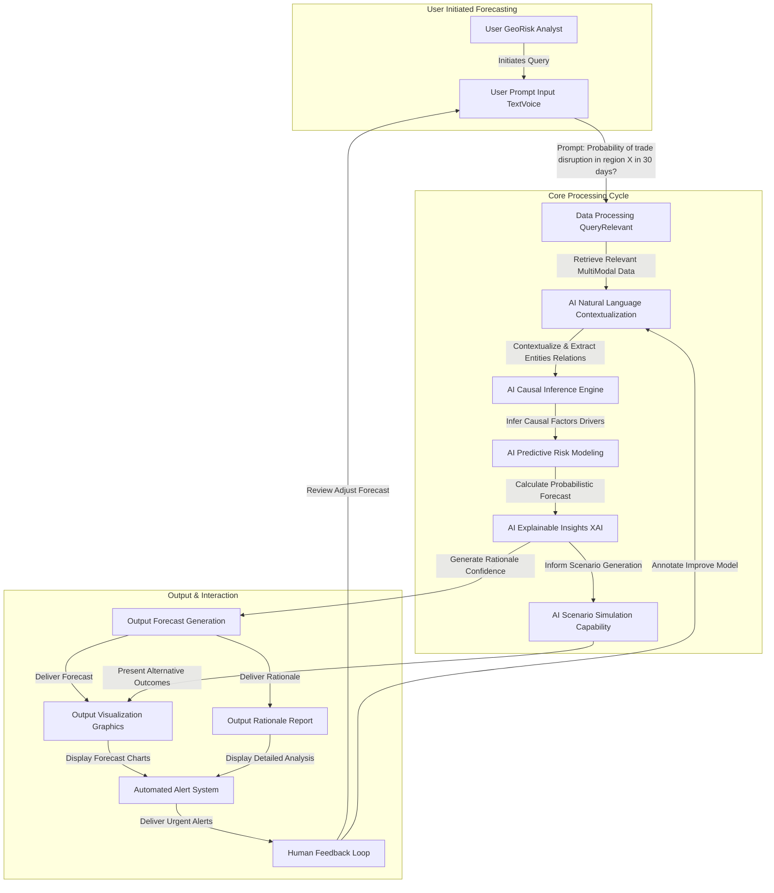
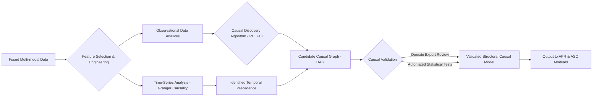
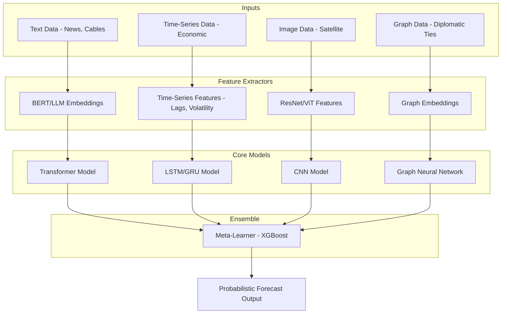
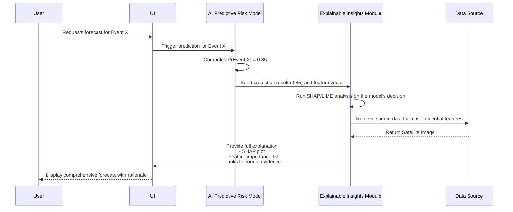
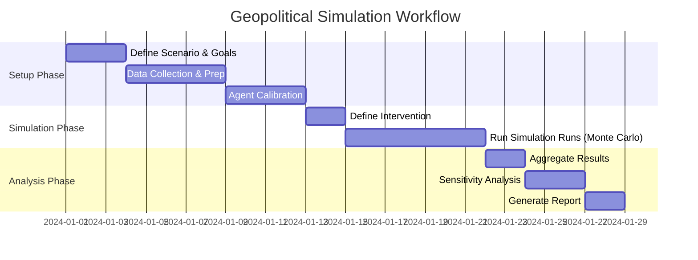
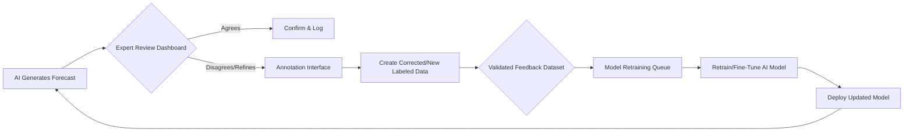
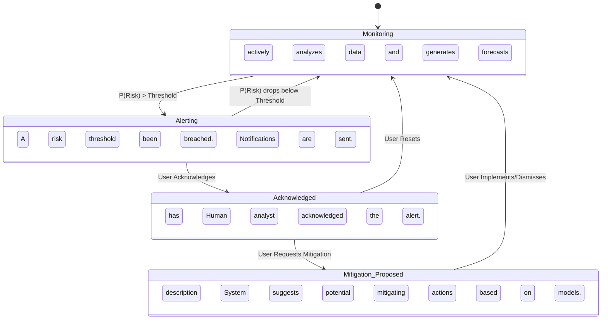
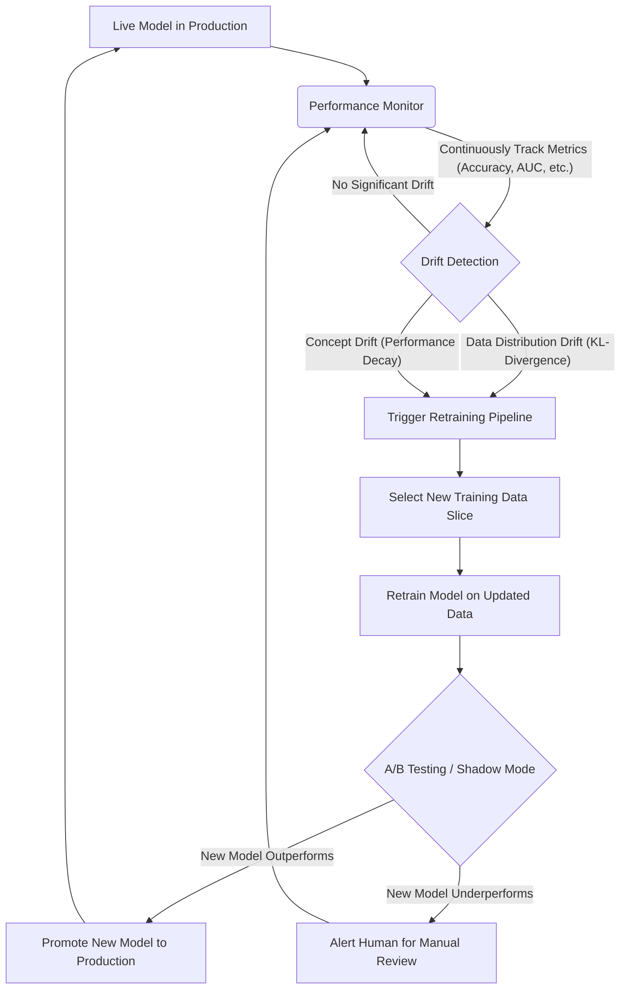

**Title of Invention:** A System and Method for AI-Powered Geopoliticial Risk Forecasting

**Abstract:**
A system for forecasting geopolitical risk is disclosed. The system ingests a high-volume, multi-modal stream of data, including international news, diplomatic cables, economic reports, social media data, high-resolution satellite imagery, and cyber threat intelligence. A sophisticated, hybrid generative and analytical AI model, trained on extensive historical political science, international relations, and conflict data, analyzes this stream to identify emerging patterns of instability, infer complex causal relationships, and simulate potential future scenarios with high fidelity. The AI generates quantitative probabilistic forecasts, presented as probability distributions over outcomes, and rich qualitative analyses for specific regions and events. It assesses the likelihood of outcomes like civil unrest, trade disputes, interstate conflict, or humanitarian crises, and provides a detailed, explainable rationale based on the aggregated data, citing specific evidence. The system includes a robust human-in-the-loop feedback mechanism for continuous model refinement, automated alerting capabilities for critical developments, and a dedicated scenario simulation engine for strategic "what-if" analysis and counterfactual reasoning. The architecture is designed for scalability, real-time processing, and continuous learning to adapt to the evolving global geopolitical landscape.

**Detailed Description:**
The AI-Powered Geopolitical Risk Forecasting system operates as a continuous, dynamic intelligence platform. It systematically collects, processes, and analyzes a vast array of global data inputs to provide actionable foresight. The system is architected around several core, interconnected layers, each with specialized functions.

**1. Data Acquisition and Processing Layer**
This layer is responsible for ingesting raw data and transforming it into a clean, structured, and analysis-ready format.

*   **Ingestion:** The system connects to thousands of sources via APIs, web scrapers, and dedicated feeds. These include real-time international news wires, declassified diplomatic communications, comprehensive economic indicators (e.g., GDP, inflation, trade flows), public social media discussions from various platforms, high-resolution commercial and open-source satellite imagery for activity monitoring (e.g., military buildups, infrastructure changes), and real-time cyber threat intelligence feeds.

*   **Data Processing and Fusion:** Raw data undergoes a robust pipeline where it is cleaned, normalized, validated, and harmonized.
    *   **Text Processing:** Natural language text is tokenized, stemmed, and cleared of stop-words. Key entities are extracted using Named Entity Recognition (NER). A core mathematical representation is Term Frequency-Inverse Document Frequency (TF-IDF):
        $$ \text{tf-idf}(t, d, D) = \text{tf}(t, d) \cdot \text{idf}(t, D) \quad (1) $$
        $$ \text{idf}(t, D) = \log \frac{|D|}{1 + |\{d \in D: t \in d\}|} \quad (2) $$
    *   **Image Processing:** Satellite imagery is pre-processed for atmospheric correction and georeferenced. Object detection models (e.g., YOLO, Faster R-CNN) identify military hardware, infrastructure changes, and population movements.
    *   **Numerical Data Normalization:** Economic and statistical data are scaled to a common range, for instance, using Z-score normalization to handle differing scales and units:
        $$ z = \frac{x - \mu}{\sigma} \quad (3) $$
    *   **Data Fusion:** Multi-modal data is integrated using a unified temporal and geospatial framework. Bayesian methods are employed to fuse uncertain data from different sources:
        $$ P(H|E_1, E_2) = \frac{P(E_2|H, E_1)P(E_1|H)P(H)}{P(E_1)P(E_2|E_1)} \approx \frac{P(E_2|H)P(E_1|H)P(H)}{P(E_1)P(E_2)} \quad (4) $$
        This allows updates to a hypothesis \(H\) based on new pieces of evidence \(E_i\).
    *   **Geospatial Contextualization:** All data points are mapped to precise geographic coordinates. The Haversine formula is used to calculate distances between events on the Earth's surface:
        $$ a = \sin^2\left(\frac{\Delta\phi}{2}\right) + \cos\phi_1 \cos\phi_2 \sin^2\left(\frac{\Delta\lambda}{2}\right) \quad (5) $$
        $$ c = 2 \cdot \text{atan2}(\sqrt{a}, \sqrt{1-a}) \quad (6) $$
        $$ d = R \cdot c \quad (7) $$

**2. AI Geopolitical Analysis Core**
This is the analytical heart of the system, comprising several deeply integrated AI modules.

*   **2.1. AI Natural Language Contextualization (ANC):** This module uses large-scale transformer-based models (e.g., fine-tuned versions of GPT-4 or BERT) to understand the nuanced context of text-based data.
    *   **Attention Mechanism:** The core of these models is the self-attention mechanism, allowing the model to weigh the importance of different words in a document:
        $$ \text{Attention}(Q, K, V) = \text{softmax}\left(\frac{QK^T}{\sqrt{d_k}}\right)V \quad (8) $$
    *   **Sentiment and Intent Analysis:** It identifies key entities, the sentiment expressed towards them (positive, negative, neutral, or more complex emotions like hostility or conciliation), and the relationships between them. A standard loss function for classification tasks is cross-entropy:
        $$ L_{CE} = -\sum_{i=1}^{C} y_i \log(\hat{y}_i) \quad (9) $$
    *   **Topic Modeling:** Latent Dirichlet Allocation (LDA) is used to uncover hidden thematic structures in large corpora of text, such as diplomatic cables or news reports. The generative process is defined as:
        $$ p(\beta, \theta, z, w | \alpha, \eta) = \prod_{k=1}^{K} p(\beta_k | \eta) \prod_{d=1}^{M} p(\theta_d | \alpha) \prod_{n=1}^{N_d} p(z_{dn} | \theta_d) p(w_{dn} | \beta_{z_{dn}}) \quad (10) $$

*   **2.2. AI Causal Inference Engine (ACI):** This module moves beyond correlation to identify potential cause-and-effect relationships.
    *   **Causal Discovery:** It employs algorithms like PC or FCI to build a causal graph (a Directed Acyclic Graph, or DAG) from observational data.
    *   **Time-Series Causality:** For time-series data like economic indicators, it uses Granger Causality to test if one time series is useful in forecasting another.
        $$ Y_t = \sum_{i=1}^{p} \alpha_i Y_{t-i} + \sum_{j=1}^{q} \beta_j X_{t-j} + \epsilon_t \quad (11) $$
        The null hypothesis is that all \(\beta_j\) are zero.
    *   **Structural Causal Models (SCMs):** The engine formalizes relationships using SCMs, allowing for interventional and counterfactual queries using Pearl's do-calculus. The effect of an intervention is denoted as:
        $$ P(Y | do(X=x)) \quad (12) $$
        The Average Treatment Effect (ATE) is a key metric calculated:
        $$ \text{ATE} = E[Y | do(X=1)] - E[Y | do(X=0)] \quad (13) $$

*   **2.3. AI Predictive Risk Modeling (APR):** This module generates probabilistic forecasts using an ensemble of machine learning models.
    *   **Model Ensemble:** The system uses a weighted average of models suited for different data types:
        *   **LSTMs/GRUs for Time Series:** For economic data and event frequency analysis. The core LSTM cell state update is:
            $$ C_t = f_t \odot C_{t-1} + i_t \odot \tanh(W_C \cdot [h_{t-1}, x_t] + b_C) \quad (14) $$
        *   **Graph Neural Networks (GNNs) for Relational Data:** For modeling relationships between nations, organizations, and individuals. The message passing scheme is:
            $$ \mathbf{h}_v^{(k)} = \sigma\left(W^{(k)} \cdot \text{CONCAT}\left(\mathbf{h}_v^{(k-1)}, \text{AGG}\left(\{\mathbf{h}_u^{(k-1)}, \forall u \in \mathcal{N}(v)\}\right)\right)\right) \quad (15) $$
        *   **Convolutional Neural Networks (CNNs) for Imagery:** For analyzing satellite data. A convolutional layer performs:
            $$ (f * g)(t) = \int_{-\infty}^{\infty} f(\tau) g(t - \tau) d\tau \quad (16) $$
    *   **Risk Probability Output:** The final output is a probability distribution over a set of possible outcomes. For a binary event (e.g., conflict starts/doesn't start), the logistic function is used:
        $$ P(\text{Event}=1 | \mathbf{X}; \theta) = \sigma(\theta^T \mathbf{X}) = \frac{1}{1 + e^{-\theta^T \mathbf{X}}} \quad (17) $$

*   **2.4. AI Explainable Insights (XAI):** This module provides transparent rationales for the AI's forecasts.
    *   **SHAP (SHapley Additive exPlanations):** It computes the contribution of each feature to the prediction, ensuring accountability. The Shapley value for a feature \(i\) is:
        $$ \phi_i(f, x) = \sum_{S \subseteq F \setminus \{i\}} \frac{|S|!(|F| - |S| - 1)!}{|F|!} [f_x(S \cup \{i\}) - f_x(S)] \quad (18) $$
    *   **Evidence Sourcing:** The XAI module links its explanations directly to the raw data, highlighting the specific news article, diplomatic cable, or satellite image that most influenced the forecast.

*   **2.5. AI Alerting and Mitigation Module (AAM):** This component monitors forecasts and triggers alerts.
    *   **Threshold-Based Alerting:** An alert \(A\) is triggered for a specific event \(E\) if its forecasted probability exceeds a user-defined threshold \(\tau\).
        $$ A_E(t) = 1 \quad \text{if} \quad P(\text{Risk}_{E,R,T} | \text{Data}_t) > \tau_E \quad (19) $$
    *   **Mitigation Suggestions:** The system can use a pre-trained policy, potentially from a Reinforcement Learning model, to suggest mitigating actions. The goal is to learn a policy \(\pi\) that maximizes expected future rewards:
        $$ \pi^*(s) = \arg\max_a \sum_{s'} T(s, a, s')[R(s, a, s') + \gamma V^*(s')] \quad (20) $$

*   **2.6. AI Scenario Simulation Capability (ASC):** This allows users to explore "what-if" scenarios.
    *   **Agent-Based Modeling (ABM):** The system simulates the interactions of multiple agents (e.g., countries, political factions) whose behaviors are governed by utility functions.
        $$ U_i(s, a_i, a_{-i}) = R_i(s, a_i, a_{-i}) + \gamma E[V_i(s')] \quad (21) $$
    *   **Counterfactual Analysis:** Leveraging the causal graph from the ACI, the system can simulate the impact of hypothetical interventions, answering questions like "What would have been the outcome if diplomatic sanctions had not been imposed?".

**Example Use Case Query:**
When a specific event or pattern emerges, a user can initiate a targeted analysis: `You are a geopolitical risk analyst. Based on the increased naval patrols in the South China Sea, recent diplomatic statements from China and the Philippines, satellite imagery showing military build-ups on disputed islands, and observed cyber activities targeting maritime infrastructure, what is the probability of a maritime trade disruption in this specific region in the next 30 days? Provide a detailed rationale and potential economic impacts.`

The AI synthesizes this multi-modal information. It might return: "There is a 75% (±5% at 95% confidence) probability of significant maritime trade disruption in the specified region within 30 days. This forecast is based on: (1) a 40% increase in naval patrol density detected via satellite imagery analysis (Evidence: Image ID Sat-123A), (2) a sharp increase in hostile rhetoric identified by the ANC module in diplomatic cables (Evidence: Cable ID DC-456B), and (3) a causal link established by the ACI between similar past rhetoric and subsequent shipping incidents. The XAI module attributes 45% of the risk score to naval activity, 30% to diplomatic rhetoric, 15% to cyber threats, and 10% to historical precedent."

**3. Output and User Interaction Layer**
This layer presents insights via interactive dashboards, automated alerts, and detailed reports customized for various user roles (policymakers, military strategists, economic analysts).

**4. Feedback and Refinement Layer**
A critical **Human-in-the-Loop Feedback** mechanism allows human experts to review, validate, and refine the AI's outputs. This feedback, consisting of corrected labels, annotated data, and qualitative assessments, is fed back into the system. The system uses this to monitor for model drift, defined by metrics like the Kullback-Leibler (KL) divergence between predicted and observed distributions:
$$ D_{KL}(P || Q) = \sum_{x \in \mathcal{X}} P(x) \log\left(\frac{P(x)}{Q(x)}\right) \quad (22) $$
When drift is detected, an automated retraining pipeline is triggered to ensure the system remains adaptive to novel geopolitical dynamics and reduces bias over time.

---

### **Mathematical and Algorithmic Foundations (Equations 23-100)**

This section provides a deeper dive into the mathematical formalisms underpinning the system's core modules.

**Data and Feature Representation**
23. **One-Hot Encoding:** For categorical data like country names: \( v_c = [0, 0, ..., 1, ..., 0] \)
24. **Min-Max Scaling:** \( X_{norm} = \frac{X - X_{min}}{X_{max} - X_{min}} \)
25. **Covariance Matrix:** \( \Sigma_{ij} = \text{cov}(X_i, X_j) = E[(X_i - \mu_i)(X_j - \mu_j)] \)
26. **Principal Component Analysis (PCA):** \( \Sigma = W \Lambda W^T \)
27. **Word2Vec (Skip-gram) Objective:** \( \frac{1}{T} \sum_{t=1}^{T} \sum_{-c \le j \le c, j \ne 0} \log p(w_{t+j} | w_t) \)

**Natural Language Contextualization (ANC)**
28. **Positional Encoding (Transformers):** \( PE_{(pos, 2i)} = \sin(pos / 10000^{2i/d_{model}}) \)
29. **Positional Encoding (Transformers):** \( PE_{(pos, 2i+1)} = \cos(pos / 10000^{2i/d_{model}}) \)
30. **Layer Normalization:** \( y = \frac{x - E[x]}{\sqrt{Var[x] + \epsilon}} \cdot \gamma + \beta \)
31. **BERT MLM Objective Function:** \( \mathcal{L}_{MLM} = -\sum_{i \in M} \log p(w_i | \hat{w}) \) where M is the set of masked tokens.
32. **BERT NSP Objective Function:** \( \mathcal{L}_{NSP} = -\sum_{i=1}^{N} y_i \log \hat{y}_i + (1-y_i)\log(1-\hat{y}_i) \)
33. **Information Entropy:** \( H(X) = -\sum_{i=1}^{n} P(x_i) \log_b P(x_i) \)
34. **Mutual Information:** \( I(X;Y) = \sum_{y \in Y} \sum_{x \in X} p(x,y) \log\left(\frac{p(x,y)}{p(x)p(y)}\right) \)

**Causal Inference Engine (ACI)**
35. **Conditional Probability:** \( P(A|B) = \frac{P(A \cap B)}{P(B)} \)
36. **Bayes' Theorem:** \( P(A|B) = \frac{P(B|A)P(A)}{P(B)} \)
37. **Propensity Score:** \( e(x) = P(Z=1|X=x) \) where Z is treatment.
38. **Inverse Propensity Score Weighting (IPSW):** \( E[Y^1 - Y^0] = E\left[\frac{Z Y}{e(X)}\right] - E\left[\frac{(1-Z) Y}{1-e(X)}\right] \)
39. **Do-Calculus Rule 1 (Insertion/Deletion of Observation):** \( P(y|do(x), z, w) = P(y|do(x), w) \) if \( (Y \perp Z | X, W)_{G_{\bar{X}}} \)
40. **Do-Calculus Rule 2 (Action/Observation Exchange):** \( P(y|do(x), do(z), w) = P(y|do(x), z, w) \) if \( (Y \perp Z | X, W)_{G_{\bar{X}\underline{Z}}} \)
41. **Do-Calculus Rule 3 (Insertion/Deletion of Action):** \( P(y|do(x), do(z), w) = P(y|do(x), w) \) if \( (Y \perp Z | X, W)_{G_{\bar{X}, \bar{Z(W)}}} \)

**Predictive Risk Modeling (APR)**
42. **ReLU Activation:** \( f(x) = \max(0, x) \)
43. **Leaky ReLU Activation:** \( f(x) = \max(0.01x, x) \)
44. **Tanh Activation:** \( f(x) = \tanh(x) = \frac{e^x - e^{-x}}{e^x + e^{-x}} \)
45. **Sigmoid Activation:** \( \sigma(x) = \frac{1}{1 + e^{-x}} \)
46. **Mean Squared Error (MSE) Loss:** \( L = \frac{1}{n} \sum_{i=1}^{n} (y_i - \hat{y}_i)^2 \)
47. **Mean Absolute Error (MAE) Loss:** \( L = \frac{1}{n} \sum_{i=1}^{n} |y_i - \hat{y}_i| \)
48. **Binary Cross-Entropy Loss:** \( L = -(y \log(\hat{y}) + (1-y) \log(1-\hat{y})) \)
49. **GRU Update Gate:** \( z_t = \sigma(W_z \cdot [h_{t-1}, x_t]) \)
50. **GRU Reset Gate:** \( r_t = \sigma(W_r \cdot [h_{t-1}, x_t]) \)
51. **GRU Candidate Hidden State:** \( \tilde{h}_t = \tanh(W \cdot [r_t \odot h_{t-1}, x_t]) \)
52. **GRU Hidden State:** \( h_t = (1 - z_t) \odot h_{t-1} + z_t \odot \tilde{h}_t \)
53. **Stochastic Gradient Descent (SGD) Update:** \( \theta = \theta - \eta \cdot \nabla_\theta J(\theta; x, y) \)
54. **SGD with Momentum Update:** \( v_t = \gamma v_{t-1} + \eta \nabla_\theta J(\theta) \), \( \theta = \theta - v_t \)
55. **Adam Optimizer (First Moment):** \( m_t = \beta_1 m_{t-1} + (1-\beta_1) g_t \)
56. **Adam Optimizer (Second Moment):** \( v_t = \beta_2 v_{t-1} + (1-\beta_2) g_t^2 \)
57. **Adam Optimizer (Bias Correction):** \( \hat{m}_t = \frac{m_t}{1-\beta_1^t} \), \( \hat{v}_t = \frac{v_t}{1-\beta_2^t} \)
58. **Adam Optimizer (Final Update):** \( \theta_{t+1} = \theta_t - \frac{\eta}{\sqrt{\hat{v}_t} + \epsilon} \hat{m}_t \)
59. **GNN Aggregation (Mean):** \( \mathbf{a}_v^{(k)} = \frac{1}{|\mathcal{N}(v)|} \sum_{u \in \mathcal{N}(v)} \mathbf{h}_u^{(k-1)} \)
60. **GNN Aggregation (Max):** \( \mathbf{a}_v^{(k)} = \max_{u \in \mathcal{N}(v)} (\mathbf{h}_u^{(k-1)}) \)
61. **Dropout Regularization:** \( \tilde{y} = y \odot d \) where \( d \sim \text{Bernoulli}(p) \)
62. **L2 Regularization (Weight Decay):** \( L_{total} = L_{original} + \frac{\lambda}{2} \sum_i w_i^2 \)
63. **L1 Regularization:** \( L_{total} = L_{original} + \lambda \sum_i |w_i| \)
64. **Cox Proportional Hazards Model:** \( h(t|X) = h_0(t) \exp(\beta_1 X_1 + \dots + \beta_p X_p) \)
65. **Gaussian Kernel (SVMs):** \( K(x, z) = \exp\left(-\frac{||x-z||^2}{2\sigma^2}\right) \)
66. **Ensemble Weighted Average:** \( \hat{y}_{ensemble} = \sum_{i=1}^{N} w_i \hat{y}_i \) where \( \sum w_i = 1 \)

**Model Evaluation and Explainability**
67. **Precision:** \( P = \frac{TP}{TP + FP} \)
68. **Recall (Sensitivity):** \( R = \frac{TP}{TP + FN} \)
69. **F1 Score:** \( F_1 = 2 \cdot \frac{P \cdot R}{P + R} \)
70. **Specificity:** \( S = \frac{TN}{TN + FP} \)
71. **Accuracy:** \( A = \frac{TP + TN}{TP + TN + FP + FN} \)
72. **Area Under ROC Curve (AUC):** \( \text{AUC} = \int_{0}^{1} \text{TPR}(T) \, d\text{FPR}(T) \)
73. **LIME Explanation Model:** \( \xi(x) = \arg\min_{g \in G} \mathcal{L}(f, g, \pi_x) + \Omega(g) \)
74. **Confidence Interval:** \( \bar{x} \pm z \frac{s}{\sqrt{n}} \)
75. **Chi-Squared Test Statistic:** \( \chi^2 = \sum \frac{(O - E)^2}{E} \)

**Simulation and Alerting**
76. **Markov Property:** \( P(X_{t+1}=x_{t+1} | X_t=x_t, ..., X_0=x_0) = P(X_{t+1}=x_{t+1} | X_t=x_t) \)
77. **State Transition Probability:** \( P_{ss'} = P(X_{t+1}=s' | X_t=s) \)
78. **Bellman Equation (Value Function):** \( V(s) = R(s) + \gamma \sum_{s' \in S} P_{ss'} V(s') \)
79. **Bellman Equation (Action-Value Function):** \( Q^\pi(s, a) = E_\pi[R_{t+1} + \gamma Q^\pi(S_{t+1}, A_{t+1}) | S_t=s, A_t=a] \)
80. **Optimal Bellman Equation:** \( V^*(s) = \max_a E[R_{t+1} + \gamma V^*(S_{t+1}) | S_t=s, A_t=a] \)
81. **Policy Gradient Theorem:** \( \nabla_\theta J(\theta) = E_\pi[\nabla_\theta \log \pi_\theta(a|s) Q^\pi(s, a)] \)
82. **Nash Equilibrium Condition:** \( u_i(s_i^*, s_{-i}^*) \ge u_i(s_i, s_{-i}^*) \) for all \( s_i \in S_i \)
83. **Gini Impurity (Decision Trees):** \( G(p) = \sum_{k=1}^{K} p_k(1-p_k) = 1 - \sum_{k=1}^{K} p_k^2 \)
84. **Euclidean Distance:** \( d(p, q) = \sqrt{\sum_{i=1}^{n} (q_i - p_i)^2} \)
85. **Manhattan Distance:** \( d_1(p, q) = ||p-q||_1 = \sum_{i=1}^{n} |p_i - q_i| \)
86. **Cosine Similarity:** \( \text{similarity} = \cos(\theta) = \frac{A \cdot B}{||A|| ||B||} \)
87. **Temporal Difference (TD) Error:** \( \delta_t = R_{t+1} + \gamma V(S_{t+1}) - V(S_t) \)
88. **Q-Learning Update Rule:** \( Q(S_t, A_t) \leftarrow Q(S_t, A_t) + \alpha[R_{t+1} + \gamma \max_a Q(S_{t+1}, a) - Q(S_t, A_t)] \)
89. **Softmax Policy:** \( \pi(a|s) = \frac{e^{Q(s,a)/\tau}}{\sum_b e^{Q(s,b)/\tau}} \)
90. **Kalman Gain:** \( K_k = P_{k|k-1} H_k^T (H_k P_{k|k-1} H_k^T + R_k)^{-1} \)
91. **Kalman State Update:** \( \hat{x}_{k|k} = \hat{x}_{k|k-1} + K_k (z_k - H_k \hat{x}_{k|k-1}) \)
92. **Kalman Covariance Update:** \( P_{k|k} = (I - K_k H_k) P_{k|k-1} \)
93. **Pearson Correlation Coefficient:** \( \rho_{X,Y} = \frac{\text{cov}(X,Y)}{\sigma_X \sigma_Y} \)
94. **Standard Deviation:** \( \sigma = \sqrt{\frac{1}{N}\sum_{i=1}^N (x_i - \mu)^2} \)
95. **Variance:** \( \sigma^2 = \frac{1}{N}\sum_{i=1}^N (x_i - \mu)^2 \)
96. **Exponentially Weighted Moving Average (EWMA):** \( S_t = \alpha Y_t + (1-\alpha)S_{t-1} \)
97. **Fourier Transform:** \( \hat{f}(\xi) = \int_{-\infty}^{\infty} f(x) e^{-2\pi i x \xi} dx \)
98. **Wavelet Transform:** \( T(a,b) = \frac{1}{\sqrt{a}} \int_{-\infty}^{\infty} f(t) \psi^*\left(\frac{t-b}{a}\right) dt \)
99. **Kullback-Leibler Divergence (Continuous):** \( D_{KL}(P||Q) = \int_{-\infty}^{\infty} p(x) \log\frac{p(x)}{q(x)} dx \)
100. **Jensen-Shannon Divergence:** \( JSD(P||Q) = \frac{1}{2} D_{KL}(P||M) + \frac{1}{2} D_{KL}(Q||M) \) where \( M = \frac{1}{2}(P+Q) \)

---

### **System Architecture and Process Flow Diagrams**

**1. System Architecture Diagram:**
```mermaid
graph TD
    subgraph Data Acquisition Layer
        DNS[News Feeds Global]
        DDC[Diplomatic Communications]
        DERS[Economic Reports Statistics]
        DSMD[Social Media Data Streams]
        DSIO[Satellite Imagery OpenSource]
        DCTI[Cyber Threat Intelligence]
        DLS[Legal Regulatory Scans]
        DHS[Humanitarian Data Surveys]
    end

    subgraph Data Processing & Fusion
        DPP[Data Preprocessing Normalization]
        DFU[Data Fusion & Harmonization]
        DVL[Data Validation Labeling]
        DTT[Temporal Trend Tracking]
        DGE[Geospatial Contextualization]
    end

    subgraph AI Geopolitical Analysis Core
        ANC[AI Natural Language Contextualization]
        ACI[AI Causal Inference Engine]
        APR[AI Predictive Risk Modeling]
        AEI[AI Explainable Insights XAI]
        AAM[AI Alerting Mitigation Module]
        ASC[AI Scenario Simulation Capability]
    end

    subgraph Output & User Interaction
        OUI[User Interface Dashboard]
        OAS[Automated Alert System]
        ORE[Report Generation Engine]
        OVC[Visualization Customization]
        OEI[Event Impact Assessment]
    end

    subgraph Feedback & Refinement
        HLF[Human Feedback Loop]
        MMU[Model Monitoring Updates]
        DAD[Data Anomaly Detection]
    end

    DNS -- Ingest & Stream --> DPP
    DDC -- Ingest & Stream --> DPP
    DERS -- Ingest & Stream --> DPP
    DSMD -- Ingest & Stream --> DPP
    DSIO -- Ingest & Stream --> DPP
    DCTI -- Ingest & Stream --> DPP
    DLS -- Ingest & Stream --> DPP
    DHS -- Ingest & Stream --> DPP

    DPP -- Clean & Standardize --> DFU
    DFU -- Integrate & Harmonize --> DVL
    DVL -- Validate & Label --> DTT
    DTT -- Track Trends --> DGE
    DGE -- Add Geospatial Context --> ANC

    ANC -- Understand Context --> ACI
    ACI -- Identify Causal Links --> APR
    APR -- Forecast Probabilities --> AEI
    AEI -- Provide Rationale --> AAM
    AAM -- Generate Alerts Actions --> ASC
    ASC -- Simulate Outcomes --> OEI

    OEI -- Assess Impact --> OAS
    AAM -- Push Alerts --> OAS
    AEI -- Visualize Insights --> OUI
    OUI -- Display Interactive --> OVC
    OVC -- Customize Views --> ORE
    ORE -- Generate Reports --> HLF

    OAS -- Alert Recipients --> HLF
    OUI -- User Input & Feedback --> HLF
    ORE -- Report Review --> HLF

    HLF -- Correct Labels Refine --> MMU
    MMU -- Detect Drift Retrain --> DAD
    DAD -- Identify New Patterns --> DVL

    note for OUI
        Interactive dashboards for diverse user roles
    end
    note for HLF
        Human experts provide crucial ground truth for continuous model improvement
    end
    note for DAD
        Proactive detection of unforeseen events or data shifts using metrics like KL-Divergence
    end
    note for ASC
        What-if scenarios and counterfactual analysis based on the causal graph
    end
```

**2. Process Flow Diagram: Targeted Geopolitical Query**


**3. Detailed Data Ingestion Pipeline**
```mermaid
graph TD
    subgraph Raw Data Sources
        S1[News APIs]
        S2[Govt Feeds]
        S3[Social Media APIs]
        S4[Satellite Providers]
        S5[Cyber Intel Feeds]
    end

    subgraph Processing Queue
        Q[Kafka / PubSub]
    end

    subgraph Microservices
        V[Validator]
        C[Cleaner]
        N[Normalizer]
        E[Enricher - Geo/Temporal]
    end

    subgraph Data Lake & Warehouse
        DL[Data Lake - Raw Storage (S3)]
        DW[Data Warehouse - Structured (BigQuery)]
    end

    S1 --> Q
    S2 --> Q
    S3 --> Q
    S4 --> Q
    S5 --> Q

    Q --> V
    V -- Validated --> C
    C -- Cleaned --> N
    N -- Normalized --> E
    E -- Enriched --> DL
    E -- Structured Stream --> DW
```

**4. AI Causal Inference Engine (ACI) Logic Flow**


**5. AI Predictive Risk Modeling (APR) Ensemble**


**6. AI Explainable Insights (XAI) Generation Process**


**7. AI Scenario Simulation (ASC) Workflow**


**8. Human Feedback Loop (HLF) Data Flow**


**9. Alerting and Mitigation (AAM) Trigger Logic**


**10. Model Retraining and Drift Detection Cycle**


---

**Claims:**
1.  A method for geopolitical risk forecasting, comprising:
    a.  Ingesting diverse streams of data including international news, diplomatic communications, economic reports, social media data, satellite imagery, cyber threat intelligence, legal scans, and humanitarian data.
    b.  Performing multi-modal data preprocessing, fusion, normalization, validation, labeling, temporal trend tracking, and geospatial contextualization.
    c.  Providing the processed data to a generative AI model comprising:
        i.  An AI Natural Language Contextualization module to understand linguistic nuances and extract entities.
        ii. An AI Causal Inference Engine to identify cause-and-effect relationships by constructing a structural causal model.
        iii. An AI Predictive Risk Modeling module to generate probabilistic forecasts using an ensemble of machine learning models.
        iv. An AI Explainable Insights module to provide a detailed, evidence-backed rationale for forecasts.
        v.  An AI Scenario Simulation Capability to explore potential outcomes of hypothetical interventions.
    d.  Prompting the generative AI model to generate a quantitative probabilistic forecast for the occurrence of a specific geopolitical event in a given region within a specified timeframe.
    e.  Generating a qualitative analysis and detailed rationale supporting the probabilistic forecast, including identified causal factors, confidence levels, and links to source data.
    f.  Displaying the forecast, rationale, and an event impact assessment to a user via an interactive user interface dashboard.
2.  The method of claim 1, further comprising an automated alerting system that delivers real-time notifications when forecasted risks exceed predefined thresholds.
3.  The method of claim 1, further comprising a human feedback loop mechanism allowing expert users to review, validate, and provide corrections to the AI's forecasts and rationales, which data is used for continuous model retraining and refinement.
4.  The method of claim 1, wherein the data preprocessing includes modules for anomaly detection and model monitoring to identify data distribution drift or concept drift, automatically triggering a model retraining pipeline.
5.  The method of claim 1, wherein the AI model is capable of simulating "what if" scenarios to assess the potential impact of various events or policy interventions.
6.  The method of claim 5, wherein the "what if" scenarios are generated by performing counterfactual interventions on the structural causal model derived by the AI Causal Inference Engine, allowing for the simulation of outcomes under conditions that have not been historically observed.
7.  A system for AI-powered geopolitical risk forecasting, comprising:
    a.  A data ingestion layer configured to acquire multi-modal geopolitical data from a plurality of real-time sources.
    b.  A data processing and fusion layer configured to clean, normalize, integrate, and enrich the acquired data with temporal and geospatial context.
    c.  An AI geopolitical analysis core, communicatively coupled to the data processing and fusion layer, comprising:
        i.  A natural language processing component for contextual understanding.
        ii. A causal inference component for identifying causal relationships and constructing a causal graph.
        iii. A predictive modeling component for generating probabilistic forecasts.
        iv. An explainability component for providing forecast rationales with evidentiary support.
        v.  A scenario simulation component for "what if" analysis and counterfactual reasoning.
    d.  An output and user interaction layer configured to present forecasts, analyses, and alerts through a customizable dashboard and report generation engine.
    e.  A feedback and refinement layer, communicatively coupled to the output and user interaction layer and the AI geopolitical analysis core, configured to facilitate human-in-the-loop learning and continuous model improvement.
8.  The system of claim 7, wherein the output and user interaction layer includes an automated alert system for critical risk events defined by user-configurable probability thresholds.
9.  The system of claim 7, wherein the data processing and fusion layer includes components for data validation, labeling, and anomaly detection to ensure data quality and system adaptability.
10. The system of claim 7, wherein the AI geopolitical analysis core is trained on historical political science, international relations, economic, and conflict data to enhance its forecasting capabilities and is configured to be continuously updated via an automated retraining pipeline triggered by model performance degradation or data drift.