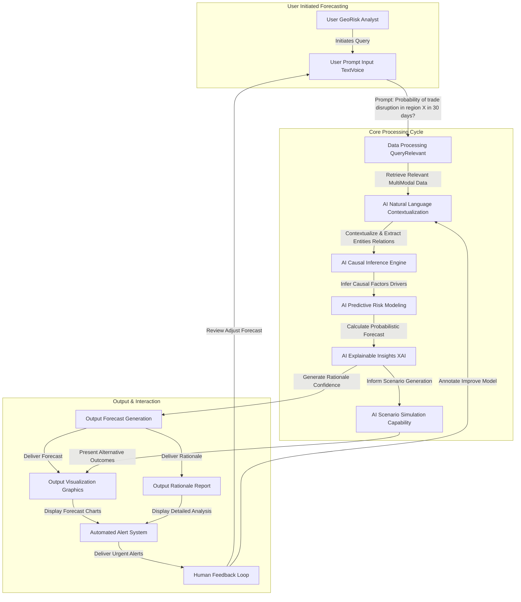

**Title of Invention:** A System and Method for AI-Powered Geopolitical Risk Forecasting

**Abstract:**
A system for forecasting geopolitical risk is disclosed. The system ingests a high-volume stream of international news, diplomatic cables, economic reports, social media data, satellite imagery, and cyber threat intelligence. A sophisticated generative AI model, trained on extensive historical political science and international relations data, analyzes this multi-modal stream to identify emerging patterns of instability, infer causal relationships, and simulate potential future scenarios. The AI generates quantitative probabilistic forecasts and qualitative analyses for specific regions and events, assessing the likelihood of outcomes like civil unrest, trade disputes, interstate conflict, or humanitarian crises, and provides a detailed, explainable rationale based on the aggregated data. The system includes a human feedback loop for continuous model refinement and automated alerting capabilities for critical developments.

**Detailed Description:**
The AI-Powered Geopolitical Risk Forecasting system operates as a continuous intelligence platform. It systematically collects and processes a wide array of global data inputs, including real-time international news feeds, official diplomatic communications, comprehensive economic indicators and reports, publicly available social media discussions, high-resolution satellite imagery for activity monitoring, and cyber threat intelligence.

This raw data first undergoes a robust **Data Processing and Fusion** stage where it is cleaned, normalized, validated, and harmonized across various formats. Advanced geospatial and temporal contextualization modules enrich the data, mapping events to specific locations and timelines, and tracking evolving trends.

The processed data then feeds into the **AI Geopolitical Analysis Core**. This core comprises several specialized AI modules:
1.  **AI Natural Language Contextualization ANC**: Utilizes advanced natural language processing NLP to understand the nuanced context of text-based data, identify key entities, sentiments, and relationships, and translate diverse linguistic inputs into a unified analytical framework.
2.  **AI Causal Inference Engine ACI**: Employs sophisticated causal inference algorithms to identify underlying cause-and-effect relationships between detected events and emerging patterns. It moves beyond mere correlation to uncover drivers of geopolitical change.
3.  **AI Predictive Risk Modeling APR**: Based on the insights from ACI, this module applies a suite of machine learning models to generate probabilistic forecasts for specific geopolitical events within defined timeframes and regions. It considers historical precedents and current trajectories.
4.  **AI Explainable Insights XAI**: Crucially, this module provides transparent rationales for the AI's forecasts. It highlights the specific data points, causal links, and models that contributed to a given prediction, enhancing user trust and understanding.
5.  **AI Alerting and Mitigation Module AAM**: This component monitors forecasts against predefined risk thresholds. Upon detecting high-probability adverse events, it automatically triggers alerts and suggests potential mitigation strategies or policy responses.
6.  **AI Scenario Simulation Capability ASC**: Allows users or the system itself to run "what if" scenarios, exploring the potential ramifications of various events or policy interventions, thereby aiding strategic planning.

When a specific event or pattern emerges, such as a detectable spike in articles reporting increased naval activity in a contested sea, the system can autonomously or through user prompting, initiate a targeted analysis. For example, a prompt could be: `You are a geopolitical risk analyst. Based on the increased naval patrols, recent diplomatic statements, satellite imagery showing military build-ups, and observed cyber activities, what is the probability of a maritime trade disruption in this specific region in the next 30 days? Provide a detailed rationale and potential impacts.`

The AI synthesizes the multi-modal information, drawing upon its contextualization, causal understanding, and predictive models. It then provides a quantitative probabilistic forecast (e.g., "75% probability of significant maritime trade disruption") alongside a comprehensive, written analysis detailing the contributing factors, the evidence base, and the confidence level of the prediction.

The **Output and User Interaction** layer presents these insights via interactive dashboards, automated alert systems, and detailed report generation engines, which can be customized for various user roles (e.g., policymakers, military strategists, economic analysts). A critical **Human Feedback Loop** allows human experts to review, validate, and refine the AI's outputs, feeding corrections and new labeled data back into the system for continuous model monitoring and improvement. This ensures the system remains adaptive to novel geopolitical dynamics and reduces bias. The system can detect data anomalies and model drift, prompting retraining or recalibration as necessary.

---

**System Architecture Diagram:**

```mermaid
graph TD
    subgraph Data Acquisition Layer
        DNS[News Feeds Global]
        DDC[Diplomatic Communications]
        DERS[Economic Reports Statistics]
        DSMD[Social Media Data Streams]
        DSIO[Satellite Imagery OpenSource]
        DCTI[Cyber Threat Intelligence]
        DLS[Legal Regulatory Scans]
        DHS[Humanitarian Data Surveys]
    end

    subgraph Data Processing & Fusion
        DPP[Data Preprocessing Normalization]
        DFU[Data Fusion & Harmonization]
        DVL[Data Validation Labeling]
        DTT[Temporal Trend Tracking]
        DGE[Geospatial Contextualization]
    end

    subgraph AI Geopolitical Analysis Core
        ANC[AI Natural Language Contextualization]
        ACI[AI Causal Inference Engine]
        APR[AI Predictive Risk Modeling]
        AEI[AI Explainable Insights XAI]
        AAM[AI Alerting Mitigation Module]
        ASC[AI Scenario Simulation Capability]
    end

    subgraph Output & User Interaction
        OUI[User Interface Dashboard]
        OAS[Automated Alert System]
        ORE[Report Generation Engine]
        OVC[Visualization Customization]
        OEI[Event Impact Assessment]
    end

    subgraph Feedback & Refinement
        HLF[Human Feedback Loop]
        MMU[Model Monitoring Updates]
        DAD[Data Anomaly Detection]
    end

    DNS -- Ingest & Stream --> DPP
    DDC -- Ingest & Stream --> DPP
    DERS -- Ingest & Stream --> DPP
    DSMD -- Ingest & Stream --> DPP
    DSIO -- Ingest & Stream --> DPP
    DCTI -- Ingest & Stream --> DPP
    DLS -- Ingest & Stream --> DPP
    DHS -- Ingest & Stream --> DPP

    DPP -- Clean & Standardize --> DFU
    DFU -- Integrate & Harmonize --> DVL
    DVL -- Validate & Label --> DTT
    DTT -- Track Trends --> DGE
    DGE -- Add Geospatial Context --> ANC

    ANC -- Understand Context --> ACI
    ACI -- Identify Causal Links --> APR
    APR -- Forecast Probabilities --> AEI
    AEI -- Provide Rationale --> AAM
    AAM -- Generate Alerts Actions --> ASC
    ASC -- Simulate Outcomes --> OEI

    OEI -- Assess Impact --> OAS
    AAM -- Push Alerts --> OAS
    AEI -- Visualize Insights --> OUI
    OUI -- Display Interactive --> OVC
    OVC -- Customize Views --> ORE
    ORE -- Generate Reports --> HLF

    OAS -- Alert Recipients --> HLF
    OUI -- User Input & Feedback --> HLF
    ORE -- Report Review --> HLF

    HLF -- Correct Labels Refine --> MMU
    MMU -- Detect Drift Retrain --> DAD
    DAD -- Identify New Patterns --> DVL

    note for OUI
        Interactive dashboards for diverse user roles
    end
    note for HLF
        Human experts provide crucial ground truth for continuous model improvement
    end
    note for DAD
        Proactive detection of unforeseen events or data shifts
    end
    note for ASC
        What if scenarios and counterfactual analysis
    end
```

---

**Process Flow Diagram: Targeted Geopolitical Query**



---

**Claims:**
1.  A method for geopolitical risk forecasting, comprising:
    a.  Ingesting diverse streams of data including international news, diplomatic communications, economic reports, social media data, satellite imagery, cyber threat intelligence, legal scans, and humanitarian data.
    b.  Performing multi-modal data preprocessing, fusion, normalization, validation, labeling, temporal trend tracking, and geospatial contextualization.
    c.  Providing the processed data to a generative AI model comprising:
        i.  An AI Natural Language Contextualization module to understand linguistic nuances and extract entities.
        ii. An AI Causal Inference Engine to identify cause-and-effect relationships.
        iii. An AI Predictive Risk Modeling module to generate probabilistic forecasts.
        iv. An AI Explainable Insights module to provide rationale for forecasts.
        v.  An AI Scenario Simulation Capability to explore potential outcomes.
    d.  Prompting the generative AI model to generate a quantitative probabilistic forecast for the occurrence of a specific geopolitical event in a given region within a specified timeframe.
    e.  Generating a qualitative analysis and detailed rationale supporting the probabilistic forecast, including identified causal factors and confidence levels.
    f.  Displaying the forecast, rationale, and an event impact assessment to a user via an interactive user interface dashboard.
2.  The method of claim 1, further comprising an automated alerting system that delivers real-time notifications when forecasted risks exceed predefined thresholds.
3.  The method of claim 1, further comprising a human feedback loop mechanism allowing expert users to review, validate, and provide corrections to the AI's forecasts and rationales, which data is used for continuous model retraining and refinement.
4.  The method of claim 1, wherein the data preprocessing includes modules for anomaly detection and model monitoring to identify data drift or novel patterns requiring model updates.
5.  The method of claim 1, wherein the AI model is capable of simulating "what if" scenarios to assess the potential impact of various events or policy interventions.
6.  A system for AI-powered geopolitical risk forecasting, comprising:
    a.  A data ingestion layer configured to acquire multi-modal geopolitical data.
    b.  A data processing and fusion layer configured to clean, normalize, integrate, and enrich the acquired data with temporal and geospatial context.
    c.  An AI geopolitical analysis core, communicatively coupled to the data processing and fusion layer, comprising:
        i.  A natural language processing component for contextual understanding.
        ii. A causal inference component for identifying causal relationships.
        iii. A predictive modeling component for generating probabilistic forecasts.
        iv. An explainability component for providing forecast rationales.
        v.  A scenario simulation component for "what if" analysis.
    d.  An output and user interaction layer configured to present forecasts, analyses, and alerts through a customizable dashboard and report generation engine.
    e.  A feedback and refinement layer, communicatively coupled to the output and user interaction layer and the AI geopolitical analysis core, configured to facilitate human-in-the-loop learning and continuous model improvement.
7.  The system of claim 6, wherein the output and user interaction layer includes an automated alert system for critical risk events.
8.  The system of claim 6, wherein the data processing and fusion layer includes components for data validation, labeling, and anomaly detection to ensure data quality and system adaptability.
9.  The system of claim 6, wherein the AI geopolitical analysis core is trained on historical political science, international relations, economic, and conflict data to enhance its forecasting capabilities.