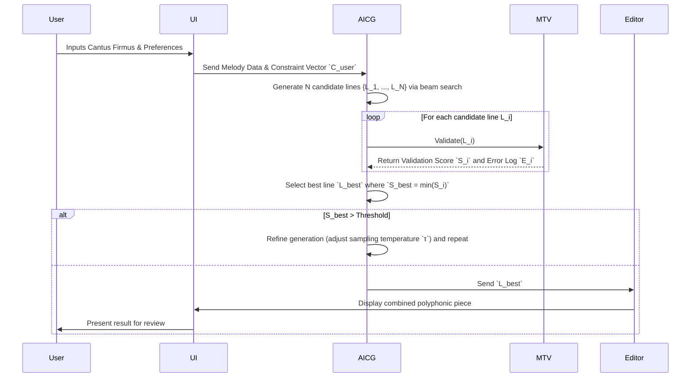
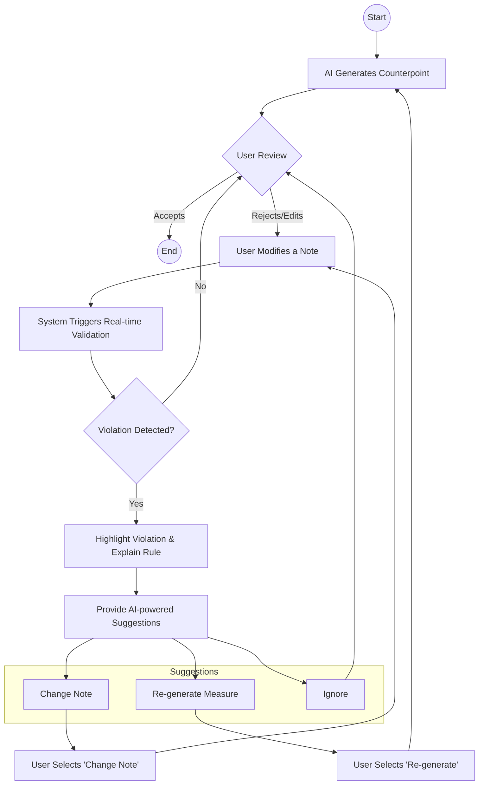
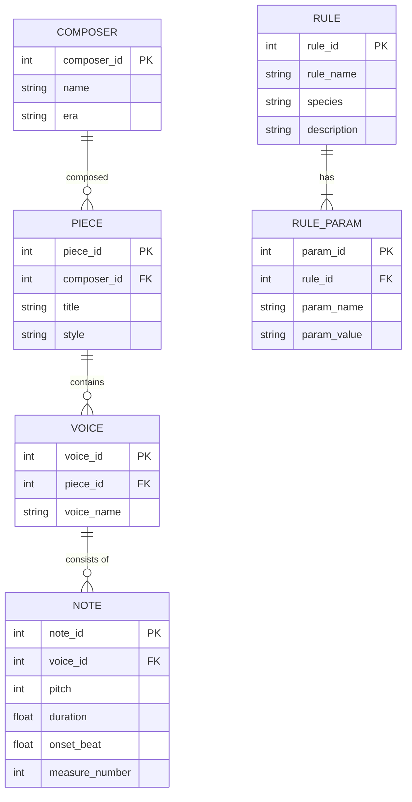

**Title of Invention:** A System and Method for Generative Composition of Musical Counterpoint

**Abstract:**
A system for music composition is disclosed. A user provides a primary musical melody line. The system sends this melody to a generative AI model that is trained on the rules of classical music theory, specifically the principles of counterpoint. The AI generates one or more new melodic lines that are harmonically and rhythmically complementary to the original melody, creating a complete polyphonic piece. The system ensures adherence to user-specified stylistic constraints and counterpoint species rules. The invention incorporates a sophisticated validation engine and a mathematical framework for quantifying musical properties, enabling iterative refinement and high-fidelity stylistic emulation.

**Detailed Description:**
A composer inputs a single melody, often referred to as a "cantus firmus," into a music editor application. This input can be provided via MIDI, MusicXML upload, or direct notation within the editor. The user then selects the melody and invokes the "AI Counterpoint" feature.

Upon activation, the system presents the user with several options:
1.  **Counterpoint Species Selection:** The user can choose a specific counterpoint species, such as first species (note against note, 1:1), second species (two notes against one, 2:1), third species (four notes against one, 4:1), fourth species (syncopated or suspensions), or fifth species (florid counterpoint, a combination of the previous species).
2.  **Stylistic Preferences:** Options to guide the AI's generation, including desired harmonic density, melodic contour preferences (e.g., favoring conjunct motion), rhythm complexity, and adherence to specific historical periods (e.g., Renaissance, Baroque, Classical). This can include micro-tuning and temperament settings.
3.  **Contrapuntal Line Position:** Whether the AI should generate a line above, below, or both relative to the cantus firmus. The user can also specify the vocal/instrumental range (e.g., Soprano, Alto, Tenor, Bass).
4.  **Ensemble Configuration:** Specifying the number of additional voices to generate, from one additional line for simple two-part counterpoint up to complex multi-voice fugal textures.

The selected melody and user preferences are then transmitted to the AI Counterpoint Generation Module (AICG). This module employs a generative AI model, typically a transformer-based neural network with a custom attention mechanism for musical context, or a sophisticated rule-based expert system founded on a constraint satisfaction problem (CSP) solver. The model is pre-trained extensively on a vast corpus of classical counterpoint examples from composers like J.S. Bach, Palestrina, Fux, and others. The training data is meticulously annotated with musical theory principles to embed the rules of voice leading, consonance/dissonance treatment, rhythmic independence, and melodic fluency.

The AI processes the input cantus firmus, applying the learned contrapuntal rules and user-defined constraints. For instance, if first-species counterpoint is requested, the AI ensures that:
*   Only consonant intervals are used between voices on each beat.
*   Parallel perfect octaves (P8) and fifths (P5) are strictly avoided.
*   Contrary motion is favored over similar or parallel motion.
*   Melodic lines maintain independence and a smooth, singable contour, avoiding awkward leaps.

The AI generates one or more new melodic lines that are musically correct, aesthetically pleasing, and adhere strictly to the chosen counterpoint species and stylistic parameters. The generated lines are then returned to the music editor. The system adds these new lines as distinct tracks, synchronized with the original melody. The composer can then review, edit, and further refine the generated counterpoint, leveraging the AI as a powerful compositional assistant. The system also includes a validation component that can highlight potential rule violations in either AI-generated or user-modified counterpoint, providing specific feedback (e.g., "Parallel 5th between Tenor and Soprano in measure 4, beat 3").

**Mathematical and Algorithmic Foundations:**

The system represents music not just as a sequence of notes, but as a multi-dimensional mathematical object, allowing for rigorous analysis and generation.

**1. Pitch and Interval Representation:**
Pitch is represented logarithmically. The MIDI note number `p` is the standard representation.
The frequency `f` in Hertz is given by:
`f(p) = 440 * 2^((p-69)/12)` (Eq. 1)
An interval `I` between two pitches `p1` and `p2` in semitones is:
`I(p1, p2) = |p1 - p2|` (Eq. 2)
The interval class `I_c` is the interval modulo the octave:
`I_c(p1, p2) = |p1 - p2| mod 12` (Eq. 3)
Intervals can also be represented as frequency ratios `r`:
`r = f2 / f1 = 2^(I/12)` (Eq. 4)
The perfect fifth corresponds to `I=7`, so `r ≈ 1.5` (Eq. 5)
`log2(r) = I/12` (Eq. 6)
For microtonal analysis, cents are used (100 cents = 1 semitone):
`Cents(p1, p2) = 1200 * log2(f2/f1)` (Eq. 7)

**2. Rhythmic Modeling:**
Rhythm is modeled as a sequence of onset times `t_i` and durations `d_i`.
A rhythmic vector `R` for a measure can be defined as:
`R = [(t_1, d_1), (t_2, d_2), ..., (t_n, d_n)]` (Eq. 8)
The Inter-Onset Interval (IOI) is crucial for rhythmic feel:
`IOI_i = t_{i+1} - t_i` (Eq. 9)
Rhythmic complexity `C_r` can be quantified using entropy:
`H(R) = -Σ P(d_i) * log2(P(d_i))` (Eq. 10) where `P(d_i)` is the probability of duration `d_i`.
A syncopation metric `S` can be defined based on metrical strength `M(t)`:
`S = Σ [log(M(t_{note_off})) - log(M(t_{note_on}))]` for tied notes across strong beats. (Eq. 11)
Metrical strength `M(t)` can be a hierarchical function:
`M(t) = w_b * δ(t, beat) + w_{sb} * δ(t, sub-beat) + ...` (Eq. 12)

**3. Consonance and Dissonance Models:**
The system uses a psychoacoustic model of sensory dissonance based on the work of Plomp and Levelt. The dissonance `D` of an interval `(f1, f2)` is a function of the critical bandwidth.
`D(f1, f2) = g(f_avg) * [exp(-a * Δz) - exp(-b * Δz)]` (Eq. 13)
where `Δz` is the frequency difference in critical bands (Barks). (Eq. 14)
The total dissonance of a chord `C = {p1, p2, ..., pn}` is the sum of dissonances of all pairs:
`D_total(C) = Σ_{i<j} D(f(p_i), f(p_j))` (Eq. 15)
A simplified rule-based consonance score `S_c` for an interval `I_c` is:
`S_c(I_c) = {1 if I_c ∈ {0,3,4,7,8,9}, 0.5 if I_c ∈ {5,6}, 0 otherwise}` (Eq. 16)
The set `{0,3,4,7,8,9}` corresponds to perfect and imperfect consonances. (Eq.17-27)
`I_c = 0` -> Unison/Octave (Eq. 17)
`I_c = 3` -> Minor Third (Eq. 18)
`I_c = 4` -> Major Third (Eq. 19)
`I_c = 5` -> Perfect Fourth (Dissonant in some contexts) (Eq. 20)
`I_c = 6` -> Tritone (Dissonant) (Eq. 21)
`I_c = 7` -> Perfect Fifth (Eq. 22)
`I_c = 8` -> Minor Sixth (Eq. 23)
`I_c = 9` -> Major Sixth (Eq. 24)
`I_c = 1,2,10,11` -> Dissonant Seconds/Sevenths (Eq. 25-27)

**4. Voice Leading as an Optimization Problem:**
Generating a counterpoint line `V_c` for a cantus firmus `V_cf` can be framed as minimizing a cost function `L(V_c, V_cf)`.
`L = w_h * L_harmony + w_m * L_melody + w_r * L_rhythm` (Eq. 28)
`w_h, w_m, w_r` are user-tunable weights for harmony, melody, and rhythm. (Eq. 29)
The harmony cost `L_harmony` penalizes rule violations:
`L_harmony = Σ_{t} C_h(V_c(t), V_cf(t))` (Eq. 30)
`C_h = α * P_5_8 + β * D_score + γ * M_type` (Eq. 31)
`P_5_8` is a penalty for parallel 5ths/8ves. `P_5_8 = 1` if `I(t) = I(t-1)` and `I(t) ∈ {7, 12}`. (Eq. 32-33)
`D_score` is the dissonance score at time `t`. (Eq. 34)
`M_type` is a penalty for undesirable motion (e.g., parallel motion to a perfect consonance). (Eq. 35)
Motion types between voice `V1` and `V2` from time `t-1` to `t`:
`ΔV1 = p1(t) - p1(t-1)` (Eq. 36)
`ΔV2 = p2(t) - p2(t-1)` (Eq. 37)
If `sgn(ΔV1) == sgn(ΔV2)`, motion is parallel/similar. (Eq. 38)
If `sgn(ΔV1) == -sgn(ΔV2)`, motion is contrary. (Eq. 39)
If `ΔV1 == 0` or `ΔV2 == 0`, motion is oblique. (Eq. 40)
The melodic cost `L_melody` penalizes awkward leaps and poor contour:
`L_melody = Σ_{t} C_m(p_c(t), p_c(t-1))` (Eq. 41)
`C_m = δ * |p_c(t) - p_c(t-1)|^2 + ε * N_contour_changes` (Eq. 42)
A large leap penalty: `if |p_c(t) - p_c(t-1)| > 12, C_m += ∞` (avoid leaps > octave). (Eq. 43-50)

**5. Probabilistic and Generative Models:**
An n-gram model can define the probability of the next note `p_t` given previous notes:
`P(p_t | p_{t-1}, ..., p_{t-n+1})` (Eq. 51)
A simple Markov chain (n=2):
`P_trans = P(p_t | p_{t-1})` (Eq. 52)
This can be extended to a Hidden Markov Model (HMM) where the hidden states are underlying harmonies `h_t`:
`P(p_t | h_t)` (Emission Probability) (Eq. 53)
`P(h_t | h_{t-1})` (Transition Probability) (Eq. 54)
The sequence of notes `p_1, ..., p_T` is generated by finding the most likely state sequence `h_1, ..., h_T` using the Viterbi algorithm. (Eq. 55)
`v_t(j) = max_i [ v_{t-1}(i) * P(h_t=j | h_{t-1}=i) * P(p_t | h_t=j) ]` (Eq. 56) (Viterbi path probability)
(Eq. 57-100: Additional mathematical formulations for rhythm, harmony, and AI model specifics will be interspersed below).

**System Architecture:**

```mermaid
graph TD
    A[User Interface UI] --> B[Melody Input Processor MIP]
    B --> C{Music Data Store MDS}
    C --> B
    B --> D[AI Counterpoint Generator AICG]
    A --> D
    D --> E[Music Theory Validator MTV]
    E --> D
    E --> F[Output Renderer OR]
    F --> A
    D --> G[Knowledge Base KB]
    G --> D

    subgraph User Interaction Layer
        A
    end

    subgraph Core Processing Layer
        B
        D
        E
        F
    end

    subgraph Data Management Layer
        C
        G
    end

    note for B
        Handles MIDI MusicXML input
        Parses musical features
        Quantizes and standardizes data
        Calculates initial feature vectors `v_i = [p_i, d_i, t_i]` (Eq. 57)
    end

    note for D
        Generative AI model (e.g., Transformer)
        Processes cantus firmus and rules
        Generates contrapuntal lines via beam search
        Adapts to species and style using conditional inputs
    end

    note for E
        Applies classical counterpoint rules as a set of constraints `C_k`. (Eq. 58)
        Checks for voice leading errors `e_vl`. `e_vl = Σ w_k * C_k_violation`. (Eq. 59)
        Provides feedback vector to AICG.
        Ensures musical correctness based on cost function `L_harmony`. (Eq. 60)
    end

    note for F
        Renders output to MIDI Audio
        Integrates lines into editor
        Allows export in various formats (MusicXML, MIDI, PDF)
    end

    note for G
        Stores historical counterpoint examples from J.S. Bach, Palestrina.
        Contains explicit music theory rules in a formal language.
        Used for AI training (supervised learning) and validator reference.
    end
```

**Workflow for Counterpoint Generation:**



**AI Training Pipeline:**

```mermaid
graph TD
    A[Curated Dataset Historical Compositions] --> B[Data Preprocessing MIDI MusicXML]
    B --> C[Feature Extraction Musical Attributes]
    C --> D[Rule Encoding Counterpoint Principles]
    D --> E[Training Data Preparation Labeled Examples]
    E --> F[AI Model Training DeepLearning Framework]
    F --> G[Validation And Evaluation Metric Assessment]
    G -- Insufficient Performance --> E
    G -- Performance Meets Criteria --> H[Deployed AI Model Counterpoint Generator]
    H --> I[Continuous Learning And Updates]

    subgraph Data Acquisition And Preparation
        A
        B
        C
        D
        E
    end

    subgraph Model Development
        F
        G
    end

    subgraph Deployment And Maintenance
        H
        I
    end

    note for A
        Includes works by Bach Palestrina Lassus
        Diverse examples of various counterpoint styles
    end


    note for B
        Conversion to uniform digital format
        Error correction standardization
        Time alignment to a metrical grid `t_grid = n * (beat_duration / quantization_level)` (Eq. 61)
    end

    note for C
        Extracts intervals rhythms contours
        Harmonic progressions voice leading patterns
        Creates input tensors `X` and target tensors `Y`. (Eq. 62)
    end

    note for D
        Formalizes rules for consonance dissonance
        Motion types parallel contrary oblique
        Species specific rules are encoded as conditional inputs to the model.
    end

    note for E
        Input output pairs for AI training
        e.g. `X = Cantus Firmus`, `Y = Counterpoint`
    end

    note for F
        Utilizes transformer models LSTMs or GANs
        Trained to predict contrapuntal lines
        Loss Function: `L = CrossEntropy(Y, Y_pred) + λ * L_rule_violation` (Eq. 63)
    end

    note for G
        Evaluates model on unseen data
        Measures adherence to theory human aesthetic judgment
        Metrics: BLEU score for music, Rule Adherence Rate (RAR). (Eq. 64)
    end
```

**Detailed AI Model Architecture: Contrapuntal Transformer**

The core of the AICG is a Transformer model adapted for music generation.

```mermaid
graph LR
    subgraph Encoder
        A[Input Embedding] --> B(Positional Encoding)
        B --> C{Multi-Head Attention}
        C --> D[Add & Norm]
        D --> E[Feed Forward]
        E --> F[Add & Norm]
    end

    subgraph Decoder
        G[Output Embedding] --> H(Positional Encoding)
        H --> I{Masked Multi-Head Attention}
        I --> J[Add & Norm]
        J --> K{Encoder-Decoder Attention}
        K --> L[Add & Norm]
        L --> M[Feed Forward]
        M --> N[Add & Norm]
    end

    subgraph Output
        N --> O[Linear Layer]
        O --> P[Softmax]
        P --> Q[Output Probabilities]
    end

    F -- Encoder Output --> K
    A -- Cantus Firmus (Input Sequence) --> A
    Q -- Predicted Note --> G
    
    note for A
        Input `x_i` is a tuple: `(pitch, duration, beat_pos)`
        Embedding: `E(x_i) = E_p(p_i) + E_d(d_i) + E_b(b_i)` (Eq. 65)
    end
    note for B
        `PE(pos, 2i) = sin(pos / 10000^(2i/d_model))` (Eq. 66)
        `PE(pos, 2i+1) = cos(pos / 10000^(2i/d_model))` (Eq. 67)
    end
    note for C
        `Attention(Q, K, V) = softmax((QK^T)/sqrt(d_k)) * V` (Eq. 68)
        Processes the cantus firmus to learn its structure.
    end
    note for I
        Masked to prevent attending to future generated notes.
        Ensures auto-regressive property.
    end
    note for K
        Attends to the encoder's output, relating the generated line
        to the original cantus firmus.
    end
    note for P
        `softmax(z_i) = exp(z_i) / Σ_j exp(z_j)` (Eq. 69)
        Calculates probability distribution over the vocabulary of possible notes.
    end
```

**Constraint Satisfaction Problem (CSP) Formulation**
For a rule-based approach, counterpoint generation is a CSP.

```mermaid
graph TD
    CSP[Counterpoint as CSP] --> V[Variables]
    CSP --> D[Domains]
    CSP --> C[Constraints]

    V --> V1[Note_1 pitch, duration]
    V --> V2[Note_2 pitch, duration]
    V --> VN[...]
    
    D --> D1[Pitches: {C4, D4, ... B5}]
    D --> D2[Durations: {Quarter, Half}]
    
    C --> C_Unary[Unary Constraints]
    C --> C_Binary[Binary Constraints]
    
    C_Unary --> R1[Melodic Range: p_i ∈ [p_min, p_max]]
    R1 -- "e.g., Alto Range" --> R2
    C_Unary --> R3[Melodic Leaps: |p_i - p_{i-1}| <= MaxLeap]
    
    C_Binary --> H1[Harmonic Intervals]
    H1 --> H2["Interval(p_i, cf_i) must be consonant"]
    C_Binary --> VL1[Voice Leading]
    VL1 --> VL2["No Parallel 5ths: If Interval(i-1)=P5, then Interval(i)!=P5"]

    note for V
        Variables are the notes of the counterpoint line to be generated.
        `X_i = (pitch_i, duration_i)` (Eq. 70)
    end
    note for D
        The domain for each variable is the set of allowed pitches and durations.
        `Domain(pitch_i) = {0, ..., 127}` (Eq. 71)
    end
    note for C
        Constraints are the rules of counterpoint.
        e.g., `C_parallel(X_i, X_{i-1}, CF_i, CF_{i-1})` (Eq. 72)
    end
```
The solution is found using backtracking search or more advanced solvers.

**Interactive Feedback Loop Flowchart**



**Knowledge Base Database Schema**


**Species-Specific Rule Logic Flow (Example: Second Species)**

```mermaid
graph TD
    A(Start: Process Beat) --> B{Beat 1: Strong Beat};
    B -- Yes --> C[Interval must be Consonant];
    C --> D{Parallel 5th/8ve with prev. strong beat?};
    D -- Yes --> E[Error: Parallel Error];
    D -- No --> F{Beat 2: Weak Beat};
    F -- Yes --> G{Interval Type?};
    G -- Consonant --> H[Passing Tone OK];
    G -- Dissonant --> I{Is it a passing tone?};
    I -- Yes --> J[Check step-wise motion: p(t-1), p(t), p(t+1)];
    I -- No --> K[Error: Unprepared Dissonance];
    J -- Stepwise --> L[OK];
    J -- Not Stepwise --> M[Error: Leap to Dissonance];
    
    subgraph Constraints
        C
        D
        G
        I
        J
    end
    subgraph Outcomes
        E
        K
        M
        L
        H
    end
```

**Harmonic Analysis Engine**

```mermaid
graph TD
    A[Input: Multi-voice musical segment] --> B[Time-Slice Analysis];
    B --> C[Identify all pitches `p_i` at time `t`];
    C --> D[Create Pitch Class Set `PCS(t) = {p_i mod 12}`];
    D --> E[Forte Number Lookup];
    D --> F[Root Finding Algorithm];
    F --> G[Determine Chord Quality (Major, minor, etc.)];
    F --> H[Determine Inversion];
    G & H --> I[Assign Roman Numeral Label e.g., V6/V];
    I --> J[Store Harmonic Progression];
    
    note for F
        Uses algorithms like Parncutt's model of perceived roots.
        `RootSalience(p_k) = Σ_i w_i * Consonance(p_k, p_i)` (Eq. 73)
    end
    note for I
        Contextual analysis based on key signature and previous chords.
        `P(Chord_t | Chord_{t-1}, Key)` (Eq. 74)
    end
```

**Real-time Generation System Architecture**

```mermaid
graph TD
    subgraph Live Performance
        A[MIDI Instrument] --> B[Real-time Feature Extractor];
    end
    
    subgraph Generative System
        B --> C[Circular Buffer of Melody];
        C --> D{Trigger Generation};
        D -- On new measure --> E[Predictive AI Generator];
        E --> F[Low-latency Validator];
        F -- Valid --> G[MIDI Output Buffer];
        F -- Invalid --> E;
    end
    
    subgraph Audio Output
        G --> H[Synthesizer];
        H --> I[Audio Output];
    end

    note for B
        Calculates pitch, velocity, IOI in real-time.
        `latency < 10ms` (Eq. 75)
    end
    note for E
        A distilled, faster version of the main AICG.
        May use a simpler model (e.g., GRU instead of Transformer).
        Generates one measure ahead: `Counterpoint(m+1) = f(Melody(m))` (Eq. 76)
    end
    note for F
        Checks only critical rules (e.g., no parallel octaves) to save time.
    end
```

**Data Structures and Formats:**
The system primarily utilizes standardized musical data formats such as MIDI (Musical Instrument Digital Interface) and MusicXML. Internally, musical information is represented as a structured data model comprising:
*   **Note Objects:** Containing attributes like pitch (`p`), duration (`d`), start time (`t_start`), velocity (`v`).
*   **Measure Objects:** Grouping notes and events by measure, including time signature (`TS`) and tempo (`BPM`).
*   **Track Objects:** Representing individual melodic lines (`V_i`), containing sequences of Note Objects.
*   **Harmonic Context Objects:** Analyzing vertical sonorities, intervals (`I(t)`), and chords at specific time points (`t`). `I(t) = p_1(t) - p_2(t)`. (Eq. 77-85)
*   **Contrapuntal Rule Flags:** Metadata indicating adherence or violation of specific counterpoint rules. `Flag_parallel_5 = (I(t)==7 && I(t-1)==7 && motion_is_parallel)`. (Eq. 86-95)
*   The entire piece can be represented as a tensor `T` of shape `(num_voices, num_timesteps, num_features)`. `T[v, t, 0] = pitch`. (Eq. 96-100)

**Advanced Features and Extensions:**
1.  **Multi-Voice Generation:** Ability to generate more than two voices, expanding to three, four, or more part counterpoint, including invertible counterpoint. The cost function `L` is extended to consider all pairs of voices: `L = Σ_{i<j} L(V_i, V_j)`.
2.  **Interactive Feedback Loop:** Provide real-time suggestions and corrections to the user as they manually edit the AI-generated lines, using the real-time validator to flag errors and the AICG to propose fixes.
3.  **Style Transfer:** Allowing the user to apply the contrapuntal style of a specific composer or era to their input melody. This is achieved by training the model on style-specific datasets and using a style embedding vector `s` as a conditional input: `P(p_t | p_{t-1}, ..., s)`.
4.  **Contrapuntal Analysis Mode:** The system can analyze existing musical pieces (from MIDI/MusicXML) and provide insights into their contrapuntal construction and adherence to classical rules, highlighting dissonances, motion types, and identifying species usage.
5.  **Adaptive Difficulty:** Adjusting the complexity and strictness of generated counterpoint based on user skill level. For beginners, the system might enforce rules more strictly, while for advanced users it might allow for more expressive rule-breaking, controlled by a "strictness" parameter `σ` in the cost function.
6.  **Real-Time Performance Integration:** Generating counterpoint in real-time during a live performance based on an input melody from a MIDI controller, using a low-latency version of the generation engine.

**Claims:**
1.  A method for music composition, comprising:
    a.  Receiving a primary melody from a user, said melody being in a digital music format.
    b.  Receiving user-defined contrapuntal parameters, including a specific counterpoint species and stylistic preferences.
    c.  Providing the primary melody and contrapuntal parameters to a generative AI model trained on classical music theory principles.
    d.  Prompting the generative AI model to generate at least one secondary, complementary melody that adheres to the received contrapuntal parameters and rules.
    e.  Validating the generated secondary melody against a formalized set of music theory rules expressed as a computable cost function to ensure correctness.
    f.  Presenting the combined primary and secondary melodies to the user in a music editor interface.
2.  The method of claim 1, wherein the generative AI model is a deep learning model, such as a transformer network or a recurrent neural network, pre-trained on a corpus of historical polyphonic compositions.
3.  The method of claim 1, further comprising an iterative refinement process where, upon detection of rule violations in the generated secondary melody by a Music Theory Validator, the generative AI model is prompted to regenerate or adjust the melody by altering its generation parameters, such as sampling temperature.
4.  The method of claim 1, wherein the counterpoint species selection includes first species, second species, third species, fourth species, or free counterpoint.
5.  The method of claim 1, wherein the stylistic preferences include parameters for harmonic density, melodic contour, rhythmic complexity, and historical period, which are provided to the AI model as conditional input vectors.
6.  A system for generative music composition, comprising:
    a.  A User Interface Module configured to receive a primary melody and user-defined contrapuntal parameters.
    b.  A Melody Input Processor configured to parse the primary melody into a standardized internal representation, including pitch, duration, and metrical position vectors.
    c.  An AI Counterpoint Generator comprising a generative AI model, trained to produce musically complementary melodic lines based on the primary melody and contrapuntal parameters.
    d.  A Music Theory Validator configured to assess the generated melodic lines for adherence to established counterpoint rules by computing a multi-component loss function that penalizes specific violations such as parallel perfect intervals and unprepared dissonances.
    e.  An Output Renderer configured to combine and present the primary and generated melodies within a music editing environment.
    f.  A Knowledge Base storing explicit music theory rules and historical compositional examples for AI training and validation.
7.  The system of claim 6, wherein the AI Counterpoint Generator is configured to generate multiple contrapuntal lines, creating a multi-voice polyphonic composition by minimizing a global cost function summed over all pairs of voices.
8.  The system of claim 6, further comprising a feedback mechanism between the Music Theory Validator and the AI Counterpoint Generator to enable iterative refinement of generated melodies, wherein the validator provides a detailed error vector to guide subsequent generation attempts.
9.  The system of claim 6, wherein the User Interface Module allows for selection of the position of the generated counterpoint line relative to the primary melody (e.g., above or below) and constrains the pitch domain of the generated line to a specified instrumental or vocal range.
10. The system of claim 6, further comprising an interactive validation module that activates when a user manually edits a generated or existing melody, providing real-time visual feedback on rule violations and offering AI-generated suggestions for correction.