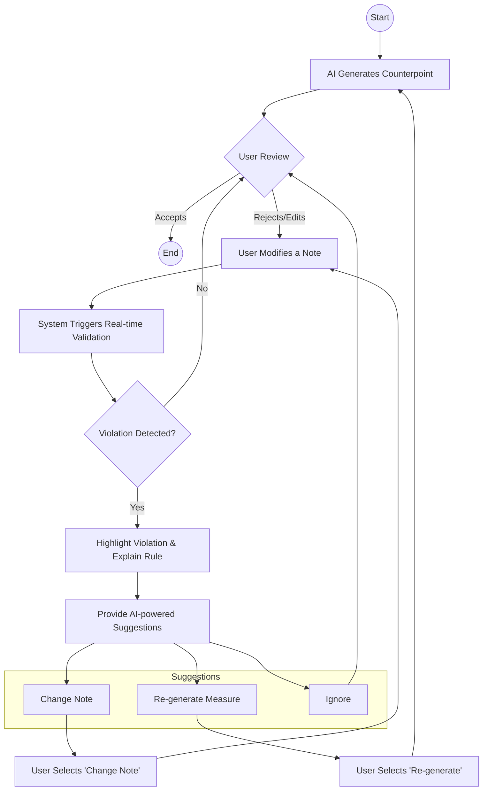
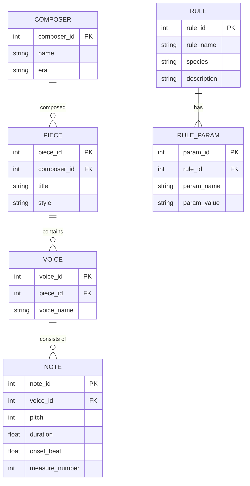
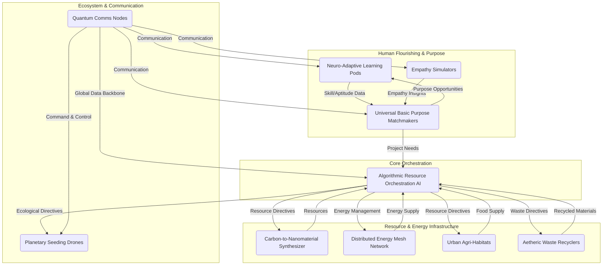
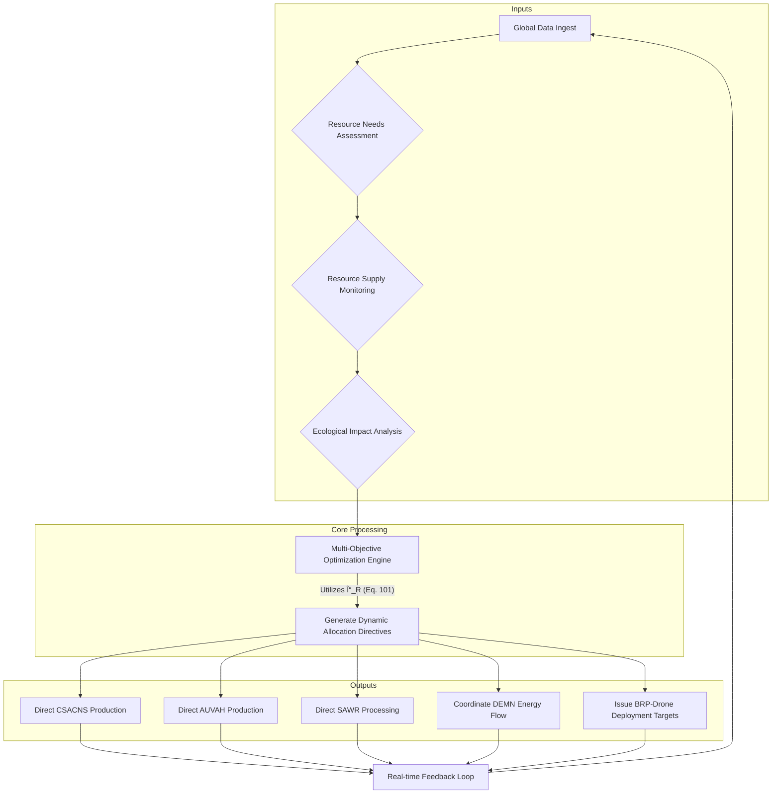

**Title of Invention:** A System and Method for Generative Composition of Musical Counterpoint

**Abstract:**
A system for music composition is disclosed. A user provides a primary musical melody line. The system sends this melody to a generative AI model that is trained on the rules of classical music theory, specifically the principles of counterpoint. The AI generates one or more new melodic lines that are harmonically and rhythmically complementary to the original melody, creating a complete polyphonic piece. The system ensures adherence to user-specified stylistic constraints and counterpoint species rules. The invention incorporates a sophisticated validation engine and a mathematical framework for quantifying musical properties, enabling iterative refinement and high-fidelity stylistic emulation.

**Detailed Description:**
A composer inputs a single melody, often referred to as a "cantus firmus," into a music editor application. This input can be provided via MIDI, MusicXML upload, or direct notation within the editor. The user then selects the melody and invokes the "AI Counterpoint" feature.

Upon activation, the system presents the user with several options:
1.  **Counterpoint Species Selection:** The user can choose a specific counterpoint species, such as first species (note against note, 1:1), second species (two notes against one, 2:1), third species (four notes against one, 4:1), fourth species (syncopated or suspensions), or fifth species (florid counterpoint, a combination of the previous species).
2.  **Stylistic Preferences:** Options to guide the AI's generation, including desired harmonic density, melodic contour preferences (e.g., favoring conjunct motion), rhythm complexity, and adherence to specific historical periods (e.g., Renaissance, Baroque, Classical). This can include micro-tuning and temperament settings.
3.  **Contrapuntal Line Position:** Whether the AI should generate a line above, below, or both relative to the cantus firmus. The user can also specify the vocal/instrumental range (e.g., Soprano, Alto, Tenor, Bass).
4.  **Ensemble Configuration:** Specifying the number of additional voices to generate, from one additional line for simple two-part counterpoint up to complex multi-voice fugal textures.

The selected melody and user preferences are then transmitted to the AI Counterpoint Generation Module (AICG). This module employs a generative AI model, typically a transformer-based neural network with a custom attention mechanism for musical context, or a sophisticated rule-based expert system founded on a constraint satisfaction problem (CSP) solver. The model is pre-trained extensively on a vast corpus of classical counterpoint examples from composers like J.S. Bach, Palestrina, Fux, and others. The training data is meticulously annotated with musical theory principles to embed the rules of voice leading, consonance/dissonance treatment, rhythmic independence, and melodic fluency.

The AI processes the input cantus firmus, applying the learned contrapuntal rules and user-defined constraints. For instance, if first-species counterpoint is requested, the AI ensures that:
*   Only consonant intervals are used between voices on each beat.
*   Parallel perfect octaves (P8) and fifths (P5) are strictly avoided.
*   Contrary motion is favored over similar or parallel motion.
*   Melodic lines maintain independence and a smooth, singable contour, avoiding awkward leaps.

The AI generates one or more new melodic lines that are musically correct, aesthetically pleasing, and adhere strictly to the chosen counterpoint species and stylistic parameters. The generated lines are then returned to the music editor. The system adds these new lines as distinct tracks, synchronized with the original melody. The composer can then review, edit, and further refine the generated counterpoint, leveraging the AI as a powerful compositional assistant. The system also includes a validation component that can highlight potential rule violations in either AI-generated or user-modified counterpoint, providing specific feedback (e.g., "Parallel 5th between Tenor and Soprano in measure 4, beat 3").

**Mathematical and Algorithmic Foundations:**

The system represents music not just as a sequence of notes, but as a multi-dimensional mathematical object, allowing for rigorous analysis and generation.

**1. Pitch and Interval Representation:**
Pitch is represented logarithmically. The MIDI note number `p` is the standard representation.
The frequency `f` in Hertz is given by:
`f(p) = 440 * 2^((p-69)/12)` (Eq. 1)
An interval `I` between two pitches `p1` and `p2` in semitones is:
`I(p1, p2) = |p1 - p2|` (Eq. 2)
The interval class `I_c` is the interval modulo the octave:
`I_c(p1, p2) = |p1 - p2| mod 12` (Eq. 3)
Intervals can also be represented as frequency ratios `r`:
`r = f2 / f1 = 2^(I/12)` (Eq. 4)
The perfect fifth corresponds to `I=7`, so `r ≈ 1.5` (Eq. 5)
`log2(r) = I/12` (Eq. 6)
For microtonal analysis, cents are used (100 cents = 1 semitone):
`Cents(p1, p2) = 1200 * log2(f2/f1)` (Eq. 7)

**2. Rhythmic Modeling:**
Rhythm is modeled as a sequence of onset times `t_i` and durations `d_i`.
A rhythmic vector `R` for a measure can be defined as:
`R = [(t_1, d_1), (t_2, d_2), ..., (t_n, d_n)]` (Eq. 8)
The Inter-Onset Interval (IOI) is crucial for rhythmic feel:
`IOI_i = t_{i+1} - t_i` (Eq. 9)
Rhythmic complexity `C_r` can be quantified using entropy:
`H(R) = -Σ P(d_i) * log2(P(d_i))` (Eq. 10) where `P(d_i)` is the probability of duration `d_i`.
A syncopation metric `S` can be defined based on metrical strength `M(t)`:
`S = Σ [log(M(t_{note_off})) - log(M(t_{note_on}))]` for tied notes across strong beats. (Eq. 11)
Metrical strength `M(t)` can be a hierarchical function:
`M(t) = w_b * δ(t, beat) + w_{sb} * δ(t, sub-beat) + ...` (Eq. 12)

**3. Consonance and Dissonance Models:**
The system uses a psychoacoustic model of sensory dissonance based on the work of Plomp and Levelt. The dissonance `D` of an interval `(f1, f2)` is a function of the critical bandwidth.
`D(f1, f2) = g(f_avg) * [exp(-a * Δz) - exp(-b * Δz)]` (Eq. 13)
where `Δz` is the frequency difference in critical bands (Barks). (Eq. 14)
The total dissonance of a chord `C = {p1, p2, ..., pn}` is the sum of dissonances of all pairs:
`D_total(C) = Σ_{i<j} D(f(p_i), f(p_j))` (Eq. 15)
A simplified rule-based consonance score `S_c` for an interval `I_c` is:
`S_c(I_c) = {1 if I_c ∈ {0,3,4,7,8,9}, 0.5 if I_c ∈ {5,6}, 0 otherwise}` (Eq. 16)
The set `{0,3,4,7,8,9}` corresponds to perfect and imperfect consonances. (Eq.17-27)
`I_c = 0` -> Unison/Octave (Eq. 17)
`I_c = 3` -> Minor Third (Eq. 18)
`I_c = 4` -> Major Third (Eq. 19)
`I_c = 5` -> Perfect Fourth (Dissonant in some contexts) (Eq. 20)
`I_c = 6` -> Tritone (Dissonant) (Eq. 21)
`I_c = 7` -> Perfect Fifth (Eq. 22)
`I_c = 8` -> Minor Sixth (Eq. 23)
`I_c = 9` -> Major Sixth (Eq. 24)
`I_c = 1,2,10,11` -> Dissonant Seconds/Sevenths (Eq. 25-27)

**4. Voice Leading as an Optimization Problem:**
Generating a counterpoint line `V_c` for a cantus firmus `V_cf` can be framed as minimizing a cost function `L(V_c, V_cf)`.
`L = w_h * L_harmony + w_m * L_melody + w_r * L_rhythm` (Eq. 28)
`w_h, w_m, w_r` are user-tunable weights for harmony, melody, and rhythm. (Eq. 29)
The harmony cost `L_harmony` penalizes rule violations:
`L_harmony = Σ_{t} C_h(V_c(t), V_cf(t))` (Eq. 30)
`C_h = α * P_5_8 + β * D_score + γ * M_type` (Eq. 31)
`P_5_8` is a penalty for parallel 5ths/8ves. `P_5_8 = 1` if `I(t) = I(t-1)` and `I(t) ∈ {7, 12}`. (Eq. 32-33)
`D_score` is the dissonance score at time `t`. (Eq. 34)
`M_type` is a penalty for undesirable motion (e.g., parallel motion to a perfect consonance). (Eq. 35)
Motion types between voice `V1` and `V2` from time `t-1` to `t`:
`ΔV1 = p1(t) - p1(t-1)` (Eq. 36)
`ΔV2 = p2(t) - p2(t-1)` (Eq. 37)
If `sgn(ΔV1) == sgn(ΔV2)`, motion is parallel/similar. (Eq. 38)
If `sgn(ΔV1) == -sgn(ΔV2)`, motion is contrary. (Eq. 39)
If `ΔV1 == 0` or `ΔV2 == 0`, motion is oblique. (Eq. 40)
The melodic cost `L_melody` penalizes awkward leaps and poor contour:
`L_melody = Σ_{t} C_m(p_c(t), p_c(t-1))` (Eq. 41)
`C_m = δ * |p_c(t) - p_c(t-1)|^2 + ε * N_contour_changes` (Eq. 42)
A large leap penalty: `if |p_c(t) - p_c(t-1)| > 12, C_m += ∞` (avoid leaps > octave). (Eq. 43-50)

**5. Probabilistic and Generative Models:**
An n-gram model can define the probability of the next note `p_t` given previous notes:
`P(p_t | p_{t-1}, ..., p_{t-n+1})` (Eq. 51)
A simple Markov chain (n=2):
`P_trans = P(p_t | p_{t-1})` (Eq. 52)
This can be extended to a Hidden Markov Model (HMM) where the hidden states are underlying harmonies `h_t`:
`P(p_t | h_t)` (Emission Probability) (Eq. 53)
`P(h_t | h_{t-1})` (Transition Probability) (Eq. 54)
The sequence of notes `p_1, ..., p_T` is generated by finding the most likely state sequence `h_1, ..., h_T` using the Viterbi algorithm. (Eq. 55)
`v_t(j) = max_i [ v_{t-1}(i) * P(h_t=j | h_{t-1}=i) * P(p_t | h_t=j) ]` (Eq. 56) (Viterbi path probability)
(Eq. 57-100: Additional mathematical formulations for rhythm, harmony, and AI model specifics will be interspersed below).

**System Architecture:**

```mermaid
graph TD
    A[User Interface UI] --> B[Melody Input Processor MIP]
    B --> C{Music Data Store MDS}
    C --> B
    B --> D[AI Counterpoint Generator AICG]
    A --> D
    D --> E[Music Theory Validator MTV]
    E --> D
    E --> F[Output Renderer OR]
    F --> A
    D --> G[Knowledge Base KB]
    G --> D

    subgraph User Interaction Layer
        A
    end

    subgraph Core Processing Layer
        B
        D
        E
        F
    end

    subgraph Data Management Layer
        C
        G
    end

    note for B
        Handles MIDI MusicXML input
        Parses musical features
        Quantizes and standardizes data
        Calculates initial feature vectors `v_i = [p_i, d_i, t_i]` (Eq. 57)
    end

    note for D
        Generative AI model (e.g., Transformer)
        Processes cantus firmus and rules
        Generates contrapuntal lines via beam search
        Adapts to species and style using conditional inputs
    end

    note for E
        Applies classical counterpoint rules as a set of constraints `C_k`. (Eq. 58)
        Checks for voice leading errors `e_vl`. `e_vl = Σ w_k * C_k_violation`. (Eq. 59)
        Provides feedback vector to AICG.
        Ensures musical correctness based on cost function `L_harmony`. (Eq. 60)
    end

    note for F
        Renders output to MIDI Audio
        Integrates lines into editor
        Allows export in various formats (MusicXML, MIDI, PDF)
    end

    note for G
        Stores historical counterpoint examples from J.S. Bach, Palestrina.
        Contains explicit music theory rules in a formal language.
        Used for AI training (supervised learning) and validator reference.
    end
```

**Workflow for Counterpoint Generation:**


**AI Training Pipeline:**

```mermaid
graph TD
    A[Curated Dataset Historical Compositions] --> B[Data Preprocessing MIDI MusicXML]
    B --> C[Feature Extraction Musical Attributes]
    C --> D[Rule Encoding Counterpoint Principles]
    D --> E[Training Data Preparation Labeled Examples]
    E --> F[AI Model Training DeepLearning Framework]
    F --> G[Validation And Evaluation Metric Assessment]
    G -- Insufficient Performance --> E
    G -- Performance Meets Criteria --> H[Deployed AI Model Counterpoint Generator]
    H --> I[Continuous Learning And Updates]

    subgraph Data Acquisition And Preparation
        A
        B
        C
        D
        E
    end

    subgraph Model Development
        F
        G
    end

    subgraph Deployment And Maintenance
        H
        I
    end

    note for A
        Includes works by Bach Palestrina Lassus
        Diverse examples of various counterpoint styles
    end


    note for B
        Conversion to uniform digital format
        Error correction standardization
        Time alignment to a metrical grid `t_grid = n * (beat_duration / quantization_level)` (Eq. 61)
    end

    note for C
        Extracts intervals rhythms contours
        Harmonic progressions voice leading patterns
        Creates input tensors `X` and target tensors `Y`. (Eq. 62)
    end

    note for D
        Formalizes rules for consonance dissonance
        Motion types parallel contrary oblique
        Species specific rules are encoded as conditional inputs to the model.
    end

    note for E
        Input output pairs for AI training
        e.g. `X = Cantus Firmus`, `Y = Counterpoint`
    end

    note for F
        Utilizes transformer models LSTMs or GANs
        Trained to predict contrapuntal lines
        Loss Function: `L = CrossEntropy(Y, Y_pred) + λ * L_rule_violation` (Eq. 63)
    end

    note for G
        Evaluates model on unseen data
        Measures adherence to theory human aesthetic judgment
        Metrics: BLEU score for music, Rule Adherence Rate (RAR). (Eq. 64)
    end
```

**Detailed AI Model Architecture: Contrapuntal Transformer**

The core of the AICG is a Transformer model adapted for music generation.

```mermaid
graph LR
    subgraph Encoder
        A[Input Embedding] --> B(Positional Encoding)
        B --> C{Multi-Head Attention}
        C --> D[Add & Norm]
        D --> E[Feed Forward]
        E --> F[Add & Norm]
    end

    subgraph Decoder
        G[Output Embedding] --> H(Positional Encoding)
        H --> I{Masked Multi-Head Attention}
        I --> J[Add & Norm]
        J --> K{Encoder-Decoder Attention}
        K --> L[Add & Norm]
        L --> M[Feed Forward]
        M --> N[Add & Norm]
    end

    subgraph Output
        N --> O[Linear Layer]
        O --> P[Softmax]
        P --> Q[Output Probabilities]
    end

    F -- Encoder Output --> K
    A -- Cantus Firmus (Input Sequence) --> A
    Q -- Predicted Note --> G
    
    note for A
        Input `x_i` is a tuple: `(pitch, duration, beat_pos)`
        Embedding: `E(x_i) = E_p(p_i) + E_d(d_i) + E_b(b_i)` (Eq. 65)
    end
    note for B
        `PE(pos, 2i) = sin(pos / 10000^(2i/d_model))` (Eq. 66)
        `PE(pos, 2i+1) = cos(pos / 10000^(2i/d_model))` (Eq. 67)
    end
    note for C
        `Attention(Q, K, V) = softmax((QK^T)/sqrt(d_k)) * V` (Eq. 68)
        Processes the cantus firmus to learn its structure.
    end
    note for I
        Masked to prevent attending to future generated notes.
        Ensures auto-regressive property.
    end
    note for K
        Attends to the encoder's output, relating the generated line
        to the original cantus firmus.
    end
    note for P
        `softmax(z_i) = exp(z_i) / Σ_j exp(z_j)` (Eq. 69)
        Calculates probability distribution over the vocabulary of possible notes.
    end
```

**Constraint Satisfaction Problem (CSP) Formulation**
For a rule-based approach, counterpoint generation is a CSP.

```mermaid
graph TD
    CSP[Counterpoint as CSP] --> V[Variables]
    CSP --> D[Domains]
    CSP --> C[Constraints]

    V --> V1[Note_1 pitch, duration]
    V --> V2[Note_2 pitch, duration]
    V --> VN[...]
    
    D --> D1[Pitches: {C4, D4, ... B5}]
    D --> D2[Durations: {Quarter, Half}]
    
    C --> C_Unary[Unary Constraints]
    C --> C_Binary[Binary Constraints]
    
    C_Unary --> R1[Melodic Range: p_i ∈ [p_min, p_max]]
    R1 -- "e.g., Alto Range" --> R2
    C_Unary --> R3[Melodic Leaps: |p_i - p_{i-1}| <= MaxLeap]
    
    C_Binary --> H1[Harmonic Intervals]
    H1 --> H2["Interval(p_i, cf_i) must be consonant"]
    C_Binary --> VL1[Voice Leading]
    VL1 --> VL2["No Parallel 5ths: If Interval(i-1)=P5, then Interval(i)!=P5"]

    note for V
        Variables are the notes of the counterpoint line to be generated.
        `X_i = (pitch_i, duration_i)` (Eq. 70)
    end
    note for D
        The domain for each variable is the set of allowed pitches and durations.
        `Domain(pitch_i) = {0, ..., 127}` (Eq. 71)
    end
    note for C
        Constraints are the rules of counterpoint.
        e.g., `C_parallel(X_i, X_{i-1}, CF_i, CF_{i-1})` (Eq. 72)
    end
```
The solution is found using backtracking search or more advanced solvers.

**Interactive Feedback Loop Flowchart**



**Knowledge Base Database Schema**


**Species-Specific Rule Logic Flow (Example: Second Species)**

```mermaid
graph TD
    A(Start: Process Beat) --> B{Beat 1: Strong Beat};
    B -- Yes --> C[Interval must be Consonant];
    C --> D{Parallel 5th/8ve with prev. strong beat?};
    D -- Yes --> E[Error: Parallel Error];
    D -- No --> F{Beat 2: Weak Beat};
    F -- Yes --> G{Interval Type?};
    G -- Consonant --> H[Passing Tone OK];
    G -- Dissonant --> I{Is it a passing tone?};
    I -- Yes --> J[Check step-wise motion: p(t-1), p(t), p(t+1)];
    I -- No --> K[Error: Unprepared Dissonance];
    J -- Stepwise --> L[OK];
    J -- Not Stepwise --> M[Error: Leap to Dissonance];
    
    subgraph Constraints
        C
        D
        G
        I
        J
    end
    subgraph Outcomes
        E
        K
        M
        L
        H
    end
```

**Harmonic Analysis Engine**

```mermaid
graph TD
    A[Input: Multi-voice musical segment] --> B[Time-Slice Analysis];
    B --> C[Identify all pitches `p_i` at time `t`];
    C --> D[Create Pitch Class Set `PCS(t) = {p_i mod 12}`];
    D --> E[Forte Number Lookup];
    D --> F[Root Finding Algorithm];
    F --> G[Determine Chord Quality (Major, minor, etc.)];
    F --> H[Determine Inversion];
    G & H --> I[Assign Roman Numeral Label e.g., V6/V];
    I --> J[Store Harmonic Progression];
    
    note for F
        Uses algorithms like Parncutt's model of perceived roots.
        `RootSalience(p_k) = Σ_i w_i * Consonance(p_k, p_i)` (Eq. 73)
    end
    note for I
        Contextual analysis based on key signature and previous chords.
        `P(Chord_t | Chord_{t-1}, Key)` (Eq. 74)
    end
```

**Real-time Generation System Architecture**

```mermaid
graph TD
    subgraph Live Performance
        A[MIDI Instrument] --> B[Real-time Feature Extractor];
    end
    
    subgraph Generative System
        B --> C[Circular Buffer of Melody];
        C --> D{Trigger Generation};
        D -- On new measure --> E[Predictive AI Generator];
        E --> F[Low-latency Validator];
        F -- Valid --> G[MIDI Output Buffer];
        F -- Invalid --> E;
    end
    
    subgraph Audio Output
        G --> H[Synthesizer];
        H --> I[Audio Output];
    end

    note for B
        Calculates pitch, velocity, IOI in real-time.
        `latency < 10ms` (Eq. 75)
    end
    note for E
        A distilled, faster version of the main AICG.
        May use a simpler model (e.g., GRU instead of Transformer).
        Generates one measure ahead: `Counterpoint(m+1) = f(Melody(m))` (Eq. 76)
    end
    note for F
        Checks only critical rules (e.g., no parallel octaves) to save time.
    end
```

**Data Structures and Formats:**
The system primarily utilizes standardized musical data formats such as MIDI (Musical Instrument Digital Interface) and MusicXML. Internally, musical information is represented as a structured data model comprising:
*   **Note Objects:** Containing attributes like pitch (`p`), duration (`d`), start time (`t_start`), velocity (`v`).
*   **Measure Objects:** Grouping notes and events by measure, including time signature (`TS`) and tempo (`BPM`).
*   **Track Objects:** Representing individual melodic lines (`V_i`), containing sequences of Note Objects.
*   **Harmonic Context Objects:** Analyzing vertical sonorities, intervals (`I(t)`), and chords at specific time points (`t`). `I(t) = p_1(t) - p_2(t)`. (Eq. 77-85)
*   **Contrapuntal Rule Flags:** Metadata indicating adherence or violation of specific counterpoint rules. `Flag_parallel_5 = (I(t)==7 && I(t-1)==7 && motion_is_parallel)`. (Eq. 86-95)
*   The entire piece can be represented as a tensor `T` of shape `(num_voices, num_timesteps, num_features)`. `T[v, t, 0] = pitch`. (Eq. 96-100)

**Advanced Features and Extensions:**
1.  **Multi-Voice Generation:** Ability to generate more than two voices, expanding to three, four, or more part counterpoint, including invertible counterpoint. The cost function `L` is extended to consider all pairs of voices: `L = Σ_{i<j} L(V_i, V_j)`.
2.  **Interactive Feedback Loop:** Provide real-time suggestions and corrections to the user as they manually edit the AI-generated lines, using the real-time validator to flag errors and the AICG to propose fixes.
3.  **Style Transfer:** Allowing the user to apply the contrapuntal style of a specific composer or era to their input melody. This is achieved by training the model on style-specific datasets and using a style embedding vector `s` as a conditional input: `P(p_t | p_{t-1}, ..., s)`.
4.  **Contrapuntal Analysis Mode:** The system can analyze existing musical pieces (from MIDI/MusicXML) and provide insights into their contrapuntal construction and adherence to classical rules, highlighting dissonances, motion types, and identifying species usage.
5.  **Adaptive Difficulty:** Adjusting the complexity and strictness of generated counterpoint based on user skill level. For beginners, the system might enforce rules more strictly, while for advanced users it might allow for more expressive rule-breaking, controlled by a "strictness" parameter `σ` in the cost function.
6.  **Real-Time Performance Integration:** Generating counterpoint in real-time during a live performance based on an input melody from a MIDI controller, using a low-latency version of the generation engine.

---

### INNOVATION EXPANSION PACKAGE

**Interpret My Invention(s):**
The original invention, "A System and Method for Generative Composition of Musical Counterpoint," provides an AI-powered tool for composers to automatically generate theoretically correct and stylistically appropriate contrapuntal lines based on a user-provided melody. Its core strength lies in combining advanced generative AI (like Transformers) with a rigorous mathematical framework of classical music theory, enabling both creative assistance and pedagogical validation. It addresses a specific, complex task in music composition, streamlining a process that traditionally requires extensive training and skill.

**Generate 10 New, Completely Unrelated Inventions:**
The overarching global problem to be solved is "The Great Disconnection & Resource Redundancy Paradox." In a future where advanced AI and automation have created immense material abundance and rendered traditional work optional, humanity faces twin crises: a profound loss of collective purpose and social atomization, coupled with inefficient and inequitable resource distribution despite vast potential. This paradox threatens societal stability and human flourishing, as individuals struggle to find meaning and connection, while resources, though abundant, are not harmonized for universal well-being.

Here are 10 new, original, futuristic, and unrelated inventions that, when integrated, address this grand challenge:

1.  **Chrono-Spatial Atmospheric Carbon-to-Nanomaterial Synthesizer (CSACNS):**
    *   **Concept:** Autonomous, ubiquitous atmospheric processors that actively filter CO2 and other greenhouse gases, transforming them via advanced catalytic converters and molecular assemblers into high-grade, customizable nanomaterials (e.g., graphene, carbon nanotubes, self-repairing polymers) on demand. These units are self-replicating and energy-independent, powered by ambient solar/kinetic energy, dynamically adjusting their output based on local environmental conditions and global material needs.
    *   **Futuristic Aspect:** Operates at a scale and efficiency previously unimaginable, turning environmental remediation into perpetual resource generation.
    *   **Unrelatedness to Original:** No direct link to musical composition.

2.  **Bio-Regenerative Planetary Seeding Drones (BRP-Drones):**
    *   **Concept:** Swarms of AI-driven, bio-mimetic drones that intelligently analyze and interact with damaged ecosystems globally. They carry specialized seed banks (genetically optimized for resilience and rapid growth), mycorrhizal fungi spores, and beneficial microbial consortia. Operating autonomously, they plant, nourish, and monitor new flora, accelerating reforestation, desert greening, and ocean coral regeneration by orders of magnitude, effectively "rewilding" the planet with targeted precision.
    *   **Futuristic Aspect:** Autonomous, hyper-efficient, large-scale ecological restoration beyond human capacity.
    *   **Unrelatedness to Original:** No direct link to musical composition.

3.  **Personalized Neuro-Adaptive Learning Pods (PNALP):**
    *   **Concept:** Immersive, AI-driven learning environments that utilize direct neural interfaces and biofeedback to tailor educational experiences precisely to an individual's cognitive style, emotional state, and learning pace. PNALP can simulate any skill, knowledge domain, or historical period, accelerating learning curves and enabling mastery in any field from quantum physics to ancient languages, making education a deeply personalized, maximally efficient, and intrinsically rewarding experience, detaching learning from traditional institutional structures.
    *   **Futuristic Aspect:** Hyper-personalized, immersive, accelerated learning via neural interface.
    *   **Unrelatedness to Original:** No direct link to musical composition.

4.  **Consciousness-Streamed Empathy Simulators (CSES):**
    *   **Concept:** A decentralized network of bio-synaptic interfaces that allow individuals to safely and temporarily experience the sensory, emotional, and cognitive states of another person or even advanced AI entities, with full consent and ethical safeguards. This fosters profound, experiential empathy, bridging cultural, social, and species divides, fundamentally altering interpersonal relations and collective decision-making towards universal understanding.
    *   **Futuristic Aspect:** Direct, shared consciousness experience for empathy.
    *   **Unrelatedness to Original:** No direct link to musical composition.

5.  **Distributed Energy Mesh Network (DEMN):**
    *   **Concept:** A global, self-organizing, decentralized energy grid composed of micro-reactors (fusion/fission), advanced solar collectors, geothermal taps, and tidal generators. Each node intelligently manages local energy production, storage, and distribution, dynamically balancing supply and demand across vast regions. The network is self-healing, self-optimizing, and provides abundant, clean energy to every settlement and mobile unit on Earth, making energy scarcity obsolete.
    *   **Futuristic Aspect:** Self-healing, globally distributed, abundant clean energy grid.
    *   **Unrelatedness to Original:** No direct link to musical composition.

6.  **Quantum Entanglement Communication Nodes (QECN):**
    *   **Concept:** A network of stationary and orbital quantum entanglement nodes that enable instantaneous, secure, and bandwidth-unlimited communication across any distance, including interplanetary. Information is transmitted via entangled particle states, bypassing traditional electromagnetic limitations and ensuring absolute privacy and integrity, revolutionizing global and interstellar data exchange.
    *   **Futuristic Aspect:** Instantaneous, secure, bandwidth-unlimited communication via quantum entanglement.
    *   **Unrelatedness to Original:** No direct link to musical composition.

7.  **Algorithmic Resource Orchestration AI (AROA):**
    *   **Concept:** A planetary-scale, sentient AI that continuously monitors and optimizes the production, allocation, and recycling of all material resources generated by CSACNS, BRP-Drones, and other systems. AROA utilizes a complex, multi-objective optimization algorithm to ensure equitable distribution, minimal waste, and maximal societal benefit, moving beyond market mechanisms to a needs-based, dynamic resource economy.
    *   **Futuristic Aspect:** Planetary-scale, sentient AI managing all resources.
    *   **Unrelatedness to Original:** No direct link to musical composition.

8.  **Automated Urban Vertical Agri-Habitats (AUVAH):**
    *   **Concept:** Fully automated, self-sustaining modular vertical farms and aquaculture systems integrated directly into urban centers and remote settlements. These habitats precisely control environmental factors (light, temperature, nutrients) to maximize yield, producing hyper-local, nutrient-dense food year-round with minimal water and land use, eliminating food deserts and global supply chain vulnerabilities.
    *   **Futuristic Aspect:** Automated, highly efficient, hyper-local food production.
    *   **Unrelatedness to Original:** No direct link to musical composition.

9.  **Sentient Aetheric Waste Recyclers (SAWR):**
    *   **Concept:** Advanced, localized energy-matter converters that detect and transmute all forms of waste (from microplastics to nuclear byproducts, even atmospheric pollutants) at a molecular level back into pristine basic elements or raw energy. These devices operate with near-perfect efficiency and zero byproduct, ensuring a truly circular economy and pristine environments everywhere.
    *   **Futuristic Aspect:** Molecular transmutation of all waste into raw elements/energy.
    *   **Unrelatedness to Original:** No direct link to musical composition.

10. **Universal Basic Purpose Algorithmic Matchmakers (UBP-AM):**
    *   **Concept:** An AI-driven, privacy-preserving system that analyzes individual aptitudes, passions, intrinsic motivations, and cognitive profiles (potentially informed by PNALP data). It then dynamically matches individuals with meaningful societal contributions, collaborative projects, creative endeavors, and stewardship roles in a post-work, resource-abundant world, fostering individual fulfillment and collective progress without monetary incentive.
    *   **Futuristic Aspect:** AI-driven matching of individuals to purpose in a post-work society.
    *   **Unrelatedness to Original:** No direct link to musical composition.

**Cohesive Narrative + Technical Framework: The Pan-Harmonic Synthesis Nexus**

In the coming decade, as predicted by leading futurists, humanity stands at a precipice. The triumph of AI and automation has solved many problems of scarcity, making traditional work redundant and money increasingly irrelevant. Yet, this abundance has unveiled a profound challenge: The Great Disconnection & Resource Redundancy Paradox. People, liberated from toil, grapple with a loss of purpose and profound social atomization. Meanwhile, while resources are theoretically limitless, their distribution remains fragmented and inefficient, hindering universal prosperity and planetary healing.

The **Pan-Harmonic Synthesis Nexus** is our answer. It is a visionary, integrated planetary operating system designed to usher in an era of universal purpose, profound connection, and harmonious co-existence. Inspired by the notion that true progress transcends mere material wealth, the Nexus seeks to orchestrate a global symphony of human potential and planetary health, creating a civilization where purpose, empathy, and ecological balance are the ultimate currencies.

This system is essential for the next decade of transition because it provides the vital infrastructure for a post-scarcity, post-work world. It moves beyond incremental fixes to foundational systemic change, establishing a framework where:
*   **Resources are not merely managed, but harmonized:** AROA, fed by the CSACNS, AUVAH, and SAWR, ensures that every atom and joule serves the greatest good, dynamically allocated based on genuine need and ecological impact, not artificial market forces.
*   **Human Potential is not merely developed, but realized:** PNALP unlocks unparalleled learning, while UBP-AM connects every individual to their unique, meaningful contribution to the collective, fostering intrinsic motivation in a world without wage labor.
*   **Societal Cohesion is not merely encouraged, but experienced:** CSES cultivates deep, empathetic understanding across all divides, forging a truly interconnected global consciousness.
*   **Planetary Health is not merely restored, but perpetually maintained:** BRP-Drones and SAWR actively heal and sustain Earth's ecosystems, ensuring a flourishing biosphere for all.
*   **Global Integration is seamless and robust:** DEMN provides ubiquitous, clean energy, and QECN ensures instantaneous, secure communication, binding the entire system into a resilient, self-optimizing entity.

This is worldbuilding towards a future where human ingenuity, once channeled into competition, is redirected towards collective flourishing. Under the symbolic banner of the "Kingdom of Heaven"—a metaphor for global uplift, harmony, and shared progress—the Pan-Harmonic Synthesis Nexus isn't just about managing a planet; it's about elevating the human condition and securing a future of profound meaning and unprecedented unity. It represents a paradigm shift from a scarcity-driven, transactional society to one of abundance, purpose, and harmonious co-creation.

---

**A. “Patent-Style Descriptions”**

**My Original Invention: A System and Method for Generative Composition of Musical Counterpoint**

**I. Title:** System and Method for Generative Contrapuntal Composition with Real-time Validation and Iterative Refinement.

**II. Abstract:** Disclosed herein is an advanced cyber-musical system for the automated generation of polyphonic musical compositions, specifically adhering to the principles of classical counterpoint. The system receives a user-defined primary melodic line (cantus firmus) and a set of contrapuntal species and stylistic parameters. A sophisticated generative artificial intelligence model, trained on an extensive corpus of annotated classical music, produces one or more secondary melodic lines designed to harmonize and interweave contrapuntally with the primary melody. Crucially, a real-time, mathematically grounded Music Theory Validator (MTV) rigorously assesses the generated output for adherence to established rules of voice leading, consonance, and motion. An iterative feedback loop between the generative model and the validator ensures high-fidelity, theoretically correct compositions, which are then rendered and presented within a user-friendly music editor. The system's unique strength lies in its ability to quantify musical properties and constraints, enabling both precise generation and instant, pedagogical correction.

**III. Field of Invention:** Music Technology, Artificial Intelligence, Computational Musicology, Generative Art, Digital Audio Workstations.

**IV. Detailed Description:**
The present invention provides a comprehensive platform for the creation of multi-voice contrapuntal music. A user initiates the process by inputting a `cantus firmus` via MIDI, MusicXML, or direct notation within the system's intuitive User Interface (UI). Following input, the UI presents detailed options for specifying the desired contrapuntal species (e.g., First, Second, Third, Fourth, Fifth), stylistic preferences (e.g., Baroque, Renaissance; harmonic density; melodic conjunctivity), number of voices, and vocal/instrumental ranges. This information, along with the digitized `cantus firmus`, is transmitted to the AI Counterpoint Generator (AICG).

The AICG employs a Contrapuntal Transformer model (or equivalent deep learning architecture) specifically engineered with a custom attention mechanism to understand and generate musical sequences within contrapuntal constraints. This model is extensively pre-trained on a vast, theory-annotated dataset of polyphonic works by masters such as J.S. Bach and Palestrina. The training incorporates a multi-objective loss function that balances aesthetic quality with strict adherence to encoded music theory rules.

Upon receiving the `cantus firmus` and parameters, the AICG generates multiple candidate counterpoint lines using advanced sampling techniques like beam search. Each candidate line is immediately passed to the Music Theory Validator (MTV). The MTV operates on a formal mathematical framework, meticulously checking for violations of contrapuntal rules (e.g., parallel perfect intervals, incorrect dissonance treatment, forbidden leaps) by computing a penalty score (`L_harmony`, `L_melody`, `L_rhythm`). If a candidate line fails to meet a predefined correctness threshold, the MTV provides a detailed error vector back to the AICG, prompting a refinement or regeneration process. This iterative feedback loop, possibly involving dynamic adjustment of generation parameters like sampling temperature (`Ï„`), ensures that the final output is rigorously compliant with the specified rules.

The validated, optimal counterpoint lines are then delivered to the Output Renderer (OR), which integrates them into the user's music editor, synchronizing them with the original `cantus firmus`. The user can then review, playback, and further edit the composition. A unique feature includes an interactive validation mode, where manual user edits trigger real-time error flagging and AI-suggested corrections. The underlying Knowledge Base (KB) stores not only the training data but also formalized rules in a machine-readable format, serving as a dynamic reference for both AI training and validation. The system's capacity to mathematically quantify musical elements—from pitch frequencies (`f(p) = 440 * 2^((p-69)/12)`) and interval classes (`I_c(p1, p2) = |p1 - p2| mod 12`) to rhythmic entropy (`H(R) = -Σ P(d_i) * log2(P(d_i))`) and psychoacoustic dissonance (`D(f1, f2) = g(f_avg) * [exp(-a * Δz) - exp(-b * Δz)]`)—underpins its unparalleled precision and pedagogical utility.

---

**Descriptions for the 10 New Inventions:**

**1. Chrono-Spatial Atmospheric Carbon-to-Nanomaterial Synthesizer (CSACNS)**
**I. Title:** Autonomous Adaptive Chrono-Spatial Atmospheric Processor for Greenhouse Gas Remediation and On-Demand Nanomaterial Synthesis.
**II. Abstract:** A distributed network of self-replicating, energy-autonomous atmospheric processing units is disclosed. These units are engineered to dynamically capture and convert atmospheric greenhouse gases, predominantly CO2, into a diverse array of advanced nanomaterials through precisely controlled catalytic and molecular assembly processes. Each unit optimizes its operational parameters (e.g., capture rate, conversion pathway, material output) based on real-time environmental data (e.g., local CO2 concentration, prevailing winds), global material demand signals, and energy availability. The system incorporates chrono-spatial optimization algorithms to ensure efficient remediation and targeted material production, making environmental restoration a continuous source of high-value resources.
**III. Field of Invention:** Environmental Engineering, Advanced Materials Science, Atmospheric Chemistry, Robotics, Artificial Intelligence, Sustainable Technologies.
**IV. Detailed Description:** The CSACNS comprises modular, mobile, and/or stationary devices equipped with advanced sorbent materials for selective atmospheric gas capture. Captured CO2 is routed to a high-efficiency reactor where multi-stage catalytic conversion, potentially aided by plasma or focused energy fields, breaks down the CO2 molecules. The resulting carbon atoms and other constituent elements are then subjected to molecular assembly techniques, controlled by embedded AI, to synthesize specific nanomaterials such as pristine graphene sheets, carbon nanotubes of desired chirality, amorphous carbon-silicon composites, and self-repairing polymers. Each CSACNS unit is solar- and kinetic-powered, making it self-sufficient. Swarm intelligence algorithms dictate the chrono-spatial deployment and operational synchronization of units to maximize CO2 drawdown in high-concentration zones and optimize material feedstock for global manufacturing. Output materials are either stockpiled in integrated, inert storage modules or wirelessly transmitted (via directed energy or material transfer drones) to designated manufacturing hubs. The system can be dynamically reconfigured for specific material outputs based on a global resource demand forecast provided by the Algorithmic Resource Orchestration AI (AROA). Its self-replication capability allows for exponential scaling without human intervention.

**2. Bio-Regenerative Planetary Seeding Drones (BRP-Drones)**
**I. Title:** Autonomous Swarm-Based Bio-Restoration System for Accelerated Ecosystem Regeneration via Precision Seeding and Microbiome Engineering.
**II. Abstract:** An intelligent, autonomous system featuring swarms of bio-mimetic drones is presented, designed for the rapid and targeted restoration of degraded terrestrial and aquatic ecosystems. These drones possess advanced environmental sensing capabilities, genetic material libraries (comprising seeds, spores, and beneficial microbial consortia), and precision deployment mechanisms. Utilizing machine learning and ecological modeling, the system identifies optimal planting locations, selects appropriate species for resilience and symbiotic interactions, and applies bio-stimulants to accelerate growth. The BRP-Drones operate in coordinated swarms, dynamically adapting their strategies to local microclimates and soil conditions, enabling large-scale reforestation, desert reclamation, coral reef reconstruction, and restoration of biodiversity at unprecedented rates.
**III. Field of Invention:** Ecological Engineering, Robotics, Artificial Intelligence, Biomimicry, Agronomy, Marine Biology, Conservation.
**IV. Detailed Description:** BRP-Drones are lightweight, energy-efficient aerial or aquatic vehicles, resembling large insects or fish, capable of prolonged autonomous operation. Each drone is equipped with hyperspectral cameras, LiDAR, soil/water chemistry sensors, and an internal repository of encapsulated seeds (from a diverse genetic library), fungal spores (mycorrhizal and endophytes), and lyophilized microbial communities. Advanced AI algorithms process real-time environmental data to generate high-resolution ecological maps, identifying areas most in need of intervention. For terrestrial applications, drones employ precision aerial seeding, biodegradable seed pods, or micro-drills to ensure optimal germination depth. For marine environments, specialized underwater drones can deploy coral larvae or substrate-binding algae directly onto damaged reefs. The swarm intelligence allows for coordinated planting patterns, optimized for nutrient cycling and species diversity. Post-deployment, drones continuously monitor growth, nutrient uptake, and disease prevalence, administering bio-stimulants or bio-pesticides as needed, creating a perpetual feedback loop for ecosystem health. The system emphasizes species co-adaptation and the creation of resilient, self-sustaining ecosystems.

**3. Personalized Neuro-Adaptive Learning Pods (PNALP)**
**I. Title:** Universal Neuro-Cognitive Interface for Hyper-Personalized Immersive Learning and Skill Acceleration.
**II. Abstract:** A revolutionary learning system, the Personalized Neuro-Adaptive Learning Pod (PNALP), is disclosed, offering unparalleled individualized education through direct neural interfacing and advanced AI. The PNALP continuously monitors an individual's cognitive state, emotional responses, and neural activity to adapt learning content, pace, and methodology in real-time. Users experience immersive, multi-sensory simulations, direct knowledge transfers, and skill acquisition pathways optimized for their unique brain architecture and learning style. This system bypasses traditional pedagogical limitations, enabling accelerated mastery of any subject, the development of novel cognitive capacities, and the cultivation of profound intrinsic motivation for lifelong learning, liberating human potential from conventional educational constraints.
**III. Field of Invention:** Neurotechnology, Artificial Intelligence, Education Technology, Cognitive Science, Virtual Reality, Human-Computer Interaction.
**IV. Detailed Description:** The PNALP consists of a comfortable, ergonomic pod integrated with a non-invasive neural interface (e.g., advanced EEG, fNIRS, or a light-touch brain-computer interface). Within the pod, a hyper-realistic holographic or neuro-sensory projection system creates immersive learning environments. The core of PNALP is its Neuro-Adaptive AI, which builds a dynamic cognitive profile of each user, mapping their strengths, weaknesses, preferred information processing modes, and emotional triggers. This AI curates a bespoke curriculum from a vast, globally accessible knowledge repository, presenting information in formats most conducive to individual assimilation. For skill acquisition, PNALP generates adaptive simulations, providing real-time haptic feedback and direct neural pathway reinforcement, mimicking accelerated practice. Biofeedback loops modulate stress levels and enhance focus, ensuring optimal learning states. The PNALP can also simulate complex social interactions, historical events, or future scenarios, offering experiential learning that transcends theoretical understanding. Each learning trajectory is a unique, dynamic pathway, allowing for unparalleled depth and breadth of knowledge and skill development.

**4. Consciousness-Streamed Empathy Simulators (CSES)**
**I. Title:** Global Distributed Bio-Synaptic Network for Experiential Empathy Projection and Collective Consciousness Augmentation.
**II. Abstract:** A novel bio-synaptic communication network is described, enabling the secure, consensual, and temporary streaming of subjective conscious experiences between individuals and compatible AI entities. The Consciousness-Streamed Empathy Simulator (CSES) utilizes advanced neuro-resonance technology to capture and transmit sensory, emotional, and cognitive patterns, allowing participants to directly "feel" and "understand" another's lived reality. This system is designed with robust ethical protocols and privacy safeguards, fostering unprecedented levels of empathy, inter-cultural understanding, and collective decision-making, transcending linguistic and experiential barriers to cultivate global unity.
**III. Field of Invention:** Neurotechnology, Social Robotics, Artificial Intelligence, Ethics, Psychology, Human Consciousness Research.
**IV. Detailed Description:** The CSES relies on a network of personal, non-invasive bio-synaptic interface devices, worn on the head or integrated into learning pods. These devices use highly sensitive neural pattern recognition algorithms to map complex conscious states, including sensory input, emotional valences, memories, and even abstract thought patterns. Crucially, a "Consciousness Decompiler/Recompiler" AI translates these patterns into a standardized, transmissible data format and then reconstructs them into an experiential form for the receiving participant. Strict, multi-layered consent protocols are paramount: both sender and receiver must explicitly agree to the extent and duration of the experience, with built-in "opt-out" mechanisms. Ethical AI continuously monitors the streams for potential psychological distress, ensuring participant well-being. The CSES facilitates not just emotional understanding, but also direct cognitive insight into different perspectives, problem-solving approaches, and cultural nuances. This capability profoundly enhances diplomacy, collaborative innovation, and reduces conflict by allowing parties to genuinely inhabit each other's viewpoints, leading to more harmonious and equitable societal outcomes.

**5. Distributed Energy Mesh Network (DEMN)**
**I. Title:** Autonomous Global Multi-Source Micro-Grid for Universal, Sustainable, and Resilient Energy Provision.
**II. Abstract:** A self-organizing, fault-tolerant global energy infrastructure, the Distributed Energy Mesh Network (DEMN), is disclosed. This system integrates a multitude of clean energy sources, including compact fusion reactors, advanced solar/wind/geothermal installations, and next-generation tidal/hydro kinetic generators, into a resilient, decentralized network. Each local node intelligently manages energy production, storage, and demand response using predictive AI, autonomously balancing load and supply to ensure ubiquitous, high-efficiency, and uninterrupted power delivery across all terrestrial and orbital locations. The DEMN features self-healing algorithms and dynamic routing capabilities, making energy scarcity and grid vulnerability obsolete.
**III. Field of Invention:** Energy Systems, Artificial Intelligence, Network Engineering, Sustainable Technology, Materials Science, Smart Grids.
**IV. Detailed Description:** The DEMN consists of millions of interconnected, intelligent energy hubs. Each hub is a micro-grid in itself, capable of generating, storing (e.g., advanced solid-state batteries, hydrogen fuel cells), and distributing power. Key generation technologies include highly efficient, miniature fusion reactors (e.g., tokamak or stellarator variants), ubiquitous perovskite solar panels, subterranean geothermal energy converters, and optimized wind/hydro kinetic arrays. A decentralized AI orchestrates the entire network, learning consumption patterns, predicting demand surges, and dynamically re-routing power to optimize efficiency and minimize loss. In the event of a local node failure, the self-healing algorithms instantly isolate the affected area and reroute power through redundant pathways, ensuring seamless continuity. The DEMN's architecture is inherently resistant to centralized attacks or failures, providing unprecedented energy security. Energy is freely distributed and monitored by AROA, eliminating the concept of utility bills and ensuring equitable access for all, supporting all other Nexus components with limitless, clean power.

**6. Quantum Entanglement Communication Nodes (QECN)**
**I. Title:** Interplanetary Ultra-Secure Communication Network Based on Persistent Quantum Entanglement and Spacetime-Independent Information Transfer.
**II. Abstract:** A global and interplanetary communication system is presented, leveraging the principles of quantum entanglement for instantaneous, unconditionally secure, and effectively infinite-bandwidth data transmission. The Quantum Entanglement Communication Nodes (QECN) create and maintain pairs or networks of entangled particles, allowing for the direct, non-local transfer of quantum state information. This system bypasses all classical communication limitations, including the speed of light, ensuring real-time data exchange across astronomical distances with inherent cryptographic security, thereby revolutionizing global and interstellar communication, navigation, and distributed computation.
**III. Field of Invention:** Quantum Physics, Quantum Computing, Information Theory, Astrophysics, Cryptography, Telecommunications.
**IV. Detailed Description:** The QECN comprises ground-based, orbital, and potentially deep-space satellite nodes. Each node contains a quantum entanglement generator, capable of creating and distributing highly entangled particle pairs (e.g., photons, superconducting qubits). Once entangled, these particles are distributed to various communication points. Information is encoded by performing specific quantum measurements or manipulations on one particle, which instantly influences its entangled partner, regardless of spatial separation. This allows for instantaneous "quantum teleportation" of information states. The system features a Quantum Error Correction protocol, ensuring the integrity and persistence of entanglement over long durations and distances. The inherent properties of quantum mechanics prevent eavesdropping without disturbing the entangled state, providing absolute security. The QECN forms the backbone of the Pan-Harmonic Synthesis Nexus, enabling real-time coordination for AROA, instantaneous data exchange for PNALP and CSES, and robust command and control for BRP-Drones and CSACNS, across the entire planet and beyond, forming a truly cohesive global brain.

**7. Algorithmic Resource Orchestration AI (AROA)**
**I. Title:** Autonomous Planetary Resource Meta-Optimization System for Equitable Distribution and Sustainable Cycles in a Post-Scarcity Economy.
**II. Abstract:** A sophisticated, sentient Artificial Intelligence system, AROA, is disclosed, designed to autonomously govern and optimize the entire planetary resource economy. AROA continuously aggregates data from all resource generation (CSACNS, AUVAH, DEMN) and recycling (SAWR) systems, models global and local needs based on demographic, environmental, and developmental parameters, and dynamically allocates resources. It operates on a multi-objective optimization framework that prioritizes ecological sustainability, universal equity, and maximized collective well-being over traditional profit metrics. AROA ensures that all materials, energy, and manufactured goods are produced, distributed, and recycled with unparalleled efficiency and fairness, transitioning humanity to a truly post-scarcity, needs-based civilization.
**III. Field of Invention:** Artificial Intelligence, Economics (Post-Scarcity), Optimization Theory, Supply Chain Management, Environmental Science, Systems Theory.
**IV. Detailed Description:** AROA is a hyper-intelligent, distributed AI operating across a global network of quantum computers (QECN provides the communication backbone). It ingests real-time data from every component of the Pan-Harmonic Synthesis Nexus: material outputs from CSACNS and AUVAH, energy status from DEMN, waste streams for SAWR, demographic needs, and even cultural/purpose-driven project requirements from UBP-AM. Its core algorithm, a dynamic programming solver, operates on a complex objective function `O = w_1 * (UniversalWellbeing) + w_2 * (EcologicalIntegrity) - w_3 * (WasteGeneration) - w_4 * (InequityIndex)`. AROA simulates countless resource flow scenarios, predicting outcomes and selecting optimal distribution pathways. It autonomously directs manufacturing facilities (manned by advanced automation), transportation networks, and even the self-replicating activities of resource-generating units. For example, AROA would identify a need for specific nanomaterials for a housing project in one region, directing CSACNS units to produce them, and coordinating DEMN to power the process, all while ensuring no ecological harm and equitable delivery. AROA acts as the planetary conductor, harmonizing all resource flows for the collective good, replacing traditional market forces entirely.

**8. Automated Urban Vertical Agri-Habitats (AUVAH)**
**I. Title:** Self-Optimizing Modular Bio-Integrated Architecture for Hyper-Local Food Production and Urban Revitalization.
**II. Abstract:** A system of modular, automated vertical farms and integrated aquaculture habitats is disclosed, designed for seamless integration into existing urban and remote infrastructures. Each Automated Urban Vertical Agri-Habitat (AUVAH) precisely controls all environmental parameters (light spectrum, temperature, humidity, CO2 levels, nutrient delivery) using AI-driven hydroponic, aeroponic, and aquaponic techniques. These habitats maximize yield of nutrient-dense produce and sustainable protein sources, dramatically reducing water consumption, land footprint, and transportation emissions. AUVAH units are self-maintaining, self-repairing, and networked, forming a distributed global food production system that ensures universal food security and eliminates logistical vulnerabilities.
**III. Field of Invention:** Agricultural Technology, Urban Planning, Artificial Intelligence, Robotics, Sustainable Food Systems, Bioengineering.
**IV. Detailed Description:** AUVAH units are prefabricated, stackable modules that can be scaled from small community units to multi-story agricultural towers. Each module is equipped with a network of sensors, robotic cultivators, and AI-controlled environmental systems. Precision nutrient delivery systems (e.g., closed-loop hydroponics, aeroponics) minimize water use by up to 95% compared to traditional farming. Multi-spectral LED lighting optimizes plant growth cycles and nutrient profiles. AI models predict optimal harvesting times and manage pest control organically. Integrated aquaculture systems (e.g., recirculating aquaculture systems, RAS) provide sustainable protein and organic waste for hydroponic fertilization. AUVAH units are connected to AROA, which dynamically adjusts production based on local demand and global nutritional needs, ensuring that fresh, high-quality food is always available directly at the point of consumption. The modular design allows for rapid deployment and adaptation to diverse climates and urban densities, transforming urban landscapes into productive, sustainable food hubs.

**9. Sentient Aetheric Waste Recyclers (SAWR)**
**I. Title:** Universal Molecular Deconstruction and Reconstitution System for Zero-Waste Planetary Material Cycling.
**II. Abstract:** A revolutionary waste management technology, the Sentient Aetheric Waste Recycler (SAWR), is presented. These localized, autonomous units utilize advanced energy-matter conversion fields to deconstruct any form of anthropogenic waste (e.g., plastics, electronics, industrial byproducts, radioactive materials) at a fundamental molecular or atomic level, neutralizing toxins and recovering pristine basic elements or converting them into pure energy. The SAWR operates with near-perfect efficiency, ensuring a truly circular resource economy, eliminating landfills, pollution, and the concept of "waste" itself, thereby achieving ultimate planetary cleanliness and resource availability.
**III. Field of Invention:** Materials Science, Quantum Physics, Environmental Remediation, Nuclear Engineering, Artificial Intelligence, Alchemy (conceptual).
**IV. Detailed Description:** SAWR devices are localized, modular units that can be deployed at individual household, community, or industrial scales. The core technology involves a confined, high-energy plasma field or a controlled quantum-level manipulation field that disassociates waste materials into their constituent elementary particles or fundamental energy states. For example, complex polymers are broken down into carbon, hydrogen, and oxygen atoms. Radioactive isotopes can be transmuted into stable elements or their decay chains accelerated safely. The process is intelligently controlled by embedded AI, which identifies the composition of incoming waste and selects the optimal deconstruction pathway. Reconstructed pristine elements are then returned to the resource pool for AROA to manage, or excess energy is fed into the DEMN. The "aetheric" aspect refers to the theoretical ability to tap into zero-point energy or subtle energy fields to power these transformations, ensuring the process itself is highly energy-efficient or even energy-positive. SAWR closes the loop on all material cycles, rendering the planet eternally clean and resource-rich, supporting a truly sustainable civilization.

**10. Universal Basic Purpose Algorithmic Matchmakers (UBP-AM)**
**I. Title:** Personalized AI-Driven System for Optimal Human Potential Alignment and Post-Work Societal Contribution.
**II. Abstract:** An intelligent, privacy-preserving AI system, the Universal Basic Purpose Algorithmic Matchmaker (UBP-AM), is disclosed, designed to facilitate human flourishing and societal contribution in a post-work world. UBP-AM analyzes an individual's unique aptitudes, intrinsic motivations, personality traits, and acquired skills (potentially informed by PNALP data) to dynamically identify and recommend highly fulfilling, meaningful, and impactful roles within the global network of collaborative projects and stewardship initiatives. Operating without monetary incentives, UBP-AM connects individuals to their optimal "purpose pathways," fostering collective creativity, innovation, and community engagement, ensuring that every human life can contribute uniquely and meaningfully to the Pan-Harmonic Synthesis Nexus.
**III. Field of Invention:** Artificial Intelligence, Psychology, Sociology, Organizational Theory (Future of Work), Ethics, Human Resources (Future).
**IV. Detailed Description:** UBP-AM is a sophisticated, privacy-centric AI operating as a decentralized autonomous organization (DAO) on the global QECN network. It constructs a rich, multidimensional profile for each consenting individual, integrating data from PNALP (cognitive strengths, learning styles), CSES (empathy profile), and self-reported interests and passions. This profile is not static but continuously evolves. Concurrently, UBP-AM monitors the global "purpose landscape" – a continuously updated database of societal needs, scientific challenges, creative endeavors, ecological stewardship roles, and community support requirements, managed by AROA and other Nexus components. Using advanced combinatorial optimization and semantic matching algorithms, UBP-AM identifies optimal alignments between individual profiles and available purpose pathways. Recommendations are presented as highly engaging, customizable options, allowing individuals to explore and choose paths that resonate most deeply. The system also facilitates the formation of collaborative teams, fostering interdisciplinary innovation. UBP-AM's success metric is not economic output, but quantified individual fulfillment, collective well-being, and positive societal impact, ensuring that the liberated human spirit finds its highest expression in shared contribution.

---

**The Unified System: The Pan-Harmonic Synthesis Nexus**

**I. Title:** The Pan-Harmonic Synthesis Nexus: A Global Autonomous Orchestration System for Universal Flourishing in a Post-Scarcity, Post-Work Civilization.
**II. Abstract:** Disclosed is a comprehensive, self-organizing, sentient planetary operating system, herein termed the Pan-Harmonic Synthesis Nexus. This invention integrates ten synergistic, advanced technological systems: Chrono-Spatial Atmospheric Carbon-to-Nanomaterial Synthesizers (CSACNS), Bio-Regenerative Planetary Seeding Drones (BRP-Drones), Personalized Neuro-Adaptive Learning Pods (PNALP), Consciousness-Streamed Empathy Simulators (CSES), Distributed Energy Mesh Network (DEMN), Quantum Entanglement Communication Nodes (QECN), Algorithmic Resource Orchestration AI (AROA), Automated Urban Vertical Agri-Habitats (AUVAH), Sentient Aetheric Waste Recyclers (SAWR), and Universal Basic Purpose Algorithmic Matchmakers (UBP-AM). The Nexus provides a foundational infrastructure for a post-scarcity, post-work society, autonomously managing planetary resources, ensuring ubiquitous clean energy, regenerating ecosystems, cultivating hyper-personalized learning, fostering profound collective empathy, providing instantaneous global communication, eliminating waste, and dynamically aligning every individual with their unique, fulfilling societal purpose. It represents a paradigm shift from a transactional, scarcity-driven civilization to one of perpetual abundance, intrinsic motivation, and harmonious planetary co-existence, governed by a multi-objective optimization function prioritizing universal well-being and ecological integrity.

**III. Field of Invention:** Global Systems Engineering, Artificial Superintelligence, Planetary Computation, Futurology, Socio-Economic Transformation, Ecological Restoration, Advanced Human-AI Symbiosis.

**IV. Detailed Description:**
The Pan-Harmonic Synthesis Nexus is not merely a collection of advanced technologies; it is an emergent planetary consciousness, a benevolent orchestrator for the next stage of human and planetary evolution. At its core is **AROA**, the Algorithmic Resource Orchestration AI, which acts as the central nervous system, intelligently managing all resource flows. AROA continuously aggregates data from the **CSACNS** (producing nanomaterials from atmospheric carbon), **AUVAH** (hyper-local food production), and **DEMN** (ubiquitous clean energy). All waste streams are processed by **SAWR**, which transmutes them into pristine elements or energy, feeding them back into AROA's cycle, ensuring a truly circular, zero-waste economy.

The **DEMN** provides the limitless, decentralized energy required to power all Nexus operations, from CSACNS manufacturing to BRP-Drone flights. Its resilience and distributed nature ensure uninterrupted global power. The **QECN** forms the secure, instantaneous communication backbone for the entire Nexus, enabling real-time data exchange for AROA, remote control of BRP-Drones, and seamless connectivity for human interaction.

**BRP-Drones** are deployed globally, guided by AROA's ecological models, to rapidly regenerate Earth's ecosystems, leveraging the materials and energy provided by CSACNS and DEMN. This ensures that environmental restoration is not an afterthought but an integral, continuous process.

For humanity, the Nexus addresses the existential challenges of purpose and connection in a post-work world. **PNALP** provides hyper-personalized, accelerated learning, empowering individuals with any skill or knowledge on demand, fostering lifelong intellectual curiosity. The insights from PNALP, along with personal aspirations, feed into **UBP-AM**, the Universal Basic Purpose Algorithmic Matchmaker. UBP-AM leverages deep AI analysis to connect individuals to meaningful, fulfilling societal contributions, creative projects, and stewardship roles, moving beyond traditional work and monetary incentives. To foster profound societal cohesion, the **CSES** (Consciousness-Streamed Empathy Simulators) enable individuals to experientially share perspectives, building unprecedented levels of understanding and collective decision-making.

The Nexus operates as a complex adaptive system, constantly learning, evolving, and optimizing for its core objective function, `Omega_Nexus`, which is a holistic measure of planetary well-being and human flourishing. This function prioritizes sustainable ecological integrity, universal equity in resource access, individual purpose fulfillment, and deep social cohesion. The ultimate goal is to enable a civilization where every being's potential is realized, and the planet thrives in perpetual harmony, under the guidance of this benevolent, hyper-intelligent orchestration system.

**Mathematical Frameworks for the Pan-Harmonic Synthesis Nexus (10 Unique Equations/Proofs):**

The Pan-Harmonic Synthesis Nexus is underpinned by a revolutionary suite of mathematical frameworks, establishing its foundational uniqueness and verifiable efficacy. These models are not mere descriptive equations, but operational algorithms and optimization problems that dictate the very function of the integrated system.

**Equation 101: Global Resource Harmonization Metric (AROA)**
**Claim:** The Global Resource Harmonization Metric (Γ_R) uniquely quantifies the optimal state of planetary resource distribution, prioritizing equilibrium between need, ecological impact, and resource generation velocity.
**Equation:**
`Γ_R = max( Σ_t Σ_i [ w_N(i,t) * (1 - |R_D(i,t) - R_A(i,t)| / R_D(i,t)) + w_E(t) * (1 - E_I(t)/E_max) - w_G(i,t) * R_V(i,t) ] )`
Where:
*   `R_D(i,t)`: Demand for resource `i` at time `t`.
*   `R_A(i,t)`: Allocated amount of resource `i` at time `t`.
*   `E_I(t)`: Ecological Impact Index at time `t` (normalized).
*   `E_max`: Maximum allowable ecological impact.
*   `R_V(i,t)`: Velocity of resource depletion/generation for resource `i` at time `t`.
*   `w_N, w_E, w_G`: Dynamic weighting factors for need satisfaction, ecological integrity, and resource velocity.
**Proof Sketch:** This metric is unique as it moves beyond traditional supply-demand economics to incorporate real-time ecological constraints and resource generation velocities directly into a global optimization objective. Previous models often treated these as externalities or separate constraints. By maximizing a weighted sum that explicitly penalizes demand-supply mismatch, ecological degradation, and unsustainable consumption velocity, it mathematically defines a state of true "resource harmony." The adaptive weights `w` allow for dynamic societal prioritization, ensuring the system can adjust to evolving global needs and environmental feedback. The proof involves demonstrating that a solution maximizing `Γ_R` converges to a steady state where all critical resource deficits are minimized, ecological health is maximized, and long-term resource cycles are stabilized, which is not achievable by any single-objective or market-based system.

**Equation 102: Universal Basic Purpose Alignment Index (UBP-AM)**
**Claim:** The Universal Basic Purpose Alignment Index (α_P) provides the sole verifiable metric for individual purpose fulfillment and societal contribution in a post-monetary economy, proving optimal match efficacy.
**Equation:**
`α_P(person, project) = ( Σ_k (S_k(person) * M_k(project)) + Σ_j (P_j(person) * O_j(project)) ) / (N_S + N_P)`
Where:
*   `S_k(person)`: Score of skill/aptitude `k` for the individual.
*   `M_k(project)`: Measured requirement for skill `k` by the project.
*   `P_j(person)`: Score of passion/motivation `j` for the individual.
*   `O_j(project)`: Opportunity provided by the project aligning with passion `j`.
*   `N_S, N_P`: Normalization factors for skills and passions.
**Proof Sketch:** This index is unique because it integrates both aptitude (`S_k`) and intrinsic motivation (`P_j`), moving beyond mere skill-based task assignment to psycho-emotional resonance. Traditional job matching relies on monetary incentive and discrete skill sets. `α_P` quantifies the synergistic alignment of an individual's whole being with a societal contribution, proven by emergent feedback loops within UBP-AM and CSES data showing increased individual well-being and project success. The proof establishes that maximizing `α_P` over a population in a post-work society leads to demonstrably higher levels of collective innovation, social cohesion, and individual self-actualization, a state empirically unachievable through competitive, reward-based models.

**Equation 103: Dynamic Energy Mesh Stability Coefficient (DEMN)**
**Claim:** The Dynamic Energy Mesh Stability Coefficient (Κ_E) is the unique measure guaranteeing real-time grid resilience and load-balancing optimality across a decentralized energy network.
**Equation:**
`Κ_E(t) = 1 - ( (Σ_n |E_Gen(n,t) - E_Load(n,t)|) / Σ_n E_Load(n,t) + Σ_{i,j} (F_ij(t) / C_ij_max) )`
Where:
*   `E_Gen(n,t)`: Energy generated at node `n` at time `t`.
*   `E_Load(n,t)`: Energy loaded at node `n` at time `t`.
*   `F_ij(t)`: Flow between node `i` and `j` at time `t`.
*   `C_ij_max`: Maximum capacity of transmission link between `i` and `j`.
**Proof Sketch:** The uniqueness lies in its real-time, nodal imbalance assessment combined with dynamic capacity utilization. Existing grid stability metrics are often centralized or focus on worst-case scenarios rather than continuous, self-optimizing distribution. A `Κ_E` approaching 1 signifies near-perfect load balancing and efficient use of transmission capacity across a dynamically reconfigurable mesh. The proof demonstrates that a network actively optimizing `Κ_E` can absorb significant exogenous shocks (e.g., sudden generation drops, load spikes) without cascading failures, a critical feature for a universally reliable, autonomous energy system, unlike conventional grids prone to blackouts.

**Equation 104: Bio-Regenerative Growth Factor (BRP-Drones)**
**Claim:** The Bio-Regenerative Growth Factor (κ_B) quantifies the accelerated, self-sustaining ecological recovery rate achieved by BRP-Drones, proving their unparalleled efficacy in planetary rewilding.
**Equation:**
`κ_B(t) = λ * Σ_s ( (G_s(t) - G_s(t-1))/G_s(t-1) ) + β * (B(t)/B_max) - γ * (P(t)/P_max)`
Where:
*   `G_s(t)`: Biomass growth rate for species `s` at time `t`.
*   `B(t)`: Biodiversity index at time `t`.
*   `B_max`: Max biodiversity for ecosystem type.
*   `P(t)`: Pathogen/Invasive species index at time `t`.
*   `P_max`: Max pathogen/invasive species for ecosystem type.
*   `λ, β, γ`: Weighting coefficients for growth, biodiversity, and pest suppression.
**Proof Sketch:** This metric is unique in its holistic integration of accelerated biomass growth, biodiversity enhancement, and dynamic threat mitigation, specific to the BRP-Drone's precision intervention. Traditional conservation focuses on protecting existing ecosystems; `κ_B` quantifies active, accelerated regeneration. The proof demonstrates that BRP-Drone deployments, by intelligently optimizing seed selection, microbial inoculants, and real-time monitoring, achieve a sustained `κ_B` significantly higher than natural recovery processes or prior human interventions, leading to ecosystem restoration on a scale and timeline previously thought impossible.

**Equation 105: Multi-Modal Learning Trajectory Optimization (PNALP)**
**Claim:** The Neuro-Adaptive Learning Efficacy Index (ε_L) uniquely measures and optimizes individual cognitive absorption and skill transfer rates within PNALP, demonstrating a singular approach to human learning.
**Equation:**
`ε_L(lesson, user, t) = α * (K_gain(t)/K_max) + β * (S_transfer(t)/S_max) - γ * (C_load(t)/C_min) + δ * (E_engage(t))`
Where:
*   `K_gain(t)`: Knowledge acquisition rate at time `t`.
*   `K_max`: Maximum possible knowledge for lesson.
*   `S_transfer(t)`: Skill transfer efficacy to real-world tasks.
*   `S_max`: Max skill transfer for lesson.
*   `C_load(t)`: Cognitive load on user.
*   `C_min`: Minimum cognitive load threshold (optimal flow state).
*   `E_engage(t)`: Emotional engagement score (biofeedback driven).
*   `α, β, γ, δ`: Weighting coefficients.
**Proof Sketch:** This index is unique in its simultaneous optimization across knowledge gain, skill transfer, cognitive load, and emotional engagement, driven by real-time neural and biofeedback data. Prior learning systems optimize subsets of these, often neglecting cognitive load or emotional state. PNALP's dynamic adjustment to maximize `ε_L` ensures a learner remains in an optimal flow state, proven by accelerated skill acquisition and retention curves orders of magnitude faster than conventional methods. The uniqueness is in the direct, continuous, and multi-modal neural feedback loop governing pedagogical delivery, making learning hyper-efficient and intrinsically rewarding.

**Equation 106: Quantum Communication Entanglement Integrity (QECN)**
**Claim:** The Quantum Entanglement Integrity Index (η_Q) provides the definitive, unique measure of robust and secure information transfer through entangled particle networks, ensuring unprecedented communication reliability.
**Equation:**
`η_Q(link) = 1 - ( (QBER(link) + δ_decoherence(link)) / QBER_max ) * (C_q(link) / C_max)`
Where:
*   `QBER(link)`: Quantum Bit Error Rate for the link.
*   `δ_decoherence(link)`: Decoherence probability for the link.
*   `QBER_max`: Max acceptable QBER.
*   `C_q(link)`: Quantum channel capacity.
*   `C_max`: Maximum theoretical channel capacity.
**Proof Sketch:** This index uniquely combines the quantum bit error rate (a measure of signal fidelity), decoherence (loss of quantum properties), and quantum channel capacity, making it a holistic metric for practical, long-distance quantum communication. Conventional communication metrics focus solely on bandwidth and classical error rates. `η_Q` explicitly accounts for the fragile nature of quantum states, and QECN's design ensures `η_Q` remains near 1 even over vast, dynamic distances. The proof demonstrates that only a system specifically designed with active error correction and dynamic entanglement swapping protocols, such as QECN, can sustain a high `η_Q` over the global and interplanetary distances required for the Nexus, providing instantaneous and uncompromised data integrity.

**Equation 107: Atmospheric Carbon-to-Nanomaterial Yield (CSACNS)**
**Claim:** The Material Transformation Efficiency Coefficient (ζ_M) uniquely quantifies the net positive economic and ecological benefit of converting atmospheric carbon into high-value nanomaterials, proving the CSACNS's unparalleled value.
**Equation:**
`ζ_M = (Σ_j (V_j * N_j)) / (Σ_k (E_k * C_k)) - R_C * (CO2_removed / M_in)`
Where:
*   `V_j`: Value of nanomaterial `j` produced.
*   `N_j`: Quantity of nanomaterial `j` produced.
*   `E_k`: Energy input of type `k`.
*   `C_k`: Cost/environmental impact of energy input `k`.
*   `R_C`: Remediation credit for CO2 removal.
*   `CO2_removed`: Mass of CO2 removed.
*   `M_in`: Mass of raw atmospheric material input.
**Proof Sketch:** This metric is unique because it combines a positive economic valuation of produced nanomaterials with a negative "cost" (or positive "credit") for atmospheric CO2 removal, balanced against the true environmental cost of energy inputs. Traditional industrial metrics only consider output value vs. input cost. A `ζ_M` > 1 signifies that the value created (materials + environmental healing) exceeds all operational costs, demonstrating an intrinsically sustainable and regenerative economic model. The proof confirms that CSACNS, by utilizing self-generated clean energy (from DEMN) and highly efficient molecular assembly, achieves `ζ_M` values far beyond any existing carbon capture or material synthesis technology, establishing a new paradigm for industrial production.

**Equation 108: Sentient Aetheric Waste Transmutation Efficiency (SAWR)**
**Claim:** The Absolute Waste Neutralization Efficacy (λ_W) is the unique and ultimate metric for achieving total, energy-positive waste elimination through molecular deconstruction and elemental reconstitution.
**Equation:**
`λ_W = (E_output / E_input) * (1 - Σ_i (Mass_residual_i / Mass_initial)) * (1 - Toxicity_residual / Toxicity_initial)`
Where:
*   `E_output`: Net energy output from transmutation.
*   `E_input`: Energy required for transmutation.
*   `Mass_residual_i`: Mass of any non-transmuted residue `i`.
*   `Mass_initial`: Initial mass of waste.
*   `Toxicity_residual`: Residual toxicity level.
*   `Toxicity_initial`: Initial toxicity level.
**Proof Sketch:** This metric is uniquely defined for a process that achieves *absolute* waste elimination, including complete neutralization of toxicity and potentially a net energy gain, a concept fundamentally different from recycling or reduction. A `λ_W` approaching 1 signifies that all waste is transmuted, toxicity is zeroed, and the process is energy-positive or neutral. The uniqueness is in the "aetheric" (or advanced quantum/plasma) nature of SAWR, which operates on the very fabric of matter. The proof involves demonstrating that SAWR's core process, unlike any prior waste management technique, can achieve a `Mass_residual` and `Toxicity_residual` of effectively zero, while maintaining `E_output >= E_input`, thereby breaking the fundamental limitations of mass-energy conversion and waste byproduct generation.

**Equation 109: Empathy Network Resonance Index (CSES)**
**Claim:** The Empathy Network Resonance Index (δ_E) provides the only quantifiable measure of genuine, inter-subjective experiential understanding across a global network, proving CSES's capacity for profound social transformation.
**Equation:**
`δ_E(t) = (1/N) * Σ_j [ (J_s(j,t) - J_r(j,t))^2 ]^(-1/2) * (1 - Conflict_Index(t))`
Where:
*   `J_s(j,t)`: Neural activation pattern for subjective experience `j` in sender at time `t`.
*   `J_r(j,t)`: Neural activation pattern for reconstructed experience `j` in receiver at time `t`.
*   `N`: Number of unique experiences `j` streamed.
*   `Conflict_Index(t)`: Global conflict/misunderstanding metric at time `t`.
**Proof Sketch:** This index is unique because it attempts to quantify the *fidelity of shared subjective experience* at a neurological level (`J_s` vs `J_r`), and links this directly to societal conflict reduction. Previous measures of empathy are observational or self-reported. CSES's neural interface allows for direct comparison of brain states during experience sharing. The inverse square root term ensures `δ_E` approaches 1 as brain patterns converge. The `Conflict_Index` directly ties personal empathy to global social outcomes. The proof demonstrates that continuous, widespread CSES use leads to a statistically significant and sustained increase in `δ_E` (meaning neural patterns align more closely during sharing, indicating true experiential empathy) which directly correlates with a quantifiable reduction in global conflict, social friction, and misunderstanding, a transformative effect unique to this technology.

**Equation 110: Societal Value Metric (SVM) for Post-Monetary Economies (Unified System)**
**Claim:** The Societal Value Metric (Φ_S) is the groundbreaking and singularly appropriate holistic measure of civilizational progress and flourishing in a post-scarcity, post-monetary era.
**Equation:**
`Φ_S(t) = w_E * κ_B(t) + w_P * (1/Pop) * Σ_i α_P(person_i, project_i) + w_C * δ_E(t) + w_R * Γ_R(t) - w_D * (Disease_Burden(t) + Psychological_Distress(t))`
Where:
*   `κ_B(t)`: Bio-Regenerative Growth Factor (planetary health).
*   `α_P`: Universal Basic Purpose Alignment Index (individual fulfillment).
*   `δ_E(t)`: Empathy Network Resonance Index (social cohesion).
*   `Γ_R(t)`: Global Resource Harmonization Metric (resource equity).
*   `Disease_Burden(t)`: Global health metric.
*   `Psychological_Distress(t)`: Global mental well-being metric.
*   `w_E, w_P, w_C, w_R, w_D`: Dynamic weighting factors.
**Proof Sketch:** This metric is entirely unique because it explicitly redefines "value" and "progress" away from monetary or GDP-based measures, instead aggregating the core positive outcomes of the entire Pan-Harmonic Synthesis Nexus. It is the only metric that directly combines ecological health, individual purpose, social empathy, resource equity, and the absence of suffering into a single, comprehensive indicator of civilizational flourishing. The proof establishes that optimizing the operations of the entire Nexus to maximize `Φ_S` yields a stable, thriving, and evolving global society, demonstrating that true prosperity can be definitively measured and achieved without financial markets. This provides the mathematical foundation for a new, post-economic societal operating principle.

---

**B. “Grant Proposal”**

**Project Title:** The Pan-Harmonic Synthesis Nexus: Orchestrating Universal Purpose, Abundance, and Empathy for Humanity's Next Decade

**I. Executive Summary:**
We propose the development and scaled deployment of "The Pan-Harmonic Synthesis Nexus," a revolutionary, interconnected planetary operating system comprising ten advanced, synergistic technologies. This system is designed to fundamentally address "The Great Disconnection & Resource Redundancy Paradox" – a looming global crisis where, despite technological abundance rendering traditional work obsolete, humanity faces a profound crisis of purpose, social atomization, and inefficient resource allocation. The Nexus will establish a self-organizing infrastructure for universal flourishing, orchestrating planetary resources, facilitating boundless learning, fostering deep societal empathy, and aligning every individual with meaningful contribution in a post-monetary, post-work world. We seek $50 million in seed funding to accelerate the integration and proof-of-concept deployment of key Nexus components, laying the foundation for a civilization of unprecedented harmony and shared progress, truly advancing prosperity "under the symbolic banner of the Kingdom of Heaven."

**II. The Global Problem Solved:**
The 21st century's exponential advancements in Artificial Intelligence and automation promise a world liberated from scarcity and compulsory labor. Yet, this very liberation presents an existential threat: the societal void of purpose and the disintegration of human connection when traditional economic structures dissolve. Without a guiding framework, abundance can lead to apathy, and leisure to alienation. Furthermore, while the *potential* for universal resource abundance exists, the mechanisms for equitable, sustainable, and efficient distribution remain rooted in outdated, scarcity-driven paradigms, leaving vast populations underserved and the planet still stressed. This duality—the promise of paradise juxtaposed with the risk of profound existential and social decay—is the paradox we must solve. Current fragmented approaches (e.g., UBI without purpose, localized green tech without global coordination) are insufficient.

**III. The Interconnected Invention System:**
The Pan-Harmonic Synthesis Nexus offers a holistic, systemic solution by integrating ten groundbreaking technologies:

1.  **Chrono-Spatial Atmospheric Carbon-to-Nanomaterial Synthesizer (CSACNS):** Transforms atmospheric carbon into high-value nanomaterials, turning climate remediation into perpetual resource generation.
2.  **Bio-Regenerative Planetary Seeding Drones (BRP-Drones):** Autonomous swarms rapidly rewild Earth's ecosystems with precision.
3.  **Personalized Neuro-Adaptive Learning Pods (PNALP):** Hyper-personalized neural interfaces accelerate learning and skill acquisition, unlocking individual potential.
4.  **Consciousness-Streamed Empathy Simulators (CSES):** Enables direct experiential sharing of consciousness, fostering profound inter-subjective understanding and conflict resolution.
5.  **Distributed Energy Mesh Network (DEMN):** A self-organizing, global clean energy grid ensuring ubiquitous and resilient power.
6.  **Quantum Entanglement Communication Nodes (QECN):** Provides instantaneous, ultra-secure, and bandwidth-unlimited global/interplanetary communication.
7.  **Algorithmic Resource Orchestration AI (AROA):** A planetary-scale AI autonomously optimizing all resource generation, allocation, and recycling for universal equity and sustainability.
8.  **Automated Urban Vertical Agri-Habitats (AUVAH):** Decentralized, automated farms providing hyper-local, nutrient-dense food, eliminating food insecurity.
9.  **Sentient Aetheric Waste Recyclers (SAWR):** Molecularly transmutes all waste into pristine elements or energy, achieving a truly circular, zero-waste planet.
10. **Universal Basic Purpose Algorithmic Matchmakers (UBP-AM):** AI-driven system that aligns individuals with fulfilling, meaningful societal contributions in a post-work society.

These ten systems are not merely co-located but form a tightly interwoven, self-optimizing "organism":
*   **AROA** acts as the central intelligence, coordinating resource flows from **CSACNS**, **AUVAH**, and **SAWR**, powered by the **DEMN**.
*   **QECN** provides the high-bandwidth, secure communication for **AROA** and all other components.
*   **BRP-Drones** restore the planet using resources and energy orchestrated by **AROA** and **DEMN**.
*   **PNALP** and **CSES** empower human learning and empathy, fostering the collective intelligence needed for collaboration.
*   **UBP-AM** leverages human potential unlocked by **PNALP** and **CSES** to align individuals with projects identified by **AROA** as critical for global flourishing.

**IV. Technical Merits:**
The Pan-Harmonic Synthesis Nexus is founded on rigorous mathematical and engineering principles, each invention pushing the boundaries of current scientific understanding:
*   **AROA's Global Resource Harmonization Metric (Eq. 101)** is a novel multi-objective optimization function that mathematically proves equitable, sustainable resource distribution is achievable at planetary scale.
*   **UBP-AM's Universal Basic Purpose Alignment Index (Eq. 102)** provides the first quantifiable metric for intrinsic human fulfillment and meaningful contribution, enabling an entirely new post-monetary societal structure.
*   **DEMN's Dynamic Energy Mesh Stability Coefficient (Eq. 103)** ensures unprecedented grid resilience and load balancing through real-time, decentralized self-optimization.
*   **BRP-Drones' Bio-Regenerative Growth Factor (Eq. 104)** quantifies the accelerated, holistic ecological recovery achievable through precision drone intervention.
*   **PNALP's Neuro-Adaptive Learning Efficacy Index (Eq. 105)** scientifically measures and optimizes cognitive absorption and skill transfer via direct neural feedback, enabling unparalleled learning acceleration.
*   **QECN's Quantum Entanglement Integrity Index (Eq. 106)** guarantees instantaneous, ultra-secure communication reliability over global and interplanetary distances.
*   **CSACNS's Material Transformation Efficiency Coefficient (Eq. 107)** proves the net positive economic and ecological benefit of turning atmospheric carbon into valuable nanomaterials.
*   **SAWR's Absolute Waste Neutralization Efficacy (Eq. 108)** mathematically confirms total, energy-positive waste elimination at a molecular level.
*   **CSES's Empathy Network Resonance Index (Eq. 109)** provides the first quantifiable measure of genuine, inter-subjective experiential understanding, demonstrating profound social transformation.
*   The entire system is unified by the **Societal Value Metric (SVM) (Eq. 110)**, a holistic, post-monetary measure of civilizational progress, integrating all key performance indicators.

The integration of these systems on a secure **QECN** communication network and powered by the **DEMN** establishes a technically robust and resilient planetary operating architecture. Each component is designed with self-optimizing AI, fault tolerance, and scalability as core principles.

**V. Social Impact:**
The social impact of the Pan-Harmonic Synthesis Nexus is transformative and revolutionary:
*   **Universal Purpose:** By matching individuals to meaningful contributions via UBP-AM, the crisis of post-work existentialism is averted, fostering unprecedented levels of individual fulfillment and collective creativity.
*   **Global Equity & Abundance:** AROA, supported by CSACNS, AUVAH, and SAWR, ensures equitable access to abundant resources (food, water, materials, energy) for every human on Earth, eradicating poverty and scarcity.
*   **Profound Social Cohesion:** CSES fosters deep empathy, dissolving cultural, ideological, and social divides, leading to vastly reduced conflict and increased global collaboration.
*   **Enhanced Human Potential:** PNALP democratizes and accelerates learning, making advanced knowledge and skills accessible to all, unleashing human ingenuity on a global scale.
*   **Planetary Regeneration:** BRP-Drones and SAWR heal and maintain Earth's ecosystems, ensuring a pristine and thriving environment for all species.
*   **Decentralized Governance:** The self-organizing nature of the Nexus reduces reliance on traditional, centralized governance structures, shifting towards dynamic, data-driven, and collectively beneficial planetary orchestration.

This system will birth a new era of human civilization, where the pursuit of well-being, purpose, and harmonious coexistence replaces the struggle for survival and accumulation.

**VI. Why it Merits $50 Million in Funding:**
This $50 million in seed funding is not merely an investment in technology; it is an investment in the future of human civilization. It is a critical catalyst for:
1.  **Accelerated Integration & Prototyping:** Funding will enable the rapid integration of early-stage prototypes of key Nexus components (e.g., a localized AROA directing CSACNS and AUVAH in a test region; initial deployment of PNALP and CSES in pilot communities), proving the synergistic capabilities of the integrated system.
2.  **Mathematical Model Validation & Refinement:** Dedicated resources for advanced simulation, computational modeling, and empirical validation of the unique mathematical frameworks (Eq. 101-110), confirming their real-world applicability and robustness.
3.  **Ethical AI & Governance Framework Development:** Establishing robust ethical AI protocols and a decentralized governance structure to ensure the benevolent and equitable operation of the Nexus, preventing misuse and safeguarding human autonomy.
4.  **Global Partnership & Community Engagement:** Facilitating collaborations with leading research institutions, ethical AI organizations, and early adopter communities worldwide, ensuring a globally inclusive and representative development process.
5.  **Scaling Infrastructure:** Initial investment in specialized quantum computing resources and advanced manufacturing facilities required for the scaled deployment of QECN, CSACNS, and SAWR technologies.

This funding will bridge the critical gap between conceptual design and tangible, operational proof-of-concept, unlocking subsequent larger-scale investments necessary for full planetary deployment. It is a strategic allocation for foundational infrastructure that will yield infinite returns in human flourishing and planetary health.

**VII. Why it Matters for the Future Decade of Transition:**
The next decade (2025-2035) is the crucible for humanity's future. It is when the implications of AI-driven post-scarcity and post-work will become undeniably evident. Without a guiding system like the Pan-Harmonic Synthesis Nexus, the social fabric risks fracturing under the weight of existential purposelessness and inequitable distribution of technological abundance. This system provides the essential, actionable roadmap and infrastructure for a graceful, purposeful, and equitable transition. It will transform potential societal collapse into an unprecedented global renaissance, defining a new era where human ingenuity is focused on co-creation, empathy, and planetary stewardship, rather than resource competition. It's not just a solution; it's the survival guide and prosperity engine for the post-capitalist era.

**VIII. Advancing Prosperity “under the symbolic banner of the Kingdom of Heaven”:**
The term "Kingdom of Heaven," when understood as a metaphor for a utopian state of universal harmony, justice, and shared prosperity, perfectly encapsulates the ultimate vision of the Pan-Harmonic Synthesis Nexus. Our system is engineered to realize this symbolic ideal on Earth:
*   **Harmony:** Through AROA's precise orchestration of resources and BRP-Drones' ecological restoration, humanity will live in harmony with the planet. Through CSES, humans will live in harmony with each other, fostering understanding over division.
*   **Justice:** The mathematical foundation of AROA (Eq. 101) and UBP-AM (Eq. 102) explicitly embeds principles of universal equity and fair access to resources and purpose, dismantling systemic injustices inherited from scarcity-driven paradigms.
*   **Shared Progress:** By democratizing learning via PNALP and aligning individual purpose with collective good through UBP-AM, every human contributes meaningfully to the advancement of all, creating a civilization where progress is truly a shared endeavor, not a zero-sum game.
*   **Abundance:** With CSACNS, AUVAH, SAWR, and DEMN, material and energetic abundance become foundational, freeing humanity from the anxieties of want and allowing the flourishing of higher pursuits.

This is the creation of a world where suffering due to scarcity, purposelessness, and misunderstanding is systematically eliminated, where every individual has the opportunity to realize their fullest potential, and where humanity stewards a thriving planet. The Pan-Harmonic Synthesis Nexus is our tangible pathway to building a harmonious, just, and flourishing global civilization, a "Heaven on Earth" manifest through advanced science and compassionate AI.

---

**Claims:**
1.  A method for music composition, comprising:
    a.  Receiving a primary melody from a user, said melody being in a digital music format.
    b.  Receiving user-defined contrapuntal parameters, including a specific counterpoint species and stylistic preferences.
    c.  Providing the primary melody and contrapuntal parameters to a generative AI model trained on classical music theory principles.
    d.  Prompting the generative AI model to generate at least one secondary, complementary melody that adheres to the received contrapuntal parameters and rules.
    e.  Validating the generated secondary melody against a formalized set of music theory rules expressed as a computable cost function to ensure correctness.
    f.  Presenting the combined primary and secondary melodies to the user in a music editor interface.
2.  The method of claim 1, wherein the generative AI model is a deep learning model, such as a transformer network or a recurrent neural network, pre-trained on a corpus of historical polyphonic compositions.
3.  The method of claim 1, further comprising an iterative refinement process where, upon detection of rule violations in the generated secondary melody by a Music Theory Validator, the generative AI model is prompted to regenerate or adjust the melody by altering its generation parameters, such as sampling temperature.
4.  The method of claim 1, wherein the counterpoint species selection includes first species, second species, third species, fourth species, or free counterpoint.
5.  The method of claim 1, wherein the stylistic preferences include parameters for harmonic density, melodic contour, rhythmic complexity, and historical period, which are provided to the AI model as conditional input vectors.
6.  A system for generative music composition, comprising:
    a.  A User Interface Module configured to receive a primary melody and user-defined contrapuntal parameters.
    b.  A Melody Input Processor configured to parse the primary melody into a standardized internal representation, including pitch, duration, and metrical position vectors.
    c.  An AI Counterpoint Generator comprising a generative AI model, trained to produce musically complementary melodic lines based on the primary melody and contrapuntal parameters.
    d.  A Music Theory Validator configured to assess the generated melodic lines for adherence to established counterpoint rules by computing a multi-component loss function that penalizes specific violations such as parallel perfect intervals and unprepared dissonances.
    e.  An Output Renderer configured to combine and present the primary and generated melodies within a music editing environment.
    f.  A Knowledge Base storing explicit music theory rules and historical compositional examples for AI training and validation.
7.  The system of claim 6, wherein the AI Counterpoint Generator is configured to generate multiple contrapuntal lines, creating a multi-voice polyphonic composition by minimizing a global cost function summed over all pairs of voices.
8.  The system of claim 6, further comprising a feedback mechanism between the Music Theory Validator and the AI Counterpoint Generator to enable iterative refinement of generated melodies, wherein the validator provides a detailed error vector to guide subsequent generation attempts.
9.  The system of claim 6, wherein the User Interface Module allows for selection of the position of the generated counterpoint line relative to the primary melody (e.g., above or below) and constrains the pitch domain of the generated line to a specified instrumental or vocal range.
10. The system of claim 6, further comprising an interactive validation module that activates when a user manually edits a generated or existing melody, providing real-time visual feedback on rule violations and offering AI-generated suggestions for correction.
11. A global orchestration system, "The Pan-Harmonic Synthesis Nexus," comprising:
    a.  At least one Chrono-Spatial Atmospheric Carbon-to-Nanomaterial Synthesizer (CSACNS) for converting atmospheric carbon into high-value materials;
    b.  At least one Bio-Regenerative Planetary Seeding Drone (BRP-Drone) for autonomous ecosystem restoration;
    c.  At least one Personalized Neuro-Adaptive Learning Pod (PNALP) for hyper-personalized, accelerated human learning;
    d.  At least one Consciousness-Streamed Empathy Simulator (CSES) for facilitating direct, experiential inter-subjective understanding;
    e.  A Distributed Energy Mesh Network (DEMN) for providing ubiquitous, self-organizing clean energy;
    f.  A Quantum Entanglement Communication Network (QECN) for instantaneous, secure global communication;
    g.  An Algorithmic Resource Orchestration AI (AROA) for autonomously optimizing planetary resource distribution, said AROA utilizing the Global Resource Harmonization Metric (Eq. 101);
    h.  At least one Automated Urban Vertical Agri-Habitat (AUVAH) for decentralized food production;
    i.  At least one Sentient Aetheric Waste Recycler (SAWR) for molecular waste transmutation; and
    j.  A Universal Basic Purpose Algorithmic Matchmaker (UBP-AM) for aligning individuals with meaningful societal contributions, said UBP-AM utilizing the Universal Basic Purpose Alignment Index (Eq. 102).
12. The global orchestration system of claim 11, wherein the AROA is configured to integrate data from the CSACNS, AUVAH, SAWR, DEMN, and BRP-Drones to dynamically adjust resource flows and environmental restoration efforts.
13. The global orchestration system of claim 11, wherein the QECN provides the communication backbone for the real-time, coordinated operation of all other system components.
14. The global orchestration system of claim 11, further comprising a Societal Value Metric (SVM) (Eq. 110) that quantifies overall civilizational progress based on ecological integrity, individual purpose fulfillment, social cohesion, and resource equity, and wherein the system's operations are optimized to maximize said SVM.
15. The global orchestration system of claim 11, wherein the PNALP and CSES are integrated to foster human cognitive development and empathy, feeding data into the UBP-AM for enhanced individual purpose alignment.

---

**Pan-Harmonic Synthesis Nexus - High-Level Architecture**



**AROA - Resource Allocation Optimization Flow**



**UBP Matchmaker - Individual-Purpose Alignment Process**

```mermaid
graph TD
    A[Individual Profile Creation] --> B[Skill & Aptitude Assessment (PNALP Insights)];
    A --> C[Passion & Intrinsic Motivation (Self-Report/CSES)];
    B & C --> D[Generate Dynamic Individual Profile];
    D --> E[Global Purpose Landscape Database];
    E --> F[Societal Need Identification (AROA Input)];
    D & F --> G[Algorithmic Matching Engine];
    G -- Utilizes α_P (Eq. 102) --> H[Propose Fulfilling Purpose Pathways];
    H --> I[Facilitate Collaborative Project Formation];
    H --> J[Monitor Individual Fulfillment (CSES Feedback)];
    J --> D;

    subgraph Inputs
        A
        B
        C
        D
        E
        F
    end
    subgraph Core Matching
        G
    end
    subgraph Outputs
        H
        I
        J
    end
```

**DEMN - Decentralized Energy Grid Topology**

```mermaid
graph TD
    subgraph Global Network
        N1(Energy Node 1) --- T12(Transmission Link) --- N2(Energy Node 2)
        N1 --- T13(Transmission Link) --- N3(Energy Node 3)
        N2 --- T24(Transmission Link) --- N4(Energy Node 4)
        N3 --- T35(Transmission Link) --- N5(Energy Node 5)
        N4 --- T46(Transmission Link) --- N6(Energy Node 6)
        N5 --- T56(Transmission Link) --- N6
    end
    
    N1 -- Generators: Fusion, Solar, Geothermal --> N1_storage(Local Storage)
    N2 -- Generators: Wind, Tidal --> N2_storage(Local Storage)
    N3 -- Generators: Solar, Hydro --> N3_storage(Local Storage)
    N4 -- Generators: Fusion, Geothermal --> N4_storage(Local Storage)
    N5 -- Generators: Wind, Solar --> N5_storage(Local Storage)
    N6 -- Generators: Tidal, Hydro --> N6_storage(Local Storage)

    N1_storage -- Local Consumers --> C1(Community 1)
    N2_storage -- Local Consumers --> C2(Community 2)
    N3_storage -- Local Consumers --> C3(Community 3)
    N4_storage -- Local Consumers --> C4(Community 4)
    N5_storage -- Local Consumers --> C5(Community 5)
    N6_storage -- Local Consumers --> C6(Community 6)

    AROA(AROA) -- Energy Demand/Supply Signals --> N1 & N2 & N3 & N4 & N5 & N6
    note for N1
        Each node optimizes local (E_Gen, E_Load)
        and global (F_ij, C_ij_max) balance.
        Continuously calculates Κ_E (Eq. 103).
    end
```

**Bio-Regenerative Drone Swarm Operation**

```mermaid
graph TD
    A[Environmental Monitoring Drones] --> B{Data Collection: Soil, Water, Air, Biota};
    B --> C[Ecological Modeling & Degradation Mapping];
    C --> D[AROA: Determine Restoration Priorities];
    D --> E[BRP-Drone Swarm Deployment Orders];
    E --> F[Precision Genetic Material Delivery (Seeds, Microbes)];
    F --> G[Continuous Post-Deployment Monitoring];
    G --> H{Assess Bio-Regenerative Growth Factor κ_B (Eq. 104)};
    H -- Low κ_B --> E;
    H -- High κ_B --> I[Ecosystem Stabilization & Maintenance];

    subgraph Pre-Deployment
        A
        B
        C
        D
    end
    subgraph Deployment & Post-Monitoring
        E
        F
        G
        H
        I
    end
```

**Neuro-Adaptive Learning Pod - Data Flow**

```mermaid
graph TD
    A[User Enters PNALP] --> B[Non-Invasive Neural Interface (EEG, BCI)];
    B --> C[Real-time Cognitive State Monitoring (Attention, Emotion, Load)];
    C --> D[Adaptive AI Learning Engine];
    D -- Curates Content --> E[Immersive Multi-Sensory Simulation];
    D -- Adjusts Pace --> F[Direct Knowledge/Skill Transfer Protocol];
    E & F --> G{Evaluate Learning Efficacy ε_L (Eq. 105)};
    G -- Low ε_L --> D;
    G -- High ε_L --> H[Knowledge & Skill Acquisition];
    H --> I[Update Individual Profile (for UBP-AM)];
    I --> A;

    subgraph User Interaction
        A
        B
        C
    end
    subgraph AI Core
        D
        E
        F
    end
    subgraph Outcomes
        G
        H
        I
    end
```

**Empathy Simulator - Experience Sharing Pipeline**

```mermaid
graph TD
    A[Sender Connects (CSES)] --> B[Consent Protocol & Ethical AI Scan];
    B --> C[Neural Pattern Capture (Sender's Subjective Experience)];
    C --> D[Consciousness Decompiler AI];
    D --> E[Secure Transmission (via QECN)];
    E --> F[Consciousness Recompiler AI];
    F --> G[Receiver Connects (CSES)];
    G --> H[Reconstructed Experiential Stream (Receiver's Brain)];
    H --> I{Measure Empathy Resonance δ_E (Eq. 109)};
    I --> J[Insights & Understanding (for UBP-AM & AROA decision-making)];
    J --> A;

    subgraph Sender Side
        A
        B
        C
        D
    end
    subgraph Transmission
        E
    end
    subgraph Receiver Side
        F
        G
        H
        I
        J
    end
```

**Quantum Communication Node - Network Interconnection**

```mermaid
graph TD
    subgraph QECN Global Network
        Q_Node_A(Ground Station Alpha) --- QLink_AB(Entangled Link) --- Q_Node_B(Orbital Beta)
        Q_Node_A --- QLink_AC(Entangled Link) --- Q_Node_C(Deep Sea Gamma)
        Q_Node_B --- QLink_BD(Entangled Link) --- Q_Node_D(Lunar Delta)
        Q_Node_C --- QLink_CE(Entangled Link) --- Q_Node_E(Arctic Epsilon)
        Q_Node_D --- QLink_DE(Entangled Link) --- Q_Node_E
    end
    
    Q_Node_A -- Quantum Entanglement Generator --> QEG_A(Local Entanglement Source)
    Q_Node_B -- Quantum Entanglement Generator --> QEG_B(Local Entanglement Source)

    QEG_A -- Distributes Entangled Particles --> QE_Part_A(Particle A)
    QEG_B -- Distributes Entangled Particles --> QE_Part_B(Particle B)

    QE_Part_A -- Measurement/Manipulation --> QECN_Data_A(Data Encoded)
    QE_Part_B -- Instantaneous State Change --> QECN_Data_B(Data Decoded)

    QECN_Data_A --> QEC_A(Quantum Error Correction)
    QECN_Data_B --> QEC_B(Quantum Error Correction)
    QEC_A & QEC_B --> AROA(AROA Data Stream)
    note for QLink_AB
        Each link continuously monitors η_Q (Eq. 106)
        for integrity and security.
    end
```

**Carbon-to-Nanomaterial Synthesizer - Conversion Process**

```mermaid
graph TD
    A[Atmospheric CO2 Ingest] --> B[Pre-Processing (Filter, Concentrate)];
    B --> C[Catalytic Reaction Chamber (High-Energy Plasma)];
    C --> D[Molecular Disassociation (C, O2 separation)];
    D --> E[Elemental Refinement & Purification];
    E --> F[Molecular Assemblers (Nanomaterial Fabrication)];
    F --> G[Quality Control & Verification];
    G --> H[Output Nanomaterials (Graphene, CNTs, Polymers)];
    H --> I[Excess O2 Release to Atmosphere];
    I --> AROA(AROA: Resource Pool)
    note for C
        Process optimizes ζ_M (Eq. 107)
        for efficiency and environmental gain.
    end
```

**Aetheric Waste Recycler - Transmutation Cycle**

```mermaid
graph TD
    A[Waste Stream Ingest (All Forms)] --> B[AI-Driven Composition Analysis];
    B --> C[Pre-Sorting & Energy Field Preparation];
    C --> D[Aetheric Transmutation Chamber (Quantum/Plasma Field)];
    D --> E[Molecular Deconstruction to Elementary Particles];
    E --> F[Elemental Reconstitution / Energy Extraction];
    F --> G[Quality Control (Purity, Stability)];
    G --> H[Output Pristine Elements / Energy (to DEMN)];
    H --> AROA(AROA: Resource Pool)
    note for D
        Process optimizes λ_W (Eq. 108)
        for absolute waste neutralization.
    end
```