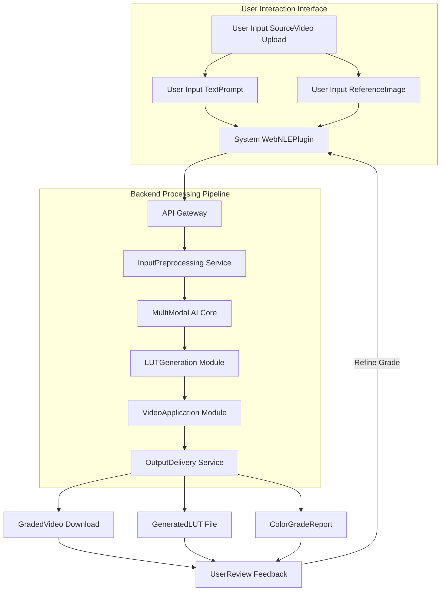
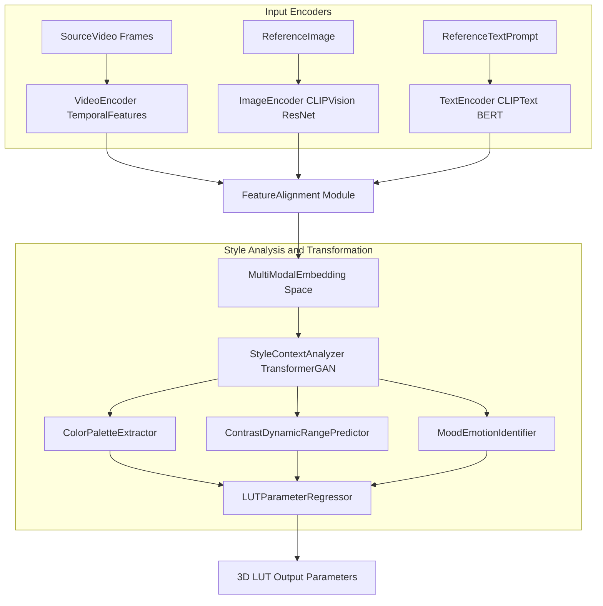
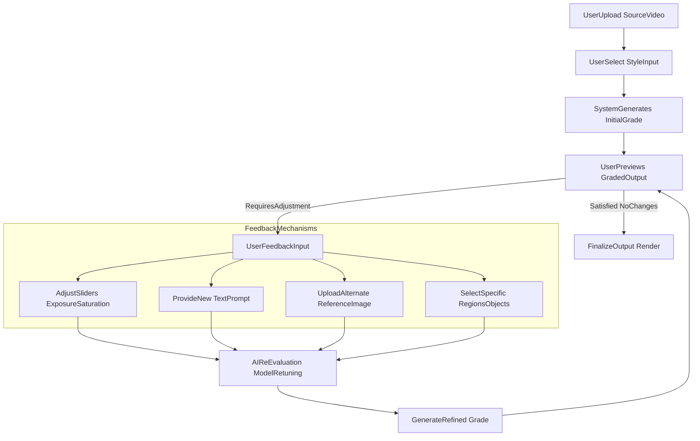

**Title of Invention:** A System and Method for Automated Film and Video Color Grading from a Reference Image or Text Prompt

**Abstract:**
A system for color grading video footage is disclosed. A user provides a raw video clip and a reference for the desired aesthetic. The reference can be a text prompt (e.g., "a warm, nostalgic, summer evening feel") or a still image from another film. The system uses a multi-modal AI model to analyze the style of the reference and apply it to the video clip, automatically adjusting parameters like color temperature, contrast, and saturation to match the desired look.

**Detailed Description:**
A video editor has a raw, flat-colored video clip. They want it to look like the film *Blade Runner*. They upload their clip and a still frame from *Blade Runner*. The system sends both to a multi-modal AI with the prompt, "Apply the color grade and aesthetic of the second image to the first video clip." The AI generates a 3D Look-Up Table (LUT) that represents the color transformation, which is then automatically applied to the editor's video clip.

This invention expands upon this core concept by detailing the multi-modal AI's internal workings and the comprehensive process flow for automated color grading. The system is designed to intelligently interpret abstract aesthetic desires from various input forms and translate them into precise, temporally consistent color transformations for video content.

**1. System Overview**

The automated color grading system integrates several components to process user inputs, analyze aesthetic references, generate color transformations, and apply them to video footage. The core innovation lies in the multi-modal AI's ability to cross-reference visual and textual cues to achieve a desired look, providing a powerful tool for filmmakers and content creators.

**2. Detailed Process Flow for AI Automated Color Grading**

The process begins with user input and proceeds through several stages of AI analysis, transformation, and application, often incorporating user feedback for iterative refinement.

```mermaid
graph LR
    subgraph Initial Input and Preprocessing
        A[User Upload SourceVideo] --> B[VideoPreprocessing Standardization]
        C[User Input StyleReference Text] --> D[TextEmbedding NLPModels]
        E[User Input StyleReference Image] --> F[ImageFeatureExtraction CNNVAE]
    end

    B --> G[TemporalConsistencyAnalysis]
    D --> H[MultiModalStyleInterpreter]
    F --> H

    G --> I[SceneSegmentation ObjectRecognition]
    H --> J[AestheticStyleVector Generation]

    I --> K[ContextAwareAdjustmentModule]
    J --> K

    K --> L[ColorTransformationGenerator DeepLearning]
    L --> M[3D LUT ParameterPrediction]
    M --> N[LUTInterpolation Optimization]

    subgraph Application and Output
        N --> O[LUTApplicationEngine GPUAccelerated]
        O --> P[GradedVideoOutput Render]
        P --> Q[OutputGeneratedLUT File]
        P --> R[OutputColorGradeReport]
    end

    P --> S[UserPreview Adjustment]
    Q --> S
    R --> S
    S -- "Feedback Refinement" --> L
    S -- "Finalize Grade" --> T[Final Delivery]
```

**3. Multi-Modal AI Core Architecture**

The heart of the system is the Multi-Modal AI Core, which understands and translates aesthetic instructions across different data types.

**4. User Interaction and Iterative Refinement**

The system supports a robust user feedback loop, allowing for adjustments and fine-tuning of the AI-generated color grade. This ensures that the final output aligns precisely with the user's vision.

**Claims:**
1. A method for color grading video, comprising:
   a. Receiving a source video clip and a style reference (either a text prompt or an image).
   b. Using a generative AI model to analyze the style reference.
   c. Prompting the model to generate a color transformation based on the analysis.
   d. Applying the color transformation to the source video clip.
2. The method of claim 1, wherein the style reference analysis involves a multi-modal AI model processing both text embeddings and visual features.
3. The method of claim 1, further comprising preprocessing the source video clip to a standardized color space before applying the color transformation.
4. The method of claim 1, wherein the color transformation is represented as a 3D Look-Up Table LUT.
5. The method of claim 4, further comprising generating the 3D LUT using a deep learning model trained to predict color transformations from aesthetic style vectors.
6. The method of claim 1, further comprising a user feedback loop for iterative refinement of the applied color transformation.
7. The method of claim 6, wherein the user feedback includes textual descriptions, slider adjustments, or additional reference images.
8. The method of claim 1, further comprising applying temporal consistency algorithms to ensure smooth color transitions between frames of the graded video clip.
9. A system for automated color grading, comprising:
   a. An input module configured to receive a source video clip and a style reference.
   b. A multi-modal AI core configured to analyze the received style reference and generate an aesthetic style vector.
   c. A color transformation generator configured to create a color transformation based on the aesthetic style vector.
   d. A video application module configured to apply the color transformation to the source video clip.
10. The system of claim 9, wherein the color transformation generator outputs a 3D LUT.
11. The system of claim 9, further comprising a user interface for receiving user inputs and displaying graded video output.
12. The system of claim 9, further comprising a feedback mechanism allowing a user to provide adjustments for iterative refinement of the color grade.