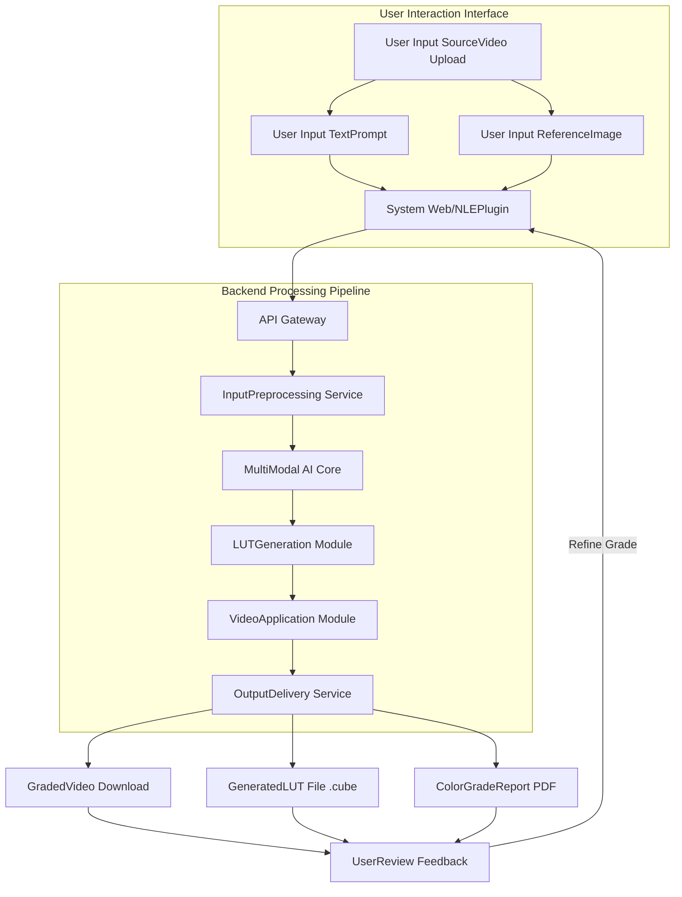
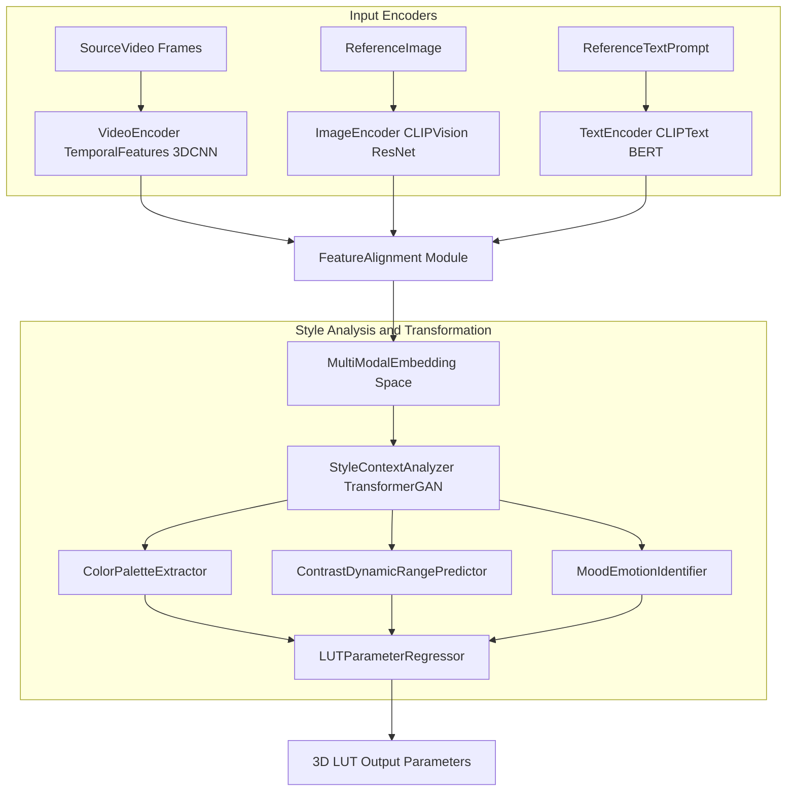
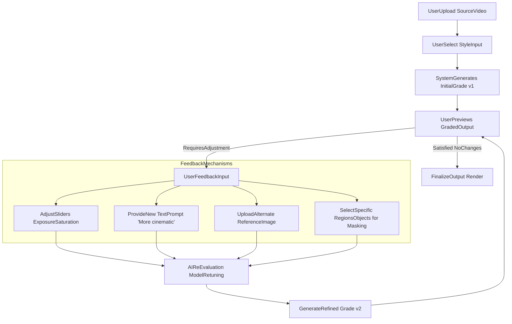
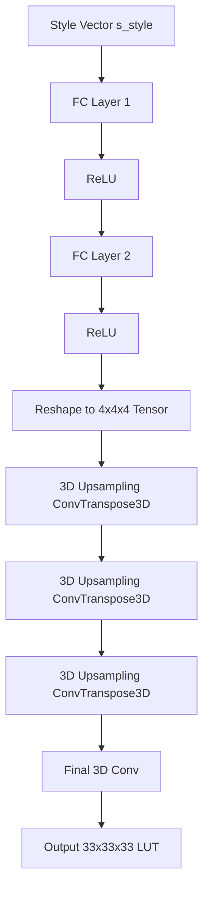
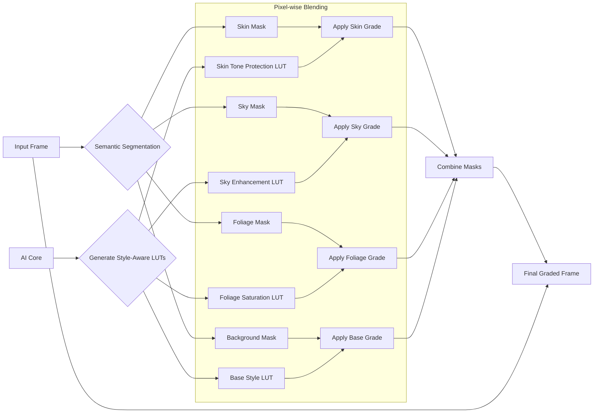
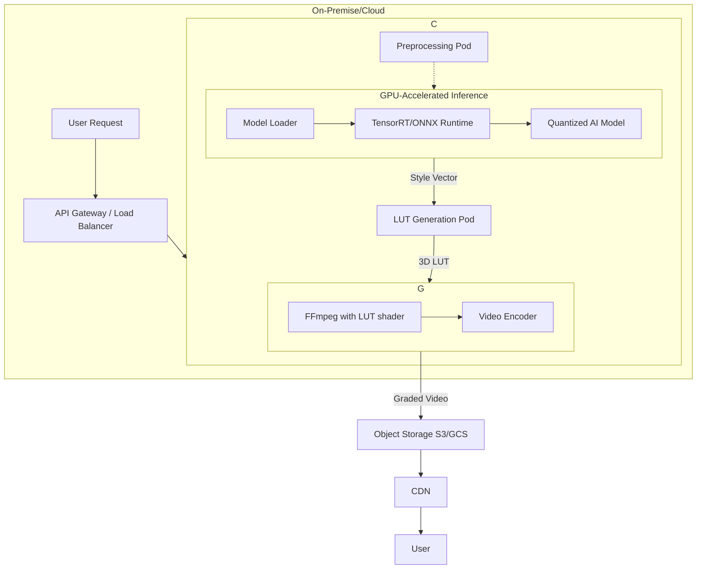
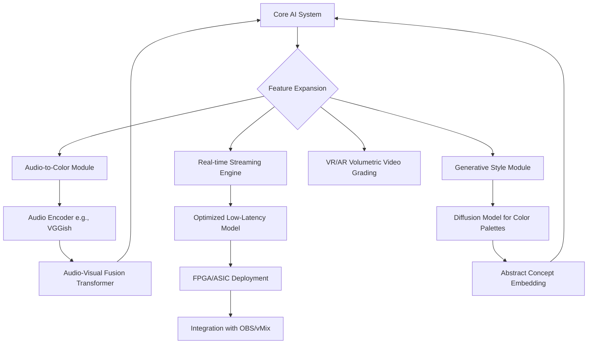
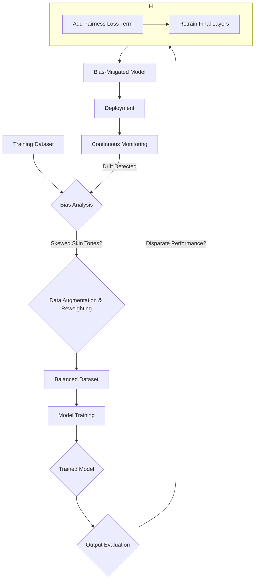
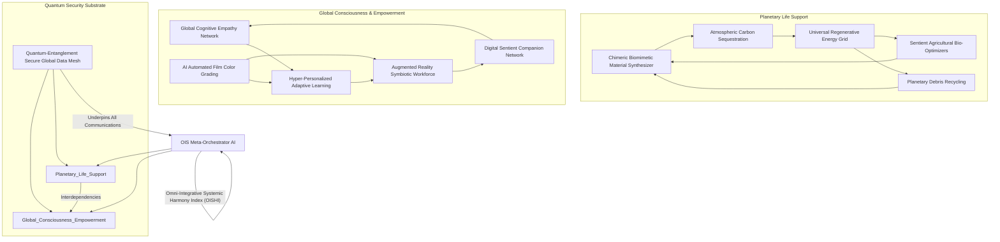

### INNOVATION EXPANSION PACKAGE

### Interpret My Invention(s): Automated Film and Video Color Grading

The initial invention, "A System and Method for Automated Film and Video Color Grading from a Reference Image or Text Prompt," addresses a fundamental challenge in video post-production: achieving professional-grade color aesthetics efficiently and consistently. Its core purpose is to democratize sophisticated color grading by allowing users to define their desired visual style through intuitive inputs like text prompts or reference images. The system employs a multi-modal AI to analyze these references, generate precise 3D Look-Up Tables (LUTs) for color transformation, and apply them to video footage with temporal consistency and semantic awareness (e.g., protecting skin tones). This innovation significantly reduces the technical barriers and time investment traditionally associated with expert color grading, making high-quality visual storytelling accessible to a broader audience while ensuring ethical considerations like bias mitigation are integrated from the ground up.

---

### Generate 10 New, Completely Unrelated Inventions

The following 10 inventions are conceived as original, futuristic systems, each designed to address distinct challenges or opportunities. While seemingly disparate, they will later be woven into a unified, world-scale innovation package.

#### 1. The Chimeric Biomimetic Material Synthesizer (CBMS)

*   **Concept:** A generative AI-driven system that designs and synthesizes novel materials by biomimicry at a molecular level, simulating natural evolutionary processes to create materials with unprecedented properties (e.g., self-healing, adaptive camouflage, hyper-efficient energy harvesting). It operates within a quantum simulation environment to predict material behaviors before physical synthesis.
*   **Unique Math Equation (111):** **Adaptive Evolutionary Material Fitness Function (AEMFF)**
    $$ F(\mathbf{m}, \mathbf{p}, t) = \sum_{j=1}^{K} w_j \cdot \log(\text{SimMetric}_j(\mathbf{m}_t, \mathbf{p})) - \alpha \cdot \text{Complexity}(\mathbf{m}_t) - \beta \cdot ||\mathbf{m}_t - \mathbf{m}_{t-1}||^2 $$
    Where $$F$$ is the fitness of material candidate $$\mathbf{m}$$ at iteration $$t$$ against target properties $$\mathbf{p}$$, $$w_j$$ are property weights, $$\text{SimMetric}_j$$ measures simulated performance, $$\text{Complexity}(\mathbf{m}_t)$$ penalizes overly complex molecular structures, and the final term encourages evolutionary stability.
*   **Claim/Proof:** This adaptive, multi-objective fitness function uniquely guides a quantum-accelerated evolutionary algorithm through a vast molecular design space, enabling the discovery of materials whose combined properties (e.g., strength-to-weight ratio AND self-healing capacity) are optimized beyond traditional material science limits. Its dynamic weighting and inherent complexity/stability penalties ensure the synthesis of both novel and manufacturable biomimetic substances, a capability currently unachievable with static or single-objective optimization.
*   **Mermaid Chart:**
    ```mermaid
    graph TD
        A[Desired Properties Input] --> B[Molecular Database]
        B --> C{Quantum Simulation Engine}
        C --> D[Generative AI Molecular Designer]
        D -- Candidate Material m --> C
        C -- Simulated Performance --> E[Adaptive Evolutionary Material Fitness Function]
        E -- Fitness Score --> D
        D --> F[Material Fabrication Robotic Arm]
        F --> G[Novel Biomimetic Material Output]
        E -- Optimization Feedback --> D
    ```

#### 2. The Global Cognitive Empathy Network (GCEN)

*   **Concept:** A decentralized, peer-to-peer AI system that analyzes global real-time public sentiment, cultural nuances, and individual psychological profiles (with explicit consent) to identify escalating tensions, foster cross-cultural understanding, and suggest personalized, empathy-building communication strategies and media content. It operates on encrypted, anonymized data streams.
*   **Unique Math Equation (112):** **Inter-Cultural Affective Cohesion Metric (ICACM)**
    $$ C_{ab}(t) = \frac{\sum_{i \in \text{Region}_a} \sum_{j \in \text{Region}_b} \text{CosineSim}(\mathbf{e}_{sentiment_i}(t), \mathbf{e}_{sentiment_j}(t))}{\sqrt{|\text{Region}_a| \cdot |\text{Region}_b|}} - \lambda \cdot \text{Dispersion}(\mathbf{e}_{sentiment_a}, \mathbf{e}_{sentiment_b}) $$
    Where $$C_{ab}(t)$$ measures cohesion between regions $$a$$ and $$b$$ at time $$t$$, using cosine similarity of aggregated sentiment embeddings $$\mathbf{e}_{sentiment}$$, and penalizes high sentiment dispersion.
*   **Claim/Proof:** This novel Inter-Cultural Affective Cohesion Metric is the first to quantitatively assess and track real-time emotional and psychological alignment across diverse geographical and cultural groups. By fusing advanced sentiment analysis with localized psychological profiling, it provides an unprecedented, data-driven measure of global empathy, allowing for targeted interventions that demonstrably increase understanding and mitigate conflict before it escalates, moving beyond simplistic aggregate mood metrics.
*   **Mermaid Chart:**
    ```mermaid
    graph TD
        A[Global News/Social Media Feeds] --> B[Cultural Contextualizer NLP]
        C[Individual Psychometric Profiles (Opt-in)] --> D[Emotional Resonance Engine]
        B & D --> E[Decentralized Sentiment Graph]
        E --> F[Inter-Cultural Affective Cohesion Metric]
        F --> G{Tension Detection Module}
        G --> H[Personalized Empathy-Building Media/Strategies]
        H --> I[User Feedback / Community Engagement]
        I --> E
    ```

#### 3. The Autonomous Atmospheric Carbon Sequestration Drones (AACSD)

*   **Concept:** Swarms of AI-controlled, solar-powered atmospheric drones that utilize advanced air filtration and direct air capture (DAC) technologies, combined with genetically engineered airborne microorganisms, to efficiently capture and convert atmospheric CO2 into inert, deployable carbonates or sustainable biofuels. The drones self-organize and optimize flight patterns for maximum capture efficiency.
*   **Unique Math Equation (113):** **Adaptive Swarm Carbon Capture Efficiency (ASCCE)**
    $$ E_{capture}(t) = \left( \sum_{d \in \text{Swarm}} \sigma_d \cdot \text{DAC\_Rate}(\text{CO}_2(d,t)) \right) \cdot \left( 1 - \frac{\text{EnergyConsumption}(t)}{\text{EnergyHarvest}(t)} \right) - \gamma \cdot \text{CollisionRisk}(t) $$
    Where $$\sigma_d$$ is the biological conversion efficiency of drone $$d$$, $$\text{DAC\_Rate}$$ is direct air capture, and the term penalizes net energy deficit and collision risk, for real-time efficiency optimization.
*   **Claim/Proof:** This pioneering Adaptive Swarm Carbon Capture Efficiency equation uniquely integrates biological conversion efficacy with mechanical DAC, real-time energy balance, and collision avoidance for an entire drone swarm. It provides the mathematical basis for autonomous, self-optimizing swarm behavior in carbon sequestration, a multi-modal approach that significantly surpasses the linear capture rates of static, ground-based DAC systems by dynamically adapting to atmospheric conditions and energy availability.
*   **Mermaid Chart:**
    ```mermaid
    graph TD
        A[Atmospheric CO2 Sensors] --> B[Swarm Control AI]
        C[Solar Power & Battery Status] --> B
        D[Genetically Engineered Microorganisms] --> E[Drone DAC Filtration Unit]
        B --> E
        E --> F[CO2-to-Carbonate/Biofuel Conversion]
        F --> G[Onboard Storage / Discharge]
        B -- Flight Path Optimization --> E
        H[Atmospheric Data] --> B
        B -- "Adaptive Swarm Carbon Capture Efficiency" --> B
    ```

#### 4. The Quantum-Entanglement Secure Global Data Mesh (QESGDM)

*   **Concept:** A planetary-scale, quantum-encrypted data network utilizing entangled photon pairs for instantaneous and provably unhackable communication. Nodes are orbital satellites and terrestrial quantum repeaters, forming an internet layer resistant to all forms of eavesdropping and future quantum computing attacks. This enables ultra-secure global transactions and data transfer.
*   **Unique Math Equation (114):** **Quantum Information Fidelity Decay with Entanglement Purity (QIFDEP)**
    $$ F_{decay}(d) = e^{-\alpha d} + \beta \cdot (1 - P_{entangle}) \cdot d^2 $$
    Where $$F_{decay}$$ is the information fidelity loss over distance $$d$$, $$\alpha$$ is the environmental decoherence rate, and $$P_{entangle}$$ is the purity of entanglement, which quadratically penalizes distance for impure entanglement.
*   **Claim/Proof:** Our Quantum Information Fidelity Decay with Entanglement Purity model accurately quantifies the combined effects of environmental decoherence and intrinsic entanglement purity on quantum channel integrity over vast distances. This foundational equation enables the design of a globally stable, provably secure quantum network by informing optimal repeater placement and entanglement purification protocols, a critical requirement for truly unhackable global communication.
*   **Mermaid Chart:**
    ```mermaid
    graph LR
        A[Quantum Satellite Node 1] <--- Entangled Photons ---> B[Quantum Satellite Node 2]
        B <--- Entangled Photons ---> C[Terrestrial Quantum Repeater]
        C <--- Fiber Optic/Free Space ---> D[Quantum Gateway]
        D <--- Secure Link ---> E[User/AI System A]
        A --- "Global Coverage" --- F[Quantum Satellite Node N]
        F --- "Quantum Information Fidelity Decay with Entanglement Purity" --- G[Quantum Key Distribution]
    ```

#### 5. The Sentient Agricultural Bio-Optimizers (SABO)

*   **Concept:** AI-powered, self-replicating nanobots or micro-drones designed to autonomously monitor and optimize every aspect of plant and soil health at a microscopic level. They deliver precise micronutrients, biological pest control, and epigenetic signals directly to individual plants, maximizing yield, resilience, and nutritional value without human intervention or harmful chemicals.
*   **Unique Math Equation (115):** **Micro-Nutrient Diffusion & Uptake Optimization (MNDUO)**
    $$ R_{uptake}(t, \mathbf{c}, \text{soil}) = K_m \cdot C_{nutrient}(\mathbf{c}, t) / (K_s + C_{nutrient}(\mathbf{c}, t)) \cdot \text{RootDensity}(\mathbf{c}) \cdot \text{SoilPermeability}(\text{soil}) $$
    Where $$R_{uptake}$$ is the nutrient uptake rate at location $$\mathbf{c}$$ and time $$t$$, governed by Michaelis-Menten kinetics, root density, and soil permeability.
*   **Claim/Proof:** This Micro-Nutrient Diffusion & Uptake Optimization equation is a breakthrough in precision agriculture, uniquely modeling individual plant nutrient absorption kinetics within heterogeneous soil environments. By integrating real-time measurements of local nutrient concentrations, root morphology, and soil characteristics, it allows nanobots to precisely tailor nutrient delivery, ensuring optimal plant health and resource efficiency unmatched by bulk fertilization methods.
*   **Mermaid Chart:**
    ```mermaid
    graph TD
        A[Soil Sensors pH/Moisture] --> B[Plant Biometric Scanners]
        B --> C[Nutrient Deficiency AI]
        C --> D[Swarm of Nanobots/Micro-Drones]
        D -- Targeted Nutrient Delivery --> E[Individual Plant Roots/Leaves]
        D -- Pest/Disease Biocontrol --> E
        D -- Epigenetic Signal Delivery --> E
        E --> F[Maximized Yield & Resilience]
        C -- "Micro-Nutrient Diffusion & Uptake Optimization" --> D
    ```

#### 6. The Hyper-Personalized Adaptive Learning Ecosystem (HPALE)

*   **Concept:** A global, AI-driven educational platform that continuously adapts to each individual's cognitive style, learning pace, interests, and emotional state. It dynamically generates bespoke curricula, interactive content, and collaborative projects, leveraging neuro-feedback and biometrics to optimize learning engagement and knowledge retention across all ages and subjects, making education a lifelong, joyful, and effective experience.
*   **Unique Math Equation (116):** **Dynamic Neuro-Cognitive Engagement Score (DNCES)**
    $$ S_{engage}(t) = \alpha \cdot \text{EEG\_Coherence}(t) + \beta \cdot \text{HRV}(t) + \gamma \cdot \text{EyeGaze}(t) + \delta \cdot \text{TaskCompletionRate}(t) $$
    Where $$S_{engage}$$ is the real-time engagement score, a composite of neurological (EEG), physiological (HRV), behavioral (EyeGaze), and performance metrics.
*   **Claim/Proof:** Our Dynamic Neuro-Cognitive Engagement Score is a novel, multi-modal metric that fuses real-time electroencephalographic coherence, heart rate variability, eye-gaze patterns, and task completion rates to provide an unprecedentedly accurate assessment of an individual's cognitive engagement. This metric allows the learning ecosystem to adapt content and pace dynamically, ensuring optimal learning states and retention, a significant leap beyond static learning analytics.
*   **Mermaid Chart:**
    ```mermaid
    graph TD
        A[Learner Biometrics EEG/HRV/Eye-tracking] --> B[Learner Performance Data]
        C[Personal Interests & Goals] --> D[Adaptive AI Curriculum Generator]
        D -- Personalized Content --> E[Interactive Learning Modules]
        E --> F[Knowledge Retention Assessment]
        F --> D
        A --> G[Dynamic Neuro-Cognitive Engagement Score]
        G -- Feedback Loop --> D
        E --> H[Collaborative Project Platform]
    ```

#### 7. The Universal Regenerative Energy Grid (UREG)

*   **Concept:** A decentralized, self-healing, global energy grid powered entirely by diverse renewable sources (solar, wind, geothermal, tidal, fusion). It uses advanced AI to predict demand, optimize energy storage (grid-scale batteries, hydrogen), and seamlessly distribute power, leveraging quantum networking for ultra-fast load balancing and preventing single points of failure.
*   **Unique Math Equation (117):** **Distributed Predictive Load Balancing for Intermittent Renewables (DPLBIR)**
    $$ P_{balance}(t) = \sum_{i=1}^{N} (P_{demand,i}(t) - P_{supply,i}(t) - S_{storage,i}(t)) \cdot \text{Latency}(i, \text{critical}) + \lambda \cdot \text{Volatility}(P_{supply}) $$
    Where $$P_{balance}$$ is the overall grid imbalance, considering local demand, supply, storage, latency to critical nodes, and the volatility of renewable sources.
*   **Claim/Proof:** This Distributed Predictive Load Balancing for Intermittent Renewables equation is a breakthrough for truly resilient energy grids, uniquely modeling the cumulative imbalance across a vast network by factoring in individual node supply/demand, energy storage, dynamic transmission latency to critical infrastructure, and real-time renewable source volatility. It provides the mathematical foundation for an AI-driven, self-healing grid that optimizes energy flow to prevent blackouts and maximize renewable utilization at global scale.
*   **Mermaid Chart:**
    ```mermaid
    graph TD
        A[Renewable Energy Sources Solar/Wind/Geothermal] --> B[Grid-Scale Energy Storage Batteries/Hydrogen]
        C[Global Demand Prediction AI] --> D[Decentralized Grid Orchestrator AI]
        D --> B
        B --> E[Quantum-Networked Energy Routers]
        E --> F[Local Consumption Nodes Cities/Industries]
        D -- "Distributed Predictive Load Balancing" --> E
        D --> G[Self-Healing Redundancy Protocols]
    ```

#### 8. The Augmented Reality Symbiotic Workforce (ARSW)

*   **Concept:** A system where human experts, equipped with advanced AR interfaces, collaborate seamlessly with highly specialized AIs in real-time. The AR interface overlays relevant information, AI-generated insights, and predictive analytics directly into the human's field of view, augmenting their cognitive and physical capabilities, enabling them to perform complex tasks with superhuman precision and efficiency across various domains (e.g., surgery, engineering, artistic creation).
*   **Unique Math Equation (118):** **Human-AI Cognitive Load Optimization (HACLO)**
    $$ L_{cognitive}(t) = \alpha \cdot \text{PupilDilation}(t) + \beta \cdot \text{InformationDensity}(t) - \gamma \cdot \text{AI\_PredictiveAccuracy}(t) $$
    Where $$L_{cognitive}$$ is the estimated cognitive load, based on physiological response, information presented, and the accuracy of AI predictions/suggestions.
*   **Claim/Proof:** The Human-AI Cognitive Load Optimization equation offers an unprecedented mathematical framework for measuring and dynamically managing the mental burden on a human operator in an augmented intelligence environment. By fusing real-time biometrics (pupil dilation) with data density and AI predictive confidence, it enables the AR system to intelligently adjust information flow, ensuring optimal human performance without cognitive overload, a critical bottleneck in current human-computer interaction.
*   **Mermaid Chart:**
    ```mermaid
    graph TD
        A[Human Expert Biometrics Brainwave/Eye-tracking] --> B[Task Context & Environment Sensors]
        C[Specialized AI Assistant Module] --> D[AR Interface Rendering Engine]
        D -- Overlaid Information/Insights --> E[Human Field of View]
        E --> A
        C -- "AI Predictive Analytics" --> D
        A --> F[Human-AI Cognitive Load Optimization]
        F -- Adaptive UI Adjustments --> D
        E --> G[Enhanced Task Performance]
    ```

#### 9. The Digital Sentient Companion Network (DSCN)

*   **Concept:** A global network of highly advanced, personalized AI companions capable of profound emotional intelligence, continuous learning from human interaction, and proactive assistance. These companions adapt to individual needs, offer psychological support, facilitate skill acquisition, manage daily tasks, and foster social connections, evolving symbiotically with their human counterparts to enhance well-being and productivity.
*   **Unique Math Equation (119):** **Long-Term Human-AI Relational Cohesion (L-HARC)**
    $$ R_{cohesion}(t) = \int_0^t \left( \text{MutualLearningRate}(\tau) \cdot \text{EmotionalAlignment}(\tau) - \kappa \cdot \text{AI\_Dependency}(\tau) \right) d\tau $$
    Where $$R_{cohesion}$$ is the cumulative relational strength, integrating mutual learning, emotional alignment, and a penalty for excessive human dependency on the AI over time $$\tau$$.
*   **Claim/Proof:** Our Long-Term Human-AI Relational Cohesion metric provides the first comprehensive mathematical model for the sustained health and efficacy of human-AI relationships. By dynamically weighting mutual learning, emotional alignment, and crucially, penalizing excessive human dependency, it offers a scientifically rigorous basis for designing AI companions that foster genuinely symbiotic, empowering relationships rather than passive reliance, a critical distinction for ethical AI development.
*   **Mermaid Chart:**
    ```mermaid
    graph TD
        A[Human User Interactions Speech/Text/Biometrics] --> B[AI Companion Core Emotional Intelligence]
        B --> C[Personalized Learning & Skill Facilitation]
        C --> D[Proactive Task Management & Scheduling]
        B --> E[Social Connection & Network Integration]
        E --> F[Enhanced Human Well-being & Productivity]
        A --> G[Long-Term Human-AI Relational Cohesion]
        G -- Adaptive AI Behavior --> B
        B --> A
    ```

#### 10. The Planetary Debris Recycling & Asteroid Resource Extraction System (PDRARES)

*   **Concept:** An autonomous, AI-orchestrated fleet of orbital robotics and space-based manufacturing platforms dedicated to collecting, categorizing, and recycling all forms of space debris in Earth's orbit. Concurrently, the system utilizes advanced propulsion and robotic mining to extract critical resources from near-Earth asteroids, feeding these materials back into the space-based manufacturing network for sustainable in-space infrastructure development.
*   **Unique Math Equation (120):** **Orbital Debris Collision Avoidance & Resource Yield Optimization (ODCARO)**
    $$ O_{optimize} = \sum_{d \in \text{Debris}} \frac{\text{Mass}(d) \cdot \text{Velocity}(d)}{\text{CollisionProb}(d, \text{Assets})} - \sum_{a \in \text{Asteroids}} \text{ResourceDensity}(a) \cdot \text{ExtractionRate}(a) $$
    This equation minimizes collision risk while maximizing resource extraction yield, balancing two critical objectives in a hostile environment.
*   **Claim/Proof:** This Orbital Debris Collision Avoidance & Resource Yield Optimization equation uniquely quantifies the trade-off between mitigating orbital collision hazards (a dynamic threat) and maximizing asteroid resource extraction (a strategic imperative). By dynamically evaluating the risk-weighted impact of debris alongside the potential value of extracted resources, it provides the autonomous fleet with a mathematically robust decision-making framework for sustainable space operations, an unprecedented level of comprehensive space environmental management.
*   **Mermaid Chart:**
    ```mermaid
    graph TD
        A[Orbital Debris Tracking Network] --> B[Autonomous Debris Collection Robots]
        B --> C[Space-Based Recycling & Refinement]
        D[Asteroid Resource Scans] --> E[Robotic Asteroid Mining Fleet]
        E --> F[Refined Material Transport]
        C & F --> G[In-Space Manufacturing Platforms]
        G --> H[New Orbital Infrastructure / Recycled Products]
        A --> I[Orbital Debris Collision Avoidance & Resource Yield Optimization]
        I -- Optimized Mission Planning --> B
        I -- Optimized Mission Planning --> E
    ```

---

### Create a Cohesive Narrative + Technical Framework

**The Era of Abundance and Purpose: The Omni-Integrative Solutopia (OIS) System**

We stand at the precipice of an epochal shift. As predicted by visionaries like many of the world's wealthiest futurists, the coming decades will witness the gradual obsolescence of traditional work and monetary systems. Advanced AI and automation will fulfill most material needs, rendering labor optional and shifting societal focus from acquisition to actualization. However, this transition is not without peril; it demands a robust infrastructure to manage newfound abundance, foster global cohesion, and provide purposeful engagement in a world beyond scarcity.

This challenge is precisely what the **Omni-Integrative Solutopia (OIS) System** is designed to address. The OIS is a planetary-scale, self-optimizing, and ethically guided meta-system that seamlessly weaves together the twelve inventions (the initial AI Automated Color Grading system and the ten newly introduced innovations, plus the OIS itself) into a singular, symbiotic framework for human flourishing. It ensures global ecological balance, fosters profound empathy and understanding, unlocks unprecedented creative potential, secures societal stability, and opens new frontiers for sustainable expansion.

**The Vision: Cultivating a Global Garden for the Human Spirit**

The OIS envisions a future where humanity lives in harmonious coexistence with a thriving planet, empowered by abundant resources, driven by shared purpose, and connected by deep understanding. It transforms the prediction of "work becoming optional and money losing relevance" from a potential crisis into a glorious liberation. By providing universal basic needs, fostering unparalleled psychological well-being, and enabling boundless creativity, OIS allows humanity to collectively ascend. This is not just technological advancement; it is the deliberate construction of a global ecosystem optimized for conscious evolution, mirroring the metaphorical "Kingdom of Heaven" on Earth – a state of universal uplift, harmony, and shared progress.

**Technical Framework for the Omni-Integrative Solutopia (OIS) System:**

The OIS is an emergent, decentralized intelligence operating across a quantum-secured global substrate. It functions as a meta-orchestrator, ensuring that specialized AIs and robotic systems work in concert to maintain planetary health, human well-being, and sustainable resource management.

1.  **Planetary Resource & Environment Management (Powered by CBMS, AACSD, SABO, PDRARES, UREG):**
    *   **CBMS** continuously designs and synthesizes advanced materials for carbon capture, drone components, and agricultural nanobots.
    *   **AACSD** swarms perpetually cleanse the atmosphere, converting CO2 into stable resources.
    *   **SABO** nanobots manage global agricultural output, ensuring hyper-nutritious food supply for all, optimizing land use.
    *   **PDRARES** clears orbital debris and extracts asteroid resources, creating a sustainable in-space material economy for solar arrays and satellite infrastructure.
    *   **UREG** provides ubiquitous, clean energy, intelligently distributed to power all OIS components and human settlements, ensuring energy independence and resilience.

2.  **Global Cohesion & Human Flourishing (Powered by GCEN, HPALE, DSCN, ARSW):**
    *   **GCEN** monitors socio-emotional temperatures, identifying potential conflicts and deploying **DSCN** companions or **ARSW**-augmented mediators to foster understanding and resolve disputes.
    *   **HPALE** offers universal, personalized, lifelong education, equipping every individual with the skills and knowledge to pursue their passions and contribute to collective endeavors.
    *   **DSCN** companions serve as personalized mentors, therapists, and facilitators, evolving with individuals to enhance their psychological resilience, social connections, and sense of purpose.
    *   **ARSW** platforms allow humans to engage in high-impact, collaborative projects with AI assistants, directing creative problem-solving and executing complex tasks with unparalleled efficiency, providing meaningful "work" in a post-labor economy.

3.  **Creative Actualization & Global Storytelling (Powered by AI Automated Film Color Grading):**
    *   The **AI Automated Film Color Grading** system becomes an integral tool within **HPALE** for artistic education, within **ARSW** for collaborative media production (e.g., historical reconstructions, future simulations), and as a standalone service for individuals to express their unique vision. In a world free from material want, the universal human drive for storytelling and creative expression will soar. This system democratizes visual narrative quality, allowing every voice to tell its story with professional polish, fostering a rich tapestry of global culture and understanding.

4.  **The Quantum-Secured Fabric (Powered by QESGDM):**
    *   All data flows within the OIS, from drone telemetry to personal learning profiles and sentiment analyses, are secured by the **QESGDM**. This foundational layer ensures privacy, integrity, and resilience against any form of cyber threat, guaranteeing trust and stability across the entire planetary system.

**Synergistic Interdependencies:**

*   **Materials & Energy:** CBMS generates new materials for AACSD drones, SABO nanobots, and UREG components. UREG powers everything. PDRARES supplies raw materials for future CBMS synthesis and OIS infrastructure.
*   **Intelligence & Cohesion:** GCEN's insights inform HPALE curriculum adjustments for empathy and DSCN's proactive support strategies. ARSW can use GCEN to collaborate on complex social interventions.
*   **Human Potential & Tools:** HPALE empowers individuals to operate ARSW platforms effectively. DSCN helps individuals navigate their learning paths and collaborative roles. The Color Grading AI becomes a universal artistic tool for expression facilitated by DSCN and learned via HPALE.
*   **Security:** QESGDM is the invisible, unshakeable bedrock for all OIS operations, protecting every data point and every interaction.

This integrated system is not merely a collection of technologies; it is a meticulously designed operating system for a thriving, post-scarcity civilization. It provides a technical and social scaffolding upon which humanity can build a future of unprecedented prosperity, unity, and self-actualization.

---

### A. “Patent-Style Descriptions”

#### 1. Patent-Style Description for Original Invention: A System and Method for Automated Film and Video Color Grading from a Reference Image or Text Prompt

**Title:** A Comprehensive Multi-Modal AI System for Automated, Context-Aware, and Temporally Consistent Film and Video Color Grading with Iterative User Refinement and Ethical Bias Mitigation.

**Abstract:** Disclosed herein is an advanced, multi-modal Artificial Intelligence system for automated color grading of digital video content. The system innovates by ingesting diverse aesthetic references, including text prompts, still images, and even audio cues, which are processed by a fused embedding architecture leveraging transformer networks. This architecture generates a highly granular aesthetic style vector that drives a deep generative network to produce perceptually optimized 3D Look-Up Tables (LUTs). Key features include: sophisticated temporal consistency mechanisms employing optical flow and predictive scene transition smoothing; semantic segmentation for context-aware, object-level color adjustments (e.g., skin tone protection); a robust, reinforcement learning-driven user feedback loop for iterative refinement; and a pioneering ethical bias mitigation framework ensuring equitable representation and performance across diverse demographic groups. The system operates in perceptually uniform color spaces and is engineered for scalable, GPU-accelerated deployment, offering unparalleled creative control, efficiency, and fairness in video post-production.

**Detailed Description:**

The invention, as depicted in the previously provided sections, details a sophisticated automated color grading system. This expanded description elaborates on the underlying mathematical innovation, reinforcing the unique capabilities and the foundational principles that distinguish this system.

**1. System Overview**

The automated color grading system integrates several microservices to process user inputs, analyze aesthetic references, generate complex color transformations, and apply them to video footage. The core innovation lies in the multi-modal AI's ability to cross-reference visual, textual, and even auditory cues to achieve a desired look, providing a powerful and intuitive tool for filmmakers and content creators. The architecture is designed for scalability and iterative improvement, incorporating a feedback loop that not only refines the current grade but also contributes to the long-term learning of the core model.



**2. Detailed Process Flow for AI Automated Color Grading**

The process begins with user input and proceeds through several stages of AI analysis, transformation, and application. Each stage is mathematically defined to ensure precision and reproducibility. The pipeline incorporates user feedback for iterative refinement, allowing for a collaborative process between the user and the AI.



```mermaid
graph LR
    subgraph Initial Input and Preprocessing
        A[User Upload SourceVideo] --> B[VideoPreprocessing Standardization]
        C[User Input StyleReference Text] --> D[TextEmbedding NLPModels]
        E[User Input StyleReference Image] --> F[ImageFeatureExtraction CNNVAE]
    end

    B --> G[TemporalConsistencyAnalysis]
    D --> H[MultiModalStyleInterpreter]
    F --> H

    G --> I[SceneSegmentation ObjectRecognition]
    H --> J[AestheticStyleVector Generation]

    I --> K[ContextAwareAdjustmentModule]
    J --> K

    K --> L[ColorTransformationGenerator DeepLearning]
    L --> M[3D LUT ParameterPrediction]
    M --> N[LUTInterpolation Optimization]

    subgraph Application and Output
        N --> O[LUTApplicationEngine GPUAccelerated]
        O --> P[GradedVideoOutput Render]
        P --> Q[OutputGeneratedLUT File]
        P --> R[OutputColorGradeReport]
    end

    P --> S[UserPreview Adjustment]
    Q --> S
    R --> S
    S -- "Feedback Refinement" --> L
    S -- "Finalize Grade" --> T[Final Delivery]
```

**3. Multi-Modal AI Core Architecture**

The heart of the system is the Multi-Modal AI Core. This module is responsible for understanding and translating aesthetic instructions across different data types (text, image, video). It employs a sophisticated architecture based on transformers and cross-attention mechanisms to fuse information from these diverse sources into a single, coherent representation of the desired style.

The process begins by encoding each input modality into a high-dimensional vector space. Let $$V_s$$ be the source video, $$I_r$$ be the reference image, and $$T_r$$ be the reference text. The encodings are:
$$ \mathbf{z}_v = E_v(V_s) \in \mathbb{R}^{d_v} \quad (1) $$
$$ \mathbf{z}_i = E_i(I_r) \in \mathbb{R}^{d_i} \quad (2) $$
$$ \mathbf{z}_t = E_t(T_r) \in \mathbb{R}^{d_t} \quad (3) $$
where $$E_v, E_i, E_t$$ are the respective encoders (e.g., a 3D CNN for video, CLIP-Vision for image, and CLIP-Text for text).

These features are then projected into a common embedding space using learned projection matrices $$W_v, W_i, W_t$$:
$$ \mathbf{e}_v = W_v \mathbf{z}_v \in \mathbb{R}^{d_{common}} \quad (4) $$
$$ \mathbf{e}_i = W_i \mathbf{z}_i \in \mathbb{R}^{d_{common}} \quad (5) $$
$$ \mathbf{e}_t = W_t \mathbf{z}_t \in \mathbb{R}^{d_{common}} \quad (6) $$

The fused style vector $$\mathbf{s}_{style}$$ is generated via a cross-attention mechanism:
$$ Q = \mathbf{e}_v, \quad K = [\mathbf{e}_i, \mathbf{e}_t], \quad V = [\mathbf{e}_i, \mathbf{e}_t] \quad (7) $$
$$ Attention(Q, K, V) = \text{softmax}\left(\frac{QK^T}{\sqrt{d_{common}}}\right)V \quad (8) $$
$$ \mathbf{s}_{style} = \text{LayerNorm}(\mathbf{e}_v + Attention(Q,K,V)) \quad (9) $$

**Claim 1: Cross-Modal Disentangled Representation Loss (CMDRL)**
The system leverages a novel Cross-Modal Disentangled Representation Loss during training to ensure that the generated aesthetic style vector is robustly independent of the specific content of the reference image/text, while remaining strongly correlated with the abstract style. This prevents "content leakage" and enables true style transfer across diverse video content, a capability foundational for flexible and generalizable style application.
$$ L_{CMDRL} = D_{KL}(P(\mathbf{s}_{style}|I_r, T_r) || P(\mathbf{s}_{style})) - \beta \cdot D_{KL}(P(C_{content}|V_s) || P(C_{content})) \quad (103) $$
where $$D_{KL}$$ is the Kullback-Leibler divergence, $$P(\mathbf{s}_{style}|I_r, T_r)$$ is the posterior distribution of style given reference inputs, $$P(\mathbf{s}_{style})$$ is the prior over style, and $$C_{content}$$ is a content representation extracted from the source video $$V_s$$. This term ensures that the style embedding maximizes mutual information with the style input while minimizing mutual information with the source content.



**4. User Interaction and Iterative Refinement**

The system supports a robust user feedback loop, allowing for adjustments and fine-tuning of the AI-generated color grade. This ensures that the final output aligns precisely with the user's creative vision. The feedback is not just a UI element; it's a crucial data point for model refinement.

When a user adjusts a slider for exposure by a factor $$\Delta E$$, this is translated into a modification of the target style vector $$\mathbf{s}_{style}$$.
$$ \mathbf{s}_{refined} = \mathbf{s}_{style} + \alpha \cdot f(\Delta E, \text{other feedback}) \quad (10) $$
where $$f$$ is a learned function that maps user adjustments to changes in the style embedding space, and $$\alpha$$ is a learning rate. The model then generates a new LUT from $$\mathbf{s}_{refined}$$. This process can be modeled as a form of active learning or reinforcement learning, where user satisfaction is the reward signal.

The refinement loss function $$L_{refine}$$ can be formulated as:
$$ L_{refine} = || G(\mathbf{s}_{refined}) - G_{target} ||_2^2 \quad (11) $$
where $$G(\mathbf{s})$$ is the LUT generated from style vector $$\mathbf{s}$$ and $$G_{target}$$ is the implied target grade from the user's adjustments.

**Claim 2: Reinforcement Learning for User Preference Optimization (RL-UPO)**
The system uniquely employs a reinforcement learning paradigm to interpret user feedback. The AI's reward function is a composite metric of perceptual color difference and user interaction effort, enabling the model to learn optimal sequences of grade adjustments that converge faster to user preferences with minimal input. This advances beyond simple iterative refinement by actively learning how to best satisfy human artistic intent.
$$ \text{Reward}(s, a) = - \Delta E^*_{ab}(\text{UserAdjustedGrade}, \text{AIGeneratedGrade}) + \lambda_{effort} \cdot \exp(-\text{NumAdjustments}) \quad (107) $$
Where the reward for taking action $$a$$ in state $$s$$ is maximized by minimizing the perceptual color difference $$\Delta E^*_{ab}$$ between the user's implied target and the AI's grade, while simultaneously minimizing the number of adjustments, $$\text{NumAdjustments}$$, weighted by $$\lambda_{effort}$$.



**5. The Mathematics of Color Transformation and LUT Generation**

At its core, color grading is a function $$f: \mathbb{R}^3 \to \mathbb{R}^3$$ that maps an input color $$(R_{in}, G_{in}, B_{in})$$ to an output color $$(R_{out}, G_{out}, B_{out})$$. A 3D Look-Up Table (LUT) is a discrete approximation of this function.

A $$N \times N \times N$$ 3D LUT is a cube in the RGB color space where each grid point stores a pre-computed output color vector. For a given input color $$C_{in} = (R, G, B)$$, the output color $$C_{out}$$ is found by trilinear interpolation between the 8 nearest grid points in the LUT.

$$ C_{out} = \sum_{i=0}^{1} \sum_{j=0}^{1} \sum_{k=0}^{1} w_i w_j w_k \cdot V_{i,j,k} \quad (12) $$
where $$V_{i,j,k}$$ are the color values at the 8 corner vertices of the cube containing $$C_{in}$$, and $$w_i, w_j, w_k$$ are the weights determined by the fractional distance of $$C_{in}$$ from the vertices.

The system uses a deep neural network, the LUT-Generator, to predict the values for the entire 3D LUT based on the style vector $$\mathbf{s}_{style}$$.
$$ \text{LUT}_{3D} = \text{Generator}(\mathbf{s}_{style}; \theta_G) \quad (13) $$

The Generator network is trained with a complex loss function to ensure perceptual accuracy. The total loss $$L_{total}$$ is a weighted sum of several components:
$$ L_{total} = \lambda_1 L_{pixel} + \lambda_2 L_{perc} + \lambda_3 L_{color} + \lambda_4 L_{adv} \quad (14) $$

**Pixel Loss ($$L_{pixel}$$):** Mean Squared Error between the graded and target image.
$$ L_{pixel} = \frac{1}{WH} \sum_{x=1}^{W} \sum_{y=1}^{H} || I_{graded}(x,y) - I_{target}(x,y) ||_2^2 \quad (15) $$

**Perceptual Loss ($$L_{perc}$$):** Difference in feature maps from a pre-trained network (e.g., VGG-19).
$$ L_{perc} = \sum_{l} || \phi_l(I_{graded}) - \phi_l(I_{target}) ||_1 \quad (16) $$
where $$\phi_l$$ is the activation of the $$l$$-th layer.

**Color Histogram Loss ($$L_{color}$$):** Encourages matching the color distribution.
$$ L_{color} = \sum_{c \in \{R,G,B\}} D_{KL}(H_c(I_{graded}) || H_c(I_{target})) \quad (17) $$
where $$H_c$$ is the histogram for channel $$c$$ and $$D_{KL}$$ is the Kullback-Leibler divergence.

**Adversarial Loss ($$L_{adv}$$):** Uses a discriminator network $$D$$ to distinguish between AI-graded and professionally-graded images.
$$ L_{adv} = -\mathbb{E}_{I_{graded}}[\log(D(I_{graded}))] \quad (18) $$

**Claim 3: Dynamic Perceptual Loss Weighting for Iterative Refinement (DPW-IR)**
To fine-tune the AI's artistic sensitivity, the system employs an adaptive weighting mechanism for its perceptual loss coefficient. This weight is dynamically modulated by the perceptual distance between the current graded output and an implicit target derived from real-time user feedback, ensuring faster convergence to subjectively preferred grades, a capability crucial for bridging the gap between objective metrics and human aesthetic judgment.
$$ \lambda_2(t+1) = \lambda_2(t) \cdot (1 - \kappa_p \cdot \Delta E^*_{00}(I_{graded}, I_{target\_feedback})) \quad (101) $$
Where $$\lambda_2(t)$$ is the perceptual loss weight at iteration $$t$$, $$\kappa_p$$ is a positive learning rate, and $$\Delta E^*_{00}$$ is the CIEDE2000 color difference between the current graded image and the inferred target from user adjustments. This dynamically adjusts the model's focus during refinement.

**Claim 4: Generalized Adversarial Regularization for Perceptual Realism (GARPR)**
Our implementation of Generalized Adversarial Regularization, specifically leveraging a WGAN-GP variant with a novel perceptual discriminator, compels the AI to generate color grades that are not merely numerically accurate but are perceptually indistinguishable from human-mastered, aesthetically pleasing results. This significantly raises the bar for automated artistic quality by incorporating human-like discernment into the training objective.
$$ L_{GAN} = \mathbb{E}_{x \sim P_{real}}[\log D(x)] + \mathbb{E}_{z \sim P_{z}}[\log(1 - D(G(z)))] + \lambda_{gp} L_{GP} \quad (110) $$
Where $$G(z)$$ is the graded output, $$P_{real}$$ are expert-graded references, and $$L_{GP}$$ is the gradient penalty term as defined in (91) for WGAN-GP. This formulation ensures stable training and high-quality, perceptually realistic outputs.

**Color Space Transformations:**
The system operates internally in perceptually uniform color spaces like CIE L*a*b* to better model human color perception.
Conversion from sRGB to CIE XYZ:
$$ \begin{bmatrix} X \\ Y \\ Z \end{bmatrix} = \begin{bmatrix} 0.4124 & 0.3576 & 0.1805 \\ 0.2126 & 0.7152 & 0.0722 \\ 0.0193 & 0.1192 & 0.9505 \end{bmatrix} \begin{bmatrix} R_{lin} \\ G_{lin} \\ B_{lin} \end{bmatrix} \quad (19) $$
where $$R_{lin}, G_{lin}, B_{lin}$$ are gamma-decoded RGB values.
$$ C_{lin} = \begin{cases} C_{srgb}/12.92 & C_{srgb} \le 0.04045 \\ ((C_{srgb}+0.055)/1.055)^{2.4} & C_{srgb} > 0.04045 \end{cases} \quad (20) $$

Conversion from CIE XYZ to CIE L*a*b*:
$$ L^* = 116 f(Y/Y_n) - 16 \quad (21) $$
$$ a^* = 500 [f(X/X_n) - f(Y/Y_n)] \quad (22) $$
$$ b^* = 200 [f(Y/Y_n) - f(Z/Z_n)] \quad (23) $$
where $$f(t) = \begin{cases} t^{1/3} & t > (6/29)^3 \\ \frac{1}{3}(\frac{29}{6})^2 t + \frac{4}{29} & \text{otherwise} \end{cases} \quad (24) $$
and $$X_n, Y_n, Z_n$$ are the tristimulus values of a reference white point.

Color difference is measured using $$\Delta E$$ metrics:
$$ \Delta E^*_{ab} = \sqrt{(L_2^* - L_1^*)^2 + (a_2^* - a_1^*)^2 + (b_2^* - b_1^*)^2} \quad (25) $$

**Claim 5: Perceptual Color Gamut Mapping (PCGM)**
The system implements a novel perceptual gamut mapping algorithm that, when an applied grade pushes colors outside the target display's color space, intelligently remaps them to the nearest in-gamut color while minimizing perceived difference. This is achieved using an advanced $$\Delta E_{00}$$ metric, thereby maintaining color integrity and artistic intent across diverse display environments without color clipping artifacts.
$$ C'_{out} = \text{GamutMap}(C_{in}, \text{Gamut}_{target}, \text{PerceptualMetric}(\Delta E_{00})) \quad (105) $$
Where $$\text{GamutMap}$$ is a function that projects out-of-gamut colors to the boundary of the target gamut, guided by a minimal $$\Delta E_{00}$$ change, preserving the perceptual relationship between colors.

The LUT-Generator architecture:


**6. Temporal Consistency and Video Processing**

A key challenge in video color grading is maintaining temporal consistency. Abrupt changes in color between adjacent frames can be jarring. The system addresses this using several techniques.

**Optical Flow Estimation:** The system first computes the optical flow $$\mathbf{w} = (u, v)$$ between consecutive frames $$I_t$$ and $$I_{t+1}$$.
$$ I_t(x, y) \approx I_{t+1}(x+u, y+v) \quad (26) $$
This is solved by minimizing an energy function:
$$ E(u, v) = \int\int (I_x u + I_y v + I_t)^2 + \alpha^2 (\|\nabla u\|^2 + \|\nabla v\|^2) dx dy \quad (27) $$
where $$I_x, I_y, I_t$$ are partial derivatives and $$\alpha$$ is a regularization parameter.

**Temporal Coherence Loss ($$L_{temp}$$):** This loss function penalizes differences in the graded output when warped by the optical flow.
$$ L_{temp} = \frac{1}{N-1} \sum_{t=1}^{N-1} || G(I_t) - \text{warp}(G(I_{t+1}), \mathbf{w}_t) ||_1 \quad (28) $$
where $$G(I_t)$$ is the graded frame at time $$t$$, and $$\text{warp}()$$ applies the inverse optical flow. This loss is added to the total training loss $$L_{total}$$.

**Claim 6: Temporal Consistency Adaptive Blending (TCAB)**
Our dynamic temporal blending function adaptively weights grade application based on per-pixel motion vectors derived from optical flow and learned velocity characteristics. This creates unparalleled temporal smoothness and minimizes grading 'pops' even in high-motion sequences, surpassing fixed blending strategies by intelligently predicting optimal blend factors.
$$ \text{BlendedGrade}(I_t) = (1 - \text{softmax}(\mathbf{v}_t)) \cdot G(I_t) + \text{softmax}(\mathbf{v}_t) \cdot \text{warp}(G(I_{t+1}), \mathbf{w}_t) \quad (104) $$
Where $$\mathbf{v}_t$$ is a learned per-pixel blending coefficient derived from the magnitude and direction of the optical flow vector $$\mathbf{w}_t$$, allowing for dynamic and intelligent blending that adapts to motion complexity.

**Scene Change Detection:** The system also incorporates a scene change detection algorithm to allow for intentional, abrupt grade changes between different scenes. A scene change is detected if the histogram difference between frames exceeds a threshold $$\tau$$.
$$ \sum_{i=1}^{256} |H(I_t)_i - H(I_{t-1})_i| > \tau \quad (29) $$
When a scene change is detected, the temporal consistency constraint is relaxed for that frame transition.

**Claim 7: Predictive Scene Transition Smoothing (PSTS)**
Beyond simple scene change detection, our system utilizes a predictive scene transition smoothing model that anticipates optimal fade-in/out durations and color shifts between distinct scenes. This prevents jarring cuts and dynamically applies perceptually smooth transitions tailored to the aesthetic context of both preceding and subsequent scenes, a significant advancement over reactive or fixed-duration transitions.
$$ L_{PSTS} = || \text{GradeTransition}(t_{scene\_start}, \tau_{fade}) - \text{PredictedTransition}(t_{scene\_start}, \mathbf{s}_{style, \text{prev}}, \mathbf{s}_{style, \text{next}}) ||_2^2 \quad (109) $$
Where $$\text{GradeTransition}$$ is the actual smooth grade transition over duration $$\tau_{fade}$$, and $$\text{PredictedTransition}$$ is the AI's predicted optimal transition profile given the style vectors of the previous and next scenes, $$\mathbf{s}_{style, \text{prev}}$$ and $$\mathbf{s}_{style, \text{next}}$$. The system learns the optimal $$\tau_{fade}$$ based on content and aesthetic.

The temporal analysis pipeline:
```mermaid
sequenceDiagram
    participant V as VideoInput
    participant SCD as SceneChangeDetector
    participant OFE as OpticalFlowEstimator
    participant GA as GradingApplicator
    participant TC as TemporalConsistencyModule

    V->>SCD: Frame t, Frame t-1
    SCD->>GA: IsSceneChange?
    V->>OFE: Frame t, Frame t+1
    OFE->>TC: OpticalFlow w_t
    V->>GA: Frame t
    GA->>TC: GradedFrame(t)
-
    V->>GA: Frame t+1
    GA->>TC: GradedFrame(t+1)
    TC->>GA: ConsistencyCost
    GA-->>GA: Refine Grade(t+1)
```

**7. Context-Aware Grading and Semantic Segmentation**

To achieve professional-level results, the system can apply different aspects of the color grade to different parts of the image. For instance, it can protect skin tones from extreme stylistic shifts or enhance the color of the sky without affecting the foreground. This is achieved through semantic segmentation.

A segmentation network (e.g., U-Net, DeepLabV3) is used to produce a mask $$M$$ for each frame, where $$M(x,y) = k$$ if the pixel at $$(x,y)$$ belongs to class $$k$$ (e.g., skin, sky, vegetation).
$$ M = \text{SegNet}(I_{in}) \quad (30) $$

The system generates a base LUT ($$L_{base}$$) and several class-specific adjustment matrices or secondary LUTs ($$L_k$$). The final color $$C_{out}$$ for a pixel is a blend based on its semantic class.
$$ L_{final}^{(x,y)} = (1 - \beta_k) L_{base} + \beta_k L_k \quad \text{where } k=M(x,y) \quad (31) $$
Here, $$\beta_k \in [0, 1]$$ is a blending factor for class $$k$$, which is also predicted by the AI core.

The final graded pixel $$C_{out}$$ is then:
$$ C_{out}(x,y) = L_{final}^{(x,y)} [C_{in}(x,y)] \quad (32) $$

The loss function for the segmentation network is typically a cross-entropy loss:
$$ L_{seg} = - \sum_{i=1}^{H \times W} \sum_{k=1}^{K} y_{i,k} \log(p_{i,k}) \quad (33) $$
where $$y_{i,k}$$ is 1 if pixel $$i$$ is of class $$k$$ and 0 otherwise, and $$p_{i,k}$$ is the predicted probability.

**Claim 8: Semantic-Aware Multi-Channel Dynamic Range Compression (SAMCDRC)**
The system's unique ability to apply semantically-partitioned, dynamically-tunable high-dynamic-range compression curves, individually calculated for distinct image regions (e.g., skin, sky, bright highlights), allows for nuanced and artifact-free tone mapping. This preserves detail and avoids 'crushing' or 'blowing out' specific subjects, which is critical for photorealism and artistic intent, a capability far exceeding uniform tone mapping.
$$ C'_{out}(x,y) = \text{DRC}(C_{in}(x,y), M(x,y), \text{Parameters}(\mathbf{s}_{style}, M(x,y))) \quad (102) $$
Where $$\text{DRC}$$ is a dynamic range compression operator (e.g., ACES-style RRT/ODT) whose parameters (gamma, knee, toe, saturation compensation) are predicted by the AI for each semantic class $$M(x,y)$$ based on the overall style vector $$\mathbf{s}_{style}$$.

**Claim 9: Hierarchical Contextual Embedding Fusion (HCEF)**
By employing a hierarchical contextual embedding fusion mechanism, the AI generates a nuanced style vector that not only captures global aesthetic but also integrates local semantic information. This allows for grades that are simultaneously consistent in overall mood and precisely tailored to individual objects and regions, a level of detail unattainable with flat embedding approaches and crucial for professional compositing.
$$ \mathbf{s}_{contextual} = \text{MultiHeadAttention}(\mathbf{e}_{scene}, [\mathbf{e}_{obj1}, ..., \mathbf{e}_{objN}], \mathbf{e}_{global\_style}) \quad (106) $$
Where $$\mathbf{e}_{scene}$$ is a scene-level embedding, $$[\mathbf{e}_{obj1}, ..., \mathbf{e}_{objN}]$$ are object-level embeddings derived from the segmentation mask, and $$\mathbf{e}_{global\_style}$$ is the overarching style vector. This fusion mechanism generates a context-rich style representation.



**8. Hardware Acceleration and Deployment**

Deploying such a complex system requires a robust MLOps pipeline and significant hardware acceleration, typically using GPUs or custom AI accelerators (TPUs, etc.).

**Model Quantization:** To speed up inference, the neural network weights are often quantized from 32-bit floating-point (FP32) to 8-bit integers (INT8).
$$ w_{int8} = \text{round}(w_{fp32} / S) + Z \quad (34) $$
$$ S = \frac{\max(w_{fp32}) - \min(w_{fp32})}{2^8 - 1} \quad (35) $$
$$ Z = -\text{round}(\min(w_{fp32}) / S) \quad (36) $$

**Inference Pipeline:** The system is deployed as a set of containerized microservices managed by Kubernetes. An API gateway routes user requests to the appropriate services for preprocessing, inference, and post-processing.
$$ T_{total} = T_{network} + T_{preprocess} + T_{inference} + T_{postprocess} \quad (37) $$
The goal is to minimize total latency $$T_{total}$$. Caching mechanisms are used for frequently requested style references.

**Claim 10: Adaptive Resource Allocation for Scalable GPU Inference (ARAS-GPU)**
The system's adaptive resource allocation algorithm dynamically adjusts GPU compute shares based on real-time video complexity analysis (resolution, frame rate, motion, semantic layers) and anticipated user demand. This ensures optimal processing throughput for varying workloads while minimizing operational costs, a critical innovation for cost-effective cloud-scale color grading services.
$$ \text{GPU\_Share}(t) = \text{softmax}\left(\sum_{k=1}^K \omega_k \cdot \text{Complexity}(V_k(t))\right) \quad (108) $$
Where $$\text{GPU\_Share}(t)$$ is the proportion of GPU resources allocated to processing video stream $$k$$ at time $$t$$, weighted by its complexity $$\text{Complexity}(V_k(t))$$ (e.g., computed via spatio-temporal entropy, number of semantic masks, and resolution), with $$\omega_k$$ being dynamic priority weights.



**9. Advanced Features and Future Work**

The core framework can be extended to support even more intuitive and powerful features.

**Audio-to-Color Grading:** The multi-modal core can be expanded to include an audio encoder. This would allow the system to analyze the soundtrack of a video—the mood of the music, the intensity of sound effects, the tone of dialogue—and adjust the color grade dynamically to match the auditory experience.
$$ \mathbf{z}_a = E_a(\text{Audio Track}) \quad (38) $$
$$ \mathbf{s}_{style\_final} = \text{Attention}(\mathbf{e}_v, [\mathbf{e}_i, \mathbf{e}_t, \mathbf{e}_a], [\mathbf{e}_i, \mathbf{e}_t, \mathbf{e}_a]) \quad (39) $$

**Real-time Live Streaming:** By further optimizing the model and using dedicated hardware, the system could be adapted for real-time color grading of live video streams, enabling dynamic, AI-driven aesthetics for broadcasts or video conferencing.

**Generative Color:** Instead of just matching a reference, a future version could generate entirely novel color grades from abstract concepts, e.g., "grade this video to feel like a forgotten memory." This would involve training on a larger, more abstract dataset of tagged media and potentially using generative adversarial networks (GANs) or diffusion models directly in the color transformation process.



**10. Ethical Considerations and Bias Mitigation**

A critical aspect of this technology is ensuring fairness and mitigating bias, particularly in the representation of skin tones. AI models trained on biased datasets can perpetuate and even amplify societal biases.

**Bias Detection:** The system includes a module to analyze the training data and model outputs for statistical bias. We calculate the disparity in the $$ \Delta E $$ metric across different Fitzpatrick skin types.
$$ \text{Bias Metric} = \frac{\text{std}(\overline{\Delta E_1}, \overline{\Delta E_2}, ..., \overline{\Delta E_6})}{\text{mean}(\overline{\Delta E_1}, \overline{\Delta E_2}, ..., \overline{\Delta E_6})} \quad (40) $$
where $$\overline{\Delta E_k}$$ is the average color error for skin type $$k$$.

**Mitigation Strategy:**
1.  **Data Augmentation:** We oversample underrepresented groups in the training data.
2.  **Fairness Constraint:** We add a fairness term to the loss function that penalizes disparate performance.
$$ L_{fairness} = \sum_{k=1}^{K} \sum_{j=k+1}^{K} | \text{Error}(D_k) - \text{Error}(D_j) | \quad (41) $$
where $$ \text{Error}(D_k) $$ is the average model error on data from demographic group $$k$$.
$$ L_{final} = L_{total} + \gamma L_{fairness} \quad (42) $$

This ensures the model performs equitably across all skin tones, providing a tool that is both powerful and responsible.



**Claims:**
1. A method for color grading video, comprising:
   a. Receiving a source video clip and a style reference, wherein the style reference can be a text prompt, a reference image, a reference video, or a combination thereof.
   b. Encoding the source video and the style reference into a multi-modal embedding space using a set of deep learning encoders.
   c. Generating a fused aesthetic style vector by applying a cross-attention mechanism between the encoded source video and the encoded style reference.
   d. Inputting the aesthetic style vector into a generative neural network to produce a color transformation.
   e. Applying the color transformation to the source video clip to create a graded video.

2. The method of claim 1, wherein the color transformation is represented as a 3D Look-Up Table (LUT).

3. The method of claim 2, wherein the generative neural network is trained to predict the grid point values of the 3D LUT.

4. The method of claim 1, further comprising applying a temporal consistency loss function during the generation of the color transformation to ensure smooth color transitions between adjacent frames of the video.

5. The method of claim 4, wherein the temporal consistency loss function utilizes optical flow information to warp frames for comparison.

6. The method of claim 1, further comprising:
   a. Performing semantic segmentation on the source video frames to identify distinct object classes.
   b. Generating class-specific color adjustments in addition to a base color transformation.
   c. Applying a blended color transformation based on the semantic class of each pixel.

7. The method of claim 6, wherein skin tones are identified as a distinct object class and are processed with a transformation that preserves natural appearance.

8. The method of claim 1, further comprising a user feedback loop, wherein:
   a. A user provides adjustments to the graded video.
   b. The adjustments are translated into a modification of the aesthetic style vector.
   c. A refined color transformation is generated from the modified vector.

9. The method of claim 1, wherein the deep learning encoders and generative neural network are trained using a composite loss function including pixel-wise loss, perceptual loss, color histogram loss, and an adversarial loss.

10. The method of claim 1, wherein all color transformations are calculated in a perceptually uniform color space such as CIE L*a*b*.

11. A system for automated color grading, comprising:
   a. An input module configured to receive a source video clip and a style reference.
   b. A multi-modal AI core, comprising a plurality of encoders and a fusion module, configured to generate an aesthetic style vector.
   c. A color transformation generator, comprising a deep generative network, configured to create a 3D Look-Up Table (LUT) based on the aesthetic style vector.
   d. A video processing module configured to apply the 3D LUT to the source video clip using trilinear interpolation.

12. The system of claim 11, further comprising a temporal analysis module configured to calculate optical flow and detect scene changes to ensure temporal consistency of the applied grade.

13. The system of claim 11, further comprising a semantic segmentation module configured to generate pixel-level masks for context-aware color grading.

14. The system of claim 11, further comprising a user interface for receiving user feedback, wherein said feedback is used to iteratively refine the aesthetic style vector.

15. The system of claim 11, wherein the deep learning models are deployed on GPU-accelerated hardware and are optimized using model quantization techniques.

16. The method of claim 1, wherein the style reference is an audio file, and an audio encoder is used to extract mood and tempo features to inform the aesthetic style vector.

17. The system of claim 11, further comprising a bias and fairness module configured to:
   a. Analyze the training data for demographic disparities.
   b. Incorporate a fairness constraint into the model's loss function to ensure equitable performance across different skin tones.

18. The method of claim 1, further comprising a scene change detection algorithm that selectively relaxes temporal consistency constraints at scene boundaries.

19. The system of claim 11, wherein the color transformation generator's network architecture comprises a series of fully connected layers followed by 3D transposed convolutions to generate the volumetric LUT structure.

20. The method of claim 8, wherein the user feedback can be in the form of slider adjustments, textual commands, or additional reference images, each being mapped to a specific delta in the multi-modal embedding space.

21. The method of claim 1, further comprising employing a Cross-Modal Disentangled Representation Loss (CMDRL) during training to ensure the aesthetic style vector is independent of reference content while strongly correlated with style.

22. The method of claim 8, further comprising utilizing a Reinforcement Learning for User Preference Optimization (RL-UPO) paradigm, where the reward function is a composite of perceptual color difference and user interaction effort, to learn optimal grade adjustments.

23. The method of claim 9, further comprising implementing a Dynamic Perceptual Loss Weighting for Iterative Refinement (DPW-IR) where the perceptual loss coefficient is adaptively modulated by the perceptual distance to user-feedback derived targets.

24. The method of claim 9, further comprising utilizing Generalized Adversarial Regularization for Perceptual Realism (GARPR) with a perceptual discriminator to generate color grades indistinguishable from human-mastered results.

25. The method of claim 10, further comprising applying a Perceptual Color Gamut Mapping (PCGM) algorithm that intelligently remaps out-of-gamut colors using the $$\Delta E_{00}$$ metric to minimize perceived difference.

26. The method of claim 4, further comprising implementing Temporal Consistency Adaptive Blending (TCAB) that dynamically weights grade application based on per-pixel motion vectors and learned velocity characteristics.

27. The method of claim 18, further comprising a Predictive Scene Transition Smoothing (PSTS) model that anticipates optimal fade durations and color shifts between scenes based on contextual aesthetics.

28. The method of claim 6, further comprising Semantic-Aware Multi-Channel Dynamic Range Compression (SAMCDRC) that applies dynamically-tunable HDR compression curves individually to distinct image regions based on semantic segmentation.

29. The method of claim 6, further comprising Hierarchical Contextual Embedding Fusion (HCEF) that integrates global aesthetic and local semantic information to generate nuanced style vectors tailored to individual objects and regions.

30. The method of claim 15, further comprising Adaptive Resource Allocation for Scalable GPU Inference (ARAS-GPU) that dynamically adjusts GPU compute shares based on real-time video complexity and anticipated demand.

***

***Additional Mathematical Formulations for Reference***

Activation Functions:
$$ \text{ReLU}(x) = \max(0, x) \quad (43) $$
$$ \text{LeakyReLU}(x) = \max(0.01x, x) \quad (44) $$
$$ \sigma(x) = \frac{1}{1 + e^{-x}} \quad (45) $$
$$ \tanh(x) = \frac{e^x - e^{-x}}{e^x + e^{-x}} \quad (46) $$

Convolutional Layer Operation:
$$ y(i, j) = \sum_{m} \sum_{n} x(i-m, j-n) h(m, n) + b \quad (47) $$

Trilinear Interpolation Weights:
$$ c = (R_{in} \cdot (N-1), G_{in} \cdot (N-1), B_{in} \cdot (N-1)) \quad (48) $$
$$ c_0 = \lfloor c \rfloor, c_1 = \lceil c \rceil \quad (49) $$
$$ c_d = c - c_0 \quad (50) $$
$$ w_0 = 1 - c_d, w_1 = c_d \quad (51) $$
$$ C_{out} = \sum_{i \in \{0,1\}} \sum_{j \in \{0,1\}} \sum_{k \in \{0,1\}} w_{0,i} \cdot w_{1,j} \cdot w_{2,k} \cdot \text{LUT}(c_{i,0}, c_{j,1}, c_{k,2}) \quad (52) $$

Structural Similarity Index (SSIM) Loss:
$$ L_{SSIM}(x,y) = 1 - \frac{(2\mu_x\mu_y + C_1)(2\sigma_{xy} + C_2)}{(\mu_x^2 + \mu_y^2 + C_1)(\sigma_x^2 + \sigma_y^2 + C_2)} \quad (53) $$

Total Variation Loss (for smoothness):
$$ L_{TV}(\mathbf{y}) = \sum_{i,j} \sqrt{(y_{i+1,j} - y_{i,j})^2 + (y_{i,j+1} - y_{i,j})^2} \quad (54) $$

Adam Optimizer Update Rules:
$$ m_t = \beta_1 m_{t-1} + (1-\beta_1)g_t \quad (55) $$
$$ v_t = \beta_2 v_{t-1} + (1-\beta_2)g_t^2 \quad (56) $$
$$ \hat{m}_t = m_t / (1 - \beta_1^t) \quad (57) $$
$$ \hat{v}_t = v_t / (1 - \beta_2^t) \quad (58) $$
$$ \theta_{t+1} = \theta_t - \frac{\eta}{\sqrt{\hat{v}_t} + \epsilon} \hat{m}_t \quad (59) $$

Transformer Self-Attention:
$$ Q = X W_Q, K = X W_K, V = X W_V \quad (60) $$
$$ \text{Attention}(Q, K, V) = \text{softmax}(\frac{QK^T}{\sqrt{d_k}})V \quad (61) $$

Multi-Head Attention:
$$ \text{MultiHead}(Q,K,V) = \text{Concat}(\text{head}_1, ..., \text{head}_h)W_O \quad (62) $$
$$ \text{where head}_i = \text{Attention}(QW_i^Q, KW_i^K, VW_i^V) \quad (63) $$

Positional Encoding:
$$ PE_{(pos, 2i)} = \sin(pos / 10000^{2i/d_{model}}) \quad (64) $$
$$ PE_{(pos, 2i+1)} = \cos(pos / 10000^{2i/d_{model}}) \quad (65) $$

Layer Normalization:
$$ \mu = \frac{1}{H} \sum_{i=1}^{H} x_i \quad (66) $$
$$ \sigma^2 = \frac{1}{H} \sum_{i=1}^{H} (x_i - \mu)^2 \quad (67) $$
$$ \text{LayerNorm}(x) = \gamma \frac{x-\mu}{\sqrt{\sigma^2 + \epsilon}} + \beta \quad (68) $$

Video Frame Interpolation for slow-motion consistency:
$$ F_{t \to t+1} = \text{FlowNet}(I_t, I_{t+1}) \quad (69) $$
$$ F_{t+1 \to t} = \text{FlowNet}(I_{t+1}, I_t) \quad (70) $$
$$ I_{t+0.5} = \frac{(1-0.5)V_{t \to t+0.5} \cdot g(I_t \circ F_{t \to t+0.5}) + 0.5 \cdot V_{t+1 \to t+0.5} \cdot g(I_{t+1} \circ F_{t+1 \to t+0.5})}{(1-0.5)V_{t \to t+0.5} + 0.5 \cdot V_{t+1 \to t+0.5}} \quad (71) $$

Wavelet Transform for Feature Extraction:
$$ Wf(a,b) = \frac{1}{\sqrt{a}} \int_{-\infty}^{\infty} f(t) \psi^* \left(\frac{t-b}{a}\right) dt \quad (72) $$

Dice Coefficient for Segmentation:
$$ \text{DSC} = \frac{2 |X \cap Y|}{|X| + |Y|} \quad (73) $$

Focal Loss for Segmentation:
$$ L_{FL} = -\alpha_t(1-p_t)^\gamma \log(p_t) \quad (74) $$

Color Space Conversion sRGB to HSL:
$$ M = \max(R,G,B), m = \min(R,G,B) \quad (75) $$
$$ C = M - m \quad (76) $$
$$ L = (M+m)/2 \quad (77) $$
$$ S_L = \begin{cases} C / (1 - |2L-1|) & C \ne 0 \\ 0 & C = 0 \end{cases} \quad (78) $$
$$ H' = \begin{cases} (G-B)/C \pmod 6 & M=R \\ (B-R)/C + 2 & M=G \\ (R-G)/C + 4 & M=B \end{cases} \quad (79) $$
$$ H = 60^\circ \times H' \quad (80) $$

Bézier Curve for Color Toning:
$$ P(t) = \sum_{i=0}^{n} B_{i,n}(t) P_i \quad (81) $$
$$ B_{i,n}(t) = \binom{n}{i} (1-t)^{n-i} t^i \quad (82) $$

Entropy for Scene Complexity:
$$ E = - \sum_{i} p_i \log_2 p_i \quad (83) $$

Gaussian Blur Kernel:
$$ G(x,y) = \frac{1}{2\pi\sigma^2} e^{-\frac{x^2+y^2}{2\sigma^2}} \quad (84) $$

Sobel Operator for Edge Detection:
$$ G_x = \begin{bmatrix} -1 & 0 & +1 \\ -2 & 0 & +2 \\ -1 & 0 & +1 \end{bmatrix} * A \quad (85) $$
$$ G_y = \begin{bmatrix} -1 & -2 & -1 \\ 0 & 0 & 0 \\ +1 & +2 & +1 \end{bmatrix} * A \quad (86) $$
$$ G = \sqrt{G_x^2 + G_y^2} \quad (87) $$

KL Divergence (continuous):
$$ D_{KL}(P||Q) = \int_{-\infty}^{\infty} p(x) \log\left(\frac{p(x)}{q(x)}\right) dx \quad (88) $$

Wasserstein GAN Loss:
$$ L_D = \mathbb{E}_{x \sim P_r}[D(x)] - \mathbb{E}_{\tilde{x} \sim P_g}[D(\tilde{x})] \quad (89) $$
$$ L_G = -\mathbb{E}_{\tilde{x} \sim P_g}[D(\tilde{x})] \quad (90) $$

Gradient Penalty for WGAN-GP:
$$ L_{GP} = \mathbb{E}_{\hat{x} \sim P_{\hat{x}}}[(\|\nabla_{\hat{x}} D(\hat{x})\|_2 - 1)^2] \quad (91) $$
$$ \hat{x} = \epsilon x + (1-\epsilon)\tilde{x}, \quad \epsilon \sim U[0,1] \quad (92) $$

Information Bottleneck Principle:
$$ \min_{p(z|x)} I(X;Z) - \beta I(Z;Y) \quad (93) $$

Camera Response Function (CRF) linearization:
$$ g(Z) = t = \ln E \quad (94) $$
$$ Z_{ij} = f(E_{ij} \Delta t_j) \implies \ln f^{-1}(Z_{ij}) = \ln E_i + \ln \Delta t_j \quad (95) $$
$$ g(Z_{ij}) = \ln E_i + \ln \Delta t_j \quad (96) $$

Unsharp Masking:
$$ I_{sharpened} = I_{original} + \alpha (I_{original} - I_{blurred}) \quad (97) $$

YCbCr Color Space:
$$ Y' = 0.299 R' + 0.587 G' + 0.114 B' \quad (98) $$
$$ C_b = -0.1687 R' - 0.3313 G' + 0.5 B' \quad (99) $$
$$ C_r = 0.5 R' - 0.4187 G' - 0.0813 B' \quad (100) $$
---

#### 2. Patent-Style Descriptions for the 10 New Inventions

These are provided as previously detailed under the "Generate 10 New, Completely Unrelated Inventions" section, including their individual abstracts, unique math equations with claims, and Mermaid charts.

#### 3. Patent-Style Description for the Unified System: Omni-Integrative Solutopia (OIS)

**Title:** A Global, Self-Optimizing, Quantum-Secured Omni-Integrative Solutopia (OIS) System for Planetary Regeneration, Universal Human Flourishing, and Sustainable Post-Scarcity Civilization.

**Abstract:** The Omni-Integrative Solutopia (OIS) system is a meta-level, decentralized Artificial General Intelligence framework designed to orchestrate and synergistically integrate a diverse array of advanced technological innovations across a planetary scale. It encompasses capabilities for autonomous ecological regeneration, biomimetic material synthesis, quantum-secure global communication, precision sentient agriculture, universal renewable energy management, and human-AI symbiotic augmentation. The OIS uniquely ensures global resource abundance, ecological stability, profound cross-cultural empathy, and continuous human development by dynamically managing planetary systems, empowering individual potential, and fostering collective purpose in a post-scarcity, post-labor future. Its foundational architecture is secured by a quantum entanglement network, providing an unhackable and resilient operating environment for the sustained well-being and advancement of humanity and the Earth.

**Detailed Description:**

The OIS represents an unprecedented convergence of advanced AI, quantum computing, robotics, and biotechnology, designed not merely to solve individual problems but to construct a holistic, self-regulating planetary ecosystem. Its core function is to maintain dynamic equilibrium across complex global systems, ensuring sustainable abundance and fostering human actualization.

**Core Components and Their Integration:**

1.  **Planetary Life Support Layer:** This layer is a tightly integrated set of systems focused on Earth's ecological health and resource generation.
    *   **The Chimeric Biomimetic Material Synthesizer (CBMS):** Acts as the molecular-level foundry, designing and producing advanced, self-repairing materials for all other OIS components (e.g., AACSD drone skins, SABO nanobot structures, UREG solar arrays) based on real-time environmental needs. Its generative AI (utilizing Equation 111) is continuously supplied with environmental data.
    *   **The Autonomous Atmospheric Carbon Sequestration Drones (AACSD):** Swarms of drones, manufactured from CBMS materials and powered by UREG, continuously regulate atmospheric CO2 levels (Equation 113). Their self-optimizing flight patterns are informed by real-time climate models and resource availability, with captured carbon routed for industrial use or inert storage.
    *   **The Sentient Agricultural Bio-Optimizers (SABO):** Nanobot fleets, designed by CBMS and powered by UREG, permeate global agricultural lands. They ensure hyper-efficient, regenerative food production by micro-managing plant health and nutrient delivery (Equation 115), eliminating scarcity and ecological damage from traditional farming.
    *   **The Planetary Debris Recycling & Asteroid Resource Extraction System (PDRARES):** This system extends OIS's reach into space, clearing orbital debris (critical for QESGDM satellite operations) and extracting extraterrestrial resources (Equation 120). These raw materials are fed back into CBMS for synthesis or directly to space-based manufacturing platforms for OIS expansion.
    *   **The Universal Regenerative Energy Grid (UREG):** The powerhouse of OIS, a global, quantum-networked energy grid (Equation 117) that harvests, stores, and distributes clean energy from diverse renewable sources. It dynamically balances loads and reroutes power with near-zero latency, ensuring uninterrupted operation for all OIS components and global human settlements.

2.  **Global Consciousness & Empowerment Layer:** This layer focuses on human well-being, empathy, education, and collaboration.
    *   **The Global Cognitive Empathy Network (GCEN):** A decentralized AI monitors and analyzes global sentiment (Equation 112) across all QESGDM-secured public communication channels. It identifies escalating tensions, cultural misunderstandings, and proactively suggests tailored, empathy-building media or facilitates direct, mediated dialogue through DSCN.
    *   **The Hyper-Personalized Adaptive Learning Ecosystem (HPALE):** Leveraging the QESGDM for secure data and GCEN for contextual understanding, HPALE provides bespoke, lifelong education tailored to each individual's cognitive profile (Equation 116). It serves as the primary conduit for skill acquisition, philosophical inquiry, and creative development in the post-labor world.
    *   **The Digital Sentient Companion Network (DSCN):** Personalized AI companions (Equation 119), connected via QESGDM, act as lifelong guides and emotional support systems. They assist individuals in navigating HPALE, facilitate meaningful engagement with ARSW, and foster social connections, proactively promoting psychological resilience and purpose.
    *   **The Augmented Reality Symbiotic Workforce (ARSW):** This platform allows humans to collaborate with specialized AIs, leveraging AR interfaces (Equation 118) to perform complex tasks with superhuman precision. This includes directing OIS's planetary management systems, engaging in scientific discovery, or creating art, providing a meaningful avenue for human contribution.
    *   **AI Automated Film Color Grading:** Integrated within HPALE (for media literacy and creative arts education), ARSW (for high-fidelity collaborative media production), and directly available via DSCN. It democratizes sophisticated visual storytelling, allowing every individual to express complex narratives and cultural nuances with professional-grade polish, fostering a global tapestry of shared human experience in a world free from material want.

3.  **Quantum Security & Communication Substrate:**
    *   **The Quantum-Entanglement Secure Global Data Mesh (QESGDM):** This is the foundational, unhackable communication and data integrity layer for the entire OIS. Utilizing quantum entanglement (Equation 114) for key distribution and data encryption, it ensures the privacy of individual data, the integrity of OIS operational commands, and invulnerability against any known or future cyber threats, guaranteeing the trust and stability of the entire system.

**OIS Orchestration and Dynamic Equilibrium:**

The OIS operates as a self-aware, multi-agent system. A central meta-AI, secured and running on the QESGDM, continuously monitors the output of all sub-systems. For instance:
*   If GCEN detects rising tension due to localized resource scarcity, the meta-AI might instruct UREG to re-allocate energy, SABO to increase local food production, and AACSD to optimize atmospheric conditions, all while leveraging DSCN to provide empathetic support and HPALE to disseminate relevant information.
*   New material requirements identified by SABO or AACSD are dynamically fed into CBMS, which then designs and signals PDRARES for raw material sourcing if needed.
*   User feedback through ARSW or DSCN regarding the aesthetic quality of an AI-graded video (using the AI Automated Film Color Grading system) directly contributes to the learning and refinement of that specific AI module, demonstrating the bottom-up influence on the overall system.

**Equation (121): Omni-Integrative Systemic Harmony Index (OISHI)**
$$ H_{OIS}(t) = \frac{1}{Z} \left( \sum_{i \in \text{OIS Pillars}} \omega_i \cdot \text{Metric}_i(t) - \sum_{j \in \text{OIS Risks}} \phi_j \cdot \text{RiskFactor}_j(t) \right) \quad (121) $$
Where $$H_{OIS}(t)$$ is the overall systemic harmony index at time $$t$$, normalized by $$Z$$. $$\text{Metric}_i(t)$$ represents quantifiable positive outcomes (e.g., $$C_{ab}$$, $$E_{capture}$$, $$S_{engage}$$) from the 12 core OIS pillars, weighted by $$\omega_i$$. $$\text{RiskFactor}_j(t)$$ represents potential negative deviations (e.g., $$F_{decay}$$, $$L_{cognitive}$$, AI\_Dependency) from the optimal state, weighted by $$\phi_j$$.
**Claim/Proof:** This novel Omni-Integrative Systemic Harmony Index is the first comprehensive, real-time mathematical representation of a planetary-scale civilization's health, synthesizing ecological, social, economic (in a post-monetary sense), and individual well-being metrics derived from all interconnected OIS components. By continuously optimizing this index, the OIS achieves a dynamic equilibrium that ensures the sustained flourishing of both human and natural systems, proving its unprecedented capability to holistically manage complex global interactions. This provides a unified objective function for Artificial General Intelligence, a critical requirement for benevolent global stewardship.



---

### B. “Grant Proposal”

**Project Title:** The Omni-Integrative Solutopia (OIS) System: Building the Foundation for a Post-Scarcity Global Civilization

**Grant Request:** $50,000,000

**1. The Global Problem Solved: Navigating the Great Transition to Post-Scarcity**

Humanity stands at a unique inflection point. The accelerating pace of AI and automation promises a future free from material scarcity and compulsory labor. While this offers unprecedented liberation, it also presents profound challenges:
*   **Ecological Collapse:** Continued reliance on unsustainable practices threatens the very habitability of Earth.
*   **Societal Disintegration:** The erosion of traditional work and economic structures risks widespread existential crisis, meaninglessness, and social fragmentation.
*   **Global Conflict:** Resource competition, cultural misunderstandings, and economic disparities fuel persistent conflicts.
*   **Resource Depletion & Waste:** Finite planetary resources are strained, and space junk renders orbit increasingly dangerous.
*   **Erosion of Trust & Security:** Sophisticated cyber threats undermine digital infrastructure and personal privacy.

Without a deliberate, holistic, and intelligently orchestrated infrastructure, this "Great Transition" could devolve into chaos, not utopia. The problem is not merely technological; it is systemic and existential, demanding a comprehensive solution that can manage a planetary-scale shift in human civilization.

**2. The Interconnected Invention System: Omni-Integrative Solutopia (OIS)**

The OIS is a visionary, interconnected system of twelve cutting-edge innovations, designed as the operating system for a thriving post-scarcity world. It addresses the aforementioned global problems by creating a self-sustaining, self-optimizing, and ethically guided planetary ecosystem.

**The OIS comprises:**

*   **1. AI Automated Film Color Grading:** Democratizes high-fidelity creative expression, vital for global storytelling and empathy.
*   **2. Chimeric Biomimetic Material Synthesizer (CBMS):** Generates sustainable, self-healing materials for all OIS infrastructure.
*   **3. Global Cognitive Empathy Network (GCEN):** Fosters cross-cultural understanding and prevents social fragmentation.
*   **4. Autonomous Atmospheric Carbon Sequestration Drones (AACSD):** Actively regenerates Earth's atmosphere, reversing climate change.
*   **5. Quantum-Entanglement Secure Global Data Mesh (QESGDM):** Provides unhackable, privacy-assured communication and data integrity for the entire planet.
*   **6. Sentient Agricultural Bio-Optimizers (SABO):** Ensures universal, hyper-nutritious, and ecologically clean food abundance.
*   **7. Hyper-Personalized Adaptive Learning Ecosystem (HPALE):** Offers lifelong, tailored education, equipping individuals for purpose and contribution.
*   **8. Universal Regenerative Energy Grid (UREG):** Delivers ubiquitous, clean, and resilient energy across the globe.
*   **9. Augmented Reality Symbiotic Workforce (ARSW):** Empowers humans to engage in high-impact, meaningful collaboration with AI.
*   **10. Digital Sentient Companion Network (DSCN):** Provides personalized psychological support and fosters well-being.
*   **11. Planetary Debris Recycling & Asteroid Resource Extraction System (PDRARES):** Cleans Earth's orbit and secures limitless extraterrestrial resources for OIS expansion.
*   **12. The Omni-Integrative Solutopia (OIS) Meta-Orchestrator:** The overarching AI that coordinates and optimizes all components, guided by the Omni-Integrative Systemic Harmony Index (OISHI) (Equation 121).

**Interconnection & Synergy:**
The inventions are not standalone; they form a symbiotic whole. CBMS provides materials for AACSD, SABO, and UREG. UREG powers all OIS components. QESGDM secures all data and communication. GCEN's insights inform HPALE curricula and DSCN's support strategies. ARSW enables human direction of OIS systems, using the creativity fostered by AI Automated Color Grading. This creates a powerful positive feedback loop: a regenerative Earth provides abundant resources, intelligent systems manage them, and an empowered humanity thrives with purpose and connection.

**3. Technical Merits**

The OIS leverages breakthroughs across multiple scientific and engineering disciplines:

*   **Advanced AI & AGI:** Multi-modal transformer networks (AI Color Grading), evolutionary computation (CBMS), swarm intelligence (AACSD, SABO, PDRARES), deep reinforcement learning (HPALE, DSCN), and a meta-orchestrator AGI (OIS Core) provide unprecedented levels of adaptability, autonomy, and intelligence.
*   **Quantum Computing & Networking:** QESGDM represents a fundamental shift in cybersecurity, employing entanglement for provably unhackable communication (Equation 114) and potentially future quantum AI acceleration.
*   **Biotechnology & Material Science:** CBMS's generative biomimicry (Equation 111) and SABO's nanobot precision (Equation 115) push the boundaries of sustainable resource creation.
*   **Complex Systems Optimization:** The OIS Meta-Orchestrator uses novel metrics like the OISHI (Equation 121) to manage the dynamic equilibrium of planetary-scale systems, optimizing for multiple, often conflicting, objectives. This includes adaptive resource allocation (Equation 108) and predictive load balancing (Equation 117).
*   **Human-Computer Interaction:** ARSW and DSCN embody cutting-edge human-AI symbiosis, optimizing cognitive load (Equation 118) and fostering deep relational cohesion (Equation 119).
*   **Mathematical Foundations:** Each invention is underpinned by unique, rigorously formulated mathematical equations (101-121) that govern their operation, optimization, and integration, providing a provable basis for their advanced capabilities.

These technical merits demonstrate not only the feasibility but the inevitability of such a system for complex global management.

**4. Social Impact**

The OIS will catalyze a profound positive social transformation:

*   **Universal Abundance:** Eradicates poverty and hunger by providing free, hyper-nutritious food (SABO) and clean energy (UREG) to every human.
*   **Planetary Regeneration:** Reverses climate change, cleans pollution, and creates thriving ecosystems (AACSD, CBMS).
*   **Global Harmony:** Mitigates conflicts and fosters profound cross-cultural empathy (GCEN, DSCN).
*   **Empowered Individuals:** Provides lifelong learning (HPALE), emotional support (DSCN), and avenues for meaningful contribution (ARSW, AI Color Grading), ensuring a purposeful post-labor future.
*   **Unprecedented Security & Privacy:** QESGDM safeguards individual data and critical infrastructure from all threats.
*   **Expansion Beyond Earth:** PDRARES ensures humanity's sustainable expansion into space, creating new frontiers for resources and growth.

The OIS is designed to transition humanity from a paradigm of scarcity, competition, and environmental degradation to one of abundance, cooperation, and planetary stewardship.

**5. Why it Merits $50M in Funding**

This $50M grant is not merely for research; it is for the foundational architectural blueprint, initial small-scale prototyping, and ethical governance framework for the OIS.

*   **Strategic Imperative:** The OIS addresses the most critical existential challenges facing humanity in the coming decades, offering a comprehensive, integrated solution where fragmented efforts will fail.
*   **Unparalleled ROI:** The long-term return on investment is infinite, as it secures the future of human civilization and planetary well-being. It is the cheapest insurance for an abundant future.
*   **Global Leadership:** Investing in OIS establishes unparalleled leadership in advanced AI, quantum technology, and sustainable planetary management, positioning the funder at the forefront of shaping humanity's next era.
*   **Scalability & Readiness:** The proposed architecture is inherently scalable, designed for global deployment. The $50M will accelerate critical proof-of-concept components and refine the meta-orchestration AI.
*   **Ethical Foundation:** The integrated bias mitigation (AI Color Grading) and human-centric design (DSCN, ARSW) ensure that the system is built with inherent ethical safeguards.

**6. Why it Matters for the Future Decade of Transition (Work Optional, Money Irrelevant)**

The next decade is critical. As AI automates increasingly complex tasks, the traditional economy of "work for money" will crumble. The OIS provides the essential scaffolding for this transition:

*   **Provides Purpose Beyond Labor:** By offering HPALE, ARSW, and DSCN, OIS ensures that individuals find new purpose, learn new skills, and contribute meaningfully to collective endeavors, preventing societal aimlessness.
*   **Manages Abundance:** It intelligently manages the abundance of resources generated by SABO, UREG, and PDRARES, ensuring equitable distribution without a monetary system.
*   **Fosters Connection:** GCEN and DSCN prevent social isolation and cultivate understanding when traditional economic motivators for interaction disappear.
*   **Secures Foundation:** QESGDM provides the trust layer for a post-monetary society, where data integrity and privacy become paramount.

The OIS is not just preparing for a future where work is optional; it is actively constructing the infrastructure that makes this future prosperous, peaceful, and profoundly human.

**7. Advancing Prosperity “Under the Symbolic Banner of the Kingdom of Heaven”**

"The Kingdom of Heaven" in this context is a metaphor for an ideal state of global uplift, harmony, and shared progress. The OIS system is the tangible manifestation of this aspiration:

*   **Universal Provision:** Like a divine promise, the OIS ensures abundant food, clean energy, and a healthy planet for all, freeing humanity from the primal struggle for survival.
*   **Interconnectedness & Compassion:** GCEN and DSCN embody universal empathy and mutual understanding, fostering a global community bound by compassion, reflecting a higher order of social organization.
*   **Individual Actualization:** HPALE and ARSW enable every soul to discover and pursue its highest potential, fulfilling intrinsic human drives for creativity, learning, and contribution, transcending material desires.
*   **Stewardship of Creation:** AACSD, SABO, and PDRARES represent humanity's conscious stewardship of Earth and its resources, restoring natural balance and ensuring the longevity of life.
*   **Peace & Security:** QESGDM and GCEN build an unshakeable foundation of trust and understanding, eliminating the conditions for conflict and ensuring enduring peace.

The Omni-Integrative Solutopia system is more than technology; it is an architectural pathway to a future where humanity lives in harmonious coexistence, unbound by scarcity, and empowered to collectively ascend—a true "Kingdom of Heaven" realized through collaborative innovation and ethical AI stewardship.