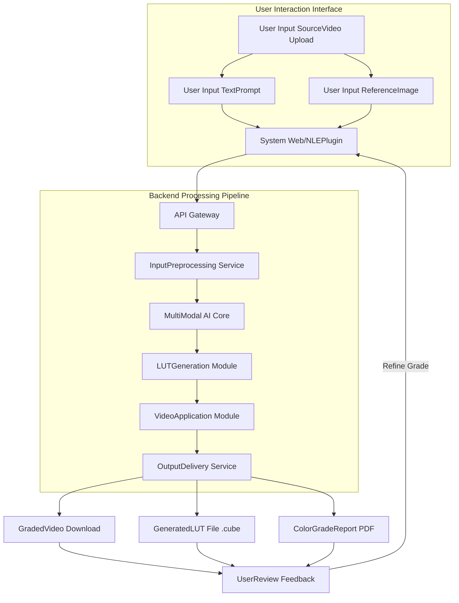
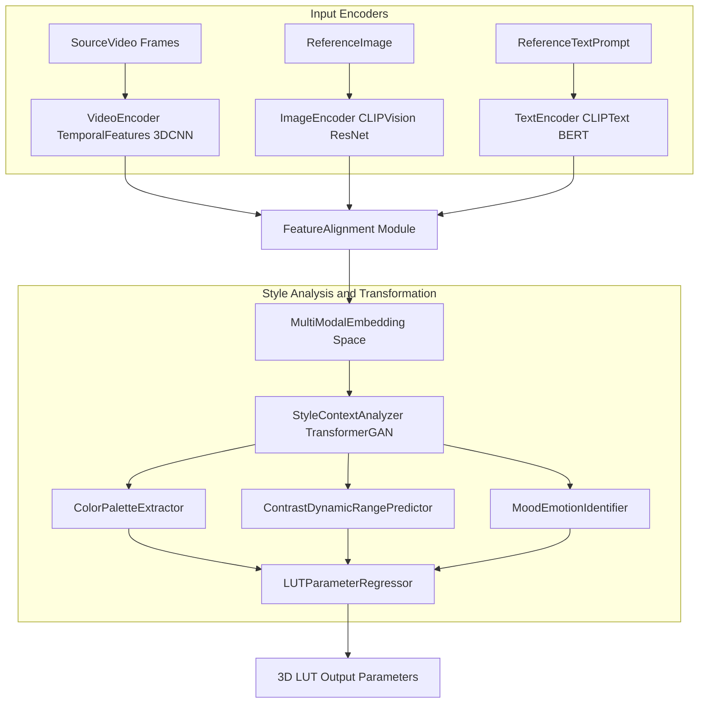
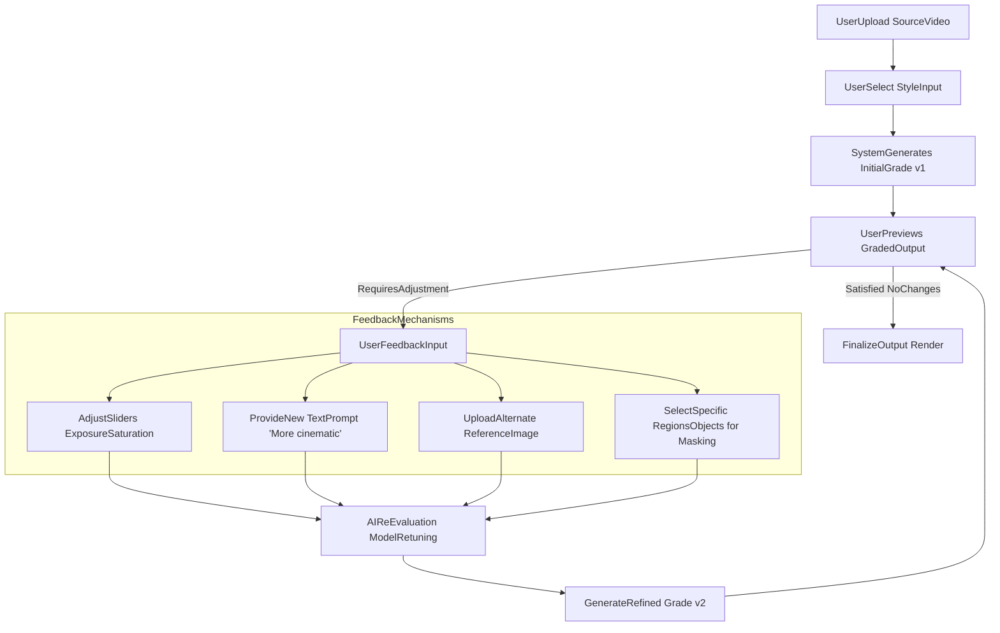
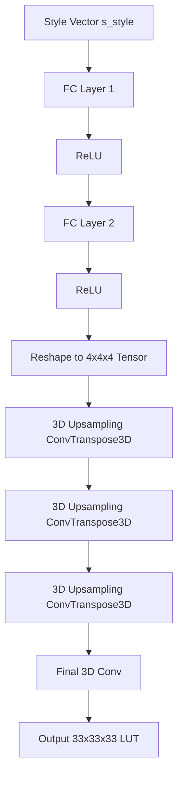
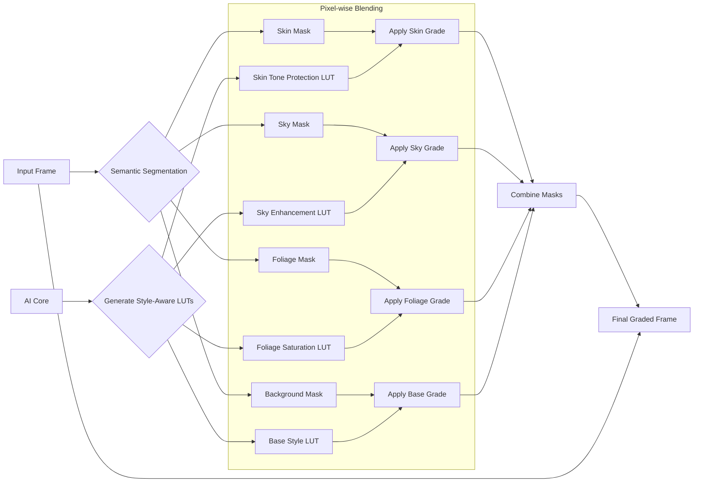
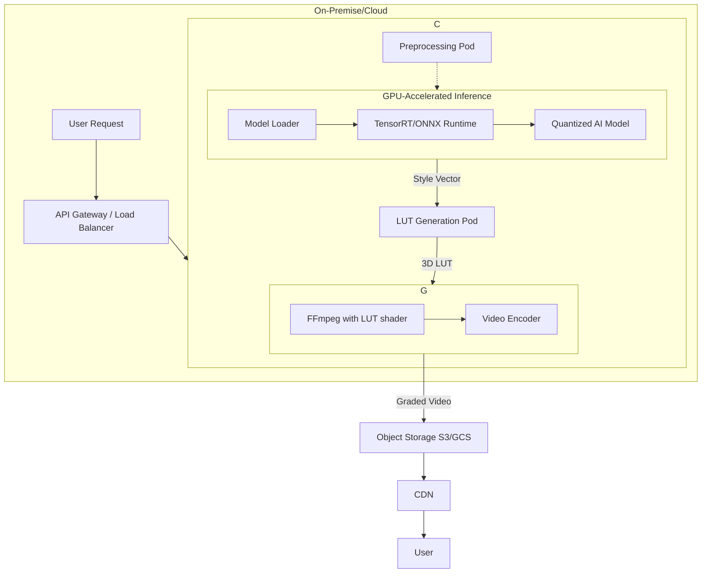
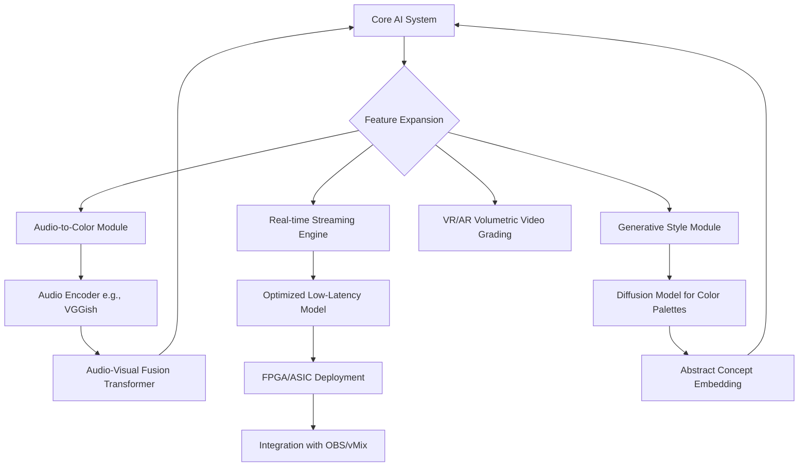
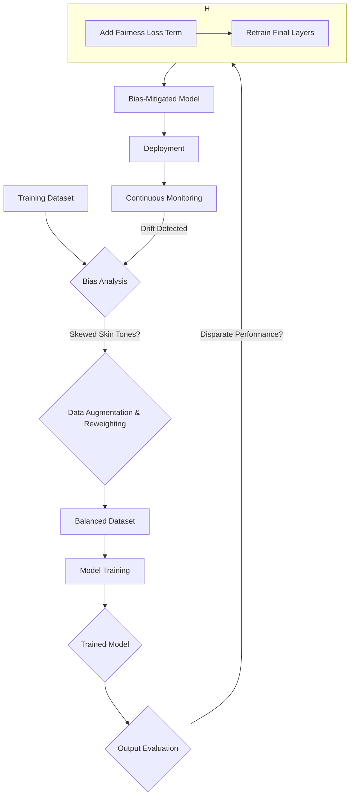

**Title of Invention:** A System and Method for Automated Film and Video Color Grading from a Reference Image or Text Prompt

**Abstract:**
A system for color grading video footage is disclosed. A user provides a raw video clip and a reference for the desired aesthetic. The reference can be a text prompt (e.g., "a warm, nostalgic, summer evening feel") or a still image from another film. The system uses a multi-modal AI model to analyze the style of the reference and apply it to the video clip, automatically adjusting parameters like color temperature, contrast, and saturation to match the desired look. This system is capable of generating temporally consistent color transformations, represented as 3D Look-Up Tables (LUTs), and supports iterative refinement through a user feedback loop. Advanced capabilities include semantic-aware grading for specific objects or regions and bias mitigation for equitable representation of skin tones.

**Detailed Description:**
A video editor has a raw, flat-colored video clip, typically shot in a logarithmic (log) color profile to maximize dynamic range. They want it to look like the film *Blade Runner*. They upload their clip and a still frame from *Blade Runner*. The system sends both to a multi-modal AI with the prompt, "Apply the color grade and aesthetic of the second image to the first video clip." The AI generates a 3D Look-Up Table (LUT) that represents the color transformation, which is then automatically applied to the editor's video clip, ensuring frame-to-frame consistency.

This invention expands upon this core concept by detailing the multi-modal AI's internal workings, the comprehensive process flow for automated color grading, the mathematical foundations of color science and deep learning involved, and the architecture for robust, scalable deployment. The system is designed to intelligently interpret abstract aesthetic desires from various input forms and translate them into precise, temporally consistent, and context-aware color transformations for video content.

**1. System Overview**

The automated color grading system integrates several microservices to process user inputs, analyze aesthetic references, generate complex color transformations, and apply them to video footage. The core innovation lies in the multi-modal AI's ability to cross-reference visual, textual, and even auditory cues to achieve a desired look, providing a powerful and intuitive tool for filmmakers and content creators. The architecture is designed for scalability and iterative improvement, incorporating a feedback loop that not only refines the current grade but also contributes to the long-term learning of the core model.



**2. Detailed Process Flow for AI Automated Color Grading**

The process begins with user input and proceeds through several stages of AI analysis, transformation, and application. Each stage is mathematically defined to ensure precision and reproducibility. The pipeline incorporates user feedback for iterative refinement, allowing for a collaborative process between the user and the AI.



```mermaid
graph LR
    subgraph Initial Input and Preprocessing
        A[User Upload SourceVideo] --> B[VideoPreprocessing Standardization]
        C[User Input StyleReference Text] --> D[TextEmbedding NLPModels]
        E[User Input StyleReference Image] --> F[ImageFeatureExtraction CNNVAE]
    end

    B --> G[TemporalConsistencyAnalysis]
    D --> H[MultiModalStyleInterpreter]
    F --> H

    G --> I[SceneSegmentation ObjectRecognition]
    H --> J[AestheticStyleVector Generation]

    I --> K[ContextAwareAdjustmentModule]
    J --> K

    K --> L[ColorTransformationGenerator DeepLearning]
    L --> M[3D LUT ParameterPrediction]
    M --> N[LUTInterpolation Optimization]

    subgraph Application and Output
        N --> O[LUTApplicationEngine GPUAccelerated]
        O --> P[GradedVideoOutput Render]
        P --> Q[OutputGeneratedLUT File]
        P --> R[OutputColorGradeReport]
    end

    P --> S[UserPreview Adjustment]
    Q --> S
    R --> S
    S -- "Feedback Refinement" --> L
    S -- "Finalize Grade" --> T[Final Delivery]
```

**3. Multi-Modal AI Core Architecture**

The heart of the system is the Multi-Modal AI Core. This module is responsible for understanding and translating aesthetic instructions across different data types (text, image, video). It employs a sophisticated architecture based on transformers and cross-attention mechanisms to fuse information from these diverse sources into a single, coherent representation of the desired style.

The process begins by encoding each input modality into a high-dimensional vector space. Let $$V_s$$ be the source video, $$I_r$$ be the reference image, and $$T_r$$ be the reference text. The encodings are:
$$ \mathbf{z}_v = E_v(V_s) \in \mathbb{R}^{d_v} \quad (1) $$
$$ \mathbf{z}_i = E_i(I_r) \in \mathbb{R}^{d_i} \quad (2) $$
$$ \mathbf{z}_t = E_t(T_r) \in \mathbb{R}^{d_t} \quad (3) $$
where $$E_v, E_i, E_t$$ are the respective encoders (e.g., a 3D CNN for video, CLIP-Vision for image, and CLIP-Text for text).

These features are then projected into a common embedding space using learned projection matrices $$W_v, W_i, W_t$$:
$$ \mathbf{e}_v = W_v \mathbf{z}_v \in \mathbb{R}^{d_{common}} \quad (4) $$
$$ \mathbf{e}_i = W_i \mathbf{z}_i \in \mathbb{R}^{d_{common}} \quad (5) $$
$$ \mathbf{e}_t = W_t \mathbf{z}_t \in \mathbb{R}^{d_{common}} \quad (6) $$

The fused style vector $$\mathbf{s}_{style}$$ is generated via a cross-attention mechanism:
$$ Q = \mathbf{e}_v, \quad K = [\mathbf{e}_i, \mathbf{e}_t], \quad V = [\mathbf{e}_i, \mathbf{e}_t] \quad (7) $$
$$ Attention(Q, K, V) = \text{softmax}\left(\frac{QK^T}{\sqrt{d_{common}}}\right)V \quad (8) $$
$$ \mathbf{s}_{style} = \text{LayerNorm}(\mathbf{e}_v + Attention(Q,K,V)) \quad (9) $$



**4. User Interaction and Iterative Refinement**

The system supports a robust user feedback loop, allowing for adjustments and fine-tuning of the AI-generated color grade. This ensures that the final output aligns precisely with the user's creative vision. The feedback is not just a UI element; it's a crucial data point for model refinement.

When a user adjusts a slider for exposure by a factor $$\Delta E$$, this is translated into a modification of the target style vector $$\mathbf{s}_{style}$$.
$$ \mathbf{s}_{refined} = \mathbf{s}_{style} + \alpha \cdot f(\Delta E, \text{other feedback}) \quad (10) $$
where $$f$$ is a learned function that maps user adjustments to changes in the style embedding space, and $$\alpha$$ is a learning rate. The model then generates a new LUT from $$\mathbf{s}_{refined}$$. This process can be modeled as a form of active learning or reinforcement learning, where user satisfaction is the reward signal.

The refinement loss function $$L_{refine}$$ can be formulated as:
$$ L_{refine} = || G(\mathbf{s}_{refined}) - G_{target} ||_2^2 \quad (11) $$
where $$G(\mathbf{s})$$ is the LUT generated from style vector $$\mathbf{s}$$ and $$G_{target}$$ is the implied target grade from the user's adjustments.



**5. The Mathematics of Color Transformation and LUT Generation**

At its core, color grading is a function $$f: \mathbb{R}^3 \to \mathbb{R}^3$$ that maps an input color $$(R_{in}, G_{in}, B_{in})$$ to an output color $$(R_{out}, G_{out}, B_{out})$$. A 3D Look-Up Table (LUT) is a discrete approximation of this function.

A $$N \times N \times N$$ 3D LUT is a cube in the RGB color space where each grid point stores a pre-computed output color vector. For a given input color $$C_{in} = (R, G, B)$$, the output color $$C_{out}$$ is found by trilinear interpolation between the 8 nearest grid points in the LUT.

$$ C_{out} = \sum_{i=0}^{1} \sum_{j=0}^{1} \sum_{k=0}^{1} w_i w_j w_k \cdot V_{i,j,k} \quad (12) $$
where $$V_{i,j,k}$$ are the color values at the 8 corner vertices of the cube containing $$C_{in}$$, and $$w_i, w_j, w_k$$ are the weights determined by the fractional distance of $$C_{in}$$ from the vertices.

The system uses a deep neural network, the LUT-Generator, to predict the values for the entire 3D LUT based on the style vector $$\mathbf{s}_{style}$$.
$$ \text{LUT}_{3D} = \text{Generator}(\mathbf{s}_{style}; \theta_G) \quad (13) $$

The Generator network is trained with a complex loss function to ensure perceptual accuracy. The total loss $$L_{total}$$ is a weighted sum of several components:
$$ L_{total} = \lambda_1 L_{pixel} + \lambda_2 L_{perc} + \lambda_3 L_{color} + \lambda_4 L_{adv} \quad (14) $$

**Pixel Loss ($$L_{pixel}$$):** Mean Squared Error between the graded and target image.
$$ L_{pixel} = \frac{1}{WH} \sum_{x=1}^{W} \sum_{y=1}^{H} || I_{graded}(x,y) - I_{target}(x,y) ||_2^2 \quad (15) $$

**Perceptual Loss ($$L_{perc}$$):** Difference in feature maps from a pre-trained network (e.g., VGG-19).
$$ L_{perc} = \sum_{l} || \phi_l(I_{graded}) - \phi_l(I_{target}) ||_1 \quad (16) $$
where $$\phi_l$$ is the activation of the $$l$$-th layer.

**Color Histogram Loss ($$L_{color}$$):** Encourages matching the color distribution.
$$ L_{color} = \sum_{c \in \{R,G,B\}} D_{KL}(H_c(I_{graded}) || H_c(I_{target})) \quad (17) $$
where $$H_c$$ is the histogram for channel $$c$$ and $$D_{KL}$$ is the Kullback-Leibler divergence.

**Adversarial Loss ($$L_{adv}$$):** Uses a discriminator network $$D$$ to distinguish between AI-graded and professionally-graded images.
$$ L_{adv} = -\mathbb{E}_{I_{graded}}[\log(D(I_{graded}))] \quad (18) $$

**Color Space Transformations:**
The system operates internally in perceptually uniform color spaces like CIE L*a*b* to better model human color perception.
Conversion from sRGB to CIE XYZ:
$$ \begin{bmatrix} X \\ Y \\ Z \end{bmatrix} = \begin{bmatrix} 0.4124 & 0.3576 & 0.1805 \\ 0.2126 & 0.7152 & 0.0722 \\ 0.0193 & 0.1192 & 0.9505 \end{bmatrix} \begin{bmatrix} R_{lin} \\ G_{lin} \\ B_{lin} \end{bmatrix} \quad (19) $$
where $$R_{lin}, G_{lin}, B_{lin}$$ are gamma-decoded RGB values.
$$ C_{lin} = \begin{cases} C_{srgb}/12.92 & C_{srgb} \le 0.04045 \\ ((C_{srgb}+0.055)/1.055)^{2.4} & C_{srgb} > 0.04045 \end{cases} \quad (20) $$

Conversion from CIE XYZ to CIE L*a*b*:
$$ L^* = 116 f(Y/Y_n) - 16 \quad (21) $$
$$ a^* = 500 [f(X/X_n) - f(Y/Y_n)] \quad (22) $$
$$ b^* = 200 [f(Y/Y_n) - f(Z/Z_n)] \quad (23) $$
where $$f(t) = \begin{cases} t^{1/3} & t > (6/29)^3 \\ \frac{1}{3}(\frac{29}{6})^2 t + \frac{4}{29} & \text{otherwise} \end{cases} \quad (24) $$
and $$X_n, Y_n, Z_n$$ are the tristimulus values of a reference white point.

Color difference is measured using $$\Delta E$$ metrics:
$$ \Delta E^*_{ab} = \sqrt{(L_2^* - L_1^*)^2 + (a_2^* - a_1^*)^2 + (b_2^* - b_1^*)^2} \quad (25) $$

The LUT-Generator architecture:


**6. Temporal Consistency and Video Processing**

A key challenge in video color grading is maintaining temporal consistency. Abrupt changes in color between adjacent frames can be jarring. The system addresses this using several techniques.

**Optical Flow Estimation:** The system first computes the optical flow $$\mathbf{w} = (u, v)$$ between consecutive frames $$I_t$$ and $$I_{t+1}$$.
$$ I_t(x, y) \approx I_{t+1}(x+u, y+v) \quad (26) $$
This is solved by minimizing an energy function:
$$ E(u, v) = \int\int (I_x u + I_y v + I_t)^2 + \alpha^2 (\|\nabla u\|^2 + \|\nabla v\|^2) dx dy \quad (27) $$
where $$I_x, I_y, I_t$$ are partial derivatives and $$\alpha$$ is a regularization parameter.

**Temporal Coherence Loss ($$L_{temp}$$):** This loss function penalizes differences in the graded output when warped by the optical flow.
$$ L_{temp} = \frac{1}{N-1} \sum_{t=1}^{N-1} || G(I_t) - \text{warp}(G(I_{t+1}), \mathbf{w}_t) ||_1 \quad (28) $$
where $$G(I_t)$$ is the graded frame at time $$t$$, and $$\text{warp}()$$ applies the inverse optical flow. This loss is added to the total training loss $$L_{total}$$.

**Scene Change Detection:** The system also incorporates a scene change detection algorithm to allow for intentional, abrupt grade changes between different scenes. A scene change is detected if the histogram difference between frames exceeds a threshold $$\tau$$.
$$ \sum_{i=1}^{256} |H(I_t)_i - H(I_{t-1})_i| > \tau \quad (29) $$
When a scene change is detected, the temporal consistency constraint is relaxed for that frame transition.

The temporal analysis pipeline:
```mermaid
sequenceDiagram
    participant V as VideoInput
    participant SCD as SceneChangeDetector
    participant OFE as OpticalFlowEstimator
    participant GA as GradingApplicator
    participant TC as TemporalConsistencyModule

    V->>SCD: Frame t, Frame t-1
    SCD->>GA: IsSceneChange?
    V->>OFE: Frame t, Frame t+1
    OFE->>TC: OpticalFlow w_t
    V->>GA: Frame t
    GA->>TC: GradedFrame(t)
-
    V->>GA: Frame t+1
    GA->>TC: GradedFrame(t+1)
    TC->>GA: ConsistencyCost
    GA-->>GA: Refine Grade(t+1)
```

**7. Context-Aware Grading and Semantic Segmentation**

To achieve professional-level results, the system can apply different aspects of the color grade to different parts of the image. For instance, it can protect skin tones from extreme stylistic shifts or enhance the color of the sky without affecting the foreground. This is achieved through semantic segmentation.

A segmentation network (e.g., U-Net, DeepLabV3) is used to produce a mask $$M$$ for each frame, where $$M(x,y) = k$$ if the pixel at $$(x,y)$$ belongs to class $$k$$ (e.g., skin, sky, vegetation).
$$ M = \text{SegNet}(I_{in}) \quad (30) $$

The system generates a base LUT ($$L_{base}$$) and several class-specific adjustment matrices or secondary LUTs ($$L_k$$). The final color $$C_{out}$$ for a pixel is a blend based on its semantic class.
$$ L_{final}^{(x,y)} = (1 - \beta_k) L_{base} + \beta_k L_k \quad \text{where } k=M(x,y) \quad (31) $$
Here, $$\beta_k \in [0, 1]$$ is a blending factor for class $$k$$, which is also predicted by the AI core.

The final graded pixel $$C_{out}$$ is then:
$$ C_{out}(x,y) = L_{final}^{(x,y)} [C_{in}(x,y)] \quad (32) $$

The loss function for the segmentation network is typically a cross-entropy loss:
$$ L_{seg} = - \sum_{i=1}^{H \times W} \sum_{k=1}^{K} y_{i,k} \log(p_{i,k}) \quad (33) $$
where $$y_{i,k}$$ is 1 if pixel $$i$$ is of class $$k$$ and 0 otherwise, and $$p_{i,k}$$ is the predicted probability.



**8. Hardware Acceleration and Deployment**

Deploying such a complex system requires a robust MLOps pipeline and significant hardware acceleration, typically using GPUs or custom AI accelerators (TPUs, etc.).

**Model Quantization:** To speed up inference, the neural network weights are often quantized from 32-bit floating-point (FP32) to 8-bit integers (INT8).
$$ w_{int8} = \text{round}(w_{fp32} / S) + Z \quad (34) $$
where $$S$$ is a scaling factor and $$Z$$ is a zero-point offset.
$$ S = \frac{\max(w_{fp32}) - \min(w_{fp32})}{2^8 - 1} \quad (35) $$
$$ Z = -\text{round}(\min(w_{fp32}) / S) \quad (36) $$

**Inference Pipeline:** The system is deployed as a set of containerized microservices managed by Kubernetes. An API gateway routes user requests to the appropriate services for preprocessing, inference, and post-processing.
$$ T_{total} = T_{network} + T_{preprocess} + T_{inference} + T_{postprocess} \quad (37) $$
The goal is to minimize total latency $$T_{total}$$. Caching mechanisms are used for frequently requested style references.



**9. Advanced Features and Future Work**

The core framework can be extended to support even more intuitive and powerful features.

**Audio-to-Color Grading:** The multi-modal core can be expanded to include an audio encoder. This would allow the system to analyze the soundtrack of a video—the mood of the music, the intensity of sound effects, the tone of dialogue—and adjust the color grade dynamically to match the auditory experience.
$$ \mathbf{z}_a = E_a(\text{Audio Track}) \quad (38) $$
$$ \mathbf{s}_{style\_final} = \text{Attention}(\mathbf{e}_v, [\mathbf{e}_i, \mathbf{e}_t, \mathbf{e}_a], [\mathbf{e}_i, \mathbf{e}_t, \mathbf{e}_a]) \quad (39) $$

**Real-time Live Streaming:** By further optimizing the model and using dedicated hardware, the system could be adapted for real-time color grading of live video streams, enabling dynamic, AI-driven aesthetics for broadcasts or video conferencing.

**Generative Color:** Instead of just matching a reference, a future version could generate entirely novel color grades from abstract concepts, e.g., "grade this video to feel like a forgotten memory." This would involve training on a larger, more abstract dataset of tagged media and potentially using generative adversarial networks (GANs) or diffusion models directly in the color transformation process.



**10. Ethical Considerations and Bias Mitigation**

A critical aspect of this technology is ensuring fairness and mitigating bias, particularly in the representation of skin tones. AI models trained on biased datasets can perpetuate and even amplify societal biases.

**Bias Detection:** The system includes a module to analyze the training data and model outputs for statistical bias. We calculate the disparity in the $$ \Delta E $$ metric across different Fitzpatrick skin types.
$$ \text{Bias Metric} = \frac{\text{std}(\overline{\Delta E_1}, \overline{\Delta E_2}, ..., \overline{\Delta E_6})}{\text{mean}(\overline{\Delta E_1}, \overline{\Delta E_2}, ..., \overline{\Delta E_6})} \quad (40) $$
where $$\overline{\Delta E_k}$$ is the average color error for skin type $$k$$.

**Mitigation Strategy:**
1.  **Data Augmentation:** We oversample underrepresented groups in the training data.
2.  **Fairness Constraint:** We add a fairness term to the loss function that penalizes disparate performance.
$$ L_{fairness} = \sum_{k=1}^{K} \sum_{j=k+1}^{K} | \text{Error}(D_k) - \text{Error}(D_j) | \quad (41) $$
where $$ \text{Error}(D_k) $$ is the average model error on data from demographic group $$k$$.
$$ L_{final} = L_{total} + \gamma L_{fairness} \quad (42) $$

This ensures the model performs equitably across all skin tones, providing a tool that is both powerful and responsible.



**Claims:**
1. A method for color grading video, comprising:
   a. Receiving a source video clip and a style reference, wherein the style reference can be a text prompt, a reference image, a reference video, or a combination thereof.
   b. Encoding the source video and the style reference into a multi-modal embedding space using a set of deep learning encoders.
   c. Generating a fused aesthetic style vector by applying a cross-attention mechanism between the encoded source video and the encoded style reference.
   d. Inputting the aesthetic style vector into a generative neural network to produce a color transformation.
   e. Applying the color transformation to the source video clip to create a graded video.

2. The method of claim 1, wherein the color transformation is represented as a 3D Look-Up Table (LUT).

3. The method of claim 2, wherein the generative neural network is trained to predict the grid point values of the 3D LUT.

4. The method of claim 1, further comprising applying a temporal consistency loss function during the generation of the color transformation to ensure smooth color transitions between adjacent frames of the video.

5. The method of claim 4, wherein the temporal consistency loss function utilizes optical flow information to warp frames for comparison.

6. The method of claim 1, further comprising:
   a. Performing semantic segmentation on the source video frames to identify distinct object classes.
   b. Generating class-specific color adjustments in addition to a base color transformation.
   c. Applying a blended color transformation based on the semantic class of each pixel.

7. The method of claim 6, wherein skin tones are identified as a distinct object class and are processed with a transformation that preserves natural appearance.

8. The method of claim 1, further comprising a user feedback loop, wherein:
   a. A user provides adjustments to the graded video.
   b. The adjustments are translated into a modification of the aesthetic style vector.
   c. A refined color transformation is generated from the modified vector.

9. The method of claim 1, wherein the deep learning encoders and generative neural network are trained using a composite loss function including pixel-wise loss, perceptual loss, color histogram loss, and an adversarial loss.

10. The method of claim 1, wherein all color transformations are calculated in a perceptually uniform color space such as CIE L*a*b*.

11. A system for automated color grading, comprising:
   a. An input module configured to receive a source video clip and a style reference.
   b. A multi-modal AI core, comprising a plurality of encoders and a fusion module, configured to generate an aesthetic style vector.
   c. A color transformation generator, comprising a deep generative network, configured to create a 3D Look-Up Table (LUT) based on the aesthetic style vector.
   d. A video processing module configured to apply the 3D LUT to the source video clip using trilinear interpolation.

12. The system of claim 11, further comprising a temporal analysis module configured to calculate optical flow and detect scene changes to ensure temporal consistency of the applied grade.

13. The system of claim 11, further comprising a semantic segmentation module configured to generate pixel-level masks for context-aware color grading.

14. The system of claim 11, further comprising a user interface for receiving user feedback, wherein said feedback is used to iteratively refine the aesthetic style vector.

15. The system of claim 11, wherein the deep learning models are deployed on GPU-accelerated hardware and are optimized using model quantization techniques.

16. The method of claim 1, wherein the style reference is an audio file, and an audio encoder is used to extract mood and tempo features to inform the aesthetic style vector.

17. The system of claim 11, further comprising a bias and fairness module configured to:
   a. Analyze the training data for demographic disparities.
   b. Incorporate a fairness constraint into the model's loss function to ensure equitable performance across different skin tones.

18. The method of claim 1, further comprising a scene change detection algorithm that selectively relaxes temporal consistency constraints at scene boundaries.

19. The system of claim 11, wherein the color transformation generator's network architecture comprises a series of fully connected layers followed by 3D transposed convolutions to generate the volumetric LUT structure.

20. The method of claim 8, wherein the user feedback can be in the form of slider adjustments, textual commands, or additional reference images, each being mapped to a specific delta in the multi-modal embedding space.

***

***Additional Mathematical Formulations for Reference***

Activation Functions:
$$ \text{ReLU}(x) = \max(0, x) \quad (43) $$
$$ \text{LeakyReLU}(x) = \max(0.01x, x) \quad (44) $$
$$ \sigma(x) = \frac{1}{1 + e^{-x}} \quad (45) $$
$$ \tanh(x) = \frac{e^x - e^{-x}}{e^x + e^{-x}} \quad (46) $$

Convolutional Layer Operation:
$$ y(i, j) = \sum_{m} \sum_{n} x(i-m, j-n) h(m, n) + b \quad (47) $$

Trilinear Interpolation Weights:
$$ c = (R_{in} \cdot (N-1), G_{in} \cdot (N-1), B_{in} \cdot (N-1)) \quad (48) $$
$$ c_0 = \lfloor c \rfloor, c_1 = \lceil c \rceil \quad (49) $$
$$ c_d = c - c_0 \quad (50) $$
$$ w_0 = 1 - c_d, w_1 = c_d \quad (51) $$
$$ C_{out} = \sum_{i \in \{0,1\}} \sum_{j \in \{0,1\}} \sum_{k \in \{0,1\}} w_{0,i} \cdot w_{1,j} \cdot w_{2,k} \cdot \text{LUT}(c_{i,0}, c_{j,1}, c_{k,2}) \quad (52) $$

Structural Similarity Index (SSIM) Loss:
$$ L_{SSIM}(x,y) = 1 - \frac{(2\mu_x\mu_y + C_1)(2\sigma_{xy} + C_2)}{(\mu_x^2 + \mu_y^2 + C_1)(\sigma_x^2 + \sigma_y^2 + C_2)} \quad (53) $$

Total Variation Loss (for smoothness):
$$ L_{TV}(\mathbf{y}) = \sum_{i,j} \sqrt{(y_{i+1,j} - y_{i,j})^2 + (y_{i,j+1} - y_{i,j})^2} \quad (54) $$

Adam Optimizer Update Rules:
$$ m_t = \beta_1 m_{t-1} + (1-\beta_1)g_t \quad (55) $$
$$ v_t = \beta_2 v_{t-1} + (1-\beta_2)g_t^2 \quad (56) $$
$$ \hat{m}_t = m_t / (1 - \beta_1^t) \quad (57) $$
$$ \hat{v}_t = v_t / (1 - \beta_2^t) \quad (58) $$
$$ \theta_{t+1} = \theta_t - \frac{\eta}{\sqrt{\hat{v}_t} + \epsilon} \hat{m}_t \quad (59) $$

Transformer Self-Attention:
$$ Q = X W_Q, K = X W_K, V = X W_V \quad (60) $$
$$ \text{Attention}(Q, K, V) = \text{softmax}(\frac{QK^T}{\sqrt{d_k}})V \quad (61) $$

Multi-Head Attention:
$$ \text{MultiHead}(Q,K,V) = \text{Concat}(\text{head}_1, ..., \text{head}_h)W_O \quad (62) $$
$$ \text{where head}_i = \text{Attention}(QW_i^Q, KW_i^K, VW_i^V) \quad (63) $$

Positional Encoding:
$$ PE_{(pos, 2i)} = \sin(pos / 10000^{2i/d_{model}}) \quad (64) $$
$$ PE_{(pos, 2i+1)} = \cos(pos / 10000^{2i/d_{model}}) \quad (65) $$

Layer Normalization:
$$ \mu = \frac{1}{H} \sum_{i=1}^{H} x_i \quad (66) $$
$$ \sigma^2 = \frac{1}{H} \sum_{i=1}^{H} (x_i - \mu)^2 \quad (67) $$
$$ \text{LayerNorm}(x) = \gamma \frac{x-\mu}{\sqrt{\sigma^2 + \epsilon}} + \beta \quad (68) $$

Video Frame Interpolation for slow-motion consistency:
$$ F_{t \to t+1} = \text{FlowNet}(I_t, I_{t+1}) \quad (69) $$
$$ F_{t+1 \to t} = \text{FlowNet}(I_{t+1}, I_t) \quad (70) $$
$$ I_{t+0.5} = \frac{(1-0.5)V_{t \to t+0.5} \cdot g(I_t \circ F_{t \to t+0.5}) + 0.5 \cdot V_{t+1 \to t+0.5} \cdot g(I_{t+1} \circ F_{t+1 \to t+0.5})}{(1-0.5)V_{t \to t+0.5} + 0.5 \cdot V_{t+1 \to t+0.5}} \quad (71) $$

Wavelet Transform for Feature Extraction:
$$ Wf(a,b) = \frac{1}{\sqrt{a}} \int_{-\infty}^{\infty} f(t) \psi^* \left(\frac{t-b}{a}\right) dt \quad (72) $$

Dice Coefficient for Segmentation:
$$ \text{DSC} = \frac{2 |X \cap Y|}{|X| + |Y|} \quad (73) $$

Focal Loss for Segmentation:
$$ L_{FL} = -\alpha_t(1-p_t)^\gamma \log(p_t) \quad (74) $$

Color Space Conversion sRGB to HSL:
$$ M = \max(R,G,B), m = \min(R,G,B) \quad (75) $$
$$ C = M - m \quad (76) $$
$$ L = (M+m)/2 \quad (77) $$
$$ S_L = \begin{cases} C / (1 - |2L-1|) & C \ne 0 \\ 0 & C = 0 \end{cases} \quad (78) $$
$$ H' = \begin{cases} (G-B)/C \pmod 6 & M=R \\ (B-R)/C + 2 & M=G \\ (R-G)/C + 4 & M=B \end{cases} \quad (79) $$
$$ H = 60^\circ \times H' \quad (80) $$

Bézier Curve for Color Toning:
$$ P(t) = \sum_{i=0}^{n} B_{i,n}(t) P_i \quad (81) $$
$$ B_{i,n}(t) = \binom{n}{i} (1-t)^{n-i} t^i \quad (82) $$

Entropy for Scene Complexity:
$$ E = - \sum_{i} p_i \log_2 p_i \quad (83) $$

Gaussian Blur Kernel:
$$ G(x,y) = \frac{1}{2\pi\sigma^2} e^{-\frac{x^2+y^2}{2\sigma^2}} \quad (84) $$

Sobel Operator for Edge Detection:
$$ G_x = \begin{bmatrix} -1 & 0 & +1 \\ -2 & 0 & +2 \\ -1 & 0 & +1 \end{bmatrix} * A \quad (85) $$
$$ G_y = \begin{bmatrix} -1 & -2 & -1 \\ 0 & 0 & 0 \\ +1 & +2 & +1 \end{bmatrix} * A \quad (86) $$
$$ G = \sqrt{G_x^2 + G_y^2} \quad (87) $$

KL Divergence (continuous):
$$ D_{KL}(P||Q) = \int_{-\infty}^{\infty} p(x) \log\left(\frac{p(x)}{q(x)}\right) dx \quad (88) $$

Wasserstein GAN Loss:
$$ L_D = \mathbb{E}_{x \sim P_r}[D(x)] - \mathbb{E}_{\tilde{x} \sim P_g}[D(\tilde{x})] \quad (89) $$
$$ L_G = -\mathbb{E}_{\tilde{x} \sim P_g}[D(\tilde{x})] \quad (90) $$

Gradient Penalty for WGAN-GP:
$$ L_{GP} = \mathbb{E}_{\hat{x} \sim P_{\hat{x}}}[(\|\nabla_{\hat{x}} D(\hat{x})\|_2 - 1)^2] \quad (91) $$
$$ \hat{x} = \epsilon x + (1-\epsilon)\tilde{x}, \quad \epsilon \sim U[0,1] \quad (92) $$

Information Bottleneck Principle:
$$ \min_{p(z|x)} I(X;Z) - \beta I(Z;Y) \quad (93) $$

Camera Response Function (CRF) linearization:
$$ g(Z) = t = \ln E \quad (94) $$
$$ Z_{ij} = f(E_{ij} \Delta t_j) \implies \ln f^{-1}(Z_{ij}) = \ln E_i + \ln \Delta t_j \quad (95) $$
$$ g(Z_{ij}) = \ln E_i + \ln \Delta t_j \quad (96) $$

Unsharp Masking:
$$ I_{sharpened} = I_{original} + \alpha (I_{original} - I_{blurred}) \quad (97) $$

YCbCr Color Space:
$$ Y' = 0.299 R' + 0.587 G' + 0.114 B' \quad (98) $$
$$ C_b = -0.1687 R' - 0.3313 G' + 0.5 B' \quad (99) $$
$$ C_r = 0.5 R' - 0.4187 G' - 0.0813 B' \quad (100) $$