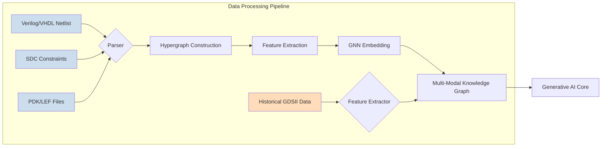
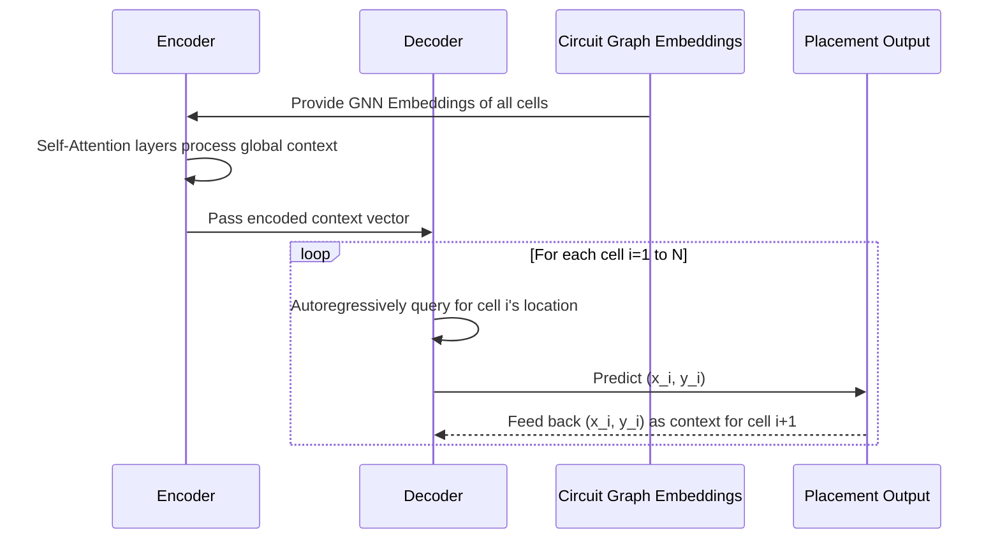
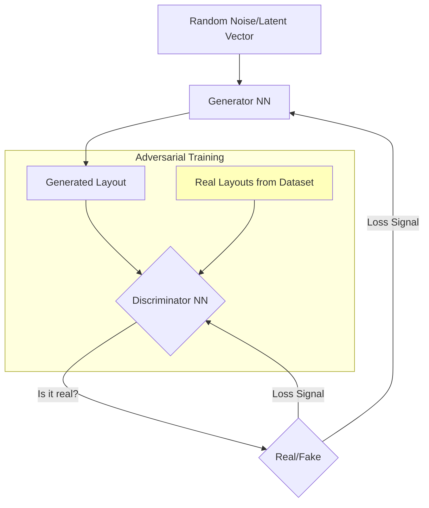
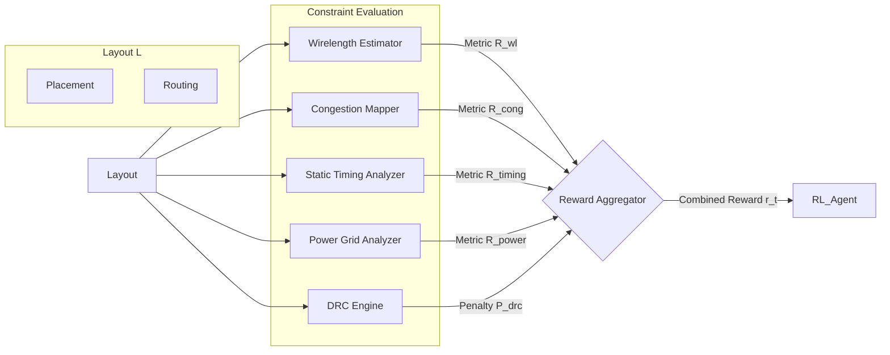
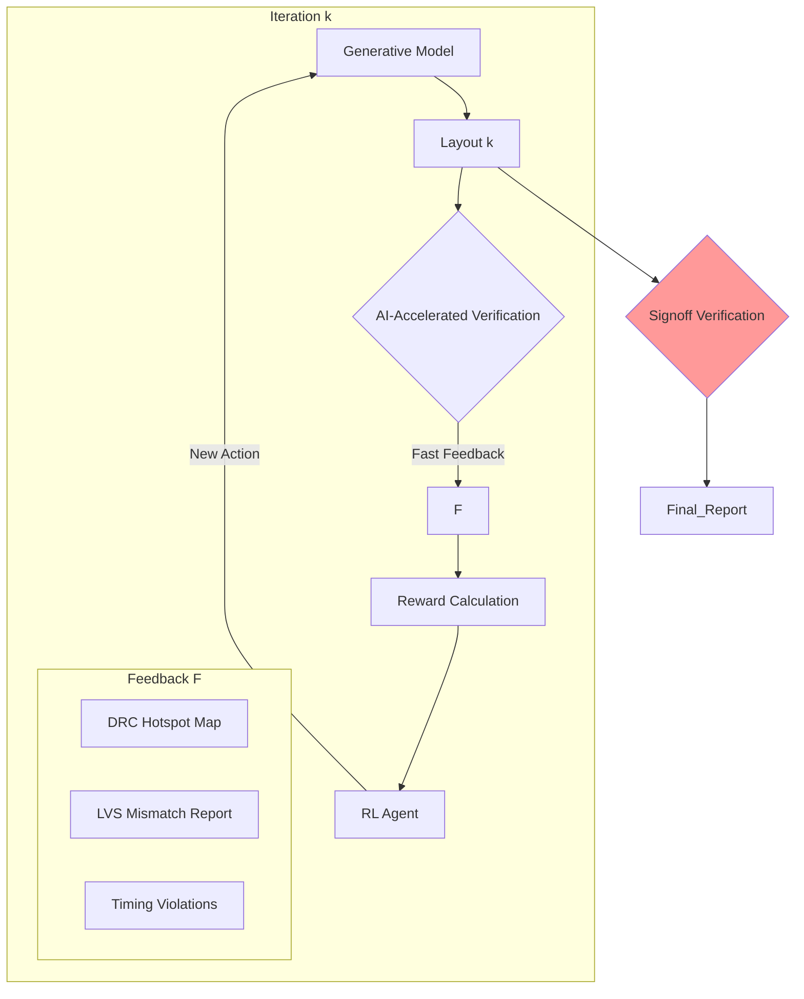

**Title of Invention:** A System and Method for Generative Design of Semiconductor Layouts powered by AI

**Abstract:**
A sophisticated system is disclosed for significantly accelerating and optimizing the physical design of integrated circuits, including monolithic SoCs, 3D-ICs, and chiplet-based systems. An engineer inputs a high-level logical circuit design, typically a netlist in formats like Verilog or VHDL, along with a comprehensive set of performance constraints including power, performance, area (PPA), timing critical path, signal integrity, electromigration, and thermal budgets. A generative AI model, extensively trained on a massive dataset of existing chip layouts, process technology files (PDKs), design rules, and the foundational principles of Electronic Design Automation (EDA), autonomously generates an optimized physical layout. This includes detailed hierarchical floorplanning, precise placement of standard cells and IP blocks, clock tree synthesis, and efficient global and detailed routing of interconnects, culminating in standard EDA output formats like GDSII, LEF/DEF, and OASIS. The system employs a hybrid of advanced AI techniques—including graph neural networks for topological understanding, deep reinforcement learning for decision-making, and transformer or diffusion models for spatial generation—to explore vast, high-dimensional design spaces and achieve superior design metrics previously unattainable or time-prohibitive for human designers, thereby addressing the escalating complexity of nanometer-scale semiconductor fabrication.

**Detailed Description:**
The present invention introduces an AI-driven system designed to revolutionize the semiconductor physical design process, from initial floorplanning to final tape-out. The escalating complexity of modern integrated circuits, driven by Moore's Law and the emergence of post-Moore technologies like 3D integration, has rendered traditional EDA flows increasingly inefficient and reliant on extensive human intervention. This invention provides a holistic, learning-based approach to automate and optimize this critical phase of chip design.

Upon receiving a logical netlist for a new processor core, AI accelerator, or any complex digital or mixed-signal block, the system engages a specialized AI engine. The engineer provides specific design directives and constraints, for example: `Generate an optimal physical layout for this RISC-V core netlist, targeting a 2.5 GHz clock frequency, prioritizing minimum signal latency on the critical path, while adhering to a 10mW power budget, 0.5mm² area limit, and a maximum junction temperature of 95°C under nominal load.`

### 1. Mathematical Formulation of the Physical Design Problem

The core challenge of physical design is a multi-objective combinatorial optimization problem of immense scale. The goal is to find an optimal layout $L$ that minimizes a set of objectives while satisfying a large number of constraints.

A layout $L$ can be defined as a set of geometric objects (polygons) assigned to specific layers:
$$ L = \{ (p_i, l_i) | p_i \in \mathbb{R}^2, l_i \in \text{Layers} \}_{i=1}^N $$
(Equation 1)

The primary objectives are Power ($P$), Performance (often represented by timing, $T$), and Area ($A$). A common approach is to optimize a weighted sum:
$$ \min_{L} f(L) = w_P \cdot P(L) + w_T \cdot T(L) + w_A \cdot A(L) $$
(Equation 2)
where $w_P, w_T, w_A$ are user-defined weights.

The optimization is subject to a vast set of constraints $\mathcal{C}$:
$$ \text{s.t.} \quad g_j(L) \le 0 \quad \forall j \in \mathcal{C} $$
(Equation 3)

These constraints include:
1.  **Design Rule Checks (DRC):** Geometric rules from the PDK. For any two objects $p_i, p_j$ on the same layer, their minimum spacing must be greater than a threshold $s_{min}$.
    $$ \text{dist}(p_i, p_j) \ge s_{min} \quad \forall i \neq j, l_i=l_j $$
    (Equation 4)
2.  **Layout vs. Schematic (LVS):** The extracted circuit from layout $L$ must be isomorphic to the input netlist $G_{netlist}$.
    $$ \text{extract}(L) \cong G_{netlist} $$
    (Equation 5)
3.  **Timing Constraints:** The signal propagation delay $\tau_{path}$ for all timing paths must be less than the clock period $T_{clk}$, ensuring positive timing slack $S_{path}$.
    $$ S_{path} = T_{clk} - \tau_{path} \ge 0 $$
    (Equation 6)
4.  **Power Constraints:** Total dynamic and static power must be below a budget $P_{budget}$.
    $$ P_{dyn}(L) + P_{static}(L) \le P_{budget} $$
    (Equation 7)
    $$ P_{dyn} = \alpha \cdot C_L \cdot V_{dd}^2 \cdot f_{clk} $$
    (Equation 8)
    $$ P_{static} = I_{leakage} \cdot V_{dd} $$
    (Equation 9)
5.  **Thermal Constraints:** The maximum temperature on the die $T_{max}$ must not exceed a critical value $T_{crit}$.
    $$ \max_{(x,y) \in \text{Die}} T(x,y,L) \le T_{crit} $$
    (Equation 10)

### 2. The AI System's Operational Flow

The AI system's operational flow is a closed-loop, iterative process that progressively refines the layout from a coarse initial state to a DRC/LVS clean, optimized final design.

```mermaid
graph TD
    subgraph User Interaction and Input
        A[Design Engineer] --> B[High Level Design Specs]
        B --> C[Logical Netlist VerilogVHDL]
        B --> D[Performance Constraints PPATiming]
        D --> D1[Power Constraints]
        D --> D2[Area Constraints]
        D --> D3[Timing CriticalPath]
        D --> D4[Signal Integrity]
        D --> D5[Thermal Constraints]
    end

    subgraph AI Semiconductor Layout Design System
        E[AI System Orchestrator]
        C --> E
        D --> E

        subgraph AI Core Processing
            E --> F[Input Parser & Knowledge Graph Construction]
            F --> G[Generative AI Model DeepLearning]
            G --> H[Reinforcement Learning Agent]
            H --> I[Multi-Objective Reward Function]
            I --> J[AI-Accelerated Physical Verification Engine]
            G -- Iteration Feedback --> H
            H -- Optimization Loop --> I
            I -- Verification Check --> J
            J -- Layout Feedback --> G
        end

        subgraph Design Data Knowledge Base
            K[Training Dataset HistoricalLayouts]
            L[EDA Principles DesignRules]
            M[IP Block Libraries Macros]
            N[Process Technology Files PDKs]
            K & L & M & N --> G
        end

        subgraph Output Generation and Refinement
            J --> O[Layout Postprocessor GDSII DEF]
            O --> P[Design Metrics Reports]
            O --> Q[Verification Summary]
            P & Q --> R[Design Engineer ForReview Validation]
        end
    end

    style A fill:#f9f,stroke:#333,stroke-width:2px
    style R fill:#f9f,stroke:#333,stroke-width:2px
    style G fill:#bbf,stroke:#333,stroke-width:2px
    style H fill:#bbf,stroke:#333,stroke-width:2px
    style I fill:#bbf,stroke:#333,stroke-width:2px
    style J fill:#bbf,stroke:#333,stroke-width:2px
    style O fill:#bfb,stroke:#333,stroke-width:2px
    style K fill:#ffb,stroke:#333,stroke-width:2px
    style L fill:#ffb,stroke:#333,stroke-width:2px
    style M fill:#ffb,stroke:#333,stroke-width:2px
    style N fill:#ffb,stroke:#333,stroke-width:2px

    note for E
        Manages overall workflow,
        resource allocation, and
        inter-module communication
        across the AI system.
    end
    note for G
        Generates initial and
        iteratively refined layout
        representations.
        Could use GANs, Transformers,
        or Diffusion Models
        to predict optimal placements
        and routings.
    end
    note for H
        Explores the vast design space
        to optimize layout based on
        the reward function,
        learning from iterative feedback.
    end
    note for I
        Evaluates current layout against
        PPA and other constraints,
        provides quantitative reward signal
        to the Reinforcement Learning Agent.
    end
    note for J
        Performs rapid Design Rule Checking DRC
        and Layout Versus Schematic LVS
        to ensure manufacturability and
        functional correctness during iteration.
    end
```

#### 2.1. Input Parsing and Knowledge Graph Construction
The incoming logical netlist (Verilog, VHDL), SDC constraints, and technology files (PDKs) are parsed and converted into a unified multi-modal knowledge graph.

A netlist is naturally represented as a hypergraph $G=(V, E)$, where $V$ is the set of cells (nodes) and $E$ is the set of nets (hyperedges).
$$ V = \{v_1, v_2, ..., v_n\} $$
(Equation 11)
$$ E = \{e_1, e_2, ..., e_m\}, \quad e_j \subseteq V $$
(Equation 12)

This graph is then enriched with features for each node and edge:
*   **Node Features** $x_v$: Cell type, size, function, timing parameters.
    $$ x_v \in \mathbb{R}^{d_{node}} $$
    (Equation 13)
*   **Edge Features** $x_e$: Net criticality, fanout, capacitance.
    $$ x_e \in \mathbb{R}^{d_{edge}} $$
    (Equation 14)

**Graph Neural Networks (GNNs)** are used to generate rich embeddings that capture the circuit's topology and characteristics. The GNN propagates information across the graph:
$$ h_v^{(k)} = \text{UPDATE}^{(k)} \left( h_v^{(k-1)}, \text{AGGREGATE}^{(k)} \left( \{ (h_u^{(k-1)}, h_{e_{uv}}^{(k-1)}) : u \in \mathcal{N}(v) \} \right) \right) $$
(Equation 15)
where $h_v^{(k)}$ is the embedding of node $v$ at layer $k$.
$$ \text{AGGREGATE} = \sum_{u \in \mathcal{N}(v)} W_{agg} \cdot [h_u^{(k-1)} || h_{e_{uv}}^{(k-1)}] $$
(Equation 16)
$$ \text{UPDATE}(h_v, h_{\mathcal{N}(v)}) = \sigma(W_{self}h_v + W_{neigh}h_{\mathcal{N}(v)}) $$
(Equation 17)
The final embeddings $h_v^{(K)}$ encode complex relationships crucial for placement and routing.
$$ Z = \{ h_v^{(K)} | v \in V \} $$
(Equation 18)



#### 2.2. Generative AI Core
At the heart of the system is a generative AI model, which synthesizes the physical layout. Different architectures may be used for different stages (floorplanning, placement, routing).

**A. Transformer-based Placement:**
We model placement as a sequence generation task. A Transformer architecture is well-suited for this, capturing long-range dependencies between cells.
The model autoregressively predicts the location $(x_i, y_i)$ for each cell $v_i$.
$$ P(L) = \prod_{i=1}^{|V|} P((x_i, y_i) | (x_1, y_1), ..., (x_{i-1}, y_{i-1}), G) $$
(Equation 19)

The core mechanism is self-attention, which weighs the influence of already-placed cells on the current cell's placement.
$$ \text{Attention}(Q, K, V) = \text{softmax}\left(\frac{QK^T}{\sqrt{d_k}}\right)V $$
(Equation 20)
Here, $Q$ (Query) is the embedding of the current cell, and $K$ (Keys) and $V$ (Values) are from the already-placed cells and their locations.
$$ Q = Z W_Q, \quad K = Z W_K, \quad V = Z W_V $$
(Equations 21, 22, 23)
The multi-head attention mechanism allows the model to focus on different aspects of the layout simultaneously.
$$ \text{MultiHead}(Q,K,V) = \text{Concat}(\text{head}_1, ..., \text{head}_h)W^O $$
(Equation 24)
$$ \text{where head}_i = \text{Attention}(QW_i^Q, KW_i^K, VW_i^V) $$
(Equation 25)



**B. Diffusion Models for Routing:**
For routing, a continuous representation is more effective. Denoising Diffusion Probabilistic Models (DDPMs) can generate complex routing patterns represented as density maps on a grid.
The process involves:
1.  **Forward Process (Noising):** Gradually add Gaussian noise to an optimal routing image $x_0$ over $T$ steps.
    $$ q(x_t | x_{t-1}) = \mathcal{N}(x_t; \sqrt{1 - \beta_t}x_{t-1}, \beta_t \mathbf{I}) $$
    (Equation 26)
    $$ q(x_{1:T} | x_0) = \prod_{t=1}^T q(x_t | x_{t-1}) $$
    (Equation 27)
    This can be written in a closed form:
    $$ x_t = \sqrt{\bar{\alpha}_t} x_0 + \sqrt{1 - \bar{\alpha}_t} \epsilon, \quad \epsilon \sim \mathcal{N}(0, \mathbf{I}) $$
    (Equation 28)
    where $\alpha_t = 1 - \beta_t$ and $\bar{\alpha}_t = \prod_{i=1}^t \alpha_i$.
    (Equations 29, 30)

2.  **Reverse Process (Denoising):** A neural network $p_\theta(x_{t-1} | x_t)$ is trained to reverse this process, starting from pure noise $x_T$ and generating a clean routing map $x_0$.
    $$ p_\theta(x_{0:T}) = p(x_T) \prod_{t=1}^T p_\theta(x_{t-1} | x_t) $$
    (Equation 31)
    The network is trained to predict the noise $\epsilon$ added at each step.
    $$ \mathcal{L}_{simple}(\theta) = \mathbb{E}_{t, x_0, \epsilon} \left[ || \epsilon - \epsilon_\theta(\sqrt{\bar{\alpha}_t}x_0 + \sqrt{1-\bar{\alpha}_t}\epsilon, t) ||^2 \right] $$
    (Equation 32)
    The model is conditioned on the placement and netlist information to generate context-aware routing.
    $$ \mathcal{L}_{cond}(\theta) = \mathbb{E}_{t, x_0, c, \epsilon} \left[ || \epsilon - \epsilon_\theta(x_t, t, c) ||^2 \right] $$
    (Equation 33)

```mermaid
graph TD
    subgraph Diffusion Model for Routing
        X0[Ground Truth Routing] -->|q(xt|xt-1) adds noise| XT_1[Slightly Noisy]
        XT_1 -->|...| XT_T_1[More Noisy]
        XT_T_1 -->|...| XT[Pure Gaussian Noise]

        XT -->|p_theta(xt-1|xt) predicts noise| P_XT_1[Denoised Step T-1]
        P_XT_1 -->|...| P_XT_T_1[Denoised Step 1]
        P_XT_T_1 -->|...| X0_hat[Generated Routing]

        C[Placement & Netlist Context] --> E_theta[Noise Predictor U-Net]
        P_XT_1 --> E_theta
        P_XT_T_1 --> E_theta
        E_theta -->|Predicts epsilon| P_XT_1
        E_theta -->|Predicts epsilon| P_XT_T_1

    end
    style X0 fill:#bfb
    style X0_hat fill:#bfb
    style XT fill:#fbb
```
**C. Generative Adversarial Networks (GANs) for Layout Quality:**
A GAN can be used to refine layouts or act as a quality score.
*   **Generator ($G$):** A neural network that generates a layout $L_{gen}$.
*   **Discriminator ($D$):** A neural network that tries to distinguish between real layouts $L_{real}$ from the training data and generated ones.
The loss function for the discriminator is:
$$ \mathcal{L}_D = -\mathbb{E}_{L_{real}}[\log(D(L_{real}))] - \mathbb{E}_{L_{gen}}[\log(1 - D(L_{gen}))] $$
(Equations 34, 35)
The generator's loss function encourages it to fool the discriminator:
$$ \mathcal{L}_G = -\mathbb{E}_{L_{gen}}[\log(D(L_{gen}))] $$
(Equation 36)
This adversarial process pushes the generator to produce layouts that are statistically similar to high-quality, human-designed ones.
$$ \min_G \max_D V(D, G) = \mathbb{E}_{x \sim p_{data}(x)}[\log D(x)] + \mathbb{E}_{z \sim p_z(z)}[\log(1-D(G(z)))] $$
(Equation 37)



#### 2.3. Reinforcement Learning (RL) Agent
The generative core operates in conjunction with a reinforcement learning agent. This agent treats the layout generation process as a sequential decision-making problem, formulated as a Markov Decision Process (MDP): $(\mathcal{S}, \mathcal{A}, \mathcal{P}, \mathcal{R}, \gamma)$.

*   **State ($\mathcal{S}$):** The current state of the layout $s_t$. This can be a feature vector including cell locations, a congestion map, a timing slack histogram, etc.
    $$ s_t = [\text{pos}_t, \text{cong}_t, \text{timing}_t, ...] $$
    (Equation 38)
*   **Action ($\mathcal{A}$):** A modification to the layout $a_t$. Examples: `move cell A to (x,y)`, `swap cells B and C`, `reroute net N`.
    $$ a_t \in \mathcal{A} $$
    (Equation 39)
*   **Transition ($\mathcal{P}$):** The probability $P(s_{t+1}|s_t, a_t)$ of transitioning to a new state, which is deterministic in this case.
    $$ s_{t+1} = \text{ApplyAction}(s_t, a_t) $$
    (Equation 40)
*   **Reward ($\mathcal{R}$):** A reward function $R(s_t, a_t, s_{t+1})$ that quantifies the quality of the action.
    $$ r_t = R(s_{t+1}) $$
    (Equation 41)
*   **Policy ($\pi$):** The agent's strategy, $\pi(a_t|s_t)$, which is a probability distribution over actions given the current state. This policy is represented by a deep neural network.

The goal is to find a policy $\pi^*$ that maximizes the expected cumulative discounted reward (the return):
$$ G_t = \sum_{k=0}^{\infty} \gamma^k r_{t+k+1} $$
(Equation 42)
$$ \pi^* = \arg\max_\pi \mathbb{E}[G_t | \pi] $$
(Equation 43)

The agent uses an algorithm like Proximal Policy Optimization (PPO) or Soft Actor-Critic (SAC) to learn the optimal policy. The PPO objective function is:
$$ L^{CLIP}(\theta) = \hat{\mathbb{E}}_t \left[ \min(r_t(\theta)\hat{A}_t, \text{clip}(r_t(\theta), 1-\epsilon, 1+\epsilon)\hat{A}_t) \right] $$
(Equation 44)
where $r_t(\theta) = \frac{\pi_\theta(a_t|s_t)}{\pi_{\theta_{old}}(a_t|s_t)}$ is the probability ratio and $\hat{A}_t$ is the advantage estimator.
(Equations 45, 46)

```mermaid
graph TD
    S_t((State s_t\nLayout Grid\nCongestion Map\nTiming Graph)) -- Observe --> Agent
    subgraph RL Agent
        PolicyNet[Policy Network π(a|s)]
        ValueNet[Value Network V(s)]
    end
    Agent -->|Selects Action a_t| A_t(Action a_t\nMove Cell X)
    S_t -- a_t --> Env
    subgraph Environment (EDA Tools / Simulators)
        PlacementEngine
        RoutingEngine
        Timer
        PowerEstimator
    end
    Env --> S_t_plus_1((State s_{t+1}\nUpdated Layout))
    S_t_plus_1 -- Calculate Reward --> R_t_plus_1(Reward r_{t+1})
    R_t_plus_1 -- Update --> Agent
    S_t_plus_1 -- Observe --> Agent
```

#### 2.4. Constraint Evaluator and Multi-Objective Reward Function
This module assesses the generated layout against the specified constraints and calculates a reward signal. A well-designed reward function is critical for guiding the RL agent.

The reward function is a weighted sum of different quality metrics:
$$ R(L) = w_{wl} R_{wl} + w_{cong} R_{cong} + w_{timing} R_{timing} + w_{power} R_{power} - \lambda_{drc} P_{drc} $$
(Equation 47)

*   **Wirelength Reward ($R_{wl}$):** Typically based on half-perimeter wirelength (HPWL).
    $$ \text{HPWL}(e) = (\max_{v \in e} x_v - \min_{v \in e} x_v) + (\max_{v \in e} y_v - \min_{v \in e} y_v) $$
    (Equation 48)
    $$ R_{wl} = - \sum_{e \in E} \text{HPWL}(e) $$
    (Equation 49)
*   **Congestion Reward ($R_{cong}$):** Penalizes regions where routing demand exceeds capacity.
    $$ C(g) = \frac{\text{Demand}(g)}{\text{Capacity}(g)} \quad \text{for grid cell g} $$
    (Equation 50)
    $$ R_{cong} = - \sum_g \max(0, C(g) - 1)^2 $$
    (Equation 51)
*   **Timing Reward ($R_{timing}$):** Based on the worst negative slack (WNS).
    $$ \text{WNS} = \min_{path \in Paths} S_{path} $$
    (Equation 52)
    $$ R_{timing} = \alpha \cdot \text{WNS} \quad \text{if WNS} < 0 $$
    (Equation 53)
*   **DRC Penalty ($P_{drc}$):** A large penalty for any design rule violations.
    $$ P_{drc} = \sum_{v \in \text{Violations}} \text{severity}(v) $$
    (Equation 54)


Some other equations for metrics:
Total Negative Slack (TNS):
$$ \text{TNS} = \sum_{path \in Paths} \max(0, -S_{path}) $$
(Equation 55)
Power Density:
$$ P_{density}(x,y) = \frac{dP}{dA} \quad \text{at location (x,y)} $$
(Equation 56)
Signal Integrity (Crosstalk Noise):
$$ V_{noise} = \sum_{aggressors} k_c \cdot \frac{d V_{aggressor}}{dt} $$
(Equation 57)
Electromigration (Black's Equation):
$$ \text{MTTF} = \frac{A}{J^n} e^{\frac{E_a}{kT}} $$
(Equations 58, 59, 60)
Clock Skew:
$$ \text{Skew}_{i,j} = | T_{arrival, i} - T_{arrival, j} | $$
(Equation 61)
Maximum Current Density:
$$ J_{max} = \frac{I_{max}}{W \cdot T_{metal}} $$
(Equation 62)
Total Capacitance of a net:
$$ C_{net} = \sum C_{wire} + \sum C_{pin} $$
(Equation 63)
Elmore Delay Model for an RC tree:
$$ \tau_i = \sum_{k \in \text{path}(s,i)} R_k \cdot C_{downstream,k} $$
(Equations 64, 65)
The value function in RL:
$$ V^\pi(s) = \mathbb{E}_\pi \left[ \sum_{k=0}^{\infty} \gamma^k r_{t+k+1} | s_t = s \right] $$
(Equation 66)
The action-value function (Q-function):
$$ Q^\pi(s, a) = \mathbb{E}_\pi \left[ \sum_{k=0}^{\infty} \gamma^k r_{t+k+1} | s_t = s, a_t = a \right] $$
(Equation 67)
Bellman Optimality Equation for V:
$$ V^*(s) = \max_a \mathbb{E} [r_{t+1} + \gamma V^*(s_{t+1}) | s_t=s, a_t=a] $$
(Equation 68)
Bellman Optimality Equation for Q:
$$ Q^*(s,a) = \mathbb{E} [r_{t+1} + \gamma \max_{a'} Q^*(s_{t+1}, a') | s_t=s, a_t=a] $$
(Equation 69)
Temporal Difference (TD) Error:
$$ \delta_t = r_{t+1} + \gamma V(s_{t+1}) - V(s_t) $$
(Equation 70)
Advantage Function in Actor-Critic methods:
$$ A(s,a) = Q(s,a) - V(s) $$
(Equation 71)
Softmax Policy:
$$ \pi(a|s; \theta) = \frac{e^{h(s,a,\theta)}}{\sum_{b} e^{h(s,b,\theta)}} $$
(Equation 72)
Congestion Estimation using Rent's Rule:
$$ T = kP^\beta $$
(Equation 73)
Thermal modeling using Fourier's law of heat conduction:
$$ q = -k \nabla T $$
(Equation 74)
The heat diffusion equation:
$$ \rho c_p \frac{\partial T}{\partial t} = \nabla \cdot (k \nabla T) + P_{dissipated} $$
(Equation 75)
Convolutional layer operation for DRC detection:
$$ (f*g)(i,j) = \sum_{m}\sum_{n} f(m,n) g(i-m, j-n) $$
(Equation 76)
Sigmoid activation function:
$$ \sigma(x) = \frac{1}{1+e^{-x}} $$
(Equation 77)
ReLU activation function:
$$ \text{ReLU}(x) = \max(0,x) $$
(Equation 78)
Mean Squared Error Loss:
$$ \text{MSE} = \frac{1}{n} \sum_{i=1}^n (Y_i - \hat{Y}_i)^2 $$
(Equation 79)
Cross-Entropy Loss:
$$ H(p,q) = -\sum_x p(x) \log q(x) $$
(Equation 80)

#### 2.5. Physical Verification Engine
Integrated within the iterative loop, a lightweight, AI-accelerated physical verification engine performs on-the-fly DRC and LVS. This is crucial for providing fast feedback.
*   **DRC:** A Convolutional Neural Network (CNN) trained on images of layout snippets can rapidly identify potential DRC "hotspots" without running a full sign-off DRC tool.
*   **LVS:** Graph isomorphism algorithms, accelerated with learned heuristics, compare the netlist graph extracted from the layout with the source netlist.

This immediate feedback helps the RL agent quickly identify and correct violations, drastically reducing iteration time compared to traditional flows that run verification only at the end of major stages.



#### 2.6. Iterative Optimization Loop
The AI model generates an initial layout. The RL agent, guided by the reward function and verification checks, iteratively refines this layout. This involves adjusting cell placement, optimizing routing paths, and exploring alternative floorplans. This iterative process continues until the performance metrics converge to an optimal solution or a predefined time budget is exhausted.

#### 2.7. Output Generation
Once an optimized layout is achieved, the system outputs the physical design in standard EDA formats, primarily GDSII for manufacturing and LEF/DEF for further downstream EDA tool integration. Comprehensive design reports including PPA metrics, verification summaries, and critical path analyses are also generated.

### 3. Hierarchical and Advanced Design Capabilities

#### 3.1. Hierarchical Design Flow
For large System-on-Chip (SoC) designs, a flat optimization is computationally infeasible. The system employs a hierarchical approach:
1.  **Partitioning:** The design is partitioned into smaller, manageable blocks using graph partitioning algorithms.
2.  **Block-level Abstraction:** Each block is assigned a budget for area, power, and timing.
3.  **Concurrent Block Optimization:** The AI engine optimizes each block in parallel to meet its abstract model.
4.  **Top-level Assembly:** The optimized blocks are assembled at the top level, and the global interconnects and clock trees are routed.

```mermaid
graph TD
    A[Full SoC Netlist] --> B{Partitioning}
    B --> C1[Block 1]
    B --> C2[Block 2]
    B --> C3[Block N]

    subgraph Parallel Optimization
        C1 --> AI1[AI Layout Engine 1]
        C2 --> AI2[AI Layout Engine 2]
        C3 --> AIN[AI Layout Engine N]
    end

    AI1 --> D1[Optimized Block 1 (DEF/GDSII)]
    AI2 --> D2[Optimized Block 2 (DEF/GDSII)]
    AIN --> DN[Optimized Block N (DEF/GDSII)]

    D1 & D2 & DN --> E{Top-Level Assembly & Routing}
    E --> F[Final SoC Layout]

```

#### 3.2. Extension to 3D-ICs and Chiplets
The system's framework is extensible to modern packaging technologies.
*   **3D-ICs:** The placement problem becomes three-dimensional. The action space of the RL agent is expanded to include moving cells between different silicon tiers. The cost function is augmented to model Through-Silicon Vias (TSVs).
    $$ \text{Cost}_{3D} = \text{Cost}_{2D} + w_{tsv} \cdot N_{tsv} + w_{thermal} \cdot \Delta T_{3D} $$
    (Equations 81, 82, 83)
    Thermal analysis becomes critical in 3D-ICs, and the reward function must heavily penalize vertical hotspots.
    $$ T_{junction} = T_{ambient} + P_{total} \cdot R_{\theta JA} $$
    (Equation 84)
    $$ R_{\theta JA, 3D} = f(\text{TSV config}, \text{tier stacking}, ...) $$
    (Equation 85)
*   **Chiplets:** The system can perform co-design of the chiplets and the interposer, optimizing the I/O placement and inter-chiplet routing simultaneously to minimize latency and power across the entire system.

```mermaid
graph TD
    subgraph Chiplet and Interposer Co-Design
        A[System Specification] --> B{Partitioning into Chiplets}
        B --> C1[Chiplet 1 (e.g., CPU)]
        B --> C2[Chiplet 2 (e.g., GPU)]
        B --> C3[Chiplet 3 (e.g., I/O)]

        subgraph Parallel Layout Generation
            C1 --> L1{AI Engine} --> O1[Layout 1]
            C2 --> L2{AI Engine} --> O2[Layout 2]
            C3 --> L3{AI Engine} --> O3[Layout 3]
        end

        subgraph Interposer Design
            O1 & O2 & O3 --> P[Global Placement of Chiplets on Interposer]
            P --> R[Interposer Routing (Microbumps & UBM)]
        end
        R --> F[Final System-in-Package Design]
    end
```

### 4. Integration with Existing EDA Toolchains
The proposed system is not a complete replacement but a powerful augmentation for existing EDA flows. It can be integrated at various points:
*   As an initial placement and routing engine to provide a high-quality starting point for traditional tools.
*   As an optimization engine for fixing specific issues like timing or congestion in an existing layout.
*   As a complete end-to-end solution for smaller blocks.

```mermaid
graph TD
    A[Logical Synthesis] --> B{AI Layout System}
    B --> C[Initial P&R (DEF)]
    C --> D[Traditional EDA Tool (e.g., Cadence Innovus, Synopsys IC Compiler)]
    D --> E{Incremental Optimization & ECO}
    E --> F{Signoff Verification (Calibre, PrimeTime)}
    F --> G[Tapeout GDSII]

    D -- Feedback Loop --> B
    B -- Can be used for specific tasks --> E
```

This entire process, which traditionally takes weeks or months of meticulous work by a human design team involving multiple specialized EDA tools and manual iterations, is drastically condensed and automated by the AI, yielding superior results in a fraction of the time.

Some final mathematical concepts:
Boltzmann distribution for simulated annealing-based placement:
$$ P(\text{accept}) = e^{-\frac{\Delta E}{kT}} $$
(Equation 86)
K-means clustering for partitioning:
$$ \arg\min_S \sum_{i=1}^k \sum_{x \in S_i} ||x - \mu_i||^2 $$
(Equation 87)
Principal Component Analysis (PCA) for dimensionality reduction of state space:
$$ \text{Find } W \text{ to maximize } \text{Tr}(W^T X X^T W) \text{ s.t. } W^T W = I $$
(Equation 88)
Shannon Entropy for information-theoretic measures:
$$ H(X) = -\sum_{i=1}^n P(x_i) \log_b P(x_i) $$
(Equation 89)
Kullback-Leibler (KL) Divergence for policy updates in RL (TRPO/PPO):
$$ D_{KL}(P||Q) = \sum_{x \in \mathcal{X}} P(x) \log\left(\frac{P(x)}{Q(x)}\right) $$
(Equation 90)
Inductance of an interconnect:
$$ L = \frac{\mu_0}{2\pi} l \left[ \ln\left(\frac{2l}{w+t}\right) + 0.5 \right] $$
(Equations 91, 92)
Resistance of an interconnect:
$$ R = \rho \frac{l}{w \cdot t} $$
(Equation 93)
Capacitance of a parallel plate wire:
$$ C = \epsilon \frac{w \cdot l}{d} $$
(Equation 94)
Fisher Information Matrix in natural gradient methods:
$$ F = \mathbb{E}_{p_\theta} [ \nabla \log p_\theta(x) (\nabla \log p_\theta(x))^T ] $$
(Equation 95)
Lagrangian for constrained optimization:
$$ \mathcal{L}(x, \lambda) = f(x) + \sum_i \lambda_i g_i(x) $$
(Equation 96)
Gradient Descent Update Rule:
$$ \theta_{t+1} = \theta_t - \eta \nabla J(\theta_t) $$
(Equation 97)
Momentum Update Rule:
$$ v_{t+1} = \beta v_t + (1-\beta) \nabla J(\theta_t) $$
$$ \theta_{t+1} = \theta_t - \eta v_{t+1} $$
(Equations 98, 99)
Adam Optimizer Update:
$$ m_t = \beta_1 m_{t-1} + (1-\beta_1)g_t $$
$$ v_t = \beta_2 v_{t-1} + (1-\beta_2)g_t^2 $$
(Equation 100)

**Claims:**
1.  A method for automated semiconductor physical design, comprising:
    a.  Receiving a logical circuit netlist and a plurality of performance constraints including power, performance, area PPA, timing, and signal integrity.
    b.  Providing said netlist and constraints to a generative AI model trained on a dataset comprising historical physical layouts, design rules, and process technology files PDKs.
    c.  Utilizing a reinforcement learning agent to iteratively explore a design space and generate an optimized physical layout, including floorplan, cell placement, and interconnect routing.
    d.  Employing a constraint evaluator to provide feedback and reward signals to the reinforcement learning agent based on adherence to the performance constraints.
    e.  Incorporating an AI-accelerated physical verification engine to perform on-the-fly Design Rule Checking DRC and Layout Versus Schematic LVS during the iterative optimization process.
    f.  Outputting the optimized physical layout in a standard Electronic Design Automation EDA format such as GDSII or DEF.

2.  The method of claim 1, wherein the generative AI model utilizes deep learning architectures selected from the group consisting of convolutional neural networks, transformer networks, generative adversarial networks GANs, and diffusion models.

3.  The method of claim 1, wherein the training dataset further comprises libraries of standard cells, IP blocks, and corresponding performance reports from prior designs.

4.  The method of claim 1, further comprising: converting the logical circuit netlist into a graph representation and processing it with a graph neural network to generate embeddings that capture topological properties of the circuit for use by the generative AI model.

5.  The method of claim 1, wherein the iterative optimization process continues until a multi-objective reward function converges to a predefined target or a maximum iteration count is reached.

6.  A system for automated semiconductor physical design, comprising:
    a.  An input interface configured to receive a logical circuit netlist and a set of performance constraints including PPA, timing, and thermal budgets.
    b.  An AI processing unit comprising:
        i.  A generative AI model trained on a comprehensive dataset of semiconductor layouts, EDA principles, and process technology files.
        ii. A reinforcement learning agent configured to drive layout optimization through iterative exploration of a state-action space defined by layout modifications.
        iii. A constraint evaluator module to assess generated layouts against performance criteria and provide a multi-objective reward signal.
        iv. A physical verification engine for real-time DRC hotspot prediction and LVS validation during layout generation.
    c.  A knowledge base module storing the training dataset, design rules, and IP block libraries in a structured, queryable format.
    d.  An output module configured to generate an optimized physical layout in a standard EDA format and provide comprehensive design reports.

7.  The system of claim 6, wherein the generative AI model is capable of generating detailed floorplans, precise cell placements, clock tree synthesis, and efficient global and detailed interconnect routing.

8.  The system of claim 6, further comprising an AI orchestrator module to manage the workflow, communication between the AI processing unit modules, and to implement a hierarchical design flow for large-scale integrated circuits.

9.  The system of claim 6, wherein the training dataset includes GDSII files of prior chip designs, LEF/DEF files of standard cells and IP blocks, SDC constraint files, and resulting performance, power, and timing reports.

10. The system of claim 6, wherein the system is further configured to perform co-design and optimization for 3D integrated circuits (3D-ICs) and chiplet-based systems, including placement of Through-Silicon Vias (TSVs) and optimization of inter-chiplet routing on an interposer.