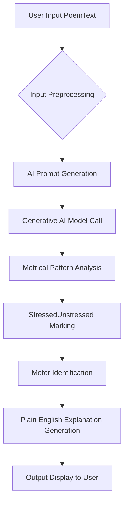
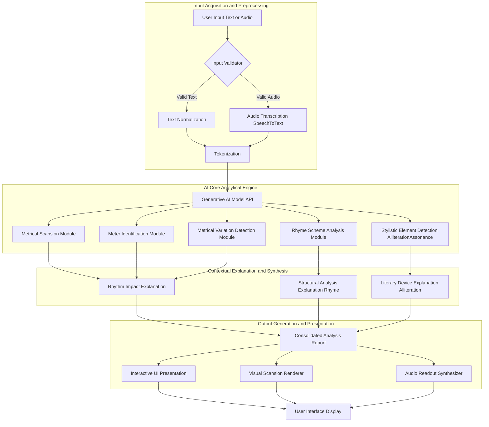

**Title of Invention:** A System and Method for Generative Analysis of Poetic Meter

**Abstract:**
A system for literary analysis is disclosed. A user provides a piece of text, such as a poem or a line of verse. The system sends the text to a generative AI model trained on phonetics and poetry. The AI analyzes the text to determine its metrical pattern e.g. iambic pentameter, marking the stressed and unstressed syllables. The AI then provides a plain-English explanation of the meter and its effect on the poem's rhythm and tone.

**Background:**
The analysis of poetic meter, known as scansion, is a fundamental aspect of literary studies. It involves identifying the rhythmic pattern of a verse, determining which syllables are stressed and unstressed, and classifying the overall metrical scheme. Traditionally, scansion is a complex and subjective task requiring deep knowledge of phonetics, prosody, and poetic conventions. This manual process is time-consuming, prone to inconsistencies, and presents a significant barrier for students and enthusiasts. Existing automated tools often rely on rigid rule-based systems, which struggle with the nuances, variations, and ambiguities inherent in natural language and poetic expression. There is a need for a more intelligent, flexible, and context-aware system that can perform accurate scansion and provide insightful explanations, leveraging advanced artificial intelligence capabilities.

**Detailed Description:**
A student pastes a line from Shakespeare into the tool: "Shall I compare thee to a summer's day?" The system first performs input preprocessing to ensure text validity and normalization. It then constructs a specific prompt for a generative AI model, instructing it to `Perform a scansion of the following line of poetry. Mark the stressed (/) and unstressed (x) syllables and identify the meter, providing a brief explanation of its impact on rhythm.`

The generative AI model, trained on extensive corpora of phonetic data, linguistic patterns, and poetic texts, processes the request. It performs a multi-stage analysis:
1.  **Metrical Pattern Analysis:** The AI identifies the phonetic structure of each word and determines the most probable stress patterns based on context, natural speech rhythm, and poetic conventions.
2.  **Stressed/Unstressed Marking:** It then systematically marks each syllable as stressed (/) or unstressed (x).
3.  **Meter Identification:** Based on the sequence of stressed and unstressed syllables, the AI identifies the predominant poetic meter e.g. Iambic Pentameter, Trochaic Tetrameter.
4.  **Explanation Generation:** The AI generates a plain-English explanation detailing the identified meter, its characteristics, and how this specific metrical choice contributes to the line's rhythm, tone, and overall effect.

The AI returns: `x / x / x / x / x /` and identifies it as "Iambic Pentameter." The system then displays this analysis, potentially alongside an explanation like: "This line is in Iambic Pentameter, consisting of five iambs (unstressed followed by stressed syllables). This meter mimics natural speech rhythms, contributing to the conversational and flowing quality of Shakespeare's sonnets."

**Additional Features and Modules:**
The system can be further enhanced to provide a more comprehensive poetic analysis, beyond basic scansion. These features can be integrated through specialized modules interacting with the core generative AI model.

1.  **Metrical Variation Detection Module:** This module identifies deviations from the primary meter e.g. spondees, pyrrhics, anapests, dactyls within an otherwise consistent metrical pattern. It explains the effect of these variations, such as emphasizing certain words or creating a shift in rhythm.
2.  **Rhyme Scheme Analysis Module:** This module analyzes the end rhymes of a poem, identifying patterns e.g. AABB, ABAB, AABA, and explaining the structural and sonic impact of the chosen rhyme scheme. It can also detect internal rhymes.
3.  **Stylistic Element Detection Module:** This module identifies other common poetic devices, such as alliteration, assonance, consonance, and caesura, explaining their contribution to the poem's sound and meaning.
4.  **Contextual Explanation Module:** Beyond basic meter, this module provides deeper insights into the historical context of the meter's usage, its typical associations, and how the poet manipulates it for specific artistic effects.
5.  **Output Visualization and Audio Readout:** The system can render the scansion visually, highlighting stressed syllables in different colors or fonts. It can also generate an audio readout of the poem, emphasizing the identified meter and rhythm, allowing users to hear the intended cadence.

**Advantages of the Invention:**
*   **Accessibility:** Demystifies poetic meter, making complex literary analysis accessible to students and general readers without extensive prior knowledge.
*   **Accuracy and Nuance:** Leverages generative AI to handle linguistic ambiguities and metrical variations more effectively than rule-based systems.
*   **Efficiency:** Automates a traditionally time-consuming task, providing instant analysis.
*   **Educational Value:** Offers detailed, plain-English explanations that enhance understanding of poetic craft and its effects.
*   **Multimodal Output:** Provides analysis in various formats, including visual representations and auditory readouts, catering to different learning styles.
*   **Comprehensive Analysis:** Extends beyond basic meter to include rhyme scheme, stylistic devices, and contextual insights.

**Claims:**
1.  A method for literary analysis, comprising:
    a.  Receiving a piece of text from a user.
    b.  Providing the text to a generative AI model.
    c.  Prompting the model to analyze the text's metrical structure and identify the poetic meter.
    d.  Displaying the analysis to the user.
2.  The method of claim 1, further comprising marking stressed and unstressed syllables within the received text.
3.  The method of claim 2, further comprising generating a plain-English explanation of the identified poetic meter and its effect on the text's rhythm and tone.
4.  A system for generative analysis of poetic meter, comprising:
    a.  An input module configured to receive poetic text or audio from a user.
    b.  A preprocessing module configured to normalize text and/or transcribe audio into text.
    c.  An AI prompt generation module configured to create instructions for a generative AI model.
    d.  A generative AI core module configured to perform metrical scansion, identify poetic meter, and generate contextual explanations.
    e.  An output display module configured to present the analysis to the user.
5.  The system of claim 4, further comprising a metrical variation detection module integrated with the generative AI core module, configured to identify and explain deviations from the predominant meter.
6.  The system of claim 4, further comprising a rhyme scheme analysis module integrated with the generative AI core module, configured to identify and explain the rhyme patterns within the text.
7.  The system of claim 4, further comprising a stylistic element detection module integrated with the generative AI core module, configured to identify and explain literary devices such as alliteration and assonance.
8.  The system of claim 4, wherein the output display module is configured to render a visual representation of the scansion, highlighting stressed and unstressed syllables.
9.  The system of claim 4, wherein the output display module is configured to generate an audio readout of the text, emphasizing the identified metrical rhythm.
10. A computer-readable medium storing instructions that, when executed by a processor, cause the processor to perform the method of claim 1.