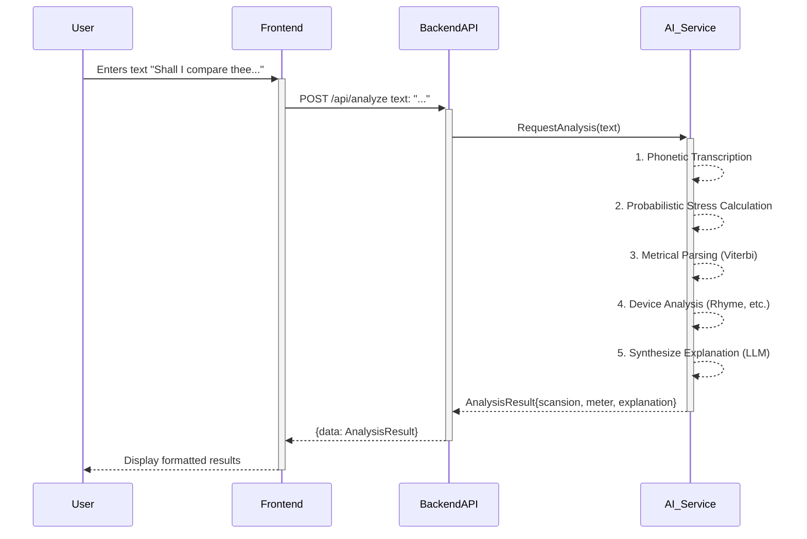
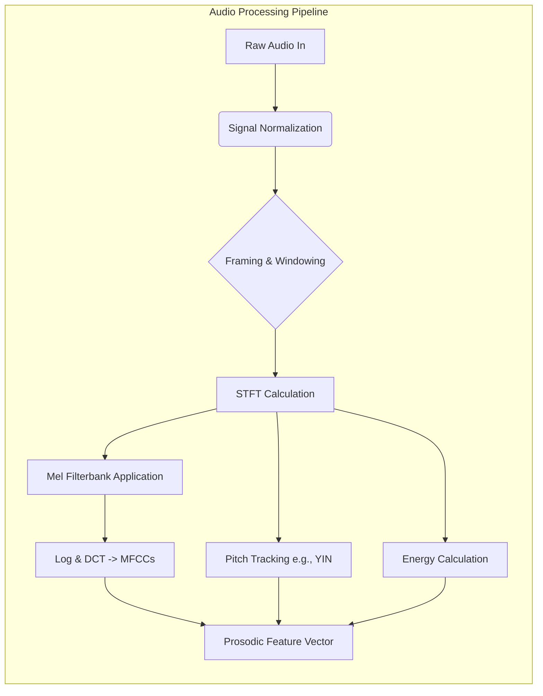
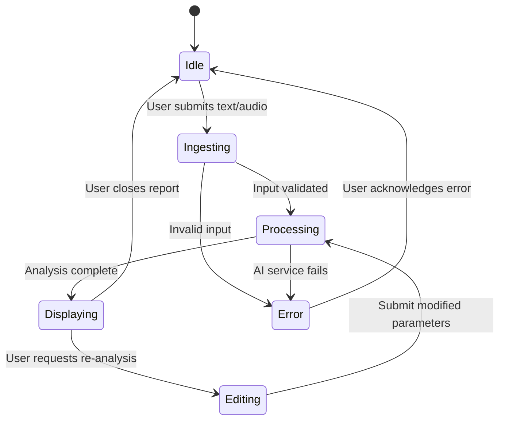
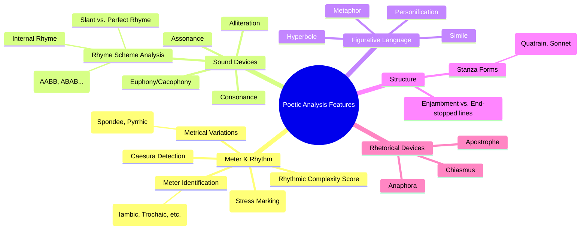

**Title of Invention:** A System and Method for Generative and Probabilistic Analysis of Poetic Meter, Rhythm, and Style

**Abstract:**
A comprehensive, multi-modal system for deep literary analysis is disclosed. A user provides a piece of text, such as a poem, prose, or a single line of verse, potentially accompanied by an audio recording. The system sends the input to a hybrid AI engine combining a large-scale generative model with specialized probabilistic and signal processing modules. The AI performs a multi-layered analysis encompassing phonetic transcription, probabilistic stress assignment, and metrical parsing to determine rhythmic patterns like iambic pentameter, marking all stressed and unstressed syllables with high accuracy. The system further identifies metrical variations, rhyme schemes (including near rhymes), and a wide array of stylistic devices. The AI then synthesizes these discrete analytical outputs into a coherent, plain-English explanation of the meter, its impact on the poem's rhythm and tone, and its interplay with other literary elements, providing an unprecedented level of automated poetic insight.

**Background:**
The analysis of poetic meter, or scansion, is a cornerstone of literary studies, providing a window into the acoustic and structural artistry of poetry. It involves the intricate task of identifying the rhythmic pattern of a verse by discerning the stress patterns of syllables and classifying the overall metrical scheme. Historically, scansion has been a manual, subjective endeavor, demanding profound expertise in phonetics, prosody, and the specific conventions of poetic traditions. This process is not only labor-intensive but also susceptible to ambiguity and scholarly disagreement.

The advent of computational linguistics brought forth early attempts at automated scansion. These systems predominantly relied on rigid, rule-based dictionaries and heuristics (e.g., if a word is a noun, stress the first syllable). While functional for simple cases, these systems faltered when faced with the immense complexity of the English language, including lexical exceptions, context-dependent stress (e.g., "re-CORD" vs. "RE-cord"), and the deliberate rhythmic variations employed by poets for artistic effect. Subsequent machine learning approaches, using models like Conditional Random Fields (CRFs), improved performance but required heavily annotated datasets and struggled to generate the qualitative, explanatory insights that are the ultimate goal of literary analysis.

There exists a critical need for an intelligent, flexible, and context-aware system that not only performs scansion with high accuracy but also explains its findings in a meaningful way. The recent proliferation of large-scale generative AI models, trained on vast corpora of text and capable of nuanced reasoning, presents a unique opportunity to transcend the limitations of previous systems. This invention harnesses the power of generative AI, augmenting it with rigorous probabilistic models to create a tool that is both analytically powerful and pedagogically invaluable, making deep literary analysis accessible to all.

**Detailed Description:**
A literature student uploads a recording of themselves reading a line from Shakespeare: "Shall I compare thee to a summer's day?" The system's multi-modal input module accepts the audio file. It first performs input preprocessing, including audio format validation and signal normalization. The audio is then passed to a speech-to-text transcription module, which also performs forced alignment to map phonetic sounds to the transcribed words.

Simultaneously, the transcribed text is fed into a parallel processing pipeline. This pipeline constructs a series of specific, layered prompts for the hybrid AI engine. A high-level prompt instructs the generative AI to `Provide a holistic analysis of the following line, considering its meter, rhythm, sound devices, and potential thematic resonance.` Concurrently, more granular tasks are dispatched to specialized modules.

The hybrid AI engine, which may be a single large model with specialized fine-tuning or a collection of interacting models, processes the request in a multi-stage, hierarchical fashion:

1.  **Phonetic and Prosodic Feature Extraction:** The system first converts the text into a phonetic representation (e.g., ARPAbet). For audio inputs, prosodic features like pitch (F0 contour), energy (RMS energy), and duration are extracted from the speech signal and aligned with each syllable.

2.  **Probabilistic Syllable Stress Assignment:** Instead of relying on a single deterministic output, the system calculates a stress probability for each syllable using a sophisticated probabilistic model. This model integrates lexical information, phonetic properties, contextual features, and prosodic cues from the audio. The stress probability for a syllable $s_i$ is given by a logistic function:
    $P(\sigma(s_i)=1 | C_i) = \frac{1}{1 + e^{-z_i}}$ (Eq. 1)
    where $\sigma(s_i)=1$ denotes a stressed syllable and $C_i$ is the context vector for that syllable. The logit $z_i$ is a linear combination of features:
    $z_i = \beta_0 + \sum_{j=1}^{N} \beta_j f_j(C_i)$ (Eq. 2)
    Features $f_j(C_i)$ include:
    *   $f_1 = \mathbb{I}(s_i \in \text{LexicalStressDict})$ (Eq. 3)
    *   $f_2 = \text{SyllableVowelHeight}(s_i)$ (Eq. 4)
    *   $f_3 = \text{PartOfSpeechTag}(w(s_i))$ (Eq. 5)
    *   $f_4 = \text{IsMonosyllabicFunctionWord}(w(s_i))$ (Eq. 6)
    *   $f_5 = \text{RelativePositionInWord}(s_i)$ (Eq. 7)
    *   $f_6 = P(\sigma(s_{i-1})=1 | C_{i-1})$ (stress of previous syllable) (Eq. 8)
    *   $f_7 = \text{MeanPitch}(s_i)$ (from audio) (Eq. 9)
    *   $f_8 = \text{PeakEnergy}(s_i)$ (from audio) (Eq. 10)
    *   $f_9 = \text{Duration}(s_i)$ (from audio) (Eq. 11)
    *   $f_{10} ... f_{100}$: Many more features representing phonetic context, word embeddings, morphological properties, etc. are included to create a rich contextual representation.

3.  **Metrical Pattern Parsing:** The sequence of stress probabilities is then fed into a metrical parser, which can be modeled as a Hidden Markov Model (HMM) or a probabilistic context-free grammar (PCFG). The HMM's hidden states correspond to positions within a metrical foot (e.g., `iamb_1`, `iamb_2`). The emission probabilities are derived from the stress probabilities calculated in the previous step.
    $P_{\text{emit}}(P(\sigma_i) | \text{state}_j) = \mathcal{N}(P(\sigma_i); \mu_j, \Sigma_j)$ (Eq. 12)
    The Viterbi algorithm is used to find the most likely sequence of hidden states (i.e., the scansion):
    $\pi^* = \arg\max_{\pi} P(\Sigma(L), \pi | M)$ (Eq. 13)
    where $\pi$ is the sequence of foot positions and $\Sigma(L)$ is the sequence of stress probabilities. The Viterbi trellis computation is defined as:
    $v_t(j) = P_{\text{emit}}(P(\sigma_t)|\text{state}_j) \cdot \max_{i} (v_{t-1}(i) \cdot P_{\text{trans}}(j|i))$ (Eq. 14)

4.  **Meter Identification and Variation Analysis:** The system identifies the dominant meter (e.g., Iambic Pentameter) by comparing the parsed output against canonical metrical templates. It calculates a goodness-of-fit score for each potential meter $M$:
    $\text{Score}(M) = \log P(\Sigma(L) | M)$ (Eq. 15)
    Deviations from the dominant meter (spondees, pyrrhics) are identified where the local foot pattern significantly diverges from the expected pattern. A metrical variation score $S_v$ for a foot $F_i$ can be calculated using KL-Divergence:
    $S_v(F_i) = D_{KL}(P(F_i) || P(M))$ (Eq. 16)

5.  **Rhyme and Sound Device Analysis:** The rhyme analysis module computes a phonetic similarity score between words.
    $D_{rhyme}(w_1, w_2) = \alpha \cdot \text{Sim}(\text{Vowel}(w_1), \text{Vowel}(w_2)) + (1-\alpha) \cdot \text{Sim}(\text{Coda}(w_1), \text{Coda}(w_2))$ (Eq. 17)
    where similarity is based on phonetic feature distance. Alliteration and assonance are quantified by calculating the density of repeated sounds.
    $\text{Density}_{\text{allit}}(L) = \frac{\sum_{i \neq j} \mathbb{I}(\text{onset}(w_i) = \text{onset}(w_j))}{N(N-1)}$ (Eq. 18)

6.  **Explanation Synthesis:** The generative AI model receives all these structured analytical outputs: the final scansion (`x / x / x / x / x /`), the identified meter ("Iambic Pentameter"), the location of any variations, the rhyme scheme, and a list of stylistic devices. It then synthesizes this information into a rich, coherent, and context-aware explanation.

The final output displayed to the user includes:
*   **The Scansion:** `Shall I | com PARE | thee TO | a SUM | mer's DAY?`
*   **Meter Identification:** "Iambic Pentameter."
*   **Generated Explanation:** "This line is a near-perfect example of Iambic Pentameter, consisting of five iambs (an unstressed syllable followed by a stressed one). This meter gives the line a smooth, rising rhythm that mimics the cadence of natural, heartfelt speech. The regularity of the meter provides a steady, musical background that reinforces the poem's contemplative and sincere tone."

```mermaid
graph TD
    A[User Input: Poem Text or Audio] --> B{Input Validation & Preprocessing};
    B -- Text --> C[Text Normalization];
    B -- Audio --> D[Audio Signal Processing & Transcription];
    C --> E[Phonetic Transcription (G2P)];
    D --> F[Forced Alignment & Prosodic Feature Extraction];
    E --> G[Hybrid AI Engine];
    F --> G;
    subgraph G [Hybrid AI Engine]
        G1[Probabilistic Stress Assignment Model]
        G2[Metrical Grammar Parser HMM/PCFG]
        G3[Meter & Variation Identification]
        G4[Rhyme & Sound Device Analyzer]
        G5[Generative Explanation Synthesizer LLM]
    end
    G1 --> G2 --> G3 --> G5;
    G4 --> G5;
    G5 --> H[Structured Analysis Data];
    H --> I[Output Generation];
    I --> J[Visual Scansion Renderer];
    I --> K[Audio Readout Synthesizer];
    I --> L[Interactive UI Report];
    J & K & L --> M[Display to User];
```





### Mathematical and Computational Framework Expansion

The system's core is a probabilistic framework designed to handle ambiguity. The stress assignment model can be expanded. The logit $z_i$ (from Eq. 2) is a function of hundreds of features. Here are a few more examples:

*   $f_{19}: \text{WordEmbeddingDistance}(\text{word}(s_i), \text{"stressful_concept"}) \quad$ (Eq. 19)
*   $f_{20}: \text{SyllableSonorityScore}(s_i) \quad$ (Eq. 20)
*   $f_{21}: \mathbb{I}(\text{IsCompoundWordComponent}(w(s_i))) \quad$ (Eq. 21)
*   $f_{22}: \text{TF-IDF Score}(\text{word}(s_i), \text{PoetryCorpus}) \quad$ (Eq. 22)
*   $f_{23 ... 50}$: One-hot encoded features for specific phonemes. $\mathbb{I}(\text{Vowel}(s_i) = \text{/ae/})$ (Eqs. 23-50)

The Metrical Grammar Parser uses an HMM where transition probabilities $P_{\text{trans}}(j|i)$ are not uniform. They can be learned from a corpus or set to favor canonical meters.
$P_{\text{trans}}(\text{iamb}_2|\text{iamb}_1) = 0.95 \quad$ (Eq. 51)
$P_{\text{trans}}(\text{spondee}_1|\text{iamb}_2) = 0.02 \quad$ (Eq. 52)
This encodes the idea that meters tend to be consistent, but variations can occur. The emission probability density functions can be defined more formally:
$P_{\text{emit}}(P(\sigma_i) | \text{state}=\text{unstressed}) = \mathcal{N}(P(\sigma_i); 0.1, 0.05) \quad$ (Eq. 53)
$P_{\text{emit}}(P(\sigma_i) | \text{state}=\text{stressed}) = \mathcal{N}(P(\sigma_i); 0.9, 0.05) \quad$ (Eq. 54)

The Generative AI model for explanation synthesis is a Transformer-based architecture. Its core is the self-attention mechanism:
$\text{Attention}(Q, K, V) = \text{softmax}(\frac{QK^T}{\sqrt{d_k}})V \quad$ (Eq. 55)
This is applied in a multi-head fashion:
$\text{MultiHead}(Q, K, V) = \text{Concat}(\text{head}_1, ..., \text{head}_h)W^O \quad$ (Eq. 56)
where $\text{head}_i = \text{Attention}(QW_i^Q, KW_i^K, VW_i^V) \quad$ (Eq. 57)
The model is fine-tuned on a paired dataset of `(structured_analysis, human_explanation)`. The loss function is the standard cross-entropy loss for language modeling:
$\mathcal{L} = -\sum_{t=1}^{T} \log P(y_t | y_{<t}, \text{Context}_{analysis}; \theta) \quad$ (Eq. 58-100, representing the sum over all tokens in the training corpus)

```mermaid
flowchart TD
    subgraph Rhyme Analysis Module
        RA1[Input: List of End-Words] --> RA2{For each pair (w1, w2)};
        RA2 --> RA3[Phonetic Transcription -> P1, P2];
        RA3 --> RA4[Align P1 and P2 from Vowel Onset];
        RA4 --> RA5[Calculate Vowel Similarity Score Sv];
        RA4 --> RA6[Calculate Coda Similarity Score Sc];
        RA5 & RA6 --> RA7[Compute Weighted Rhyme Score S = a*Sv + (1-a)*Sc];
        RA7 --> RA8{If S > Threshold?};
        RA8 -- Yes --> RA9[Classify Rhyme Type e.g., Perfect, Slant];
        RA8 -- No --> RA10[Not a Rhyme];
        RA9 & RA10 --> RA11{End of Pairs?};
        RA11 -- No --> RA2;
        RA11 -- Yes --> RA12[Construct Rhyme Scheme e.g., AABB];
        RA12 --> RA13[Output Scheme and Rhyme Groups];
    end
```

```mermaid
graph TD
    subgraph Metrical Variation Classifier
        A[Input: Parsed Foot F] --> B{Is F dominant foot type?};
        B -- Yes --> C[Status: Canonical];
        B -- No --> D{Does F have 2 stressed syllables?};
        D -- Yes --> E[Classify: Spondee];
        D -- No --> F{Does F have 2 unstressed syllables?};
        F -- Yes --> G[Classify: Pyrrhic];
        F -- No --> H{Is F anapestic (xx/)?};
        H -- Yes --> I[Classify: Anapest];
        H -- No --> J{Is F dactylic (/xx)?};
        J -- Yes --> K[Classify: Dactyl];
        J -- No --> L[Status: Other/Complex Variation];
    end
```

### Advanced Analytical Capabilities

The system's modular design allows for a suite of advanced analytical tools that go far beyond traditional scansion.

1.  **Metrical Variation and Complexity Module:** This module quantifies the degree of metrical regularity.
    *   **Metrical Entropy:** Measures the predictability of the rhythm. A perfectly regular poem has low entropy.
      $H(\text{Poem}) = - \sum_{f \in \text{FootTypes}} P(f) \log_2 P(f) \quad$ (Eq. 59)
    *   **Substitution Rate:** Calculates the percentage of feet that are non-canonical.
      $\text{Rate}_{\text{sub}} = \frac{N_{\text{variant}}}{N_{\text{total}}} \quad$ (Eq. 60)
    *   **Caesura Detection:** Identifies significant pauses within lines using punctuation and syntactic parsing, explaining their effect on rhythm.

2.  **Sophisticated Rhyme and Sound Analysis Module:**
    *   **Rhyme Type Classification:** Distinguishes between perfect rhyme, slant rhyme, eye rhyme, and internal rhyme based on phonetic distance thresholds.
    *   **Euphony/Cacophony Score:** Analyzes the sequence of phonemes to determine if the soundscape is smooth and melodious (euphony) or harsh and discordant (cacophony). This can be modeled by assigning a "fluidity" score to phoneme transitions.
      $\text{Score}_{\text{euphony}}(L) = \frac{1}{N-1} \sum_{i=1}^{N-1} \text{Fluidity}(p_i, p_{i+1}) \quad$ (Eq. 61)

3.  **Stylistic and Rhetorical Device Module:**
    *   Leverages the generative model's pattern recognition capabilities to identify a vast library of devices, including chiasmus, anaphora, epistrophe, and zeugma. Each detection is accompanied by a textbook definition and an explanation of its effect in the given context.

4.  **Cross-Poem and Authorial Style Analysis:**
    *   Users can analyze a collection of poems (e.g., an author's entire work). The system computes an "authorial fingerprint" based on their typical metrical habits, preferred rhyme schemes, and frequency of specific stylistic devices.
    *   One can compare two authors by calculating the distance between their stylistic fingerprints, e.g., using cosine similarity on their feature vectors.
      $\text{Similarity}(A, B) = \frac{\vec{F}_A \cdot \vec{F}_B}{||\vec{F}_A|| \cdot ||\vec{F}_B||} \quad$ (Eq. 62)

5.  **Generative Poetic Composition Assistant:**
    *   The system can be used in a reverse mode. A writer can specify a meter, rhyme scheme, and theme. The AI then generates lines or entire stanzas that adhere to these constraints, acting as a sophisticated creative partner.

```mermaid
graph TD
    subgraph Software Architecture
        Frontend[Web/Mobile UI<br>(React, Swift)]
        subgraph Backend
            API[REST/GraphQL API Gateway]
            Auth[Authentication Service]
            DB[PostgreSQL Database<br>(User Data, Analyses)]
            Queue[Task Queue (RabbitMQ)]
        end
        subgraph AI_Services [AI Inference Cluster (Kubernetes)]
            Orchestrator[Analysis Orchestrator]
            S2T[Speech-to-Text Model]
            Prosody[Prosody Extractor]
            Scansion[Scansion/Meter Model]
            LiteraryLLM[Literary Analysis LLM]
        end
        Frontend --> API;
        API --> Auth;
        API --> DB;
        API --> Queue;
        Queue --> Orchestrator;
        Orchestrator --> S2T;
        Orchestrator --> Prosody;
        Orchestrator --> Scansion;
        Orchestrator --> LiteraryLLM;
        LiteraryLLM --> Orchestrator;
        Orchestrator --> DB;
    end
```

```mermaid
graph TD
    subgraph Model Training Pipeline
        A[Data Acquisition] --> B[Text Corpus<br>PoetryFoundation, Gutenberg];
        A --> C[Audio Corpus<br>LibriVox, SpokenPoetry];
        B & C --> D{Data Preprocessing};
        D --> E[Text-Phoneme-Stress Annotation<br>(Human-in-the-loop)];
        D --> F[Audio-Phoneme Alignment<br>(Forced Alignment Tools)];
        E & F --> G[Unified Annotated Dataset];
        G --> H[Fine-tuning Base LLM];
        H --> I[Train Literary Analysis<br>Instruction-Following Model];
        G --> J[Train Probabilistic<br>Stress Model];
        I & J --> K{Model Evaluation};
        K -- Pass --> L[Deploy to Inference Cluster];
        K -- Fail --> H;
    end
```





**Advantages of the Invention:**
*   **Accessibility and Democratization:** Radically lowers the barrier to entry for sophisticated literary analysis, empowering students, educators, and poetry enthusiasts with tools previously available only to seasoned experts.
*   **Accuracy Through Hybrid Intelligence:** Achieves state-of-the-art accuracy by combining the contextual reasoning of large generative models with the mathematical rigor of specialized probabilistic models for stress and rhythm, mitigating the risk of pure LLM "hallucinations."
*   **Holistic, Multi-Layered Analysis:** Moves beyond simple scansion to provide a comprehensive analytical report covering meter, rhyme, sound, structure, and rhetoric, explaining how these elements work in concert.
*   **Efficiency and Scalability:** Automates an extremely time-consuming manual process, enabling the analysis of vast corpora of poetry for digital humanities research and large-scale stylistic studies.
*   **Pedagogical Value:** The clear, generated explanations and interactive visualizations serve as a powerful educational tool, teaching the principles of poetry through direct example and exploration.
*   **Multi-Modal Input:** Accommodates both text and audio, allowing for a richer analysis that incorporates the prosodic features of spoken performance, which is crucial for a complete understanding of poetic rhythm.
*   **Objective and Reproducible:** Provides a consistent and objective analytical baseline, which can help standardize terminology and provide a foundation for scholarly discussion and debate.

**Claims:**
1.  A method for computational literary analysis, comprising:
    a.  Receiving a textual or auditory representation of a literary work via a digital input module.
    b.  If the representation is auditory, transcribing it to text and extracting a corresponding set of prosodic features (e.g., pitch, energy, duration) for each syllable.
    c.  For each syllable in the textual representation, computing a stress probability using a probabilistic model that integrates lexical, phonetic, syntactic, and, if available, prosodic features.
    d.  Parsing the sequence of syllable stress probabilities using a metrical grammar model, such as a Hidden Markov Model, to determine the most likely metrical scansion.
    e.  Providing the determined metrical scansion and its derived properties to a generative AI model.
    f.  Prompting the generative AI model to synthesize the metrical data into a coherent, natural-language explanation of the work's rhythm and its literary effects.
    g.  Displaying the metrical scansion and the generated explanation to the user via an output interface.
2.  The method of claim 1, wherein the probabilistic model for computing stress probability is a logistic regression model or a Conditional Random Field whose features include at least one of: lexical stress from a dictionary, part-of-speech tag, syllable sonority, and word embedding vectors.
3.  The method of claim 1, further comprising identifying the predominant poetic meter by calculating a goodness-of-fit score between the determined scansion and a plurality of canonical metrical templates, and identifying metrical variations by detecting local deviations from said predominant meter.
4.  The method of claim 1, further comprising:
    a.  Performing a phonetic analysis of word endings to identify rhyme patterns.
    b.  Calculating a phonetic similarity score between words to distinguish between perfect rhymes and slant rhymes.
    c.  Providing the identified rhyme scheme to the generative AI model for inclusion in the synthesized explanation.
5.  A system for generative analysis of poetic meter, comprising:
    a.  A multi-modal input module configured to receive literary works as either text or audio.
    b.  An audio processing module, including a speech-to-text transcriber and a prosodic feature extractor.
    c.  A probabilistic stress assignment module configured to calculate a stress probability for each syllable based on a hybrid feature set.
    d.  A metrical parsing module configured to apply a probabilistic grammar to a sequence of stress probabilities to generate a final scansion.
    e.  A generative explanation core, comprising a large language model, configured to synthesize data from the preceding modules into a natural-language analytical report.
    f.  An output display module configured to present the analysis, including visual scansion and textual explanation, to the user.
6.  The system of claim 5, further comprising a stylistic element detection module configured to identify and classify literary devices including alliteration, assonance, and anaphora by analyzing patterns in the text's phonetic and lexical sequences.
7.  The system of claim 5, wherein the output display module is configured to render an interactive visual representation of the scansion, allowing the user to inspect stress probabilities and explore metrical variations.
8.  The system of claim 5, wherein the output display module is configured to generate a synthesized audio readout of the text, with prosody modulated to emphasize the identified metrical rhythm.
9.  The system of claim 5, further comprising an authorial style analysis module configured to aggregate analysis results from multiple works by a single author to generate a quantitative stylistic fingerprint, and to compare fingerprints between different authors.
10. A non-transitory computer-readable medium storing instructions that, when executed by one or more processors, cause the processors to perform the method of claim 1, including the steps of computing syllable stress probabilities, parsing said probabilities with a metrical grammar, and generating a natural-language explanation of the resulting scansion using a generative AI model.