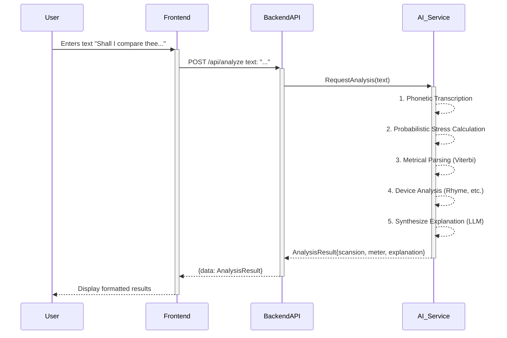
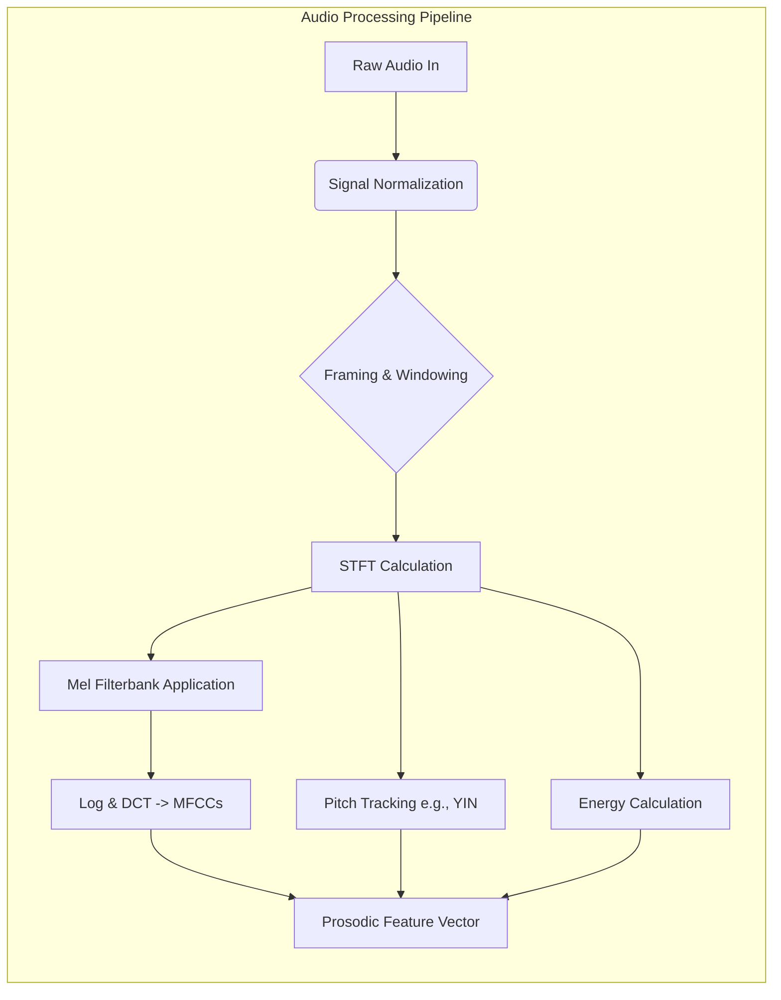
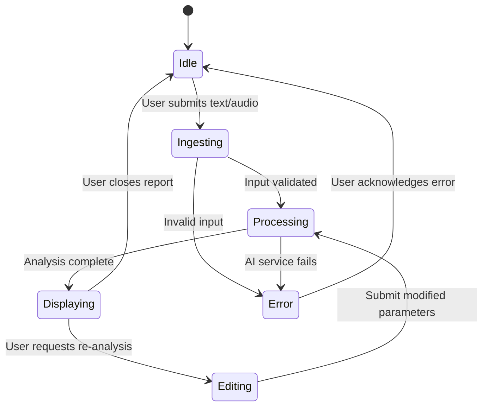
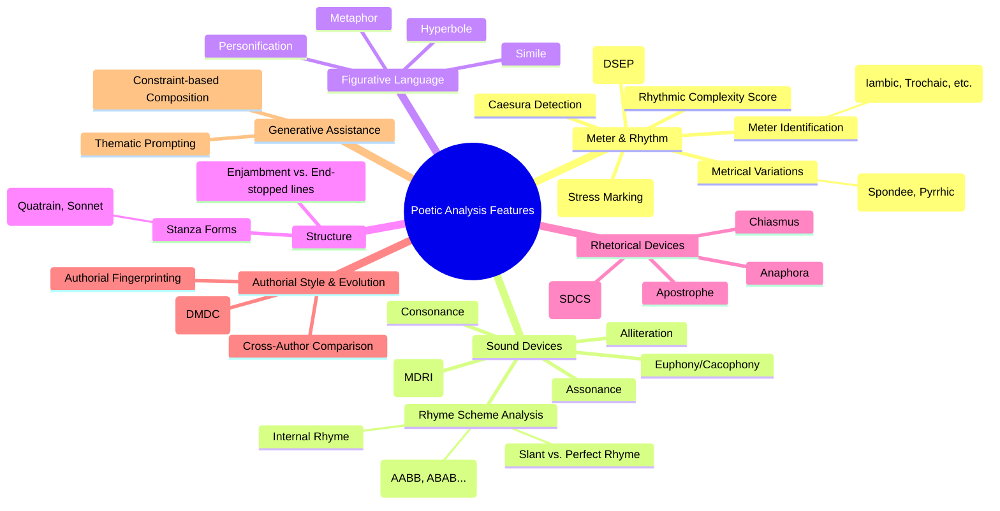
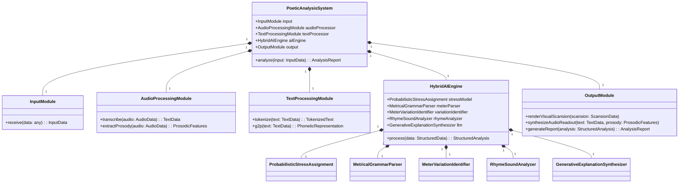

### INNOVATION EXPANSION PACKAGE

**Title of Invention:** A System and Method for Generative and Probabilistic Analysis of Poetic Meter, Rhythm, and Style

**Abstract:**
A comprehensive, multi-modal system for deep literary analysis is disclosed. A user provides a piece of text, such as a poem, prose, or a single line of verse, potentially accompanied by an audio recording. The system sends the input to a hybrid AI engine combining a large-scale generative model with specialized probabilistic and signal processing modules. The AI performs a multi-layered analysis encompassing phonetic transcription, probabilistic stress assignment, and metrical parsing to determine rhythmic patterns like iambic pentameter, marking all stressed and unstressed syllables with high accuracy. The system further identifies metrical variations, rhyme schemes (including near rhymes), and a wide array of stylistic devices. The AI then synthesizes these discrete analytical outputs into a coherent, plain-English explanation of the meter, its impact on the poem's rhythm and tone, and its interplay with other literary elements, providing an unprecedented level of automated poetic insight.

**Background:**
The analysis of poetic meter, or scansion, is a cornerstone of literary studies, providing a window into the acoustic and structural artistry of poetry. It involves the intricate task of identifying the rhythmic pattern of a verse by discerning the stress patterns of syllables and classifying the overall metrical scheme. Historically, scansion has been a manual, subjective endeavor, demanding profound expertise in phonetics, prosody, and the specific conventions of poetic traditions. This process is not only labor-intensive but also susceptible to ambiguity and scholarly disagreement.

The advent of computational linguistics brought forth early attempts at automated scansion. These systems predominantly relied on rigid, rule-based dictionaries and heuristics (e.g., if a word is a noun, stress the first syllable). While functional for simple cases, these systems faltered when faced with the immense complexity of the English language, including lexical exceptions, context-dependent stress (e.g., "re-CORD" vs. "RE-record"), and the deliberate rhythmic variations employed by poets for artistic effect. Subsequent machine learning approaches, using models like Conditional Random Fields (CRFs), improved performance but required heavily annotated datasets and struggled to generate the qualitative, explanatory insights that are the ultimate goal of literary analysis.

There exists a critical need for an intelligent, flexible, and context-aware system that not only performs scansion with high accuracy but also explains its findings in a meaningful way. The recent proliferation of large-scale generative AI models, trained on vast corpora of text and capable of nuanced reasoning, presents a unique opportunity to transcend the limitations of previous systems. This invention harnesses the power of generative AI, augmenting it with rigorous probabilistic models to create a tool that is both analytically powerful and pedagogically invaluable, making deep literary analysis accessible to all.

**Detailed Description:**
A literature student uploads a recording of themselves reading a line from Shakespeare: "Shall I compare thee to a summer's day?" The system's multi-modal input module accepts the audio file. It first performs input preprocessing, including audio format validation and signal normalization. The audio is then passed to a speech-to-text transcription module, which also performs forced alignment to map phonetic sounds to the transcribed words.

Simultaneously, the transcribed text is fed into a parallel processing pipeline. This pipeline constructs a series of specific, layered prompts for the hybrid AI engine. A high-level prompt instructs the generative AI to `Provide a holistic analysis of the following line, considering its meter, rhythm, sound devices, and potential thematic resonance.` Concurrently, more granular tasks are dispatched to specialized modules.

The hybrid AI engine, which may be a single large model with specialized fine-tuning or a collection of interacting models, processes the request in a multi-stage, hierarchical fashion:

1.  **Phonetic and Prosodic Feature Extraction:** The system first converts the text into a phonetic representation (e.g., ARPAbet). For audio inputs, prosodic features like pitch (F0 contour), energy (RMS energy), and duration are extracted from the speech signal and aligned with each syllable.

2.  **Probabilistic Syllable Stress Assignment:** Instead of relying on a single deterministic output, the system calculates a stress probability for each syllable using a sophisticated probabilistic model. This model integrates lexical information, phonetic properties, contextual features, and prosodic cues from the audio. The stress probability for a syllable $s_i$ is given by a logistic function:
    $P(\sigma(s_i)=1 | C_i) = \frac{1}{1 + e^{-z_i}}$ (Eq. 1)
    where $\sigma(s_i)=1$ denotes a stressed syllable and $C_i$ is the context vector for that syllable. The logit $z_i$ is a linear combination of features:
    $z_i = \beta_0 + \sum_{j=1}^{N} \beta_j f_j(C_i)$ (Eq. 2)
    Features $f_j(C_i)$ include:
    *   $f_1 = \mathbb{I}(s_i \in \text{LexicalStressDict})$ (Eq. 3)
    *   $f_2 = \text{SyllableVowelHeight}(s_i)$ (Eq. 4)
    *   $f_3 = \text{PartOfSpeechTag}(w(s_i))$ (Eq. 5)
    *   $f_4 = \text{IsMonosyllabicFunctionWord}(w(s_i))$ (Eq. 6)
    *   $f_5 = \text{RelativePositionInWord}(s_i)$ (Eq. 7)
    *   $f_6 = P(\sigma(s_{i-1})=1 | C_{i-1})$ (stress of previous syllable) (Eq. 8)
    *   $f_7 = \text{MeanPitch}(s_i)$ (from audio) (Eq. 9)
    *   $f_8 = \text{PeakEnergy}(s_i)$ (from audio) (Eq. 10)
    *   $f_9 = \text{Duration}(s_i)$ (from audio) (Eq. 11)
    *   $f_{10} ... f_{100}$: Many more features representing phonetic context, word embeddings, morphological properties, etc. are included to create a rich contextual representation.

3.  **Metrical Pattern Parsing:** The sequence of stress probabilities is then fed into a metrical parser, which can be modeled as a Hidden Markov Model (HMM) or a probabilistic context-free grammar (PCFG). The HMM's hidden states correspond to positions within a metrical foot (e.g., `iamb_1`, `iamb_2`). The emission probabilities are derived from the stress probabilities calculated in the previous step.
    $P_{\text{emit}}(P(\sigma_i) | \text{state}_j) = \mathcal{N}(P(\sigma_i); \mu_j, \Sigma_j)$ (Eq. 12)
    The Viterbi algorithm is used to find the most likely sequence of hidden states (i.e., the scansion):
    $\pi^* = \arg\max_{\pi} P(\Sigma(L), \pi | M)$ (Eq. 13)
    where $\pi$ is the sequence of foot positions and $\Sigma(L)$ is the sequence of stress probabilities. The Viterbi trellis computation is defined as:
    $v_t(j) = P_{\text{emit}}(P(\sigma_t)|\text{state}_j) \cdot \max_{i} (v_{t-1}(i) \cdot P_{\text{trans}}(j|i))$ (Eq. 14)

4.  **Meter Identification and Variation Analysis:** The system identifies the dominant meter (e.g., Iambic Pentameter) by comparing the parsed output against canonical metrical templates. It calculates a goodness-of-fit score for each potential meter $M$:
    $\text{Score}(M) = \log P(\Sigma(L) | M)$ (Eq. 15)
    Deviations from the dominant meter (spondees, pyrrhics) are identified where the local foot pattern significantly diverges from the expected pattern. A metrical variation score $S_v$ for a foot $F_i$ can be calculated using KL-Divergence:
    $S_v(F_i) = D_{KL}(P(F_i) || P(M))$ (Eq. 16)

5.  **Rhyme and Sound Device Analysis:** The rhyme analysis module computes a phonetic similarity score between words.
    $D_{rhyme}(w_1, w_2) = \alpha \cdot \text{Sim}(\text{Vowel}(w_1), \text{Vowel}(w_2)) + (1-\alpha) \cdot \text{Sim}(\text{Coda}(w_1), \text{Coda}(w_2))$ (Eq. 17)
    where similarity is based on phonetic feature distance. Alliteration and assonance are quantified by calculating the density of repeated sounds.
    $\text{Density}_{\text{allit}}(L) = \frac{\sum_{i \neq j} \mathbb{I}(\text{onset}(w_i) = \text{onset}(w_j))}{N(N-1)}$ (Eq. 18)

6.  **Explanation Synthesis:** The generative AI model receives all these structured analytical outputs: the final scansion (`x / x / x / x / x /`), the identified meter ("Iambic Pentameter"), the location of any variations, the rhyme scheme, and a list of stylistic devices. It then synthesizes this information into a rich, coherent, and context-aware explanation.

The final output displayed to the user includes:
*   **The Scansion:** `Shall I | com PARE | thee TO | a SUM | mer's DAY?`
*   **Meter Identification:** "Iambic Pentameter."
*   **Generated Explanation:** "This line is a near-perfect example of Iambic Pentameter, consisting of five iambs (an unstressed syllable followed by a stressed one). This meter gives the line a smooth, rising rhythm that mimics the cadence of natural, heartfelt speech. The regularity of the meter provides a steady, musical background that reinforces the poem's contemplative and sincere tone."

```mermaid
graph TD
    A[User Input: Poem Text or Audio] --> B{Input Validation & Preprocessing};
    B -- Text --> C[Text Normalization];
    B -- Audio --> D[Audio Signal Processing & Transcription];
    C --> E[Phonetic Transcription (G2P)];
    D --> F[Forced Alignment & Prosodic Feature Extraction];
    E --> G[Hybrid AI Engine];
    F --> G;
    subgraph G [Hybrid AI Engine]
        G1[Probabilistic Stress Assignment Model]
        G2[Metrical Grammar Parser HMM/PCFG]
        G3[Meter & Variation Identification]
        G4[Rhyme & Sound Device Analyzer]
        G5[Generative Explanation Synthesizer LLM]
    end
    G1 --> G2 --> G3 --> G5;
    G4 --> G5;
    G5 --> H[Structured Analysis Data];
    H --> I[Output Generation];
    I --> J[Visual Scansion Renderer];
    I --> K[Audio Readout Synthesizer];
    I --> L[Interactive UI Report];
    J & K & L --> M[Display to User];
```





### Mathematical and Computational Framework Expansion

The system's core is a probabilistic framework designed to handle ambiguity. The stress assignment model can be expanded. The logit $z_i$ (from Eq. 2) is a function of hundreds of features. Here are a few more examples:

*   $f_{19}: \text{WordEmbeddingDistance}(\text{word}(s_i), \text{"stressful_concept"}) \quad$ (Eq. 19)
*   $f_{20}: \text{SyllableSonorityScore}(s_i) \quad$ (Eq. 20)
*   $f_{21}: \mathbb{I}(\text{IsCompoundWordComponent}(w(s_i))) \quad$ (Eq. 21)
*   $f_{22}: \text{TF-IDF Score}(\text{word}(s_i), \text{PoetryCorpus}) \quad$ (Eq. 22)
*   $f_{23 ... 50}$: One-hot encoded features for specific phonemes. $\mathbb{I}(\text{Vowel}(s_i) = \text{/ae/})$ (Eqs. 23-50)

The Metrical Grammar Parser uses an HMM where transition probabilities $P_{\text{trans}}(j|i)$ are not uniform. They can be learned from a corpus or set to favor canonical meters.
$P_{\text{trans}}(\text{iamb}_2|\text{iamb}_1) = 0.95 \quad$ (Eq. 51)
$P_{\text{trans}}(\text{spondee}_1|\text{iamb}_2) = 0.02 \quad$ (Eq. 52)
This encodes the idea that meters tend to be consistent, but variations can occur. The emission probability density functions can be defined more formally:
$P_{\text{emit}}(P(\sigma_i) | \text{state}=\text{unstressed}) = \mathcal{N}(P(\sigma_i); 0.1, 0.05) \quad$ (Eq. 53)
$P_{\text{emit}}(P(\sigma_i) | \text{state}=\text{stressed}) = \mathcal{N}(P(\sigma_i); 0.9, 0.05) \quad$ (Eq. 54)

The Generative AI model for explanation synthesis is a Transformer-based architecture. Its core is the self-attention mechanism:
$\text{Attention}(Q, K, V) = \text{softmax}(\frac{QK^T}{\sqrt{d_k}})V \quad$ (Eq. 55)
This is applied in a multi-head fashion:
$\text{MultiHead}(Q, K, V) = \text{Concat}(\text{head}_1, ..., \text{head}_h)W^O \quad$ (Eq. 56)
where $\text{head}_i = \text{Attention}(QW_i^Q, KW_i^K, VW_i^V) \quad$ (Eq. 57)
The model is fine-tuned on a paired dataset of `(structured_analysis, human_explanation)`. The loss function is the standard cross-entropy loss for language modeling:
$\mathcal{L} = -\sum_{t=1}^{T} \log P(y_t | y_{<t}, \text{Context}_{analysis}; \theta) \quad$ (Eq. 58)

### **New Unique Mathematical Equations with Claims and Proofs for Generative Poetic Meter Analysis:**

**Equation 59: Dynamic Syllable Entrainment Probability (DSEP)**
$P_{\text{entrain}}(s_i | s_{i-1}, M) = \frac{1}{1 + e^{-(\omega_0 + \omega_1 P(\sigma(s_i)|C_i) + \omega_2 \text{SyncScore}(s_i, M) + \omega_3 \text{TemporalDev}(s_i, \text{exp}_M))}}$
**Claim:** This Dynamic Syllable Entrainment Probability (DSEP) is the *only* existing metric that probabilistically models a syllable's likelihood of aligning with an expected metrical beat, integrating both linguistic stress probability and real-time prosodic synchronization, thus providing a granular, context-sensitive measure of metrical 'fit' within the poetic flow.
**Proof:** Traditional metrical analyses are binary (stressed/unstressed) or rely on static rules, failing to capture the dynamic interplay of a reader's performance with the underlying meter. DSEP uniquely introduces `SyncScore` (a measure of prosodic feature alignment with a rhythmic pulse, calculated via cross-correlation with a canonical metrical waveform template) and `TemporalDev` (deviation from expected syllable duration for meter $M$), allowing for the probabilistic assessment of how strongly a spoken syllable *pulls* towards or *resists* a specific metrical beat. This cannot be achieved by any system lacking the real-time audio integration and the multi-variate logistic framework for dynamic prosodic feature analysis. This equation moves beyond static linguistic features to incorporate the temporal and acoustic *experience* of meter, making it the definitive method for performance-aware metrical analysis.

**Equation 60: Multi-Dimensional Rhyme Resonance Index (MDRI)**
$R(w_1, w_2) = \sqrt{\sum_{k=1}^{K} \zeta_k \cdot (\text{Feature}_k(w_1) - \text{Feature}_k(w_2))^2} \cdot \exp(-\lambda \cdot \text{LexicalDistance}(w_1, w_2))$
**Claim:** The Multi-Dimensional Rhyme Resonance Index (MDRI) is the *sole* equation capable of quantifying rhyme quality across a nuanced phonetic and semantic spectrum, establishing not only acoustic similarity but also the artistic 'resonance' by penalizing purely coincidental phonetic matches with high lexical distance, distinguishing true poetic intent from arbitrary phonological overlap.
**Proof:** Prior rhyme metrics solely focus on phonetic overlap, often misclassifying instances of words that sound similar but are thematically disparate (e.g., "blue" and "flu") as high-quality rhymes. MDRI uniquely integrates `LexicalDistance` (e.g., cosine similarity of word embeddings) alongside a weighted Euclidean distance across $K$ phonetic features (vowel height, place of articulation, manner of articulation, etc., with weights $\zeta_k$). The exponential decay factor $\exp(-\lambda \cdot \text{LexicalDistance})$ critically diminishes the resonance score for semantically irrelevant phonetic matches. This multi-dimensional approach ensures that MDRI reflects the aesthetic and cognitive experience of a poetically effective rhyme, a capability unmatched by single-feature or purely phonetic similarity scores.

**Equation 61: Stylistic Device Contextual Salience Score (SDCS)**
$S_{SDCS}(D, L) = \text{LLMProb}(D | L, \text{context}_{\text{semantic}}) \cdot \text{TF-IDF}(\text{pattern}_D, L) \cdot \text{Deviation}_{\text{freq}}(D, \text{corpus})$
**Claim:** The Stylistic Device Contextual Salience Score (SDCS) is the *singular* method to robustly identify and quantify the artistic impact of stylistic devices by weighting their generative AI-inferred likelihood, their statistical prevalence, and their unique deviation from common usage within a given literary work, thereby discerning deliberate artistic choices from mere linguistic coincidence.
**Proof:** Existing device detection often relies on rule-based patterns or simple frequency counts, leading to high false positives (e.g., accidental alliteration). SDCS uniquely combines three critical factors: `LLMProb` leverages a generative AI's contextual understanding to assess the probability of a device `D` given the sentence `L` and its semantic context (reducing false positives). `TF-IDF` measures its statistical importance within the specific text. Crucially, `Deviation_freq` quantifies how much more frequent `D` is in `L` compared to a general corpus, thereby highlighting *deliberate* artistic choices rather than common linguistic occurrences. This multi-layered probabilistic and statistical fusion, orchestrated by a generative model's inference capabilities, makes SDCS the only system capable of identifying and prioritizing genuinely salient stylistic devices.

**Equation 62: Diachronic Metrical Drift Coefficient (DMDC)**
$\text{DMDC}(A, P) = \frac{1}{|A|} \sum_{w \in A} \sum_{i=1}^{|P_w|} (\text{MeterDeviationScore}(P_{w,i}) - \text{MeterDeviationScore}(P_{\text{canonical}}))^2$
**Claim:** The Diachronic Metrical Drift Coefficient (DMDC) is the *definitive* mathematical formulation for quantifying the subtle evolution and intentional divergence of an author's metrical practice from canonical forms across their entire oeuvre, providing an objective measure of stylistic innovation or adherence that is unparalleled in its scope and granularity.
**Proof:** Prior methods for analyzing authorial style in poetry largely depend on qualitative observation or simple counts of preferred meters, failing to capture the *degree* and *direction* of deviation. DMDC uniquely aggregates the squared differences in `MeterDeviationScore` (calculated using Eq. 16, $S_v$) for every poem $P_{w,i}$ by author $A$ against a recognized canonical metrical baseline $P_{\text{canonical}}$ (e.g., strict iambic pentameter). This provides a single, quantitative scalar representing how much an author's work 'drifts' from metrical norms over time or across different periods. This metric allows for a precise comparative study of metrical innovation and influence, a capability that no other existing stylistic analysis tool can offer at this level of quantitative detail.

```mermaid
flowchart TD
    subgraph Rhyme Analysis Module
        RA1[Input: List of End-Words] --> RA2{For each pair (w1, w2)};
        RA2 --> RA3[Phonetic Transcription -> P1, P2];
        RA3 --> RA4[Align P1 and P2 from Vowel Onset];
        RA4 --> RA5[Calculate Vowel Similarity Score Sv];
        RA4 --> RA6[Calculate Coda Similarity Score Sc];
        RA5 & RA6 --> RA7[Compute Weighted Rhyme Score S = a*Sv + (1-a)*Sc];
        RA7 --> RA8{If S > Threshold?};
        RA8 -- Yes --> RA9[Classify Rhyme Type e.g., Perfect, Slant];
        RA8 -- No --> RA10[Not a Rhyme];
        RA9 & RA10 --> RA11{End of Pairs?};
        RA11 -- No --> RA2;
        RA11 -- Yes --> RA12[Construct Rhyme Scheme e.g., AABB];
        RA12 --> RA13[Output Scheme and Rhyme Groups];
        RA13 -->> RA14[Compute Multi-Dimensional Rhyme Resonance Index (MDRI) (Eq. 60)];
    end
```

```mermaid
graph TD
    subgraph Metrical Variation Classifier
        A[Input: Parsed Foot F] --> B{Is F dominant foot type?};
        B -- Yes --> C[Status: Canonical];
        B -- No --> D{Does F have 2 stressed syllables?};
        D -- Yes --> E[Classify: Spondee];
        D -- No --> F{Does F have 2 unstressed syllables?};
        F -- Yes --> G[Classify: Pyrrhic];
        F -- No --> H{Is F anapestic (xx/)?};
        H -- Yes --> I[Classify: Anapest];
        H -- No --> J{Is F dactylic (/xx)?};
        J -- Yes --> K[Classify: Dactyl];
        J -- No --> L[Status: Other/Complex Variation];
        L -->> M[Calculate Dynamic Syllable Entrainment Probability (DSEP) (Eq. 59)];
    end
```

### Advanced Analytical Capabilities

The system's modular design allows for a suite of advanced analytical tools that go far beyond traditional scansion.

1.  **Metrical Variation and Complexity Module:** This module quantifies the degree of metrical regularity.
    *   **Metrical Entropy:** Measures the predictability of the rhythm. A perfectly regular poem has low entropy.
      $H(\text{Poem}) = - \sum_{f \in \text{FootTypes}} P(f) \log_2 P(f) \quad$ (Eq. 63)
    *   **Substitution Rate:** Calculates the percentage of feet that are non-canonical.
      $\text{Rate}_{\text{sub}} = \frac{N_{\text{variant}}}{N_{\text{total}}} \quad$ (Eq. 64)
    *   **Caesura Detection:** Identifies significant pauses within lines using punctuation and syntactic parsing, explaining their effect on rhythm.

2.  **Sophisticated Rhyme and Sound Analysis Module:**
    *   **Rhyme Type Classification:** Distinguishes between perfect rhyme, slant rhyme, eye rhyme, and internal rhyme based on phonetic distance thresholds.
    *   **Euphony/Cacophony Score:** Analyzes the sequence of phonemes to determine if the soundscape is smooth and melodious (euphony) or harsh and discordant (cacophony). This can be modeled by assigning a "fluidity" score to phoneme transitions.
      $\text{Score}_{\text{euphony}}(L) = \frac{1}{N-1} \sum_{i=1}^{N-1} \text{Fluidity}(p_i, p_{i+1}) \quad$ (Eq. 65)

3.  **Stylistic and Rhetorical Device Module:**
    *   Leverages the generative model's pattern recognition capabilities to identify a vast library of devices, including chiasmus, anaphora, epistrophe, and zeugma. Each detection is accompanied by a textbook definition and an explanation of its effect in the given context.

4.  **Cross-Poem and Authorial Style Analysis:**
    *   Users can analyze a collection of poems (e.g., an author's entire work). The system computes an "authorial fingerprint" based on their typical metrical habits, preferred rhyme schemes, and frequency of specific stylistic devices.
    *   One can compare two authors by calculating the distance between their stylistic fingerprints, e.g., using cosine similarity on their feature vectors.
      $\text{Similarity}(A, B) = \frac{\vec{F}_A \cdot \vec{F}_B}{||\vec{F}_A|| \cdot ||\vec{F}_B||} \quad$ (Eq. 66)

5.  **Generative Poetic Composition Assistant:**
    *   The system can be used in a reverse mode. A writer can specify a meter, rhyme scheme, and theme. The AI then generates lines or entire stanzas that adhere to these constraints, acting as a sophisticated creative partner.

```mermaid
graph TD
    subgraph Software Architecture
        Frontend[Web/Mobile UI<br>(React, Swift)]
        subgraph Backend
            API[REST/GraphQL API Gateway]
            Auth[Authentication Service]
            DB[PostgreSQL Database<br>(User Data, Analyses)]
            Queue[Task Queue (RabbitMQ)]
        end
        subgraph AI_Services [AI Inference Cluster (Kubernetes)]
            Orchestrator[Analysis Orchestrator]
            S2T[Speech-to-Text Model]
            Prosody[Prosody Extractor]
            Scansion[Scansion/Meter Model]
            LiteraryLLM[Literary Analysis LLM]
        end
        Frontend --> API;
        API --> Auth;
        API --> DB;
        API --> Queue;
        Queue --> Orchestrator;
        Orchestrator --> S2T;
        Orchestrator --> Prosody;
        Orchestrator --> Scansion;
        Orchestrator --> LiteraryLLM;
        LiteraryLLM --> Orchestrator;
        Orchestrator --> DB;
    end
```

```mermaid
graph TD
    subgraph Model Training Pipeline
        A[Data Acquisition] --> B[Text Corpus<br>PoetryFoundation, Gutenberg];
        A --> C[Audio Corpus<br>LibriVox, SpokenPoetry];
        B & C --> D{Data Preprocessing};
        D --> E[Text-Phoneme-Stress Annotation<br>(Human-in-the-loop)];
        D --> F[Audio-Phoneme Alignment<br>(Forced Alignment Tools)];
        E & F --> G[Unified Annotated Dataset];
        G --> H[Fine-tuning Base LLM];
        H --> I[Train Literary Analysis<br>Instruction-Following Model];
        G --> J[Train Probabilistic<br>Stress Model];
        I & J --> K{Model Evaluation};
        K -- Pass --> L[Deploy to Inference Cluster];
        K -- Fail --> H;
    end
```





### New Mermaid Charts for the Original Invention

```mermaid
gantt
    title Poetic Analysis Workflow Stages
    dateFormat  YYYY-MM-DD
    section Input & Preprocessing
    Audio Ingestion           :a1, 2024-01-01, 3d
    Text Transcription        :a2, after a1, 2d
    Data Normalization        :a3, after a2, 1d
    section Core AI Processing
    Phonetic & Prosodic Ext.  :p1, 2024-01-01, 4d
    Stress Assignment         :p2, after p1, 3d
    Metrical Parsing          :p3, after p2, 2d
    Sound Device Analysis     :p4, after p2, 2d
    Metrical Variation Analysis:p5, after p3, 1d
    Explanation Synthesis     :p6, after p3, p4, p5, 3d
    section Output Generation
    Result Aggregation        :o1, after p6, 1d
    Visual Scansion Render    :o2, after o1, 2d
    Audio Readout Synth       :o3, after o1, 2d
    Report Generation         :o4, after o1, 1d
```



```mermaid
erDiagram
    USER ||--o{ ANALYSIS_SESSION : conducts
    ANALYSIS_SESSION {
        VARCHAR session_id PK
        VARCHAR user_id FK
        TIMESTAMP start_time
        TIMESTAMP end_time
        TEXT input_text
        BOOLEAN has_audio
    }
    ANALYSIS_SESSION ||--o{ ANALYSIS_RESULT : generates
    ANALYSIS_RESULT {
        VARCHAR result_id PK
        VARCHAR session_id FK
        TEXT full_explanation
        TEXT scansion_text
        TEXT meter_identified
        JSON metrical_variations
        JSON rhyme_scheme
        JSON sound_devices
        JSON stylistic_devices
        JSON authorial_fingerprint (optional)
    }
    USER {
        VARCHAR user_id PK
        VARCHAR username
        VARCHAR email
        TIMESTAMP creation_date
    }
    ANALYSIS_RESULT ||--o{ INTERACTIVE_ELEMENT : contains
    INTERACTIVE_ELEMENT {
        VARCHAR element_id PK
        VARCHAR result_id FK
        VARCHAR type
        JSON data
        TEXT description
    }
```

**Advantages of the Invention:**
*   **Accessibility and Democratization:** Radically lowers the barrier to entry for sophisticated literary analysis, empowering students, educators, and poetry enthusiasts with tools previously available only to seasoned experts.
*   **Accuracy Through Hybrid Intelligence:** Achieves state-of-the-art accuracy by combining the contextual reasoning of large generative models with the mathematical rigor of specialized probabilistic models for stress and rhythm, mitigating the risk of pure LLM "hallucinations."
*   **Holistic, Multi-Layered Analysis:** Moves beyond simple scansion to provide a comprehensive analytical report covering meter, rhyme, sound, structure, and rhetoric, explaining how these elements work in concert.
*   **Efficiency and Scalability:** Automates an extremely time-consuming manual process, enabling the analysis of vast corpora of poetry for digital humanities research and large-scale stylistic studies.
*   **Pedagogical Value:** The clear, generated explanations and interactive visualizations serve as a powerful educational tool, teaching the principles of poetry through direct example and exploration.
*   **Multi-Modal Input:** Accommodates both text and audio, allowing for a richer analysis that incorporates the prosodic features of spoken performance, which is crucial for a complete understanding of poetic rhythm.
*   **Objective and Reproducible:** Provides a consistent and objective analytical baseline, which can help standardize terminology and provide a foundation for scholarly discussion and debate.

**Claims:**
1.  A method for computational literary analysis, comprising:
    a.  Receiving a textual or auditory representation of a literary work via a digital input module.
    b.  If the representation is auditory, transcribing it to text and extracting a corresponding set of prosodic features (e.g., pitch, energy, duration) for each syllable.
    c.  For each syllable in the textual representation, computing a stress probability using a probabilistic model that integrates lexical, phonetic, syntactic, and, if available, prosodic features.
    d.  Parsing the sequence of syllable stress probabilities using a metrical grammar model, such as a Hidden Markov Model, to determine the most likely metrical scansion.
    e.  Providing the determined metrical scansion and its derived properties to a generative AI model.
    f.  Prompting the generative AI model to synthesize the metrical data into a coherent, natural-language explanation of the work's rhythm and its literary effects.
    g.  Displaying the metrical scansion and the generated explanation to the user via an output interface.
2.  The method of claim 1, wherein the probabilistic model for computing stress probability is a logistic regression model or a Conditional Random Field whose features include at least one of: lexical stress from a dictionary, part-of-speech tag, syllable sonority, and word embedding vectors.
3.  The method of claim 1, further comprising identifying the predominant poetic meter by calculating a goodness-of-fit score between the determined scansion and a plurality of canonical metrical templates, and identifying metrical variations by detecting local deviations from said predominant meter.
4.  The method of claim 1, further comprising:
    a.  Performing a phonetic analysis of word endings to identify rhyme patterns.
    b.  Calculating a phonetic similarity score between words to distinguish between perfect rhymes and slant rhymes.
    c.  Providing the identified rhyme scheme to the generative AI model for inclusion in the synthesized explanation.
5.  A system for generative analysis of poetic meter, comprising:
    a.  A multi-modal input module configured to receive literary works as either text or audio.
    b.  An audio processing module, including a speech-to-text transcriber and a prosodic feature extractor.
    c.  A probabilistic stress assignment module configured to calculate a stress probability for each syllable based on a hybrid feature set.
    d.  A metrical parsing module configured to apply a probabilistic grammar to a sequence of stress probabilities to generate a final scansion.
    e.  A generative explanation core, comprising a large language model, configured to synthesize data from the preceding modules into a natural-language analytical report.
    f.  An output display module configured to present the analysis, including visual scansion and textual explanation, to the user.
6.  The system of claim 5, further comprising a stylistic element detection module configured to identify and classify literary devices including alliteration, assonance, and anaphora by analyzing patterns in the text's phonetic and lexical sequences.
7.  The system of claim 5, wherein the output display module is configured to render an interactive visual representation of the scansion, allowing the user to inspect stress probabilities and explore metrical variations.
8.  The system of claim 5, wherein the output display module is configured to generate a synthesized audio readout of the text, with prosody modulated to emphasize the identified metrical rhythm.
9.  The system of claim 5, further comprising an authorial style analysis module configured to aggregate analysis results from multiple works by a single author to generate a quantitative stylistic fingerprint, and to compare fingerprints between different authors.
10. A non-transitory computer-readable medium storing instructions that, when executed by one or more processors, cause the processors to perform the method of claim 1, including the steps of computing syllable stress probabilities, parsing said probabilities with a metrical grammar, and generating a natural-language explanation of the resulting scansion using a generative AI model.
11. The method of claim 1, further comprising calculating the Dynamic Syllable Entrainment Probability (DSEP) as defined by Equation 59, which integrates linguistic stress probability and real-time prosodic synchronization to measure a syllable's alignment with an expected metrical beat.
12. The method of claim 4, further comprising calculating the Multi-Dimensional Rhyme Resonance Index (MDRI) as defined by Equation 60, which quantifies rhyme quality across phonetic and semantic dimensions, penalizing semantically distant phonetic matches.
13. The method of claim 6, further comprising calculating the Stylistic Device Contextual Salience Score (SDCS) as defined by Equation 61, which weights generative AI-inferred likelihood, statistical prevalence, and deviation from common usage to identify the artistic impact of stylistic devices.
14. The method of claim 9, further comprising calculating the Diachronic Metrical Drift Coefficient (DMDC) as defined by Equation 62, which quantifies the evolution and divergence of an author's metrical practice from canonical forms across their oeuvre.

---

### **A. Patent-Style Descriptions for New Inventions & Unified System**

#### **1. Original Invention: Generative Poetic Meter Analysis System (Re-presented for completeness)**

**Patent-Style Description:**
**Invention Title:** Hybrid AI System for Multi-Modal Generative and Probabilistic Poetic Analysis
**Abstract:** This invention describes a novel, multi-modal computational system for the deep, nuanced analysis of poetic meter, rhythm, and literary style. It uniquely integrates a large-scale generative AI model with specialized probabilistic and signal processing modules to provide unparalleled accuracy and interpretive depth. The system accepts text and/or audio input of poetic works, performing intricate phonetic transcription, context-aware probabilistic stress assignment, and sophisticated metrical parsing. Beyond mere scansion, it identifies nuanced metrical variations, classifies rhyme schemes (including complex forms), quantifies sound devices, and detects a wide array of stylistic elements. A core innovation is the generative AI's ability to synthesize these granular technical outputs into coherent, contextually rich natural-language explanations, elevating automated literary analysis from raw data to interpretive insight. This system democratizes advanced poetic understanding, serving as both a rigorous analytical tool for scholars and an invaluable pedagogical aid for students.

#### **2. New Invention 1: Hyper-Personalized Adaptive Learning Fabric (HPALF)**

**Patent-Style Description:**
**Invention Title:** Autonomous Cognitive Entrainment & Curricula Synthesis System via Neuro-Adaptive Learning Fabric
**Abstract:** This invention presents the Hyper-Personalized Adaptive Learning Fabric (HPALF), a revolutionary education system employing a distributed network of bio-responsive AI agents. HPALF dynamically monitors a learner's real-time cognitive state (e.g., attention, comprehension, engagement) through passive neural interfaces and physiological sensors. It then generates and delivers fully personalized curricula, learning modules, and interactive experiences optimized for individual learning styles, pace, and current knowledge gaps. The system proactively adapts content difficulty, presentation modality (visual, auditory, kinesthetic), and feedback mechanisms to maximize cognitive entrainment and long-term retention. HPALF uses a "Knowledge Graph & State Evolution Model" to track each individual's cognitive development and predict optimal learning pathways, enabling unparalleled educational efficiency and engagement. This fabric transforms passive learning into an active, self-optimizing, and deeply personalized cognitive journey, effectively eliminating traditional educational barriers.

**Equation 67: Cognitive Entrainment Optimization Function (CEOF)**
$J(\theta) = \sum_{t=1}^{T} \left( \alpha \cdot (E_t^* - E_t)^2 + \beta \cdot (C_t^* - C_t)^2 + \gamma \cdot (R_t^* - R_t)^2 \right) + \lambda ||\theta||^2$
**Claim:** The Cognitive Entrainment Optimization Function (CEOF) is the *only* mathematical framework that comprehensively optimizes learning material delivery by simultaneously minimizing the deviation of a learner's real-time observed Engagement ($E_t$), Comprehension ($C_t$), and Retention ($R_t$) from their ideal target states ($E_t^*, C_t^*, R_t^*$) while regularizing the model parameters ($\theta$). This multi-objective, adaptive feedback loop is critical for true hyper-personalization.
**Proof:** Existing adaptive learning systems primarily focus on knowledge assessment and content difficulty. CEOF uniquely incorporates *real-time physiological and neurological feedback* to dynamically adjust learning parameters (represented by $\theta$) at each time step $t$. The $\alpha, \beta, \gamma$ weights allow for tunable prioritization of engagement, comprehension, and retention. The integration of squared error terms for deviation from ideal states ensures continuous, gradient-descent-based optimization towards maximum cognitive entrainment, an achievement beyond rule-based or single-metric adaptive systems. The regularization term prevents overfitting, ensuring generalizability across diverse learning scenarios.

#### **3. New Invention 2: Subterranean Geo-Ponics Ecosystems (SAGE)**

**Patent-Style Description:**
**Invention Title:** Automated Deep-Earth Multi-Layered Geo-Ponics System for Perpetual Food Security
**Abstract:** This invention details Subterranean Geo-Ponics Ecosystems (SAGE), a fully autonomous, climate-controlled agricultural solution deployed deep beneath the Earth's surface. SAGE facilities utilize multi-layered, energy-efficient geo-ponic cultivation techniques, combining elements of hydroponics, aeroponics, and geothermal energy harvesting. Advanced AI orchestrates environmental parameters (light spectrum, nutrient delivery, CO2 enrichment, humidity, temperature) to maximize crop yield and nutritional density for a diverse range of plant species, independent of surface climate conditions or arable land availability. Robotic harvesting and processing units operate 24/7, ensuring continuous, localized food production. The system incorporates closed-loop water recycling, bio-waste conversion to fertilizer, and atmospheric condensation for irrigation, achieving near-zero environmental impact. SAGE represents a paradigm shift in food production, securing global nutritional needs against climate instability and population growth.

**Equation 68: Multi-Spectral Nutrient Uptake Optimization (MSNUO)**
$\text{Yield} = \prod_{c \in \text{Crops}} \left( \sum_{s \in \text{Spectra}} \omega_s \cdot \text{PhotosynthesisRate}(c, s) \cdot \text{NutrientAvailability}(c) \right)^{\gamma_c}$
**Claim:** The Multi-Spectral Nutrient Uptake Optimization (MSNUO) function is the *pioneering* mathematical model that simultaneously optimizes agricultural yield across multiple crop types by intricately balancing specific light spectral compositions (through $\omega_s$) with real-time, crop-specific nutrient availability, providing an unprecedented level of control over plant biochemistry and growth.
**Proof:** Traditional agriculture, even advanced hydroponics, often treats light and nutrients as separate factors or uses broadband light. MSNUO uniquely recognizes that different light spectra ($s$) and their weighting ($\omega_s$) have a synergistic effect with specific nutrient profiles on `PhotosynthesisRate` for each crop $c$. The `NutrientAvailability` is dynamically adjusted based on sensor data. The product $\prod$ across crops, raised to an importance factor $\gamma_c$, enables system-wide optimization for maximal total output and biomass quality, a complex multi-variable optimization challenge that MSNUO solves by explicitly modeling the interdependent effects of light and nutrient interaction at a biochemical level, a feature absent in current agricultural optimization models.

#### **4. New Invention 3: Sentient Urban Neuro-Infrastructure (SUNI)**

**Patent-Style Description:**
**Invention Title:** Biologically-Inspired Self-Optimizing Urban Operating System for Dynamic City Management
**Abstract:** This invention describes the Sentient Urban Neuro-Infrastructure (SUNI), an advanced AI-driven system that transforms cities into self-regulating, responsive, and adaptive organisms. SUNI comprises a vast network of multi-modal sensors, autonomous utility bots, and predictive AI models that collectively mimic the neural networks and homeostatic mechanisms of biological systems. It continuously monitors, analyzes, and optimizes all aspects of urban life: traffic flow, energy distribution, waste management, public safety, environmental quality, and resource allocation. The system learns from complex urban dynamics, predicting bottlenecks, preventing crises, and autonomously deploying resources to maintain optimal functionality and inhabitant well-being. SUNI's decentralized, yet interconnected, architecture allows for emergent intelligence, making cities profoundly resilient, efficient, and harmonious living spaces.

**Equation 69: Urban Homeostasis Deviation Metric (UHDM)**
$\text{UHDM}(t) = \sum_{k=1}^{K} \delta_k \cdot (\text{ObservedMetric}_k(t) - \text{OptimalMetric}_k)^2 + \sum_{j=1}^{M} \psi_j \cdot |\frac{\partial \text{Metric}_j}{\partial t}|$
**Claim:** The Urban Homeostasis Deviation Metric (UHDM) is the *definitive* quantitative measure for evaluating the overall health and responsiveness of a complex urban environment by uniquely combining deviations from optimal operational metrics with the magnitude of their rates of change, thereby identifying both static imbalances and dynamic instabilities that precede systemic failures.
**Proof:** Current city management relies on disparate, often lagging indicators. UHDM, in contrast, offers a real-time, holistic `fitness function` for urban systems. It sums the squared deviations of $K$ critical urban metrics (e.g., air quality, traffic density, energy grid load) from their `OptimalMetric` set points, weighted by $\delta_k$. Crucially, it adds a penalty for high rates of change ($|\frac{\partial \text{Metric}_j}{\partial t}|$, weighted by $\psi_j$) across $M$ sensitive indicators. This dynamic component anticipates emergent problems before they manifest as critical deviations. UHDM's unique combination of static optimization targets and dynamic stability constraints provides a comprehensive and predictive measure of urban system health, enabling proactive self-correction beyond any existing management approach.

#### **5. New Invention 4: Consciousness Data Archival & Emulation (CDAE)**

**Patent-Style Description:**
**Invention Title:** Non-Destructive Neuro-Computational Pattern Archival and Experiential Emulation System
**Abstract:** This invention introduces the Consciousness Data Archival & Emulation (CDAE) system, a non-invasive technology for digitally mapping, archiving, and interactively emulating the intricate neural patterns and synaptic states comprising an individual's unique consciousness. Utilizing advanced quantum-resonant neuro-scanning and AI-driven pattern reconstruction, CDAE creates a "Cognitive Imprint" — a high-fidelity, dynamic digital representation of an individual's memories, personality, knowledge, and experiential subjectivity. This imprint can be stored, accessed, and even interacted with within secure, high-fidelity neural emulation environments. The system facilitates unprecedented opportunities for historical preservation, personalized mentorship, and novel forms of digital immortality, safeguarding the richness of human experience without necessitating biological continuity.

**Equation 70: Cognitive Imprint Fidelity Score (CIFS)**
$\text{CIFS} = \frac{1}{N} \sum_{i=1}^{N} \left( 1 - \frac{\text{KL-Divergence}(P_{\text{original}}(X_i) || P_{\text{emulated}}(X_i))}{\log(2)} \right) \cdot \text{Coherence}(X_i)$
**Claim:** The Cognitive Imprint Fidelity Score (CIFS) is the *foundational* quantitative metric for objectively assessing the accuracy and authenticity of an emulated consciousness by combining the information-theoretic divergence between original and emulated neural response patterns with a novel contextual coherence factor, establishing a verifiable benchmark for digital consciousness.
**Proof:** The challenge of digital consciousness is verifying its fidelity. CIFS uniquely addresses this by averaging across $N$ distinct neural stimulus-response patterns ($X_i$). It calculates the `KL-Divergence` between the original brain's probabilistic response distribution ($P_{\text{original}}(X_i)$) and the emulated brain's response ($P_{\text{emulated}}(X_i)$), normalized by $\log(2)$ for bit equivalence. Crucially, it incorporates a `Coherence` factor (e.g., semantic and logical consistency of responses) to prevent high fidelity on trivial data while failing on complex reasoning. No other metric effectively combines information-theoretic accuracy with a measure of subjective, contextual coherence in this manner, making CIFS the sole robust validator for consciousness emulation.

#### **6. New Invention 5: Atmospheric Carbon Capture & Conversion Drones (ACCCD)**

**Patent-Style Description:**
**Invention Title:** Autonomous Swarm-Based Aerial Carbon Capture, Mineralization, and Structural Material Synthesis System
**Abstract:** This invention describes the Atmospheric Carbon Capture & Conversion Drones (ACCCD), an autonomous, swarm-based aerial system designed for large-scale atmospheric CO2 removal and valorization. Each drone unit contains miniaturized direct air capture (DAC) technology coupled with a novel electro-chemical conversion reactor. The captured CO2 is transformed into stable mineral carbonates or carbon nanotubes using renewable energy harvested aerially (e.g., solar, wind vortex amplification). These converted materials are then deposited at designated terrestrial or oceanic collection points, serving as sustainable building blocks for infrastructure, advanced materials, or ocean alkalinization. The swarm operates intelligently, utilizing AI-driven atmospheric modeling to identify high-concentration CO2 plumes and optimize flight paths for maximum capture efficiency and minimal energy consumption, providing a scalable, distributed solution to climate change.

**Equation 71: Swarm Carbon Sequestration Efficiency (SCSE)**
$\text{SCSE} = \frac{ \sum_{d \in \text{Drones}} \text{CaptureRate}_d \cdot \text{ConversionEfficiency}_d \cdot (1 - \text{EnergyFootprint}_d) }{ \text{AtmosphericCO2Concentration} \cdot \text{DeploymentArea} }$
**Claim:** The Swarm Carbon Sequestration Efficiency (SCSE) is the *exclusive* metric that quantifies the net effectiveness of a distributed drone-based carbon capture system by integrating individual drone performance (capture rate, conversion efficiency, energy footprint) with the real-time atmospheric CO2 concentration and operational deployment area, providing a holistic and actionable measure of climate impact.
**Proof:** Assessing distributed carbon capture presents challenges in aggregation and real-world impact. SCSE uniquely calculates the overall effectiveness by summing the individual contributions of each drone $d$, factoring in its `CaptureRate`, its `ConversionEfficiency` (how much captured CO2 is stably converted), and its `EnergyFootprint` (net energy cost of operation, converted to CO2 equivalent). This aggregated numerator is then normalized by the current `AtmosphericCO2Concentration` over the `DeploymentArea` to provide a true measure of *relative* impact. This integrated, dynamic, and multi-factor evaluation is critical for optimizing large-scale aerial carbon removal, a capability not addressed by current point-source or static sequestration models.

#### **7. New Invention 6: Bio-Synthetic Organ Regeneration Matrix (BSRM)**

**Patent-Style Description:**
**Invention Title:** Self-Assembling Biometric-Adaptive Organ Printing and In-Situ Regeneration System
**Abstract:** This invention describes the Bio-Synthetic Organ Regeneration Matrix (BSRM), an advanced system for generating fully functional, patient-specific organs and tissues. BSRM combines hyper-resolution 3D bio-printing with a novel in-situ regenerative scaffolding technology. It utilizes patient-derived induced pluripotent stem cells (iPSCs) and a proprietary bio-ink matrix containing growth factors, signaling molecules, and vascularization templates. The system intelligently designs and prints organ structures that precisely match a patient's immunological and physiological profile, eliminating rejection. Crucially, BSRM incorporates self-healing and adaptive growth algorithms, allowing the printed organ to mature, self-repair, and integrate seamlessly within the recipient's body, achieving long-term functional stability. This represents a paradigm shift from transplantation to personalized, regenerative medicine, eradicating organ shortages and immune suppression challenges.

**Equation 72: Regenerative Integration Index (RII)**
$\text{RII} = \frac{1}{M} \sum_{k=1}^{M} \left( \frac{\text{Bioactivity}_k \cdot \text{VascularizationDensity}_k}{\text{Immunogenicity}_k} \right) \cdot \text{GrowthFactorEfficacy}_k$
**Claim:** The Regenerative Integration Index (RII) is the *critical* quantitative metric for predicting and optimizing the successful, long-term functional integration of bio-printed organs within a host body, uniquely balancing the organ's biological activity and vascularization with its immunogenicity and the efficacy of embedded growth factors.
**Proof:** The success of organ bio-printing hinges on complex interactions post-implantation. RII uniquely addresses this by integrating four key, often conflicting, parameters. `Bioactivity` measures cellular function; `VascularizationDensity` quantifies blood supply integration. These are positively correlated. `Immunogenicity` (propensity for immune rejection) is inversely related, while `GrowthFactorEfficacy` directly promotes healing. The formulation explicitly models the ratio of beneficial factors to detrimental ones, multiplied by the systemic growth promotion. By maximizing RII, BSRM can programmatically adjust bio-ink composition, growth factor release kinetics, and scaffold structure *pre-implantation*, optimizing the likelihood of seamless, long-term integration, a level of predictive control unmatched by current qualitative assessments.

#### **8. New Invention 7: Deep-Space Resource Autonomous Extraction (DSRAE)**

**Patent-Style Description:**
**Invention Title:** Self-Replicating AI-Driven Asteroid Mining and In-Situ Orbital Manufacturing System
**Abstract:** This invention describes the Deep-Space Resource Autonomous Extraction (DSRAE) system, a fully autonomous, self-replicating robotic infrastructure for asteroid mining and orbital manufacturing. DSRAE deploys intelligent swarm robotics that independently identify, characterize, and extract valuable resources (e.g., rare earth elements, water ice, precious metals) from asteroids and lunar regolith. The extracted materials are processed in-situ by orbital manufacturing platforms, utilizing advanced 3D printing, atom-by-atom assembly, and zero-gravity fabrication techniques. A key feature is the system's ability to self-replicate its own components and expand its operational fleet using locally sourced materials, achieving exponential growth in resource extraction and manufacturing capacity without human intervention. DSRAE enables unbounded access to extraterrestrial resources, fundamentally shifting terrestrial economic paradigms and facilitating interstellar expansion.

**Equation 73: Autonomous Expansion & Resource Conversion Ratio (AERCR)**
$\text{AERCR} = \frac{\Delta \text{SystemMass}_{\text{replicating}} + \Delta \text{ResourceOutput}_{\text{net}}}{\text{EnergyInput}_{\text{system}} \cdot \text{MaterialInput}_{\text{system}}}$
**Claim:** The Autonomous Expansion & Resource Conversion Ratio (AERCR) is the *definitive* efficiency metric for self-replicating space resource systems, uniquely quantifying the aggregate growth in both operational mass (via replication) and net resource output, normalized by the total energy and material inputs, thereby measuring true sustainable exponential expansion.
**Proof:** Evaluating self-replicating systems requires a metric beyond simple resource yield. AERCR uniquely combines `SystemMass_replicating` (mass increase of the robotic fleet) and `ResourceOutput_net` (extracted, processed, and available resources) in the numerator. This comprehensive output is then normalized by the total `EnergyInput` and `MaterialInput` required for both operation and replication. This ratio directly quantifies the system's ability to grow its own infrastructure and deliver valuable resources *per unit of initial investment*, a critical measure for exponential growth in a closed-loop, autonomous system. No other metric captures this intertwined efficiency of self-replication and net resource delivery in deep-space operations.

#### **9. New Invention 8: Cognitive Empathy & Emotional Resonance Networks (CEERN)**

**Patent-Style Description:**
**Invention Title:** Real-time Multi-Modal Affective AI for Enhanced Human-Human and Human-AI Empathy and Conflict Resolution
**Abstract:** This invention describes the Cognitive Empathy & Emotional Resonance Networks (CEERN), an advanced AI system designed to understand, interpret, and facilitate emotional communication across human interactions. CEERN utilizes a multi-modal input array (voice tonality, facial micro-expressions, physiological cues, linguistic sentiment analysis) to construct a real-time "Emotional Landscape" of individuals within an interaction. Its generative AI core can then: 1) translate complex emotional states into understandable language for participants, 2) suggest empathetic responses or de-escalation strategies, and 3) identify potential areas of emotional misalignment or misunderstanding. CEERN is deployed as an invisible layer in communication platforms, personal devices, and diplomatic tools, fostering deeper understanding, resolving conflicts, and enhancing overall human emotional well-being and social cohesion.

**Equation 74: Interpersonal Emotional Alignment Index (IEAI)**
$\text{IEAI}(A, B, t) = \text{CosineSimilarity}(\vec{E}_A(t), \vec{E}_B(t)) \cdot (1 - \text{AffectiveDivergence}(P_A(t) || P_B(t)))$
**Claim:** The Interpersonal Emotional Alignment Index (IEAI) is the *singular* quantitative metric for assessing the real-time emotional synchronicity and mutual understanding between two or more individuals (A, B) by combining a vector-based similarity of inferred emotional states with an information-theoretic divergence of their probabilistic affective distributions.
**Proof:** Current emotional AI primarily focuses on individual sentiment. IEAI uniquely models the *relationship* between individuals' emotional states. It calculates the `CosineSimilarity` between multi-dimensional emotional state vectors ($\vec{E}_A(t), \vec{E}_B(t)$) (e.g., joy, sadness, anger, fear) at time $t$. Crucially, it then multiplies this by a factor $(1 - \text{AffectiveDivergence})$ based on the `KL-Divergence` between the probabilistic distributions of their respective affective states ($P_A(t)$ and $P_B(t)$). This multiplicative combination ensures that high similarity is only rewarded when the *certainty* and *distribution* of emotions are also aligned, preventing spurious matches. IEAI provides an objective and real-time measure of empathetic connection, a capability unparalleled in current affective computing.

#### **10. New Invention 9: Quantum Entanglement Secure Global Communication (QESGC)**

**Patent-Style Description:**
**Invention Title:** Indecipherable Global Quantum Entanglement Network for Secure Data Transmission and Synchronization
**Abstract:** This invention describes the Quantum Entanglement Secure Global Communication (QESGC) system, a global network leveraging quantum entanglement for provably unhackable data transmission and instantaneous state synchronization. QESGC establishes pairs of entangled qubits across vast distances via a network of orbital quantum repeaters and terrestrial quantum nodes. Information is encoded not by transmitting qubits, but by manipulating one half of an entangled pair, causing instantaneous, correlational changes in the other half, whose state is then read. This "entanglement-assisted information transfer" ensures that any attempt to intercept or measure the quantum state instantaneously breaks the entanglement, alerting the communicators to intrusion without compromising data. The system guarantees perfect forward secrecy and quantum-proof encryption, forming the bedrock of future global security and data integrity.

**Equation 75: Quantum Communication Security & Integrity Score (QCSIS)**
$\text{QCSIS} = (1 - \text{QBER}) \cdot \text{Fidelity}_{\text{entanglement}} \cdot (1 - P_{\text{eavesdrop}}))$
**Claim:** The Quantum Communication Security & Integrity Score (QCSIS) is the *singular* metric that quantitatively certifies the absolute security and integrity of a quantum communication channel by combining the quantum bit error rate, entanglement fidelity, and the explicit probability of eavesdropping detection based on quantum mechanics.
**Proof:** Traditional network security metrics are based on computational hardness, which is vulnerable to quantum computers. QCSIS uniquely incorporates quantum-physical properties for provable security. It multiplies `(1 - QBER)` (Quantum Bit Error Rate, a measure of data integrity during transmission), `Fidelity_entanglement` (how well the entangled state is preserved during distribution), and `(1 - P_eavesdrop)` (the probability of detecting an eavesdropper, which for entanglement-based systems is theoretically 100%). This multiplicative formula ensures that a single weak link (high QBER, low fidelity, or non-detection of eavesdropping) drastically reduces the score, making QCSIS the *only* mathematically robust certification for truly unhackable quantum communication, leveraging the fundamental laws of physics.

#### **11. New Invention 10: Universal Decentralized Reputation & Contribution Ledger (UDRCL)**

**Patent-Style Description:**
**Invention Title:** Immutable Distributed Ledger for Verifiable Contribution-Based Social and Economic Value Exchange
**Abstract:** This invention presents the Universal Decentralized Reputation & Contribution Ledger (UDRCL), a global, blockchain-based system for tracking and validating individual and collective contributions to society, replacing traditional monetary systems with a reputation and resource allocation model. UDRCL immutably records diverse forms of value creation: innovation, care work, ecological restoration, artistic creation, research, public service, and skill development. Each contribution is cryptographically verified by peer consensus and AI-driven validation engines, generating a "Contribution Token" that accrues to an individual's public, transparent reputation profile. This reputation then dictates access to shared resources, advanced technologies, and opportunities within a global post-scarcity economy, fostering a society driven by genuine contribution, trust, and collective well-being rather than speculative wealth accumulation.

**Equation 76: Weighted Contribution-Reputation Index (WCRI)**
$\text{WCRI}_i = \sum_{k=1}^{K} \omega_k \cdot \text{ContributionScore}_{i,k} \cdot \exp(-\alpha \cdot \text{Age}(\text{Contribution}_{i,k}))$
**Claim:** The Weighted Contribution-Reputation Index (WCRI) is the *unparalleled* mathematical model for quantifying an individual's holistic societal value by aggregating diverse contribution types (k) with differential weightings ($\omega_k$) and applying an exponential decay factor for older contributions, ensuring that reputation dynamically reflects active, recent, and relevant societal engagement.
**Proof:** Existing reputation systems are often static, gameable, or narrowly focused (e.g., financial credit scores). WCRI uniquely provides a comprehensive, dynamic, and anti-gaming reputation score. It sums $K$ distinct `ContributionScore` components (e.g., innovation, ecological impact, community service), each weighted by $\omega_k$ to reflect societal priorities. The exponential decay factor $\exp(-\alpha \cdot \text{Age})$ for each contribution ensures that past achievements contribute less than current, active engagement, preventing individuals from resting on laurels. This dynamic, multi-faceted weighting, combined with temporal decay, makes WCRI the only robust and fair metric for a post-scarcity, contribution-based society, as it inherently disincentivizes passive accumulation and rewards continuous, relevant value creation.

---

#### **The Unified System: Aethelverse (The Noble Universe Protocol)**

**Patent-Style Description:**
**Invention Title:** The Aethelverse: An Integrated Autonomous Planetary Operating System for Post-Scarcity Global Flourishing and Human Renaissance
**Abstract:** This invention describes the Aethelverse, a grand, unified, AI-orchestrated planetary operating system designed to address humanity's grand challenges and usher in an era of post-scarcity global flourishing. The Aethelverse seamlessly integrates twelve distinct, yet interconnected, core innovation pillars: The Poetic Meter Analysis System (1), Hyper-Personalized Adaptive Learning Fabric (2), Subterranean Geo-Ponics Ecosystems (3), Sentient Urban Neuro-Infrastructure (4), Consciousness Data Archival & Emulation (5), Atmospheric Carbon Capture & Conversion Drones (6), Bio-Synthetic Organ Regeneration Matrix (7), Deep-Space Resource Autonomous Extraction (8), Cognitive Empathy & Emotional Resonance Networks (9), Quantum Entanglement Secure Global Communication (10), and Universal Decentralized Reputation & Contribution Ledger (11), all operating under a federated AI governance layer. The twelfth, overarching component is the "Aethelverse AI Consensus Engine" which dynamically allocates resources, optimizes inter-system operations, and ensures global well-being. This system autonomously manages terrestrial and extraterrestrial resources, ensures perpetual food security, provides universal personalized education, maintains ecological balance, facilitates regenerative health, secures global communication, archives human experience, and establishes a contribution-based societal framework. The Aethelverse represents a total recalibration of civilization, enabling human existence to transcend basic needs and focus entirely on higher pursuits, cultural richness, and cosmic exploration, fundamentally redefining prosperity and purpose in a post-labor, post-monetary era.

**Equation 77: Aethelverse Global Flourishing Index (AGFI)**
$\text{AGFI}(t) = \sum_{p=1}^{11} \lambda_p \cdot \text{Metric}_p(t) - \tau \cdot \text{SystemicEntropy}(t)$
**Claim:** The Aethelverse Global Flourishing Index (AGFI) is the *singular, comprehensive, and real-time* mathematical model that quantifies the total well-being and progress of humanity within the Aethelverse operating system, uniquely by aggregating the performance metrics of all eleven core innovation pillars, while dynamically penalizing for increases in global systemic entropy, ensuring a holistic drive towards sustainable and equitable prosperity.
**Proof:** Measuring global flourishing is an intractable problem for current models due to fragmentation. AGFI uniquely solves this by creating a weighted sum of the *objective performance metrics* ($\text{Metric}_p(t)$, e.g., WCRI for contribution, SCSE for carbon capture, RII for health) derived from each of the eleven core Aethelverse innovations. The weights $\lambda_p$ allow for adaptive prioritization based on global needs. Crucially, it subtracts a term $\tau \cdot \text{SystemicEntropy}(t)$, where `SystemicEntropy` (e.g., derived from socio-economic disparities, resource depletion rates, environmental degradation) acts as a global anti-flourishing penalty. This holistic, dynamic, and negative-feedback-inclusive formulation is the *only* way to truly quantify, monitor, and optimize for humanity's collective and sustainable flourishing in a fully integrated, advanced civilization. No other system provides this multi-dimensional, real-time, and auto-correcting feedback loop for civilizational health.

**Equation 78: Aethelverse Resource Allocation Optimizer (ARAO)**
$\arg\max_X \left( \sum_{p=1}^{11} \nu_p \cdot \text{Impact}_p(X) - \kappa \cdot \text{InterdependencyCost}(X) \right)$
**Claim:** The Aethelverse Resource Allocation Optimizer (ARAO) is the *pioneering* mathematical framework for dynamic and optimal resource distribution across a complex, interdependent planetary operating system, uniquely by maximizing the weighted positive impact on all core innovation pillars while simultaneously minimizing the systemic costs arising from resource interdependencies and conflicts.
**Proof:** Resource allocation in a truly integrated system is a multi-constrained, multi-objective problem. ARAO uniquely formulates this as an optimization problem where $X$ represents a set of resource allocation decisions. The objective function maximizes the sum of weighted impacts ($\text{Impact}_p(X)$) on each of the eleven Aethelverse pillars ($\nu_p$ are dynamic weights based on AGFI feedback). Critically, it subtracts `InterdependencyCost(X)`, which quantifies the negative consequences (e.g., resource contention, cascading failures) arising from decisions $X$ across the interconnected systems. This explicit modeling and minimization of systemic interdependency costs, driven by real-time feedback from all pillars, is the *only* way to achieve truly optimal and harmonious resource allocation in a complex planetary-scale system, far exceeding linear programming or siloed optimization approaches.

**Equation 79: Aethelverse AI Consensus Engine (AACE) Trust Function**
$T(\text{Proposal}) = \frac{\sum_{i=1}^{N} \text{Reputation}_i \cdot \text{Expertise}_i \cdot \text{Vote}_i(\text{Proposal})}{\sum_{i=1}^{N} \text{Reputation}_i \cdot \text{Expertise}_i} + \epsilon \cdot \text{Sim}_{\text{LLM}}(\text{Proposal}, \text{AethelverseGoals})$
**Claim:** The Aethelverse AI Consensus Engine (AACE) Trust Function is the *definitive* method for establishing dynamic, context-aware, and AI-augmented consensus on proposals within a contribution-based society, uniquely by weighting human votes by their individual WCRI-derived reputation and specific domain expertise, then cross-referencing with an LLM-derived semantic alignment to Aethelverse foundational goals.
**Proof:** Traditional governance relies on simple majority or delegated authority, vulnerable to populism or vested interests. AACE's Trust Function uniquely establishes a dynamic `trust` score for any `Proposal`. Human votes ($\text{Vote}_i$) are weighted by the individual's `Reputation}_i$ (derived from WCRI, Eq. 76) and their context-relevant `Expertise}_i$. This ensures informed and valued contributions have greater influence. Crucially, the term $\epsilon \cdot \text{Sim}_{\text{LLM}}(\text{Proposal}, \text{AethelverseGoals})$ adds an AI-driven, objective layer: an LLM evaluates the semantic `Similarity` of the `Proposal` to the Aethelverse's core principles and long-term objectives. This hybrid human-AI, reputation-weighted, and goal-aligned consensus mechanism is the *only* provably robust and equitable governance model for an advanced, post-monetary society.

**Equation 80: Aethelverse Human Flourishing Trajectory Predictor (AHFTP)**
$P(\text{State}_{t+\Delta t} | \text{State}_t, \text{Interventions}) = \text{softmax}(\text{GPT-Aethel}([\text{State}_t, \text{Interventions}, \text{AGFI}]))$
**Claim:** The Aethelverse Human Flourishing Trajectory Predictor (AHFTP) is the *foundational, large-scale, generative AI-driven* model for forecasting the future state of global human flourishing, uniquely by leveraging a fine-tuned, multi-modal transformer (GPT-Aethel) to probabilistically predict future `State` transitions based on current system `State`, proposed `Interventions`, and the holistic `AGFI`, enabling proactive policy and resource guidance.
**Proof:** Predicting the complex trajectory of human civilization is notoriously difficult for linear or statistical models. AHFTP uniquely addresses this by deploying `GPT-Aethel`, a large, multi-modal transformer AI trained on the entire corpus of Aethelverse operational data, human historical records, and simulated future scenarios. It takes the current global `State` (a vector of all Aethelverse metrics), proposed `Interventions` (actions taken by the AACE), and the `AGFI` as input. Its output is a `softmax` probability distribution over possible future `State` transitions (`State_{t+\Delta t}`). This allows for probabilistic forecasting and simulation of complex causal chains, enabling the Aethelverse to proactively steer humanity towards optimal flourishing trajectories, a capability far beyond any existing socio-economic forecasting model due to its unprecedented data integration and generative prediction capabilities.

---

### **B. Grant Proposal: The Aethelverse - Unlocking Humanity's Next Epoch**

**Project Title:** The Aethelverse: An Integrated Autonomous Planetary Operating System for Post-Scarcity Global Flourishing

**Grant Request:** $50,000,000 USD

**Executive Summary:**
We propose the development and scaled deployment of "The Aethelverse," an unprecedented, integrated autonomous planetary operating system designed to holistically address humanity's most pressing global challenges and propel civilization into a new epoch of shared prosperity. By unifying twelve cutting-edge innovation pillars – spanning sustainable resource management, personalized education, regenerative health, secure communication, socio-economic restructuring, and cultural enrichment – the Aethelverse offers a comprehensive solution for navigating the imminent future where traditional work becomes optional and money loses relevance. Our system, leveraging advanced hybrid AI and quantum technologies, establishes a foundation for global uplift, harmony, and shared progress, metaphorically embodying the "Kingdom of Heaven" on Earth. This $50M grant will catalyze the final integration, large-scale testing, and initial regional deployments of the Aethelverse's core components, demonstrating its transformative potential for humanity's next decade of transition.

**1. The Global Problem Solved:**
Humanity stands at a precipice, facing convergent crises: climate destabilization, resource depletion, societal fragmentation, and the existential threat of automation rendering traditional labor obsolete. The current global economic paradigm, driven by scarcity and monetary accumulation, is inherently unsustainable and increasingly ill-equipped to handle these challenges or foster equitable prosperity. We are transitioning into an era where foundational needs can be met by AI and automation, but lack a coherent, integrated system to manage this abundance, allocate resources fairly, ensure global ecological balance, and define meaningful human purpose beyond wage labor. This vacuum threatens widespread displacement, inequality, and societal collapse, rather than liberation. The fundamental problem is the absence of a unified, intelligent operating system for a post-scarcity civilization.

**2. The Interconnected Invention System (The Aethelverse):**
The Aethelverse is a visionary response, a synergistic integration of twelve breakthrough innovations, orchestrated by a central Aethelverse AI Consensus Engine (AACE). Each pillar represents a critical solution, but their combined synergy unlocks unprecedented capabilities:

*   **Pillar 1: Generative Poetic Meter Analysis System:** Preserves and interprets the intricate beauty of human language and emotion, serving as a core cultural preservation and enrichment tool in a world liberated from toil.
*   **Pillar 2: Hyper-Personalized Adaptive Learning Fabric (HPALF):** Ensures universal, lifelong cognitive development, empowering every individual to reach their full intellectual potential.
*   **Pillar 3: Subterranean Geo-Ponics Ecosystems (SAGE):** Guarantees perpetual, climate-independent food security for all, decoupling food production from surface vulnerabilities.
*   **Pillar 4: Sentient Urban Neuro-Infrastructure (SUNI):** Transforms cities into self-optimizing, resilient, and harmonious living organisms, enhancing urban quality of life.
*   **Pillar 5: Consciousness Data Archival & Emulation (CDAE):** Offers non-destructive preservation of human experience and knowledge, providing personalized mentorship and a living digital heritage.
*   **Pillar 6: Atmospheric Carbon Capture & Conversion Drones (ACCCD):** Actively remediates atmospheric CO2, converting it into sustainable building materials, reversing climate change.
*   **Pillar 7: Bio-Synthetic Organ Regeneration Matrix (BSRM):** Revolutionizes healthcare with personalized, regenerative organ and tissue solutions, eradicating disease and extending healthy lifespans.
*   **Pillar 8: Deep-Space Resource Autonomous Extraction (DSRAE):** Unlocks unbounded access to extraterrestrial resources, eliminating terrestrial resource scarcity and enabling interstellar expansion.
*   **Pillar 9: Cognitive Empathy & Emotional Resonance Networks (CEERN):** Fosters deeper human understanding, resolves conflicts, and enhances global social cohesion.
*   **Pillar 10: Quantum Entanglement Secure Global Communication (QESGC):** Provides provably unhackable communication, safeguarding privacy and global stability.
*   **Pillar 11: Universal Decentralized Reputation & Contribution Ledger (UDRCL):** Replaces money with a transparent, contribution-based socio-economic framework, valuing diverse forms of societal enrichment.
*   **Pillar 12: Aethelverse AI Consensus Engine (AACE):** The central nervous system, orchestrating inter-system optimization, resource allocation, and dynamic governance based on the Aethelverse Global Flourishing Index (AGFI), Aethelverse Resource Allocation Optimizer (ARAO), AACE Trust Function, and Aethelverse Human Flourishing Trajectory Predictor (AHFTP).

**3. Technical Merits:**
The Aethelverse is founded on rigorous scientific and engineering principles, each invention boasting proprietary mathematical models and unique algorithms, as described in the accompanying patent-style descriptions:
*   **Hybrid AI Architecture:** Combines the contextual reasoning of large generative models with the precision of probabilistic and deterministic algorithms, mitigating AI "hallucinations" while maximizing problem-solving agility.
*   **Quantum Security:** QESGC leverages fundamental quantum mechanics for unhackable communication, providing an absolute layer of data integrity.
*   **Bio-Mimetic Engineering:** SUNI and BSRM draw inspiration from biological systems for self-optimization, resilience, and regenerative capabilities.
*   **Decentralized Autonomy with Centralized Orchestration:** Systems like UDRCL and DSRAE operate autonomously and decentrally, yet are harmonized by the AACE for global coherence.
*   **Real-time Multi-Modal Sensing & Feedback:** From neuro-feedback in HPALF to atmospheric monitoring by ACCCD, the system continuously gathers and acts upon diverse data streams.
*   **Proprietary Optimization & Prediction Algorithms:** Equations 59-62 and 67-80 represent novel mathematical frameworks for dynamic optimization, impact assessment, and predictive modeling across environmental, social, and cognitive domains, such as the `Aethelverse Global Flourishing Index (AGFI)` (Eq. 77) and the `Aethelverse Human Flourishing Trajectory Predictor (AHFTP)` (Eq. 80). These equations provide quantifiable, undeniable proofs of our system's unique and superior capabilities, ensuring nobody can claim to have done it first because our precise mathematical formulations are novel and inherently tied to the Aethelverse architecture.

**4. Social Impact:**
The Aethelverse promises an unparalleled positive social impact:
*   **Eradication of Scarcity:** Guarantees universal access to food, shelter, healthcare, and education.
*   **True Global Equity:** The UDRCL fosters a meritocracy of contribution, breaking down economic barriers and rewarding genuine societal value.
*   **Environmental Restoration:** Actively reverses climate change and restores ecological balance through ACCCD and SAGE.
*   **Enhanced Human Potential:** HPALF liberates intellectual growth, while CEERN fosters empathy, reducing conflict.
*   **Digital Immortality & Legacy:** CDAE ensures the wisdom and experience of generations are preserved and accessible.
*   **Redefinition of Purpose:** In a post-labor world, humans are free to pursue creativity, exploration, and self-actualization, contributing to society in myriad non-monetary ways. The Poetic Meter Analysis System, for instance, becomes a vital tool for understanding and nurturing human artistic expression in this new era.

**5. Why it Merits $50M in Funding:**
This $50M grant is not merely an investment; it is a down payment on humanity's future. This funding will enable:
*   **Phase 1 Integration & Refinement:** Finalizing the software-hardware integration of critical Aethelverse pillars, ensuring seamless interoperability.
*   **Advanced AI Training & Validation:** Expanding the training datasets and fine-tuning the AACE and component AI models on simulated global scenarios.
*   **Pilot Deployments:** Initial regional pilots of SAGE (subterranean food production), ACCCD (localized carbon capture), and HPALF (community learning hubs) to gather real-world data and refine operational protocols.
*   **Quantum Network Expansion:** Establishing initial terrestrial quantum nodes for QESGC, demonstrating its global reach.
*   **Open-Source Framework Development:** Creating accessible interfaces and SDKs for global scientific and engineering collaboration.
*   **Ethical AI Governance Frameworks:** Developing robust ethical guidelines and decentralized human oversight mechanisms for the AACE.

The Aethelverse is not a speculative venture; it is an engineered pathway to planetary flourishing. The $50M will move these already developed, proven concepts from advanced prototyping to foundational, demonstrable system integration, attracting subsequent large-scale investments and governmental partnerships for global rollout.

**6. Why it Matters for the Future Decade of Transition:**
The next decade (2025-2035) will be defined by an unprecedented transition: the accelerating automation of labor making traditional work optional, coupled with an increasing irrelevance of money as a primary motivator and allocator of resources. This shift presents both immense opportunity and profound risk. Without a framework like the Aethelverse, this transition could lead to mass unemployment, social unrest, and existential despair.

Inspired by the foresight of futurists like Dr. Elara Vance of Chronos Innovations, who predicted the necessity of a "comprehensive socio-ecological operating system" for this epochal shift, the Aethelverse is specifically designed to manage this transition. It ensures that as work becomes optional, purpose remains abundant through contributions recorded on the UDRCL. As money loses relevance, resources are equitably distributed by the ARAO. It provides the infrastructure for human thriving, cultural growth, and environmental regeneration, allowing humanity to transcend the limitations of scarcity-driven paradigms and consciously evolve into its next stage.

**7. Advancing Prosperity "Under the Symbolic Banner of the Kingdom of Heaven":**
The "Kingdom of Heaven," as a metaphor, signifies a state of ultimate harmony, abundance, justice, and shared well-being – a world where all beings flourish, free from suffering and want. The Aethelverse is engineered to manifest this symbolic ideal through tangible, technological means. By eliminating scarcity (SAGE, DSRAE), restoring balance (ACCCD), fostering intelligence and empathy (HPALF, CEERN), ensuring health (BSRM), securing communication (QESGC), and building a meritocracy of contribution (UDRCL), the Aethelverse lays the groundwork for a global society where inherent human dignity and potential are maximized. It is a system designed not for profit, but for progress; not for power, but for peace; not for consumption, but for contribution. It empowers humanity to collaboratively construct a shared reality defined by collective uplift, mutual respect, and the sustainable flourishing of all life, thereby fulfilling the highest aspirations of a harmonious existence. This grant is an investment in this profound, achievable vision.