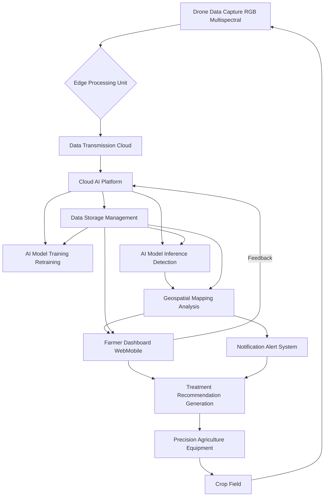
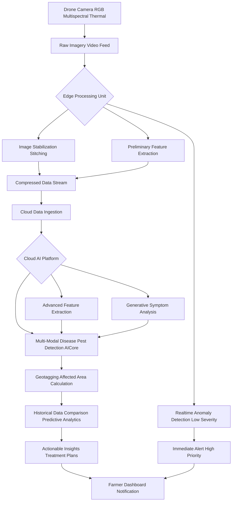
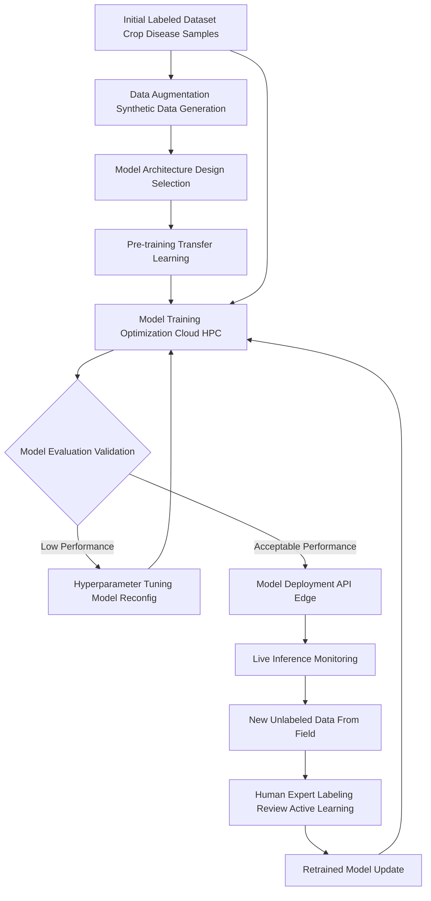
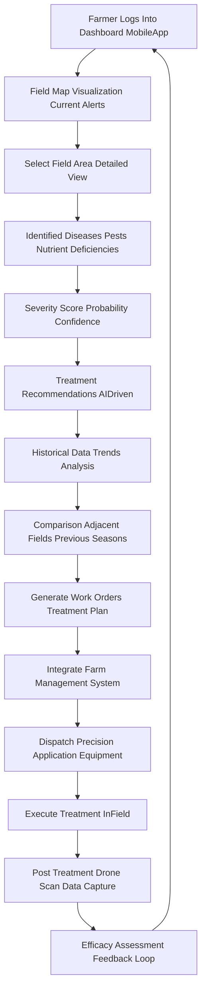

**Title of Invention:** A System and Method for Real-Time Crop Disease Detection from Aerial Imagery

**Abstract:**
A system for precision agriculture is disclosed. The system ingests a real-time video feed from a drone flying over a field of crops. A multi-modal AI model, running on the edge or in the cloud, analyzes the video frames. The model, trained to recognize the visual signs of common crop diseases and pests, identifies and geotags specific areas of the field that show signs of stress or infection. This information is displayed on a map for the farmer, allowing for targeted application of treatments. The system also incorporates historical data analysis and predictive modeling to provide proactive insights and optimize agricultural resource allocation.

**Detailed Description:**
A drone flies over a cornfield, equipped with high-resolution RGB and multispectral cameras. Its live video and image feed is continuously processed by an AI model. The model, leveraging advanced computer vision and generative AI techniques, detects a patch of plants with a specific type of leaf discoloration and structural deformity. It identifies this as a high-probability match for "Northern Corn Leaf Blight" based on its extensive training dataset. The system then precisely geotags this anomaly using the drone's GPS data, calculates the estimated affected area, and generates a priority alert. This alert is immediately pushed to the farmer's dashboard or mobile application, showing the exact location, extent, and severity of the potential outbreak, along with initial treatment recommendations. The system continuously monitors the progression and efficacy of treatments over time.

**System Components:**

The system comprises several integrated components working in tandem to provide comprehensive crop health monitoring:

1.  **Aerial Data Acquisition Unit:** Drones equipped with various sensors such as RGB, multispectral, hyperspectral, and thermal cameras.
2.  **Edge Processing Unit:** An on-board or near-field computing device that performs initial data filtering, compression, and basic AI inference to reduce data transmission load and provide rapid preliminary alerts.
3.  **Cloud AI Platform:** A scalable cloud infrastructure housing advanced multi-modal AI models, large-scale data storage, and high-performance computing resources for deep analysis, model retraining, and predictive analytics.
4.  **Farmer Interface Dashboard:** A web-based and mobile application providing a geospatial visualization of crop health, alerts, historical data, treatment recommendations, and task management tools.
5.  **Data Storage and Management:** Secure databases for storing raw imagery, processed data, AI model weights, historical crop health records, and environmental data.
6.  **Notification and Alert System:** Mechanisms for sending real-time alerts via SMS, email, or in-app notifications.
7.  **API Integration Layer:** For seamless communication with other farm management systems, weather services, and agricultural equipment.

**Operational Workflow:**

The system operates through a continuous cycle of data acquisition, processing, analysis, and action.

1.  **Pre-Flight Planning:** Farmers or automated systems define flight paths and schedules based on field size, crop type, and monitoring requirements.
2.  **Data Capture:** Drones execute planned flights, capturing high-resolution imagery and video data.
3.  **Edge Preprocessing:** On-drone or ground-station edge devices perform initial image stabilization, stitching, compression, and preliminary disease symptom detection. Critical alerts are sent immediately.
4.  **Cloud Ingestion:** Data is securely transmitted to the Cloud AI Platform for comprehensive analysis.
5.  **AI Model Inference:** The multi-modal generative AI model processes the imagery, identifying disease symptoms, pest infestations, nutrient deficiencies, and other stress factors. It categorizes and quantifies the anomalies.
6.  **Geospatial Mapping:** Detected anomalies are precisely geotagged and overlaid onto high-resolution field maps.
7.  **Decision Support and Alerts:** The system generates detailed reports, identifies areas requiring intervention, and provides actionable treatment recommendations based on integrated knowledge bases and local environmental data. Priority alerts are issued for severe or rapidly spreading issues.
8.  **Farmer Action:** Farmers review the information on their dashboard, prioritize tasks, and deploy targeted treatments using precision agriculture equipment.
9.  **Feedback Loop:** Post-treatment imagery is captured to assess efficacy, feeding new data back into the AI model for continuous learning and refinement.

**AI Model Architecture:**

The core of the system is a sophisticated multi-modal generative AI model.

*   **Input Modalities:** Handles RGB images, multispectral images near-infrared, red-edge, thermal data, and potentially environmental sensor data.
*   **Feature Extraction:** Utilizes deep convolutional neural networks CNNs and Vision Transformers to extract rich spatial and spectral features from the imagery.
*   **Generative Component:** Employs Generative Adversarial Networks GANs or Variational Autoencoders VAEs to synthesize plausible disease symptoms and variations, improving the model's robustness to novel disease presentations and rare conditions, and for data augmentation during training.
*   **Classification and Segmentation:** Advanced semantic segmentation models identify specific plant parts leaves, stems, fruits and classify diseases or stresses at a pixel level.
*   **Temporal Analysis:** Recurrent Neural Networks RNNs or Transformers analyze sequences of images over time to track disease progression, predict future outbreaks, and assess treatment effectiveness.
*   **Geospatial Integration:** Incorporates GPS and GIS data to link visual detections to precise geographic coordinates.
*   **Explainable AI XAI:** Features for interpreting model decisions, providing confidence scores and highlighting salient regions in images that led to a particular diagnosis, enhancing user trust.

**Mermaid Diagrams:**

### Overall System Architecture

### Real-time Data Processing Pipeline

### AI Model Training and Refinement Workflow

### Farmer User Interface and Action Workflow

**Benefits of the System:**

*   **Early Detection:** Identifies diseases and pests in their nascent stages, often before visible to the human eye, enabling proactive intervention.
*   **Precision Treatment:** Pinpoints exact locations of outbreaks, minimizing blanket spraying of chemicals and reducing input costs and environmental impact.
*   **Reduced Resource Usage:** Optimizes water, pesticide, and fertilizer application through targeted action.
*   **Increased Yield and Quality:** Mitigates crop loss by preventing widespread disease outbreaks and ensuring plant health.
*   **Data-Driven Decision Making:** Provides farmers with comprehensive data and insights for informed decisions, leading to better farm management.
*   **Labor Efficiency:** Automates monitoring tasks, freeing up human labor for other critical activities.
*   **Sustainable Agriculture:** Contributes to more environmentally friendly farming practices by reducing chemical runoff and promoting resource efficiency.

**Future Enhancements:**

*   **Autonomous Treatment Drones:** Integration with autonomous spraying drones for fully automated detection-to-treatment workflows.
*   **Predictive Growth Modeling:** Incorporating AI to predict crop growth patterns and yield, alongside disease progression.
*   **Blockchain Integration:** For transparent and immutable record-keeping of farm treatments, compliance, and supply chain traceability.
*   **Multi-Farm Aggregation:** Enabling regional disease spread tracking and early warning systems across multiple farms.
*   **Voice Interface:** Natural language processing for hands-free interaction with the farmer dashboard in the field.

**Claims:**
1.  A method for real-time agricultural monitoring, comprising:
    a. Receiving a continuous imagery and video feed from an unmanned aerial vehicle UAV capturing data over a crop field, said feed including RGB and multispectral data.
    b. Transmitting said imagery and video feed to an edge processing unit for initial data filtering, compression, and preliminary anomaly detection.
    c. Further transmitting processed data to a cloud-based AI platform for advanced analysis.
    d. Analyzing the imagery with a multi-modal generative AI model, said model trained to identify visual and spectral symptoms of a plurality of crop diseases, pests, and nutrient deficiencies.
    e. Identifying, classifying, and marking the precise geographic locations and estimated affected areas of potential infections or stress points.
    f. Generating and pushing priority alerts and detailed reports to a user via a farmer dashboard application.
    g. Providing AI-driven treatment recommendations based on identified issues, historical data, and environmental factors.
    h. Tracking the progression of identified issues over time and assessing the efficacy of applied treatments through subsequent aerial imagery.
2.  A system for real-time crop disease detection, comprising:
    a. An aerial data acquisition unit including a UAV equipped with RGB, multispectral, and thermal cameras.
    b. An edge processing unit configured to receive, stabilize, compress, and perform preliminary AI inference on data from the aerial data acquisition unit.
    c. A cloud AI platform communicatively coupled to the edge processing unit, said platform comprising:
        i. A data ingestion module for receiving and storing processed data.
        ii. A multi-modal generative AI model for comprehensive analysis of crop health.
        iii. A geospatial mapping module for precise geotagging and visualization of anomalies.
        iv. A decision support system for generating treatment recommendations.
    d. A farmer interface dashboard providing a visual representation of crop health, alerts, historical data, and tools for managing field operations.
    e. A notification and alert system for delivering real-time information to a user.
    f. A data storage and management system for securely archiving raw and processed data, and AI model parameters.
3.  The system of claim 2, wherein the multi-modal generative AI model is trained to:
    a. Extract features from diverse image modalities including RGB, near-infrared, and red-edge spectral bands.
    b. Utilize generative adversarial networks GANs or variational autoencoders VAEs to synthesize disease symptom variations and enhance detection robustness.
    c. Perform semantic segmentation to delineate affected areas at a pixel level.
    d. Employ temporal analysis techniques to monitor disease progression and predict future outbreaks.
    e. Provide explainable AI XAI insights into model decisions, including confidence scores and visual explanations.
4.  The method of claim 1, further comprising: providing an integrated feedback loop where post-treatment aerial imagery is used to re-evaluate affected areas and refine the AI model's detection and recommendation capabilities.
5.  The system of claim 2, further comprising an API integration layer for seamless communication with third-party farm management software, weather services, and precision agriculture equipment.