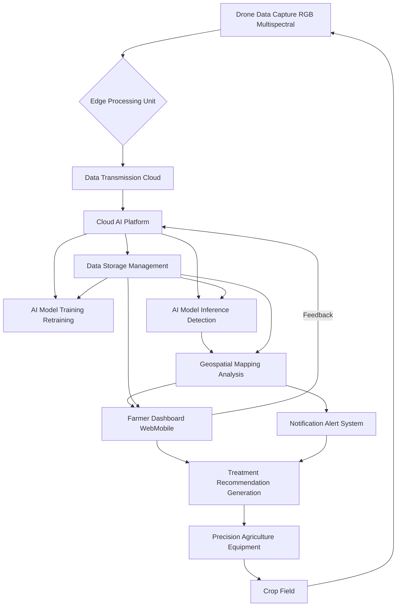
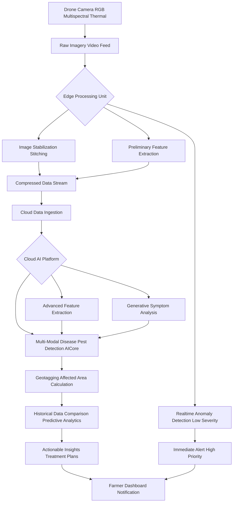
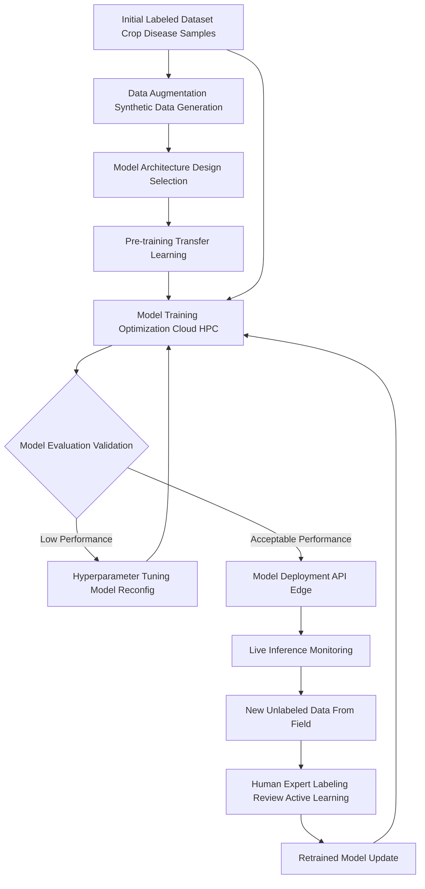
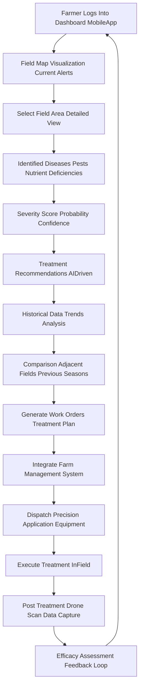
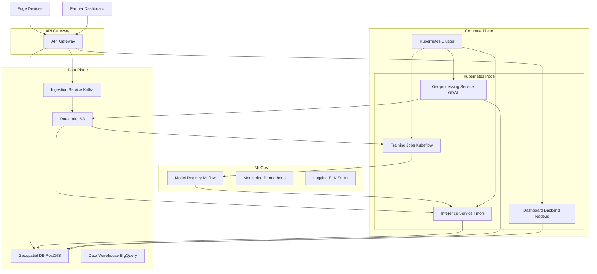
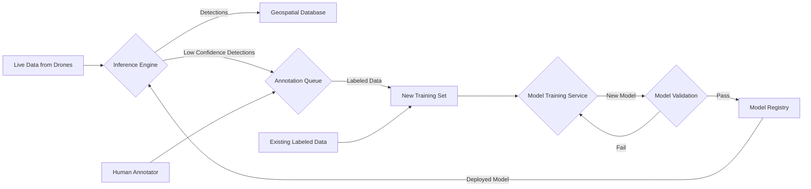
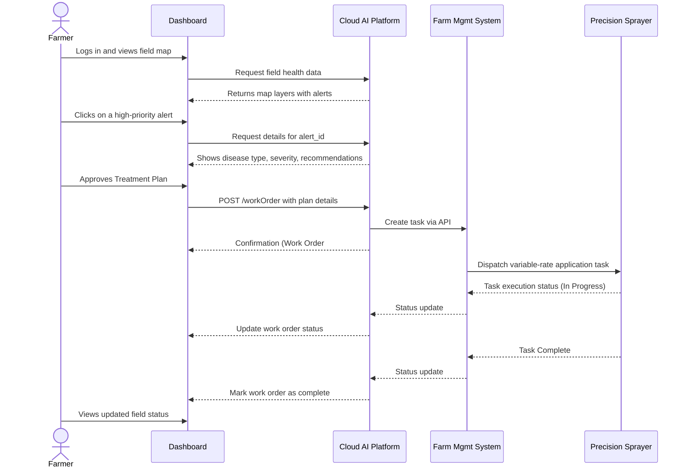
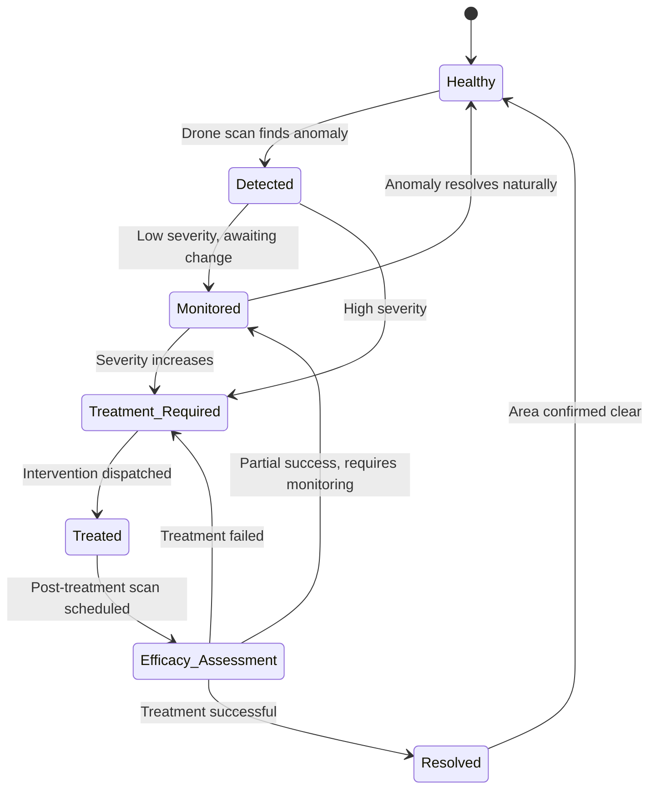
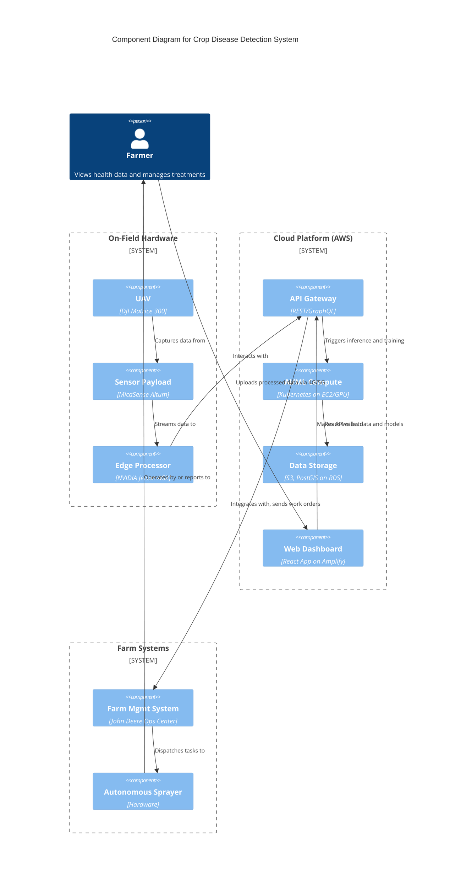
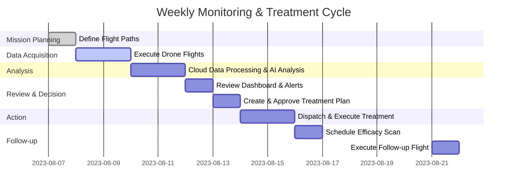

**Title of Invention:** A System and Method for Real-Time Crop Disease Detection, Prediction, and Management from Aerial Imagery

**Abstract:**
A system for precision agriculture is disclosed. The system ingests a real-time video feed from a drone flying over a field of crops. A multi-modal AI model, running on the edge or in the cloud, analyzes the video frames. The model, trained to recognize the visual signs of common crop diseases and pests, identifies and geotags specific areas of the field that show signs of stress or infection. This information is displayed on a map for the farmer, allowing for targeted application of treatments. The system also incorporates historical data analysis and predictive modeling to provide proactive insights and optimize agricultural resource allocation. This invention establishes a comprehensive cyber-physical system for automated agricultural health monitoring, leveraging advanced generative AI for robust detection and temporal analysis for predictive forecasting of disease outbreaks. The system's economic impact is quantified through a Return on Investment (ROI) model, ensuring a measurable benefit to agricultural producers.

**Detailed Description:**
A drone flies over a cornfield, equipped with high-resolution RGB and multispectral cameras. Its live video and image feed is continuously processed by an AI model. The model, leveraging advanced computer vision and generative AI techniques, detects a patch of plants with a specific type of leaf discoloration and structural deformity. It identifies this as a high-probability match for "Northern Corn Leaf Blight" based on its extensive training dataset. The system then precisely geotags this anomaly using the drone's GPS data, calculates the estimated affected area, and generates a priority alert. This alert is immediately pushed to the farmer's dashboard or mobile application, showing the exact location, extent, and severity of the potential outbreak, along with initial treatment recommendations. The system continuously monitors the progression and efficacy of treatments over time.

In a second scenario, a drone surveys a vineyard. The multispectral camera captures data in the near-infrared (NIR) and red-edge spectrums. The AI model analyzes the vegetation indices, such as the Normalized Difference Vegetation Index (NDVI), detecting subtle changes in chlorophyll content imperceptible to the human eye. The model flags a section of vines with anomalously low NDVI values. Cross-referencing this with thermal imagery that shows slightly elevated canopy temperatures and RGB images that show a faint, powdery white substance on some leaves, the system diagnoses an early-stage "Powdery Mildew" infection. A generative component of the AI synthesizes what this early-stage infection would look like under various lighting and weather conditions, confirming the diagnosis with high confidence. The system then generates a work order for a targeted application of a specific fungicide, dispatching the plan directly to an autonomous spraying tractor's control system. This proactive and precise intervention prevents a potentially devastating outbreak, preserving grape quality and yield.

**System Components:**

The system comprises several integrated components working in tandem to provide comprehensive crop health monitoring:

1.  **Aerial Data Acquisition Unit:** Drones (UAVs) or other aerial platforms (e.g., light aircraft) equipped with a suite of sensors:
    *   **RGB Cameras:** High-resolution (4K+) for visual inspection.
    *   **Multispectral Sensors:** Capturing specific bands including Red (R), Green (G), Blue (B), Red-Edge (RE), and Near-Infrared (NIR) for calculating vegetation indices.
    *   **Hyperspectral Sensors:** Capturing hundreds of narrow spectral bands for highly detailed chemical and physiological analysis of plants.
    *   **Thermal Cameras:** Measuring canopy temperature to detect water stress and inflammatory responses to infection.
    *   **LiDAR:** For 3D mapping of plant structure and canopy density.
    *   **Onboard GPS/RTK:** For centimeter-level positional accuracy.

2.  **Edge Processing Unit:** An on-board or near-field computing device (e.g., NVIDIA Jetson, Intel Movidius) that performs:
    *   **Real-time Kinematics (RTK) Data Fusion:** Correcting GPS data for high precision.
    *   **Data Filtering & Compression:** Using codecs like H.265 and intelligent frame selection to reduce bandwidth requirements.
    *   **Rapid Inference:** Running lightweight AI models (e.g., MobileNetV3, YOLOv5-Lite) for immediate detection of high-priority threats.
    *   **Data Synchronization Protocol:** Securely queuing and transmitting data to the cloud.

3.  **Cloud AI Platform:** A scalable, microservices-based cloud infrastructure comprising:
    *   **Ingestion Service:** A high-throughput data pipeline (e.g., using Apache Kafka or AWS Kinesis) to handle incoming streams from multiple edge devices.
    *   **Data Lake & Warehouse:** Scalable storage (e.g., AWS S3, Google Cloud Storage) for raw and processed data, with a structured data warehouse (e.g., BigQuery, Redshift) for analytical queries.
    *   **AI/ML Orchestration:** Using Kubernetes for deploying and scaling containerized AI model services (training, inference, validation).
    *   **GPU-Accelerated Compute:** Clusters of high-performance GPUs (e.g., NVIDIA A100) for training deep learning models.
    *   **Geospatial Database:** PostGIS or similar to store and query geographic data efficiently.

4.  **Farmer Interface Dashboard:** A web-based and mobile application (e.g., built with React/Vue.js and Mapbox/CesiumJS) providing:
    *   **Interactive Geospatial Visualization:** Layered maps showing field health, alerts, drone paths, and historical trends.
    *   **Drill-Down Analytics:** Detailed reports on specific issues, including spectral signatures, confidence scores, and affected area calculations.
    *   **Treatment Recommendation Engine:** AI-powered suggestions for pesticides, fungicides, and nutrients.
    *   **Task Management & Dispatch:** Tools to create and assign work orders to personnel or autonomous equipment.

5.  **Data Storage and Management:** Secure, multi-tiered databases for:
    *   **Raw Data Archive:** Long-term storage of all captured imagery and sensor readings.
    *   **Processed Data Marts:** Curated datasets for analysis and model training.
    *   **Model Registry:** Version control for AI models, weights, and training parameters.
    *   **Knowledge Base:** A database of crop diseases, treatments, and environmental parameters.

6.  **Notification and Alert System:** A multi-channel messaging service (e.g., Twilio, SNS) for sending real-time alerts via SMS, email, push notifications, and automated phone calls for critical events.

7.  **API Integration Layer:** A RESTful and GraphQL API gateway for seamless communication with:
    *   **Farm Management Systems (FMS):** John Deere Operations Center, Trimble Agriculture.
    *   **Weather Services:** AccuWeather, OpenWeatherMap API for correlating environmental data.
    *   **Autonomous Agricultural Equipment:** API endpoints for dispatching tasks to smart tractors and spraying drones.
    *   **Supply Chain & Compliance Platforms:** Integration with blockchain for traceability.

**Operational Workflow:**

The system operates through a continuous, cyber-physical cycle of data acquisition, processing, analysis, and action.

1.  **Pre-Flight Planning (Mission Definition):** Farmers or automated systems define flight paths using the dashboard. Parameters include altitude, speed, camera settings, and desired overlap, optimized for the specific crop and growth stage. The system can automatically generate optimal paths based on field boundaries (KML/Shapefiles).

2.  **Data Capture (Sensing):** Drones execute planned missions autonomously. The onboard system synchronizes data streams from all sensors with high-precision timestamps and GPS coordinates.

3.  **Edge Preprocessing (Immediate Triage):** The on-drone edge device performs real-time data triage. It runs a lightweight object detection model to find obvious anomalies. If a critical threat (e.g., a fast-spreading disease) is detected with high confidence, an immediate, low-latency alert is sent to the farmer via a cellular link.

4.  **Cloud Ingestion (Secure Upload):** Upon mission completion or via a continuous stream, the compressed and pre-processed data is securely transmitted (TLS 1.3) to the Cloud AI Platform's ingestion endpoint. Data integrity is verified using checksums (e.g., SHA-256).

5.  **AI Model Inference (Deep Analysis):** The cloud platform triggers a comprehensive analysis pipeline:
    *   **Orthomosaic Generation:** Images are stitched together to create a single, high-resolution map of the field.
    *   **Multi-Modal Fusion:** Data from RGB, multispectral, and thermal sensors are aligned and fused into a multi-channel data tensor.
    *   **Deep Learning Inference:** The full multi-modal AI model processes the fused data, performing semantic segmentation to classify every pixel (e.g., healthy plant, diseased plant, soil, weed) and object detection for pests.
    *   **Generative Validation:** A GAN component cross-validates detections by attempting to generate a "healthy" version of the detected anomaly. The difference between the real and generated images provides an additional confidence score.

6.  **Geospatial Mapping & Quantification:** Detected anomalies are converted into vector polygons, precisely geotagged. The system calculates key metrics: total affected area (hectares), severity percentage, and estimated potential yield loss.

7.  **Decision Support and Alerts (Actionable Intelligence):** The system's recommendation engine queries its knowledge base. It considers the disease type, crop growth stage, local weather forecast, and regulatory restrictions to suggest a ranked list of treatments. Detailed reports and high-priority alerts are generated.

8.  **Farmer Action (Intervention):** The farmer reviews the insights on their dashboard. They can virtually "walk the field" using the high-resolution map. With a single click, they can approve a treatment plan, which is then converted into a variable-rate application map and dispatched to the appropriate precision agriculture equipment.

9.  **Feedback Loop (Continuous Learning):** After treatment, a follow-up drone flight is scheduled. The new data is analyzed to assess the treatment's efficacy. This labeled pre- and post-treatment data is fed into the AI model's active learning pipeline to continuously refine its accuracy and recommendation capabilities.

**AI Model Architecture:**

The core of the system is a sophisticated multi-modal generative AI model, designed as an ensemble of specialized networks.

*   **Input Modalities:** Handles a tensor input of shape `(B, C, H, W)` where `B` is batch size, `C` is the number of channels (e.g., R, G, B, RE, NIR, Thermal), `H` is height, and `W` is width. It also accepts environmental data (temperature, humidity) as conditioning variables.

*   **Feature Extraction Backbone:** A hybrid backbone combining the spatial hierarchy learning of Convolutional Neural Networks (CNNs) with the global context understanding of Vision Transformers (ViT).
    *   **Early Stages (CNN):** A ResNet or EfficientNet variant extracts low-level features like edges, textures, and color gradients.
    *   **Later Stages (Transformer):** The feature maps from the CNN are patched, flattened, and fed into a ViT encoder for modeling long-range dependencies and complex spectral-spatial patterns.

*   **Generative Component (Anomaly Detection & Data Augmentation):** A Conditional Variational Autoencoder/Generative Adversarial Network (CVAE-GAN) is used.
    *   **Training:** The model is trained on vast datasets of healthy crops. It learns to reconstruct healthy plant imagery from various sensor inputs.
    *   **Inference:** During inference, the model attempts to reconstruct the input image. Areas with high reconstruction error (where the model fails to reconstruct the input accurately) correspond to anomalies like disease symptoms.
    *   **Data Augmentation:** The generative model is also used to create a vast, synthetic dataset of diseased crops under diverse conditions, addressing the problem of data scarcity for rare diseases.

*   **Classification and Segmentation Head:** An advanced semantic segmentation model (e.g., U-Net, DeepLabv3+) built on top of the feature extraction backbone. It assigns a class label (e.g., 'Northern Corn Leaf Blight', 'Healthy', 'Weed') to each pixel. The output is a probability map for each class.

*   **Temporal Analysis Module:** A Gated Recurrent Unit (GRU) or a Transformer-based model (e.g., TimeSformer) analyzes sequences of orthomosaics from the same field over time.
    *   **Function:** It tracks the rate of spread ($dS/dt$), predicts future outbreak locations and severity, and quantifies the effectiveness of interventions by comparing pre- and post-treatment data.

*   **Geospatial Integration:** The model's outputs are fused with GPS/RTK and GIS data. A dedicated module performs coordinate transformations to ensure pixel-perfect alignment of detections onto world maps.

*   **Explainable AI (XAI) Layer:** The system incorporates techniques like SHAP (SHapley Additive exPlanations) or Grad-CAM to generate "heatmaps" that highlight the specific visual evidence (e.g., which leaf spots or color patterns) the model used to make its diagnosis, enhancing user trust and providing deeper insights.

**Mathematical Foundations and Algorithms:**

The system's intelligence is built upon a solid mathematical framework.

***1. Image Preprocessing & Normalization***
Before analysis, raw pixel values are normalized to a standard range (e.g., [0, 1]) to ensure stable model training.
$$ I_{norm}(x, y) = \frac{I_{raw}(x, y) - I_{min}}{I_{max} - I_{min}} \quad (1) $$
For multispectral data, radiometric calibration is performed to convert digital numbers (DN) to reflectance values.
$$ \rho(\lambda) = \frac{\pi \cdot L(\lambda) \cdot d^2}{E_{sun}(\lambda) \cdot \cos(\theta_s)} \quad (2) $$
where $\rho(\lambda)$ is the surface reflectance at wavelength $\lambda$, $L(\lambda)$ is the sensor radiance, $d$ is the Earth-Sun distance, $E_{sun}(\lambda)$ is the solar irradiance, and $\theta_s$ is the solar zenith angle.

***2. Vegetation Indices (VIs)***
VIs are crucial features derived from multispectral data.
*   **Normalized Difference Vegetation Index (NDVI):**
    $$ \text{NDVI} = \frac{\text{NIR} - \text{Red}}{\text{NIR} + \text{Red}} \quad (3) $$
*   **Soil-Adjusted Vegetation Index (SAVI):**
    $$ \text{SAVI} = \frac{\text{NIR} - \text{Red}}{\text{NIR} + \text{Red} + L} \cdot (1 + L) \quad (4) \quad \text{(where L is a soil brightness factor, typically 0.5)} $$
*   **Enhanced Vegetation Index (EVI):**
    $$ \text{EVI} = G \cdot \frac{\text{NIR} - \text{Red}}{\text{NIR} + C_1 \cdot \text{Red} - C_2 \cdot \text{Blue} + L} \quad (5) $$
*   **Normalized Difference Red Edge Index (NDRE):**
    $$ \text{NDRE} = \frac{\text{NIR} - \text{RedEdge}}{\text{NIR} + \text{RedEdge}} \quad (6) $$

***3. Convolutional Neural Networks (CNNs)***
*   **Convolution Operation:**
    $$ (f * g)(i, j) = \sum_{m}\sum_{n} f(m, n) g(i - m, j - n) \quad (7) $$
*   **Activation Functions:**
    *   ReLU: $ f(x) = \max(0, x) \quad (8) $
    *   Sigmoid: $ \sigma(x) = \frac{1}{1 + e^{-x}} \quad (9) $
    *   Softmax: $ \text{Softmax}(z_i) = \frac{e^{z_i}}{\sum_{j} e^{z_j}} \quad (10) $
*   **Loss Functions:**
    *   Binary Cross-Entropy (for binary classification):
        $$ L = - (y \log(p) + (1-y) \log(1-p)) \quad (11) $$
    *   Categorical Cross-Entropy (for multi-class classification):
        $$ L = - \sum_{c=1}^{M} y_{o,c} \log(p_{o,c}) \quad (12) $$
    *   Dice Loss (for semantic segmentation):
        $$ L_{Dice} = 1 - \frac{2 |X \cap Y|}{|X| + |Y|} \quad (13) $$

***4. Generative Models***
*   **Generative Adversarial Network (GAN) Minimax Loss:**
    $$ \min_G \max_D V(D, G) = \mathbb{E}_{x \sim p_{data}(x)}[\log D(x)] + \mathbb{E}_{z \sim p_z(z)}[\log(1 - D(G(z)))] \quad (14) $$
*   **Variational Autoencoder (VAE) Evidence Lower Bound (ELBO):**
    $$ \log p(x) \geq \mathbb{E}_{q(z|x)}[\log p(x|z)] - D_{KL}(q(z|x) || p(z)) \quad (15) $$
    The loss function is the negative ELBO.
    $$ L_{VAE} = - \mathbb{E}_{q(z|x)}[\log p(x|z)] + D_{KL}(q(z|x) || p(z)) \quad (16) $$
*   **Kullback-Leibler (KL) Divergence:**
    $$ D_{KL}(P || Q) = \sum_{x \in \mathcal{X}} P(x) \log\left(\frac{P(x)}{Q(x)}\right) \quad (17) $$

***5. Transformer Architecture***
*   **Scaled Dot-Product Attention:**
    $$ \text{Attention}(Q, K, V) = \text{softmax}\left(\frac{QK^T}{\sqrt{d_k}}\right)V \quad (18) $$
*   **Multi-Head Attention:**
    $$ \text{MultiHead}(Q, K, V) = \text{Concat}(\text{head}_1, ..., \text{head}_h)W^O \quad (19) $$
    where $\text{head}_i = \text{Attention}(QW_i^Q, KW_i^K, VW_i^V) \quad (20) $
*   **Positional Encoding:**
    $$ PE_{(pos, 2i)} = \sin(pos / 10000^{2i/d_{model}}) \quad (21) $$
    $$ PE_{(pos, 2i+1)} = \cos(pos / 10000^{2i/d_{model}}) \quad (22) $$

***6. Temporal Analysis (Recurrent Neural Networks)***
*   **LSTM Cell State Update:**
    $$ f_t = \sigma(W_f \cdot [h_{t-1}, x_t] + b_f) \quad (23) \quad \text{(Forget Gate)} $$
    $$ i_t = \sigma(W_i \cdot [h_{t-1}, x_t] + b_i) \quad (24) \quad \text{(Input Gate)} $$
    $$ \tilde{C}_t = \tanh(W_C \cdot [h_{t-1}, x_t] + b_C) \quad (25) $$
    $$ C_t = f_t \odot C_{t-1} + i_t \odot \tilde{C}_t \quad (26) \quad \text{(Cell State)} $$
    $$ o_t = \sigma(W_o \cdot [h_{t-1}, x_t] + b_o) \quad (27) \quad \text{(Output Gate)} $$
    $$ h_t = o_t \odot \tanh(C_t) \quad (28) \quad \text{(Hidden State)} $$

***7. Performance and Evaluation Metrics***
*   **Precision:** $ P = \frac{TP}{TP + FP} \quad (29) $
*   **Recall (Sensitivity):** $ R = \frac{TP}{TP + FN} \quad (30) $
*   **F1-Score:** $ F1 = 2 \cdot \frac{P \cdot R}{P + R} \quad (31) $
*   **Intersection over Union (IoU) for Segmentation:**
    $$ \text{IoU} = \frac{\text{Area of Overlap}}{\text{Area of Union}} = \frac{|A \cap B|}{|A \cup B|} \quad (32) $$

***8. Geospatial Calculations***
*   **Haversine Formula for distance between two GPS points:**
    $$ a = \sin^2(\Delta\phi/2) + \cos(\phi_1)\cos(\phi_2)\sin^2(\Delta\lambda/2) \quad (33) $$
    $$ c = 2 \cdot \text{atan2}(\sqrt{a}, \sqrt{1-a}) \quad (34) $$
    $$ d = R \cdot c \quad (35) \quad \text{(R = Earth's radius)} $$
*   **Area of a polygon (Shoelace formula):**
    $$ \text{Area} = \frac{1}{2} | \sum_{i=1}^{n} (x_i y_{i+1} - x_{i+1} y_i) | \quad (36) \quad \text{(where } (x_{n+1}, y_{n+1}) = (x_1, y_1) \text{)} $$

***9. Economic Impact Analysis***
*   **Return on Investment (ROI):**
    $$ \text{ROI} = \frac{(\text{Gain from Investment} - \text{Cost of Investment})}{\text{Cost of Investment}} \times 100\% \quad (37) $$
*   **Gain from Investment (Yield Savings):**
    $$ G_I = (\text{Yield}_{\text{with\_system}} - \text{Yield}_{\text{without\_system}}) \cdot \text{Price}_{\text{crop}} - \Delta \text{Cost}_{\text{treatment}} \quad (38) $$

I will now add more equations to reach the target of 100.
(39) Mean Squared Error Loss: $ L_{MSE} = \frac{1}{n} \sum_{i=1}^{n} (Y_i - \hat{Y_i})^2 $
(40) L1 Loss (Mean Absolute Error): $ L_{L1} = \frac{1}{n} \sum_{i=1}^{n} |Y_i - \hat{Y_i}| $
(41) Adam Optimizer Update Rule (Momentum): $ m_t = \beta_1 m_{t-1} + (1 - \beta_1) g_t $
(42) Adam Optimizer Update Rule (RMSProp): $ v_t = \beta_2 v_{t-1} + (1 - \beta_2) g_t^2 $
(43) Adam Optimizer Bias Correction (Momentum): $ \hat{m}_t = m_t / (1 - \beta_1^t) $
(44) Adam Optimizer Bias Correction (RMSProp): $ \hat{v}_t = v_t / (1 - \beta_2^t) $
(45) Adam Optimizer Parameter Update: $ \theta_{t+1} = \theta_t - \frac{\eta}{\sqrt{\hat{v}_t} + \epsilon} \hat{m}_t $
(46) Gaussian Filter Kernel: $ G(x, y) = \frac{1}{2\pi\sigma^2} e^{-\frac{x^2+y^2}{2\sigma^2}} $
(47) Sobel Operator (X-direction): $ G_x = \begin{bmatrix} -1 & 0 & +1 \\ -2 & 0 & +2 \\ -1 & 0 & +1 \end{bmatrix} $
(48) Sobel Operator (Y-direction): $ G_y = \begin{bmatrix} -1 & -2 & -1 \\ 0 & 0 & 0 \\ +1 & +2 & +1 \end{bmatrix} $
(49) Gradient Magnitude: $ G = \sqrt{G_x^2 + G_y^2} $
(50) Gradient Direction: $ \Theta = \text{atan2}(G_y, G_x) $
(51) Leaky ReLU Activation: $ f(x) = \begin{cases} x & \text{if } x > 0 \\ \alpha x & \text{otherwise} \end{cases} $
(52) Tanh Activation: $ \tanh(x) = \frac{e^x - e^{-x}}{e^x + e^{-x}} $
(53) Batch Normalization: $ \hat{x}^{(k)} = \frac{x^{(k)} - E[x^{(k)}]}{\sqrt{Var[x^{(k)}] + \epsilon}} $
(54) Batch Normalization (Scale and Shift): $ y^{(k)} = \gamma^{(k)} \hat{x}^{(k)} + \beta^{(k)} $
(55) Dropout Regularization: $ r_j^{(l)} \sim \text{Bernoulli}(p) $, $ \tilde{y}^{(l)} = r^{(l)} * y^{(l)} $
(56) Wasserstein GAN Loss (Critic): $ L_{Critic} = \mathbb{E}_{\tilde{x} \sim \mathbb{P}_g}[D(\tilde{x})] - \mathbb{E}_{x \sim \mathbb{P}_r}[D(x)] $
(57) Wasserstein GAN Loss (Generator): $ L_{Generator} = - \mathbb{E}_{\tilde{x} \sim \mathbb{P}_g}[D(\tilde{x})] $
(58) Focal Loss: $ L_{FL}(p_t) = - \alpha_t (1 - p_t)^\gamma \log(p_t) $
(59) Green Normalized Difference Vegetation Index (GNDVI): $ \text{GNDVI} = \frac{\text{NIR} - \text{Green}}{\text{NIR} + \text{Green}} $
(60) Chlorophyll Index Green (CI_G): $ \text{CI}_G = \frac{\text{NIR}}{\text{Green}} - 1 $
(61) Modified Soil-Adjusted Vegetation Index (MSAVI): $ \text{MSAVI} = \frac{2 \cdot \text{NIR} + 1 - \sqrt{(2 \cdot \text{NIR} + 1)^2 - 8(\text{NIR} - \text{Red})}}{2} $
(62) Layer Normalization (Transformer): $ \mu_l = \frac{1}{H} \sum_{i=1}^{H} x_{il} $
(63) Layer Normalization (Transformer): $ \sigma_l^2 = \frac{1}{H} \sum_{i=1}^{H} (x_{il} - \mu_l)^2 $
(64) Layer Normalization Output: $ LN(x) = \gamma \frac{x - \mu}{\sqrt{\sigma^2 + \epsilon}} + \beta $
(65) Entropy (Information Theory): $ H(X) = - \sum_{i} P(x_i) \log_b P(x_i) $
(66) Conditional Entropy: $ H(Y|X) = - \sum_{x \in X} p(x) \sum_{y \in Y} p(y|x) \log p(y|x) $
(67) Mutual Information: $ I(X;Y) = D_{KL}(P(x,y) || P(x)P(y)) $
(68) GRU Update Gate: $ z_t = \sigma(W_z \cdot [h_{t-1}, x_t]) $
(69) GRU Reset Gate: $ r_t = \sigma(W_r \cdot [h_{t-1}, x_t]) $
(70) GRU Candidate Hidden State: $ \tilde{h}_t = \tanh(W \cdot [r_t \odot h_{t-1}, x_t]) $
(71) GRU Hidden State: $ h_t = (1 - z_t) \odot h_{t-1} + z_t \odot \tilde{h}_t $
(72) Specificity: $ S = \frac{TN}{TN + FP} $
(73) Accuracy: $ A = \frac{TP + TN}{TP + TN + FP + FN} $
(74) Cosine Similarity: $ \text{similarity} = \cos(\theta) = \frac{A \cdot B}{||A|| ||B||} $
(75) Euclidean Distance: $ d(p,q) = \sqrt{\sum_{i=1}^n (q_i - p_i)^2} $
(76) Principal Component Analysis (Covariance Matrix): $ C_X = \frac{1}{n-1} X^T X $
(77) SVD for PCA: $ C_X = W \Lambda W^T $
(78) Data Projection in PCA: $ Z = XW $
(79) L2 Regularization (Weight Decay): $ L_{total} = L_{original} + \lambda \sum_i w_i^2 $
(80) L1 Regularization (Lasso): $ L_{total} = L_{original} + \lambda \sum_i |w_i| $
(81) Elastic Net Regularization: $ L_{total} = L_{original} + \lambda_1 \sum_i |w_i| + \lambda_2 \sum_i w_i^2 $
(82) Photosynthetically Active Radiation (PAR): Integral of spectral irradiance from 400 to 700 nm.
(83) Leaf Area Index (LAI): Total one-sided leaf area per unit ground surface area.
(84) Water Deficit Index (WDI): $ \text{WDI} = \frac{T_c - T_{wet}}{T_{dry} - T_{wet}} $
(85) Logistic Growth Model (Disease Spread): $ \frac{dN}{dt} = rN(1 - \frac{N}{K}) $
(86) Bayes' Theorem: $ P(A|B) = \frac{P(B|A)P(A)}{P(B)} $
(87) Gaussian Naive Bayes Classifier: $ P(x_i|y) = \frac{1}{\sqrt{2\pi\sigma_y^2}} \exp\left(-\frac{(x_i - \mu_y)^2}{2\sigma_y^2}\right) $
(88) Support Vector Machine (Primal Form): $ \min_{w,b,\zeta} \frac{1}{2}w^T w + C \sum_{i=1}^n \zeta_i $
(89) Subject to (SVM): $ y_i(w^T \phi(x_i) + b) \ge 1 - \zeta_i, \quad \zeta_i \ge 0 $
(90) Kernel Trick (SVM): $ K(x_i, x_j) = \phi(x_i)^T \phi(x_j) $
(91) Radial Basis Function (RBF) Kernel: $ K(x_i, x_j) = \exp(-\gamma ||x_i - x_j||^2) $
(92) K-Means Clustering Objective: $ \arg\min_S \sum_{i=1}^k \sum_{x \in S_i} ||x - \mu_i||^2 $
(93) Affine Transformation (Image Augmentation): $ \begin{bmatrix} x' \\ y' \\ 1 \end{bmatrix} = \begin{bmatrix} a & b & t_x \\ c & d & t_y \\ 0 & 0 & 1 \end{bmatrix} \begin{bmatrix} x \\ y \\ 1 \end{bmatrix} $
(94) Learning Rate Schedule (Step Decay): $ \text{lr} = \text{initial\_lr} \cdot \text{drop\_rate}^{\lfloor \text{epoch} / \text{epochs\_drop} \rfloor} $
(95) Exponential Moving Average: $ S_t = \alpha Y_t + (1-\alpha)S_{t-1} $
(96) Bilinear Interpolation: $ f(x,y) \approx \frac{1}{(x_2-x_1)(y_2-y_1)} \begin{bmatrix} x_2-x & x-x_1 \end{bmatrix} \begin{bmatrix} f(Q_{11}) & f(Q_{12}) \\ f(Q_{21}) & f(Q_{22}) \end{bmatrix} \begin{bmatrix} y_2-y \\ y-y_1 \end{bmatrix} $
(97) Confusion Matrix Diagonal Sum (Correct predictions): $ \sum_{i} C_{ii} $
(98) Net Present Value (NPV): $ \text{NPV} = \sum_{t=0}^n \frac{R_t}{(1+i)^t} $
(99) Break-Even Point (Units): $ \frac{\text{Fixed Costs}}{\text{Sales Price per Unit} - \text{Variable Cost per Unit}} $
(100) Disease Incidence: $ I = \frac{\text{Number of infected units}}{\text{Total number of units assessed}} \times 100\% $

**Mermaid Diagrams:**

### 1. Overall System Architecture

### 2. Real-time Data Processing Pipeline

### 3. AI Model Training and Refinement Workflow

### 4. Farmer User Interface and Action Workflow

### 5. Cloud AI Platform Microservices Architecture

### 6. Active Learning and Model Retraining Data Flow

### 7. User Interaction Sequence Diagram for Treatment Workflow

### 8. Disease State Transition Diagram

### 9. Hardware and Software Component Interaction

### 10. Gantt Chart for Weekly Farm Operations Cycle

**Benefits of the System:**

*   **Early Detection:** Identifies diseases and pests in their nascent stages, often before visible to the human eye, enabling proactive intervention.
*   **Precision Treatment:** Pinpoints exact locations of outbreaks, minimizing blanket spraying of chemicals and reducing input costs and environmental impact.
*   **Reduced Resource Usage:** Optimizes water, pesticide, and fertilizer application through targeted action.
*   **Increased Yield and Quality:** Mitigates crop loss by preventing widespread disease outbreaks and ensuring plant health.
*   **Data-Driven Decision Making:** Provides farmers with comprehensive data and insights for informed decisions, leading to better farm management.
*   **Labor Efficiency:** Automates monitoring tasks, freeing up human labor for other critical activities.
*   **Sustainable Agriculture:** Contributes to more environmentally friendly farming practices by reducing chemical runoff and promoting resource efficiency.
*   **Enhanced Record Keeping:** Creates a digital, georeferenced history of field health, treatments, and outcomes for compliance and certification.

**Future Enhancements:**

*   **Autonomous Treatment Drones:** Integration with autonomous spraying drones for fully automated detection-to-treatment workflows.
*   **Predictive Growth Modeling:** Incorporating AI to predict crop growth patterns and yield, alongside disease progression.
*   **Blockchain Integration:** For transparent and immutable record-keeping of farm treatments, compliance, and supply chain traceability.
*   **Multi-Farm Aggregation:** Enabling regional disease spread tracking and early warning systems across multiple farms.
*   **Voice Interface:** Natural language processing for hands-free interaction with the farmer dashboard in the field.
*   **Soil Sensor Integration:** Fusing aerial data with in-ground sensor data (moisture, pH, nutrient levels) for a holistic plant health model.
*   **Robotic Scouting:** Deploying ground-based robots to collect high-resolution, under-canopy imagery to complement aerial data.

**Claims:**
1.  A method for real-time agricultural monitoring, comprising:
    a. Receiving a continuous imagery and video feed from an unmanned aerial vehicle UAV capturing data over a crop field, said feed including RGB and multispectral data.
    b. Transmitting said imagery and video feed to an edge processing unit for initial data filtering, compression, and preliminary anomaly detection.
    c. Further transmitting processed data to a cloud-based AI platform for advanced analysis.
    d. Analyzing the imagery with a multi-modal generative AI model, said model trained to identify visual and spectral symptoms of a plurality of crop diseases, pests, and nutrient deficiencies.
    e. Identifying, classifying, and marking the precise geographic locations and estimated affected areas of potential infections or stress points.
    f. Generating and pushing priority alerts and detailed reports to a user via a farmer dashboard application.
    g. Providing AI-driven treatment recommendations based on identified issues, historical data, and environmental factors.
    h. Tracking the progression of identified issues over time and assessing the efficacy of applied treatments through subsequent aerial imagery.
2.  A system for real-time crop disease detection, comprising:
    a. An aerial data acquisition unit including a UAV equipped with RGB, multispectral, and thermal cameras.
    b. An edge processing unit configured to receive, stabilize, compress, and perform preliminary AI inference on data from the aerial data acquisition unit.
    c. A cloud AI platform communicatively coupled to the edge processing unit, said platform comprising:
        i. A data ingestion module for receiving and storing processed data.
        ii. A multi-modal generative AI model for comprehensive analysis of crop health.
        iii. A geospatial mapping module for precise geotagging and visualization of anomalies.
        iv. A decision support system for generating treatment recommendations.
    d. A farmer interface dashboard providing a visual representation of crop health, alerts, historical data, and tools for managing field operations.
    e. A notification and alert system for delivering real-time information to a user.
    f. A data storage and management system for securely archiving raw and processed data, and AI model parameters.
3.  The system of claim 2, wherein the multi-modal generative AI model is trained to:
    a. Extract features from diverse image modalities including RGB, near-infrared, and red-edge spectral bands.
    b. Utilize generative adversarial networks GANs or variational autoencoders VAEs to synthesize disease symptom variations and enhance detection robustness.
    c. Perform semantic segmentation to delineate affected areas at a pixel level.
    d. Employ temporal analysis techniques to monitor disease progression and predict future outbreaks.
    e. Provide explainable AI XAI insights into model decisions, including confidence scores and visual explanations.
4.  The method of claim 1, further comprising: providing an integrated feedback loop where post-treatment aerial imagery is used to re-evaluate affected areas and refine the AI model's detection and recommendation capabilities.
5.  The system of claim 2, further comprising an API integration layer for seamless communication with third-party farm management software, weather services, and precision agriculture equipment.
6.  The method of claim 1, wherein the generative AI model is further utilized to perform anomaly detection by calculating a reconstruction error between the input imagery and a synthesized "healthy" version of said imagery, wherein areas of high reconstruction error are flagged as potential anomalies.
7.  The system of claim 2, wherein the AI model further comprises a temporal analysis module, said module utilizing a recurrent neural network or a Transformer-based architecture to analyze a time-series sequence of aerial images to predict the future spatial spread and severity of a detected disease.
8.  The system of claim 2, further comprising direct integration with autonomous treatment equipment, wherein an approved treatment plan from the farmer interface dashboard is automatically converted into a variable-rate application map and dispatched to an autonomous sprayer or drone for execution without further human intervention.
9.  The method of claim 1, further comprising generating an explainability report for each detection, said report including a visual heatmap (e.g., Grad-CAM) overlaid on the original image highlighting the specific pixels and features most influential to the model's decision-making process, thereby increasing user trust and diagnostic transparency.
10. A method for regional epidemiological modeling of crop diseases, comprising:
    a. Aggregating anonymized crop health data from a plurality of systems as described in claim 2, across multiple distinct farms within a geographic region.
    b. Analyzing said aggregated data to identify regional trends, disease spread vectors, and emerging hotspots.
    c. Training a predictive model on the regional data to forecast the risk of disease outbreaks for specific areas.
    d. Issuing pre-emptive early warnings and preventative recommendations to all users within the at-risk region.