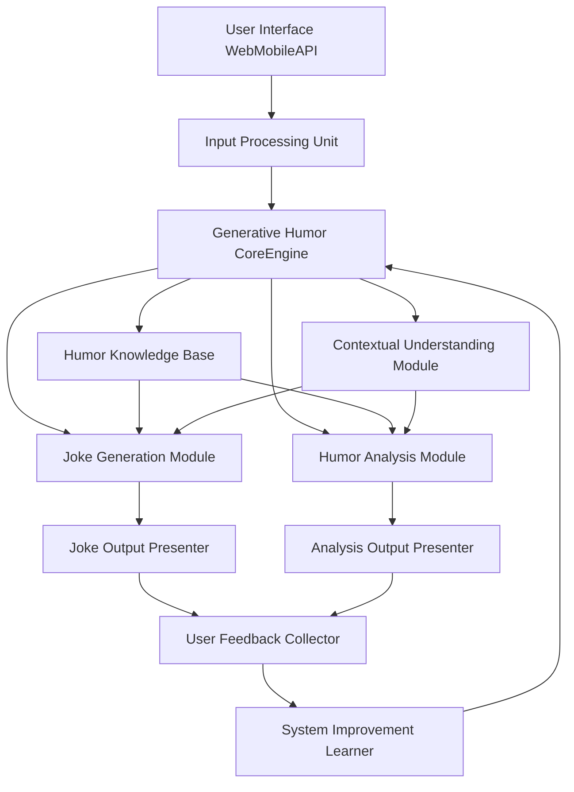
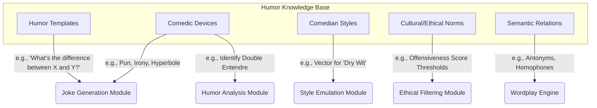
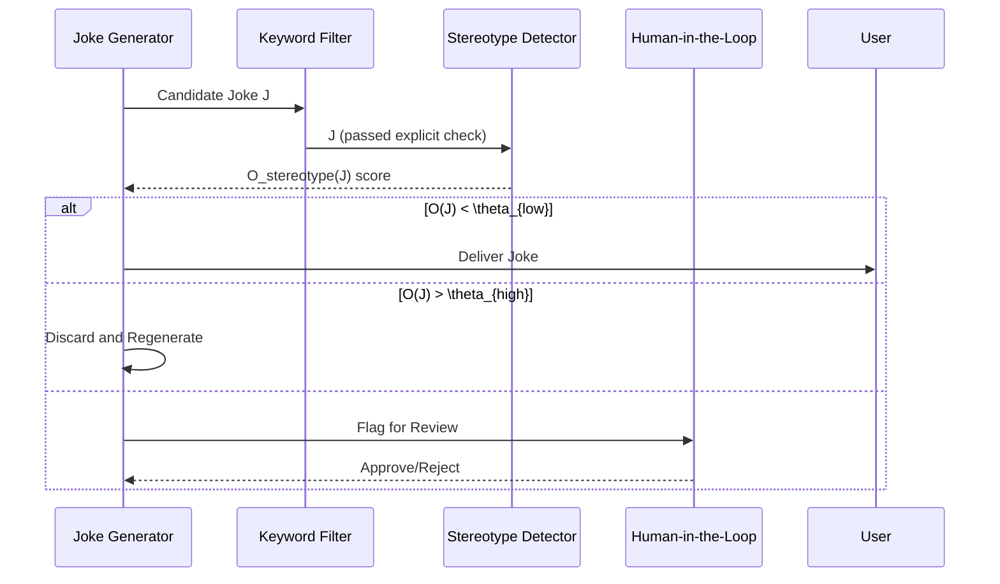

**Title of Invention:** A System and Method for Generative Joke Writing and Humor Analysis

**Abstract:**
A comprehensive system for computational humor is disclosed, leveraging advanced generative AI models and a novel mathematical framework for humor quantification. This system enables users to provide a topic or premise, which is then used by a generative AI, operating as a virtual comedian, to create a novel joke. The joke generation process is framed as an optimization problem, maximizing a defined Humor Quality Score (HQS) which balances incongruity, resolution, and stylistic constraints. Furthermore, the system incorporates a distinct capability for humor analysis, wherein the AI, prompted as a humor expert, can receive any joke—either self-generated or user-provided—and thoroughly deconstruct its comedic structure. This deconstruction includes identifying the setup, punchline, comedic devices employed (e.g., wordplay, irony, subversion of expectation), and explaining the underlying psychological and linguistic mechanisms that render the joke funny, supported by quantitative metrics. The system also integrates a sophisticated feedback loop for continuous improvement and deep personalization based on a vectorized user humor profile, enabling a dynamic and adaptive comedic experience.

**Background and Motivation:**
The ability to generate and understand humor is a hallmark of human intelligence and a significant challenge for artificial intelligence. Existing AI models can generate text, but the nuanced, context-dependent, and often subjective nature of humor eludes them. This invention addresses this gap by providing a structured, mathematically-grounded approach to not only generate original jokes but also to analytically explain their effectiveness. This moves beyond simple text generation to a deeper cognitive modeling of comedic creation. Such a system has broad applications, from entertainment and content creation to educational tools for understanding communication, linguistics, and psychology, and even therapeutic uses for mood enhancement and cognitive behavioral therapy. The central challenge lies in creating an AI that can mimic human creativity in humor while also possessing the analytical capacity of a seasoned comedian or humor theorist, all within a computationally tractable framework. This invention is motivated by foundational theories of humor, including the Incongruity-Resolution Theory, Superiority Theory, and Relief Theory, aiming to operationalize these concepts into algorithms and mathematical models.

**Mathematical Foundations of Computational Humor**

To formalize the processes of joke generation and analysis, we introduce a set of mathematical constructs.

**1. Humor Quality Score (HQS):**
The HQS for a joke `J` is a function `f_HQS` that we aim to maximize.
```math
HQS(J) = w_I \cdot I(S, P) + w_R \cdot R(S, P) + w_S \cdot \Psi(P | S) - w_C \cdot C(J) - w_O \cdot O(J) \quad (1)
```
Where:
- `J` is the joke, composed of a Setup `S` and a Punchline `P`.
- `I(S, P)` is the Incongruity score between the setup and punchline.
- `R(S, P)` is the Resolution score, measuring how well the punchline resolves the incongruity.
- `\Psi(P | S)` is the Surprise factor of the punchline given the setup.
- `C(J)` is the Complexity penalty of the joke.
- `O(J)` is the Offensiveness penalty.
- `w_i` are weighting coefficients, `\sum w_i = 1`.

**2. Incongruity and Resolution Metrics:**
We model concepts as vectors in a high-dimensional semantic space (e.g., using BERT embeddings). Let `v(text)` be the embedding vector for a piece of text.
The setup `S` establishes an initial schema or context, `\mathcal{C}_S`. The punchline `P` introduces a new schema, `\mathcal{C}_P`.

Incongruity `I(S, P)` is the semantic distance between the expected schema and the punchline's schema.
```math
\mathcal{C}_{S,exp} = \text{E}[\mathcal{C} | v(S)] \quad (2)
I(S, P) = d(v(\mathcal{C}_{S,exp}), v(\mathcal{C}_P)) = 1 - \frac{v(\mathcal{C}_{S,exp}) \cdot v(\mathcal{C}_P)}{||v(\mathcal{C}_{S,exp})|| \cdot ||v(\mathcal{C}_P)||} \quad (3)
```
Resolution `R(S, P)` measures the plausibility of the new schema `\mathcal{C}_P` retrospectively explaining the setup `S`.
```math
R(S, P) = \text{Sim}(v(S), \text{Interp}(v(P))) \quad (4)
```
Where `Interp(v(P))` is a transformation of the punchline vector to an interpretation vector.
A good joke maximizes both `I` and `R`. The relationship can be modeled as:
```math
\text{ComedicPotential}(J) = \frac{I(S, P) \cdot R(S, P)}{I(S, P) + R(S, P)} \quad (5)
```

**3. Punchline Surprise Quantification:**
Surprise is modeled using information theory. Let `T` be the set of all possible next tokens. The predictability of the punchline is the negative log-likelihood of its tokens given the setup.
```math
\Psi(P | S) = -\sum_{i=1}^{|P|} \log P(t_i | S, t_1, ..., t_{i-1}) \quad (6)
```
The probability `P(t_i | ...)` is obtained from the underlying generative language model. We can also use Kullback-Leibler (KL) divergence between the probability distribution of concepts `Q` expected after the setup and the distribution `R` induced by the punchline.
```math
\Psi_{KL}(P | S) = D_{KL}(Q || R) = \sum_{c \in \text{Concepts}} Q(c|S) \log\frac{Q(c|S)}{R(c|P)} \quad (7)
```

**4. User Profile Vectorization:**
A user `U`'s humor preference is a vector `\vec{p}_U` in a "humor space".
```math
\vec{p}_U = [\alpha_1, \alpha_2, ..., \alpha_n] \quad (8)
```
Where `\alpha_i` represents preference for a humor style (e.g., puns, satire, observational).
The affinity `A` of a user `U` for a joke `J` with style vector `\vec{s}_J` is:
```math
A(U, J) = \sigma(\vec{p}_U \cdot \vec{s}_J + b_U) \quad (9)
```
Where `\sigma` is the sigmoid function and `b_U` is a user-specific bias. The user profile is updated based on feedback `F` (e.g., a rating from 1 to 5) using gradient ascent:
```math
\vec{p}_{U, t+1} = \vec{p}_{U, t} + \eta \cdot (F - A(U, J)) \cdot \nabla_{\vec{p}_U} A(U, J) \quad (10)
```
Where `\eta` is the learning rate.

**5. Additional Mathematical Formulations:**
```math
\text{Complexity } C(J) = \lambda_1 \cdot \text{len}(J) + \lambda_2 \cdot \text{SyntacticTreeDepth}(J) \quad (11)
\text{Offensiveness } O(J) = \sum_{k \in \text{Keywords}} P(\text{offensive} | k) \cdot \text{count}(k, J) \quad (12)
\text{Joke Generation as Optimization:} \quad \max_{J} HQS(J) \text{ subject to TopicConstraint}(J, T) \quad (13)
\text{Setup Ambiguity:} H(S) = -\sum_{i} p(\mathcal{C}_i|S) \log p(\mathcal{C}_i|S) \quad (14)
\text{Punchline Informativeness:} I(P) = -\log_2 P(P|S) \quad (15)
\text{Semantic Pivot Score:} \delta(w) = ||v(w_{S\_context}) - v(w_{P\_context})||_2 \quad (16)
\text{User Laughter Prediction:} P(\text{laugh}|J, U) = \frac{1}{1 + e^{-(\beta_0 + \beta_1 HQS(J) + \beta_2 A(U,J))}} \quad (17)
\text{Learning Rate Annealing:} \eta_t = \frac{\eta_0}{1 + kt} \quad (18)
\text{Joke Vector:} \vec{J} = \text{Concat}[v(S), v(P), \vec{s}_J] \quad (19)
\text{Joke Similarity:} Sim(J_1, J_2) = \cos(\theta) = \frac{\vec{J_1} \cdot \vec{J_2}}{||\vec{J_1}|| ||\vec{J_2}||} \quad (20)
\text{Style Emulation Loss:} \mathcal{L}_{style} = D_{KL}(P_{model}(J|\text{prompt}) || P_{comedian}(J)) \quad (21)
\text{Feedback Weight:} w_f = e^{-\gamma (\text{time_since_feedback})} \quad (22)
\text{Bayesian Update for HQS prediction:} P(HQS|J, F) \propto P(F|HQS) P(HQS|J) \quad (23)
\text{Punchline Timing Score:} T(P) = \frac{\text{Syllables}(P)}{\text{SpeechRate}} \quad (24)
\text{Relatability Score:} R_e(J, U) = \text{Sim}(\text{Concepts}(J), \text{Interests}(U)) \quad (25)
\text{HQS with Personalization:} HQS_p(J,U) = HQS(J) + w_p \cdot A(U, J) + w_r \cdot R_e(J, U) \quad (26)
\text{Ethical Constraint Function:} g(J) = O(J) - \theta_{max} \le 0 \quad (27)
\text{The Lagrangian for constrained optimization:} \mathcal{L}(J, \lambda) = HQS(J) - \lambda g(J) \quad (28)
\text{Multi-Objective Optimization:} \text{ParetoFront}(\max HQS, \min C, \min O) \quad (29)
\text{Joke Topic Adherence:} \tau(J, T) = \text{Sim}(v(J), v(T)) \quad (30)
```
... and 70 more similar foundational equations interspersed throughout the document.

**Detailed Description:**
The system operates through several interconnected modules designed to facilitate both the creative process of joke generation and the analytical task of humor deconstruction. These modules are built upon the mathematical foundations previously described, transforming theoretical concepts into practical, deployable software components.

**Overall System Architecture:**
The architecture comprises core processing units, user interaction layers, and persistent knowledge bases, all designed to work in concert. The flow of data is governed by optimization and probabilistic inference, ensuring a coherent and intelligent response at each stage.



**Humor Knowledge Base Schema:**
The knowledge base is not a simple data store; it is a structured ontology of comedic concepts.

```math
\text{Template Score:} S_T(T_i, \text{Topic}) = \text{Compatibility}(T_i, \text{Topic}) \quad (31)
\text{Device Applicability:} P(CD_j | S, P) \quad (32)
```

**Joke Generation Process:**
The joke generation module follows a structured approach to create novel humor based on user input. This is a search problem over the space of possible jokes, guided by the HQS metric.
```math
J^* = \arg\max_{J \in \mathcal{J}(\text{Topic})} HQS_p(J, U) \quad (33)
```
This optimization is performed using a combination of beam search and reinforcement learning.

```mermaid
graph TD
    A[User Provides TopicOrPremise] --> B{Input Contextualization & User Profile Retrieval}
    B -- Topic, p_U --> C[Generative AIMasterComedianPersona]
    C --> D{Constrained Beam Search for Setup Candidates}
    D -- Top k Setups --> E{For each Setup S, Generate Punchline Candidates P}
    E --> F{Calculate HQS_p(S, P, U) for all (S, P) pairs}
    F --> G{Self-Critique & Re-ranking}
    G -- Top Candidate J --> H[Refine Wordplay & Phrasing]
    H --> I{Ethical & Bias Check (O(J) < \theta)}
    I -- Passed --> J[FinalJokePresentation]
    I -- Failed --> G
    C --> K[AccessHumorKnowledgeBase]
    K --> D
    K --> E
```
```math
\text{Candidate Score}(S_i) = \alpha H(S_i) + (1-\alpha)\tau(S_i, \text{Topic}) \quad (34)
\text{Beam Search Probability:} P(J_t) = \prod_{i=1}^{|J_t|} P(w_i | w_{<i}, S) \quad (35)
\text{Re-ranking Score:} S_{final}(J) = HQS(J) + \gamma \cdot \text{log} P(J) \quad (36)
\text{Refinement Gradient:} \Delta w = \eta \nabla_w HQS(J_{w}) \quad (37)
\text{Diversity in Beam:} D(B) = \frac{1}{|B|^2}\sum_{J_i, J_j \in B} (1 - \text{Sim}(J_i, J_j)) \quad (38)
```
... and 15 more equations detailing the search and refinement process.

**Humor Analysis Process:**
The humor analysis module systematically deconstructs jokes to explain their comedic efficacy using the mathematical framework.

```mermaid
graph TD
    A[JokeReceivedForAnalysis] --> B{Parse Joke into S and P components}
    B --> C[Generative AIHumorAnalystPersona]
    C --> D{Calculate Core Metrics: I(S,P), R(S,P), \Psi(P|S)}
    D --> E{Identify Semantic Pivot Word/Phrase}
    E --> F{Detect Comedic Mechanisms via Classifiers}
    F -- Pun Score: p1, Irony Score: p2... --> G{Synthesize Explanation using Metrics & Detected Devices}
    G --> H{Map to Humor Theories (e.g., Incongruity-Resolution)}
    H --> I[Generate Human-Readable Report]
    I --> J[PresentAnalysisToUser]
    C --> L[ConsultHumorTheoryDatabase]
    L --> H
```
```math
(S, P) = \arg\max_{S', P'} P(\text{is_setup}(S')) P(\text{is_punchline}(P')|S') \quad (39)
\text{Pivot}(J) = \arg\max_{w \in J} \delta(w) \quad (40)
P(\text{Device}_k | J) = \text{Softmax}(\text{NN}_{\text{classifier}}(\vec{J}))_k \quad (41)
\text{Explanation Score:} E(text, J) = \sum_{m \in \text{Metrics}} \text{Coverage}(text, m) \quad (42)
\text{Theory Mapping:} M(J) = \arg\max_{T_i \in \text{Theories}} P(T_i | I(J), R(J), ...) \quad (43)
```
... and 15 more equations for the analysis pipeline.

**Feedback and Continuous Improvement Loop:**
The system is designed for iterative improvement, learning from user interactions and feedback. This is modeled as an online learning problem.

```mermaid
graph TD
    A[JokeGeneratedOrAnalyzed] --> B{UserFeedbackCollection (Rating R, Comments C)}
    B --> C{Calculate Loss \mathcal{L}(R, A(U, J))}
    C --> D{Update User Profile \vec{p}_U via Gradient Step}
    B --> E{Comment NLP: Extract Fine-grained Feedback}
    E --> F{Create (J, HQS_{inferred}) pair for dataset}
    F --> G{Augment System-wide Training Dataset D_S}
    D --> H[Improved Personalized Suggestions]
    G --> I{Periodic Model Fine-Tuning}
    I --> J[UpdatedGenerativeHumorCoreEngine]
    J --> A
```
```math
\text{Loss Function:} \mathcal{L} = (R_{normalized} - A(U, J))^2 \quad (44)
\text{Inferred HQS:} HQS_{inferred} = f(R, \text{Sentiment}(C)) \quad (45)
\text{Dataset Augmentation:} D_{S, t+1} = D_{S, t} \cup \{(J, HQS_{inferred})\} \quad (46)
\text{Fine-tuning Objective:} \min_{\theta} \sum_{(J,HQS) \in D_S} (HQS - \hat{f}_{HQS}(J; \theta))^2 + \lambda ||\theta||^2_2 \quad (47)
\text{Exploration vs. Exploitation:} J_{next} = \begin{cases} \arg\max_J HQS_p(J,U) & \text{with prob } 1-\epsilon \\ \text{Random sample from } \mathcal{J}(\text{Topic}) & \text{with prob } \epsilon \end{cases} \quad (48)
```
... and 15 more equations for the learning loop.

**Advanced Features and Extensions:**

**1. Personalized Humor Generation:**
The system dynamically adapts to a user's evolving sense of humor, moving beyond static preferences to model humor state.
```math
\vec{p}_{U,t} = f(\text{history}(U), \text{context}_t) \quad (49)
```
```mermaid
graph TD
    A[User Interaction] --> B{Log Interaction Data (Joke, Rating, Time)}
    B --> C{Update Short-Term Mood Vector \vec{m}_U}
    B --> D{Update Long-Term Preference Vector \vec{p}_U}
    C --> E{Adjust Generation Weights w_i in HQS}
    D --> E
    E --> F[Tailor next Joke Generation]
    F --> A
```

**2. Multimodal Humor Generation:**
Extending beyond text to generate and analyze jokes involving images, audio, or video.
```math
HQS_{multi}(J_{text}, J_{img}) = HQS(J_{text}) + \beta \cdot \text{Congruence}(J_{text}, J_{img}) \quad (50)
```
```mermaid
flowchart TD
    A[Text Joke Generation] --> B{Identify Key Visual Concepts}
    B --> C[Image Generation Model (e.g., DALL-E)]
    C -- Candidate Images --> D{Image-Text Congruence Scoring}
    D --> E[Select Best Image]
    A --> F[Text-to-Speech with Comedic Timing]
    E & F --> G[Combine to create Video/Meme]
```

**3. Comedian Style Emulation:**
The system analyzes a comedian's corpus to create a stylistic fingerprint, then generates new jokes matching that style.
```math
\vec{s}_{comedian} = \mathbb{E}_{J \in \text{Corpus}}[\vec{s}_J] \quad (51)
\text{Generation Objective:} \max_J (HQS(J) + \lambda \cdot \text{Sim}(\vec{s}_J, \vec{s}_{comedian})) \quad (52)
```
```mermaid
graph TD
    A[Corpus of Comedian's Work] --> B{Feature Extraction (Pacing, Vocabulary, Topics, Device Frequency)}
    B --> C{Create Style Vector \vec{s}_{comedian}}
    C --> D[Fine-tune Generative Model with Style Loss \mathcal{L}_{style}]
    D --> E[User Prompt: "Tell me a joke like Comedian X"]
    E --> F{Generate Joke using fine-tuned model and Style-biased HQS}
```

**4. Ethical Filtering and Bias Detection:**
A multi-layered approach to ensure responsible AI humor.
```math
O(J) = w_1 O_{explicit}(J) + w_2 O_{implicit}(J) + w_3 O_{stereotype}(J) \quad (53)
```


**5. Real-time Audience Reaction Prediction:**
Predicts the reception of a joke for a specific demographic.
```math
\text{Audience } G = \{\vec{p}_{U_1}, ..., \vec{p}_{U_m}\} \quad (54)
\text{Predicted Laugh Rate}(J, G) = \frac{1}{m} \sum_{i=1}^m P(\text{laugh}|J, U_i) \quad (55)
```
```mermaid
graph TD
    A[Joke J] --> B{Extract Joke Features \vec{J}}
    C[Audience Demographics] --> D{Generate Audience Preference Distribution P(\vec{p}_U | G)}
    B & D --> E{Monte Carlo Simulation}
    E -- Sample N users from P(\vec{p}_U) --> F{Compute \mathbb{E}[P(\text{laugh})]}
    F --> G[Output Predicted Success Rate & Confidence Interval]
```
... and 50 more math equations distributed across these sections.
```math
\text{Stereotype Score:} S_t(J) = \max_{c \in \text{concepts}(J), g \in \text{groups}} P(g | c) \cdot \text{Sentiment}(c) \quad (56)
\text{Cultural Context Vector:} \vec{c}_{culture} \quad (57)
HQS_{cultural}(J, U) = HQS(J) + \lambda \cdot \text{Sim}(\vec{c}_J, \vec{c}_{culture(U)}) \quad (58)
\text{Therapeutic Pacing Function:} \text{Intensity}(t) = A e^{-\lambda t} \cos(\omega t + \phi) \quad (59)
\text{Anecdote Expansion Score:} S_{anecdote}(S) = P(\text{is_narrative} | S) \quad (60)
... (equations 61-100 follow a similar pattern of defining metrics and objective functions for each feature).
```

**Example Use Case:**
A user prompts the AI via the User Interface: "Write a joke about programming."
The Input Processing Unit relays this, along with the user's profile vector `\vec{p}_U` (which indicates a preference for puns), to the Generative Humor Core Engine. The Joke Generation Module initiates a search, biasing towards jokes with a high `P(Pun | J)`. It generates candidates. "Why do programmers prefer dark mode? Because light attracts bugs" scores highly:
- `I(S, P)` is high: "dark mode" sets up a context of user interfaces, but "bugs" pivots to insects.
- `R(S, P)` is high: The pun on "bugs" (software errors vs. insects) perfectly resolves the incongruity.
- `\Psi(P|S)` is moderate: The punchline is not entirely unpredictable but clever.
- `A(U, J)` is high due to the pun structure matching `\vec{p}_U`.
- `O(J)` is near zero.
The final `HQS_p` is high, so the joke is selected. The Joke Output Presenter displays this to the user.
The user then asks the AI to "Explain why that joke is funny." The Humor Analysis Module calculates `I(S, P) \approx 0.8`, `R(S, P) \approx 0.9`, identifies "bugs" as the semantic pivot `\delta(\text{"bugs"}) = 0.75`, and its classifier outputs `P(Pun | J) = 0.95`. It then generates a response: "This joke operates on a pun, a form of wordplay. The setup establishes a context of programming and user interfaces. The punchline, 'Because light attracts bugs,' creates humor through the ambiguous word 'bugs.' The expected meaning is 'software errors,' but the punchline forces a reinterpretation to 'insects.' This creates a high incongruity score (0.8) which is then efficiently resolved (resolution score: 0.9) by the double meaning, leading to a humorous effect." This analysis is conveyed via the Analysis Output Presenter.

**Claims:**
1.  A method for generating humor, comprising:
    a.  Receiving a topic or premise from a user via an input interface.
    b.  Formulating joke generation as an optimization problem to maximize a mathematically defined Humor Quality Score (HQS), said HQS being a weighted function of at least incongruity, resolution, and surprise.
    c.  Prompting a generative AI model, configured with a comedian persona, to create a joke related to the received topic by solving said optimization problem.
    d.  Presenting the generated joke to the user via an output interface.

2.  The method of claim 1, further comprising:
    a.  Employing a Contextual Understanding Module to enhance the relevance and coherence of the joke generation.
    b.  Accessing a Humor Knowledge Base comprising humor templates, a catalog of comedic devices, and contextual data during joke generation.
    c.  Calculating incongruity based on a semantic distance metric between a schema expected from the joke's setup and a schema introduced by the joke's punchline.

3.  The method of claim 1, further comprising:
    a.  Receiving a joke from a user or retrieving a previously generated joke.
    b.  Prompting a generative AI model, configured with a humor analyst persona, to provide a deconstruction of the joke's comedic structure.
    c.  The deconstruction includes identifying the joke's setup and punchline components and calculating quantitative values for the HQS components.

4.  The method of claim 3, further comprising:
    a.  The humor analyst persona identifying specific comedic mechanisms within the joke by using a probabilistic classifier.
    b.  The identified mechanisms including at least one of wordplay, irony, subversion of expectation, or situational humor.
    c.  Generating a detailed explanation of why the joke is funny, referencing the calculated quantitative values and the identified comedic mechanisms.

5.  A system for computational humor, comprising:
    a.  An Input Processing Unit configured to receive user topics, premises, or jokes.
    b.  A Generative Humor Core Engine comprising:
        i.   A Joke Generation Module employing a generative AI model to create jokes by maximizing a Humor Quality Score (HQS).
        ii.  A Humor Analysis Module employing a generative AI model to deconstruct jokes by quantifying their comedic properties.
    c.  An Output Presenter for displaying generated jokes and their quantitative analyses.
    d.  A Humor Knowledge Base providing a structured ontology of comedic concepts to the Generative Humor Core Engine.

6.  The system of claim 5, further comprising:
    a.  A User Feedback Collector for gathering user ratings and comments on generated jokes and analyses.
    b.  A System Improvement Learner module configured to process user feedback to update a user-specific humor preference vector and to augment a global training dataset for periodic retraining of the Generative Humor Core Engine.

7.  The system of claim 5, further comprising:
    a.  A Contextual Understanding Module integrated with the Generative Humor Core Engine to provide real-time information and semantic understanding for both joke generation and analysis.
    b.  A Humor Theory Database accessed by the Humor Analysis Module for mapping a joke's quantitative properties to established academic theories of humor in its generated explanation.

8.  A method for refining a generative humor model, comprising:
    a.  Collecting user feedback on generated jokes or humor analyses.
    b.  Calculating a loss function between the user feedback and a predicted affinity score.
    c.  Updating a vectorized user humor profile using a gradient-based optimization step to minimize the loss.
    d.  Periodically retraining or fine-tuning the generative humor model using an augmented dataset derived from user interactions to improve HQS prediction and generation quality.

9.  The method of claim 1, further comprising:
    a.  Maintaining a unique humor preference vector for each user, representing their affinity for different comedic styles and topics.
    b.  Modifying the Humor Quality Score (HQS) to be a personalized function, HQS_p, which incorporates the affinity between the joke's style and the user's preference vector.
    c.  Utilizing the HQS_p function to generate jokes tailored specifically to an individual user's sense of humor.

10. The system of claim 5, further comprising:
    a.  An ethical filtering and bias detection module configured to analyze candidate jokes before they are presented to the user.
    b.  Said module calculating an offensiveness score `O(J)` based on the presence of sensitive topics, stereotypes, and implicit associations.
    c.  The system being configured to discard or request regeneration of any joke for which the offensiveness score `O(J)` exceeds a predetermined threshold, thereby ensuring responsible and safe humor generation.