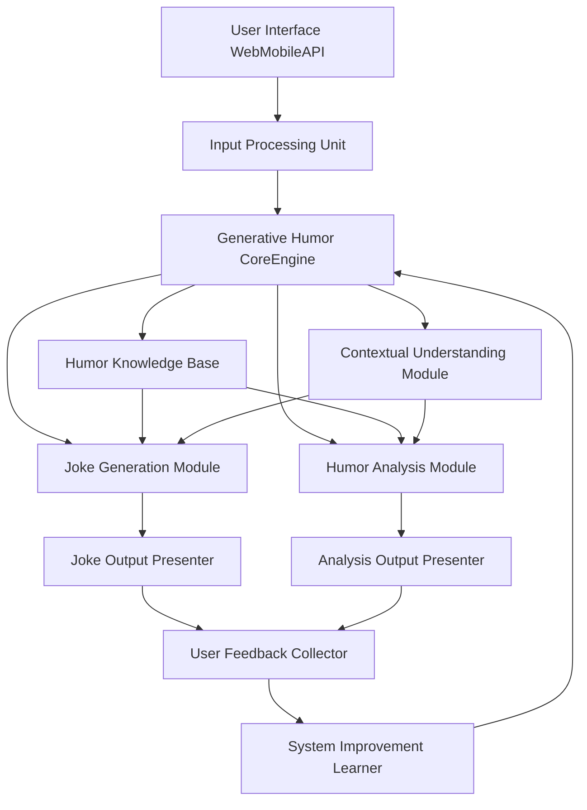
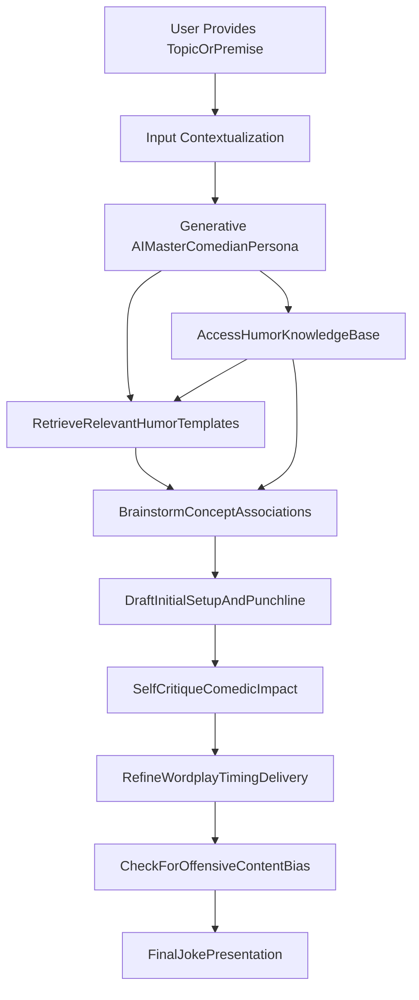
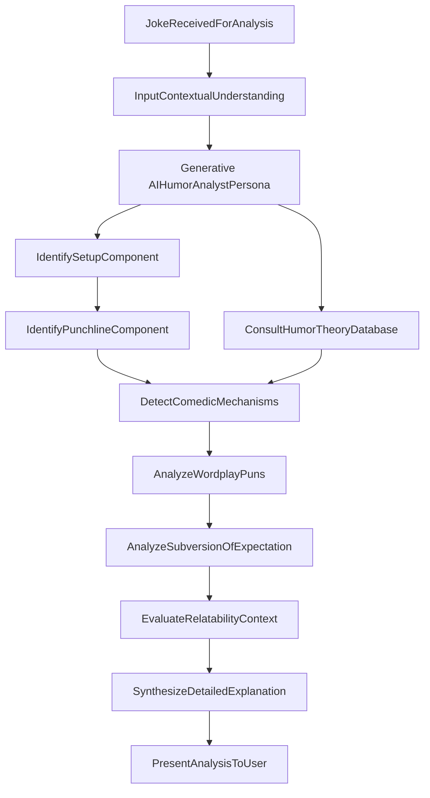
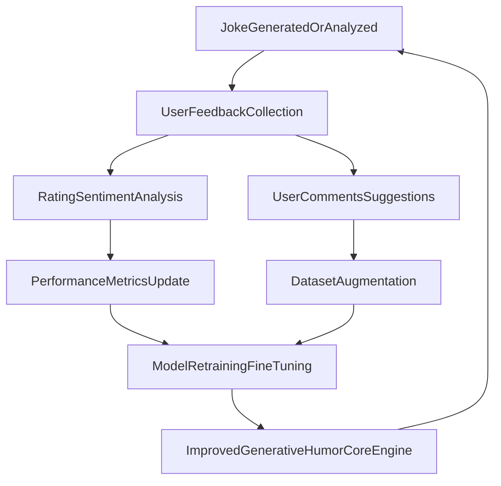

**Title of Invention:** A System and Method for Generative Joke Writing and Humor Analysis

**Abstract:**
A comprehensive system for computational humor is disclosed, leveraging advanced generative AI models. This system enables users to provide a topic or premise, which is then used by a generative AI, operating as a virtual comedian, to create a novel joke. Furthermore, the system incorporates a distinct capability for humor analysis, wherein the AI, prompted as a humor expert, can receive any joke—either self-generated or user-provided—and thoroughly deconstruct its comedic structure. This deconstruction includes identifying the setup, punchline, comedic devices employed (e.g., wordplay, irony, subversion of expectation), and explaining the underlying psychological mechanisms that render the joke funny. The system also integrates a feedback loop for continuous improvement and personalization.

**Background and Motivation:**
The ability to generate and understand humor is a hallmark of human intelligence and a significant challenge for artificial intelligence. Existing AI models can generate text, but the nuanced and context-dependent nature of humor often eludes them. This invention addresses the gap by providing a structured approach to not only generate original jokes but also to analytically explain their effectiveness. Such a system has broad applications, from entertainment and content creation to educational tools for understanding communication and psychology, and even therapeutic uses for mood enhancement. The challenge lies in creating an AI that can mimic human creativity in humor while also possessing the analytical capacity of a seasoned comedian or humor theorist.

**Detailed Description:**
The system operates through several interconnected modules designed to facilitate both the creative process of joke generation and the analytical task of humor deconstruction.

**Overall System Architecture:**
The architecture comprises core processing units, user interaction layers, and persistent knowledge bases, all designed to work in concert.

**Example Use Case:**
A user prompts the AI via the User Interface: "Write a joke about programming."
The Input Processing Unit relays this to the Generative Humor Core Engine. The Joke Generation Module, interacting with the Humor Knowledge Base and Contextual Understanding Module, processes the request. The AI responds: "Why do programmers prefer dark mode? Because light attracts bugs." The Joke Output Presenter displays this to the user.
The user can then ask the AI to "Explain why that joke is funny," which is routed to the Humor Analysis Module. The AI would then respond, identifying the setup ("Why do programmers prefer dark mode?"), the punchline ("Because light attracts bugs."), and explaining the double meaning of the word "bugs" (software errors vs. insects attracted to light), highlighting the subversion of expectation. This analysis is conveyed via the Analysis Output Presenter.

**Joke Generation Process:**
The joke generation module follows a structured approach to create novel humor based on user input.

**Humor Analysis Process:**
The humor analysis module systematically deconstructs jokes to explain their comedic efficacy.

**Feedback and Continuous Improvement Loop:**
The system is designed for iterative improvement, learning from user interactions and feedback.

**Advanced Features and Extensions:**
1.  **Personalized Humor Generation:** The system can learn user preferences, comedic styles, and sensitivity levels to tailor joke generation and analysis. This involves creating and maintaining user profiles.
2.  **Multimodal Humor:** Extending beyond text to generate and analyze jokes involving images, audio, or video clips, requiring integration with multimodal AI models.
3.  **Comedian Style Emulation:** The system could be prompted to generate jokes "in the style of" a specific comedian (e.g., dry wit, observational humor, absurdism) by analyzing their existing body of work.
4.  **Interactive Joke Development:** A collaborative mode where the AI acts as a co-writer, suggesting setups, punchlines, or alternative phrasing, allowing the user to refine the joke iteratively.
5.  **Humor Difficulty Adjustment:** An option to generate jokes for different target audiences or cognitive levels, from simple wordplay for children to complex satirical humor for adults.
6.  **Ethical Filtering and Bias Detection:** Enhanced modules to identify and mitigate potentially offensive, stereotypical, or biased humor, ensuring responsible AI deployment.
7.  **Real-time Audience Reaction Prediction:** Utilizing sentiment analysis and other models to predict how a joke might be received by a given audience demographic before it's delivered.

**Claims:**
1.  A method for generating humor, comprising:
    a.  Receiving a topic or premise from a user via an input interface.
    b.  Prompting a generative AI model, configured with a comedian persona, to create a joke related to the received topic or premise.
    c.  Presenting the generated joke to the user via an output interface.

2.  The method of claim 1, further comprising:
    a.  Employing a Contextual Understanding Module to enhance the relevance and coherence of the joke generation.
    b.  Accessing a Humor Knowledge Base comprising humor templates, comedic devices, and contextual data during joke generation.

3.  The method of claim 1, further comprising:
    a.  Receiving a joke from a user or retrieving a previously generated joke.
    b.  Prompting a generative AI model, configured with a humor analyst persona, to provide a deconstruction of the joke's comedic structure.
    c.  The deconstruction includes identifying the joke's setup and punchline components.

4.  The method of claim 3, further comprising:
    a.  The humor analyst persona identifying specific comedic mechanisms within the joke, including at least one of wordplay, irony, subversion of expectation, or situational humor.
    b.  Generating a detailed explanation of why the joke is funny, based on the identified components and mechanisms.

5.  A system for computational humor, comprising:
    a.  An Input Processing Unit configured to receive user topics, premises, or jokes.
    b.  A Generative Humor Core Engine comprising:
        i.   A Joke Generation Module employing a generative AI model for joke creation.
        ii.  A Humor Analysis Module employing a generative AI model for joke deconstruction.
    c.  An Output Presenter for displaying generated jokes and their analyses.
    d.  A Humor Knowledge Base providing comedic context and structural elements to the Generative Humor Core Engine.

6.  The system of claim 5, further comprising:
    a.  A User Feedback Collector for gathering user ratings and comments on generated jokes and analyses.
    b.  A System Improvement Learner module configured to process user feedback and update the Generative Humor Core Engine through model retraining or fine-tuning, thereby enabling continuous improvement.

7.  The system of claim 5, further comprising:
    a.  A Contextual Understanding Module integrated with the Generative Humor Core Engine to provide real-time information and semantic understanding for both joke generation and analysis.
    b.  A Humor Theory Database accessed by the Humor Analysis Module for identifying and explaining comedic principles.

8.  A method for refining a generative humor model, comprising:
    a.  Collecting user feedback on generated jokes or humor analyses.
    b.  Analyzing said feedback for sentiment, relevance, and specific suggestions.
    c.  Augmenting a training dataset for the generative humor model with processed feedback data.
    d.  Retraining or fine-tuning the generative humor model using the augmented dataset to improve joke generation quality or analysis accuracy.