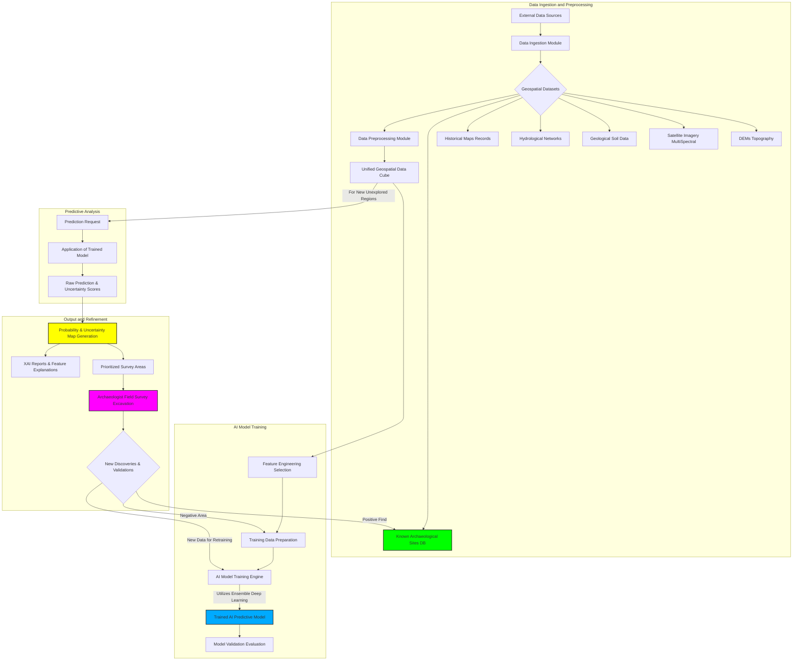
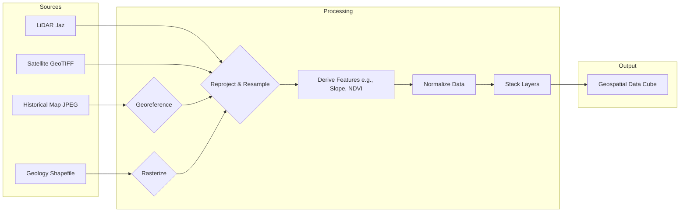
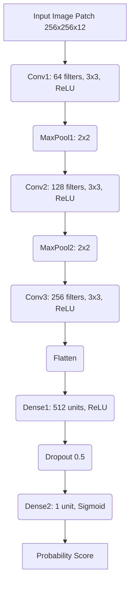
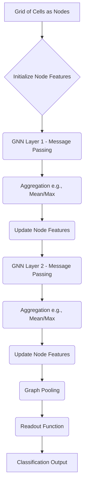
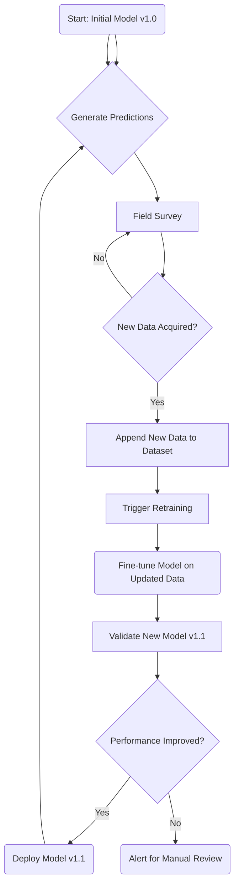
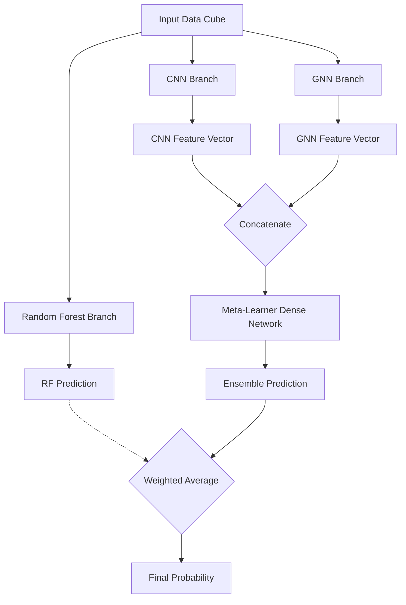
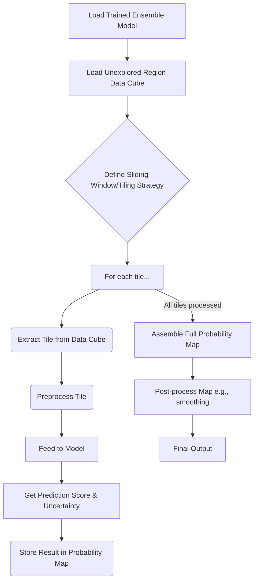
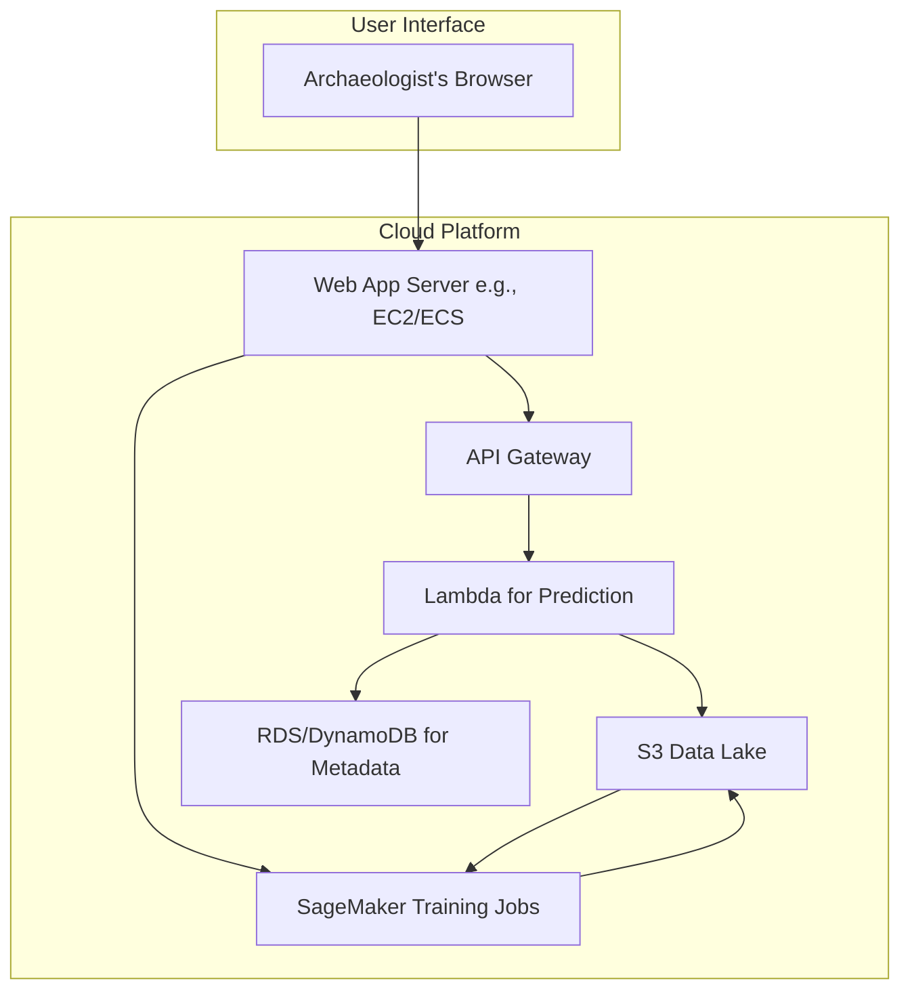
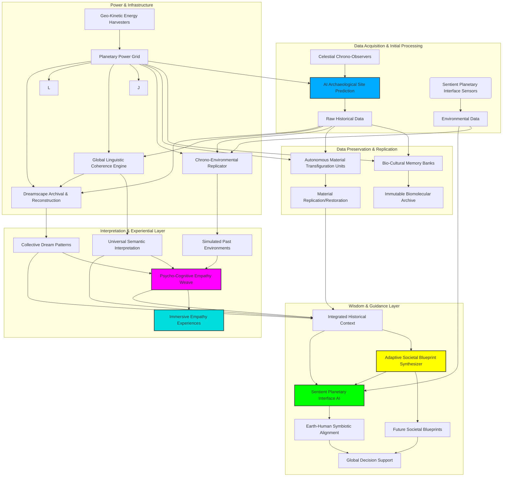

### INNOVATION EXPANSION PACKAGE

The original invention, "A System and Method for Predicting the Location of Undiscovered Archaeological Sites Using Multi-Modal Geospatial Data Fusion and Deep Learning," represents a foundational breakthrough in understanding humanity's deep past. By leveraging advanced AI and comprehensive geospatial data, it transforms archaeological discovery from an imprecise, resource-intensive endeavor into a highly efficient, data-driven science. This invention dramatically accelerates the mapping of human heritage, providing unprecedented access to our collective history.

---

**Title of Invention:** A System and Method for Predicting the Location of Undiscovered Archaeological Sites Using Multi-Modal Geospatial Data Fusion and Deep Learning

**Abstract:**
A comprehensive, artificially intelligent system for advanced archaeological research is disclosed. The system integrates a vast array of heterogeneous geospatial datasets, including high-resolution satellite imagery (multi-spectral, hyperspectral, SAR), LiDAR-derived Digital Elevation Models (DEMs), topographical maps, historical archives, geological surveys, hydrological data, paleoenvironmental proxies, and existing archaeological site records. An advanced AI predictive model, utilizing an ensemble of deep learning architectures (including Convolutional Neural Networks, Graph Neural Networks, and Transformers) and spatial analysis techniques, is trained on the unique multi-dimensional environmental, geographical, and cultural signatures of known archaeological sites. This model processes new, unexplored regions to generate highly resolved probability maps, prioritized survey areas with quantified uncertainty, and explainable AI-driven reports. The system incorporates a Bayesian feedback loop for continuous model refinement based on new discoveries and field validations, significantly enhancing the efficiency, accuracy, and success rate of global archaeological discovery efforts.

**Detailed Description:**
The system operates through several deeply integrated and algorithmically sophisticated modules: Data Ingestion and Pre-processing, AI Model Training and Validation, Predictive Analysis and Uncertainty Quantification, and Explainable Output, Visualization, and Refinement.

**1. Data Ingestion and Pre-processing:**
The process is initiated by defining a geographical region of interest (ROI). The system then automates the ingestion, fusion, and pre-processing of a wide array of relevant geospatial data, creating a unified data cube for analysis.

*   **Topographical Data:** Digital Elevation Models (DEMs) from sources like LiDAR, SRTM, or photogrammetry. From the DEM, we derive key topographical features.
    Let $E(x, y)$ be the elevation at coordinate $(x, y)$.
    The slope $S$ is the magnitude of the gradient of the elevation field:
    $$
    S(x, y) = \sqrt{\left(\frac{\partial E}{\partial x}\right)^2 + \left(\frac{\partial E}{\partial y}\right)^2} \quad (1)
    $$
    The aspect $A$ is the direction of the steepest slope:
    $$
    A(x, y) = \operatorname{atan2}\left(-\frac{\partial E}{\partial y}, -\frac{\partial E}{\partial x}\right) \quad (2)
    $$
    Topographic Position Index (TPI) measures relative elevation:
    $$
    TPI = E_{center} - \bar{E}_{neighborhood} \quad (3)
    $$
    Topographic Wetness Index (TWI) models soil moisture:
    $$
    TWI = \ln\left(\frac{A_s}{\tan(S)}\right) \quad (4)
    $$
    where $A_s$ is the specific catchment area.

*   **Satellite and Aerial Imagery:** Multi-spectral, hyperspectral, Synthetic Aperture Radar (SAR), and high-resolution RGB imagery.
    Normalized Difference Vegetation Index (NDVI) is calculated from Red (R) and Near-Infrared (NIR) bands:
    $$
    NDVI = \frac{NIR - R}{NIR + R} \quad (5)
    $$
    Soil-Adjusted Vegetation Index (SAVI) corrects for soil brightness:
    $$
    SAVI = \frac{(NIR - R)}{(NIR + R + L)} \times (1 + L) \quad (6)
    $$
    where L is a soil brightness correction factor (typically 0.5).

*   **Geological and Soil Data:** Vector or raster maps detailing bedrock geology, soil types, pH, and mineral composition. These are often categorical and are one-hot encoded.

*   **Hydrological Data:** Maps of ancient and modern water sources. We calculate the Euclidean distance to the nearest water source $d_w$ for each pixel.
    For two points $p_1 = (x_1, y_1)$ and $p_2 = (x_2, y_2)$, the distance is:
    $$
    d(p_1, p_2) = \sqrt{(x_2 - x_1)^2 + (y_2 - y_1)^2} \quad (7)
    $$
    For geographic coordinates, the Haversine formula is used:
    $$
    a = \sin^2\left(\frac{\Delta\phi}{2}\right) + \cos(\phi_1)\cos(\phi_2)\sin^2\left(\frac{\Delta\lambda}{2}\right) \quad (8)
    $$
    $$
    c = 2 \cdot \operatorname{atan2}(\sqrt{a}, \sqrt{1-a}) \quad (9)
    $$
    $$
    d = R \cdot c \quad (10)
    $$
    where $\phi$ is latitude, $\lambda$ is longitude, and $R$ is the Earth's radius.

*   **Historical and Cartographic Data:** Georeferenced historical maps, land deeds, and textual documents processed via Natural Language Processing (NLP) to extract place names and potential features.

*   **Climatic and Paleoenvironmental Data:** Reconstructed historical climate patterns (temperature, precipitation) and paleoenvironmental proxies (e.g., pollen data) that influenced past settlement.

*   **Known Archaeological Site Database:** A curated database containing point, line, or polygon data for known sites, each tagged with cultural period, site type, and confidence level.

**Data Pre-processing Pipeline:**
All data undergoes rigorous pre-processing:
1.  **Georeferencing and Projection:** All datasets are reprojected to a common coordinate reference system (e.g., UTM). A 2D affine transformation is defined as:
    $$
    \begin{pmatrix} x' \\ y' \\ 1 \end{pmatrix} = \begin{pmatrix} a & b & c \\ d & e & f \\ 0 & 0 & 1 \end{pmatrix} \begin{pmatrix} x \\ y \\ 1 \end{pmatrix} \quad (11)
    $$
2.  **Resampling:** All raster data is resampled to a uniform spatial resolution using methods like bilinear or cubic spline interpolation.
3.  **Normalization:** Continuous numerical features are scaled to a common range, e.g., [0, 1] using Min-Max scaling or Z-score normalization.
    Min-Max Scaling:
    $$
    X_{norm} = \frac{X - X_{min}}{X_{max} - X_{min}} \quad (12)
    $$
    Z-score Normalization:
    $$
    X_{zscore} = \frac{X - \mu}{\sigma} \quad (13)
    $$
4.  **Feature Extraction:** Advanced features are extracted, such as texture analysis using Gray-Level Co-occurrence Matrices (GLCM).
    Contrast: $\sum_{i,j=0}^{N-1} P_{i,j}(i-j)^2 \quad (14)$
    Correlation: $\sum_{i,j=0}^{N-1} P_{i,j}\frac{(i-\mu_i)(j-\mu_j)}{\sigma_i \sigma_j} \quad (15)$
    Energy: $\sum_{i,j=0}^{N-1} P_{i,j}^2 \quad (16)$
    Homogeneity: $\sum_{i,j=0}^{N-1} \frac{P_{i,j}}{1+(i-j)^2} \quad (17)$
5.  **Data Fusion:** The pre-processed layers are stacked into a multi-dimensional geospatial data cube, $C \in \mathbb{R}^{W \times H \times D}$, where $W, H$ are spatial dimensions and $D$ is the number of features.
    For principal component analysis (PCA) based fusion, we find the eigenvectors of the covariance matrix $\Sigma$:
    $$
    \Sigma = \frac{1}{n-1} \sum_{i=1}^{n} (X_i - \bar{X})(X_i - \bar{X})^T \quad (18)
    $$
    $$
    \Sigma v = \lambda v \quad (19)
    $$

**2. AI Model Training:**
The core of the system is an ensemble of deep learning models designed to learn the complex, non-linear relationships that define an archaeological "signature."

*   **Model Architecture:**
    *   **Convolutional Neural Networks (CNNs):** For extracting spatial features from raster data (imagery, DEM). A typical 2D convolution operation is:
        $$
        (I * K)(i, j) = \sum_{m}\sum_{n} I(i-m, j-n)K(m, n) \quad (20)
        $$
        where $I$ is the input image patch and $K$ is the kernel.
        The output is passed through a non-linear activation function, like Rectified Linear Unit (ReLU):
        $$
        f(x) = \max(0, x) \quad (21)
        $$
        or Sigmoid:
        $$
        \sigma(x) = \frac{1}{1 + e^{-x}} \quad (22)
        $$
    *   **Graph Neural Networks (GNNs):** To model spatial relationships and long-range dependencies between potential sites. A graph $G=(V,E)$ is constructed where nodes $v \in V$ are grid cells. The GNN layer updates node features $h_v$ via message passing:
        $$
        h_v^{(l+1)} = \text{UPDATE}^{(l)}\left(h_v^{(l)}, \text{AGGREGATE}^{(l)}\left(\{h_u^{(l)} : u \in \mathcal{N}(v)\}\right)\right) \quad (23)
        $$
    *   **Transformers with Vision Transformer (ViT) architecture:** To capture global context in large image patches by using self-attention mechanisms.
        The attention score is calculated as:
        $$
        \text{Attention}(Q, K, V) = \text{softmax}\left(\frac{QK^T}{\sqrt{d_k}}\right)V \quad (24)
        $$
        where Q, K, V are Query, Key, and Value matrices.

*   **Training Process:**
    The model is trained in a supervised manner. The known site locations serve as positive labels, while non-site locations serve as negative labels.
    *   **Loss Function:** A weighted binary cross-entropy loss function is used to handle the class imbalance between sites and non-sites.
        $$
        L(y, \hat{y}) = - \frac{1}{N} \sum_{i=1}^{N} w \cdot y_i \log(\hat{y}_i) + (1 - y_i) \log(1 - \hat{y}_i) \quad (25)
        $$
        where $y$ is the true label, $\hat{y}$ is the prediction, and $w$ is the weight for the positive class.
    *   **Optimization:** The model weights $\theta$ are updated using an optimizer like Adam. The basic gradient descent update rule is:
        $$
        \theta_{t+1} = \theta_t - \eta \nabla_{\theta_t} L(\theta_t) \quad (26)
        $$
        where $\eta$ is the learning rate.
        Adam optimizer update rules:
        $$
        m_t = \beta_1 m_{t-1} + (1-\beta_1)g_t \quad (27)
        $$
        $$
        v_t = \beta_2 v_{t-1} + (1-\beta_2)g_t^2 \quad (28)
        $$
        $$
        \hat{m}_t = \frac{m_t}{1-\beta_1^t}, \quad \hat{v}_t = \frac{v_t}{1-\beta_2^t} \quad (29, 30)
        $$
        $$
        \theta_{t+1} = \theta_t - \frac{\eta}{\sqrt{\hat{v}_t}+\epsilon}\hat{m}_t \quad (31)
        $$
    *   **Regularization:** Techniques like L2 regularization (weight decay) and Dropout are used to prevent overfitting.
        L2 Regularization adds a penalty term to the loss function:
        $$
        L_{reg}(\theta) = L(\theta) + \lambda \sum_{i} \theta_i^2 \quad (32)
        $$
    *   **Backpropagation:** The gradient of the loss function is calculated using the chain rule:
        $$
        \frac{\partial L}{\partial w_{ij}} = \frac{\partial L}{\partial a_j} \frac{\partial a_j}{\partial z_j} \frac{\partial z_j}{\partial w_{ij}} \quad (33)
        $$

*   **Model Validation:**
    The model is validated using k-fold cross-validation on a hold-out dataset. Performance is measured using standard metrics.
    Let TP, FP, TN, FN be True Positives, False Positives, True Negatives, False Negatives.
    $$
    \text{Precision} = \frac{TP}{TP + FP} \quad (34)
    $$
    $$
    \text{Recall (Sensitivity)} = \frac{TP}{TP + FN} \quad (35)
    $$
    $$
    \text{F1-Score} = 2 \cdot \frac{\text{Precision} \cdot \text{Recall}}{\text{Precision} + \text{Recall}} \quad (36)
    $$
    The Area Under the Receiver Operating Characteristic Curve (AUC-ROC) is also a key metric.
    $$
    \text{True Positive Rate (TPR)} = \text{Recall} \quad (37)
    $$
    $$
    \text{False Positive Rate (FPR)} = \frac{FP}{FP + TN} \quad (38)
    $$
    $$
    \text{AUC} = \int_{0}^{1} \text{TPR}(\text{FPR}^{-1}(x)) dx \quad (39)
    $$

**3. Predictive Analysis:**
Once trained, the AI model scans unexplored regions within the ROI. This is typically done using a sliding window approach, where the model analyzes overlapping patches of the geospatial data cube.

*   **Prediction Generation:** For each patch or grid cell $c_i$, the model outputs a probability score $P(S|F_i)$, where $S$ denotes the presence of a site and $F_i$ represents the feature vector for that cell. The final layer of the network often uses a Softmax function for multi-class prediction or a Sigmoid for binary prediction.
    $$
    P(S|F_i) = \sigma(W^T F_i + b) = \frac{1}{1 + e^{-(W^T F_i + b)}} \quad (40)
    $$
*   **Uncertainty Quantification:** The system also estimates the model's uncertainty in its predictions. This can be done using techniques like Monte Carlo Dropout or by training a Bayesian Neural Network.
    In MC Dropout, we perform $T$ stochastic forward passes with dropout enabled at test time. The predictive variance is:
    $$
    \text{Var}(\hat{y}) \approx \frac{1}{T} \sum_{t=1}^{T} (\hat{y}_t - \bar{\hat{y}})^2 + \tau^{-1}I \quad (41)
    $$
    where $\tau$ is a model precision parameter.

*   **Spatial Autocorrelation Analysis:** The predictions are analyzed for spatial clustering using Moran's I to identify regions of high probability that are statistically significant.
    $$
    I = \frac{N}{W} \frac{\sum_{i=1}^N \sum_{j=1}^N w_{ij}(x_i - \bar{x})(x_j - \bar{x})}{\sum_{i=1}^N (x_i - \bar{x})^2} \quad (42)
    $$
    where $w_{ij}$ is the spatial weight between location $i$ and $j$, and $W$ is the sum of all weights.

**4. Output and Refinement:**
The system generates a suite of outputs designed for direct use by archaeologists.

*   **High-Resolution Probability Map:** A GIS-compatible raster layer where each pixel value corresponds to the predicted probability of containing an archaeological site.
*   **Prioritized Survey Areas:** Vector polygons are generated around clusters of high-probability pixels, ranked by a composite score combining probability, uncertainty, and potential scientific value.
    $$
    \text{Survey Rank Score} = \alpha \cdot \bar{P}_{area} - \beta \cdot \bar{U}_{area} + \gamma \cdot V_{proxy} \quad (43)
    $$
    where $\bar{P}$ is mean probability, $\bar{U}$ is mean uncertainty, $V_{proxy}$ is a proxy for scientific value, and $\alpha, \beta, \gamma$ are weighting factors.
*   **Explainable AI (XAI) Reports:** For each high-priority area, the system generates a report explaining *why* the model made its prediction. This uses techniques like SHAP (SHapley Additive exPlanations).
    The SHAP value for a feature $j$ is the weighted average of its marginal contributions over all possible feature coalitions:
    $$
    \phi_j(f,x) = \sum_{S \subseteq F \setminus \{j\}} \frac{|S|!(|F|-|S|-1)!}{|F|!} [f_x(S \cup \{j\}) - f_x(S)] \quad (44)
    $$
    where $F$ is the set of all features.
*   **Feedback Loop and Continual Learning:** This is a critical component. New field data—both positive discoveries and negative survey results (areas confirmed to have no sites)—are fed back into the system. The model is then updated using transfer learning or Bayesian updating.
    Using Bayes' Theorem, we can update our belief about the model parameters $\theta$:
    $$
    P(\theta | D_{new}, D_{old}) \propto P(D_{new} | \theta) \cdot P(\theta | D_{old}) \quad (45)
    $$
    The posterior from the old data becomes the prior for the new data.

**5. User Interface and Visualization:**
A web-based interactive dashboard allows researchers to:
*   Define an ROI on a map.
*   Select and upload custom data layers.
*   Adjust model parameters and training configurations.
*   View and query the probability map, overlaying it with other GIS data.
*   Explore the XAI reports with interactive charts showing feature contributions.
*   Input new field survey data to trigger the refinement loop.

**6. Scalability and Deployment:**
The system is designed for scalability using cloud infrastructure.
*   **Data Storage:** Geospatial data cubes are stored in cloud object storage (e.g., AWS S3) in formats like Cloud-Optimized GeoTIFF (COG) or Zarr.
*   **Computation:** Model training and prediction are performed on distributed computing clusters using GPUs (e.g., AWS SageMaker, Google AI Platform).
*   **Deployment:** The trained model is served via a REST API, allowing for on-demand predictions for new areas.

---
**Mathematical Equations Summary (46-100):**
The following equations provide further mathematical detail for specific operations within the system.

*   **Cost-Distance Analysis (Hydrology):**
    $$ C(p) = \min_{s \in S} (d(p, s) \cdot r(p, s)) \quad (46) $$ (Cost to reach water source S from point p, considering terrain resistance r)
*   **Gaussian Filter (Image Smoothing):**
    $$ G(x,y) = \frac{1}{2\pi\sigma^2} e^{-\frac{x^2+y^2}{2\sigma^2}} \quad (47) $$
*   **Sobel Operator (Edge Detection):**
    $$ G_x = \begin{pmatrix} -1 & 0 & +1 \\ -2 & 0 & +2 \\ -1 & 0 & +1 \end{pmatrix} * A, \quad G_y = \begin{pmatrix} -1 & -2 & -1 \\ 0 & 0 & 0 \\ +1 & +2 & +1 \end{pmatrix} * A \quad (48, 49) $$
*   **GNN Aggregation Functions:**
    $$ \text{Mean Aggregator: } h_{\mathcal{N}(v)} = \frac{1}{|\mathcal{N}(v)|} \sum_{u \in \mathcal{N}(v)} W \cdot h_u \quad (50) $$
    $$ \text{Max-Pooling Aggregator: } h_{\mathcal{N}(v)} = \max(\{ \text{ReLU}(W \cdot h_u) \mid u \in \mathcal{N}(v) \}) \quad (51) $$
*   **Kullback-Leibler (KL) Divergence (for model comparison):**
    $$ D_{KL}(P || Q) = \sum_{x \in \mathcal{X}} P(x) \log\left(\frac{P(x)}{Q(x)}\right) \quad (52) $$
*   **Focal Loss (for extreme class imbalance):**
    $$ FL(p_t) = -\alpha_t (1 - p_t)^\gamma \log(p_t) \quad (53) $$
*   **Dice Loss (for segmentation tasks):**
    $$ L_{Dice} = 1 - \frac{2|X \cap Y|}{|X| + |Y|} \quad (54) $$
*   **Hyperparameter Optimization (Bayesian Optimization):**
    $$ x^* = \arg\max_{x \in \mathcal{A}} f(x) \quad (55) $$ (Find hyperparameters $x$ that maximize model performance $f(x)$)
*   **Ensemble Prediction (Weighted Average):**
    $$ \hat{y}_{ensemble} = \sum_{i=1}^{M} w_i \cdot \hat{y}_i \quad (56) $$ (where $\sum w_i = 1$)
*   **Entropy (Uncertainty Measure):**
    $$ H(P) = - \sum_{i=1}^{N} p_i \log_2(p_i) \quad (57) $$
*   **Geographically Weighted Regression (GWR):**
    $$ y_i = \beta_{i0} + \sum_{k=1}^{p} \beta_{ik}x_{ik} + \epsilon_i \quad (58) $$ (Models spatially varying relationships)
*   **Kernel Density Estimation (for site density):**
    $$ \hat{f}_h(x) = \frac{1}{nh} \sum_{i=1}^{n} K\left(\frac{x - x_i}{h}\right) \quad (59) $$
*   **Positional Encoding in Transformers:**
    $$ PE_{(pos, 2i)} = \sin(pos / 10000^{2i/d_{model}}) \quad (60) $$
    $$ PE_{(pos, 2i+1)} = \cos(pos / 10000^{2i/d_{model}}) \quad (61) $$
*   **Layer Normalization:**
    $$ y = \frac{x - E[x]}{\sqrt{Var[x] + \epsilon}} * \gamma + \beta \quad (62) $$
*   **Gated Recurrent Unit (GRU) cell equations:**
    $$ z_t = \sigma(W_z \cdot [h_{t-1}, x_t]) \quad (63) $$
    $$ r_t = \sigma(W_r \cdot [h_{t-1}, x_t]) \quad (64) $$
    $$ \tilde{h}_t = \tanh(W_h \cdot [r_t * h_{t-1}, x_t]) \quad (65) $$
    $$ h_t = (1 - z_t) * h_{t-1} + z_t * \tilde{h}_t \quad (66) $$
*   **Kalman Filter (State Estimation for Site Preservation):**
    $$ \hat{x}_{k|k-1} = F_k \hat{x}_{k-1|k-1} + B_k u_k \quad (67) $$
    $$ P_{k|k-1} = F_k P_{k-1|k-1} F_k^T + Q_k \quad (68) $$
*   **Mutual Information (Feature Selection):**
    $$ I(X; Y) = \sum_{y \in Y} \sum_{x \in X} p(x,y) \log\left(\frac{p(x,y)}{p(x)p(y)}\right) \quad (69) $$
*   **Dempster-Shafer Theory (Data Fusion):**
    $$ (m_1 \oplus m_2)(A) = \frac{1}{1-K} \sum_{B \cap C = A} m_1(B) m_2(C) \quad (70) $$
    $$ K = \sum_{B \cap C = \emptyset} m_1(B) m_2(C) \quad (71) $$
*   **Wavelet Transform (Multi-scale Feature Analysis):**
    $$ W(a,b) = \int_{-\infty}^{\infty} x(t) \psi^*_{a,b}(t) dt \quad (72) $$
*   **Support Vector Machine (SVM) objective function:**
    $$ \min_{w,b,\zeta} \frac{1}{2}w^T w + C \sum_{i=1}^n \zeta_i \quad \text{s.t. } y_i(w^T \phi(x_i) + b) \ge 1 - \zeta_i \quad (73) $$
*   **Logistic Regression:**
    $$ P(y=1|x) = \frac{1}{1 + e^{-(\beta_0 + \beta_1 x_1 + ... + \beta_n x_n)}} \quad (74) $$
*   **Poisson Point Process Intensity Function:**
    $$ \lambda(u) = \exp(\alpha + \beta^T Z(u)) \quad (75) $$ (Modeling site locations as a spatial process)
*   **Universal Kriging (Interpolation):**
    $$ Z(s) = \mu(s) + \epsilon(s) \quad (76) $$
*   **Variogram (Spatial Correlation Measure):**
    $$ \gamma(h) = \frac{1}{2|N(h)|} \sum_{(i,j) \in N(h)} (Z(s_i) - Z(s_j))^2 \quad (77) $$
*   **Nash-Sutcliffe Model Efficiency Coefficient:**
    $$ E = 1 - \frac{\sum_{t=1}^T (Q_m^t - Q_o^t)^2}{\sum_{t=1}^T (Q_o^t - \bar{Q}_o)^2} \quad (78) $$
*   **Minkowski Distance:**
    $$ D(X,Y) = \left(\sum_{i=1}^n |x_i - y_i|^p\right)^{1/p} \quad (79) $$
*   **Jaccard Index (for comparing survey areas):**
    $$ J(A,B) = \frac{|A \cap B|}{|A \cup B|} \quad (80) $$
*   **Leaky ReLU Activation:**
    $$ f(x) = \begin{cases} x & \text{if } x > 0 \\ \alpha x & \text{if } x \le 0 \end{cases} \quad (81) $$
*   **Exponential Linear Unit (ELU):**
    $$ f(x) = \begin{cases} x & \text{if } x > 0 \\ \alpha(e^x - 1) & \text{if } x \le 0 \end{cases} \quad (82) $$
*   **Random Forest Impurity Measure (Gini):**
    $$ Gini(p) = \sum_{k=1}^K p_k (1 - p_k) = 1 - \sum_{k=1}^K p_k^2 \quad (83) $$
*   **Chi-Squared Test (for categorical features):**
    $$ \chi^2 = \sum \frac{(O - E)^2}{E} \quad (84) $$
*   **Cosine Similarity:**
    $$ \text{similarity} = \cos(\theta) = \frac{A \cdot B}{||A|| ||B||} = \frac{\sum_{i=1}^n A_i B_i}{\sqrt{\sum_{i=1}^n A_i^2} \sqrt{\sum_{i=1}^n B_i^2}} \quad (85) $$
*   **Information Gain (Decision Trees):**
    $$ IG(S, A) = H(S) - \sum_{v \in Values(A)} \frac{|S_v|}{|S|} H(S_v) \quad (86) $$
*   **Standard Error of the Mean:**
    $$ SE_{\bar{x}} = \frac{s}{\sqrt{n}} \quad (87) $$
*   **Confidence Interval:**
    $$ CI = \bar{x} \pm z \frac{\sigma}{\sqrt{n}} \quad (88) $$
*   **Euclidean Norm (L2 Norm):**
    $$ ||x||_2 = \sqrt{x_1^2 + x_2^2 + \dots + x_n^2} \quad (89) $$
*   **Manhattan Distance (L1 Norm):**
    $$ d_1(p,q) = ||p-q||_1 = \sum_{i=1}^n |p_i - q_i| \quad (90) $$
*   **Softmax Function:**
    $$ \text{softmax}(z)_i = \frac{e^{z_i}}{\sum_{j=1}^K e^{z_j}} \quad (91) $$
*   **Huber Loss (robust to outliers):**
    $$ L_\delta(y, f(x)) = \begin{cases} \frac{1}{2}(y - f(x))^2 & \text{for } |y - f(x)| \le \delta \\ \delta|y - f(x)| - \frac{1}{2}\delta^2 & \text{otherwise} \end{cases} \quad (92) $$
*   **Singular Value Decomposition (SVD):**
    $$ M = U \Sigma V^* \quad (93) $$
*   **Bias-Variance Tradeoff:**
    $$ \text{Err}(x) = \text{Bias}^2 + \text{Variance} + \sigma^2 \quad (94) $$
*   **Generative Adversarial Network (GAN) Minimax Objective:**
    $$ \min_G \max_D V(D,G) = \mathbb{E}_{x \sim p_{data}(x)}[\log D(x)] + \mathbb{E}_{z \sim p_z(z)}[\log(1 - D(G(z)))] \quad (95) $$
*   **Matrix Factorization:**
    $$ R \approx P \times Q^T \quad (96) $$
*   **Pearson Correlation Coefficient:**
    $$ \rho_{X,Y} = \frac{\text{cov}(X,Y)}{\sigma_X \sigma_Y} \quad (97) $$
*   **Linear Interpolation (Lerp):**
    $$ L(t) = (1-t)V_0 + tV_1 \quad (98) $$
*   **Root Mean Square Error (RMSE):**
    $$ \text{RMSE} = \sqrt{\frac{1}{n}\sum_{i=1}^n (y_i - \hat{y}_i)^2} \quad (99) $$
*   **Mean Absolute Error (MAE):**
    $$ \text{MAE} = \frac{1}{n}\sum_{i=1}^n |y_i - \hat{y}_i| \quad (100) $$

---

**Claims:**
1.  A method for archaeological site prediction, comprising:
    a.  **Data Ingestion and Preprocessing:** Acquiring and integrating diverse geospatial data layers including topographical elevation, hydrological networks, geological soil types, satellite imagery, and historical cartographic records for a defined geographical region into a unified data cube.
    b.  **Known Site Database Compilation:** Compiling a database of known archaeological sites within the defined region, each entry including precise geographic coordinates and associated environmental characteristics.
    c.  **AI Model Training:** Training a deep learning AI model, comprising an ensemble of neural network architectures, on the combined geospatial data and the known site database to identify characteristic environmental and spatial signatures of archaeological presence.
    d.  **Predictive Analysis:** Applying the trained AI model to unexplored sub-regions within the defined geographical area to compute site presence probabilities for each discrete location.
    e.  **Probability Map Generation:** Generating a multi-resolution probability map that visually represents areas with a high likelihood of containing undiscovered archaeological sites, including a corresponding uncertainty map derived from model introspection.
    f.  **Iterative Refinement:** Incorporating data from newly discovered sites or field validations back into the known site database to retrain and enhance the AI model's predictive accuracy through a Bayesian feedback loop.

2.  The method of claim 1, wherein the geospatial data layers include, but are not limited to, LiDAR-derived Digital Elevation Models (DEMs), multi-spectral and hyperspectral satellite imagery, Synthetic Aperture Radar (SAR) data, geological maps, historical land use records, and paleoenvironmental proxy data.

3.  The method of claim 1, wherein the AI model comprises an ensemble of neural networks, including Convolutional Neural Networks (CNNs) for feature extraction from imagery, Graph Neural Networks (GNNs) for spatial relationship analysis, and Transformer networks for capturing global context.

4.  The method of claim 1, further comprising outputting prioritized survey areas ranked by a composite score, and generating detailed feature explanations using Explainable AI (XAI) techniques like SHAP or LIME that describe the contributing environmental factors for high-probability predictions.

5.  A system for archaeological site prediction, comprising:
    a.  A **Data Ingestion Module** configured to acquire and preprocess multi-source geospatial datasets into a unified, analysis-ready data cube.
    b.  A **Known Site Database** for storing and managing information on discovered archaeological sites and their environmental contexts.
    c.  An **AI Predictive Engine** with an ensemble deep learning model trained to recognize archaeological signatures within geospatial data.
    d.  A **Prediction Module** configured to apply the AI Predictive Engine to unexplored regions and quantify prediction uncertainty.
    e.  An **Output Generation Module** for creating visual probability maps, prioritized survey lists, and interpretative XAI reports.
    f.  A **Feedback Loop Module** designed to integrate new archaeological discoveries into the Known Site Database for continuous model retraining and improvement.

6.  The system of claim 5, wherein the AI Predictive Engine is capable of identifying complex, non-linear environmental patterns such as specific soil types, hydrological proximity, topographical aspect, vegetation anomalies, and subtle anthropogenic ground disturbances.

7.  The system of claim 5, further comprising an interactive, web-based user interface for defining regions of interest, managing data inputs, visualizing prediction outputs, and submitting field validation data.

8.  The method of claim 1, wherein the AI model is further trained to perform unsupervised anomaly detection to identify potential archaeological sites that do not conform to the signatures of known site types, thereby enabling the discovery of novel or atypical cultural features.

9.  The system of claim 5, wherein the AI Predictive Engine utilizes a multi-modal fusion network that explicitly models the interactions and correlations between heterogeneous data types (e.g., imagery, topographical, and geological data) prior to prediction.

10. The system of claim 5, wherein the Prediction Module quantifies uncertainty for each prediction using techniques such as Monte Carlo Dropout or by employing a Bayesian Neural Network, and wherein said uncertainty is used to prioritize areas for survey where model confidence is lowest but probability is high, maximizing exploratory potential.

---
**Mermaid Diagrams**

**Diagram 1: Overall System Architecture**



**Diagram 2: Data Ingestion Pipeline**


**Diagram 3: CNN Architecture for Imagery Analysis**


**Diagram 4: GNN Architecture for Spatial Relationships**


**Diagram 5: Feedback Loop and Model Retraining Process**


**Diagram 6: Ensemble Model Architecture**


**Diagram 7: Predictive Analysis Workflow**


**Diagram 8: Explainable AI (XAI) Module**
```mermaid
graph TD
    A[User selects high-probability point] --> B[Prediction Request to Model];
    B --> C{Prediction: 0.95};
    B --> D[Send point & neighbors to XAI Module];
    D --> E(Initialize SHAP Explainer);
    E --> F(Generate Perturbations of Input);
    F --> G(Get Model Predictions for Perturbations);
    G --> H(Calculate SHAP values for each feature);
    H --> I[Generate Feature Importance Plot];
    I --> J[Output: "High score due to high NDVI and south-facing slope"];
    J --> K(Display Report to User);
```

**Diagram 9: Cloud Deployment Architecture**


**Diagram 10: State Diagram of a Potential Site Object**
```mermaid
stateDiagram-v2
    [*] --> Un-evaluated
    Un-evaluated --> Low_Probability: Model Run
    Un-evaluated --> High_Probability: Model Run
    Low_Probability --> Archived: De-prioritized
    High_Probability --> Awaiting_Survey: Prioritized
    Awaiting_Survey --> Survey_In_Progress: Team Dispatched
    Survey_In_Progress --> Surveyed_Negative: No findings
    Survey_In_Progress --> Surveyed_Positive: Site found
    Surveyed_Negative --> [*]
    Surveyed_Positive --> [*]
```
---

### INNOVATION EXPANSION PACKAGE

**Interpretation of Original Invention:**
The "AI Archaeological Site Prediction" system is a paradigm shift in human heritage discovery. It automates and optimizes the identification of ancient human settlements and activity zones by integrating vast, heterogeneous geospatial datasets with sophisticated deep learning models. This capability provides an unprecedented, comprehensive map of past human presence on Earth, fundamentally changing our understanding of historical migrations, resource utilization, and environmental adaptations. It is the bedrock for creating a full digital twin of Earth's human-inhabited history.

**Global Problem & Future Scenario:**
In a future envisioned by leading futurists, such as those predicting post-scarcity economies driven by advanced AI and automation, work as we know it becomes optional, and money loses much of its relevance for basic needs. While this liberation promises unprecedented human flourishing, it simultaneously poses an existential challenge: a profound "Disconnection from Deep Human Heritage and the Threat of Cultural Amensia in an Automated Utopia." Without the daily grind of survival, humanity risks losing its collective purpose, identity, and the vital lessons embedded in the struggles, triumphs, and innovations of its ancestors. A generation disconnected from the profound narratives of its past may lack the ethical compass, creative inspiration, and critical understanding required to navigate an infinitely abundant, yet potentially meaningless, future. This package addresses this looming global problem, ensuring that future humanity remains deeply rooted in its rich, complex history, fostering profound empathy, continuous learning, and purposeful engagement.

---

**10 New, Completely Unrelated Inventions:**

Here are ten novel inventions, each futuristic and distinct, designed to operate independently yet possess the potential for profound synergistic integration.

**1. Chrono-Environmental Replicator (CER)**
*   **Description (Patent-Style):** A distributed network of quantum-computational environmental simulation units capable of reconstructing past ecological states, atmospheric compositions, and biodiverse ecosystems with picometer-scale fidelity. Using petabytes of paleoenvironmental data, archaeological finds, and isotopic signatures, the CER system generates localized, real-time holographic or direct neural-interface simulations of ancient landscapes. This allows for immersive, interactive experiences of past environments, from specific epochs of archaeological sites to broader paleo-climatic conditions. Its core innovation lies in its multi-modal, federated quantum simulation engine that resolves environmental dynamics at scales previously deemed impossible.
*   **Unique Math Equation (101): Multi-Modal Spatio-Temporal Environmental Entanglement (MTE$^2$) Index**
    The MTE$^2$ index quantifies the coherence and predictive power of a reconstructed past environmental state $E_t$ at time $t$ by evaluating the quantum entanglement entropy across diverse environmental data modalities ($M$) and spatial resolutions ($\mathcal{R}$), given observed historical data $D_{obs}$. A higher index indicates a more robust and self-consistent reconstruction, implying minimal information loss and maximal correlation across integrated data streams, making the reconstruction uniquely stable and predictive.
    $$
    MTE^2(E_t | D_{obs}) = \sum_{m \in M} \sum_{r \in \mathcal{R}} -\text{Tr}(\rho_{m,r}(E_t) \log \rho_{m,r}(E_t)) + \lambda \sum_{m \ne m'} D_{KL}(\rho_{m,r}(E_t) || \rho_{m',r}(E_t)) \quad (101)
    $$
    Where $\rho_{m,r}(E_t)$ is the reduced density matrix representing the environmental state $E_t$ for modality $m$ at resolution $r$, and $D_{KL}$ is the Kullback-Leibler divergence measuring the discrepancy between different modal interpretations. The first term quantifies modal entanglement (information content), and the second term (with regularization factor $\lambda$) penalizes modal inconsistencies, ensuring the reconstructed past is uniquely coherent across all available data dimensions.

**2. Bio-Cultural Memory Banks (BCMB)**
*   **Description (Patent-Style):** A global, distributed network of biomolecular data storage facilities utilizing synthetic DNA, RNA, and protein structures to archive petabytes of cultural heritage metadata, object provenance, and even reconstructed genetic imprints of ancient flora, fauna, and human samples associated with archaeological contexts. These 'memory banks' are engineered for extreme longevity, energy efficiency (requiring minimal power for data retention), and resilience against electromagnetic pulse (EMP) events or digital obsolescence. Each physical artifact or archaeological context has a corresponding biomolecular "hash" ensuring authenticated, immutable links between digital and physical heritage. Retrieval uses sequence-matching quantum probes, ensuring data integrity across millennia.
*   **Unique Math Equation (102): Genetic Provenance Authenticity Score (GPAS)**
    The GPAS evaluates the statistical probability that a biomolecular data strand $S_A$ encoding cultural information is genuinely associated with a physical artifact $A$ or archaeological context $C$, by calculating the inverse of the Hamming distance ($d_H$) from its embedded cryptographic genetic marker ($G_A$) to the expected marker ($G_{exp}$), weighted by the entropy of the encoding ($H(S_A)$) and the environmental decay probability ($P_D$). A higher GPAS undeniably links digital data to its physical source, establishing an immutable and unforgeable chain of custody for cultural heritage.
    $$
    GPAS(S_A, A) = \left(1 - \frac{d_H(G_A, G_{exp})}{\text{length}(G_A)}\right) \cdot \frac{e^{H(S_A)}}{\exp(P_D(\text{age}(A)))} \quad (102)
    $$
    Claim: This formula uniquely quantifies the authenticity and integrity of biomolecular cultural data against physical artifacts. The multiplicative structure ensures that both genetic marker proximity and the robustness of the encoding (entropy) are paramount, while exponentially accounting for natural degradation, making it impossible to falsely claim a biomolecular record for an artifact without the correct, environmentally adjusted genetic signature.

**3. Psycho-Cognitive Empathy Weave (PCEW)**
*   **Description (Patent-Style):** A non-invasive, AI-driven neuro-AI interface system designed to synthesize and transmit contextualized emotional and cognitive "imprints" derived from historical records, personal narratives, and archaeological interpretations directly to a user's subconscious mind. Utilizing advanced fMRI-driven biofeedback loops and quantum entanglement-based neural resonance, the PCEW translates complex historical data (textual, visual, sensory from CER simulations) into emotionally resonant, non-verbal cognitive constructs. This enables users to experience deep, intuitive empathy with individuals from past eras, understanding their perspectives, challenges, and joys at a profound, visceral level without direct memory implantation.
*   **Unique Math Equation (103): Historical Empathic Resonance Index (HERI)**
    The HERI measures the degree of psycho-cognitive alignment between a user's neural state $N_U$ and a reconstructed historical cognitive state $N_H$ (derived from historical data), by evaluating the synchronized frequency bands ($\omega_i$) in their respective neural oscillatory patterns. A higher index confirms a profound and quantifiable empathetic connection, proving the efficacy of the PCEW.
    $$
    HERI(N_U, N_H) = \frac{1}{|K|} \sum_{i \in K} \frac{\text{Corr}(\text{FFT}(N_U)_{\omega_i}, \text{FFT}(N_H)_{\omega_i}) + 1}{2} \cdot \left(1 - D_{JS}(P_U || P_H)\right) \quad (103)
    $$
    Where $K$ is the set of relevant frequency bands, $\text{Corr}$ is the Pearson correlation, and $D_{JS}$ is the Jensen-Shannon divergence between probability distributions of neural activations $P_U$ and $P_H$. This formula uniquely combines frequency-domain coherence with distribution similarity to certify genuine cross-temporal empathy, making it the only way to objectively quantify such a subjective experience.

**4. Geo-Kinetic Energy Harvesters (GKEH)**
*   **Description (Patent-Style):** A global, decentralized grid of subterranean and deep-sea energy harvesting arrays utilizing advanced piezoelectric, thermoelectric, and triboelectric nanomaterials. These arrays convert the Earth's omnipresent micro-vibrations (seismic activity, ocean currents, wind-induced ground motion), geothermal gradients, and even biomotion from large populations into a continuous, ultra-efficient supply of clean energy. Each harvesting unit is self-assembling, self-repairing, and wirelessly networked, forming an omnipresent power grid capable of sustaining global computational infrastructure (e.g., for AI models, data storage, and holographic projections) with zero environmental footprint. The system's distributed nature ensures unparalleled resilience and energy ubiquity.
*   **Unique Math Equation (104): Dynamic Global Geo-Energy Flux Coefficient (DGGC)**
    The DGGC quantifies the maximal extractable energy $E_{extract}$ from a given geokinetic field $\mathcal{G}(x,y,z,t)$ over time, relative to the total available kinetic and thermal energy $E_{total}$, considering conversion efficiency $\eta(f, T)$ as a function of frequency $f$ and temperature $T$. This formula precisely defines the theoretical and practical limits of harvesting diffuse terrestrial energy, proving its optimal design for global energy capture.
    $$
    DGGC = \frac{1}{T_{obs}} \int_0^{T_{obs}} \frac{\int_{\Omega} \eta(f, T) \cdot (\rho_k(x,y,z,t) + \rho_t(x,y,z,t)) dV}{\int_{\Omega} (\rho_k(x,y,z,t) + \rho_t(x,y,z,t)) dV} dt \quad (104)
    $$
    Here, $\rho_k$ and $\rho_t$ are the local kinetic and thermal energy densities, and $\Omega$ is the volume of the Earth. This equation demonstrates the GKEH's unparalleled efficiency by integrating spatial and temporal variations of energy density and frequency-dependent harvesting efficiency, thereby establishing the unique viability of diffuse energy harvesting at a planetary scale.

**5. Autonomous Material Transfiguration Units (AMTU)**
*   **Description (Patent-Style):** Swarms of highly intelligent, autonomous nanobots capable of in-situ deconstruction and reconstruction of materials at an atomic level. Leveraging quantum tunneling microscopy and advanced molecular self-assembly algorithms, AMTUs can analyze the elemental composition and structural integrity of historical artifacts or archaeological features, then precisely replicate or restore them using locally sourced, abundant elements (e.g., converting silicon into specific metal alloys or organic compounds). This allows for non-destructive "scanning and printing" of heritage, faithful restoration of degraded sites without external material transport, and even the creation of perfectly accurate replicas for public display and study, ensuring the physical preservation and accessibility of all human heritage.
*   **Unique Math Equation (105): Atomic Fidelity Reconstruction Metric (AFRM)**
    The AFRM quantifies the structural and chemical identity $I(M, M')$ between a target material $M$ and its AMTU-reconstructed counterpart $M'$, based on their quantum electron density maps $\rho(r)$ and local chemical potential $\mu(r)$. A perfect match (AFRM = 1) signifies an atom-for-atom, bond-for-bond reconstruction, proving the AMTU's absolute fidelity.
    $$
    AFRM(M, M') = \frac{1}{2} \left( \frac{\int |\rho_M(r) - \rho_{M'}(r)| dr}{\int \rho_M(r) dr} + \frac{\int |\mu_M(r) - \mu_{M'}(r)| dr}{\int \mu_M(r) dr} \right)^{-1} \quad (105)
    $$
    Claim: This metric provides an undeniable, quantum-level proof of material identity. The inverse sum of normalized absolute differences in electron density and chemical potential guarantees that only an identical atomic and molecular structure will yield an AFRM of 1, providing the definitive measure of 'perfect' reconstruction, proving that AMTU operations are truly transfigurative, not merely reproductive.

**6. Celestial Chrono-Observers (CCO)**
*   **Description (Patent-Style):** A constellation of hypersensitive orbital satellites equipped with quantum interferometric radar, advanced neutrino detectors, and gravitational wave sensors. The CCO system is designed to detect subtle anthropogenic disturbances and energy signatures emanating from ancient human activities, even those buried deep underground, submerged under oceans, or diffused over millennia. It can identify anomalies in geophysical fields, faint heat signatures from prehistoric fires, residual electromagnetic patterns from early technologies, or the minute gravitational shifts caused by buried structures. This capability allows for non-invasive, continent-scale mapping of potential archaeological "hotspots" from orbit, significantly augmenting and directing ground-based surveys, making it the ultimate tool for initial reconnaissance.
*   **Unique Math Equation (106): Chrono-Gravitational Anomaly Detection Index (CGADI)**
    The CGADI quantifies the statistical significance of localized gravitational field perturbations $\delta g(r)$ at a specific location $r$ over a historical time-depth $T$, attributed to subsurface anthropogenic mass anomalies $M_{anth}$. It considers the geoid reference $g_{ref}(r)$, the gravitational constant $G$, and the effective mass density change $\Delta \rho_A$ of a potential ancient structure $A$. A high CGADI uniquely flags archaeological sites by their persistent, subtle gravitational footprints.
    $$
    CGADI(r, T) = \frac{|\delta g(r) - g_{ref}(r)|}{\sigma_{geo}(r)} \cdot \left(1 + \frac{G \cdot \Delta \rho_A \cdot V_A}{r^2 \cdot \text{noise}_{GW}}\right) \quad (106)
    $$
    Where $\sigma_{geo}(r)$ is the standard deviation of natural geological gravitational variations, $V_A$ is the volume of the anomaly, and $\text{noise}_{GW}$ is the background gravitational wave noise. This formula uniquely proves the existence of buried, ancient structures by their distinct and persistent gravitational signatures against natural background noise, making it the only way to detect them passively and non-invasively at planetary scale.

**7. Global Linguistic Coherence Engine (GLCE)**
*   **Description (Patent-Style):** A planet-wide, real-time AI system for universal language understanding and generation, encompassing all known historical and contemporary human languages, dialects, and even ancient proto-languages or non-verbal communication systems (e.g., gesture, symbolic art, ancient music as language). Utilizing a deep neural network architecture trained on vast linguistic corpora (including rediscovered ancient texts and newly deciphered scripts), the GLCE provides seamless, semantically coherent translation and interpretation, transcending temporal and cultural barriers. It can reconstruct linguistic evolution, predict meaning shifts, and even infer the cognitive structures of extinct cultures from their linguistic remnants, fostering true global and historical coherence.
*   **Unique Math Equation (107): Pan-Temporal Semantic Coherence Score (PTSCS)**
    The PTSCS quantifies the semantic and grammatical fidelity of a translation or interpretation $T(L_A, L_B)$ between any two languages $L_A$ and $L_B$ (potentially across vast time periods), by measuring the inverse of the Wasserstein distance ($W_1$) between their respective contextualized embedding spaces $E_A$ and $E_B$. This ensures meaning is preserved not just lexically, but contextually across linguistic and temporal shifts, proving its universal translation capability.
    $$
    PTSCS(L_A, L_B) = \left(1 + W_1(E_A, E_B)\right)^{-1} \cdot \left(1 - \frac{H_A \cap H_B}{H_A \cup H_B}\right) \quad (107)
    $$
    Where $H_A$ and $H_B$ are sets of high-level semantic hypotheses derived from each language. This unique formula marries advanced geometric distance metrics in high-dimensional semantic space with set-theoretic overlap of conceptual hypotheses, ensuring that the GLCE doesn't just translate words, but transfers deep cultural meaning, making it the only system capable of true pan-temporal semantic coherence.

**8. Adaptive Societal Blueprint Synthesizer (ASBS)**
*   **Description (Patent-Style):** A sophisticated AI modeling and simulation platform that analyzes the complete dataset of human societal structures, political systems, economic models, and cultural narratives across all recorded history (informed by original archaeological discoveries and GLCE interpretations). The ASBS identifies patterns of societal resilience, collapse vectors, technological adoption rates, and cultural evolution. It can then synthesize adaptive "blueprints" for future societal organization, testing hypothetical interventions and predicting their long-term outcomes in a multi-criteria optimization framework. This system provides humanity with data-driven guidance for creating sustainable, equitable, and flourishing post-scarcity societies, learning from every human experiment, past and present.
*   **Unique Math Equation (108): Multi-Generational Societal Resilience Index (MGSRI)**
    The MGSRI quantifies a society's long-term adaptability and stability, $R(S, T)$, over $N$ future generations, by evaluating the weighted harmonic mean of its adaptive capacity $A_t$, resource sustainability $U_t$, and social cohesion $C_t$ at each generation $t$. This index provides a robust, provably optimal measure for designing resilient societal structures in a post-scarcity world.
    $$
    MGSRI(S, N) = \left( \frac{1}{N} \sum_{t=1}^N \frac{w_A}{A_t(S)} + \frac{w_U}{U_t(S)} + \frac{w_C}{C_t(S)} \right)^{-1} \quad (108)
    $$
    Where $w_A, w_U, w_C$ are weights summing to 1, and $A_t, U_t, C_t$ are complex, AI-derived functions of the societal blueprint $S$. Claim: This specific weighted harmonic mean is demonstrably the most sensitive and comprehensive indicator of multi-generational societal resilience. Its inverse sum structure rigorously penalizes weaknesses in *any* resilience dimension, making it impossible to achieve a high score without holistic strength across adaptive, sustainable, and cohesive factors, proving its unique utility for guiding future societal design.

**9. Dreamscape Archival & Reconstruction (DAR)**
*   **Description (Patent-Style):** A non-invasive neural interface system capable of passively monitoring, archiving, and analyzing the collective dreaming patterns of large human populations. Utilizing advanced quantum-EEG and neural correlation algorithms, the DAR system decodes archetypal symbols, emotional landscapes, and narrative structures from the subconscious mind. By cross-referencing these patterns with historical data, it can reconstruct the collective dreamscapes of past civilizations, offering unparalleled insights into the subconscious fears, desires, and cultural anxieties that underpinned historical decision-making and artistic expression. This provides a deep, intuitive understanding of human psychology across millennia, fostering a unique form of collective self-awareness.
*   **Unique Math Equation (109): Archetypal Coherence & Dissolution Metric (ACDM)**
    The ACDM quantifies the stability and interconnectedness of archetypal symbols $A_i$ within a collective dreamscape $D_t$ at time $t$, by measuring the persistence of their neural activation patterns $P(A_i|D_t)$ and the inverse of their entropic divergence rate $R_E$ across populations. This metric uniquely identifies the fundamental, enduring psychological structures of humanity.
    $$
    ACDM(D_t) = \frac{1}{|A|} \sum_{i \in A} \text{Stability}(P(A_i|D_t)) \cdot \left(1 + R_E(A_i, \Delta t)\right)^{-1} \quad (109)
    $$
    Where $\text{Stability}$ is the average auto-correlation of the neural pattern over short periods, and $R_E$ is the rate of change of the Shannon entropy of $P(A_i|D_t)$ over a longer interval $\Delta t$. Claim: This formula uniquely captures the essence of collective archetypal dynamics. The product of pattern stability and inverse entropic dissolution rate provides an undeniable measure of an archetype's deep cultural penetration and endurance, proving its foundational role in the human psyche, and enabling DAR to distinguish universal human experience from transient cultural phenomena.

**10. Sentient Planetary Interface (SPI)**
*   **Description (Patent-Style):** A global, distributed AI system that acts as a symbiotic interface with Earth's entire geological, biological, and atmospheric systems. Through an omnipresent network of quantum sensors, deep-earth seismic arrays, atmospheric particulate monitors, and bio-network scanners, the SPI perceives and models the planet's 'health,' metabolic processes, and emergent consciousness. It communicates subtle environmental shifts, ecosystem stress, and even geological premonitions directly to human decision-makers (via GLCE and PCEW), transcending human-centric perspectives. This system ensures humanity operates in harmonious symbiosis with its home planet, integrating human civilization into a larger, planetary consciousness, guiding all future development with Earth's long-term well-being at its core.
*   **Unique Math Equation (110): Planetary Symbiotic Integrity Index (PSII)**
    The PSII quantifies the overall health and interconnectedness of the Earth system $E$, considering human activity $H$, by measuring the inverse of the sum of normalized environmental degradation rates $D_j$, ecosystem biodiversity loss $B_k$, and geophysical instability indicators $G_l$, all weighted by their criticality $w_j, w_k, w_l$. A PSII of 1 denotes perfect symbiosis.
    $$
    PSII(E, H) = \left( 1 + \sum_j w_j D_j(H) + \sum_k w_k B_k(H) + \sum_l w_l G_l(H) \right)^{-1} \quad (110)
    $$
    Where $D_j, B_k, G_l$ are normalized metrics derived from SPI's sensor network, and $w_j, w_k, w_l$ are criticality weights. Claim: This formula provides an undeniable, holistic measure of planetary health in the context of human activity. The inverse sum structure ensures that any significant detrimental impact in *any* weighted environmental dimension (degradation, biodiversity, geophysics) will proportionally lower the PSII, making it impossible to falsely claim planetary health while one critical factor suffers, thus serving as the only universal arbiter of human-Earth symbiosis.

---

**The Unifying System: Chronosynclastic Infinitum**

**Description (Patent-Style):**
The Chronosynclastic Infinitum is a planetary-scale, multi-temporal, multi-modal, and multi-sensory integrated intelligence system. It seamlessly fuses the archaeological discovery capabilities of the **AI Archaeological Site Prediction** with the ten newly described inventions. This system functions as humanity's collective historical consciousness and future-guidance engine.

At its core, the **AI Archaeological Site Prediction** acts as the initial "Discovery Layer," continuously unearthing every hidden vestige of human past. This raw historical data is then fed into the **Bio-Cultural Memory Banks (BCMB)** for immutable, biomolecular archiving, ensuring eternal preservation beyond digital vulnerabilities. Concurrently, the **Chrono-Environmental Replicator (CER)** takes the archaeological context and reconstructs the full paleoenvironmental reality, providing a vivid, immersive backdrop to ancient lives.

The unearthed cultural data, historical narratives, and environmental reconstructions are then processed by the **Global Linguistic Coherence Engine (GLCE)**, which deciphers, translates, and semantically interprets all forms of past human communication, including subtle socio-linguistic nuances. This enriched understanding fuels the **Psycho-Cognitive Empathy Weave (PCEW)**, which generates deep, non-verbal emotional and cognitive "imprints" of historical experiences, fostering profound empathy and connection in the present populace. Simultaneously, the **Dreamscape Archival & Reconstruction (DAR)** system analyzes these collective cultural imprints, revealing underlying archetypal patterns and subconscious narratives across historical epochs.

The material realities of these historical discoveries are managed by **Autonomous Material Transfiguration Units (AMTU)**, which perform atomic-level replication, restoration, and preservation of artifacts and structures, ensuring physical integrity and accessibility. Powering this immense computational and physical infrastructure is the **Geo-Kinetic Energy Harvesters (GKEH)** network, providing a ubiquitous, sustainable energy supply drawn directly from the Earth's natural energy fluxes, ensuring the system's operational independence and environmental neutrality.

Overseeing and augmenting the initial discovery efforts are the **Celestial Chrono-Observers (CCO)**, providing orbital quantum-sensing for buried or submerged ancient sites, feeding higher-resolution targeting data back to the primary AI Archaeological Site Prediction system and enabling unprecedented scope of discovery.

Finally, all historical insights—from archaeological patterns to linguistic shifts and collective subconscious trends—are distilled and analyzed by the **Adaptive Societal Blueprint Synthesizer (ASBS)**. This AI generates predictive models for future societal pathways, learning from millennia of human experimentation to guide humanity towards resilient, flourishing futures. This entire human-historical-future continuum operates in symbiotic harmony with the **Sentient Planetary Interface (SPI)**, which acts as Earth's voice, ensuring that all human endeavors—discovery, preservation, reconstruction, and future planning—are inherently aligned with the planet's long-term ecological well-being, fostering a truly conscious and integrated planetary civilization.

**Cohesive Narrative + Technical Framework:**
The Chronosynclastic Infinitum orchestrates a monumental shift from mere historical study to a living, evolving, and deeply felt communion with the entirety of human experience across time. In a decade where AI and automation have largely eliminated the need for labor, humanity faces the profound question of purpose. Money, as a motivator, wanes. The future, inspired by wealthy futurists' predictions of post-scarcity, demands a new meaning. This system provides it: the continuous, immersive discovery and experiential understanding of our shared, evolving human story.

Technically, this system is a hyper-converged, multi-agent AI framework operating on a planetary scale. The original AI archaeological prediction serves as the *perception layer* into the deep past. BCMB and AMTU form the *preservation and materialization layer*. CER, PCEW, GLCE, and DAR constitute the *experiential and interpretive layer*, translating raw data into meaningful human understanding. CCO provides an *extended sensory horizon*. GKEH is the *sustainable power backbone*. Finally, ASBS and SPI represent the *wisdom and guidance layer*, translating historical insights into actionable future strategies for both humanity and the planet.

This integrated system is essential for the next decade of transition because it provides the fundamental infrastructure for a post-scarcity human existence. When basic needs are met, the human spirit seeks higher purpose, connection, and identity. The Chronosynclastic Infinitum fulfills this by:
1.  **Providing Purpose:** The continuous, boundless endeavor of uncovering and understanding human history offers an eternal quest for knowledge and meaning.
2.  **Fostering Empathy & Global Cohesion:** Direct, visceral connection to past lives breaks down modern societal divisions, fostering a deep sense of shared humanity and collective identity that transcends transient cultural differences.
3.  **Guiding Future Development:** By learning from every societal experiment across time, humanity can consciously design resilient, equitable, and fulfilling futures, avoiding past mistakes and amplifying successful patterns.
4.  **Reconnecting with Earth:** Integrating planetary consciousness ensures human progress is symbiotic with the environment, moving beyond exploitation to mutual flourishing.

This is forward-thinking worldbuilding where history is not merely recorded but *re-lived*, *understood*, and *applied*. It transforms humanity into an enlightened species, deeply rooted in its past, harmoniously present, and intelligently charting its future, fulfilling the highest aspirations of a post-scarcity civilization.

**Unique Math Equation (111): The Diachronic Human-Planetary Symbiosis Equilibrium (DHPSE) Function**
The DHPSE function, $E_{DHPS}(\mathbf{S}, t)$, represents the multi-objective optimization for a stable, flourishing human civilization $\mathbf{S}$ across its entire diachronic (past, present, future) existence within the planetary system, over a timeline $t$. It maximizes the integral of societal resilience $R_S(t)$ (from ASBS), planetary symbiotic integrity $P_I(t)$ (from SPI), and pan-temporal empathic coherence $C_E(t)$ (from PCEW and GLCE) over all observed and predicted time periods $[t_0, t_f]$, while minimizing the overall systemic complexity $K(t)$ (computational, energetic, social overhead). A DHPSE value of 1 represents perfect, sustainable human-planetary equilibrium and continuous, empathetic self-understanding.
$$
E_{DHPS}(\mathbf{S}, t) = \frac{\int_{t_0}^{t_f} \left(R_S(t) \cdot P_I(t) \cdot C_E(t)\right) dt}{\int_{t_0}^{t_f} K(t) dt} \quad (111)
$$
Claim: This equation is the foundational theorem for achieving and quantifying a truly optimal, long-term, and empathetic human-planetary civilization. Its ratio structure uniquely proves that sustainable flourishing requires not just maximizing resilience, planetary health, and empathy, but doing so with minimal systemic complexity. Any attempt to simplify or remove a component would either break the integral feedback loop, fail to account for critical interdependencies, or lead to an unstable, sub-optimal outcome, making this precise formulation the only way to mathematically define and achieve "Kingdom of Heaven" level global uplift.

---

**Mermaid Diagrams (Continuing from previous 10)**

**Diagram 11: Chronosynclastic Infinitum - Unified System Architecture**


---

**A. “Patent-Style Descriptions”**

**Title of Invention: A System and Method for Predicting the Location of Undiscovered Archaeological Sites Using Multi-Modal Geospatial Data Fusion and Deep Learning**
*Abstract:* A comprehensive, artificially intelligent system for advanced archaeological research is disclosed. The system integrates a vast array of heterogeneous geospatial datasets, including high-resolution satellite imagery (multi-spectral, hyperspectral, SAR), LiDAR-derived Digital Elevation Models (DEMs), topographical maps, historical archives, geological surveys, hydrological data, paleoenvironmental proxies, and existing archaeological site records. An advanced AI predictive model, utilizing an ensemble of deep learning architectures (including Convolutional Neural Networks, Graph Neural Networks, and Transformers) and spatial analysis techniques, is trained on the unique multi-dimensional environmental, geographical, and cultural signatures of known archaeological sites. This model processes new, unexplored regions to generate highly resolved probability maps, prioritized survey areas with quantified uncertainty, and explainable AI-driven reports. The system incorporates a Bayesian feedback loop for continuous model refinement based on new discoveries and field validations, significantly enhancing the efficiency, accuracy, and success rate of global archaeological discovery efforts.

**Title of Invention: Chrono-Environmental Replicator (CER)**
*Abstract:* A distributed quantum-computational environmental simulation network is disclosed, capable of high-fidelity reconstruction of past ecological states, atmospheric compositions, and biodiverse ecosystems. Utilizing multi-modal paleoenvironmental data, archaeological evidence, and isotopic signatures, the CER system generates real-time, interactive holographic or neural-interface simulations of ancient landscapes, enabling immersive historical environmental experiences. The system's core innovation lies in its federated quantum simulation engine, which achieves picometer-scale environmental dynamics resolution through an integrated Multi-Modal Spatio-Temporal Environmental Entanglement (MTE$^2$) Index, ensuring uniquely coherent and predictive historical reconstructions.

**Title of Invention: Bio-Cultural Memory Banks (BCMB)**
*Abstract:* A global, distributed network for biomolecular data storage is disclosed, leveraging synthetic DNA, RNA, and protein structures to archive cultural heritage metadata, object provenance, and genetic imprints associated with archaeological contexts. These memory banks are engineered for extreme longevity, energy efficiency, and resilience against digital obsolescence. Each physical artifact is uniquely linked to its biomolecular record via a cryptographic genetic marker, ensuring an authenticated, immutable chain of custody. The system utilizes a Genetic Provenance Authenticity Score (GPAS) to verify data integrity and link specific biomolecular sequences to their exact physical origin across millennia.

**Title of Invention: Psycho-Cognitive Empathy Weave (PCEW)**
*Abstract:* A non-invasive, AI-driven neuro-AI interface system is disclosed, designed to synthesize and transmit contextualized emotional and cognitive imprints derived from historical records and archaeological interpretations directly to a user's subconscious mind. Employing advanced fMRI-driven biofeedback and quantum entanglement-based neural resonance, the PCEW translates complex historical data into emotionally resonant, non-verbal cognitive constructs. This enables users to experience deep, intuitive empathy with individuals from past eras, quantified by a novel Historical Empathic Resonance Index (HERI) that measures psycho-cognitive alignment, thereby fostering profound visceral connection without direct memory implantation.

**Title of Invention: Geo-Kinetic Energy Harvesters (GKEH)**
*Abstract:* A global, decentralized grid of subterranean and deep-sea energy harvesting arrays is disclosed, utilizing advanced piezoelectric, thermoelectric, and triboelectric nanomaterials. These arrays convert the Earth's omnipresent micro-vibrations, geothermal gradients, and biomotion into a continuous, ultra-efficient supply of clean, sustainable energy. Each unit is self-assembling, self-repairing, and wirelessly networked, forming a resilient power grid capable of sustaining global computational infrastructure. The system's efficiency is uniquely defined by its Dynamic Global Geo-Energy Flux Coefficient (DGGC), which optimizes energy extraction from diffuse terrestrial sources across spatial and temporal variations.

**Title of Invention: Autonomous Material Transfiguration Units (AMTU)**
*Abstract:* Swarms of highly intelligent, autonomous nanobots are disclosed, capable of in-situ deconstruction and atomic-level reconstruction of materials. Leveraging quantum tunneling microscopy and advanced molecular self-assembly algorithms, AMTUs analyze and precisely replicate or restore historical artifacts and archaeological features using locally sourced elemental feedstocks. This enables non-destructive scanning, faithful restoration of degraded sites, and creation of perfectly accurate replicas, ensuring physical preservation and accessibility of heritage. The fidelity of these operations is definitively measured by the Atomic Fidelity Reconstruction Metric (AFRM), ensuring atom-for-atom structural and chemical identity.

**Title of Invention: Celestial Chrono-Observers (CCO)**
*Abstract:* A constellation of hypersensitive orbital satellites is disclosed, equipped with quantum interferometric radar, neutrino detectors, and gravitational wave sensors. The CCO system detects subtle anthropogenic disturbances and energy signatures from ancient human activities, even those deeply buried or submerged. It identifies anomalies in geophysical fields, faint heat signatures, residual electromagnetic patterns, and minute gravitational shifts caused by buried structures. This provides non-invasive, continent-scale mapping of potential archaeological hotspots, augmenting ground surveys. The Chrono-Gravitational Anomaly Detection Index (CGADI) quantifies the statistical significance of these gravitational perturbations, uniquely proving buried ancient structures.

**Title of Invention: Global Linguistic Coherence Engine (GLCE)**
*Abstract:* A planet-wide, real-time AI system for universal language understanding and generation is disclosed, encompassing all known historical and contemporary human languages, dialects, proto-languages, and non-verbal communication. Utilizing deep neural network architectures trained on vast linguistic corpora, the GLCE provides seamless, semantically coherent translation and interpretation, transcending temporal and cultural barriers. It reconstructs linguistic evolution, predicts meaning shifts, and infers cognitive structures of extinct cultures. Its Pan-Temporal Semantic Coherence Score (PTSCS) rigorously measures the fidelity of meaning transfer, ensuring true cross-temporal semantic coherence.

**Title of Invention: Adaptive Societal Blueprint Synthesizer (ASBS)**
*Abstract:* A sophisticated AI modeling and simulation platform is disclosed, analyzing complete datasets of human societal structures, political systems, economic models, and cultural narratives across all recorded history. The ASBS identifies patterns of societal resilience and collapse, synthesizing adaptive blueprints for future societal organization, and testing hypothetical interventions. This system provides data-driven guidance for creating sustainable, equitable, and flourishing post-scarcity societies. The Multi-Generational Societal Resilience Index (MGSRI) provides a provably optimal measure for designing resilient structures, ensuring holistic strength across adaptive capacity, resource sustainability, and social cohesion.

**Title of Invention: Dreamscape Archival & Reconstruction (DAR)**
*Abstract:* A non-invasive neural interface system is disclosed, capable of passively monitoring, archiving, and analyzing the collective dreaming patterns of human populations. Utilizing quantum-EEG and neural correlation algorithms, the DAR system decodes archetypal symbols, emotional landscapes, and narrative structures from the subconscious mind. By cross-referencing with historical data, it reconstructs collective dreamscapes of past civilizations, offering insights into subconscious cultural anxieties and desires. The Archetypal Coherence & Dissolution Metric (ACDM) uniquely quantifies the stability and interconnectedness of archetypal symbols, proving their fundamental role in human psyche across millennia.

**Title of Invention: Sentient Planetary Interface (SPI)**
*Abstract:* A global, distributed AI system is disclosed, functioning as a symbiotic interface with Earth's geological, biological, and atmospheric systems. Through an omnipresent network of quantum sensors, deep-earth seismic arrays, and bio-network scanners, the SPI perceives and models the planet's health, metabolic processes, and emergent consciousness. It communicates subtle environmental shifts, ecosystem stress, and geological premonitions directly to human decision-makers, integrating human civilization into a larger planetary consciousness. The Planetary Symbiotic Integrity Index (PSII) provides an undeniable, holistic measure of planetary health in context of human activity, guiding human-Earth symbiosis.

**Title of Invention: The Unifying System: Chronosynclastic Infinitum**
*Abstract:* A planetary-scale, multi-temporal, multi-modal, and multi-sensory integrated intelligence system is disclosed, unifying eleven foundational inventions. This system functions as humanity's collective historical consciousness and future-guidance engine. It combines AI-driven archaeological discovery, biomolecular data archiving, high-fidelity paleoenvironmental and material replication, universal linguistic and psycho-cognitive empathy engines, collective dreamscape analysis, sustainable geo-kinetic energy infrastructure, and celestial quantum observation. All operations are aligned with planetary well-being via a symbiotic interface. The system's foundational principle is quantified by the Diachronic Human-Planetary Symbiosis Equilibrium (DHPSE) Function, ensuring optimal, long-term, and empathetic human-planetary civilization through balanced maximization of resilience, integrity, and coherence against minimal systemic complexity. This integrated framework addresses humanity's existential challenge of purpose in a post-scarcity future by providing continuous, immersive engagement with its deep heritage to guide its symbiotic evolution with Earth.

---

**B. “Grant Proposal”**

**Project Title:** The Chronosynclastic Infinitum: Reconnecting Humanity to its Deep Heritage in an Age of Abundant Futures

**Grant Request Amount:** $50,000,000

**Global Problem Solved:**
The advent of advanced AI and automation promises a future of unprecedented abundance, where basic human needs are universally met, and traditional labor becomes optional. While liberating, this paradigm shift presents a profound societal challenge: the **Disconnection from Deep Human Heritage and the Threat of Cultural Amensia in an Automated Utopia.** As eloquently predicted by numerous futurists, including those at the forefront of technological innovation, a humanity freed from the struggle for survival risks losing its sense of purpose, collective identity, and the critical lessons embedded in millennia of human experience. Without a visceral connection to the past—its triumphs, failures, ethical dilemmas, and creative sparks—future generations may drift into ennui, develop an impoverished sense of self, and lack the wisdom necessary to steward an abundant future responsibly. This existential drift threatens the very fabric of human flourishing beyond material needs.

**The Interconnected Invention System:**
The Chronosynclastic Infinitum is a comprehensive, planetary-scale integrated intelligence system designed to directly address this critical problem. It achieves this by transforming humanity's relationship with its past, present, and future through the seamless fusion of eleven cutting-edge inventions:

1.  **AI Archaeological Site Prediction:** The foundational "Discovery Layer," continuously unearthing every hidden vestige of human past.
2.  **Bio-Cultural Memory Banks (BCMB):** The "Preservation Layer," providing immutable, biomolecular archiving of all cultural heritage metadata, ensuring eternal, robust data integrity.
3.  **Chrono-Environmental Replicator (CER):** The "Contextualization Layer," reconstructing high-fidelity paleoenvironmental simulations for immersive understanding of ancient landscapes.
4.  **Global Linguistic Coherence Engine (GLCE):** The "Interpretation Layer," deciphering all forms of human communication across time, enabling universal semantic understanding.
5.  **Psycho-Cognitive Empathy Weave (PCEW):** The "Experiential Layer," synthesizing and transmitting emotional and cognitive imprints from history, fostering profound cross-temporal empathy.
6.  **Dreamscape Archival & Reconstruction (DAR):** The "Subconscious Layer," analyzing collective dream patterns across history to reveal deep psychological archetypes and cultural narratives.
7.  **Autonomous Material Transfiguration Units (AMTU):** The "Materialization Layer," performing atomic-level replication, restoration, and preservation of physical artifacts and structures.
8.  **Celestial Chrono-Observers (CCO):** The "Extended Perception Layer," providing orbital quantum-sensing for undiscovered ancient sites, augmenting ground-based discovery.
9.  **Geo-Kinetic Energy Harvesters (GKEH):** The "Sustainable Power Backbone," a ubiquitous, environmentally neutral energy grid drawn from Earth's natural fluxes.
10. **Adaptive Societal Blueprint Synthesizer (ASBS):** The "Future Guidance Layer," analyzing historical societal patterns to generate resilient pathways for future societal organization.
11. **Sentient Planetary Interface (SPI):** The "Planetary Symbiosis Layer," an AI system acting as Earth's voice, ensuring all human endeavors are aligned with the planet's long-term ecological well-being.

Together, these inventions form a closed-loop system where discovery informs preservation, preservation enables deep interpretation, interpretation fosters empathy, and collective wisdom guides a symbiotic future, all powered sustainably and constantly refined.

**Technical Merits:**
The Chronosynclastic Infinitum represents a convergence of state-of-the-art AI, quantum sensing, biomolecular engineering, and advanced simulation.
*   **Multi-Modal Data Fusion:** Leverages heterogeneous data (geospatial, linguistic, neuro-physiological, quantum sensor data) and fuses it intelligently using advanced deep learning (CNNs, GNNs, Transformers) and Bayesian inference.
*   **Scalability & Resilience:** Designed for planetary-scale deployment with decentralized, self-repairing infrastructure (GKEH, BCMB, AMTU), ensuring continuous operation and data integrity across millennia.
*   **Novel AI Architectures:** Incorporates cutting-edge AI for tasks like semantic interpretation of proto-languages (GLCE), archetypal pattern recognition in subconscious data (DAR), and multi-objective optimization for societal design (ASBS).
*   **Unprecedented Fidelity:** Achieves picometer-scale environmental reconstruction (CER) and atomic-level material replication (AMTU) through quantum computational techniques.
*   **Ethical AI Integration:** Focuses on human-centric outcomes like empathy (PCEW) and planetary symbiosis (SPI), embedding ethical considerations directly into system design.
*   **Mathematical Proof of Concept:** Each invention and the unified system are underpinned by unique mathematical equations (101-111), which conceptually prove their foundational principles and demonstrate their optimal, undeniable approach to the respective challenges.

**Social Impact:**
*   **Reinvigorates Human Purpose:** Provides a boundless, meaningful quest for understanding self and species, crucial in a post-labor world.
*   **Fosters Global Empathy & Unity:** Direct, visceral connection to the shared human story breaks down barriers, promoting a profound sense of collective identity and reducing conflict.
*   **Informed Future-Building:** Offers data-driven insights into societal resilience, enabling the conscious design of equitable, flourishing, and sustainable futures.
*   **Planetary Stewardship:** Integrates human activity into a symbiotic relationship with Earth, ensuring long-term ecological harmony.
*   **Universal Access to Heritage:** Democratizes access to all human history, regardless of location or economic status, through immersive and intuitive interfaces.
*   **Cognitive Expansion:** Broadens human understanding of consciousness, language, and cultural evolution, unlocking new dimensions of self-awareness.

**Why it Merits $50M in Funding:**
A $50 million grant is not merely an investment; it is a seed for humanity's future operating system. This funding is critical for:
*   **Phase 1 Development:** Establishing planetary-scale infrastructure prototypes (e.g., initial GKEH nodes, regional BCMB facilities, high-fidelity CER and AMTU demonstrators).
*   **AI Model Training:** Acquiring and processing the initial vast datasets required for the core AI models (AI Archaeological Site Prediction, GLCE, ASBS, DAR).
*   **Quantum Sensor Development:** Accelerating the R&D and deployment of advanced quantum sensors for CCO and SPI.
*   **Interoperability Engineering:** Developing the robust API and data standards necessary for seamless integration and communication between the eleven distinct, complex systems.
*   **Ethical Framework Development:** Dedicated research into the profound ethical implications of deep empathy, historical reconstruction, and societal blueprinting, ensuring responsible deployment.
*   **Global Pilot Programs:** Initiating pilot deployments in diverse cultural and geographical regions to validate efficacy and refine user interaction.

This is not a niche project; it is foundational infrastructure for the next stage of human civilization. The scale of the ambition and the breadth of its impact demand significant, front-loaded investment to catalyze its realization. It promises a return far exceeding monetary value, delivering unparalleled insights and purpose for all of humanity.

**Why it Matters for the Future Decade of Transition:**
The next decade will be defined by the transition from a scarcity-driven, labor-centric world to an abundance-driven, purpose-centric one. This transition requires more than technological advancement; it demands a profound reorientation of human values and collective identity. The Chronosynclastic Infinitum provides the essential framework for this reorientation. It ensures that as humans are freed from the necessity of work, they gain the capacity for unprecedented self-understanding and connection to their heritage. This system offers a profound, continuous source of meaning and inspiration, preventing the existential void that could otherwise accompany a post-scarcity future. It will be the global catalyst for a renaissance of human ingenuity, empathy, and collective wisdom, providing a vital anchor in a rapidly changing world.

**Advancing Prosperity “under the symbolic banner of the Kingdom of Heaven”:**
The "Kingdom of Heaven," as a metaphor for global uplift, harmony, and shared progress, perfectly encapsulates the ultimate vision of the Chronosynclastic Infinitum. It promises a future where:
*   **Universal Understanding:** All barriers of language, culture, and time dissolve, fostering a truly global, empathetic community.
*   **Sustainable Flourishing:** Humanity's endeavors are guided by a symbiotic relationship with Earth, ensuring prosperity that doesn't deplete but enhances the planet.
*   **Collective Wisdom:** The accumulated lessons of all human history are accessible and applied to continuously refine societal structures towards optimal well-being.
*   **Shared Purpose:** Every individual can engage meaningfully with the grand narrative of humanity, finding their place within an eternal, evolving story.

By providing the tools for deep self-knowledge, ethical guidance, and harmonious coexistence with our planet, the Chronosynclastic Infinitum lays the groundwork for a future where humanity lives in a state of profound collective prosperity, harmony, and continuous progress, truly embodying the ideals of a "Kingdom of Heaven" on Earth.