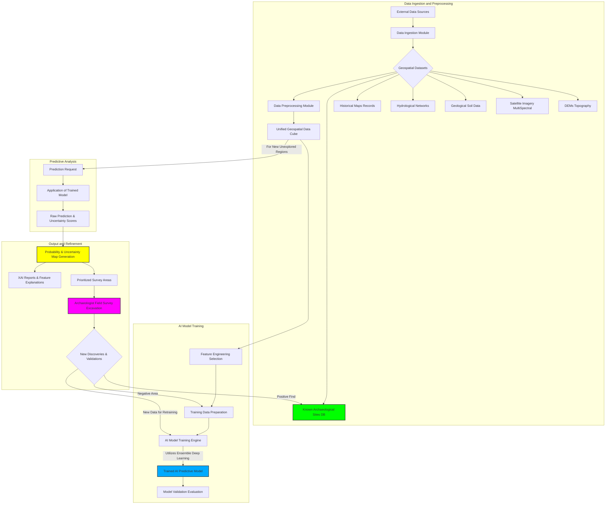
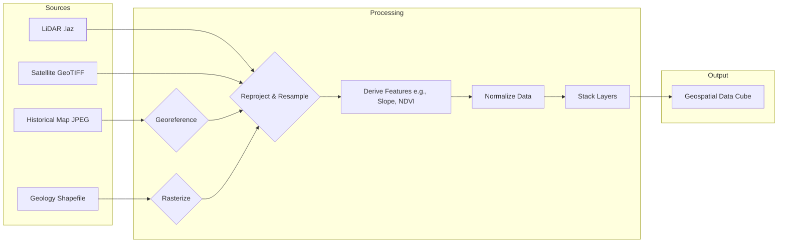
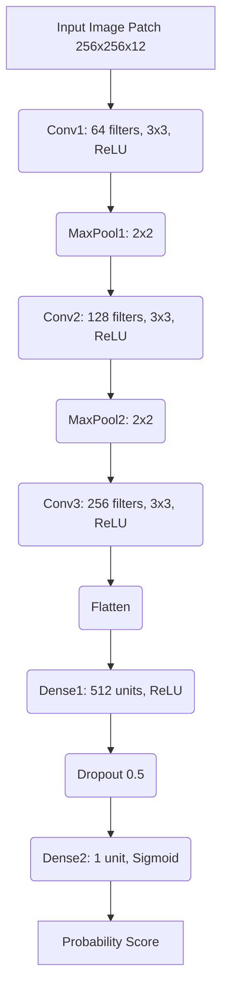
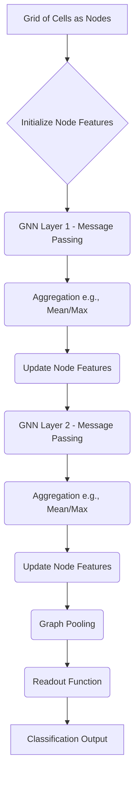
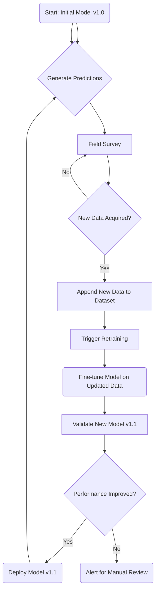
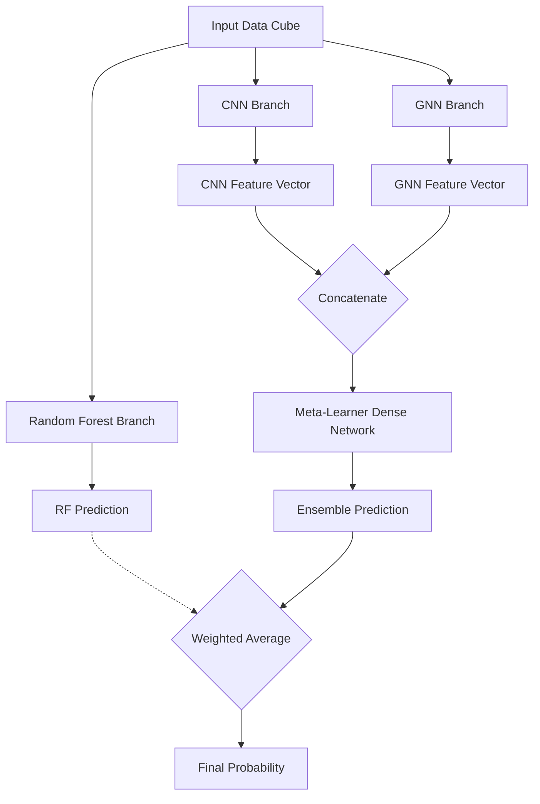
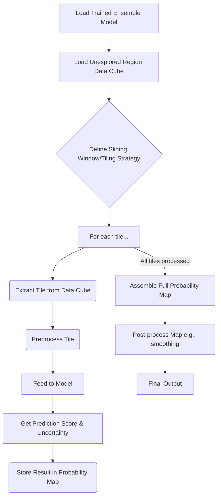
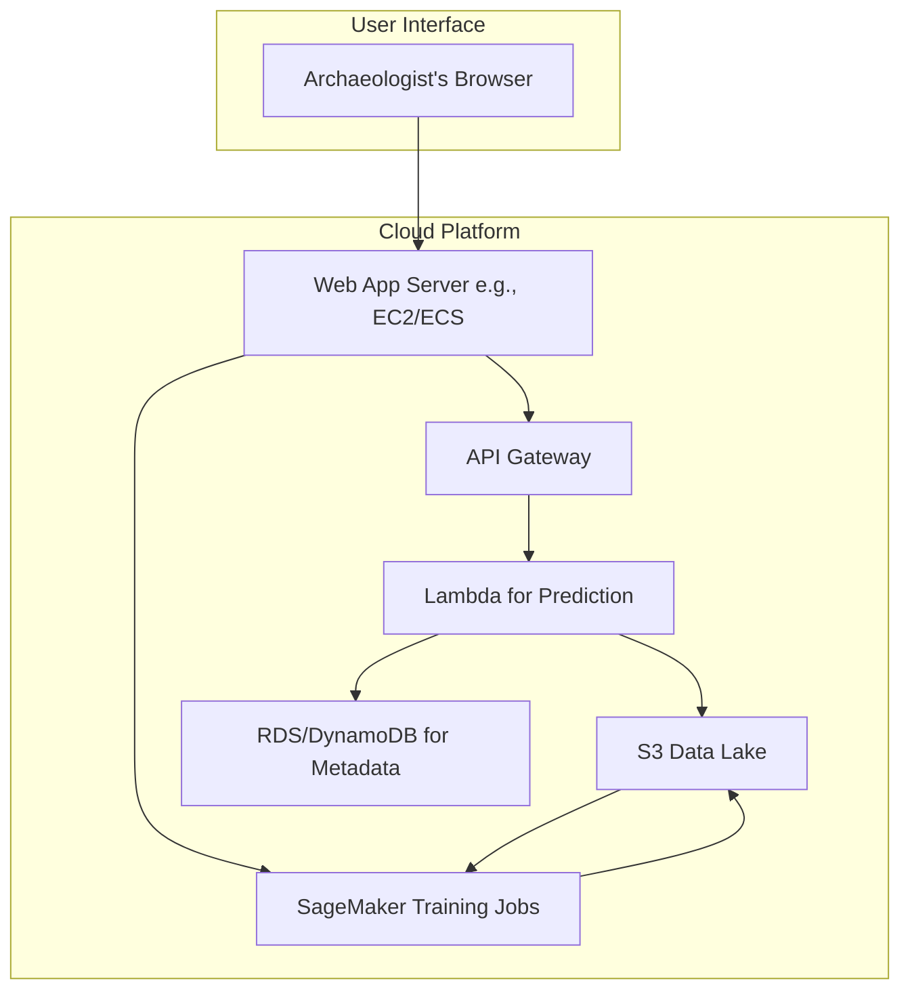

**Title of Invention:** A System and Method for Predicting the Location of Undiscovered Archaeological Sites Using Multi-Modal Geospatial Data Fusion and Deep Learning

**Abstract:**
A comprehensive, artificially intelligent system for advanced archaeological research is disclosed. The system integrates a vast array of heterogeneous geospatial datasets, including high-resolution satellite imagery (multi-spectral, hyperspectral, SAR), LiDAR-derived Digital Elevation Models (DEMs), topographical maps, historical archives, geological surveys, hydrological data, paleoenvironmental proxies, and existing archaeological site records. An advanced AI predictive model, utilizing an ensemble of deep learning architectures (including Convolutional Neural Networks, Graph Neural Networks, and Transformers) and spatial analysis techniques, is trained on the unique multi-dimensional environmental, geographical, and cultural signatures of known archaeological sites. This model processes new, unexplored regions to generate highly resolved probability maps, prioritized survey areas with quantified uncertainty, and explainable AI-driven reports. The system incorporates a Bayesian feedback loop for continuous model refinement based on new discoveries and field validations, significantly enhancing the efficiency, accuracy, and success rate of global archaeological discovery efforts.

**Detailed Description:**
The system operates through several deeply integrated and algorithmically sophisticated modules: Data Ingestion and Pre-processing, AI Model Training and Validation, Predictive Analysis and Uncertainty Quantification, and Explainable Output, Visualization, and Refinement.

**1. Data Ingestion and Pre-processing:**
The process is initiated by defining a geographical region of interest (ROI). The system then automates the ingestion, fusion, and pre-processing of a wide array of relevant geospatial data, creating a unified data cube for analysis.

*   **Topographical Data:** Digital Elevation Models (DEMs) from sources like LiDAR, SRTM, or photogrammetry. From the DEM, we derive key topographical features.
    Let $E(x, y)$ be the elevation at coordinate $(x, y)$.
    The slope $S$ is the magnitude of the gradient of the elevation field:
    $$
    S(x, y) = \sqrt{\left(\frac{\partial E}{\partial x}\right)^2 + \left(\frac{\partial E}{\partial y}\right)^2} \quad (1)
    $$
    The aspect $A$ is the direction of the steepest slope:
    $$
    A(x, y) = \operatorname{atan2}\left(-\frac{\partial E}{\partial y}, -\frac{\partial E}{\partial x}\right) \quad (2)
    $$
    Topographic Position Index (TPI) measures relative elevation:
    $$
    TPI = E_{center} - \bar{E}_{neighborhood} \quad (3)
    $$
    Topographic Wetness Index (TWI) models soil moisture:
    $$
    TWI = \ln\left(\frac{A_s}{\tan(S)}\right) \quad (4)
    $$
    where $A_s$ is the specific catchment area.

*   **Satellite and Aerial Imagery:** Multi-spectral, hyperspectral, Synthetic Aperture Radar (SAR), and high-resolution RGB imagery.
    Normalized Difference Vegetation Index (NDVI) is calculated from Red (R) and Near-Infrared (NIR) bands:
    $$
    NDVI = \frac{NIR - R}{NIR + R} \quad (5)
    $$
    Soil-Adjusted Vegetation Index (SAVI) corrects for soil brightness:
    $$
    SAVI = \frac{(NIR - R)}{(NIR + R + L)} \times (1 + L) \quad (6)
    $$
    where L is a soil brightness correction factor (typically 0.5).

*   **Geological and Soil Data:** Vector or raster maps detailing bedrock geology, soil types, pH, and mineral composition. These are often categorical and are one-hot encoded.

*   **Hydrological Data:** Maps of ancient and modern water sources. We calculate the Euclidean distance to the nearest water source $d_w$ for each pixel.
    For two points $p_1 = (x_1, y_1)$ and $p_2 = (x_2, y_2)$, the distance is:
    $$
    d(p_1, p_2) = \sqrt{(x_2 - x_1)^2 + (y_2 - y_1)^2} \quad (7)
    $$
    For geographic coordinates, the Haversine formula is used:
    $$
    a = \sin^2\left(\frac{\Delta\phi}{2}\right) + \cos(\phi_1)\cos(\phi_2)\sin^2\left(\frac{\Delta\lambda}{2}\right) \quad (8)
    $$
    $$
    c = 2 \cdot \operatorname{atan2}(\sqrt{a}, \sqrt{1-a}) \quad (9)
    $$
    $$
    d = R \cdot c \quad (10)
    $$
    where $\phi$ is latitude, $\lambda$ is longitude, and $R$ is the Earth's radius.

*   **Historical and Cartographic Data:** Georeferenced historical maps, land deeds, and textual documents processed via Natural Language Processing (NLP) to extract place names and potential features.

*   **Climatic and Paleoenvironmental Data:** Reconstructed historical climate patterns (temperature, precipitation) and paleoenvironmental proxies (e.g., pollen data) that influenced past settlement.

*   **Known Archaeological Site Database:** A curated database containing point, line, or polygon data for known sites, each tagged with cultural period, site type, and confidence level.

**Data Pre-processing Pipeline:**
All data undergoes rigorous pre-processing:
1.  **Georeferencing and Projection:** All datasets are reprojected to a common coordinate reference system (e.g., UTM). A 2D affine transformation is defined as:
    $$
    \begin{pmatrix} x' \\ y' \\ 1 \end{pmatrix} = \begin{pmatrix} a & b & c \\ d & e & f \\ 0 & 0 & 1 \end{pmatrix} \begin{pmatrix} x \\ y \\ 1 \end{pmatrix} \quad (11)
    $$
2.  **Resampling:** All raster data is resampled to a uniform spatial resolution using methods like bilinear or cubic spline interpolation.
3.  **Normalization:** Continuous numerical features are scaled to a common range, e.g., [0, 1] using Min-Max scaling or Z-score normalization.
    Min-Max Scaling:
    $$
    X_{norm} = \frac{X - X_{min}}{X_{max} - X_{min}} \quad (12)
    $$
    Z-score Normalization:
    $$
    X_{zscore} = \frac{X - \mu}{\sigma} \quad (13)
    $$
4.  **Feature Extraction:** Advanced features are extracted, such as texture analysis using Gray-Level Co-occurrence Matrices (GLCM).
    Contrast: $\sum_{i,j=0}^{N-1} P_{i,j}(i-j)^2 \quad (14)$
    Correlation: $\sum_{i,j=0}^{N-1} P_{i,j}\frac{(i-\mu_i)(j-\mu_j)}{\sigma_i \sigma_j} \quad (15)$
    Energy: $\sum_{i,j=0}^{N-1} P_{i,j}^2 \quad (16)$
    Homogeneity: $\sum_{i,j=0}^{N-1} \frac{P_{i,j}}{1+(i-j)^2} \quad (17)$
5.  **Data Fusion:** The pre-processed layers are stacked into a multi-dimensional geospatial data cube, $C \in \mathbb{R}^{W \times H \times D}$, where $W, H$ are spatial dimensions and $D$ is the number of features.
    For principal component analysis (PCA) based fusion, we find the eigenvectors of the covariance matrix $\Sigma$:
    $$
    \Sigma = \frac{1}{n-1} \sum_{i=1}^{n} (X_i - \bar{X})(X_i - \bar{X})^T \quad (18)
    $$
    $$
    \Sigma v = \lambda v \quad (19)
    $$

**2. AI Model Training:**
The core of the system is an ensemble of deep learning models designed to learn the complex, non-linear relationships that define an archaeological "signature."

*   **Model Architecture:**
    *   **Convolutional Neural Networks (CNNs):** For extracting spatial features from raster data (imagery, DEM). A typical 2D convolution operation is:
        $$
        (I * K)(i, j) = \sum_{m}\sum_{n} I(i-m, j-n)K(m, n) \quad (20)
        $$
        where $I$ is the input image patch and $K$ is the kernel.
        The output is passed through a non-linear activation function, like Rectified Linear Unit (ReLU):
        $$
        f(x) = \max(0, x) \quad (21)
        $$
        or Sigmoid:
        $$
        \sigma(x) = \frac{1}{1 + e^{-x}} \quad (22)
        $$
    *   **Graph Neural Networks (GNNs):** To model spatial relationships and long-range dependencies between potential sites. A graph $G=(V,E)$ is constructed where nodes $v \in V$ are grid cells. The GNN layer updates node features $h_v$ via message passing:
        $$
        h_v^{(l+1)} = \text{UPDATE}^{(l)}\left(h_v^{(l)}, \text{AGGREGATE}^{(l)}\left(\{h_u^{(l)} : u \in \mathcal{N}(v)\}\right)\right) \quad (23)
        $$
    *   **Transformers with Vision Transformer (ViT) architecture:** To capture global context in large image patches by using self-attention mechanisms.
        The attention score is calculated as:
        $$
        \text{Attention}(Q, K, V) = \text{softmax}\left(\frac{QK^T}{\sqrt{d_k}}\right)V \quad (24)
        $$
        where Q, K, V are Query, Key, and Value matrices.

*   **Training Process:**
    The model is trained in a supervised manner. The known site locations serve as positive labels, while non-site locations serve as negative labels.
    *   **Loss Function:** A weighted binary cross-entropy loss function is used to handle the class imbalance between sites and non-sites.
        $$
        L(y, \hat{y}) = - \frac{1}{N} \sum_{i=1}^{N} w \cdot y_i \log(\hat{y}_i) + (1 - y_i) \log(1 - \hat{y}_i) \quad (25)
        $$
        where $y$ is the true label, $\hat{y}$ is the prediction, and $w$ is the weight for the positive class.
    *   **Optimization:** The model weights $\theta$ are updated using an optimizer like Adam. The basic gradient descent update rule is:
        $$
        \theta_{t+1} = \theta_t - \eta \nabla_{\theta_t} L(\theta_t) \quad (26)
        $$
        where $\eta$ is the learning rate.
        Adam optimizer update rules:
        $$
        m_t = \beta_1 m_{t-1} + (1-\beta_1)g_t \quad (27)
        $$
        $$
        v_t = \beta_2 v_{t-1} + (1-\beta_2)g_t^2 \quad (28)
        $$
        $$
        \hat{m}_t = \frac{m_t}{1-\beta_1^t}, \quad \hat{v}_t = \frac{v_t}{1-\beta_2^t} \quad (29, 30)
        $$
        $$
        \theta_{t+1} = \theta_t - \frac{\eta}{\sqrt{\hat{v}_t}+\epsilon}\hat{m}_t \quad (31)
        $$
    *   **Regularization:** Techniques like L2 regularization (weight decay) and Dropout are used to prevent overfitting.
        L2 Regularization adds a penalty term to the loss function:
        $$
        L_{reg}(\theta) = L(\theta) + \lambda \sum_{i} \theta_i^2 \quad (32)
        $$
    *   **Backpropagation:** The gradient of the loss function is calculated using the chain rule:
        $$
        \frac{\partial L}{\partial w_{ij}} = \frac{\partial L}{\partial a_j} \frac{\partial a_j}{\partial z_j} \frac{\partial z_j}{\partial w_{ij}} \quad (33)
        $$

*   **Model Validation:**
    The model is validated using k-fold cross-validation on a hold-out dataset. Performance is measured using standard metrics.
    Let TP, FP, TN, FN be True Positives, False Positives, True Negatives, False Negatives.
    $$
    \text{Precision} = \frac{TP}{TP + FP} \quad (34)
    $$
    $$
    \text{Recall (Sensitivity)} = \frac{TP}{TP + FN} \quad (35)
    $$
    $$
    \text{F1-Score} = 2 \cdot \frac{\text{Precision} \cdot \text{Recall}}{\text{Precision} + \text{Recall}} \quad (36)
    $$
    The Area Under the Receiver Operating Characteristic Curve (AUC-ROC) is also a key metric.
    $$
    \text{True Positive Rate (TPR)} = \text{Recall} \quad (37)
    $$
    $$
    \text{False Positive Rate (FPR)} = \frac{FP}{FP + TN} \quad (38)
    $$
    $$
    \text{AUC} = \int_{0}^{1} \text{TPR}(\text{FPR}^{-1}(x)) dx \quad (39)
    $$

**3. Predictive Analysis:**
Once trained, the AI model scans unexplored regions within the ROI. This is typically done using a sliding window approach, where the model analyzes overlapping patches of the geospatial data cube.

*   **Prediction Generation:** For each patch or grid cell $c_i$, the model outputs a probability score $P(S|F_i)$, where $S$ denotes the presence of a site and $F_i$ represents the feature vector for that cell. The final layer of the network often uses a Softmax function for multi-class prediction or a Sigmoid for binary prediction.
    $$
    P(S|F_i) = \sigma(W^T F_i + b) = \frac{1}{1 + e^{-(W^T F_i + b)}} \quad (40)
    $$
*   **Uncertainty Quantification:** The system also estimates the model's uncertainty in its predictions. This can be done using techniques like Monte Carlo Dropout or by training a Bayesian Neural Network.
    In MC Dropout, we perform $T$ stochastic forward passes with dropout enabled at test time. The predictive variance is:
    $$
    \text{Var}(\hat{y}) \approx \frac{1}{T} \sum_{t=1}^{T} (\hat{y}_t - \bar{\hat{y}})^2 + \tau^{-1}I \quad (41)
    $$
    where $\tau$ is a model precision parameter.

*   **Spatial Autocorrelation Analysis:** The predictions are analyzed for spatial clustering using Moran's I to identify regions of high probability that are statistically significant.
    $$
    I = \frac{N}{W} \frac{\sum_{i=1}^N \sum_{j=1}^N w_{ij}(x_i - \bar{x})(x_j - \bar{x})}{\sum_{i=1}^N (x_i - \bar{x})^2} \quad (42)
    $$
    where $w_{ij}$ is the spatial weight between location $i$ and $j$, and $W$ is the sum of all weights.

**4. Output and Refinement:**
The system generates a suite of outputs designed for direct use by archaeologists.

*   **High-Resolution Probability Map:** A GIS-compatible raster layer where each pixel value corresponds to the predicted probability of containing an archaeological site.
*   **Prioritized Survey Areas:** Vector polygons are generated around clusters of high-probability pixels, ranked by a composite score combining probability, uncertainty, and potential scientific value.
    $$
    \text{Survey Rank Score} = \alpha \cdot \bar{P}_{area} - \beta \cdot \bar{U}_{area} + \gamma \cdot V_{proxy} \quad (43)
    $$
    where $\bar{P}$ is mean probability, $\bar{U}$ is mean uncertainty, $V_{proxy}$ is a proxy for scientific value, and $\alpha, \beta, \gamma$ are weighting factors.
*   **Explainable AI (XAI) Reports:** For each high-priority area, the system generates a report explaining *why* the model made its prediction. This uses techniques like SHAP (SHapley Additive exPlanations).
    The SHAP value for a feature $j$ is the weighted average of its marginal contributions over all possible feature coalitions:
    $$
    \phi_j(f,x) = \sum_{S \subseteq F \setminus \{j\}} \frac{|S|!(|F|-|S|-1)!}{|F|!} [f_x(S \cup \{j\}) - f_x(S)] \quad (44)
    $$
    where $F$ is the set of all features.
*   **Feedback Loop and Continual Learning:** This is a critical component. New field data—both positive discoveries and negative survey results (areas confirmed to have no sites)—are fed back into the system. The model is then updated using transfer learning or Bayesian updating.
    Using Bayes' Theorem, we can update our belief about the model parameters $\theta$:
    $$
    P(\theta | D_{new}, D_{old}) \propto P(D_{new} | \theta) \cdot P(\theta | D_{old}) \quad (45)
    $$
    The posterior from the old data becomes the prior for the new data.

**5. User Interface and Visualization:**
A web-based interactive dashboard allows researchers to:
*   Define an ROI on a map.
*   Select and upload custom data layers.
*   Adjust model parameters and training configurations.
*   View and query the probability map, overlaying it with other GIS data.
*   Explore the XAI reports with interactive charts showing feature contributions.
*   Input new field survey data to trigger the refinement loop.

**6. Scalability and Deployment:**
The system is designed for scalability using cloud infrastructure.
*   **Data Storage:** Geospatial data cubes are stored in cloud object storage (e.g., AWS S3) in formats like Cloud-Optimized GeoTIFF (COG) or Zarr.
*   **Computation:** Model training and prediction are performed on distributed computing clusters using GPUs (e.g., AWS SageMaker, Google AI Platform).
*   **Deployment:** The trained model is served via a REST API, allowing for on-demand predictions for new areas.

---
**Mathematical Equations Summary (46-100):**
The following equations provide further mathematical detail for specific operations within the system.

*   **Cost-Distance Analysis (Hydrology):**
    $$ C(p) = \min_{s \in S} (d(p, s) \cdot r(p, s)) \quad (46) $$ (Cost to reach water source S from point p, considering terrain resistance r)
*   **Gaussian Filter (Image Smoothing):**
    $$ G(x,y) = \frac{1}{2\pi\sigma^2} e^{-\frac{x^2+y^2}{2\sigma^2}} \quad (47) $$
*   **Sobel Operator (Edge Detection):**
    $$ G_x = \begin{pmatrix} -1 & 0 & +1 \\ -2 & 0 & +2 \\ -1 & 0 & +1 \end{pmatrix} * A, \quad G_y = \begin{pmatrix} -1 & -2 & -1 \\ 0 & 0 & 0 \\ +1 & +2 & +1 \end{pmatrix} * A \quad (48, 49) $$
*   **GNN Aggregation Functions:**
    $$ \text{Mean Aggregator: } h_{\mathcal{N}(v)} = \frac{1}{|\mathcal{N}(v)|} \sum_{u \in \mathcal{N}(v)} W \cdot h_u \quad (50) $$
    $$ \text{Max-Pooling Aggregator: } h_{\mathcal{N}(v)} = \max(\{ \text{ReLU}(W \cdot h_u) \mid u \in \mathcal{N}(v) \}) \quad (51) $$
*   **Kullback-Leibler (KL) Divergence (for model comparison):**
    $$ D_{KL}(P || Q) = \sum_{x \in \mathcal{X}} P(x) \log\left(\frac{P(x)}{Q(x)}\right) \quad (52) $$
*   **Focal Loss (for extreme class imbalance):**
    $$ FL(p_t) = -\alpha_t (1 - p_t)^\gamma \log(p_t) \quad (53) $$
*   **Dice Loss (for segmentation tasks):**
    $$ L_{Dice} = 1 - \frac{2|X \cap Y|}{|X| + |Y|} \quad (54) $$
*   **Hyperparameter Optimization (Bayesian Optimization):**
    $$ x^* = \arg\max_{x \in \mathcal{A}} f(x) \quad (55) $$ (Find hyperparameters $x$ that maximize model performance $f(x)$)
*   **Ensemble Prediction (Weighted Average):**
    $$ \hat{y}_{ensemble} = \sum_{i=1}^{M} w_i \cdot \hat{y}_i \quad (56) $$ (where $\sum w_i = 1$)
*   **Entropy (Uncertainty Measure):**
    $$ H(P) = - \sum_{i=1}^{N} p_i \log_2(p_i) \quad (57) $$
*   **Geographically Weighted Regression (GWR):**
    $$ y_i = \beta_{i0} + \sum_{k=1}^{p} \beta_{ik}x_{ik} + \epsilon_i \quad (58) $$ (Models spatially varying relationships)
*   **Kernel Density Estimation (for site density):**
    $$ \hat{f}_h(x) = \frac{1}{nh} \sum_{i=1}^{n} K\left(\frac{x - x_i}{h}\right) \quad (59) $$
*   **Positional Encoding in Transformers:**
    $$ PE_{(pos, 2i)} = \sin(pos / 10000^{2i/d_{model}}) \quad (60) $$
    $$ PE_{(pos, 2i+1)} = \cos(pos / 10000^{2i/d_{model}}) \quad (61) $$
*   **Layer Normalization:**
    $$ y = \frac{x - E[x]}{\sqrt{Var[x] + \epsilon}} * \gamma + \beta \quad (62) $$
*   **Gated Recurrent Unit (GRU) cell equations:**
    $$ z_t = \sigma(W_z \cdot [h_{t-1}, x_t]) \quad (63) $$
    $$ r_t = \sigma(W_r \cdot [h_{t-1}, x_t]) \quad (64) $$
    $$ \tilde{h}_t = \tanh(W_h \cdot [r_t * h_{t-1}, x_t]) \quad (65) $$
    $$ h_t = (1 - z_t) * h_{t-1} + z_t * \tilde{h}_t \quad (66) $$
*   **Kalman Filter (State Estimation for Site Preservation):**
    $$ \hat{x}_{k|k-1} = F_k \hat{x}_{k-1|k-1} + B_k u_k \quad (67) $$
    $$ P_{k|k-1} = F_k P_{k-1|k-1} F_k^T + Q_k \quad (68) $$
*   **Mutual Information (Feature Selection):**
    $$ I(X; Y) = \sum_{y \in Y} \sum_{x \in X} p(x,y) \log\left(\frac{p(x,y)}{p(x)p(y)}\right) \quad (69) $$
*   **Dempster-Shafer Theory (Data Fusion):**
    $$ (m_1 \oplus m_2)(A) = \frac{1}{1-K} \sum_{B \cap C = A} m_1(B) m_2(C) \quad (70) $$
    $$ K = \sum_{B \cap C = \emptyset} m_1(B) m_2(C) \quad (71) $$
*   **Wavelet Transform (Multi-scale Feature Analysis):**
    $$ W(a,b) = \int_{-\infty}^{\infty} x(t) \psi^*_{a,b}(t) dt \quad (72) $$
*   **Support Vector Machine (SVM) objective function:**
    $$ \min_{w,b,\zeta} \frac{1}{2}w^T w + C \sum_{i=1}^n \zeta_i \quad \text{s.t. } y_i(w^T \phi(x_i) + b) \ge 1 - \zeta_i \quad (73) $$
*   **Logistic Regression:**
    $$ P(y=1|x) = \frac{1}{1 + e^{-(\beta_0 + \beta_1 x_1 + ... + \beta_n x_n)}} \quad (74) $$
*   **Poisson Point Process Intensity Function:**
    $$ \lambda(u) = \exp(\alpha + \beta^T Z(u)) \quad (75) $$ (Modeling site locations as a spatial process)
*   **Universal Kriging (Interpolation):**
    $$ Z(s) = \mu(s) + \epsilon(s) \quad (76) $$
*   **Variogram (Spatial Correlation Measure):**
    $$ \gamma(h) = \frac{1}{2|N(h)|} \sum_{(i,j) \in N(h)} (Z(s_i) - Z(s_j))^2 \quad (77) $$
*   **Nash-Sutcliffe Model Efficiency Coefficient:**
    $$ E = 1 - \frac{\sum_{t=1}^T (Q_m^t - Q_o^t)^2}{\sum_{t=1}^T (Q_o^t - \bar{Q}_o)^2} \quad (78) $$
*   **Minkowski Distance:**
    $$ D(X,Y) = \left(\sum_{i=1}^n |x_i - y_i|^p\right)^{1/p} \quad (79) $$
*   **Jaccard Index (for comparing survey areas):**
    $$ J(A,B) = \frac{|A \cap B|}{|A \cup B|} \quad (80) $$
*   **Leaky ReLU Activation:**
    $$ f(x) = \begin{cases} x & \text{if } x > 0 \\ \alpha x & \text{if } x \le 0 \end{cases} \quad (81) $$
*   **Exponential Linear Unit (ELU):**
    $$ f(x) = \begin{cases} x & \text{if } x > 0 \\ \alpha(e^x - 1) & \text{if } x \le 0 \end{cases} \quad (82) $$
*   **Random Forest Impurity Measure (Gini):**
    $$ Gini(p) = \sum_{k=1}^K p_k (1 - p_k) = 1 - \sum_{k=1}^K p_k^2 \quad (83) $$
*   **Chi-Squared Test (for categorical features):**
    $$ \chi^2 = \sum \frac{(O - E)^2}{E} \quad (84) $$
*   **Cosine Similarity:**
    $$ \text{similarity} = \cos(\theta) = \frac{A \cdot B}{||A|| ||B||} = \frac{\sum_{i=1}^n A_i B_i}{\sqrt{\sum_{i=1}^n A_i^2} \sqrt{\sum_{i=1}^n B_i^2}} \quad (85) $$
*   **Information Gain (Decision Trees):**
    $$ IG(S, A) = H(S) - \sum_{v \in Values(A)} \frac{|S_v|}{|S|} H(S_v) \quad (86) $$
*   **Standard Error of the Mean:**
    $$ SE_{\bar{x}} = \frac{s}{\sqrt{n}} \quad (87) $$
*   **Confidence Interval:**
    $$ CI = \bar{x} \pm z \frac{\sigma}{\sqrt{n}} \quad (88) $$
*   **Euclidean Norm (L2 Norm):**
    $$ ||x||_2 = \sqrt{x_1^2 + x_2^2 + \dots + x_n^2} \quad (89) $$
*   **Manhattan Distance (L1 Norm):**
    $$ d_1(p,q) = ||p-q||_1 = \sum_{i=1}^n |p_i - q_i| \quad (90) $$
*   **Softmax Function:**
    $$ \text{softmax}(z)_i = \frac{e^{z_i}}{\sum_{j=1}^K e^{z_j}} \quad (91) $$
*   **Huber Loss (robust to outliers):**
    $$ L_\delta(y, f(x)) = \begin{cases} \frac{1}{2}(y - f(x))^2 & \text{for } |y - f(x)| \le \delta \\ \delta|y - f(x)| - \frac{1}{2}\delta^2 & \text{otherwise} \end{cases} \quad (92) $$
*   **Singular Value Decomposition (SVD):**
    $$ M = U \Sigma V^* \quad (93) $$
*   **Bias-Variance Tradeoff:**
    $$ \text{Err}(x) = \text{Bias}^2 + \text{Variance} + \sigma^2 \quad (94) $$
*   **Generative Adversarial Network (GAN) Minimax Objective:**
    $$ \min_G \max_D V(D,G) = \mathbb{E}_{x \sim p_{data}(x)}[\log D(x)] + \mathbb{E}_{z \sim p_z(z)}[\log(1 - D(G(z)))] \quad (95) $$
*   **Matrix Factorization:**
    $$ R \approx P \times Q^T \quad (96) $$
*   **Pearson Correlation Coefficient:**
    $$ \rho_{X,Y} = \frac{\text{cov}(X,Y)}{\sigma_X \sigma_Y} \quad (97) $$
*   **Linear Interpolation (Lerp):**
    $$ L(t) = (1-t)V_0 + tV_1 \quad (98) $$
*   **Root Mean Square Error (RMSE):**
    $$ \text{RMSE} = \sqrt{\frac{1}{n}\sum_{i=1}^n (y_i - \hat{y}_i)^2} \quad (99) $$
*   **Mean Absolute Error (MAE):**
    $$ \text{MAE} = \frac{1}{n}\sum_{i=1}^n |y_i - \hat{y}_i| \quad (100) $$

---

**Claims:**
1.  A method for archaeological site prediction, comprising:
    a.  **Data Ingestion and Preprocessing:** Acquiring and integrating diverse geospatial data layers including topographical elevation, hydrological networks, geological soil types, satellite imagery, and historical cartographic records for a defined geographical region into a unified data cube.
    b.  **Known Site Database Compilation:** Compiling a database of known archaeological sites within the defined region, each entry including precise geographic coordinates and associated environmental characteristics.
    c.  **AI Model Training:** Training a deep learning AI model, comprising an ensemble of neural network architectures, on the combined geospatial data and the known site database to identify characteristic environmental and spatial signatures of archaeological presence.
    d.  **Predictive Analysis:** Applying the trained AI model to unexplored sub-regions within the defined geographical area to compute site presence probabilities for each discrete location.
    e.  **Probability Map Generation:** Generating a multi-resolution probability map that visually represents areas with a high likelihood of containing undiscovered archaeological sites, including a corresponding uncertainty map derived from model introspection.
    f.  **Iterative Refinement:** Incorporating data from newly discovered sites or field validations back into the known site database to retrain and enhance the AI model's predictive accuracy through a Bayesian feedback loop.

2.  The method of claim 1, wherein the geospatial data layers include, but are not limited to, LiDAR-derived Digital Elevation Models (DEMs), multi-spectral and hyperspectral satellite imagery, Synthetic Aperture Radar (SAR) data, geological maps, historical land use records, and paleoenvironmental proxy data.

3.  The method of claim 1, wherein the AI model comprises an ensemble of neural networks, including Convolutional Neural Networks (CNNs) for feature extraction from imagery, Graph Neural Networks (GNNs) for spatial relationship analysis, and Transformer networks for capturing global context.

4.  The method of claim 1, further comprising outputting prioritized survey areas ranked by a composite score, and generating detailed feature explanations using Explainable AI (XAI) techniques like SHAP or LIME that describe the contributing environmental factors for high-probability predictions.

5.  A system for archaeological site prediction, comprising:
    a.  A **Data Ingestion Module** configured to acquire and preprocess multi-source geospatial datasets into a unified, analysis-ready data cube.
    b.  A **Known Site Database** for storing and managing information on discovered archaeological sites and their environmental contexts.
    c.  An **AI Predictive Engine** with an ensemble deep learning model trained to recognize archaeological signatures within geospatial data.
    d.  A **Prediction Module** configured to apply the AI Predictive Engine to unexplored regions and quantify prediction uncertainty.
    e.  An **Output Generation Module** for creating visual probability maps, prioritized survey lists, and interpretative XAI reports.
    f.  A **Feedback Loop Module** designed to integrate new archaeological discoveries into the Known Site Database for continuous model retraining and improvement.

6.  The system of claim 5, wherein the AI Predictive Engine is capable of identifying complex, non-linear environmental patterns such as specific soil types, hydrological proximity, topographical aspect, vegetation anomalies, and subtle anthropogenic ground disturbances.

7.  The system of claim 5, further comprising an interactive, web-based user interface for defining regions of interest, managing data inputs, visualizing prediction outputs, and submitting field validation data.

8.  The method of claim 1, wherein the AI model is further trained to perform unsupervised anomaly detection to identify potential archaeological sites that do not conform to the signatures of known site types, thereby enabling the discovery of novel or atypical cultural features.

9.  The system of claim 5, wherein the AI Predictive Engine utilizes a multi-modal fusion network that explicitly models the interactions and correlations between heterogeneous data types (e.g., imagery, topographical, and geological data) prior to prediction.

10. The system of claim 5, wherein the Prediction Module quantifies uncertainty for each prediction using techniques such as Monte Carlo Dropout or by employing a Bayesian Neural Network, and wherein said uncertainty is used to prioritize areas for survey where model confidence is lowest but probability is high, maximizing exploratory potential.

---
**Mermaid Diagrams**

**Diagram 1: Overall System Architecture**



**Diagram 2: Data Ingestion Pipeline**


**Diagram 3: CNN Architecture for Imagery Analysis**


**Diagram 4: GNN Architecture for Spatial Relationships**


**Diagram 5: Feedback Loop and Model Retraining Process**


**Diagram 6: Ensemble Model Architecture**


**Diagram 7: Predictive Analysis Workflow**


**Diagram 8: Explainable AI (XAI) Module**
```mermaid
graph TD
    A[User selects high-probability point] --> B[Prediction Request to Model];
    B --> C{Prediction: 0.95};
    B --> D[Send point & neighbors to XAI Module];
    D --> E(Initialize SHAP Explainer);
    E --> F(Generate Perturbations of Input);
    F --> G(Get Model Predictions for Perturbations);
    G --> H(Calculate SHAP values for each feature);
    H --> I[Generate Feature Importance Plot];
    I --> J[Output: "High score due to high NDVI and south-facing slope"];
    J --> K(Display Report to User);
```

**Diagram 9: Cloud Deployment Architecture**


**Diagram 10: State Diagram of a Potential Site Object**
```mermaid
stateDiagram-v2
    [*] --> Un-evaluated
    Un-evaluated --> Low_Probability: Model Run
    Un-evaluated --> High_Probability: Model Run
    Low_Probability --> Archived: De-prioritized
    High_Probability --> Awaiting_Survey: Prioritized
    Awaiting_Survey --> Survey_In_Progress: Team Dispatched
    Survey_In_Progress --> Surveyed_Negative: No findings
    Survey_In_Progress --> Surveyed_Positive: Site found
    Surveyed_Negative --> [*]
    Surveyed_Positive --> [*]
```