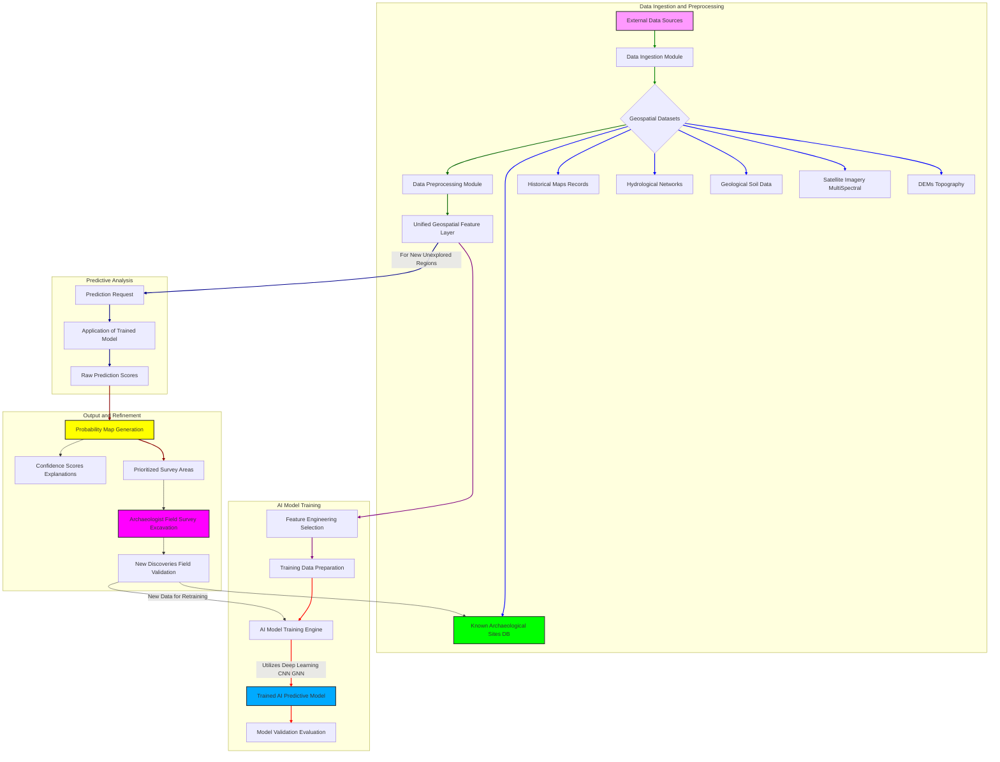

**Title of Invention:** A System and Method for Predicting the Location of Undiscovered Archaeological Sites

**Abstract:**
A comprehensive system for advanced archaeological research is disclosed. The system integrates diverse geospatial datasets, including high-resolution satellite imagery, LiDAR scans, topographical maps, historical archives, geological surveys, hydrological data, and existing archaeological site records. An AI predictive model, utilizing deep learning and spatial analysis techniques, is trained on the unique environmental, geographical, and cultural signatures of known archaeological sites. This model then processes new, unexplored regions, generating highly resolved probability maps and prioritized survey areas, thereby significantly enhancing the efficiency and success rate of archaeological discovery. The system further incorporates a feedback loop for continuous model refinement based on new discoveries and field validations.

**Detailed Description:**
The system operates through several integrated modules: Data Ingestion and Pre-processing, AI Model Training, Predictive Analysis, and Output/Refinement.

**1. Data Ingestion and Pre-processing:**
Researchers initiate the process by defining a geographical region of interest. The system then automatically or manually ingests a wide array of relevant geospatial data. This includes:
*   **Topographical Data:** Digital Elevation Models DEMs derived from LiDAR scans or satellite altimetry, providing precise elevation, slope, aspect, and hydrological network data.
*   **Satellite and Aerial Imagery:** Multi-spectral, hyperspectral, and high-resolution RGB imagery for vegetation analysis, land use patterns, and subtle ground anomalies.
*   **Geological and Soil Data:** Maps detailing bedrock geology, soil types, and soil composition, which influence preservation and early human settlement choices.
*   **Hydrological Data:** Maps of ancient and modern water sources, river courses, and drainage patterns.
*   **Historical and Cartographic Data:** Scanned historical maps, land deeds, and old survey documents which may indicate past land use or forgotten features.
*   **Climatic Data:** Historical climate patterns influencing past environmental conditions.
*   **Known Archaeological Site Database:** A critical dataset containing precise coordinates, associated cultural periods, site types e.g., Roman villa, Neolithic settlement, and environmental context of previously discovered sites.

All ingested data undergoes rigorous pre-processing, including georeferencing, projection standardization, normalization, outlier detection, and feature extraction using techniques like object-based image analysis OBIA or texture analysis. Missing data imputation and fusion of heterogeneous datasets are also performed to create a unified, multi-layered geospatial information system GIS for the AI.

**2. AI Model Training:**
The core of the system is an advanced AI predictive model, often an ensemble of deep neural networks such as Convolutional Neural Networks CNNs for image feature extraction, Graph Neural Networks GNNs for spatial relationships, or Generative Adversarial Networks GANs for anomaly detection. Using the known archaeological site database, the model is trained to identify and learn the complex, multi-dimensional environmental and topographical "signatures" unique to different types of archaeological features or cultural periods. For example, the AI might learn that Roman villas in a specific region are typically situated on well-drained, south-facing slopes, within 2 kilometers of a perennial freshwater source, often near a specific soil type conducive to agriculture, and exhibiting subtle anthropogenic changes in vegetation visible from satellite imagery. Feature importance analysis is employed to understand which environmental factors contribute most to predictive accuracy.

**3. Predictive Analysis:**
Once trained and validated, the AI model is applied to unexplored regions within the defined area of interest. It systematically scans the pre-processed geospatial data layers for these new territories. The model identifies areas that statistically match the learned signatures of known sites, factoring in the probability of site preservation and discovery potential.

**4. Output and Refinement:**
The primary output is a high-resolution **Probability Map**, visually highlighting areas with varying likelihoods of containing undiscovered archaeological sites. This map is often presented alongside:
*   **Prioritized Survey Areas:** Specific zones with the highest probability, ranked for immediate archaeological investigation.
*   **Feature Explanations:** Interpretations of why certain areas are flagged, detailing the contributing environmental and topographical factors identified by the AI.
*   **Confidence Scores:** Numerical values indicating the model's confidence in its predictions for each potential site.

Archaeologists then use these outputs to guide field surveys, targeted excavations, and remote sensing campaigns. Crucially, the system incorporates a **Feedback Loop**. Any new discoveries made in the field, whether predicted by the AI or found serendipitously, are integrated back into the known archaeological site database. This new data is then used to retrain and fine-tune the AI model, continuously improving its accuracy and predictive power over time through iterative learning. This adaptive capability allows the model to evolve and become more precise as more data becomes available, making it a living, intelligent tool for archaeological exploration.

**Claims:**
1.  A method for archaeological site prediction, comprising:
    a.  **Data Ingestion and Preprocessing:** Acquiring and integrating diverse geospatial data layers including topographical elevation, hydrological networks, geological soil types, satellite imagery, and historical cartographic records for a defined geographical region.
    b.  **Known Site Database Compilation:** Compiling a database of known archaeological sites within the defined region, each entry including precise geographic coordinates and associated environmental characteristics.
    c.  **AI Model Training:** Training a deep learning AI model on the combined geospatial data and the known site database to identify characteristic environmental and spatial signatures of archaeological presence.
    d.  **Predictive Analysis:** Applying the trained AI model to unexplored sub-regions within the defined geographical area using its corresponding geospatial data.
    e.  **Probability Map Generation:** Generating a multi-resolution probability map that visually represents areas with a high likelihood of containing undiscovered archaeological sites, including confidence scores.
    f.  **Iterative Refinement:** Incorporating data from newly discovered sites or field validations back into the known site database to retrain and enhance the AI model's predictive accuracy.

2.  The method of claim 1, wherein the geospatial data layers include, but are not limited to, LiDAR-derived Digital Elevation Models DEMs, multi-spectral satellite imagery, geological maps, historical land use records, and hydrological flow paths.

3.  The method of claim 1, wherein the AI model comprises an ensemble of neural networks, including Convolutional Neural Networks CNNs for feature extraction from imagery and Graph Neural Networks GNNs for spatial relationship analysis.

4.  The method of claim 1, further comprising outputting prioritized survey areas and detailed feature explanations that describe the contributing environmental factors for high-probability predictions.

5.  A system for archaeological site prediction, comprising:
    a.  A **Data Ingestion Module** configured to acquire and preprocess multi-source geospatial datasets.
    b.  A **Known Site Database** for storing and managing information on discovered archaeological sites and their environmental contexts.
    c.  An **AI Predictive Engine** with a deep learning model trained to recognize archaeological signatures within geospatial data.
    d.  A **Prediction Module** configured to apply the AI Predictive Engine to unexplored regions.
    e.  An **Output Generation Module** for creating visual probability maps, prioritized survey lists, and interpretative reports.
    f.  A **Feedback Loop Module** designed to integrate new archaeological discoveries into the Known Site Database for continuous model retraining and improvement.

6.  The system of claim 5, wherein the AI Predictive Engine is capable of identifying environmental patterns such as specific soil types, hydrological proximity, topographical aspect, and vegetation anomalies.

7.  The system of claim 5, further comprising a user interface for defining regions of interest, managing data inputs, and visualizing prediction outputs.

**Mermaid Diagram: Archaeological Site Prediction System Architecture**

