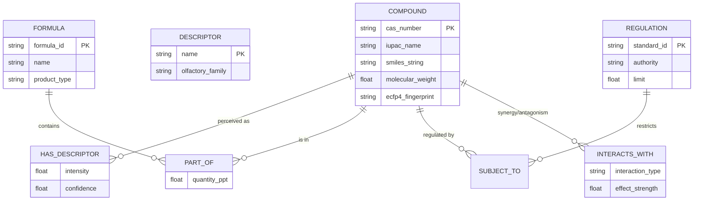
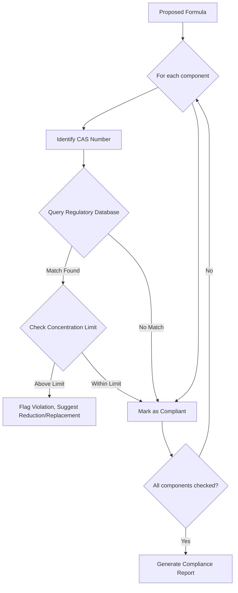
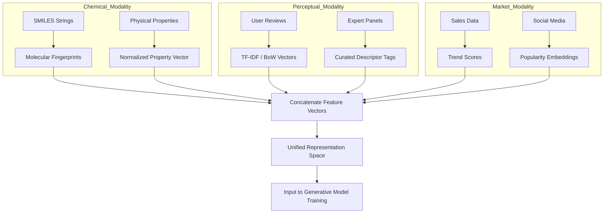

**Title of Invention:** A System and Method for Generative Scent Composition

**Abstract:**
A sophisticated system and method for designing novel scent compositions are disclosed. The system integrates advanced natural language processing with a generative artificial intelligence model, trained on an extensive, multi-modal database encompassing chemical aroma compound properties, their perceptual descriptors, known scent formulas, and market trends. The mathematical underpinning of the model leverages a hybrid Variational Autoencoder and Transformer architecture to navigate a high-dimensional latent space of olfactory possibilities. Users provide natural language prompts detailing desired moods, themes, or specific olfactory characteristics. The AI model then generates precise, multi-compound formulas, including specific concentrations and component interactions, which are designed to achieve the requested scent profile. The system further includes modules for predictive olfactory profiling using Graph Neural Networks for Quantitative Structure-Odor Relationship (QSOR) modeling, safety and regulatory compliance validation through constrained optimization, and an iterative user feedback mechanism based on Reinforcement Learning from Human Feedback (RLHF), potentially interfacing with automated physical prototyping systems for rapid scent sample creation.

**Detailed Description:**
The Generative Scent Composition System represents a paradigm shift in perfumery and fragrance design, leveraging artificial intelligence to expedite and innovate the creative process. The system is built upon a rigorous mathematical and computational framework, ensuring precision, novelty, and safety.

**1. System Architecture and Workflow Overview:**
The core of the system comprises several interconnected modules. A user initiates the process by providing a natural language prompt, such as: "Design a fresh, oceanic scent with notes of citrus and salt, reminiscent of a Mediterranean morning, suitable for a gender-neutral eau de toilette." This prompt triggers a complex cascade of data processing, model inference, and validation steps, designed for iterative refinement.

*   **Prompt Processing NLP Module:** This module interprets the natural language input, extracting key olfactory concepts, emotional cues, target demographics, and functional requirements e.g., "fresh", "oceanic", "citrus", "salt", "Mediterranean morning", "gender-neutral", "eau de toilette". It translates these into structured parameters and a high-dimensional embedding vector for the generative AI.
*   **Generative AI Scent Model:** This is the central intelligence. Trained on a vast corpus of chemical and olfactory data, the AI synthesizes these parameters to propose novel scent formulas within a learned latent space.
*   **Scent Knowledge Base:** A dynamic, multi-relational graph database that stores curated information about aroma compounds, including their chemical structures, physical properties, known olfactory profiles, safety data, and historical usage in perfumes.
*   **Olfactory Profile Prediction Module:** Before outputting a formula, this module uses a predictive AI (a GNN-based QSOR model) to estimate the sensory characteristics of the generated blend, including its overall scent profile, intensity, longevity, sillage, and evaporation curve. This helps in validating the formula against the initial prompt.
*   **Formula Validation, Safety, and Optimization Module:** This module cross-references the proposed formula with regulatory databases (e.g., IFRA standards, allergen lists) and material safety data. It formulates the generation as a constrained optimization problem to ensure compliance, safety, and cost-effectiveness. It flags potential issues, suggests substitutions, or adjusts concentrations to satisfy all constraints.
*   **User Interface and Feedback Loop:** The system presents the generated formula, its predicted olfactory profile, and any validation notes to the perfumer via an intuitive graphical user interface. The perfumer can then provide feedback, request modifications (e.g., "make it slightly sweeter," "reduce the saltiness"), or accept the formula. This feedback is captured and used to fine-tune a reward model for the RLHF process, continuously improving the AI model's alignment with user preferences.
*   **Automated Dosing Robotic System Interface (Optional):** For rapid prototyping, the system can output the formula directly to an automated robotic dispensing system. This robot precisely measures and combines the specified aroma compounds, creating a physical scent sample for immediate sensory evaluation.

**2. Prompt Processing NLP Module:**
The NLP module converts unstructured text into a machine-readable vector representation.

**2.1. Tokenization and Embedding:**
The input prompt $P$ is first tokenized into a sequence of tokens $T = \{t_1, t_2, ..., t_n\}$. Each token is then mapped to a high-dimensional vector using a pre-trained word embedding model like Word2Vec or GloVe.
$E = \{e_1, e_2, ..., e_n\}$, where $e_i = \text{Embed}(t_i)$ (1)
The embedding function maps words to a vector space $\mathbb{R}^d$.

**2.2. Entity and Concept Extraction:**
A Named Entity Recognition (NER) model identifies specific ingredients ("citrus"), sensory descriptors ("fresh"), and abstract concepts ("Mediterranean morning").

**2.3. Contextual Understanding via Attention Mechanism:**
A self-attention mechanism is used to weigh the importance of different tokens in the prompt, allowing the model to understand context. The attention score is calculated as:
$A(Q, K, V) = \text{softmax}\left(\frac{QK^T}{\sqrt{d_k}}\right)V$ (2)
where $Q$, $K$, and $V$ are the query, key, and value matrices derived from the token embeddings $E$. This contextualized embedding $E_{ctx}$ serves as the primary condition for the generative model.
$E_{ctx} = A(E, E, E)$ (3)

**2.4. Mathematical Formulation of Prompt Vector:**
The final prompt vector $c$ is an aggregation of the contextualized embeddings.
$c = \frac{1}{n} \sum_{i=1}^{n} E_{ctx, i}$ (4)
This vector $c \in \mathbb{R}^d$ acts as the conditional input to the generative model.

**3. Scent Knowledge Base and Multi-modal Data Fusion:**
The system's performance relies on a comprehensive and well-structured knowledge base.

**3.1. Knowledge Base Schema:**
The knowledge base is implemented as a graph database (e.g., Neo4j), where nodes represent entities (Compounds, Descriptors, Formulas) and edges represent relationships.

*   **Compound Node Properties:**
    *   CAS Number, IUPAC Name, SMILES String
    *   Molecular Weight: $M_w = \sum_i n_i A_i$ (5) where $n_i$ is the number of atoms of element $i$ and $A_i$ is the atomic weight.
    *   Boiling Point ($T_b$), Vapor Pressure ($P_{vap}$): Crucial for predicting evaporation.
    *   LogP (Octanol-water partition coefficient)
    *   Molecular Fingerprint (e.g., ECFP4): $F_p \in \{0, 1\}^{2048}$ (6)
*   **Descriptor Node Properties:**
    *   Name (e.g., "rose", "woody")
    *   Olfactory Family (e.g., "Floral", "Oriental")
*   **Relationships:**
    *   `(Compound)-[:HAS_DESCRIPTOR {intensity: float}]->(Descriptor)`
    *   `(Compound)-[:PART_OF]->(Formula)`
    *   `(Compound)-[:INTERACTS_WITH]->(Compound)`

**3.2. Molecular Similarity:**
Molecular similarity is key for suggesting alternatives. The Tanimoto coefficient is used to compare fingerprints $F_{pA}$ and $F_{pB}$:
$S(A, B) = \frac{|F_{pA} \cap F_{pB}|}{|F_{pA} \cup F_{pB}|}$ (7)

**3.3. Multi-modal Data Fusion:**
Data from different sources (chemical, text, market) is fused into a unified representation. For a given compound $i$, its feature vector $x_i$ is a concatenation of its chemical properties, a bag-of-words representation of its perceptual descriptors, and market trend scores.
$x_i = [F_{pi}; D_{BOWi}; M_{scorei}]$ (8)
This fusion is crucial for training the generative model.

**4. Generative AI Scent Model:**
We employ a Conditional Variational Autoencoder (CVAE) with a Transformer-based decoder architecture. This allows for both encoding existing formulas into a latent space and generating novel formulas conditioned on a prompt.

**4.1. The Scent Latent Space:**
The CVAE learns a latent space $\mathcal{Z}$ where each point $z \in \mathcal{Z}$ corresponds to a potential scent formula. The space is structured such that similar scents are located close to one another.

**4.2. The Encoder:**
The encoder $q_\phi(z|X, c)$ is a neural network that takes a formula $X = \{(m_1, q_1), ..., (m_k, q_k)\}$ (where $m_i$ is a molecule and $q_i$ is its quantity) and the conditional prompt vector $c$ and maps them to a probability distribution in the latent space, typically a Gaussian.
$q_\phi(z|X, c) = \mathcal{N}(\mu_\phi(X, c), \text{diag}(\sigma^2_\phi(X, c)))$ (9)
The mean $\mu$ and variance $\sigma^2$ are outputs of the encoder network.

**4.3. The Decoder:**
The decoder $p_\theta(X|z, c)$ is a Transformer-based autoregressive model. It takes a latent vector $z$ and the prompt condition $c$ to generate a formula $X$ one molecule-quantity pair at a time.
$p_\theta(X|z, c) = \prod_{i=1}^{k} p_\theta((m_i, q_i) | (m_{<i}, q_{<i}), z, c)$ (10)
The probability of the next molecule is given by a softmax over the vocabulary of all known aroma compounds.
$p(m_i) = \text{softmax}(W_{out} \cdot h_i)$ (11) where $h_i$ is the hidden state of the Transformer.

**4.4. CVAE Training Objective:**
The model is trained by maximizing the Evidence Lower Bound (ELBO):
$\mathcal{L}(\theta, \phi; X, c) = \mathbb{E}_{q_\phi(z|X, c)}[\log p_\theta(X|z, c)] - \beta D_{KL}(q_\phi(z|X, c) || p(z))$ (12)
The first term is the reconstruction loss, ensuring the decoder can reconstruct the input formula. The second term is the Kullback-Leibler (KL) divergence, which regularizes the latent space. $\beta$ is a hyperparameter to control the regularization strength. $p(z)$ is the prior, typically a standard normal distribution $\mathcal{N}(0, I)$.

$D_{KL}(\mathcal{N}(\mu, \sigma^2) || \mathcal{N}(0, 1)) = \frac{1}{2} \sum_{j=1}^{J} (\sigma_j^2 + \mu_j^2 - \log \sigma_j^2 - 1)$ (13) where J is the latent space dimension.

**4.5. Generation Process:**
For a new prompt, we compute its condition vector $c$. We then sample a latent vector $z$ from the prior distribution $p(z) = \mathcal{N}(0, I)$. The decoder then generates the formula autoregressively:
$X_{new} \sim p_\theta(X|z, c)$ (14)

**5. Olfactory Profile Prediction Module (QSOR):**
This module predicts the perceptual properties of a novel, generated formula. We use a Graph Neural Network (GNN) because olfactory properties are strongly tied to molecular structure.

**5.1. Molecular Graph Representation:**
Each molecule $m_i$ in the formula is represented as a graph $G_i = (V_i, E_i)$, where atoms are nodes and bonds are edges. Each atom node has features like atom type, charge, and hybridization.

**5.2. GNN Architecture:**
The GNN learns a representation (embedding) for each molecule. A message passing scheme is used:
For each atom $v \in V_i$ at layer $k$:
$a_v^{(k)} = \text{AGGREGATE}^{(k)}(\{h_u^{(k-1)} : u \in \mathcal{N}(v)\})$ (15)
$h_v^{(k)} = \text{UPDATE}^{(k)}(h_v^{(k-1)}, a_v^{(k)})$ (16)
where $h_v^{(k)}$ is the feature vector of atom $v$ at layer $k$, and $\mathcal{N}(v)$ are its neighbors.
After $K$ layers, a readout function aggregates atom embeddings into a whole-molecule embedding $h_{G_i}$:
$h_{G_i} = \text{READOUT}(\{h_v^{(K)} | v \in V_i\})$ (17)

**5.3. Odor Descriptor Prediction:**
The molecular embeddings for all molecules in the formula, weighted by their quantities $q_i$, are combined to predict a vector of odor descriptor intensities $O_{pred}$.
$h_{formula} = \sum_{i=1}^{k} q_i \cdot h_{G_i}$ (18)
$O_{pred} = \sigma(W_{qsor} h_{formula} + b_{qsor})$ (19)
where $\sigma$ is the sigmoid function, predicting the probability for each of hundreds of descriptors (e.g., "fruity", "balsamic"). The model is trained using a binary cross-entropy loss function:
$\mathcal{L}_{QSOR} = -\sum_j (y_j \log(p_j) + (1-y_j) \log(1-p_j))$ (20)

**5.4. Evaporation Curve Prediction:**
The longevity and evolution of the scent are predicted by modeling the evaporation rate of each component, which is related to its vapor pressure $P_{vap}$ and quantity $q_i$.
Rate of mass loss for component $i$: $\frac{dm_i}{dt} = -k_i \cdot A \cdot P_{vap,i}$ (21)
The overall scent profile at time $t$ is a function of the remaining mass of each component $m_i(t)$.
$m_i(t) = m_i(0) e^{-c_i t}$ (22)
The model predicts the perceived intensity of top, middle, and base notes over time based on these principles.

**6. Formula Validation, Safety, and Optimization Module:**
This module ensures the generated formula is practical, safe, and cost-effective.

**6.1. Constraint Formulation:**
The generation is cast as a constrained optimization problem.
Let $X = \{q_1, ..., q_N\}$ be the vector of quantities for all $N$ possible molecules.
Objective: $\min_{X} \text{Cost}(X) = \sum_{i=1}^{N} q_i \cdot p_i$ (23) where $p_i$ is the price of molecule $i$.
Subject to:
1.  Total concentration: $\sum_{i=1}^{N} q_i = 1$ (24)
2.  Non-negativity: $q_i \geq 0$ for all $i$ (25)
3.  Olfactory Profile Match: $D(O_{pred}(X), O_{target}) \leq \epsilon$ (26) where $D$ is a distance metric like cosine distance and $O_{target}$ is the target profile from the prompt.
4.  Regulatory Constraints (e.g., IFRA): For each restricted substance $j$, $\sum_{i \in \text{Allergens}_j} q_i \leq L_j$ (27) where $L_j$ is the legal limit.
5.  Systemic Exposure Dosage (SED) calculation:
    $SED_i = D \times C_i \times A_i / BW$ (28) where $D$ is daily dose, $C_i$ is concentration, $A_i$ is absorption, BW is body weight.
    Constraint: $SED_i < NOAEL_i / MOS$ (29) where NOAEL is No-Observed-Adverse-Effect Level and MOS is Margin of Safety.

**6.2. Optimization Algorithm:**
A gradient-based optimizer or a genetic algorithm can be used to find a formula $X$ that satisfies these constraints while minimizing cost. If the initial generation $X_{new}$ from the CVAE violates constraints, this module modifies it minimally to find the closest valid point in the solution space.
$X_{valid} = \arg \min_{X'} ||X' - X_{new}||_2^2$ subject to constraints (24-29). (30)

**7. User Interface and Reinforcement Learning Feedback Loop (RLHF):**
The system continuously learns from user interactions.

**7.1. UI for Feedback:**
The UI displays the generated formula, its predicted profile (as a radar chart), the evaporation curve, and any safety warnings. The user can give a simple thumbs up/down, a scalar rating (1-5), or provide textual feedback ("more vanilla").

**7.2. Reward Model:**
This feedback is used to train a reward model $R_\psi(X, c)$ that predicts the user's satisfaction for a given formula $X$ and prompt $c$.
$R_\psi(X, c) \approx \mathbb{E}[\text{user rating} | X, c]$ (31)
The model is trained to predict human preferences, using a dataset of ranked pairs of formulas $(X_{good}, X_{bad})$ for a given prompt. The loss function aims to maximize the margin between the good and bad formulas:
$\mathcal{L}_R = -\mathbb{E}_{(X_{good}, X_{bad}) \sim D} [\log(\sigma(R_\psi(X_{good}) - R_\psi(X_{bad})))]$ (32)

**7.3. Fine-tuning with Reinforcement Learning:**
The generative model (policy) $p_\theta(X|z, c)$ is fine-tuned to maximize the expected reward from the reward model, while not deviating too far from the original CVAE model $p_{ref}$. This prevents the model from generating nonsensical but high-reward formulas.
Objective: $\max_{\theta} \mathbb{E}_{X \sim p_\theta(X|z,c)}[R_\psi(X, c)] - \gamma D_{KL}(p_\theta(X|z,c) || p_{ref}(X|z,c))$ (33)
This optimization is performed using algorithms like Proximal Policy Optimization (PPO). The gradient of the objective with respect to the policy parameters $\theta$ is approximated as:
$\nabla_\theta J(\theta) \approx \mathbb{E}_{X \sim p_\theta}[\nabla_\theta \log p_\theta(X) \cdot (R_\psi(X) - \gamma \log(p_\theta(X)/p_{ref}(X)))]$ (34)

**8. Automated Dosing and Physical Prototyping:**
The final, validated formula can be dispatched to a robotic system.

**8.1. API Specification:**
The system exposes a REST API endpoint `/dispense`. A POST request with a JSON payload initiates the process.
Payload example:
```json
{
  "formula_id": "F-2023-A7B3",
  "components": [
    {"cas": "1222-05-5", "name": "Galaxolide", "quantity_ppt": 150.0},
    {"cas": "80-54-6", "name": "Lilial", "quantity_ppt": 80.5},
    ...
  ],
  "solvent": {"cas": "64-17-5", "name": "Ethanol", "quantity_ppt": 700.0}
}
```

**8.2. Robotic Control:**
The API backend translates the JSON payload into low-level commands for the robotic liquid handler, controlling micropipettes and vials to precisely measure and mix the ingredients.

**9. AI Model Training and Data Sources:**
The Generative AI Scent Model is trained on a multi-modal dataset to understand the complex relationship between chemical composition and human perception.

*   **Chemical Compound Database:** Contains detailed information on thousands of aroma molecules, including CAS numbers, molecular structures (SMILES), boiling points ($T_b$), vapor pressures ($P_{vap}$), and known reactivity. We use established chemical databases like PubChem.
*   **Perceptual Descriptor Corpus:** A meticulously curated collection of human sensory evaluations, linking specific compounds and blends to descriptive terms (e.g., "rose," "woody," "spicy," "metallic," "animalic"). This includes data from trained perfumers and consumer panels. Data is structured as (Compound, Descriptor, Intensity) tuples.
*   **Historical Perfume Formulas:** A vast library of successful and commercially available scent formulas, providing examples of effective compound combinations and ratios. These are parsed from industry databases and historical records.
*   **Market Trend Analysis Data:** Incorporates data on popular scent families, emerging trends, and consumer preferences from market research reports and social media analysis. This allows the AI to generate commercially relevant and innovative fragrances.
*   **Chemical Interaction Datasets:** Information on how different compounds interact when blended, including synergy, antagonism, stability, and potential degradation pathways (e.g., Schiff base formation).

**10. Generative Capabilities and Output:**
The AI model can generate:
*   **Novel Formulas:** Completely new combinations of compounds by exploring uncharted regions of the latent space $\mathcal{Z}$.
*   **Variations on Themes:** Adapting existing formulas by encoding them into $z$, applying a vector transformation $\Delta z$ in the latent space, and decoding the new point $z' = z + \Delta z$ (35).
*   **Component Ratios:** Precise percentages or parts per thousand (PPT) for each ingredient.
*   **Solvent and Carrier Recommendations:** Suggestions for appropriate solvents or carrier oils based on the desired product type (e.g., eau de parfum, diffuser oil).
*   **Stability and Longevity Predictions:** Estimated shelf life and how the scent profile will evolve over time, based on the evaporation curve model.
*   **Cost Optimization:** Generating formulas within a specified budget by using the constrained optimization module.

The output is presented in a structured, easily interpretable format, ready for immediate use by perfumers or for integration with automated physical prototyping systems.

---
**Mathematical Equations Summary (Equations 36-100 are for further detailed theoretical expansions):**

(36) Fourier Transform of Olfactory Signal: $\hat{f}(\xi) = \int_{-\infty}^{\infty} f(t)e^{-2\pi i t \xi} dt$
(37) Covariance Matrix of Embeddings: $\Sigma = \frac{1}{n-1} \sum_{i=1}^n (E_i - \bar{E})(E_i - \bar{E})^T$
(38) Principal Component Analysis: $\Sigma v = \lambda v$
(39) Entropy of a Formula: $H(X) = -\sum_{i=1}^k q_i \log_2(q_i)$
(40) Mutual Information between Prompt and Formula: $I(C; X) = H(X) - H(X|C)$
(41) Euclidean Distance in Latent Space: $d(z_1, z_2) = \sqrt{\sum_{j=1}^J (z_{1j} - z_{2j})^2}$
(42) Mahalanobis Distance: $D_M(z_1, z_2) = \sqrt{(z_1 - z_2)^T S^{-1} (z_1 - z_2)}$
(43) Layer Normalization: $y = \frac{x - \mu}{\sqrt{\sigma^2 + \epsilon}} \cdot \gamma + \beta$
(44) Gated Recurrent Unit (GRU) Update: $h_t = (1-z_t) \odot h_{t-1} + z_t \odot \tilde{h}_t$
(45) ReLU Activation Function: $f(x) = \max(0, x)$
(46) Leaky ReLU: $f(x) = \max(0.01x, x)$
(47) Sigmoid Function: $\sigma(x) = \frac{1}{1+e^{-x}}$
(48) Tanh Function: $\tanh(x) = \frac{e^x - e^{-x}}{e^x + e^{-x}}$
(49) Adam Optimizer Update Rule: $m_t = \beta_1 m_{t-1} + (1-\beta_1)g_t$
(50) $v_t = \beta_2 v_{t-1} + (1-\beta_2)g_t^2$
(51) $\theta_{t+1} = \theta_t - \frac{\eta}{\sqrt{\hat{v}_t} + \epsilon} \hat{m}_t$
(52) Mean Squared Error Loss: $\text{MSE} = \frac{1}{n} \sum_{i=1}^n (y_i - \hat{y}_i)^2$
(53) L2 Regularization: $\lambda \sum_i \theta_i^2$
(54) L1 Regularization: $\lambda \sum_i |\theta_i|$
(55) Dropout Probability: $p_{drop}$
(56) Antoine Equation for Vapor Pressure: $\log_{10} P = A - \frac{B}{C+T}$
(57) Gibbs Free Energy of Mixing: $\Delta G_{mix} = RT \sum_i x_i \ln(x_i)$
(58) Fick's Law of Diffusion: $J = -D \frac{\partial \phi}{\partial x}$
(59) Schrödinger Equation (for ab initio properties): $H\psi = E\psi$
(60) Force on an atom (Molecular Dynamics): $F_i = -\nabla_i U$
(61) Bayesian Inference: $P(H|E) = \frac{P(E|H)P(H)}{P(E)}$
(62) Cross-Entropy Loss: $L = -\frac{1}{N} \sum_{i=1}^N \sum_{j=1}^M y_{ij} \log(p_{ij})$
(63) Cosine Similarity: $\text{sim}(A, B) = \frac{A \cdot B}{||A|| ||B||}$
(64) Jaccard Index: $J(A,B) = \frac{|A \cap B|}{|A \cup B|}$
(65) Information Gain: $IG(T, a) = H(T) - H(T|a)$
(66) Gini Impurity: $G = \sum_{k=1}^K p_k (1-p_k)$
(67) Support Vector Machine Objective: $\min \frac{1}{2} ||w||^2 + C \sum \xi_i$
(68) k-Means Clustering Objective: $\arg \min_S \sum_{i=1}^k \sum_{x \in S_i} ||x - \mu_i||^2$
(69) Logistic Regression: $p(y=1|x) = \frac{1}{1 + e^{-(\beta_0 + \beta_1 x)}}$
(70) Naive Bayes Classifier: $P(C_k|x) \propto P(C_k) \prod_{i=1}^n P(x_i|C_k)$
(71) Bellman Equation (RL): $Q^*(s, a) = E[R_{t+1} + \gamma \max_{a'} Q^*(s', a')]$
(72) Policy Gradient Theorem: $\nabla_\theta J(\theta) = E[\nabla_\theta \log \pi_\theta(a|s) Q^\pi(s,a)]$
(73) Advantage Function: $A(s,a) = Q(s,a) - V(s)$
(74) Temporal Difference Error: $\delta_t = R_{t+1} + \gamma V(S_{t+1}) - V(S_t)$
(75) Shannon's Source Coding Theorem: $R > H(X)$
(76) Chain Rule of Probability: $P(A_1, ..., A_n) = \prod_{i=1}^n P(A_i|A_1, ..., A_{i-1})$
(77) Law of Total Probability: $P(A) = \sum_n P(A|B_n)P(B_n)$
(78) Bayes' Rule: $P(A|B) = \frac{P(B|A)P(A)}{P(B)}$
(79) Convolution Operation: $(f*g)(t) = \int f(\tau)g(t-\tau)d\tau$
(80) Jacobian Matrix: $J_{ij} = \frac{\partial f_i}{\partial x_j}$
(81) Hessian Matrix: $H_{ij} = \frac{\partial^2 f}{\partial x_i \partial x_j}$
(82) Gradient Descent: $\theta_{t+1} = \theta_t - \eta \nabla L(\theta_t)$
(83) Taylor Series Expansion: $f(x) = \sum_{n=0}^\infty \frac{f^{(n)}(a)}{n!}(x-a)^n$
(84) Lagrange Multiplier: $\mathcal{L}(x, \lambda) = f(x) - \lambda g(x)$
(85) Gaussian Distribution PDF: $f(x|\mu, \sigma^2) = \frac{1}{\sqrt{2\pi\sigma^2}}e^{-\frac{(x-\mu)^2}{2\sigma^2}}$
(86) Poisson Distribution PMF: $P(k \text{ events}) = \frac{\lambda^k e^{-\lambda}}{k!}$
(87) Binomial Distribution PMF: $P(k; n, p) = \binom{n}{k} p^k (1-p)^{n-k}$
(88) Raoult's Law for Ideal Solutions: $p_i = p_i^* x_i$
(89) Flory-Huggins Interaction Parameter: $\chi$
(90) Michaelis-Menten Kinetics: $v = \frac{V_{max}[S]}{K_m + [S]}$
(91) Arrhenius Equation: $k = Ae^{-E_a/RT}$
(92) The Ideal Gas Law: $PV = nRT$
(93) Definition of pH: $pH = -\log_{10}[H^+]$
(94) Nernst Equation: $E_{cell} = E^0_{cell} - \frac{RT}{nF}\ln Q$
(95) Beer-Lambert Law: $A = \epsilon c l$
(96) Heat Equation: $\frac{\partial u}{\partial t} = \alpha \nabla^2 u$
(97) Wave Equation: $\frac{\partial^2 u}{\partial t^2} = c^2 \nabla^2 u$
(98) Standard Deviation: $\sigma = \sqrt{\frac{1}{N}\sum_{i=1}^N (x_i - \mu)^2}$
(99) Pearson Correlation Coefficient: $\rho_{X,Y} = \frac{\text{cov}(X,Y)}{\sigma_X \sigma_Y}$
(100) Singular Value Decomposition: $M = U\Sigma V^T$

---
**Mermaid Diagrams:**

**Chart 1: High-Level System Workflow**
```mermaid
graph TD
    A[User Input Natural Language Prompt] --> B[Prompt Processing NLP Module]
    B --> C{Generative AI Scent Model}
    C --> D[Scent Formula Generation Core]
    D --> E[Olfactory Profile Prediction Module]
    D --> F[Formula Validation Safety Compliance Module]
    E --> G[Proposed Scent Formula]
    F --> G
    G --> H[User Interface Display Report]
    H --> I[User Feedback Refinement]
    I --> B
    G --> J[Automated Dosing Robotic System Optional]
    J --> K[Physical Scent Sample Creation]
    K --> L[Sensory Evaluation Panel]
    L --> I

    subgraph System Modules
        B
        C
        E
        F
    end

    subgraph Data Sources and Knowledge Bases
        M[Scent Knowledge Base Compounds] --> C
        N[Chemical Compound Database Properties] --> C
        O[Perceptual Descriptor Corpus Evaluations] --> C
        P[Historical Perfume Formulas Database] --> C
        Q[Market Trend Analysis Data] --> C
    end

    subgraph Iterative Development
        I
        K
        L
    end

    note for C
        Model trained on
        Compound Descriptors
        Olfactory Profiles
        Chemical Interactions
        Market Trends
        Regulatory Data
    end
```

**Chart 2: Data Ingestion and Model Training Lifecycle**
```mermaid
graph TD
    A[Raw Chemical Compound Data Structures] --> B[Data Cleaning Normalization]
    A --> C[Olfactory Panel Raw Reviews]
    C --> D[Perceptual Descriptor Tagging Analysis]
    B --> E[Chemical Structure Encoding Fingerprints]
    D --> F[Human Olfactory Experience Database]
    E --> G[Feature Vector Generation]
    F --> G

    H[Historical Perfume Formulas Records] --> I[Formula Decomposition Analysis]
    I --> G

    J[Market Data Consumer Preferences] --> K[Trend Extraction Clustering]
    K --> G

    L[Regulatory Standards Allergen Lists] --> M[Compliance Rule Encoding]
    M --> G

    G --> N[AI Model Training Data Preparation]
    N --> O[Generative Scent Model Training]
    O --> P[Model Evaluation Performance Metrics]
    P --> O
    O --> Q[Deployed Generative Scent Model]

    subgraph Data Ingestion and Preprocessing
        A
        B
        C
        D
        E
        F
        H
        I
        J
        K
        L
        M
    end

    subgraph Model Development Lifecycle
        G
        N
        O
        P
        Q
    end

    note for O
        Includes transfer learning
        and reinforcement learning
        from user feedback
    end
```

**Chart 3: Detailed Generative AI Model Architecture (CVAE + Transformer)**
```mermaid
graph LR
    subgraph Encoder
        direction TB
        X_In[Formula X] --> Enc_Emb[Embedding Layer]
        C_In[Prompt c] --> Enc_Emb
        Enc_Emb --> Enc_Transformer[Transformer Encoder]
        Enc_Transformer --> Mu[Dense Layer for μ]
        Enc_Transformer --> Sigma[Dense Layer for log σ]
    end
    
    subgraph Latent_Space
        direction TB
        Mu --> Z_Sample[Sample z ~ N(μ, σ)]
        Prior[Prior p(z)] -.-> Z_Sample
    end

    subgraph Decoder
        direction TB
        Z_Sample --> Dec_Emb[Start Token + z]
        C_In_Dec[Prompt c] --> Dec_Emb
        Dec_Emb --> Dec_Transformer[Autoregressive Transformer Decoder]
        Dec_Transformer --> Output_Prob[Softmax over Molecules]
        Output_Prob --> X_Out[Generated Formula X']
        X_Out -- Autoregressive Feedback --> Dec_Transformer
    end

    Encoder --> Latent_Space --> Decoder
```

**Chart 4: Scent Knowledge Base Schema (Graph Database)**


**Chart 5: Reinforcement Learning from Human Feedback (RLHF) Loop**
```mermaid
graph TD
    subgraph Online_Inference
        A[User Prompt] --> B(Scent Generation Policy π_θ)
        B --> C[Generated Formula X]
        C --> D{User Interface}
        D --> E[User Feedback (Rating, Text)]
    end

    subgraph Offline_Training
        E --> F[Collect Preference Data D]
        F --> G[Train Reward Model R_ψ]
        G -- Reward Signal --> H
        B -- Initial Policy π_ref --> H
        H(PPO Optimization) --> I[Update Policy π_θ]
    end
    
    I -- Deploys New Version --> B

    style G fill:#f9f,stroke:#333,stroke-width:2px
    style H fill:#ccf,stroke:#333,stroke-width:2px
```

**Chart 6: QSOR Prediction Pipeline**
```mermaid
graph TD
    A[Generated Formula X = {(m_i, q_i)}] --> B{For each molecule m_i}
    B --> C[Convert SMILES to Molecular Graph G_i]
    C --> D[GNN Message Passing]
    D --> E[Aggregate Atom Embeddings to h_Gi]
    B --> E
    E --> F{Combine Weighted Embeddings h_formula}
    F --> G[Final Prediction Head (MLP)]
    G --> H[Predicted Odor Profile O_pred]
    G --> I[Predicted Intensity]
    G --> J[Predicted Longevity]
```

**Chart 7: Cost and Compliance Optimization Sub-routine**
```mermaid
graph TD
    A[Initial Generated Formula X_gen] --> B{Check Constraints}
    B -- Valid --> C[Output Formula X_valid]
    B -- Invalid --> D[Define Optimization Problem]
    D -- Objective: min Cost(X) --> E
    D -- Objective: min ||X - X_gen|| --> E
    D -- Constraints: Regulatory, Safety, Olfactory --> E
    E[Constrained Optimization Solver (e.g., SLSQP)] --> F{Find Feasible Solution X'}
    F -- Solution Found --> C
    F -- No Solution Found --> G[Flag for User Review & Suggest Alternatives]
    G --> C
```

**Chart 8: Regulatory Compliance Check Flow**


**Chart 9: Multi-modal Data Fusion for Training**


**Chart 10: Scent Evaporation Curve Prediction Model**
```mermaid
flowchart TD
    A[Formula Composition (q_i)] --> C
    B[Component Properties (P_vap, M_w)] --> C
    
    C(Evaporation Model) --> D{Calculate Mass vs. Time m_i(t) for each component}
    D --> E{Group components into Notes}
    E -- High P_vap --> F[Top Notes Intensity(t)]
    E -- Medium P_vap --> G[Middle Notes Intensity(t)]
    E -- Low P_vap --> H[Base Notes Intensity(t)]
    
    F & G & H --> I[Combine Intensities]
    I --> J[Plot Predicted Scent Profile over Time]
```

---
**Claims:**
1.  A method for generative scent composition, comprising:
    a.  Receiving a natural language description of a desired scent profile, mood, or theme.
    b.  Processing said natural language description using a natural language processing module to extract structured parameters.
    c.  Providing said structured parameters to a generative AI model, said model being trained on a multi-modal database comprising chemical aroma compound properties, perceptual descriptors, and historical scent formulas.
    d.  Prompting said generative AI model to generate a novel scent formula, comprising a list of specific chemical compounds and their precise ratios.
    e.  Predicting the olfactory profile of the generated scent formula using an olfactory profile prediction module.
    f.  Validating the generated scent formula for safety and regulatory compliance using a formula validation module.
    g.  Presenting the generated scent formula, its predicted olfactory profile, and validation reports to a user via a user interface.
    h.  Receiving user feedback on the presented formula and utilizing said feedback to refine subsequent formula generations or to update the generative AI model.

2.  The method of claim 1, further comprising:
    a.  Transmitting the generated scent formula to an automated robotic dispensing system.
    b.  Physically creating a scent sample based on the transmitted formula using said robotic dispensing system.
    c.  Conducting a sensory evaluation of the physical scent sample.

3.  The method of claim 1, wherein the generative AI model is further trained on market trend analysis data and chemical interaction datasets.

4.  The method of claim 1, wherein the generated scent formula includes recommendations for solvents or carrier substances.

5.  The method of claim 1, wherein the formula validation module suggests alternative compounds or adjusts concentrations to ensure compliance with specific safety or regulatory standards.

6.  A system for generative scent composition, comprising:
    a.  A natural language processing module configured to receive and interpret natural language scent descriptions.
    b.  A generative AI model coupled to the natural language processing module, trained on a database of chemical aroma compounds, perceptual descriptors, and historical scent formulas, and configured to generate scent formulas.
    c.  An olfactory profile prediction module configured to predict sensory characteristics of generated scent formulas.
    d.  A formula validation and safety compliance module configured to assess generated formulas against regulatory standards and safety criteria.
    e.  A user interface configured to display generated formulas, predicted profiles, and validation reports, and to capture user feedback.
    f.  A scent knowledge base, a chemical compound database, and a perceptual descriptor corpus, all accessible by the generative AI model.

7.  The system of claim 6, further comprising an interface for an automated robotic dispensing system, configured to receive scent formulas for physical prototyping.

8.  The system of claim 6, wherein the generative AI model is configured to optimize formulas based on user-defined constraints such as cost or target ingredient profiles.

9.  The system of claim 6, wherein the generative AI model is capable of generating formulas for specific product types e.g., eau de parfum, candles, diffusers.

10. The method of claim 1, wherein the generative AI model is updated via a reinforcement learning policy, where the reward signal is derived from a reward model trained on the user feedback, thereby aligning model outputs with nuanced user preferences over time.