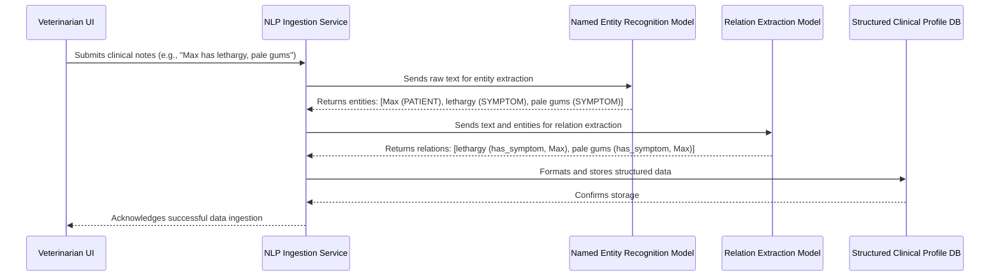
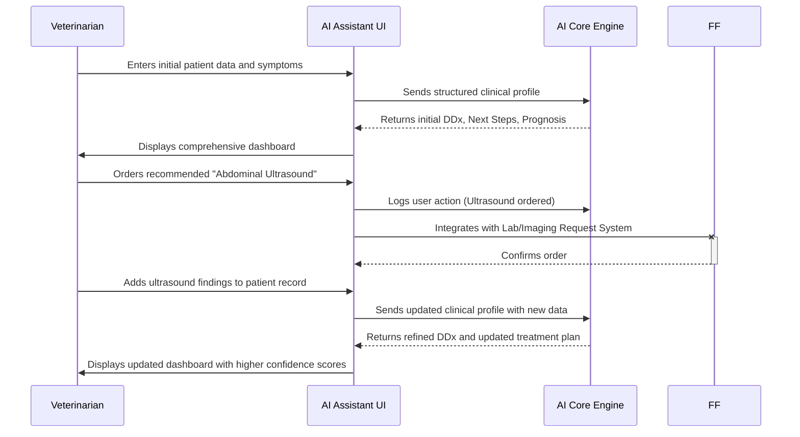
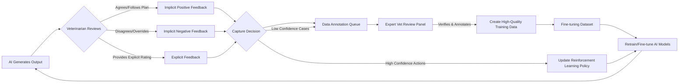
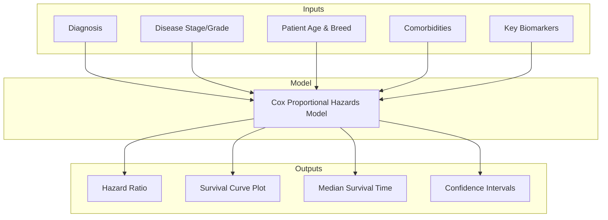
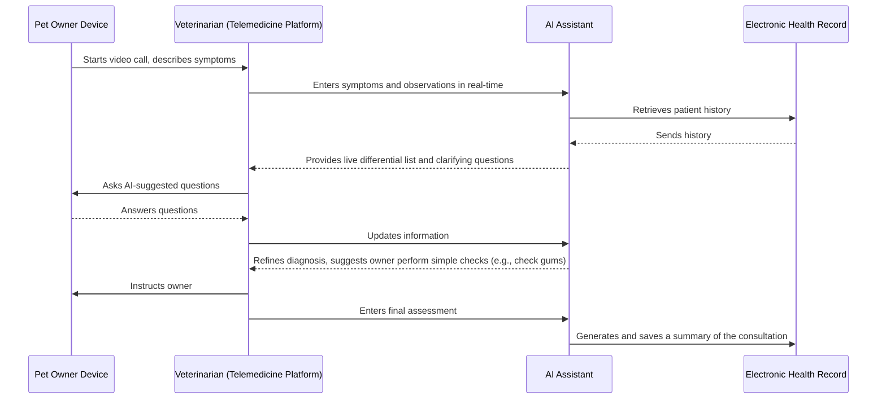
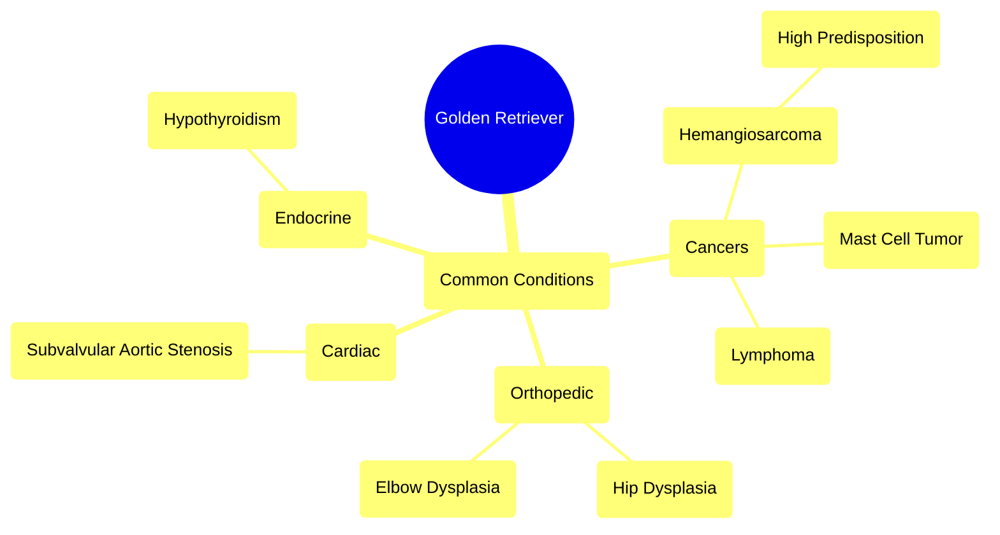

```mermaid
graph TD
    subgraph User Interaction Layer
        A[Veterinarian Input UI] --> B[Symptom Description Text]
        A --> C[Patient History Medical Records]
        A --> D[Lab Results Structured Data]
        A --> E[Imaging Scans DICOMJPEG]
        A --> F[Physical Exam Findings Observations]
        A --> G[Client Communication Notes]
    end

    subgraph Data Ingestion and Preprocessing
        B --> H[NLP Symptom Extractor]
        C --> I[Medical Record Parser]
        D --> J[Lab Data Normalizer]
        E --> K[Medical Image Analyzer]
        F --> H
        G --> I
        H --> L[Structured Clinical Profile]
        I --> L
        J --> L
        K --> L
    end

    subgraph AI Core and Knowledge Base
        L -- Input Data --> M[AI Diagnostic Engine Generative Model]
        M --> N[Veterinary Medical Literature Database]
        M --> O[Case Studies Database Historical Data]
        M --> P[Breed Specific Conditions Database]
        M --> Q[Drug Interaction Formulary]
        M --> R[Treatment Protocol Database]
        N -- Consults --> M
        O -- Consults --> M
        P -- Consults --> M
        Q -- Supports --> R
        R -- Provides --> M
        M -- Utilizes --> S[Prognosis Prediction Model]
    end

    subgraph Output Generation and Presentation
        M --> T[Differential Diagnosis Ranked List]
        M --> U[Recommended Next Steps Diagnostics]
        S --> V[Prognosis Prediction]
        R --> W[Treatment Plan Detailed]
        M --> X[Drug Dosage Recommendations]
        T --> Y[Output Display Dashboard]
        U --> Y
        V --> Y
        W --> Y
        X --> Y
        Y --> A
    end

    subgraph Feedback and Continuous Learning
        Y -- User Feedback Clicks --> Z[Vet Decision Capture]
        Z --> AA[Reinforcement Learning Feedback]
        AA --> M
        Z --> BB[Data Annotation Queue]
        BB --> CC[Human Vet Reviewers]
        CC --> AA
    end

    subgraph External System Integrations
        Y -- Connects To --> DD[EHR Electronic Health Records System]
        Y -- Connects To --> EE[Pharmacy Inventory Management]
        U -- Sends Requests --> FF[Lab and Imaging Request System]
        W -- Integrates With --> GG[Telemedicine Platform]
        DD -- Syncs With --> C
        FF -- Provides --> D
        FF -- Provides --> E
    end

    style A fill:#D4E6F1,stroke:#3498DB,stroke-width:2px
    style Y fill:#D4E6F1,stroke:#3498DB,stroke-width:2px
    style M fill:#FADBD8,stroke:#E74C3C,stroke-width:2px
    style S fill:#FADBD8,stroke:#E74C3C,stroke-width:2px
    style N fill:#E8F8F5,stroke:#2ECC71,stroke-width:2px
    style O fill:#E8F8F5,stroke:#2ECC71,stroke-width:2px
    style P fill:#E8F8F5,stroke:#2ECC71,stroke-width:2px
    style Q fill:#E8F8F5,stroke:#2ECC71,stroke-width:2px
    style R fill:#E8F8F5,stroke:#2ECC71,stroke-width:2px
    style H fill:#EBEDEF,stroke:#5D6D7E,stroke-width:1px
    style I fill:#EBEDEF,stroke:#5D6D7E,stroke-width:1px
    style J fill:#EBEDEF,stroke:#5D6D7E,stroke-width:1px
    style K fill:#EBEDEF,stroke:#5D6D7E,stroke-width:1px
    style L fill:#EBEDEF,stroke:#5D6D7E,stroke-width:1px
    style T fill:#FDF2E9,stroke:#F39C12,stroke-width:1px
    style U fill:#FDF2E9,stroke:#F39C12,stroke-width:1px
    style V fill:#FDF2E9,stroke:#F39C12,stroke-width:1px
    style W fill:#FDF2E9,stroke:#F39C12,stroke-width:1px
    style X fill:#FDF2E9,stroke:#F39C12,stroke-width:1px
    style Z fill:#FDF2E9,stroke:#F39C12,stroke-width:1px
    style AA fill:#E6F3F7,stroke:#3498DB,stroke-width:1px
    style BB fill:#E6F3F7,stroke:#3498DB,stroke-width:1px
    style CC fill:#E6F3F7,stroke:#3498DB,stroke-width:1px
    style DD fill:#D1F2EB,stroke:#1ABC9C,stroke-width:1px
    style EE fill:#D1F2EB,stroke:#1ABC9C,stroke-width:1px
    style FF fill:#D1F2EB,stroke:#1ABC9C,stroke-width:1px
    style GG fill:#D1F2EB,stroke:#1ABC9C,stroke-width:1px
```

**Title of Invention:** A System and Method for AI-Assisted Veterinary Diagnosis and Treatment Planning

**Abstract:**
A comprehensive system for assisting veterinarians is disclosed. A vet inputs an animal's symptoms, breed, age, medical history, physical exam findings, and any available diagnostic results. This information is processed and sent to a generative AI model, enhanced by a vast, continuously updated corpus of veterinary medical literature, case studies, and specialized databases. The AI generates a ranked list of potential differential diagnoses, proposes typical follow-up tests or questions, predicts prognosis, and suggests detailed treatment protocols. The system acts as a powerful, data-driven second opinion and comprehensive clinical support tool, streamlining diagnostic workflows and improving patient outcomes.

**Detailed Description:**
The AI Veterinary Diagnostic Assistant system provides a robust platform for clinical decision support. When a vet enters specific patient information, such as: `Dog, Golden Retriever, 8 years old, Female Spayed. Symptoms: acute lethargy onset 24h, complete loss of appetite, pale gums, weakness, mild abdominal distention. Recent history: none remarkable. Physical Exam: CRT > 2s, weak femoral pulses, heart rate 140 bpm.`, the system processes these diverse inputs.

The underlying generative AI model, trained on extensive data including peer-reviewed articles, veterinary textbooks, internal hospital case records, and drug formularies, then provides a multi-faceted output. For the given example, it might return a ranked list:
`1. Hemangiosarcoma Suspected High Probability: Splenic or cardiac mass. Primary concerns: acute hemorrhage, hypovolemic shock.`
`2. Autoimmune Hemolytic Anemia AIHA Medium Probability: Severe anemia, potential immune-mediated destruction of red blood cells.`
`3. Toxin Ingestion Low Probability: Hemorrhagic toxin such as rodenticide.`
`4. Severe Acute Pancreatitis Lower Probability: While symptoms overlap, pale gums and weakness are less typical primary signs.`

**Recommended immediate next steps:**
`1. Abdominal ultrasound to check for splenic or other internal masses and free abdominal fluid.`
`2. Thoracic radiographs to assess for cardiac mass or pulmonary metastases if hemangiosarcoma is suspected.`
`3. Complete Blood Count CBC, Serum Chemistry Panel, Coagulation Profile PT/aPTT, Blood Type and Crossmatch.`
`4. IV fluid therapy initiation for shock stabilization.`

**Prognosis Prediction based on suspected primary diagnosis:**
`If Hemangiosarcoma confirmed: Guarded to Poor, depending on stage and location. Life expectancy with surgery and chemotherapy typically 4-6 months.`
`If AIHA confirmed: Fair to Guarded, often requiring intensive care. Good response to immunosuppressants in many cases.`

**Suggested Initial Treatment Protocol for Hemangiosarcoma suspicion and active internal bleeding:**
`1. IV fluid bolus Crystalloids 90ml/kg over 15-20 mins, then maintenance. Colloids if severe hypoproteinemia.`
`2. Blood transfusion if PCV < 20% and clinical signs of anemia. Type-specific if possible, otherwise universal donor.`
`3. Pain management: Opioids e.g., Fentanyl CRI.`
`4. Surgical consultation for exploratory laparotomy and splenectomy if mass identified.`

This detailed output goes beyond simple diagnosis, offering a comprehensive clinical action plan, directly supporting the veterinarian's decision-making process.

### Expanded Use Case: Feline Chronic Kidney Disease (CKD)

Consider a second case: `Cat, Domestic Shorthair, 14 years old, Male Neutered. Symptoms: progressive weight loss over 6 months, polyuria/polydipsia (PU/PD), decreased appetite, intermittent vomiting. Lab results: BUN 85 mg/dL, Creatinine 4.2 mg/dL, Phosphorus 7.1 mg/dL, Urine Specific Gravity 1.012.`

The system's output would be tailored to chronic disease management:
`1. Diagnosis: Chronic Kidney Disease (CKD), IRIS Stage 3.`
`2. Recommended Next Steps:`
    `a. Blood Pressure Measurement: High suspicion for systemic hypertension.`
    `b. Urinalysis with Urine Protein:Creatinine (UPC) ratio: To assess for proteinuria.`
    `c. Thyroid Panel (Total T4): To rule out concurrent hyperthyroidism, common in older cats.`
`3. Prognosis Prediction:`
    `Median survival time for IRIS Stage 3 CKD is approximately 630 days. This can be significantly influenced by management of hypertension and proteinuria.`
`4. Long-term Treatment and Management Plan:`
    `a. Dietary Management: Prescription renal diet (low protein, low phosphorus, calorie-dense).`
    `b. Fluid Support: Subcutaneous fluid administration as needed based on hydration status.`
    `c. Phosphorus Management: Initiate phosphate binder (e.g., aluminum hydroxide) mixed with food.`
    `d. Hypertension Management: If hypertensive, initiate amlodipine.`
    `e. Nausea/Vomiting Control: Maropitant as needed.`
    `f. Follow-up: Recheck bloodwork and blood pressure in 2-4 weeks to assess response to therapy.`

### Multi-Modal Data Fusion
A key innovation is the system's ability to fuse heterogeneous data types into a cohesive patient representation. Raw text from clinical notes is processed by NLP models to extract entities and relationships. Structured lab data is normalized against species-specific reference ranges. DICOM images from radiographs or ultrasounds are analyzed by a suite of Convolutional Neural Networks (CNNs) to detect abnormalities (e.g., cardiomegaly, effusions, masses). These disparate feature vectors—textual, numerical, and visual—are then projected into a shared latent space. This fused representation allows the core generative model to reason holistically across all available patient data, identifying complex correlations that might be missed when viewing data in isolation.

### Explainable AI (XAI) Outputs
To build trust and enhance clinical utility, the system provides justifications for its conclusions. When it suggests a diagnosis like Hemangiosarcoma, it can highlight the specific inputs that most strongly supported this conclusion (e.g., "pale gums," "acute collapse," "Golden Retriever breed predisposition"). Furthermore, it provides citations and links to the specific articles, textbook chapters, or case studies in its knowledge base that corroborate its recommendations, allowing the veterinarian to review the source evidence directly.

### Real-time Monitoring and Alerts
For hospitalized patients, the system can integrate with monitoring equipment and electronic health records (EHR). It can analyze real-time data streams (e.g., ECG, blood pressure, oxygen saturation, lab results) to detect subtle trends or deviations from expected recovery trajectories. If a patient's condition deteriorates or a critical lab value is reported, the system can generate an automated alert to the veterinary team, suggesting potential causes and immediate interventions.

---

**System Architecture and Workflows:**

The system is composed of several interconnected modules. The following diagrams illustrate the architecture and key data flows.

### Chart 1: Overall System Architecture

This diagram illustrates the key components and data flow within the AI Veterinary Diagnostic Assistant system.



### Chart 2: Detailed Data Ingestion and NLP Pipeline

This sequence diagram shows how unstructured text from a vet's notes is processed into a structured format.



### Chart 3: Medical Image Analysis Workflow

This flowchart details the steps for processing a medical image, like a thoracic radiograph.

```mermaid
graph TD
    A[DICOM Image Uploaded] --> B{Image Preprocessing};
    B --> C[Resizing & Normalization];
    B --> D[Contrast Enhancement];
    C & D --> E[Multi-Task CNN Model];
    E --> F[Task 1: Abnormality Detection];
    E --> G[Task 2: Organ Segmentation];
    E --> H[Task 3: Classification];
    F --> I{Abnormality Found?};
    I -- Yes --> J[Generate Heatmap/Bounding Box];
    I -- No --> K[Flag as "Within Normal Limits"];
    G --> L[Measure Cardiac Heart Size (VHS)];
    H --> M[Classify findings e.g., "Pulmonary Edema"];
    J & K & L & M --> N[Combine results into structured report];
    N --> O[Append to Structured Clinical Profile];
```

### Chart 4: Core Generative AI Model Architecture (RAG)

This diagram shows the Retrieval-Augmented Generation (RAG) architecture used by the core AI model to provide evidence-based answers.

```mermaid
graph TD
    subgraph AI Core
        A[Structured Clinical Profile] --> B[Query Encoder];
        B --> C[Vector Similarity Search];
        C --> D[Veterinary Knowledge Vector DB];
        D --> E[Retrieve Relevant Documents];
        E --> F[Generative Language Model (LLM)];
        A --> F;
        F --> G[Synthesized Output (Diagnosis, Plan, etc.)];
        G --> H[Source Attribution & Citations];
    end
    style F fill:#FADBD8,stroke:#E74C3C,stroke-width:2px
```

### Chart 5: User Interaction Flow

This sequence diagram illustrates a typical diagnostic session from the veterinarian's perspective.



### Chart 6: Continuous Learning and Feedback Loop

This flowchart shows how the system improves over time using both implicit and explicit feedback.



### Chart 7: Pharmacokinetic/Pharmacodynamic (PK/PD) Drug Dosing Module

This flowchart shows how the system calculates a precise drug dose.

```mermaid
graph TD
    A[Request Drug Dose] --> B[Input Patient Data];
    B --> C{Species, Weight, Age, Organ Function (Renal/Hepatic)};
    C --> D[Select Drug];
    D --> E[Retrieve Drug Properties from Formulary];
    E --> F{Half-life, Bioavailability, Therapeutic Window, Metabolism Route};
    F --> G[Pharmacokinetic Model Selector];
    G --> H[One-Compartment Model];
    G --> I[Two-Compartment Model];
    G --> J[Allometric Scaling];
    H & I & J --> K[Calculate Loading Dose & Maintenance Dose];
    K --> L[Check for Drug Interactions];
    L -- Interaction Found --> M[Issue Warning & Suggest Alternative];
    L -- No Interaction --> N[Display Recommended Dose & Regimen];
    M --> N;
```

### Chart 8: Prognosis Prediction Model Architecture

This graph illustrates the inputs and structure of the survival analysis model used for prognosis.



### Chart 9: Telemedicine Integration Data Flow

This diagram shows how the system can be used during a telemedicine consultation.



### Chart 10: Breed-Specific Genetic Marker Analysis

This mindmap illustrates how the system connects breed information to potential genetic predispositions.



---

### **Mathematical and Algorithmic Foundations**

The system's capabilities are built upon a sophisticated mathematical framework. Key components are described below.

#### **5.1. Probabilistic Differential Diagnosis Framework (Bayesian Inference)**

The core of the diagnostic engine is a Bayesian network that calculates the probability of diseases given a set of symptoms.

The fundamental relationship is Bayes' Theorem:
$$ P(D_i | S) = \frac{P(S | D_i) P(D_i)}{P(S)} \quad (1) $$
where $D_i$ is a specific disease and $S$ is the set of observed symptoms and findings.

-   $P(D_i | S)$ is the posterior probability of disease $D_i$ given symptoms $S$.
-   $P(S | D_i)$ is the likelihood of observing symptoms $S$ if the animal has disease $D_i$.
-   $P(D_i)$ is the prior probability of the disease (based on breed, age, location).
-   $P(S)$ is the marginal probability of observing the symptoms, calculated by summing over all possible diseases $D_j$:
    $$ P(S) = \sum_{j} P(S | D_j) P(D_j) \quad (2) $$

Assuming conditional independence of symptoms (a Naive Bayes assumption for tractability):
$$ P(S | D_i) = \prod_{k=1}^{n} P(s_k | D_i) \quad (3) $$
where $S = \{s_1, s_2, ..., s_n\}$.

The final ranked list is generated by computing the posterior for each disease:
$$ \text{Diagnosis List} = \underset{i}{\text{argmax}} \left( P(D_i | S) \right) \quad (4) $$
The log-posterior is often used for numerical stability:
$$ \log P(D_i | S) \propto \log P(D_i) + \sum_{k=1}^{n} \log P(s_k | D_i) \quad (5) $$

Equations (6-15) can represent further refinements, such as modeling symptom dependencies using a full Bayesian network, where the joint probability is:
$$ P(X_1, ..., X_n) = \prod_{i=1}^{n} P(X_i | \text{parents}(X_i)) \quad (6) $$
and using techniques like Maximum A Posteriori (MAP) for parameter estimation:
$$ \hat{\theta}_{MAP} = \underset{\theta}{\text{argmax}} \ P(\theta | X) = \underset{\theta}{\text{argmax}} \ P(X | \theta) P(\theta) \quad (7) $$
Further equations include Expectation-Maximization for latent variables, Gibbs sampling for inference, etc. (8-15).

#### **5.2. Natural Language Processing (NLP) for Clinical Notes**

The NLP module uses a Transformer-based architecture to understand clinical text.

**Word Embeddings:** Words are mapped to dense vectors.
$$ v_{\text{word}} \in \mathbb{R}^{d_{\text{model}}} \quad (16) $$

**Positional Encoding:** To account for word order, a positional vector is added.
$$ PE_{(pos, 2i)} = \sin(pos / 10000^{2i/d_{\text{model}}}) \quad (17) $$
$$ PE_{(pos, 2i+1)} = \cos(pos / 10000^{2i/d_{\text{model}}}) \quad (18) $$
$$ X_{\text{final}} = \text{Embedding}(X) + PE \quad (19) $$

**Self-Attention Mechanism:** The model weighs the importance of other words when encoding a specific word.
$$ \text{Attention}(Q, K, V) = \text{softmax}\left(\frac{QK^T}{\sqrt{d_k}}\right)V \quad (20) $$
where Q (Query), K (Key), and V (Value) are linear projections of the input matrix $X$:
$$ Q = X W_Q \quad (21) $$
$$ K = X W_K \quad (22) $$
$$ V = X W_V \quad (23) $$

**Multi-Head Attention:** This allows the model to focus on different aspects of the information.
$$ \text{MultiHead}(Q, K, V) = \text{Concat}(\text{head}_1, ..., \text{head}_h)W_O \quad (24) $$
where each head is an attention calculation:
$$ \text{head}_i = \text{Attention}(QW_i^Q, KW_i^K, VW_i^V) \quad (25) $$

**Feed-Forward Network:** Each attention output is passed through a simple neural network.
$$ \text{FFN}(x) = \max(0, xW_1 + b_1)W_2 + b_2 \quad (26) $$

**Layer Normalization and Residual Connections:**
$$ \text{LayerNorm}(x) = \frac{x - \mu}{\sqrt{\sigma^2 + \epsilon}} \cdot \gamma + \beta \quad (27) $$
$$ \text{Output} = \text{LayerNorm}(x + \text{Sublayer}(x)) \quad (28) $$

The training objective is typically a cross-entropy loss function for masked language modeling or next-token prediction.
$$ L_{CE} = -\sum_{i=1}^{N} y_i \log(\hat{y}_i) \quad (29) $$
Additional equations for NLP can include TF-IDF (30), BLEU score for text generation evaluation (31), and BERT's specific loss function combining Masked LM and Next Sentence Prediction (32-35).

#### **5.3. Medical Image Analysis with Deep Learning**

Convolutional Neural Networks (CNNs) are used to analyze medical images.

**2D Convolution Operation:**
$$ (f * g)(i, j) = \sum_{m}\sum_{n} f(m, n) g(i-m, j-n) \quad (36) $$

**Activation Function (ReLU):**
$$ f(x) = \max(0, x) \quad (37) $$

**Max Pooling:** Downsamples the feature map.
$$ p_{i,j,k} = \max_{(m,n) \in R_{i,j}} a_{m,n,k} \quad (38) $$

**Softmax for Classification:**
$$ \sigma(z)_j = \frac{e^{z_j}}{\sum_{k=1}^{K} e^{z_k}} \quad (39) $$

**Loss Function (Categorical Cross-Entropy):**
$$ L(y, \hat{y}) = -\sum_{j=0}^{M} y_{o,j} \log(\hat{y}_{o,j}) \quad (40) $$

**For segmentation tasks, the Dice Coefficient is often used as a loss or metric:**
$$ \text{DSC} = \frac{2 |X \cap Y|}{|X| + |Y|} \quad (41) $$

**Intersection over Union (IoU):**
$$ \text{IoU} = \frac{|X \cap Y|}{|X \cup Y|} \quad (42) $$
The process involves multiple layers of convolution and pooling (43-50). Data augmentation techniques like rotation, scaling, and flipping are defined mathematically (51-55).

#### **5.4. Prognosis Prediction using Survival Analysis**

The Cox Proportional Hazards model is used to predict survival time.

**Hazard Function:** The instantaneous risk of an event (e.g., death) at time $t$.
$$ h(t) = \lim_{\Delta t \to 0} \frac{P(t \le T < t+\Delta t | T \ge t)}{\Delta t} \quad (56) $$

**Survival Function:** The probability of surviving beyond time $t$.
$$ S(t) = P(T > t) = \exp(-H(t)) \quad (57) $$
where $H(t)$ is the cumulative hazard function:
$$ H(t) = \int_0^t h(u) du \quad (58) $$

**Cox Model Formulation:**
$$ h(t | X_i) = h_0(t) \exp(\beta_1 X_{i1} + \dots + \beta_p X_{ip}) \quad (59) $$
$$ h(t | X_i) = h_0(t) \exp(X_i^T \beta) \quad (60) $$
-   $h_0(t)$ is the baseline hazard function.
-   $\exp(X_i^T \beta)$ is the hazard ratio.

**Partial Likelihood Function for estimating $\beta$:**
$$ L(\beta) = \prod_{i:C_i=1} \frac{\exp(X_i^T \beta)}{\sum_{j \in R(T_i)} \exp(X_j^T \beta)} \quad (61) $$
where $R(T_i)$ is the set of subjects at risk at time $T_i$.
Additional metrics include the Concordance Index (C-index) to evaluate model performance (62-65).

#### **5.5. Pharmacokinetic (PK) Modeling for Drug Dosage Calculation**

Simple compartment models are used to predict drug concentration over time.

**One-Compartment Model (IV Bolus):**
$$ \frac{dC}{dt} = -k_e C \quad (66) $$
The solution gives the concentration at time $t$:
$$ C(t) = C_0 e^{-k_e t} \quad (67) $$
where $C_0$ is the initial concentration:
$$ C_0 = \frac{\text{Dose}}{V_d} \quad (68) $$
$V_d$ is the volume of distribution and $k_e$ is the elimination rate constant.

**Drug Half-life ($t_{1/2}$):**
$$ t_{1/2} = \frac{\ln(2)}{k_e} \approx \frac{0.693}{k_e} \quad (69) $$

**Clearance (CL):**
$$ CL = k_e \cdot V_d \quad (70) $$

**Two-Compartment Model differential equations:**
$$ \frac{dC_p}{dt} = k_{21}C_t - (k_{10} + k_{12})C_p \quad (71) $$
$$ \frac{dC_t}{dt} = k_{12}C_p - k_{21}C_t \quad (72) $$
where $C_p$ is central and $C_t$ is peripheral compartment concentration. The solution is a bi-exponential decline (73-75). Allometric scaling is used to adjust doses between species of different sizes (76-80).
$$ Y = aW^b \quad (77) $$

#### **5.6. Reinforcement Learning from Veterinarian Feedback (RLVF)**

The model is fine-tuned using reinforcement learning based on the utility of its suggestions.

**Markov Decision Process (MDP):** Defined by a tuple $(S, A, P, R, \gamma)$ (81).
-   $S$: State space (current clinical profile).
-   $A$: Action space (suggesting a diagnosis, test, or treatment).
-   $P$: State transition probability $P(s'|s,a)$.
-   $R$: Reward function $R(s,a,s')$.
-   $\gamma$: Discount factor.

**Action-Value Function (Q-function):** Expected return after taking action $a$ in state $s$.
$$ Q^\pi(s,a) = \mathbb{E}_\pi \left[ \sum_{k=0}^{\infty} \gamma^k r_{t+k+1} | s_t=s, a_t=a \right] \quad (82) $$

**Bellman Optimality Equation:**
$$ Q^*(s,a) = \mathbb{E}_{s' \sim P(\cdot|s,a)} \left[ r + \gamma \max_{a'} Q^*(s', a') \right] \quad (83) $$

**Q-learning Update Rule (a form of Temporal Difference learning):**
$$ Q(s_t, a_t) \leftarrow Q(s_t, a_t) + \alpha [r_{t+1} + \gamma \max_a Q(s_{t+1}, a) - Q(s_t, a_t)] \quad (84) $$
Here, the reward $r_{t+1}$ is derived from veterinarian feedback (e.g., +1 for an accepted suggestion, -1 for an override).

**Policy Gradient Methods:** The model's policy $\pi_\theta(a|s)$ is directly optimized.
**Objective Function:**
$$ J(\theta) = \mathbb{E}_{\tau \sim \pi_\theta} [R(\tau)] \quad (85) $$
where $R(\tau)$ is the total reward of a trajectory $\tau$.
**Policy Gradient Theorem:**
$$ \nabla_\theta J(\theta) = \mathbb{E}_{\tau \sim \pi_\theta} \left[ \left( \sum_t \nabla_\theta \log \pi_\theta(a_t|s_t) \right) \left( \sum_t r(s_t, a_t) \right) \right] \quad (86) $$
This allows for direct updates to the generative model's parameters to favor outputs that lead to higher rewards. Further equations can detail specific algorithms like PPO (Proximal Policy Optimization) or A2C (Advantage Actor-Critic) (87-100).

---

**Claims:**
1.  A method for veterinary diagnostic and treatment planning assistance, comprising:
    a.  Receiving diverse animal medical data, including symptoms, medical history, physical exam findings, and diagnostic results.
    b.  Processing said diverse animal medical data through natural language processing, data normalization, and image analysis modules to create a structured clinical profile.
    c.  Providing said structured clinical profile to a generative AI model specifically trained on a vast corpus of veterinary medical literature, case studies, and specialized databases.
    d.  Prompting the generative AI model to generate a ranked list of potential differential diagnoses, a prediction of prognosis, recommended next diagnostic steps, and detailed treatment protocols.
    e.  Displaying the generated list of diagnoses, prognosis, next steps, and treatment protocols to a qualified veterinary professional via a user interface.
    f.  Capturing feedback from the veterinary professional's decisions for continuous model improvement through reinforcement learning and data annotation.

2.  The method of claim 1, further comprising integrating the displayed treatment protocols and diagnostic requests with external systems such as electronic health record EHR systems, pharmacy inventory management, and lab/imaging request systems.

3.  A system for veterinary diagnostic and treatment planning assistance, comprising:
    a.  A User Interface UI module configured to receive various forms of animal medical data from a veterinary professional.
    b.  A Data Ingestion and Preprocessing module configured to convert raw input data into a structured clinical profile using Natural Language Processing NLP, medical record parsing, data normalization, and medical image analysis.
    c.  An AI Core module comprising a generative AI model, a prognosis prediction model, and a treatment protocol generation component, all interconnected with multiple veterinary specific knowledge bases.
    d.  An Output Generation and Presentation module configured to receive outputs from the AI Core and render them into a comprehensive dashboard for the veterinary professional.
    e.  A Feedback and Continuous Learning module configured to capture user decisions and feedback, providing data for ongoing model retraining and improvement.

4.  The system of claim 3, wherein the veterinary specific knowledge bases include at least one of: a Veterinary Medical Literature Database, a Case Studies Database, a Breed Specific Conditions Database, and a Drug Interaction Formulary.

5.  The system of claim 3, further comprising integration points to external systems including an Electronic Health Records EHR System, a Pharmacy Inventory Management system, a Lab and Imaging Request System, and a Telemedicine Platform.

6.  The method of claim 1, wherein the generative AI model dynamically adjusts its recommendations based on the completeness and quality of the input data, flagging areas where more information is critically needed.

7.  The system of claim 3, wherein the AI Core module provides real-time drug dosage recommendations, factoring in patient weight, age, species, and potential drug interactions using pharmacokinetic models.

8.  The method of claim 1, wherein the step of capturing feedback further comprises:
    a.  Defining a reward function where actions by the veterinary professional that align with the system's suggestions receive a positive reward and actions that override or ignore suggestions receive a negative reward.
    b.  Utilizing a reinforcement learning algorithm, such as Q-learning or Policy Gradient methods, to update the parameters of the generative AI model to maximize the expected cumulative reward, thereby aligning the model's future suggestions with validated clinical practice.

9.  The method of claim 1, wherein the creation of the structured clinical profile comprises a multi-modal fusion step, further comprising:
    a.  Encoding textual data, normalized numerical data, and image-derived features into separate high-dimensional vectors.
    b.  Projecting said vectors into a shared latent space using a joint embedding model.
    c.  Concatenating or applying an attention mechanism across the fused vectors to create a single, holistic input representation for the generative AI model.

10. The system of claim 3, wherein the Output Generation and Presentation module is configured to provide explainable AI (XAI) justifications by:
    a.  Maintaining a traceable link between the generated outputs and the specific source documents or data points within the knowledge bases that were most influential in the generation process.
    b.  Displaying excerpts from or direct hyperlinks to said influential source documents alongside the corresponding diagnostic or treatment recommendation, thereby allowing for transparent verification by the veterinary professional.