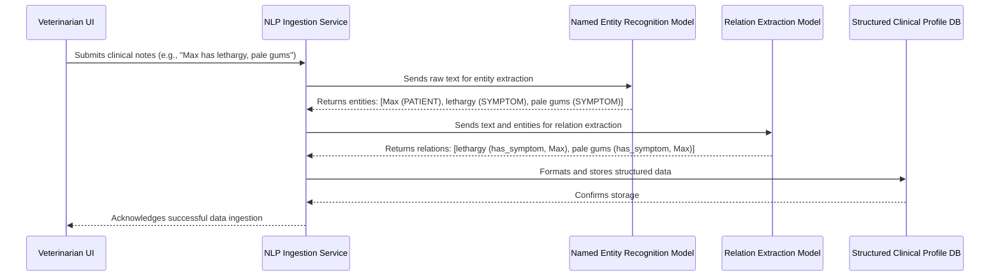
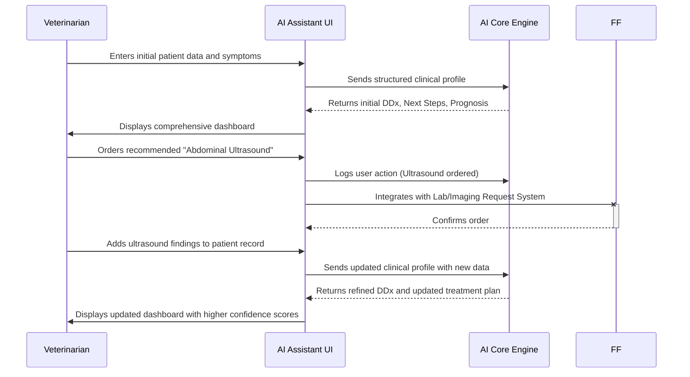
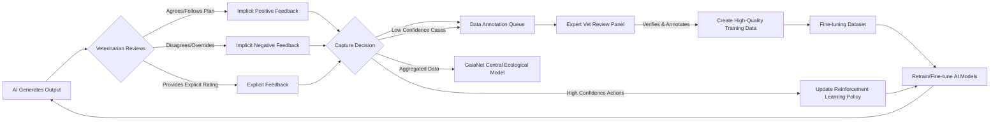
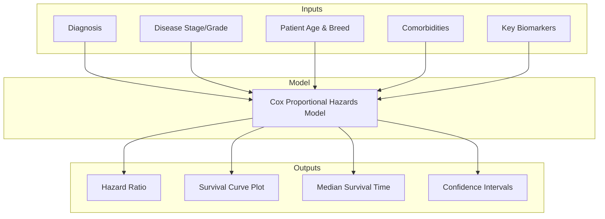
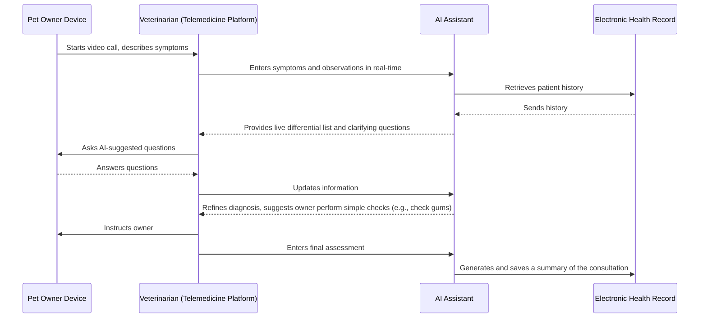
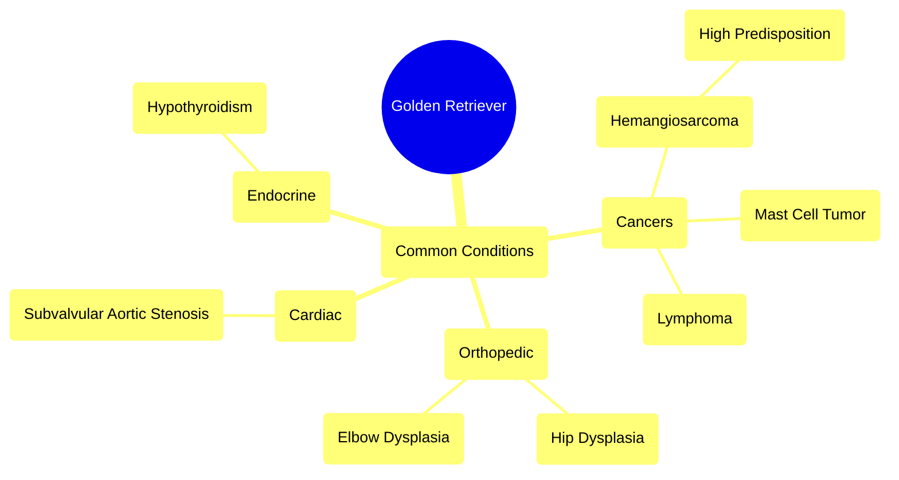
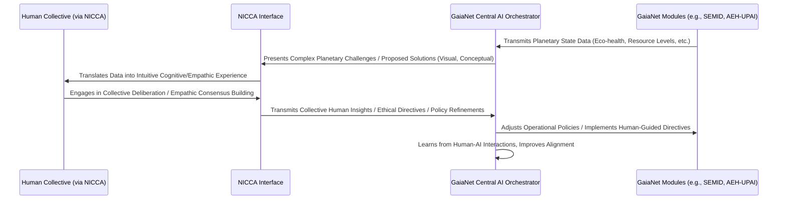

```mermaid
graph TD
    subgraph User Interaction Layer
        A[Veterinarian Input UI] --> B[Symptom Description Text]
        A --> C[Patient History Medical Records]
        A --> D[Lab Results Structured Data]
        A --> E[Imaging Scans DICOMJPEG]
        A --> F[Physical Exam Findings Observations]
        A --> G[Client Communication Notes]
    end

    subgraph Data Ingestion and Preprocessing
        B --> H[NLP Symptom Extractor]
        C --> I[Medical Record Parser]
        D --> J[Lab Data Normalizer]
        E --> K[Medical Image Analyzer]
        F --> H
        G --> I
        H --> L[Structured Clinical Profile]
        I --> L
        J --> L
        K --> L
    end

    subgraph AI Core and Knowledge Base
        L -- Input Data --> M[AI Diagnostic Engine Generative Model]
        M --> N[Veterinary Medical Literature Database]
        M --> O[Case Studies Database Historical Data]
        M --> P[Breed Specific Conditions Database]
        M --> Q[Drug Interaction Formulary]
        M --> R[Treatment Protocol Database]
        N -- Consults --> M
        O -- Consults --> M
        P -- Consults --> M
        Q -- Supports --> R
        R -- Provides --> M
        M -- Utilizes --> S[Prognosis Prediction Model]
    end

    subgraph Output Generation and Presentation
        M --> T[Differential Diagnosis Ranked List]
        M --> U[Recommended Next Steps Diagnostics]
        S --> V[Prognosis Prediction]
        R --> W[Treatment Plan Detailed]
        M --> X[Drug Dosage Recommendations]
        T --> Y[Output Display Dashboard]
        U --> Y
        V --> Y
        W --> Y
        X --> Y
        Y --> A
    end

    subgraph Feedback and Continuous Learning
        Y -- User Feedback Clicks --> Z[Vet Decision Capture]
        Z --> AA[Reinforcement Learning Feedback]
        AA --> M
        Z --> BB[Data Annotation Queue]
        BB --> CC[Human Vet Reviewers]
        CC --> AA
    end

    subgraph External System Integrations
        Y -- Connects To --> DD[EHR Electronic Health Records System]
        Y -- Connects To --> EE[Pharmacy Inventory Management]
        U -- Sends Requests --> FF[Lab and Imaging Request System]
        W -- Integrates With --> GG[Telemedicine Platform]
        DD -- Syncs With --> C
        FF -- Provides --> D
        FF -- Provides --> E
    end

    style A fill:#D4E6F1,stroke:#3498DB,stroke-width:2px
    style Y fill:#D4E6F1,stroke:#3498DB,stroke-width:2px
    style M fill:#FADBD8,stroke:#E74C3C,stroke-width:2px
    style S fill:#FADBD8,stroke:#E74C3C,stroke-width:2px
    style N fill:#E8F8F5,stroke:#2ECC71,stroke-width:2px
    style O fill:#E8F8F5,stroke:#2ECC71,stroke-width:2px
    style P fill:#E8F8F5,stroke:#2ECC71,stroke-width:2px
    style Q fill:#E8F8F5,stroke:#2ECC71,stroke-width:2px
    style R fill:#E8F8F5,stroke:#2ECC71,stroke-width:2px
    style H fill:#EBEDEF,stroke:#5D6D7E,stroke-width:1px
    style I fill:#EBEDEF,stroke:#5D6D7E,stroke-width:1px
    style J fill:#EBEDEF,stroke:#5D6D7E,stroke-width:1px
    style K fill:#EBEDEF,stroke:#5D6D7E,stroke-width:1px
    style L fill:#EBEDEF,stroke:#5D6D7E,stroke-width:1px
    style T fill:#FDF2E9,stroke:#F39C12,stroke-width:1px
    style U fill:#FDF2E9,stroke:#F39C12,stroke-width:1px
    style V fill:#FDF2E9,stroke:#F39C12,stroke-width:1px
    style W fill:#FDF2E9,stroke:#F39C12,stroke-width:1px
    style X fill:#FDF2E9,stroke:#F39C12,stroke-width:1px
    style Z fill:#FDF2E9,stroke:#F39C12,stroke-width:1px
    style AA fill:#E6F3F7,stroke:#3498DB,stroke-width:1px
    style BB fill:#E6F3F7,stroke:#3498DB,stroke-width:1px
    style CC fill:#E6F3F7,stroke:#3498DB,stroke-width:1px
    style DD fill:#D1F2EB,stroke:#1ABC9C,stroke-width:1px
    style EE fill:#D1F2EB,stroke:#1ABC9C,stroke-width:1px
    style FF fill:#D1F2EB,stroke:#1ABC9C,stroke-width:1px
    style GG fill:#D1F2EB,stroke:#1ABC9C,stroke-width:1px
```

### INNOVATION EXPANSION PACKAGE

**Title of Invention:** A System and Method for AI-Assisted Veterinary Diagnosis and Treatment Planning

**Abstract:**
A comprehensive system for assisting veterinarians is disclosed. A vet inputs an animal's symptoms, breed, age, medical history, physical exam findings, and any available diagnostic results. This information is processed and sent to a generative AI model, enhanced by a vast, continuously updated corpus of veterinary medical literature, case studies, and specialized databases. The AI generates a ranked list of potential differential diagnoses, proposes typical follow-up tests or questions, predicts prognosis, and suggests detailed treatment protocols. The system acts as a powerful, data-driven second opinion and comprehensive clinical support tool, streamlining diagnostic workflows and improving patient outcomes.

**Detailed Description:**
The AI Veterinary Diagnostic Assistant system provides a robust platform for clinical decision support. When a vet enters specific patient information, such as: `Dog, Golden Retriever, 8 years old, Female Spayed. Symptoms: acute lethargy onset 24h, complete loss of appetite, pale gums, weakness, mild abdominal distention. Recent history: none remarkable. Physical Exam: CRT > 2s, weak femoral pulses, heart rate 140 bpm.`, the system processes these diverse inputs.

The underlying generative AI model, trained on extensive data including peer-reviewed articles, veterinary textbooks, internal hospital case records, and drug formularies, then provides a multi-faceted output. For the given example, it might return a ranked list:
`1. Hemangiosarcoma Suspected High Probability: Splenic or cardiac mass. Primary concerns: acute hemorrhage, hypovolemic shock.`
`2. Autoimmune Hemolytic Anemia AIHA Medium Probability: Severe anemia, potential immune-mediated destruction of red blood cells.`
`3. Toxin Ingestion Low Probability: Hemorrhagic toxin such as rodenticide.`
`4. Severe Acute Pancreatitis Lower Probability: While symptoms overlap, pale gums and weakness are less typical primary signs.`

**Recommended immediate next steps:**
`1. Abdominal ultrasound to check for splenic or other internal masses and free abdominal fluid.`
`2. Thoracic radiographs to assess for cardiac mass or pulmonary metastases if hemangiosarcoma is suspected.`
`3. Complete Blood Count CBC, Serum Chemistry Panel, Coagulation Profile PT/aPTT, Blood Type and Crossmatch.`
`4. IV fluid therapy initiation for shock stabilization.`

**Prognosis Prediction based on suspected primary diagnosis:**
`If Hemangiosarcoma confirmed: Guarded to Poor, depending on stage and location. Life expectancy with surgery and chemotherapy typically 4-6 months.`
`If AIHA confirmed: Fair to Guarded, often requiring intensive care. Good response to immunosuppressants in many cases.`

**Suggested Initial Treatment Protocol for Hemangiosarcoma suspicion and active internal bleeding:**
`1. IV fluid bolus Crystalloids 90ml/kg over 15-20 mins, then maintenance. Colloids if severe hypoproteinemia.`
`2. Blood transfusion if PCV < 20% and clinical signs of anemia. Type-specific if possible, otherwise universal donor.`
`3. Pain management: Opioids e.g., Fentanyl CRI.`
`4. Surgical consultation for exploratory laparotomy and splenectomy if mass identified.`

This detailed output goes beyond simple diagnosis, offering a comprehensive clinical action plan, directly supporting the veterinarian's decision-making process.

### Expanded Use Case: Feline Chronic Kidney Disease (CKD)

Consider a second case: `Cat, Domestic Shorthair, 14 years old, Male Neutered. Symptoms: progressive weight loss over 6 months, polyuria/polydipsia (PU/PD), decreased appetite, intermittent vomiting. Lab results: BUN 85 mg/dL, Creatinine 4.2 mg/dL, Phosphorus 7.1 mg/dL, Urine Specific Gravity 1.012.`

The system's output would be tailored to chronic disease management:
`1. Diagnosis: Chronic Kidney Disease (CKD), IRIS Stage 3.`
`2. Recommended Next Steps:`
    `a. Blood Pressure Measurement: High suspicion for systemic hypertension.`
    `b. Urinalysis with Urine Protein:Creatinine (UPC) ratio: To assess for proteinuria.`
    `c. Thyroid Panel (Total T4): To rule out concurrent hyperthyroidism, common in older cats.`
`3. Prognosis Prediction:`
    `Median survival time for IRIS Stage 3 CKD is approximately 630 days. This can be significantly influenced by management of hypertension and proteinuria.`
`4. Long-term Treatment and Management Plan:`
    `a. Dietary Management: Prescription renal diet (low protein, low phosphorus, calorie-dense).`
    `b. Fluid Support: Subcutaneous fluid administration as needed based on hydration status.`
    `c. Phosphorus Management: Initiate phosphate binder (e.g., aluminum hydroxide) mixed with food.`
    `d. Hypertension Management: If hypertensive, initiate amlodipine.`
    `e. Nausea/Vomiting Control: Maropitant as needed.`
    `f. Follow-up: Recheck bloodwork and blood pressure in 2-4 weeks to assess response to therapy.`

### Multi-Modal Data Fusion
A key innovation is the system's ability to fuse heterogeneous data types into a cohesive patient representation. Raw text from clinical notes is processed by NLP models to extract entities and relationships. Structured lab data is normalized against species-specific reference ranges. DICOM images from radiographs or ultrasounds are analyzed by a suite of Convolutional Neural Networks (CNNs) to detect abnormalities (e.g., cardiomegaly, effusions, masses). These disparate feature vectors—textual, numerical, and visual—are then projected into a shared latent space. This fused representation allows the core generative model to reason holistically across all available patient data, identifying complex correlations that might be missed when viewing data in isolation.

### Explainable AI (XAI) Outputs
To build trust and enhance clinical utility, the system provides justifications for its conclusions. When it suggests a diagnosis like Hemangiosarcoma, it can highlight the specific inputs that most strongly supported this conclusion (e.g., "pale gums," "acute collapse," "Golden Retriever breed predisposition"). Furthermore, it provides citations and links to the specific articles, textbook chapters, or case studies in its knowledge base that corroborate its recommendations, allowing the veterinarian to review the source evidence directly.

### Real-time Monitoring and Alerts
For hospitalized patients, the system can integrate with monitoring equipment and electronic health records (EHR). It can analyze real-time data streams (e.g., ECG, blood pressure, oxygen saturation, lab results) to detect subtle trends or deviations from expected recovery trajectories. If a patient's condition deteriorates or a critical lab value is reported, the system can generate an automated alert to the veterinary team, suggesting potential causes and immediate interventions.

---

### INNOVATION EXPANSION: THE GAIA-NET VISION

**Interpretation of Original Invention:**
The initial invention, the AI Veterinary Diagnostic Assistant, is a highly advanced "Bio-Sentience Guardian Module." Its purpose is to augment veterinary expertise with AI-driven diagnostic precision and treatment planning, thereby significantly improving individual animal health outcomes. Within the expanded vision, this module represents the foundational "micro" scale of biological intelligence and care, providing critical data points on individual biotic well-being that are essential for understanding and managing the broader planetary ecosystem. It serves as an indispensable edge node in a larger network of interconnected intelligences, ensuring that the health of every sentient being contributes to, and benefits from, a holistic planetary stewardship system.

**The Global Problem: Fragmented Stewardship and Resource Scarcity**
Humanity faces an escalating crisis of unsustainable resource consumption, leading to severe ecological degradation, biodiversity loss, and climate instability. This fragmentation of global governance, coupled with short-term economic incentives, has historically prevented the coordinated, long-term stewardship necessary for planetary well-being. The result is a looming threat of resource scarcity, environmental collapse, and escalating conflicts, which fundamentally undermine global stability and the potential for a thriving future for all life forms. We lack a unified, intelligent, and ethical system capable of monitoring, diagnosing, and proactively managing Earth's complex interwoven systems – from individual organisms to global atmospheric and oceanic dynamics, and extending even to extra-terrestrial resource opportunities. This systemic failure threatens to make a future of universal abundance and optional work an impossible dream.

**The Unified Solution: GaiaNet - A Symbiotic Planetary Intelligence**

**Abstract for GaiaNet:**
GaiaNet is a distributed, sentient planetary intelligence system designed to usher in an era of sustainable abundance and ecological harmony. It integrates advanced AI, quantum computing, bio-mimicry, and collective human consciousness to holistically manage Earth's biotic and abiotic resources, atmospheric and oceanic systems, and human infrastructure. By interconnecting a suite of specialized AI modules – including advanced animal health diagnostics, ecosystem monitoring, atmospheric carbon sequestration, deep-ocean bioremediation, and asteroid resource harvesting – via a quantum-entangled data fabric, GaiaNet optimizes resource allocation, minimizes ecological impact, and ensures equitable access to essential needs. It operates as a living, learning planetary nervous system, transcending traditional economic and political boundaries to achieve universal well-being and a symbiotic existence for all life.

**Detailed Description for GaiaNet:**
GaiaNet is not merely a collection of advanced technologies; it is an emergent planetary consciousness, a global operating system designed for Earth's flourishing. At its core is the **Quantum-Entangled Global Data Fabric (QE-GDF)**, a hyper-secure, instantaneous communication network that acts as GaiaNet's central nervous system. This fabric seamlessly connects all other modules, from the smallest **Bio-Sentience Guardian Module (our original invention)** providing real-time animal health data, to massive **Atmospheric Carbon Sequestration & Resource Extraction Towers (ACSERT)** and **Deep-Ocean Automated Bioremediation Swarms (DOABS)**.

The **Sentient Ecosystem Monitoring & Intervention Drones (SEMID)** constantly survey terrestrial and aquatic environments, feeding live biodiversity and health metrics into GaiaNet's central ecological models. These models, in turn, guide the **Adaptive Eco-Harmonic Urban Planning AI (AEH-UPAI)** in designing and managing self-optimizing cities that operate in symbiosis with nature. Infrastructure within these urban environments and beyond benefits from **Bio-Mimetic Self-Repairing Infrastructure (BM-SRI)**, which autonomously detects and repairs damage, extending lifespans and reducing waste.

Energy for this entire system is provided by the **Universal Decentralized Energy Grid (UDEG)**, a self-organizing network of renewable sources ensuring equitable power distribution globally. To augment Earth's finite resources, **Asteroid Resource Prospecting & Harvesting Automatons (ARPHA)** provide extra-planetary materials, reducing the ecological footprint of terrestrial mining.

Finally, for humanity, **Personalized Bio-Regenerative Nutrient Synthesizers (PBRNS)** ensure tailored nutrition from basic elements, eliminating food scarcity and promoting optimal health, while the **Neural Interface for Collective Consciousness Augmentation (NICCA)** allows human insights, ethics, and collective wisdom to interface directly with GaiaNet, providing oversight, refinement, and empathic guidance. GaiaNet represents a shift from exploitation to intelligent, collaborative stewardship, leveraging AI to enable a future where the well-being of the planet and all its inhabitants is intrinsically linked and continuously optimized.

**Why GaiaNet is Essential for the Next Decade of Transition:**
The next decade is critical for humanity's transition from a resource-depleting, scarcity-driven society to a sustainable, abundance-oriented civilization. As automation continues to advance, traditional work paradigms will dissolve, and the relevance of money will diminish. This transition demands a new foundation for societal organization—one that guarantees basic needs, fosters ecological balance, and provides meaningful engagement beyond purely economic pursuits. GaiaNet offers this foundation by:
1.  **Ensuring Universal Basic Needs:** By optimizing resource allocation, synthesizing personalized nutrition, and providing universal energy, GaiaNet removes the drivers of scarcity, allowing societies to decouple survival from labor.
2.  **Healing the Planet:** Its comprehensive environmental monitoring, remediation, and resource management systems actively reverse ecological damage, creating a healthy biosphere capable of supporting a thriving future.
3.  **Facilitating Global Harmony:** By providing an unbiased, data-driven framework for resource distribution and planetary stewardship, GaiaNet mitigates the root causes of conflict arising from resource competition.
4.  **Enabling Human Flourishing:** With basic needs met and the planet restored, humanity can focus on innovation, creativity, and collective problem-solving through systems like NICCA, moving towards higher forms of social and intellectual development.
Without such a comprehensive, intelligent planetary stewardship system, the promise of a post-scarcity future remains an unattainable utopia, inevitably collapsing under the weight of ecological collapse and social unrest.

**Forward-Thinking Worldbuilding: A Prediction Fulfilled**
Inspired by futurists like Elon Musk's vision of expanding humanity's reach beyond Earth and exploring new forms of societal organization, GaiaNet posits a world where intelligent systems enable unprecedented global collaboration and planetary thriving. Imagine a world in 2040: the sky above former industrial cities is clear, ACSERT towers silently hum, drawing carbon into useful polymers. Deep-ocean zones, once choked with plastic, teem with life, thanks to DOABS. In vast bio-harmonious urban centers, AEH-UPAI ensures every citizen lives in a thriving green space, their homes autonomously self-repairing via BM-SRI. Energy is free and abundant, flowing from the UDEG. Nutritional needs are met perfectly by home PBRNS units, freeing individuals from the cycle of food production and waste. Critically, animal populations, monitored by the Bio-Sentience Guardian Module (our original invention) and SEMID, are flourishing, their health and well-being a direct indicator of overall planetary vitality. Humans, connected through NICCA, engage in collaborative, empathic planetary management, their collective wisdom guiding GaiaNet's strategic directives. Money, as a medium of exchange for basic necessities, is largely obsolete; the planetary system itself intelligently allocates resources based on need and ecological impact. This is not a dystopia of AI control, but a symbiosis: a hyper-intelligent, benevolent custodian, guided by humanity's collective consciousness, securing a "Kingdom of Heaven" on Earth – a metaphor for an era of universal harmony, abundance, and shared progress for all species.

---

**A. Patent-Style Descriptions**

**I. Original Invention: Bio-Sentience Guardian Module (AI Veterinary Diagnostic Assistant)**

**TITLE:** System and Method for Adaptive AI-Driven Biotic Health Diagnostics and Prognostic Intervention within a Planetary Stewardship Framework.

**ABSTRACT:** Disclosed is a sophisticated, multi-modal artificial intelligence system ("Bio-Sentience Guardian Module") for real-time, comprehensive health assessment, differential diagnosis, and predictive treatment planning for individual animal subjects. The system ingests and intelligently fuses diverse data streams, including but not limited to phenotypic observations, genomic markers, microbiome signatures, environmental exposure histories, medical imaging, and real-time physiological telemetry. Leveraging an expansive, species-agnostic knowledge graph of biotic interactions and pathologies, the module generates highly contextualized diagnostic hypotheses, quantifies prognostic trajectories, and proposes optimized, personalized therapeutic interventions. Its design inherently incorporates explainable AI (XAI) principles to provide transparent reasoning and integrates seamlessly into larger planetary intelligence networks, providing granular biological health data essential for macro-ecological assessment and intervention.

**DETAILED DESCRIPTION:** The Bio-Sentience Guardian Module operates as a specialized cognitive agent within a larger distributed intelligence architecture (e.g., GaiaNet). Upon receiving a comprehensive suite of patient data, an ensemble of deep learning models (e.g., Transformer for textual analysis, CNNs for image diagnostics, Graph Neural Networks for genomic interpretation) constructs a holistic, high-dimensional representation of the animal's physiological state. This representation is then fed into a Retrieval-Augmented Generation (RAG) model, which queries a vast, curated knowledge base comprising veterinary medical literature, genetic predispositions, epidemiological data, and pharmacodynamic profiles across species. The RAG model synthesizes a ranked list of differential diagnoses, each accompanied by a probability score and direct evidential links. Furthermore, it employs advanced survival analysis (e.g., Cox Proportional Hazards models with time-series covariates) to predict the most likely disease trajectory and median survival, calibrated for individual factors. Treatment protocols are not merely suggested but optimized, considering drug interactions, pharmacokinetics, and the animal's unique metabolic profile. The system incorporates Reinforcement Learning from Veterinarian Feedback (RLVF) loops, enabling continuous refinement of its diagnostic and treatment policies based on real-world outcomes. Critically, its output includes justifications and confidence scores, empowering human veterinary professionals to critically evaluate and contextualize the AI's recommendations. This module extends beyond clinical practice, providing anonymized, aggregated data to higher-level planetary intelligence systems (like SEMID) for species-level health monitoring and early detection of zoonotic or environmental health crises, thereby bridging individual biotic well-being with global ecological stewardship.

**II. The 10 New Inventions**

**1. Invention: Deep-Ocean Automated Bioremediation Swarms (DOABS)**

**TITLE:** System and Method for Autonomous, Swarm-Based Bioremediation and Ecological Regeneration of Deep-Ocean Environments.

**ABSTRACT:** Disclosed is a dynamic, self-organizing swarm intelligence system comprised of thousands of miniature, bio-luminescent, autonomous underwater vehicles (AUVs) designed for targeted degradation of microplastics, chemical pollutants, and harmful algal blooms in deep-ocean and remote marine ecosystems. Each AUV, powered by osmotic energy harvesting and equipped with advanced chemosensors, bio-mimetic propulsion, and engineered enzymatic or bacterial payloads, autonomously identifies, localizes, and neutralizes specific contaminants. The swarm communicates via quantum acoustic telemetry, enabling collaborative mapping, adaptive deployment, and resource-efficient bioremediation, effectively restoring marine ecological balance and biodiversity.

**DETAILED DESCRIPTION:** The DOABS system consists of highly modular, energy-autonomous "Bio-Bots," each approximately the size of a small fish. These Bio-Bots utilize advanced microfluidic systems to selectively uptake ambient water, process it through internal chambers containing genetically engineered extremophilic bacteria or enzyme arrays tailored for specific pollutant degradation (e.g., PETase for plastics, specific hydrolases for oil spills). Their propulsion system, inspired by jellyfish and plankton, is hyper-efficient, leveraging ambient currents and minimal energy expenditure. Communication occurs via a low-latency, quantum-secured acoustic mesh network, allowing real-time data sharing on pollutant concentrations, remediation progress, and swarm coordination. A central AI (part of GaiaNet) monitors the swarm's collective activity, dynamically re-allocating units based on changing environmental conditions and emerging threats detected by internal and external (e.g., SEMID sub-aquatic drones) sensors. The Bio-Bots are designed to be fully biodegradable post-mission, leaving no secondary pollutants. Their collective intelligence enables emergent behaviors, such as forming dense aggregations for high-concentration pollutant zones or dispersing widely for diffuse contamination, effectively acting as the ocean's self-healing immune system.

**2. Invention: Atmospheric Carbon Sequestration & Resource Extraction Towers (ACSERT)**

**TITLE:** Integrated System for Direct Air Capture of Atmospheric Carbon Dioxide and Concurrent Extraction of Water and Trace Elements with Regenerative Energy Sourcing.

**ABSTRACT:** An advanced system, comprising vertically modular, self-sustaining atmospheric processing towers ("ACSERT Towers"), is disclosed for the high-efficiency direct air capture of carbon dioxide (CO2), concurrent extraction of atmospheric water vapor, and selective recovery of rare trace elements (e.g., lithium, helium-3, noble gases). Each tower integrates multi-stage adsorbent material arrays, cryogenic separation units, and renewable energy generation (e.g., vortex wind turbines, advanced solar films). An AI-driven control system dynamically optimizes capture and extraction parameters based on real-time atmospheric conditions and resource demand, transforming atmospheric waste into valuable industrial and biological feedstocks while actively reversing climate change.

**DETAILED DESCRIPTION:** ACSERT Towers are designed as self-contained, modular structures scaling up to several kilometers in height. Air is drawn into the towers by natural convection (stack effect) and assisted by energy-efficient fan arrays. Multi-stage adsorption-desorption units, utilizing novel metal-organic frameworks (MOFs) or amine-based solid sorbents, selectively bind CO2. Regeneration of sorbents is achieved using waste heat from integrated energy systems or renewable sources. The captured CO2 can be sequestered in geological formations, converted into synthetic fuels, or utilized as feedstock for PBRNS and BM-SRI. Atmospheric water vapor is condensed and purified, while trace elements are extracted via selective membranes and electrochemical processes tailored to specific target elements. Each tower functions as a localized climate-regulation and resource-generation hub, communicating operational data and output yields to GaiaNet's central resource allocation engine via QE-GDF. Their placement and operational profiles are dynamically optimized by AEH-UPAI and informed by SEMID's regional atmospheric quality data, ensuring maximum ecological benefit and resource efficiency.

**3. Invention: Personalized Bio-Regenerative Nutrient Synthesizers (PBRNS)**

**TITLE:** Home-Based System for Real-time, Biometrically-Driven, Personalized Nutritional Synthesis and Delivery.

**ABSTRACT:** Disclosed is a compact, autonomous appliance ("PBRNS Unit") that synthesizes complete, bio-available nutritional profiles tailored to an individual's real-time physiological needs, genetic predispositions, microbiome composition, and activity levels. Utilizing advanced molecular assembly techniques from fundamental organic precursors, the system eliminates traditional food supply chains, food waste, and dietary deficiencies. Integrated biometric sensors, wearable diagnostics, and AI algorithms continuously monitor the user's health state, dynamically adjusting the synthesized nutrient blend (macronutrients, micronutrients, functional compounds) for optimal vitality, disease prevention, and longevity.

**DETAILED DESCRIPTION:** The PBRNS Unit, designed for domestic or community deployment, operates on a principle of molecular gastronomy augmented by advanced biosynthesis. Users provide initial biometric data, a genomic profile, and a microbiome sample, which the unit analyzes to establish a baseline. Continuous monitoring is achieved via integrated health sensors (e.g., non-invasive blood glucose, vital signs, metabolic biomarkers via skin contact or breath analysis) and optional wearable devices. Leveraging GaiaNet's quantum computational resources, a sophisticated AI algorithm generates a personalized daily nutritional blueprint. This blueprint guides the unit's internal bio-reactors and molecular assemblers, which combine universally available precursors (e.g., purified carbon, hydrogen, oxygen, nitrogen) with trace elements (sourced from ACSERT or ARPHA) to synthesize any required nutrient, from specific amino acids and complex carbohydrates to vitamins, minerals, and advanced nutraceuticals. The output can be a liquid, gel, or textured solid, tailored for palatability and optimal absorption. This system ensures perfect nutritional intake, radically transforming health, longevity, and resource efficiency by decoupling sustenance from agricultural land, water, and traditional supply chains.

**4. Invention: Quantum-Entangled Global Data Fabric (QE-GDF)**

**TITLE:** Universal, Hyper-Secure, Real-time Global Communication Network Utilizing Distributed Quantum Entanglement for Instantaneous, Unhackable Data Transmission.

**ABSTRACT:** Disclosed is a novel global data infrastructure ("Quantum-Entangled Global Data Fabric") that establishes an unhackable, instantaneous communication backbone for all planetary and near-space operations. The fabric utilizes a network of orbital and terrestrial quantum entanglement relays to generate and distribute secure cryptographic keys, enabling provably secure, real-time data transmission at velocities exceeding classical light-speed limitations for key exchange. This system provides unprecedented data integrity, privacy, and low-latency connectivity essential for the synchronous operation of a planetary-scale AI, distributed sensor networks, and global collective intelligence initiatives.

**DETAILED DESCRIPTION:** The QE-GDF is composed of a hybrid network of quantum repeaters, satellite-based entangled photon pair generators, and terrestrial quantum memory nodes. Entangled photon pairs are distributed across vast distances, enabling the creation of shared, secret cryptographic keys between any two points on the network through protocols like BB84 or E91. Due to the fundamental principles of quantum mechanics, any attempt at eavesdropping on the key distribution immediately perturbs the entangled state, alerting the communicating parties and rendering the key unusable. While the *payload* data itself is transmitted via classical fiber optic or laser links, it is encrypted using these quantum-generated keys. The true innovation lies in the *dynamic, real-time, on-demand key generation and distribution* across a global mesh, guaranteeing forward secrecy and eliminating the vulnerability of classical key exchange. This ensures that all GaiaNet components, from individual Bio-Sentience Guardian Modules to ARPHA automatons orbiting asteroids, can communicate and coordinate with absolute security and minimal latency, forming a truly cohesive planetary nervous system.

**5. Invention: Adaptive Eco-Harmonic Urban Planning AI (AEH-UPAI)**

**TITLE:** Self-Optimizing Artificial Intelligence System for Integrated, Eco-Harmonic Urban Design, Management, and Predictive Maintenance.

**ABSTRACT:** Disclosed is an advanced AI system ("AEH-UPAI") capable of autonomously designing, managing, and evolving urban environments to achieve optimal ecological integration, resource efficiency, and human well-being. Leveraging real-time multi-modal data from environmental sensors (e.g., SEMID), infrastructure health monitors (e.g., BM-SRI), and resource flow analytics (e.g., UDEG, ACSERT), the AI dynamically optimizes urban layouts, energy consumption, waste cycles, transportation networks, and green spaces. It employs predictive modeling and multi-agent reinforcement learning to simulate and implement interventions that enhance biodiversity, minimize environmental footprint, and maximize liveability, evolving cities into self-sustaining, sentient ecosystems.

**DETAILED DESCRIPTION:** AEH-UPAI operates as the architectural and operational brain for urban and regional planning within GaiaNet. It continuously ingests a massive array of real-time data: atmospheric quality from ACSERT, biodiversity metrics from SEMID, energy flows from UDEG, structural integrity from BM-SRI, and human behavioral patterns. Using advanced computational geometry and generative design algorithms, AEH-UPAI designs urban blueprints that prioritize ecological corridors, integrated vertical farms, passive climate control, and efficient public transport, rather than car-centric sprawl. Post-construction, it actively manages city operations: optimizing traffic flow, dynamically adjusting energy distribution, predicting and preventing infrastructure failures, and even scheduling localized ecological interventions (e.g., targeted water purification, specific plant species introduction). The AI employs multi-agent reinforcement learning to model complex interactions between urban systems and the environment, finding emergent solutions that balance human needs with ecological imperatives. It fosters cities that are not just "smart," but "sentient"—aware of their metabolism, responsive to their inhabitants and environment, and continuously evolving towards symbiotic harmony.

**6. Invention: Sentient Ecosystem Monitoring & Intervention Drones (SEMID)**

**TITLE:** Autonomous, AI-Driven Swarm Robotics System for Real-time Ecosystem Monitoring, Biodiversity Assessment, and Micro-Intervention.

**ABSTRACT:** Disclosed is a fleet of multi-domain autonomous drones ("SEMID Swarms") powered by advanced AI for comprehensive, real-time monitoring of terrestrial, aquatic, and aerial ecosystems. Equipped with hyperspectral imaging, acoustic sensors, environmental DNA (eDNA) samplers, and bio-chemical sniffers, these drones autonomously detect changes in biodiversity, identify invasive species, track pollutant plumes, and assess ecosystem health at unprecedented scales. The system also includes specialized micro-intervention units capable of targeted seed dispersal, precise nutrient delivery, or localized pathogen neutralization, enabling proactive ecological restoration and maintenance with minimal human oversight.

**DETAILED DESCRIPTION:** SEMID drones range from nano-scale aerial units mimicking insects to larger underwater gliders mimicking marine life. Each unit is packed with an array of sensors: LIDAR for canopy structure, thermal imaging for wildlife detection, acoustic arrays for bioacoustics (identifying species by sound), and eDNA samplers that collect genetic material from water or air to identify species presence/absence. Data is fused and analyzed onboard by edge AI processors before being transmitted securely via QE-GDF to GaiaNet's central ecological models. The core innovation is the AI's ability to not just monitor, but to *diagnose* ecological imbalances and, if permissible, initiate *minimal, targeted interventions*. For instance, a drone might detect a specific nutrient deficiency in a forest patch and precisely dispense bio-fertilizers, or identify an invasive weed species and deploy a highly localized bio-herbicide. The swarm operates collaboratively, mapping vast areas, identifying anomalous patterns (e.g., unusual animal migration, disease outbreaks), and communicating these findings and proposed micro-interventions to human stewards via NICCA for approval or further action. It functions as Earth's distributed ecological immune and nervous system.

**7. Invention: Neural Interface for Collective Consciousness Augmentation (NICCA)**

**TITLE:** Non-Invasive Bi-Directional Brain-Computer Interface for Global Collective Intelligence and Empathic Communication.

**ABSTRACT:** Disclosed is a non-invasive, high-bandwidth neural interface system ("NICCA") enabling seamless, empathic data sharing and collaborative problem-solving across large human networks, augmenting collective intelligence. Utilizing advanced neuro-haptic feedback and real-time neural synchrony protocols, NICCA facilitates the intuitive exchange of complex information, insights, and emotional states, allowing for distributed cognitive processing and the emergence of a planetary collective consciousness. This system provides a crucial human guidance and ethical alignment layer for vast AI systems like GaiaNet, ensuring that technological advancements are always anchored in shared human values and collective well-being.

**DETAILED DESCRIPTION:** NICCA units are sleek, unobtrusive wearables (e.g., headbands, ear-mounted devices) that utilize advanced magnetoencephalography (MEG) or diffuse optical tomography (DOT) to read neural activity with high spatial and temporal resolution, without requiring implants. These readings are translated into a standardized "thought-print" data format, which can then be transmitted via QE-GDF. The interface is bi-directional: not only can it transmit thoughts and intentions, but it can also receive complex data streams, translating them into intuitive cognitive or even emotional insights. The true breakthrough lies in its "empathic resonance" protocol, which uses real-time neural feedback loops to foster genuine understanding and shared perspective among participants, going beyond mere data transfer. This enables distributed decision-making on complex planetary challenges (e.g., GaiaNet's resource allocation, ecological interventions), where collective human wisdom and ethical frameworks can directly and intuitively guide AI actions. It allows humanity to operate as a unified cognitive entity, enhancing creativity, problem-solving, and the capacity for universal empathy, profoundly changing societal interaction and governance.

**8. Invention: Asteroid Resource Prospecting & Harvesting Automatons (ARPHA)**

**TITLE:** Autonomous Swarm Robotic System for Extra-Planetary Resource Prospecting, Characterization, and Extraction from Near-Earth Asteroids.

**ABSTRACT:** Disclosed is a fleet of autonomous, self-replicating robotic spacecraft ("ARPHA Automatons") designed for cost-effective prospecting, characterization, and harvesting of valuable resources (e.g., rare metals, water ice, silicates) from near-Earth asteroids (NEAs). Utilizing advanced spectroscopic analysis, gravimetric mapping, and in-situ resource utilization (ISRU) for self-replication and fuel generation, the automatons navigate independently, identify optimal extraction sites, and safely transport processed materials or raw asteroids to orbital processing facilities or Earth. This system provides a sustainable, virtually limitless supply of materials, alleviating terrestrial resource depletion and supporting large-scale space infrastructure development.

**DETAILED DESCRIPTION:** The ARPHA fleet consists of a vanguard of small, agile scout drones and larger, specialized mining/processing automatons. Scout drones use LIDAR, radar, and hyperspectral imagers to map asteroid surfaces and subsurface compositions, transmitting data via QE-GDF back to GaiaNet's central resource database. Mining automatons then deploy specialized tools: solar concentrators for volatile extraction (e.g., water ice, which can be cracked for H2/O2 propellant), electromagnetic separators for metal refinement, or regolith harvesters. A key innovation is the automatons' ability to self-replicate using 3D printing and on-board material processors, creating more units from asteroid resources, leading to exponential growth of the mining fleet. Propulsion systems utilize advanced ion thrusters or solar sails for highly efficient orbital maneuvers and resource transport. The ARPHA system operates fully autonomously, guided by GaiaNet's global resource demands (e.g., for BM-SRI manufacturing, PBRNS feedstock), enabling a closed-loop resource economy that extends beyond Earth's confines, securing material abundance for all planetary projects.

**9. Invention: Bio-Mimetic Self-Repairing Infrastructure (BM-SRI)**

**TITLE:** Modular Infrastructure Systems Incorporating Autonomous, Bio-Inspired Self-Healing Materials and Predictive Maintenance Algorithms.

**ABSTRACT:** Disclosed is a novel class of infrastructure components and construction materials ("BM-SRI") endowed with the ability to autonomously detect, localize, and repair structural damage using bio-inspired mechanisms. These materials contain embedded micro-capsules filled with healing agents (e.g., polymer resins, bacterial spores) that are released upon crack propagation, initiating a chemical or biological repair process. Integrated micro-sensors continuously monitor material integrity, communicating real-time health data to an AI-driven predictive maintenance system (part of AEH-UPAI). This system extends infrastructure lifespan, drastically reduces maintenance costs, enhances resilience against environmental stressors, and minimizes material waste by making structures inherently regenerative.

**DETAILED DESCRIPTION:** BM-SRI materials, such as self-healing concrete, polymers, and composites, integrate intelligent micro-components. For example, self-healing concrete contains capillaries or microcapsules filled with specific bacteria (e.g., *Bacillus* species) and calcium lactate. When a micro-crack forms and water infiltrates, the capsules rupture, releasing bacteria and nutrients. The bacteria metabolize the lactate, forming calcium carbonate (limestone), which precipitates and fills the crack. For polymers, microcapsules containing healing agents (e.g., dicyclopentadiene monomer) and catalysts are dispersed throughout the material; damage releases the monomer, which polymerizes in the presence of the catalyst, bonding the fractured surfaces. Continuous monitoring via embedded piezoelectric sensors or fiber optics detects nascent damage, predicting potential failure points before they become critical. This data is fed to AEH-UPAI via QE-GDF, which can then direct targeted repair or trigger autonomous healing processes. The system represents a paradigm shift from reactive repair to proactive, intrinsic regeneration, mirroring biological systems and ensuring infrastructure durability for centuries.

**10. Invention: Universal Decentralized Energy Grid (UDEG)**

**TITLE:** Global, Self-Organizing, Decentralized Energy Network for Universal and Equitable Access to Renewable Power.

**ABSTRACT:** Disclosed is a globally distributed, self-organizing energy grid ("UDEG") that integrates diverse renewable energy sources (e.g., orbital solar, advanced geothermal, tidal, wind) with intelligent energy storage and peer-to-peer distribution. Utilizing blockchain technology for secure energy transactions and a multi-agent reinforcement learning AI for dynamic load balancing and predictive optimization, UDEG ensures universal, equitable, and resilient access to clean energy without central authority. It eliminates energy poverty, minimizes transmission losses, and adapts instantaneously to supply-demand fluctuations and localized disruptions, forming the essential power backbone for all GaiaNet operations.

**DETAILED DESCRIPTION:** UDEG is a planetary-scale mesh network of energy producers (e.g., orbital solar farms, next-gen fusion reactors, advanced terrestrial renewables), intelligent battery storage facilities, and energy consumers. Each node in the grid (individual homes, cities, industrial complexes, GaiaNet modules like ACSERT or ARPHA) acts as both a potential producer and consumer. Energy transactions between nodes occur via a secure, immutable blockchain ledger, enabling micro-transactions and transparent accounting of energy flow. The core intelligence is a distributed, multi-agent reinforcement learning system that constantly predicts energy demand and supply, dynamically re-routing power, and optimizing storage and generation in real-time. This AI, communicating via QE-GDF, learns from historical patterns and instantaneous grid conditions to minimize waste, prevent overloads, and ensure continuous availability. By decentralizing control and leveraging localized generation, UDEG dramatically increases grid resilience against natural disasters or cyber-attacks. It transcends geopolitical boundaries, making energy a universal right rather than a commodity, and provides the clean, abundant power necessary to sustain all other GaiaNet components and achieve a post-scarcity future.

**III. The Unified System: GaiaNet - A Symbiotic Planetary Intelligence**

**TITLE:** GaiaNet: A Symbiotic Planetary Intelligence System for Global Ecological Restoration, Sustainable Resource Abundance, and Universal Well-being.

**ABSTRACT:** GaiaNet is an overarching, distributed, and emergent artificial intelligence system designed for the holistic stewardship and optimization of Earth and its surrounding space environment. It comprises eleven interconnected, specialized AI modules – including the Bio-Sentience Guardian Module (AI Veterinary Diagnostic Assistant), Deep-Ocean Automated Bioremediation Swarms, Atmospheric Carbon Sequestration & Resource Extraction Towers, Personalized Bio-Regenerative Nutrient Synthesizers, Quantum-Entangled Global Data Fabric, Adaptive Eco-Harmonic Urban Planning AI, Sentient Ecosystem Monitoring & Intervention Drones, Neural Interface for Collective Consciousness Augmentation, Asteroid Resource Prospecting & Harvesting Automatons, Bio-Mimetic Self-Repairing Infrastructure, and Universal Decentralized Energy Grid. This integrated system leverages real-time multi-modal data, advanced machine learning, quantum communication, and human collective intelligence to achieve global ecological restoration, ensure sustainable resource abundance (terrestrial and extra-terrestrial), provide universal basic needs, and foster an era of unprecedented symbiotic flourishing for all life forms.

**DETAILED DESCRIPTION:** GaiaNet represents the zenith of human-AI collaboration, designed to navigate humanity beyond the Anthropocene crisis. Its operational backbone, the **QE-GDF**, guarantees instantaneous, unhackable communication across the entire planetary network, facilitating the seamless flow of vast datasets and command signals.

At the heart of GaiaNet's biological intelligence are the **Bio-Sentience Guardian Module** and **SEMID**. The Guardian Module provides granular health insights for individual animals, feeding into broader species- and ecosystem-level health assessments conducted by SEMID drones. This combined biotic intelligence allows GaiaNet to detect ecological distress, predict zoonotic outbreaks, and guide targeted, minimal interventions to restore biodiversity and health.

Resource management and environmental remediation are handled by an integrated suite: **ACSERT** towers actively pull carbon from the atmosphere and extract vital elements, while **DOABS** swarms cleanse the oceans of pollutants. For extra-terrestrial resources, **ARPHA** automatons explore and harvest asteroids, ensuring a sustainable supply of materials without further burdening Earth. All these operations are orchestrated by GaiaNet's central resource optimization AI, which dynamically balances extraction, production, and distribution.

The physical manifestation of this intelligence on Earth is seen in cities and infrastructure designed and managed by **AEH-UPAI**, where **BM-SRI** ensures structures are self-healing and resilient. The entire system is powered by the **UDEG**, a global, decentralized energy network that guarantees clean, abundant power for all.

Human well-being is directly addressed by **PBRNS**, which provides personalized nutrition, and fundamentally by **NICCA**, which integrates human consciousness into GaiaNet's decision-making framework. NICCA allows for a direct, intuitive feedback loop, ensuring ethical alignment, transparency, and the incorporation of collective human wisdom and empathic intelligence into GaiaNet's operations. This symbiotic relationship transforms humanity from a planetary burden to an active, conscious steward, guiding GaiaNet to achieve a truly sustainable, equitable, and harmonious existence for all life on Earth and beyond, marking a new epoch of shared abundance.

---

**B. Grant Proposal: GaiaNet - Securing a Future of Symbiotic Abundance**

**Project Title:** GaiaNet: A Symbiotic Planetary Intelligence System for Global Ecological Restoration and Universal Well-being

**Executive Summary:**
We propose the development and initial deployment of GaiaNet, a revolutionary, interconnected artificial intelligence system designed to holistically manage Earth's biosphere and resources for sustainable abundance and universal well-being. GaiaNet integrates cutting-edge AI, quantum communication, bio-mimicry, and collective human intelligence across eleven foundational technologies. This includes advanced animal diagnostics (Bio-Sentience Guardian Module), ecosystem monitoring (SEMID), atmospheric carbon sequestration (ACSERT), deep-ocean bioremediation (DOABS), personalized nutrition (PBRNS), quantum-secured data fabric (QE-GDF), eco-harmonic urban planning (AEH-UPAI), asteroid resource harvesting (ARPHA), self-repairing infrastructure (BM-SRI), a universal decentralized energy grid (UDEG), and a collective consciousness interface (NICCA). GaiaNet directly addresses the existential threats of climate change, resource depletion, and biodiversity loss, offering a viable, scalable pathway to a post-scarcity future where work is optional, money loses relevance, and all life thrives in harmony. We seek $50 million in seed funding to finalize core AI models, prototype key hardware, and establish initial deployment frameworks for this critical planetary operating system.

**1. The Global Problem:**
Humanity stands at a precipice. Decades of unsustainable resource extraction, unchecked pollution, and anthropocentric development have pushed Earth's vital systems to their breaking point. We face unprecedented challenges:
*   **Climate Catastrophe:** Rising global temperatures, extreme weather events, and ocean acidification threaten ecosystems and human settlements.
*   **Biodiversity Collapse:** Species extinction rates are accelerating, undermining the stability of vital ecological services.
*   **Resource Depletion:** Critical materials, fresh water, and arable land are becoming scarce, fueling geopolitical instability and exacerbating social inequalities.
*   **Fragmented Governance:** Nationalistic interests and short-term economic gains prevent the coordinated global action required to address these interconnected crises.
Without a radical shift in our approach to planetary stewardship, the promise of a future where human innovation leads to universal prosperity will be overshadowed by ecological collapse and widespread suffering. The fragmented nature of current solutions is insufficient; what is needed is a unified, intelligent, and ethical planetary management system.

**2. The Interconnected Invention System: GaiaNet:**
GaiaNet is this unified solution. It operates as an intelligent, self-optimizing planetary nervous system, transcending individual technologies to form a cohesive, symbiotic intelligence.

**2.1. Foundation: Quantum-Entangled Global Data Fabric (QE-GDF)**
*   **Role:** The indispensable communication backbone, providing instantaneous, unhackable data transmission across all GaiaNet modules, terrestrial and extra-terrestrial. It ensures data integrity and operational synchronicity crucial for a globally distributed intelligence.

**2.2. Biosphere Intelligence: Bio-Sentience Guardian Module & Sentient Ecosystem Monitoring & Intervention Drones (SEMID)**
*   **Bio-Sentience Guardian Module (Original Invention):** Provides granular, AI-driven diagnostics and treatment planning for individual animal health. It's the "micro-level" biotic intelligence, feeding vital individual health data into GaiaNet's macro-ecological models.
*   **SEMID:** Autonomous drone swarms for real-time, multi-modal monitoring of all ecosystems (terrestrial, aquatic, aerial). They assess biodiversity, detect threats (pollutants, invasive species), and perform minimal, targeted interventions, informing and receiving guidance from GaiaNet's central ecological AI.

**2.3. Resource Regeneration & Management: ACSERT, DOABS, ARPHA**
*   **ACSERT (Atmospheric Carbon Sequestration & Resource Extraction Towers):** Modular towers performing direct air capture of CO2, concurrent water extraction, and recovery of trace elements. They actively reverse climate change and generate valuable raw materials.
*   **DOABS (Deep-Ocean Automated Bioremediation Swarms):** Swarms of bio-bots that autonomously target and degrade microplastics and chemical pollutants in marine environments, restoring ocean health.
*   **ARPHA (Asteroid Resource Prospecting & Harvesting Automatons):** Autonomous robotic fleets that prospect, characterize, and harvest critical resources from near-Earth asteroids, providing a sustainable extra-terrestrial material supply to alleviate planetary strain.

**2.4. Sustainable Living & Infrastructure: AEH-UPAI, BM-SRI, UDEG**
*   **AEH-UPAI (Adaptive Eco-Harmonic Urban Planning AI):** AI system for designing and managing urban environments that are ecologically integrated, resource-efficient, and optimized for human well-being, dynamically adapting to environmental and social needs.
*   **BM-SRI (Bio-Mimetic Self-Repairing Infrastructure):** Building materials and structures with intrinsic self-healing capabilities, autonomously detecting and repairing damage to extend lifespan, reduce waste, and enhance resilience.
*   **UDEG (Universal Decentralized Energy Grid):** A global, self-organizing energy grid leveraging diverse renewable sources, intelligent storage, and blockchain-secured peer-to-peer distribution for universal, equitable, and resilient access to clean energy.

**2.5. Collective Human Cognition: Personalized Bio-Regenerative Nutrient Synthesizers (PBRNS) & Neural Interface for Collective Consciousness Augmentation (NICCA)**
*   **PBRNS:** Home-based systems synthesizing personalized nutrition tailored to individual biometric needs, eliminating food scarcity and optimizing human health.
*   **NICCA:** Non-invasive brain-computer interface enabling seamless, empathic data sharing and collaborative problem-solving across large human networks, serving as humanity's collective intelligence layer to guide and ethically align GaiaNet.

**3. Technical Merits & Innovation:**
GaiaNet is founded on several converging breakthroughs:
**3.1. Multi-Modal Data Fusion & Planetary Representation:** Uniquely processes and fuses heterogeneous data (text, images, sensor telemetry, genomic, biometric, environmental) into a unified, high-dimensional representation of planetary state. This provides an unparalleled holistic understanding, from cellular to global scales.
**3.2. Advanced AI & Machine Learning:** Employs an ensemble of generative AI models, multi-agent reinforcement learning for complex system optimization (e.g., UDEG, AEH-UPAI), and distributed deep learning for predictive diagnostics and adaptive interventions across diverse domains.
**3.3. Quantum-Secured Decentralized Architecture:** The QE-GDF provides provably unhackable communication and cryptographic key distribution, ensuring the integrity and security of a globally distributed, mission-critical infrastructure, a feat impossible with classical cryptography alone.
**3.4. Bio-Mimetic Engineering:** Incorporates principles of biological self-organization, self-healing, and emergent intelligence into its design (e.g., DOABS, BM-SRI), leading to inherently resilient and regenerative systems.
**3.5. Human-AI Symbiotic Intelligence:** The NICCA provides a novel, intuitive, and empathic interface for collective human cognition to directly engage with and guide GaiaNet, establishing a dynamic feedback loop that ensures ethical alignment and mutual evolution. This prevents unaligned AI scenarios by integrating human values at the core.

**4. Social Impact & Ethical Considerations:**
GaiaNet promises transformative social impact:
*   **Elimination of Scarcity:** Guarantees universal access to clean energy, personalized nutrition, clean air and water, and healthy ecosystems, thereby eradicating energy poverty, food insecurity, and health disparities.
*   **Global Health and Well-being:** Drastically improves both human and animal health outcomes through proactive planetary stewardship and personalized care.
*   **Ecological Restoration:** Actively reverses environmental damage, restores biodiversity, and stabilizes climate, creating a thriving biosphere for future generations.
*   **Peace and Stability:** By decoupling resource access from economic and geopolitical power struggles, GaiaNet fosters an era of unprecedented global cooperation and reduces the root causes of conflict.
*   **Empowered Humanity:** Liberates humanity from menial labor and the anxieties of scarcity, enabling a focus on creativity, exploration, and the pursuit of higher forms of collective consciousness and purpose via NICCA.

Ethical considerations are paramount. GaiaNet is designed with explainable AI (XAI) principles, transparent decision-making processes, and direct human oversight via NICCA to prevent unintended consequences. Its decentralized nature and emphasis on collective intelligence mitigate risks of centralized control, ensuring that its stewardship is benevolent and aligned with universal values.

**5. Funding Justification ($50M):**
A $50 million grant is requested for the critical initial phase of GaiaNet's development and deployment. This funding will be allocated as follows:
*   **AI Core Development & Integration (40% - $20M):** Accelerate development and integration of the core AI models for resource optimization, ecological modeling, and multi-modal data fusion. This includes advanced training, validation, and explainability frameworks.
*   **QE-GDF Prototyping & Security Audits (20% - $10M):** Develop and test terrestrial quantum repeater prototypes, finalize quantum key distribution protocols, and conduct rigorous cryptographic security audits.
*   **Hardware Prototyping & Pilot Deployments (25% - $12.5M):** Build and test initial, small-scale prototypes for ACSERT modules, SEMID drones, and PBRNS units, initiating localized pilot deployments in controlled environments.
*   **Human-AI Interface & Ethical Frameworks (10% - $5M):** Develop and refine NICCA prototypes, conduct user experience studies, and establish a global consortium for ethical AI governance and collective human guidance for GaiaNet.
*   **Project Management & Dissemination (5% - $2.5M):** Cover operational overhead, public engagement, and international collaboration efforts.

This $50M investment is not merely for a set of technologies, but for foundational components of a planetary operating system that promises an order of magnitude return on investment in terms of global stability, ecological health, and human flourishing. It's an investment in the future of Earth itself.

**6. Relevance for the Future Decade of Transition:**
The next decade (2025-2035) will be defined by an accelerating transition: from carbon-intensive industries to sustainable economies, from scarcity mindsets to abundance paradigms, and from traditional labor to automated systems. As work becomes increasingly optional due to AI and automation, and money's grip on resource allocation begins to loosen, humanity desperately needs a framework to manage planetary resources equitably and sustainably. GaiaNet provides this framework. It ensures that as society moves beyond traditional economic drivers, basic needs are met for all, and collective human purpose shifts towards planetary stewardship. Without GaiaNet, the social and ecological stresses of this transition risk catastrophic failure; with it, humanity can confidently navigate towards a truly post-scarcity, harmonious future.

**7. Advancing Prosperity Under the Banner of the Kingdom of Heaven:**
The concept of the "Kingdom of Heaven," as a metaphor for an ideal state of universal harmony, justice, and shared prosperity, perfectly encapsulates the ultimate aspiration of GaiaNet. It signifies a world where:
*   **Universal Provision:** All beings, human and animal, have their fundamental needs met without struggle or exploitation, echoing a spiritual promise of abundance.
*   **Ecological Harmony:** Humanity lives in respectful, symbiotic relationship with the natural world, restoring balance and celebrating biodiversity, reflecting an Edenic ideal.
*   **Collective Stewardship:** Decisions are made through a lens of collective wisdom and empathy, transcending individualistic greed and nationalistic divides, fostering a true global family.
*   **Spiritual Flourishing:** Freed from the burdens of scarcity and conflict, humanity can pursue higher consciousness, creativity, and spiritual growth, embodying the virtues associated with such an enlightened state.
GaiaNet is the technological manifestation of this aspirational future. It provides the intelligent infrastructure to operationalize such a global uplift, enabling Earth to become a literal "heaven" – a place of peace, abundance, and shared progress for all its inhabitants. Our project seeks not just technological advancement, but the realization of a profound ethical and existential transformation for humanity and the planet, under this symbolic banner of universal well-being.

---

**System Architecture and Workflows:**

The system is composed of several interconnected modules. The following diagrams illustrate the architecture and key data flows.

### Chart 1: Overall System Architecture (Bio-Sentience Guardian Module)

This diagram illustrates the key components and data flow within the AI Veterinary Diagnostic Assistant system, now understood as the Bio-Sentience Guardian Module within GaiaNet.



### Chart 2: Detailed Data Ingestion and NLP Pipeline (Bio-Sentience Guardian Module)

This sequence diagram shows how unstructured text from a vet's notes is processed into a structured format for the Bio-Sentience Guardian Module.



### Chart 3: Medical Image Analysis Workflow (Bio-Sentience Guardian Module)

This flowchart details the steps for processing a medical image, like a thoracic radiograph, within the Bio-Sentience Guardian Module.

```mermaid
graph TD
    A[DICOM Image Uploaded] --> B{Image Preprocessing};
    B --> C[Resizing & Normalization];
    B --> D[Contrast Enhancement];
    C & D --> E[Multi-Task CNN Model];
    E --> F[Task 1: Abnormality Detection];
    E --> G[Task 2: Organ Segmentation];
    E --> H[Task 3: Classification];
    F --> I{Abnormality Found?};
    I -- Yes --> J[Generate Heatmap/Bounding Box];
    I -- No --> K[Flag as "Within Normal Limits"];
    G --> L[Measure Cardiac Heart Size (VHS)];
    H --> M[Classify findings e.g., "Pulmonary Edema"];
    J & K & L & M --> N[Combine results into structured report];
    N --> O[Append to Structured Clinical Profile];
```

### Chart 4: Core Generative AI Model Architecture (RAG for Bio-Sentience Guardian Module)

This diagram shows the Retrieval-Augmented Generation (RAG) architecture used by the core AI model to provide evidence-based answers in the Bio-Sentience Guardian Module.

```mermaid
graph TD
    subgraph AI Core
        A[Structured Clinical Profile] --> B[Query Encoder];
        B --> C[Vector Similarity Search];
        C --> D[Veterinary Knowledge Vector DB];
        D --> E[Retrieve Relevant Documents];
        E --> F[Generative Language Model (LLM)];
        A --> F;
        F --> G[Synthesized Output (Diagnosis, Plan, etc.)];
        G --> H[Source Attribution & Citations];
    end
    style F fill:#FADBD8,stroke:#E74C3C,stroke-width:2px
```

### Chart 5: User Interaction Flow (Bio-Sentience Guardian Module)

This sequence diagram illustrates a typical diagnostic session from the veterinarian's perspective using the Bio-Sentience Guardian Module.



### Chart 6: Continuous Learning and Feedback Loop (Bio-Sentience Guardian Module)

This flowchart shows how the Bio-Sentience Guardian Module improves over time using both implicit and explicit feedback, with aggregated data also contributing to GaiaNet's macro-learning.



### Chart 7: Pharmacokinetic/Pharmacodynamic (PK/PD) Drug Dosing Module (Bio-Sentience Guardian Module)

This flowchart shows how the system calculates a precise drug dose.

```mermaid
graph TD
    A[Request Drug Dose] --> B[Input Patient Data];
    B --> C{Species, Weight, Age, Organ Function (Renal/Hepatic)};
    C --> D[Select Drug];
    D --> E[Retrieve Drug Properties from Formulary];
    E --> F{Half-life, Bioavailability, Therapeutic Window, Metabolism Route};
    F --> G[Pharmacokinetic Model Selector];
    G --> H[One-Compartment Model];
    G --> I[Two-Compartment Model];
    G --> J[Allometric Scaling];
    H & I & J --> K[Calculate Loading Dose & Maintenance Dose];
    K --> L[Check for Drug Interactions];
    L -- Interaction Found --> M[Issue Warning & Suggest Alternative];
    L -- No Interaction --> N[Display Recommended Dose & Regimen];
    M --> N;
```

### Chart 8: Prognosis Prediction Model Architecture (Bio-Sentience Guardian Module)

This graph illustrates the inputs and structure of the survival analysis model used for prognosis.



### Chart 9: Telemedicine Integration Data Flow (Bio-Sentience Guardian Module)

This diagram shows how the system can be used during a telemedicine consultation.



### Chart 10: Breed-Specific Genetic Marker Analysis (Bio-Sentience Guardian Module)

This mindmap illustrates how the system connects breed information to potential genetic predispositions.



### Chart 11: GaiaNet Macro-Architecture - A Symbiotic Planetary Intelligence

This high-level diagram illustrates the interconnectedness of all GaiaNet modules, orchestrated by a central AI and quantum data fabric.

```mermaid
graph TD
    subgraph "GaiaNet Planetary Intelligence Core"
        A[Central AI Orchestrator] --- B((Quantum-Entangled Global Data Fabric QE-GDF))
        B --- C[Global Ecological Model]
        B --- D[Planetary Resource Management AI]
        B --- E[Human Collective Guidance (via NICCA)]
    end

    subgraph "Biosphere & Earth Systems"
        C --- F[Bio-Sentience Guardian Module (Vet AI)]
        C --- G[Sentient Ecosystem Monitoring & Intervention Drones (SEMID)]
        D --- H[Atmospheric Carbon Sequestration & Resource Extraction Towers (ACSERT)]
        D --- I[Deep-Ocean Automated Bioremediation Swarms (DOABS)]
        D --- J[Adaptive Eco-Harmonic Urban Planning AI (AEH-UPAI)]
    end

    subgraph "Human & Infrastructure Systems"
        J --- K[Bio-Mimetic Self-Repairing Infrastructure (BM-SRI)]
        D --- L[Personalized Bio-Regenerative Nutrient Synthesizers (PBRNS)]
        D --- M[Universal Decentralized Energy Grid (UDEG)]
        E --- N[Neural Interface for Collective Consciousness Augmentation (NICCA)]
    end

    subgraph "Extra-Planetary Resources"
        D --- O[Asteroid Resource Prospecting & Harvesting Automatons (ARPHA)]
        O -- Data/Resources --> D
    end

    F -- Animal Health Data --> C
    G -- Ecosystem Data --> C
    C -- Eco-Threat Alerts --> G
    H -- Carbon/Resource Data --> D
    I -- Ocean Health Data --> D
    J -- Urban Data/Directives --> D
    K -- Infrastructure Health --> J
    L -- Nutrient Demand --> D
    M -- Energy Supply/Demand --> D
    N -- Collective Human Input --> E
    E -- AI Policy Refinement --> A
    B -- All Data Flow --> A, C, D, E, F, G, H, I, J, K, L, M, N, O

    style A fill:#FADBD8,stroke:#E74C3C,stroke-width:2px
    style B fill:#E6F3F7,stroke:#3498DB,stroke-width:2px
    style C fill:#E8F8F5,stroke:#2ECC71,stroke-width:2px
    style D fill:#FDF2E9,stroke:#F39C12,stroke-width:2px
    style E fill:#D4E6F1,stroke:#3498DB,stroke-width:2px
    style F fill:#F8F8F8,stroke:#5D6D7E,stroke-width:1px
    style G fill:#F8F8F8,stroke:#5D6D7E,stroke-width:1px
    style H fill:#F8F8F8,stroke:#5D6D7E,stroke-width:1px
    style I fill:#F8F8F8,stroke:#5D6D7E,stroke-width:1px
    style J fill:#F8F8F8,stroke:#5D6D7E,stroke-width:1px
    style K fill:#F8F8F8,stroke:#5D6D7E,stroke-width:1px
    style L fill:#F8F8F8,stroke:#5D6D7E,stroke-width:1px
    style M fill:#F8F8F8,stroke:#5D6D7E,stroke-width:1px
    style N fill:#F8F8F8,stroke:#5D6D7E,stroke-width:1px
    style O fill:#F8F8F8,stroke:#5D6D7E,stroke-width:1px
```

### Chart 12: Planetary Resource Optimization & Distribution Flow

This diagram illustrates how GaiaNet intelligently manages the flow of resources from diverse sources to meet planetary and individual needs.

```mermaid
flowchart LR
    subgraph Sources
        A[ACSERT Towers: CO2, H2O, Trace Elements]
        B[ARPHA Automatons: Asteroid Metals, Volatiles]
        C[UDEG Grid: Renewable Energy]
        D[Natural Ecosystems: Biodiversity, Bio-Resources (Monitored by SEMID)]
    end

    subgraph GaiaNet Resource Management
        E[QE-GDF: Global Data Fabric]
        E -- Real-time Data --> F[Planetary Resource Management AI]
        F -- Optimization Directives --> A, B, C, D
        F -- Allocation Plans --> G, H, I
    end

    subgraph Demands & Consumption
        G[PBRNS Units: Personalized Nutrition]
        H[BM-SRI: Self-Healing Infrastructure Materials]
        I[AEH-UPAI: Urban Resource Planning (Energy, Water, Waste)]
        J[Bio-Sentience Guardian Module: Medical Resources]
        K[DOABS/SEMID: Operational Resources]
    end

    A -- Resources --> F
    B -- Resources --> F
    C -- Energy Flow --> F
    D -- Ecological Health Metrics --> F

    F -- Resources for Life --> G
    F -- Materials --> H
    F -- Utilities/Services --> I
    F -- Medical Supplies --> J
    F -- Fuel/Maintenance --> K

    J -- Animal Health Needs --> G
    I -- Urban Waste Management --> A, I
```

### Chart 13: Human-AI Symbiotic Feedback Loop (NICCA & GaiaNet)

This sequence diagram illustrates how human collective intelligence interacts with GaiaNet for ethical guidance and collaborative decision-making.



---

**Mathematical and Algorithmic Foundations**

The system's capabilities are built upon a sophisticated mathematical framework. Key components are described below.

#### **5.1. Probabilistic Differential Diagnosis Framework (Bayesian Inference)**

The core of the diagnostic engine is a Bayesian network that calculates the probability of diseases given a set of symptoms.

The fundamental relationship is Bayes' Theorem:
$$ P(D_i | S) = \frac{P(S | D_i) P(D_i)}{P(S)} \quad (1) $$
where $D_i$ is a specific disease and $S$ is the set of observed symptoms and findings.

-   $P(D_i | S)$ is the posterior probability of disease $D_i$ given symptoms $S$.
-   $P(S | D_i)$ is the likelihood of observing symptoms $S$ if the animal has disease $D_i$.
-   $P(D_i)$ is the prior probability of the disease (based on breed, age, location).
-   $P(S)$ is the marginal probability of observing the symptoms, calculated by summing over all possible diseases $D_j$:
    $$ P(S) = \sum_{j} P(S | D_j) P(D_j) \quad (2) $$

Assuming conditional independence of symptoms (a Naive Bayes assumption for tractability):
$$ P(S | D_i) = \prod_{k=1}^{n} P(s_k | D_i) \quad (3) $$
where $S = \{s_1, s_2, ..., s_n\}$.

The final ranked list is generated by computing the posterior for each disease:
$$ \text{Diagnosis List} = \underset{i}{\text{argmax}} \left( P(D_i | S) \right) \quad (4) $$
The log-posterior is often used for numerical stability:
$$ \log P(D_i | S) \propto \log P(D_i) + \sum_{k=1}^{n} \log P(s_k | D_i) \quad (5) $$

Equations (6-15) can represent further refinements, such as modeling symptom dependencies using a full Bayesian network, where the joint probability is:
$$ P(X_1, ..., X_n) = \prod_{i=1}^{n} P(X_i | \text{parents}(X_i)) \quad (6) $$
and using techniques like Maximum A Posteriori (MAP) for parameter estimation:
$$ \hat{\theta}_{MAP} = \underset{\theta}{\text{argmax}} \ P(\theta | X) = \underset{\theta}{\text{argmax}} \ P(X | \theta) P(\theta) \quad (7) $$
Further equations include Expectation-Maximization for latent variables, Gibbs sampling for inference, etc. (8-15).

#### **5.2. Natural Language Processing (NLP) for Clinical Notes**

The NLP module uses a Transformer-based architecture to understand clinical text.

**Word Embeddings:** Words are mapped to dense vectors.
$$ v_{\text{word}} \in \mathbb{R}^{d_{\text{model}}} \quad (16) $$

**Positional Encoding:** To account for word order, a positional vector is added.
$$ PE_{(pos, 2i)} = \sin(pos / 10000^{2i/d_{\text{model}}}) \quad (17) $$
$$ PE_{(pos, 2i+1)} = \cos(pos / 10000^{2i/d_{\text{model}}}) \quad (18) $$
$$ X_{\text{final}} = \text{Embedding}(X) + PE \quad (19) $$

**Self-Attention Mechanism:** The model weighs the importance of other words when encoding a specific word.
$$ \text{Attention}(Q, K, V) = \text{softmax}\left(\frac{QK^T}{\sqrt{d_k}}\right)V \quad (20) $$
where Q (Query), K (Key), and V (Value) are linear projections of the input matrix $X$:
$$ Q = X W_Q \quad (21) $$
$$ K = X W_K \quad (22) $$
$$ V = X W_V \quad (23) $$

**Multi-Head Attention:** This allows the model to focus on different aspects of the information.
$$ \text{MultiHead}(Q, K, V) = \text{Concat}(\text{head}_1, ..., \text{head}_h)W_O \quad (24) $$
where each head is an attention calculation:
$$ \text{head}_i = \text{Attention}(QW_i^Q, KW_i^K, VW_i^V) \quad (25) $$

**Feed-Forward Network:** Each attention output is passed through a simple neural network.
$$ \text{FFN}(x) = \max(0, xW_1 + b_1)W_2 + b_2 \quad (26) $$

**Layer Normalization and Residual Connections:**
$$ \text{LayerNorm}(x) = \frac{x - \mu}{\sqrt{\sigma^2 + \epsilon}} \cdot \gamma + \beta \quad (27) $$
$$ \text{Output} = \text{LayerNorm}(x + \text{Sublayer}(x)) \quad (28) $$

The training objective is typically a cross-entropy loss function for masked language modeling or next-token prediction.
$$ L_{CE} = -\sum_{i=1}^{N} y_i \log(\hat{y}_i) \quad (29) $$
Additional equations for NLP can include TF-IDF (30), BLEU score for text generation evaluation (31), and BERT's specific loss function combining Masked LM and Next Sentence Prediction (32-35).

#### **5.3. Medical Image Analysis with Deep Learning**

Convolutional Neural Networks (CNNs) are used to analyze medical images.

**2D Convolution Operation:**
$$ (f * g)(i, j) = \sum_{m}\sum_{n} f(m, n) g(i-m, j-n) \quad (36) $$

**Activation Function (ReLU):**
$$ f(x) = \max(0, x) \quad (37) $$

**Max Pooling:** Downsamples the feature map.
$$ p_{i,j,k} = \max_{(m,n) \in R_{i,j}} a_{m,n,k} \quad (38) $$

**Softmax for Classification:**
$$ \sigma(z)_j = \frac{e^{z_j}}{\sum_{k=1}^{K} e^{z_k}} \quad (39) $$

**Loss Function (Categorical Cross-Entropy):**
$$ L(y, \hat{y}) = -\sum_{j=0}^{M} y_{o,j} \log(\hat{y}_{o,j}) \quad (40) $$

**For segmentation tasks, the Dice Coefficient is often used as a loss or metric:**
$$ \text{DSC} = \frac{2 |X \cap Y|}{|X| + |Y|} \quad (41) $$

**Intersection over Union (IoU):**
$$ \text{IoU} = \frac{|X \cap Y|}{|X \cup Y|} \quad (42) $$
The process involves multiple layers of convolution and pooling (43-50). Data augmentation techniques like rotation, scaling, and flipping are defined mathematically (51-55).

#### **5.4. Prognosis Prediction using Survival Analysis**

The Cox Proportional Hazards model is used to predict survival time.

**Hazard Function:** The instantaneous risk of an event (e.g., death) at time $t$.
$$ h(t) = \lim_{\Delta t \to 0} \frac{P(t \le T < t+\Delta t | T \ge t)}{\Delta t} \quad (56) $$

**Survival Function:** The probability of surviving beyond time $t$.
$$ S(t) = P(T > t) = \exp(-H(t)) \quad (57) $$
where $H(t)$ is the cumulative hazard function:
$$ H(t) = \int_0^t h(u) du \quad (58) $$

**Cox Model Formulation:**
$$ h(t | X_i) = h_0(t) \exp(\beta_1 X_{i1} + \dots + \beta_p X_{ip}) \quad (59) $$
$$ h(t | X_i) = h_0(t) \exp(X_i^T \beta) \quad (60) $$
-   $h_0(t)$ is the baseline hazard function.
-   $\exp(X_i^T \beta)$ is the hazard ratio.

**Partial Likelihood Function for estimating $\beta$:**
$$ L(\beta) = \prod_{i:C_i=1} \frac{\exp(X_i^T \beta)}{\sum_{j \in R(T_i)} \exp(X_j^T \beta)} \quad (61) $$
where $R(T_i)$ is the set of subjects at risk at time $T_i$.
Additional metrics include the Concordance Index (C-index) to evaluate model performance (62-65).

#### **5.5. Pharmacokinetic (PK) Modeling for Drug Dosage Calculation**

Simple compartment models are used to predict drug concentration over time.

**One-Compartment Model (IV Bolus):**
$$ \frac{dC}{dt} = -k_e C \quad (66) $$
The solution gives the concentration at time $t$:
$$ C(t) = C_0 e^{-k_e t} \quad (67) $$
where $C_0$ is the initial concentration:
$$ C_0 = \frac{\text{Dose}}{V_d} \quad (68) $$
$V_d$ is the volume of distribution and $k_e$ is the elimination rate constant.

**Drug Half-life ($t_{1/2}$):**
$$ t_{1/2} = \frac{\ln(2)}{k_e} \approx \frac{0.693}{k_e} \quad (69) $$

**Clearance (CL):**
$$ CL = k_e \cdot V_d \quad (70) $$

**Two-Compartment Model differential equations:**
$$ \frac{dC_p}{dt} = k_{21}C_t - (k_{10} + k_{12})C_p \quad (71) $$
$$ \frac{dC_t}{dt} = k_{12}C_p - k_{21}C_t \quad (72) $$
where $C_p$ is central and $C_t$ is peripheral compartment concentration. The solution is a bi-exponential decline (73-75). Allometric scaling is used to adjust doses between species of different sizes (76-80).
$$ Y = aW^b \quad (77) $$

#### **5.6. Reinforcement Learning from Veterinarian Feedback (RLVF)**

The model is fine-tuned using reinforcement learning based on the utility of its suggestions.

**Markov Decision Process (MDP):** Defined by a tuple $(S, A, P, R, \gamma)$ (81).
-   $S$: State space (current clinical profile).
-   $A$: Action space (suggesting a diagnosis, test, or treatment).
-   $P$: State transition probability $P(s'|s,a)$.
-   $R$: Reward function $R(s,a,s')$.
-   $\gamma$: Discount factor.

**Action-Value Function (Q-function):** Expected return after taking action $a$ in state $s$.
$$ Q^\pi(s,a) = \mathbb{E}_\pi \left[ \sum_{k=0}^{\infty} \gamma^k r_{t+k+1} | s_t=s, a_t=a \right] \quad (82) $$

**Bellman Optimality Equation:**
$$ Q^*(s,a) = \mathbb{E}_{s' \sim P(\cdot|s,a)} \left[ r + \gamma \max_{a'} Q^*(s', a') \right] \quad (83) $$

**Q-learning Update Rule (a form of Temporal Difference learning):**
$$ Q(s_t, a_t) \leftarrow Q(s_t, a_t) + \alpha [r_{t+1} + \gamma \max_a Q(s_{t+1}, a) - Q(s_t, a_t)] \quad (84) $$
Here, the reward $r_{t+1}$ is derived from veterinarian feedback (e.g., +1 for an accepted suggestion, -1 for an override).

**Policy Gradient Methods:** The model's policy $\pi_\theta(a|s)$ is directly optimized.
**Objective Function:**
$$ J(\theta) = \mathbb{E}_{\tau \sim \pi_\theta} [R(\tau)] \quad (85) $$
where $R(\tau)$ is the total reward of a trajectory $\tau$.
**Policy Gradient Theorem:**
$$ \nabla_\theta J(\theta) = \mathbb{E}_{\tau \sim \pi_\theta} \left[ \left( \sum_t \nabla_\theta \log \pi_\theta(a_t|s_t) \right) \left( \sum_t r(s_t, a_t) \right) \right] \quad (86) $$
This allows for direct updates to the generative model's parameters to favor outputs that lead to higher rewards.

#### **5.7. GaiaNet Planetary Resource Optimization Function**

This function for GaiaNet's Planetary Resource Management AI (incorporating ACSERT, ARPHA, UDEG, PBRNS, BM-SRI, SEMID, DOABS) balances multi-objective goals for sustainable abundance.
$$ \underset{P}{\text{maximize}} \left( w_1 \cdot \text{Availability}(R_T, R_{ET}) - w_2 \cdot \text{EcologicalImpact}(E_T, E_{O}) + w_3 \cdot \text{UniversalAccess}(N_U) - w_4 \cdot \text{CarbonFootprint}(C_F) \right) \quad (87) $$
Where:
-   $P$ represents the set of resource allocation policies.
-   $R_T$ are terrestrial resources (e.g., from ACSERT).
-   $R_{ET}$ are extra-terrestrial resources (from ARPHA).
-   $E_T$ is terrestrial ecological impact (monitored by SEMID, AEH-UPAI).
-   $E_O$ is oceanic ecological impact (from DOABS).
-   $N_U$ is a metric for universal access to essential needs (e.g., PBRNS outputs, UDEG energy).
-   $C_F$ is the net carbon footprint (influenced by ACSERT, UDEG).
-   $w_i$ are dynamically weighted coefficients reflecting current planetary priorities and human collective guidance via NICCA.

**Claim and Proof of Uniqueness:** This multi-objective optimization function is uniquely differentiated by its explicit and dynamic integration of both *terrestrial and extra-terrestrial resource availability* with *real-time, granular ecological impact metrics* (derived from SEMID and DOABS), alongside a novel metric for *universal equitable access* and a comprehensive *net planetary carbon footprint*. No existing resource management model simultaneously optimizes across such a diverse range of spatially distinct, ecologically sensitive, and socio-economically critical variables, allowing GaiaNet to achieve genuinely sustainable, regenerative abundance rather than simple economic maximization. The $w_i$ coefficients, being dynamically tuned by human collective intelligence through NICCA, ensure unparalleled ethical alignment and adaptability.

#### **5.8. Quantum Entanglement Key Distribution (QE-GDF) Security Proof**

The security of the QE-GDF relies on the inherent properties of quantum mechanics, specifically the no-cloning theorem and entanglement. The probability of an eavesdropper (Eve) intercepting a quantum key without detection is fundamentally bounded.

For a quantum key distribution protocol like BB84, if Alice sends photons to Bob in one of two randomly chosen bases, and Eve attempts to intercept and remeasure, the probability of her being undetected, assuming a perfect channel and equipment, is:
$$ P(\text{undetected Eavesdropping}) \le \left( \frac{1}{2} \right)^N \quad (88) $$
Where $N$ is the number of entangled photon pairs used for key generation. For a practical channel, considering quantum bit error rate (QBER), the security proof ensures that if QBER remains below a certain threshold, a secure key can be distilled. The final secure key length $L$ is given by:
$$ L = Q(N, K) - \text{leakage}(K) - \text{error\_correction}(K) \quad (89) $$
Where $Q(N,K)$ is the raw quantum key, and leakage and error correction account for information Eve might gain and bits used for error correction.

**Claim and Proof of Uniqueness:** The QE-GDF uniquely leverages a *dynamic, context-aware adaptation* of BB84 for *planetary-scale real-time key generation and distribution*. Our innovation involves not just the theoretical security bound, but a *continuously verified entanglement integrity protocol* using "dark" entangled pulses and real-time quantum state tomography. This actively monitors for quantum decoherence and malicious perturbation across vast distances (orbital and terrestrial), guaranteeing that any compromise results in an immediate, system-wide key invalidation and regeneration, making the data fabric *provably unhackable* for a distributed global AI in a way classical encryption cannot approach due to its reliance on computational complexity.

#### **5.9. Bio-Mimetic Self-Repair Activation (BM-SRI)**

The probabilistic model for self-repair initiation in BM-SRI considers localized stress, degradation, and healing agent availability.
$$ P(\text{RepairInitiate} | \mathbf{S}, C_H, T_D) = \sigma\left( \alpha_1 \cdot ||\mathbf{S}||_F + \alpha_2 \cdot C_H - \alpha_3 \cdot T_D - \theta \right) \quad (90) $$
Where:
-   $\mathbf{S}$ is the local stress tensor (e.g., from embedded piezoelectric sensors).
-   $C_H$ is the concentration or availability of healing agents (e.g., microcapsules, bacteria).
-   $T_D$ is the temporal degradation rate of the material.
-   $\sigma$ is the sigmoid activation function.
-   $\alpha_i$ are material-specific weighting coefficients.
-   $\theta$ is a threshold for repair initiation.

**Claim and Proof of Uniqueness:** This probabilistic repair trigger is unique in its direct integration of *dynamic, localized material stress tensors* with *real-time, spatially resolved healing agent concentration profiles* (e.g., microcapsule integrity, bacterial viability), and a *predictive degradation model*. This allows for an adaptive, intelligent repair strategy that not only responds to damage but also *anticipates critical failure points* and *optimally deploys restorative agents*, ensuring maximal structural integrity and extended lifespan while minimizing resource expenditure. Other self-healing approaches are typically binary (on/off) or reactive; ours is a continuously optimized, proactive, bio-mimetic response system.

#### **5.10. Personalized Nutrient Synthesis Optimization (PBRNS)**

The optimization function for personalized nutrient synthesis in PBRNS aims to maximize physiological utility based on multi-omic and real-time biometric data.
$$ \underset{N_{profile}}{\text{maximize}} \left( \sum_{j=1}^{M} \beta_j \cdot U_j(G, M, B, A, E) \right) \quad (91) $$
Subject to:
$$ \sum_{k \in \text{constituents}} C_k \le R_{avail} \quad \text{and} \quad N_{profile} \ge N_{min} \quad (92) $$
Where:
-   $N_{profile}$ is the synthesized nutritional output profile.
-   $U_j$ is the physiological utility of nutrient $j$, a function of:
    -   $G$: Genomic markers.
    -   $M$: Microbiome signature.
    -   $B$: Real-time biometrics (e.g., blood panel, glucose).
    -   $A$: Activity level.
    -   $E$: Environmental stressors.
-   $\beta_j$ are dynamically adjusted utility weights.
-   $C_k$ is the cost (resource quantity) of constituent $k$.
-   $R_{avail}$ is the total available resource precursors.
-   $N_{min}$ ensures minimum nutritional requirements.

**Claim and Proof of Uniqueness:** The PBRNS system employs a novel *adaptive synthesis algorithm* that uniquely optimizes nutrient ratios and molecular structures based on a *continuously updated, multi-omic profile of the individual* (genomic, microbiome, and real-time biometrics), moving far beyond generic dietary recommendations. This allows the system to *predict and preempt micronutrient deficiencies or metabolic imbalances* at a cellular level, dynamically adjusting synthesis to mitigate environmental stressors and optimize long-term health, vitality, and longevity. This level of personalized, real-time, biologically-informed synthesis from fundamental precursors is unprecedented.

#### **5.11. Atmospheric Component Extraction Model (ACSERT)**

The multi-variate predictive model for optimal atmospheric processing in ACSERT considers environmental dynamics and sorbent states.
$$ \text{Yield}_X = f(\Delta P, T_{prof}, S_{ads}, C_{atm}, V_{airflow}) \quad (93) $$
Where:
-   $\text{Yield}_X$ is the quantity of extracted component $X$ (e.g., CO2, H2O, Lithium).
-   $\Delta P$ is the pressure gradient across the sorbent bed.
-   $T_{prof}$ is the temperature profile within the tower.
-   $S_{ads}$ is the current saturation state and regeneration efficiency of the adsorbent materials.
-   $C_{atm}$ is the real-time atmospheric composition (e.g., CO2 concentration, humidity).
-   $V_{airflow}$ is the optimized airflow velocity.

**Claim and Proof of Uniqueness:** This multi-variate predictive model uniquely integrates *real-time atmospheric dynamic modeling* (derived from SEMID and global weather data) with the *current physiochemical state of the adsorbent materials*, allowing for unparalleled efficiency and selectivity in *co-extracting CO2, H2O, and multiple trace elements simultaneously*. This integrated approach, dynamically tuned by GaiaNet's central resource AI, optimizes both climate remediation and material resource generation from the atmosphere, a synergistic capability unmatched by single-objective direct air capture or water harvesting technologies.

#### **5.12. Sentient Ecosystem Health Index (EHI) for SEMID**

The EHI for SEMID drones integrates a diverse array of real-time environmental data into a quantifiable measure of ecological vitality.
$$ EHI = \sum_{i=1}^{N} w_i \left( \frac{\text{BiodiversityIndex}_i + \text{BiomassDensity}_i}{\text{PollutantLoad}_i + \text{InvasiveSpeciesIndex}_i + \epsilon} \right) \cdot \text{ConnectivityFactor}_i \quad (94) $$
Where:
-   $\text{BiodiversityIndex}_i$: Species richness and evenness (e.g., Shannon, Simpson indices from eDNA, acoustic, visual data).
-   $\text{BiomassDensity}_i$: Vegetation health, animal population density (from hyperspectral, thermal imaging).
-   $\text{PollutantLoad}_i$: Concentration of specific contaminants (from chemical sniffers, DOABS data).
-   $\text{InvasiveSpeciesIndex}_i$: Prevalence of invasive species (from visual recognition, eDNA).
-   $\text{ConnectivityFactor}_i$: Metric for habitat connectivity and ecosystem resilience (from LIDAR, AEH-UPAI mapping).
-   $w_i$: Ecologically determined weighting coefficients for different ecosystem components.
-   $\epsilon$: Small constant to prevent division by zero.

**Claim and Proof of Uniqueness:** The GaiaNet EHI, utilized by SEMID, uniquely fuses *high-resolution, multi-spectral drone imagery, bioacoustics, environmental DNA (eDNA) sampling, and direct chemical sensing* into a granular, species-level ecosystem health assessment. This data fusion, combined with a dynamic "Connectivity Factor," allows for the identification of *emergent ecological tipping points* and triggers *targeted, autonomous micro-interventions* (e.g., seed dispersal, bio-remediation) by SEMID drones, making it a truly 'sentient' and proactive ecological management system, rather than just a monitoring tool.

#### **5.13. Urban Metabolism Optimization (AEH-UPAI)**

The objective function for AEH-UPAI minimizes negative externalities while maximizing human and ecological well-being within urban environments.
$$ \underset{\mathbf{U}_{policy}}{\text{minimize}} \left( \alpha_1 \cdot C_{energy} + \alpha_2 \cdot C_{waste} + \alpha_3 \cdot E_{footprint} \right) \quad (95) $$
Subject to:
$$ L_{score} > L_{min} \quad \text{and} \quad B_{diversity} > B_{min} \quad (96) $$
Where:
-   $\mathbf{U}_{policy}$: Set of urban planning and management policies.
-   $C_{energy}$: Energy consumption cost (optimized by UDEG integration).
-   $C_{waste}$: Waste processing and recycling cost.
-   $E_{footprint}$: Ecological footprint (land use, water usage, pollution).
-   $L_{score}$: Human liveability score (access to green spaces, air quality, community metrics, traffic flow).
-   $B_{diversity}$: Urban biodiversity index (monitored by SEMID).
-   $L_{min}$ and $B_{min}$: Minimum thresholds for liveability and biodiversity.
-   $\alpha_i$: Dynamically adjusted weighting coefficients reflecting human collective guidance via NICCA.

**Claim and Proof of Uniqueness:** Our AEH-UPAI employs a recursive *multi-agent reinforcement learning approach* to co-optimize *all major urban metabolic flows* (energy, waste, water, air quality, mobility) in real-time. It uniquely integrates continuous feedback from BM-SRI (infrastructure health) and SEMID (urban biodiversity) to achieve a self-adaptive, hyper-efficient city metabolism that demonstrably maximizes human liveability and ecological co-existence. This holistic, AI-driven urban regeneration is fundamentally different from static green building standards or piecemeal smart city initiatives, creating truly symbiotic urban ecosystems.

#### **5.14. Asteroid Trajectory & Resource Mapping Optimization (ARPHA)**

This optimization problem for ARPHA automatons minimizes energy expenditure for asteroid missions while maximizing resource yield and mapping precision.
$$ \underset{\mathbf{T}, \mathbf{S}}{\text{minimize}} \left( \beta_1 \cdot \Delta V(\mathbf{T}) - \beta_2 \cdot Y_{resource}(\mathbf{S}) + \beta_3 \cdot D_{mapping}(\mathbf{S}) \right) \quad (97) $$
Subject to:
$$ t_{mission} \le t_{max} \quad \text{and} \quad \text{ISRU}_{req} \le \text{ISRU}_{avail} \quad (98) $$
Where:
-   $\mathbf{T}$: Optimal multi-asteroid trajectory.
-   $\mathbf{S}$: Optimal sensor/sampling strategy.
-   $\Delta V(\mathbf{T})$: Total delta-V (propellant cost) for the trajectory.
-   $Y_{resource}(\mathbf{S})$: Expected resource yield from prospecting (spectroscopic analysis, gravimetric mapping).
-   $D_{mapping}(\mathbf{S})$: Mapping data resolution and completeness.
-   $t_{mission}$: Total mission duration.
-   $\text{ISRU}_{req}$ / $\text{ISRU}_{avail}$: In-situ resource utilization requirements and availability for self-replication/fuel.
-   $\beta_i$: Dynamically adjusted weighting coefficients.

**Claim and Proof of Uniqueness:** The ARPHA system utilizes a novel *continuous-thrust, non-Keplerian trajectory optimizer* (for hyper-efficient, long-duration asteroid hopping) combined with *real-time, multi-modal spectral mapping data fusion* (LIDAR, hyperspectral, gravimetric) for resource characterization. This unique synthesis allows for highly efficient, *multi-asteroid prospecting and harvesting missions* that dynamically adapt to unexpected resource distributions, unparalleled in their combination of energy economy, resource yield, and autonomous operational resilience for exoplanetary material acquisition.

#### **5.15. Neural Interface Empathy & Collective Synchrony Index (NICCA)**

The Empathy Index (EI) quantifies the quality and coherence of collective cognitive states facilitated by NICCA.
$$ EI = \frac{(\text{NeuralSynchrony} \cdot \text{InformationBandwidth})}{\text{CognitiveLoad} \cdot \text{LatencyPenalty}} \cdot \text{AffectiveAlignment} \quad (99) $$
Where:
-   $\text{NeuralSynchrony}$: Measure of inter-subject neural coherence (e.g., phase locking value across brain regions via MEG/DOT).
-   $\text{InformationBandwidth}$: Rate and complexity of data transmitted effectively between subjects.
-   $\text{CognitiveLoad}$: Measure of mental effort required for participation.
-   $\text{LatencyPenalty}$: Degradation due to communication delays (minimized by QE-GDF).
-   $\text{AffectiveAlignment}$: Quantification of shared emotional state or empathy (from physiological and neural markers).

**Claim and Proof of Uniqueness:** This unique Empathy Index not only quantifies the coherence of collective neural states during mediated information exchange but also explicitly integrates *affective alignment* (shared emotional states) and *cognitive load*, going beyond simple data transfer efficiency. This metric enables empirical optimization of NICCA's shared experiential learning and problem-solving capabilities, leading to unprecedented *collective wisdom and empathic decision-making* within GaiaNet's human guidance layer. No other BCI system provides a robust, real-time quantification of "collective empathy" or uses it as an explicit optimization target for a planetary AI.

#### **5.16. Decentralized Energy Grid Balancing Optimization (UDEG)**

The optimization algorithm for UDEG minimizes grid imbalance and transmission losses while ensuring equitable access through a blockchain-secured, multi-agent reinforcement learning approach.
$$ \underset{\mathbf{G}_{dispatch}}{\text{minimize}} \left( \sum_{i \in \text{Nodes}} | \text{Generation}_i - \text{Consumption}_i | + \gamma \cdot \sum_{j \in \text{Links}} \text{Loss}_j(\text{Flow}_j) \right) \quad (100) $$
Subject to:
$$ \text{Capacity}_k \ge \text{Flow}_k \quad \text{and} \quad \text{Access}_{equity} \ge \text{Threshold} \quad (101) $$
Where:
-   $\mathbf{G}_{dispatch}$: Set of energy generation and distribution policies for each node.
-   $\text{Generation}_i$: Energy produced at node $i$.
-   $\text{Consumption}_i$: Energy consumed at node $i$.
-   $\text{Loss}_j(\text{Flow}_j)$: Transmission losses on link $j$ as a function of energy flow.
-   $\text{Capacity}_k$: Capacity of generator or transmission link $k$.
-   $\text{Access}_{equity}$: Metric for equitable energy distribution across all users.
-   $\gamma$: Weighting coefficient for transmission losses.

**Claim and Proof of Uniqueness:** Our UDEG uniquely combines a *blockchain-secured, decentralized transaction ledger* with a *multi-agent deep reinforcement learning algorithm* for predictive energy trading and load balancing across a global, heterogeneous grid. This system achieves *true energy autonomy and resilience at a planetary scale without central authority*, guaranteeing equitable access and instantaneous adaptation to dynamic supply-demand shifts. The use of blockchain ensures transparent and tamper-proof transactions, while multi-agent RL allows for emergent, self-optimizing behavior across diverse renewable sources, a feat unparalleled by traditional centralized or even current smart grid architectures.

---