**Title of Invention:** A System and Method for AI-Assisted Veterinary Diagnosis and Treatment Planning

**Abstract:**
A comprehensive system for assisting veterinarians is disclosed. A vet inputs an animal's symptoms, breed, age, medical history, physical exam findings, and any available diagnostic results. This information is processed and sent to a generative AI model, enhanced by a vast, continuously updated corpus of veterinary medical literature, case studies, and specialized databases. The AI generates a ranked list of potential differential diagnoses, proposes typical follow-up tests or questions, predicts prognosis, and suggests detailed treatment protocols. The system acts as a powerful, data-driven second opinion and comprehensive clinical support tool, streamlining diagnostic workflows and improving patient outcomes.

**Detailed Description:**
The AI Veterinary Diagnostic Assistant system provides a robust platform for clinical decision support. When a vet enters specific patient information, such as: `Dog, Golden Retriever, 8 years old, Female Spayed. Symptoms: acute lethargy onset 24h, complete loss of appetite, pale gums, weakness, mild abdominal distention. Recent history: none remarkable. Physical Exam: CRT > 2s, weak femoral pulses, heart rate 140 bpm.`, the system processes these diverse inputs.

The underlying generative AI model, trained on extensive data including peer-reviewed articles, veterinary textbooks, internal hospital case records, and drug formularies, then provides a multi-faceted output. For the given example, it might return a ranked list:
`1. Hemangiosarcoma Suspected High Probability: Splenic or cardiac mass. Primary concerns: acute hemorrhage, hypovolemic shock.`
`2. Autoimmune Hemolytic Anemia AIHA Medium Probability: Severe anemia, potential immune-mediated destruction of red blood cells.`
`3. Toxin Ingestion Low Probability: Hemorrhagic toxin such as rodenticide.`
`4. Severe Acute Pancreatitis Lower Probability: While symptoms overlap, pale gums and weakness are less typical primary signs.`

**Recommended immediate next steps:**
`1. Abdominal ultrasound to check for splenic or other internal masses and free abdominal fluid.`
`2. Thoracic radiographs to assess for cardiac mass or pulmonary metastases if hemangiosarcoma is suspected.`
`3. Complete Blood Count CBC, Serum Chemistry Panel, Coagulation Profile PT/aPTT, Blood Type and Crossmatch.`
`4. IV fluid therapy initiation for shock stabilization.`

**Prognosis Prediction based on suspected primary diagnosis:**
`If Hemangiosarcoma confirmed: Guarded to Poor, depending on stage and location. Life expectancy with surgery and chemotherapy typically 4-6 months.`
`If AIHA confirmed: Fair to Guarded, often requiring intensive care. Good response to immunosuppressants in many cases.`

**Suggested Initial Treatment Protocol for Hemangiosarcoma suspicion and active internal bleeding:**
`1. IV fluid bolus Crystalloids 90ml/kg over 15-20 mins, then maintenance. Colloids if severe hypoproteinemia.`
`2. Blood transfusion if PCV < 20% and clinical signs of anemia. Type-specific if possible, otherwise universal donor.`
`3. Pain management: Opioids e.g., Fentanyl CRI.`
`4. Surgical consultation for exploratory laparotomy and splenectomy if mass identified.`

This detailed output goes beyond simple diagnosis, offering a comprehensive clinical action plan, directly supporting the veterinarian's decision-making process.

---

**System Architecture:**

The following diagram illustrates the key components and data flow within the AI Veterinary Diagnostic Assistant system.

```mermaid
graph TD
    subgraph User Interaction Layer
        A[Veterinarian Input UI] --> B[Symptom Description Text]
        A --> C[Patient History Medical Records]
        A --> D[Lab Results Structured Data]
        A --> E[Imaging Scans DICOMJPEG]
        A --> F[Physical Exam Findings Observations]
        A --> G[Client Communication Notes]
    end

    subgraph Data Ingestion and Preprocessing
        B --> H[NLP Symptom Extractor]
        C --> I[Medical Record Parser]
        D --> J[Lab Data Normalizer]
        E --> K[Medical Image Analyzer]
        F --> H
        G --> I
        H --> L[Structured Clinical Profile]
        I --> L
        J --> L
        K --> L
    end

    subgraph AI Core and Knowledge Base
        L -- Input Data --> M[AI Diagnostic Engine Generative Model]
        M --> N[Veterinary Medical Literature Database]
        M --> O[Case Studies Database Historical Data]
        M --> P[Breed Specific Conditions Database]
        M --> Q[Drug Interaction Formulary]
        M --> R[Treatment Protocol Database]
        N -- Consults --> M
        O -- Consults --> M
        P -- Consults --> M
        Q -- Supports --> R
        R -- Provides --> M
        M -- Utilizes --> S[Prognosis Prediction Model]
    end

    subgraph Output Generation and Presentation
        M --> T[Differential Diagnosis Ranked List]
        M --> U[Recommended Next Steps Diagnostics]
        S --> V[Prognosis Prediction]
        R --> W[Treatment Plan Detailed]
        M --> X[Drug Dosage Recommendations]
        T --> Y[Output Display Dashboard]
        U --> Y
        V --> Y
        W --> Y
        X --> Y
        Y --> A
    end

    subgraph Feedback and Continuous Learning
        Y -- User Feedback Clicks --> Z[Vet Decision Capture]
        Z --> AA[Reinforcement Learning Feedback]
        AA --> M
        Z --> BB[Data Annotation Queue]
        BB --> CC[Human Vet Reviewers]
        CC --> AA
    end

    subgraph External System Integrations
        Y -- Connects To --> DD[EHR Electronic Health Records System]
        Y -- Connects To --> EE[Pharmacy Inventory Management]
        U -- Sends Requests --> FF[Lab and Imaging Request System]
        W -- Integrates With --> GG[Telemedicine Platform]
        DD -- Syncs With --> C
        FF -- Provides --> D
        FF -- Provides --> E
    end

    style A fill:#D4E6F1,stroke:#3498DB,stroke-width:2px
    style Y fill:#D4E6F1,stroke:#3498DB,stroke-width:2px
    style M fill:#FADBD8,stroke:#E74C3C,stroke-width:2px
    style S fill:#FADBD8,stroke:#E74C3C,stroke-width:2px
    style N fill:#E8F8F5,stroke:#2ECC71,stroke-width:2px
    style O fill:#E8F8F5,stroke:#2ECC71,stroke-width:2px
    style P fill:#E8F8F5,stroke:#2ECC71,stroke-width:2px
    style Q fill:#E8F8F5,stroke:#2ECC71,stroke-width:2px
    style R fill:#E8F8F5,stroke:#2ECC71,stroke-width:2px
    style H fill:#EBEDEF,stroke:#5D6D7E,stroke-width:1px
    style I fill:#EBEDEF,stroke:#5D6D7E,stroke-width:1px
    style J fill:#EBEDEF,stroke:#5D6D7E,stroke-width:1px
    style K fill:#EBEDEF,stroke:#5D6D7E,stroke-width:1px
    style L fill:#EBEDEF,stroke:#5D6D7E,stroke-width:1px
    style T fill:#FDF2E9,stroke:#F39C12,stroke-width:1px
    style U fill:#FDF2E9,stroke:#F39C12,stroke-width:1px
    style V fill:#FDF2E9,stroke:#F39C12,stroke-width:1px
    style W fill:#FDF2E9,stroke:#F39C12,stroke-width:1px
    style X fill:#FDF2E9,stroke:#F39C12,stroke-width:1px
    style Z fill:#FDF2E9,stroke:#F39C12,stroke-width:1px
    style AA fill:#E6F3F7,stroke:#3498DB,stroke-width:1px
    style BB fill:#E6F3F7,stroke:#3498DB,stroke-width:1px
    style CC fill:#E6F3F7,stroke:#3498DB,stroke-width:1px
    style DD fill:#D1F2EB,stroke:#1ABC9C,stroke-width:1px
    style EE fill:#D1F2EB,stroke:#1ABC9C,stroke-width:1px
    style FF fill:#D1F2EB,stroke:#1ABC9C,stroke-width:1px
    style GG fill:#D1F2EB,stroke:#1ABC9C,stroke-width:1px
```

---

**Claims:**
1.  A method for veterinary diagnostic and treatment planning assistance, comprising:
    a.  Receiving diverse animal medical data, including symptoms, medical history, physical exam findings, and diagnostic results.
    b.  Processing said diverse animal medical data through natural language processing, data normalization, and image analysis modules to create a structured clinical profile.
    c.  Providing said structured clinical profile to a generative AI model specifically trained on a vast corpus of veterinary medical literature, case studies, and specialized databases.
    d.  Prompting the generative AI model to generate a ranked list of potential differential diagnoses, a prediction of prognosis, recommended next diagnostic steps, and detailed treatment protocols.
    e.  Displaying the generated list of diagnoses, prognosis, next steps, and treatment protocols to a qualified veterinary professional via a user interface.
    f.  Capturing feedback from the veterinary professional's decisions for continuous model improvement through reinforcement learning and data annotation.

2.  The method of claim 1, further comprising integrating the displayed treatment protocols and diagnostic requests with external systems such as electronic health record EHR systems, pharmacy inventory management, and lab/imaging request systems.

3.  A system for veterinary diagnostic and treatment planning assistance, comprising:
    a.  A User Interface UI module configured to receive various forms of animal medical data from a veterinary professional.
    b.  A Data Ingestion and Preprocessing module configured to convert raw input data into a structured clinical profile using Natural Language Processing NLP, medical record parsing, data normalization, and medical image analysis.
    c.  An AI Core module comprising a generative AI model, a prognosis prediction model, and a treatment protocol generation component, all interconnected with multiple veterinary specific knowledge bases.
    d.  An Output Generation and Presentation module configured to receive outputs from the AI Core and render them into a comprehensive dashboard for the veterinary professional.
    e.  A Feedback and Continuous Learning module configured to capture user decisions and feedback, providing data for ongoing model retraining and improvement.

4.  The system of claim 3, wherein the veterinary specific knowledge bases include at least one of: a Veterinary Medical Literature Database, a Case Studies Database, a Breed Specific Conditions Database, and a Drug Interaction Formulary.

5.  The system of claim 3, further comprising integration points to external systems including an Electronic Health Records EHR System, a Pharmacy Inventory Management system, a Lab and Imaging Request System, and a Telemedicine Platform.

6.  The method of claim 1, wherein the generative AI model dynamically adjusts its recommendations based on the completeness and quality of the input data, flagging areas where more information is critically needed.

7.  The system of claim 3, wherein the AI Core module provides real-time drug dosage recommendations, factoring in patient weight, age, species, and potential drug interactions.