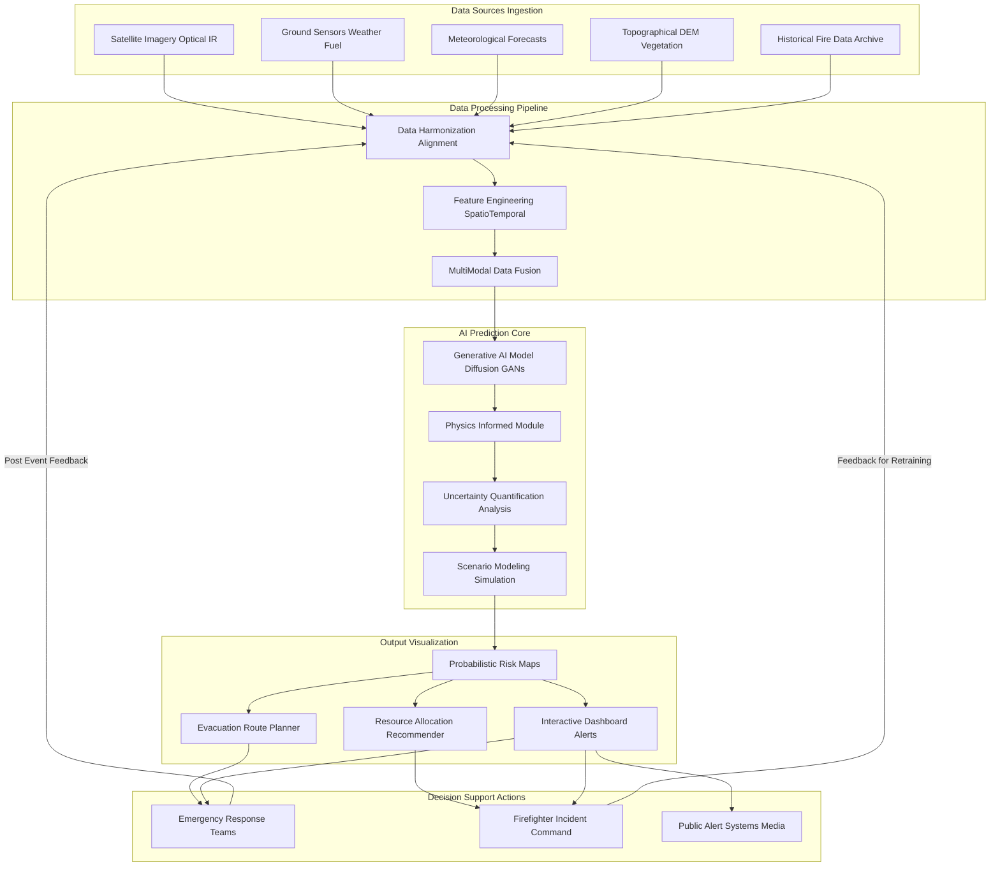
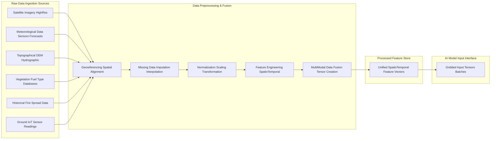
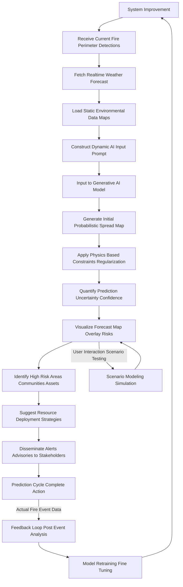

**Title of Invention:** A System and Method for AI-Powered Wildfire Behavior Prediction

**Abstract:**
A system for predicting the spread of wildfires is disclosed. The system ingests real-time data, including satellite imagery of the fire's current perimeter, topographical data, vegetation type, and meteorological data wind speed, humidity, temperature. This multi-modal data is fed to a generative AI model, which acts as an expert fire behavior analyst. The AI generates a probabilistic map forecasting the fire's likely spread over the next 12, 24, and 48 hours, allowing firefighters to more effectively allocate resources and plan evacuations. The system incorporates a continuous feedback loop for model refinement and offers advanced scenario modeling capabilities.

**Detailed Description:**

The AI-Powered Wildfire Behavior Prediction System provides a comprehensive, dynamic, and adaptive solution for forecasting wildfire spread. It integrates diverse data streams, leverages advanced generative AI, and offers actionable insights for emergency management and resource deployment.

**1. Data Acquisition and Preprocessing:**
The system continuously ingests a wide array of real-time and static environmental data crucial for accurate fire behavior modeling.
*   **Real-time Data Streams:**
    *   **Satellite Imagery:** High-resolution optical and infrared imagery provides current fire perimeter mapping, hot spot detection, and smoke plume analysis. Sources include GOES, MODIS, VIIRS, and commercial satellite constellations.
    *   **Ground Sensor Networks:** IoT sensors deployed in at-risk areas provide localized data on temperature, humidity, wind speed and direction, and soil moisture.
    *   **Meteorological Data:** Real-time and forecasted weather data from weather stations, radar, and numerical weather prediction models including wind vectors speed and direction, relative humidity, air temperature, precipitation, and atmospheric pressure.
    *   **Fire Activity Reports:** Data on fire ignition points, current containment lines, and suppression efforts from incident command systems.
*   **Static Environmental Data:**
    *   **Topographical Data:** Digital Elevation Models DEM providing detailed terrain slope, aspect, and elevation.
    *   **Vegetation Fuel Maps:** High-resolution maps classifying fuel types, fuel loads, and fuel moisture content. These are updated seasonally or annually.
    *   **Hydrographic Data:** Information on water bodies, rivers, and streams that can act as natural barriers.
    *   **Infrastructure Data:** Maps of roads, buildings, critical infrastructure, and evacuation routes.
*   **Preprocessing Pipeline:** Raw data undergoes a rigorous preprocessing pipeline including georeferencing, spatial and temporal alignment, missing data imputation, normalization, and feature engineering. Multi-modal data fusion techniques combine disparate data types into a unified spatio-temporal representation suitable for AI model input.

**2. AI Model Architecture and Prediction Generation:**
The core of the system is a specialized generative AI model designed for spatio-temporal prediction.
*   **Generative AI Model:** The model employs architectures such as Conditional Generative Adversarial Networks CGANs, Diffusion Models, or Graph Neural Networks GNNs combined with Transformer architectures. These models learn complex relationships between environmental factors and fire spread patterns from vast historical wildfire datasets. The model acts as a highly advanced expert system, interpreting inputs much like a human fire behavior analyst but at superhuman speed and scale.
*   **Physics-Informed Module:** To enhance accuracy and ensure physical plausibility, the generative AI is augmented with a physics-informed module. This module integrates established fire dynamics equations e.g., Rothermel's fire spread model or cellular automata rules as constraints or regularization terms during training, ensuring that predictions adhere to fundamental physical principles of combustion and heat transfer.
*   **Uncertainty Quantification:** The model inherently quantifies the uncertainty in its predictions, providing not just a single forecast but a probabilistic range. This is achieved through techniques like Monte Carlo dropout, ensemble modeling, or variational inference, allowing users to understand the confidence level associated with different spread scenarios.
*   **Prompting Mechanism:** The system receives current fire information and dynamically constructs a prompt for the generative AI. For example: `Given current fire perimeter at [Lat, Lon], wind at [Speed, Direction], relative humidity [Value], temperature [Value], and vegetation type [Type] in [Area], predict probabilistic fire spread over 12, 24, and 48 hours, highlighting communities and critical infrastructure at risk.`

**3. Output, Visualization, and Decision Support:**
The AI's output is transformed into actionable intelligence for various stakeholders.
*   **Probabilistic Spread Maps:** The primary output is a series of high-resolution geographical maps showing areas with different probabilities of burning over specified time horizons 12, 24, 48 hours. These maps visually represent the AI's forecast, distinguishing between high-probability, medium-probability, and low-probability spread zones.
*   **Risk Assessment Overlays:** Overlays indicate critical infrastructure, population centers, and natural resources at risk within the predicted spread zones.
*   **Evacuation Route Planning:** The system can suggest optimal evacuation routes based on predicted fire progression, road network status, and population density, ensuring safe egress for affected communities.
*   **Resource Allocation Recommendations:** Based on the predicted fire behavior and risk assessment, the system recommends optimal deployment strategies for firefighting resources, including ground crews, aerial assets, and equipment.
*   **Interactive Dashboard:** A user-friendly interactive dashboard provides real-time updates, allows for scenario testing what-if analysis, and enables incident commanders to visualize and interpret predictions effectively.
*   **Public Alert System Integration:** Forecasts and risk assessments can be directly fed into public alert systems to disseminate timely warnings and evacuation orders.

**4. Feedback and Refinement Loop:**
The system is designed for continuous learning and improvement.
*   **Post-Event Analysis:** After a fire event, actual fire spread data are collected and compared against the system's predictions.
*   **Performance Metrics:** Key performance indicators such as prediction accuracy, precision, recall, and false positive rates are calculated.
*   **Model Retraining and Fine-tuning:** Discrepancies between predicted and actual spread are used to retrain or fine-tune the generative AI model, ensuring it adapts to changing environmental conditions, new fuel types, and improved suppression techniques. This adaptive capability makes the system robust over time.

**5. Advanced Features and Capabilities:**
*   **Scenario Modeling What-If Analysis:** Incident commanders can input hypothetical changes in weather conditions e.g., sudden wind shifts or resource availability to simulate their impact on fire behavior and evaluate potential strategies.
*   **Real-time Recalibration:** As new real-time data becomes available e.g., updated wind forecasts, new fire perimeter mapping, the model can rapidly recalibrate its predictions, providing dynamic updates to the forecast.
*   **Integration with IoT and Drone Systems:** Direct integration with wildfire detection drones and ground-based IoT sensors allows for hyper-local data ingestion and immediate response to changes.
*   **Cross-Jurisdictional Data Sharing:** Facilitates secure and efficient data sharing between different emergency response agencies.

**System Architecture Overview**

**Data Flow Pipeline**

**Prediction Workflow**

**Claims:**
1.  A method for wildfire prediction, comprising:
    a.  Ingesting real-time data about a fire's location, weather, and fuel type.
    b.  Providing this data to a generative AI model.
    c.  Prompting the model to generate a forecast of the fire's probabilistic spread over defined time horizons.
2.  The method of claim 1, further comprising integrating a physics-informed module with the generative AI model to enhance prediction accuracy and physical plausibility.
3.  The method of claim 1, further comprising quantifying the uncertainty associated with the generated probabilistic spread forecast.
4.  The method of claim 1, wherein the ingested real-time data includes satellite imagery, ground sensor data, meteorological forecasts, and fire activity reports.
5.  The method of claim 1, wherein the generated forecast includes a probabilistic risk map, evacuation route recommendations, and resource allocation suggestions.
6.  The method of claim 1, further comprising a feedback loop wherein actual fire spread data is used to retrain or fine-tune the generative AI model.
7.  A system for wildfire behavior prediction, comprising:
    a.  A data ingestion module configured to acquire multi-modal real-time and static environmental data relevant to wildfire spread.
    b.  A data preprocessing and fusion module configured to prepare the ingested data for AI model input.
    c.  A generative AI core configured to receive the processed data and generate a probabilistic forecast of wildfire spread.
    d.  An output and visualization module configured to present the forecast as actionable intelligence, including probabilistic risk maps and decision support recommendations.
8.  The system of claim 7, further comprising a physics-informed AI component within the generative AI core to ensure adherence to fire dynamics principles.
9.  The system of claim 7, further comprising an uncertainty quantification module to provide confidence levels for predictions.
10. The system of claim 7, further comprising an interactive dashboard enabling scenario modeling and what-if analysis by users.
11. The system of claim 7, further comprising a feedback mechanism for continuous model improvement through post-event analysis and retraining.
12. The system of claim 7, wherein the generative AI core utilizes architectures such as Conditional Generative Adversarial Networks CGANs, Diffusion Models, or Graph Neural Networks GNNs.