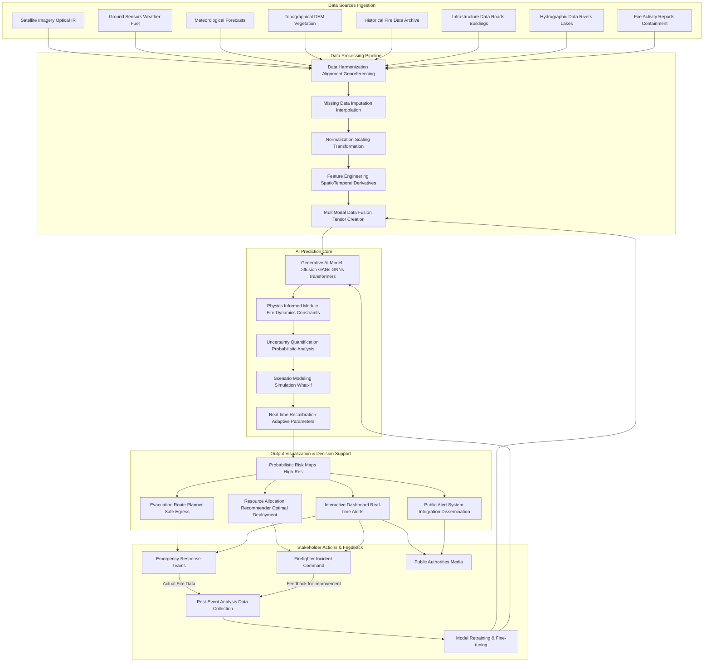
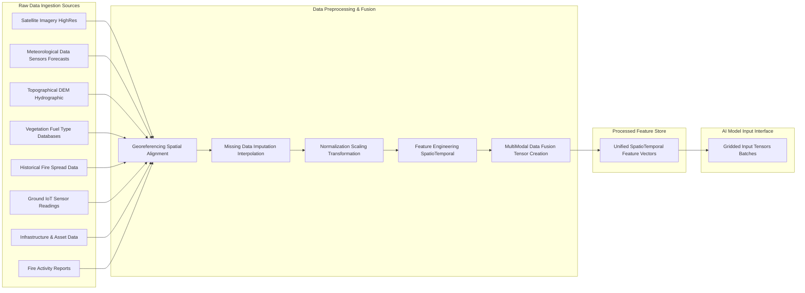
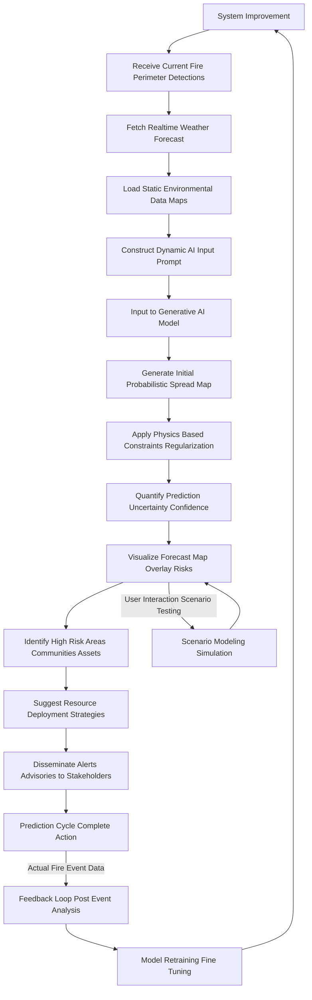

**Title of Invention:** A System and Method for AI-Powered Wildfire Behavior Prediction

**Abstract:**
A system for predicting the spread of wildfires is disclosed. The system ingests real-time multi-modal spatio-temporal data, including satellite imagery of the fire's current perimeter, topographical data, vegetation fuel characteristics, and high-resolution meteorological data (wind speed and direction, humidity, temperature, precipitation). This diverse dataset is preprocessed and fed to a sophisticated generative AI model, leveraging architectures such as Conditional Generative Adversarial Networks (CGANs), Diffusion Models, or Graph Neural Networks (GNNs) augmented with Transformer components. The AI acts as an expert fire behavior analyst, generating a probabilistic map forecasting the fire's likely spread over multiple time horizons (e.g., 12, 24, and 48 hours). The system inherently quantifies prediction uncertainty and integrates a physics-informed module to ensure physical plausibility. This allows firefighters and emergency management teams to more effectively allocate resources, plan evacuations, and develop proactive mitigation strategies. The system incorporates a continuous feedback loop for model refinement and offers advanced scenario modeling capabilities, facilitating robust decision support under dynamic wildfire conditions.

**Detailed Description:**

The AI-Powered Wildfire Behavior Prediction System provides a comprehensive, dynamic, and adaptive solution for forecasting wildfire spread. It integrates diverse data streams, leverages advanced generative AI with physics-informed constraints, quantifies prediction uncertainty, and offers actionable insights for emergency management and resource deployment. This system represents a significant leap forward in wildfire management, moving beyond static models to dynamic, adaptive, and highly accurate probabilistic forecasting.

**1. Data Acquisition and Preprocessing:**
The system continuously ingests a wide array of real-time and static environmental data crucial for accurate fire behavior modeling. The sheer volume and heterogeneity of this data necessitate robust pipelines for ingestion, harmonization, and feature engineering.

*   **Real-time Data Streams:**
    *   **Satellite Imagery:** High-resolution optical and infrared (IR) imagery (e.g., from GOES, MODIS, VIIRS, Sentinel, Landsat, and commercial constellations) provides current fire perimeter mapping, hot spot detection (radiant heat flux $Q_{rad} = \epsilon \sigma T^4$), smoke plume analysis, and active fire line identification.
        Equation 1: Normalized Difference Vegetation Index (NDVI) from satellite bands
        $NDVI = \frac{NIR - Red}{NIR + Red}$
        Equation 2: Burned Area Index (BAI) for fire severity assessment
        $BAI = \frac{(R_2 - R_3)^2}{(R_2 + R_3)^2} + (1 - R_N)^2$ where $R_2, R_3, R_N$ are specific bands.
    *   **Ground Sensor Networks:** IoT sensors deployed in at-risk areas provide localized, high-frequency data on temperature ($T$), relative humidity ($RH$), wind speed ($W_s$) and direction ($W_d$), and soil moisture ($SM$).
        Equation 3: Wind Vector Decomposition
        $W_x = W_s \cos(W_d)$
        $W_y = W_s \sin(W_d)$
    *   **Meteorological Data:** Real-time and forecasted weather data from ground stations, weather radar, and numerical weather prediction (NWP) models (e.g., GFS, WRF) including wind vectors, relative humidity, air temperature, precipitation accumulation ($P_{acc}$), and atmospheric pressure ($P_{atm}$).
        Equation 4: Mixing Ratio $r$ (mass of water vapor / mass of dry air)
        $r = \frac{0.622 \cdot e}{P_{atm} - e}$ where $e$ is vapor pressure.
        Equation 5: Dew Point Temperature $T_{dp}$
        $T_{dp} = \frac{243.04 \cdot (\ln(RH/100) + \frac{17.625 \cdot T}{243.04 + T})}{17.625 - (\ln(RH/100) + \frac{17.625 \cdot T}{243.04 + T})}$
    *   **Fire Activity Reports:** Data on fire ignition points, current containment lines, and suppression efforts from incident command systems (e.g., GPS tracks of crews, aerial retardant drops).

*   **Static Environmental Data:**
    *   **Topographical Data:** Digital Elevation Models (DEM) providing detailed terrain slope ($\theta$), aspect ($\alpha$), and elevation ($Z$).
        Equation 6: Slope calculation from DEM derivatives
        $S = \sqrt{(\frac{\partial Z}{\partial x})^2 + (\frac{\partial Z}{\partial y})^2}$
        Equation 7: Aspect calculation
        $A = \operatorname{atan2}(\frac{\partial Z}{\partial y}, -\frac{\partial Z}{\partial x})$
    *   **Vegetation Fuel Maps:** High-resolution maps classifying fuel types (e.g., FCCS, Scott and Burgan Fuel Models), fuel loads (biomass per unit area), and fuel moisture content (FMC). These are updated seasonally or annually.
        Equation 8: Fuel Moisture Content (FMC) for live fuels
        $FMC_{live} = a \cdot R_i + b$ where $R_i$ is a vegetation index.
    *   **Hydrographic Data:** Information on water bodies, rivers, and streams that can act as natural barriers.
    *   **Infrastructure Data:** Maps of roads, buildings, critical infrastructure, and evacuation routes.

*   **Preprocessing Pipeline:** Raw data undergoes a rigorous preprocessing pipeline to create a unified spatio-temporal representation.
    *   **Georeferencing and Spatial Alignment:** All data are projected to a common Coordinate Reference System (CRS) and resampled to a uniform grid resolution (e.g., 30m x 30m).
        Equation 9: Reprojection function for a point $(x,y)$
        $(x',y') = f_{proj}(x,y)$
        Equation 10: Nearest Neighbor Resampling
        $V_{grid}(i,j) = V_{raw}(\text{closest_pixel}(i,j))$
        Equation 11: Bilinear Interpolation for continuous features
        $V(x,y) = \sum_{a=0}^1 \sum_{b=0}^1 (1-a)(1-b) V(\lfloor x \rfloor+a, \lfloor y \rfloor+b)$
    *   **Temporal Synchronization and Missing Data Imputation:** Real-time streams are synchronized to common timestamps. Gaps due to sensor outages or intermittent reporting are filled using statistical or machine learning imputation techniques.
        Equation 12: Linear Interpolation for temporal gaps
        $X(t) = X(t_1) + \frac{t - t_1}{t_2 - t_1} (X(t_2) - X(t_1))$ for $t_1 \le t \le t_2$.
        Equation 13: Kalman Filter prediction step
        $\mathbf{\hat{x}}_k = \mathbf{F}_k \mathbf{\hat{x}}_{k-1} + \mathbf{B}_k \mathbf{u}_k$
    *   **Normalization and Scaling:** Feature values are normalized to a consistent range (e.g., [0,1] or Z-score) to prevent features with larger magnitudes from dominating the AI model.
        Equation 14: Min-Max Normalization
        $X_{norm} = \frac{X - X_{min}}{X_{max} - X_{min}}$
        Equation 15: Z-score Normalization
        $X_{norm} = \frac{X - \mu}{\sigma}$
    *   **Feature Engineering:** Creation of composite metrics or transformations of raw data that are more predictive of fire behavior.
        Equation 16: Effective Wind Speed accounting for canopy
        $W_{eff} = W_{obs} \cdot (1 - C_c)$ where $C_c$ is canopy cover.
        Equation 17: Fire Potential Index (FPI) combining multiple factors
        $FPI = f(W_s, RH, T, FMC, Slope)$
        Equation 18: Head Fire Intensity (HFI)
        $HFI = \frac{I_R \xi (1 + \Phi_w + \Phi_s)}{3.33}$ where $I_R$ is reaction intensity, $\xi$ propagating flux ratio, $\Phi_w$ wind factor, $\Phi_s$ slope factor.
    *   **Multi-Modal Data Fusion:** Diverse data types are combined into a unified spatio-temporal tensor representation $\mathbf{X} \in \mathbb{R}^{H \times W \times C \times T}$ where $H, W$ are spatial dimensions, $C$ is number of channels/features, and $T$ is time steps. This tensor serves as the input to the AI model.
        Equation 19: Concatenated Feature Vector for a grid cell $(x,y)$ at time $t$
        $\mathbf{f}_{x,y,t} = [\mathbf{f}_{x,y,t}^{(sat)}, \mathbf{f}_{x,y,t}^{(meteo)}, \mathbf{f}_{x,y,t}^{(topo)}, \dots]$
        Equation 20: Unified Spatio-temporal Input Tensor
        $\mathcal{D}_{input} = \text{Stack}(\{\mathbf{F}_{channel,t} \mid \text{channel} \in C, t \in T\})$

**2. AI Model Architecture and Prediction Generation:**
The core of the system is a specialized generative AI model designed for robust spatio-temporal prediction, augmented by physical principles and uncertainty quantification.

*   **Generative AI Model Deep Dive:**
    The model employs advanced architectures to learn complex non-linear relationships and generate plausible future states.
    *   **Conditional Generative Adversarial Networks (CGANs):** These consist of a Generator ($G$) and a Discriminator ($D$). $G$ learns to create realistic fire spread maps given current conditions ($\mathbf{c}$), while $D$ learns to distinguish between real and fake maps.
        Equation 21: CGAN Generator Loss function
        $L_G = \mathbb{E}_{\mathbf{z} \sim p_z(\mathbf{z}), \mathbf{c}}[\log(1 - D(G(\mathbf{z}|\mathbf{c})))]$
        Equation 22: CGAN Discriminator Loss function
        $L_D = \mathbb{E}_{\mathbf{x} \sim p_{data}(\mathbf{x}), \mathbf{c}}[\log D(\mathbf{x}|\mathbf{c})] + \mathbb{E}_{\mathbf{z} \sim p_z(\mathbf{z}), \mathbf{c}}[\log(1 - D(G(\mathbf{z}|\mathbf{c})))]$
        Equation 23: Minimax Objective of CGAN with a gradient penalty term ($L_{GP}$) for stability
        $\min_G \max_D V(D, G) = L_D + L_G + \lambda_{GP} L_{GP}$
    *   **Diffusion Models:** These models learn to reverse a gradual noisy process. A forward process progressively adds Gaussian noise to the input data $\mathbf{x}_0$ over $T$ steps, producing $\mathbf{x}_t$. The reverse process learns to denoise $\mathbf{x}_t$ back to $\mathbf{x}_0$.
        Equation 24: Forward Diffusion Process (variance schedule $\beta_t$)
        $q(\mathbf{x}_t|\mathbf{x}_{t-1}) = \mathcal{N}(\mathbf{x}_t; \sqrt{1-\beta_t}\mathbf{x}_{t-1}, \beta_t\mathbf{I})$
        Equation 25: Direct sampling from $\mathbf{x}_0$ for any $t$
        $q(\mathbf{x}_t|\mathbf{x}_0) = \mathcal{N}(\mathbf{x}_t; \sqrt{\bar{\alpha}_t}\mathbf{x}_0, (1-\bar{\alpha}_t)\mathbf{I})$ where $\bar{\alpha}_t = \prod_{s=1}^t (1-\beta_s)$
        Equation 26: Denoising objective for Diffusion models (simplified)
        $L_{DM} = \mathbb{E}_{t \sim U(1,T), \mathbf{x}_0, \mathbf{\epsilon}} [||\mathbf{\epsilon} - \mathbf{\epsilon}_\theta(\sqrt{\bar{\alpha}_t}\mathbf{x}_0 + \sqrt{1-\bar{\alpha}_t}\mathbf{\epsilon}, t, \mathbf{c})||^2]$
    *   **Graph Neural Networks (GNNs) with Transformer architectures:** Wildfire spread is a spatially explicit process that can be effectively modeled as information propagation on a graph. Grid cells become nodes, and their adjacencies (and influence factors like wind, slope) become edges. Transformers add powerful attention mechanisms to model long-range spatio-temporal dependencies.
        Equation 27: Node Feature Vector for cell $v$ at time $t$
        $\mathbf{h}_{v,t}^{(0)} = \mathbf{f}_{v,t}$ (input features)
        Equation 28: GNN Message Passing step (aggregation of neighbor information)
        $\mathbf{m}_{v}^{(k)} = \text{AGGREGATE}(\{\text{MESSAGE}(\mathbf{h}_{v,t}^{(k-1)}, \mathbf{h}_{u,t}^{(k-1)}, \mathbf{e}_{uv}) \mid u \in \mathcal{N}(v)\})$
        Equation 29: GNN Node Update step
        $\mathbf{h}_{v,t}^{(k)} = \text{UPDATE}(\mathbf{h}_{v,t}^{(k-1)}, \mathbf{m}_{v}^{(k)})$
        Equation 30: Self-Attention for Transformer Layer (Query, Key, Value matrices)
        $\text{Attention}(Q, K, V) = \text{softmax}(\frac{QK^T}{\sqrt{d_k}})V$
        Equation 31: Multi-Head Attention
        $\text{MultiHead}(Q, K, V) = \text{Concat}(\text{head}_1, \dots, \text{head}_h)\mathbf{W}^O$
        Equation 32: Spatio-temporal Transformer block combining GNNs and self-attention for cross-node and cross-time step interactions.
        $\mathbf{H}_{out} = \text{LayerNorm}(\mathbf{H}_{in} + \text{MultiHeadAttention}(\mathbf{H}_{in})) + \text{FFN}(\mathbf{H}_{in})$
    The model acts as a highly advanced expert system, interpreting inputs much like a human fire behavior analyst but at superhuman speed and scale, capable of discerning complex, non-linear relationships from vast historical wildfire datasets.

*   **Physics-Informed Module (PIM):**
    To enhance accuracy, interpretability, and ensure physical plausibility, the generative AI is augmented with a physics-informed module. This module integrates established fire dynamics equations as soft constraints or regularization terms during training, ensuring that predictions adhere to fundamental physical principles of combustion, heat transfer, and atmospheric interaction.
    Equation 33: Rate of Spread (ROS) derived from Rothermel's model (simplified for surface fires)
    $ROS = \frac{I_R \cdot \xi \cdot (1 + \Phi_w + \Phi_s)}{\rho_b \cdot \epsilon \cdot Q_{ig}}$
    Where $I_R$ is reaction intensity, $\xi$ is propagating flux ratio, $\Phi_w$ is wind factor, $\Phi_s$ is slope factor, $\rho_b$ is fuel bed bulk density, $\epsilon$ is effective heating number, $Q_{ig}$ is heat of pre-ignition.
    Equation 34: Wind factor $\Phi_w$ formulation
    $\Phi_w = C_A W^{C_B} (\beta / \beta_{op})^{-C_C} (\frac{\sigma}{\rho_b})^2$
    Equation 35: Slope factor $\Phi_s$ formulation
    $\Phi_s = (\tan\theta)^2 e^{3.5 \tan\theta}$
    Equation 36: Total Heat Flux (Fourier's Law)
    $\mathbf{q} = -k \nabla T$
    Equation 37: Conservation of Energy for a fuel parcel
    $\rho_f c_f \frac{\partial T}{\partial t} = \nabla \cdot (k \nabla T) + \dot{q}_{chem} - \dot{q}_{rad}$
    Equation 38: Physics-Informed Loss component for enforcing energy conservation
    $L_{PIM,E} = ||\frac{\partial \mathbf{P}_{burn}}{\partial t} - \nabla \cdot (D \nabla \mathbf{P}_{burn}) - S(\mathbf{X}_{env}, \mathbf{P}_{burn})||^2$
    where $D$ is a diffusion coefficient and $S$ is a source term related to combustion.
    Equation 39: Lagrangian Particle Tracking for ember transport (position $\mathbf{x}_p$, velocity $\mathbf{u}$)
    $\frac{d\mathbf{x}_p}{dt} = \mathbf{u}(\mathbf{x}_p, t) + \mathbf{u}_{turbulent}$
    Equation 40: Ember lofting and deposition probability
    $P_{dep}(r) = C \cdot \exp(-\lambda r)$
    Equation 41: Physics-based regularization for predicted Rate of Spread (ROS)
    $L_{ROS} = \lambda_{ros} \mathbb{E}_{\mathbf{x}} [||\text{ROS}_{AI}(\mathbf{x}) - \text{ROS}_{Rothermel}(\mathbf{x})||^2]$
    Equation 42: Physics-informed constraint for fire propagation direction (e.g., up-slope, down-wind)
    $L_{Direction} = \lambda_{dir} \mathbb{E}_{\mathbf{x}} [\max(0, \cos(\text{FireDir}_{AI} - \text{OptimalFireDir}) - \delta)]$

*   **Uncertainty Quantification (UQ):**
    The model inherently quantifies the uncertainty in its predictions, providing not just a single forecast but a probabilistic range. This is achieved through techniques like Monte Carlo dropout, ensemble modeling, variational inference, or quantile regression.
    Equation 43: Entropy of Prediction for cell $(i,j)$
    $H(P_{i,j}) = - P_{i,j} \log_2(P_{i,j}) - (1 - P_{i,j}) \log_2(1 - P_{i,j})$ (for binary burn probability).
    Equation 44: Predictive Variance using Monte Carlo Dropout (averaging $T$ stochastic forward passes)
    $\mathbb{E}[\mathbf{y}|\mathbf{x}, \mathcal{D}] \approx \frac{1}{T}\sum_{t=1}^T \mathbf{f}(\mathbf{x}; \hat{\mathbf{w}}_t)$
    $\text{Var}[\mathbf{y}|\mathbf{x}, \mathcal{D}] \approx \frac{1}{T}\sum_{t=1}^T (\mathbf{f}(\mathbf{x}; \hat{\mathbf{w}}_t) - \mathbb{E}[\mathbf{y}|\mathbf{x}, \mathcal{D}])^2$
    Equation 45: Ensemble uncertainty (standard deviation across $M$ ensemble members)
    $\sigma_{ensemble}(\mathbf{P}) = \sqrt{\frac{1}{M-1} \sum_{m=1}^{M} (\mathbf{P}_m - \bar{\mathbf{P}})^2}$
    Equation 46: Bayesian Neural Network (BNN) for posterior over weights $\mathbf{w}$
    $p(\mathbf{w}|\mathcal{D}) \propto p(\mathcal{D}|\mathbf{w}) p(\mathbf{w})$
    Equation 47: Predictive distribution from BNN
    $p(y^*|x^*, \mathcal{D}) = \int p(y^*|x^*, \mathbf{w}) p(\mathbf{w}|\mathcal{D}) d\mathbf{w}$
    Equation 48: Quantile Regression for predicting lower and upper bounds ($q_{low}, q_{high}$)
    $\text{minimize } \sum_i \rho_{q_{low}}(y_i - f_{q_{low}}(x_i)) + \rho_{q_{high}}(y_i - f_{q_{high}}(x_i))$ where $\rho_q(\epsilon) = \epsilon(q - \mathbb{I}_{\epsilon < 0})$.

*   **Prompting Mechanism:**
    The system receives current fire information and dynamically constructs a textual or structured data prompt for the generative AI. This allows for flexible queries and scenario testing.
    Equation 49: Structured Prompt Formulation
    $\mathcal{P} = \{\text{CurrentFirePerimeter}: [(Lat_1, Lon_1), \dots], \text{Wind}: [Speed, Direction], \text{RH}: [Value], \text{Temp}: [Value], \text{FuelType}: [Type], \text{AreaOfInterest}: [Polygon], \text{TimeHorizons}: [12h, 24h, 48h], \text{Query}: \text{ProbabilisticSpreadMap}\}$
    Equation 50: Embeddings for prompt components (e.g., using a pre-trained language model)
    $\mathbf{e}_{\mathcal{P}} = \text{Encoder}(\mathcal{P})$
    This embedding is then combined with the spatio-temporal data tensor as conditioning information for the generative models.

**3. Output, Visualization, and Decision Support:**
The AI's output is transformed into actionable intelligence for various stakeholders, presented through interactive interfaces.

*   **Probabilistic Spread Maps:**
    The primary output is a series of high-resolution geographical maps showing areas with different probabilities of burning over specified time horizons (12, 24, 48 hours). These maps visually represent the AI's forecast, distinguishing between high-probability, medium-probability, and low-probability spread zones.
    Equation 51: Probability of cell $(i,j)$ burning at time $t$
    $P_{burn}(i,j,t) \in [0,1]$
    Equation 52: Cumulative Probability of Burn for cell $(i,j)$ over time horizon $T_H$
    $P_{cum}(i,j,T_H) = 1 - \prod_{t=1}^{T_H} (1 - P_{burn}(i,j,t))$
    Equation 53: Probabilistic prediction output (e.g., using softmax over burn/no-burn classes)
    $\hat{y}_{i,j,t} = \text{softmax}(Z_{i,j,t})$

*   **Risk Assessment Overlays:**
    Overlays indicate critical infrastructure (e.g., hospitals, power grids), population centers, and natural resources (e.g., protected forests, water sources) at risk within the predicted spread zones.
    Equation 54: Risk Score for an asset $A$ in grid cell $(i,j)$
    $Risk(A, i,j,t) = P_{cum}(i,j,t) \times Value(A) \times Susceptibility(A, i,j)$
    Equation 55: Value of asset $A$ (monetary, ecological, social impact)
    $Value(A) = w_M \cdot M(A) + w_E \cdot E(A) + w_S \cdot S(A)$
    Equation 56: Total Population Exposure (for cell $(i,j)$)
    $E_{pop}(i,j,t) = P_{cum}(i,j,t) \times PopulationDensity(i,j)$

*   **Evacuation Route Planning:**
    The system can suggest optimal evacuation routes based on predicted fire progression, road network status, traffic conditions, and population density, ensuring safe egress for affected communities. This typically involves dynamic shortest path algorithms on a graph representing the road network.
    Equation 57: Travel Time Cost for road segment $(u,v)$ at time $t$
    $C_{travel}(u,v,t) = Length(u,v) / (SpeedLimit(u,v) \cdot TrafficFactor(u,v,t))$
    Equation 58: Fire Exposure Cost for segment $(u,v)$
    $C_{fire}(u,v,t) = \lambda_{fire} \cdot \sum_{(i,j) \in \text{segment}(u,v)} P_{burn}(i,j,t)$
    Equation 59: Total Cost for path $P = (v_0, v_1, \dots, v_k)$
    $Cost(P) = \sum_{l=0}^{k-1} (C_{travel}(v_l, v_{l+1}, t) + C_{fire}(v_l, v_{l+1}, t))$
    Equation 60: Optimal evacuation route $P^*$ via Dijkstra's or A* algorithm
    $P^* = \min_P Cost(P)$

*   **Resource Allocation Recommendations:**
    Based on the predicted fire behavior, risk assessment, and available resources, the system recommends optimal deployment strategies for firefighting resources (ground crews, aerial assets, equipment). This is often formulated as a spatio-temporal optimization problem.
    Equation 61: Objective Function to minimize cost and risk coverage
    $\min (\sum_{k \in K} cost_k \cdot x_k) + \lambda_{risk} \cdot (\sum_{(i,j) \in \mathcal{R}} Risk_{uncovered}(i,j))$
    Where $x_k=1$ if resource $k$ is deployed, $K$ is set of resources, $\mathcal{R}$ is high-risk region.
    Equation 62: Constraint: Resource capacity
    $\sum_{k \in \text{Type}_T} x_k \le Capacity_T$
    Equation 63: Constraint: Cover all critical assets ($A_c$) within threat window
    $\forall A_c: \sum_{k \in \text{resources capable of protecting } A_c} x_k \ge 1$
    Equation 64: Resource Effectiveness for fireline construction (length per hour)
    $R_{fireline} = f(\text{Fuel Type}, \text{Slope}, \text{Crew Type}, \text{Equipment})$
    Equation 65: Estimated Area Protected by Resource $k$
    $AreaProtected_k = \text{ROS}_{\text{current}} \times \text{Time}_{deployment} \times \text{Width}_{containment} \times \text{Efficiency}_k$

*   **Interactive Dashboard:**
    A user-friendly interactive dashboard provides real-time updates, allows for scenario testing ("what-if" analysis), and enables incident commanders to visualize and interpret predictions effectively. This includes map-based visualizations, time-series graphs of key metrics, and configurable alert thresholds.

*   **Public Alert System Integration:**
    Forecasts and risk assessments can be directly fed into public alert systems (e.g., sirens, SMS, emergency broadcasts) to disseminate timely warnings, evacuation orders, and safety advisories to affected populations.

**4. Feedback and Refinement Loop:**
The system is designed for continuous learning and improvement, adapting to new data, changing environmental conditions, and evolving fire suppression techniques.

*   **Post-Event Analysis:**
    After a fire event (or specific forecast period), actual fire spread data (e.g., satellite-derived burn scar maps, ground surveys) are collected and meticulously compared against the system's predictions.
    Equation 66: Actual Burn Area $\mathcal{A}_{actual}$
    Equation 67: Predicted Burn Area $\mathcal{A}_{predicted}$

*   **Performance Metrics:**
    Key performance indicators (KPIs) are calculated to evaluate model accuracy and utility.
    Equation 68: Intersection over Union (IoU) for spatio-temporal segmentation
    $IoU = \frac{|\mathcal{A}_{predicted} \cap \mathcal{A}_{actual}|}{|\mathcal{A}_{predicted} \cup \mathcal{A}_{actual}|}$
    Equation 69: Dice Coefficient (F1-score for spatial data)
    $Dice = \frac{2 \cdot |\mathcal{A}_{predicted} \cap \mathcal{A}_{actual}|}{|\mathcal{A}_{predicted}| + |\mathcal{A}_{actual}|}$
    Equation 70: Overall Accuracy (Pixel-wise classification)
    $Accuracy = \frac{TP + TN}{TP + TN + FP + FN}$
    Equation 71: Precision (Positive Predictive Value)
    $Precision = \frac{TP}{TP + FP}$
    Equation 72: Recall (Sensitivity or True Positive Rate)
    $Recall = \frac{TP}{TP + FN}$
    Equation 73: F1-Score (harmonic mean of Precision and Recall)
    $F1 = 2 \cdot \frac{Precision \cdot Recall}{Precision + Recall}$
    Equation 74: Mean Absolute Error (MAE) for probabilistic predictions
    $MAE = \frac{1}{N} \sum_{k=1}^N |P_{predicted,k} - P_{actual,k}|$
    Equation 75: Root Mean Squared Error (RMSE)
    $RMSE = \sqrt{\frac{1}{N} \sum_{k=1}^N (P_{predicted,k} - P_{actual,k})^2}$
    Equation 76: Brier Score (for probabilistic forecasts)
    $BS = \frac{1}{N} \sum_{k=1}^N (P_{predicted,k} - O_k)^2$ where $O_k$ is observed outcome (0 or 1).

*   **Model Retraining and Fine-tuning:**
    Discrepancies and errors identified through post-event analysis (e.g., false positives, false negatives, under-prediction of spread) are used to generate new training examples or loss signals. This data is incorporated to retrain or fine-tune the generative AI model.
    Equation 77: Total Loss Function for Retraining
    $L_{Total} = L_{Generative} + L_{Physics} + L_{Uncertainty} + L_{Performance}$
    Equation 78: Gradient Descent Update Rule for model parameters $\theta$
    $\theta_{new} = \theta_{old} - \eta \nabla_\theta L_{Total}$ where $\eta$ is the learning rate.
    Equation 79: Adam Optimizer Update for parameter $\theta_j$ (using moments $m_j, v_j$)
    $\theta_j \leftarrow \theta_j - \eta \frac{\hat{m}_j}{\sqrt{\hat{v}_j} + \epsilon}$
    This adaptive capability makes the system robust over time, allowing it to adapt to changing climate patterns, new fuel types, altered landscapes, and improved suppression techniques.

**5. Advanced Features and Capabilities:**

*   **Scenario Modeling (What-If Analysis):**
    Incident commanders can input hypothetical changes in critical environmental conditions (e.g., sudden wind shifts, sustained drought conditions, increased humidity) or resource availability (e.g., deployment of additional air tankers) to simulate their impact on fire behavior.
    Equation 80: Perturbed Input Vector for scenario $s$
    $\mathbf{X}^{(s)}_{env} = \mathbf{X}_{env} + \Delta \mathbf{X}^{(s)}_{env}$
    Equation 81: Predicted Probabilistic Spread Map for scenario $s$
    $\mathbf{P}_{spread}^{(s)} = \text{AI\_Model}(\mathbf{X}^{(s)}_{env}, \text{CurrentFireState})$
    Equation 82: Risk reduction from intervention $I$ in scenario $s$
    $\Delta Risk_s(I) = Risk_{baseline,s} - Risk_{after\_I,s}$
    Equation 83: Cost-Benefit Analysis for intervention $I$
    $CBA(I) = \text{Expected Value of } (\Delta Risk_s(I)) - \text{Cost}(I)$

*   **Real-time Recalibration:**
    As new real-time data becomes available (e.g., updated wind forecasts, new satellite-derived fire perimeter mapping, hot spot detections from drones), the model can rapidly recalibrate its predictions. This provides dynamic, near-instantaneous updates to the forecast, crucial during fast-moving wildfire events.
    Equation 84: Online Learning Update for model parameters $\theta$
    $\theta_t = \theta_{t-1} - \eta_t \nabla L(\theta_{t-1}, \text{new\_data}_t)$
    Equation 85: Ensemble Averaging with dynamically weighted models
    $\mathbf{P}_{final} = \sum_{k=1}^M w_k \mathbf{P}_k$ where $w_k$ are weights based on recent performance.
    Equation 86: Bayesian Update of model probabilities given new evidence $E$
    $P(\text{Model}_i | E) \propto P(E | \text{Model}_i) P(\text{Model}_i)$
    Equation 87: Data Assimilation for merging observed perimeter with model forecast
    $\mathbf{P}_{fused} = \alpha \mathbf{P}_{observed} + (1-\alpha) \mathbf{P}_{forecast}$ where $\alpha$ depends on data confidence.

*   **Integration with IoT and Drone Systems:**
    Direct, API-driven integration with wildfire detection drones and ground-based IoT sensors allows for hyper-local data ingestion, providing unprecedented detail and immediate response to changes in fire behavior or environmental conditions.
    Equation 88: Data acquisition rate from drone fleet ($N$ drones)
    $R_{data} = N \times (R_{camera} + R_{Lidar} + R_{thermal})$
    Equation 89: Latency for end-to-end data pipeline
    $L_{total} = L_{sensor} + L_{transmission} + L_{processing} + L_{AI\_inference}$
    Equation 90: Optimal drone path planning for coverage and data freshness
    $\min_{Path} \sum_{(i,j) \in Path} (Time(i,j) + \lambda_{freshness} \cdot AgeOfData(i,j))$

*   **Cross-Jurisdictional Data Sharing:**
    Facilitates secure and efficient data sharing between different emergency response agencies (local, state, federal, international), enhancing coordinated response efforts. This involves secure APIs, standardized data formats, and access control mechanisms.
    Equation 91: Data Encryption (e.g., AES-256)
    $C = E_K(P)$ where $C$ is ciphertext, $P$ is plaintext, $K$ is key.
    Equation 92: Hash-based Message Authentication Code (HMAC) for data integrity and authenticity
    $H = \text{HMAC}_{Key}(Data)$
    Equation 93: Role-Based Access Control (RBAC) authorization matrix
    $Access(User, Resource) = \{ \text{Read, Write, Execute, Deny} \}$

*   **Proactive Mitigation Planning:**
    Beyond immediate response, the system aids in long-term wildfire risk reduction by identifying vulnerable areas and optimizing fuel treatment strategies.
    Equation 94: Expected Fire Occurrence for a region
    $E_{occur} = P(\text{Ignition}) \times P(\text{Spread beyond control})$
    Equation 95: Fuel Treatment Effectiveness (reduction in ROS or intensity)
    $FTE = \frac{ROS_{untreated} - ROS_{treated}}{ROS_{untreated}}$
    Equation 96: Optimal Fuel Treatment Schedule (dynamic programming)
    $\max_{\text{Schedule}} \sum_{t=0}^T \text{Benefit}(t, \text{Treatment}(t)) - \text{Cost}(t, \text{Treatment}(t))$

*   **Hydrological Impact Modeling:**
    Predicting not only fire spread but also potential post-fire hydrological impacts like increased runoff and debris flows.
    Equation 97: Runoff Coefficient change post-fire
    $C_{postfire} = C_{prefire} + \Delta C(BurnSeverity, SoilType)$
    Equation 98: Debris Flow Susceptibility Index (DFSI)
    $DFSI = f(\text{BurnSeverity, Slope, SoilMoisture, RainfallIntensity})$

*   **Smoke Dispersion Forecasting:**
    Integrated plume modeling to predict smoke dispersion and air quality impacts.
    Equation 99: Gaussian Plume Model for concentration $C$ at $(x,y,z)$
    $C(x,y,z) = \frac{Q}{2\pi \sigma_y \sigma_z u} \exp(-\frac{y^2}{2\sigma_y^2}) [\exp(-\frac{(z-H)^2}{2\sigma_z^2}) + \exp(-\frac{(z+H)^2}{2\sigma_z^2})]$
    Where $Q$ is emission rate, $u$ wind speed, $\sigma_y, \sigma_z$ dispersion parameters, $H$ effective stack height.
    Equation 100: Health Impact Score from Smoke Exposure
    $HIS = f(\text{PM2.5 Concentration, Population Density, Exposure Duration})$

**System Architecture Overview**



**Data Flow Pipeline**



**Prediction Workflow**



**Generative AI Core Architecture (Diffusion Model Example)**
```mermaid
graph TD
    A[Raw Input Data Tensor <br/> (Spatio-temporal Features)] --> B{Time Embedding t}
    Z[Noise Vector z] --> C{Conditional Input c <br/> (Fire Perimeter, Weather, etc.)}
    B --> D[U-Net Denoising Network <br/> (with Attention)]
    C --> D
    D --> E[Predicted Noise εθ(xt, t, c)]
    E --> F[Reverse Diffusion Process <br/> (Iterative Denoising)]
    F --> G[Probabilistic Fire Spread Map <br/> (12h, 24h, 48h)]
```

**Physics-Informed Module Integration**
```mermaid
graph TD
    A[Generative AI Output <br/> (Initial Spread Map P_pred)] --> B{Physics-Based Fire <br/> Dynamics Model <br/> (e.g., Rothermel, CA)}
    C[Environmental Data <br/> (Fuel, Topo, Wind)] --> B
    B --> D[Physics-Compliant <br/> Spread Map P_phys]
    D --> E{Comparison / <br/> Discrepancy Calculation}
    A --> E
    E --> F[Physics-Informed <br/> Loss (L_PIM)]
    F --> G[AI Model Training / <br/> Fine-tuning]
    G --> A
    H[AI Model Training Data] --> G
```

**Uncertainty Quantification Flow**
```mermaid
graph TD
    A[Generative AI Model <br/> (Trained)] --> B{Multiple Forward Passes <br/> (e.g., Monte Carlo Dropout)}
    B --> C[Ensemble of Predictions <br/> {P1, P2, ..., Pm}]
    C --> D[Calculate Statistical <br/> Metrics <br/> (Mean, Variance, Entropy)]
    D --> E[Probabilistic Spread Map <br/> with Confidence Intervals]
    E --> F[Risk Analyst / Decision Maker <br/> (Risk-averse Planning)]
```

**Feedback Loop Detailed Process**
```mermaid
graph TD
    A[AI Prediction Output <br/> (Forecasted Spread)] --> B[Real-time Monitoring <br/> (Actual Fire Spread)]
    B --> C{Comparison Engine <br/> (Metrics Calculation)}
    C --> D[Performance Report <br/> (IoU, F1, MAE, etc.)]
    D --> E{Discrepancy Analysis <br/> (Identify Prediction Gaps)}
    E --> F[New Labeled Data <br/> (Actual Fire Perimeter)]
    F --> G[Model Retraining / Fine-tuning <br/> (Adaptive Learning)]
    G --> H[Updated AI Model <br/> (Improved Performance)]
    H --> A
    E --> I[Data Quality Assessment]
    I --> J[Data Acquisition / Preprocessing <br/> Refinement]
    J --> H
```

**Resource Allocation Optimization Flow**
```mermaid
graph TD
    A[Probabilistic Spread Map <br/> (High Risk Zones)] --> B[Identify Assets at Risk <br/> (Infrastructure, Communities)]
    C[Available Resources <br/> (Crews, Aircraft, Equipment)] --> D{Optimization Engine <br/> (Linear Programming, Heuristics)}
    E[Operational Constraints <br/> (Budget, Personnel, Time)] --> D
    D --> F[Optimal Resource Deployment <br/> Plan]
    F --> G[Incident Command <br/> (Execution)]
    G --> H[Dynamic Resource <br/> Tracking]
    H --> A
```

**Real-time Recalibration Mechanism**
```mermaid
graph TD
    A[Ongoing AI Prediction Cycle] --> B[New Real-time Data Ingestion <br/> (e.g., Updated Wind, New Hotspots)]
    B --> C{Data Assimilation Module <br/> (Spatio-temporal Alignment)}
    C --> D[Partial Model Retraining / <br/> Weight Adjustment <br/> (Online Learning)]
    C --> E[Ensemble Weighting Update <br/> (Bayesian Averaging)]
    D --> F[Recalibrated AI Model]
    E --> F
    F --> G[Updated Probabilistic <br/> Spread Map]
    G --> A
```

**Data Preprocessing Sub-modules**
```mermaid
graph LR
    subgraph Raw Data Streams
        A[Satellite Imagery]
        B[Meteorological Data]
        C[Ground Sensors]
        D[Topographical Data]
        E[Vegetation Fuel Data]
    end

    subgraph Core Preprocessing Steps
        P1[Georeferencing & <br/> Projection Alignment]
        P2[Spatial Resampling & <br/> Temporal Synchronization]
        P3[Missing Data Imputation <br/> & Outlier Handling]
        P4[Normalization & <br/> Scaling]
        P5[Feature Engineering <br/> (Derived Metrics)]
    end

    subgraph Data Fusion & Finalization
        F1[Multi-Modal Data Fusion <br/> (Tensor Creation)]
        F2[Feature Store Update]
    end

    A --> P1
    B --> P1
    C --> P1
    D --> P1
    E --> P1

    P1 --> P2
    P2 --> P3
    P3 --> P4
    P4 --> P5

    P5 --> F1
    F1 --> F2
```

**Claims:**
1.  A method for wildfire prediction, comprising: ingesting multi-modal spatio-temporal environmental and fire activity data; preprocessing and fusing said data into a unified representation; feeding the representation to a generative AI model; and prompting the model to generate a probabilistic forecast of wildfire spread over defined time horizons.
2.  The method of claim 1, further characterized by the integration of a physics-informed module with the generative AI model, utilizing fire dynamics equations as constraints or regularization terms.
3.  The method of claim 1, further comprising quantifying prediction uncertainty using statistical or ensemble techniques to provide confidence levels for forecast scenarios.
4.  The method of claim 1, wherein the ingested data includes satellite imagery, ground sensor data, meteorological forecasts, topographical data, vegetation maps, and historical fire activity reports.
5.  The method of claim 1, wherein the generated forecast includes high-resolution probabilistic spread maps, risk assessments for critical infrastructure, and recommendations for evacuation routes and resource allocation.
6.  The method of claim 1, further comprising a continuous feedback loop that compares actual fire spread against predictions to facilitate model retraining and fine-tuning.
7.  A system for wildfire behavior prediction, comprising: a data acquisition and preprocessing pipeline; a generative AI core, leveraging architectures such as Conditional Generative Adversarial Networks (CGANs), Diffusion Models, or Graph Neural Networks (GNNs) with Transformer components; and an output and decision support module.
8.  The system of claim 7, wherein the generative AI core integrates a physics-informed module to incorporate fundamental fire dynamics principles.
9.  The system of claim 7, further comprising an uncertainty quantification module to provide confidence intervals for probabilistic wildfire spread predictions.
10. The system of claim 7, further comprising an interactive dashboard enabling real-time visualization, scenario modeling, and what-if analysis based on dynamic environmental parameters or resource availability.