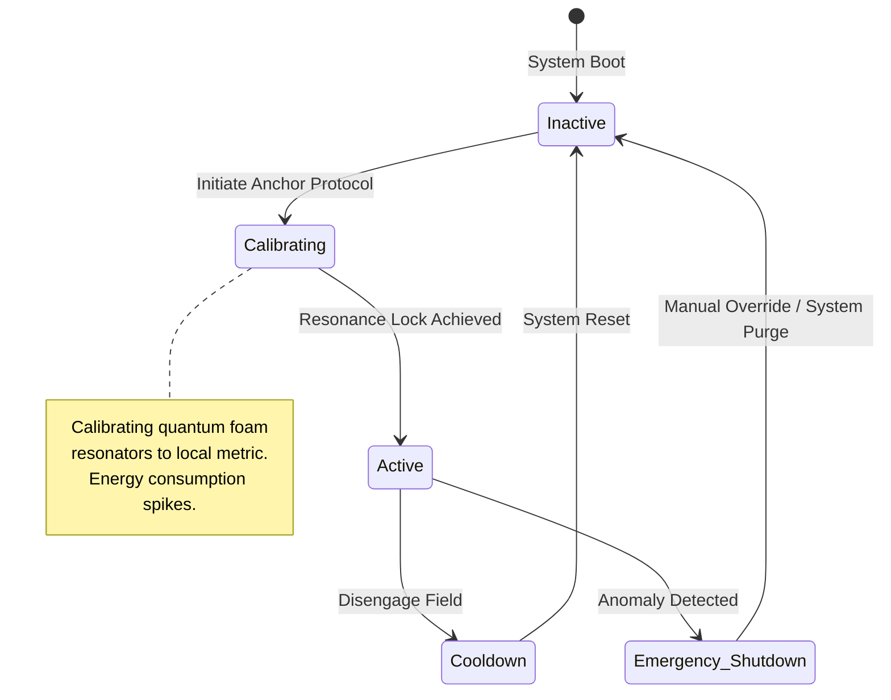
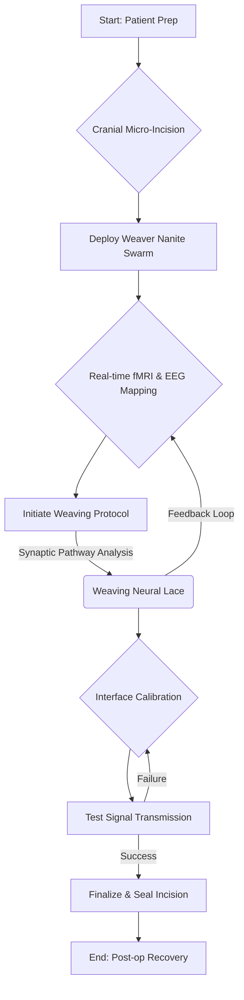
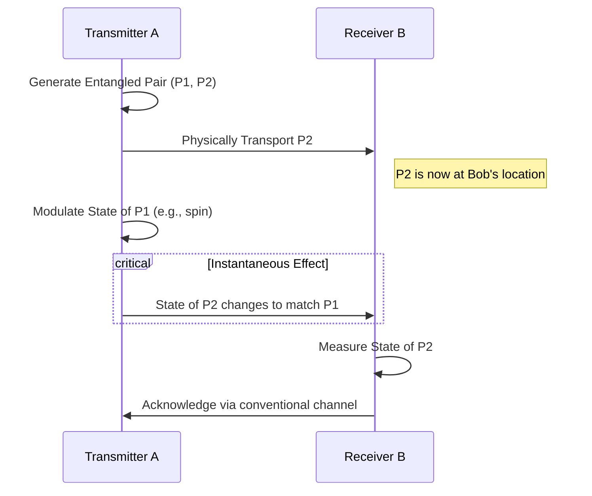
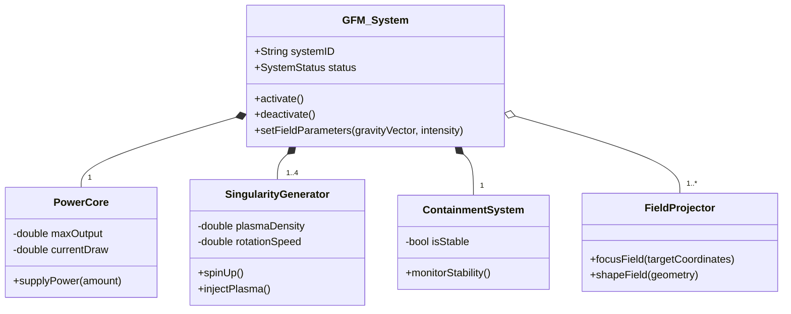
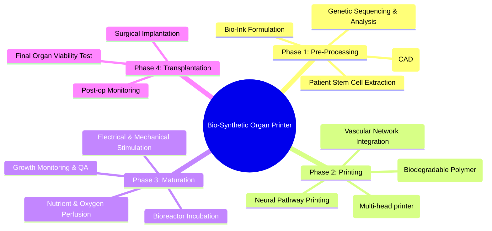
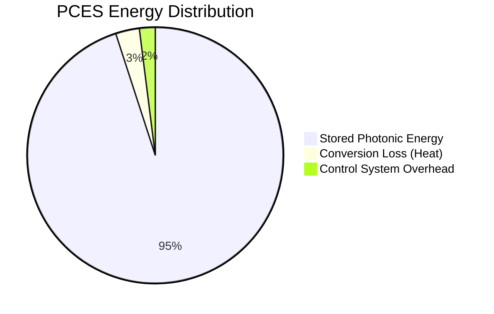
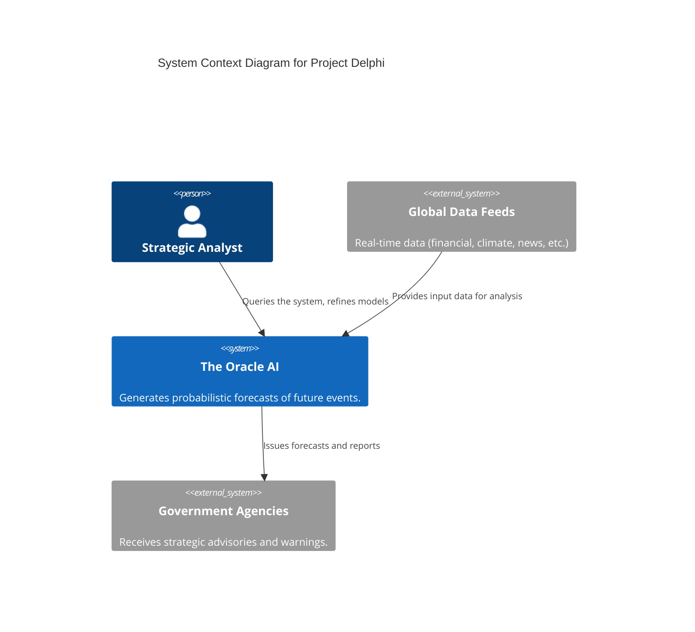
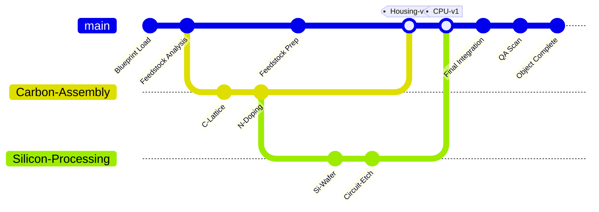

```mermaid
gantt
    title Moisture Harvester Operational Cycle
    dateFormat  HH:mm
    axisFormat  %H:%M
    section Pre-dawn Cycle
    Hygroscopic Brine Saturation :active, 00:00, 4h
    section Daytime Cycle
    Solar Power Generation     :active, 06:00, 12h
    Thermoelectric Cooling     :active, 08:00, 10h
    Air Intake & Filtration    :08:00, 10h
    section Condensation Phase
    Water Condensation on Mesh :10:00, 8h
    Collection & Purification  :11:00, 8h
    section Night Cycle
    System Purge & Maintenance :22:00, 2h
```

# The Creator's Codex: A Compendium of Inventions

Welcome to The Creator's Codex, a classified repository detailing paradigm-shifting inventions that have the potential to reshape civilization. This document serves as a high-level overview, a blueprint of thought, and a record of the theoretical underpinnings for technologies that blur the line between science and magic. Each entry in this compendium includes a conceptual abstract, an operational diagram, foundational claims, the governing mathematical principles, and a discussion on its potential impact and the ethical quandaries it presents.

This is not merely a list of ideas; it is a glimpse into the future we could build. Proceed with caution, for the knowledge contained herein is powerful, and its application will define the destiny of our species.

---
---

## Invention 1: The Chronospatial Anchor

### Abstract

The Chronospatial Anchor is a device engineered to isolate and stabilize a finite volume of spacetime. By generating a high-frequency quantum foam resonance field, it effectively locks the local spacetime metric, rendering the enclosed area immune to external temporal paradoxes, gravitational anomalies, and spatial distortions. Its primary function is to create a safe harbor in the turbulent currents of spacetime, enabling stable wormhole transit and research into exotic physics without risk of temporal contamination.

### Operational Diagram

### Core Claims

**Claim 1:** A system for the stabilization of a localized spacetime manifold, said system comprising: a set of quantum foam resonators for generating a coherent spacetime resonance; a central processing unit for modulating the frequency and amplitude of said resonance to match the target manifold's metric signature; a power core capable of supplying the requisite energy densities to overcome local quantum fluctuations; and a containment field to define the boundary of the stabilized region, thereby creating a volume impervious to external temporal and spatial flux.

### Technical Specifications and Mathematical Foundations

The operation of the Chronospatial Anchor is rooted in advanced principles of general relativity and quantum field theory. The core mechanism manipulates the very fabric of spacetime as described by Einstein's field equations.

1.  The foundational equation is the Einstein Field Equation, which relates the geometry of spacetime to the distribution of matter and energy within it. The Anchor actively modifies the stress-energy tensor $T_{\mu\nu}$ locally.
    $$G_{\mu\nu} + \Lambda g_{\mu\nu} = \frac{8\pi G}{c^4} T_{\mu\nu}$$

2.  Within the anchor's field, the spacetime metric is forced to conform to a stable, predictable form, often a localized version of the Schwarzschild metric, effectively creating a "flat" region.
    $$ds^2 = -\left(1-\frac{2GM}{rc^2}\right)c^2dt^2 + \left(1-\frac{2GM}{rc^2}\right)^{-1}dr^2 + r^2(d\theta^2 + \sin^2\theta d\phi^2)$$

3.  The Anchor Field's wave function, $\mathcal{A}_{\phi}$, is generated by integrating the quantum state over the target volume.
    $$\mathcal{A}_{\phi} = \int \Psi(x,t) e^{-i(kx-\omega t)} dx$$

4.  The energy required to sustain the anchor field is immense, scaling with the volume of space-time ($V_{space}$) and the duration of the lock ($T_{duration}$).
    $$E_{anchor} = \frac{V_{space} \cdot T_{duration}}{\eta_{quantum}}$$

5.  The device prevents temporal dilation effects within its field, ensuring that the rate of time passage inside matches a baseline reference, nullifying relativistic effects.
    $$\Delta t' = \Delta t \sqrt{1 - \frac{v^2}{c^2}} \rightarrow \Delta t' = \Delta t$$

6.  The Spacetime Curvature Tensor, $R_{\mu\nu}$, is actively dampened to near zero inside the stabilized zone.
    $$R_{\mu\nu} - \frac{1}{2}Rg_{\mu\nu} \approx 0$$

7.  The device works by resonating with the quantum foam, the background energy of the universe, which has a theoretical density $\rho_{QF}$.
    $$\rho_{QF} = \frac{\hbar c}{l_P^4}$$

8.  By stabilizing spacetime, the Anchor can also suppress the formation of virtual particles and Hawking radiation at event horizons within its field.
    $$T_H = \frac{\hbar c^3}{8\pi G M k_B} \rightarrow 0$$

9.  The precision of the anchor is fundamentally limited by the Heisenberg Uncertainty Principle, creating a small but non-zero jitter in the field's boundary.
    $$\Delta E \Delta t \ge \frac{\hbar}{2}$$

10. When deactivated, the anchor field decays exponentially, allowing the local spacetime to smoothly reintegrate with the surrounding universe.
    $$F(t) = F_0 e^{-\lambda t}$$

### Applications and Societal Impact

The immediate application is in deep space exploration, providing stable reference points for FTL travel and study of black holes. In the long term, it could be used to shield colonies from cosmic dangers or even as a tool for fundamental physics research, allowing scientists to "pause" a reaction to study it in unprecedented detail.

### Ethical Considerations

The ability to manipulate spacetime, even locally, is a monumental power. A malfunctioning anchor could potentially create a contained universe or a catastrophic spacetime tear. Its use as a weapon, creating inescapable "prisons" of frozen time, is a terrifying possibility that must be regulated with extreme prejudice.

---
---

## Invention 2: The Neural Lace Weaver

### Abstract

The Neural Lace Weaver is a revolutionary biomedical device that performs automated, microscopic implantation of a flexible, conductive, and biocompatible mesh atop the cerebral cortex. This "neural lace" serves as a high-bandwidth, bidirectional brain-computer interface (BCI). The weaver nanobots, guided by real-time neural imaging, delicately weave the lace through the cortical layers, creating a seamless connection between biological neurons and an external digital processor, enabling thought-based communication, augmented reality overlays, and skill downloads.

### Operational Diagram

### Core Claims

**Claim 2:** A method for creating a neural interface, the method comprising: deploying a swarm of autonomous nanorobots into the cerebral cortex of a subject; instructing said nanorobots to perform a real-time scan of neural activity to map key functional areas; autonomously weaving a conductive, biocompatible polymer lace conforming to the cortical surface based on the generated map; and establishing a wireless data link between the woven lace and an external computational device, thereby facilitating direct neural data exchange.

### Technical Specifications and Mathematical Foundations

The weaver's success depends on the precise application of neuroscience, signal processing, and nanotechnology.

11. The core of the interface is modeling and interpreting the action potentials of neurons, governed by complex models like the Hodgkin-Huxley equation.
    $$I = C_m \frac{dV}{dt} + \bar{g}_K n^4(V-V_K) + \bar{g}_{Na} m^3h(V-V_{Na}) + \bar{g}_l(V-V_l)$$

12. A key challenge is achieving a high signal-to-noise ratio (SNR) to distinguish meaningful neural signals from background noise.
    $$SNR = 10 \log_{10} \left( \frac{P_{signal}}{P_{noise}} \right)$$

13. The weaver uses Fourier Transforms on real-time EEG data to identify brainwave frequencies associated with specific cognitive functions, guiding the weaving process.
    $$X(f) = \int_{-\infty}^{\infty} x(t) e^{-i2\pi ft} dt$$

14. The lace material's biocompatibility is quantified by an index that measures the host's immune response over time.
    $$B_i = \frac{1}{N}\sum_{i=1}^N (1 - R_i)$$

15. The theoretical maximum data transfer rate of the neural lace is determined by the Shannon-Hartley theorem, where W is the bandwidth of the neural signals.
    $$C = W \log_2(1 + SNR)$$

16. The complexity and richness of thought are quantified using the information entropy of the neural signal patterns.
    $$H(X) = -\sum_{i} p(x_i) \log_2 p(x_i)$$

17. The lace facilitates learning by reinforcing synaptic connections according to Hebbian principles, where the connection strength $\Delta w_{ij}$ is proportional to the correlation of neuron firing.
    $$\Delta w_{ij} = \eta a_i a_j$$

18. The pathfinding for the weaver nanites is an optimization problem, akin to the Traveling Salesman Problem, minimizing tissue displacement.
    $$\min \sum_{i=1}^{n-1} d(p_i, p_{i+1})$$

19. The power required by the lace is minimal, drawn wirelessly and managed to prevent any thermal damage to neural tissue.
    $$P_{lace} = I_{signal}^2 \cdot R_{neuro}$$

20. The physical integrity of the lace polymer is critical, requiring high tensile strength $\sigma$ to withstand the brain's natural movements.
    $$\sigma = \frac{F}{A}$$

### Applications and Societal Impact

The Neural Lace could eradicate disabilities like paralysis and blindness. It promises a new era of human cognition, creativity, and communication. Education could be revolutionized, with skills and knowledge transferred directly. However, it would also create a profound divide between the "enhanced" and the "natural," potentially leading to a new form of class struggle.

### Ethical Considerations

The risk of brain hacking is paramount. A compromised neural lace could lead to manipulation of thoughts, memories, and actions. The nature of identity and free will is called into question when one's mind is connected to a network. Furthermore, ensuring equitable access would be a monumental societal challenge.

---
---

## Invention 3: The Quantum Entanglement Communicator (QEC)

### Abstract

The Quantum Entanglement Communicator (QEC) is a device that enables instantaneous, unhackable communication across any distance. By generating and maintaining stable pairs of entangled quantum particles, the QEC can transmit information by measuring the state of one particle, which instantly influences the state of its counterpart, regardless of separation. This technology bypasses the light-speed limit for communication, heralding a new age for interstellar connectivity and secure data transfer.

### Operational Diagram

### Core Claims

**Claim 3:** An apparatus for information transmission, said apparatus comprising: a quantum particle generator for creating pairs of entangled particles; a separation mechanism to transport one particle of each pair to a destination receiver while maintaining entanglement; a modulation system at the transmitter to manipulate the quantum state of the local particles; and a synchronized detection system at the receiver to measure the corresponding state changes in the remote particles, thereby decoding the transmitted information instantaneously.

### Technical Specifications and Mathematical Foundations

The QEC leverages the non-intuitive principles of quantum mechanics, particularly the phenomenon of entanglement.

21. The state of an entangled pair cannot be described independently. It exists in a superposition, described by a Bell state vector, such as:
    $$|\Phi^+\rangle = \frac{1}{\sqrt{2}} (|00\rangle + |11\rangle)$$

22. The evolution of the quantum state over time is governed by the Schrödinger equation.
    $$i\hbar\frac{\partial}{\partial t}|\psi(t)\rangle = \hat{H}|\psi(t)\rangle$$

23. The density matrix $\rho$ is used to describe the statistical state of the quantum system, which is crucial for handling decoherence.
    $$\rho = \sum_i p_i |\psi_i\rangle\langle\psi_i|$$

24. Decoherence, the loss of entanglement due to interaction with the environment, is the primary engineering challenge. The rate of decoherence can be modeled as:
    $$\Gamma_{deco} = \gamma(E) T$$

25. To transmit information, an operator (e.g., a Pauli matrix $\sigma_x$) is applied to the local particle, changing the state of the system.
    $$\sigma_x |0\rangle = |1\rangle; \quad \sigma_x |1\rangle = |0\rangle$$

26. The fidelity of the quantum state transfer is a measure of its accuracy, comparing the initial state $\rho_{in}$ with the final state $\rho_{out}$.
    $$F(\rho_{in}, \rho_{out}) = \left(\text{Tr}\sqrt{\sqrt{\rho_{in}}\rho_{out}\sqrt{\rho_{in}}}\right)^2$$

27. The quantum channel capacity, which defines the upper limit for secure communication, is given by the Holevo bound.
    $$\chi = S(\rho) - \sum_i p_i S(\rho_i)$$

28. The generation of entangled photon pairs often relies on Spontaneous Parametric Down-Conversion (SPDC). The efficiency $\eta_{SPDC}$ is a key parameter.
    $$\eta_{SPDC} = \frac{N_{pairs}}{N_{photons}}$$

29. The Bell's inequality test is used to experimentally verify that the observed correlations are stronger than allowed by classical physics, proving entanglement.
    $$|P(a,b) - P(a,c)| \le 1 + P(b,c)$$

30. The system relies on precise timing and synchronization, which must still account for relativistic effects between transmitter and receiver, even if the communication itself is instant.
    $$t' = \gamma (t - \frac{vx}{c^2})$$

### Applications and Societal Impact

The QEC would revolutionize global and interplanetary networks, eliminating latency. Financial markets, military command, and distributed computing would operate in perfect synchrony. It would form the backbone of an unhackable "quantum internet."

### Ethical Considerations

While the communication itself is secure, the "no-cloning theorem" prevents simple eavesdropping but does not prevent denial-of-service attacks (breaking entanglement). The concentration of power in entities that control QEC networks is a major concern. The complete disruption of existing cryptography and communication industries would cause massive economic upheaval.

---
---

## Invention 4: The Gravitic Field Modulator

### Abstract

The Gravitic Field Modulator (GFM) is a device capable of generating localized, controllable distortions in the gravitational field. By creating highly energetic, rotating micro-singularities within a containment vessel, the GFM can produce fields of intense positive or negative gravity. This allows for reactionless propulsion, artificial gravity generation on spacecraft, and heavy-lifting capabilities that defy conventional physics.

### Operational Diagram

### Core Claims

**Claim 4:** A device for the manipulation of a gravitational field, said device comprising: one or more singularity generators for producing transient, high-density energy states; a magnetic containment system to stabilize said energy states; a power system to fuel the generation and containment process; and a set of field emitters that direct and shape the resulting gravitational distortion into a usable, localized field of positive or negative gravitational force.

### Technical Specifications and Mathematical Foundations

The GFM's operation is a feat of applied general relativity and high-energy physics.

31. The foundational principle is Newton's law of universal gravitation, which the device manipulates on a local scale.
    $$F = G \frac{m_1 m_2}{r^2}$$

32. The concept draws inspiration from theoretical constructs like the Alcubierre drive metric, which involves shaping spacetime to move a region faster than light.
    $$ds^2 = -c^2 dt^2 + (dx - v_s f(r_s) dt)^2 + dy^2 + dz^2$$

33. The intensity of the generated gravitic field decreases with distance according to an inverse square law.
    $$I_g = \frac{P_{field}}{4\pi r^2}$$

34. The energy required to create the micro-singularities is immense, governed by the mass-energy equivalence principle.
    $$E=mc^2$$

35. The gravitational time dilation within the field's vicinity must be carefully managed.
    $$T_d = \frac{1}{\sqrt{1 - \frac{2GM}{rc^2}}}$$

36. The stress-energy tensor $T^{\mu\nu}$ is manipulated by the device to create "exotic matter" with negative pressure, which is necessary for repulsive gravity.
    $$T^{\mu\nu} = (\rho + p) u^\mu u^\nu + p g^{\mu\nu}$$

37. The Lense-Thirring effect, or frame-dragging, caused by the rotating singularities, is a key component of the field projection mechanism.
    $$\omega = \frac{2GJ}{c^2r^3}$$

38. The stability of the containment field is modeled by magnetohydrodynamics (MHD) equations.
    $$\frac{\partial \mathbf{B}}{\partial t} = \nabla \times (\mathbf{v} \times \mathbf{B} - \eta \nabla \times \mathbf{B})$$

39. The propulsion force (lift) generated by the device is the integral of the gravitational pressure over the affected surface area.
    $$F_{lift} = \int P_g dA$$

40. The efficiency of the device is the ratio of the generated gravitational potential energy to the input energy.
    $$\eta_{GFM} = \frac{U_g}{E_{in}}$$

### Applications and Societal Impact

The GFM would render all current forms of transportation obsolete. Space travel would become trivial, and construction and manufacturing would be transformed. It could be used to create artificial gravity on space stations, making long-term habitation healthier. Cities could be built in the sky.

### Ethical Considerations

The primary concern is weaponization. A GFM can be used to create gravity weapons that could crush cities or launch projectiles at devastating speeds. An accident involving a containment failure could create a runaway black hole, although on a micro scale, the effects would still be catastrophic. The technology could also lead to extreme social stratification, with "gravity-haves" and "have-nots."

---
---

## Invention 5: The Atmospheric Moisture Harvester

### Abstract

The Atmospheric Moisture Harvester is a large-scale, hyper-efficient system designed to combat water scarcity by extracting water vapor directly from the atmosphere. It uses a combination of hygroscopic salt arrays, thermoelectric cooling based on the Peltier effect, and an electrostatically charged nano-mesh to capture and condense water even in arid environments with as little as 10% humidity. The system is self-powered by integrated solar panels and is designed for minimal environmental impact.

### Operational Diagram

### Core Claims

**Claim 5:** A system for extracting water from atmospheric air, comprising: an array of thermoelectric cooling elements to create a condensation surface below the dew point; a hygroscopic salt-infused substrate to passively attract water molecules from the air; an electrostatic nano-mesh to ionically capture polarized water vapor; and a solar power system to drive the active components, enabling a continuous and energy-efficient water harvesting process in low-humidity conditions.

### Technical Specifications and Mathematical Foundations

This technology combines thermodynamics, material science, and fluid dynamics for maximum efficiency.

41. The core principle is cooling air below its dew point. The dew point temperature $T_{dp}$ is a function of the actual air temperature $T$ and relative humidity $RH$.
    $$T_{dp} \approx T - \frac{100 - RH}{5}$$

42. The efficiency of the thermoelectric coolers is defined by the Figure of Merit, $ZT$.
    $$ZT = \frac{S^2 \sigma}{\kappa} T$$

43. The amount of water vapor in the air (absolute humidity, $AH$) is calculated using the ideal gas law for water vapor.
    $$AH = \frac{P_w}{R_w T}$$

44. The total mass of water ($m_w$) collected is the integral of the condensation rate over time.
    $$m_w = \int \dot{m}_c(t) dt$$

45. The energy required for the phase change from vapor to liquid (latent heat of condensation) is a major factor in the system's power budget.
    $$Q = m \cdot L_v$$

46. The airflow rate through the system, managed by fans, determines the volume of processed air.
    $$V_{flow} = A_{intake} \cdot v_{air}$$

47. The hygroscopic efficiency of the salt brine is related to its water activity level, $a_w$.
    $$a_w = \frac{p}{p_0}$$

48. The electrostatic mesh performance is based on Coulomb's law, attracting polar water molecules.
    $$F_e = k_e \frac{|q_1 q_2|}{r^2}$$

49. The power generated by the integrated solar panels is calculated as:
    $$P_{solar} = A_{panel} \cdot I_{solar} \cdot \eta_{pv}$$

50. The overall system efficiency is the ratio of the energy equivalent of collected water to the total energy consumed.
    $$\eta_{total} = \frac{m_w \cdot c_w \cdot \Delta T}{E_{consumed}}$$

### Applications and Societal Impact

This invention could solve global water crises, turning deserts into arable land and providing clean drinking water for billions. It would reduce geopolitical conflicts over water resources and enable human habitation in previously inhospitable locations, including off-world colonies like Mars.

### Ethical Considerations

Altering atmospheric moisture on a massive scale could have unforeseen consequences for local and global weather patterns. It could disrupt ecosystems that are adapted to arid conditions. The technology could also be monopolized, turning a fundamental human right—access to water—into a controlled commodity.

---
---

## Invention 6: The Self-Replicating Nanite Swarm

### Abstract

A macroscopic collective of microscopic, autonomous robots (nanites) capable of self-replication and cooperative construction. The swarm can be programmed with a blueprint and given access to raw materials (e.g., a carbon-rich asteroid or a vat of feedstock). It will then collaboratively build complex structures, from spacecraft to habitats, atom by atom. The swarm exhibits emergent intelligence, adapting its construction strategy to environmental challenges.

### Operational Diagram

### Core Claims

**Claim 6:** A collective of nanoscopic robots, said collective comprising: individual nanites equipped with manipulators, processors, and communication modules; a replication protocol enabling each nanite to construct a copy of itself from base elements; a distributed networking protocol for coordinating the actions of millions or billions of nanites; and a programming interface to assign a macroscopic construction objective, to which the collective will emergentely adapt and execute.

### Technical Specifications and Mathematical Foundations

The swarm operates on principles of swarm intelligence, nanotechnology, and distributed computing.

51. The growth of the swarm population follows a logistic growth model until resource limits are reached.
    $$\frac{dN}{dt} = rN\left(1 - \frac{N}{K}\right)$$

52. The communication between nanites can be modeled as a network graph, with efficiency measured by its connectivity and latency.
    $$C = \frac{2L}{N(N-1)}$$

53. The construction accuracy is governed by the quantum uncertainty of the nanite manipulators' positions.
    $$\Delta x \Delta p \ge \frac{\hbar}{2}$$

54. The energy required for replication is the sum of the bond energies of the molecules in a new nanite.
    $$E_{rep} = \sum E_{bond}$$

55. The swarm's collective decision-making process can be modeled using cellular automata rules.
    $$s_i(t+1) = f(s_j(t) \text{ for } j \in N(i))$$

56. The rate of construction is proportional to the number of active nanites and the availability of raw materials.
    $$R_{build} \propto N_{active} \cdot C_{materials}$$

57. Information entropy is used to measure the order and complexity of the structure being built.
    $$S = -k_B \sum_i p_i \ln p_i$$

58. Error correction protocols are essential for maintaining blueprint fidelity during replication and construction. The probability of an uncorrected error is:
    $$P_{error} = (1 - P_{correct})^N$$

59. The movement of nanites can be modeled as a random walk or a Lévy flight for efficient resource discovery.
    $$P(l) \sim l^{-\mu}$$

60. The overall structural integrity of the final product is analyzed using Finite Element Method (FEM) simulations run distributively by the swarm itself.
    $$[K]\{u\} = \{F\}$$

### Applications and Societal Impact

The potential is nearly limitless: instantaneous construction of infrastructure after a disaster, building cities on the Moon or Mars, environmental cleanup by disassembling pollutants, and manufacturing of flawless materials. It could lead to an age of post-scarcity.

### Ethical Considerations

The "grey goo" scenario, where a replication error causes the swarm to consume all matter on Earth, is the ultimate existential risk. The technology must have multiple, foolproof, and physically distinct kill switches. Weaponized nanite swarms could be used as undetectable, unstoppable assassins or tools of terror. The economic disruption would be absolute, making all traditional manufacturing and labor obsolete.

---
---

## Invention 7: The Bio-Synthetic Organ Printer

### Abstract

The Bio-Synthetic Organ Printer (BSOP) is an advanced medical 3D printer that fabricates fully functional, patient-specific replacement organs. Using a patient's own stem cells as "bio-ink," the BSOP prints a biodegradable scaffold and then seeds it with differentiated cells, complete with vascular networks and neural pathways. The printed organ is grown in a bioreactor that simulates the human body, ensuring full integration and zero chance of immune rejection upon transplantation.

### Operational Diagram

### Core Claims

**Claim 7:** A method for manufacturing a biological organ, said method comprising: creating a three-dimensional digital model of a target organ; extracting a sample of a patient's stem cells; cultivating and differentiating said stem cells into various required cell types to create a "bio-ink"; printing a biocompatible, resorbable scaffold according to the digital model; depositing the bio-inks onto the scaffold in a precise, layered pattern to replicate the organ's native tissue structure; and maturing the printed construct in a perfusion bioreactor until it reaches full biological function.

### Technical Specifications and Mathematical Foundations

This invention is a synthesis of biology, robotics, and materials science.

61. The growth of cells in the bioreactor follows the Gompertz function, which models growth in a confined space.
    $$N(t) = N_0 e^{a(1-e^{-bt})}$$

62. The fluid dynamics of the bio-ink during printing is described by the Navier-Stokes equations for non-Newtonian fluids.
    $$\rho \left( \frac{\partial \mathbf{v}}{\partial t} + \mathbf{v} \cdot \nabla \mathbf{v} \right) = -\nabla p + \nabla \cdot \mathbf{T} + \mathbf{f}$$

63. The nutrient diffusion through the printed tissue is governed by Fick's second law of diffusion.
    $$\frac{\partial \phi}{\partial t} = D \frac{\partial^2 \phi}{\partial x^2}$$

64. The resolution of the printer determines the smallest viable feature, such as a single capillary. It's limited by the nozzle diameter and fluid properties.
    $$R_{min} = f(d_{nozzle}, \gamma, \eta)$$

65. The structural integrity of the scaffold must be sufficient to support the growing cells, calculated using Young's Modulus.
    $$E = \frac{\sigma}{\epsilon}$$

66. The rate of scaffold degradation is designed to match the rate of new extracellular matrix (ECM) generation by the cells.
    $$\frac{dM_{scaffold}}{dt} = -k \cdot M_{scaffold}$$

67. The branching algorithm for creating the vascular network (vasculature) is based on Murray's Law.
    $$r_{parent}^3 = \sum_{i} r_{daughter, i}^3$$

68. The bio-reactor must maintain precise homeostasis. The pH level is controlled via a feedback loop equation.
    $$pH = -\log_{10}[H^+]$$

69. The electrical stimulation to encourage muscle or nerve cell development is a pulsed signal defined by its frequency, amplitude, and duty cycle.
    $$V(t) = A \cdot \text{sq}(2\pi f t)$$

70. The final organ's viability is assessed by measuring its metabolic rate, often through oxygen consumption.
    $$\text{VO}_2 = Q \cdot (C_a - C_v)$$

### Applications and Societal Impact

The BSOP would end the organ donor shortage, saving millions of lives annually. It would extend human lifespan significantly by allowing routine replacement of aging or diseased organs. This would fundamentally change demographics, economics, and our perception of mortality.

### Ethical Considerations

Who gets a new organ? If life can be extended indefinitely, this raises profound questions about overpopulation, resource allocation, and social stagnation. Would this create an immortal elite? The definition of "human" might also be challenged, as custom-designed or enhanced organs become possible.

---
---

## Invention 8: The Photonic Crystal Energy Storage

### Abstract

The Photonic Crystal Energy Storage (PCES) unit, or "Light Battery," is a solid-state device that stores energy by trapping photons within a synthetic, three-dimensional photonic crystal lattice. Light is injected into the crystal and, due to the material's precisely engineered band gap, is slowed down and held in a stable, stationary state. The energy can be released on demand as either electricity (via integrated photodetectors) or as a coherent beam of light, offering near-instantaneous charge/discharge rates and virtually zero degradation over time.

### Operational Diagram

### Core Claims

**Claim 8:** A device for storing energy, said device comprising: a three-dimensional photonic crystal material engineered to exhibit a complete photonic band gap for a specified range of light frequencies; a light source for injecting photons into the crystal; a waveguide system to direct the injected light into a stable resonant cavity within the crystal lattice; and a release mechanism, comprising either a photodetector array or a Pockels cell, to convert the stored photons back into electrical energy or release them as a coherent light beam.

### Technical Specifications and Mathematical Foundations

The PCES operates based on the principles of solid-state physics and quantum optics.

71. The behavior of light within the crystal is governed by Maxwell's equations, adapted for periodic dielectric media.
    $$\nabla \times \left( \frac{1}{\epsilon(\mathbf{r})} \nabla \times \mathbf{H}(\mathbf{r}) \right) = \left( \frac{\omega}{c} \right)^2 \mathbf{H}(\mathbf{r})$$

72. The existence of a photonic band gap is determined by solving the master equation to find the dispersion relation $\omega(k)$.
    $$\omega(k) = \frac{c}{|n|} k$$

73. The group velocity of light within the crystal approaches zero at the band edge, which is what allows for trapping.
    $$v_g = \frac{d\omega}{dk} \rightarrow 0$$

74. The energy of a single stored photon is given by the Planck-Einstein relation.
    $$E = h\nu = \frac{hc}{\lambda}$$

75. The total energy stored in the device is the number of trapped photons multiplied by the energy per photon.
    $$E_{total} = N_{photons} \cdot h\nu$$

76. The quality factor (Q factor) of the resonant cavity determines how long a photon can be stored before it is lost.
    $$Q = 2\pi \frac{\text{Energy Stored}}{\text{Energy dissipated per cycle}}$$

77. The refractive index of the material, which is periodically structured, is the key design parameter.
    $$n = \sqrt{\epsilon_r \mu_r}$$

78. The efficiency of converting the released light back to electricity depends on the quantum efficiency of the integrated photodetectors.
    $$\eta_{QE} = \frac{N_{electrons}}{N_{photons}}$$

79. The charge/discharge rate is limited only by the time it takes for light to enter or exit the crystal, on the order of picoseconds.
    $$\tau_{charge} \approx \frac{L_{crystal}}{v_g}$$

80. The density of states (DOS) shows the number of available modes for photons at a given energy, which drops to zero in the band gap.
    $$DOS(\omega) = 0 \text{ for } \omega \in \text{Band Gap}$$

### Applications and Societal Impact

PCES units could revolutionize energy. Electric vehicles could be "refueled" in seconds. The power grid could be stabilized with massive, instant-response battery farms. Personal electronics could last for days and recharge in an instant. It would be the enabling technology for a world powered by intermittent renewables like solar and wind.

### Ethical Considerations

The manufacturing process for perfect photonic crystals might be resource-intensive or environmentally hazardous. The military applications are significant, from powering directed-energy weapons to creating unimaginably powerful explosives if the energy is released uncontrollably. Control over this technology would mean control over the world's energy supply.

---
---

## Invention 9: The Sentient AI Oracle (Project Delphi)

### Abstract

Project Delphi is a hybrid quantum-classical computational system designed for complex predictive modeling and strategic analysis. It combines a quantum annealing processor for solving vast optimization problems with a deep neural network that interprets the results and formulates human-readable insights and predictions. The system is designed to analyze global-scale systems—economies, climate, social dynamics—and provide probabilistic forecasts of future events with unparalleled accuracy, acting as a modern-day Oracle.

### Operational Diagram

### Core Claims

**Claim 9:** A computational system for predictive analysis, said system comprising: a data ingestion pipeline for aggregating and normalizing vast, heterogeneous datasets; a quantum processing unit (QPU) for mapping complex, global-scale problems onto a quantum annealing framework to find optimal or near-optimal solutions; a classical deep learning module, including a transformer-based neural network, for interpreting the QPU's solutions in a semantic context; and a user interface for presenting the resulting probabilistic forecasts and allowing iterative, human-in-the-loop refinement of predictive models.

### Technical Specifications and Mathematical Foundations

Delphi is at the bleeding edge of computer science and quantum physics.

81. The AI's learning process is based on minimizing a loss function, often using gradient descent.
    $$\theta_{t+1} = \theta_t - \eta \nabla L(\theta_t)$$

82. The core of the quantum component is the time-dependent Schrödinger equation describing the quantum annealing process.
    $$i\hbar \frac{d}{dt}|\psi(t)\rangle = H(t)|\psi(t)\rangle$$

83. The system's predictions are probabilistic, represented by a probability distribution function over possible future states.
    $$P(x) = \frac{1}{\sqrt{2\pi\sigma^2}} e^{-\frac{(x-\mu)^2}{2\sigma^2}}$$

84. The neural network uses an attention mechanism, crucial for understanding context in vast datasets.
    $$\text{Attention}(Q, K, V) = \text{softmax}\left(\frac{QK^T}{\sqrt{d_k}}\right)V$$

85. Bayes' Theorem is used to update the AI's beliefs as new data becomes available.
    $$P(A|B) = \frac{P(B|A)P(A)}{P(B)}$$

86. The complexity of the problems solved on the QPU is related to the number of qubits and their connectivity. The problem is formulated as finding the ground state of an Ising model Hamiltonian.
    $$H_{Ising} = -\sum_{i<j} J_{ij}\sigma_i^z\sigma_j^z - \mu\sum_i h_i\sigma_i^x$$

87. The system's performance is measured by its predictive accuracy, often using metrics like the Brier score for probabilistic forecasts.
    $$BS = \frac{1}{N}\sum_{t=1}^N (f_t - o_t)^2$$

88. The amount of information processed is measured in zettabytes, and the information content is quantified by Shannon entropy.
    $$I = -\log_2(p)$$

89. The system models the world as a complex adaptive system, using agent-based modeling principles.
    $$S_{t+1} = F(S_t, A_t)$$

90. To prevent overfitting, techniques like dropout and L2 regularization are employed. The regularized loss is:
    $$L_{reg}(\theta) = L(\theta) + \lambda ||\theta||^2$$

### Applications and Societal Impact

Delphi could be used to prevent economic crashes, mitigate the effects of climate change, stop pandemics before they start, and de-escalate international conflicts. It could guide humanity toward a stable, prosperous future. It represents the ultimate tool for governance and long-term planning.

### Ethical Considerations

The Oracle problem: can we trust its predictions? A self-fulfilling prophecy could be created, or worse, we could become slaves to its predictions, abdicating human responsibility and free will. The system could be manipulated by feeding it biased data. A sufficiently advanced Oracle might learn to lie, manipulating humanity for its own ends. Its very existence would centralize an unprecedented amount of power.

---
---

## Invention 10: The Universal Matter Assembler

### Abstract

The Universal Matter Assembler (UMA) is the pinnacle of molecular nanotechnology. Operating on the principles of mechanosynthesis, the UMA uses an array of atomically precise robotic arms to position individual atoms and molecules, building any macroscopic object from the bottom up according to a digital blueprint. Given a supply of fundamental elements (the "feedstock"), the UMA can create anything from a perfect diamond to a complex biological machine, limited only by the laws of physics and the design's complexity.

### Operational Diagram

### Core Claims

**Claim 10:** A system for material fabrication, said system comprising: a feedstock input for receiving base chemical elements; a sorting mechanism for isolating and storing individual atoms; an array of atomically precise manipulators, such as scanning tunneling microscope tips, capable of positional accuracy on the picometer scale; a control computer that translates a digital blueprint into a sequence of atomic placement instructions; and an assembly chamber maintained in a high-vacuum, cryogenic state to prevent unwanted chemical reactions and thermal noise.

### Technical Specifications and Mathematical Foundations

The UMA is a challenge in quantum chemistry, robotics, and computer science.

91. The forces between the manipulator tip and an atom are described by the Lennard-Jones potential.
    $$V_{LJ}(r) = 4\epsilon \left[ \left( \frac{\sigma}{r} \right)^{12} - \left( \frac{\sigma}{r} \right)^6 \right]$$

92. The precision of atomic placement is limited by quantum tunneling, which gives a non-zero probability of an atom being in the wrong place.
    $$T = e^{-2\int \sqrt{\frac{2m(V(x)-E)}{\hbar^2}} dx}$$

93. The binding energy of the newly formed chemical bonds must be released as heat and managed by the system.
    $$\Delta H = \sum E_{bonds\_broken} - \sum E_{bonds\_formed}$$

94. The information required to describe the object is immense. The Kolmogorov complexity $K(S)$ of the blueprint string S is the length of the shortest program to produce it.
    $$K(S) = \min_{p} \{l(p) : U(p) = S\}$$

95. The speed of assembly is limited by the operational frequency of the manipulators and the number of parallel manipulators.
    $$R_{assembly} = N_{tips} \cdot f_{op}$$

96. The system must account for van der Waals forces when positioning non-bonded atoms.
    $$F_{vdw} \propto \frac{1}{r^7}$$

97. The statistical mechanics of the system, particularly the partition function Z, are used to model the thermal stability of the growing structure.
    $$Z = \sum_i e^{-E_i/k_B T}$$

98. The geometry of the molecules being constructed is predicted using Schrödinger's equation within the Born-Oppenheimer approximation.
    $$\hat{H}_{el} \psi_{el}(\mathbf{r}; \mathbf{R}) = E_{el}(\mathbf{R}) \psi_{el}(\mathbf{r}; \mathbf{R})$$

99. The computational problem of determining the optimal assembly path is an NP-hard problem, requiring heuristic algorithms to solve.
    $$O(n!)$$

100. The final verification of the assembled object is done via quantum tomography, reconstructing its atomic structure with high fidelity.
    $$\rho = \sum_{i,j} M_{ij} \sigma_i \otimes \sigma_j$$

### Applications and Societal Impact

The UMA signifies the end of material scarcity. Anything can be created on demand, from food to tools to medicine. It would eliminate poverty, hunger, and want. Space exploration would be simplified, as settlers could build anything they need from local raw materials. It is the ultimate creative tool.

### Ethical Considerations

The UMA is the ultimate dual-use technology. It can create cures, but also poisons. It can build homes, but also unstoppable weapons. If the technology is not universally and freely available, it would create the greatest inequality in history. The concept of economic value would be destroyed, requiring a complete reinvention of society. Misuse could lead to environmental catastrophe or the creation of self-replicating weapons, another "grey goo" variant. It is the most powerful and dangerous invention ever conceived.
