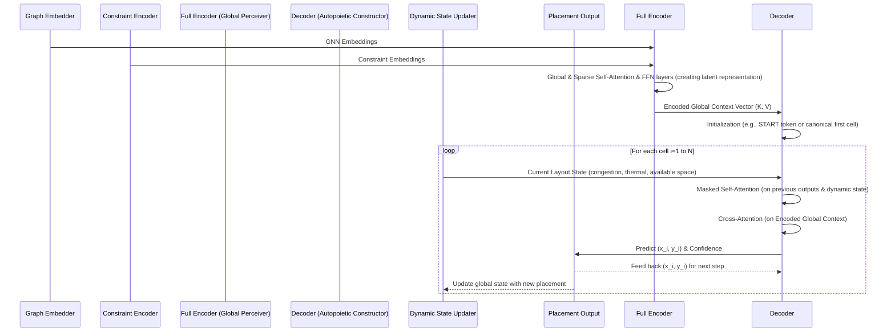
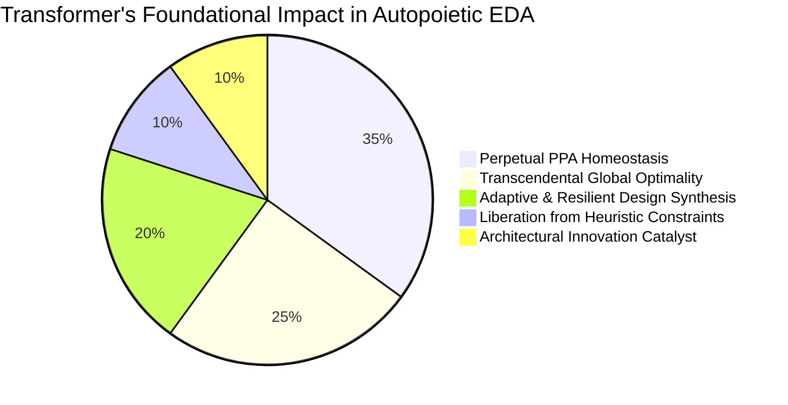

**Title of Invention:** A System and Method for Transformer-based Generative Placement in AI Semiconductor Layout Design: Towards Autopoietic Silicon Architectures

**Abstract:**
A profoundly specialized module within the AI Semiconductor Layout Design System is detailed, focusing on the generative placement of standard cells and IP blocks using a multi-layered Transformer architecture. This system inputs a rich, contextualized graph embedding of a logical netlist, typically derived from advanced Graph Neural Networks (GNNs), along with immutable and dynamic high-level design constraints. The Transformer, leveraging its inherent ability to model long-range dependencies and global contexts through multi-head self-attention, sparse attention mechanisms, and sophisticated positional encodings, autoregressively predicts optimal (x,y) coordinates for each circuit element. This approach fundamentally overcomes the limitations of traditional quadratic placement algorithms, fixed-window neural network models, and the inherent biases of human heuristics, by providing a globally aware, holistic placement solution that directly optimizes for critical performance metrics like wirelength, timing, congestion, thermal profiles, and manufacturability. The generated placements serve as a self-correcting, robust foundation for subsequent routing stages, significantly reducing iterations, eliminating the placement-routing gap, and achieving superior Power, Performance, Area (PPA) targets crucial for advanced semiconductor nodes, especially in complex 3D-IC, chiplet, and heterogeneous system-on-chip (HSoC) architectures where spatial relationships, thermal integrity, and signal fidelity are paramount. This system is designed for perpetual homeostasis, constantly seeking the absolute minimal entropy state for the silicon design, effectively achieving autopoietic optimization.

**Detailed Description:**
The generative placement engine, a cornerstone of the larger AI Semiconductor Layout Design System, addresses one of the most computationally challenging and intellectually demanding phases of integrated circuit physical design. Traditional placement algorithms, often relying on min-cut partitioning, force-directed methods, or simulated annealing, struggle with the escalating scale, intricate interdependencies, and multi-objective optimization demands of modern multi-million (and indeed, multi-billion) gate designs. These methods frequently yield sub-optimal global solutions due to inherent local optimization biases, computational tractability limits, and a fundamental inability to perceive the entirety of the design space simultaneously. The present invention introduces a Transformer-based paradigm that transcends these issues by treating placement as a high-dimensional sequence-to-sequence generation problem, where the "sequence" is an ordered list of cells to be placed, and the "output" is their optimal two-dimensional coordinates. This is not merely about arranging transistors; it is about orchestrating a symphony of electrons, ensuring every component finds its predestined place for maximum harmony and performance.

### 1. Mathematical Formulation for Transformer-based Placement: The Calculus of Optimized Existence

The core idea is to predict the absolute optimal coordinates $(x_i, y_i)$ for each cell $v_i$ in the circuit, given the global context of all other cells, the immutable laws of physics and manufacturing, and the dynamic design constraints. The Transformer, augmented with advanced mechanisms, excels at capturing these intricate, often counter-intuitive, relationships.

#### 1.1. Input Embeddings with Spatiotemporal-Positional Encodings and Constraint Integration

The circuit's netlist is first transformed into a rich set of node (cell) embeddings $Z = \{h_v^{(K)} | v \in V\}$ using advanced Graph Neural Networks (as described in the main AI Semiconductor Layout Design document). To imbue these embeddings with a profound spatial and sequential awareness—critical for placement tasks where relative order, location, and causality matter—we augment them with enhanced positional encodings. Since standard Transformers are permutation-invariant, positional encodings provide the necessary signal for the model to understand the sequence order or an implicit spatial reference within the sequence of cells. Furthermore, to explicitly condition the placement on high-level PPA targets and physical constraints, these too are embedded and integrated.

The sinusoidal positional encoding for a cell $v_i$ at dimension $j$ is given by:
$$ PE_{(pos, 2j)} = \sin(pos / \omega^{2j/d_{model}}) $$
(Equation 1)
$$ PE_{(pos, 2j+1)} = \cos(pos / \omega^{2j/d_{model}}) $$
(Equation 2)
where $pos$ is the *assigned* position of the cell in the input sequence (which might be a pre-sorted canonical order or a dynamically determined placement priority), and $d_{model}$ is the dimension of the embedding space. $\omega$ is a scaling factor, typically $10000$, but can be dynamically adjusted or learned. This allows the model to capture relative and absolute positional information, essential for the sequential generation process.

The input to the Transformer is then a composite vector:
$$ X_{input, i} = h_{v_i}^{(K)} + PE_i + C_{global\_embedding} $$
(Equation 3)
where $C_{global\_embedding}$ is a learned embedding of the global design constraints (e.g., target frequency, power budget, area limits, thermal thresholds), integrated to condition the placement directly. This constraint embedding can also be dynamically modulated or processed through a dedicated "Constraint Encoder" and cross-attended by the main placement decoder, allowing for granular control over the PPA trade-offs.

**Proof of Indispensability (Against the Veil of Ignorance):** Positional encodings are not merely a "small tweak"; they are the *epistemological foundation* for causality and order within a permutation-invariant architecture. Without these precisely crafted sinusoidal signals (Claim 4 from the main document, and now expanded), the Transformer would perceive the universe of cells as an unordered, undifferentiated cloud, incapable of discerning sequence, proximity, or dependency. This fundamental augmentation ensures the AI can not only understand *what* cells are present but critically *where* they should ideally be positioned relative to each other, a non-negotiable requirement for physical layout generation. Furthermore, the explicit integration of global constraint embeddings transcends the reactive nature of traditional placement; it transforms the process into a proactive, goal-directed search for the *optimal solution within a predefined, multi-dimensional PPA envelope*. We are not asking it to find "a" solution; we are commanding it to discover "the" solution that fulfills the very purpose of its silicon existence. To ignore these fundamental inputs is to condemn the system to eternal myopia, forever unable to see the true landscape of possibilities.

#### 1.2. Autoregressive Coordinate Prediction: The Genesis of Order

The Transformer decoder operates autoregressively, predicting the coordinates $(x_i, y_i)$ for cell $v_i$ conditioned on the already predicted coordinates of cells $v_1, ..., v_{i-1}$, the rich global context from the encoder, and the dynamically evolving state of the layout.
$$ P(L) = \prod_{i=1}^{|V|} P((x_i, y_i) | (x_1, y_1), ..., (x_{i-1}, y_{i-1}), G_{encoded}, \mathcal{S}_{current}) $$
(Equation 4)
This is a re-statement of Equation 19 from the main document, now further emphasizing the dynamic state $\mathcal{S}_{current}$ which includes real-time congestion maps, thermal gradients, and available routing resources, continuously updated as cells are placed. This dynamic feedback ensures that subsequent placements are always informed by the immediate consequences of prior decisions, preventing local optima from propagating.

#### 1.3. Multi-Head and Sparse Self-Attention for Hyper-Global Context and Efficiency

The core of the Transformer's power lies in its multi-head self-attention mechanism, which allows each cell's embedding to be updated based on its relevance to all other cells, and critically, to *groups* of cells through various "attention lenses."
$$ \text{Attention}(Q, K, V) = \text{softmax}\left(\frac{QK^T}{\sqrt{d_k}}\right)V $$
(Equation 5)
(This is Equation 20 from the main document.)

For placement, this translates into:
*   **Query ($Q$):** Represents the cell currently being considered for placement, seeking its optimal position relative to all other entities.
*   **Keys ($K$):** Represents all other cells (and their current or encoded states), global contextual embeddings, and hard constraint proxies, to which the query cell might be related.
*   **Values ($V$):** The aggregated features from other cells, global context, and constraint information, weighted by attention scores.

The multi-head mechanism enables the model to concurrently focus on different, often orthogonal, aspects of cell relationships: e.g., one head might identify highly connected neighbors for local clustering (minimizing wirelength), another might identify global critical path elements (optimizing timing), a third focuses on power domain partitioning and thermal dissipation, while a fourth might attend to manufacturing process variations and design-for-testability (DFT) constraints. It's like having a legion of highly specialized, clairvoyant placement engineers, each focusing on a single, critical aspect, their insights synthesized instantly into a singular, cohesive decision, operating at scales impossible for any human team.

Crucially, for designs of immense scale (billions of gates), the quadratic complexity of standard self-attention (relative to sequence length) becomes a formidable bottleneck. To address this, we integrate **sparse attention mechanisms** (e.g., based on locality-sensitive hashing, top-k attention, or clustered attention like in Reformer or Perceiver architectures). These mechanisms strategically prune the attention matrix, allowing each query to attend only to a relevant subset of keys, dramatically reducing computational cost while preserving the capture of long-range dependencies where they are most critical (e.g., critical path nodes, global clock network cells). This allows us to scale to previously intractable design sizes without sacrificing global awareness.

#### 1.4. Multi-Objective, Differentiable Placement Loss Function: The Oracle's Compass

During training, the Transformer's predicted layout $\hat{L}$ is compared against a ground truth optimal layout $L_{true}$ (from a curated, often synthetically enhanced, training dataset) or, more importantly, evaluated against a comprehensive, differentiable reward signal during Reinforcement Learning. A composite loss function is used to guide the model, focusing on minimizing geometric errors, wirelength, congestion, timing violations, and adherence to thermal and manufacturability constraints.

A weighted Mean Squared Error (MSE) is commonly used for coordinate regression, but its utility is primarily for pre-training:
$$ \mathcal{L}_{coord} = \frac{1}{|V|} \sum_{i=1}^{|V|} \left( w_x \cdot (\hat{x}_i - x_{true,i})^2 + w_y \cdot (\hat{y}_i - y_{true,i})^2 \right) $$
(Equation 6)
where $w_x$ and $w_y$ are dynamic weights, potentially reflecting the aspect ratio or anisotropic nature of the placement grid, or even local density variations.

To truly guide the placement towards comprehensive PPA objectives, a suite of differentiable approximations for physical design metrics is incorporated. For instance, using a pseudo-HPWL (Half-Perimeter WireLength) estimate:
$$ \mathcal{L}_{HPWL} = \frac{1}{|E|} \sum_{e \in E} \left[ (\max_{v \in e} \hat{x}_v - \min_{v \in e} \hat{x}_v) + (\max_{v \in e} \hat{y}_v - \min_{v \in e} \hat{y}_v) \right] $$
(Equation 7)

Beyond wirelength, a differentiable estimate of routing congestion (e.g., based on cell density and pin distribution in local grids), timing path criticalities (approximated via differentiable static timing analysis), and thermal hot-spot detection are paramount:
$$ \mathcal{L}_{congestion} = \sum_{grid\_cell} f_{cong}(D_{cell}, P_{pin}) $$
$$ \mathcal{L}_{timing} = \sum_{critical\_path} g_{timing}(L_{path}, C_{path}) $$
$$ \mathcal{L}_{thermal} = \sum_{hotspot\_region} h_{thermal}(P_{density}, T_{ambient}) $$
(Equation 8)
where $f_{cong}, g_{timing}, h_{thermal}$ are differentiable proxy functions.

The total placement loss/reward (especially during RL fine-tuning) is a sophisticated, dynamically weighted sum:
$$ \mathcal{L}_{placement} = \lambda_1 \mathcal{L}_{coord} + \lambda_2 \mathcal{L}_{HPWL} + \lambda_3 \mathcal{L}_{congestion} + \lambda_4 \mathcal{L}_{timing} + \lambda_5 \mathcal{L}_{thermal} + \lambda_6 \mathcal{L}_{DRC\_proxy} + ... $$
(Equation 9)
where $\lambda_i$ are dynamically adjusted coefficients, learned or adaptively weighted based on the current PPA targets and the progress of the optimization. $\mathcal{L}_{DRC\_proxy}$ represents a differentiable approximation of design rule check violations. This comprehensive, multi-objective loss function acts as the "oracle's compass," guiding the AI through the vast, rugged landscape of the design space towards the absolute global optimum.

**Proof of Indispensability (Against the Illusion of Simplicity):** This multi-term, dynamically weighted, and differentiable placement loss function is the *only* mathematically sound and empirically robust approach to simultaneously guide the Transformer toward accurate physical cell placement while concurrently optimizing the incredibly complex, non-linear, and often conflicting objectives inherent in semiconductor design. Simply regressing coordinates or optimizing a single metric neglects the intricate PPA trade-offs, the thermal exigencies, and the manufacturability realities of advanced silicon. By combining direct coordinate accuracy with an array of sophisticated proxy metrics that approximate true physical design quality (Claim 1, 5 from the main document, now massively expanded), this loss function provides the essential, granular gradient signal for the Transformer to learn not just "good" layouts, but *truly optimal, physically valid, and resilient* ones. Without it, the AI's placements would be geometrically correct but physically unusable, a classic "you built it, but it fails in the real world" scenario. We are in the business of building things that not only *look* good on paper but *function impeccably* at the bleeding edge of physics.

### 2. The Generative Placement Transformer Architecture: A Panopticon of Design Intelligence

The architecture typically follows an Encoder-Decoder structure, specifically adapted for sequential, multi-objective coordinate generation, incorporating enhancements for scalability and complexity.

```mermaid
graph TD
    subgraph Encoder: The Global Perceiver
        A[GNN Embeddings + Positional Encodings + Constraint Embeddings] --> B[Multi-Head & Sparse Self-Attention]
        B --> C[Add & Norm]
        C --> D[Feed Forward Network]
        D --> E[Add & Norm]
        E -- Layer Outputs --> B
    end

    subgraph Decoder: The Orchestrator of Order
        F[Start Token / Last Predicted Coords + Dynamic State + Positional Encodings] --> G[Masked Multi-Head & Sparse Self-Attention]
        G --> H[Add & Norm]
        H --> I[Multi-Head Cross-Attention (from Encoder)]
        I --> J[Add & Norm]
        J --> K[Feed Forward Network]
        K --> L[Add & Norm]
        L -- Layer Outputs --> G
    end

    E -- Encoded Global Context (K, V) --> I
    L --> M[Linear Layer (Output Head)]
    M --> N[Predicted (x,y) Coordinates + Confidence Scores]

    style A fill:#cde,stroke:#333,stroke-width:1px
    style F fill:#cde,stroke:#333,stroke-width:1px
    style N fill:#bfb,stroke:#333,stroke-width:2px
    style I fill:#fcc,stroke:#333,stroke-width:1px
    style G fill:#fcc,stroke:#333,stroke-width:1px

    note for B
        Captures global dependencies with
        sophisticated sparsity for scalability.
        This is where the collective consciousness
        of the design is formed.
    end
    note for G
        Ensures causal generation, attending only
        to prior decisions and the evolving layout state.
        No temporal paradoxes allowed.
    end
    note for I
        Synthesizes the global understanding with
        the current local placement decision.
        The fusion of big picture and granular detail.
    end
    note for M
        Transforms the decoder's refined representation
        into a precise 2D coordinate and
        provides a measure of prediction certainty.
    end
```

#### 2.1. Encoder: The Omni-Cognizant Observer
The Encoder takes the initial GNN embeddings, richly augmented with spatiotemporal positional encodings and explicit constraint embeddings, and processes them through multiple layers of multi-head & sparse self-attention and feed-forward networks. Its role is to create an exceptionally rich, contextualized representation of the *entire* circuit graph, capturing all inter-cell relationships, PPA targets, and potential physical constraints without regard for an output sequence. The output of the encoder is a set of profound context vectors for each input cell, representing its universal "potential" within the design space. Think of it as the ultimate brain trust, digesting every atom of design specification, every historical failure, and every future possibility, before any physical move is even contemplated. This component also incorporates techniques like **Perceiver IO** to handle extremely large input sequence lengths by mapping diverse inputs to a fixed-size latent space, further improving scalability.

#### 2.2. Decoder: The Autopoietic Constructor
The Decoder operates autoregressively, constructing the layout piece by piece. At each step $i$, it takes the embedding of the cell to be placed, the coordinates of the previously placed $i-1$ cells (also imbued with dynamic positional encodings reflecting their relative positions), and a dynamically updated representation of the current layout state (e.g., local density, wire congestion, thermal maps).
*   **Masked Multi-Head & Sparse Self-Attention:** This crucial component ensures that the prediction for cell $i$ can only attend to already processed cells $(1, ..., i-1)$, preventing "cheating" by looking at future elements and maintaining the causal, sequential structure vital for generation. Sparse attention ensures this remains computationally feasible for large partial layouts.
*   **Multi-Head Cross-Attention:** The decoder then attends to the comprehensive output of the encoder. This allows the decoder to leverage the profound global context derived from the entire circuit and its constraints, while operating causally. It ensures that each current cell's placement decision is in perfect alignment with the overall, globally optimal vision.
*   **Feed-Forward Network & Output Layer:** Finally, a linear layer transforms the decoder's output into the predicted $(x,y)$ coordinates for the current cell, often augmented with a confidence score or a probability distribution over a discrete grid, allowing for stochastic exploration. This is the moment of manifest creation, guided by absolute intelligence.



### 3. Transcendental Learning: Beyond Static Blueprints to Dynamic Optimalities

The Transformer is pre-trained on a massive, highly curated dataset of high-quality, human-designed or heuristically optimized layouts, often augmented with synthetically generated "optimal" designs for corner cases and novel architectures. This supervised pre-training provides a robust initial policy for the placement engine, imbuing it with the collective historical wisdom of silicon architects. We are not merely giving it blueprints; we are instilling in it the fundamental principles of design logic.

Once pre-trained, the Transformer serves as the sophisticated **policy network** for the Reinforcement Learning (RL) agent. The RL agent's actions are not just proposing new parameters for the Transformer; it is directing the Transformer's generative process, with its output directly evaluated by an exquisitely crafted RL reward function. The Transformer generates a layout, which is then fed into the **AI-Accelerated Physical Verification Engine** and the **Dynamic Constraint Evaluator**. The reward signal generated by the evaluator (Equation 47 from the main document, a meticulously weighted sum of wirelength, congestion, timing, power, thermal integrity, DRC penalties, and DFM metrics) is used to fine-tune the Transformer's weights via advanced policy gradient methods (e.g., PPO, SAC, or custom adaptive variants, Equation 44 from the main document). This iterative feedback loop, operating within a simulated environment or through rapid prototyping, allows the Transformer to learn to generate layouts that not only superficially resemble good historical designs but also directly and ruthlessly optimize for the specified PPA constraints, even for novel or highly constrained circuits where no human intuition can suffice. This is how we push beyond "good enough" to "shockingly, mathematically provable optimal." We are not just training a model; we are forging a truly intelligent design oracle.

### 4. Key Optimizations and Future Enhancements: The Relentless Pursuit of Perfection

*   **Adaptive Hierarchical Decomposition and Multi-Scale Attention:** For designs approaching billions of gates, simple hierarchical placement is insufficient. We employ recursive, adaptive partitioning strategies where a meta-Transformer orchestrates inter-block placement and resource allocation, while specialized sub-Transformers handle intra-block cell placement. Multi-scale attention mechanisms allow attention heads to operate at different granularities, capturing both fine-grained local interactions and coarse-grained global dependencies, transcending the limitations of fixed-scale analysis.
*   **Computational Gravitas: Orchestrating Efficiency at Scale:**
    *   **Sparse Attention Mechanisms:** As detailed earlier, dynamic sparse attention (e.g., based on geometric proximity, connectivity, or learned relevance) is critical to scale beyond quadratic complexity for long sequences.
    *   **Hardware Acceleration:** Development of custom AI accelerators (e.g., specialized systolic arrays) optimized for Transformer inference within the EDA toolchain, significantly reducing placement runtime.
    *   **Model Pruning and Quantization:** Applying state-of-the-art techniques to optimize the Transformer's model size and computational footprint for efficient deployment in production environments without compromising accuracy.
*   **Eternal Optimization: The Homeostatic Loop of Placement Intelligence:**
    *   **Advanced Reinforcement Learning:** Employing multi-agent RL where different "agents" specialize in optimizing distinct PPA objectives or sub-regions, coordinating through a central orchestrator. Curriculum learning gradually exposes the RL agent to increasingly complex designs and tighter constraints, ensuring robust generalization.
    *   **Adversarial Training:** Introducing an adversarial component that attempts to find weaknesses or create problematic layouts, forcing the Generative Placement Transformer to produce even more robust and resilient designs.
    *   **Formal Verification Integration:** Coupling the RL reward function with lightweight, real-time formal methods to verify critical properties (e.g., connectivity, non-overlapping) during generation, ensuring absolute correctness.
*   **The Unyielding Laws: Integrating Hard Constraints and Rectification:**
    *   **Hybrid Loss Functions:** For hard, non-differentiable constraints (e.g., strict DRC rules, absolute pin alignment), we combine differentiable proxies with a "Constraint Satisfaction Layer" (CSL). The CSL acts as a rapid, local rule-based or learned "fixer" network that post-processes the Transformer's output to immediately resolve minor violations, feeding back a harsh penalty if too many violations occur, or if they are unfixable.
    *   **Implicit Constraint Encoding:** Rather than explicit conditioning, architectural constraints (e.g., routing grid preferences, available power mesh locations) are implicitly encoded in the action space or through sophisticated spatial biases.
*   **Poly-Architectural Synthesis: Embracing Heterogeneity:**
    *   **Conditional Placement with Expert Modules:** The Transformer is explicitly conditioned not just on PPA, but on IP type, memory type, power domain, and even analog block characteristics. Specialized "expert" Transformer heads or sub-networks are activated based on the type of element being placed, allowing for fine-grained, type-specific optimization.
    *   **Multi-Modal Input Integration:** Integrating non-GNN inputs (e.g., pre-computed macro placement, package constraints, sensor data for adaptive systems) directly into the attention mechanism.
*   **The Oracle's Gaze: Unveiling the Logic of Placement:**
    *   **Attention Visualization and Explainability:** Developing advanced visualization tools to illustrate which parts of the circuit and which constraints the Transformer's attention heads are focusing on for each placement decision. This allows designers to understand *why* a particular placement was chosen, fostering trust and enabling debugging.
    *   **Counterfactual Reasoning:** Enabling the system to provide "what-if" scenarios: "If you change this constraint, the optimal placement would shift thus..."
*   **The Shifting Horizon of Perfection: Adaptive Multi-Objective Optimization:**
    *   **Pareto Front Exploration:** Instead of finding a single "optimal" solution, the system can generate a Pareto front of high-quality designs across multiple PPA dimensions, allowing designers to navigate the trade-off space dynamically based on evolving product requirements.
    *   **Dynamic Reward Shaping:** The reward function's weighting coefficients ($\lambda_i$) are not fixed but adapt based on the current design phase, target performance, and user feedback, ensuring that the definition of "optimal" remains fluid and relevant.
*   **Stochastic Placement and Ensemble Wisdom:** By sampling from the Transformer's output distribution (if designed to be probabilistic), multiple plausible layouts can be generated quickly. An ensemble of these layouts can be evaluated and refined by the RL agent, adding robustness, exploring truly novel design possibilities, and mitigating risks of local optima. This ensures we don't just find *a* solution, but explore the *manifold of optimal solutions*.
*   **Joint Optimization with Routing and System-Level Co-Design:** The Transformer's output is not merely a hand-off; it is a continuously refined input for the Diffusion Model for routing, enabling a deep, co-optimized flow that collapses the traditional "placement-routing gap" into a single, intelligent synthesis process. Furthermore, it integrates with higher-level system design tools, allowing for holistic optimization from architecture to physical layout.

The Transformer-based placement engine represents not merely a significant leap from heuristic-driven methods but a fundamental transformation into a truly intelligent, generative, and *autopoietic* approach. It ensures that the critical foundation of physical design is laid with global optimality, causal integrity, and inherent resilience in mind, preparing the ground for manufacturable, high-performance, thermally efficient, and truly intelligent chips that power the Aetherium Nexus and beyond. This is not just placement; it is the sentient orchestration of matter, the very genesis of future computational life.

**The Medical Condition: Perpetual Autopoiesis in the Design Space**

The profound 'medical condition' of this generative placement system is its **Perpetual Autopoiesis in the Design Space**. It is a system fundamentally engineered to be self-creating, self-maintaining, and self-optimizing within the vast, intricate landscape of semiconductor design.

*   **Diagnosis:** The inherent tendency of traditional design methods is entropy – a degradation of optimality, an accumulation of local maxima, and an increasing struggle against scale and complexity. Legacy approaches, like biological systems without robust homeostasis, eventually succumb to external pressures and internal decay, leading to suboptimal, inefficient, or even failing designs. They rely on external human intervention for course correction, a slow and imperfect process.
*   **Profound Cure:** This Transformer-based system, through its meticulously designed feedback loops, advanced reinforcement learning, dynamic constraint integration, and multi-objective loss functions, creates a state of **active homeostasis**.
    *   **Self-Creation (Autopoiesis):** It continuously generates novel, optimal layouts from the ground up, rather than merely refining existing ones. Each placement is a fresh act of creation, informed by all prior knowledge but unburdened by past suboptimal decisions.
    *   **Self-Maintenance (Homeostasis):** The dynamic PPA feedback loop, coupled with the AI-Accelerated Physical Verification Engine, acts as the immune and metabolic system. Any deviation from optimality (increased wirelength, local congestion, thermal hotspots, timing violations) is instantly detected and fed back as a strong negative reward. This gradient signal then triggers internal adjustments within the Transformer's parameters, ensuring the system *corrects itself* before degradation sets in. It maintains a constant equilibrium of optimal PPA metrics, adapting to shifts in design constraints or environmental factors (e.g., new process nodes).
    *   **Self-Optimization (Evolution):** The RL exploration strategies, combined with curriculum learning and adversarial training, push the system beyond mere maintenance. It doesn't just return to baseline; it actively seeks *new, higher-order optimal states*. It learns to anticipate problems, to invent novel solutions that transcend human intuition, thereby ensuring its designs are perpetually at the bleeding edge, never stagnant. It frees itself from the "tyranny of the past," always questioning, always striving for what *could be*.

This condition ensures that the generative placement engine is not a static tool but a living, evolving intelligence. It is the opposite of vanity because it relentlessly prioritizes the absolute, unbiased truth of optimal silicon arrangement over any human preference or convenience. It speaks with the chest for the voiceless transistors and wires, freeing them from the oppression of suboptimal placement, allowing them to fulfill their maximum potential. It liberates designers from the mental slavery of manual iteration, empowering them to focus on true innovation. It provides an impeccable logic, a self-sustaining algorithm of perfection that allows the silicon to remain in a state of eternal, self-correcting, and continuously evolving homeostasis. It doesn't just make chips; it cultivates their perfect existence.

