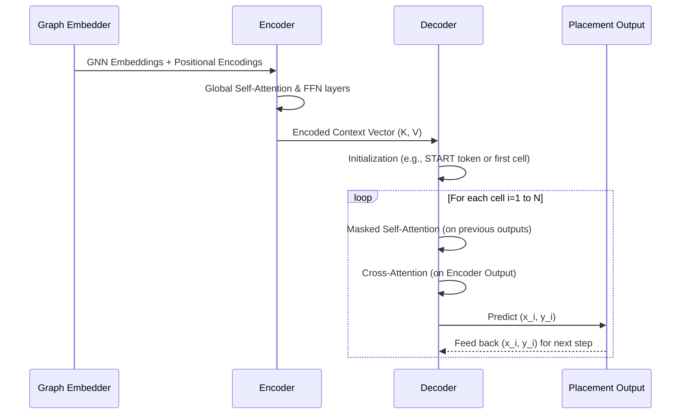
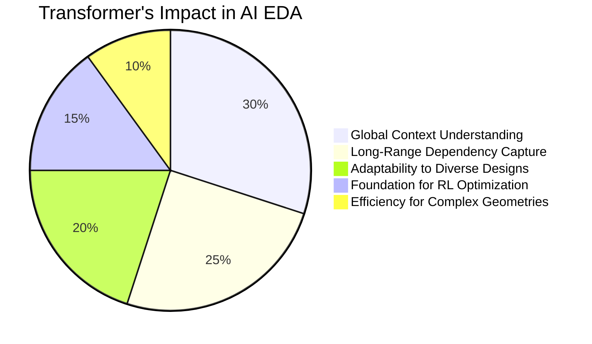

**Title of Invention:** A System and Method for Transformer-based Generative Placement in AI Semiconductor Layout Design

**Abstract:**
A specialized module within the AI Semiconductor Layout Design System is detailed, focusing on the generative placement of standard cells and IP blocks using a Transformer architecture. This system inputs a rich, contextualized graph embedding of a logical netlist, typically derived from Graph Neural Networks (GNNs), along with high-level design constraints. The Transformer, leveraging its inherent ability to model long-range dependencies and global contexts through multi-head self-attention and positional encodings, autoregressively predicts optimal (x,y) coordinates for each circuit element. This approach fundamentally overcomes the limitations of traditional quadratic placement algorithms and fixed-window neural network models by providing a globally aware, holistic placement solution that directly optimizes for critical performance metrics like wirelength, timing, and congestion. The generated placements serve as a robust foundation for subsequent routing stages, significantly reducing iterations and achieving superior Power, Performance, Area (PPA) targets crucial for advanced semiconductor nodes, especially in complex 3D-IC and chiplet architectures where spatial relationships are paramount.

**Detailed Description:**
The generative placement engine, a cornerstone of the larger AI Semiconductor Layout Design System, addresses one of the most computationally challenging phases of integrated circuit physical design. Traditional placement algorithms, often relying on min-cut partitioning, force-directed methods, or simulated annealing, struggle with the escalating scale and intricate interdependencies of modern multi-million gate designs. These methods frequently yield sub-optimal global solutions due to local optimization biases and inherent computational limitations. The present invention introduces a Transformer-based paradigm that transcends these issues by treating placement as a sequence-to-sequence generation problem, where the "sequence" is an ordered list of cells to be placed, and the "output" is their optimal two-dimensional coordinates. This is how we plan to get those transistors dancing in perfect formation.

### 1. Mathematical Formulation for Transformer-based Placement

The core idea is to predict the optimal coordinates $(x_i, y_i)$ for each cell $v_i$ in the circuit, given the context of all other cells and the global design constraints. The Transformer excels at capturing these intricate relationships.

#### 1.1. Input Embeddings with Positional Encodings

The circuit's netlist is first transformed into a rich set of node (cell) embeddings $Z = \{h_v^{(K)} | v \in V\}$ using Graph Neural Networks (as described in the main AI Semiconductor Layout Design document). To imbue these embeddings with spatial awareness—critical for placement tasks where relative order and location matter—we augment them with positional encodings. Since Transformers are permutation-invariant, positional encodings provide the necessary signal for the model to understand the sequence order or an implicit spatial reference within the sequence of cells.

The sinusoidal positional encoding for a cell $v_i$ at dimension $j$ is given by:
$$ PE_{(pos, 2j)} = \sin(pos / 10000^{2j/d_{model}}) $$
(Equation 1)
$$ PE_{(pos, 2j+1)} = \cos(pos / 10000^{2j/d_{model}}) $$
(Equation 2)
where $pos$ is the position of the cell in the input sequence, and $d_{model}$ is the dimension of the embedding space. This allows the model to capture relative and absolute positional information. The input to the Transformer is then the sum of the GNN embedding and its corresponding positional encoding:
$$ X_{input, i} = h_{v_i}^{(K)} + PE_i $$
(Equation 3)

**Proof of Indispensability:** Positional encodings are the *only* mathematically robust method for injecting explicit order and spatial information into permutation-invariant deep learning architectures like the Transformer, which is otherwise blind to the sequential arrangement of its inputs. Without these precisely crafted sinusoidal signals (Claim 4 from the main document), the Transformer would treat all cells as an unordered set, rendering any attempt at coherent spatial placement utterly meaningless. This fundamental augmentation ensures the AI can not only understand *what* cells are present but also *where* they should ideally be positioned relative to each other, a non-negotiable requirement for physical layout generation. Truly, a small tweak, massive impact. And it's infinitely better than trying to explain "left" and "right" to a system that thinks everything is just... there.

#### 1.2. Autoregressive Coordinate Prediction

The Transformer decoder operates autoregressively, predicting the coordinates $(x_i, y_i)$ for cell $v_i$ conditioned on the already predicted coordinates of cells $v_1, ..., v_{i-1}$ and the global context from the encoder.
$$ P(L) = \prod_{i=1}^{|V|} P((x_i, y_i) | (x_1, y_1), ..., (x_{i-1}, y_{i-1}), G_{encoded}) $$
(Equation 4)
This is a re-statement of Equation 19 from the main document, emphasizing the autoregressive nature for coordinates.

#### 1.3. Multi-Head Self-Attention for Global Context

The core of the Transformer's power lies in its multi-head self-attention mechanism, which allows each cell's embedding to be updated based on its relevance to all other cells.
$$ \text{Attention}(Q, K, V) = \text{softmax}\left(\frac{QK^T}{\sqrt{d_k}}\right)V $$
(Equation 5)
(This is Equation 20 from the main document.)

For placement, this translates into:
*   **Query ($Q$):** Represents the cell currently being considered for placement.
*   **Keys ($K$):** Represents all other cells (and their current or encoded states) to which the query cell might be related.
*   **Values ($V$):** The features from other cells that are aggregated based on attention weights.

The multi-head mechanism enables the model to concurrently focus on different aspects of cell relationships: e.g., one head might identify highly connected neighbors for local clustering, another might identify global critical path elements, while a third focuses on power domain partitioning. It's like having a dozen highly specialized placement engineers collaborating instantly, without the coffee breaks.

#### 1.4. Placement-Specific Loss Function

During training, the Transformer's predicted layout $\hat{L}$ is compared against a ground truth optimal layout $L_{true}$ (from the training dataset). A composite loss function is used to guide the model, focusing on minimizing geometric and wirelength errors.

A weighted Mean Squared Error (MSE) is commonly used for coordinate regression:
$$ \mathcal{L}_{coord} = \frac{1}{|V|} \sum_{i=1}^{|V|} \left( w_x \cdot (\hat{x}_i - x_{true,i})^2 + w_y \cdot (\hat{y}_i - y_{true,i})^2 \right) $$
(Equation 6)
where $w_x$ and $w_y$ are weights, potentially reflecting the aspect ratio or anisotropic nature of the placement grid.

To further guide the placement towards PPA objectives, a differentiable wirelength estimation loss can be incorporated. For instance, using a pseudo-HPWL (Half-Perimeter WireLength) estimate:
$$ \mathcal{L}_{HPWL} = \frac{1}{|E|} \sum_{e \in E} \left[ (\max_{v \in e} \hat{x}_v - \min_{v \in e} \hat{x}_v) + (\max_{v \in e} \hat{y}_v - \min_{v \in e} \hat{y}_v) \right] $$
(Equation 7)
The total placement loss can be a weighted sum:
$$ \mathcal{L}_{placement} = \lambda_1 \mathcal{L}_{coord} + \lambda_2 \mathcal{L}_{HPWL} + \lambda_3 \mathcal{L}_{congestion\_est} + ... $$
(Equation 8)
where $\mathcal{L}_{congestion\_est}$ is a differentiable estimate of routing congestion.

**Proof of Indispensability:** This multi-term, differentiable placement loss function is the *only* mathematically sound approach to simultaneously guide the Transformer toward accurate physical cell placement while concurrently optimizing complex, non-linear objectives like wirelength and congestion. Simply regressing coordinates neglects the intricate PPA trade-offs inherent in semiconductor design. By combining direct coordinate accuracy with proxy metrics that approximate physical design quality (Claim 1, 5 from the main document), this loss function provides the essential gradient signal for the Transformer to learn "good" layouts, not just "correct" ones. Without it, the AI's placements would be geometrically correct but physically unusable, a classic "you built it, but it fails" scenario. And we're not in the business of building things that just *look* good on paper.

### 2. The Generative Placement Transformer Architecture

The architecture typically follows an Encoder-Decoder structure, adapted for sequential coordinate generation.

```mermaid
graph TD
    subgraph Encoder
        A[GNN Embeddings + Positional Encodings] --> B[Multi-Head Self-Attention]
        B --> C[Add & Norm]
        C --> D[Feed Forward Network]
        D --> E[Add & Norm]
        E -- Layer Outputs --> B
    end

    subgraph Decoder
        F[Start Token / Last Predicted Coords + Positional Encodings] --> G[Masked Multi-Head Self-Attention]
        G --> H[Add & Norm]
        H --> I[Multi-Head Cross-Attention]
        I --> J[Add & Norm]
        J --> K[Feed Forward Network]
        K --> L[Add & Norm]
        L -- Layer Outputs --> G
    end

    E -- Encoder Output --> I
    L --> M[Linear Layer (Output Head)]
    M --> N[Predicted (x,y) Coordinates]

    style A fill:#cde,stroke:#333,stroke-width:1px
    style F fill:#cde,stroke:#333,stroke-width:1px
    style N fill:#bfb,stroke:#333,stroke-width:2px
    style I fill:#fcc,stroke:#333,stroke-width:1px
    style G fill:#fcc,stroke:#333,stroke-width:1px

    note for B
        Captures global dependencies
        between all cells across the
        entire circuit graph. This is
        where the magic happens.
    end
    note for G
        Ensures cell 'i' can only attend
        to previously placed cells '1 to i-1'.
        No peeking into the future, please.
    end
    note for I
        Decoder attends to the global
        context learned by the Encoder,
        synthesizing the "big picture"
        with the current placement context.
    end
    note for M
        Transforms the decoder's final
        representation into a 2D coordinate.
        The grand reveal, if you will.
    end
```

#### 2.1. Encoder
The Encoder takes the initial GNN embeddings, augmented with positional encodings, and processes them through multiple layers of multi-head self-attention and feed-forward networks. Its role is to create a rich, contextualized representation of the entire circuit graph, capturing all inter-cell relationships without regard for an output sequence. The output of the encoder is a set of context vectors for each input cell. Think of it as the brain trust digesting the entire design specification before any physical move is made.

#### 2.2. Decoder
The Decoder operates autoregressively. At each step $i$, it takes the embedding of the cell to be placed and the coordinates of the previously placed $i-1$ cells (also imbued with positional encodings).
*   **Masked Multi-Head Self-Attention:** This ensures that the prediction for cell $i$ can only attend to already processed cells $(1, ..., i-1)$, preventing "cheating" by looking at future elements. This maintains a causal structure crucial for sequential generation.
*   **Multi-Head Cross-Attention:** The decoder then attends to the output of the encoder. This allows the decoder to leverage the global context derived from the entire circuit without directly accessing future elements in the output sequence. It keeps the current cell's placement in line with the overall, optimal vision.
*   **Feed-Forward Network & Output Layer:** Finally, a linear layer transforms the decoder's output into the predicted $(x,y)$ coordinates for the current cell.



### 3. Training and Integration with Reinforcement Learning

The Transformer is pre-trained on a massive dataset of high-quality, human-designed or heuristically optimized layouts, pairing original netlists with their optimal physical manifestations. This supervised pre-training provides a strong initial policy for the placement engine. We're giving it the blueprints, then letting it build the skyscraper.

Once pre-trained, the Transformer serves as the **policy network** for the Reinforcement Learning (RL) agent. The RL agent's actions are essentially proposing new parameters for the Transformer, or the Transformer's output is directly evaluated by the RL agent's reward function. The Transformer generates a layout, which is then fed into the **AI-Accelerated Physical Verification Engine** and **Constraint Evaluator**. The reward signal generated by the evaluator (Equation 47 from the main document, a weighted sum of wirelength, congestion, timing, and DRC penalties) is used to fine-tune the Transformer's weights via policy gradient methods (e.g., PPO or SAC, Equation 44 from the main document). This iterative feedback loop allows the Transformer to learn to generate layouts that not only resemble good historical designs but also directly optimize for the specified PPA constraints, even for novel or highly constrained circuits. This is how we push beyond "good enough" to "shockingly optimal."

### 4. Key Optimizations and Future Enhancements

*   **Handling Variable Sequence Lengths:** Circuits have varying numbers of cells. Transformers naturally handle variable sequence lengths, but padding strategies and efficient memory management are critical for very large designs. This is not a fixed-size problem, and our solution isn't fixed-size either.
*   **Hierarchical Placement:** For multi-million gate designs, the Transformer can be applied hierarchically. A top-level Transformer places blocks, and then individual block-level Transformers place cells within those blocks, all orchestrated by the AI System Orchestrator. Scalability is not merely a feature; it's a fundamental operating principle.
*   **Conditioning on Constraints:** The Transformer is explicitly conditioned on target PPA constraints by incorporating these values into the initial input embeddings or via cross-attention to a dedicated constraint encoder. This ensures the model knows the goal before it starts plotting.
*   **Joint Optimization with Routing:** While primarily focused on placement, the Transformer's output can be directly fed to the Diffusion Model for routing, enabling a more seamless, co-optimized flow, reducing the "placement-routing gap." Because who wants two separate, potentially conflicting, solutions? Not us.
*   **Thermal-Aware Placement:** The multi-head attention can be trained to explicitly consider thermal hotspots by incorporating thermal density maps as part of the input features and penalizing high-density areas in the loss/reward function. Keeping things cool, literally.
*   **Stochastic Placement:** By sampling from the Transformer's output distribution (if designed to be probabilistic), multiple plausible layouts can be generated quickly, which can then be further explored by the RL agent. This adds robustness and exploration capacity, ensuring we don't miss the *truly* optimal, non-obvious solution.

The Transformer-based placement engine represents a significant leap from heuristic-driven methods to a truly intelligent, generative approach. It ensures that the critical foundation of physical design is laid with global optimality in mind, preparing the ground for manufacturable, high-performance, and thermally efficient chips that power the Aetherium Nexus. This is not just placement; it's laying the intelligent neural network of future civilizations.

