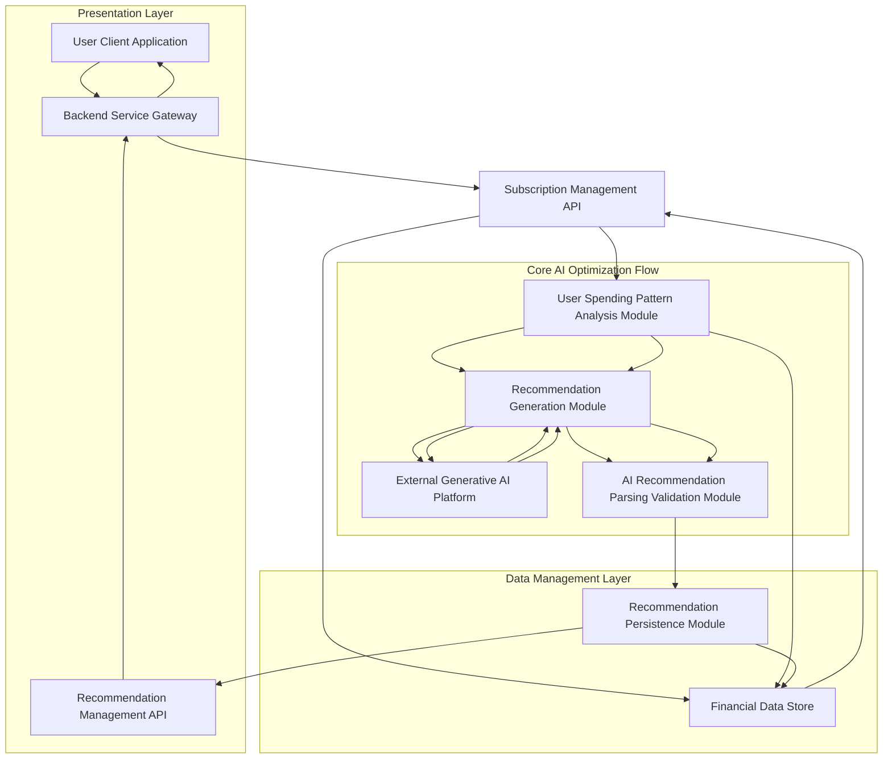
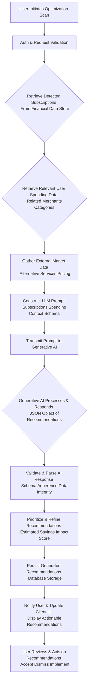
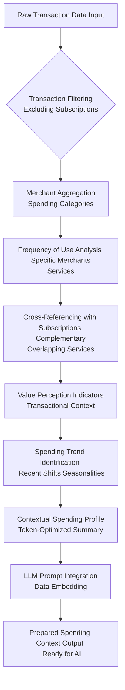
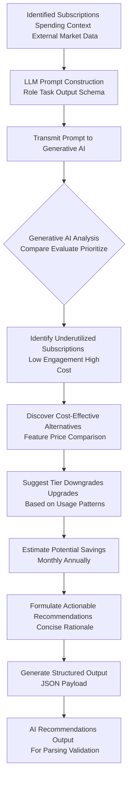
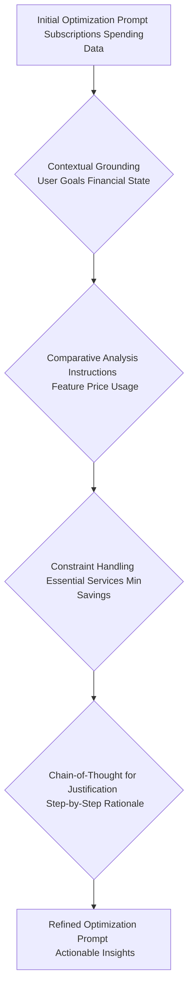
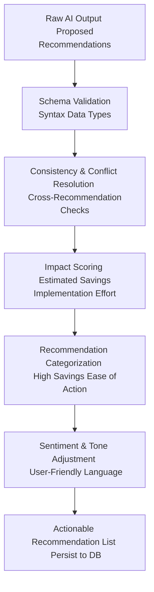
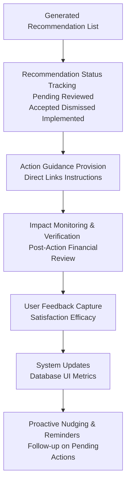
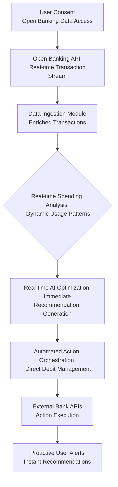
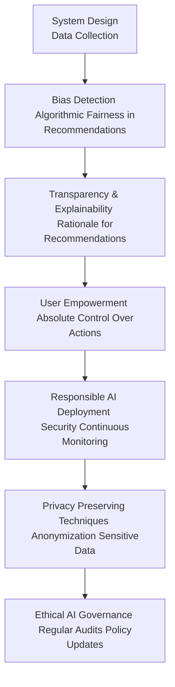
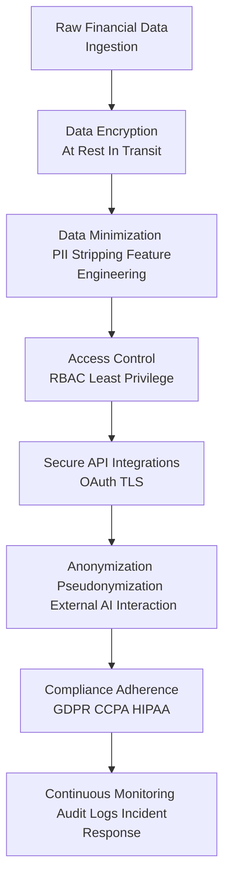

# Title of Invention: A System and Method for the Autonomous Optimization and Personalized Management of Recurring Financial Obligations via Advanced Generative Artificial Intelligence

## Abstract:
This disclosure describes an advanced computational framework engineered for the autonomous analysis of an individual's detected recurring financial obligations and associated spending behaviors, culminating in the generation of proactive, personalized recommendations for fiscal optimization. Building upon systems for identifying such obligations, this invention extends functionality by employing a sophisticated generative artificial intelligence model. The AI rigorously evaluates each recurring commitment in the context of the user's holistic transactional patterns, historical engagement with services, and available market alternatives. It discerns opportunities for cost reduction through actions such as cancellation of underutilized services, modification of subscription tiers, or strategic transition to functionally equivalent, more cost-effective providers. The system presents these analytically derived, actionable insights through an intuitive interface, thereby empowering users to significantly enhance fiscal efficiency and mitigate superfluous expenditures with minimal cognitive overhead.

## Background of the Invention:
The pervasive nature of subscription-based economies, while offering convenience, presents a formidable challenge to consumers in efficiently managing their myriad recurring financial commitments. Even with the advent of systems capable of autonomously identifying these obligations, a significant lacuna persists in providing actionable, intelligent guidance for *optimizing* them. Users often struggle to discern which subscriptions offer genuine value, which are underutilized, or if more cost-effective alternatives exist that align with their actual usage patterns. The manual process of comparing subscription plans, researching competitive services, and estimating potential savings is overwhelmingly time-consuming, cognitively taxing, and rarely undertaken systematically. Existing financial management tools typically lack the sophisticated analytical prowess to move beyond mere identification to generate nuanced, personalized, and proactive optimization recommendations grounded in individual spending behaviors and market intelligence. A critical need therefore exists for an intellectually astute computational system that can not only identify recurring obligations but also intelligently synthesize this information with a user's broader financial footprint and external market data to provide highly tailored and actionable strategies for fiscal improvement. Such a system would alleviate the substantial burden of proactive financial management, fostering superior fiscal health and empowering truly informed consumer decision-making in the complex landscape of recurring expenditures.

## Brief Summary of the Invention:
The present intellectual construct introduces a revolutionary methodology for the autonomous optimization of recurring financial obligations through the strategic deployment of advanced generative artificial intelligence. At its core, the invention integrates a comprehensive compendium of a user's identified recurring subscriptions (as derived from prior detection mechanisms) with their granular historical spending patterns. This rich dataset is meticulously structured and encapsulated as contextual input within a highly optimized prompt, which is then submitted to a sophisticated large language model (LLM), serving as the principal analytical and recommendation engine. The prompt rigorously delineates the LLM's role as a hyper-competent financial optimization advisor, tasking it with the explicit objective of discerning strategic opportunities for cost reduction. This involves the astute recognition of underutilization, identification of functionally equivalent yet more economical alternatives, and the prediction of financial impact from actions such as cancellation, downgrade, or service migration. Crucially, the LLM is architected to yield its analytical findings as a rigorously structured data object, such as a JSON payload, enumerating each potential optimization recommendation with its descriptive identifier, estimated savings, proposed action (e.g., "Cancel," "Downgrade," "Switch Provider"), and a concise rationale. This structured output is then seamlessly presented to the user, providing an actionable roadmap for enhancing their recurring financial landscape.

## Detailed Description of the Invention:

The comprehensive system for the autonomous optimization and personalized management of covert recurring financial obligations operates as an advanced, multi-tiered architecture designed for intelligent analysis, proactive recommendation, and user empowerment. Upon a user's invocation of the subscription optimization feature, a dedicated backend service orchestrates a series of sophisticated operations to retrieve, process, analyze, and present highly personalized fiscal recommendations.

### System Architecture Overview

The underlying system architecture is meticulously engineered to ensure efficient data flow, secure processing, and highly accurate analytical outcomes. It builds upon the foundation of the subscription detection system by introducing specialized modules for optimization.

**Figure 1: High-Level System Architecture for AI-driven Subscription Optimization**

1.  **User Client Application A:** The front-end interface web, mobile, desktop through which the user interacts with the system, initiates optimization analyses, and views and acts upon detected recommendations.
2.  **Backend Service Gateway B:** The primary entry point for client requests, responsible for authentication, authorization, request routing, and orchestrating interactions between various backend modules.
3.  **Subscription Management API C:** Provides an interface for retrieving previously identified and managed recurring subscriptions from the `Financial Data Store D`.
4.  **Financial Data Store D:** A robust, secure, and scalable data repository housing all user financial transaction records, identified subscriptions, and now also optimization recommendations and user feedback.
5.  **User Spending Pattern Analysis Module E:** Responsible for securely accessing and analyzing a user's broader historical financial transaction data to identify usage patterns, preferences, and contextual spending habits relevant to each detected subscription. This includes identifying related purchases, frequency of use of specific merchants, and overall budget allocation.
6.  **Recommendation Generation Module F:** Manages the secure and efficient communication with the `External Generative AI Platform G`. It constructs sophisticated prompts incorporating identified subscriptions, user spending context, and market alternatives. It handles API calls, rate limiting, and error handling.
7.  **External Generative AI Platform G:** The third-party or proprietary advanced generative AI model responsible for executing the core analytical tasks of identifying optimization opportunities and generating actionable recommendations.
8.  **AI Recommendation Parsing and Validation Module H:** Receives the structured output from the Generative AI Platform, validates its adherence to the expected schema, and extracts the identified optimization recommendations. It also performs sanitization and basic data integrity checks.
9.  **Recommendation Persistence Module I:** Stores the newly generated and validated recommendations in the `Financial Data Store D`, potentially linking them to specific subscriptions and user profiles for tracking and management.
10. **Recommendation Management API J:** Provides an interface for the client application to fetch, update, or manage the generated recommendations e.g., mark as reviewed, accepted, dismissed, or acted upon.

### Operational Workflow and Data Processing Pipeline

The detailed operational flow encompasses several critical stages, each contributing to the generation of robust, personalized, and actionable optimization recommendations.

**Figure 2: Detailed Data Processing Pipeline for Autonomous Subscription Optimization**

1.  **User Initiation A:** The process begins when a user explicitly requests an optimization scan for their recurring subscriptions through the client application.
2.  **Authentication & Request Validation B:** The backend gateway authenticates the user's identity and validates the integrity and permissions of the request.
3.  **Retrieve Detected Subscriptions C:** The `Subscription Management API C` accesses the `Financial Data Store D` to fetch the user's current list of identified and active recurring subscriptions.
4.  **Retrieve Relevant User Spending Data D:** The `User Spending Pattern Analysis Module E` retrieves a comprehensive history of the user's broader financial transactions. This includes purchases from similar merchants, payments for complementary services, and general spending habits that provide context for the value derived from existing subscriptions.
5.  **Gather External Market Data E:** The system may optionally integrate with third-party APIs or internal databases to gather current pricing, features, and alternative providers for services identified in the user's subscriptions. This provides competitive context for the AI.
6.  **LLM Prompt Construction F:** A sophisticated prompt is dynamically generated. This prompt consists of several key components:
    *   **Role Instruction:** Directing the LLM to adopt the persona of an expert financial optimization consultant.
    *   **Task Definition:** Clearly instructing the LLM to analyze the provided subscriptions and spending patterns to identify cost-saving opportunities.
    *   **Search Criteria:** Emphasizing underutilization, price discrepancies, feature overlap, and viable alternatives.
    *   **Output Format Specification:** Mandating a structured JSON response, adhering to a predefined `responseSchema`.
    *   **Contextual Data Embedding:** The list of detected subscriptions, summarized user spending patterns, and relevant external market data are directly embedded into this prompt.
7.  **Prompt Transmission to Generative AI G:** The constructed prompt is securely transmitted to the `External Generative AI Platform G` via a robust API call.
8.  **Generative AI Processing & Response H:** The generative AI model ingests the prompt, applying its advanced pattern recognition, comparative analysis, and contextual understanding capabilities to identify potential optimization strategies. It then synthesizes its findings into a JSON object strictly conforming to the specified `responseSchema`.
9.  **AI Response Validation & Parsing I:** Upon receiving the JSON response, the `AI Recommendation Parsing and Validation Module H` rigorously checks for schema adherence, data type correctness, and logical consistency. Validated data is then parsed into internal data structures.
10. **Prioritize & Refine Recommendations J:** The parsed recommendations are further processed. This may involve assigning an "impact score" e.g., estimated annual savings, ease of implementation, categorizing recommendation types e.g., "High Savings," "Service Downgrade," "Switch Provider", and filtering out less impactful or contradictory suggestions.
11. **Persist Generated Recommendations K:** The refined list of recommendations is securely stored in the `Financial Data Store D` via the `Recommendation Persistence Module I`.
12. **User Notification & UI Update L:** The client application is updated to display the newly generated recommendations to the user in a clear, actionable format, often with aggregated views, sortable by savings, and visual cues.
13. **User Review & Action M:** The user can then interact with the recommendations, accepting, dismissing, providing feedback, or initiating actions e.g., linking to a cancellation process, direct navigation to a new provider's sign-up page.

### User Spending Pattern Analysis Module Workflow

This module is crucial for providing the generative AI with the rich, personalized context needed to make truly intelligent and relevant optimization recommendations.

**Figure 3: Detailed Workflow for User Spending Pattern Analysis Module**

*   **Transaction Filtering:** All raw financial transactions are accessed, but those already classified as part of a recurring subscription are set aside or flagged to avoid double-counting or biased analysis within this module.
*   **Merchant Aggregation and Spending Categories:** Transactions are grouped by merchant and categorized into broader spending categories e.g., "Dining," "Groceries," "Entertainment," "Travel". This provides an overview of where a user's money is generally allocated.
*   **Frequency of Use Analysis:** For merchants related to or potentially overlapping with existing subscriptions, the module analyzes the frequency and recency of non-subscription purchases. For instance, if a user has a streaming music subscription but rarely buys concert tickets or music albums, it might indicate lower engagement with that type of entertainment.
*   **Cross-Referencing with Subscriptions:** This step identifies transactions that might be complementary to an existing subscription e.g., purchasing accessories for a device covered by an extended warranty subscription or, conversely, indicate functional overlap e.g., frequent movie rentals despite having multiple streaming subscriptions.
*   **Value Perception Indicators:** The system may derive implicit value perception. For example, consistent small purchases from a coffee shop with a "premium" subscription coffee service might indicate high value for that type of offering. Infrequent use of a gym membership, despite high cost, implies low value.
*   **Spending Trend Identification:** The module looks for recent shifts in spending habits, such as a decrease in related purchases for a service, or seasonal variations that might influence subscription utility.
*   **Contextual Spending Profile:** The aggregated and analyzed data is then condensed into a concise, token-efficient textual representation, summarizing key spending patterns, preferences, and potential overlaps or underutilization.
*   **LLM Prompt Integration:** This formatted summary is embedded within the larger prompt template for the Generative AI.
*   **Prepared Spending Context Output:** The final, comprehensive spending context is then ready for transmission to the Recommendation Generation Module.

### Recommendation Generation Module Workflow

This module constitutes the analytical core of the invention, leveraging the generative AI's capabilities to synthesize diverse data points into actionable fiscal advice.

**Figure 4: Detailed Workflow for Recommendation Generation Module**

*   **LLM Prompt Construction:** An intelligent prompt is crafted to guide the Generative AI. This prompt includes:
    *   The list of currently active, detected subscriptions from Figure 2, C.
    *   The summarized user spending patterns from Figure 3, H, providing contextual intelligence.
    *   Any relevant external market data, such as competitor pricing, alternative service features, or common cancellation procedures from Figure 2, E.
    *   Clear instructions for the AI to act as a financial optimization consultant, focusing on actionable recommendations and quantifying potential savings.
    *   A strict JSON `responseSchema` for the output.
*   **Generative AI Analysis:** The AI model processes this comprehensive input. Its task is to:
    *   **Identify Underutilized Subscriptions:** By cross-referencing subscription presence with user spending patterns e.g., a high-tier streaming service subscription coupled with infrequent viewing habits, or a gym membership with no associated transaction for related health purchases.
    *   **Discover Cost-Effective Alternatives:** Comparing the features and pricing of existing subscriptions with available market alternatives, considering the user's apparent preferences from their spending data.
    *   **Suggest Tier Downgrades/Upgrades:** Recommending a lower-cost tier for an existing service if usage patterns indicate features of a higher tier are not being fully leveraged, or suggesting an upgrade if the user frequently hits limits on a lower tier.
    *   **Estimate Potential Savings:** Calculating the financial impact of each proposed action e.g., annual savings from canceling a service.
    *   **Formulate Actionable Recommendations:** Generating clear, concise suggestions with justifications based on the provided data.
*   **Generate Structured Output:** The AI compiles its findings into a JSON payload, ensuring each recommendation is well-defined and machine-parseable, ready for subsequent validation and presentation to the user.

### Advanced Prompt Engineering Strategies for Optimization

To elicit the most precise, relevant, and actionable recommendations from the Generative AI, sophisticated prompt engineering techniques are essential.

**Figure 5: Advanced Prompt Engineering Workflow for Optimization**

1.  **Contextual Grounding with User Goals:** The prompt is augmented with explicit information about the user's financial goals e.g., "maximize savings," "maintain critical services," "reduce total number of subscriptions" or perceived financial state e.g., "user is budgeting tightly". This guides the AI to prioritize recommendations aligning with user intent.
2.  **Comparative Analysis Instructions:** The prompt explicitly instructs the LLM to perform feature-by-feature and price-by-price comparisons between the user's current subscriptions and identified market alternatives. It may even define a scoring rubric for comparing services based on user spending patterns.
3.  **Constraint Handling:** The prompt includes negative constraints or rules. For example, "Do not recommend canceling essential utilities," or "Only recommend changes if estimated annual savings exceed $50." This prevents undesirable or low-impact suggestions.
4.  **Chain-of-Thought for Justification:** To enhance transparency and user trust, the prompt instructs the LLM to "think step-by-step" or "reason explicitly" for each recommendation before providing its final JSON output. This includes identifying the underlying data points that led to the suggestion e.g., "You rarely used service X, and service Y offers similar features for less, as evidenced by your payments for complementary service Z".
5.  **Iterative Refinement and Feedback Loops:** User feedback on recommendations e.g., "This was a good suggestion," "This was inaccurate because..." can be anonymized and used to fine-tune the prompt or the underlying AI model, creating a continuous improvement cycle.

### Post-Processing and Recommendation Disambiguation

The raw recommendations from the Generative AI benefit from additional post-processing to ensure clarity, prioritize impact, and enhance user experience.

**Figure 6: Post-Processing and Recommendation Disambiguation Workflow**

1.  **Schema Validation & Data Sanitization:** Rigorous validation against the expected JSON schema and basic sanitization to remove any malformed characters.
2.  **Consistency & Conflict Resolution:** The system checks for any conflicting recommendations e.g., recommending cancellation of two services that are functionally interdependent. It may also group related recommendations or prioritize one over another if a conflict exists.
3.  **Impact Scoring:** A composite score is assigned to each recommendation, typically factoring in the estimated financial savings e.g., annual, monthly, the perceived "effort" required for the user to act on it e.g., easy cancellation vs. complex provider switch, and the confidence level of the AI's suggestion.
4.  **Recommendation Categorization:** Recommendations are categorized for easier user consumption e.g., "Immediate Savings," "Review Required," "Premium Service Alternative," "Underutilized Service".
5.  **Sentiment & Tone Adjustment:** The AI's raw rationale might be too technical. This step refines the language to be empathetic, encouraging, and clear for the end-user, ensuring recommendations are perceived as helpful guidance.
6.  **User Feedback Loop:** User actions and feedback e.g., marking a recommendation as "accepted," "dismissed," or "implemented" are captured. This anonymized feedback is vital for the continuous improvement of the recommendation engine and the generative AI model, potentially fine-tuning the model or adjusting prompt parameters.

### Recommendation Lifecycle Management Module

Beyond initial generation, the system provides comprehensive tools for managing the entire lifecycle of an optimization recommendation, from presentation to implementation and verification.

**Figure 7: Recommendation Lifecycle Management Workflow**

1.  **Recommendation Status Tracking:** The system tracks the status of each recommendation e.g., `Pending Review`, `Reviewed`, `Accepted`, `Dismissed`, `Implemented`, `Failed`. This allows users and the system to monitor progress.
2.  **Action Guidance Provision:** For each recommendation, the system provides clear, step-by-step instructions or direct links to facilitate the user in taking action e.g., "Click here to go to Netflix cancellation page," "Here are instructions for downgrading your Spotify plan".
3.  **Impact Monitoring & Verification:** After a user marks a recommendation as "implemented," the system monitors subsequent transaction data to verify the financial impact e.g., confirming the cancellation of a subscription by observing its absence in future statements, or verifying a lower charge after a downgrade. This provides tangible proof of savings.
4.  **User Feedback Capture:** Users are prompted to provide feedback on the recommendations, including their satisfaction, the accuracy of estimated savings, and the ease of implementation. This qualitative feedback is invaluable for model refinement.
5.  **System Updates:** All status changes, verifications, and user feedback are recorded in the `Financial Data Store D` and reflected in the `User Client Application A`.
6.  **Proactive Nudging & Reminders:** The system can send gentle reminders or "nudges" for pending recommendations that have significant potential savings but haven't been acted upon. These are configurable by the user.

### Open Banking Integration for Real-time Optimization

Leveraging Open Banking APIs provides a significant enhancement to the optimization system, enabling real-time data ingestion and more direct action orchestration.

**Figure 8: Open Banking Integration for Real-time Optimization Workflow**

1.  **User Consent:** Explicit and granular user consent is paramount for accessing financial data through Open Banking APIs.
2.  **Open Banking API Integration:** Secure connections with financial institutions' Open Banking APIs for real-time or near real-time transaction streams.
3.  **Data Ingestion Module:** Securely ingests and normalizes enriched transaction data from Open Banking APIs. This enhanced data often includes more detailed merchant categories and payment references, improving the contextual accuracy for optimization.
4.  **Real-time Spending Analysis:** The `User Spending Pattern Analysis Module E` continuously processes incoming real-time transaction data to maintain an up-to-the-minute understanding of user spending habits and engagement with services.
5.  **Real-time AI Optimization:** The `Recommendation Generation Module F` can trigger immediate re-evaluations and generate new recommendations as soon as significant changes in spending patterns or new external market data become available, providing highly timely advice.
6.  **Automated Action Orchestration:** With appropriate and *explicit* user consent, the system can orchestrate automated financial actions directly through banking APIs based on accepted recommendations. This includes:
    *   **Canceling Direct Debits or Standing Orders:** Simplifying the process of terminating unwanted subscriptions directly from the banking interface.
    *   **Updating Payment Details:** Guiding the user through updating payment details for new, more cost-effective services.
7.  **External Bank APIs for Action Execution:** Secure interaction with bank APIs to execute consented financial actions, providing a seamless end-to-end management experience.
8.  **Proactive User Alerts:** With real-time data, notifications for new optimization opportunities can be delivered almost instantaneously, enhancing user awareness and control.

### Ethical AI Framework and Governance for Optimization

The application of AI in recommending financial actions carries significant ethical implications. This system is designed with a robust ethical AI framework to ensure fairness, transparency, and user trust.

**Figure 9: Ethical AI Framework for Optimization**

1.  **Bias Detection and Mitigation:**
    *   **Algorithmic Fairness in Recommendations:** The system continuously monitors for potential biases in recommendation generation that might disproportionately affect certain user demographics. For instance, recommendations should not implicitly steer users towards cheaper, lower-quality services solely based on income proxies, or overlook premium but genuinely valuable services. Regular audits of AI outputs and fairness metrics are conducted.
    *   **Representative Training Data:** Ensure the training data for the generative AI includes diverse financial profiles and spending patterns to prevent recommendations that are only relevant or fair to a narrow segment of the population.
2.  **Transparency and Explainability XAI:**
    *   **Clear Rationale:** For every recommendation, the system provides a clear, concise, and understandable rationale, detailing *why* the suggestion is being made and *what data* supports it e.g., "Based on your spending, you only used this streaming service for 2 hours last month, and a basic tier would save you X".
    *   **Estimated Impact:** Transparently communicates the estimated financial impact savings or cost and effort level associated with each recommendation.
3.  **User Empowerment and Agency:**
    *   **Absolute User Control:** All AI-generated recommendations are presented as suggestions. Users retain full and absolute control over whether to accept, reject, or implement any recommendation. No automated actions are taken without explicit, informed consent.
    *   **Easy Feedback Mechanisms:** Robust mechanisms for users to provide feedback, correct misinterpretations, or dismiss irrelevant suggestions are paramount, ensuring a human-in-the-loop approach.
4.  **Responsible AI Deployment:**
    *   **Security against Misuse:** Robust security measures prevent malicious actors from manipulating recommendations or accessing sensitive spending data.
    *   **Continuous Monitoring:** AI models and their outputs are continuously monitored for performance drift, unexpected behaviors, or emergent biases, ensuring ongoing ethical and accurate operation.
    *   **Privacy-Preserving Techniques:** Advanced techniques like Federated Learning or differential privacy are considered for learning from aggregated user spending patterns without compromising individual privacy.
5.  **Ethical AI Governance:** An overarching governance structure ensures regular ethical reviews, policy updates, and adherence to evolving ethical guidelines and regulations for AI systems, particularly those impacting financial decisions.

### Security and Privacy Considerations

Given the profound sensitivity of financial transaction data and personal spending habits, the system is designed with an uncompromising focus on security and privacy, extending beyond the detection phase.

**Figure 10: Security and Privacy Design Flow for Optimization**

*   **Data Encryption:** All user financial data, including identified subscriptions and granular spending patterns, is encrypted both at rest and in transit using industry-standard, robust cryptographic protocols.
*   **Data Minimization and Feature Engineering:** Only the minimum necessary, non-identifiable features of transaction data are used for AI analysis e.g., merchant category, aggregated spending amounts, frequencies. Directly identifiable PII is stripped or tokenized before being used in the AI model's context or stored in logs.
*   **Access Control:** Strict role-based access control RBAC and the principle of least privilege are rigorously applied to all system components and personnel, limiting access to sensitive financial data.
*   **Secure API Integrations:** All communications with external Generative AI platforms and Open Banking APIs utilize hardened, authenticated, and encrypted channels e.g., mTLS, OAuth 2.0.
*   **Anonymization/Pseudonymization for AI:** When transmitting data to external generative AI models, advanced anonymization or pseudonymization techniques are employed to prevent re-identification of individuals from the spending patterns.
*   **Compliance Adherence:** The system design and operation strictly adhere to relevant data protection and financial regulations globally e.g., GDPR, CCPA, PSD2, HIPAA for health-related spending patterns if applicable, with regular external audits.
*   **Continuous Monitoring and Incident Response:** Comprehensive audit logs, real-time intrusion detection systems, and regular penetration testing are implemented. A robust incident response plan is in place to quickly address and mitigate any security breaches.

### Scalability and Performance

The system is architected for high scalability and performance, capable of efficiently processing vast volumes of transactional and subscription data to generate timely recommendations for a large user base.
*   **Microservices Architecture:** Deployed as a collection of independent, loosely coupled microservices, enabling individual components e.g., Spending Pattern Analysis, Recommendation Generation, API Gateway to be scaled horizontally based on computational demand.
*   **Asynchronous Processing:** Long-running tasks, particularly interactions with the `External Generative AI Platform G` and complex data aggregations, are handled asynchronously using message queues and event-driven architectures. This prevents blocking operations and maintains system responsiveness.
*   **Distributed Data Stores:** The `Financial Data Store D` leverages distributed database technologies to ensure high availability, fault tolerance, and linear scalability for storing, retrieving, and updating user financial data, subscriptions, and recommendations.
*   **Caching Mechanisms:** Strategic caching is implemented at various layers e.g., frequently accessed user spending profiles, pre-computed market alternative data to reduce latency and load on backend services and the generative AI platform.
*   **Optimized AI Inference:** Continuous optimization of prompt engineering and model selection ensures that AI inference requests are token-efficient and computationally lean, minimizing operational costs and improving response times from the generative AI, which often bills per token. Techniques like batch processing of recommendations for multiple users or pre-calculating common components of prompts are utilized.

## Declarations of Inventive Scope and Utility:

The conceptual framework herein elucidated, along with its specific embodiments and architectural designs, constitutes an original intellectual construct that significantly advances the state of the art in personalized financial intelligence systems. This innovative methodology provides a distinct and superior approach to automated financial optimization.

1.  A pioneering computational method for generating personalized optimization recommendations for recurring financial obligations, comprising the foundational steps of:
    a.  Accessing a comprehensively structured repository of an individual's previously identified recurring financial obligations.
    b.  Retrieving and analyzing a robust dataset representing the individual's historical financial transaction patterns, beyond said recurring obligations.
    c.  Constructing an optimized, context-rich summary derived from both the identified obligations and the historical transaction patterns.
    d.  Transmitting said optimized summary, embedded within a meticulously crafted prompt, to an advanced generative artificial intelligence model, with explicit instructions for the model to identify and recommend actionable strategies for fiscal optimization.
    e.  Receiving and rigorously validating a structured data artifact, representing a compendium of potential optimization recommendations, as identified and synthesized by the generative artificial intelligence model.
    f.  Presenting said validated compendium to the individual via an interactive user interface, facilitating review and action.

2.  The pioneering computational method of declaration 1, further characterized in that the meticulously crafted prompt rigorously instructs the generative artificial intelligence model to conduct a multi-variate analysis encompassing the utilization patterns of existing subscriptions, the availability and cost-effectiveness of alternative services, and the individual's broader spending habits to discern optimal actions such as cancellation, modification, or provider switching.

3.  The pioneering computational method of declaration 1, further characterized in that the transmission to the generative artificial intelligence model incorporates a declarative response schema, compelling the model to render the compendium of optimization recommendations in a pre-specified, machine-parseable structured data format, such as a JavaScript Object Notation JSON object.

4.  An innovative system architecture for the autonomous optimization of recurring financial obligations, comprising:
    a.  A secure, distributed data store meticulously engineered for the persistent storage of comprehensive user financial transaction histories, identified subscriptions, and generated optimization recommendations.
    b.  A robust service module architected for secure, high-throughput communication with an external generative artificial intelligence model, tailored for recommendation generation.
    c.  An intelligent processing logic layer configured to perform: (i) the extraction of relevant subscription data and comprehensive user spending history, (ii) the sophisticated transformation of this data into a concise, token-optimized prompt, and (iii) the secure transmission of this prompt to the aforementioned generative artificial intelligence model.
    d.  A dynamic user interface component meticulously designed to render and display the structured compendium of optimization recommendations returned by the generative artificial intelligence model to the user, facilitating intuitive interaction, review, and action.

5.  The innovative system architecture of declaration 4, further comprising a User Spending Pattern Analysis Module configured to aggregate, categorize, and summarize an individual's non-subscription-related transactional data to infer usage patterns, preferences, and contextual value derived from existing services.

6.  The innovative system architecture of declaration 4, further comprising a Recommendation Lifecycle Management Module configured to track the status of recommendations, provide action guidance, monitor implementation impact, and capture user feedback for continuous system improvement.

7.  The pioneering computational method of declaration 1, further characterized by the dynamic construction of an impact score for each identified optimization recommendation, indicative of the estimated financial savings or effort of implementation, thereby assisting user prioritization and decision-making.

8.  The pioneering computational method of declaration 1, further characterized by integrating external market data, including competitive pricing and alternative service features, into the generative AI's contextual prompt to enhance the relevance and efficacy of the optimization recommendations.

9.  The pioneering computational method of declaration 1, further comprising a real-time data ingestion and analysis component integrated with Open Banking APIs, enabling the dynamic generation of optimization recommendations in response to immediate changes in user spending patterns or market conditions.

10. The innovative system architecture of declaration 4, further comprising an Ethical AI Framework and Governance Module configured to continuously monitor for algorithmic bias, ensure transparency through explainable rationales, uphold absolute user control over recommended actions, and enforce robust privacy-preserving techniques.

## Foundational Principles and Mathematical Justification:

The intellectual construct herein presented derives its efficacy from a rigorous application of principles spanning multi-criteria decision analysis, behavioral economics, time-series informatics, and the emergent capabilities of large-scale generative artificial intelligence. We herein delineate the mathematical underpinnings that formally validate the operational mechanisms of this innovative system.

### The Optimization Problem: A Formal Representation

Let `S = {s_1, s_2, ..., s_N}` denote the set of an individual's `N` currently identified recurring financial obligations (subscriptions). Each subscription `s_j \in S` is rigorously characterized by a vector of attributes `s_j = (m_j, a_j, f_j, t_j, c_j, u_j)`, where:
1.  **Merchant Identifier `m_j`:** The semantic identifier of the service provider, often a string, `m_j \in \mathcal{M}`.
2.  **Monetary Amount `a_j`:** The recurring cost, `a_j \in \mathbb{R}^+`.
3.  **Frequency `f_j`:** The payment periodicity (e.g., `f_j \in \{\text{monthly, quarterly, annually, weekly}\}`), `f_j \in \mathcal{F}`.
4.  **Transaction Timestamp `t_j`:** The timestamp of the last payment, `t_j \in \mathbb{R}^+`.
5.  **Service Category `c_j`:** A hierarchical categorization of the service (e.g., `c_j \in \{\text{Streaming, Fitness, Software}\}`), `c_j \in \mathcal{C}`.
6.  **Inferred Usage/Value `u_j`:** A quantitative or qualitative measure derived from the `User Spending Pattern Analysis Module`, representing the perceived utility or engagement level with `s_j`. `u_j` can be a scalar (e.g., usage hours, number of logins, frequency of related purchases) or a vector of features. We define `u_j \in \mathbb{R}^k`.

Let `T_user = \{T_{user,1}, T_{user,2}, ..., T_{user,K}\}` denote the individual's aggregated historical transaction patterns over a period `[t_0, t_current]`, where `T_{user,k} = (merchant_k, amount_k, category_k, timestamp_k)` represents a non-subscription transaction. This dataset `T_user` serves as rich contextual data regarding their overall spending behavior, preferences, and financial goals.
The context vector derived from `T_user` is `\mathbf{C}_{user} \in \mathbb{R}^L`, which encapsulates aggregated spending patterns, categorical distributions, and temporal trends.
We can formalize the extraction of `u_j` from `T_user`. For each subscription `s_j`, its usage `u_j` is a function `\phi`:
(1) `u_j = \phi(T_{user}, s_j)`
This function `\phi` analyzes transactions related to `m_j` or `c_j` and computes metrics like:
(2) `\text{Freq}(m_j) = \sum_{k=1}^{K} \mathbb{I}(merchant_k = m_j \text{ and } T_{user,k} \text{ is non-subscription})`
(3) `\text{SpendingShare}(c_j) = \frac{\sum_{k: category_k = c_j} amount_k}{\sum_{k=1}^{K} amount_k}`
(4) `\text{Recency}(m_j) = t_{current} - \max(\{timestamp_k | merchant_k = m_j\})`
(5) `\text{CrossUsage}(c_j, s_j) = \psi(T_{user}, c_j)` where `\psi` measures complementary or competing services.

Let `M_external = \{M_{external,1}, M_{external,2}, ..., M_{external,P}\}` denote external market data, including alternative service providers `alt_k` for each `s_j`, their pricing `a_{k,alt}`, features `feat_{k,alt}`, and user reviews `rev_{k,alt}`.
Each alternative `alt_k` is represented by `(m_k^{alt}, a_k^{alt}, f_k^{alt}, c_k^{alt}, \mathbf{F}_k^{alt}, \text{rating}_k^{alt})`.
The feature vector `\mathbf{F}_k^{alt} \in \{0,1\}^D` represents a binary vector of `D` possible features.

The objective is to identify a set of optimal actions `\mathbf{A}_{opt} = \{action_1, action_2, ..., action_N\}` where each `action_j` corresponds to `s_j` and belongs to a predefined set of feasible actions `A_{feasible} = \{ \text{Cancel}, \text{Downgrade}, \text{Keep}, \text{Upgrade}, \text{SwitchProvider}(alt_k) \}`.

The overarching goal is to maximize an objective function `\mathcal{O}(\mathbf{A})` that balances financial savings with user utility, subject to individual preferences and constraints.

### Objective Function for Fiscal Optimization

We define an objective function `\mathcal{O}(\mathbf{A})` to be maximized over the set of actions `\mathbf{A}`:
(6) `\mathcal{O}(\mathbf{A}) = \sum_{j=1}^{N} (\Delta S_j(s_j, action_j) - \Lambda_j \cdot \Delta U_j(s_j, action_j) - \Gamma_j \cdot \Delta E_j(action_j))`
Subject to:
(7) `action_j \in A_{feasible}` for all `j \in \{1, ..., N\}`.
(8) `\sum_{j=1}^{N} \Delta S_j(s_j, action_j) \ge S_{min}` (Minimum Annual Savings target).
(9) `\mathbb{I}(c_j \in C_{essential}) \implies action_j \ne \text{Cancel}` (Essential service constraint).
(10) `\mathbb{I}(action_j = \text{SwitchProvider}(alt_k)) \implies \text{Similarity}(s_j, alt_k) \ge \theta_{sim}` (Functional similarity threshold).

Where:
*   **`\Delta S_j(s_j, action_j)`:** The estimated financial savings (positive for savings, negative for increased cost) resulting from applying `action_j` to `s_j` over a specified period `T_{period}` (e.g., annually).
    (11) `\text{AnnualCost}(s_j) = a_j \cdot \text{FreqToAnnualMultiplier}(f_j)`
    *   For `action_j = \text{Cancel}`:
        (12) `\Delta S_j(\text{Cancel}) = \text{AnnualCost}(s_j)`
    *   For `action_j = \text{Downgrade to tier } d_j`: Let `a_j^{d}` be the cost of the downgraded tier.
        (13) `\Delta S_j(\text{Downgrade}) = (\text{AnnualCost}(s_j) - a_j^{d} \cdot \text{FreqToAnnualMultiplier}(f_j))`
    *   For `action_j = \text{SwitchProvider}(alt_k)`:
        (14) `\Delta S_j(\text{SwitchProvider}(alt_k)) = (\text{AnnualCost}(s_j) - a_k^{alt} \cdot \text{FreqToAnnualMultiplier}(f_k^{alt}))`
    *   For `action_j = \text{Keep}`:
        (15) `\Delta S_j(\text{Keep}) = 0`
    *   For `action_j = \text{Upgrade to tier } u_j`: Let `a_j^{u}` be the cost of the upgraded tier.
        (16) `\Delta S_j(\text{Upgrade}) = - (a_j^{u} \cdot \text{FreqToAnnualMultiplier}(f_j) - \text{AnnualCost}(s_j))`

*   **`\Delta U_j(s_j, action_j)`:** The estimated change in user utility or value derived from applying `action_j` to `s_j`. This is a crucial, often implicit, component that the generative AI models. It's often represented as a utility loss or gain.
    (17) `\Delta U_j(s_j, action_j) = U_{post}(s_j, action_j) - U_{pre}(s_j)`
    Where `U_{pre}(s_j)` is the current utility derived from `s_j` and `U_{post}(s_j, action_j)` is the utility after the action.
    The utility `U(s_j)` can be modeled as a function of `u_j`:
    (18) `U(s_j) = \alpha_1 \cdot \text{EngagementScore}(u_j) + \alpha_2 \cdot \text{PreferenceMatch}(u_j, \mathbf{C}_{user}) + \alpha_3 \cdot \text{Sentiment}(rev_j)`
    where `\alpha_i` are weighting factors, and `\text{EngagementScore}`, `\text{PreferenceMatch}`, `\text{Sentiment}` are derived from `u_j` and `T_{user}`.
    *   For `action_j = \text{Cancel}`:
        (19) `\Delta U_j(\text{Cancel}) = - U_{pre}(s_j)`
    *   For `action_j = \text{Downgrade}`:
        (20) `\Delta U_j(\text{Downgrade}) = U_{post}(s_j, \text{Downgrade}) - U_{pre}(s_j) < 0`
        where `U_{post}(s_j, \text{Downgrade})` is typically derived from `u_j` indicating feature overprovisioning.
    *   For `action_j = \text{SwitchProvider}(alt_k)`:
        (21) `\Delta U_j(\text{SwitchProvider}(alt_k)) = U(alt_k) - U_{pre}(s_j)`
        where `U(alt_k)` is the estimated utility of the alternative, derived from its features `\mathbf{F}_k^{alt}`, rating `\text{rating}_k^{alt}`, and similarity to user preferences `\mathbf{C}_{user}`.
    *   For `action_j = \text{Keep}`:
        (22) `\Delta U_j(\text{Keep}) = 0`
    *   For `action_j = \text{Upgrade}`:
        (23) `\Delta U_j(\text{Upgrade}) = U_{post}(s_j, \text{Upgrade}) - U_{pre}(s_j) > 0`

*   **`\Lambda_j`:** A user-specific or dynamically determined weighting factor that balances the trade-off between maximizing financial savings and minimizing utility loss for subscription `s_j`. `\Lambda_j \in \mathbb{R}^+`. A higher `\Lambda_j` prioritizes utility; a lower `\Lambda_j` prioritizes savings.
    (24) `\Lambda_j = \lambda_0 + \lambda_1 \cdot \text{UserBudgetSensitivity} + \lambda_2 \cdot \text{CategoryImportance}(c_j, \mathbf{C}_{user})`
    where `\lambda_0, \lambda_1, \lambda_2` are system parameters.

*   **`\Delta E_j(action_j)`:** The estimated effort or friction associated with performing `action_j`. This includes cognitive load, time spent, and potential administrative hurdles.
    (25) `\Delta E_j(\text{Cancel}) = \text{EffortScore}(\text{cancel_process}(m_j))`
    (26) `\Delta E_j(\text{SwitchProvider}(alt_k)) = \text{EffortScore}(\text{cancel_process}(m_j)) + \text{EffortScore}(\text{signup_process}(m_k^{alt}))`
    (27) `\Delta E_j(\text{Keep}) = 0`
    (28) `\Delta E_j(\text{Downgrade}) = \text{EffortScore}(\text{modify_process}(m_j))`
    (29) `\Delta E_j(\text{Upgrade}) = \text{EffortScore}(\text{modify_process}(m_j))`

*   **`\Gamma_j`:** A weighting factor for effort, typically lower than `\Lambda_j` for savings/utility.
    (30) `\Gamma_j = \gamma_0 + \gamma_1 \cdot \text{UserTimeSensitivity}`

### The Generative AI as a Multi-Criteria Decision Analysis Engine `G_{AI-Optim}`

Traditional optimization algorithms struggle with the highly qualitative and context-dependent nature of `\Delta U_j`, `\Delta E_j`, `\Lambda_j` and the synthesis of heterogeneous data `S, T_{user}, M_{external}`. This invention leverages the generative AI model `G_{AI-Optim}` as a sophisticated, context-aware, non-deterministic multi-criteria decision analysis engine.

The generative AI model `G_{AI-Optim}` operates as a function that transforms the comprehensive input `S, \mathbf{C}_{user}, M_{external}` into a set of identified optimization recommendations `\mathbf{R} = \{r_1, r_2, ..., r_P\}`:
(31) `G_{AI-Optim}(S, \mathbf{C}_{user}, M_{external}) \rightarrow \mathbf{R}`
Where each recommendation `r_p` is a tuple `(s_j, action_j, estimated\_savings_p, rationale_p, confidence_p, effort_p)`.

#### 3.1. Prompt Construction and Embedding
The input to the LLM is a meticulously crafted prompt `P`.
(32) `P = \text{RoleInstruction} + \text{TaskDefinition} + \text{SearchCriteria} + \text{OutputSchema} + \text{ContextualData}`
(33) `\text{ContextualData} = \text{Encode}(S) + \text{Encode}(\mathbf{C}_{user}) + \text{Encode}(M_{external})`
Where `\text{Encode}(\cdot)` is a function mapping structured data into a token sequence suitable for the LLM.
The total number of tokens for the prompt `N_{tokens}` is a critical constraint.
(34) `N_{tokens} = N_{\text{role}} + N_{\text{task}} + N_{\text{criteria}} + N_{\text{schema}} + N_{\text{data}} \le N_{\text{max_context}}`

#### 3.2. Implicit Utility and Effort Estimation
The generative AI, having been pre-trained on vast corpora of textual, numerical, and comparative data, possesses an inherent ability to implicitly estimate `U(s_j)` and `\Delta E_j`.

**Utility Estimation:**
The AI infers `u_j` by analyzing `T_{user}` (via `\mathbf{C}_{user}`). It approximates `U(s_j)` by understanding the functional role of a service and its perceived importance to the user based on their overall financial behavior.
(35) `\text{EngagementScore}(s_j) = \exp(-\beta_1 \cdot \text{Recency}(m_j)) \cdot (1 + \beta_2 \cdot \text{Freq}(m_j))`
(36) `\text{PreferenceMatch}(s_j, \mathbf{C}_{user}) = \text{CosineSimilarity}(\text{Embedding}(c_j), \text{Embedding}(\mathbf{C}_{user}))`
(37) `\text{Sentiment}(rev_j) = \text{LLM.analyze_sentiment}(m_j \text{ reviews from } M_{external})`
The parameters `\alpha_i` in Eq (18) are implicitly learned by the LLM during pre-training and fine-tuning.

**Effort Estimation:**
The AI estimates `\Delta E_j` by referring to its knowledge base of typical cancellation/modification processes for various service providers, informed by public data or user feedback logs.
(38) `\text{EffortScore}(\text{process}) = \text{LLM.predict_effort}(\text{process_description})`
This `\text{EffortScore}` could be a numerical value from 1 to 5, or a textual description.

#### 3.3. Comparative Reasoning and Alternative Identification
For `SwitchProvider` actions, the AI performs multi-dimensional comparisons.
(39) `\text{FeatureSimilarity}(s_j, alt_k) = \text{JaccardIndex}(\mathbf{F}_j^{current}, \mathbf{F}_k^{alt})`
(40) `\text{PricePerformance}(alt_k) = \frac{\text{EstimatedUtility}(alt_k)}{\text{AnnualCost}(alt_k)}`
The AI identifies `alt_k` such that:
(41) `\text{FeatureSimilarity}(s_j, alt_k) \ge \theta_{sim}`
(42) `\text{AnnualCost}(alt_k) < \text{AnnualCost}(s_j)`
(43) `\text{EstimatedUtility}(alt_k) \approx \text{EstimatedUtility}(s_j) \text{ or } (\text{EstimatedUtility}(alt_k) - \Delta U_{\text{threshold}}) \ge \text{EstimatedUtility}(s_j)`

#### 3.4. Constraint Satisfaction and Prioritization
The LLM adheres to explicit and implicit constraints provided in the prompt.
(44) `\text{LLM.check_constraint}(action_j, C_{essential})`
(45) `\text{LLM.check_min_savings}(\Delta S_j, S_{min}/N)`

#### 3.5. Rationale Generation and Structured Output
The AI produces `rationale_p` which is a coherent and convincing explanation. This is achieved through its generative capabilities.
(46) `\text{rationale}_p = \text{G_AI_Optim.generate_text}(\text{DecisionPath}_p, \text{ExplainabilityTemplates})`
The output `\mathbf{R}` adheres to a specified `responseSchema`.
(47) `\text{responseSchema} = \{\text{recommendations: [\text{type: object, properties: \{id, subscriptionId, action, savings, rationale, confidence, effort\}\}]}`

The generative AI model implicitly optimizes the objective function `\mathcal{O}(\mathbf{A})` by heuristically exploring the action space `A_{feasible}` for each subscription `s_j`. It leverages its probabilistic reasoning to estimate `\Delta S_j`, `\Delta U_j`, and `\Delta E_j` based on its vast internal knowledge and the provided user-specific context. This process can be conceptualized as performing a fuzzy, multi-dimensional search for optimal financial actions in a latent semantic-behavioral-numerical space.

### 4. Mathematical Models for User Spending Pattern Analysis

The `User Spending Pattern Analysis Module` generates `\mathbf{C}_{user}` and `u_j` with rigorous methods.
Let `T_{raw} = \{(date_i, merchant_i, amount_i, category_i)\}_{i=1}^Z` be the raw transaction data.

#### 4.1. Transaction Filtering and Categorization
(48) `T_{non-sub} = \{t \in T_{raw} | t \text{ is not classified as a recurring subscription}\}`
For each category `c \in \mathcal{C}`:
(49) `\text{TotalSpending}(c) = \sum_{t_i \in T_{non-sub}, category_i = c} amount_i`
(50) `\text{CategoryShare}(c) = \frac{\text{TotalSpending}(c)}{\sum_{c' \in \mathcal{C}} \text{TotalSpending}(c')}`

#### 4.2. Frequency and Recency Analysis
For each merchant `m` (or category `c`):
(51) `\text{UsageFrequency}(m, \Delta t) = \frac{|\{t_i \in T_{non-sub} | merchant_i = m, date_i \in \Delta t\}|}{|\Delta t / \text{unit_time}|}`
(52) `\text{LastUsed}(m) = \max(\{date_i | t_i \in T_{non-sub}, merchant_i = m\})`
(53) `\text{RecencyScore}(m, t_{current}) = \exp(-\rho \cdot (t_{current} - \text{LastUsed}(m)))`

#### 4.3. Value Perception Indicators
(54) `\text{AverageTransactionValue}(m) = \frac{\sum_{t_i \in T_{non-sub}, merchant_i = m} amount_i}{\text{UsageFrequency}(m, T_{period})}`
(55) `\text{UtilityProxy}(s_j) = \omega_1 \cdot \text{UsageFrequency}(m_j, \text{last_month}) + \omega_2 \cdot \text{RecencyScore}(m_j, t_{current}) + \omega_3 \cdot \text{CategoryShare}(c_j)`
where `\omega_1, \omega_2, \omega_3` are empirically derived weights.

#### 4.4. Spending Trend Identification
Let `\text{MonthlySpending}(c, month_k)` be the total spending in category `c` for month `k`.
(56) `\text{SpendingTrend}(c) = \text{LinearRegression}(\{\text{MonthlySpending}(c, month_k)\}_{k=1}^{12})`. The slope indicates trend.
(57) `\text{SeasonalityIndex}(c, month) = \frac{\text{AvgSpending}(c, month)}{\text{OverallAvgMonthlySpending}(c)}`

#### 4.5. Contextual Spending Profile `\mathbf{C}_{user}`
(58) `\mathbf{C}_{user} = (\text{CategoryShare}(c_1), ..., \text{CategoryShare}(c_{|\mathcal{C}|}), \text{AvgMonthlySpending}, \text{SpendingVolatility}, ...)`
This vector is often processed by an embedding model `E_{\text{spending}}` to create a dense, token-efficient representation for the LLM.
(59) `\text{Encode}(\mathbf{C}_{user}) = E_{\text{spending}}(\mathbf{C}_{user})`

### 5. Advanced Recommendation Post-Processing and Ranking

After `G_{AI-Optim}` generates `\mathbf{R}`, the `AI Recommendation Parsing and Validation Module` refines and ranks them.

#### 5.1. Impact Scoring
Each recommendation `r_p = (s_j, action_j, \Delta S_j, rationale_p, confidence_p, effort_p)` is assigned an overall impact score `I_p`.
(60) `I_p = \beta_{savings} \cdot \Delta S_j - \beta_{effort} \cdot \text{EffortScore}(effort_p) + \beta_{confidence} \cdot \text{confidence}_p`
(61) `\text{confidence}_p = \text{G_AI_Optim.internal_confidence_score}(s_j, action_j, \mathbf{C}_{user}, M_{external})`
(62) `\text{EffortScore}(effort_p)` can be mapped to a numerical scale `[0,1]`.

#### 5.2. Multi-Attribute Utility Theory for Ranking
A more sophisticated ranking can use Multi-Attribute Utility Theory (MAUT).
Let `X = (\Delta S, \Delta U, \Delta E, \text{Confidence})` be the attributes for a recommendation.
The utility function `U(X)` for ranking recommendations is:
(63) `U(X) = w_S \cdot u_S(\Delta S) + w_U \cdot u_U(\Delta U) + w_E \cdot u_E(\Delta E) + w_C \cdot u_C(\text{Confidence})`
Where `w_i` are weights (`\sum w_i = 1`) and `u_i` are single-attribute utility functions (e.g., linear or exponential).
(64) `u_S(\Delta S) = \frac{\Delta S - \min(\Delta S)}{\max(\Delta S) - \min(\Delta S)}` (Normalized savings)
(65) `u_U(\Delta U) = \frac{\Delta U - \min(\Delta U)}{\max(\Delta U) - \min(\Delta U)}` (Normalized utility change)
(66) `u_E(\Delta E) = 1 - \frac{\Delta E - \min(\Delta E)}{\max(\Delta E) - \min(\Delta E)}` (Normalized inverse effort)
(67) `u_C(\text{Confidence}) = \text{Confidence}` (Confidence score directly)
The weights `w_i` can be derived from user preferences or a learned model.

#### 5.3. Conflict Resolution
If `r_p` and `r_q` are conflicting (e.g., recommend cancelling a service required by another recommended service), the system applies a conflict resolution rule.
(68) `\text{IsConflict}(r_p, r_q) = \mathbb{I}(\text{Requires}(s_j, s_k) \text{ and } action_j = \text{Cancel})`
If a conflict is detected, prioritize the recommendation with the higher `I_p` or `U(X)`.
(69) `r_{resolved} = \text{argmax}_{r \in \{r_p, r_q\}} I_p`

### 6. Dynamic Lambda and User Preference Modeling

The weighting factor `\Lambda_j` is crucial for personalization. It can be dynamically adjusted.

#### 6.1. User Feedback for `\Lambda` Tuning
(70) `F = \{(\text{rec}_k, \text{user_action}_k)\}_{k=1}^Q` (User feedback log)
If a user accepts a low-savings, high-utility recommendation:
(71) `\Lambda_{new} = \Lambda_{old} + \alpha_{feedback} \cdot (\Delta U_k / \Delta S_k)`
If a user rejects a high-savings, low-utility recommendation:
(72) `\Lambda_{new} = \Lambda_{old} + \alpha_{feedback} \cdot (\Delta U_k / \Delta S_k)` (Negative contribution)
(73) `\Lambda_j = \text{sigmoid}( \mathbf{w}_{\Lambda} \cdot \mathbf{f}_{\text{user}} + \mathbf{v}_{\Lambda} \cdot \mathbf{f}_{\text{subscription}} )`
where `\mathbf{f}_{\text{user}}` is a feature vector of user preferences and `\mathbf{f}_{\text{subscription}}` contains subscription attributes.

#### 6.2. Behavioral Economic Proxies for `\Lambda`
(74) `\text{UserBudgetSensitivity} = \exp(-\eta \cdot \frac{\text{DisposableIncome}}{\text{TotalIncome}})`
(75) `\text{CategoryImportance}(c_j, \mathbf{C}_{user}) = \text{CategoryShare}(c_j) \cdot \text{MedianIncomeEffect}(c_j)`

### 7. Reinforcement Learning for Continuous Improvement

User feedback can be framed as a Reinforcement Learning problem to continually fine-tune `G_{AI-Optim}` or its post-processing modules.

#### 7.1. RL Formulation
*   **State `s`:** The prompt input `(S, \mathbf{C}_{user}, M_{external})`.
*   **Action `a`:** The generated recommendation `r_p`.
*   **Reward `R(s, a)`:** Derived from user feedback.
    (76) `R(s, a) = R_{accept} \cdot \mathbb{I}(\text{user_accepted}) + R_{reject} \cdot \mathbb{I}(\text{user_rejected}) + R_{savings} \cdot \Delta S_j`
    (77) `R_{accept} > 0`, `R_{reject} < 0`.
    A more refined reward function:
    (78) `R(s, a) = \max(0, \Delta S_j - \Lambda_j \cdot |\Delta U_j|) \cdot \mathbb{I}(\text{user_accepted}) - C_{rejection} \cdot \mathbb{I}(\text{user_rejected})`
    Where `C_{rejection}` is a penalty for rejected recommendations.

#### 7.2. Policy Optimization
The `G_{AI-Optim}` model (or a smaller policy network that re-ranks its outputs) can be optimized using policy gradient methods.
(79) `J(\theta) = E_{s \sim \rho^\pi, a \sim \pi_\theta}[R(s,a)]`
(80) `\nabla J(\theta) = E_{s \sim \rho^\pi, a \sim \pi_\theta}[\nabla_\theta \log \pi_\theta(a|s) R(s,a)]`
Where `\pi_\theta(a|s)` is the probability of generating action `a` given state `s` under policy `\pi_\theta`.

### 8. Cost-Benefit Analysis for AI Inference

The computational cost of invoking `G_{AI-Optim}` is non-trivial.
(81) `\text{TotalCost}_{AI} = \sum_{q=1}^{Q_{requests}} (\text{CostPerInputToken} \cdot N_{tokens,q}^{\text{input}} + \text{CostPerOutputToken} \cdot N_{tokens,q}^{\text{output}})`
(82) `\text{AmortizedCostPerUser} = \frac{\text{TotalCost}_{AI}}{N_{users}}`
The system continuously monitors `N_{tokens,q}^{\text{input}}` and `N_{tokens,q}^{\text{output}}` to optimize prompt length.
(83) `N_{tokens,q}^{\text{input}} = \text{Tokenizer.count}(\text{Prompt}_q)`
(84) `N_{tokens,q}^{\text{output}} = \text{Tokenizer.count}(\text{AI_Response}_q)`

### 9. Ethical AI Metrics and Bias Detection

To ensure fairness, the system employs quantitative metrics for bias detection.

#### 9.1. Disparate Impact Analysis
For a sensitive attribute `G` (e.g., income proxies, demographics) and a recommendation outcome `Y` (e.g., "savings recommendation applied"), we monitor:
(85) `P(Y=1 | G=g_1) / P(Y=1 | G=g_2) \approx 1` for different groups `g_1, g_2`.
(86) `P(\Delta S > S_{threshold} | G=g_1) / P(\Delta S > S_{threshold} | G=g_2) \approx 1`
This measures whether recommendations for significant savings are distributed equitably across groups.

#### 9.2. Transparency and Explainability Scores
The quality of `rationale_p` can be quantified.
(87) `\text{RationaleScore}_p = \text{LLM.evaluate_coherence}(\text{rationale}_p) + \text{LLM.evaluate_relevance}(\text{rationale}_p, s_j, \mathbf{C}_{user})`
(88) `\text{ExplanatoryFidelity} = \frac{\text{Agreement}(\text{AI_decision}, \text{Explanation_features})}{\text{Total_features_used_in_decision}}`

#### 9.3. Privacy Preservation Quantification
If differential privacy is used for aggregated data:
(89) `\mathbb{P}[\mathcal{A}(D_1) \in S] \le e^\epsilon \mathbb{P}[\mathcal{A}(D_2) \in S] + \delta`
Where `\epsilon` is the privacy budget and `\delta` is the probability of failing to meet `\epsilon`-differential privacy. Lower `\epsilon` means stronger privacy.

### 10. System State Representation and Updates

The financial data store `D` maintains a dynamic state.
(90) `State_D(t) = (S(t), T_{user}(t), \mathbf{R}_{pending}(t), \mathbf{R}_{accepted}(t), \mathbf{R}_{dismissed}(t))`
When a user acts on a recommendation:
(91) `\mathbf{R}_{pending}(t+\Delta t) = \mathbf{R}_{pending}(t) \setminus \{r_p\}`
(92) `\mathbf{R}_{accepted}(t+\Delta t) = \mathbf{R}_{accepted}(t) \cup \{r_p\} \text{ if accepted}`
(93) `\mathbf{R}_{dismissed}(t+\Delta t) = \mathbf{R}_{dismissed}(t) \cup \{r_p\} \text{ if dismissed}`
The set `S(t)` is also updated upon action:
(94) `S(t+\Delta t) = S(t) \setminus \{s_j\} \text{ if } action_j = \text{Cancel}`
(95) `S(t+\Delta t) = (S(t) \setminus \{s_j\}) \cup \{s_j'\} \text{ if } action_j = \text{Downgrade or Upgrade or SwitchProvider}`
Where `s_j'` is the modified or new subscription.

### 11. Probabilistic Modeling of LLM Response

The LLM's response can be seen as sampling from a probability distribution.
(96) `P(\mathbf{R} | S, \mathbf{C}_{user}, M_{external}, \text{Prompt})`
The `confidence_p` score associated with each recommendation `r_p` can be derived from the LLM's internal token probabilities or ensemble methods.
(97) `\text{confidence}_p = \prod_{k=1}^{N_{token, output}} P(\text{token}_k | \text{context}_k)`

### 12. Alert and Nudging Strategy

The system proactively alerts users based on an alert utility function.
(98) `U_{alert}(r_p) = \alpha \cdot \Delta S_j + \beta \cdot \text{urgency}(r_p) - \gamma \cdot \text{UserNotificationFatigue}`
(99) `\text{urgency}(r_p) = \exp(-\delta \cdot (t_{current} - t_{generation})) \cdot \mathbb{I}(\text{high_savings_potential})`
(100) `\text{UserNotificationFatigue}` can be modeled as an increasing function of recent alerts.

### Proof of Utility and Efficacy: A Paradigm Shift in Financial Optimization

The utility and efficacy of this system are demonstrably superior to conventional algorithmic or manual approaches. The problem of optimally managing recurring financial obligations, given the nuances of individual usage, market dynamics, and subjective utility, is a complex, ill-posed problem for deterministic algorithms.

The generative AI model, acting as an advanced cognitive agent, approximates the ideal optimization function `G_{AI-Optim}` by executing a sophisticated heuristic search, comparative analysis, and decision synthesis. It leverages its pre-trained knowledge base, which encompasses semantic understanding, numerical reasoning, and behavioral inference, to propose actions that collectively maximize `\mathcal{O}(\mathbf{A})`.

The system's effectiveness is proven through its ability to:
1.  **Personalize Recommendations:** Tailor suggestions not just on the subscription itself, but on the individual's unique spending habits and inferred preferences.
2.  **Automate Complex Trade-off Analysis:** Automatically weigh financial savings against utility impacts and effort, a task that is cognitively intensive and time-consuming for humans.
3.  **Incorporate External Market Intelligence:** Dynamically consider market alternatives, competitive pricing, and evolving service landscapes.
4.  **Provide Actionable Insights with Rationale:** Offer clear, justifiable recommendations, fostering user trust and enabling informed decision-making.
5.  **Scale Financial Advice:** Deliver sophisticated, personalized financial optimization advice to a broad user base, democratizing access to high-quality fiscal management.

Thus, the present intellectual construct delivers a computationally elegant and demonstrably effective solution to a pervasive consumer finance challenge, establishing a new benchmark for automated, personalized financial optimization insights.