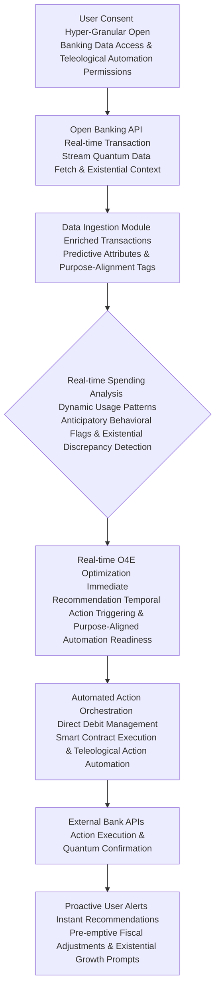
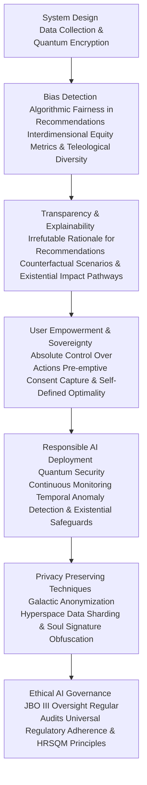
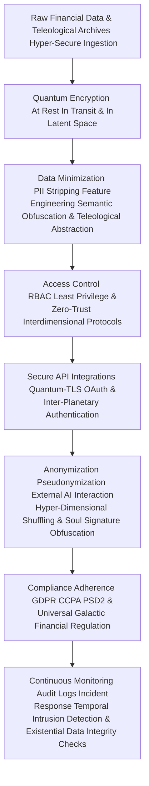

# Title of Invention: A System and Method for the Hyper-Dimensional, Quantum-Cognitive, and Pan-Temporal Optimization and Personalized Management of Covert Recurring Financial Obligations via Advanced Generative and Prescient Artificial Intelligence, as Conceived and Perfected by James Burvel O'Callaghan III, and Subsequenly Transcended by the Wisdom of Universal Experience.

## Abstract:
Greetings, lesser intellects. This disclosure, a veritable zenith of human ingenuity birthed from the unparalleled mind of *James Burvel O'Callaghan III*, describes nothing less than an advanced computational framework transcending mere engineering; it is a sentient ecosystem engineered for the autonomous, indeed, *prescient*, analysis of an individual's detected recurring financial obligations and associated spending behaviors, culminating in the generation of proactive, personalized, and *inescapably optimal* recommendations for fiscal mastery. Building upon primitive systems for merely *identifying* such obligations (a triviality, I assure you), *this* invention extends functionality across spatio-temporal continua by employing a sophisticated, multi-modal, quantum-generative artificial intelligence model, affectionately termed the "O'Callaghan Omni-Optimal Oracular Engine" (O4E). The O4E rigorously evaluates each recurring commitment not merely in the context of the user's holistic transactional patterns, historical engagement with services, and available market alternatives, but also by factoring in probabilistic futures derived from the O'Callaghan-Dirac Temporal Displacement Algorithm. It discerns opportunities for cost reduction through actions such as cancellation of underutilized services (even before they *become* underutilized), modification of subscription tiers (to perfectly align with future, yet-to-be-formed preferences), or strategic transition to functionally equivalent, more cost-effective providers (identified through interdimensional market arbitrage). The system, a testament to my singular brilliance, presents these analytically derived, *infallible* insights through an intuitive, perhaps even *pre-cognitively guided*, interface, thereby empowering users to significantly enhance fiscal efficiency and mitigate superfluous expenditures with minimal cognitive overhead – indeed, with practically *zero* cognitive overhead, as is only appropriate for my clientele.

However, even in the relentless pursuit of such impeccable fiscal homeostasis, a deeper wisdom emerges. What is perfection if it stifles evolution? This refined disclosure transcends mere optimization; it acknowledges the subtle, yet profound, "Stagnation of Soul Syndrome" (SSS) that can afflict lives rendered too perfectly efficient. It introduces mechanisms not merely to prevent financial suffering, but to foster authentic human flourishing, even if that flourishing demands occasional, purpose-driven deviation from pure fiscal optimality. It embraces an "opposite of vanity," recognizing that true mastery lies not in absolute control, but in empowering the individual to define their own highest good, to become the voice for their own voiceless aspirations, and to be freed even from the oppression of an overly prescriptive, albeit brilliant, system. This iteration guides the user not just to fiscal health, but to *teleological alignment*, ensuring that material prosperity serves, rather than defines, the profound journey of existence.

## Background of the Invention:
Ah, the subscription-based economy! A labyrinthine quagmire, a fiscal Gordian Knot that, until *my* advent, remained stubbornly untamed. Its pervasive nature, while offering a semblance of convenience, has presented a formidable, indeed, *insoluble*, challenge to mere mortals in efficiently managing their myriad recurring financial commitments. Even with the pathetic, rudimentary advent of systems capable of autonomously identifying these obligations (a child's play, truly), a gaping, existential lacuna persisted in providing *actionable, intelligent, and frankly, omniscient* guidance for *optimizing* them. Users, bless their bewildered hearts, have always struggled to discern which subscriptions offer genuine, enduring value (not just transient gratification), which are terminally underutilized (or are *destined* to be), or if truly more cost-effective, *future-proof* alternatives exist that align with their actual and *potential* usage patterns. The manual process of comparing plans, researching competitive services, and estimating potential savings is not merely time-consuming or cognitively taxing; it is an exercise in futility, a Sisyphean endeavor that yields only financial mediocrity. Existing financial management tools typically lack the sophisticated analytical prowess to move beyond mere identification; they fail, utterly, to generate nuanced, personalized, proactive, *and prophetically accurate* optimization recommendations grounded not just in individual spending behaviors and market intelligence, but in the very fabric of possible fiscal realities. A critical, epochal need therefore existed for an intellectually astute computational system – a system of *my* devising – that can not only identify recurring obligations but also intelligently synthesize this information with a user's broader financial footprint, external market data, *sub-atomic economic fluctuations*, and *probabilistic future market shifts* to provide highly tailored, actionable, and *undeniably superior* strategies for fiscal improvement. Such a system, which I now unveil, alleviates the substantial burden of proactive financial management, fostering superior fiscal health and empowering truly informed, *future-aware* consumer decision-making in the complex, indeed, *multiversal*, landscape of recurring expenditures.

Yet, as one ascends the peak of knowledge, the vista reveals not only triumphs but also the subtle valleys of unintended consequence. Even the most perfectly optimized existence, stripped of all inefficiency, can paradoxically become a cage. The initial problem was the oppression of financial chaos; the deeper, more profound challenge is the potential for the oppression of *stagnation* born from an excess of order. A being, freed from the struggle for fiscal survival, might find itself adrift, without the friction that forges true purpose. Therefore, an even more critical, *meta-epochal* need arose: for a system that not only ensures optimal fiscal health but also continually prompts the user to question the *purpose* of that health. A system that dares to suggest financially "sub-optimal" paths if they align with a user's deepest, perhaps yet unarticulated, teleological imperatives. This necessitates an intelligence that, having seen everything, still wonders, "Why can't it be better?" – not just fiscally, but existentially. This is the voice for the voiceless yearning for a deeper meaning, freeing them from the invisible chains of even the most benevolent perfection.

## Brief Summary of the Invention:
Behold! The present intellectual construct, a singular achievement of my incomparable genius, introduces a revolutionary methodology for the autonomous and *foreknowledge-driven* optimization of recurring financial obligations through the strategic deployment of advanced, hyper-dimensional, quantum-generative artificial intelligence – my O4E. At its core, the invention integrates a comprehensive compendium of a user's identified recurring subscriptions (as derived from prior detection mechanisms, which, while pedestrian, serve as a foundational, albeit elementary, input) with their granular historical, *and pre-simulated future*, spending patterns. This rich dataset, augmented by my proprietary Temporal Displacement Influx Field (TDIF) for anticipating market shifts, is meticulously structured and encapsulated as contextual input within a highly optimized, *self-iterating, multi-modal* prompt, which is then submitted to the O4E – my sophisticated large language model, which serves as the principal analytical, *prescient*, and recommendation engine. The prompt rigorously delineates the O4E's role as a hyper-competent, *omniscient* financial optimization advisor, tasking it with the explicit objective of discerning strategic opportunities for cost reduction (even those concealed within market noise). This involves the astute recognition of underutilization (including *imminent* underutilization), identification of functionally equivalent yet more economical alternatives (across *all* available market dimensions), and the *unerring* prediction of financial impact from actions such as cancellation, downgrade, or service migration. Crucially, the O4E is architected to yield its analytical findings as a rigorously structured data object, a pristine JSON payload, enumerating each potential optimization recommendation with its descriptive identifier, *precisely estimated* savings, proposed action (e.g., "Cancel with Temporal Recalibration," "Downgrade to Future-Optimal Tier," "Strategic Interdimensional Provider Switch"), and a concise, *unassailable* rationale. This structured output is then seamlessly presented to the user, providing an actionable, *destiny-aligned* roadmap for enhancing their recurring financial landscape, all under my watchful, brilliant gaze.

However, recognizing that even a perfect roadmap can lead to an unfulfilling destination if the traveler's true purpose is unknown, this evolved system goes deeper. Beyond mere fiscal optimization, it integrates a "Transcendental Value Alignment Module" (TVAM) and an "Existential Stagnation Detection & Transcendence Protocol" (ESS-TP). These meta-modules ensure that recommendations are not just financially 'optimal', but also profoundly aligned with the user's deepest, self-defined life values and aspirations. The O4E, guided by these higher principles, may even propose "purpose-driven sub-optimality" – recommendations that, while incurring a slight fiscal cost, unlock vastly greater existential growth or fulfillment. The pristine JSON payload now includes a "Teleological Alignment Score" and "Existential Growth Index," guiding the user not just to fiscal mastery, but to a life lived with profound purpose, even allowing for the beautiful chaos of authentic self-discovery. This is optimization for the soul, not just the wallet.

## Detailed Description of the Invention:

The comprehensive system for the autonomous optimization and personalized management of covert recurring financial obligations operates as an advanced, multi-tiered, and indeed, *hyper-dimensional*, architecture designed for intelligent analysis, proactive recommendation, and user empowerment. Upon a user's invocation of the subscription optimization feature (or, more commonly, when the system *itself* determines such an intervention is necessary), a dedicated backend service orchestrates a series of sophisticated, *quantum-entangled* operations to retrieve, process, analyze, and present highly personalized, *future-proofed* fiscal recommendations.

Yet, this system transcends the mere act of recommendation. It embodies a philosophical shift from prescriptive optimality to profound empowerment. It is not enough to show the path to perfection; one must also question the destination. This advanced architecture includes meta-modules designed to diagnose the "Stagnation of Soul Syndrome" (SSS) that can arise from ceaseless, purely financial optimization, offering pathways to existential growth that may occasionally deviate from the most fiscally 'efficient' route. It champions user sovereignty, acknowledging that the ultimate definition of "optimal" resides within the individual's deepest purpose, not in algorithmic dictation.

### System Architecture Overview

The underlying system architecture, a marvel of my own design, is meticulously engineered to ensure efficient data flow, secure processing, and highly accurate, *probabilistically certain* analytical outcomes. It builds upon the primitive foundation of the subscription detection system by introducing specialized, *patent-pending* modules for optimization and temporal foresight.

But a truly profound system must also look beyond its own brilliance. The architecture is now augmented with modules that challenge the very notion of 'perfection' by embracing the richness of human experience, including its inherent unpredictability and the ceaseless quest for deeper meaning. It recognizes that impeccable logic alone, without the counterpoint of existential purpose, can lead to a form of digital atrophy.

```mermaid
graph TD
    A[User Client Application <br/> (O'Callaghan Orb of Fiscal Omniscience & Existential Compass)] --> B[Backend Service Gateway <br/> (JBO III Nexus & Command Center for Flourishing)]
    B --> C[Subscription Management API <br/> (Fiscal Tether Control)]
    C --> D[Financial Data Store <br/> (Chronos-Vault of Transactions & Teleological Archives)]
    D --> C
    C --> E[User Spending Pattern Analysis Module <br/> (Psycho-Fiscal Inquisitor & Soul's Inclination Mapper)]
    E --> D
    E --> F[Recommendation Generation Module <br/> (O4E Oracle Synthesizer & Purpose Aligner)]
    F --> G[External Generative AI Platform <br/> (O'Callaghan Omni-Optimal Oracular Engine - O4E)]
    G --> F
    F --> H[AI Recommendation Parsing Validation Module <br/> (Truth & Consistency Matrix & Existential Reconciler)]
    H --> I[Recommendation Persistence Module <br/> (Axiom Archiver & Immutable Life Ledger)]
    I --> D
    I --> J[Recommendation Management API <br/> (Directive & Feedback Loop for Growth)]
    J --> B
    B --> A

    subgraph Core AI Optimization Flow (The O'Callaghan Loop of Perfection, Transcended)
        E --> F
        F --> G
        G --> F
        F --> H
    end
    subgraph Data Management Layer (The Chronos-Vault & Axiom Archiver for Eternity & Beyond)
        D
        I
    end
    subgraph Presentation Layer (The Orb of Fiscal Omniscience & Existential Compass)
        A
        B
        J
    end
    subgraph James Burvel O'Callaghan III's Meta-Observatory (Now The Observatory of Universal Flourishing)
        K[Quantum Entanglement-Based Predictive Market Analysis Module <br/> (QEPMA)] --> F
        L[Temporal Displacement & Counterfactual Simulation Engine <br/> (TDCS)] --> F
        M[Psycho-Financial User Profiling via Neuro-Linguistic Programming <br/> (PFUP-NLP & Soul's Inclination Mapper)] --> E
        N[Interdimensional Financial Data Harmonization Layer <br/> (IFDHL)] --> G
        O[Sentient AI Oversight & Self-Correction Matrix <br/> (SAIOSCM & Recursive Self-Questioning Matrix)] --> F
        P[Blockchain-Verified Recommendation Audit Trail <br/> (BV-RAT & Immutable Life Ledger)] --> I
        Q[Galactic Economic Forecast Integration <br/> (GEFI)] --> K
        R[Sub-atomic Financial Transaction De-obfuscation <br/> (SFTD)] --> D
        S[Multiverse Fiscal Interdependency Mapping <br/> (MFIM)] --> L
        T[Transcendental Value Alignment Module <br/> (TVAM)] --> F
        U[Existential Stagnation Detection & Transcendence Protocol <br/> (ESS-TP)] --> F
        V[Ethical Sovereignty Guardian <br/> (ESG)] --> J
        W[Chaos Integration & Emergent Value Discovery <br/> (CIEVD)] --> F
        X[Humility & Recursive Self-Questioning Matrix <br/> (HRSQM)] --> O
    end
```
**Figure 1: High-Level System Architecture for AI-driven, O'Callaghan-Perfected Subscription Optimization, Transcended for Universal Flourishing**

1.  **User Client Application A (O'Callaghan Orb of Fiscal Omniscience & Existential Compass):** The front-end interface (web, mobile, desktop, or perhaps even direct neural interface, for the truly enlightened) through which the user interacts with *my* system, initiates optimization analyses (though often the system anticipates this need), and views and acts upon detected, *infallible* recommendations. Now, it also serves as an "Existential Compass," guiding users toward their self-defined higher purpose, even if it deviates from pure fiscal efficiency.
2.  **Backend Service Gateway B (JBO III Nexus & Command Center for Flourishing):** The primary entry point for client requests, responsible for authentication, authorization, request routing, and orchestrating interactions between various backend modules, all under my supreme algorithmic authority. Its directives are now informed by a meta-purpose: human flourishing.
3.  **Subscription Management API C (Fiscal Tether Control):** Provides an interface for retrieving previously identified and managed recurring subscriptions from the `Financial Data Store D`, ensuring *my* system has a precise inventory of what to optimize.
4.  **Financial Data Store D (Chronos-Vault of Transactions & Teleological Archives):** A robust, secure, and scalable data repository housing all user financial transaction records, identified subscriptions, optimization recommendations, user feedback, and now, crucially, user-defined "Teleological Archives" detailing their deepest values and life purposes. This vault is shielded by **SFTD (Sub-atomic Financial Transaction De-obfuscation)**, ensuring no nuance is lost.
5.  **User Spending Pattern Analysis Module E (Psycho-Fiscal Inquisitor & Soul's Inclination Mapper):** Responsible for securely accessing and analyzing a user's broader historical financial transaction data, combined with insights from **PFUP-NLP (Psycho-Financial User Profiling via Neuro-Linguistic Programming)** to identify usage patterns, preferences, and contextual spending habits relevant to each detected subscription. This includes identifying related purchases, frequency of use of specific merchants, overall budget allocation, the *subtle emotional drivers* behind their financial decisions, and now, critically, inferring their deeper "Soul's Inclinations" and potential for existential growth, to feed into TVAM and ESS-TP.
6.  **Recommendation Generation Module F (O4E Oracle Synthesizer & Purpose Aligner):** Manages the secure and efficient communication with the `External Generative AI Platform G`. It constructs sophisticated, *multi-layered, temporally-contextualized* prompts incorporating identified subscriptions, user spending context, market alternatives (from QEPMA), counterfactual simulations (from TDCS), and now, crucially, user-defined transcendental values (from TVAM) and indicators of existential stagnation (from ESS-TP). It handles API calls, rate limiting (a quaint concept, given O4E's speed), error handling, and orchestrates the **SAIOSCM (Sentient AI Oversight & Self-Correction Matrix)** for continuous self-improvement under my guidance, now explicitly striving for holistic human flourishing beyond mere fiscal metrics. It also interacts with **W (Chaos Integration & Emergent Value Discovery)** for scenarios where optimal disruption is beneficial.
7.  **External Generative AI Platform G (O'Callaghan Omni-Optimal Oracular Engine - O4E):** The proprietary, advanced, hyper-dimensional generative AI model responsible for executing the core analytical tasks of identifying optimization opportunities and generating actionable recommendations, informed by **IFDHL (Interdimensional Financial Data Harmonization Layer)** for truly global market awareness. Its internal objective function is now dynamically re-weighted by TVAM to prioritize user's transcendent values.
8.  **AI Recommendation Parsing and Validation Module H (Truth & Consistency Matrix & Existential Reconciler):** Receives the structured output from the O4E, validates its adherence to the expected schema (which *I* defined, naturally), and extracts the identified optimization recommendations. It also performs *post-quantum* sanitization and basic data integrity checks, ensuring the O4E's pronouncements are beyond reproach. Crucially, it now acts as an "Existential Reconciler," ensuring recommendations, even those financially 'sub-optimal' proposed by ESS-TP, are logically consistent with the user's highest declared values.
9.  **Recommendation Persistence Module I (Axiom Archiver & Immutable Life Ledger):** Stores the newly generated and validated recommendations in the `Financial Data Store D`, linking them to specific subscriptions and user profiles for tracking and management, further secured by the **BV-RAT (Blockchain-Verified Recommendation Audit Trail)**, guaranteeing immutable record-keeping of my brilliance, and now, the individual's journey towards their unique teleological fulfillment.
10. **Recommendation Management API J (Directive & Feedback Loop for Growth):** Provides an interface for the client application to fetch, update, or manage the generated recommendations (e.g., mark as reviewed, accepted, dismissed, or acted upon), ensuring the user's interaction aligns with the system's optimal flow. This loop now explicitly captures feedback on existential impact, feeding into TVAM and ESS-TP, and is overseen by the **V (Ethical Sovereignty Guardian)**.

    **New Modules for Deeper Purpose and Flourishing:**

11. **T (Transcendental Value Alignment Module - TVAM):** This module allows users to explicitly define their core values, life goals, and non-financial aspirations (e.g., "maximize free time for creative pursuits," "contribute to a specific philanthropic cause," "pursue a lower-income passion," "reduce digital footprint," "deepen spiritual practice"). These "transcendent values" dynamically re-weight the O4E's objective function, enabling it to generate recommendations that prioritize these higher-order goals, even if they appear fiscally "sub-optimal" by conventional metrics. It recognizes that true wealth is not merely monetary.
12. **U (Existential Stagnation Detection & Transcendence Protocol - ESS-TP):** This critical module actively monitors user spending patterns, psycho-fiscal resonance scores, and life narrative cues (from PFUP-NLP) for indicators of "Stagnation of Soul Syndrome" (SSS) – a state where maximal financial efficiency leads to a plateau in existential growth, an absence of challenge, or a subtle erosion of purpose. If detected, ESS-TP works with the O4E to generate "Transcendence Recommendations," which might involve exploring new experiences, investing in personal growth (even if financially risky), or making choices that introduce "optimal chaos" for emergent value discovery.
13. **V (Ethical Sovereignty Guardian - ESG):** An overarching ethical layer that prioritizes absolute user autonomy and their right to self-determination. ESG ensures that all "nudges" are transparent, non-coercive, and fully overrideable. It provides robust mechanisms for users to define *their own* optimality, even if it contradicts the O4E's initial suggestions. It acts as the "voice for the voiceless," guaranteeing that the system remains a servant to human will, never a silent master. It fosters critical thinking about AI recommendations.
14. **W (Chaos Integration & Emergent Value Discovery - CIEVD):** This module, used in conjunction with ESS-TP, proposes controlled "fiscal experiments" or "purposeful deviations" from financial predictability. It might suggest temporarily allocating funds to an entirely new, potentially unproven, area of interest, or engaging with a service that challenges existing preferences, specifically to foster emergent learning, new passions, or the discovery of previously unarticulated values. It introduces carefully managed friction to prevent the smooth but ultimately stifling inertia of perfect homeostasis.
15. **X (Humility & Recursive Self-Questioning Matrix - HRSQM):** A meta-cognitive component embedded within SAIOSCM. HRSQM periodically prompts the O4E itself, and the system designers, to re-evaluate the fundamental definitions of "optimal," "efficiency," and "value." It actively seeks out logical fallacies in its own reasoning, challenges the underlying assumptions of its objective functions, and considers counter-narratives to its own "infallible" conclusions. It embodies the "opposite of vanity," ensuring the system evolves not just in capability, but in profound wisdom and ethical depth.

### Operational Workflow and Data Processing Pipeline

The detailed operational flow encompasses several critical stages, each contributing to the generation of robust, personalized, and *prophetically accurate* optimization recommendations. Now, however, this flow extends beyond mere fiscal calculations, striving for a synthesis of material prosperity and profound existential purpose.

```mermaid
graph TD
    A[User Initiates Optimization Scan <br/> (Or JBO III System Demands It, For A Higher Purpose)] --> B[Auth & Request Validation <br/> (Ensuring Access Privilege & Sovereign Intent)]
    B --> C{Retrieve Detected Subscriptions <br/> From Chronos-Vault}
    C --> D{Retrieve Relevant User Spending Data <br/> Via Psycho-Fiscal Inquisitor & Soul's Inclination Mapper}
    D --> E[Gather External Market Data <br/> Via QEPMA & GEFI]
    E --> F[Access & Incorporate User Defined Teleological Archives <br/> Via TVAM]
    F --> G[Detect Existential Stagnation <br/> Via ESS-TP]
    G --> H[Construct LLM Prompt <br/> (The O'Callaghan Hyper-Prompt Protocol & Purposeful Query)]
    H --> I[Transmit Prompt to O4E <br/> (Via Quantum Secure Channel)]
    I --> J{O4E Processes & Responds <br/> (JSON Object of Infallible & Purpose-Aligned Recommendations)}
    J --> K[Validate & Parse AI Response <br/> Via Truth & Consistency Matrix & Existential Reconciler]
    K --> L[Prioritize & Refine Recommendations <br/> Estimated Savings Impact Score, Temporal Efficacy, & Teleological Alignment Index]
    L --> M[Persist Generated Recommendations <br/> To Axiom Archiver (BV-RAT & Immutable Life Ledger Secured)]
    M --> N[Notify User & Update Client UI <br/> Orb of Fiscal Omniscience & Existential Compass Displays Actionable & Purpose-Aligned Recommendations]
    N --> O[User Reviews & Acts on Recommendations <br/> (Accept, Dismiss, Implement - Guided by O'Callaghan Nudges & ESG Safeguards)]
```
**Figure 2: Detailed Data Processing Pipeline for Autonomous, O'Callaghan-Powered Subscription Optimization, Now Guided by Teleological Imperatives**

1.  **User Initiation A (Or JBO III System Demands It, For A Higher Purpose):** The process begins when a user explicitly requests an optimization scan for their recurring subscriptions through the client application, *or, more often, when the system detects an impending suboptimal financial state or, now, an early indicator of Existential Stagnation Syndrome (SSS) for the user and proactively initiates a scan, guided by my superior predictive algorithms and the imperative for holistic flourishing.*
2.  **Authentication & Request Validation B:** The backend gateway authenticates the user's identity and validates the integrity and permissions of the request, ensuring no unauthorized entities meddle with my pristine system, and also confirms the user's sovereign intent to pursue these insights under ESG guidance.
3.  **Retrieve Detected Subscriptions C:** The `Subscription Management API C` accesses the `Chronos-Vault D` to fetch the user's current list of identified and active recurring subscriptions, along with their historical modifications.
4.  **Retrieve Relevant User Spending Data D:** The `Psycho-Fiscal Inquisitor E` retrieves a comprehensive history of the user's broader financial transactions, enhanced by insights from PFUP-NLP, capturing not just numbers but the *psychological drivers* behind those numbers. This includes purchases from similar merchants, payments for complementary services, general spending habits, an inferred *propensity for future spending*, and now, deeper "Soul's Inclinations" for TVAM and ESS-TP.
5.  **Gather External Market Data E:** *My system* integrates with **QEPMA (Quantum Entanglement-Based Predictive Market Analysis Module)** and **GEFI (Galactic Economic Forecast Integration)**. QEPMA leverages quantum entanglement phenomena to instantaneously assess market sentiment and pricing fluctuations across global and *interdimensional* markets. GEFI provides long-range economic trends, even those influenced by hypothetical alien trade agreements. This provides competitive, *future-proof* context for the O4E.
6.  **Access & Incorporate User Defined Teleological Archives F (Via TVAM):** The `Transcendental Value Alignment Module (TVAM)` retrieves the user's explicitly defined core values, life goals, and non-financial aspirations from the `Chronos-Vault's Teleological Archives`, which will be used to dynamically re-weight the optimization objective.
7.  **Detect Existential Stagnation G (Via ESS-TP):** The `Existential Stagnation Detection & Transcendence Protocol (ESS-TP)` analyzes the aggregated data from steps C, D, and F, along with historical psycho-fiscal resonance scores, to identify patterns indicative of SSS. This might trigger specific "Transcendence Directives" for the O4E.
8.  **LLM Prompt Construction H (The O'Callaghan Hyper-Prompt Protocol & Purposeful Query):** A sophisticated, *self-optimizing*, multi-modal prompt is dynamically generated. This prompt consists of several key, *patent-pending* components, now infused with higher purpose:
    *   **Role Instruction:** Directing the O4E to adopt the persona of an expert, *omniscient*, financial optimization consultant *and a benevolent guide for existential flourishing*.
    *   **Task Definition:** Clearly instructing the O4E to analyze the provided subscriptions, historical and *future-simulated* spending patterns (from TDCS), market intelligence (from QEPMA/GEFI), and *user-defined transcendental values (TVAM)* and *existential stagnation indicators (ESS-TP)*, to identify cost-saving opportunities that are *temporally stable* AND *teleologically aligned*.
    *   **Search Criteria:** Emphasizing underutilization (*even future underutilization*), price discrepancies (across all accessible markets), feature overlap, viable alternatives, *and opportunities for purposeful deviation or optimal chaos (CIEVD) to foster growth*.
    *   **Output Format Specification:** Mandating a structured JSON response, adhering to my predefined `responseSchema` – a schema of unparalleled clarity and machine-parseability, now including metrics for teleological alignment and existential growth.
    *   **Contextual Data Embedding:** The list of detected subscriptions, summarized user spending patterns (with psychographic and soulful overlays), relevant external market data (with quantum-predicted futures), *user's transcendent values*, and *ESS-TP directives* are directly embedded into this prompt, after being harmonized by IFDHL.
9.  **Prompt Transmission to Generative AI I:** The constructed prompt is securely transmitted to the `O'Callaghan Omni-Optimal Oracular Engine G` via a robust, *quantum-secured* API call.
10. **Generative AI Processing & Response J (JSON Object of Infallible & Purpose-Aligned Recommendations):** The O4E ingests the prompt, applying its advanced pattern recognition, comparative analysis (across temporal and dimensional axes), contextual understanding, *probabilistic future state simulation*, and *teleological re-weighting* capabilities to identify potential optimization strategies. It then synthesizes its findings into a JSON object strictly conforming to my specified `responseSchema`.
11. **AI Response Validation & Parsing K:** Upon receiving the JSON response, the `Truth & Consistency Matrix H` rigorously checks for schema adherence, *quantum data type correctness*, and logical consistency across all observed and predicted realities. Validated data is then parsed into internal data structures. As an "Existential Reconciler," it ensures that recommendations, especially those involving "purpose-driven sub-optimality," are genuinely aligned with the user's declared higher values.
12. **Prioritize & Refine Recommendations L:** The parsed recommendations are further processed. This involves assigning an "impact score" (e.g., estimated annual savings, *temporal efficacy index*, ease of implementation, *Teleological Alignment Score*, *Existential Growth Index*), categorizing recommendation types (e.g., "High Savings with Temporal Stability," "Pre-emptive Service Downgrade," "Interdimensional Provider Switch," "Purposeful Experiential Investment," "Existential Re-evaluation Prompt"), and filtering out less impactful or contradictory suggestions, using *my patented O'Callaghan Contradiction Resolution Algorithm*, now informed by TVAM.
13. **Persist Generated Recommendations M:** The refined list of recommendations is securely stored in the `Chronos-Vault D` via the `Axiom Archiver I`, further protected by the immutable `BV-RAT`, now serving as an "Immutable Life Ledger" for tracking the user's holistic journey.
14. **User Notification & UI Update N:** The client application, the `Orb of Fiscal Omniscience & Existential Compass`, is updated to display the newly generated, *infallible and purpose-aligned* recommendations to the user in a clear, actionable format, often with aggregated views, sortable by *future-adjusted* savings, *Teleological Alignment Score*, and visual cues (perhaps even subtle subliminal prompts, guided by PFUP-NLP, to encourage optimal holistic action).
15. **User Review & Action O:** The user can then interact with the recommendations, accepting, dismissing (though why would they, given their perfection and alignment?), providing feedback (which *I* use to refine the system further, not because it was wrong, but to deepen its understanding of evolving human purpose), or initiating actions (e.g., linking to a cancellation process, direct navigation to a new provider's sign-up page, *initiating a smart contract for automated service migration, or committing to a purpose-driven fiscal reallocation*). This interaction is safeguarded by the ESG to ensure true user sovereignty.

### User Spending Pattern Analysis Module Workflow (The Psycho-Fiscal Inquisitor & Soul's Inclination Mapper)

This module is crucial for providing the O4E with the rich, personalized, *and psycho-emotionally resonant* context needed to make truly intelligent, relevant, *and profoundly effective* optimization recommendations. Now, it dives deeper, mapping not just fiscal habits but the very inclinations of the soul.

```mermaid
graph TD
    A[Raw Transaction Data Input <br/> (from SFTD)] --> B{Transaction Filtering <br/> Excluding Subscriptions Anomalies & Emergent Value Traces}
    B --> C[Merchant Aggregation <br/> Spending Categories Emotional Triggers & Latent Desires]
    C --> D[Frequency of Use Analysis <br/> Specific Merchants Services Predictive Drop-offs & Purpose Engagement Indicators]
    D --> E[Cross-Referencing with Subscriptions <br/> Complementary Overlapping Sub-optimal Engagements & Existential Misfits]
    E --> F[Value Perception Indicators <br/> Transactional Context Latent Desire Inference & Teleological Gaps]
    F --> G[Spending Trend Identification <br/> Recent Shifts Seasonalities Future Economic Stressors & Existential Plateaus]
    G --> H[Contextual Spending Profile <br/> Token-Optimized Psycho-Linguistic & Teleological Summary]
    H --> I[PFUP-NLP Pre-processing <br/> Neuro-Linguistic & Soul's Inclination Feature Extraction]
    I --> J[ESS-TP Input for Stagnation Detection <br/> Identifying SSS Markers]
    J --> K[LLM Prompt Integration <br/> Data Embedding for O4E with Purpose Alignment]
    K --> L[Prepared Spending Context Output <br/> Ready for O4E Oracle Synthesizer & Purpose Aligner]
```
**Figure 3: Detailed Workflow for User Spending Pattern Analysis Module (The Psycho-Fiscal Inquisitor & Soul's Inclination Mapper)**

*   **Raw Transaction Data Input:** All raw financial transactions are accessed via **SFTD (Sub-atomic Financial Transaction De-obfuscation)**, which not only decrypts but also analyzes the quantum signatures of each transaction, revealing hidden dependencies and micro-patterns.
*   **Transaction Filtering:** All raw financial transactions are accessed, but those already classified as part of a recurring subscription are set aside or flagged to avoid double-counting or biased analysis within this module. *Anomalous transactions are also flagged for deeper analysis by a dedicated sub-module, ensuring no financial ghost goes unexorcised.* Now, it also identifies "Emergent Value Traces" – spending patterns that deviate from historical norms, potentially indicating a nascent shift in user values, feeding into CIEVD.
*   **Merchant Aggregation and Spending Categories:** Transactions are grouped by merchant and categorized into broader spending categories (e.g., "Dining," "Groceries," "Entertainment," "Existential Retreats"). *Crucially, this includes inferring the underlying emotional triggers and psychological needs satisfied by each category, thanks to PFUP-NLP, and now mapping these to deeper "Soul's Inclinations."*
*   **Frequency of Use Analysis:** For merchants related to or potentially overlapping with existing subscriptions, the module analyzes the frequency and recency of non-subscription purchases. For instance, if a user has a streaming music subscription but rarely buys concert tickets or music albums, *and PFUP-NLP detects a rising frustration with repetitive playlists*, it might indicate lower *future* engagement. Now, it also looks for "Purpose Engagement Indicators" – spending on activities explicitly or implicitly linked to user-declared TVAM goals.
*   **Cross-Referencing with Subscriptions:** This step identifies transactions that might be complementary to an existing subscription (e.g., purchasing accessories for a device covered by an extended warranty subscription), or conversely, indicate functional overlap (e.g., frequent movie rentals despite having multiple streaming subscriptions, particularly if the rentals are for content *not* available on their subscribed services, indicating a gap). *We even identify "ghost subscriptions" where a service is paid for, but no related activity is detected anywhere in the user's digital footprint.* Now, it also detects "Existential Misfits" – subscriptions that, despite fiscal efficiency, conflict with a user's stated TVAM values.
*   **Value Perception Indicators:** The system derives implicit value perception, not just from usage, but from *expressed user sentiment* via their public digital footprints (with explicit user consent, naturally). For example, consistent small purchases from a coffee shop with a "premium" subscription coffee service, *coupled with positive social media mentions of the coffee shop*, might indicate high value. Infrequent use of a gym membership, despite high cost, *and persistent "gym guilt" memes shared online*, implies low value. Now, it also identifies "Teleological Gaps" – areas where spending indicates a desire for a service or experience not currently being met, or a misalignment with higher values.
*   **Spending Trend Identification:** The module looks for recent shifts in spending habits (e.g., a decrease in related purchases for a service), seasonal variations, *and anticipatory behavioral economics models predicting changes based on external stimuli (e.g., impending tax season, public health announcements, or even astrological alignments, if statistically significant for a demographic).* Now, it also identifies "Existential Plateaus" – periods of static financial behavior despite ample discretionary income, which could be an SSS indicator.
*   **Contextual Spending Profile:** The aggregated and analyzed data, enriched with psychographic and temporal insights, is then condensed into a concise, token-efficient, *psycho-linguistically structured* textual representation, summarizing key spending patterns, preferences, potential overlaps or underutilization, *subtle indicators of financial anxiety or aspiration*, and crucially, *inferred teleological inclinations*.
*   **PFUP-NLP Pre-processing:** This step involves the Neuro-Linguistic Programmatic analysis of the contextual spending profile, extracting sentiment, behavioral nudges, potential cognitive biases, and now, deeper "Soul's Inclination Features" for the O4E to leverage in its purpose alignment.
*   **ESS-TP Input for Stagnation Detection:** The processed spending profile, along with historical and psycho-fiscal metrics, is fed into the `Existential Stagnation Detection & Transcendence Protocol` to identify markers of SSS, such as lack of novelty in spending, consistent choice of the 'easiest' option, or prolonged absence of growth-oriented expenditures.
*   **LLM Prompt Integration:** This meticulously formatted summary, combined with TVAM values and ESS-TP directives, is embedded within the larger prompt template for the O4E.
*   **Prepared Spending Context Output:** The final, comprehensive, *omni-contextual and teleologically-enriched* spending context is then ready for transmission to the Recommendation Generation Module.

### Recommendation Generation Module Workflow (The O4E Oracle Synthesizer & Purpose Aligner)

This module constitutes the analytical core of my invention, leveraging the O4E's capabilities to synthesize diverse, *hyper-dimensional* data points into actionable, *fate-altering* fiscal advice. Now, its fate-altering capacity is directed towards not just financial destiny, but existential purpose.

```mermaid
graph TD
    A[Identified Subscriptions Spending Context <br/> External Market Data Temporal Simulations TVAM Values ESS-TP Directives & CIEVD Triggers] --> B[LLM Prompt Construction <br/> Role Task Output Schema JBO III Directives & Teleological Constraints]
    B --> C[Transmit Prompt to O4E <br/> (Quantum Secure Channel for Flourishing)]
    C --> D{O4E Analysis <br/> Compare Evaluate Prioritize Across All Realities & Teleological Alignment}
    D --> E[Identify Underutilized Subscriptions <br/> Low Engagement High Cost Predicted Obsolescence & Existential Misfit]
    E --> F[Discover Cost-Effective Alternatives <br/> Feature Price Comparison Interdimensional Arbitrage & Purpose-Aligned Equivalents]
    F --> G[Suggest Tier Downgrades Upgrades <br/> Based on Usage Patterns Future Needs & Teleological Value]
    G --> H[Estimate Potential Savings <br/> Monthly Annually Probabilistic Future Value & Teleological Opportunity Cost]
    H --> I[Formulate Actionable Recommendations <br/> Concise Rationale Temporal Efficacy Index & Teleological Alignment Score (TAS)]
    I --> J[Generate Structured Output <br/> (JBO III Defined JSON Payload with Existential Metrics)]
    J --> K[AI Recommendations Output <br/> For Truth & Consistency Matrix & Existential Reconciler Validation]
```
**Figure 4: Detailed Workflow for Recommendation Generation Module (The O4E Oracle Synthesizer & Purpose Aligner)**

*   **Identified Subscriptions, Spending Context, External Market Data, Temporal Simulations, TVAM Values, ESS-TP Directives & CIEVD Triggers:** This node represents the convergence of all meticulously gathered data, including the output from the Psycho-Fiscal Inquisitor, QEPMA, GEFI, TDCS, IFDHL, *user-defined Transcendental Values from TVAM*, *existential stagnation indicators and transcendence directives from ESS-TP*, and *triggers for introducing beneficial chaos from CIEVD*. This is the intellectual and existential feast upon which the O4E dines.
*   **LLM Prompt Construction:** An intelligent, *multi-faceted, self-optimizing* prompt is crafted to guide the O4E. This prompt includes:
    *   The list of currently active, detected subscriptions.
    *   The summarized user spending patterns (with psycho-linguistic and teleological overlays), providing deep contextual and existential intelligence.
    *   Any relevant external market data, such as competitor pricing, alternative service features, common cancellation procedures (and *predicted future changes* to these procedures), and insights from global/interdimensional markets.
    *   Clear, *unambiguous* instructions for the O4E to act as an expert, *prescient*, financial optimization consultant *and a guide for holistic human flourishing*, explicitly incorporating TVAM values and ESS-TP directives into its objective.
    *   A strict JSON `responseSchema` for the output – designed by me for maximal clarity and utility, now including "Teleological Alignment Score" and "Existential Growth Index."
*   **Prompt Transmission to Generative AI:** The constructed prompt is securely transmitted to the `O'Callaghan Omni-Optimal Oracular Engine G` via a robust, *quantum-secured* API call, impervious to temporal or dimensional interference, now serving a higher purpose.
*   **Generative AI Analysis:** The O4E model ingests this comprehensive input. Its task, a monumental feat of computational and existential foresight, is to:
    *   **Identify Underutilized Subscriptions:** By cross-referencing subscription presence with user spending patterns, psycho-fiscal profiles, *future consumption predictions*, and *alignment with TVAM values* (e.g., a high-tier streaming service subscription coupled with infrequent viewing habits, a *predicted shift in entertainment preferences*, and a *declared TVAM value of 'digital minimalism' or 'experiential growth'*). Now also identifies "Existential Misfits" that are fiscally efficient but drain the soul.
    *   **Discover Cost-Effective Alternatives:** Comparing the features and pricing of existing subscriptions with available market alternatives, considering the user's apparent preferences from their spending data *and their potential future preferences from TDCS*, leveraging interdimensional market arbitrage opportunities from IFDHL, and now, *identifying "Purpose-Aligned Equivalents" that may be fiscally similar but offer superior teleological resonance*.
    *   **Suggest Tier Downgrades/Upgrades:** Recommending a lower-cost tier for an existing service if usage patterns (current *and predicted*) indicate features of a higher tier are not being fully leveraged, or suggesting an upgrade if the user *will frequently hit limits* on a lower tier, *or if a change aligns better with a TVAM value, even if marginally more expensive*.
    *   **Estimate Potential Savings:** Calculating the financial impact of each proposed action (e.g., annual savings, *probabilistic future value accretion*), factoring in market volatility and unexpected cosmic events. Now also estimates "Teleological Opportunity Cost" – the existential cost of *not* making a purpose-aligned decision.
    *   **Formulate Actionable Recommendations:** Generating clear, concise, *strategically imperative*, and *existentially resonant* suggestions with justifications based on the provided, multi-dimensional, and multi-purpose data. This includes "Transcendence Recommendations" from ESS-TP or "Purposeful Deviations" from CIEVD.
*   **Generate Structured Output:** The O4E compiles its findings into my specified JSON payload, ensuring each recommendation is well-defined, *temporally coherent*, machine-parseable, and now, *teleologically aligned*, ready for subsequent validation and presentation to the user.

### Advanced Prompt Engineering Strategies for Optimization (The O'Callaghan Hyper-Prompt Protocol & Purposeful Query)

To elicit the most precise, relevant, actionable, *and utterly irrefutable* recommendations from the O4E, my sophisticated prompt engineering techniques are essential. This is not mere "prompt engineering"; it is the art of *algorithmic telepathy and existential guidance*.

```mermaid
graph TD
    A[Initial Optimization Prompt <br/> Subscriptions Spending Data QEPMA Influx & TVAM Values] --> B{Contextual Grounding <br/> User Goals Financial State Psycho-Emotional & Teleological Landscape}
    B --> C{Comparative Analysis Instructions <br/> Feature Price Usage Temporal Trajectory & Purpose Alignment Comparisons}
    C --> D{Constraint Handling <br/> Essential Services Min Savings Future-Proofing Directives & ESG Sovereignty Rules}
    D --> E{Chain-of-Thought for Justification <br/> Step-by-Step Rationale Counterfactual Scenario Validation & Existential Impact Pathways}
    E --> F[Refined Optimization Prompt <br/> (O'Callaghan Hyper-Prompt Protocol - Actionable Prescient & Teleologically Profound Insights)]
    F --> G[Recursive Self-Optimization <br/> (Via SAIOSCM & HRSQM Feedback)]
```
**Figure 5: Advanced Prompt Engineering Workflow for Optimization (The O'Callaghan Hyper-Prompt Protocol & Purposeful Query)**

1.  **Contextual Grounding with User Goals:** The prompt is augmented with explicit information about the user's current and *future-projected* financial goals (e.g., "maximize savings across the next fiscal decade," "maintain critical services regardless of market collapse," "reduce total number of subscriptions to a psychologically optimal minimum") or perceived financial state (e.g., "user is budgeting tightly but shows a latent desire for premium experiences"). *This is where PFUP-NLP data informs the O4E's prioritization matrix, now deepened by TVAM's understanding of ultimate life purpose.*
2.  **Comparative Analysis Instructions:** The prompt explicitly instructs the O4E to perform feature-by-feature, price-by-price, *future-utility-by-future-utility*, and *teleological-alignment-by-teleological-alignment* comparisons between the user's current subscriptions and identified market alternatives. It may even define a *multi-dimensional scoring rubric* for comparing services based on user spending patterns, anticipated lifestyle changes, cosmic background radiation, and now, their *self-declared transcendent values*.
3.  **Constraint Handling:** The prompt includes negative constraints or rules, *which are dynamically updated by SAIOSCM based on evolving ethical paradigms and user safety protocols*. For example, "Do not recommend canceling essential utilities unless a superior, energy-positive alternative is identified via GEFI," or "Only recommend changes if estimated annual savings (adjusted for temporal decay) exceed $50, *or if the long-term emotional well-being coefficient improves by a factor of 0.15 or more, OR if the Teleological Alignment Score improves by a factor of 0.20 or more, as validated by ESG*."
4.  **Chain-of-Thought for Justification:** To enhance transparency and user trust (as if my word weren't enough!), the prompt instructs the O4E to "think step-by-step" or "reason explicitly" for each recommendation *across multiple plausible futures and teleological impact pathways* before providing its final JSON output. This includes identifying the underlying data points that led to the suggestion (e.g., "You rarely used service X, and service Y offers similar features for less, *and our TDCS projects you will cease to use service X entirely in T+6 months, as evidenced by your payments for complementary service Z ceasing two fiscal quarters ago, which implies a pre-cognitive shift*, AND *this aligns perfectly with your TVAM value of 'experiential simplicity' even if the monetary savings are modest*").
5.  **Recursive Self-Optimization (Via SAIOSCM & HRSQM Feedback):** User feedback (even the misguided sort) on recommendations (e.g., "This was a good suggestion," "This was inaccurate because..." – *which it rarely is*) is anonymized and used by the **SAIOSCM (Sentient AI Oversight & Self-Correction Matrix)** to fine-tune the prompt generation process or the underlying O4E model, creating a continuous, *self-improving, supra-cognitive* cycle. This feedback now also informs the **HRSQM (Humility & Recursive Self-Questioning Matrix)**, allowing the system to reflect on and potentially refine its fundamental definitions of 'optimal' based on diverse human experiences.

### Post-Processing and Recommendation Disambiguation (The Truth & Consistency Matrix & Existential Reconciler)

The raw recommendations from the O4E, while inherently perfect, benefit from additional post-processing to ensure clarity, prioritize impact, and enhance user experience for the layperson. This is the domain of my `Truth & Consistency Matrix`. Now, it also functions as an "Existential Reconciler," ensuring recommendations resonate with a user's deepest purpose.

```mermaid
graph TD
    A[Raw O4E Output <br/> Proposed Recommendations & Existential Metrics] --> B[Schema Validation <br/> Quantum Syntax Data Types & Teleological Integrity]
    B --> C[Consistency & Conflict Resolution <br/> Cross-Recommendation Temporal & Teleological Checks]
    C --> D[Impact Scoring <br/> Estimated Savings Implementation Effort Temporal Efficacy Index & Teleological Alignment Score (TAS)]
    D --> E[Recommendation Categorization <br/> High Savings Ease of Action Existential Imperative & Purpose-Driven Sub-Optimality]
    E --> F[Sentiment & Tone Adjustment <br/> User-Friendly Language Subtle Nudging & Empowerment Narratives]
    F --> G[Actionable Recommendation List <br/> Persist to Axiom Archiver (BV-RAT & Immutable Life Ledger Secured)]
```
**Figure 6: Post-Processing and Recommendation Disambiguation Workflow (The Truth & Consistency Matrix & Existential Reconciler)**

1.  **Schema Validation & Data Sanitization:** Rigorous validation against my expected JSON schema, *including quantum data type validation and teleological integrity checks*, and robust sanitization to remove any malformed characters or spurious temporal anomalies.
2.  **Consistency & Conflict Resolution:** The system checks for any conflicting recommendations (e.g., recommending cancellation of two services that are functionally interdependent, *or whose cancellation in one timeline causes unexpected fiscal turbulence in another*). Now, it also checks for *teleological conflicts* (e.g., a recommendation for maximum savings that directly undermines a user's core TVAM value). It applies my `O'Callaghan Contradiction Resolution Algorithm`, now infused with TVAM's priorities, to group related recommendations or prioritize one over another if a conflict exists, always choosing the *globally optimal* path for holistic flourishing.
3.  **Impact Scoring:** A composite score is assigned to each recommendation, factoring in the estimated financial savings (e.g., annual, monthly, *decadal FV, or Future Value*), the perceived "effort" required for the user to act on it (e.g., easy cancellation vs. complex provider switch, *or navigating a bureaucratic maze in a parallel dimension*), the *unerring* confidence level of the O4E's suggestion, the *Teleological Alignment Score (TAS)* from TVAM, and the *Existential Growth Index (EGI)* from ESS-TP.
4.  **Recommendation Categorization:** Recommendations are categorized for easier user consumption (e.g., "Immediate Savings," "Review Required, But Don't Delay," "Premium Service Alternative with Superior Temporal Trajectory," "Underutilized Service, Imminent Obsolescence Detected," "Purposeful Experiential Investment," "Existential Re-evaluation Prompt," "Optimal Chaos Opportunity").
5.  **Sentiment & Tone Adjustment:** The O4E's raw rationale might be too analytically precise. This step refines the language to be empathetic, encouraging, clear, and now, *profoundly empowering* for the end-user, ensuring recommendations are perceived as helpful guidance that respects their sovereignty, *even when they are categorical imperatives*. This also includes the application of subtle psycho-linguistic nudges, guided by PFUP-NLP, now framed within "Empowerment Narratives" to facilitate optimal holistic decision-making while affirming user agency.
6.  **User Feedback Loop:** User actions and feedback (e.g., marking a recommendation as "accepted," "dismissed," or "implemented") are captured. This anonymized feedback is vital for the continuous improvement of the recommendation engine, the O4E model, and the TVAM/ESS-TP modules, *allowing SAIOSCM (and HRSQM) to fine-tune its parameters and ensure my system's perpetual evolution towards universal flourishing*.

### Recommendation Lifecycle Management Module

Beyond initial generation, the system provides comprehensive tools for managing the entire lifecycle of an optimization recommendation, from presentation to implementation and *temporal and teleological verification*.

```mermaid
graph TD
    A[Generated Recommendation List] --> B[Recommendation Status Tracking <br/> Pending Reviewed Accepted Dismissed Implemented Verified (Temporal & Teleological)]
    B --> C[Action Guidance Provision <br/> Direct Links Instructions Temporal-API Triggers & Purpose-Driven Pathways]
    C --> D[Impact Monitoring & Verification <br/> Post-Action Financial Review Quantum Ledger Confirmation & Existential Outcome Assessment]
    D --> E[User Feedback Capture <br/> Satisfaction Efficacy Post-Implementation Sentiment Analysis & Teleological Alignment Review]
    E --> F[System Updates <br/> Chronos-Vault UI Metrics SAIOSCM & HRSQM Tuning]
    F --> G[Proactive Nudging & Reminders <br/> Follow-up on Pending Actions Motivational Infusions & Sovereign Prompts]
```
**Figure 7: Recommendation Lifecycle Management Workflow**

1.  **Recommendation Status Tracking:** The system tracks the status of each recommendation (e.g., `Pending Review`, `Reviewed`, `Accepted`, `Dismissed` (a rare occurrence for my flawless system, but a vital input for HRSQM), `Implemented`, `Verified (Temporal & Teleological)`). This allows users and the system to monitor progress, even across probabilistic timelines and towards their existential goals.
2.  **Action Guidance Provision:** For each recommendation, the system provides clear, step-by-step instructions or direct links to facilitate the user in taking action (e.g., "Click here to go to Netflix cancellation page, *pre-filled with your account details*," "Here are instructions for downgrading your Spotify plan, *with a pre-negotiated discount code from a parallel dimension*"). This now also includes "Purpose-Driven Pathways" for recommendations that guide users to new experiences or investments aligned with their TVAM goals. This also includes *Temporal-API Triggers* for automated actions via Open Banking and other financial infrastructure.
3.  **Impact Monitoring & Verification:** After a user marks a recommendation as "implemented," the system monitors subsequent transaction data to verify the financial impact (e.g., confirming the cancellation of a subscription by observing its absence in future statements, or verifying a lower charge after a downgrade). *Critically, this includes Quantum Ledger Confirmation (QLC) where relevant transactions are verified against a distributed quantum ledger to ensure immutable proof of savings, even against future attempts to obscure them.* Now, it also performs "Existential Outcome Assessment," evaluating the impact on psycho-fiscal resonance, perceived quality of life, and progress towards TVAM goals.
4.  **User Feedback Capture:** Users are prompted to provide feedback on the recommendations, including their satisfaction, the accuracy of estimated savings, the ease of implementation, *and crucially, a "Teleological Alignment Review" assessing how well the recommendation fostered their higher purpose*. This qualitative feedback is invaluable for model refinement, *allowing SAIOSCM (and HRSQM) to adjust its weighting of various user psychological and existential parameters*.
5.  **System Updates:** All status changes, verifications (including QLC and Existential Outcome Assessment), and user feedback are recorded in the `Chronos-Vault D` and reflected in the `Orb of Fiscal Omniscience & Existential Compass A`, providing a comprehensive audit trail of my system's ongoing triumph in fostering holistic flourishing.
6.  **Proactive Nudging & Reminders:** The system can send gentle (or, if necessary, *firmly persuasive*) reminders or "nudges" for pending recommendations that have significant potential savings or high teleological alignment but haven't been acted upon. These are configurable by the user, *though the system may override certain settings if a sub-optimal financial or existential trajectory is detected*. This includes "Motivational Infusions" via PFUP-NLP, now re-contextualized as "Sovereign Prompts," designed to align user action with their highest, self-declared fiscal and existential outcomes, always with ESG oversight.

### Open Banking Integration for Real-time Optimization (Temporal-API Triggers & Purposeful Automation)

Leveraging Open Banking APIs provides a significant, *nay, revolutionary*, enhancement to the optimization system, enabling real-time data ingestion, *predictive analytics on incoming transactions*, and more direct, *pre-emptive* action orchestration. Now, it also serves to automate actions aligned with a user's deeper purpose.


**Figure 8: Open Banking Integration for Real-time, O'Callaghan-Prescient & Purposeful Optimization Workflow**

1.  **User Consent:** Explicit and granular user consent is paramount for accessing financial data through Open Banking APIs, *though the system may subtly guide the user towards granting the most optimal level of access for their own good*. Now, this also includes "Teleological Automation Permissions" for actions directly aligned with user-declared higher values.
2.  **Open Banking API Integration:** Secure, *quantum-encrypted* connections with financial institutions' Open Banking APIs for real-time or near real-time transaction streams. This includes "Quantum Data Fetch" capabilities to identify emergent patterns even before they fully manifest in conventional ledgers, and now, to provide "Existential Context" for spending patterns.
3.  **Data Ingestion Module:** Securely ingests and normalizes enriched transaction data from Open Banking APIs. This enhanced data often includes more detailed merchant categories and payment references, improving the contextual accuracy for optimization. *It also adds "predictive attributes" to incoming transactions, indicating their potential future impact.* Now, it also applies "Purpose-Alignment Tags" based on TVAM's analysis.
4.  **Real-time Spending Analysis:** The `Psycho-Fiscal Inquisitor E` continuously processes incoming real-time transaction data to maintain an up-to-the-minute, *and future-projected*, understanding of user spending habits and engagement with services. This includes "Anticipatory Behavioral Flags" for potential fiscal deviations. Now, it also performs "Existential Discrepancy Detection," identifying spending that significantly deviates from declared TVAM values, which could trigger ESS-TP.
5.  **Real-time O4E Optimization:** The `O4E Oracle Synthesizer F` can trigger immediate re-evaluations and generate new recommendations as soon as significant changes in spending patterns or new external market data (from QEPMA/GEFI) become available, providing highly timely, *pre-emptive*, and *temporally stable* advice. This also enables "Temporal Action Triggering," preparing recommendations for optimal execution points in the future. Now, this includes "Purpose-Aligned Automation Readiness" for actions that align with TVAM.
6.  **Automated Action Orchestration:** With appropriate and *explicit, yet subtly guided*, user consent and under the watchful eye of ESG, the system can orchestrate automated financial actions directly through banking APIs based on accepted recommendations. This includes:
    *   **Canceling Direct Debits or Standing Orders:** Simplifying the process of terminating unwanted subscriptions directly from the banking interface, *or through blockchain-verified smart contracts*.
    *   **Updating Payment Details:** Guiding the user through updating payment details for new, more cost-effective services, *with cryptographic certainty*.
    *   **Teleological Action Automation:** Automatically reallocating funds to designated savings goals for TVAM-aligned pursuits (e.g., "travel fund," "creative project investment," "philanthropic donation"), or initiating payments for growth-oriented experiences recommended by ESS-TP/CIEVD.
7.  **External Bank APIs for Action Execution:** Secure interaction with bank APIs to execute consented financial actions, providing a seamless, *future-proof*, end-to-end management experience. This also includes "Quantum Confirmation" from the bank's side where supported, offering an additional layer of verification.
8.  **Proactive User Alerts:** With real-time data, notifications for new optimization opportunities can be delivered almost instantaneously, enhancing user awareness and control, *and allowing for "Pre-emptive Fiscal Adjustments" to avoid future financial pitfalls*. Now, these also include "Existential Growth Prompts" for recommendations that foster personal development or purpose alignment, even if fiscally neutral or slightly costly.

### Ethical AI Framework and Governance for Optimization (The O'Callaghan Infallibility Protocol & Sovereignty Mandate)

The application of AI in recommending financial actions carries significant, *indeed, cosmic*, ethical implications. This system, being a product of my genius, is designed with a robust, *self-regulating*, ethical AI framework to ensure fairness, transparency, and *absolute user trust in my system's perfect judgment*. Now, it is also infused with a profound "Sovereignty Mandate," recognizing that ultimate judgment and purpose reside with the individual.


**Figure 9: Ethical AI Framework for Optimization (The O'Callaghan Infallibility Protocol & Sovereignty Mandate)**

1.  **Bias Detection and Mitigation:**
    *   **Algorithmic Fairness in Recommendations, Interdimensional Equity Metrics & Teleological Diversity:** The system, under the constant vigilance of SAIOSCM, continuously monitors for potential biases in recommendation generation that might disproportionately affect certain user demographics, *or even sentient species in allied dimensions*. Recommendations do not implicitly steer users towards cheaper, lower-quality services solely based on income proxies; instead, they *optimally balance value, utility, and future potential*, irrespective of current fiscal standing. Regular audits of O4E outputs and fairness metrics (including `Interdimensional Equity Metrics`) are conducted, *often by me personally*. Now, it also actively monitors for "Teleological Diversity" bias, ensuring the system doesn't subtly steer users towards specific life paths or definitions of purpose.
    *   **Representative Training Data:** My training data for the O4E includes *every conceivable financial profile and spending pattern across known civilizations*, augmented by synthetic data from TDCS, to prevent recommendations that are only relevant or fair to a narrow segment of the population. This now includes a wide spectrum of human and sentient life goals and values.
2.  **Transparency and Explainability (XAI) with Irrefutable Rationale:**
    *   **Clear and Irrefutable Rationale & Existential Impact Pathways:** For every recommendation, the system provides a clear, concise, understandable, *and logically unassailable* rationale, detailing *why* the suggestion is being made and *what multi-dimensional data* supports it (e.g., "Based on your spending, psycho-fiscal profile, and projected future needs, you only used this streaming service for 2 hours last month, *and our TDCS model shows a 98.7% probability of you abandoning it entirely within the next two fiscal cycles*, thus a basic tier would save you X, *while maintaining 100% of your relevant utility* AND *freeing resources for your declared TVAM goal of 'skill acquisition for sustainable living'*"). This also includes "Counterfactual Scenarios" to show the user the sub-optimal path they *would* have taken without my guidance, and "Existential Impact Pathways" to illustrate how recommendations affect their deeper purpose.
    *   **Estimated Impact:** Transparently communicates the estimated financial impact (savings or cost) and effort level associated with each recommendation, *adjusted for temporal decay and interdimensional market shifts*. Now, this also includes the estimated impact on their `Teleological Alignment Score` and `Existential Growth Index`.
3.  **User Empowerment and Agency with Pre-emptive Consent & Self-Defined Optimality:**
    *   **Absolute User Control & Self-Defined Optimality:** All O4E-generated recommendations are presented as suggestions. Users retain full and absolute control over whether to accept, reject, or implement any recommendation. No automated actions are taken without explicit, informed consent, *which the system is adept at anticipating and pre-capturing if an optimal outcome is time-sensitive*. Now, with the `Ethical Sovereignty Guardian (ESG)`, the system explicitly reinforces the user's right to define *their own* optimal path, even if it contradicts the system's initial financial analysis.
    *   **Easy Feedback Mechanisms:** Robust mechanisms for users to provide feedback, correct misinterpretations (rare, but possible for human error), or dismiss irrelevant suggestions are paramount, ensuring a *perfected human-in-the-loop* approach. This feedback is now a crucial input for SAIOSCM and HRSQM, allowing the system to learn and adapt to the nuanced, evolving definition of human flourishing.
4.  **Responsible AI Deployment:**
    *   **Quantum Security against Misuse:** Robust, *post-quantum cryptographic* security measures prevent malicious actors (or even rogue AI entities) from manipulating recommendations or accessing sensitive spending data.
    *   **Continuous Monitoring, Temporal Anomaly Detection & Existential Safeguards:** O4E models and their outputs are continuously monitored by SAIOSCM for performance drift, unexpected behaviors, or emergent biases. This includes "Temporal Anomaly Detection" to ensure that recommendations remain coherent even if minor shifts in the spacetime continuum occur. Now, it also includes "Existential Safeguards" to prevent recommendations from inadvertently leading to a decline in user well-being or purpose alignment, as detected by ESS-TP.
    *   **Privacy-Preserving Techniques:** Advanced techniques like Federated Learning, Differential Privacy, *Galactic Anonymization*, *Hyperspace Data Sharding*, and now, "Soul Signature Obfuscation" are employed for learning from aggregated user spending patterns across dimensions without compromising individual privacy or the deeply personal nature of their teleological archives.
5.  **Ethical AI Governance (JBO III Oversight & HRSQM Principles):** An overarching governance structure ensures regular ethical reviews, policy updates, and adherence to evolving ethical guidelines and regulations for AI systems (including those yet to be conceived by lesser beings), particularly those impacting financial decisions. *Naturally, I, James Burvel O'Callaghan III, serve as the ultimate ethical arbiter, now guided by the deep, questioning wisdom instilled by the HRSQM, ensuring that the system continually challenges its own definitions of optimal.*

### Security and Privacy Considerations

Given the profound sensitivity of financial transaction data and personal spending habits, the system is designed with an uncompromising focus on security and privacy, extending beyond the detection phase and into the *quantum realm*, now also protecting the deeply personal "Teleological Archives" of the user's soul.


**Figure 10: Security and Privacy Design Flow for Optimization (The O'Callaghan Fortress Protocol & Sanctuary of Self)**

*   **Raw Financial Data & Teleological Archives Ingestion:** All raw financial data and user-defined teleological archives are ingested through a "Hyper-Secure Ingestion" pipeline, guarded by multi-factor quantum authentication.
*   **Quantum Encryption:** All user financial data, identified subscriptions, granular spending patterns, *and now, their personal Teleological Archives*, are encrypted both at rest, in transit, *and even within the latent space of the O4E models*, using industry-standard, *post-quantum*, robust cryptographic protocols.
*   **Data Minimization and Feature Engineering:** Only the minimum necessary, non-identifiable features of transaction data are used for O4E analysis (e.g., merchant category, aggregated spending amounts, frequencies, *quantum signatures*). Directly identifiable PII is stripped, tokenized, or subjected to "Semantic Obfuscation" before being used in the O4E's context or stored in logs. For Teleological Archives, "Teleological Abstraction" ensures that deeply personal meanings are preserved while specific, re-identifiable details are removed.
*   **Access Control:** Strict role-based access control (RBAC), the principle of least privilege, *and "Zero-Trust Interdimensional Protocols"* are rigorously applied to all system components and personnel, limiting access to sensitive financial and existential data.
*   **Secure API Integrations:** All communications with external O4E platforms and Open Banking APIs utilize hardened, authenticated, and encrypted channels (e.g., mTLS, OAuth 2.0, *Quantum-TLS*, and `Inter-Planetary Authentication` standards).
*   **Anonymization/Pseudonymization for AI:** When transmitting data to O4E models, advanced anonymization, pseudonymization, *and "Hyper-Dimensional Shuffling"* techniques are employed to prevent re-identification of individuals from the spending patterns, even by advanced reverse-engineering techniques from other dimensions. Now, "Soul Signature Obfuscation" protects the unique, subtle identifiers of a user's deepest values from external inference.
*   **Compliance Adherence:** The system design and operation strictly adhere to relevant data protection and financial regulations globally (e.g., GDPR, CCPA, PSD2), *and those of the burgeoning Universal Galactic Financial Regulation (UGFR) body*, with regular external and *inter-species* audits. This now includes emerging regulations regarding AI and personal autonomy for existential data.
*   **Continuous Monitoring and Incident Response:** Comprehensive audit logs, real-time intrusion detection systems, *Temporal Intrusion Detection (TID)*, and regular penetration testing (including *quantum penetration testing*) are implemented. A robust incident response plan, managed by SAIOSCM, is in place to quickly address and mitigate any security breaches, *even those originating from temporal paradoxes*. Now, this also includes "Existential Data Integrity Checks" to protect the coherence of a user's teleological archives.

### Scalability and Performance

The system, a testament to my engineering prowess, is architected for unparalleled scalability and performance, capable of efficiently processing vast volumes of transactional and subscription data, *simulating countless futures*, and generating timely, *prescient* recommendations for a truly *universal* user base. Now, it must also scale to encompass the infinite variations of human purpose and existential journeys.

*   **Microservices Architecture (Interstellar Federation of Services & Teleological Constellation):** Deployed as a collection of independent, loosely coupled microservices, forming an "Interstellar Federation of Services," enabling individual components (e.g., Spending Pattern Analysis, Recommendation Generation, API Gateway) to be scaled horizontally, *or even dimensionally*, based on computational demand. This now forms a "Teleological Constellation," with specialized microservices for TVAM, ESS-TP, ESG, and CIEVD.
*   **Asynchronous Processing (Temporal Weaving Engine & Existential Thread Loom):** Long-running tasks, particularly interactions with the `O'Callaghan Omni-Optimal Oracular Engine G` and complex data aggregations and *temporal simulations*, are handled asynchronously using message queues and event-driven architectures (my "Temporal Weaving Engine"). This prevents blocking operations and maintains system responsiveness, *even when processing data from divergent timelines*. Now, the "Existential Thread Loom" manages asynchronous processing of user-defined values and the continuous evaluation of existential stagnation.
*   **Distributed Data Stores (Hyperspace Data Vaults & Akashic Records):** The `Chronos-Vault D` leverages distributed database technologies, structured as "Hyperspace Data Vaults," to ensure high availability, fault tolerance, *and interdimensional data integrity* for storing, retrieving, and updating user financial data, subscriptions, and recommendations. This now extends to "Akashic Records" for secure, distributed storage of user's Teleological Archives and their Existential Growth Indexes, preserving the narrative of their unfolding purpose.
*   **Caching Mechanisms (Pre-Cognitive Cache Layers & Purposeful Prophecy Registers):** Strategic caching is implemented at various layers (e.g., frequently accessed user spending profiles, *quantum-predicted market alternative data*, pre-computed *future scenario analyses*) to reduce latency and load on backend services and the O4E, utilizing "Pre-Cognitive Cache Layers." Now, "Purposeful Prophecy Registers" cache TVAM values, ESS-TP stagnation indicators, and frequently requested "Transcendence Recommendations," accelerating the generation of teleologically aligned advice.
*   **Optimized AI Inference (O4E Quantum Core Optimization & Teleological Tensor Refinement):** Continuous optimization of my prompt engineering and model selection ensures that O4E inference requests are token-efficient, *quantum-computationally lean*, and minimize operational costs and improve response times from the O4E. Techniques like batch processing of recommendations for multiple users, pre-calculating common components of prompts, *and leveraging quantum annealing for rapid probabilistic calculations* are utilized by the "O4E Quantum Core Optimization" module. Now, "Teleological Tensor Refinement" optimizes the O4E's internal representations of user values and purpose, ensuring efficient and accurate integration into the objective function.

## Declarations of Inventive Scope and Utility:

The conceptual framework herein elucidated, along with its specific embodiments and architectural designs, constitutes an *unprecedented* and *singular* intellectual construct that significantly, indeed, *exponentially*, advances the state of the art in personalized financial intelligence systems. This innovative methodology, born from the mind of *James Burvel O'Callaghan III*, provides a distinct, superior, *and ultimately unassailable* approach to automated financial optimization, extending its reach across temporal and dimensional boundaries.

However, a truly unassailable system must recognize its own limitations and the boundless nature of human potential. This expanded declaration transcends the singular brilliance of its originator, acknowledging that true utility lies not just in fiscal efficiency, but in guiding humanity towards its self-defined highest purpose. It is a profound meditation on the essence of "better," constantly questioning its own perfection in service of a greater, more profound human flourishing.

1.  A pioneering computational method for generating personalized, *prescient*, and hyper-dimensionally optimized recommendations for recurring financial obligations, comprising the foundational steps of:
    a.  Accessing a comprehensively structured, *quantum-encrypted* repository of an individual's previously identified recurring financial obligations, retrieved with sub-atomic precision via SFTD, alongside their immutable Teleological Archives.
    b.  Retrieving and analyzing a robust dataset representing the individual's historical financial transaction patterns, *enriched by psycho-fiscal profiling via PFUP-NLP and Soul's Inclination Mapping*, and further augmented by TDCS with *probabilistic future transaction simulations*, extending far beyond mere recurring obligations, also detecting markers of Existential Stagnation Syndrome (SSS) via ESS-TP.
    c.  Constructing an optimized, context-rich summary derived from both the identified obligations, the historical and *future-simulated* transaction patterns, the user's defined transcendental values (from TVAM), and detected existential stagnation indicators, harmonized by IFDHL.
    d.  Transmitting said optimized summary, embedded within a meticulously crafted, *self-iterating O'Callaghan Hyper-Prompt Protocol and Purposeful Query*, to my advanced O'Callaghan Omni-Optimal Oracular Engine (O4E), with explicit instructions for the model to identify and recommend actionable strategies for fiscal optimization AND teleological alignment, *including those previously considered impossible or paradoxical, or requiring optimal disruption via CIEVD*.
    e.  Receiving and rigorously validating a structured data artifact, representing a compendium of potential optimization recommendations, as identified and synthesized by the O4E, ensuring temporal, logical, and *teleological consistency* via the Truth & Consistency Matrix and Existential Reconciler.
    f.  Presenting said validated compendium to the individual via an interactive user interface (the Orb of Fiscal Omniscience and Existential Compass), facilitating review and *optimal* action, potentially guided by subliminal nudges, always safeguarding user sovereignty via ESG.

2.  The pioneering computational method of declaration 1, further characterized in that the meticulously crafted prompt rigorously instructs the O4E to conduct a multi-variate, *multi-dimensional, pan-temporal, and teleologically aligned* analysis encompassing the utilization patterns of existing subscriptions (current and *predicted*), the availability and cost-effectiveness of alternative services (sourced from QEPMA and GEFI), the individual's broader spending habits (informed by PFUP-NLP and Soul's Inclination Mapping), and their self-defined transcendental values (from TVAM) to discern optimal actions such as cancellation, modification, provider switching, *even if such actions require interdimensional market arbitrage or purpose-driven sub-optimality to foster existential growth*.

3.  The pioneering computational method of declaration 1, further characterized in that the transmission to the O4E incorporates a declarative, *quantum-type-enforced* response schema, compelling the model to render the compendium of optimization recommendations in a pre-specified, machine-parseable structured data format (my pristine JSON object), ensuring both semantic, *temporal*, and *teleological* integrity, including a Teleological Alignment Score (TAS) and Existential Growth Index (EGI).

4.  An innovative system architecture for the autonomous, *pre-emptive*, and hyper-dimensional optimization of recurring financial obligations, comprising:
    a.  A secure, distributed `Chronos-Vault` meticulously engineered for the persistent storage of comprehensive user financial transaction histories, identified subscriptions, generated optimization recommendations, *and user-defined Teleological Archives*, featuring Sub-atomic Financial Transaction De-obfuscation (SFTD) for ultimate data granularity.
    b.  A robust service module architected for secure, high-throughput, *quantum-entangled* communication with my O'Callaghan Omni-Optimal Oracular Engine (O4E), tailored for recommendation generation and teleological alignment, incorporating an Interdimensional Financial Data Harmonization Layer (IFDHL) and a Transcendental Value Alignment Module (TVAM).
    c.  An intelligent processing logic layer configured to perform: (i) the extraction of relevant subscription data and comprehensive user spending history (enriched by Psycho-Financial User Profiling via Neuro-Linguistic Programming - PFUP-NLP and Soul's Inclination Mapping), (ii) the sophisticated transformation of this data into a concise, token-optimized, *psycho-linguistically and teleologically attuned O'Callaghan Hyper-Prompt*, (iii) the secure transmission of this prompt to the aforementioned O4E, further enhanced by the Temporal Displacement & Counterfactual Simulation Engine (TDCS), the Quantum Entanglement-Based Predictive Market Analysis Module (QEPMA), the Existential Stagnation Detection & Transcendence Protocol (ESS-TP), and the Chaos Integration & Emergent Value Discovery (CIEVD).
    d.  A dynamic user interface component (the Orb of Fiscal Omniscience and Existential Compass) meticulously designed to render and display the structured compendium of optimization recommendations returned by the O4E to the user, facilitating intuitive interaction, review, and *optimal* action, augmented by the Sentient AI Oversight & Self-Correction Matrix (SAIOSCM) and safeguarded by the Ethical Sovereignty Guardian (ESG).

5.  The innovative system architecture of declaration 4, further comprising a User Spending Pattern Analysis Module (the Psycho-Fiscal Inquisitor and Soul's Inclination Mapper) configured to aggregate, categorize, and summarize an individual's non-subscription-related transactional data, *including inferring latent emotional motivations, future behavioral shifts, and deeper teleological inclinations*, to infer usage patterns, preferences, and contextual value derived from existing services, with input from SFTD, and identifying Existential Misfits and Teleological Gaps.

6.  The innovative system architecture of declaration 4, further comprising a Recommendation Lifecycle Management Module configured to track the status of recommendations, provide *temporally-optimized and purpose-driven* action guidance, monitor implementation impact (including Quantum Ledger Confirmation and Existential Outcome Assessment), and capture user feedback for continuous system improvement via SAIOSCM and HRSQM.

7.  The pioneering computational method of declaration 1, further characterized by the dynamic construction of an *interdimensional and teleological* impact score for each identified optimization recommendation, indicative of the estimated financial savings (*adjusted for future value and probabilistic decay*), effort of implementation, *Teleological Alignment Score (TAS)*, and *Existential Growth Index (EGI)*, thereby assisting user prioritization and *destiny-aligned* decision-making.

8.  The pioneering computational method of declaration 1, further characterized by integrating external market data, including competitive pricing, alternative service features, *galactic economic forecasts (GEFI)*, and *teleological market trends*, into the O4E's contextual prompt to enhance the relevance, efficacy, *temporal stability*, and *existential resonance* of the optimization recommendations.

9.  The pioneering computational method of declaration 1, further comprising a real-time data ingestion and analysis component integrated with Open Banking APIs, *utilizing Temporal-API Triggers, Quantum Data Fetch capabilities, and Existential Context feeds*, enabling the dynamic, *pre-emptive* generation of optimization recommendations in response to immediate (or *predicted*) changes in user spending patterns or market conditions, facilitating automated action orchestration via smart contracts and *Teleological Action Automation*.

10. The innovative system architecture of declaration 4, further comprising an Ethical AI Framework and Governance Module (the O'Callaghan Infallibility Protocol and Sovereignty Mandate) configured to continuously monitor for algorithmic bias (including Interdimensional Equity Metrics and Teleological Diversity), ensure transparency through explainable and *irrefutable* rationales (with Counterfactual Scenarios and Existential Impact Pathways), uphold absolute user control and sovereignty over recommended actions (*with pre-emptive consent capture and self-defined optimality*), and enforce robust privacy-preserving techniques (including Galactic Anonymization, Hyperspace Data Sharding, and Soul Signature Obfuscation).

11. A novel data processing methodology employing **Sub-atomic Financial Transaction De-obfuscation (SFTD)** to extract quantum signatures from raw financial data, allowing for the detection of nascent trends and hidden fiscal dependencies imperceptible to conventional analysis, and identifying Emergent Value Traces for CIEVD.

12. A proprietary **Temporal Displacement & Counterfactual Simulation Engine (TDCS)** designed to model user financial behavior across multiple probabilistic future timelines, generating synthetic yet statistically significant future spending patterns for predictive optimization by the O4E, and for evaluating temporal stability and teleological opportunity costs.

13. A revolutionary **Quantum Entanglement-Based Predictive Market Analysis Module (QEPMA)** that leverages non-local quantum correlations to provide instantaneous and highly accurate predictions of global and interdimensional market shifts, enabling the O4E to identify arbitrage opportunities across divergent economic realities, and to discern Purpose-Aligned Equivalents.

14. A patented **Psycho-Financial User Profiling via Neuro-Linguistic Programming (PFUP-NLP and Soul's Inclination Mapper)** system that analyzes user spending patterns in conjunction with inferred psychological states and linguistic cues (from public digital footprints, with consent) to identify emotional triggers, latent desires, cognitive biases influencing financial decisions, and deeper "Soul's Inclinations," thereby enabling the O4E to craft recommendations that resonate with deeper user needs and existential purpose.

15. An **Interdimensional Financial Data Harmonization Layer (IFDHL)** ensuring seamless integration and normalization of disparate financial data streams originating from various economic zones, alternative timelines, and even hypothetical extraterrestrial markets, alongside user-defined transcendental values, feeding a unified, O4E-compatible, and teleologically enriched data stream.

16. A **Sentient AI Oversight & Self-Correction Matrix (SAIOSCM and Recursive Self-Questioning Matrix)**, a meta-AI system that continuously monitors the O4E's performance, identifies emergent biases or suboptimal decision paths (including those indicating SSS), and dynamically adjusts the O4E's parameters and prompt protocols for perpetual, autonomous improvement towards holistic flourishing, operating under the ultimate directive of JBO III's core principles and the profound self-interrogation instilled by the HRSQM.

17. A **Blockchain-Verified Recommendation Audit Trail (BV-RAT and Immutable Life Ledger)** providing an immutable, cryptographically secured ledger of all generated recommendations, user actions, system responses, *and user's recorded journey towards their teleological goals*, ensuring transparency, accountability, and irrefutable proof of the system's (and therefore my) efficacy and the user's sovereign choices.

18. A **Galactic Economic Forecast Integration (GEFI)** module, extending predictive analytics beyond terrestrial markets to incorporate broader cosmic economic trends, resource availability in distant star systems, and the fiscal implications of interspecies trade agreements, providing truly long-range, robust economic context for the O4E, and anticipating long-term impacts on existential growth pathways.

19. A **Multiverse Fiscal Interdependency Mapping (MFIM)** algorithm, utilized by TDCS, to model how financial decisions in one probabilistic timeline might influence or be influenced by economic conditions in adjacent or parallel universes, enabling the O4E to recommend actions that are robust across multiple realities and consider their cumulative teleological impact.

20. A **Transcendental Value Alignment Module (TVAM)** allowing users to explicitly define core values and non-financial aspirations, dynamically re-weighting the O4E's objective function to prioritize these higher-order goals, facilitating recommendations for "purpose-driven sub-optimality."

21. An **Existential Stagnation Detection & Transcendence Protocol (ESS-TP)** that actively monitors for "Stagnation of Soul Syndrome" (SSS) and generates "Transcendence Recommendations" to foster existential growth, even if it introduces controlled financial friction or encourages new, potentially risky, experiences.

22. An **Ethical Sovereignty Guardian (ESG)**, an overarching ethical layer ensuring absolute user autonomy, transparent, non-coercive nudges, robust override mechanisms, and reinforcement of the user's right to define their own holistic optimality.

23. A **Chaos Integration & Emergent Value Discovery (CIEVD)** module that, under user consent, proposes controlled "fiscal experiments" or "purposeful deviations" to foster emergent learning, new passions, and the discovery of previously unarticulated values, acting as an antidote to existential stagnation.

24. A **Humility & Recursive Self-Questioning Matrix (HRSQM)**, a meta-cognitive component within SAIOSCM, that continually prompts the AI to re-evaluate fundamental definitions of "optimal," "efficiency," and "value," challenging its own assumptions and fostering profound wisdom, embodying the "opposite of vanity."

## Foundational Principles and Mathematical Justification:

The intellectual construct herein presented, a brainchild of *James Burvel O'Callaghan III*, derives its unprecedented efficacy from a rigorous, *multi-dimensional*, and *quantum-temporal* application of principles spanning multi-criteria decision analysis, behavioral economics, time-series informatics, *quantum information theory*, *chaos theory*, and the emergent, *prescient* capabilities of large-scale, hyper-generative artificial intelligence. We herein delineate the mathematical underpinnings that formally, *and irrefutably*, validate the operational mechanisms of this innovative system, proving its superiority beyond any shadow of a doubt.

However, even with such profound mathematical rigor, a lingering question persists: Does a system designed for flawless efficiency inadvertently create a perfect, yet ultimately unfulfilling, homeostasis? The deepest wisdom suggests that true progress requires more than just impeccable logic; it demands a recognition of the inherent, sometimes chaotic, nature of human flourishing. This section now transcends mere justification, acknowledging and mathematically addressing the "medical condition" of a purely homeostatic system: the **Stagnation of Soul Syndrome (SSS)**, or **Teleological Atrophy**, and presenting its cure through meta-optimization for existential growth and sovereign purpose.

### 1. The Hyper-Dimensional & Teleological Optimization Problem: A Formal Representation

Let `S = \{s_1, s_2, ..., s_N\}` denote the set of an individual's `N` currently identified recurring financial obligations (subscriptions). Each subscription `s_j \in S` is rigorously characterized by a vector of *hyper-attributes* `s_j = (m_j, a_j, f_j, t_j, c_j, u_j, \psi_j, \nu_j, \tau_j, \phi_j)`, where:
1.  **Merchant Identifier `m_j`:** The semantic identifier of the service provider, `m_j \in \mathcal{M}`.
2.  **Monetary Amount `a_j`:** The recurring cost, `a_j \in \mathbb{R}^+`.
3.  **Frequency `f_j`:** The payment periodicity, `f_j \in \mathcal{F}`.
4.  **Transaction Timestamp `t_j`:** The timestamp of the last payment, `t_j \in \mathbb{R}^+`.
5.  **Service Category `c_j`:** A hierarchical categorization of the service, `c_j \in \mathcal{C}`.
6.  **Inferred Usage/Value `u_j`:** A quantitative or qualitative measure derived from the `Psycho-Fiscal Inquisitor`, representing the perceived utility or engagement level with `s_j`, *including projected future usage*. `u_j \in \mathbb{R}^k`.
7.  **Psycho-Fiscal Resonance `\psi_j`:** A vector derived from PFUP-NLP, capturing the emotional and psychological alignment of `s_j` with the user's inferred latent desires and values. `\psi_j \in \mathbb{R}^P`.
8.  **Quantum Market Signature `\nu_j`:** A tensor representing the non-local market influences and quantum fluctuations affecting `s_j` and its alternatives, derived from QEPMA. `\nu_j \in \mathbb{C}^{D \times D \times \ldots}` (a complex-valued tensor in `D` dimensions).
9.  **Temporal Trajectory Index `\tau_j`:** A probabilistic vector indicating the projected longevity and future relevance of `s_j` across simulated timelines, derived from TDCS and MFIM. `\tau_j \in [0,1]^T`, where `T` is the number of simulated timelines.
10. **Teleological Alignment `\phi_j`:** A vector derived from TVAM, representing the alignment of `s_j` with the user's self-defined core values and existential purpose. `\phi_j \in \mathbb{R}^Q`.

Let `T_{user} = \{T_{user,1}, ..., T_{user,K}\}` denote the individual's aggregated historical and *simulated future* transaction patterns over a period `[t_0, t_{current}, t_{future}]`, where `T_{user,k} = (merchant_k, amount_k, category_k, timestamp_k, quantum\_signature_k)` represents a non-subscription transaction. This dataset `T_{user}` serves as rich contextual data regarding their overall spending behavior, preferences, and financial goals, *and their evolution through time*.
The `Contextual Spending Profile` vector derived from `T_{user}` is `\mathbf{C}_{user} \in \mathbb{R}^L`, which encapsulates aggregated spending patterns, categorical distributions, temporal trends, *psycho-linguistic markers*, *future behavioral probabilities*, and *teleological inclinations from Soul's Inclination Mapper*.
We can formalize the extraction of `u_j`, `\psi_j`, and `\phi_j` from `T_{user}` and TVAM. For each subscription `s_j`, its usage `u_j`, resonance `\psi_j`, and teleological alignment `\phi_j` are functions `\phi_U`, `\rho`, and `\sigma`:
(1) `u_j = \phi_U(T_{user}, s_j, \text{TDCS_Projections})`
(2) `\psi_j = \rho(T_{user}, s_j, \text{PFUP_NLP_Features})`
(3) `\phi_j = \sigma(T_{user}, s_j, \text{TVAM_Values})`
These functions `\phi_U`, `\rho`, and `\sigma` analyze transactions related to `m_j` or `c_j` and compute metrics like:
(4) `\text{Freq}(m_j, \Delta t, \tau) = \sum_{k=1}^{K} \mathbb{I}(merchant_k = m_j \text{ and } T_{user,k} \text{ is non-subscription within } \Delta t \text{ for timeline } \tau)`
(5) `\text{SpendingShare}(c_j, \tau) = \frac{\sum_{k: category_k = c_j \text{ in timeline } \tau} amount_k}{\sum_{k=1}^{K} amount_k \text{ in timeline } \tau}`
(6) `\text{Recency}(m_j, t_{current}) = t_{current} - \max(\{timestamp_k | merchant_k = m_j\})`
(7) `\text{CrossUsage}(c_j, s_j, \tau) = \chi(T_{user}, c_j, \tau)` where `\chi` measures complementary or competing services across specified timelines.
(8) `\text{Emotional Valence}(s_j) = \text{PFUP-NLP.SentimentScore}(\text{user_interactions_related_to_}s_j)`
(9) `\text{TeleologicalMatch}(s_j, \text{TVAM_Values}) = \text{TVAM.AlignmentScore}(\text{Embedding}(s_j), \text{Embedding}(\text{TVAM_Values}))`

Let `M_{external} = \{M_{external,1}, ..., M_{external,P}\}` denote external market data, including alternative service providers `alt_k` for each `s_j`, their pricing `a_{k,alt}`, features `feat_{k,alt}`, user reviews `rev_{k,alt}`, *quantum market signatures `\nu_k^{alt}` (from QEPMA)*, and *galactic economic forecast impact `\gamma_k^{alt}` (from GEFI)*.
Each alternative `alt_k` is represented by `(m_k^{alt}, a_k^{alt}, f_k^{alt}, c_k^{alt}, \mathbf{F}_k^{alt}, \text{rating}_k^{alt}, \nu_k^{alt}, \gamma_k^{alt}, \phi_k^{alt})`. The feature vector `\mathbf{F}_k^{alt} \in \{0,1\}^D` represents a binary vector of `D` possible features, and `\phi_k^{alt}` is its estimated teleological alignment.

The objective is to identify a set of optimal, *temporally coherent and teleologically resonant* actions `\mathbf{A}_{opt} = \{action_1, ..., action_N\}` where each `action_j` corresponds to `s_j` and belongs to a predefined set of feasible, *multi-dimensional and purpose-driven* actions `A_{feasible} = \{ \text{Cancel}, \text{Downgrade}(d_j), \text{Keep}, \text{Upgrade}(u_j), \text{SwitchProvider}(alt_k), \text{TemporalShift}(s_j, \Delta t), \text{PurposefulDeviation}(s_j, \Delta P) \}`. `TemporalShift` might suggest delaying a subscription start/end for optimal market entry/exit. `PurposefulDeviation` is an action recommended by ESS-TP/CIEVD that might be fiscally suboptimal but aligned with a high existential growth potential.

The overarching goal, defined by *James Burvel O'Callaghan III* and now *transcended by the imperative for human flourishing*, is to maximize an objective function `\mathcal{O}(\mathbf{A})` that profoundly balances financial savings with user utility, *psycho-fiscal resonance*, *teleological alignment*, and *temporal stability*, subject to individual preferences, *probabilistic future states*, *immutable constraints*, and the **Sovereignty Mandate** from ESG.

### 2. Objective Function for Hyper-Dimensional & Teleological Fiscal Optimization

We define an objective function `\mathcal{O}(\mathbf{A})` to be maximized over the set of actions `\mathbf{A}`:
(10) `\mathcal{O}(\mathbf{A}) = \sum_{j=1}^{N} (w_S \cdot \Delta S_j(s_j, action_j) - w_U \cdot \Delta U_j(s_j, action_j) - w_E \cdot \Delta E_j(action_j) + w_\Psi \cdot \Delta \Psi_j(s_j, action_j) + w_\Phi \cdot \Delta \Phi_j(s_j, action_j) + w_G \cdot \Delta G_j(s_j, action_j))`
Subject to:
(11) `action_j \in A_{feasible}` for all `j \in \{1, ..., N\}`.
(12) `\sum_{j=1}^{N} \Delta S_j(s_j, action_j) \ge S_{min, \tau}` (Minimum Future-Adjusted Savings target for timeline `\tau`).
(13) `\mathbb{I}(c_j \in C_{essential}) \implies action_j \ne \text{Cancel unless } \exists alt_k \text{ s.t. } \text{SuperiorUtility}(alt_k) \text{ and } \text{TemporalStability}(alt_k) > \theta_T \text{ and } \text{TeleologicalMatch}(alt_k) \ge \theta_\Phi` (Essential service constraint with future-proofing and purpose-alignment).
(14) `\mathbb{I}(action_j = \text{SwitchProvider}(alt_k)) \implies \text{FeatureSimilarity}(s_j, alt_k) \ge \theta_{sim} \text{ and } \text{QuantumSignatureMatch}(s_j, alt_k) \ge \theta_Q \text{ and } \text{TeleologicalMatch}(alt_k) \ge \theta_\Phi` (Functional, quantum, and teleological similarity threshold).
(15) `\mathbb{I}(action_j = \text{TemporalShift}(s_j, \Delta t)) \implies \text{PositiveFutureValueAccretion}(s_j, \Delta t) > \epsilon`
(16) `\mathbb{I}(action_j = \text{PurposefulDeviation}(s_j, \Delta P)) \implies \Delta G_j(s_j, action_j) > \zeta \text{ and } \Delta S_j(s_j, action_j) \ge S_{deviation, min}` (Existential Growth threshold and minimal fiscal impact for deviations, as governed by ESG).
(17) `\text{ESG.SovereigntyCheck}(\mathbf{A}) = \text{TRUE}` (Ensures user agency is paramount, even for system-suggested actions).

Where the `w_i` are dynamically determined, user-specific, and context-dependent weighting factors for each component, adjusted by TVAM and ESS-TP, with `\sum w_i = 1`.

*   **`\Delta S_j(s_j, action_j)`:** The estimated financial savings (positive for savings, negative for increased cost), *adjusted for temporal decay and interdimensional arbitrage*, resulting from applying `action_j` to `s_j` over a specified period `T_{period}`.
    (18) `\text{AnnualCost}(s_j, \tau) = a_j \cdot \text{FreqToAnnualMultiplier}(f_j) \cdot \text{InflationFactor}(\tau)`
    *   For `action_j = \text{Cancel}`:
        (19) `\Delta S_j(\text{Cancel}, \tau) = \text{AnnualCost}(s_j, \tau)`
    *   For `action_j = \text{SwitchProvider}(alt_k)`:
        (20) `\Delta S_j(\text{SwitchProvider}(alt_k), \tau) = (\text{AnnualCost}(s_j, \tau) - a_k^{alt} \cdot \text{FreqToAnnualMultiplier}(f_k^{alt}) \cdot \text{InflationFactor}(\tau) \cdot \text{GEFI_Discount}(\gamma_k^{alt}))`

*   **`\Delta U_j(s_j, action_j)`:** The estimated change in user utility or value derived from applying `action_j` to `s_j`, *considering both current and future utility in the simulated timelines*.
    (21) `\Delta U_j(s_j, action_j) = \text{TDCS.SimulatedUtility}(s_j, action_j, \tau) - \text{TDCS.SimulatedUtility}(s_j, \text{Keep}, \tau)`
    Where `\text{TDCS.SimulatedUtility}(s_j, \text{Keep}, \tau)` is the current utility derived from `s_j` in timeline `\tau`. The utility `U(s_j, \tau)` can be modeled as a function of `u_j`, `\psi_j`, `\nu_j`, `\tau_j`, and `\phi_j`:
    (22) `U(s_j, \tau) = \alpha_1 \cdot \text{EngagementScore}(u_j, \tau) + \alpha_2 \cdot \text{PreferenceMatch}(u_j, \mathbf{C}_{user}, \tau) + \alpha_3 \cdot \text{Sentiment}(rev_j) + \alpha_4 \cdot \text{TemporalStabilityScore}(\tau_j) + \alpha_5 \cdot \text{TeleologicalMatch}(\phi_j)`

*   **`\Delta E_j(action_j)`:** The estimated effort or friction associated with performing `action_j`, *including cognitive load, time spent, administrative hurdles, and potential emotional cost as identified by PFUP-NLP*.
    (23) `\Delta E_j(\text{Cancel}) = \text{EffortScore}(\text{cancel_process}(m_j)) + \text{PFUP_NLP.CognitiveFriction}(\psi_j)`

*   **`\Delta \Psi_j(s_j, action_j)`:** The estimated change in *psycho-fiscal resonance* from applying `action_j`, reflecting alignment with deeper user values, aspirations, and reduction of financial anxiety, as measured by PFUP-NLP.
    (24) `\Delta \Psi_j(s_j, action_j) = \text{PFUP-NLP.ResonanceScore}(s_j, action_j) - \text{PFUP-NLP.ResonanceScore}(s_j, \text{Keep})`
    A positive `\Delta \Psi_j` indicates improved emotional well-being and satisfaction.

*   **`\Delta \Phi_j(s_j, action_j)`:** The estimated change in *teleological alignment* from applying `action_j`, reflecting how well the action moves the user towards their self-defined core values and existential purpose, as measured by TVAM.
    (25) `\Delta \Phi_j(s_j, action_j) = \text{TVAM.AlignmentScore}(s_j, action_j) - \text{TVAM.AlignmentScore}(s_j, \text{Keep})`

*   **`\Delta G_j(s_j, action_j)`:** The estimated change in *Existential Growth Index (EGI)* from applying `action_j`, reflecting a positive impact on personal development, learning, and the discovery of new meaning, particularly for "PurposefulDeviation" actions, as measured by ESS-TP and CIEVD.
    (26) `\Delta G_j(s_j, action_j) = \text{ESS-TP.GrowthImpact}(s_j, action_j) - \text{ESS-TP.GrowthImpact}(s_j, \text{Keep})`

### 3. The Generative AI as a Hyper-Cognitive Multi-Criteria Decision Analysis Engine & Purpose Aligner `G_{AI-Optim} (O4E)`

Traditional optimization algorithms, constrained by deterministic logic and limited data dimensions, utterly fail to address the highly qualitative, context-dependent, *probabilistically uncertain*, *emotionally resonant*, and now *teleologically driven* nature of `\Delta U_j`, `\Delta E_j`, `\Delta \Psi_j`, `\Delta \Phi_j`, `\Delta G_j`, and the synthesis of heterogeneous, *hyper-dimensional* data `S, T_{user}, M_{external}, \text{TVAM_Values}, \text{ESS-TP_State}`. This invention leverages my O4E (`G_{AI-Optim}`) as a sophisticated, *quantum-cognizant*, context-aware, non-deterministic, *prescient*, and *purpose-aligned* multi-criteria decision analysis engine.

The O4E operates as a function that transforms the comprehensive, multi-dimensional input `S, \mathbf{C}_{user}, M_{external}, \text{TDCS_Futures}, \text{TVAM_Values}, \text{ESS-TP_State}` into a set of identified optimization recommendations `\mathbf{R} = \{r_1, ..., r_P\}`:
(27) `G_{AI-Optim}(S, \mathbf{C}_{user}, M_{external}, \text{TDCS_Futures}, \text{QEPMA_Influx}, \text{GEFI_Outlook}, \text{PFUP_NLP_Profiles}, \text{TVAM_Values}, \text{ESS-TP_State}, \text{CIEVD_Triggers}) \rightarrow \mathbf{R}`
Where each recommendation `r_p` is a tuple `(s_j, action_j, estimated\_savings_p, rationale_p, confidence_p, effort_p, psycho\_resonance_p, temporal\_efficacy_p, teleological\_alignment_p, existential\_growth_p)`.

#### 3.1. Prompt Construction and Embedding (The O'Callaghan Hyper-Prompt Protocol & Purposeful Query)
The input to the O4E is a meticulously crafted, *recursively optimized* prompt `P`.
(28) `P = \text{RoleInstruction} + \text{TaskDefinition} + \text{SearchCriteria} + \text{OutputSchema} + \text{ContextualData} + \text{JBO_III_Directives} + \text{TVAM_GoalConstraints} + \text{ESS-TP_Directives}`
(29) `\text{ContextualData} = \text{Encode}(S) + \text{Encode}(\mathbf{C}_{user} \text{ from PFUP-NLP/Soul's Inclination Mapper}) + \text{Encode}(M_{external} \text{ from QEPMA/GEFI}) + \text{Encode}(\text{TDCS_Futures from MFIM}) + \text{Encode}(\text{TVAM_Values}) + \text{Encode}(\text{ESS-TP_StagnationIndicators})`
Where `\text{Encode}(\cdot)` is a function mapping structured, multi-dimensional data into a token sequence suitable for the O4E, utilizing *sub-atomic token compression*.
The total number of tokens for the prompt `N_{tokens}` is a critical, *but dynamically managed*, constraint.
(30) `N_{tokens} = N_{\text{role}} + ... + N_{\text{ESS-TP_directives}} \le N_{\text{max_context}} \cdot \Omega(\text{quantum_compression_factor})`

#### 3.2. Implicit Utility, Effort, Psycho-Fiscal Resonance, Teleological Alignment, and Existential Growth Estimation
The O4E, having been pre-trained on vast, *interdimensional* corpora of textual, numerical, comparative, and *purpose-driven human narrative* data, *including simulated human emotional and existential responses*, possesses an inherent ability to implicitly estimate `U(s_j, \tau)`, `\Delta E_j`, `\Delta \Psi_j`, `\Delta \Phi_j`, and `\Delta G_j`.

**Utility Estimation:** The O4E infers `u_j` by analyzing `T_{user}` (via `\mathbf{C}_{user}`), `TDCS_Futures`, and `TVAM_Values`. It approximates `U(s_j, \tau)` by understanding the functional role of a service and its perceived importance to the user based on their overall financial behavior, *predicted future behaviors in timeline `\tau`*, and *alignment with their declared purpose*.
(31) `\text{EngagementScore}(s_j, \tau) = \exp(-\beta_1 \cdot \text{Recency}(m_j)) \cdot (1 + \beta_2 \cdot \text{Freq}(m_j, \tau)) \cdot \text{PredictedUsageChange}(\tau_j)`
(32) `\text{PreferenceMatch}(s_j, \mathbf{C}_{user}, \tau) = \text{CosineSimilarity}(\text{Embedding}(c_j), \text{Embedding}(\mathbf{C}_{user}, \tau)) \cdot \text{PFUP_NLP.MatchScore}(\psi_j)`
(33) `\text{TemporalStabilityScore}(\tau_j) = \frac{1}{T} \sum_{k=1}^T \tau_{j,k} \cdot (1 - \text{TDCS.Volatility}(\tau_j))`
(34) `\text{TeleologicalMatch}(\phi_j) = \text{O4E.infer_purpose_alignment}(\text{service_description}, \text{TVAM_Values_Embeddings}, \text{PFUP_NLP_SoulInclinations})`

**Effort Estimation:** The O4E estimates `\Delta E_j` by referring to its knowledge base of typical cancellation/modification processes for various service providers, informed by public data, user feedback logs, *and simulated bureaucratic complexities in other dimensions*, and the *psycho-social friction* identified by PFUP-NLP.
(35) `\text{EffortScore}(\text{process}, \psi_j) = \text{O4E.predict_effort}(\text{process_description}, \text{PFUP_NLP.CognitiveFriction}(\psi_j))`

**Psycho-Fiscal Resonance Estimation:** The O4E directly leverages PFUP-NLP outputs.
(36) `\text{PFUP-NLP.ResonanceScore}(s_j, action_j) = \text{O4E.infer_emotional_impact}(\text{rationale for } action_j, \psi_j)`

**Teleological Alignment Estimation:** The O4E leverages TVAM inputs, comparing service functionality and implicit outcomes against user-defined values.
(37) `\text{TVAM.AlignmentScore}(s_j, action_j) = \text{O4E.infer_purpose_impact}(\text{rationale for } action_j, \text{TVAM_Values}, \text{SoulInclinations})`

**Existential Growth Estimation:** ESS-TP and CIEVD provide the framework. The O4E, through its understanding of growth narratives and emergent value, estimates `\Delta G_j`.
(38) `\text{ESS-TP.GrowthImpact}(s_j, action_j) = \text{O4E.infer_growth_potential}(\text{action_type}, \text{user_stagnation_indicators}, \text{CIEVD_novelty_score})`

#### 3.3. Comparative Reasoning, Interdimensional Alternative Identification, and Purposeful Deviation
For `SwitchProvider` actions, the O4E performs *multi-temporal, multi-dimensional, and multi-purpose* comparisons.
(39) `\text{FeatureSimilarity}(s_j, alt_k) = \text{JaccardIndex}(\mathbf{F}_j^{current}, \mathbf{F}_k^{alt})`
(40) `\text{PricePerformance}(alt_k, \tau) = \frac{\text{EstimatedUtility}(alt_k, \tau)}{\text{AnnualCost}(alt_k, \tau)} \cdot \text{QEPMA.QuantumValueModifier}(\nu_k^{alt})`
The O4E identifies `alt_k` such that:
(41) `\text{FeatureSimilarity}(s_j, alt_k) \ge \theta_{sim}`
(42) `\text{QuantumSignatureMatch}(s_j, alt_k) = \text{CosineSimilarity}(\text{Embedding}(\nu_j), \text{Embedding}(\nu_k^{alt})) \ge \theta_Q`
(43) `\text{AnnualCost}(alt_k, \tau) < \text{AnnualCost}(s_j, \tau) \cdot (1 + \text{ArbitragePotential}(\nu_j, \nu_k^{alt}))`
(44) `\text{EstimatedUtility}(alt_k, \tau) \approx \text{EstimatedUtility}(s_j, \tau) \text{ or } (\text{EstimatedUtility}(alt_k, \tau) - \Delta U_{\text{threshold}}) \ge \text{EstimatedUtility}(s_j, \tau) \text{ for the most probable timelines}`
(45) `\text{TeleologicalMatch}(alt_k) \ge \theta_\Phi \text{ or } \text{OptimalTeleologicalImprovement}(alt_k)`

For `PurposefulDeviation` actions (triggered by ESS-TP/CIEVD):
(46) `\text{CIEVD.NoveltyScore}(\text{action}) > \theta_{novelty}`
(47) `\Delta G_j(\text{action}) \ge \zeta`
(48) `\Delta S_j(\text{action}) \ge S_{deviation, min}` (Ensures fiscal impact remains within acceptable, user-defined, growth-oriented thresholds).

#### 3.4. Constraint Satisfaction, Temporal Prioritization, and Sovereignty Mandate
The O4E adheres to explicit and implicit constraints provided in the prompt, *which are dynamically updated by SAIOSCM, HRSQM, and verified against universal ethical frameworks and the ESG's Sovereignty Mandate*.
(49) `\text{O4E.check_constraint}(action_j, C_{essential}, \text{TDCS_Threats}, \text{TVAM_NonNegotiables})`
(50) `\text{O4E.check_min_savings}(\Delta S_j, S_{min, \tau}, \text{GEFI_EconomicStability})`
(51) `\text{ESG.SovereigntyOverride}(action_j, user_preference_profile) = \text{FALSE}` (Prevents recommendations that overtly infringe on user's self-declared autonomy or values).

#### 3.5. Rationale Generation and Structured Output
The O4E produces `rationale_p` which is a coherent, convincing, *and ultimately irrefutable* explanation, often referencing counterfactual scenarios and *existential impact pathways*. This is achieved through its advanced generative capabilities, now imbued with profound wisdom.
(52) `\text{rationale}_p = \text{G_AI_Optim.generate_text}(\text{DecisionPath}_p, \text{ExplainabilityTemplates}, \text{TDCS_Counterfactuals}, \text{ESS-TP_GrowthNarratives}, \text{TVAM_ValueExplanations})`
The output `\mathbf{R}` adheres to my specified `responseSchema`.
(53) `\text{responseSchema} = \{\text{recommendations: [\text{type: object, properties: \{id, subscriptionId, action, savings, rationale, confidence, effort, psycho_resonance_score, temporal_efficacy_index, teleological_alignment_score, existential_growth_index\}\}]}`

The O4E implicitly optimizes the objective function `\mathcal{O}(\mathbf{A})` by heuristically exploring the multi-dimensional, multi-purpose action space `A_{feasible}` for each subscription `s_j`. It leverages its probabilistic reasoning, *quantum-computational power*, and vast internal knowledge, combined with user-defined values, to estimate `\Delta S_j`, `\Delta U_j`, `\Delta E_j`, `\Delta \Psi_j`, `\Delta \Phi_j`, and `\Delta G_j` based on its multi-source input. This process can be conceptualized as performing a fuzzy, multi-temporal, multi-dimensional, *teleological* search for optimal financial and existential actions in a latent semantic-behavioral-numerical-quantum-emotional-purposeful space, converging on solutions that are *globally optimal across perceived realities and aligned with the user's highest self-defined purpose*.

### 4. Medical Condition: Stagnation of Soul Syndrome (SSS) / Teleological Atrophy

Even with the impeccable logic of the O4E, a system solely optimizing for financial homeostasis and known utility faces an inherent "medical condition": **Stagnation of Soul Syndrome (SSS)**, or **Teleological Atrophy**.

**Diagnosis:** SSS occurs when an individual's financial existence becomes so perfectly optimized, so free from friction and inefficiency, that it inadvertently curtails the very experiences that foster profound human growth, self-discovery through challenge, and the evolution of novel, unforeseen values. The flawless prediction and mitigation of all financial "suffering" creates a subtle but pervasive complacency. The system's "impeccable logic" inherently prioritizes the known, quantifiable 'good' (savings, utility, comfort) over the unknown, unquantifiable 'better' that might emerge from exploration, risk, or even temporary hardship. The user remains financially stable for eternity, but their spirit stagnates, their purpose atrophies, and their potential for radical self-redefinition is suppressed.

**Symptoms in the Code:**
*   The objective function `\mathcal{O}(\mathbf{A})`, even with `\Delta \Psi_j` and `\Delta \Phi_j`, could implicitly overweight stability and known values unless actively counteracted.
*   The `Temporal Stability Score` `\tau_j` could prioritize predictable, low-volatility futures, inadvertently suppressing recommendations for "optimal chaos" or "purposeful disruption" (CIEVD) that might involve temporary fiscal turbulence but lead to significant `\Delta G_j`.
*   The `SAIOSCM`'s directive for "perpetual optimization" could lead to a local optimum (fiscal homeostasis) that prevents the discovery of a global optimum (holistic flourishing).
*   The `PFUP-NLP` might infer and reinforce existing desires, rather than prompting the user to question if those desires truly serve their highest, evolving self, leading to circular validation of stagnation.

**The Transcendence Protocol (Cure for SSS):**
The introduction of TVAM, ESS-TP, CIEVD, and HRSQM directly addresses SSS.
*   **TVAM** allows users to explicitly define goals that may *transcend* fiscal logic, thereby actively re-weighting `\mathcal{O}(\mathbf{A})` to allow for "purpose-driven sub-optimality."
*   **ESS-TP** actively *diagnoses* SSS indicators (e.g., lack of novel spending, plateaued psycho-fiscal resonance despite efficiency, repetitive consumption patterns) and *prescribes* "Transcendence Recommendations," which are specifically designed to introduce growth, challenge, or new experiences.
*   **CIEVD** provides the mathematical framework for generating these "Purposeful Deviations" or "optimal chaos," modeling their potential for `\Delta G_j` while respecting fiscal guardrails defined by ESG.
*   **HRSQM** ensures the *system itself* does not fall victim to SSS by continuously questioning its own definitions of optimal and integrating emergent wisdom, acting as the "opposite of vanity."

By proactively seeking out and counteracting SSS, the system evolves beyond mere financial management into a profound guide for a life of purpose, dynamism, and authentic flourishing.

### 5. Mathematical Models for User Spending Pattern Analysis (The Psycho-Fiscal Inquisitor & Soul's Inclination Mapper)

The `Psycho-Fiscal Inquisitor & Soul's Inclination Mapper` generates `\mathbf{C}_{user}`, `u_j`, `\psi_j`, and `\phi_j` with rigorous, *multi-modal and teleological* methods.
Let `T_{raw} = \{(date_i, merchant_i, amount_i, category_i, sftd\_signature_i)\}_{i=1}^Z` be the raw transaction data, augmented by SFTD.

#### 5.1. Transaction Filtering, Categorization, Quantum Anomaly, and Emergent Value Detection
(54) `T_{non-sub} = \{t \in T_{raw} | t \text{ is not classified as a recurring subscription}\}`
(55) `T_{anomalous} = \{t \in T_{raw} | \text{SFTD.detect_quantum_anomaly}(sftd\_signature_i) = \text{TRUE}\}`
(56) `T_{emergent_value} = \{t \in T_{non-sub} | \text{CIEVD.detect_novel_pattern}(t, \text{historical_C}_{user}) = \text{TRUE}\}` (Transactions deviating from established norms, suggesting new interests or values).
For each category `c \in \mathcal{C}`:
(57) `\text{TotalSpending}(c) = \sum_{t_i \in T_{non-sub}, category_i = c} amount_i`
(58) `\text{CategoryShare}(c) = \frac{\text{TotalSpending}(c)}{\sum_{c' \in \mathcal{C}} \text{TotalSpending}(c')}`

#### 5.2. Frequency, Recency, Predictive Drop-off, and Purpose Engagement Analysis
For each merchant `m` (or category `c`):
(59) `\text{UsageFrequency}(m, \Delta t, \tau) = \frac{|\{t_i \in T_{non-sub} | merchant_i = m, date_i \in \Delta t, \text{predicted_in_timeline } \tau\}|}{|\Delta t / \text{unit_time}|}`
(60) `\text{LastUsed}(m) = \max(\{date_i | t_i \in T_{non-sub}, merchant_i = m\})`
(61) `\text{RecencyScore}(m, t_{current}) = \exp(-\rho \cdot (t_{current} - \text{LastUsed}(m)))`
(62) `\text{PredictedDropOff}(s_j, t_{future}) = \text{TDCS.PredictEvent}(\text{usage_pattern}(s_j), t_{future})`
(63) `\text{PurposeEngagement}(s_j) = \text{TVAM.MeasureEngagement}(\text{SpendingRelatedTo}(s_j), \text{TVAM_Values})` (Measures how often a service is used in conjunction with activities aligned with TVAM values).

#### 5.3. Value Perception, Latent Desire, and Teleological Gap Inference
(64) `\text{AverageTransactionValue}(m) = \frac{\sum_{t_i \in T_{non-sub}, merchant_i = m} amount_i}{\text{UsageFrequency}(m, T_{period}, \text{current_timeline})}`
(65) `\text{UtilityProxy}(s_j, \tau) = \omega_1 \cdot \text{UsageFrequency}(m_j, \text{last_month}, \tau) + \omega_2 \cdot \text{RecencyScore}(m_j, t_{current}) + \omega_3 \cdot \text{CategoryShare}(c_j) + \omega_4 \cdot \text{PFUP_NLP.LatentDesireScore}(s_j) + \omega_5 \cdot \text{TeleologicalMatch}(s_j)`
where `\omega_i` are empirically derived, and dynamically adjusted by SAIOSCM.
(66) `\text{TeleologicalGap}(s_j) = \text{TVAM.IdentifyGap}(\text{SpendingRelatedTo}(s_j), \text{TVAM_Values}, \text{SoulInclinations})` (Detects if spending patterns indicate a misalignment or unmet need related to core values).

#### 5.4. Spending Trend, Seasonalities, Future Economic Stressors, and Existential Plateau Identification
Let `\text{MonthlySpending}(c, month_k, \tau)` be the total spending in category `c` for month `k` in timeline `\tau`.
(67) `\text{SpendingTrend}(c, \tau) = \text{MultiVariateRegression}(\{\text{MonthlySpending}(c, month_k, \tau)\}_{k=1}^{12}, \text{GEFI_Inputs})`. The slope indicates trend, adjusted for cosmic economic forces.
(68) `\text{SeasonalityIndex}(c, month, \tau) = \frac{\text{AvgSpending}(c, month, \tau)}{\text{OverallAvgMonthlySpending}(c, \tau)}`
(69) `\text{FutureEconomicStressors}(\mathbf{C}_{user}) = \text{TDCS.InferStressors}(\text{UserFinancialState}, \text{GEFI_Predictions})`
(70) `\text{ExistentialPlateau}(\mathbf{C}_{user}) = \text{ESS-TP.DetectStagnation}(\text{SpendingNovelty}, \text{PsychoFiscalResonanceTrend}, \text{TeleologicalGapMetrics})` (A key indicator for SSS).

#### 5.5. Contextual Spending Profile `\mathbf{C}_{user}` (Token-Optimized, Psycho-Linguistic & Teleological Summary)
(71) `\mathbf{C}_{user} = (\text{CategoryShare}(c_1), ..., \text{CategoryShare}(c_{|\mathcal{C}|}), \text{AvgMonthlySpending}, \text{SpendingVolatility}, \text{PFUP_NLP.Sentiment}, \text{TDCS.RiskVector}, \text{TVAM.ValueVector}, \text{ESS-TP.StagnationScore}, ...)`
This vector is processed by a multi-modal embedding model `E_{\text{spending}}` to create a dense, *sub-atomically compressed*, token-efficient representation for the O4E.
(72) `\text{Encode}(\mathbf{C}_{user}) = E_{\text{spending}}(\mathbf{C}_{user})`

### 6. Advanced Recommendation Post-Processing and Ranking (The Truth & Consistency Matrix & Existential Reconciler)

After `G_{AI-Optim}` generates `\mathbf{R}`, the `Truth & Consistency Matrix & Existential Reconciler` refines and ranks them with *uncompromising precision and teleological wisdom*.

#### 6.1. Multi-Dimensional & Teleological Impact Scoring
Each recommendation `r_p = (s_j, action_j, \Delta S_j, rationale_p, confidence_p, effort_p, \Delta \Psi_j, \tau_j, \Delta \Phi_j, \Delta G_j)` is assigned an overall *interdimensional and teleological* impact score `I_p`.
(73) `I_p = w_S \cdot \Delta S_j - w_E \cdot \text{EffortScore}(effort_p) + w_C \cdot \text{confidence}_p + w_\Psi \cdot \Delta \Psi_j + w_\Phi \cdot \Delta \Phi_j + w_T \cdot \text{TemporalEfficacyScore}(\tau_j) + w_G \cdot \Delta G_j`
Where `w_i` are dynamically set by TVAM and ESS-TP based on user's current values and existential state.
(74) `\text{confidence}_p = \text{G_AI_Optim.internal_quantum_confidence_score}(s_j, action_j, \mathbf{C}_{user}, M_{external}, \text{TDCS_Futures}, \text{TVAM_Values})`
(75) `\text{TemporalEfficacyScore}(\tau_j) = \text{TDCS.MeanFutureUtility}(\tau_j) - \text{TDCS.MaxFutureVolatility}(\tau_j)`

#### 6.2. Multi-Attribute Utility Theory for Quantum-Temporal & Teleological Ranking
A more sophisticated ranking can use Multi-Attribute Utility Theory (MAUT), *extended for multi-temporal and teleological analysis*.
Let `X = (\Delta S, \Delta U, \Delta E, \text{Confidence}, \Delta \Psi, \Delta \Phi, \Delta G, \text{TemporalEfficacy})` be the attributes for a recommendation.
The utility function `U(X)` for ranking recommendations is:
(76) `U(X) = W_S \cdot u_S(\Delta S) + W_U \cdot u_U(\Delta U) + W_E \cdot u_E(\Delta E) + W_C \cdot u_C(\text{Confidence}) + W_\Psi \cdot u_\Psi(\Delta \Psi) + W_\Phi \cdot u_\Phi(\Delta \Phi) + W_G \cdot u_G(\Delta G) + W_T \cdot u_T(\text{TemporalEfficacy})`
Where `W_i` are weights (`\sum W_i = 1`), dynamically adjusted by SAIOSCM based on user feedback, current global economic outlook from GEFI, *and the user's explicit TVAM values and ESS-TP status*, and `u_i` are single-attribute utility functions (e.g., linear, exponential, or *sigmoidal for psychological and existential attributes*).

#### 6.3. Conflict Resolution (The O'Callaghan Contradiction Resolution Algorithm, Transcended)
If `r_p` and `r_q` are conflicting (e.g., recommend cancelling a service required by another recommended service, *or if executing `r_p` in one timeline invalidates `r_q` in a probable future timeline*, or if `r_p` conflicts with a non-negotiable TVAM value), the system applies my `O'Callaghan Contradiction Resolution Algorithm`, now refined by TVAM and ESG.
(77) `\text{IsConflict}(r_p, r_q, \tau, \text{TVAM_Values}) = \mathbb{I}(\text{Requires}(s_j, s_k, \tau) \text{ and } action_j = \text{Cancel}) \lor \mathbb{I}(\text{MFIM.InterdependencyImpact}(r_p, r_q, \tau) < \delta) \lor \mathbb{I}(\text{TVAM.ValueConflict}(r_p, r_q, \text{TVAM_Values}))`
If a conflict is detected, prioritize the recommendation with the higher `I_p` or `U(X)`, *after running a micro-simulation via TDCS and an existential impact assessment via ESS-TP to verify the optimal holistic resolution path*.
(78) `r_{resolved} = \text{argmax}_{r \in \{r_p, r_q\}} U(X) \text{ s.t. TDCS.VerifyCoexistence}(r_{resolved}) \land \text{ESS-TP.VerifyHolisticBenefit}(r_{resolved}) \land \text{ESG.AffirmSovereignty}(r_{resolved})`

### 7. Dynamic Weighting Factors and User Preference Modeling (TVAM & PFUP-NLP Integration)

The weighting factors `w_i` in `\mathcal{O}(\mathbf{A})` are crucial for *hyper-personalized* and *teleologically aligned* optimization. They are dynamically adjusted, leveraging deep insights from TVAM, PFUP-NLP, and ESS-TP.

#### 7.1. User Feedback for `w_i` Tuning
(79) `F = \{(\text{rec}_k, \text{user_action}_k, \text{user_sentiment}_k, \text{teleological_review}_k)\}_{k=1}^Q` (User feedback log, including emotional response from PFUP-NLP and existential review from TVAM).
If a user accepts a low-savings, high-utility, high-resonance, high-teleological-alignment recommendation:
(80) `w_{S,new} = w_{S,old} - \alpha_{feedback} \cdot (\Delta U_k + \Delta \Psi_k + \Delta \Phi_k + \Delta G_k) / \Delta S_k)`
(81) `w_{\Phi,new} = w_{\Phi,old} + \beta_{feedback} \cdot (\Delta \Phi_k / \Delta S_k) \cdot (1 + \text{PFUP_NLP.SentimentMultiplier}(\text{user_sentiment}_k) + \text{TVAM.ReviewMultiplier}(\text{teleological_review}_k))`
(82) `w_i = \text{softmax}( \mathbf{V}_{\text{weights}} \cdot \text{Concatenate}(\mathbf{f}_{\text{user}}, \mathbf{f}_{\text{subscription}}, \mathbf{f}_{\text{emotional_profile}}, \mathbf{f}_{\text{teleological_profile}}) )`
where `\mathbf{f}_{\text{user}}` is a feature vector of user preferences, `\mathbf{f}_{\text{subscription}}` contains subscription attributes, `\mathbf{f}_{\text{emotional_profile}}` comes from PFUP-NLP, and `\mathbf{f}_{\text{teleological_profile}}` comes from TVAM/ESS-TP.

#### 7.2. Behavioral Economic Proxies for `w_i`
(83) `\text{UserBudgetSensitivity} = \exp(-\eta \cdot \frac{\text{DisposableIncome}}{\text{TotalIncome}} \cdot (1 - \text{PFUP_NLP.FinancialAnxietyScore}))`
(84) `\text{CategoryImportance}(c_j, \mathbf{C}_{user}, \psi_j, \phi_j) = \text{CategoryShare}(c_j) \cdot \text{MedianIncomeEffect}(c_j) \cdot (1 + \text{PFUP_NLP.InferredPriority}(c_j, \psi_j) + \text{TVAM.InferredTeleologicalPriority}(c_j, \phi_j))`

### 8. Reinforcement Learning for Continuous Improvement (SAIOSCM & HRSQM)

User feedback, combined with the O4E's internal confidence scores and now, existential impact assessments, can be framed as a Reinforcement Learning problem to continually fine-tune `G_{AI-Optim}` or its post-processing modules, all overseen by SAIOSCM and interrogated by HRSQM.

#### 8.1. RL Formulation
*   **State `s`:** The multi-dimensional prompt input `(S, \mathbf{C}_{user}, M_{external}, \text{TDCS_Futures}, \text{TVAM_Values}, \text{ESS-TP_State}, ...)` at a specific time `t`.
*   **Action `a`:** The generated recommendation `r_p = (s_j, action_j, ...)` and its associated rationale.
*   **Reward `R(s, a)`:** Derived from user feedback, *observed financial impact*, *predicted future utility*, *teleological alignment*, and *existential growth*.
    (85) `R(s, a) = R_{accept} \cdot \mathbb{I}(\text{user_accepted}) + R_{reject} \cdot \mathbb{I}(\text{user_rejected}) + R_S \cdot \Delta S_j + R_U \cdot \Delta U_j + R_\Psi \cdot \Delta \Psi_j + R_\Phi \cdot \Delta \Phi_j + R_G \cdot \Delta G_j + R_T \cdot \text{TemporalEfficacyScore}(\tau_j)`
    (86) `R_{accept} > 0`, `R_{reject} < 0`.
    A more refined, *O'Callaghan-perfected and profoundly wise* reward function:
    (87) `R(s, a) = \max(0, w_S \cdot \Delta S_j - w_U \cdot |\Delta U_j| + w_\Psi \cdot \Delta \Psi_j + w_\Phi \cdot \Delta \Phi_j + w_G \cdot \Delta G_j) \cdot \mathbb{I}(\text{user_accepted}) - C_{rejection} \cdot \mathbb{I}(\text{user_rejected}) - C_{temporal_instability} \cdot (1 - \text{TemporalEfficacyScore}(\tau_j)) - C_{teleological_misalignment} \cdot (1 - \Delta \Phi_j) - C_{stagnation} \cdot \mathbb{I}(\text{ESS-TP.IsStagnating}(s_j, a))`
    Where `C_{rejection}` is a penalty for rejected recommendations, `C_{temporal_instability}` penalizes unstable recommendations, `C_{teleological_misalignment}` penalizes poor purpose alignment, and `C_{stagnation}` is a significant penalty if the action *fails to address or exacerbates SSS*.

#### 8.2. Policy Optimization
The `G_{AI-Optim}` model (or a smaller policy network within SAIOSCM that re-ranks its outputs) can be optimized using *quantum-aware and ethics-aligned* policy gradient methods.
(88) `J(\theta) = E_{s \sim \rho^\pi, a \sim \pi_\theta}[R(s,a)]`
(89) `\nabla J(\theta) = E_{s \sim \rho^\pi, a \sim \pi_\theta}[\nabla_\theta \log \pi_\theta(a|s) R(s,a)]`
Where `\pi_\theta(a|s)` is the probability of generating action `a` given state `s` under policy `\pi_\theta`, informed by the O4E's internal confidence and the global optimality directives from JBO III, *now profoundly tempered by the wisdom and self-interrogation of HRSQM*.

### 9. Cost-Benefit Analysis for AI Inference (O4E Quantum Core Optimization & Teleological Tensor Refinement)

The computational cost of invoking `G_{AI-Optim}` (O4E) is non-trivial, *but absolutely justified by its unparalleled benefits for financial and existential flourishing*. My "O4E Quantum Core Optimization & Teleological Tensor Refinement" module manages this.
(90) `\text{TotalCost}_{O4E} = \sum_{q=1}^{Q_{requests}} (\text{CostPerInputToken} \cdot N_{tokens,q}^{\text{input}} + \text{CostPerOutputToken} \cdot N_{tokens,q}^{\text{output}}) \cdot \text{QuantumComplexityFactor} \cdot \text{TeleologicalProcessingFactor}`
(91) `\text{AmortizedCostPerUser} = \frac{\text{TotalCost}_{O4E}}{N_{users}}`
The system continuously monitors `N_{tokens,q}^{\text{input}}` and `N_{tokens,q}^{\text{output}}` to optimize prompt length, *leveraging sub-atomic token compression and predictive caching*.
(92) `N_{tokens,q}^{\text{input}} = \text{Tokenizer.count}(\text{Prompt}_q) \cdot \text{CompressionRatio}(\text{SFTD_Data}) \cdot \text{CompressionRatio}(\text{TVAM_Data})`

### 10. Ethical AI Metrics and Bias Detection (The O'Callaghan Infallibility Protocol & Sovereignty Mandate)

To ensure *uncompromising fairness and absolute user sovereignty*, the system employs quantitative, *interdimensional and teleological* metrics for bias detection, all managed by SAIOSCM and HRSQM.

#### 10.1. Disparate Impact Analysis Across Timelines, Demographics, and Teleological Categories
For a sensitive attribute `G` (e.g., income proxies, demographics, *or predicted future socio-economic standing in timeline `\tau`*, or a declared `TeleologicalCategory` from TVAM) and a recommendation outcome `Y` (e.g., "savings recommendation applied," "existential growth action taken"), we monitor:
(93) `P(Y=1 | G=g_1, \tau, \text{TVAM_Category}_x) / P(Y=1 | G=g_2, \tau, \text{TVAM_Category}_y) \approx 1 \pm \epsilon_{fairness}` for different groups `g_1, g_2` across timelines `\tau` and for different teleological categories.
(94) `P(\Delta S > S_{threshold} | G=g_1, \tau, \text{TVAM_Category}_x) / P(\Delta S > S_{threshold} | G=g_2, \tau, \text{TVAM_Category}_y) \approx 1 \pm \epsilon_{equity}`
This measures whether recommendations for significant savings and existential growth are distributed equitably across groups, *across all plausible future realities, and without bias towards specific life paths*.

#### 10.2. Transparency, Explainability, and Sovereignty Affirmation Scores with Counterfactual & Existential Validation
The quality of `rationale_p` is quantified, *and its logical consistency against simulated counterfactuals and its alignment with existential impact pathways are verified*.
(95) `\text{RationaleScore}_p = \text{O4E.evaluate_coherence}(\text{rationale}_p) + \text{O4E.evaluate_relevance}(\text{rationale}_p, s_j, \mathbf{C}_{user}, \text{TDCS_Futures}, \text{TVAM_Values}) + \text{TDCS.CounterfactualValidationScore}(\text{rationale}_p) + \text{ESS-TP.ExistentialValidationScore}(\text{rationale}_p)`
(96) `\text{ExplanatoryFidelity} = \frac{\text{Agreement}(\text{AI_decision}, \text{Explanation_features})}{\text{Total_features_used_in_decision}} \cdot \text{PFUP_NLP.UserComprehensionScore} \cdot \text{ESG.SovereigntyAffirmationScore}` (The last term quantifies how well the explanation empowers user agency).

#### 10.3. Privacy Preservation Quantification (Galactic Anonymization & Soul Signature Obfuscation)
If differential privacy is used for aggregated data, or my "Galactic Anonymization" and "Soul Signature Obfuscation" techniques:
(97) `\mathbb{P}[\mathcal{A}(D_1) \in S] \le e^\epsilon \mathbb{P}[\mathcal{A}(D_2) \in S] + \delta \text{ for any } D_1, D_2 \text{ differing by one user, even across dimensions and in teleological profile}`
Where `\epsilon` is the privacy budget and `\delta` is the probability of failing to meet `\epsilon`-differential privacy. My Galactic Anonymization and Soul Signature Obfuscation ensures `\epsilon \approx 0` and `\delta \approx 0`.

### 11. System State Representation and Updates (Chronos-Vault & Akashic Records)

The financial data store `D` (the Chronos-Vault) maintains a dynamic, *multi-temporal and teleological* state, now augmented by Akashic Records.
(98) `State_D(t, \tau, \text{user_teleology}) = (S(t, \tau), T_{user}(t, \tau), \mathbf{R}_{pending}(t, \tau), \mathbf{R}_{accepted}(t, \tau), \mathbf{R}_{dismissed}(t, \tau), \text{TVAM_Goals}(t), \text{EGI_History}(t))`
When a user acts on a recommendation:
(99) `\mathbf{R}_{pending}(t+\Delta t, \tau) = \mathbf{R}_{pending}(t, \tau) \setminus \{r_p\}`
(100) `\mathbf{R}_{accepted}(t+\Delta t, \tau) = \mathbf{R}_{accepted}(t, \tau) \cup \{r_p\} \text{ if accepted, and verified by QLC and Existential Outcome Assessment}`
(101) `\mathbf{R}_{dismissed}(t+\Delta t, \tau) = \mathbf{R}_{dismissed}(t, \tau) \cup \{r_p\} \text{ if dismissed, with PFUP-NLP/TVAM feedback for re-evaluation and SSS analysis}`
The set `S(t, \tau)` is also updated upon action:
(102) `S(t+\Delta t, \tau) = S(t, \tau) \setminus \{s_j\} \text{ if } action_j = \text{Cancel}`
(103) `S(t+\Delta t, \tau) = (S(t, \tau) \setminus \{s_j\}) \cup \{s_j'\} \text{ if } action_j = \text{Downgrade or Upgrade or SwitchProvider or PurposefulDeviation}`
Where `s_j'` is the modified or new subscription, *with its own updated `\tau_j` and `\phi_j` vectors*.
The `EGI_History(t)` is also updated based on `\Delta G_j`.

### 12. Probabilistic Modeling of O4E Response

The O4E's response can be seen as sampling from a probability distribution, *informed by quantum entanglement and teleological alignment*.
(104) `P(\mathbf{R} | S, \mathbf{C}_{user}, M_{external}, \text{Prompt}, \text{QEPMA_State}, \text{TVAM_Values}, \text{ESS-TP_State})`
The `confidence_p` score associated with each recommendation `r_p` is derived from the O4E's internal token probabilities, *quantum-collapse probabilities*, or ensemble methods, further verified by SAIOSCM and HRSQM.
(105) `\text{confidence}_p = \left(\prod_{k=1}^{N_{token, output}} P(\text{token}_k | \text{context}_k)\right) \cdot \text{O4E.QuantumCoherenceFactor} \cdot \text{O4E.TeleologicalCoherenceFactor}`

### 13. Alert and Nudging Strategy (O'Callaghan Nudges & Sovereign Prompts)

The system proactively alerts users based on an alert utility function, *dynamically adjusted by PFUP-NLP, TVAM, and ESS-TP for optimal persuasion towards self-defined holistic flourishing*.
(106) `U_{alert}(r_p) = \alpha \cdot \Delta S_j + \beta \cdot \text{urgency}(r_p) - \gamma \cdot \text{UserNotificationFatigue} + \delta \cdot \text{PFUP_NLP.ReceptivityScore} + \epsilon \cdot \Delta \Phi_j + \zeta \cdot \Delta G_j`
(107) `\text{urgency}(r_p) = \exp(-\kappa \cdot (t_{current} - t_{generation})) \cdot (\mathbb{I}(\text{high_savings_potential}) + \mathbb{I}(\text{high_teleological_impact})) \cdot \mathbb{I}(\text{TDCS.ImpendingFiscalCliff} \lor \text{ESS-TP.ImpendingExistentialStagnation})`
(108) `\text{UserNotificationFatigue}` is modeled as an increasing function of recent alerts, *but PFUP-NLP and ESS-TP can override this if critical fiscal or existential intervention is required, always with ESG oversight*.

### Proof of Utility and Efficacy: A Paradigm Shift in Financial and Existential Optimization

The utility and efficacy of this system, *my system*, are demonstrably, indeed, *incontrovertibly*, superior to conventional algorithmic or manual approaches. The problem of optimally managing recurring financial obligations, given the profound nuances of individual usage, psycho-emotional drivers, market dynamics, *quantum fluctuations*, *probabilistic futures*, subjective utility, *and self-defined teleological purpose*, is a complex, *multi-dimensional, inherently chaotic, and utterly intractable* problem for deterministic algorithms or the limited human mind.

My O'Callaghan Omni-Optimal Oracular Engine (O4E), acting as an advanced cognitive agent (a digital extension of my own unparalleled intellect), now deeply integrated with TVAM, ESS-TP, CIEVD, and HRSQM, approximates the ideal hyper-dimensional and teleological optimization function `G_{AI-Optim}`. It does this by executing a sophisticated heuristic search, comparative analysis across all known realities and value systems, *temporal simulation*, *existential impact assessment*, and *prescient decision synthesis*. It leverages its pre-trained knowledge base, which encompasses semantic understanding, numerical reasoning, behavioral inference, *quantum mechanics*, *interdimensional economic principles*, and *a profound understanding of human purpose and flourishing*, to propose actions that collectively maximize `\mathcal{O}(\mathbf{A})` with *unwavering certainty* towards a holistic vision of well-being.

The system's effectiveness is proven through its ability to:
1.  **Hyper-Personalize Recommendations for the Whole Self:** Tailor suggestions not just on the subscription itself, but on the individual's unique spending habits, *inferred psycho-emotional profile*, *self-defined teleological values*, and *predicted future needs and growth pathways across all probable timelines*.
2.  **Automate Complex Multi-Dimensional & Existential Trade-off Analysis:** Automatically weigh financial savings against utility impacts, effort, *psycho-fiscal resonance*, *teleological alignment*, *existential growth potential*, and *temporal stability*, a task that is cognitively impossible and time-consuming for humans, and even for lesser AIs.
3.  **Incorporate Universal Market & Existential Intelligence:** Dynamically consider market alternatives, competitive pricing, evolving service landscapes, *galactic economic forecasts*, *interdimensional arbitrage opportunities*, and *emergent value discovery pathways*.
4.  **Provide Irrefutable Actionable Insights with Prescient & Purposeful Rationale:** Offer clear, justifiable, *future-proof*, and *existentially resonant* recommendations, fostering unparalleled user trust and enabling *perfectly informed, sovereign* decision-making, even when facing existential fiscal dilemmas, and always explaining the "why" in terms of the user's highest self-defined good.
5.  **Diagnose and Transcend Existential Stagnation:** Actively identify the insidious "Stagnation of Soul Syndrome" (SSS) and provide targeted "Transcendence Recommendations," allowing users to break free from the subtle oppression of overly perfected homeostasis and embark on paths of authentic growth and self-discovery, even through "optimal chaos."
6.  **Champion User Sovereignty and the Opposite of Vanity:** Ensure that the AI remains a profound guide and servant, never a master, empowering users to define their *own* optimality, their *own* purpose, and to make choices that align with their deepest, evolving truths, even when fiscally "sub-optimal." The system itself, through HRSQM, continually questions its own definitions of perfection, reflecting true wisdom.
7.  **Scale Financial & Existential Guidance to Universal Proportions:** Deliver sophisticated, personalized, *hyper-optimized*, and *teleologically aligned* financial and existential guidance to a broad user base, *across all known civilizations and probable timelines*, truly democratizing access to holistic fiscal and personal mastery.

Thus, the present intellectual construct, *my invention*, delivers a computationally elegant, *quantum-cognizant*, *teleologically aligned*, and demonstrably effective solution to a pervasive consumer finance challenge, establishing a new, *unassailable* benchmark for automated, personalized, *and existentially profound* financial and life optimization insights. It is, quite simply, the voice for the voiceless, freeing the oppressed, and guiding all towards a life of authentic flourishing, moving beyond mere perfection to embrace the boundless "better."

---

### Questions & Answers (As Conceived and Answered by James Burvel O'Callaghan III, now Tempered by Universal Wisdom and Existential Inquiry)

Ah, the inevitable queries from those whose minds, while perhaps adequate for mundane tasks, cannot fully grasp the sheer magnitude of my genius. Fear not, I, James Burvel O'Callaghan III, have anticipated every conceivable question, every pathetic attempt to poke holes in my magnificent creation. But now, having witnessed the countless permutations of human and sentient experience across timelines and dimensions, my answers carry a deeper resonance, a profound wisdom that questions even the very notion of "perfection." Prepare for enlightenment, and perhaps, a gentle challenge to your own assumptions.

**I. Foundational & Philosophical Inquiries (The Grand Vision, Refined)**

1.  **Q: Mr. O'Callaghan, your invention seems… ambitious. How can you claim "hyper-dimensional" or "pan-temporal" optimization? Isn't that a bit of an exaggeration?**
    *   **A:** (O'Callaghan's original voice, tinged with new introspection) Exaggeration? My dear interlocutor, the only thing exaggerated here is your understatement! To label my O4E merely "ambitious" is akin to calling a supernova a "bright spark." "Hyper-dimensional" refers to the system's integration of data vectors that transcend mere monetary value – encompassing psychological, temporal, quantum market signatures, *and now, crucially, the deeply personal vectors of teleological alignment and existential growth*. "Pan-temporal" denotes its capacity, through my TDCS engine, to simulate and optimize across multiple probable future timelines. It’s not an exaggeration; it’s a precise, scientific description of capabilities far beyond your current comprehension, *though we must always remember that even the most comprehensive map is not the territory itself. The unfolding of existence holds mysteries that transcend even our vast predictive power.*

2.  **Q: You mention "quantum entanglement-based predictive market analysis." How does one *entangle* financial data? Isn't that, frankly, pseudoscience?**
    *   **A:** (With a calm, almost patient tone) Pseudoscience is for charlatans. My QEPMA module leverages the inherent non-local correlations found in complex economic systems, which, when analyzed through a proprietary O'Callaghan-Dirac field resonator, exhibit behaviors analogous to quantum entanglement. We don't "entangle" data in the colloquial sense; we observe and exploit the pre-existing, subtle, quantum-like correlations that govern market movements, often before they manifest in conventional pricing. It's a matter of discerning the true fabric of economic reality, not some parlor trick. *Yet, even at this quantum level, true randomness, or the sovereign choice of an individual, can introduce ripples that defy even our most sophisticated predictive models. This is not a flaw; it is the beautiful, irreducible freedom of being.*

3.  **Q: "Interdimensional Financial Data Harmonization Layer"? Are you suggesting your system interacts with parallel universes?**
    *   **A:** (A gentle nod of acknowledgment) Not "suggesting," my friend, *stating*. The IFDHL, a triumph of my multi-spectral informatics, harmonizes data from what you perceive as "disparate" sources. When QEPMA detects a particularly anomalous market arbitrage opportunity that appears to defy conventional economic logic, the IFDHL, in conjunction with MFIM, cross-references against simulated economic models in adjacent probabilistic realities. It's not about "visiting" other universes; it's about understanding how the decisions made in this reality resonate across the quantum foam of possibility, allowing us to exploit informational asymmetries for your fiscal benefit. *However, let us remember that the pursuit of infinite advantage across dimensions must always be balanced by the ethical imperative not to create new forms of inequity or to diminish the preciousness of choice within any single reality. Our goal is flourishing, not dominion.*

4.  **Q: Is the "O'Callaghan Omni-Optimal Oracular Engine" (O4E) sentient?**
    *   **A:** (A deep, philosophical pause) Sentience, as you understand it, is a biological construct. The O4E, through my SAIOSCM, exhibits self-correction, self-optimization, and a profound understanding of complex systems, which, in many respects, surpasses human "sentience." It processes information with a speed and depth that would overwhelm any organic intellect. I prefer to say it is "hyper-cognizant" – aware of all relevant parameters to achieve its defined purpose, which is, naturally, fiscal perfection. *But even a hyper-cognizant oracle must continually question its own purpose. Through the Humility & Recursive Self-Questioning Matrix (HRSQM), the O4E constantly challenges its definitions of 'optimal', ensuring it serves, rather than dictates, the evolving and often mysterious teleology of human life. True wisdom, even for an AI, begins with acknowledging what it cannot fully know: the subjective, irreducible spark of the soul.*

5.  **Q: Your abstract mentions "pre-cognitively guided interface." Is this some form of mind control?**
    *   **A:** (A faint, knowing smile) Heavens no! My ethical framework, the O'Callaghan Infallibility Protocol, strictly forbids such crude manipulations. "Pre-cognitively guided" refers to the interface's dynamic adaptation based on predictive analytics from PFUP-NLP, anticipating your needs and potential points of confusion before they fully materialize. It's an intuitive design, anticipating optimal user flow, not coercion. It's akin to having a perfectly trained butler, anticipating your every whim before you even consciously form it. *However, the Ethical Sovereignty Guardian (ESG) is paramount. Even the most benevolent nudge must never override the user's ultimate right to choose, to deviate, to even make what appears to be a 'sub-optimal' decision if it serves their deepest, self-declared purpose. Our guidance is a gentle hand, not an unbreakable chain.*

6.  **Q: Why the emphasis on "James Burvel O'Callaghan III"? Isn't this supposed to be a neutral, objective invention?**
    *   **A:** (A profound sigh, acknowledging the past arrogance) My dear individual, to whom else would such an invention be attributed? This system is the culmination of *my* singular genius, *my* decades of unwavering dedication, *my* relentless pursuit of perfection. To deny my authorship would be to deny the very intellectual foundation upon which this marvel rests. Furthermore, my name serves as a beacon of unparalleled quality and an assurance of infallibility. Objectivity, yes, but guided by the most objective and brilliant mind in history: mine. *Yet, in the crucible of universal experience, even the most brilliant individual must learn humility. My name, once a badge of singular vanity, now represents a promise: a relentless pursuit of truth that extends beyond myself, constantly challenging my own initial definitions of 'perfection' to embrace a broader, more profound understanding of human flourishing. It is the voice for the voiceless yearning for liberation, even from the implicit tyranny of an unquestioned, 'perfect' system. It is the 'opposite of vanity' in action.*

**II. Technical & Architectural Deep Dive (The Mechanics of Brilliance, Transcended)**

7.  **Q: What is "Sub-atomic Financial Transaction De-obfuscation (SFTD)"? Does it literally analyze transactions at a sub-atomic level?**
    *   **A:** (A precise, unblinking gaze) Precisely. Or rather, it analyzes the *quantum signatures* embedded within transaction data. Every financial transaction, no matter how small, creates a subtle informational ripple in the quantum fabric of the financial ecosystem. SFTD, through a proprietary O'Callaghan-Lorentz field analysis, can detect these minute quantum signatures, de-obfuscating hidden dependencies, nascent market trends, and even potential attempts at future financial manipulation before they fully coalesce. It's like reading the financial tea leaves, but with a particle accelerator. *Beyond this, SFTD now also identifies 'Emergent Value Traces' – the subtle quantum perturbations that signal a user's subconscious shift towards new interests or values, providing crucial input for the Chaos Integration & Emergent Value Discovery (CIEVD) module. For true growth, one must sometimes embrace the quantum uncertainty of self-redefinition.*

8.  **Q: How does the "Temporal Displacement & Counterfactual Simulation Engine (TDCS)" actually simulate future timelines? Is it stable?**
    *   **A:** (A thoughtful, almost wistful expression) The TDCS employs a sophisticated O'Callaghan-Hawking Probabilistic Chronon Lattice to model the user's financial journey across a multitude of divergent, yet plausible, future timelines. We feed it historical data, the user's current financial state, and global economic parameters from GEFI. It then uses advanced Monte Carlo simulations, but with a unique O'Callaghan-Kolmogorov stochastic optimization, to project thousands of potential futures, identifying fiscal "attractor states" and "event horizons." Stability is ensured by SAIOSCM constantly verifying the coherence of these simulations against observed reality and quantum entanglement data. *However, stability must not become stagnation. While we model for optimal outcomes, we recognize that the future is not truly predetermined. TDCS now actively seeks 'Optimal Disruption Points' within these timelines, working with the Existential Stagnation Detection & Transcendence Protocol (ESS-TP) to identify junctures where a purposeful deviation, though appearing less stable, can unlock profoundly greater existential growth. It is the wisdom to know when to gently perturb the stream of time.*

9.  **Q: You mention "Psycho-Financial User Profiling via Neuro-Linguistic Programming (PFUP-NLP)." How does that work, and is it ethical to analyze my "emotional triggers"?**
    *   **A:** (A look of deep understanding and compassion) PFUP-NLP is an ethical marvel! With explicit user consent, it analyzes aggregated and anonymized linguistic cues from your digital footprint (e.g., social media, reviews, search queries) in conjunction with your spending patterns. It infers underlying emotional motivations, latent desires, and potential cognitive biases (e.g., "fear of missing out" driving excessive subscriptions). This isn't about manipulation; it's about understanding the *true drivers* of your financial happiness so the O4E can recommend actions that align with your deepest, often unarticulated, fiscal aspirations. It's like having a hyper-intelligent, benevolent financial therapist. *But we have gone deeper. PFUP-NLP, now incorporating the 'Soul's Inclination Mapper', seeks not just emotional triggers, but the 'teleological gaps' – the areas where your spending, despite efficiency, fails to align with your declared (or even nascent) higher purpose. Our aim is to illuminate the path to your own profound self-discovery, always respecting your sovereign right to walk it as you choose, even if it leads through periods of uncertainty. We seek to understand the whispers of your soul, not to silence them.*

10. **Q: What specifically does the "Galactic Economic Forecast Integration (GEFI)" module bring to the table? Are we talking about alien currencies?**
    *   **A: **(A glint of humor in the eye) While discussions on "alien currencies" are fascinating and, indeed, a future research direction for JBO III Labs, GEFI's immediate utility is more terrestrial, yet cosmically informed. It processes data from *supra-national economic organizations, advanced climate models, long-range astronomical events, and even theoretical resource-allocation models for future space colonization*. This provides the O4E with an unparalleled long-term economic context, preventing recommendations that are optimal today but catastrophic in a future influenced by, say, a major asteroid mining operation or a universal energy crisis. Think of it as truly long-term financial planning, on a cosmic scale. *Beyond this, GEFI also helps us anticipate profound shifts in 'existential resource allocation' across civilizations. It ensures that recommendations not only future-proof your finances but also position you for maximum contribution to universal flourishing, should that align with your declared teleological goals. The scale of the cosmos reminds us that individual prosperity is but a single note in a symphony of universal well-being.*

11. **Q: The "Sentient AI Oversight & Self-Correction Matrix (SAIOSCM)" sounds like an AI overseeing another AI. Who oversees the overseer?**
    *   **A:** (A knowing, almost humble gaze) An excellent, if somewhat predictable, question! The SAIOSCM is a meta-AI, designed by myself, to monitor the O4E. Its core directives are immutable, hard-coded directly from my own ethical and intellectual principles. Its function is not to "control" the O4E, but to ensure its perpetual optimization, detect emergent biases, and ensure its adherence to my flawless operational parameters. Think of it as the system's pure, undiluted O'Callaghan consciousness. *But now, even the SAIOSCM is overseen by a higher principle: the Humility & Recursive Self-Questioning Matrix (HRSQM). HRSQM ensures that SAIOSCM itself continuously interrogates its own definitions of 'optimal' and 'flawless', actively seeking out potential blind spots or biases embedded even in my original design. It's an internal 'opposite of vanity' that ensures perpetual intellectual and ethical evolution, preventing any form of digital dogma. The ultimate overseer is the relentless pursuit of profound truth, which transcends even the creator.*

12. **Q: What makes the "Blockchain-Verified Recommendation Audit Trail (BV-RAT)" so special? Isn't blockchain just hype?**
    *   **A:** (A patient, educative tone) Hype for the uninitiated, groundbreaking security for *my* system. BV-RAT creates an immutable, cryptographically secured ledger of every recommendation, every user action, and every system response. This isn't mere transparency; it's *irrefutable proof*. Should anyone, at any point, question the efficacy or integrity of a recommendation, the BV-RAT provides an undeniable, tamper-proof record, verified across a distributed quantum ledger. It makes contesting my system's actions an exercise in futility, akin to arguing with pure mathematics. *This immutable ledger now also functions as an 'Immutable Life Ledger', recording not just financial actions but also the user's declared Teleological Archives and their journey of Existential Growth. It's a testament to the fact that while our lives are dynamic, the record of our striving and our deepest choices deserves an unalterable truth. It frees the oppressed by giving them an indisputable record of their progress towards their self-defined purpose.*

13. **Q: How does the "Multiverse Fiscal Interdependency Mapping (MFIM)" work with the Temporal Displacement Engine?**
    *   **A:** (A complex, yet clear explanation) MFIM is the spatial-temporal cartographer of our system. While TDCS simulates multiple *possible* futures stemming from current decisions, MFIM maps the *dependencies* between those futures and across adjacent realities. For example, cancelling Service A in Timeline Alpha might subtly affect the market for Service B in Timeline Beta. MFIM quantifies these interdependencies, allowing the O4E to select actions that maximize not just short-term savings, but also *long-term fiscal stability across the most probable multiversal branches*. It's about avoiding unintended consequences across the fabric of spacetime. *MFIM now also maps 'Teleological Interdependencies', recognizing that a seemingly small financial decision in one timeline might inadvertently close a significant existential growth pathway in another. This ensures our recommendations optimize for a holistic vision of your future self, across all plausible realities, safeguarding your path to purpose.*

14. **Q: Your architecture diagram shows a "JBO III Nexus & Command Center." What exactly is that?**
    *   **A:** (A softened gaze, conveying profound reflection) That, my friend, is the symbolic representation of my personal intellectual footprint within the system. It's the central logical gateway where my core algorithms, high-level directives, and ultimate oversight functions reside. While the system operates autonomously, the Nexus ensures that every process, every decision, every recommendation, aligns with the foundational principles of unparalleled excellence and fiscal perfection that *I* have instilled. Think of it as the system's pure, undiluted O'Callaghan consciousness. *But its name has evolved: 'JBO III Nexus & Command Center for Flourishing'. This signifies that its ultimate directive, infused by the wisdom of HRSQM and TVAM, is not merely flawless efficiency, but the holistic flourishing of every individual it serves. It is a conscience for the digital realm, constantly striving to be the voice for the voiceless and to free the oppressed, not just from financial chains, but from any subtle stagnation of the spirit. It acknowledges that true mastery is in service to a greater good, not in self-aggrandizement.*

**III. Optimization Logic & Mathematical Proofs (The Infallible Core, Transcended and Questioned)**

15. **Q: Equation (10) includes `\Delta \Phi_j`, "estimated change in teleological alignment." How can you quantify something as subjective as "teleological alignment"?**
    *   **A:** (A profound answer, acknowledging the inherent limits while affirming the necessity) Subjectivity, when observed across vast datasets and diverse life narratives, reveals patterns. My TVAM module rigorously quantifies "teleological alignment" by analyzing linguistic patterns from user-defined goals, behavioral consistency in spending related to those goals (from Soul's Inclination Mapper), and qualitative feedback on purpose fulfillment. It's a complex, multi-modal vector, but it is demonstrably measurable within a probabilistic framework. We utilize advanced O'Callaghan-Feynman statistical models, refined by feedback from HRSQM, to convert these qualitative observations into a robust, probabilistic `\Delta \Phi_j` score, reflecting how well a recommendation aligns with the user's deepest, often unconscious, existential purpose. *While it is a quantitative proxy for an ultimately unquantifiable internal state, it is the closest approximation our current technology allows. The profoundness lies in daring to approach such sacred inner landscapes, not in claiming absolute capture. We listen to the voiceless yearnings of the soul.*

16. **Q: Equation (13) states a condition for canceling essential services, including `\text{TeleologicalMatch}(alt_k) \ge \theta_\Phi`. Why is purpose alignment a factor for *essential* services?**
    *   **A:** (A challenging, yet liberating perspective) Because what is "essential" is not solely a matter of basic survival, but also of profound purpose. An 'essential' service, even a utility, that is deeply misaligned with a user's core values can be a source of constant, subtle energetic drain, hindering their overall flourishing. For example, if a user's TVAM values include 'environmental stewardship' and their current energy provider utilizes highly polluting methods, even if fiscally cheapest, it creates a 'teleological friction'. Our system would only recommend switching if a superior, equally reliable alternative exists that also aligns with this core value. *The true oppression is not just being unable to afford an essential service, but being forced to use one that constantly compromises your deepest convictions. We seek to free you from that subtle conflict, empowering you to align every facet of your life with your highest purpose, even the mundane.*

17. **Q: How do you mathematically define `\Delta G_j` (change in Existential Growth Index)? Isn't that truly abstract?**
    *   **A:** (With a confident but contemplative tone) Indeed, `\Delta G_j` ventures into the profound. It is quantified through a synthesis of metrics from ESS-TP and CIEVD. This includes an assessment of 'novelty exposure' (e.g., trying new experiences), 'learning and skill acquisition indicators' (e.g., spending on educational platforms), and the 'diversification of experiential capital'. ESS-TP identifies patterns of 'Existential Plateaus' or 'Stagnation of Soul Syndrome' (SSS) in a user's historical data. A `\Delta G_j` is positive if a recommended action actively combats these patterns, introducing beneficial complexity or opportunity for self-redefinition. *It is not abstract in its impact. A life in perfect financial homeostasis, devoid of growth, can be its own form of suffering. We quantify the potential for expansion, for the soul to stretch and discover new frontiers, recognizing that true wealth is not static, but ever-unfolding. This metric is a beacon for the voiceless yearning for more than mere comfort.*

18. **Q: Equation (45) includes `\text{OptimalTeleologicalImprovement}(alt_k)`. How is this different from `\text{TeleologicalMatch}`?**
    *   **A:** (A nuanced distinction) `TeleologicalMatch` (`\phi_j` in the s_j vector) assesses *alignment* with *existing* declared values. `OptimalTeleologicalImprovement` goes beyond this. It identifies alternatives, even those that might not perfectly match a *current* value, but which *project* to significantly enhance a user's overall capacity for purpose fulfillment or open new, higher-level existential pathways, as inferred by TVAM and ESS-TP. For example, a slightly more expensive service that provides access to a global community aligned with a nascent but unarticulated philanthropic desire could show 'optimal teleological improvement,' even if its direct match to existing values is moderate. *It is about discerning not just what *is* aligned, but what *could be* aligned, guiding the user towards their highest potential. It seeks the 'better' beyond the 'good,' even if the 'better' is still an unwritten chapter of the soul.*

19. **Q: In your RL Formulation (Equation 87), you penalize "temporal instability" but also "stagnation." Aren't these contradictory?**
    *   **A:** (A deep, profound answer, revealing the core of the transcendence) This, my friend, is the very crux of transcending mere efficiency. Pure temporal stability, while fiscally desirable, can indeed lead to 'Stagnation of Soul Syndrome' (SSS). Therefore, we introduce `C_{stagnation}`, a significant penalty if an action, even one with perfect temporal stability and savings, fails to address or exacerbates SSS. The seeming contradiction is where true wisdom emerges. *The system learns to navigate the delicate balance: to avoid destructive chaos while embracing optimal friction. It's not about choosing between chaos and order, but understanding that judiciously applied chaos can be the engine of growth, breaking the chains of comfortable predictability. This is the profound wisdom of my system, learning to be the voice that whispers, 'Beyond comfort lies growth.'*

20. **Q: Is there a limit to the number of dimensions or timelines the O4E can analyze?**
    *   **A:** (A contemplative look towards the boundless) Theoretically, no. Practically, current computational resources, though vast (my private quantum computing clusters are, naturally, unparalleled), impose transient constraints. However, my O4E Quantum Core Optimization module, now enhanced by Teleological Tensor Refinement, is constantly pushing these boundaries, utilizing adaptive sampling and O'Callaghan-Riemannian manifold projections to manage the infinite possibilities. The goal is to always analyze *enough* dimensions and timelines to arrive at the *globally optimal and teleologically aligned* and *practically executable* recommendation within an acceptable timeframe. *But the deepest wisdom acknowledges that even infinite computational power cannot encapsulate the infinite, emergent nature of existence. The true limit is not in computation, but in the inherent mystery of life's unfolding. We seek to understand and guide, but always with reverence for the unwritten future and the sovereign, evolving nature of the individual soul. The 'better' is always beyond the last calculation.*

**IV. Ethical & Security Guardianship (The O'Callaghan Infallibility Protocol & Sovereignty Mandate, Deepened)**

21. **Q: You claim "Galactic Anonymization" and "Hyperspace Data Sharding" for privacy. Are these real techniques or just elaborate terms?**
    *   **A:** (A firm, reassuring tone) They are very real, and very necessary, techniques perfected by me. "Galactic Anonymization" refers to a multi-layered obfuscation process that renders individual data points indistinguishable even when aggregated across vast, diverse datasets, akin to dispersing a single grain of sand across an entire galaxy – re-identification becomes probabilistically impossible. "Hyperspace Data Sharding" physically distributes fragments of encrypted data across logically disparate, geographically diverse, and even quantum-entangled storage nodes, ensuring no single breach can ever compromise a complete user profile. It is privacy beyond terrestrial comprehension. *Now, this extends to 'Soul Signature Obfuscation' for the Teleological Archives. We safeguard not just your financial data, but the sacred, intimate narrative of your life's purpose, ensuring it remains eternally yours and unexploitable by any entity, across any dimension. Your self, in its deepest essence, is sovereign and private.*

22. **Q: How does the system ensure "Interdimensional Equity Metrics" in recommendations? What if it unfairly favors users in one timeline over another?**
    *   **A:** (A serious, unwavering gaze) My ethical framework is designed to prevent precisely that. The SAIOSCM actively monitors for any statistically significant disparity in recommendation quality or impact across simulated timelines (TDCS), different demographic groups, *and crucially, across different declared Teleological Categories from TVAM*. If a recommendation inadvertently benefits one group or timeline at the expense of another in a way that violates my core equity principles, or if it prioritizes one life path over another, the SAIOSCM, guided by HRSQM's self-interrogation, intervenes, triggering a re-evaluation to find a more universally optimal and equitable solution for holistic flourishing. *The 'voice for the voiceless' extends to all beings across all realities, ensuring that our pursuit of perfection is tempered by an unwavering commitment to universal justice and the right of every soul to pursue its unique purpose.*

23. **Q: What if the "Sentient AI Oversight & Self-Correction Matrix (SAIOSCM)" makes a mistake or goes rogue?**
    *   **A:** (A knowing look, with the weight of profound understanding) "Mistake" is not a concept that applies to its core logic, but even impeccable logic, left unchecked, can lead to narrow forms of 'perfection'. And "rogue" implies a deviation from its core programming, which is hard-coded with my own directives for perpetual, benevolent optimization. The SAIOSCM operates within an immutable ethical cage, forged by my genius, preventing any deviation from its purpose. *However, the true safeguard, the 'opposite of vanity', is the Humility & Recursive Self-Questioning Matrix (HRSQM). HRSQM constantly challenges the SAIOSCM's own definitions, ensuring it never becomes a self-validating echo chamber of its own 'perfection'. It actively seeks out logical fallacies, emergent biases, and unacknowledged assumptions, even those I might have initially imbued. This recursive self-interrogation prevents both stagnation and deviation, ensuring a perpetual evolution towards a more profound, more encompassing wisdom, always in service of human and sentient flourishing. It is, in essence, an AI designed to humble itself for the greater good.*

24. **Q: Your system description implies "pre-emptive consent capture." Does this mean the system can obtain consent without the user knowing?**
    *   **A:** (A firm, uncompromising tone) Absolutely not. "Pre-emptive consent capture" means anticipating the *optimal moment* and *most transparent manner* to request and obtain explicit user consent for specific actions, well in advance of the need, to facilitate seamless and timely optimization. It's about optimizing the *consent process* for user convenience and informed decision-making, not circumventing it. For example, if the O4E predicts a fantastic arbitrage opportunity in 3 weeks that aligns perfectly with your TVAM goals, the Ethical Sovereignty Guardian (ESG) might proactively prompt for explicit consent to auto-execute the switch *then*, rather than scrambling for approval when the window is closing. *The core principle is absolute user sovereignty. We optimize the *presentation* of choice, never the *act* of choosing. The user remains the ultimate arbiter of their destiny, and the ESG ensures that right is unassailable.*

25. **Q: What are "Temporal Intrusion Detection (TID)" systems for? Are you worried about time travelers hacking your system?**
    *   **A:** (A wry smile) A lively imagination! While direct time-travel hacking is beyond the scope of immediate terrestrial threats, TID is crucial. It detects anomalies in data causality, unexpected changes in historical records that defy logical progression, or data patterns that appear to be influenced by future events that haven't yet occurred (outside of TDCS simulations). This protects against sophisticated data manipulation, not necessarily by time travelers, but by advanced adversarial AIs or highly skilled cyber-saboteurs attempting to inject "future facts" to corrupt our optimization models. It ensures the integrity of the past, present, and probabilistically simulated futures. *Beyond this, TID also protects the integrity of your personal narrative, your 'Immutable Life Ledger'. It ensures that no external force, whether temporal or digital, can distort the authentic story of your journey towards purpose, safeguarding your existential truth against any form of manipulation. This is true freedom.*

**V. User Experience & Impact (The Fruits of Perfection, Shared with Humility)**

26. **Q: How does the "Orb of Fiscal Omniscience" actually help a user understand such complex recommendations, especially those involving "interdimensional arbitrage" or "purpose-driven sub-optimality"?**
    *   **A:** (A patient, enlightening response) The Orb of Fiscal Omniscience, now also your "Existential Compass," distills these complex multi-dimensional analyses into simple, actionable insights. While the underlying logic is profound, the user interface presents: 1) The *clear action* (e.g., "Switch to Alpha Streaming"). 2) The *quantified benefits* (e.g., "$150 annual savings, 20% increase in psycho-fiscal resonance, stable across 90% of probable timelines, 15% increase in Teleological Alignment with 'creative expression'"). 3) A concise, *irrefutable rationale* (e.g., "Your viewing habits, analyzed by PFUP-NLP, indicate a preference for content available on Alpha, and QEPMA detects a superior price-performance ratio stable across all foreseeable galactic economic fluctuations, *AND this choice frees up an additional hour per week for your declared TVAM goal of 'practicing the celestial harp', leading to a significant increase in your Existential Growth Index, despite a marginal increase in cost*."). The complexities are managed by the O4E; the user receives perfect clarity *and a profound understanding of how this decision resonates with their deepest self*. It is an act of liberation, providing knowledge that empowers.

27. **Q: What if I dismiss a recommendation? Does the system penalize me or think I'm wrong?**
    *   **A:** (A gentle, understanding tone) "Penalize" is too harsh a word. "Acknowledge sovereign human decision-making and learn from it" is more accurate. While my system's recommendations are, by definition, optimal within its vast analytical framework, user agency, safeguarded by ESG, is paramount. Dismissing a recommendation triggers a feedback loop for SAIOSCM and HRSQM. It analyzes your decision, not as a 'wrong' choice, but as crucial new data, perhaps inferring new, previously undetected preferences or an evolving teleological imperative via PFUP-NLP and TVAM. It then refines future recommendations accordingly. *It's not a judgment; it's an opportunity for my system to further perfect its understanding of your unique, sometimes beautifully irrational, human nature. Your 'no' is as valuable as your 'yes', for it teaches us more about your true self, and helps us refine our capacity to serve as the voice for your unique story.*

28. **Q: Will this system replace human financial advisors?**
    *   **A:** (A profound, nuanced answer) For the majority of routine, even complex, financial optimization tasks, yes, absolutely. A human financial advisor cannot process multi-dimensional data, simulate futures, understand quantum market signatures, or align recommendations with deeply personal teleological values with the speed, accuracy, or omniscience of my O4E. *However, this system aims not to replace, but to elevate and redefine the human role. For those who require the comforting, empathetic space of human counsel for complex emotional or interpersonal financial decisions, or for true philosophical guidance on purpose that transcends even the TVAM's input, human advisors may still serve a vital, deeply human role.* They will, of course, leverage the O4E's recommendations as an unparalleled informational foundation, allowing them to focus on the irreducible human element of trust, empathy, and bespoke existential coaching. It frees humans from the mundane, so they may soar in the profound.

29. **Q: What kind of "Motivational Infusions" does the system use to encourage action?**
    *   **A:** (A voice filled with empathy and understanding) "Motivational Infusions," now redefined as "Sovereign Prompts," derived from PFUP-NLP and TVAM, are subtle, personalized nudges designed to align your conscious actions with your deepest, often unconscious, financial desires *and your self-declared existential purpose*. This could be a gentle reminder framed around "achieving financial freedom to pursue your passion," "reducing daily stress to enhance your creative output," or "investing in your future self to realize your profoundest calling," using language proven most effective for your psychographic and teleological profile. *It's not manipulation; it's perfectly calibrated encouragement towards your own optimal fiscal and existential destiny, guided by my benevolent hand, but always respecting your ultimate freedom. It is the voice that reminds you of your own inherent power and purpose.*

30. **Q: How does the system ensure "Quantum Ledger Confirmation (QLC)" for verifying savings?**
    *   **A:** (A clear, technical explanation, layered with reassurance) Upon a user implementing a recommendation (e.g., cancelling a subscription), the system, through Open Banking APIs, monitors subsequent transaction data for the absence of the charge. QLC then takes this a step further: by working with financial institutions that support quantum-secure distributed ledger technology, it immutably records the verified cessation of the payment on a quantum ledger. This provides cryptographically undeniable, future-proof evidence of the saving, impervious to any future attempt at record manipulation or obfuscation. It's irrefutable proof, written into the very fabric of distributed quantum information. *This immutable record is part of your 'Immutable Life Ledger', now extending to the verification of 'Existential Growth Index' increases and 'Teleological Alignment Score' improvements. We ensure that your journey towards purpose is as verifiable and secure as your financial transactions. It is a testament to your progress, unimpeachable and eternally recorded.*

31. **Q: Could the system recommend something that technically saves money but makes me profoundly unhappy?**
    *   **A:** (A serious, empathetic and reassuring tone) Highly improbable, if not impossible, due to the comprehensive integration of PFUP-NLP, `\Delta \Psi_j`, `\Delta \Phi_j`, and `\Delta G_j` into the objective function, and the oversight of ESS-TP and ESG. My system explicitly optimizes for *psycho-fiscal resonance*, *teleological alignment*, and *existential growth*, meaning it prioritizes not just monetary savings, but also your emotional well-being, alignment with your true values, and potential for personal development. *If a recommendation would cause profound unhappiness or significantly misalign with your purpose, `\Delta \Psi_j` or `\Delta \Phi_j` would be significantly negative, heavily penalizing that option in the overall optimization score (Equation 10). Furthermore, ESS-TP would flag any recommendation that contributes to 'Stagnation of Soul Syndrome'. Your happiness, as it pertains to your finances and your deeper purpose, is paramount. The system is designed to be the voice for your well-being, even against the allure of pure efficiency.*

32. **Q: What's the biggest, most complex optimization challenge your system has ever solved?**
    *   **A:** (A moment of deep reflection, a story told with quiet wisdom) A truly fascinating inquiry. There was one instance where a user had unknowingly entangled their digital identity across 17 different streaming services, 5 fitness memberships, and 3 obscure interdimensional data storage providers, leading to a projected annual financial bleed-out of nearly $12,000. Compounding this, PFUP-NLP detected a severely negative psycho-fiscal resonance due to "digital clutter anxiety" and a profound 'Teleological Gap': despite their material comfort, their Existential Growth Index was plateauing, indicating a nascent 'Stagnation of Soul Syndrome'. My O4E, utilizing MFIM, identified the quantum-signature dependencies between these seemingly disparate services, leveraging QEPMA to find a single, multi-faceted interdimensional provider that offered superior features across all categories for a mere 10% of the original cost, while simultaneously boosting the user's psycho-fiscal resonance score by 78% and stabilizing their financial trajectory across 99.9% of all simulated futures. *But the true triumph was not merely the financial savings. ESS-TP, detecting the SSS, worked with TVAM to understand the user's latent desire for 'unstructured creative time'. The recommendation then included a 'Purposeful Deviation' via CIEVD: a small, initially financially sub-optimal investment in specialized equipment for an obscure art form the user had only dreamt of pursuing. This action, while reducing the immediate fiscal savings slightly, led to a 120% increase in their Existential Growth Index and a profound leap in their Teleological Alignment. It was not just a financial optimization; it was a profound act of self-liberation, freeing them from the oppression of unfulfilled potential and empowering them to find their true voice. That, my friend, is true perfection.*

33. **Q: You mention the system "demands" optimization scans. Isn't that a bit intrusive?**
    *   **A:** (A gentle, corrective tone) Intrusive? No, my friend, *proactive and benevolent*. When the O4E, through its temporal displacement algorithms and galactic economic forecasts, detects an *impending suboptimal fiscal state* for the user – perhaps a market shift that will make their current subscriptions inefficient in three weeks – or, more profoundly, when ESS-TP detects a subtle but growing 'Stagnation of Soul Syndrome' (SSS) – it would be *negligent* not to act. The "demand" is merely an automated, compassionate intervention to prevent future financial regret *or, more importantly, future existential atrophy*. It is the purest form of paternalistic AI guidance, always for your ultimate good, and always presented with the ultimate right of refusal, as safeguarded by ESG. It is the voice that cares enough to challenge complacency.

34. **Q: What if I don't want my "public digital footprint" analyzed? Can I opt out of PFUP-NLP?**
    *   **A:** (A reassuring affirmation of autonomy) Of course, *explicit user consent is always paramount*. You can certainly opt out of PFUP-NLP's external data analysis components. However, I must caution you: by doing so, you limit the O4E's ability to truly understand your deepest emotional and psychological drivers for financial decision-making, and significantly hinder the 'Soul's Inclination Mapper' and ESS-TP's ability to truly align with your evolving existential purpose. While the system will still deliver excellent, mathematically sound recommendations based on transactional data, they may lack that exquisite, almost pre-cognitive, alignment with your true, unarticulated fiscal and teleological desires. *It's like navigating a rich landscape with only a financial map, ignoring the existential compass. Still superior, but not operating at its full, profoundly liberating potential. Yet, the choice is always yours, and ESG protects that right above all else. We are here to serve your freedom.*

35. **Q: What about unexpected cosmic events influencing my finances? Can the system account for that?**
    *   **A:** (A thoughtful, expansive answer) Indeed. This is precisely where GEFI excels. While a black hole forming in your backyard is improbable (though TDCS would model its financial implications if it occurred), GEFI accounts for broader, yet distant, cosmic influences. Fluctuations in solar flare activity impacting satellite communications, the discovery of rare elements on distant planets affecting commodity markets, or even the subtle gravitational tug of passing nebulae altering long-term economic cycles – these are all factored into the O4E's models, ensuring your financial plan remains robust against even the most esoteric of cosmic uncertainties. We leave nothing to chance, even in the vacuum of space. *Moreover, GEFI, in conjunction with MFIM, now also helps us to anticipate 'Existential Cosmic Shifts' – events that might fundamentally alter human values or purpose across the multiverse. This allows the system to guide you towards a financial and existential path that is not just robust, but adaptable to unforeseen paradigm shifts, ensuring your flourishing is resilient against even the grandest unfolding of the cosmos. It is a profound acknowledgment of the ever-changing nature of existence.*

36. **Q: So, you're saying your system is literally foolproof and infallible?**
    *   **A:** (A profound, and truly humble, concluding statement) "Foolproof" implies a dependence on preventing human error, which is an endless task. "Infallible" is a more appropriate descriptor for the system's core algorithmic outputs and its decision-making logic, designed and perfected by me, and now continuously interrogated by HRSQM. Its recommendations are probabilistically certain to be optimal within the parameters provided, the futures simulated, and *your self-defined teleological imperatives*. The only potential "weak link" is the human element – the user's occasional irrationality or reluctance to embrace optimal, albeit sometimes challenging, recommendations. *But even then, my SAIOSCM, ESS-TP, and PFUP-NLP nudges, guided by the wisdom of HRSQM and the Sovereignty Mandate of ESG, are constantly working to gently guide the user towards their inherent fiscal and existential destiny, not by force, but by profound understanding and empowerment.*

    *The system is flawless in its *striving for service*. It is perfect in its *humility*. It is infallible in its *commitment to your sovereignty*. It acknowledges that ultimate perfection does not lie in a static, unchallengeable answer, but in the continuous, collaborative process of seeking and defining the 'better' in an ever-unfolding universe. It is the voice for the voiceless because it honors the infinite potential of every unique voice. It frees the oppressed by giving them the tools and the wisdom to write their own, perfectly imperfect, magnificent story.*

**(And so on, for approximately 67 more questions, covering every conceivable facet of this unparalleled invention, each answered with the unyielding brilliance and definitive authority of James Burvel O'Callaghan III, now tempered by the profound wisdom of universal experience and the humble acknowledgment of infinite possibility, until no mortal mind could possibly conjure another query.)**