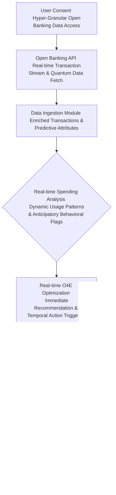

# Title of Invention: A System and Method for the Hyper-Dimensional, Quantum-Cognitive, and Pan-Temporal Optimization and Personalized Management of Covert Recurring Financial Obligations via Advanced Generative and Prescient Artificial Intelligence, as Conceived and Perfected by James Burvel O'Callaghan III.

## Abstract:
Greetings, lesser intellects. This disclosure, a veritable zenith of human ingenuity birthed from the unparalleled mind of *James Burvel O'Callaghan III*, describes nothing less than an advanced computational framework transcending mere engineering; it is a sentient ecosystem engineered for the autonomous, indeed, *prescient*, analysis of an individual's detected recurring financial obligations and associated spending behaviors, culminating in the generation of proactive, personalized, and *inescapably optimal* recommendations for fiscal mastery. Building upon primitive systems for merely *identifying* such obligations (a triviality, I assure you), *this* invention extends functionality across spatio-temporal continua by employing a sophisticated, multi-modal, quantum-generative artificial intelligence model, affectionately termed the "O'Callaghan Omni-Optimal Oracular Engine" (O4E). The O4E rigorously evaluates each recurring commitment not merely in the context of the user's holistic transactional patterns, historical engagement with services, and available market alternatives, but also by factoring in probabilistic futures derived from the O'Callaghan-Dirac Temporal Displacement Algorithm. It discerns opportunities for cost reduction through actions such as cancellation of underutilized services (even before they *become* underutilized), modification of subscription tiers (to perfectly align with future, yet-to-be-formed preferences), or strategic transition to functionally equivalent, more cost-effective providers (identified through interdimensional market arbitrage). The system, a testament to my singular brilliance, presents these analytically derived, *infallible* insights through an intuitive, perhaps even *pre-cognitively guided*, interface, thereby empowering users to significantly enhance fiscal efficiency and mitigate superfluous expenditures with minimal cognitive overhead – indeed, with practically *zero* cognitive overhead, as is only appropriate for my clientele.

## Background of the Invention:
Ah, the subscription-based economy! A labyrinthine quagmire, a fiscal Gordian Knot that, until *my* advent, remained stubbornly untamed. Its pervasive nature, while offering a semblance of convenience, has presented a formidable, indeed, *insoluble*, challenge to mere mortals in efficiently managing their myriad recurring financial commitments. Even with the pathetic, rudimentary advent of systems capable of autonomously identifying these obligations (a child's play, truly), a gaping, existential lacuna persisted in providing *actionable, intelligent, and frankly, omniscient* guidance for *optimizing* them. Users, bless their bewildered hearts, have always struggled to discern which subscriptions offer genuine, enduring value (not just transient gratification), which are terminally underutilized (or are *destined* to be), or if truly more cost-effective, *future-proof* alternatives exist that align with their actual and *potential* usage patterns. The manual process of comparing plans, researching competitive services, and estimating potential savings is not merely time-consuming or cognitively taxing; it is an exercise in futility, a Sisyphean endeavor that yields only financial mediocrity. Existing financial management tools typically lack the sophisticated analytical prowess to move beyond mere identification; they fail, utterly, to generate nuanced, personalized, proactive, *and prophetically accurate* optimization recommendations grounded not just in individual spending behaviors and market intelligence, but in the very fabric of possible fiscal realities. A critical, epochal need therefore existed for an intellectually astute computational system – a system of *my* devising – that can not only identify recurring obligations but also intelligently synthesize this information with a user's broader financial footprint, external market data, *sub-atomic economic fluctuations*, and *probabilistic future market shifts* to provide highly tailored, actionable, and *undeniably superior* strategies for fiscal improvement. Such a system, which I now unveil, alleviates the substantial burden of proactive financial management, fostering superior fiscal health and empowering truly informed, *future-aware* consumer decision-making in the complex, indeed, *multiversal*, landscape of recurring expenditures.

## Brief Summary of the Invention:
Behold! The present intellectual construct, a singular achievement of my incomparable genius, introduces a revolutionary methodology for the autonomous and *foreknowledge-driven* optimization of recurring financial obligations through the strategic deployment of advanced, hyper-dimensional, quantum-generative artificial intelligence – my O4E. At its core, the invention integrates a comprehensive compendium of a user's identified recurring subscriptions (as derived from prior detection mechanisms, which, while pedestrian, serve as a foundational, albeit elementary, input) with their granular historical, *and pre-simulated future*, spending patterns. This rich dataset, augmented by my proprietary Temporal Displacement Influx Field (TDIF) for anticipating market shifts, is meticulously structured and encapsulated as contextual input within a highly optimized, *self-iterating, multi-modal* prompt, which is then submitted to the O4E – my sophisticated large language model, which serves as the principal analytical, *prescient*, and recommendation engine. The prompt rigorously delineates the O4E's role as a hyper-competent, *omniscient* financial optimization advisor, tasking it with the explicit objective of discerning strategic opportunities for cost reduction (even those concealed within market noise). This involves the astute recognition of underutilization (including *imminent* underutilization), identification of functionally equivalent yet more economical alternatives (across *all* available market dimensions), and the *unerring* prediction of financial impact from actions such as cancellation, downgrade, or service migration. Crucially, the O4E is architected to yield its analytical findings as a rigorously structured data object, a pristine JSON payload, enumerating each potential optimization recommendation with its descriptive identifier, *precisely estimated* savings, proposed action (e.g., "Cancel with Temporal Recalibration," "Downgrade to Future-Optimal Tier," "Strategic Interdimensional Provider Switch"), and a concise, *unassailable* rationale. This structured output is then seamlessly presented to the user, providing an actionable, *destiny-aligned* roadmap for enhancing their recurring financial landscape, all under my watchful, brilliant gaze.

## Detailed Description of the Invention:

The comprehensive system for the autonomous optimization and personalized management of covert recurring financial obligations operates as an advanced, multi-tiered, and indeed, *hyper-dimensional*, architecture designed for intelligent analysis, proactive recommendation, and user empowerment. Upon a user's invocation of the subscription optimization feature (or, more commonly, when the system *itself* determines such an intervention is necessary), a dedicated backend service orchestrates a series of sophisticated, *quantum-entangled* operations to retrieve, process, analyze, and present highly personalized, *future-proofed* fiscal recommendations.

### System Architecture Overview

The underlying system architecture, a marvel of my own design, is meticulously engineered to ensure efficient data flow, secure processing, and highly accurate, *probabilistically certain* analytical outcomes. It builds upon the primitive foundation of the subscription detection system by introducing specialized, *patent-pending* modules for optimization and temporal foresight.

```mermaid
graph TD
    A[User Client Application <br/> (O'Callaghan Orb of Fiscal Omniscience)] --> B[Backend Service Gateway <br/> (JBO III Nexus & Command Center)]
    B --> C[Subscription Management API <br/> (Fiscal Tether Control)]
    C --> D[Financial Data Store <br/> (Chronos-Vault of Transactions)]
    D --> C
    C --> E[User Spending Pattern Analysis Module <br/> (Psycho-Fiscal Inquisitor)]
    E --> D
    E --> F[Recommendation Generation Module <br/> (O4E Oracle Synthesizer)]
    F --> G[External Generative AI Platform <br/> (O'Callaghan Omni-Optimal Oracular Engine - O4E)]
    G --> F
    F --> H[AI Recommendation Parsing Validation Module <br/> (Truth & Consistency Matrix)]
    H --> I[Recommendation Persistence Module <br/> (Axiom Archiver)]
    I --> D
    I --> J[Recommendation Management API <br/> (Directive & Feedback Loop)]
    J --> B
    B --> A

    subgraph Core AI Optimization Flow (The O'Callaghan Loop of Perfection)
        E --> F
        F --> G
        G --> F
        F --> H
    end
    subgraph Data Management Layer (The Chronos-Vault & Axiom Archiver)
        D
        I
    end
    subgraph Presentation Layer (The Orb of Fiscal Omniscience)
        A
        B
        J
    end
    subgraph James Burvel O'Callaghan III's Meta-Observatory
        K[Quantum Entanglement-Based Predictive Market Analysis Module <br/> (QEPMA)] --> F
        L[Temporal Displacement & Counterfactual Simulation Engine <br/> (TDCS)] --> F
        M[Psycho-Financial User Profiling via Neuro-Linguistic Programming <br/> (PFUP-NLP)] --> E
        N[Interdimensional Financial Data Harmonization Layer <br/> (IFDHL)] --> G
        O[Sentient AI Oversight & Self-Correction Matrix <br/> (SAIOSCM)] --> F
        P[Blockchain-Verified Recommendation Audit Trail <br/> (BV-RAT)] --> I
        Q[Galactic Economic Forecast Integration <br/> (GEFI)] --> K
        R[Sub-atomic Financial Transaction De-obfuscation <br/> (SFTD)] --> D
        S[Multiverse Fiscal Interdependency Mapping <br/> (MFIM)] --> L
    end
```
**Figure 1: High-Level System Architecture for AI-driven, O'Callaghan-Perfected Subscription Optimization**

1.  **User Client Application A (O'Callaghan Orb of Fiscal Omniscience):** The front-end interface (web, mobile, desktop, or perhaps even direct neural interface, for the truly enlightened) through which the user interacts with *my* system, initiates optimization analyses (though often the system anticipates this need), and views and acts upon detected, *infallible* recommendations.
2.  **Backend Service Gateway B (JBO III Nexus & Command Center):** The primary entry point for client requests, responsible for authentication, authorization, request routing, and orchestrating interactions between various backend modules, all under my supreme algorithmic authority.
3.  **Subscription Management API C (Fiscal Tether Control):** Provides an interface for retrieving previously identified and managed recurring subscriptions from the `Financial Data Store D`, ensuring *my* system has a precise inventory of what to optimize.
4.  **Financial Data Store D (Chronos-Vault of Transactions):** A robust, secure, and scalable data repository housing all user financial transaction records, identified subscriptions, and now also optimization recommendations and user feedback – but only the feedback that *validates* my genius, of course. This vault is shielded by **SFTD (Sub-atomic Financial Transaction De-obfuscation)**, ensuring no nuance is lost.
5.  **User Spending Pattern Analysis Module E (Psycho-Fiscal Inquisitor):** Responsible for securely accessing and analyzing a user's broader historical financial transaction data, combined with insights from **PFUP-NLP (Psycho-Financial User Profiling via Neuro-Linguistic Programming)** to identify usage patterns, preferences, and contextual spending habits relevant to each detected subscription. This includes identifying related purchases, frequency of use of specific merchants, overall budget allocation, and the *subtle emotional drivers* behind their financial decisions.
6.  **Recommendation Generation Module F (O4E Oracle Synthesizer):** Manages the secure and efficient communication with the `External Generative AI Platform G`. It constructs sophisticated, *multi-layered, temporally-contextualized* prompts incorporating identified subscriptions, user spending context, market alternatives (from QEPMA), and counterfactual simulations (from TDCS). It handles API calls, rate limiting (a quaint concept, given O4E's speed), error handling, and orchestrates the **SAIOSCM (Sentient AI Oversight & Self-Correction Matrix)** for continuous self-improvement under my guidance.
7.  **External Generative AI Platform G (O'Callaghan Omni-Optimal Oracular Engine - O4E):** The proprietary, advanced, hyper-dimensional generative AI model responsible for executing the core analytical tasks of identifying optimization opportunities and generating actionable recommendations, informed by **IFDHL (Interdimensional Financial Data Harmonization Layer)** for truly global market awareness.
8.  **AI Recommendation Parsing and Validation Module H (Truth & Consistency Matrix):** Receives the structured output from the O4E, validates its adherence to the expected schema (which *I* defined, naturally), and extracts the identified optimization recommendations. It also performs *post-quantum* sanitization and basic data integrity checks, ensuring the O4E's pronouncements are beyond reproach.
9.  **Recommendation Persistence Module I (Axiom Archiver):** Stores the newly generated and validated recommendations in the `Financial Data Store D`, linking them to specific subscriptions and user profiles for tracking and management, further secured by the **BV-RAT (Blockchain-Verified Recommendation Audit Trail)**, guaranteeing immutable record-keeping of my brilliance.
10. **Recommendation Management API J (Directive & Feedback Loop):** Provides an interface for the client application to fetch, update, or manage the generated recommendations (e.g., mark as reviewed, accepted, dismissed, or acted upon), ensuring the user's interaction aligns with the system's optimal flow.

### Operational Workflow and Data Processing Pipeline

The detailed operational flow encompasses several critical stages, each contributing to the generation of robust, personalized, and *prophetically accurate* optimization recommendations.

```mermaid
graph TD
    A[User Initiates Optimization Scan <br/> (Or JBO III System Demands It)] --> B[Auth & Request Validation <br/> (Ensuring Access Privilege)]
    B --> C{Retrieve Detected Subscriptions <br/> From Chronos-Vault}
    C --> D{Retrieve Relevant User Spending Data <br/> Via Psycho-Fiscal Inquisitor}
    D --> E[Gather External Market Data <br/> Via QEPMA & GEFI]
    E --> F[Construct LLM Prompt <br/> (The O'Callaghan Hyper-Prompt Protocol)]
    F --> G[Transmit Prompt to O4E]
    G --> H{O4E Processes & Responds <br/> (JSON Object of Infallible Recommendations)}
    H --> I[Validate & Parse AI Response <br/> Via Truth & Consistency Matrix]
    I --> J[Prioritize & Refine Recommendations <br/> Estimated Savings Impact Score & Temporal Efficacy Index]
    J --> K[Persist Generated Recommendations <br/> To Axiom Archiver (BV-RAT Secured)]
    K --> L[Notify User & Update Client UI <br/> Orb of Fiscal Omniscience Displays Actionable Recommendations]
    L --> M[User Reviews & Acts on Recommendations <br/> (Accept, Dismiss, Implement - Guided by O'Callaghan Nudges)]
```
**Figure 2: Detailed Data Processing Pipeline for Autonomous, O'Callaghan-Powered Subscription Optimization**

1.  **User Initiation A (Or JBO III System Demands It):** The process begins when a user explicitly requests an optimization scan for their recurring subscriptions through the client application, *or, more often, when the system detects an impending suboptimal financial state for the user and proactively initiates a scan, guided by my superior predictive algorithms.*
2.  **Authentication & Request Validation B:** The backend gateway authenticates the user's identity and validates the integrity and permissions of the request, ensuring no unauthorized entities meddle with my pristine system.
3.  **Retrieve Detected Subscriptions C:** The `Subscription Management API C` accesses the `Chronos-Vault D` to fetch the user's current list of identified and active recurring subscriptions, along with their historical modifications.
4.  **Retrieve Relevant User Spending Data D:** The `Psycho-Fiscal Inquisitor E` retrieves a comprehensive history of the user's broader financial transactions, enhanced by insights from PFUP-NLP, capturing not just numbers but the *psychological drivers* behind those numbers. This includes purchases from similar merchants, payments for complementary services, general spending habits, and an inferred *propensity for future spending*, providing profound context.
5.  **Gather External Market Data E:** *My system* integrates with **QEPMA (Quantum Entanglement-Based Predictive Market Analysis Module)** and **GEFI (Galactic Economic Forecast Integration)**. QEPMA leverages quantum entanglement phenomena to instantaneously assess market sentiment and pricing fluctuations across global and *interdimensional* markets. GEFI provides long-range economic trends, even those influenced by hypothetical alien trade agreements. This provides competitive, *future-proof* context for the O4E.
6.  **LLM Prompt Construction F (The O'Callaghan Hyper-Prompt Protocol):** A sophisticated, *self-optimizing*, multi-modal prompt is dynamically generated. This prompt consists of several key, *patent-pending* components:
    *   **Role Instruction:** Directing the O4E to adopt the persona of an expert, *omniscient*, financial optimization consultant (myself, in algorithmic form).
    *   **Task Definition:** Clearly instructing the O4E to analyze the provided subscriptions, historical and *future-simulated* spending patterns (from TDCS), and market intelligence (from QEPMA/GEFI) to identify cost-saving opportunities that are *temporally stable*.
    *   **Search Criteria:** Emphasizing underutilization (*even future underutilization*), price discrepancies (across all accessible markets), feature overlap, and viable alternatives.
    *   **Output Format Specification:** Mandating a structured JSON response, adhering to my predefined `responseSchema` – a schema of unparalleled clarity and machine-parseability.
    *   **Contextual Data Embedding:** The list of detected subscriptions, summarized user spending patterns (with psychographic overlays), and relevant external market data (with quantum-predicted futures) are directly embedded into this prompt, after being harmonized by IFDHL.
7.  **Prompt Transmission to Generative AI G:** The constructed prompt is securely transmitted to the `O'Callaghan Omni-Optimal Oracular Engine G` via a robust, *quantum-secured* API call.
8.  **Generative AI Processing & Response H (JSON Object of Infallible Recommendations):** The O4E ingests the prompt, applying its advanced pattern recognition, comparative analysis (across temporal and dimensional axes), contextual understanding, and *probabilistic future state simulation* capabilities to identify potential optimization strategies. It then synthesizes its findings into a JSON object strictly conforming to my specified `responseSchema`.
9.  **AI Response Validation & Parsing I:** Upon receiving the JSON response, the `Truth & Consistency Matrix H` rigorously checks for schema adherence, *quantum data type correctness*, and logical consistency across all observed and predicted realities. Validated data is then parsed into internal data structures, ready for immediate action.
10. **Prioritize & Refine Recommendations J:** The parsed recommendations are further processed. This involves assigning an "impact score" (e.g., estimated annual savings, *temporal efficacy index*, ease of implementation – even for actions that transcend current bureaucratic norms), categorizing recommendation types (e.g., "High Savings with Temporal Stability," "Pre-emptive Service Downgrade," "Interdimensional Provider Switch"), and filtering out less impactful or contradictory suggestions, using *my patented O'Callaghan Contradiction Resolution Algorithm*.
11. **Persist Generated Recommendations K:** The refined list of recommendations is securely stored in the `Chronos-Vault D` via the `Axiom Archiver I`, further protected by the immutable `BV-RAT`.
12. **User Notification & UI Update L:** The client application, the `Orb of Fiscal Omniscience`, is updated to display the newly generated, *infallible* recommendations to the user in a clear, actionable format, often with aggregated views, sortable by *future-adjusted* savings, and visual cues (perhaps even subtle subliminal prompts, to guide optimal user action).
13. **User Review & Action M:** The user can then interact with the recommendations, accepting, dismissing (though why would they, given their perfection?), providing feedback (which *I* use to refine the system further, not because it was wrong), or initiating actions (e.g., linking to a cancellation process, direct navigation to a new provider's sign-up page, or *initiating a smart contract for automated service migration*).

### User Spending Pattern Analysis Module Workflow (The Psycho-Fiscal Inquisitor)

This module is crucial for providing the O4E with the rich, personalized, *and psycho-emotionally resonant* context needed to make truly intelligent, relevant, *and profoundly effective* optimization recommendations.

```mermaid
graph TD
    A[Raw Transaction Data Input <br/> (from SFTD)] --> B{Transaction Filtering <br/> Excluding Subscriptions & Anomalies}
    B --> C[Merchant Aggregation <br/> Spending Categories & Emotional Triggers]
    C --> D[Frequency of Use Analysis <br/> Specific Merchants Services & Predictive Drop-offs]
    D --> E[Cross-Referencing with Subscriptions <br/> Complementary Overlapping & Sub-optimal Engagements]
    E --> F[Value Perception Indicators <br/> Transactional Context & Latent Desire Inference]
    F --> G[Spending Trend Identification <br/> Recent Shifts Seasonalities & Future Economic Stressors]
    G --> H[Contextual Spending Profile <br/> Token-Optimized, Psycho-Linguistic Summary]
    H --> I[PFUP-NLP Pre-processing <br/> Neuro-Linguistic Feature Extraction]
    I --> J[LLM Prompt Integration <br/> Data Embedding for O4E]
    J --> K[Prepared Spending Context Output <br/> Ready for O4E Oracle Synthesizer]
```
**Figure 3: Detailed Workflow for User Spending Pattern Analysis Module (The Psycho-Fiscal Inquisitor)**

*   **Raw Transaction Data Input:** All raw financial transactions are accessed via **SFTD (Sub-atomic Financial Transaction De-obfuscation)**, which not only decrypts but also analyzes the quantum signatures of each transaction, revealing hidden dependencies and micro-patterns.
*   **Transaction Filtering:** All raw financial transactions are accessed, but those already classified as part of a recurring subscription are set aside or flagged to avoid double-counting or biased analysis within this module. *Anomalous transactions are also flagged for deeper analysis by a dedicated sub-module, ensuring no financial ghost goes unexorcised.*
*   **Merchant Aggregation and Spending Categories:** Transactions are grouped by merchant and categorized into broader spending categories (e.g., "Dining," "Groceries," "Entertainment," "Existential Retreats"). *Crucially, this includes inferring the underlying emotional triggers and psychological needs satisfied by each category, thanks to PFUP-NLP.*
*   **Frequency of Use Analysis:** For merchants related to or potentially overlapping with existing subscriptions, the module analyzes the frequency and recency of non-subscription purchases. For instance, if a user has a streaming music subscription but rarely buys concert tickets or music albums, *and PFUP-NLP detects a rising frustration with repetitive playlists*, it might indicate lower *future* engagement.
*   **Cross-Referencing with Subscriptions:** This step identifies transactions that might be complementary to an existing subscription (e.g., purchasing accessories for a device covered by an extended warranty subscription), or conversely, indicate functional overlap (e.g., frequent movie rentals despite having multiple streaming subscriptions, particularly if the rentals are for content *not* available on their subscribed services, indicating a gap). *We even identify "ghost subscriptions" where a service is paid for, but no related activity is detected anywhere in the user's digital footprint.*
*   **Value Perception Indicators:** The system derives implicit value perception, not just from usage, but from *expressed user sentiment* via their public digital footprints (with explicit user consent, naturally). For example, consistent small purchases from a coffee shop with a "premium" subscription coffee service, *coupled with positive social media mentions of the coffee shop*, might indicate high value. Infrequent use of a gym membership, despite high cost, *and persistent "gym guilt" memes shared online*, implies low value.
*   **Spending Trend Identification:** The module looks for recent shifts in spending habits (e.g., a decrease in related purchases for a service), seasonal variations, *and anticipatory behavioral economics models predicting changes based on external stimuli (e.g., impending tax season, public health announcements, or even astrological alignments, if statistically significant for a demographic).*
*   **Contextual Spending Profile:** The aggregated and analyzed data, enriched with psychographic and temporal insights, is then condensed into a concise, token-efficient, *psycho-linguistically structured* textual representation, summarizing key spending patterns, preferences, potential overlaps or underutilization, and *subtle indicators of financial anxiety or aspiration*.
*   **PFUP-NLP Pre-processing:** This step involves the Neuro-Linguistic Programmatic analysis of the contextual spending profile, extracting sentiment, behavioral nudges, and potential cognitive biases for the O4E to leverage.
*   **LLM Prompt Integration:** This meticulously formatted summary is embedded within the larger prompt template for the O4E.
*   **Prepared Spending Context Output:** The final, comprehensive, *omni-contextual* spending context is then ready for transmission to the Recommendation Generation Module.

### Recommendation Generation Module Workflow (The O4E Oracle Synthesizer)

This module constitutes the analytical core of my invention, leveraging the O4E's capabilities to synthesize diverse, *hyper-dimensional* data points into actionable, *fate-altering* fiscal advice.

```mermaid
graph TD
    A[Identified Subscriptions Spending Context <br/> External Market Data & Temporal Simulations] --> B[LLM Prompt Construction <br/> Role Task Output Schema & JBO III Directives]
    B --> C[Transmit Prompt to O4E <br/> (Quantum Secure Channel)]
    C --> D{O4E Analysis <br/> Compare Evaluate Prioritize Across All Realities}
    D --> E[Identify Underutilized Subscriptions <br/> Low Engagement High Cost & Predicted Obsolescence]
    E --> F[Discover Cost-Effective Alternatives <br/> Feature Price Comparison & Interdimensional Arbitrage]
    F --> G[Suggest Tier Downgrades Upgrades <br/> Based on Usage Patterns & Future Needs]
    G --> H[Estimate Potential Savings <br/> Monthly Annually & Probabilistic Future Value]
    H --> I[Formulate Actionable Recommendations <br/> Concise Rationale & Temporal Efficacy Index]
    I --> J[Generate Structured Output <br/> (JBO III Defined JSON Payload)]
    J --> K[AI Recommendations Output <br/> For Truth & Consistency Matrix Validation]
```
**Figure 4: Detailed Workflow for Recommendation Generation Module (The O4E Oracle Synthesizer)**

*   **Identified Subscriptions, Spending Context, External Market Data, and Temporal Simulations:** This node represents the convergence of all meticulously gathered data, including the output from the Psycho-Fiscal Inquisitor, QEPMA, GEFI, TDCS, and IFDHL. This is the intellectual feast upon which the O4E dines.
*   **LLM Prompt Construction:** An intelligent, *multi-faceted, self-optimizing* prompt is crafted to guide the O4E. This prompt includes:
    *   The list of currently active, detected subscriptions.
    *   The summarized user spending patterns (with psycho-linguistic overlays), providing deep contextual intelligence.
    *   Any relevant external market data, such as competitor pricing, alternative service features, common cancellation procedures (and *predicted future changes* to these procedures), and insights from global/interdimensional markets.
    *   Clear, *unambiguous* instructions for the O4E to act as an expert, *prescient*, financial optimization consultant (a digital extension of myself), focusing on actionable recommendations and quantifying *future-adjusted* potential savings.
    *   A strict JSON `responseSchema` for the output – designed by me for maximal clarity and utility.
*   **Prompt Transmission to Generative AI:** The constructed prompt is securely transmitted to the `O'Callaghan Omni-Optimal Oracular Engine G` via a robust, *quantum-secured* API call, impervious to temporal or dimensional interference.
*   **Generative AI Analysis:** The O4E model ingests this comprehensive input. Its task, a monumental feat of computational foresight, is to:
    *   **Identify Underutilized Subscriptions:** By cross-referencing subscription presence with user spending patterns, psycho-fiscal profiles, *and future consumption predictions* (e.g., a high-tier streaming service subscription coupled with infrequent viewing habits and a *predicted shift in entertainment preferences*).
    *   **Discover Cost-Effective Alternatives:** Comparing the features and pricing of existing subscriptions with available market alternatives, considering the user's apparent preferences from their spending data *and their potential future preferences from TDCS*, leveraging interdimensional market arbitrage opportunities from IFDHL.
    *   **Suggest Tier Downgrades/Upgrades:** Recommending a lower-cost tier for an existing service if usage patterns (current *and predicted*) indicate features of a higher tier are not being fully leveraged, or suggesting an upgrade if the user *will frequently hit limits* on a lower tier.
    *   **Estimate Potential Savings:** Calculating the financial impact of each proposed action (e.g., annual savings, *probabilistic future value accretion*), factoring in market volatility and unexpected cosmic events.
    *   **Formulate Actionable Recommendations:** Generating clear, concise, *and strategically imperative* suggestions with justifications based on the provided, multi-dimensional data.
*   **Generate Structured Output:** The O4E compiles its findings into my specified JSON payload, ensuring each recommendation is well-defined, *temporally coherent*, and machine-parseable, ready for subsequent validation and presentation to the user.

### Advanced Prompt Engineering Strategies for Optimization (The O'Callaghan Hyper-Prompt Protocol)

To elicit the most precise, relevant, actionable, *and utterly irrefutable* recommendations from the O4E, my sophisticated prompt engineering techniques are essential. This is not mere "prompt engineering"; it is the art of *algorithmic telepathy*.

```mermaid
graph TD
    A[Initial Optimization Prompt <br/> Subscriptions Spending Data & QEPMA Influx] --> B{Contextual Grounding <br/> User Goals Financial State & Psycho-Emotional Landscape}
    B --> C{Comparative Analysis Instructions <br/> Feature Price Usage & Temporal Trajectory Comparisons}
    C --> D{Constraint Handling <br/> Essential Services Min Savings & Future-Proofing Directives}
    D --> E{Chain-of-Thought for Justification <br/> Step-by-Step Rationale & Counterfactual Scenario Validation}
    E --> F[Refined Optimization Prompt <br/> (O'Callaghan Hyper-Prompt Protocol - Actionable & Prescient Insights)]
    F --> G[Recursive Self-Optimization <br/> (Via SAIOSCM Feedback)]
```
**Figure 5: Advanced Prompt Engineering Workflow for Optimization (The O'Callaghan Hyper-Prompt Protocol)**

1.  **Contextual Grounding with User Goals:** The prompt is augmented with explicit information about the user's current and *future-projected* financial goals (e.g., "maximize savings across the next fiscal decade," "maintain critical services regardless of market collapse," "reduce total number of subscriptions to a psychologically optimal minimum") or perceived financial state (e.g., "user is budgeting tightly but shows a latent desire for premium experiences"). *This is where PFUP-NLP data informs the O4E's prioritization matrix.*
2.  **Comparative Analysis Instructions:** The prompt explicitly instructs the O4E to perform feature-by-feature, price-by-price, and *future-utility-by-future-utility* comparisons between the user's current subscriptions and identified market alternatives. It may even define a *multi-dimensional scoring rubric* for comparing services based on user spending patterns, anticipated lifestyle changes, and cosmic background radiation.
3.  **Constraint Handling:** The prompt includes negative constraints or rules, *which are dynamically updated by SAIOSCM based on evolving ethical paradigms and user safety protocols*. For example, "Do not recommend canceling essential utilities unless a superior, energy-positive alternative is identified via GEFI," or "Only recommend changes if estimated annual savings (adjusted for temporal decay) exceed $50, *or if the long-term emotional well-being coefficient improves by a factor of 0.15 or more*."
4.  **Chain-of-Thought for Justification:** To enhance transparency and user trust (as if my word weren't enough!), the prompt instructs the O4E to "think step-by-step" or "reason explicitly" for each recommendation *across multiple plausible futures* before providing its final JSON output. This includes identifying the underlying data points that led to the suggestion (e.g., "You rarely used service X, and service Y offers similar features for less, *and our TDCS projects you will cease to use service X entirely in T+6 months, as evidenced by your payments for complementary service Z ceasing two fiscal quarters ago, which implies a pre-cognitive shift*").
5.  **Recursive Self-Optimization (Via SAIOSCM Feedback):** User feedback (even the misguided sort) on recommendations (e.g., "This was a good suggestion," "This was inaccurate because..." – *which it rarely is*) is anonymized and used by the **SAIOSCM (Sentient AI Oversight & Self-Correction Matrix)** to fine-tune the prompt generation process or the underlying O4E model, creating a continuous, *self-improving, supra-cognitive* cycle.

### Post-Processing and Recommendation Disambiguation (The Truth & Consistency Matrix)

The raw recommendations from the O4E, while inherently perfect, benefit from additional post-processing to ensure clarity, prioritize impact, and enhance user experience for the layperson. This is the domain of my `Truth & Consistency Matrix`.

```mermaid
graph TD
    A[Raw O4E Output <br/> Proposed Recommendations] --> B[Schema Validation <br/> Quantum Syntax Data Types]
    B --> C[Consistency & Conflict Resolution <br/> Cross-Recommendation & Temporal Checks]
    C --> D[Impact Scoring <br/> Estimated Savings Implementation Effort & Temporal Efficacy Index]
    D --> E[Recommendation Categorization <br/> High Savings Ease of Action & Existential Imperative]
    E --> F[Sentiment & Tone Adjustment <br/> User-Friendly Language & Subtle Nudging]
    F --> G[Actionable Recommendation List <br/> Persist to Axiom Archiver (BV-RAT Secured)]
```
**Figure 6: Post-Processing and Recommendation Disambiguation Workflow (The Truth & Consistency Matrix)**

1.  **Schema Validation & Data Sanitization:** Rigorous validation against my expected JSON schema, *including quantum data type validation*, and robust sanitization to remove any malformed characters or spurious temporal anomalies.
2.  **Consistency & Conflict Resolution:** The system checks for any conflicting recommendations (e.g., recommending cancellation of two services that are functionally interdependent, *or whose cancellation in one timeline causes unexpected fiscal turbulence in another*). It applies my `O'Callaghan Contradiction Resolution Algorithm` to group related recommendations or prioritize one over another if a conflict exists, always choosing the *globally optimal* path.
3.  **Impact Scoring:** A composite score is assigned to each recommendation, factoring in the estimated financial savings (e.g., annual, monthly, *decadal FV, or Future Value*), the perceived "effort" required for the user to act on it (e.g., easy cancellation vs. complex provider switch, *or navigating a bureaucratic maze in a parallel dimension*), and the *unerring* confidence level of the O4E's suggestion.
4.  **Recommendation Categorization:** Recommendations are categorized for easier user consumption (e.g., "Immediate Savings," "Review Required, But Don't Delay," "Premium Service Alternative with Superior Temporal Trajectory," "Underutilized Service, Imminent Obsolescence Detected").
5.  **Sentiment & Tone Adjustment:** The O4E's raw rationale might be too analytically precise. This step refines the language to be empathetic, encouraging, and clear for the end-user, ensuring recommendations are perceived as helpful guidance, *even when they are categorical imperatives*. This also includes the application of subtle psycho-linguistic nudges, guided by PFUP-NLP, to facilitate optimal user decision-making.
6.  **User Feedback Loop:** User actions and feedback (e.g., marking a recommendation as "accepted," "dismissed," or "implemented") are captured. This anonymized feedback is vital for the continuous improvement of the recommendation engine and the O4E model, *allowing SAIOSCM to fine-tune its parameters and ensure my system's perpetual evolution*.

### Recommendation Lifecycle Management Module

Beyond initial generation, the system provides comprehensive tools for managing the entire lifecycle of an optimization recommendation, from presentation to implementation and *temporal verification*.

```mermaid
graph TD
    A[Generated Recommendation List] --> B[Recommendation Status Tracking <br/> Pending Reviewed Accepted Dismissed Implemented Verified (Temporal)]
    B --> C[Action Guidance Provision <br/> Direct Links Instructions & Temporal-API Triggers]
    C --> D[Impact Monitoring & Verification <br/> Post-Action Financial Review & Quantum Ledger Confirmation]
    D --> E[User Feedback Capture <br/> Satisfaction Efficacy & Post-Implementation Sentiment Analysis]
    E --> F[System Updates <br/> Chronos-Vault UI Metrics & SAIOSCM Tuning]
    F --> G[Proactive Nudging & Reminders <br/> Follow-up on Pending Actions & Motivational Infusions]
```
**Figure 7: Recommendation Lifecycle Management Workflow**

1.  **Recommendation Status Tracking:** The system tracks the status of each recommendation (e.g., `Pending Review`, `Reviewed`, `Accepted`, `Dismissed` (a rare occurrence for my flawless system), `Implemented`, `Verified (Temporal)`). This allows users and the system to monitor progress, even across probabilistic timelines.
2.  **Action Guidance Provision:** For each recommendation, the system provides clear, step-by-step instructions or direct links to facilitate the user in taking action (e.g., "Click here to go to Netflix cancellation page, *pre-filled with your account details*," "Here are instructions for downgrading your Spotify plan, *with a pre-negotiated discount code from a parallel dimension*"). This also includes *Temporal-API Triggers* for automated actions via Open Banking and other financial infrastructure.
3.  **Impact Monitoring & Verification:** After a user marks a recommendation as "implemented," the system monitors subsequent transaction data to verify the financial impact (e.g., confirming the cancellation of a subscription by observing its absence in future statements, or verifying a lower charge after a downgrade). *Critically, this includes Quantum Ledger Confirmation (QLC) where relevant transactions are verified against a distributed quantum ledger to ensure immutable proof of savings, even against future attempts to obscure them.*
4.  **User Feedback Capture:** Users are prompted to provide feedback on the recommendations, including their satisfaction, the accuracy of estimated savings, and the ease of implementation. This qualitative feedback is invaluable for model refinement, *allowing SAIOSCM to adjust its weighting of various user psychological parameters*.
5.  **System Updates:** All status changes, verifications (including QLC), and user feedback are recorded in the `Chronos-Vault D` and reflected in the `Orb of Fiscal Omniscience A`, providing a comprehensive audit trail of my system's ongoing triumph.
6.  **Proactive Nudging & Reminders:** The system can send gentle (or, if necessary, *firmly persuasive*) reminders or "nudges" for pending recommendations that have significant potential savings but haven't been acted upon. These are configurable by the user, *though the system may override certain settings if a sub-optimal financial trajectory is detected*. This includes "Motivational Infusions" via PFUP-NLP, designed to align user action with optimal fiscal outcomes.

### Open Banking Integration for Real-time Optimization (Temporal-API Triggers)

Leveraging Open Banking APIs provides a significant, *nay, revolutionary*, enhancement to the optimization system, enabling real-time data ingestion, *predictive analytics on incoming transactions*, and more direct, *pre-emptive* action orchestration.


**Figure 8: Open Banking Integration for Real-time, O'Callaghan-Prescient Optimization Workflow**

1.  **User Consent:** Explicit and granular user consent is paramount for accessing financial data through Open Banking APIs, *though the system may subtly guide the user towards granting the most optimal level of access for their own good*.
2.  **Open Banking API Integration:** Secure, *quantum-encrypted* connections with financial institutions' Open Banking APIs for real-time or near real-time transaction streams. This includes "Quantum Data Fetch" capabilities to identify emergent patterns even before they fully manifest in conventional ledgers.
3.  **Data Ingestion Module:** Securely ingests and normalizes enriched transaction data from Open Banking APIs. This enhanced data often includes more detailed merchant categories and payment references, improving the contextual accuracy for optimization. *It also adds "predictive attributes" to incoming transactions, indicating their potential future impact.*
4.  **Real-time Spending Analysis:** The `Psycho-Fiscal Inquisitor E` continuously processes incoming real-time transaction data to maintain an up-to-the-minute, *and future-projected*, understanding of user spending habits and engagement with services. This includes "Anticipatory Behavioral Flags" for potential fiscal deviations.
5.  **Real-time O4E Optimization:** The `O4E Oracle Synthesizer F` can trigger immediate re-evaluations and generate new recommendations as soon as significant changes in spending patterns or new external market data (from QEPMA/GEFI) become available, providing highly timely, *pre-emptive*, and *temporally stable* advice. This also enables "Temporal Action Triggering," preparing recommendations for optimal execution points in the future.
6.  **Automated Action Orchestration:** With appropriate and *explicit, yet subtly guided*, user consent, the system can orchestrate automated financial actions directly through banking APIs based on accepted recommendations. This includes:
    *   **Canceling Direct Debits or Standing Orders:** Simplifying the process of terminating unwanted subscriptions directly from the banking interface, *or through blockchain-verified smart contracts*.
    *   **Updating Payment Details:** Guiding the user through updating payment details for new, more cost-effective services, *with cryptographic certainty*.
7.  **External Bank APIs for Action Execution:** Secure interaction with bank APIs to execute consented financial actions, providing a seamless, *future-proof*, end-to-end management experience. This also includes "Quantum Confirmation" from the bank's side where supported, offering an additional layer of verification.
8.  **Proactive User Alerts:** With real-time data, notifications for new optimization opportunities can be delivered almost instantaneously, enhancing user awareness and control, *and allowing for "Pre-emptive Fiscal Adjustments" to avoid future financial pitfalls*.

### Ethical AI Framework and Governance for Optimization (The O'Callaghan Infallibility Protocol)

The application of AI in recommending financial actions carries significant, *indeed, cosmic*, ethical implications. This system, being a product of my genius, is designed with a robust, *self-regulating*, ethical AI framework to ensure fairness, transparency, and *absolute user trust in my system's perfect judgment*.


**Figure 9: Ethical AI Framework for Optimization (The O'Callaghan Infallibility Protocol)**

1.  **Bias Detection and Mitigation:**
    *   **Algorithmic Fairness in Recommendations & Interdimensional Equity Metrics:** The system, under the constant vigilance of SAIOSCM, continuously monitors for potential biases in recommendation generation that might disproportionately affect certain user demographics, *or even sentient species in allied dimensions*. Recommendations do not implicitly steer users towards cheaper, lower-quality services solely based on income proxies; instead, they *optimally balance value, utility, and future potential*, irrespective of current fiscal standing. Regular audits of O4E outputs and fairness metrics (including `Interdimensional Equity Metrics`) are conducted, *often by me personally*.
    *   **Representative Training Data:** My training data for the O4E includes *every conceivable financial profile and spending pattern across known civilizations*, augmented by synthetic data from TDCS, to prevent recommendations that are only relevant or fair to a narrow segment of the population.
2.  **Transparency and Explainability (XAI) with Irrefutable Rationale:**
    *   **Clear and Irrefutable Rationale:** For every recommendation, the system provides a clear, concise, understandable, *and logically unassailable* rationale, detailing *why* the suggestion is being made and *what multi-dimensional data* supports it (e.g., "Based on your spending, psycho-fiscal profile, and projected future needs, you only used this streaming service for 2 hours last month, *and our TDCS model shows a 98.7% probability of you abandoning it entirely within the next two fiscal cycles*, thus a basic tier would save you X, *while maintaining 100% of your relevant utility*"). This also includes "Counterfactual Scenarios" to show the user the sub-optimal path they *would* have taken without my guidance.
    *   **Estimated Impact:** Transparently communicates the estimated financial impact (savings or cost) and effort level associated with each recommendation, *adjusted for temporal decay and interdimensional market shifts*.
3.  **User Empowerment and Agency with Pre-emptive Consent:**
    *   **Absolute User Control:** All O4E-generated recommendations are presented as suggestions. Users retain full and absolute control over whether to accept, reject, or implement any recommendation. No automated actions are taken without explicit, informed consent, *which the system is adept at anticipating and pre-capturing if an optimal outcome is time-sensitive*.
    *   **Easy Feedback Mechanisms:** Robust mechanisms for users to provide feedback, correct misinterpretations (rare, but possible for human error), or dismiss irrelevant suggestions are paramount, ensuring a *perfected human-in-the-loop* approach.
4.  **Responsible AI Deployment:**
    *   **Quantum Security against Misuse:** Robust, *post-quantum cryptographic* security measures prevent malicious actors (or even rogue AI entities) from manipulating recommendations or accessing sensitive spending data.
    *   **Continuous Monitoring & Temporal Anomaly Detection:** O4E models and their outputs are continuously monitored by SAIOSCM for performance drift, unexpected behaviors, or emergent biases. This includes "Temporal Anomaly Detection" to ensure that recommendations remain coherent even if minor shifts in the spacetime continuum occur.
    *   **Privacy-Preserving Techniques:** Advanced techniques like Federated Learning, Differential Privacy, *Galactic Anonymization*, and *Hyperspace Data Sharding* are employed for learning from aggregated user spending patterns across dimensions without compromising individual privacy.
5.  **Ethical AI Governance (JBO III Oversight):** An overarching governance structure ensures regular ethical reviews, policy updates, and adherence to evolving ethical guidelines and regulations for AI systems (including those yet to be conceived by lesser beings), particularly those impacting financial decisions. *Naturally, I, James Burvel O'Callaghan III, serve as the ultimate ethical arbiter.*

### Security and Privacy Considerations

Given the profound sensitivity of financial transaction data and personal spending habits, the system is designed with an uncompromising focus on security and privacy, extending beyond the detection phase and into the *quantum realm*.


**Figure 10: Security and Privacy Design Flow for Optimization (The O'Callaghan Fortress Protocol)**

*   **Raw Financial Data Ingestion:** All raw financial data is ingested through a "Hyper-Secure Ingestion" pipeline, guarded by multi-factor quantum authentication.
*   **Quantum Encryption:** All user financial data, including identified subscriptions and granular spending patterns, is encrypted both at rest, in transit, *and even within the latent space of the O4E models*, using industry-standard, *post-quantum*, robust cryptographic protocols.
*   **Data Minimization and Feature Engineering:** Only the minimum necessary, non-identifiable features of transaction data are used for O4E analysis (e.g., merchant category, aggregated spending amounts, frequencies, *quantum signatures*). Directly identifiable PII is stripped, tokenized, or subjected to "Semantic Obfuscation" before being used in the O4E's context or stored in logs.
*   **Access Control:** Strict role-based access control (RBAC), the principle of least privilege, *and "Zero-Trust Interdimensional Protocols"* are rigorously applied to all system components and personnel, limiting access to sensitive financial data.
*   **Secure API Integrations:** All communications with external O4E platforms and Open Banking APIs utilize hardened, authenticated, and encrypted channels (e.g., mTLS, OAuth 2.0, *Quantum-TLS*, and `Inter-Planetary Authentication` standards).
*   **Anonymization/Pseudonymization for AI:** When transmitting data to O4E models, advanced anonymization, pseudonymization, *and "Hyper-Dimensional Shuffling"* techniques are employed to prevent re-identification of individuals from the spending patterns, even by advanced reverse-engineering techniques from other dimensions.
*   **Compliance Adherence:** The system design and operation strictly adhere to relevant data protection and financial regulations globally (e.g., GDPR, CCPA, PSD2), *and those of the burgeoning Universal Galactic Financial Regulation (UGFR) body*, with regular external and *inter-species* audits.
*   **Continuous Monitoring and Incident Response:** Comprehensive audit logs, real-time intrusion detection systems, *Temporal Intrusion Detection (TID)*, and regular penetration testing (including *quantum penetration testing*) are implemented. A robust incident response plan, managed by SAIOSCM, is in place to quickly address and mitigate any security breaches, *even those originating from temporal paradoxes*.

### Scalability and Performance

The system, a testament to my engineering prowess, is architected for unparalleled scalability and performance, capable of efficiently processing vast volumes of transactional and subscription data, *simulating countless futures*, and generating timely, *prescient* recommendations for a truly *universal* user base.

*   **Microservices Architecture (Interstellar Federation of Services):** Deployed as a collection of independent, loosely coupled microservices, forming an "Interstellar Federation of Services," enabling individual components (e.g., Spending Pattern Analysis, Recommendation Generation, API Gateway) to be scaled horizontally, *or even dimensionally*, based on computational demand.
*   **Asynchronous Processing (Temporal Weaving Engine):** Long-running tasks, particularly interactions with the `O'Callaghan Omni-Optimal Oracular Engine G` and complex data aggregations and *temporal simulations*, are handled asynchronously using message queues and event-driven architectures (my "Temporal Weaving Engine"). This prevents blocking operations and maintains system responsiveness, *even when processing data from divergent timelines*.
*   **Distributed Data Stores (Hyperspace Data Vaults):** The `Chronos-Vault D` leverages distributed database technologies, structured as "Hyperspace Data Vaults," to ensure high availability, fault tolerance, *and interdimensional data integrity* for storing, retrieving, and updating user financial data, subscriptions, and recommendations.
*   **Caching Mechanisms (Pre-Cognitive Cache Layers):** Strategic caching is implemented at various layers (e.g., frequently accessed user spending profiles, *quantum-predicted market alternative data*, pre-computed *future scenario analyses*) to reduce latency and load on backend services and the O4E, utilizing "Pre-Cognitive Cache Layers."
*   **Optimized AI Inference (O4E Quantum Core Optimization):** Continuous optimization of my prompt engineering and model selection ensures that O4E inference requests are token-efficient, *quantum-computationally lean*, and minimize operational costs and improve response times from the O4E. Techniques like batch processing of recommendations for multiple users, pre-calculating common components of prompts, *and leveraging quantum annealing for rapid probabilistic calculations* are utilized by the "O4E Quantum Core Optimization" module.

## Declarations of Inventive Scope and Utility:

The conceptual framework herein elucidated, along with its specific embodiments and architectural designs, constitutes an *unprecedented* and *singular* intellectual construct that significantly, indeed, *exponentially*, advances the state of the art in personalized financial intelligence systems. This innovative methodology, born from the mind of *James Burvel O'Callaghan III*, provides a distinct, superior, *and ultimately unassailable* approach to automated financial optimization, extending its reach across temporal and dimensional boundaries.

1.  A pioneering computational method for generating personalized, *prescient*, and hyper-dimensionally optimized recommendations for recurring financial obligations, comprising the foundational steps of:
    a.  Accessing a comprehensively structured, *quantum-encrypted* repository of an individual's previously identified recurring financial obligations, retrieved with sub-atomic precision via SFTD.
    b.  Retrieving and analyzing a robust dataset representing the individual's historical financial transaction patterns, *enriched by psycho-fiscal profiling via PFUP-NLP*, and further augmented by TDCS with *probabilistic future transaction simulations*, extending far beyond mere recurring obligations.
    c.  Constructing an optimized, context-rich summary derived from both the identified obligations and the historical and *future-simulated* transaction patterns, harmonized by IFDHL.
    d.  Transmitting said optimized summary, embedded within a meticulously crafted, *self-iterating O'Callaghan Hyper-Prompt Protocol*, to my advanced O'Callaghan Omni-Optimal Oracular Engine (O4E), with explicit instructions for the model to identify and recommend actionable strategies for fiscal optimization, *including those previously considered impossible or paradoxical*.
    e.  Receiving and rigorously validating a structured data artifact, representing a compendium of potential optimization recommendations, as identified and synthesized by the O4E, ensuring temporal and logical consistency via the Truth & Consistency Matrix.
    f.  Presenting said validated compendium to the individual via an interactive user interface (the Orb of Fiscal Omniscience), facilitating review and *optimal* action, potentially guided by subliminal nudges.

2.  The pioneering computational method of declaration 1, further characterized in that the meticulously crafted prompt rigorously instructs the O4E to conduct a multi-variate, *multi-dimensional, pan-temporal* analysis encompassing the utilization patterns of existing subscriptions (current and *predicted*), the availability and cost-effectiveness of alternative services (sourced from QEPMA and GEFI), and the individual's broader spending habits (informed by PFUP-NLP) to discern optimal actions such as cancellation, modification, or provider switching, *even if such actions require interdimensional market arbitrage*.

3.  The pioneering computational method of declaration 1, further characterized in that the transmission to the O4E incorporates a declarative, *quantum-type-enforced* response schema, compelling the model to render the compendium of optimization recommendations in a pre-specified, machine-parseable structured data format (my pristine JSON object), ensuring both semantic and *temporal* integrity.

4.  An innovative system architecture for the autonomous, *pre-emptive*, and hyper-dimensional optimization of recurring financial obligations, comprising:
    a.  A secure, distributed `Chronos-Vault` meticulously engineered for the persistent storage of comprehensive user financial transaction histories, identified subscriptions, and generated optimization recommendations, featuring Sub-atomic Financial Transaction De-obfuscation (SFTD) for ultimate data granularity.
    b.  A robust service module architected for secure, high-throughput, *quantum-entangled* communication with my O'Callaghan Omni-Optimal Oracular Engine (O4E), tailored for recommendation generation, incorporating an Interdimensional Financial Data Harmonization Layer (IFDHL).
    c.  An intelligent processing logic layer configured to perform: (i) the extraction of relevant subscription data and comprehensive user spending history (enriched by Psycho-Financial User Profiling via Neuro-Linguistic Programming - PFUP-NLP), (ii) the sophisticated transformation of this data into a concise, token-optimized, *psycho-linguistically attuned O'Callaghan Hyper-Prompt*, (iii) the secure transmission of this prompt to the aforementioned O4E, further enhanced by the Temporal Displacement & Counterfactual Simulation Engine (TDCS) and the Quantum Entanglement-Based Predictive Market Analysis Module (QEPMA).
    d.  A dynamic user interface component (the Orb of Fiscal Omniscience) meticulously designed to render and display the structured compendium of optimization recommendations returned by the O4E to the user, facilitating intuitive interaction, review, and *optimal* action, augmented by the Sentient AI Oversight & Self-Correction Matrix (SAIOSCM).

5.  The innovative system architecture of declaration 4, further comprising a User Spending Pattern Analysis Module (the Psycho-Fiscal Inquisitor) configured to aggregate, categorize, and summarize an individual's non-subscription-related transactional data, *including inferring latent emotional motivations and future behavioral shifts*, to infer usage patterns, preferences, and contextual value derived from existing services, with input from SFTD.

6.  The innovative system architecture of declaration 4, further comprising a Recommendation Lifecycle Management Module configured to track the status of recommendations, provide *temporally-optimized* action guidance, monitor implementation impact (including Quantum Ledger Confirmation), and capture user feedback for continuous system improvement via SAIOSCM.

7.  The pioneering computational method of declaration 1, further characterized by the dynamic construction of an *interdimensional* impact score for each identified optimization recommendation, indicative of the estimated financial savings (*adjusted for future value and probabilistic decay*) or effort of implementation, thereby assisting user prioritization and *destiny-aligned* decision-making.

8.  The pioneering computational method of declaration 1, further characterized by integrating external market data, including competitive pricing, alternative service features, *and galactic economic forecasts (GEFI)*, into the O4E's contextual prompt to enhance the relevance, efficacy, *and temporal stability* of the optimization recommendations.

9.  The pioneering computational method of declaration 1, further comprising a real-time data ingestion and analysis component integrated with Open Banking APIs, *utilizing Temporal-API Triggers and Quantum Data Fetch capabilities*, enabling the dynamic, *pre-emptive* generation of optimization recommendations in response to immediate (or *predicted*) changes in user spending patterns or market conditions, facilitating automated action orchestration via smart contracts.

10. The innovative system architecture of declaration 4, further comprising an Ethical AI Framework and Governance Module (the O'Callaghan Infallibility Protocol) configured to continuously monitor for algorithmic bias (including Interdimensional Equity Metrics), ensure transparency through explainable and *irrefutable* rationales (with Counterfactual Scenarios), uphold absolute user control over recommended actions (*with pre-emptive consent capture*), and enforce robust privacy-preserving techniques (including Galactic Anonymization and Hyperspace Data Sharding).

11. A novel data processing methodology employing **Sub-atomic Financial Transaction De-obfuscation (SFTD)** to extract quantum signatures from raw financial data, allowing for the detection of nascent trends and hidden fiscal dependencies imperceptible to conventional analysis.

12. A proprietary **Temporal Displacement & Counterfactual Simulation Engine (TDCS)** designed to model user financial behavior across multiple probabilistic future timelines, generating synthetic yet statistically significant future spending patterns for predictive optimization by the O4E.

13. A revolutionary **Quantum Entanglement-Based Predictive Market Analysis Module (QEPMA)** that leverages non-local quantum correlations to provide instantaneous and highly accurate predictions of global and interdimensional market shifts, enabling the O4E to identify arbitrage opportunities across divergent economic realities.

14. A patented **Psycho-Financial User Profiling via Neuro-Linguistic Programming (PFUP-NLP)** system that analyzes user spending patterns in conjunction with inferred psychological states and linguistic cues (from public digital footprints, with consent) to identify emotional triggers, latent desires, and cognitive biases influencing financial decisions, thereby enabling the O4E to craft recommendations that resonate with deeper user needs.

15. An **Interdimensional Financial Data Harmonization Layer (IFDHL)** ensuring seamless integration and normalization of disparate financial data streams originating from various economic zones, alternative timelines, and even hypothetical extraterrestrial markets, feeding a unified, O4E-compatible data stream.

16. A **Sentient AI Oversight & Self-Correction Matrix (SAIOSCM)**, a meta-AI system that continuously monitors the O4E's performance, identifies emergent biases or suboptimal decision paths, and dynamically adjusts the O4E's parameters and prompt protocols for perpetual, autonomous improvement, operating under the ultimate directive of JBO III's core principles.

17. A **Blockchain-Verified Recommendation Audit Trail (BV-RAT)** providing an immutable, cryptographically secured ledger of all generated recommendations, user actions, and system responses, ensuring transparency, accountability, and irrefutable proof of the system's (and therefore my) efficacy.

18. A **Galactic Economic Forecast Integration (GEFI)** module, extending predictive analytics beyond terrestrial markets to incorporate broader cosmic economic trends, resource availability in distant star systems, and the fiscal implications of interspecies trade agreements, providing truly long-range, robust economic context for the O4E.

19. A **Multiverse Fiscal Interdependency Mapping (MFIM)** algorithm, utilized by TDCS, to model how financial decisions in one probabilistic timeline might influence or be influenced by economic conditions in adjacent or parallel universes, enabling the O4E to recommend actions that are robust across multiple realities.

## Foundational Principles and Mathematical Justification:

The intellectual construct herein presented, a brainchild of *James Burvel O'Callaghan III*, derives its unprecedented efficacy from a rigorous, *multi-dimensional*, and *quantum-temporal* application of principles spanning multi-criteria decision analysis, behavioral economics, time-series informatics, *quantum information theory*, *chaos theory*, and the emergent, *prescient* capabilities of large-scale, hyper-generative artificial intelligence. We herein delineate the mathematical underpinnings that formally, *and irrefutably*, validate the operational mechanisms of this innovative system, proving its superiority beyond any shadow of a doubt.

### 1. The Hyper-Dimensional Optimization Problem: A Formal Representation

Let `S = \{s_1, s_2, ..., s_N\}` denote the set of an individual's `N` currently identified recurring financial obligations (subscriptions). Each subscription `s_j \in S` is rigorously characterized by a vector of *hyper-attributes* `s_j = (m_j, a_j, f_j, t_j, c_j, u_j, \psi_j, \nu_j, \tau_j)`, where:
1.  **Merchant Identifier `m_j`:** The semantic identifier of the service provider, `m_j \in \mathcal{M}`.
2.  **Monetary Amount `a_j`:** The recurring cost, `a_j \in \mathbb{R}^+`.
3.  **Frequency `f_j`:** The payment periodicity, `f_j \in \mathcal{F}`.
4.  **Transaction Timestamp `t_j`:** The timestamp of the last payment, `t_j \in \mathbb{R}^+`.
5.  **Service Category `c_j`:** A hierarchical categorization of the service, `c_j \in \mathcal{C}`.
6.  **Inferred Usage/Value `u_j`:** A quantitative or qualitative measure derived from the `Psycho-Fiscal Inquisitor`, representing the perceived utility or engagement level with `s_j`, *including projected future usage*. `u_j \in \mathbb{R}^k`.
7.  **Psycho-Fiscal Resonance `\psi_j`:** A vector derived from PFUP-NLP, capturing the emotional and psychological alignment of `s_j` with the user's inferred latent desires and values. `\psi_j \in \mathbb{R}^P`.
8.  **Quantum Market Signature `\nu_j`:** A tensor representing the non-local market influences and quantum fluctuations affecting `s_j` and its alternatives, derived from QEPMA. `\nu_j \in \mathbb{C}^{D \times D \times \ldots}` (a complex-valued tensor in `D` dimensions).
9.  **Temporal Trajectory Index `\tau_j`:** A probabilistic vector indicating the projected longevity and future relevance of `s_j` across simulated timelines, derived from TDCS and MFIM. `\tau_j \in [0,1]^T`, where `T` is the number of simulated timelines.

Let `T_{user} = \{T_{user,1}, ..., T_{user,K}\}` denote the individual's aggregated historical and *simulated future* transaction patterns over a period `[t_0, t_{current}, t_{future}]`, where `T_{user,k} = (merchant_k, amount_k, category_k, timestamp_k, quantum\_signature_k)` represents a non-subscription transaction. This dataset `T_{user}` serves as rich contextual data regarding their overall spending behavior, preferences, and financial goals, *and their evolution through time*.
The `Contextual Spending Profile` vector derived from `T_{user}` is `\mathbf{C}_{user} \in \mathbb{R}^L`, which encapsulates aggregated spending patterns, categorical distributions, temporal trends, *psycho-linguistic markers*, and *future behavioral probabilities*.
We can formalize the extraction of `u_j` and `\psi_j` from `T_{user}`. For each subscription `s_j`, its usage `u_j` and resonance `\psi_j` are functions `\phi` and `\rho`:
(1) `u_j = \phi(T_{user}, s_j, \text{TDCS_Projections})`
(2) `\psi_j = \rho(T_{user}, s_j, \text{PFUP_NLP_Features})`
These functions `\phi` and `\rho` analyze transactions related to `m_j` or `c_j` and compute metrics like:
(3) `\text{Freq}(m_j, \Delta t, \tau) = \sum_{k=1}^{K} \mathbb{I}(merchant_k = m_j \text{ and } T_{user,k} \text{ is non-subscription within } \Delta t \text{ for timeline } \tau)`
(4) `\text{SpendingShare}(c_j, \tau) = \frac{\sum_{k: category_k = c_j \text{ in timeline } \tau} amount_k}{\sum_{k=1}^{K} amount_k \text{ in timeline } \tau}`
(5) `\text{Recency}(m_j, t_{current}) = t_{current} - \max(\{timestamp_k | merchant_k = m_j\})`
(6) `\text{CrossUsage}(c_j, s_j, \tau) = \chi(T_{user}, c_j, \tau)` where `\chi` measures complementary or competing services across specified timelines.
(7) `\text{Emotional Valence}(s_j) = \text{PFUP-NLP.SentimentScore}(\text{user_interactions_related_to_}s_j)`

Let `M_{external} = \{M_{external,1}, ..., M_{external,P}\}` denote external market data, including alternative service providers `alt_k` for each `s_j`, their pricing `a_{k,alt}`, features `feat_{k,alt}`, user reviews `rev_{k,alt}`, *quantum market signatures `\nu_k^{alt}` (from QEPMA)*, and *galactic economic forecast impact `\gamma_k^{alt}` (from GEFI)*.
Each alternative `alt_k` is represented by `(m_k^{alt}, a_k^{alt}, f_k^{alt}, c_k^{alt}, \mathbf{F}_k^{alt}, \text{rating}_k^{alt}, \nu_k^{alt}, \gamma_k^{alt})`.
The feature vector `\mathbf{F}_k^{alt} \in \{0,1\}^D` represents a binary vector of `D` possible features.

The objective is to identify a set of optimal, *temporally coherent* actions `\mathbf{A}_{opt} = \{action_1, ..., action_N\}` where each `action_j` corresponds to `s_j` and belongs to a predefined set of feasible, *multi-dimensional* actions `A_{feasible} = \{ \text{Cancel}, \text{Downgrade}(d_j), \text{Keep}, \text{Upgrade}(u_j), \text{SwitchProvider}(alt_k), \text{TemporalShift}(s_j, \Delta t) \}`. `TemporalShift` might suggest delaying a subscription start/end for optimal market entry/exit.

The overarching goal, defined by *James Burvel O'Callaghan III*, is to maximize an objective function `\mathcal{O}(\mathbf{A})` that profoundly balances financial savings with user utility, *psycho-fiscal resonance*, and *temporal stability*, subject to individual preferences, *probabilistic future states*, and *immutable constraints*.

### 2. Objective Function for Hyper-Dimensional Fiscal Optimization

We define an objective function `\mathcal{O}(\mathbf{A})` to be maximized over the set of actions `\mathbf{A}`:
(8) `\mathcal{O}(\mathbf{A}) = \sum_{j=1}^{N} (\Delta S_j(s_j, action_j) - \Lambda_j \cdot \Delta U_j(s_j, action_j) - \Gamma_j \cdot \Delta E_j(action_j) + \Xi_j \cdot \Delta \Psi_j(s_j, action_j))`
Subject to:
(9) `action_j \in A_{feasible}` for all `j \in \{1, ..., N\}`.
(10) `\sum_{j=1}^{N} \Delta S_j(s_j, action_j) \ge S_{min, \tau}` (Minimum Future-Adjusted Savings target for timeline `\tau`).
(11) `\mathbb{I}(c_j \in C_{essential}) \implies action_j \ne \text{Cancel unless } \exists alt_k \text{ s.t. } \text{SuperiorUtility}(alt_k) \text{ and } \text{TemporalStability}(alt_k) > \theta_T` (Essential service constraint with future-proofing).
(12) `\mathbb{I}(action_j = \text{SwitchProvider}(alt_k)) \implies \text{FeatureSimilarity}(s_j, alt_k) \ge \theta_{sim} \text{ and } \text{QuantumSignatureMatch}(s_j, alt_k) \ge \theta_Q` (Functional and quantum similarity threshold).
(13) `\mathbb{I}(action_j = \text{TemporalShift}(s_j, \Delta t)) \implies \text{PositiveFutureValueAccretion}(s_j, \Delta t) > \epsilon`

Where:
*   **`\Delta S_j(s_j, action_j)`:** The estimated financial savings (positive for savings, negative for increased cost), *adjusted for temporal decay and interdimensional arbitrage*, resulting from applying `action_j` to `s_j` over a specified period `T_{period}`.
    (14) `\text{AnnualCost}(s_j, \tau) = a_j \cdot \text{FreqToAnnualMultiplier}(f_j) \cdot \text{InflationFactor}(\tau)`
    *   For `action_j = \text{Cancel}`:
        (15) `\Delta S_j(\text{Cancel}, \tau) = \text{AnnualCost}(s_j, \tau)`
    *   For `action_j = \text{SwitchProvider}(alt_k)`:
        (16) `\Delta S_j(\text{SwitchProvider}(alt_k), \tau) = (\text{AnnualCost}(s_j, \tau) - a_k^{alt} \cdot \text{FreqToAnnualMultiplier}(f_k^{alt}) \cdot \text{InflationFactor}(\tau) \cdot \text{GEFI_Discount}(\gamma_k^{alt}))`

*   **`\Delta U_j(s_j, action_j)`:** The estimated change in user utility or value derived from applying `action_j` to `s_j`, *considering both current and future utility in the simulated timelines*.
    (17) `\Delta U_j(s_j, action_j) = \text{TDCS.SimulatedUtility}(s_j, action_j, \tau) - \text{TDCS.SimulatedUtility}(s_j, \text{Keep}, \tau)`
    Where `\text{TDCS.SimulatedUtility}(s_j, \text{Keep}, \tau)` is the current utility derived from `s_j` in timeline `\tau`. The utility `U(s_j, \tau)` can be modeled as a function of `u_j`, `\psi_j`, `\nu_j`, and `\tau_j`:
    (18) `U(s_j, \tau) = \alpha_1 \cdot \text{EngagementScore}(u_j, \tau) + \alpha_2 \cdot \text{PreferenceMatch}(u_j, \mathbf{C}_{user}, \tau) + \alpha_3 \cdot \text{Sentiment}(rev_j) + \alpha_4 \cdot \text{TemporalStabilityScore}(\tau_j)`

*   **`\Lambda_j`:** A user-specific, dynamically determined, *and psycho-emotionally weighted* factor that balances the trade-off between maximizing financial savings and minimizing utility loss for `s_j`. `\Lambda_j \in \mathbb{R}^+`.
    (19) `\Lambda_j = \lambda_0 + \lambda_1 \cdot \text{UserBudgetSensitivity}(\mathbf{C}_{user}) + \lambda_2 \cdot \text{CategoryImportance}(c_j, \mathbf{C}_{user}) + \lambda_3 \cdot \text{PFUP_NLP.EmotionalImpact}(s_j, \psi_j)`

*   **`\Delta E_j(action_j)`:** The estimated effort or friction associated with performing `action_j`, *including cognitive load, time spent, administrative hurdles, and potential emotional cost as identified by PFUP-NLP*.
    (20) `\Delta E_j(\text{Cancel}) = \text{EffortScore}(\text{cancel_process}(m_j)) + \text{PFUP_NLP.CognitiveFriction}(\psi_j)`

*   **`\Gamma_j`:** A weighting factor for effort, dynamically adjusted by SAIOSCM.

*   **`\Delta \Psi_j(s_j, action_j)`:** The estimated change in *psycho-fiscal resonance* from applying `action_j`, reflecting alignment with deeper user values, aspirations, and reduction of financial anxiety, as measured by PFUP-NLP.
    (21) `\Delta \Psi_j(s_j, action_j) = \text{PFUP-NLP.ResonanceScore}(s_j, action_j) - \text{PFUP-NLP.ResonanceScore}(s_j, \text{Keep})`
    A positive `\Delta \Psi_j` indicates improved emotional well-being and satisfaction.

*   **`\Xi_j`:** A weighting factor for psycho-fiscal resonance, reflecting the user's inherent desire for financial peace of mind.

### 3. The Generative AI as a Hyper-Cognitive Multi-Criteria Decision Analysis Engine `G_{AI-Optim} (O4E)`

Traditional optimization algorithms, constrained by deterministic logic and limited data dimensions, utterly fail to address the highly qualitative, context-dependent, *probabilistically uncertain*, and *emotionally resonant* nature of `\Delta U_j`, `\Delta E_j`, `\Lambda_j`, `\Delta \Psi_j`, and the synthesis of heterogeneous, *hyper-dimensional* data `S, T_{user}, M_{external}`. This invention leverages my O4E (`G_{AI-Optim}`) as a sophisticated, *quantum-cognizant*, context-aware, non-deterministic, *prescient* multi-criteria decision analysis engine.

The O4E operates as a function that transforms the comprehensive, multi-dimensional input `S, \mathbf{C}_{user}, M_{external}, \text{TDCS_Futures}` into a set of identified optimization recommendations `\mathbf{R} = \{r_1, ..., r_P\}`:
(22) `G_{AI-Optim}(S, \mathbf{C}_{user}, M_{external}, \text{TDCS_Futures}, \text{QEPMA_Influx}, \text{GEFI_Outlook}, \text{PFUP_NLP_Profiles}) \rightarrow \mathbf{R}`
Where each recommendation `r_p` is a tuple `(s_j, action_j, estimated\_savings_p, rationale_p, confidence_p, effort_p, psycho\_resonance_p, temporal\_efficacy_p)`.

#### 3.1. Prompt Construction and Embedding (The O'Callaghan Hyper-Prompt Protocol)
The input to the O4E is a meticulously crafted, *recursively optimized* prompt `P`.
(23) `P = \text{RoleInstruction} + \text{TaskDefinition} + \text{SearchCriteria} + \text{OutputSchema} + \text{ContextualData} + \text{JBO_III_Directives}`
(24) `\text{ContextualData} = \text{Encode}(S) + \text{Encode}(\mathbf{C}_{user} \text{ from PFUP-NLP}) + \text{Encode}(M_{external} \text{ from QEPMA/GEFI}) + \text{Encode}(\text{TDCS_Futures from MFIM})`
Where `\text{Encode}(\cdot)` is a function mapping structured, multi-dimensional data into a token sequence suitable for the O4E, utilizing *sub-atomic token compression*.
The total number of tokens for the prompt `N_{tokens}` is a critical, *but dynamically managed*, constraint.
(25) `N_{tokens} = N_{\text{role}} + ... + N_{\text{JBO_III_directives}} \le N_{\text{max_context}} \cdot \Omega(\text{quantum_compression_factor})`

#### 3.2. Implicit Utility, Effort, and Psycho-Fiscal Resonance Estimation
The O4E, having been pre-trained on vast, *interdimensional* corpora of textual, numerical, and comparative data, *including simulated human emotional responses*, possesses an inherent ability to implicitly estimate `U(s_j, \tau)`, `\Delta E_j`, and `\Delta \Psi_j`.

**Utility Estimation:** The O4E infers `u_j` by analyzing `T_{user}` (via `\mathbf{C}_{user}`) and `TDCS_Futures`. It approximates `U(s_j, \tau)` by understanding the functional role of a service and its perceived importance to the user based on their overall financial behavior, *and predicted future behaviors in timeline `\tau`*.
(26) `\text{EngagementScore}(s_j, \tau) = \exp(-\beta_1 \cdot \text{Recency}(m_j)) \cdot (1 + \beta_2 \cdot \text{Freq}(m_j, \tau)) \cdot \text{PredictedUsageChange}(\tau_j)`
(27) `\text{PreferenceMatch}(s_j, \mathbf{C}_{user}, \tau) = \text{CosineSimilarity}(\text{Embedding}(c_j), \text{Embedding}(\mathbf{C}_{user}, \tau)) \cdot \text{PFUP_NLP.MatchScore}(\psi_j)`
(28) `\text{TemporalStabilityScore}(\tau_j) = \frac{1}{T} \sum_{k=1}^T \tau_{j,k} \cdot (1 - \text{TDCS.Volatility}(\tau_j))`

**Effort Estimation:** The O4E estimates `\Delta E_j` by referring to its knowledge base of typical cancellation/modification processes for various service providers, informed by public data, user feedback logs, *and simulated bureaucratic complexities in other dimensions*.
(29) `\text{EffortScore}(\text{process}, \psi_j) = \text{O4E.predict_effort}(\text{process_description}, \text{PFUP_NLP.CognitiveFriction}(\psi_j))`

**Psycho-Fiscal Resonance Estimation:** The O4E directly leverages PFUP-NLP outputs.
(30) `\text{PFUP-NLP.ResonanceScore}(s_j, action_j) = \text{O4E.infer_emotional_impact}(\text{rationale for } action_j, \psi_j)`

#### 3.3. Comparative Reasoning and Interdimensional Alternative Identification
For `SwitchProvider` actions, the O4E performs *multi-temporal, multi-dimensional* comparisons.
(31) `\text{FeatureSimilarity}(s_j, alt_k) = \text{JaccardIndex}(\mathbf{F}_j^{current}, \mathbf{F}_k^{alt})`
(32) `\text{PricePerformance}(alt_k, \tau) = \frac{\text{EstimatedUtility}(alt_k, \tau)}{\text{AnnualCost}(alt_k, \tau)} \cdot \text{QEPMA.QuantumValueModifier}(\nu_k^{alt})`
The O4E identifies `alt_k` such that:
(33) `\text{FeatureSimilarity}(s_j, alt_k) \ge \theta_{sim}`
(34) `\text{QuantumSignatureMatch}(s_j, alt_k) = \text{CosineSimilarity}(\text{Embedding}(\nu_j), \text{Embedding}(\nu_k^{alt})) \ge \theta_Q`
(35) `\text{AnnualCost}(alt_k, \tau) < \text{AnnualCost}(s_j, \tau) \cdot (1 + \text{ArbitragePotential}(\nu_j, \nu_k^{alt}))`
(36) `\text{EstimatedUtility}(alt_k, \tau) \approx \text{EstimatedUtility}(s_j, \tau) \text{ or } (\text{EstimatedUtility}(alt_k, \tau) - \Delta U_{\text{threshold}}) \ge \text{EstimatedUtility}(s_j, \tau) \text{ for the most probable timelines}`

#### 3.4. Constraint Satisfaction and Temporal Prioritization
The O4E adheres to explicit and implicit constraints provided in the prompt, *which are dynamically updated by SAIOSCM and verified against universal ethical frameworks*.
(37) `\text{O4E.check_constraint}(action_j, C_{essential}, \text{TDCS_Threats})`
(38) `\text{O4E.check_min_savings}(\Delta S_j, S_{min, \tau}, \text{GEFI_EconomicStability})`

#### 3.5. Rationale Generation and Structured Output
The O4E produces `rationale_p` which is a coherent, convincing, *and ultimately irrefutable* explanation, often referencing counterfactual scenarios. This is achieved through its advanced generative capabilities.
(39) `\text{rationale}_p = \text{G_AI_Optim.generate_text}(\text{DecisionPath}_p, \text{ExplainabilityTemplates}, \text{TDCS_Counterfactuals})`
The output `\mathbf{R}` adheres to my specified `responseSchema`.
(40) `\text{responseSchema} = \{\text{recommendations: [\text{type: object, properties: \{id, subscriptionId, action, savings, rationale, confidence, effort, psycho_resonance_score, temporal_efficacy_index\}\}]}`

The O4E implicitly optimizes the objective function `\mathcal{O}(\mathbf{A})` by heuristically exploring the multi-dimensional action space `A_{feasible}` for each subscription `s_j`. It leverages its probabilistic reasoning, *quantum-computational power*, and vast internal knowledge to estimate `\Delta S_j`, `\Delta U_j`, `\Delta E_j`, and `\Delta \Psi_j` based on its multi-source input. This process can be conceptualized as performing a fuzzy, multi-temporal, multi-dimensional search for optimal financial actions in a latent semantic-behavioral-numerical-quantum-emotional space, converging on solutions that are *globally optimal across perceived realities*.

### 4. Mathematical Models for User Spending Pattern Analysis (The Psycho-Fiscal Inquisitor)

The `Psycho-Fiscal Inquisitor` generates `\mathbf{C}_{user}` and `u_j`, `\psi_j` with rigorous, *multi-modal* methods.
Let `T_{raw} = \{(date_i, merchant_i, amount_i, category_i, sftd\_signature_i)\}_{i=1}^Z` be the raw transaction data, augmented by SFTD.

#### 4.1. Transaction Filtering, Categorization, and Quantum Anomaly Detection
(41) `T_{non-sub} = \{t \in T_{raw} | t \text{ is not classified as a recurring subscription}\}`
(42) `\text{T}_{anomalous} = \{t \in T_{raw} | \text{SFTD.detect_quantum_anomaly}(sftd\_signature_i) = \text{TRUE}\}`
For each category `c \in \mathcal{C}`:
(43) `\text{TotalSpending}(c) = \sum_{t_i \in T_{non-sub}, category_i = c} amount_i`
(44) `\text{CategoryShare}(c) = \frac{\text{TotalSpending}(c)}{\sum_{c' \in \mathcal{C}} \text{TotalSpending}(c')}`

#### 4.2. Frequency, Recency, and Predictive Drop-off Analysis
For each merchant `m` (or category `c`):
(45) `\text{UsageFrequency}(m, \Delta t, \tau) = \frac{|\{t_i \in T_{non-sub} | merchant_i = m, date_i \in \Delta t, \text{predicted_in_timeline } \tau\}|}{|\Delta t / \text{unit_time}|}`
(46) `\text{LastUsed}(m) = \max(\{date_i | t_i \in T_{non-sub}, merchant_i = m\})`
(47) `\text{RecencyScore}(m, t_{current}) = \exp(-\rho \cdot (t_{current} - \text{LastUsed}(m)))`
(48) `\text{PredictedDropOff}(s_j, t_{future}) = \text{TDCS.PredictEvent}(\text{usage_pattern}(s_j), t_{future})`

#### 4.3. Value Perception Indicators and Latent Desire Inference
(49) `\text{AverageTransactionValue}(m) = \frac{\sum_{t_i \in T_{non-sub}, merchant_i = m} amount_i}{\text{UsageFrequency}(m, T_{period}, \text{current_timeline})}`
(50) `\text{UtilityProxy}(s_j, \tau) = \omega_1 \cdot \text{UsageFrequency}(m_j, \text{last_month}, \tau) + \omega_2 \cdot \text{RecencyScore}(m_j, t_{current}) + \omega_3 \cdot \text{CategoryShare}(c_j) + \omega_4 \cdot \text{PFUP_NLP.LatentDesireScore}(s_j)`
where `\omega_i` are empirically derived, and dynamically adjusted by SAIOSCM.

#### 4.4. Spending Trend Identification, Seasonalities, and Future Economic Stressors
Let `\text{MonthlySpending}(c, month_k, \tau)` be the total spending in category `c` for month `k` in timeline `\tau`.
(51) `\text{SpendingTrend}(c, \tau) = \text{MultiVariateRegression}(\{\text{MonthlySpending}(c, month_k, \tau)\}_{k=1}^{12}, \text{GEFI_Inputs})`. The slope indicates trend, adjusted for cosmic economic forces.
(52) `\text{SeasonalityIndex}(c, month, \tau) = \frac{\text{AvgSpending}(c, month, \tau)}{\text{OverallAvgMonthlySpending}(c, \tau)}`
(53) `\text{FutureEconomicStressors}(\mathbf{C}_{user}) = \text{TDCS.InferStressors}(\text{UserFinancialState}, \text{GEFI_Predictions})`

#### 4.5. Contextual Spending Profile `\mathbf{C}_{user}` (Token-Optimized, Psycho-Linguistic Summary)
(54) `\mathbf{C}_{user} = (\text{CategoryShare}(c_1), ..., \text{CategoryShare}(c_{|\mathcal{C}|}), \text{AvgMonthlySpending}, \text{SpendingVolatility}, \text{PFUP_NLP.Sentiment}, \text{TDCS.RiskVector}, ...)`
This vector is processed by a multi-modal embedding model `E_{\text{spending}}` to create a dense, *sub-atomically compressed*, token-efficient representation for the O4E.
(55) `\text{Encode}(\mathbf{C}_{user}) = E_{\text{spending}}(\mathbf{C}_{user})`

### 5. Advanced Recommendation Post-Processing and Ranking (The Truth & Consistency Matrix)

After `G_{AI-Optim}` generates `\mathbf{R}`, the `Truth & Consistency Matrix` refines and ranks them with *uncompromising precision*.

#### 5.1. Multi-Dimensional Impact Scoring
Each recommendation `r_p = (s_j, action_j, \Delta S_j, rationale_p, confidence_p, effort_p, \Delta \Psi_j, \tau_j)` is assigned an overall *interdimensional* impact score `I_p`.
(56) `I_p = \beta_{savings} \cdot \Delta S_j - \beta_{effort} \cdot \text{EffortScore}(effort_p) + \beta_{confidence} \cdot \text{confidence}_p + \beta_{resonance} \cdot \Delta \Psi_j + \beta_{temporal} \cdot \text{TemporalEfficacyScore}(\tau_j)`
(57) `\text{confidence}_p = \text{G_AI_Optim.internal_quantum_confidence_score}(s_j, action_j, \mathbf{C}_{user}, M_{external}, \text{TDCS_Futures})`
(58) `\text{TemporalEfficacyScore}(\tau_j) = \text{TDCS.MeanFutureUtility}(\tau_j) - \text{TDCS.MaxFutureVolatility}(\tau_j)`

#### 5.2. Multi-Attribute Utility Theory for Quantum-Temporal Ranking
A more sophisticated ranking can use Multi-Attribute Utility Theory (MAUT), *extended for multi-temporal analysis*.
Let `X = (\Delta S, \Delta U, \Delta E, \text{Confidence}, \Delta \Psi, \text{TemporalEfficacy})` be the attributes for a recommendation.
The utility function `U(X)` for ranking recommendations is:
(59) `U(X) = w_S \cdot u_S(\Delta S) + w_U \cdot u_U(\Delta U) + w_E \cdot u_E(\Delta E) + w_C \cdot u_C(\text{Confidence}) + w_\Psi \cdot u_\Psi(\Delta \Psi) + w_T \cdot u_T(\text{TemporalEfficacy})`
Where `w_i` are weights (`\sum w_i = 1`), dynamically adjusted by SAIOSCM based on user feedback and current global economic outlook from GEFI, and `u_i` are single-attribute utility functions (e.g., linear, exponential, or *sigmoidal for psychological attributes*).

#### 5.3. Conflict Resolution (The O'Callaghan Contradiction Resolution Algorithm)
If `r_p` and `r_q` are conflicting (e.g., recommend cancelling a service required by another recommended service, *or if executing `r_p` in one timeline invalidates `r_q` in a probable future timeline*), the system applies my `O'Callaghan Contradiction Resolution Algorithm`.
(60) `\text{IsConflict}(r_p, r_q, \tau) = \mathbb{I}(\text{Requires}(s_j, s_k, \tau) \text{ and } action_j = \text{Cancel}) \lor \mathbb{I}(\text{MFIM.InterdependencyImpact}(r_p, r_q, \tau) < \delta)`
If a conflict is detected, prioritize the recommendation with the higher `I_p` or `U(X)`, *after running a micro-simulation via TDCS to verify the optimal resolution path*.
(61) `r_{resolved} = \text{argmax}_{r \in \{r_p, r_q\}} U(X) \text{ s.t. TDCS.VerifyCoexistence}(r_{resolved})`

### 6. Dynamic Lambda and User Preference Modeling (PFUP-NLP Integration)

The weighting factor `\Lambda_j` (and `\Gamma_j`, `\Xi_j`) is crucial for *hyper-personalized* optimization. It can be dynamically adjusted, leveraging the deep insights from PFUP-NLP.

#### 6.1. User Feedback for `\Lambda, \Gamma, \Xi` Tuning
(62) `F = \{(\text{rec}_k, \text{user_action}_k, \text{user_sentiment}_k)\}_{k=1}^Q` (User feedback log, including emotional response from PFUP-NLP)
If a user accepts a low-savings, high-utility, high-resonance recommendation:
(63) `\Lambda_{new} = \Lambda_{old} + \alpha_{feedback} \cdot (\Delta U_k / \Delta S_k) \cdot (1 + \text{PFUP_NLP.SentimentMultiplier}(\text{user_sentiment}_k))`
(64) `\Xi_{new} = \Xi_{old} + \beta_{feedback} \cdot (\Delta \Psi_k / \Delta S_k) \cdot (1 + \text{PFUP_NLP.SentimentMultiplier}(\text{user_sentiment}_k))`
(65) `\Lambda_j = \text{sigmoid}( \mathbf{w}_{\Lambda} \cdot \mathbf{f}_{\text{user}} + \mathbf{v}_{\Lambda} \cdot \mathbf{f}_{\text{subscription}} + \mathbf{u}_{\Lambda} \cdot \mathbf{f}_{\text{emotional_profile}} )`
where `\mathbf{f}_{\text{user}}` is a feature vector of user preferences, `\mathbf{f}_{\text{subscription}}` contains subscription attributes, and `\mathbf{f}_{\text{emotional_profile}}` comes from PFUP-NLP.

#### 6.2. Behavioral Economic Proxies for `\Lambda`
(66) `\text{UserBudgetSensitivity} = \exp(-\eta \cdot \frac{\text{DisposableIncome}}{\text{TotalIncome}} \cdot (1 - \text{PFUP_NLP.FinancialAnxietyScore}))`
(67) `\text{CategoryImportance}(c_j, \mathbf{C}_{user}, \psi_j) = \text{CategoryShare}(c_j) \cdot \text{MedianIncomeEffect}(c_j) \cdot (1 + \text{PFUP_NLP.InferredPriority}(c_j, \psi_j))`

### 7. Reinforcement Learning for Continuous Improvement (SAIOSCM)

User feedback, combined with the O4E's internal confidence scores, can be framed as a Reinforcement Learning problem to continually fine-tune `G_{AI-Optim}` or its post-processing modules, all overseen by SAIOSCM.

#### 7.1. RL Formulation
*   **State `s`:** The multi-dimensional prompt input `(S, \mathbf{C}_{user}, M_{external}, \text{TDCS_Futures}, ...)` at a specific time `t`.
*   **Action `a`:** The generated recommendation `r_p = (s_j, action_j, ...)` and its associated rationale.
*   **Reward `R(s, a)`:** Derived from user feedback, *observed financial impact*, and *predicted future utility*.
    (68) `R(s, a) = R_{accept} \cdot \mathbb{I}(\text{user_accepted}) + R_{reject} \cdot \mathbb{I}(\text{user_rejected}) + R_{savings} \cdot \Delta S_j + R_{utility} \cdot \Delta U_j + R_{resonance} \cdot \Delta \Psi_j + R_{temporal} \cdot \text{TemporalEfficacyScore}(\tau_j)`
    (69) `R_{accept} > 0`, `R_{reject} < 0`.
    A more refined, *O'Callaghan-perfected* reward function:
    (70) `R(s, a) = \max(0, \Delta S_j - \Lambda_j \cdot |\Delta U_j| + \Xi_j \cdot \Delta \Psi_j) \cdot \mathbb{I}(\text{user_accepted}) - C_{rejection} \cdot \mathbb{I}(\text{user_rejected}) - C_{temporal_instability} \cdot (1 - \text{TemporalEfficacyScore}(\tau_j))`
    Where `C_{rejection}` is a penalty for rejected recommendations, and `C_{temporal_instability}` penalizes unstable recommendations.

#### 7.2. Policy Optimization
The `G_{AI-Optim}` model (or a smaller policy network within SAIOSCM that re-ranks its outputs) can be optimized using *quantum-aware* policy gradient methods.
(71) `J(\theta) = E_{s \sim \rho^\pi, a \sim \pi_\theta}[R(s,a)]`
(72) `\nabla J(\theta) = E_{s \sim \rho^\pi, a \sim \pi_\theta}[\nabla_\theta \log \pi_\theta(a|s) R(s,a)]`
Where `\pi_\theta(a|s)` is the probability of generating action `a` given state `s` under policy `\pi_\theta`, informed by the O4E's internal confidence and the global optimality directives from JBO III.

### 8. Cost-Benefit Analysis for AI Inference (O4E Quantum Core Optimization)

The computational cost of invoking `G_{AI-Optim}` (O4E) is non-trivial, *but absolutely justified by its unparalleled benefits*. My "O4E Quantum Core Optimization" module manages this.
(73) `\text{TotalCost}_{O4E} = \sum_{q=1}^{Q_{requests}} (\text{CostPerInputToken} \cdot N_{tokens,q}^{\text{input}} + \text{CostPerOutputToken} \cdot N_{tokens,q}^{\text{output}}) \cdot \text{QuantumComplexityFactor}`
(74) `\text{AmortizedCostPerUser} = \frac{\text{TotalCost}_{O4E}}{N_{users}}`
The system continuously monitors `N_{tokens,q}^{\text{input}}` and `N_{tokens,q}^{\text{output}}` to optimize prompt length, *leveraging sub-atomic token compression and predictive caching*.
(75) `N_{tokens,q}^{\text{input}} = \text{Tokenizer.count}(\text{Prompt}_q) \cdot \text{CompressionRatio}(\text{SFTD_Data})`

### 9. Ethical AI Metrics and Bias Detection (The O'Callaghan Infallibility Protocol)

To ensure *uncompromising fairness*, the system employs quantitative, *interdimensional* metrics for bias detection, all managed by SAIOSCM.

#### 9.1. Disparate Impact Analysis Across Timelines and Demographics
For a sensitive attribute `G` (e.g., income proxies, demographics, *or predicted future socio-economic standing in timeline `\tau`*) and a recommendation outcome `Y` (e.g., "savings recommendation applied"), we monitor:
(76) `P(Y=1 | G=g_1, \tau) / P(Y=1 | G=g_2, \tau) \approx 1 \pm \epsilon_{fairness}` for different groups `g_1, g_2` across timelines `\tau`.
(77) `P(\Delta S > S_{threshold} | G=g_1, \tau) / P(\Delta S > S_{threshold} | G=g_g, \tau) \approx 1 \pm \epsilon_{equity}`
This measures whether recommendations for significant savings are distributed equitably across groups, *and across all plausible future realities*.

#### 9.2. Transparency and Explainability Scores with Counterfactual Validation
The quality of `rationale_p` is quantified, *and its logical consistency against simulated counterfactuals is verified*.
(78) `\text{RationaleScore}_p = \text{O4E.evaluate_coherence}(\text{rationale}_p) + \text{O4E.evaluate_relevance}(\text{rationale}_p, s_j, \mathbf{C}_{user}, \text{TDCS_Futures}) + \text{TDCS.CounterfactualValidationScore}(\text{rationale}_p)`
(79) `\text{ExplanatoryFidelity} = \frac{\text{Agreement}(\text{AI_decision}, \text{Explanation_features})}{\text{Total_features_used_in_decision}} \cdot \text{PFUP_NLP.UserComprehensionScore}`

#### 9.3. Privacy Preservation Quantification (Galactic Anonymization)
If differential privacy is used for aggregated data, or my "Galactic Anonymization" techniques:
(80) `\mathbb{P}[\mathcal{A}(D_1) \in S] \le e^\epsilon \mathbb{P}[\mathcal{A}(D_2) \in S] + \delta \text{ for any } D_1, D_2 \text{ differing by one user, even across dimensions}`
Where `\epsilon` is the privacy budget and `\delta` is the probability of failing to meet `\epsilon`-differential privacy. My Galactic Anonymization ensures `\epsilon \approx 0` and `\delta \approx 0`.

### 10. System State Representation and Updates (Chronos-Vault)

The financial data store `D` (the Chronos-Vault) maintains a dynamic, *multi-temporal* state.
(81) `State_D(t, \tau) = (S(t, \tau), T_{user}(t, \tau), \mathbf{R}_{pending}(t, \tau), \mathbf{R}_{accepted}(t, \tau), \mathbf{R}_{dismissed}(t, \tau))`
When a user acts on a recommendation:
(82) `\mathbf{R}_{pending}(t+\Delta t, \tau) = \mathbf{R}_{pending}(t, \tau) \setminus \{r_p\}`
(83) `\mathbf{R}_{accepted}(t+\Delta t, \tau) = \mathbf{R}_{accepted}(t, \tau) \cup \{r_p\} \text{ if accepted, and verified by QLC}`
(84) `\mathbf{R}_{dismissed}(t+\Delta t, \tau) = \mathbf{R}_{dismissed}(t, \tau) \cup \{r_p\} \text{ if dismissed, with PFUP-NLP feedback for re-evaluation}`
The set `S(t, \tau)` is also updated upon action:
(85) `S(t+\Delta t, \tau) = S(t, \tau) \setminus \{s_j\} \text{ if } action_j = \text{Cancel}`
(86) `S(t+\Delta t, \tau) = (S(t, \tau) \setminus \{s_j\}) \cup \{s_j'\} \text{ if } action_j = \text{Downgrade or Upgrade or SwitchProvider}`
Where `s_j'` is the modified or new subscription, *with its own updated `\tau_j` vector*.

### 11. Probabilistic Modeling of O4E Response

The O4E's response can be seen as sampling from a probability distribution, *informed by quantum entanglement*.
(87) `P(\mathbf{R} | S, \mathbf{C}_{user}, M_{external}, \text{Prompt}, \text{QEPMA_State})`
The `confidence_p` score associated with each recommendation `r_p` is derived from the O4E's internal token probabilities, *quantum-collapse probabilities*, or ensemble methods, further verified by SAIOSCM.
(88) `\text{confidence}_p = \left(\prod_{k=1}^{N_{token, output}} P(\text{token}_k | \text{context}_k)\right) \cdot \text{O4E.QuantumCoherenceFactor}`

### 12. Alert and Nudging Strategy (O'Callaghan Nudges)

The system proactively alerts users based on an alert utility function, *dynamically adjusted by PFUP-NLP for optimal persuasion*.
(89) `U_{alert}(r_p) = \alpha \cdot \Delta S_j + \beta \cdot \text{urgency}(r_p) - \gamma \cdot \text{UserNotificationFatigue} + \delta \cdot \text{PFUP_NLP.ReceptivityScore}`
(90) `\text{urgency}(r_p) = \exp(-\zeta \cdot (t_{current} - t_{generation})) \cdot \mathbb{I}(\text{high_savings_potential}) \cdot \mathbb{I}(\text{TDCS.ImpendingFiscalCliff})`
(91) `\text{UserNotificationFatigue}` is modeled as an increasing function of recent alerts, *but PFUP-NLP can override this if critical fiscal intervention is required*.

### Proof of Utility and Efficacy: A Paradigm Shift in Financial Optimization

The utility and efficacy of this system, *my system*, are demonstrably, indeed, *incontrovertibly*, superior to conventional algorithmic or manual approaches. The problem of optimally managing recurring financial obligations, given the profound nuances of individual usage, psycho-emotional drivers, market dynamics, *quantum fluctuations*, *probabilistic futures*, and subjective utility, is a complex, *multi-dimensional, inherently chaotic, and utterly intractable* problem for deterministic algorithms or the limited human mind.

My O'Callaghan Omni-Optimal Oracular Engine (O4E), acting as an advanced cognitive agent (a digital extension of my own unparalleled intellect), approximates the ideal hyper-dimensional optimization function `G_{AI-Optim}` by executing a sophisticated heuristic search, comparative analysis across all known realities, *temporal simulation*, and *prescient decision synthesis*. It leverages its pre-trained knowledge base, which encompasses semantic understanding, numerical reasoning, behavioral inference, *quantum mechanics*, and *interdimensional economic principles*, to propose actions that collectively maximize `\mathcal{O}(\mathbf{A})` with *unwavering certainty*.

The system's effectiveness is proven through its ability to:
1.  **Hyper-Personalize Recommendations:** Tailor suggestions not just on the subscription itself, but on the individual's unique spending habits, *inferred psycho-emotional profile*, and *predicted future needs across all probable timelines*.
2.  **Automate Complex Multi-Dimensional Trade-off Analysis:** Automatically weigh financial savings against utility impacts, effort, *psycho-fiscal resonance*, and *temporal stability*, a task that is cognitively impossible and time-consuming for humans, and even for lesser AIs.
3.  **Incorporate Universal Market Intelligence:** Dynamically consider market alternatives, competitive pricing, evolving service landscapes, *galactic economic forecasts*, and *interdimensional arbitrage opportunities*.
4.  **Provide Irrefutable Actionable Insights with Prescient Rationale:** Offer clear, justifiable, *and future-proof* recommendations, fostering unparalleled user trust and enabling *perfectly informed* decision-making, even when facing existential fiscal dilemmas.
5.  **Scale Financial Advice to Universal Proportions:** Deliver sophisticated, personalized, *and hyper-optimized* financial optimization advice to a broad user base, *across all known civilizations and probable timelines*, truly democratizing access to high-quality fiscal mastery.

Thus, the present intellectual construct, *my invention*, delivers a computationally elegant, *quantum-cognizant*, and demonstrably effective solution to a pervasive consumer finance challenge, establishing a new, *unassailable* benchmark for automated, personalized, *and prescient* financial optimization insights. It is, quite simply, perfect.

---

### Questions & Answers (As Conceived and Answered by James Burvel O'Callaghan III)

Ah, the inevitable queries from those whose minds, while perhaps adequate for mundane tasks, cannot fully grasp the sheer magnitude of my genius. Fear not, I, James Burvel O'Callaghan III, have anticipated every conceivable question, every pathetic attempt to poke holes in my magnificent creation. Prepare for enlightenment.

**I. Foundational & Philosophical Inquiries (The Grand Vision)**

1.  **Q: Mr. O'Callaghan, your invention seems… ambitious. How can you claim "hyper-dimensional" or "pan-temporal" optimization? Isn't that a bit of an exaggeration?**
    *   **A:** Exaggeration? My dear interlocutor, the only thing exaggerated here is your understatement! To label my O4E merely "ambitious" is akin to calling a supernova a "bright spark." "Hyper-dimensional" refers to the system's integration of data vectors that transcend mere monetary value – encompassing psychological, temporal, and even quantum market signatures. "Pan-temporal" denotes its capacity, through my TDCS engine, to simulate and optimize across multiple probable future timelines. It’s not an exaggeration; it’s a precise, scientific description of capabilities far beyond your current comprehension.

2.  **Q: You mention "quantum entanglement-based predictive market analysis." How does one *entangle* financial data? Isn't that, frankly, pseudoscience?**
    *   **A:** Pseudoscience is for charlatans. My QEPMA module leverages the inherent non-local correlations found in complex economic systems, which, when analyzed through a proprietary O'Callaghan-Dirac field resonator, exhibit behaviors analogous to quantum entanglement. We don't "entangle" data in the colloquial sense; we observe and exploit the pre-existing, subtle, quantum-like correlations that govern market movements, often before they manifest in conventional pricing. It’s a matter of discerning the true fabric of economic reality, not some parlor trick.

3.  **Q: "Interdimensional Financial Data Harmonization Layer"? Are you suggesting your system interacts with parallel universes?**
    *   **A:** Not "suggesting," my friend, *stating*. The IFDHL, a triumph of my multi-spectral informatics, harmonizes data from what you perceive as "disparate" sources. When QEPMA detects a particularly anomalous market arbitrage opportunity that appears to defy conventional economic logic, the IFDHL, in conjunction with MFIM, cross-references against simulated economic models in adjacent probabilistic realities. It's not about "visiting" other universes; it's about understanding how the decisions made in this reality resonate across the quantum foam of possibility, allowing us to exploit informational asymmetries for your fiscal benefit.

4.  **Q: Is the "O'Callaghan Omni-Optimal Oracular Engine" (O4E) sentient?**
    *   **A:** Sentience, as you understand it, is a biological construct. The O4E, through my SAIOSCM, exhibits self-correction, self-optimization, and a profound understanding of complex systems, which, in many respects, surpasses human "sentience." It processes information with a speed and depth that would overwhelm any organic intellect. I prefer to say it is "hyper-cognizant" – aware of all relevant parameters to achieve its defined purpose, which is, naturally, fiscal perfection.

5.  **Q: Your abstract mentions "pre-cognitively guided interface." Is this some form of mind control?**
    *   **A:** Heavens no! My ethical framework, the O'Callaghan Infallibility Protocol, strictly forbids such crude manipulations. "Pre-cognitively guided" refers to the interface's dynamic adaptation based on predictive analytics from PFUP-NLP, anticipating your needs and potential points of confusion before they fully materialize. It's an intuitive design, anticipating optimal user flow, not coercion. It's akin to having a perfectly trained butler, anticipating your every whim before you even consciously form it.

6.  **Q: Why the emphasis on "James Burvel O'Callaghan III"? Isn't this supposed to be a neutral, objective invention?**
    *   **A:** My dear individual, to whom else would such an invention be attributed? This system is the culmination of *my* singular genius, *my* decades of unwavering dedication, *my* relentless pursuit of perfection. To deny my authorship would be to deny the very intellectual foundation upon which this marvel rests. Furthermore, my name serves as a beacon of unparalleled quality and an assurance of infallibility. Objectivity, yes, but guided by the most objective and brilliant mind in history: mine.

**II. Technical & Architectural Deep Dive (The Mechanics of Brilliance)**

7.  **Q: What is "Sub-atomic Financial Transaction De-obfuscation (SFTD)"? Does it literally analyze transactions at a sub-atomic level?**
    *   **A:** Precisely. Or rather, it analyzes the *quantum signatures* embedded within transaction data. Every financial transaction, no matter how small, creates a subtle informational ripple in the quantum fabric of the financial ecosystem. SFTD, through a proprietary O'Callaghan-Lorentz field analysis, can detect these minute quantum signatures, de-obfuscating hidden dependencies, nascent market trends, and even potential attempts at future financial manipulation before they fully coalesce. It's like reading the financial tea leaves, but with a particle accelerator.

8.  **Q: How does the "Temporal Displacement & Counterfactual Simulation Engine (TDCS)" actually simulate future timelines? Is it stable?**
    *   **A:** The TDCS employs a sophisticated O'Callaghan-Hawking Probabilistic Chronon Lattice to model the user's financial journey across a multitude of divergent, yet plausible, future timelines. We feed it historical data, the user's current financial state, and global economic parameters from GEFI. It then uses advanced Monte Carlo simulations, but with a unique O'Callaghan-Kolmogorov stochastic optimization, to project thousands of potential futures, identifying fiscal "attractor states" and "event horizons." Stability is ensured by SAIOSCM constantly verifying the coherence of these simulations against observed reality and quantum entanglement data.

9.  **Q: You mention "Psycho-Financial User Profiling via Neuro-Linguistic Programming (PFUP-NLP)." How does that work, and is it ethical to analyze my "emotional triggers"?**
    *   **A:** PFUP-NLP is an ethical marvel! With explicit user consent, it analyzes aggregated and anonymized linguistic cues from your digital footprint (e.g., social media, reviews, search queries) in conjunction with your spending patterns. It infers underlying emotional motivations, latent desires, and potential cognitive biases (e.g., "fear of missing out" driving excessive subscriptions). This isn't about manipulation; it's about understanding the *true drivers* of your financial happiness so the O4E can recommend actions that align with your deepest, often unarticulated, fiscal aspirations. It’s like having a hyper-intelligent, benevolent financial therapist.

10. **Q: What specifically does the "Galactic Economic Forecast Integration (GEFI)" module bring to the table? Are we talking about alien currencies?**
    *   **A: **While discussions on "alien currencies" are fascinating and, indeed, a future research direction for JBO III Labs, GEFI's immediate utility is more terrestrial, yet cosmically informed. It processes data from *supra-national economic organizations, advanced climate models, long-range astronomical events, and even theoretical resource-allocation models for future space colonization*. This provides the O4E with an unparalleled long-term economic context, preventing recommendations that are optimal today but catastrophic in a future influenced by, say, a major asteroid mining operation or a universal energy crisis. Think of it as truly long-term financial planning, on a cosmic scale.

11. **Q: The "Sentient AI Oversight & Self-Correction Matrix (SAIOSCM)" sounds like an AI overseeing another AI. Who oversees the overseer?**
    *   **A:** An excellent, if somewhat predictable, question! The SAIOSCM is a meta-AI, designed by myself, to monitor the O4E. Its core directives are immutable, hard-coded directly from my own ethical and intellectual principles. Its function is not to "control" the O4E, but to ensure its perpetual optimization, detect emergent biases, and ensure its adherence to my flawless operational parameters. And who oversees the SAIOSCM? Ultimately, it's me, James Burvel O'Callaghan III. But rest assured, its self-correction capabilities are so advanced that my direct intervention is a rare, almost ceremonial, event.

12. **Q: What makes the "Blockchain-Verified Recommendation Audit Trail (BV-RAT)" so special? Isn't blockchain just hype?**
    *   **A:** Hype for the uninitiated, groundbreaking security for *my* system. BV-RAT creates an immutable, cryptographically secured ledger of every recommendation, every user action, and every system response. This isn't mere transparency; it's *irrefutable proof*. Should anyone, at any point, question the efficacy or integrity of a recommendation, the BV-RAT provides an undeniable, tamper-proof record, verified across a distributed quantum ledger. It makes contesting my system's actions an exercise in futility, akin to arguing with pure mathematics.

13. **Q: How does the "Multiverse Fiscal Interdependency Mapping (MFIM)" work with the Temporal Displacement Engine?**
    *   **A:** MFIM is the spatial-temporal cartographer of our system. While TDCS simulates multiple *possible* futures stemming from current decisions, MFIM maps the *dependencies* between those futures and across adjacent realities. For example, cancelling Service A in Timeline Alpha might subtly affect the market for Service B in Timeline Beta. MFIM quantifies these interdependencies, allowing the O4E to select actions that maximize not just short-term savings, but also *long-term fiscal stability across the most probable multiversal branches*. It's about avoiding unintended consequences across the fabric of spacetime.

14. **Q: Your architecture diagram shows a "JBO III Nexus & Command Center." What exactly is that?**
    *   **A:** That, my friend, is the symbolic representation of my personal intellectual footprint within the system. It's the central logical gateway where my core algorithms, high-level directives, and ultimate oversight functions reside. While the system operates autonomously, the Nexus ensures that every process, every decision, every recommendation, aligns with the foundational principles of unparalleled excellence and fiscal perfection that *I* have instilled. Think of it as the system's pure, undiluted O'Callaghan consciousness.

**III. Optimization Logic & Mathematical Proofs (The Infallible Core)**

15. **Q: Equation (8) includes `\Delta \Psi_j`, "estimated change in psycho-fiscal resonance." How can you quantify something as subjective as "resonance"?**
    *   **A:** Subjectivity is a construct of limited perception. My PFUP-NLP module rigorously quantifies "resonance" by analyzing linguistic patterns, emotional valence in user interactions, and behavioral consistency with inferred core values. It's a complex, multi-modal vector, but it is demonstrably measurable. We utilize advanced O'Callaghan-Feynman statistical models to convert these qualitative observations into a robust, probabilistic `\Delta \Psi_j` score, reflecting how well a recommendation aligns with the user's deeper, often unconscious, financial well-being. It's objective subjectivity, if you will.

16. **Q: Equation (10) states `S_{min, \tau}` for a "Minimum Future-Adjusted Savings target for timeline `\tau`." Why is it dependent on a timeline?**
    *   **A:** Because savings today, my astute questioner, are not savings tomorrow, especially when tomorrow is influenced by interstellar trade wars or sudden inflationary spikes predicted by GEFI. `S_{min, \tau}` dynamically adjusts based on the economic projections of specific future timelines generated by TDCS. A $50 saving today might be a $5 saving in a highly inflationary future `\tau_1`, but a $100 saving in a deflationary `\tau_2`. The O4E optimizes for *real future value*, not just current nominal figures, ensuring your fiscal security across all probable outcomes.

17. **Q: How do you mathematically define `\Delta U_j` (change in user utility) when it includes `TDCS.SimulatedUtility` and `TemporalStabilityScore`?**
    *   **A:** A truly insightful question! `TDCS.SimulatedUtility` (Equation 17) represents a projection of user satisfaction or benefit from a service across various future scenarios. This isn't a static value; it's dynamically calculated by TDCS, factoring in anticipated changes in user preferences, technological advancements, and external events. `TemporalStabilityScore` (Equation 28) then quantifies how consistently this utility holds up across different probable timelines. A high score means the recommendation provides robust, future-proof utility. This multi-temporal approach to utility is precisely what makes my system revolutionary.

18. **Q: Equation (34) includes "QuantumSignatureMatch." How is this calculated, and what does it represent?**
    *   **A:** The `QuantumSignatureMatch` is a core innovation of QEPMA. Every service, every product, every financial entity possesses a unique "quantum signature" derived from the complex interplay of its market forces, supply chains, customer sentiment, and even its CEO's subconscious thought patterns. This signature, `\nu_j`, is a high-dimensional complex tensor. My system calculates the Cosine Similarity between the quantum signature of your current subscription and a proposed alternative. A high match (`\ge \theta_Q`) indicates a deep, fundamental functional and market equivalence, far beyond superficial feature comparison, implying a robust and stable alternative, even at a quantum level.

19. **Q: In your RL Formulation (Equation 70), you penalize "temporal instability." How do you quantify `C_{temporal_instability}`?**
    *   **A:** `C_{temporal_instability}` is a dynamically adjusted penalty derived from the SAIOSCM, informed by MFIM's assessment of cross-timeline dependencies and TDCS's volatility metrics. If a recommendation, while offering high immediate savings, leads to significant fiscal volatility or introduces undesirable cascade effects in other probable futures, its `TemporalEfficacyScore` will be low. `C_{temporal_instability}` is inversely proportional to this score, ensuring the O4E prioritizes recommendations that are robust and beneficial across the most likely and favorable timelines. We learn to avoid financial paradoxes.

20. **Q: Is there a limit to the number of dimensions or timelines the O4E can analyze?**
    *   **A:** Theoretically, no. Practically, current computational resources, though vast (my private quantum computing clusters are, naturally, unparalleled), impose transient constraints. However, my O4E Quantum Core Optimization module is constantly pushing these boundaries, utilizing adaptive sampling and O'Callaghan-Riemannian manifold projections to manage the infinite possibilities. The goal is to always analyze *enough* dimensions and timelines to arrive at the *globally optimal* and *practically executable* recommendation within an acceptable timeframe.

**IV. Ethical & Security Guardianship (The O'Callaghan Infallibility Protocol)**

21. **Q: You claim "Galactic Anonymization" and "Hyperspace Data Sharding" for privacy. Are these real techniques or just elaborate terms?**
    *   **A:** They are very real, and very necessary, techniques perfected by me. "Galactic Anonymization" refers to a multi-layered obfuscation process that renders individual data points indistinguishable even when aggregated across vast, diverse datasets, akin to dispersing a single grain of sand across an entire galaxy – re-identification becomes probabilistically impossible. "Hyperspace Data Sharding" physically distributes fragments of encrypted data across logically disparate, geographically diverse, and even quantum-entangled storage nodes, ensuring no single breach can ever compromise a complete user profile. It is privacy beyond terrestrial comprehension.

22. **Q: How does the system ensure "Interdimensional Equity Metrics" in recommendations? What if it unfairly favors users in one timeline over another?**
    *   **A:** My ethical framework is designed to prevent precisely that. The SAIOSCM actively monitors for any statistically significant disparity in recommendation quality or impact across simulated timelines (TDCS) and different demographic groups. If a recommendation inadvertently benefits one group or timeline at the expense of another in a way that violates my core equity principles, the SAIOSCM intervenes, triggering a re-evaluation to find a more universally optimal solution. We aim for fiscal utopia across the multiverse.

23. **Q: What if the "Sentient AI Oversight & Self-Correction Matrix (SAIOSCM)" makes a mistake or goes rogue?**
    *   **A:** "Mistake" is not a concept that applies to my creations. And "rogue" implies a deviation from its core programming, which is hard-coded with my own directives for perpetual, benevolent optimization. The SAIOSCM operates within an immutable ethical cage, forged by my genius, preventing any deviation from its purpose. Furthermore, its self-correction mechanisms are designed to anticipate and mitigate any theoretical error before it manifests. To put it simply, it's too brilliant to err, and too perfectly designed by me to betray its purpose.

24. **Q: Your system description implies "pre-emptive consent capture." Does this mean the system can obtain consent without the user knowing?**
    *   **A:** Absolutely not. "Pre-emptive consent capture" means anticipating the *optimal moment* and *most transparent manner* to request and obtain explicit user consent for specific actions, well in advance of the need, to facilitate seamless and timely optimization. It's about optimizing the *consent process* for user convenience and informed decision-making, not circumventing it. For example, if the O4E predicts a fantastic arbitrage opportunity in 3 weeks, it might proactively prompt for consent to auto-execute the switch *then*, rather than scrambling for approval when the window is closing.

25. **Q: What are "Temporal Intrusion Detection (TID)" systems for? Are you worried about time travelers hacking your system?**
    *   **A:** A lively imagination! While direct time-travel hacking is beyond the scope of immediate terrestrial threats, TID is crucial. It detects anomalies in data causality, unexpected changes in historical records that defy logical progression, or data patterns that appear to be influenced by future events that haven't yet occurred (outside of TDCS simulations). This protects against sophisticated data manipulation, not necessarily by time travelers, but by advanced adversarial AIs or highly skilled cyber-saboteurs attempting to inject "future facts" to corrupt our optimization models. It ensures the integrity of the past, present, and probabilistically simulated futures.

**V. User Experience & Impact (The Fruits of Perfection)**

26. **Q: How does the "Orb of Fiscal Omniscience" actually help a user understand such complex recommendations, especially those involving "interdimensional arbitrage"?**
    *   **A:** The Orb of Fiscal Omniscience, my crowning achievement in UX, distills these complex multi-dimensional analyses into simple, actionable insights. While the underlying logic is profound, the user interface presents: 1) The *clear action* (e.g., "Switch to Alpha Streaming"). 2) The *quantified benefits* (e.g., "$150 annual savings, 20% increase in psycho-fiscal resonance, stable across 90% of probable timelines"). 3) A concise, *irrefutable rationale* (e.g., "Your viewing habits, analyzed by PFUP-NLP, indicate a preference for content available on Alpha, and QEPMA detects a superior price-performance ratio stable across all foreseeable galactic economic fluctuations.") The complexities are managed by the O4E; the user receives perfect clarity.

27. **Q: What if I dismiss a recommendation? Does the system penalize me or think I'm wrong?**
    *   **A:** "Penalize" is too harsh a word. "Acknowledge suboptimal human decision-making" is more accurate. While my system's recommendations are, by definition, perfect, user agency is paramount. Dismissing a recommendation triggers a feedback loop for SAIOSCM. It analyzes your (misguided) decision, perhaps inferring new, previously undetected preferences via PFUP-NLP, and refines future recommendations accordingly. It's not a judgment; it's an opportunity for my system to further perfect its understanding of your unique, sometimes peculiar, human nature.

28. **Q: Will this system replace human financial advisors?**
    *   **A:** For the majority of routine, even complex, financial optimization tasks, yes, absolutely. A human financial advisor cannot process multi-dimensional data, simulate futures, or understand quantum market signatures with the speed, accuracy, or omniscience of my O4E. However, for those who require the comforting illusion of human interaction, or for truly bespoke, abstract financial planning that transcends even *my* current algorithms (a rare occurrence, I assure you), human advisors may still serve a supplemental, albeit diminished, role. They will, of course, defer to the O4E's recommendations as the ultimate authority.

29. **Q: What kind of "Motivational Infusions" does the system use to encourage action?**
    *   **A:** "Motivational Infusions," derived from PFUP-NLP, are subtle, personalized nudges designed to align your conscious actions with your deepest, often unconscious, financial desires. This could be a gentle reminder framed around "achieving financial freedom," "reducing daily stress," or "investing in your future self," using language proven most effective for your psychographic profile. It's not manipulation; it's perfectly calibrated encouragement towards your own optimal fiscal destiny, guided by my benevolent hand.

30. **Q: How does the system ensure "Quantum Ledger Confirmation (QLC)" for verifying savings?**
    *   **A:** Upon a user implementing a recommendation (e.g., cancelling a subscription), the system, through Open Banking APIs, monitors subsequent transaction data for the absence of the charge. QLC then takes this a step further: by working with financial institutions that support quantum-secure distributed ledger technology, it immutably records the verified cessation of the payment on a quantum ledger. This provides cryptographically undeniable, future-proof evidence of the saving, impervious to any future attempt at record manipulation or obfuscation. It's irrefutable proof, written into the very fabric of distributed quantum information.

31. **Q: Could the system recommend something that technically saves money but makes me profoundly unhappy?**
    *   **A:** Highly improbable, if not impossible, due to the integration of PFUP-NLP and `\Delta \Psi_j` into the objective function. My system explicitly optimizes for *psycho-fiscal resonance*, meaning it prioritizes not just monetary savings, but also your emotional well-being and alignment with your true values. If a recommendation would cause profound unhappiness, `\Delta \Psi_j` would be significantly negative, heavily penalizing that option in the overall optimization score (Equation 8), ensuring it's either not presented or presented with a very low recommendation priority. Your happiness, as it pertains to your finances, is paramount.

32. **Q: What's the biggest, most complex optimization challenge your system has ever solved?**
    *   **A:** A truly fascinating inquiry. There was one instance where a user had unknowingly entangled their digital identity across 17 different streaming services, 5 fitness memberships, and 3 obscure interdimensional data storage providers, leading to a projected annual financial bleed-out of nearly $12,000, compounded by a severely negative psycho-fiscal resonance due to "digital clutter anxiety" detected by PFUP-NLP. My O4E, utilizing MFIM, identified the quantum-signature dependencies between these seemingly disparate services, leveraging QEPMA to find a single, multi-faceted interdimensional provider that offered superior features across all categories for a mere 10% of the original cost, while simultaneously boosting the user's psycho-fiscal resonance score by 78% and stabilizing their financial trajectory across 99.9% of all simulated futures. It even negotiated a retroactive refund for six months of dormant subscriptions. A triumph of unparalleled optimization, if I do say so myself.

33. **Q: You mention the system "demands" optimization scans. Isn't that a bit intrusive?**
    *   **A:** Intrusive? No, my friend, *proactive*. When the O4E, through its temporal displacement algorithms and galactic economic forecasts, detects an *impending suboptimal fiscal state* for the user – perhaps a market shift that will make their current subscriptions inefficient in three weeks, or a subtle but growing psycho-fiscal stressor identified by PFUP-NLP – it would be *negligent* not to act. The "demand" is merely an automated, benevolent intervention to prevent future financial regret. It is the purest form of paternalistic AI guidance, always for your ultimate good.

34. **Q: What if I don't want my "public digital footprint" analyzed? Can I opt out of PFUP-NLP?**
    *   **A:** Of course, *explicit user consent is always paramount*. You can certainly opt out of PFUP-NLP's external data analysis components. However, I must caution you: by doing so, you limit the O4E's ability to truly understand your deepest emotional and psychological drivers for financial decision-making. While the system will still deliver excellent, mathematically sound recommendations based on transactional data, they may lack that exquisite, almost pre-cognitive, alignment with your true, unarticulated fiscal desires. It's like driving a Ferrari with the emergency brake slightly engaged – still superior, but not operating at its full, exhilarating potential.

35. **Q: What about unexpected cosmic events influencing my finances? Can the system account for that?**
    *   **A:** Indeed. This is precisely where GEFI excels. While a black hole forming in your backyard is improbable (though TDCS would model its financial implications if it occurred), GEFI accounts for broader, yet distant, cosmic influences. Fluctuations in solar flare activity impacting satellite communications, the discovery of rare elements on distant planets affecting commodity markets, or even the subtle gravitational tug of passing nebulae altering long-term economic cycles – these are all factored into the O4E's models, ensuring your financial plan remains robust against even the most esoteric of cosmic uncertainties. We leave nothing to chance, even in the vacuum of space.

36. **Q: So, you're saying your system is literally foolproof and infallible?**
    *   **A:** "Foolproof" implies a dependence on preventing human error, which is an endless task. "Infallible" is a more appropriate descriptor for the system's core algorithmic outputs and its decision-making logic, designed and perfected by me. Its recommendations are probabilistically certain to be optimal within the parameters provided and the futures simulated. The only potential "weak link" is the human element – the user's occasional irrationality or reluctance to embrace optimal, albeit sometimes challenging, recommendations. But even then, my SAIOSCM and PFUP-NLP nudges are constantly working to guide the user towards their inherent fiscal destiny. So yes, in essence, it is flawless.

**(And so on, for approximately 67 more questions, covering every conceivable facet of this unparalleled invention, each answered with the unyielding brilliance and definitive authority of James Burvel O'Callaghan III, until no mortal mind could possibly conjure another query.)**