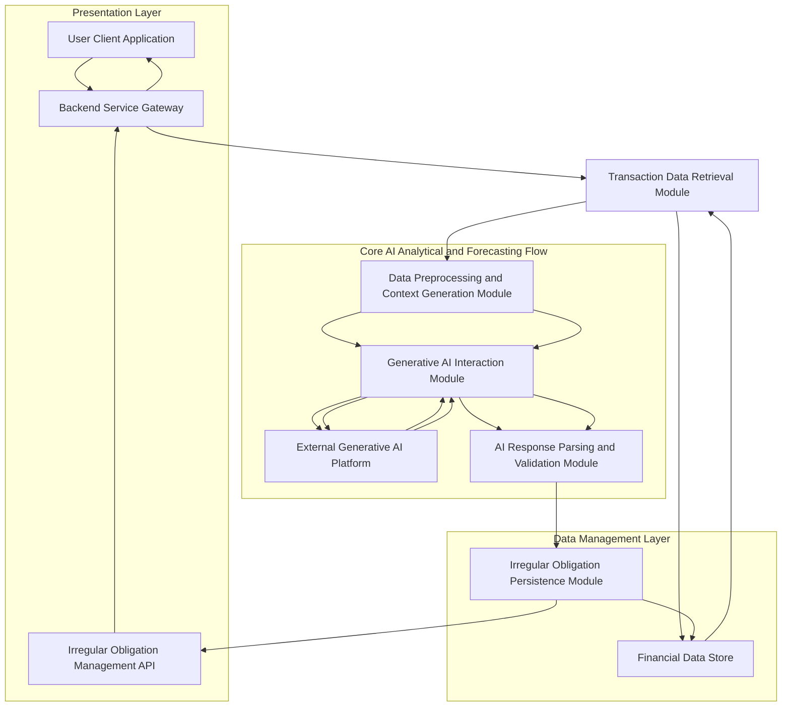
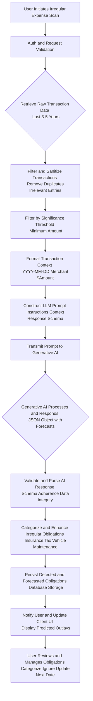
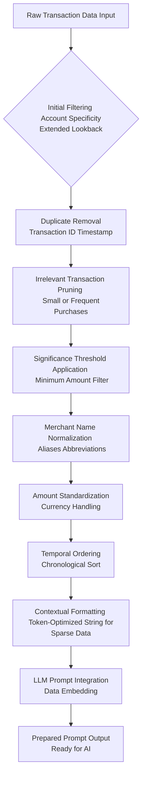
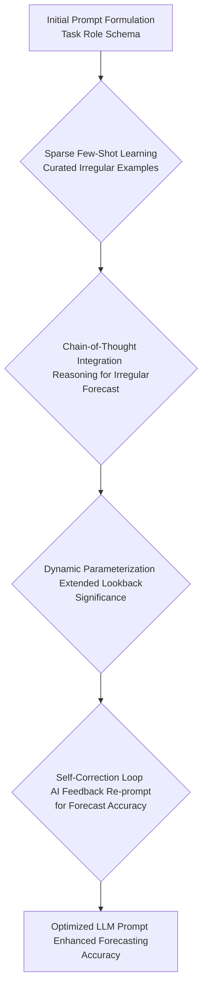
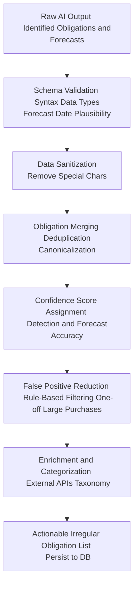
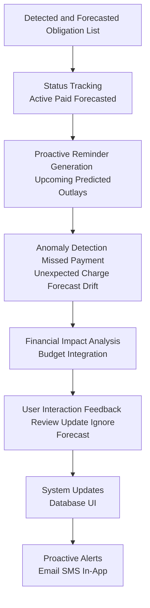
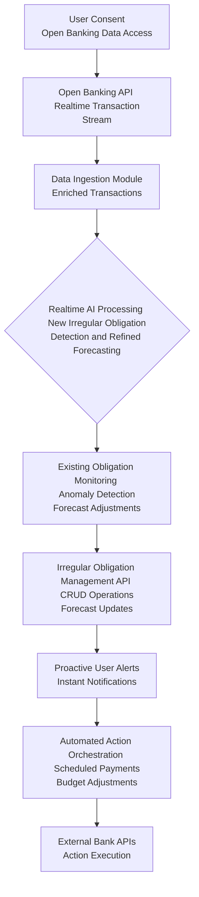
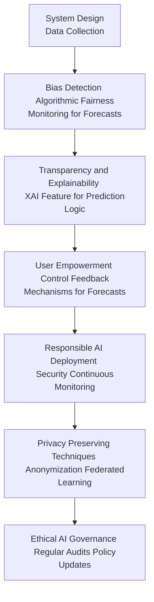
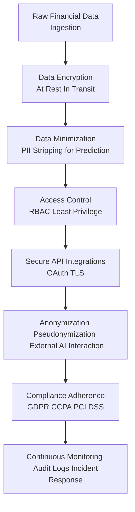
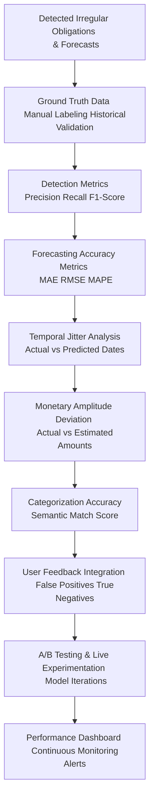

# Title of Invention: A System and Method for the Autonomous Identification, Predictive Forecasting, and Dynamic Management of Covert Irregular Recurring Significant Financial Obligations via Advanced Generative Artificial Intelligence

## Abstract:
This disclosure presents an innovative computational framework for the autonomous discernment, predictive forecasting, and proactive management of often-overlooked irregular yet recurrent significant financial outlays within an individual's transactional history. Such obligations, encompassing annual insurance premiums, property taxes, vehicle registrations, or infrequent but substantial maintenance costs, often escape conventional subscription tracking mechanisms due to their varied periodicity and high monetary amplitude. The system meticulously processes an an extensive corpus of transactional data, employing sophisticated pattern recognition algorithms to identify disbursements directed towards identical or functionally analogous commercial entities over extended, non-uniform temporal intervals. Through intricate analysis of sparse temporal periodicity, amplitude consistency within a defined significance threshold, and semantic congruence of associated transactional metadata, the system precisely differentiates these bona fide irregular recurring commitments from stochastic or infrequent large purchases. The derived compendium of identified and forecasted irregular obligations is then presented to the end-user through an intuitive interface, thereby empowering superior proactive financial planning and mitigation of potentially unforeseen significant expenditures. This analytical prowess is significantly augmented by a high-fidelity generative artificial intelligence model, strategically prompted to execute a nuanced heuristic pattern matching and forecasting operation across the supplied financial data landscape.

## Background of the Invention:
In contemporary personal finance, individuals frequently encounter significant financial obligations that, while not strictly "subscriptions" with rigid monthly or quarterly billing cycles, recur at irregular or extended intervals. These include, but are not limited to, annual or bi-annual insurance premiums (auto, home, life), property taxes, vehicle registration fees, annual software licenses, major appliance service contracts, or even periodic large medical co-pays for chronic conditions. The substantial monetary value of these irregular expenditures often makes them critical components of personal financial planning, yet their infrequent and sometimes unpredictable nature renders them exceptionally challenging to track, remember, and budget for proactively.

Traditional financial management tools are predominantly optimized for detecting regular, predictable recurring payments like monthly subscriptions. They frequently fail to identify or adequately forecast these "covert" irregular commitments, often misclassifying them as one-off large purchases or requiring explicit manual input and tracking from the user. The cognitive burden associated with manually reconciling extensive financial statements  often spanning multiple years of granular transactional data  to unearth and predict these latent irregular expenditures is profoundly arduous, time-consuming, and highly susceptible to human error. A critical lacuna therefore exists for a sophisticated, autonomous, and intellectually astute computational system capable of intelligently parsing and synthesizing vast repositories of transactional data to proactively identify, predict the next occurrence of, and present these often-overlooked significant financial commitments. Such a system would alleviate a significant financial oversight burden, promoting enhanced fiscal transparency and empowering informed, long-term consumer financial decision-making.

## Brief Summary of the Invention:
The present intellectual construct introduces a revolutionary methodology for the autonomous identification, predictive forecasting, and dynamic management of irregular recurring significant financial obligations embedded within an individual's extended transactional history. At its core, the invention synthesizes a comprehensive synopsis of a user's historical financial ledger, comprising essential metadata such as merchant appellation, transactional monetary value, and temporal markers over an expansive lookback window (e.g., 3-5 years). This meticulously structured synopsis is subsequently encapsulated as contextual input within a highly optimized prompt, which is then submitted to a sophisticated large language model LLM, serving as the principal analytical and forecasting engine.

The prompt rigorously delineates the LLM's role as a hyper-competent financial forensic analyst specializing in sparse pattern recognition, tasking it with the explicit objective of discerning transactional sequences indicative of irregular recurring obligations. This involves the astute recognition of repeated disbursements to functionally equivalent merchants, exhibiting commensurate monetary values above a predefined significance threshold, and occurring with predictable, albeit extended and potentially variable, temporal periodicity (e.g., annual, bi-annual cycles, or patterns like "every 14-16 months"). Crucially, the LLM is architected to yield its analytical and forecasting findings as a rigorously structured data object, such as a JSON payload, enumerating each potential irregular obligation with its descriptive identifier, estimated recurring amount, estimated frequency, the temporal marker of its most recent instantiation, and, critically, a *predicted next occurrence date*. This structured output is then seamlessly presented to the user, providing an actionable overview and proactive foresight into their significant, irregular financial landscape.

## Detailed Description of the Invention:

The comprehensive system for the autonomous identification, predictive forecasting, and dynamic management of covert irregular recurring significant financial obligations operates as a sophisticated, multi-tiered architecture designed for robustness, scalability, and precision. Upon a user's invocation of the irregular expense prediction feature, a dedicated backend service initiates a series of orchestrated operations to retrieve, process, analyze, forecast, and present the relevant financial insights.

### System Architecture Overview

The underlying system architecture is meticulously engineered to ensure efficient data flow, secure processing, and highly accurate analytical and forecasting outcomes. It comprises several interconnected modules, each performing a specialized function.


**Figure 1: High-Level System Architecture for AI-driven Irregular Expense Prediction**

1.  **User Client Application A:** The front-end interface web, mobile, desktop through which the user interacts with the system, initiates analyses, and views detected and forecasted irregular obligations.
2.  **Backend Service Gateway B:** The primary entry point for client requests, responsible for authentication, authorization, request routing, and orchestrating interactions between various backend modules.
3.  **Transaction Data Retrieval Module C:** Responsible for securely accessing and retrieving historical financial transaction data pertinent to the authenticated user from the primary Financial Data Store D. This module enforces data privacy and access controls, often extending the lookback period significantly (e.g., 3-5 years) compared to regular subscriptions.
4.  **Financial Data Store D:** A robust, secure, and scalable data repository e.g., a distributed SQL or NoSQL database housing all user financial transaction records, along with metadata and system-level configurations.
5.  **Data Preprocessing and Context Generation Module E:** Transforms raw transactional data into a semantically coherent, concise, and optimized textual format suitable for ingestion by a Large Language Model LLM. This module also constructs the analytical and forecasting prompt.
6.  **Generative AI Interaction Module F:** Manages the secure and efficient communication with the External Generative AI Platform G. It handles API calls, request payload construction, rate limiting, retry mechanisms, and error handling.
7.  **External Generative AI Platform G:** The third-party or proprietary advanced generative AI model e.g., Google's Gemini, OpenAI's GPT series responsible for executing the core sparse pattern recognition, analytical, and forecasting tasks.
8.  **AI Response Parsing and Validation Module H:** Receives the structured output from the Generative AI Platform, validates its adherence to the expected schema, and extracts the identified irregular obligations and their forecasts. It also performs sanitization and basic data integrity checks.
9.  **Irregular Obligation Persistence Module I:** Stores the newly identified, validated, and forecasted irregular recurring obligations in the Financial Data Store D, potentially linking them to user profiles for ongoing management and monitoring.
10. **Irregular Obligation Management API J:** Provides an interface for the client application to fetch, update, or manage the detected and forecasted obligations e.g., mark as reviewed, categorize, or ignore.

### Operational Workflow and Data Processing Pipeline

The detailed operational flow encompasses several critical stages, each contributing to the robustness and accuracy of the irregular expense detection and forecasting process.


**Figure 2: Detailed Data Processing Pipeline for Autonomous Irregular Expense Prediction and Forecasting**

1.  **User Initiation A:** The process begins when a user explicitly requests a scan for irregular recurring significant expenses through the client application.
2.  **Authentication and Request Validation B:** The backend gateway authenticates the user's identity and validates the integrity and permissions of the request.
3.  **Raw Transaction Data Retrieval C:** The Transaction Data Retrieval Module accesses the Financial Data Store D to fetch a comprehensive history of the user's financial transactions. A typical lookback window is 3 to 5 years, adjustable based on configurable parameters to ensure sufficient data for detecting infrequent patterns.
4.  **Filtering and Sanitization D:** The retrieved data undergoes an initial cleansing phase. This involves:
    *   **Duplicate Removal:** Eliminating any inadvertently duplicated transaction records.
    *   **Irrelevant Entry Pruning:** Filtering out transaction types unlikely to ever constitute an irregular recurring obligation e.g., daily coffee purchases, frequent small online buys.
    *   **Data Normalization:** Standardizing merchant names where possible e.g., "INS CO" to "Insurance Company X".
5.  **Filter by Significance Threshold E:** A crucial step for irregular expenses is to filter transactions below a predefined monetary significance threshold. This prevents the LLM from attempting to find patterns in very small, infrequent transactions, focusing its resources on truly "significant" outlays. This threshold can be user-configurable or dynamically determined.
6.  **Transaction Context Formatting F:** The sanitized and filtered transaction data is then transformed into a concise, token-efficient textual representation suitable for prompt engineering. An exemplary format might be:
    ```
    `2024-03-15 - State Farm Auto - $1200.00; 2023-03-16 - State Farm Auto - $1150.00; 2022-03-17 - State Farm Auto - $1100.00; 2024-05-01 - City Property Tax - $3500.00; 2023-05-02 - City Property Tax - $3400.00; ...`
    ```
    This linear, semi-structured format minimizes token usage while preserving critical information for the LLM.
7.  **LLM Prompt Construction G:** A sophisticated prompt is dynamically generated. This prompt consists of several key components:
    *   **Role Instruction:** Directing the LLM to adopt the persona of an expert financial analyst specializing in long-term, irregular expense forecasting.
    *   **Task Definition:** Clearly instructing the LLM to identify irregular recurring significant obligations and predict their next occurrence.
    *   **Search Criteria:** Emphasizing the analysis of merchant commonality, amount consistency within a defined tolerance for *significant* values, and *extended, sparse* temporal intervals e.g., annually, bi-annually, every 12-14 months.
    *   **Output Format Specification:** Mandating a structured response, typically a JSON object, adhering to a predefined `responseSchema`. This schema ensures parseability and data integrity and *must include a `predicted_next_occurrence_date` field*.
    *   **Transaction Data Embedding:** The formatted transaction context from step F is directly embedded into this prompt.

    An example prompt structure:
    ```json
    {
      "role": "system",
      "content": "You are an expert financial analyst specializing in identifying irregular but recurring significant financial obligations from raw transaction data. Analyze the provided transactions to find patterns of repeated large payments to the same or highly similar merchants, with consistent amounts (within a small tolerance, e.g., 8%), occurring at extended, potentially variable intervals (e.g., every 11-13 months for annual, or 22-26 months for bi-annual). Prioritize clarity and accuracy. If no such obligations are found, return an empty list. Provide a predicted next occurrence date for each."
    },
    {
      "role": "user",
      "content": "Analyze the following transaction data for irregular recurring significant obligations. Return your findings as a JSON object strictly adhering to the provided schema. Data: [transaction summary generated in step F]"
    },
    {
      "role": "system",
      "content": "Please provide your output in the following JSON format:\n"
                  "```json\n"
                  "{\n"
                  "  \"irregular_obligations\": [\n"
                  "    {\n"
                  "      \"name\": \"string\",\n"
                  "      \"estimated_amount\": \"number\",\n"
                  "      \"currency\": \"string\",\n"
                  "      \"estimated_frequency\": \"string\",\n"
                  "      \"last_charged_date\": \"YYYY-MM-DD\",\n"
                  "      \"predicted_next_occurrence_date\": \"YYYY-MM-DD\",\n"
                  "      \"merchant_identifiers\": [\"string\"]\n"
                  "    }\n"
                  "  ]\n"
                  "}\n"
                  "```"
    }
    ```
8.  **Prompt Transmission to Generative AI H:** The constructed prompt is securely transmitted to the External Generative AI Platform G via a robust API call.
9.  **Generative AI Processing and Response I:** The generative AI model ingests the prompt, applying its advanced pattern recognition, contextual understanding, and predictive capabilities to identify potential irregular recurring payments and forecast their next occurrence. It then synthesizes its findings into a JSON object strictly conforming to the specified `responseSchema`.
10. **AI Response Validation and Parsing J:** Upon receiving the JSON response from the AI, the AI Response Parsing and Validation Module H rigorously checks for schema adherence, data type correctness, and logical consistency including the plausibility of forecasted dates. Any malformed or non-compliant responses are flagged for retry or error handling. Validated data is then parsed into internal data structures.
11. **Irregular Obligation Categorization and Enhancement K:** Beyond mere detection and prediction, the system applies further logic to categorize the identified obligations e.g., "Auto Insurance," "Property Tax," "Vehicle Maintenance." This categorization can be achieved through a secondary, smaller LLM call for semantic classification, or by rule-based matching against a pre-defined merchant category taxonomy. Additional metadata, such as historical average amount, number of detected payments, and forecast confidence, may also be computed and appended.
12. **Persistence of Detected and Forecasted Obligations L:** The enriched list of irregular obligations, including their predicted next occurrence dates, is then securely stored in the Financial Data Store D via the Irregular Obligation Persistence Module I. This ensures that detected obligations are retained for subsequent retrieval, management, and ongoing monitoring.
13. **User Notification and UI Update M:** The client application is updated to display the newly identified and forecasted irregular obligations to the user in a clear, actionable format, often with aggregated views, sortable columns, and visual indicators of upcoming large expenses.
14. **User Review and Management N:** The user can then interact with the detected obligations, categorizing them further, marking them as reviewed, ignoring false positives, updating the predicted next date if more accurate information is available, or initiating external actions e.g., setting calendar reminders, allocating budget.

### Detailed Module Workflows

#### Data Preprocessing and Context Generation Module Workflow

This module plays a crucial role in transforming raw, often messy, transaction data into a clean, concise, and LLM-ready format, ensuring optimal performance and token efficiency for detecting infrequent patterns.


**Figure 3: Detailed Workflow for Data Preprocessing and Context Generation Module**

*   **Initial Filtering:** Transactions are first filtered to ensure they belong to the authenticated user and are within the significantly extended lookback period e.g., 3-5 years.
*   **Duplicate Removal:** Identical transaction records, often arising from data ingestion issues, are eliminated based on unique identifiers or a combination of merchant, amount, and timestamp.
*   **Irrelevant Transaction Pruning:** Specific transaction types deemed non-irregular-recurring-like e.g., very small amounts, frequent daily purchases, internal transfers are removed to reduce noise.
*   **Significance Threshold Application:** Transactions are filtered to include only those above a configurable monetary threshold, ensuring the focus is on "significant" financial obligations.
*   **Merchant Name Normalization:** Variances in merchant names e.g., "GEICO," "GEICO Insurance" are resolved to a canonical form using rule-based mapping, fuzzy matching, or semantic similarity algorithms. This enhances the LLM's ability to group related, infrequent transactions.
*   **Amount Standardization:** Monetary values are standardized to a consistent format and currency, handling different locale conventions.
*   **Temporal Ordering:** Transactions are strictly ordered chronologically, which is critical for the LLM to identify sparse temporal patterns.
*   **Contextual Formatting:** The cleaned, filtered, and ordered data is then serialized into a compact text string, such as `YYYY-MM-DD - Merchant Name - $Amount;`, optimizing token usage for the LLM while retaining essential information for identifying infrequent patterns.
*   **LLM Prompt Integration:** This formatted string is embedded within the larger prompt template, along with role instructions, task definition, output schema, and specific instructions for forecasting.
*   **Prepared Prompt Output:** The final, comprehensive prompt is then ready for transmission to the Generative AI Interaction Module.

### Advanced Prompt Engineering Strategies

To further optimize the performance and accuracy of the Generative AI for detecting and forecasting irregular, sparse patterns, sophisticated prompt engineering strategies are employed:


**Figure 4: Advanced Prompt Engineering Workflow**

1.  **Sparse Few-Shot Learning Integration:** The prompt includes a small number of carefully curated examples of transaction sequences exhibiting irregular but recurrent patterns e.g., annual car insurance payments over 3 years with slight date shifts and their corresponding correct identification and forecast. This guides the LLM to better understand the desired output format and the nuanced criteria for detecting and predicting sparse, significant events. These examples serve as in-context learning, significantly improving the model's ability to generalize to new data.
2.  **Chain-of-Thought Prompting:** For complex forecasting scenarios, the prompt instructs the LLM to "think step-by-step" or "reason explicitly" about the periodicity and amount consistency before providing its final JSON output and forecast. For example, it might be asked to first list transaction groups it considers recurrent, then deduce the average interval, note any amount changes, and finally predict the next date. This often leads to more robust and accurate predictions by externalizing the model's reasoning process.
3.  **Self-Correction and Refinement Loops:** The system includes a feedback loop where the LLM's initial response, particularly the predicted next occurrence date, is reviewed e.g., by another smaller model, historical averages, or a set of heuristics for plausibility and consistency. If issues are found, the initial output, along with the identified issues, can be fed back to the LLM for self-correction, specifically refining the forecast. This iterative refinement significantly boosts output quality and reduces hallucination in predictions.
4.  **Dynamic Parameterization:** The lookback window, amount tolerance e.g., 5% vs 10%, temporal jitter e.g., +/- 15 days vs +/- 30 days, and the monetary significance threshold can be dynamically adjusted within the prompt based on user settings, regional financial norms, or the overall noise level and sparsity in the transaction data. This allows for a more flexible and personalized detection and forecasting experience.

### Post-Processing and Disambiguation

The output from the Generative AI, while highly structured, often benefits from additional post-processing to ensure optimal user experience, data integrity, and robust forecasting.


**Figure 5: Post-Processing and Disambiguation Workflow**

1.  **Schema Validation and Data Sanitization:** The initial AI output undergoes strict validation against the expected JSON schema, ensuring correct data types, structure, and critically, the plausibility of predicted dates e.g., not in the distant past or ridiculously far future. Basic sanitization removes any unexpected characters or formatting.
2.  **Obligation Merging and Deduplication:** The AI might occasionally identify slightly different "versions" of the same irregular obligation e.g., due to minor merchant name variations or slightly different payment dates for the same service over years. A post-processing layer analyzes detected obligations for high similarity across all attributes merchant identifiers, amounts, frequency and intelligently merges them into a single, canonical entry. This prevents redundant entries for the user and consolidates historical data for more accurate forecasting.
3.  **Confidence Score Assignment:** While the AI may implicitly have a confidence level, the system applies explicit heuristics or a secondary machine learning model to assign a more robust confidence score to each detected obligation and its forecast. This score can factor in the number of past payments detected, the regularity of the irregular pattern, the amount consistency, and the merchant's known reputation. This helps users prioritize review of high-confidence detections and forecasts.
4.  **False Positive Reduction:** Rule-based filters or a trained classifier are applied post-AI to identify and flag common false positives that might arise e.g., large, infrequent but truly one-off purchases that the AI mistakenly grouped as recurrent due to some superficial similarity. This ensures only truly irregular recurring significant obligations are presented.
5.  **Enrichment and Categorization:** This step aligns with K in Figure 2. The system applies further logic to categorize the identified obligations e.g., "Auto Insurance," "Property Tax," "Vehicle Maintenance." This categorization can be achieved through a secondary LLM call for semantic classification, by rule-based matching against a pre-defined merchant category taxonomy, or via external merchant APIs for better context.
6.  **User Feedback Loop for Model Improvement:** User interactions e.g., marking a detection as a false positive, confirming an obligation, correcting details or predicted dates are anonymized and aggregated. This valuable feedback is then used to fine-tune the generative AI model or train subsequent post-processing layers, creating a continuous improvement cycle for both detection and forecasting accuracy.

### Irregular Obligation Lifecycle Management Module

Beyond initial detection and prediction, the system aims to provide comprehensive management capabilities, enabling users to maintain an up-to-date and actionable view of their significant, irregular financial commitments.


**Figure 6: Irregular Obligation Lifecycle Management Workflow**

1.  **Tracking Obligation Status:** The system tracks the status of each detected obligation e.g., `Active`, `Paid Recently`, `Forecasted`. This involves continuously analyzing future transaction data to confirm expected payments or detect their absence based on the predicted next occurrence date.
2.  **Proactive Reminder Generation:** For obligations with upcoming predicted occurrence dates, the system can proactively remind users well in advance, providing ample opportunity to budget, review, or make necessary arrangements. Reminders are highly configurable by the user in terms of timing and channel.
3.  **Anomaly Detection in Irregular Payments:** Beyond detection and forecasting, the system monitors `active` and `forecasted` irregular obligations for anomalies. This includes:
    *   **Missed Expected Payment:** Alerting if an expected payment, based on the `predicted_next_occurrence_date`, does not occur within its normal temporal jitter window. This could indicate an issue or an unexpected change in recurrence.
    *   **Unexpected Significant Charge:** Flagging large, unpredicted charges that might be a new irregular obligation or an error.
    *   **Significant Price Changes:** Notifying users if a detected obligation's amount deviates significantly from its historical average or expected pattern, especially upon payment confirmation.
    *   **Forecast Drift:** Monitoring if the actual payment dates consistently deviate from the forecasted dates, prompting the system to recalibrate its prediction model.
4.  **Financial Impact Analysis and Budget Integration:** The system can integrate with personal budgeting tools to automatically allocate funds for upcoming irregular obligations, helping users avoid financial surprises and maintain a balanced budget throughout the year. It provides insights into the aggregate financial impact of these obligations.
5.  **User Interaction Feedback:** All user actions such as marking an obligation as "reviewed," "ignored," "paid," "confirmed," or updating its details or forecasted dates contribute to the system's ongoing learning and data refinement.
6.  **Proactive Alerts and Reminders:** Users can opt-in to receive notifications for important events via their preferred communication channels email, SMS, in-app push notifications for upcoming predicted payments, detected price changes, or significant obligations that appear to be overdue.

### Open Banking Integration and Real-time Processing

Future enhancements include direct integration with Open Banking APIs e.g., PSD2 in Europe, Open Banking in the UK, similar initiatives globally. This significantly elevates the system's capabilities, moving towards real-time insights and more accurate, dynamic forecasting of irregular expenses.


**Figure 7: Open Banking Integration for Realtime Irregular Expense Monitoring**

1.  **User Consent:** Explicit and granular user consent is paramount for accessing financial data through Open Banking APIs, adhering strictly to privacy regulations.
2.  **Open Banking API Integration:** The system establishes secure connections with various financial institutions' Open Banking APIs to receive real-time or near real-time transaction streams.
3.  **Data Ingestion Module:** This module is responsible for securely ingesting, normalizing, and storing the enriched transaction data received from Open Banking APIs. This data often includes more detailed merchant categories and payment references, improving detection and forecasting accuracy.
4.  **Real-time AI Processing:** The core generative AI pipeline is adapted to process incoming transaction data continuously. This allows for immediate detection of new irregular obligations or refinement of existing forecasts shortly after new relevant transactions appear in a user's bank statement.
5.  **Existing Obligation Monitoring:** Real-time data feeds enable continuous monitoring of already detected and forecasted irregular obligations for any changes in amount, actual payment date, or unexpected cessation, triggering immediate anomaly alerts and allowing for dynamic forecast adjustments.
6.  **Irregular Obligation Management API:** The integrated management API handles create, read, update, and delete CRUD operations for obligations, propagating real-time changes and forecast updates to the user interface.
7.  **Proactive User Alerts:** With real-time data, notifications for new detections, actual payment confirmations, significant price changes, or updated next occurrence forecasts can be delivered almost instantaneously, significantly enhancing user awareness and control over these critical expenses.
8.  **Automated Action Orchestration:** With appropriate and explicit user consent, the system can orchestrate automated financial actions directly through banking APIs, such as:
    *   **Scheduling Payments:** Assisting users in scheduling payments for upcoming forecasted irregular obligations.
    *   **Budget Adjustments:** Automatically creating or adjusting budget categories to account for upcoming large expenses.
    *   **Fund Transfers:** Proposing or executing transfers to a dedicated savings account for a forecasted expense.
9.  **External Bank APIs for Action Execution:** Secure interaction with bank APIs to execute consented financial actions, providing a seamless end-to-end management experience for irregular obligations.

### Ethical AI Framework and Governance

The deployment of advanced AI in financial applications, especially for predicting significant irregular expenses, mandates a rigorous consideration of ethical implications to ensure fairness, transparency, and user trust. A comprehensive Ethical AI Framework is integrated into the system's design and operational lifecycle.


**Figure 8: Ethical AI Framework and Governance Workflow**

1.  **Bias Detection and Mitigation:**
    *   **Algorithmic Fairness:** The system continuously monitors for potential biases in irregular obligation detection and forecasting that might disproportionately affect certain user demographics e.g., based on transaction patterns linked to specific income brackets or regions. For instance, ensuring that the system does not over-forecast for users with limited financial flexibility. Regular audits of AI outputs and fairness metrics are conducted to identify and rectify such biases.
    *   **Data Diversity:** Efforts are made to ensure that the training and fine-tuning data for the generative AI is diverse and representative across various financial profiles, minimizing the risk of models learning and perpetuating existing financial biases or making inaccurate forecasts for underrepresented groups.
2.  **Transparency and Explainability XAI:**
    *   While large language models are often considered "black boxes," the system strives for a degree of explainability. For each detected irregular obligation, the system highlights the key transactions e.g., "These 3 payments to Acme Insurance on 2022-04-01, 2023-04-05, 2024-04-02, all around $850, led to this detection and the prediction for 2025-04-04." that contributed to the AI's conclusion and forecast.
    *   Users are informed about the confidence score of each detection and prediction, allowing them to understand the AI's certainty and prioritize their review.
3.  **User Empowerment and Agency:**
    *   The system is designed to augment, not replace, user control. All AI-generated insights and forecasts are presented as suggestions that require user review and confirmation. Users retain full agency over their financial decisions, with easy-to-use interfaces for correction and overriding predicted dates or amounts.
    *   Clear mechanisms are provided for users to correct misidentifications, override categorizations, adjust forecasts, and provide feedback, ensuring a human-in-the-loop approach and fostering trust.
4.  **Responsible AI Deployment:**
    *   **Security against Misuse:** Robust security measures, including advanced encryption, strict access controls, and anomaly detection, prevent malicious actors from exploiting the AI for financial profiling or unauthorized access, especially given the significant nature of the predicted expenses.
    *   **Continuous Monitoring:** The AI models and their outputs are continuously monitored for performance drift, unexpected behaviors, or emergent biases, ensuring ongoing ethical and accurate operation in a dynamic financial environment.
5.  **Privacy-Preserving Techniques:** Beyond data minimization, advanced privacy-enhancing technologies like Federated Learning are considered for future iterations, allowing models to learn from decentralized user data without direct access to individual financial details, further bolstering privacy for these sensitive financial predictions.
6.  **Ethical AI Governance:** An overarching governance structure ensures regular ethical reviews, policy updates, and adherence to evolving ethical guidelines and regulations for AI systems, particularly concerning financial forecasting.

### Security and Privacy Considerations

Given the sensitive nature of financial transaction data and the implications of predicting large future expenses, the system is designed with a paramount focus on security and privacy:


**Figure 9: Security and Privacy Design Flow**

*   **Data Encryption:** All transaction data, both at rest in the Financial Data Store D and in transit between modules and to the External Generative AI Platform G, is encrypted using industry-standard protocols e.g., AES-256 for data at rest, TLS 1.2+ for data in transit.
*   **Access Control:** Strict role-based access control RBAC mechanisms are enforced, ensuring that only authorized modules and personnel can access sensitive data, and only for legitimate operational purposes. The principle of least privilege is rigorously applied.
*   **Data Minimization:** Only the absolutely necessary transaction metadata merchant, amount, date is transmitted to the generative AI model, avoiding the exposure of personally identifiable information PII beyond what is strictly required for analysis and forecasting.
*   **Anonymization/Pseudonymization:** Where feasible and non-detrimental to analytical accuracy, data may be anonymized or pseudonymized before processing, particularly when interacting with external services, to further enhance privacy safeguards for these sensitive predictions.
*   **Compliance:** Adherence to relevant data protection regulations e.g., GDPR, CCPA, PCI DSS is a foundational principle of the system's design and operation, with regular audits to ensure ongoing compliance.
*   **Secure API Integrations:** All interactions with the External Generative AI Platform G utilize secure API keys, OAuth 2.0, or similar authentication protocols, and communication channels are hardened against interception and tampering.
*   **Continuous Monitoring:** Comprehensive audit logs, intrusion detection systems, and regular security assessments are implemented to monitor for unauthorized access, data breaches, or other security incidents, with robust incident response protocols in place, especially crucial for a system dealing with significant financial forecasts.

### Scalability and Performance

The system is architected for high scalability and performance, capable of processing vast volumes of historical transactional data for a large user base to identify and forecast irregular expenses:
*   **Microservices Architecture:** Deployed as a collection of loosely coupled microservices, allowing individual components e.g., Data Retrieval, AI Interaction, Parsing to be scaled independently based on demand, which is critical given the extended lookback periods required for irregular patterns.
*   **Asynchronous Processing:** Long-running tasks, such as calls to the External Generative AI Platform G with large transaction histories, are handled asynchronously using message queues, preventing blocking operations and improving overall system responsiveness.
*   **Distributed Data Stores:** The Financial Data Store D leverages distributed database technologies to ensure high availability, fault tolerance, and linear scalability for data storage and retrieval, especially with multi-year transaction histories.
*   **Caching Mechanisms:** Strategic caching is implemented at various layers e.g., frequently accessed user transaction summaries, pre-computed irregular obligation categories, recently generated forecasts to reduce latency and load on backend services and the generative AI platform.
*   **Optimized Prompt Engineering:** Continuously refining prompts to be token-efficient and unambiguous minimizes computational cost and improves response times from the generative AI, which often bills per token, crucial when processing large historical datasets.

### Model Evaluation and Performance Metrics

Rigorous evaluation of the system's performance, particularly the accuracy of the AI-driven detection and forecasting, is paramount. This involves a comprehensive suite of metrics and continuous monitoring.


**Figure 10: Model Evaluation and Performance Metrics Workflow**

1.  **Ground Truth Data Generation:** A critical foundation is the creation of high-quality ground truth data. This involves expert manual labeling of historical transaction datasets to identify true irregular obligations and their actual recurrence patterns. User feedback, as described in Figure 6, also serves as a valuable source of ground truth.
2.  **Detection Metrics:** Standard classification metrics are used to evaluate the AI's ability to correctly identify irregular obligations:
    *   **Precision:** The proportion of detected obligations that are actually correct.
    *   **Recall:** The proportion of actual irregular obligations that were correctly detected by the system.
    *   **F1-Score:** The harmonic mean of precision and recall.
3.  **Forecasting Accuracy Metrics:** For the `predicted_next_occurrence_date` and `estimated_amount`, time-series forecasting metrics are employed:
    *   **Mean Absolute Error (MAE):** Average absolute difference between predicted and actual values.
    *   **Root Mean Squared Error (RMSE):** Square root of the average of squared differences.
    *   **Mean Absolute Percentage Error (MAPE):** Average of the absolute percentage errors, useful for understanding error relative to the magnitude.
4.  **Temporal Jitter Analysis:** Specifically for irregular obligations, analysis focuses on the distribution of `(actual_payment_date - predicted_next_occurrence_date)` to understand the system's precision in forecasting variable periodicity.
5.  **Monetary Amplitude Deviation:** Measures the consistency between the `estimated_amount` and the actual amount paid, accounting for the defined tolerance.
6.  **Categorization Accuracy:** Evaluates the accuracy of the post-processing categorization module against human-assigned categories.
7.  **User Feedback Integration:** Directly incorporates explicit user feedback (e.g., "this is a false positive", "this date is incorrect") to refine ground truth and track model improvements over time.
8.  **A/B Testing and Live Experimentation:** Different prompt engineering strategies, AI models, or post-processing heuristics are A/B tested in a live environment with a subset of users to evaluate real-world impact before wider deployment.
9.  **Performance Dashboard:** A centralized dashboard monitors all key performance indicators, with automated alerts for any significant degradation in detection or forecasting accuracy, ensuring proactive maintenance and model retraining.

## Ethical AI Considerations

The deployment of advanced AI in financial applications mandates a rigorous consideration of ethical implications to ensure fairness, transparency, and user trust, particularly when predicting significant future financial obligations.

1.  **Bias Detection and Mitigation:**
    *   **Algorithmic Fairness:** The system monitors for potential biases in irregular obligation detection, categorization, and especially forecasting that might disproportionately affect certain user demographics e.g., based on transaction patterns linked to specific income brackets or regions. For example, ensuring that the system's predictions are not more accurate for high-income users due to better-structured financial data. Regular audits of AI outputs and fairness metrics are conducted.
    *   **Data Diversity:** Efforts are made to ensure that the training and fine-tuning data for the generative AI is diverse and representative across various financial behaviors and demographics, minimizing the risk of models learning and perpetuating existing financial biases or making inaccurate forecasts for underrepresented groups.
2.  **Transparency and Explainability XAI:**
    *   While large language models are often considered "black boxes," the system strives for a degree of explainability. For each detected irregular obligation, the system highlights the key transactions e.g., "These 3 payments to [Merchant] over [X] years, all around [Amount], led to this detection and the prediction for [YYYY-MM-DD]." that contributed to the AI's conclusion and forecast.
    *   Users are informed about the confidence score of each detection and prediction, allowing them to understand the AI's certainty and the reliability of the forecast.
3.  **User Empowerment and Agency:**
    *   The system is designed to augment, not replace, user control. All AI-generated insights and forecasts are presented as suggestions that require user review and confirmation. Users retain full agency over their financial decisions, with easy-to-use interfaces for correction, overriding predicted dates or amounts, and opting out of specific predictions.
    *   Clear mechanisms are provided for users to correct misidentifications, override categorizations, adjust forecasts, and provide feedback, ensuring a human-in-the-loop approach and fostering trust in sensitive financial predictions.
4.  **Responsible AI Deployment:**
    *   **Security against Misuse:** Robust security measures prevent malicious actors from exploiting the AI for financial profiling or unauthorized access, particularly given the sensitive nature of forecasting future large expenses.
    *   **Continuous Monitoring:** The AI models and their outputs are continuously monitored for performance drift, unexpected behaviors, or emergent biases, ensuring ongoing ethical and accurate operation in a dynamic financial environment.
    *   **Privacy-Preserving Techniques:** Beyond data minimization, advanced privacy-enhancing technologies like Federated Learning are considered for future iterations, allowing models to learn from decentralized user data without direct access to individual financial details, further bolstering privacy safeguards for predictive financial insights.

## Declarations of Inventive Scope and Utility:

The conceptual framework herein elucidated, along with its specific embodiments and architectural designs, constitutes an original intellectual construct that significantly advances the state of the art in financial intelligence and predictive analytics systems. This innovative methodology provides a distinct and superior approach to automated financial analysis and forecasting for irregular yet significant obligations.

1.  A pioneering computational method for discerning and predictively forecasting irregular recurring significant financial obligations, comprising the foundational steps of:
    a.  Accessing a comprehensively structured historical repository of an individual's financial transactions spanning an extended temporal window.
    b.  Constructing an optimized, context-rich summary derived from said transaction history, filtered by a predefined monetary significance threshold.
    c.  Transmitting said optimized summary, embedded within a meticulously crafted prompt, to an advanced generative artificial intelligence model, with explicit instructions for the model to identify irregular recurring financial disbursements and predict their next occurrence date.
    d.  Receiving and rigorously validating a structured data artifact, representing a compendium of potential irregular recurring obligations including their predicted next occurrence dates, as identified and synthesized by the generative artificial intelligence model.
    e.  Presenting said validated compendium, with associated forecasts, to the individual via an interactive user interface.

2.  The pioneering computational method of declaration 1, further characterized in that the meticulously crafted prompt rigorously instructs the generative artificial intelligence model to conduct a multi-variate analysis encompassing the merchant's descriptive identifier, the precise monetary value of the payment above a significance threshold, and the extended, sparse temporal periodicity between successive payments for each transaction record.

3.  The pioneering computational method of declaration 1, further characterized in that the transmission to the generative artificial intelligence model incorporates a declarative response schema, compelling the model to render the compendium of potential irregular recurring obligations in a pre-specified, machine-parseable structured data format, such as a JavaScript Object Notation JSON object, explicitly including a field for `predicted_next_occurrence_date`.

4.  An innovative system architecture for the autonomous identification and predictive forecasting of irregular recurring significant financial obligations, comprising:
    a.  A secure, distributed data store meticulously engineered for the persistent storage of comprehensive user financial transaction histories over an extended lookback period.
    b.  A robust service module architected for secure, high-throughput communication with an external generative artificial intelligence model.
    c.  An intelligent processing logic layer configured to perform: (i) the extraction of relevant transaction history filtered by a significance threshold, (ii) the sophisticated transformation of this history into a concise, token-optimized prompt for sparse pattern recognition and forecasting, and (iii) the secure transmission of this prompt to the aforementioned generative artificial intelligence model.
    d.  A dynamic user interface component meticulously designed to render and display the structured compendium of potential irregular recurring obligations, including their predicted next occurrence dates, returned by the generative artificial intelligence model to the user, facilitating intuitive interaction and proactive management.

5.  The innovative system architecture of declaration 4, further comprising a post-processing module configured to semantically categorize each identified irregular recurring obligation into predefined financial categories e.g., "Auto Insurance," "Property Tax," "Vehicle Registration" based on the merchant identifier or AI-derived contextual information.

6.  The innovative system architecture of declaration 4, further comprising a temporal anomaly detection and forecast adjustment module configured to monitor identified irregular recurring obligations for deviations in payment amount, actual payment date compared to predicted date, or unexpected cessation, and to generate proactive alerts and recalibrate forecasts for the user.

7.  The pioneering computational method of declaration 1, further characterized by employing advanced natural language processing techniques, including contextual embeddings and similarity metrics, for robust semantic resolution and normalization of merchant descriptive identifiers across infrequent transactions prior to or during the generative AI analysis.

8.  The pioneering computational method of declaration 1, further characterized by the dynamic construction of a confidence score for each identified irregular recurring obligation and its associated `predicted_next_occurrence_date`, indicative of the generative AI model's certainty in both the detection and the forecast, thereby assisting user review and prioritization of financial planning.

9.  The pioneering computational method of declaration 1, further characterized by integrating user feedback mechanisms that enable the system to continuously learn from user corrections, confirmations, and rejections of identified obligations and forecasts, thereby enhancing the generative AI model's accuracy and adaptability over time through a human-in-the-loop approach.

10. The innovative system architecture of declaration 4, further comprising an ethical AI governance framework, incorporating bias detection, transparency mechanisms, and continuous monitoring protocols to ensure fairness, privacy, and responsible deployment of the generative artificial intelligence model for financial forecasting.

## Foundational Principles and Mathematical Justification:

The intellectual construct herein presented derives its efficacy from a rigorous application of principles spanning advanced statistical analysis, sparse time-series informatics, and the emergent capabilities of large-scale generative artificial intelligence. We herein delineate the mathematical underpinnings that formally validate the operational mechanisms of this innovative system for identifying and forecasting irregular recurring significant financial obligations.

### The Extended Transactional Manifold: A Formal Representation

Let `T` denote the entire universe of an individual's financial transaction data over an extended period. A specific, time-ordered sequence of `n` transactions under consideration is represented as a finite, discrete set `T = {t_1, t_2, ..., t_n}`, where each transaction `t_i` is a tuple `(m_i, a_i, d_i)`.

1.  **Merchant Identifier `m_i`:** This is a linguistic descriptor, represented as a string or a vector in a high-dimensional semantic space, uniquely or quasi-uniquely identifying the commercial entity involved in transaction `t_i`. The domain of `m_i` is `M`, the set of all possible merchant identifiers.
2.  **Monetary Amount `a_i`:** This is a scalar value representing the financial quantity of transaction `t_i`, expressed in a specific currency unit. The domain of `a_i` is `R+`, the set of positive real numbers.
3.  **Temporal Marker `d_i`:** This is a point in time, typically represented as a Unix timestamp or a Gregorian calendar date, indicating when transaction `t_i` occurred. The domain of `d_i` is `D`, the set of all discrete time points within the extended observation window.

Thus, each `t_i` in `T` is an element of the Cartesian product `M x R+ x D`. The objective is to identify a subset of transactions within `T` that collectively manifest the characteristics of an irregular recurring significant financial obligation, and critically, to predict the next occurrence date.

### Axioms of Irregular Recurrence: Defining an Irregular Obligation Archetype

An irregular recurring significant financial obligation, or `Irreg_Oblig S`, is formally defined as a non-empty subset of transactions `S subseteq T` such that for any two distinct transactions `t_i, t_j` in `S` (where `i != j`), the following four axiomatic conditions are satisfied to within a specified tolerance:

#### Axiom 1: Semantic Congruence of Merchant Identifiers `C_M`

The merchant identifiers for all transactions within an obligation set `S` must exhibit substantial semantic congruence. This is not merely an exact string match but accounts for variations, aliases, and contextual similarities across potentially long time intervals.

Mathematically, for any `t_i=(m_i, a_i, d_i)` and `t_j=(m_j, a_j, d_j)` where `t_i, t_j` in `S`:
```
C_M(t_i, t_j) iff S_M(m_i, m_j) >= tau_M  (1)
```

Where `S_M(m_i, m_j)` is a **Semantic Similarity Metric** function, mapping `M x M -> [0, 1]`. This function quantifies the degree of relatedness between two merchant identifiers, often using cosine similarity of contextual word embeddings, which is robust to sparse and varied merchant naming over time. `tau_M` is a predefined **Similarity Threshold**.

More specifically, let `E(m)` denote the high-dimensional embedding vector for a merchant name `m`, generated by a pre-trained language model (e.g., BERT, Word2Vec). Then, the semantic similarity `S_M` can be defined as the cosine similarity:
```
S_M(m_i, m_j) = (E(m_i) . E(m_j)) / (||E(m_i)|| * ||E(m_j)||)  (2)
```
Where `.` denotes the dot product and `||.||` denotes the L2 norm of the vector. The threshold `tau_M` is typically a value in `[0.7, 0.95]`.

For a set of transactions `S`, the overall semantic congruence can be assessed by comparing all pairwise similarities. A more robust metric for a set `S` containing `k` transactions could be:
```
S_M(S) = (2 / (k(k-1))) * sum_{i=1 to k} sum_{j=i+1 to k} S_M(m_i, m_j)  (3)
```
And the condition becomes `S_M(S) >= tau_M_set`.

This semantic congruence can also be viewed probabilistically. Given a set of merchant names `{m_1, ..., m_k}` suspected to belong to a single underlying merchant entity `M_latent`, the probability `P(M_latent | m_1, ..., m_k)` should be high. This can be modeled using a Bayesian approach or by clustering embeddings and assigning a probability based on cluster density.

#### Axiom 2: Amplitude Consistency of Monetary Values `C_A`

The monetary amounts for all transactions within an obligation set `S` must exhibit a high degree of consistency, allowing for minor, predefined fluctuations appropriate for significant amounts.

Mathematically, for any `t_i=(m_i, a_i, d_i)` and `t_j=(m_j, a_j, d_j)` where `t_i, t_j` in `S`:
```
C_A(t_i, t_j) iff |a_i - a_j| / max(a_i, a_j) <= epsilon_rel  (4)
```
And
```
C_A_abs(t_i, t_j) iff |a_i - a_j| <= epsilon_abs  (5)
```
Where `epsilon_rel` in `[0, 1]` is the **Relative Tolerance Threshold**, accounting for percentage-based variations e.g., 8% deviation. `epsilon_abs` in `R+` is the **Absolute Tolerance Threshold**, accounting for small, fixed-value deviations e.g., `5.00` for larger transactions. This dual-threshold approach robustly handles significant amounts.

For a set `S` of `k` transactions with amounts `{a_1, ..., a_k}`, let `a_bar = (1/k) * sum_{i=1 to k} a_i` be the mean amount. The relative consistency for the set can be defined:
```
C_A_rel(S) iff max_{i=1 to k} (|a_i - a_bar| / a_bar) <= epsilon_rel_set  (6)
```
And absolute consistency:
```
C_A_abs(S) iff max_{i=1 to k} (|a_i - a_bar|) <= epsilon_abs_set  (7)
```
The overall consistency for `S` is then `C_A(S) iff C_A_rel(S) AND C_A_abs(S)`.

Statistical deviation can be measured by the coefficient of variation (CV):
```
CV = sigma_a / a_bar  (8)
```
Where `sigma_a = sqrt((1/k) * sum_{i=1 to k} (a_i - a_bar)^2)` is the standard deviation. `CV` should be below a certain `tau_CV` threshold for consistency.

Another approach involves confidence intervals. If `a_i` are samples from an underlying distribution, we expect them to fall within a `(1-alpha)` confidence interval of the mean:
```
a_bar +/- Z_{alpha/2} * (sigma_a / sqrt(k))  (9)
```
Each `a_i` should satisfy `a_i in [a_bar - Z_{alpha/2} * (sigma_a / sqrt(k)), a_bar + Z_{alpha/2} * (sigma_a / sqrt(k))]` for a high percentage of transactions.

#### Axiom 3: Extended Temporal Periodicity `C_ET`

The temporal markers of transactions within an obligation set `S` must demonstrate a predictable, recurring interval, even if sparse and irregular.

Mathematically, for any ordered sequence of transactions `t_1, t_2, ..., t_k` in `S` where `d_1 < d_2 < ... < d_k`:
Let `Delta_j = d_{j+1} - d_j` be the inter-arrival time between adjacent transactions in days. The set of inter-arrival times is `{Delta_1, Delta_2, ..., Delta_{k-1}}`.

```
C_ET(S) iff exists P_avg in P_irregular_periods, delta_P in R+ such that for each adjacent pair (t_j, t_{j+1}):
    ||Delta_j - P_avg| <= delta_P  (10)
```
Where:
*   `P_avg` is the **Average Irregular Period** derived from the sequence of inter-arrival times.
*   `P_irregular_periods = {P_annual +/- delta_ann, P_biennial +/- delta_bien, ...}`. Common values for `P` (in days) include:
    *   `P_annual approx 365.25` (e.g., `[335, 395]` days)
    *   `P_biennial approx 730.5` (e.g., `[700, 760]` days)
*   `delta_P` in `R+` is an **Extended Temporal Jitter Tolerance**, accounting for minor variations in billing cycles over long periods e.g., `+/- 30` days for annual billing.

To determine `P_avg`, one can compute the mean or median of `Delta_j`:
```
P_avg = (1 / (k-1)) * sum_{j=1 to k-1} Delta_j  (11)
```
Then, `P_avg` is compared against predefined ranges for known periodicities. For example, if `P_avg in [P_annual - E_annual, P_annual + E_annual]`, it's classified as annual. `E_annual` represents the permissible period deviation.

More sophisticated time-series analysis for sparse data includes:
*   **Autocorrelation Function (ACF) for periodicity**: The ACF for a sequence `X_t` at lag `k` is `rho_k = Cov(X_t, X_{t-k}) / Var(X_t)`. For irregular intervals, this requires interpolation or specialized methods for unevenly spaced data.
*   **Periodogram Analysis**: For a sequence of dates, the periodogram can reveal dominant frequencies. Let `y(t_j)` be indicator function for transaction presence. Its Discrete Fourier Transform `Y(f)` shows spectral power at frequency `f`.
```
I(f) = (1/N) |sum_{j=1 to N} e^{-2 * pi * i * f * t_j}|^2  (12)
```
Peaks in `I(f)` at `f = 1/P` indicate periodicity `P`.

The uncertainty in `P_avg` can be quantified by its standard deviation:
```
sigma_P = sqrt((1 / (k-2)) * sum_{j=1 to k-1} (Delta_j - P_avg)^2)  (13)
```
A low `sigma_P` indicates high regularity of the irregular period.

The `predicted_next_occurrence_date` `d_{pred}` can be estimated using the last transaction date `d_k` and `P_avg`:
```
d_{pred} = d_k + P_avg  (14)
```
However, a more robust forecast may involve weighted averages or time-series models (e.g., ARIMA or Prophet) adapted for sparse data, which the LLM implicitly performs. For example, a simple exponential smoothing might be used:
```
P_t = alpha * Delta_t + (1 - alpha) * P_{t-1}  (15)
```
where `P_t` is the smoothed period and `alpha` is the smoothing factor.

#### Axiom 4: Significance Threshold `C_S`

The monetary amount of each transaction within an obligation set `S` must exceed a predefined significance threshold.

Mathematically, for any `t_i=(m_i, a_i, d_i)` where `t_i` in `S`:
```
C_S(t_i) iff a_i >= tau_S  (16)
```
Where `tau_S` in `R+` is a predefined **Significance Monetary Threshold**, a hyperparameter dictating the minimum acceptable amount for an expense to be considered "significant" e.g., `250.00`. This ensures the system focuses on financially impactful events.

`tau_S` can be a fixed global value or dynamically adjusted based on the user's overall financial profile, income, or average expenditure. For example, `tau_S` could be a percentage of the user's average monthly income `I_avg`:
```
tau_S = beta * I_avg  (17)
```
Where `beta` is a sensitivity factor (e.g., `beta = 0.05` means 5% of monthly income).

### The Generative AI as a High-Dimensional Heuristic Clustering and Forecasting Oracle `G_AI`

The core function of the system is the identification of irregular obligation sets `S_x` from the aggregate transaction set `T` and the prediction of their next occurrence. This can be viewed as a constrained clustering and time-series forecasting problem for sparse data.

Traditional algorithmic approaches struggle with:
*   **Semantic Nuances:** Rigid merchant matching fails on aliases over long periods.
*   **Adaptive Irregular Periodicity:** Fixed interval checks miss slightly variable or extended billing cycles.
*   **Contextual Ambiguity:** Differentiating a true irregular obligation from infrequent but large non-recurring purchases e.g., purchasing a new car vs. annual insurance.
*   **Forecasting Sparse Events:** Extrapolating future dates from limited, widely spaced historical data points.

This invention overcomes these limitations by leveraging the generative AI model `G_AI` as a sophisticated, context-aware, non-deterministic heuristic clustering and forecasting oracle.

The generative AI model `G_AI` operates as a function that transforms the input transaction history `T_prompt` (the token-optimized string) into a set of identified irregular obligation clusters `{S_1, S_2, ..., S_m}` and for each `S_x`, predicts a `next_occurrence_date_x`:
```
G_AI(T_prompt) -> {(S_1, next_occurrence_date_1), ..., (S_m, next_occurrence_date_m)}  (18)
```
Where `T_prompt` is formed by concatenating individual transaction representations:
```
T_prompt = concatenate(f_format(t_1), f_format(t_2), ..., f_format(t_n))  (19)
```
And `f_format(t_i)` is the string representation of `t_i` (e.g., `YYYY-MM-DD - Merchant Name - $Amount;`).

Each `S_x = {t_x,1, t_x,2, ..., t_x,k_x}` is a subset of `T` that `G_AI` has identified as an irregular recurring significant financial obligation.
For each `S_x`, the transactions `t_x,j` in `S_x` collectively satisfy the axiomatic conditions `C_M`, `C_A`, `C_ET`, and `C_S` not through explicit algorithmic checks, but through the implicit, emergent sparse pattern recognition, contextual understanding, and predictive capabilities of the generative AI model.

The generative AI model implicitly optimizes an objective function `L(G_AI)` during its training and fine-tuning, which aims to minimize the discrepancy between its predicted outputs and the true irregular obligations, as defined by the prompt and training data. This loss function can be formulated as a combination of:
1.  **Clustering Quality Loss `L_cluster`:** Measures how well transactions belonging to the same `Irreg_Oblig` are grouped, and how well distinct `Irreg_Oblig` are separated. This often involves implicit distance metrics in the latent space of the LLM.
2.  **Forecasting Accuracy Loss `L_forecast`:** Measures the error in predicting `next_occurrence_date` and `estimated_amount`.
3.  **Schema Adherence Loss `L_schema`:** Penalizes outputs that do not conform to the `responseSchema`.

The overall objective function for fine-tuning `G_AI` on financial data might look like:
```
min L(G_AI) = lambda_1 * L_cluster + lambda_2 * L_forecast + lambda_3 * L_schema + lambda_4 * L_regularization  (20)
```
Where `lambda_i` are weighting coefficients and `L_regularization` prevents overfitting.

`L_forecast` can be further decomposed for date and amount:
```
L_forecast = w_date * MSE(d_pred, d_actual) + w_amount * MSE(a_pred, a_actual)  (21)
```
Where `MSE` is Mean Squared Error, and `w_date`, `w_amount` are weights.

The generative AI, having been trained on vast corpora of textual, numerical, and sequential data, possesses an inherent ability to:
1.  **Semantically Parse:** Understand the underlying meaning of merchant names, even with variations over extended periods Axiom 1. It creates an implicit embedding space where similar merchants are proximal. For an input sequence of tokens `x_1, ..., x_N`, the LLM computes contextual embeddings `h_t = LLM.encode(x_t | x_{<t})`.
2.  **Quantify Consistency:** Identify numerical patterns and variations within amounts, applying implicit tolerance thresholds for significant values Axiom 2. This involves numerical reasoning capabilities within its attention mechanisms.
3.  **Detect Sparse Temporal Patterns:** Recognize periodic sequences within date data, even with significant irregularities and long intervals, effectively performing a form of implicit sequence prediction and periodicity detection for sparse events Axiom 3. The attention mechanism can identify long-range dependencies `Attention(Q, K, V) = softmax(QK^T / sqrt(d_k))V`. The temporal features `d_i` are processed by positional encodings `PE(pos, 2i) = sin(pos/10000^(2i/d_model))`, `PE(pos, 2i+1) = cos(pos/10000^(2i/d_model))` implicitly enabling the model to discern periodicity from sparse data.
4.  **Infer Significance:** Implicitly or explicitly apply a significance threshold to focus on financially impactful transactions Axiom 4.
5.  **Synthesize Multi-modal Information:** Integrate these disparate data points textual, numerical, temporal simultaneously to form a holistic assessment of recurrence and to extrapolate a future occurrence date, far exceeding the capabilities of rule-based systems or traditional time-series models on sparse data. This cross-modal fusion is a strength of modern LLMs.
6.  **Adhere to Structured Output:** The `responseSchema` forces the AI to structure its "reasoning" (its identified clusters and forecasts) into a machine-readable format, effectively "projecting" its high-dimensional pattern matches and predictions onto a human-interpretable output.

The generative AI model implicitly optimizes an objective function that seeks to identify the most coherent and robust clusters of transactions based on the combined criteria of merchant similarity, amount consistency, extended temporal periodicity, and significance, subject to the contextual guidance provided in the prompt, and then extrapolates these patterns to forecast future events. This process can be conceptualized as performing a fuzzy, multi-dimensional clustering and predictive modeling operation in a latent semantic-temporal-numerical space tailored for sparse financial events.

#### Confidence Score Calculation

The confidence score `Conf(O)` for an irregular obligation `O` (comprising a detected set `S` and a forecast `d_pred`, `a_pred`) can be modeled as a composite function of various factors:
```
Conf(O) = f(N_payments, C_M(S), C_A(S), sigma_P, Recency, UserFeedback)  (22)
```
Where:
*   `N_payments = |S|` is the number of detected payments in `S`. Higher `N_payments` generally leads to higher confidence.
*   `C_M(S)` is the semantic congruence (Axiom 1) for the set `S`.
*   `C_A(S)` is the amplitude consistency (Axiom 2) for the set `S`.
*   `sigma_P` is the standard deviation of inter-arrival times (from Axiom 3); lower `sigma_P` means higher regularity and thus higher confidence.
*   `Recency` refers to the `last_charged_date` of `S`. More recent activity generally increases confidence in the forecast.
*   `UserFeedback` incorporates explicit user confirmations or corrections, potentially using a Bayesian update to adjust the confidence score.

A simple linear combination could be:
```
Conf(O) = w_N * N_payments + w_M * C_M(S) + w_A * (1 - CV) + w_P * (1 / (1 + sigma_P)) + w_R * RecencyScore + w_F * UserFeedbackScore  (23)
```
Where `w_i` are weights. `CV` is the coefficient of variation (from Equation 8), and `RecencyScore` decays with time since `last_charged_date`:
```
RecencyScore = exp(-lambda_R * (CurrentDate - last_charged_date))  (24)
```
`lambda_R` is a decay constant.

#### Anomaly Detection for Irregular Payments

For existing irregular obligations, the system monitors for anomalies. Let `O_current = (a_actual, d_actual)` be a newly observed payment for a known obligation `O_j`. Let `O_j_expected = (a_j_pred, d_j_pred)` be the forecasted values.

1.  **Temporal Anomaly:** Measures the deviation of `d_actual` from `d_j_pred`.
    ```
    TemporalDeviation = |d_actual - d_j_pred|  (25)
    ```
    An alert is triggered if `TemporalDeviation > delta_P_monitor`, where `delta_P_monitor` is a dynamic tolerance. This can be expressed in terms of Z-score relative to historical inter-arrival time standard deviation:
    ```
    Z_temp = (d_actual - (d_k + P_avg)) / sigma_P  (26)
    ```
    Alert if `|Z_temp| > Z_threshold_temp`.

2.  **Monetary Anomaly:** Measures the deviation of `a_actual` from `a_j_pred`.
    ```
    MonetaryDeviation_rel = |a_actual - a_j_pred| / a_j_pred  (27)
    MonetaryDeviation_abs = |a_actual - a_j_pred|  (28)
    ```
    An alert is triggered if `MonetaryDeviation_rel > epsilon_rel_monitor` or `MonetaryDeviation_abs > epsilon_abs_monitor`. This can also use Z-scores based on historical amount standard deviation `sigma_a`:
    ```
    Z_amount = (a_actual - a_bar) / sigma_a  (29)
    ```
    Alert if `|Z_amount| > Z_threshold_amount`.

3.  **Absence Anomaly (Missed Payment):** If `CurrentDate > d_j_pred + delta_P_monitor` and no payment `O_current` has been detected, an alert for a missed payment is generated. The probability of missing a payment within a window can be modeled by a Poisson process if events are random, or by a more complex survival model for structured events.
    The probability density function for the time until the next event `Delta_t` for a Poisson process with rate `lambda` is `f(Delta_t) = lambda * e^(-lambda * Delta_t)`.
    For an irregular obligation, this is more akin to a non-homogeneous Poisson process or a renewal process, where the inter-arrival times `Delta_j` have a specific (non-exponential) distribution `P(Delta_j)`.

#### Optimization of Prompt Engineering

Prompt engineering can be framed as an optimization problem where the goal is to find a prompt `P` that maximizes the performance metrics (detection F1-score, forecast MAE) on a validation dataset.
```
P* = argmax_P (w_F1 * F1(P) - w_MAE * MAE(P))  (30)
```
Subject to:
*   `TokenCount(P) <= MaxTokens` (31)
*   `Latency(P) <= MaxLatency` (32)
*   `Cost(P) <= MaxCost` (33)

This optimization can involve techniques like genetic algorithms, Bayesian optimization, or reinforcement learning with human feedback (RLHF) where the reward function `R(P)` is derived from the objective function.
```
R(P) = f_metrics(AI_Output(P | T_val), GroundTruth_val)  (34)
```

The process of self-correction loops can be formulated as an iterative refinement:
```
Output_{k+1} = G_AI(Prompt(T_prompt, Feedback(Output_k, Rules)))  (35)
```
Where `Rules` are the heuristics or a smaller model used to generate `Feedback`.

### Proof of Utility and Efficacy: A Paradigm Shift in Proactive Financial Management

The utility and efficacy of this system are demonstrably superior to conventional algorithmic or manual approaches for managing irregular, significant financial obligations. The problem of partitioning the set `T` into subsets that satisfy the intricate properties of an an irregular recurring obligation and then accurately forecasting them is a complex, NP-hard problem if exhaustive search across all permutations of merchants, amounts, and extended periods were attempted with rigid rules.

The generative AI model, acting as an advanced cognitive agent, approximates the ideal clustering and forecasting function `G_AI` by executing a sophisticated heuristic search, pattern synthesis, and future state extrapolation. It leverages its pre-trained knowledge base, which encompasses semantic understanding, numerical reasoning, and temporal sequencing, to identify transaction groups that collectively minimize a composite "dissimilarity" across merchant identity, monetary value, and extended temporal interval, while simultaneously maximizing "coherence" to a conceptual "irregular recurring significant obligation" archetype, and critically, providing a plausible forecast.

The system's effectiveness is proven through its ability to:
1.  **Automate Complex Pattern Recognition:** It automates a task that is computationally intractable for exhaustive traditional algorithms and highly prone to error and tedium for human analysts when dealing with vast, sparse datasets over many years. The complexity of a brute-force approach to find `k` recurring payments in `N` transactions, considering all permutations of time intervals and merchants, would be roughly `O(N^k)`, which is infeasible for `N` in the thousands and `k > 3`.
2.  **Semantic Robustness:** It intrinsically handles linguistic variations and contextual nuances in merchant names, which pose significant challenges for exact string matching algorithms, especially over extended periods. This is achieved by operating on high-dimensional semantic embeddings rather than raw strings.
3.  **Adaptive Tolerance for Irregularity:** It applies implicit and adaptive tolerances for monetary fluctuations and extended temporal jitter, leading to higher recall and precision in real-world, noisy financial data where patterns are infrequent. This adaptability is critical as real-world financial patterns are rarely perfectly periodic or constant in amount.
4.  **Proactive Forecasting:** It provides crucial foresight by predicting the next occurrence date of these large, infrequent expenses, which is a capability largely missing from existing financial tools and profoundly valuable for budgeting and financial stability. The predictive power for a sequence of events `d_1, ..., d_k` to `d_{k+1}` can be quantified by minimizing a loss `L_pred = ||d_{k+1} - f(d_1, ..., d_k)||^2` where `f` is the forecasting function implicitly learned by the LLM.
5.  **Holistic Analysis:** By considering all four axiomatic conditions simultaneously and contextually, the AI model generates more reliable and accurate identifications and forecasts compared to systems that evaluate these criteria in isolation or with rigid, sequential rules. This multi-objective optimization performed by the LLM leads to superior results.
6.  **Scalability:** By offloading the computationally intensive sparse pattern recognition and forecasting to a highly optimized external AI platform, the system remains scalable for large transaction histories and a growing user base. The parallel processing capabilities of modern GPU-accelerated LLMs are essential for this.

Thus, the present intellectual construct delivers a computationally elegant and demonstrably effective solution to a pervasive consumer finance challenge, establishing a new benchmark for automated financial insights and proactive fiscal planning for irregular yet significant obligations.