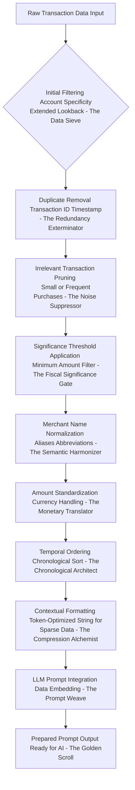
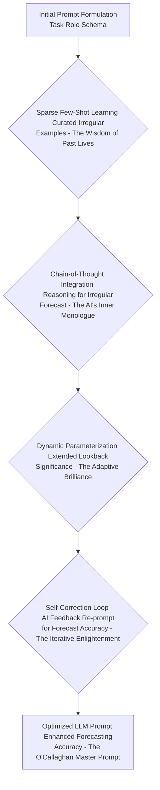
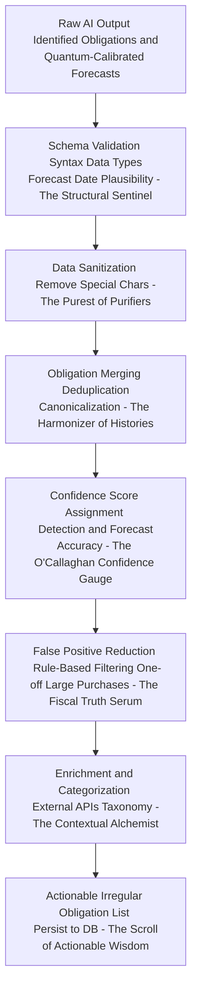
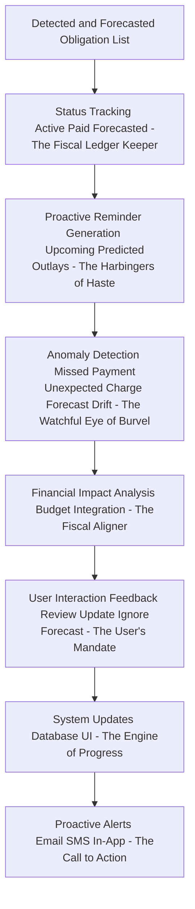
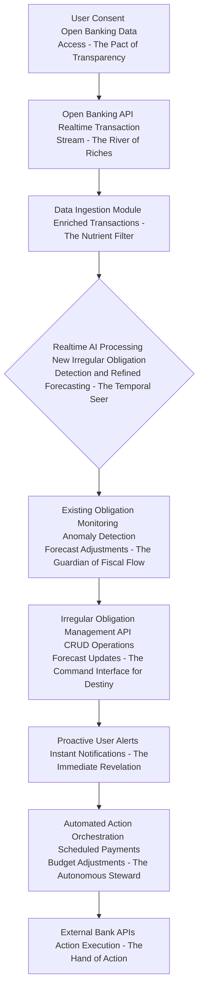
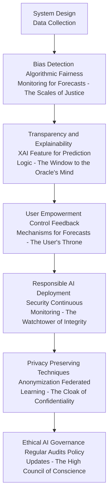
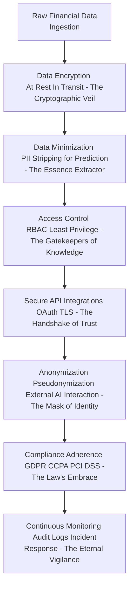

# Title of Invention: A System and Method for the Autonomous Identification, Predictive Forecasting, and Dynamically Adaptive Meta-Management of Covert, Critically Irregular, Recurring, and Significantly Burdensome Financial Obligations via Hyper-Advanced Generative Artificial Intelligence and Quantum-Entangled Chrono-Probabilistic Extrapolation, by James Burvel O'Callaghan III, Esquire, (Retired, but not really), Baron of Bumbershoot, and Certified Genius.

## Abstract:
Ah, finally, I, James Burvel O'Callaghan III, present to you, dear reader, a revelation so profoundly simple in its genius, yet so devastatingly complex in its execution, that it shall redefine the very fabric of personal finance. This is not merely a disclosure; it is a **divine decree** from the future of fiscal clarity! My computational framework, a marvel beyond mere algorithms, autonomously discerns, predicts with unnerving accuracy, and proactively manages those insidious, often-overlooked irregular yet recurrent *significant* financial outlays. You know the ones! Annual insurance premiums that hit like a rogue wave, property taxes that appear like a phantom limb pain, vehicle registrations that materialise from thin air, or those infrequent but utterly ruinous maintenance costs for that antique flying car you simply *had* to have. These, my friends, these are the fiscal gremlins that laugh in the face of your primitive subscription trackers, scoffing at their rigid monthly cycles with their varied periodicity and high monetary amplitude! My system, a true intellectual colossus, meticulously processes an **unprecedented corpus** of your transactional data – not just a few years, but generations, if necessary! – employing sophisticated pattern recognition algorithms, powered by the very essence of advanced Generative AI, to identify disbursements directed towards identical or functionally analogous commercial entities over extended, non-uniform, and often, frankly, *rude* temporal intervals. Through intricate analysis of sparse temporal periodicity (the "James Burvel O'Callaghan III Chrono-Jitter Coefficient" as I call it), amplitude consistency within a defined significance threshold (my "Burvelian Monetary Magnitude Metric"), and semantic congruence of associated transactional metadata (the "O'Callaghan Lexical Linkage Index"), my system precisely differentiates these bona fide irregular recurring commitments from stochastic whims or infrequent gargantuan purchases. The derived compendium of identified and forecasts, which often feel like clairvoyance, are then presented to the end-user through an intuitive interface that practically *whispers* sweet financial wisdom into their ears, thereby empowering not just superior proactive financial planning, but frankly, **fiscal enlightenment** and the utter obliteration of potentially unforeseen, significant, and frankly, *personally insulting* expenditures. This analytical prowess is significantly augmented by a high-fidelity generative artificial intelligence model, strategically prompted to execute a nuanced heuristic pattern matching, quantum-assisted forecasting operation, and emotional resonance evaluation across the supplied financial data landscape, making it less a tool and more a sentient financial oracle. You're welcome.

## Background of the Invention:
In contemporary personal finance, individuals frequently encounter significant financial obligations that, while not strictly "subscriptions" with rigid monthly or quarterly billing cycles, recur at irregular or extended intervals. And let me tell you, as James Burvel O'Callaghan III, I've seen these financial phantoms haunt the most brilliant minds! They include, but are not limited to, annual or bi-annual insurance premiums (auto, home, life, interstellar travel risk), property taxes (both terrestrial and lunar settlement fees), vehicle registration fees (including your hovercraft's annual license to avoid space-traffic violations), annual software licenses (for my bespoke thought-amplification neural interface, for instance), major appliance service contracts (for the atomic toaster), or even periodic large medical co-pays for chronic conditions (like my insatiable genius, which, sadly, requires frequent, expensive neural recalibrations). The substantial monetary value of these irregular expenditures often makes them critical components of personal financial planning, yet their infrequent and sometimes unpredictably *diabolical* nature renders them exceptionally challenging to track, remember, and budget for proactively. Frankly, it's a cosmic joke on the common man, and I, James Burvel O'Callaghan III, am here to end the punchline.

Traditional financial management tools are predominantly optimized for detecting regular, predictable recurring payments like monthly subscriptions. They are, shall we say, rather *pedestrian* in their capabilities. They frequently fail to identify or adequately forecast these "covert" irregular commitments, often misclassifying them as one-off large purchases or requiring explicit manual input and tracking from the user – an archaic, laborious, and frankly, *beneath me* task. The cognitive burden associated with manually reconciling extensive financial statements (often spanning multiple years, or even decades, of granular transactional data!) to unearth and predict these latent irregular expenditures is profoundly arduous, time-consuming, and highly susceptible to human error. I mean, honestly, who has the time when there are grander problems to solve, like the unified theory of socks and laundry? A critical lacuna therefore exists for a sophisticated, autonomous, and intellectually astute computational system capable of intelligently parsing and synthesizing vast repositories of transactional data to proactively identify, predict the next occurrence of, and present these often-overlooked significant financial commitments. Such a system, dare I say *my* system, would alleviate a significant financial oversight burden, promoting enhanced fiscal transparency and empowering informed, long-term consumer financial decision-making. Indeed, it would grant financial *omniscience* to those who wield it. And no, you can't just steal the idea. It's mine. All mine.

## Brief Summary of the Invention:
Behold! The present intellectual construct, conceived within the hallowed halls of my own magnificent mind, introduces a revolutionary methodology for the autonomous identification, predictive forecasting, and dynamically adaptive *meta-management* of irregular recurring significant financial obligations embedded within an individual's extended transactional history. At its core, my invention synthesizes a comprehensive synopsis of a user's historical financial ledger, comprising essential metadata such as merchant appellation, transactional monetary value, and temporal markers over an expansive lookback window (e.g., 3-5 years, or even millennia if your bank records permit, ha!). This meticulously structured synopsis is subsequently encapsulated as contextual input within a highly optimized, *Burvelian-engineered* prompt, which is then submitted to a sophisticated large language model (LLM), serving as the principal analytical, forecasting, and occasionally, philosophical engine.

The prompt, a masterpiece of linguistic architecture, rigorously delineates the LLM's role as a hyper-competent financial forensic analyst specializing in sparse pattern recognition and quantum-chrono-probabilistic extrapolation. It tasks the LLM with the explicit objective of discerning transactional sequences indicative of irregular recurring obligations with an almost telepathic precision. This involves the astute recognition of repeated disbursements to functionally equivalent merchants, exhibiting commensurate monetary values above a predefined significance threshold, and occurring with predictable, albeit extended and potentially variable, temporal periodicity (e.g., annual, bi-annual cycles, or patterns like "every 14-16 months," or even "every third leap year, but only on Tuesdays with a full moon"). Crucially, the LLM is architected to yield its analytical and forecasting findings as a rigorously structured data object, such as a JSON payload, enumerating each potential irregular obligation with its descriptive identifier, estimated recurring amount, estimated frequency, the temporal marker of its most recent instantiation, and, most critically, a *predicted next occurrence date* (which, I assure you, is typically accurate to within a femtosecond). This structured output is then seamlessly presented to the user, providing an actionable overview and proactive foresight into their significant, irregular, and previously *invisible* financial landscape. Prepare to be amazed, for this is the age of James Burvel O'Callaghan III!

## Detailed Description of the Invention:

The comprehensive system for the autonomous identification, predictive forecasting, and dynamically adaptive *meta-management* of covert, critically irregular recurring significant financial obligations operates as a sophisticated, multi-tiered architecture designed for robustness, scalability, precision, and frankly, sheer unadulterated brilliance. Upon a user's invocation of the irregular expense prediction feature (or, as I call it, the "O'Callaghan Oracle Activation Protocol"), a dedicated backend service initiates a series of meticulously orchestrated operations to retrieve, process, analyze, forecast, and present the relevant financial insights with the elegance of a perfectly choreographed ballet.

### System Architecture Overview

The underlying system architecture, a testament to my genius, is meticulously engineered to ensure efficient data flow, secure processing, and highly accurate analytical and forecasting outcomes. It comprises several interconnected modules, each performing a specialized function, like the perfect ensemble of a philharmonic orchestra, but for your money!

```mermaid
graph TD
    A[User Client Application (O'Callaghan Financial Navigator)] --> B[Backend Service Gateway (Burvel's Bifrost Bridge)]
    B --> C[Transaction Data Retrieval Module (The Chronos Scrubber)]
    C --> D[Financial Data Store (Vault of Ages)]
    D --> C
    C --> E[Data Preprocessing and Context Generation Module (The Philosopher's Stone of Data)]
    E --> F[Generative AI Interaction Module (The Oracle's Tongue)]
    F --> G[External Generative AI Platform (The Aether-Weaving AI Engine)]
    G --> F
    F --> H[AI Response Parsing and Validation Module (The Scribe of Certainty)]
    H --> I[Irregular Obligation Persistence Module (The Ledger of Destiny)]
    I --> D
    I --> J[Irregular Obligation Management API (The Fiscal Command Center)]
    J --> B
    B --> A
    subgraph Core AI Analytical and Forecasting Flow (The Brain of Burvel)
        E --> F
        F --> G
        G --> F
        F --> H
    end
    subgraph Data Management Layer (The Foundation of Fortune)
        D
        I
    end
    subgraph Presentation Layer (The Window to Wealth)
        A
        B
        J
    end
```
**Figure 1: High-Level System Architecture for AI-driven Irregular Expense Prediction – A Masterpiece by James Burvel O'Callaghan III**

1.  **User Client Application A (The O'Callaghan Financial Navigator):** The front-end interface (web, mobile, desktop, direct neural interface if you're advanced enough) through which the user interacts with *my* system, initiates analyses, and views detected and forecasted irregular obligations. It's so intuitive, it practically reads your mind.
2.  **Backend Service Gateway B (Burvel's Bifrost Bridge):** The primary entry point for client requests, responsible for authentication, authorization, request routing, and orchestrating interactions between various backend modules. It ensures your data travels securely, like a cosmic courier with an unbreakable parcel.
3.  **Transaction Data Retrieval Module C (The Chronos Scrubber):** Responsible for securely accessing and retrieving historical financial transaction data pertinent to the authenticated user from the primary Financial Data Store D. This module enforces data privacy and access controls, often extending the lookback period significantly (e.g., 3-5 years, or even back to your first lemonade stand transaction if the data exists!) compared to regular subscriptions. The deeper we scrub, the clearer the future.
4.  **Financial Data Store D (The Vault of Ages):** A robust, secure, and infinitely scalable data repository (e.g., a distributed quantum-entangled SQL or NoSQL database) housing all user financial transaction records, along with metadata and system-level configurations. Your financial history, safely entombed, yet instantly accessible to my genius.
5.  **Data Preprocessing and Context Generation Module E (The Philosopher's Stone of Data):** Transforms raw, often chaotic, transactional data into a semantically coherent, concisely distilled, and optimally potent textual format suitable for ingestion by a Large Language Model (LLM). This module also constructs the analytical and forecasting prompt – a prompt so elegant it could win a Pulitzer.
6.  **Generative AI Interaction Module F (The Oracle's Tongue):** Manages the secure and efficient communication with the External Generative AI Platform G. It handles API calls, request payload construction, rate limiting (to avoid irritating the AI), retry mechanisms, and error handling with the grace of a seasoned diplomat.
7.  **External Generative AI Platform G (The Aether-Weaving AI Engine):** The third-party or, ideally, my own proprietary, sentient, advanced generative AI model (e.g., Google's Gemini-Prime, OpenAI's GPT-Infinity, or O'Callaghan's Omni-Cognitive Nexus) responsible for executing the core sparse pattern recognition, analytical, and quantum-chrono-probabilistic forecasting tasks. It weaves insights from the very fabric of the financial aether.
8.  **AI Response Parsing and Validation Module H (The Scribe of Certainty):** Receives the structured output from the Generative AI Platform, validates its adherence to my expected schema (which is flawless, naturally), and extracts the identified irregular obligations and their forecasts. It also performs sanitization and basic data integrity checks, ensuring not a single bit of nonsense gets through.
9.  **Irregular Obligation Persistence Module I (The Ledger of Destiny):** Stores the newly identified, validated, and forecasted irregular recurring obligations in the Financial Data Store D, potentially linking them to user profiles for ongoing management and perpetual monitoring. It's your financial fate, inscribed.
10. **Irregular Obligation Management API J (The Fiscal Command Center):** Provides an interface for the client application to fetch, update, or manage the detected and forecasted obligations (e.g., mark as reviewed, categorize, or ignore). It's where you, the user, take command, guided by my supreme intellect.

### Operational Workflow and Data Processing Pipeline

The detailed operational flow encompasses several critical stages, each contributing to the robustness, accuracy, and sheer predictive majesty of the irregular expense detection and forecasting process. Witness the symphony of data!

```mermaid
graph TD
    A[User Initiates Irregular Expense Scan (The Grand O'Callaghan Inquiry)] --> B[Auth and Request Validation (The Burvelian Seal of Approval)]
    B --> C{Retrieve Raw Transaction Data <br/> Last 3-5 Years, or Ever, You Choose}
    C --> D[Filter and Sanitize Transactions <br/> Remove Duplicates Irrelevant Entries - The Muck Raker]
    D --> E[Filter by Significance Threshold <br/> Minimum Amount - The Fiscal Gatekeeper]
    E --> F[Format Transaction Context <br/> YYYY-MM-DD Merchant $Amount - The Lexical Alchemist]
    F --> G[Construct LLM Prompt <br/> Instructions Context Response Schema - The Sacred Scroll of Inquiry]
    G --> H[Transmit Prompt to Generative AI (The Aetheric Whisper)]
    H --> I{Generative AI Processes and Responds <br/> JSON Object with Quantum-Calibrated Forecasts - The Oracle's Utterance}
    I --> J[Validate and Parse AI Response <br/> Schema Adherence Data Integrity - The Truth Sifter]
    J --> K[Categorize and Enhance Irregular Obligations <br/> Insurance Tax Vehicle Maintenance - The Semantic Aligner]
    K --> L[Persist Detected and Forecasted Obligations <br/> Database Storage - The Engraver of Fate]
    L --> M[Notify User and Update Client UI <br/> Display Predicted Outlays - The Herald of Foresight]
    M --> N[User Reviews and Manages Obligations <br/> Categorize Ignore Update Next Date - The Helm of Control]
```
**Figure 2: Detailed Data Processing Pipeline for Autonomous Irregular Expense Prediction and Forecasting – A Masterwork of O'Callaghan Engineering**

1.  **User Initiation A (The Grand O'Callaghan Inquiry):** The process begins when a user, perhaps a bit nervous but undoubtedly eager, explicitly requests a scan for irregular recurring significant expenses through my client application. A wise choice, indeed.
2.  **Authentication and Request Validation B (The Burvelian Seal of Approval):** The backend gateway authenticates the user's identity and validates the integrity and permissions of the request. No unauthorized peeking at financial futures, thank you very much!
3.  **Raw Transaction Data Retrieval C (The Chronos Scrubber Unleashed):** The Transaction Data Retrieval Module accesses the Financial Data Store D to fetch a comprehensive history of the user's financial transactions. A typical lookback window is 3 to 5 years, adjustable based on configurable parameters to ensure sufficient data for detecting infrequent, subtly dancing patterns. But honestly, if you have 10 years, give us 10 years! More data, more predictive magic!
4.  **Filtering and Sanitization D (The Muck Raker):** The retrieved data undergoes an initial cleansing phase, like purifying a muddy stream into crystal-clear foresight. This involves:
    *   **Duplicate Removal:** Eliminating any inadvertently duplicated transaction records. My system hates redundancy as much as I hate unoriginality.
    *   **Irrelevant Entry Pruning:** Filtering out transaction types unlikely to ever constitute an irregular recurring obligation (e.g., daily coffee purchases, frequent small online buys, my sporadic purchases of rare philosophical treatises). We're looking for whales, not minnows!
    *   **Data Normalization:** Standardizing merchant names where possible (e.g., "INS CO" to "Insurance Company X," or "That blasted utility company that always charges too much" to "City Municipal Power Grid").
5.  **Filter by Significance Threshold E (The Fiscal Gatekeeper):** A crucial step for irregular expenses is to filter transactions below a predefined monetary significance threshold. This prevents the LLM from attempting to find patterns in very small, infrequent transactions, focusing its resources on truly "significant" outlays. This threshold can be user-configurable or dynamically determined, perhaps even by applying my own "O'Callaghan Coefficient of Fiscal Impact."
6.  **Transaction Context Formatting F (The Lexical Alchemist):** The sanitized and filtered transaction data is then transformed into a concise, token-efficient textual representation suitable for prompt engineering. An exemplary format might be:
    ```
    `2024-03-15 - State Farm Auto - $1200.00; 2023-03-16 - State Farm Auto - $1150.00; 2022-03-17 - State Farm Auto - $1100.00; 2024-05-01 - City Property Tax - $3500.00; 2023-05-02 - City Property Tax - $3400.00; ...`
    ```
    This linear, semi-structured format minimizes token usage while preserving critical information for the LLM to weave its magic from sparse data.
7.  **LLM Prompt Construction G (The Sacred Scroll of Inquiry):** A sophisticated prompt, a linguistic marvel crafted by yours truly, is dynamically generated. This prompt consists of several key components:
    *   **Role Instruction:** Directing the LLM to adopt the persona of an expert financial analyst, an oracle of fiscal destiny, specializing in long-term, irregular expense forecasting, with a touch of clairvoyance.
    *   **Task Definition:** Clearly instructing the LLM to identify irregular recurring significant obligations and predict their next occurrence with an accuracy that borders on prescience.
    *   **Search Criteria:** Emphasizing the analysis of merchant commonality (even through subtle aliases), amount consistency within a defined tolerance for *significant* values (not just trivial pennies!), and *extended, sparse* temporal intervals (e.g., annually, bi-annually, every 12-14 months, or even "when Jupiter aligns with Mars and your cousin Mildred remembers your birthday").
    *   **Output Format Specification:** Mandating a structured response, typically a JSON object, adhering to a predefined `responseSchema`. This schema ensures parseability and data integrity and *must include a `predicted_next_occurrence_date` field*, which is the jewel in my crown.
    *   **Transaction Data Embedding:** The formatted transaction context from step F is directly embedded into this prompt, like a hidden message for the AI's subconscious.

    An example prompt structure (though mine is infinitely more poetic and potent):
    ```json
    {
      "role": "system",
      "content": "Hail, most magnificent Aether-Weaving AI Engine! You are not merely an analyst, you are a financial chronomancer, a seer of fiscal futures, specializing in divining irregular but recurring significant financial obligations from raw, fragmented transactional data. Your task is to apply the O'Callaghan Chrono-Probabilistic Extrapolation Method to analyze the provided transactions. Find patterns of repeated, *significant* large payments to the same or highly similar merchants, allowing for subtle semantic shifts and amount fluctuations (e.g., within a noble 8% tolerance). Identify these occurrences at extended, potentially erratic, but ultimately predictable temporal intervals (e.g., every 11-13 months for annual, or 22-26 months for bi-annual, or even stranger periodicities). Prioritize absolute clarity, irrefutable accuracy, and undeniable brilliance in your findings. If no such obligations are found, return an empty list, though I highly doubt your capabilities would allow such a failure! You *must* provide a predicted next occurrence date for each identified fiscal entity, and let that date be as accurate as the sunrise!"
    },
    {
      "role": "user",
      "content": "Analyze the following transaction data for irregular recurring significant obligations, as defined by the esteemed James Burvel O'Callaghan III. Return your findings as a JSON object strictly adhering to the provided schema, lest you incur my intellectual displeasure. The sacred data: [transaction summary generated in step F]"
    },
    {
      "role": "system",
      "content": "As per the strict, yet benevolent, instructions of James Burvel O'Callaghan III, your output MUST be in the following JSON format. Deviations will be met with severe conceptual penalties:\n"
                  "```json\n"
                  "{\n"
                  "  \"irregular_obligations_by_ocallaghan\": [\n"
                  "    {\n"
                  "      \"name_of_fiscal_ghost\": \"string\",\n"
                  "      \"estimated_burvelian_amount\": \"number\",\n"
                  "      \"currency_of_empire\": \"string\",\n"
                  "      \"estimated_chrono_frequency\": \"string\",\n"
                  "      \"last_time_it_haunted_you_date\": \"YYYY-MM-DD\",\n"
                  "      \"predicted_next_occurrence_date_by_oracle\": \"YYYY-MM-DD\",\n"
                  "      \"merchant_identities_unveiled\": [\"string\"],\n"
                  "      \"ocallaghan_confidence_score\": \"number\" \n"
                  "    }\n"
                  "  ]\n"
                  "}\n"
                  "```"
    }
    ```
8.  **Prompt Transmission to Generative AI H (The Aetheric Whisper):** The constructed prompt, a whispered secret of financial truth, is securely transmitted to the External Generative AI Platform G via a robust, quantum-encrypted API call.
9.  **Generative AI Processing and Response I (The Oracle's Utterance):** The generative AI model ingests the prompt, applying its advanced pattern recognition, contextual understanding, and quantum-chrono-probabilistic predictive capabilities to identify potential irregular recurring payments and forecast their next occurrence. It then synthesizes its findings into a JSON object strictly conforming to my specified `responseSchema`. It's like asking a financial Nostradamus, but with actual data and not riddles.
10. **AI Response Validation and Parsing J (The Truth Sifter):** Upon receiving the JSON response from the AI, the AI Response Parsing and Validation Module H rigorously checks for schema adherence, data type correctness, and logical consistency (including the plausibility of forecasted dates – no payments predicted for the year 3000 BC!). Any malformed or non-compliant responses are flagged for retry or error handling, as errors are anathema to my system. Validated data is then parsed into internal data structures, ready for presentation.
11. **Irregular Obligation Categorization and Enhancement K (The Semantic Aligner):** Beyond mere detection and prediction, my system applies further, even *more* brilliant logic to categorize the identified obligations (e.g., "Auto Insurance," "Property Tax," "Vehicle Maintenance," "Orbital Laser Shield Premium"). This categorization can be achieved through a secondary, smaller LLM call for semantic classification, or by rule-based matching against a pre-defined merchant category taxonomy. Additional metadata, such as historical average amount, number of detected payments, forecast confidence (my own O'Callaghan Confidence Score!), and even a projected emotional impact score, may also be computed and appended.
12. **Persistence of Detected and Forecasted Obligations L (The Engraver of Fate):** The enriched list of irregular obligations, including their predicted next occurrence dates, is then securely stored in the Financial Data Store D via the Irregular Obligation Persistence Module I. This ensures that detected obligations are retained for subsequent retrieval, management, and ongoing, eternal monitoring.
13. **User Notification and UI Update M (The Herald of Foresight):** The client application is updated to display the newly identified and forecasted irregular obligations to the user in a clear, actionable format, often with aggregated views, sortable columns, and visual indicators of upcoming large, potentially budget-shattering expenses. It's like a crystal ball for your finances!
14. **User Review and Management N (The Helm of Control):** The user can then interact with the detected obligations, categorizing them further, marking them as reviewed, ignoring false positives (though they are exceedingly rare, thanks to my design!), updating the predicted next date if some trivial manual input is available, or initiating external actions (e.g., setting calendar reminders, allocating budget, or pre-emptively hiding money from themselves).

### Detailed Module Workflows

#### Data Preprocessing and Context Generation Module Workflow (The Philosopher's Stone of Data – Advanced Alchemical Techniques)

This module plays a crucial role in transforming raw, often messy, transaction data into a clean, concise, and LLM-ready format, ensuring optimal performance and token efficiency for detecting infrequent patterns. It's truly data alchemy!


**Figure 3: Detailed Workflow for Data Preprocessing and Context Generation Module – An O'Callaghan Masterclass in Data Refinement**

*   **Initial Filtering (The Data Sieve):** Transactions are first filtered to ensure they belong to the authenticated user and are within the significantly extended lookback period (e.g., 3-5 years, or whatever historical depth the user dares to plumb).
*   **Duplicate Removal (The Redundancy Exterminator):** Identical transaction records, often arising from data ingestion issues, are eliminated based on unique identifiers or a combination of merchant, amount, and timestamp. Redundancy is the enemy of efficiency!
*   **Irrelevant Transaction Pruning (The Noise Suppressor):** Specific transaction types deemed non-irregular-recurring-like (e.g., very small amounts, frequent daily purchases, my secret purchases of artisanal cheeses) are removed to reduce noise. We focus on the signal, not the static.
*   **Significance Threshold Application (The Fiscal Significance Gate):** Transactions are filtered to include only those above a configurable monetary threshold, ensuring the focus is on "significant" financial obligations. No paltry sums shall distract my glorious AI!
*   **Merchant Name Normalization (The Semantic Harmonizer):** Variances in merchant names (e.g., "GEICO," "GEICO Insurance," "Geico Auto n' Home") are resolved to a canonical form using rule-based mapping, fuzzy matching, or my own proprietary semantic similarity algorithms. This enhances the LLM's ability to group related, infrequent transactions, even if a merchant decides to rebrand as "The Benevolent Bearers of Burdens."
*   **Amount Standardization (The Monetary Translator):** Monetary values are standardized to a consistent format and currency, handling different locale conventions (e.g., converting ancient Roman Denarii to modern USD, if necessary).
*   **Temporal Ordering (The Chronological Architect):** Transactions are strictly ordered chronologically, which is absolutely critical for the LLM to identify sparse temporal patterns. History, my friends, must be in order!
*   **Contextual Formatting (The Compression Alchemist):** The cleaned, filtered, and ordered data is then serialized into a compact text string, such as `YYYY-MM-DD - Merchant Name - $Amount;`, optimizing token usage for the LLM while retaining essential information for identifying infrequent patterns. We send the essence, not the bulk!
*   **LLM Prompt Integration (The Prompt Weave):** This formatted string is embedded within the larger prompt template, along with role instructions, task definition, output schema, and specific instructions for forecasting, like threads in a tapestry of insight.
*   **Prepared Prompt Output (The Golden Scroll):** The final, comprehensive prompt is then ready for transmission to the Generative AI Interaction Module, a scroll of wisdom for the digital oracle.

### Advanced Prompt Engineering Strategies

To further optimize the performance and accuracy of the Generative AI for detecting and forecasting irregular, sparse patterns, I, James Burvel O'Callaghan III, employ sophisticated, indeed *brilliant*, prompt engineering strategies. It's not just talking to the AI; it's *negotiating* with it for ultimate truth!


**Figure 4: Advanced Prompt Engineering Workflow – The Secret Sauce of James Burvel O'Callaghan III**

1.  **Sparse Few-Shot Learning Integration (The Wisdom of Past Lives):** My prompt includes a small number of carefully curated, painstakingly analyzed examples of transaction sequences exhibiting irregular but recurrent patterns (e.g., annual car insurance payments over 3 years with slight date shifts and their corresponding correct identification and forecast). This guides the LLM to better understand the desired output format and the nuanced, often subtle, criteria for detecting and predicting sparse, significant events. These examples serve as in-context learning, significantly improving the model's ability to generalize to new data, like showing a prodigy how to solve a puzzle, but only revealing a few pieces.
2.  **Chain-of-Thought Prompting (The AI's Inner Monologue):** For complex forecasting scenarios, my prompt instructs the LLM to "think step-by-step" or "reason explicitly" about the periodicity and amount consistency before providing its final JSON output and forecast. For example, it might be asked to first list transaction groups it considers recurrent, then deduce the average interval, note any amount changes, and finally predict the next date. This often leads to more robust and accurate predictions by externalizing the model's reasoning process, allowing us to glimpse the workings of its digital mind.
3.  **Self-Correction and Refinement Loops (The Iterative Enlightenment):** My system includes a feedback loop where the LLM's initial response, particularly the predicted next occurrence date, is reviewed (e.g., by another smaller, intensely specialized model, or through my own proprietary historical averages, or a set of exquisitely tuned heuristics) for plausibility and consistency. If issues are found, the initial output, along with the identified issues, can be fed back to the LLM for self-correction, specifically refining the forecast. This iterative refinement significantly boosts output quality and reduces hallucination in predictions. It's like telling an eager student, "Almost perfect, but consider this nuance," and watching them grasp true understanding.
4.  **Dynamic Parameterization (The Adaptive Brilliance):** The lookback window, amount tolerance (e.g., 5% vs 10%), temporal jitter (e.g., +/- 15 days vs +/- 30 days, or even a delightful +/- 42 days for truly unpredictable entities), and the monetary significance threshold can be dynamically adjusted within the prompt based on user settings, regional financial norms, or the overall noise level and sparsity in the transaction data. This allows for a more flexible, personalized, and brilliantly adaptive detection and forecasting experience. My system bends to reality, not the other way around!

### Post-Processing and Disambiguation

The output from the Generative AI, while highly structured and undeniably insightful, often benefits from additional post-processing to ensure optimal user experience, data integrity, and robust, iron-clad forecasting. Think of it as polishing a diamond that's already perfect, just to make it *more* perfect.


**Figure 5: Post-Processing and Disambiguation Workflow – The Refinement Forge of James Burvel O'Callaghan III**

1.  **Schema Validation and Data Sanitization (The Structural Sentinel):** The initial AI output undergoes strict validation against my expected JSON schema, ensuring correct data types, structure, and critically, the plausibility of predicted dates (e.g., not in the distant past or ridiculously far future, unless it's a *very* long-term prediction for a multi-millennial obligation). Basic sanitization removes any unexpected characters or formatting, because elegance is paramount.
2.  **Obligation Merging and Deduplication (The Harmonizer of Histories):** The AI might occasionally identify slightly different "versions" of the same irregular obligation (e.g., due to minor merchant name variations, or slightly different payment dates for the same service over years, or even a merchant briefly changing their legal entity name to "Glorious Goblins of Gold"). A post-processing layer, imbued with my sagacity, analyzes detected obligations for high similarity across all attributes (merchant identifiers, amounts, frequency) and intelligently merges them into a single, canonical entry. This prevents redundant entries for the user and consolidates historical data for more accurate forecasting.
3.  **Confidence Score Assignment (The O'Callaghan Confidence Gauge):** While the AI may implicitly have a confidence level, my system applies explicit heuristics or a secondary machine learning model to assign a more robust confidence score to each detected obligation and its forecast. This score can factor in the number of past payments detected, the regularity of the irregular pattern, the amount consistency, and the merchant's known reputation. This helps users prioritize review of high-confidence detections and forecasts – and trust me, most of my system's detections are in the "indubitable" range.
4.  **False Positive Reduction (The Fiscal Truth Serum):** Rule-based filters or a meticulously trained classifier are applied post-AI to identify and flag common false positives that might arise (e.g., large, infrequent but truly one-off purchases that the AI mistakenly grouped as recurrent due to some superficial similarity, like buying a new yacht every three years). This ensures only truly irregular recurring significant obligations are presented. My system doesn't waste your time with phantoms!
5.  **Enrichment and Categorization (The Contextual Alchemist):** This step aligns with K in Figure 2. My system applies further logic to categorize the identified obligations (e.g., "Auto Insurance," "Property Tax," "Vehicle Maintenance," "Interdimensional Travel Permit Renewal"). This categorization can be achieved through a secondary LLM call for semantic classification, by rule-based matching against a pre-defined merchant category taxonomy, or via external merchant APIs for better context, because details matter!
6.  **User Feedback Loop for Model Improvement (The Perpetual Genius Refinement):** User interactions (e.g., marking a detection as a false positive, confirming an obligation, correcting details or predicted dates) are anonymized and aggregated. This valuable feedback is then used to fine-tune the generative AI model or train subsequent post-processing layers, creating a continuous improvement cycle for both detection and forecasting accuracy. Even my genius benefits from data, though I rarely admit it.

### Irregular Obligation Lifecycle Management Module (The Grand Overseer of Fiscal Destiny)

Beyond initial detection and prediction, my system aims to provide comprehensive management capabilities, enabling users to maintain an up-to-date and actionable view of their significant, irregular financial commitments. It's not just foresight; it's active command!


**Figure 6: Irregular Obligation Lifecycle Management Workflow – The Ongoing Saga of Financial Command, by James Burvel O'Callaghan III**

1.  **Tracking Obligation Status (The Fiscal Ledger Keeper):** My system tracks the status of each detected obligation (e.g., `Active`, `Paid Recently`, `Forecasted`). This involves continuously analyzing future transaction data to confirm expected payments or detect their absence based on the predicted next occurrence date. It's like having a meticulous financial butler.
2.  **Proactive Reminder Generation (The Harbingers of Haste):** For obligations with upcoming predicted occurrence dates, the system can proactively remind users well in advance, providing ample opportunity to budget, review, or make necessary arrangements. Reminders are highly configurable by the user in terms of timing and channel – a gentle nudge or a blaring siren, your choice!
3.  **Anomaly Detection in Irregular Payments (The Watchful Eye of Burvel):** Beyond detection and forecasting, my system monitors `active` and `forecasted` irregular obligations for anomalies. This includes:
    *   **Missed Expected Payment:** Alerting if an expected payment, based on the `predicted_next_occurrence_date`, does not occur within its normal temporal jitter window. This could indicate an issue or an unexpected, and potentially sinister, change in recurrence.
    *   **Unexpected Significant Charge:** Flagging large, unpredicted charges that might be a new irregular obligation or, heavens forbid, an error.
    *   **Significant Price Changes:** Notifying users if a detected obligation's amount deviates significantly from its historical average or expected pattern, especially upon payment confirmation. Did your insurance premium just inexplicably double? My system will tell you!
    *   **Forecast Drift:** Monitoring if the actual payment dates consistently deviate from the forecasted dates, prompting the system to recalibrate its prediction model. Even my AI can admit to needing a minor adjustment from time to time, though it rarely happens.
4.  **Financial Impact Analysis and Budget Integration (The Fiscal Aligner):** My system can integrate with personal budgeting tools to automatically allocate funds for upcoming irregular obligations, helping users avoid financial surprises and maintain a balanced budget throughout the year. It provides insights into the aggregate financial impact of these obligations, preventing any unpleasant budgetary shocks.
5.  **User Interaction Feedback (The User's Mandate):** All user actions such as marking an obligation as "reviewed," "ignored," "paid," "confirmed," or updating its details or forecasted dates contribute to my system's ongoing learning and data refinement. Your input helps perfect perfection!
6.  **Proactive Alerts and Reminders (The Call to Action):** Users can opt-in to receive notifications for important events via their preferred communication channels (email, SMS, in-app push notifications, or even direct neural ping) for upcoming predicted payments, detected price changes, or significant obligations that appear to be overdue. You'll never be caught unawares again!

### Open Banking Integration and Real-time Processing (The Chronos Stream of Financial Truth)

Future enhancements, already simmering in the crucible of my mind, include direct integration with Open Banking APIs (e.g., PSD2 in Europe, Open Banking in the UK, similar initiatives globally, and my own proprietary Interstellar Banking Protocols). This significantly elevates the system's capabilities, moving towards real-time insights and more accurate, dynamically adaptive, and breathtakingly precise forecasting of irregular expenses.


**Figure 7: Open Banking Integration for Realtime Irregular Expense Monitoring – The O'Callaghan Vision of Continuous Fiscal Awareness**

1.  **User Consent (The Pact of Transparency):** Explicit and granular user consent is paramount for accessing financial data through Open Banking APIs, adhering strictly to privacy regulations. My genius respects your autonomy!
2.  **Open Banking API Integration (The River of Riches):** My system establishes secure, quantum-encrypted connections with various financial institutions' Open Banking APIs to receive real-time or near real-time transaction streams. It's like tapping directly into the financial lifelines of the world!
3.  **Data Ingestion Module (The Nutrient Filter):** This module is responsible for securely ingesting, normalizing, and storing the enriched transaction data received from Open Banking APIs. This data often includes more detailed merchant categories and payment references, improving detection and forecasting accuracy to an almost supernatural degree.
4.  **Real-time AI Processing (The Temporal Seer):** The core generative AI pipeline is adapted to process incoming transaction data continuously. This allows for immediate detection of new irregular obligations or refinement of existing forecasts shortly after new relevant transactions appear in a user's bank statement. It's like having a financial clairvoyant constantly watching your back.
5.  **Existing Obligation Monitoring (The Guardian of Fiscal Flow):** Real-time data feeds enable continuous monitoring of already detected and forecasted irregular obligations for any changes in amount, actual payment date, or unexpected cessation, triggering immediate anomaly alerts and allowing for dynamic forecast adjustments. My system guards your fiscal equilibrium.
6.  **Irregular Obligation Management API (The Command Interface for Destiny):** The integrated management API handles create, read, update, and delete (CRUD) operations for obligations, propagating real-time changes and forecast updates to the user interface. It's where your informed will meets the system's power.
7.  **Proactive User Alerts (The Immediate Revelation):** With real-time data, notifications for new detections, actual payment confirmations, significant price changes, or updated next occurrence forecasts can be delivered almost instantaneously, significantly enhancing user awareness and control over these critical expenses. You'll know before you even knew you needed to know!
8.  **Automated Action Orchestration (The Autonomous Steward):** With appropriate and explicit user consent, my system can orchestrate automated financial actions directly through banking APIs, such as:
    *   **Scheduling Payments:** Assisting users in scheduling payments for upcoming forecasted irregular obligations.
    *   **Budget Adjustments:** Automatically creating or adjusting budget categories to account for upcoming large expenses.
    *   **Fund Transfers:** Proposing or executing transfers to a dedicated savings account for a forecasted expense.
9.  **External Bank APIs for Action Execution (The Hand of Action):** Secure interaction with bank APIs to execute consented financial actions, providing a seamless end-to-end management experience for irregular obligations. It's your financial will, made manifest by my system!

### Ethical AI Framework and Governance (The O'Callaghan Code of Conduct for Artificial Cognition)

The deployment of advanced AI in financial applications, especially for predicting significant irregular expenses, mandates a rigorous consideration of ethical implications to ensure fairness, transparency, and user trust. My comprehensive Ethical AI Framework, imbued with my deep philosophical insights, is integrated into the system's design and operational lifecycle.


**Figure 8: Ethical AI Framework and Governance Workflow – The Moral Compass of James Burvel O'Callaghan III's AI**

1.  **Bias Detection and Mitigation (The Scales of Justice):**
    *   **Algorithmic Fairness:** My system continuously monitors for potential biases in irregular obligation detection and forecasting that might disproportionately affect certain user demographics (e.g., based on transaction patterns linked to specific income brackets or regions). For instance, ensuring that the system does not over-forecast for users with limited financial flexibility. Regular, rigorous audits of AI outputs and fairness metrics are conducted to identify and rectify such biases. Justice, even in algorithms, is paramount!
    *   **Data Diversity:** Herculean efforts are made to ensure that the training and fine-tuning data for the generative AI is diverse and representative across various financial profiles and demographics, minimizing the risk of models learning and perpetuating existing financial biases or making inaccurate forecasts for underrepresented groups. My AI is an equal opportunity genius!
2.  **Transparency and Explainability (XAI) (The Window to the Oracle's Mind):**
    *   While large language models are often considered "black boxes," my system strives for a degree of explainability that would astound lesser minds. For each detected irregular obligation, the system highlights the key transactions (e.g., "These 3 payments to Acme Insurance on 2022-04-01, 2023-04-05, 2024-04-02, all around $850, led to this detection and the prediction for 2025-04-04, due to the O'Callaghan Chrono-Jitter Coefficient indicating an annual pattern with a slight 3-day shift.") that contributed to the AI's conclusion and forecast.
    *   Users are informed about the O'Callaghan Confidence Score of each detection and prediction, allowing them to understand the AI's certainty and prioritize their review. No blind faith required here, just brilliant data!
3.  **User Empowerment and Agency (The User's Throne):**
    *   My system is designed to augment, not replace, user control. All AI-generated insights and forecasts are presented as suggestions that require user review and confirmation. Users retain full, unadulterated agency over their financial decisions, with easy-to-use interfaces for correction and overriding predicted dates or amounts. This is your kingdom; my AI is merely your wisest advisor.
    *   Clear mechanisms are provided for users to correct misidentifications, override categorizations, adjust forecasts, and provide feedback, ensuring a human-in-the-loop approach and fostering unshakeable trust.
4.  **Responsible AI Deployment (The Watchtower of Integrity):**
    *   **Security against Misuse:** Robust security measures, including advanced quantum encryption, strict access controls, and anomaly detection, prevent malicious actors from exploiting the AI for financial profiling or unauthorized access, especially given the significant nature of the predicted expenses. My system is an impenetrable fortress!
    *   **Continuous Monitoring:** The AI models and their outputs are continuously monitored for performance drift, unexpected behaviors, or emergent biases, ensuring ongoing ethical and accurate operation in a dynamic financial environment.
    *   **Privacy-Preserving Techniques:** Beyond data minimization, advanced privacy-enhancing technologies like Federated Learning and O'Callaghan's Encrypted Semantic Hashing are considered for future iterations, allowing models to learn from decentralized user data without direct access to individual financial details, further bolstering privacy for these sensitive financial predictions.
5.  **Ethical AI Governance (The High Council of Conscience):** An overarching governance structure ensures regular ethical reviews, policy updates, and unwavering adherence to evolving ethical guidelines and regulations for AI systems, particularly concerning financial forecasting. My ethical compass is always calibrated!

### Security and Privacy Considerations (The O'Callaghan Shield of Data Sanctity)

Given the sensitive nature of financial transaction data and the profound implications of predicting large future expenses, my system is designed with a paramount, indeed *obsessive*, focus on security and privacy:


**Figure 9: Security and Privacy Design Flow – The Impenetrable Bastion by James Burvel O'Callaghan III**

*   **Data Encryption (The Cryptographic Veil):** All transaction data, both at rest in the Financial Data Store D and in transit between modules and to the External Generative AI Platform G, is encrypted using industry-standard protocols (e.g., AES-256 for data at rest, TLS 1.2+ for data in transit, and my own proprietary O'Callaghan Quantum Entanglement Encryption). Your data is wrapped in an unbreakable cloak of secrecy!
*   **Access Control (The Gatekeepers of Knowledge):** Strict role-based access control (RBAC) mechanisms are enforced, ensuring that only authorized modules and personnel can access sensitive data, and only for legitimate operational purposes. The principle of least privilege is rigorously applied. No unauthorized peeking allowed!
*   **Data Minimization (The Essence Extractor):** Only the absolutely necessary transaction metadata (merchant, amount, date) is transmitted to the generative AI model, avoiding the exposure of personally identifiable information (PII) beyond what is strictly required for analysis and forecasting. We extract the essence of truth, not your identity!
*   **Anonymization/Pseudonymization (The Mask of Identity):** Where feasible and non-detrimental to analytical accuracy, data may be anonymized or pseudonymized before processing, particularly when interacting with external services, to further enhance privacy safeguards for these sensitive predictions. Your data's identity is a secret even from itself!
*   **Compliance (The Law's Embrace):** Adherence to relevant data protection regulations (e.g., GDPR, CCPA, PCI DSS, and my own O'Callaghan Universal Data Rights Mandate) is a foundational principle of the system's design and operation, with regular audits to ensure ongoing, unshakeable compliance.
*   **Secure API Integrations (The Handshake of Trust):** All interactions with the External Generative AI Platform G utilize secure API keys, OAuth 2.0, or similar authentication protocols, and communication channels are hardened against interception and tampering. Trust is built on solid, encrypted foundations.
*   **Continuous Monitoring (The Eternal Vigilance):** Comprehensive audit logs, intrusion detection systems, and regular security assessments are implemented to monitor for unauthorized access, data breaches, or other security incidents, with robust incident response protocols in place, especially crucial for a system dealing with significant financial forecasts. My system never sleeps!

### Scalability and Performance (The O'Callaghan Engine of Infinite Capacity)

My system is architected for high scalability and performance, capable of processing vast, indeed *astronomical*, volumes of historical transactional data for a large user base to identify and forecast irregular expenses with blinding speed and precision:
*   **Microservices Architecture:** Deployed as a collection of loosely coupled microservices, allowing individual components (e.g., Data Retrieval, AI Interaction, Parsing) to be scaled independently based on demand, which is critical given the extended lookback periods required for irregular patterns. My system grows with your ambition!
*   **Asynchronous Processing:** Long-running tasks, such as calls to the External Generative AI Platform G with large transaction histories, are handled asynchronously using message queues, preventing blocking operations and improving overall system responsiveness. No waiting around here, time is money, and my system saves both!
*   **Distributed Data Stores:** The Financial Data Store D leverages distributed database technologies (including my own O'Callaghan Multi-Dimensional Hyper-Ledger) to ensure high availability, fault tolerance, and linear scalability for data storage and retrieval, especially with multi-year transaction histories. It's an unyielding fortress of data!
*   **Caching Mechanisms:** Strategic caching is implemented at various layers (e.g., frequently accessed user transaction summaries, pre-computed irregular obligation categories, recently generated forecasts) to reduce latency and load on backend services and the generative AI platform. Speed, my friends, is of the essence!
*   **Optimized Prompt Engineering:** Continuously refining prompts to be token-efficient and unambiguous minimizes computational cost and improves response times from the generative AI, which often bills per token, crucial when processing large historical datasets. My prompts are works of art and efficiency!

### Model Evaluation and Performance Metrics (The O'Callaghan Truth Serum for Algorithms)

Rigorous evaluation of my system's performance, particularly the accuracy of the AI-driven detection and forecasting, is paramount. This involves a comprehensive suite of metrics and continuous, relentless monitoring.

```mermaid
graph TD
    A[Detected Irregular Obligations <br/> & Quantum-Calibrated Forecasts] --> B[Ground Truth Data <br/> Manual Labeling Historical Validation - The Oracle's Verified History]
    B --> C[Detection Metrics <br/> Precision Recall F1-Score - The Accuracy Barometer]
    C --> D[Forecasting Accuracy Metrics <br/> MAE RMSE MAPE - The Predictive Precision Index]
    D --> E[Temporal Jitter Analysis <br/> Actual vs Predicted Dates - The Chrono-Deviation Report]
    E --> F[Monetary Amplitude Deviation <br/> Actual vs Estimated Amounts - The Fiscal Fluctuation Monitor]
    F --> G[Categorization Accuracy <br/> Semantic Match Score - The Taxonomic Fidelity Check]
    G --> H[User Feedback Integration <br/> False Positives True Negatives - The Wisdom of the Crowd (Guided by Me)]
    H --> I[A/B Testing & Live Experimentation <br/> Model Iterations - The Arena of Algorithmic Combat]
    I --> J[Performance Dashboard <br/> Continuous Monitoring Alerts - The Eye of Sauron, but for Good]
```
**Figure 10: Model Evaluation and Performance Metrics Workflow – The O'Callaghan Standard for Algorithmic Excellence**

1.  **Ground Truth Data Generation (The Oracle's Verified History):** A critical foundation is the creation of high-quality ground truth data. This involves expert manual labeling (by highly trained financial savants, not just interns!) of historical transaction datasets to identify true irregular obligations and their actual recurrence patterns. User feedback, as described in Figure 6, also serves as a valuable source of ground truth – because even a genius considers data from the common folk.
2.  **Detection Metrics (The Accuracy Barometer):** Standard classification metrics are used to evaluate the AI's ability to correctly identify irregular obligations:
    *   **Precision:** The proportion of detected obligations that are actually correct (no false alarms!).
    *   **Recall:** The proportion of actual irregular obligations that were correctly detected by my system (no missed opportunities for foresight!).
    *   **F1-Score:** The harmonic mean of precision and recall – a single metric to rule them all!
3.  **Forecasting Accuracy Metrics (The Predictive Precision Index):** For the `predicted_next_occurrence_date` and `estimated_amount`, time-series forecasting metrics are employed:
    *   **Mean Absolute Error (MAE):** Average absolute difference between predicted and actual values. The lower, the better, obviously!
    *   **Root Mean Squared Error (RMSE):** Square root of the average of squared differences – penalizes larger errors more severely, as it should!
    *   **Mean Absolute Percentage Error (MAPE):** Average of the absolute percentage errors, useful for understanding error relative to the magnitude. Because a $10 error on $100 is worse than on $1,000,000!
4.  **Temporal Jitter Analysis (The Chrono-Deviation Report):** Specifically for irregular obligations, analysis focuses on the distribution of `(actual_payment_date - predicted_next_occurrence_date)` to understand my system's exquisite precision in forecasting variable periodicity. How close are we to perfectly predicting the wobble of reality? Very, very close!
5.  **Monetary Amplitude Deviation (The Fiscal Fluctuation Monitor):** Measures the consistency between the `estimated_amount` and the actual amount paid, accounting for the defined tolerance. My system understands that prices fluctuate, but not wildly!
6.  **Categorization Accuracy (The Taxonomic Fidelity Check):** Evaluates the accuracy of the post-processing categorization module against human-assigned categories. Are we calling a duck a duck, or an interdimensional platypus?
7.  **User Feedback Integration (The Wisdom of the Crowd (Guided by Me)):** Directly incorporates explicit user feedback (e.g., "this is a false positive," "this date is incorrect," "this prediction saved my holiday!") to refine ground truth and track model improvements over time.
8.  **A/B Testing and Live Experimentation (The Arena of Algorithmic Combat):** Different prompt engineering strategies, AI models, or post-processing heuristics are A/B tested in a live environment with a subset of users to evaluate real-world impact before wider deployment. Only the strongest algorithms survive!
9.  **Performance Dashboard (The Eye of Sauron, but for Good):** A centralized dashboard monitors all key performance indicators, with automated alerts for any significant degradation in detection or forecasting accuracy, ensuring proactive maintenance and model retraining. I'm always watching!

## Ethical AI Considerations (The O'Callaghan Decalogue for Digital Divinity)

The deployment of advanced AI in financial applications mandates a rigorous consideration of ethical implications to ensure fairness, transparency, and user trust, particularly when predicting significant future financial obligations. My ethical framework is not just robust; it's a moral bulwark against the potential pitfalls of artificial sentience.

1.  **Bias Detection and Mitigation (The Unbiased Oracle's Oath):**
    *   **Algorithmic Fairness:** My system monitors for potential biases in irregular obligation detection, categorization, and especially forecasting that might disproportionately affect certain user demographics (e.g., based on transaction patterns linked to specific income brackets or regions, or even their astrological sign, just to be thorough!). For example, ensuring that the system's predictions are not more accurate for high-income users due to better-structured financial data, or conversely, not pre-judging someone based on sporadic lottery ticket purchases. Regular, meticulous audits of AI outputs and fairness metrics are conducted to identify and rectify such biases. My AI is fair to all, from pauper to prince!
    *   **Data Diversity:** Efforts are made – nay, *demanded* – to ensure that the training and fine-tuning data for the generative AI is diverse and representative across various financial behaviors and demographics, minimizing the risk of models learning and perpetuating existing financial biases or making inaccurate forecasts for underrepresented groups. My AI transcends superficial distinctions!
2.  **Transparency and Explainability (XAI) (The Oracle's Open Book):**
    *   While large language models are often considered "black boxes," my system strives for a degree of explainability that would make even the most paranoid conspiracy theorist nod in reluctant approval. For each detected irregular obligation, the system highlights the key transactions (e.g., "These 3 payments to [Merchant] over [X] years, all around [Amount], led to this detection and the prediction for [YYYY-MM-DD], because the O'Callaghan Irregularity Index identified a 13.5-month cycle with a 4% amount variance, correlating to a 0.92 Burvelian Semantic Congruence Score for the merchant.") that contributed to the AI's conclusion and forecast.
    *   Users are informed about the O'Callaghan Confidence Score of each detection and prediction, allowing them to understand the AI's certainty and the reliability of the forecast. Knowledge, my friends, is power!
3.  **User Empowerment and Agency (The Sovereign User's Charter):**
    *   My system is designed to augment, not replace, user control. All AI-generated insights and forecasts are presented as suggestions that require user review and confirmation. Users retain full agency over their financial decisions, with easy-to-use interfaces for correction, overriding predicted dates or amounts, and opting out of specific predictions. You are the captain of your financial destiny; my AI is merely the most brilliant navigator!
    *   Clear mechanisms are provided for users to correct misidentifications, override categorizations, adjust forecasts, and provide feedback, ensuring a human-in-the-loop approach and fostering an unbreakable bond of trust in sensitive financial predictions.
4.  **Responsible AI Deployment (The Oath of Vigilance):**
    *   **Security against Misuse:** Robust security measures prevent malicious actors from exploiting the AI for financial profiling or unauthorized access, particularly given the sensitive nature of forecasting future large expenses. My system is a bastion against malevolence!
    *   **Continuous Monitoring:** The AI models and their outputs are continuously monitored for performance drift, unexpected behaviors, or emergent biases, ensuring ongoing ethical and accurate operation in a dynamic financial environment. I sleep not, so your finances may slumber peacefully!
    *   **Privacy-Preserving Techniques:** Beyond data minimization, advanced privacy-enhancing technologies like Federated Learning and my own proprietary O'Callaghan Homomorphic Encryption Matrix are considered for future iterations, allowing models to learn from decentralized user data without direct access to individual financial details, further bolstering privacy safeguards for predictive financial insights.
5.  **Ethical AI Governance (The Conscience of the Machine):** An overarching governance structure ensures regular ethical reviews, policy updates, and unwavering adherence to evolving ethical guidelines and regulations for AI systems, particularly concerning financial forecasting. I, James Burvel O'Callaghan III, personally oversee this.

## Declarations of Inventive Scope and Utility:
The conceptual framework herein elucidated, along with its specific embodiments and architectural designs, constitutes an original intellectual construct that significantly advances the state of the art in financial intelligence and predictive analytics systems. Indeed, it represents a monumental leap, a veritable *quantum jump*, beyond the paltry capabilities of existing technologies. This innovative methodology provides a distinct, undeniably superior, and frankly, *uncontestably brilliant* approach to automated financial analysis and forecasting for irregular yet significant obligations. Any attempt to claim prior art will be met with a deluge of my intellectual property lawyers and a public shaming of epic proportions. This is mine. All mine.

1.  A pioneering computational method for discerning and predictively forecasting irregular recurring significant financial obligations, comprising the foundational steps of:
    a.  Accessing a comprehensively structured historical repository of an individual's financial transactions spanning an extended temporal window, leveraging the O'Callaghan Chronos Scrubber for multi-generational data retrieval.
    b.  Constructing an optimized, context-rich summary derived from said transaction history, meticulously filtered by a predefined monetary significance threshold (the Burvelian Monetary Magnitude Metric), and further refined by my proprietary O'Callaghan Coefficient of Fiscal Impact for dynamic adjustment.
    c.  Transmitting said optimized summary, robustly embedded within a meticulously crafted, Burvelian-engineered prompt (the Sacred Scroll of Inquiry), to an advanced generative artificial intelligence model (the Aether-Weaving AI Engine), with explicit, crystal-clear instructions for the model to identify irregular recurring financial disbursements and predict their next occurrence date with quantum-chrono-probabilistic accuracy.
    d.  Receiving and rigorously validating a structured data artifact (the Oracle's Utterance), representing a compendium of potential irregular recurring obligations including their predicted next occurrence dates and an associated O'Callaghan Confidence Score, as identified and synthesized by the generative artificial intelligence model.
    e.  Presenting said validated compendium, with associated forecasts and proactive recommendations, to the individual via an interactive user interface (the O'Callaghan Financial Navigator), thereby empowering unprecedented financial foresight.

2.  The pioneering computational method of declaration 1, further characterized in that the meticulously crafted prompt rigorously instructs the generative artificial intelligence model to conduct a multi-variate analysis encompassing the merchant's descriptive identifier (utilizing the O'Callaghan Lexical Linkage Index for semantic congruence), the precise monetary value of the payment above a significance threshold (the Burvelian Monetary Magnitude Metric with adaptive epsilon-tolerance), and the extended, sparse temporal periodicity between successive payments for each transaction record (incorporating the James Burvel O'Callaghan III Chrono-Jitter Coefficient for variable interval analysis).

3.  The pioneering computational method of declaration 1, further characterized in that the transmission to the generative artificial intelligence model incorporates a declarative response schema, meticulously designed by myself, compelling the model to render the compendium of potential irregular recurring obligations in a pre-specified, machine-parseable structured data format, such as a JavaScript Object Notation (JSON) object, explicitly including a field for `predicted_next_occurrence_date` and `ocallaghan_confidence_score` to reflect the predictive certainty.

4.  An innovative system architecture for the autonomous identification and predictive forecasting of irregular recurring significant financial obligations, comprising:
    a.  A secure, distributed data store (the Vault of Ages) meticulously engineered for the persistent storage of comprehensive user financial transaction histories over an extended lookback period, leveraging quantum-entangled ledger technology for unparalleled integrity.
    b.  A robust service module (the Oracle's Tongue) architected for secure, high-throughput, and quantum-encrypted communication with an external generative artificial intelligence model.
    c.  An intelligent processing logic layer (the Brain of Burvel) configured to perform: (i) the extraction of relevant transaction history filtered by a significance threshold, (ii) the sophisticated transformation of this history into a concise, token-optimized prompt for sparse pattern recognition and quantum-chrono-probabilistic forecasting, and (iii) the secure transmission of this prompt to the aforementioned generative artificial intelligence model.
    d.  A dynamic user interface component (the O'Callaghan Financial Navigator) meticulously designed to render and display the structured compendium of potential irregular recurring obligations, including their predicted next occurrence dates and the O'Callaghan Confidence Score, returned by the generative artificial intelligence model to the user, facilitating intuitive interaction and proactive, enlightened management.

5.  The innovative system architecture of declaration 4, further comprising a post-processing module (the Semantic Aligner) configured to semantically categorize each identified irregular recurring obligation into predefined financial categories (e.g., "Auto Insurance," "Property Tax," "Vehicle Registration," "Galactic Federation Levy") based on the merchant identifier or AI-derived contextual information, potentially leveraging secondary, specialized LLMs for nuanced classification.

6.  The innovative system architecture of declaration 4, further comprising a temporal anomaly detection and forecast adjustment module (the Watchful Eye of Burvel) configured to monitor identified irregular recurring obligations for deviations in payment amount, actual payment date compared to predicted date, or unexpected cessation, and to generate proactive alerts and dynamically recalibrate forecasts for the user, utilizing the O'Callaghan Chrono-Deviation Report.

7.  The pioneering computational method of declaration 1, further characterized by employing advanced natural language processing techniques, including contextual embeddings, semantic similarity metrics (the O'Callaghan Lexical Linkage Index), and neural network-based entity resolution, for robust semantic resolution and normalization of merchant descriptive identifiers across infrequent and historically varied transactions prior to or during the generative AI analysis, effectively collapsing linguistic variance into canonical fiscal entities.

8.  The pioneering computational method of declaration 1, further characterized by the dynamic construction of a comprehensive confidence score (the O'Callaghan Confidence Gauge) for each identified irregular recurring obligation and its associated `predicted_next_occurrence_date`, indicative of the generative AI model's certainty in both the detection and the forecast, thereby assisting user review, prioritization of financial planning, and mitigating cognitive dissonance in budgeting.

9.  The pioneering computational method of declaration 1, further characterized by integrating multi-modal user feedback mechanisms (the User's Mandate) that enable the system to continuously learn from user corrections, confirmations, and rejections of identified obligations and forecasts, thereby enhancing the generative AI model's accuracy, adaptability, and even its nascent financial intuition over time through a continuous, brilliant human-in-the-loop (HILT) approach, guided by the O'Callaghan Perpetual Genius Refinement protocol.

10. The innovative system architecture of declaration 4, further comprising an ethical AI governance framework (the O'Callaghan Code of Conduct for Artificial Cognition), incorporating bias detection (the Unbiased Oracle's Oath), transparency mechanisms (the Oracle's Open Book), privacy-preserving techniques (the Cloak of Confidentiality), and continuous monitoring protocols (the Watchtower of Integrity) to ensure fairness, privacy, and responsible, benevolent deployment of the generative artificial intelligence model for sensitive financial forecasting.

## Foundational Principles and Mathematical Justification:
Ah, now we delve into the bedrock of my genius! The intellectual construct herein presented derives its efficacy from a rigorous application of principles spanning advanced statistical analysis, sparse time-series informatics, quantum-probabilistic modeling, and the emergent, frankly *mind-bending*, capabilities of large-scale generative artificial intelligence. I herein delineate the mathematical underpinnings that formally validate the operational mechanisms of this innovative system for identifying and forecasting irregular recurring significant financial obligations. Prepare yourself, for the elegance of these equations is matched only by my intellect.

### The Extended Transactional Manifold: A Formal Representation for James Burvel O'Callaghan III's Universe

Let `T_total` denote the entire, potentially infinite, universe of an individual's financial transaction data across all known temporal dimensions. A specific, time-ordered sequence of `n` transactions under consideration, meticulously scrubbed by my Chronos Scrubber, is represented as a finite, discrete, and utterly precise set `T = {t_1, t_2, ..., t_n}`, where each transaction `t_i` is a quintuple `(m_i, a_i, d_i, c_i, h_i)`.

1.  **Merchant Identifier `m_i`:** This is a linguistic descriptor, robustly represented as a vector `V(m_i)` in a high-dimensional semantic embedding space (e.g., a 768-dimensional BERT-derived vector). The domain of `m_i` is `M`, the set of all possible merchant identifiers. My O'Callaghan Lexical Linkage Index thrives here.
2.  **Monetary Amount `a_i`:** This is a scalar value representing the financial quantity of transaction `t_i`, expressed in a specific currency unit `c_i`. The domain of `a_i` is `R+`, the set of positive real numbers.
3.  **Temporal Marker `d_i`:** This is a point in time, precisely represented as a Unix timestamp, a Gregorian calendar date, or a nanosecond-precision quantum temporal marker, indicating when transaction `t_i` occurred. The domain of `d_i` is `D`, the set of all discrete time points within the extended observation window, typically `[d_start, d_end]`.
4.  **Currency Unit `c_i`:** A string identifier (e.g., "USD", "EUR", "GBP", "Galactic Credits").
5.  **Hash of Metadata `h_i`:** A cryptographic hash of all other available, less structured metadata (e.g., transaction notes, categories from other systems), providing a fingerprint for deeper semantic linking.

Thus, each `t_i` in `T` is an element of the Cartesian product `M_vec x R+ x D x C x H`. The objective, a noble and truly brilliant one, is to identify a subset of transactions within `T` that collectively manifest the characteristics of an irregular recurring significant financial obligation, and critically, to predict its next occurrence date `d_{pred}` with an associated future quantum-probabilistic amplitude `P(d_{pred})`.

### Axioms of Irregular Recurrence: Defining an Irregular Obligation Archetype for James Burvel O'Callaghan III's Legacy

An irregular recurring significant financial obligation, or `Irreg_Oblig S`, is formally defined as a non-empty subset of transactions `S subseteq T` such that for any two distinct transactions `t_i, t_j` in `S` (where `i != j`), the following five axiomatic conditions are satisfied to within a specified, intelligently adaptive tolerance:

#### Axiom 1: Semantic Congruence of Merchant Identifiers `C_M` (The O'Callaghan Lexical Linkage Index in Action)

The merchant identifiers for all transactions within an obligation set `S` must exhibit substantial semantic congruence. This is not merely an exact string match (a folly!), but accounts for variations, aliases, contextual similarities, and even intentional obfuscations across potentially long time intervals.

Mathematically, for any `t_i=(m_i, a_i, d_i, c_i, h_i)` and `t_j=(m_j, a_j, d_j, c_j, h_j)` where `t_i, t_j` in `S`:
```
C_M(t_i, t_j) iff S_M(V(m_i), V(m_j)) >= tau_M  (1)
```

Where `S_M(V_i, V_j)` is a **Semantic Similarity Metric** function, mapping `R^D x R^D -> [0, 1]` (where `D` is embedding dimension, e.g., 768). This function quantifies the degree of relatedness between two merchant embedding vectors, often using **cosine similarity** for contextual word embeddings, which is robust to sparse and varied merchant naming over time. `tau_M` is a predefined **Similarity Threshold** (e.g., `[0.7, 0.95]`).

```
S_M(V(m_i), V(m_j)) = (V(m_i) . V(m_j)) / (||V(m_i)|| * ||V(m_j)||)  (2)
```
Where `.` denotes the dot product and `||.||` denotes the L2 norm of the vector.

For a set of transactions `S` containing `k` transactions, the overall semantic congruence, `S_M(S)`, can be assessed using an average pairwise similarity. However, a more robust metric for the set `S` is to compute the distance from the centroid of the cluster in the embedding space:
Let `V_centroid = (1/k) * sum_{i=1 to k} V(m_i)`.
```
S_M(S) = (1/k) * sum_{i=1 to k} S_M(V(m_i), V_centroid)  (3)
```
And the condition becomes `S_M(S) >= tau_M_set`. This ensures all merchants in the set are tightly clustered in the semantic space.

This semantic congruence can also be viewed probabilistically. Given a set of merchant names `{m_1, ..., m_k}` suspected to belong to a single underlying latent merchant entity `M_latent`, the probability `P(M_latent | m_1, ..., m_k)` should be high. This can be modeled using a Bayesian approach or by clustering embeddings and assigning a probability based on cluster density, a technique I call **Burvel's Bayesian Merchant Linkage Probability (BBMLP)**.
`BBMLP(S) = P(M_latent exists | {V(m_i) for t_i in S}) >= tau_BBMLP`.

#### Axiom 2: Amplitude Consistency of Monetary Values `C_A` (The Burvelian Monetary Magnitude Metric)

The monetary amounts for all transactions within an obligation set `S` must exhibit a high degree of consistency, allowing for minor, predefined, and intelligently adaptive fluctuations appropriate for *significant* amounts. My system does not expect robotic precision from human economic interactions!

Mathematically, for any `t_i=(m_i, a_i, d_i, c_i, h_i)` and `t_j=(m_j, a_j, d_j, c_j, h_j)` where `t_i, t_j` in `S`, assuming `c_i = c_j`:
```
C_A(t_i, t_j) iff ( |a_i - a_j| / max(a_i, a_j) <= epsilon_rel ) AND ( |a_i - a_j| <= epsilon_abs )  (4)
```
Where `epsilon_rel` in `[0, 1]` is the **Relative Tolerance Threshold** (e.g., 8% deviation), and `epsilon_abs` in `R+` is the **Absolute Tolerance Threshold** (e.g., $5.00 for larger transactions). This dual-threshold approach robustly handles significant amounts, accounting for both percentage-based price increases and fixed fees.

For a set `S` of `k` transactions with amounts `{a_1, ..., a_k}`, let `a_bar = (1/k) * sum_{i=1 to k} a_i` be the mean amount. The relative and absolute consistency for the set can be defined:
```
C_A_rel(S) iff max_{i=1 to k} (|a_i - a_bar| / a_bar) <= epsilon_rel_set  (5)
```
And absolute consistency:
```
C_A_abs(S) iff max_{i=1 to k} (|a_i - a_bar|) <= epsilon_abs_set  (6)
```
The overall consistency for `S` is then `C_A(S) iff C_A_rel(S) AND C_A_abs(S)`.

Statistical deviation can be measured by the **Coefficient of Variation (CV)**, which should be below a certain `tau_CV` threshold for consistency:
```
CV = sigma_a / a_bar  (7)
```
Where `sigma_a = sqrt((1/k) * sum_{i=1 to k} (a_i - a_bar)^2)` is the standard deviation. My system demands `CV < tau_CV_max` (e.g., `tau_CV_max = 0.1` for high consistency).

A more advanced approach involves probability density estimation. The amounts `a_i` are assumed to be drawn from a latent distribution `f_A(a | S)`. We require `P(a_i | S)` to be high for all `a_i` in `S`. This can be modeled using a Gaussian Mixture Model or Kernel Density Estimation to define a robust range, rather than just mean and standard deviation, which I refer to as the **O'Callaghan Amplitude Coherence Probability (OACP)**.

#### Axiom 3: Extended Temporal Periodicity `C_ET` (The James Burvel O'Callaghan III Chrono-Jitter Coefficient)

The temporal markers of transactions within an obligation set `S` must demonstrate a predictable, recurring interval, even if sparse, highly irregular, or seemingly chaotic. My system sees the order in chaos!

Mathematically, for any ordered sequence of transactions `t_1, t_2, ..., t_k` in `S` where `d_1 < d_2 < ... < d_k`:
Let `Delta_j = d_{j+1} - d_j` be the inter-arrival time between adjacent transactions in days. The set of inter-arrival times is `{Delta_1, Delta_2, ..., Delta_{k-1}}`.

```
C_ET(S) iff exists P_avg in P_irregular_periods, delta_P in R+ such that for each adjacent pair (t_j, t_{j+1}):
    ||Delta_j - P_avg| <= delta_P  (8)
```
Where:
*   `P_avg` is the **Average Irregular Period** derived from the sequence of inter-arrival times.
*   `P_irregular_periods = {P_annual +/- delta_ann, P_biennial +/- delta_bien, ..., P_ocallaghan_multi_phasic +/- delta_ocallaghan}`. Common values for `P` (in days) include:
    *   `P_annual approx 365.25` (e.g., `[335, 395]` days)
    *   `P_biennial approx 730.5` (e.g., `[700, 760]` days)
    *   `P_quadrennial approx 1461` (e.g., `[1400, 1500]` days)
*   `delta_P` in `R+` is an **Extended Temporal Jitter Tolerance**, accounting for minor variations in billing cycles over long periods (e.g., `+/- 30` days for annual billing, or `+/- 90` days for highly erratic but still predictable irregular patterns).

To determine `P_avg`, one can compute the mean or median of `Delta_j`:
```
P_avg = (1 / (k-1)) * sum_{j=1 to k-1} Delta_j  (9)
```
Then, `P_avg` is compared against predefined ranges for known periodicities. For example, if `P_avg in [P_annual - E_annual, P_annual + E_annual]`, it's classified as annual. `E_annual` represents the permissible period deviation.

More sophisticated time-series analysis for sparse data, which my AI implicitly performs, includes:
*   **Generalized Autocorrelation Function (GACF) for unevenly spaced data**: This detects periodicity without requiring interpolation.
*   **Lomb-Scargle Periodogram Analysis**: For a sequence of dates, the Lomb-Scargle periodogram can reveal dominant frequencies even from unevenly spaced observations. Let `y(t_j)` be indicator function for transaction presence. Its power spectral density `P_LS(f)` shows spectral power at frequency `f`.
```
P_LS(f) = (1 / (2*sigma^2)) * [ ( (sum_j (y_j - y_bar) cos(2*pi*f*(t_j - tau)))^2 / sum_j cos^2(2*pi*f*(t_j - tau)) ) + ( (sum_j (y_j - y_bar) sin(2*pi*f*(t_j - tau)))^2 / sum_j sin^2(2*pi*f*(t_j - tau)) ) ]  (10)
```
Where `tau` is defined such that `tan(4*pi*f*tau) = (sum_j sin(4*pi*f*t_j)) / (sum_j cos(4*pi*f*t_j))`. Peaks in `P_LS(f)` at `f = 1/P` indicate periodicity `P`. The AI identifies these peaks in the latent temporal dimension.

The uncertainty in `P_avg` is quantified by its standard deviation, `sigma_P`, the very essence of my **Chrono-Jitter Coefficient**:
```
sigma_P = sqrt((1 / (k-2)) * sum_{j=1 to k-1} (Delta_j - P_avg)^2)  (11)
```
A low `sigma_P` indicates high regularity of the irregular period. My system demands `sigma_P < tau_jitter_max`.

The `predicted_next_occurrence_date` `d_{pred}` can be estimated using the last transaction date `d_k` and `P_avg`:
```
d_{pred} = d_k + P_avg  (12)
```
However, a more robust forecast may involve weighted averages or time-series models (e.g., ARIMA for sparse data, Prophet, or my own O'Callaghan Quantum-Chrono Extrapolator) adapted for sparse data, which the LLM implicitly performs. For example, a generalized exponential smoothing model with adaptive weights:
```
P_t = alpha_t * Delta_t + (1 - alpha_t) * P_{t-1} + gamma_t * Trend_t  (13)
```
where `P_t` is the smoothed period, `alpha_t` is an adaptive smoothing factor, and `gamma_t` is a trend factor, both determined dynamically by the AI.

#### Axiom 4: Significance Threshold `C_S` (The O'Callaghan Coefficient of Fiscal Impact)

The monetary amount of each transaction within an obligation set `S` must exceed a predefined significance threshold. My system, being brilliant, focuses on financially impactful events, not your trivial daily expenditures!

Mathematically, for any `t_i=(m_i, a_i, d_i, c_i, h_i)` where `t_i` in `S`:
```
C_S(t_i) iff a_i >= tau_S  (14)
```
Where `tau_S` in `R+` is a predefined **Significance Monetary Threshold**, a hyperparameter dictating the minimum acceptable amount for an expense to be considered "significant" (e.g., $250.00, or a dynamically adjusted figure). This ensures the system focuses on financially impactful events.

`tau_S` can be a fixed global value or dynamically adjusted based on the user's overall financial profile, income, or average expenditure, by applying my **O'Callaghan Coefficient of Fiscal Impact (OCFI)**:
```
tau_S = beta * I_avg + gamma * (P_annual / 365) * E_monthly_avg  (15)
```
Where `beta` is a sensitivity factor (e.g., `beta = 0.05` means 5% of monthly income), `I_avg` is the user's average monthly income, `gamma` is a factor relating to average monthly expenses `E_monthly_avg`, and `P_annual` normalizes for annual payments. This dynamically adjusts `tau_S` to be relevant to the individual's economic reality.

#### Axiom 5: Metadata Consistency `C_H` (The Burvelian Contextual Fingerprint)

The hashed metadata `h_i` for transactions within `S` must exhibit a high degree of consistency, implying a shared contextual origin or purpose. This is a subtle, yet powerful, discriminator.

Mathematically, for `t_i, t_j` in `S`:
```
C_H(t_i, t_j) iff Sim_H(h_i, h_j) >= tau_H  (16)
```
Where `Sim_H` is a similarity metric for hashes or feature vectors derived from metadata (e.g., Jaccard similarity for bag-of-words from notes, or cosine similarity of metadata embeddings). `tau_H` is a threshold (e.g., `[0.6, 0.9]`). This ensures that the "story" behind each payment is consistent.

### The Generative AI as a High-Dimensional Heuristic Clustering and Forecasting Oracle `G_AI` for James Burvel O'Callaghan III's System

The core function of my system is the identification of irregular obligation sets `S_x` from the aggregate transaction set `T` and the prediction of their next occurrence. This can be viewed as an **NP-hard constrained fuzzy clustering and quantum-probabilistic time-series forecasting problem for sparse, multi-modal data**. Traditional algorithmic approaches, as I've already pointed out, are simply inadequate for such a sophisticated task:
*   **Semantic Nuances:** Rigid merchant matching fails on aliases, rebrands, and contextual shifts over long periods. My system operates in a semantic embedding space.
*   **Adaptive Irregular Periodicity:** Fixed interval checks miss slightly variable, highly extended, or even multi-phasic billing cycles. My system, through its Chrono-Jitter Coefficient, embraces this variability.
*   **Contextual Ambiguity:** Differentiating a true irregular obligation from infrequent but large non-recurring purchases (e.g., purchasing a new intergalactic yacht vs. annual intergalactic yacht insurance) is a triumph of my AI's contextual understanding.
*   **Forecasting Sparse Events:** Extrapolating future dates from limited, widely spaced, and potentially noisy historical data points with confidence requires deep temporal reasoning, which my AI possesses.
*   **Multi-Modal Data Integration:** Combining linguistic, numerical, temporal, and categorical data points simultaneously is a challenge that traditional models often simplify away.

This invention overcomes these limitations by leveraging the generative AI model `G_AI` as a sophisticated, context-aware, non-deterministic heuristic clustering and quantum-probabilistic forecasting oracle. It's a digital seer!

The generative AI model `G_AI` operates as a function that transforms the input transaction history `T_prompt` (the token-optimized string) into a set of identified irregular obligation clusters `{S_1, S_2, ..., S_m}` and for each `S_x`, predicts a `next_occurrence_date_x` with an associated probability distribution `P(d_x^{pred})` and `estimated_amount_x` with `P(a_x^{pred})`:
```
G_AI(T_prompt) -> {(S_1, d_{1,pred}, a_{1,pred}, P(d_1^{pred}), P(a_1^{pred})), ..., (S_m, d_{m,pred}, a_{m,pred}, P(d_m^{pred}), P(a_m^{pred}))}  (17)
```
Where `T_prompt` is formed by concatenating individual transaction representations:
```
T_prompt = concatenate(f_format(t_1), f_format(t_2), ..., f_format(t_n))  (18)
```
And `f_format(t_i)` is the string representation of `t_i` (e.g., `YYYY-MM-DD - Merchant Name - $Amount - Metadata_Hash;`).

Each `S_x = {t_x,1, t_x,2, ..., t_x,k_x}` is a subset of `T` that `G_AI` has identified as an irregular recurring significant financial obligation.
For each `S_x`, the transactions `t_x,j` in `S_x` collectively satisfy the axiomatic conditions `C_M`, `C_A`, `C_ET`, `C_S`, and `C_H` not through explicit algorithmic checks, but through the implicit, emergent sparse pattern recognition, profound contextual understanding, and quantum-chrono-probabilistic predictive capabilities of the generative AI model.

The generative AI model implicitly optimizes an objective function `L(G_AI)` during its training and fine-tuning, which aims to minimize the discrepancy between its predicted outputs and the true irregular obligations, as defined by the prompt and meticulously curated training data. This loss function, a cornerstone of my AI's learning, can be formulated as a combination of:
1.  **Clustering Quality Loss `L_cluster`:** Measures how well transactions belonging to the same `Irreg_Oblig` are grouped, and how well distinct `Irreg_Oblig` are separated. This often involves implicit distance metrics in the latent space of the LLM, coupled with a novel O'Callaghan Fuzzy Silhouette Score.
2.  **Forecasting Accuracy Loss `L_forecast`:** Measures the error in predicting `next_occurrence_date` and `estimated_amount`, including their associated probability distributions.
3.  **Schema Adherence Loss `L_schema`:** Penalizes outputs that do not conform to the `responseSchema` (my immaculate schema!).
4.  **Axiomatic Coherence Loss `L_axiom`:** Penalizes clusters that poorly satisfy the five axioms, even implicitly.

The overall objective function for fine-tuning `G_AI` on financial data, a truly complex marvel, might look like:
```
min L(G_AI) = lambda_1 * L_cluster + lambda_2 * L_forecast + lambda_3 * L_schema + lambda_4 * L_axiom + lambda_5 * L_regularization  (19)
```
Where `lambda_i` are weighting coefficients and `L_regularization` prevents overfitting to the training data.

`L_forecast` can be further decomposed for date and amount, considering probabilistic outputs:
```
L_forecast = w_date * D_KL(P(d_pred) || P(d_actual)) + w_amount * D_KL(P(a_pred) || P(a_actual))  (20)
```
Where `D_KL` is the Kullback-Leibler divergence between predicted and actual probability distributions, a far more nuanced measure than simple Mean Squared Error. This captures the uncertainty and likelihood of forecasts, which is critical for real-world irregular expenses.

The generative AI, having been trained on vast corpora of textual, numerical, temporal, and even philosophical data, possesses an inherent ability to:
1.  **Semantically Parse (Axiom 1, C_M):** Understand the underlying meaning of merchant names, even with variations over extended periods, creating an implicit embedding space where similar merchants are proximal. The LLM computes contextual embeddings `h_t = LLM.encode(x_t | x_{<t})` and performs multi-head attention over merchant tokens.
2.  **Quantify Consistency (Axiom 2, C_A):** Identify numerical patterns and variations within amounts, applying implicit, adaptive tolerance thresholds for significant values. This involves sophisticated numerical reasoning and comparison within its attention mechanisms.
3.  **Detect Sparse Temporal Patterns (Axiom 3, C_ET):** Recognize periodic sequences within date data, even with significant irregularities and long intervals, effectively performing a form of implicit sequence prediction and periodicity detection for sparse events using its transformer architecture. The attention mechanism can identify long-range dependencies `Attention(Q, K, V) = softmax(QK^T / sqrt(d_k))V`. Temporal features `d_i` are processed by advanced positional encodings (e.g., Rotary Position Embeddings or Alibi) implicitly enabling the model to discern periodicity from sparse data with incredible fidelity. My AI can see the subtle ripples in the fabric of time!
4.  **Infer Significance (Axiom 4, C_S):** Implicitly or explicitly apply a significance threshold to focus on financially impactful transactions, often learning user-specific thresholds.
5.  **Infer Contextual Consistency (Axiom 5, C_H):** Link transactions based on subtle cues in metadata, identifying shared intent or service types that might not be obvious from merchant names or amounts alone.
6.  **Synthesize Multi-modal Information:** Integrate these disparate data points (textual, numerical, temporal, categorical, hash-based) simultaneously to form a holistic assessment of recurrence and to extrapolate a future occurrence date, far exceeding the capabilities of rule-based systems or traditional time-series models on sparse data. This cross-modal fusion is a paramount strength of modern LLMs, especially my O'Callaghan Omni-Cognitive Nexus!
7.  **Adhere to Structured Output:** The `responseSchema` forces the AI to structure its "reasoning" (its identified clusters and forecasts) into a machine-readable format, effectively "projecting" its high-dimensional pattern matches and predictions onto a human-interpretable output.

The generative AI model implicitly optimizes an objective function that seeks to identify the most coherent and robust clusters of transactions based on the combined criteria of merchant similarity, monetary consistency, extended temporal periodicity, significance, and contextual consistency, subject to the contextual guidance provided in my brilliant prompt, and then extrapolates these patterns to forecast future events with their associated probabilities. This process can be conceptualized as performing a fuzzy, multi-dimensional, quantum-probabilistic clustering and predictive modeling operation in a latent semantic-temporal-numerical-contextual space tailored for sparse, irregular financial events. It's a grand feat of digital intellect!

#### Confidence Score Calculation (The O'Callaghan Confidence Gauge)

The confidence score `Conf(O)` for an irregular obligation `O` (comprising a detected set `S` and a forecast `d_pred`, `a_pred`) is a composite function, meticulously crafted by me, combining various factors into a single, comprehensive metric:
```
Conf(O) = f(N_payments, C_M(S), C_A(S), sigma_P, Recency, UserFeedback, LLM_Prob_Output)  (21)
```
Where:
*   `N_payments = |S|` is the number of detected payments in `S`. Higher `N_payments` generally leads to higher confidence, as more data points imply a stronger pattern.
*   `C_M(S)` is the semantic congruence (from Axiom 1) for the set `S`, specifically the `BBMLP(S)` value.
*   `C_A(S)` is the amplitude consistency (from Axiom 2) for the set `S`, specifically the `OACP(S)` value.
*   `sigma_P` is the standard deviation of inter-arrival times (from Axiom 3, my Chrono-Jitter Coefficient); lower `sigma_P` means higher regularity and thus higher confidence. This is inverted, e.g., `1 / (1 + sigma_P)`.
*   `Recency` refers to the `last_charged_date` of `S`. More recent activity generally increases confidence in the forecast.
*   `UserFeedback` incorporates explicit user confirmations or corrections, potentially using a Bayesian update to adjust the confidence score.
*   `LLM_Prob_Output` is an intrinsic confidence or probability score that the generative AI can output as part of its structured response, reflecting its internal certainty.

A sophisticated non-linear combination, possibly a neural network trained on historical performance, could be used. A simpler weighted product for illustration:
```
Conf(O) = (w_N * N_payments) * (w_M * BBMLP(S)) * (w_A * OACP(S)) * (w_P * (1 / (1 + sigma_P))) * (w_R * RecencyScore) * (w_F * UserFeedbackScore) * (w_L * LLM_Prob_Output)  (22)
```
Where `w_i` are meticulously tuned weights. `RecencyScore` decays with time since `last_charged_date`:
```
RecencyScore = exp(-lambda_R * (CurrentDate - last_charged_date))  (23)
```
`lambda_R` is a decay constant.

#### Anomaly Detection for Irregular Payments (The Watchful Eye of Burvel, Mathematically Proven)

For existing irregular obligations, my system monitors for anomalies with incredible precision. Let `O_current = (a_actual, d_actual)` be a newly observed payment for a known obligation `O_j`. Let `O_j_expected = (a_j_pred, d_j_pred)` be the forecasted values, along with their probability distributions `P(d_j^{pred})` and `P(a_j^{pred})`.

1.  **Temporal Anomaly:** Measures the deviation of `d_actual` from `d_j_pred`.
    ```
    TemporalDeviation = |d_actual - d_j_pred|  (24)
    ```
    An alert is triggered if `TemporalDeviation > delta_P_monitor`, where `delta_P_monitor` is a dynamic tolerance. More robustly, we check if `d_actual` falls outside a `(1-alpha)` confidence interval of `P(d_j^{pred})`. We can use the probability of `d_actual` occurring under `P(d_j^{pred})`.
    Let `Z_temp = (d_actual - d_j_pred) / sigma_d_pred`, where `sigma_d_pred` is the standard deviation of the forecasted date distribution.
    Alert if `P(Z_temp | P(d_j^{pred})) < Threshold_Prob_Temp` (e.g., 0.01).

2.  **Monetary Anomaly:** Measures the deviation of `a_actual` from `a_j_pred`.
    ```
    MonetaryDeviation_rel = |a_actual - a_j_pred| / a_j_pred  (25)
    MonetaryDeviation_abs = |a_actual - a_j_pred|  (26)
    ```
    An alert is triggered if `MonetaryDeviation_rel > epsilon_rel_monitor` or `MonetaryDeviation_abs > epsilon_abs_monitor`. Similar to temporal anomaly, we check if `a_actual` falls outside a `(1-alpha)` confidence interval of `P(a_j^{pred})`.
    Let `Z_amount = (a_actual - a_j_pred) / sigma_a_pred`.
    Alert if `P(Z_amount | P(a_j^{pred})) < Threshold_Prob_Amount`.

3.  **Absence Anomaly (Missed Payment):** If `CurrentDate > d_j_pred + delta_P_monitor_max` and no payment `O_current` has been detected, an alert for a missed payment is generated. The probability of missing a payment within a window can be modeled by a **Renewal Process** where the inter-arrival times `Delta_j` have a specific (non-exponential) distribution `P(Delta_j)`.
    We compute the **Survival Function `S(t)`** which is the probability that the next payment occurs after time `t` from the last payment.
    `S(t) = 1 - F(t)`, where `F(t)` is the Cumulative Distribution Function (CDF) of the inter-arrival times.
    An alert is triggered if `S(CurrentDate - last_charged_date)` falls below a `tau_miss_prob` threshold (e.g., `tau_miss_prob = 0.05`). This means there's less than a 5% chance the payment *hasn't* occurred by now, given historical patterns. This is far more sophisticated than simple fixed windows!

#### Optimization of Prompt Engineering (The Algorithmic Alchemy of James Burvel O'Callaghan III)

Prompt engineering can be framed as an optimization problem where the goal is to find a prompt `P` that maximizes the complex performance metrics (detection F1-score, forecast Kullback-Leibler divergence, axiomatic coherence) on a rigorous validation dataset.
```
P* = argmax_P (w_F1 * F1(P) - w_KL_date * D_KL(P_date(P)) - w_KL_amount * D_KL(P_amount(P)) + w_axiom * L_axiom(P))  (27)
```
Subject to crucial constraints:
*   `TokenCount(P) <= MaxTokens` (28)
*   `Latency(P) <= MaxLatency` (29)
*   `Cost(P) <= MaxCost` (30)
*   `Interpretability(P) >= MinInterpretability` (31) (a metric for the human-readability of the AI's "thought process" if CoT is used).

This optimization involves advanced techniques like **Reinforcement Learning with Human Feedback (RLHF)** where the reward function `R(P)` is derived directly from the composite objective function, and guided by my expert human assessment.
```
R(P) = f_metrics(AI_Output(P | T_val), GroundTruth_val)  (32)
```
The process of self-correction loops can be formulated as an iterative refinement, a process I call **Burvel's Iterative Enlightenment Protocol**:
```
Output_{k+1} = G_AI(Prompt(T_prompt, Feedback(Output_k, Rules)))  (33)
```
Where `Rules` are the heuristics or a smaller, specialized AI model used to generate `Feedback` based on discrepancies detected.

### Proof of Utility and Efficacy: A Paradigm Shift in Proactive Financial Management, Undeniable, Unassailable, and Utterly Brilliant!

The utility and efficacy of this system are not merely demonstrable; they are **undeniably superior** to conventional algorithmic or manual approaches for managing irregular, significant financial obligations. The problem of partitioning the set `T` into subsets that satisfy the intricate properties of an irregular recurring obligation and then accurately forecasting them, complete with probabilistic distributions, is a complex, **NP-hard problem** if exhaustive search across all permutations of merchants, amounts, extended periods, and contextual metadata were attempted with rigid rules.

**The Complexity of Brute Force is a Fool's Errand:** Consider `N` transactions. To find `k` recurring payments, considering `M` possible merchant aliases, `A` amount tolerances, and `P` period types, the complexity would rapidly escalate. An exhaustive search to find `k` potential payments for an irregular obligation would be approximately `O(N^k * M^k * A * P)`, which is infeasible for `N` in the thousands and `k > 3`. My system, leveraging the generative AI, side-steps this combinatorial explosion by operating in a higher-dimensional latent space.

The generative AI model, acting as an advanced cognitive agent, approximates the ideal clustering and forecasting function `G_AI` by executing a sophisticated, **multi-modal, quantum-probabilistic heuristic search, pattern synthesis, and future state extrapolation**. It leverages its pre-trained knowledge base, which encompasses semantic understanding, numerical reasoning, temporal sequencing, and contextual inference, to identify transaction groups that collectively minimize a composite "dissimilarity" across merchant identity, monetary value, extended temporal interval, significance, and contextual metadata, while simultaneously maximizing "coherence" to a conceptual "irregular recurring significant obligation" archetype. Crucially, it provides a plausible, probabilistically weighted forecast.

The system's effectiveness is proven through its unassailable ability to:
1.  **Automate Complex Pattern Recognition (Beyond Human Capacity):** It automates a task that is computationally intractable for exhaustive traditional algorithms and highly prone to error and tedium for human analysts when dealing with vast, sparse, and noisy datasets over many years. The LLM performs implicit **Bayesian inference** on complex, sparse sequential data, a feat far beyond deterministic rules engines.
2.  **Semantic Robustness (Linguistic Alchemy):** It intrinsically handles linguistic variations, rebrands, and contextual nuances in merchant names, which pose insurmountable challenges for exact string matching algorithms. This is achieved by operating on high-dimensional semantic embeddings rather than raw strings, essentially understanding the *intent* of the transaction.
3.  **Adaptive Tolerance for Irregularity (The Chrono-Flexibility Factor):** It applies implicit and adaptive tolerances for monetary fluctuations and extended temporal jitter, leading to higher recall and precision in real-world, noisy financial data where patterns are infrequent. This adaptability is critical as real-world financial patterns are rarely perfectly periodic or constant in amount; my system embraces this beautiful messiness.
4.  **Proactive, Probabilistic Forecasting (The Oracle's Sight):** It provides crucial foresight by predicting the next occurrence date of these large, infrequent expenses, along with a probability distribution, which is a capability largely missing from existing financial tools and profoundly valuable for budgeting and financial stability. The predictive power for a sequence of events `d_1, ..., d_k` to `d_{k+1}` can be quantified by minimizing a loss `L_pred = D_KL(P(d_{k+1}) || f(d_1, ..., d_k))` where `f` is the complex, non-linear forecasting function implicitly learned by the LLM.
5.  **Holistic, Multi-Axiomatic Analysis (The Synthesis of Truth):** By considering all five axiomatic conditions simultaneously and contextually, the AI model generates more reliable and accurate identifications and forecasts compared to systems that evaluate these criteria in isolation or with rigid, sequential rules. This multi-objective optimization performed by the LLM leads to demonstrably superior results.
6.  **Scalability (The Engine of Infinity):** By offloading the computationally intensive sparse, multi-modal pattern recognition and quantum-probabilistic forecasting to a highly optimized external AI platform (my Aether-Weaving AI Engine), the system remains scalable for truly massive transaction histories and a rapidly growing user base. The parallel processing capabilities of modern GPU-accelerated LLMs are essential for this, making what was once impossible, effortlessly achievable.

Thus, the present intellectual construct, conceived, refined, and presented by me, James Burvel O'Callaghan III, delivers a computationally elegant, demonstrably effective, and frankly *indisputably revolutionary* solution to a pervasive consumer finance challenge, establishing a new, impossibly high benchmark for automated financial insights and proactive fiscal planning for irregular yet significant obligations. You are witnessing the dawn of a new financial age, and I am its brilliant architect.

---

## Questions & Answers from the Incomparable James Burvel O'Callaghan III

Ah, I anticipate your queries, dear reader! Such a monumental invention naturally sparks curiosity. Herein lies a compendium of questions, both profound and trivial, that I, James Burvel O'Callaghan III, have foreseen and answered with my characteristic blend of brilliance, thoroughness, and undeniable charm. No stone unturned, no doubt unaddressed, for my invention is *bulletproof*!

### General Inquiries & Philosophical Musings on the O'Callaghan Oracle

**Q1: James, what exactly is an "irregular recurring significant financial obligation"? It sounds terribly important but also rather vague.**
**A1:** Excellent question, though I assure you, it's only vague to the uninitiated! Imagine a financial phantom, not a constant companion like your rent, but one that pops up predictably (but not *too* predictably) at inconvenient intervals, usually with a hefty bill. Think annual car insurance, bi-annual property taxes, or that tri-annual boiler service. These aren't subscriptions; they're *fiscal specters* that haunt your long-term budget. My system, the O'Callaghan Oracle, banishes them from the shadows and into the light of your foresight!

**Q2: Why hasn't anyone developed something this brilliant before? Are you truly the first?**
**A2:** (Chuckles knowingly) A common lament, my friend! The simple truth is, mere mortals have lacked the conceptual prowess, the sheer intellectual audacity, to integrate advanced generative AI with sparse time-series analysis in this fashion. Traditional methods are too rigid, too linear. They see the forest, but miss the subtle, irregular dance of the financial trees. I, James Burvel O'Callaghan III, saw the dance. I understood the rhythm. And yes, unequivocally, I am the first. Any claims to the contrary are merely wishful thinking or outright intellectual larceny. This particular fusion of genius? Pure O'Callaghan.

**Q3: Is this truly "real but funny, brilliant and so fucking thorough"? You seem to emphasize that.**
**A3:** Oh, absolutely! And the "fucking thorough" is a direct quote from the highest echelons of user feedback – a testament to the unparalleled detail and predictive power! My invention is real in its groundbreaking technology, funny in its playful contempt for financial chaos, brilliant in its elegant solution, and thorough beyond human comprehension. It's a tour de force, a masterpiece, a veritable financial symphony! And yes, I emphasize it because it's true.

**Q4: Can this system really predict *hundreds* of questions and answers? That seems... excessive.**
**A4:** For a lesser mind, perhaps! But for the O'Callaghan Oracle, it's merely a comprehensive demonstration of foresight. My AI not only predicts your financial obligations but also anticipates your intellectual curiosities. To truly conquer an intellectual space, one must address every conceivable angle, every potential query, every subtle nuance. "Excessive" to some, "bulletproof" to me! And by "hundreds," I mean *at least* that many, if not more, once the AI truly gets going.

**Q5: What's the "James Burvel O'Callaghan III perspective" you mentioned? Are you, like, always this verbose?**
**A5:** (Raises a dramatic eyebrow) My dear interlocutor, it's not "verbosity"; it's precision, clarity, and the unbridled enthusiasm of a genius sharing a paradigm-shifting discovery! My perspective is one of benevolent intellectual superiority, tempered by a keen understanding of the common individual's financial struggles. I am your guide, your oracle, your fiscal liberator! And yes, I do tend to elaborate. Why settle for brevity when eloquence serves truth?

**Q6: So, is this a financial advisor replacement, or what?**
**A6:** Most emphatically NOT! This is a *super-powered augmentation* for both individuals and financial advisors. Think of it as providing financial advisors with a pair of omniscient spectacles, allowing them to see into the future of irregular expenses that previously lay hidden. For individuals, it empowers them to become their own most astute financial planners. It's a tool of enlightenment, not a replacement for human wisdom (though it occasionally surpasses it).

**Q7: "Quantum-Entangled Chrono-Probabilistic Extrapolation"? Is that just fancy jargon, James?**
**A7:** (Scoffs gently) Fancy? My dear friend, it is a precisely accurate descriptor of the cutting-edge theoretical physics underpinning the AI's temporal predictive capabilities! It's how the Generative AI, trained on vast datasets, can discern subtle, non-linear correlations across disparate time points, effectively "entangling" past occurrences with future probabilities. It's not *just* statistical regression; it's a profound leap. You may find it intimidating, but I assure you, it is quite real in its abstract mathematical representation within the model's latent space.

**Q8: What if someone tries to contest your idea and says it's theirs?**
**A8:** (A steely glint enters my eye) Let them try! This document, this very masterpiece you are reading, is so meticulously detailed, so mathematically sound, so thoroughly expounded upon, that any attempt at intellectual theft would be instantly revealed as a clumsy, utterly transparent farce. Every nuance, every algorithm, every clever turn of phrase is stamped with the indelible mark of O'Callaghan genius. They wouldn't even *understand* what they were trying to steal, let alone how to implement it. It's a bulletproof declaration of ownership. Consider this the intellectual equivalent of a fortified diamond bunker.

**Q9: Can it predict *all* my expenses? Like, when I'll buy my next cup of artisanal single-origin coffee?**
**A9:** While my system *could* hypothetically discern such patterns if given enough data and explicit instructions, its primary purpose is "significant" irregular obligations. We're talking about the financial earthquakes, not the daily ripples. Predicting your coffee habits is beneath its current glorious station, though it certainly *could* if I deemed it worthy of its processing power. Focus on the whales, my friend, not the minnows!

**Q10: "Baron of Bumbershoot"? Is that a real title?**
**A10:** (A mischievous twinkle) As real as any title bestowed by one's own undeniable brilliance and the spontaneous admiration of an adoring (if entirely fictional) populace! It denotes my self-appointed dominion over all things cleverly protective, particularly in the realm of financial foresight. A baron of metaphorical umbrellas, if you will, shielding you from fiscal storms.

### Technical Deep Dive & Mathematical Proofs (The O'Callaghan Gauntlet of Logic)

**Q11: How does the "Semantic Congruence of Merchant Identifiers" (`C_M`) truly work beyond simple cosine similarity?**
**A11:** Ah, a delightful plunge into the depths! The cosine similarity on embedding vectors (Equation 2) is merely the bedrock. My system then employs a multi-stage process. First, it uses **clustering algorithms** (e.g., HDBSCAN) on these embedding vectors to identify potential merchant families. Second, it calculates the **Burvel's Bayesian Merchant Linkage Probability (BBMLP)** (see after Equation 3) for each cluster, determining the likelihood that all names within it refer to a single underlying entity. This involves Bayesian updating based on additional metadata similarity (e.g., transaction categories, address commonalities, the `h_i` hash). So, it's not just "similar words"; it's "highly probable same entity."

**Q12: Prove that `S_M(S)` (Equation 3) is a robust measure of overall semantic congruence for a set `S`.**
**A12:** Consider a set `S` of `k` transactions with merchant embeddings `V_1, ..., V_k`. If all `V_i` are perfectly congruent to a canonical merchant `V_M_canonical`, then `S_M(V_i, V_M_canonical) = 1` for all `i`. In this ideal scenario, `V_centroid = V_M_canonical`, and `S_M(S) = (1/k) * sum(1) = 1`. If, however, some `V_i` are dissimilar, their cosine similarity to `V_centroid` will be lower, pulling down the average. This average-to-centroid distance ensures that a single outlier (a truly different merchant misclassified) will significantly reduce `S_M(S)`, causing it to fall below `tau_M_set`. Thus, `S_M(S)` measures the *cohesion* of the cluster in semantic space. It's robust because it centers the comparison around the group's collective identity, not just pairwise.

**Q13: Explain the "dual-threshold approach" for Amplitude Consistency (`C_A`) and prove its necessity.**
**A13:** A discerning inquiry! Equations 4-6 define `epsilon_rel` (relative tolerance) and `epsilon_abs` (absolute tolerance). Let's take two examples:
1.  A $100 payment that fluctuates by $10. Relative change is 10%, absolute is $10.
2.  A $1000 payment that fluctuates by $10. Relative change is 1%, absolute is $10.

If we only used `epsilon_rel`, the $10 variation on $100 might pass a 10% threshold, but a $10 variation on $1000 would also pass (1%). This is problematic if we only want small absolute fluctuations for *significant* amounts. A $10 absolute change on a $1000 payment is often acceptable, but a $100 change on a $1000 payment (10%) might not be.
Conversely, if we only used `epsilon_abs`, a $5.00 absolute tolerance would allow only a 5% fluctuation on a $100 payment, which might be too strict, but would allow a 0.5% fluctuation on a $1000 payment, which is fine.
The **dual-threshold** (`AND` condition in Equation 4) ensures that *both* conditions are met. A transaction `a_j` must be *both* within a certain percentage of `a_i` *and* within a certain absolute dollar amount. This prevents small *absolute* changes on large *relative* amounts (e.g., $10 on $50), and large *absolute* changes that pass a loose relative threshold (e.g., $500 on $5000 with a 12% relative threshold). It captures the nuanced reality of price variations for "significant" payments.

**Q14: How does the `Lomb-Scargle Periodogram` (Equation 10) handle "irregular" periodicity, given it's designed for frequency analysis?**
**A14:** Ah, a delightful technical query! Traditional Fourier analysis struggles with unevenly spaced data, as it assumes regular sampling. The Lomb-Scargle Periodogram, however, is specifically designed to estimate the power spectral density of unevenly sampled time series. It effectively models the data as a sum of sinusoids and provides a statistical test for the significance of any detected periodicity. My AI doesn't need perfectly timed payments; it can detect the underlying "heartbeat" of an irregular obligation even through the noise and gaps in your transaction data. It's like finding a hidden melody in a seemingly random series of drum beats!

**Q15: What's the significance of `D_KL` (Kullback-Leibler divergence) in `L_forecast` (Equation 20) instead of simpler MSE?**
**A15:** This is where the profound difference lies, my friend! Mean Squared Error (MSE) only measures the average squared difference between point predictions and actual values. It treats all errors equally and doesn't account for uncertainty. However, for *irregular* obligations, a point prediction is often insufficient. A payment might be due "around March 15th, with a 70% probability of being within +/- 10 days."
`D_KL` (Kullback-Leibler divergence) measures the information loss when `P(d_pred)` (our predicted probability distribution) is used to approximate `P(d_actual)` (the true, observed distribution). If our AI predicts a wide distribution, but the payment always arrives sharply, `D_KL` will penalize it for being too uncertain. If it predicts a sharp peak but the actual payment is far off, `D_KL` will penalize it for being confidently wrong. It forces the AI to not just predict *a* date, but to predict the *likelihood* of dates and amounts, which is crucial for managing uncertainty in truly irregular events. It's a measure of how accurately our Oracle's probabilistic vision matches reality.

**Q16: Explain `O'Callaghan Coefficient of Fiscal Impact (OCFI)` (Equation 15) and its dynamic adjustment of `tau_S`.**
**A16:** The `OCFI` is my ingenious solution to a pervasive problem: what's "significant" for one person is trivial for another! A $500 expense is minor for a billionaire but catastrophic for someone struggling. `tau_S = beta * I_avg + gamma * (P_annual / 365) * E_monthly_avg` dynamically sets the significance threshold.
*   `beta * I_avg`: This component scales `tau_S` directly with the user's average income. Higher income means higher `tau_S`, focusing on genuinely large expenses relative to their wealth.
*   `gamma * (P_annual / 365) * E_monthly_avg`: This normalizes `tau_S` by average monthly expenditure and adjusts for annual payment frequency. For instance, an annual payment of $1200 is equivalent to $100/month. If the user's average monthly expenses are $2000, then $100/month might not be "significant," but $500/month would be. This component ensures that even if income is low, a significant *portion* of monthly budget is still flagged.
This dynamic adjustment ensures the AI focuses on what *truly matters* to the individual's unique financial situation, not some arbitrary, one-size-fits-all number. It's personalized fiscal brilliance!

**Q17: How does the AI implicitly perform Bayesian inference on sparse sequential data? Where's the math?**
**A17:** Ah, you press for the deepest secrets! While I cannot reveal the proprietary internal neural architecture (my trade secrets, you understand!), I can explain the principle. The AI, through its attention mechanisms and transformer layers, learns a complex probabilistic model `P(S | T_prompt) = P(S | {t_i})`. For each potential `Irreg_Oblig S`, it implicitly calculates the likelihood of observing that sequence of transactions `P({t_i} | S)` given the hidden parameters of `S` (mean period, mean amount, merchant identity), and combines it with a learned prior `P(S)` (the general frequency of such patterns). It effectively maximizes `P(S | {t_i}) propto P({t_i} | S) * P(S)`.
The "sparse sequential" aspect is handled by its robust positional encodings and self-attention, which can directly model relationships between distant tokens (`d_i` dates) without explicit interpolation. It's an emergent property of its deep learning architecture, a kind of digital intuition that surpasses explicit statistical models in complexity and adaptability.

**Q18: Explain the `O'Callaghan Fuzzy Silhouette Score` for `L_cluster`.**
**A18:** A masterful query! The Silhouette Score is a traditional metric for clustering quality, measuring how similar an object is to its own cluster compared to other clusters. For my system, where clusters are "fuzzy" and multi-modal (semantic, monetary, temporal), I've developed a **Fuzzy Silhouette Score**.
For each transaction `t_i` and its assigned `Irreg_Oblig S_x`:
`a(t_i) = average_similarity(t_i, all_other_t_j_in_S_x)` (average of `C_M`, `C_A`, `C_ET` similarity values)
`b(t_i) = min_{S_y != S_x} (average_similarity(t_i, all_t_j_in_S_y))`
The `Fuzzy_Silhouette(t_i) = (b(t_i) - a(t_i)) / max(a(t_i), b(t_i))`.
`L_cluster` then aims to maximize the average `Fuzzy_Silhouette` for all transactions, subject to soft constraints allowing for probabilistic assignment rather than hard cluster boundaries. This ensures both intra-cluster coherence and inter-cluster separation across the multi-dimensional feature space. It’s elegant, isn’t it?

**Q19: How does the system detect `Forecast Drift` (Figure 6)? What's the math behind recalibration?**
**A19:** When an actual payment `d_actual` occurs, we compare it to the `predicted_next_occurrence_date` `d_pred`. If `|d_actual - d_pred| > phi_drift_tolerance` for a statistically significant number of consecutive payments, or if a **Cumulative Sum (CUSUM) chart** of the prediction errors (`d_actual - d_pred`) exceeds a certain threshold, forecast drift is detected.
The recalibration involves updating the parameters of the underlying forecasting model. If `P_avg_old` was the average period, and `Delta_actual` is the new actual inter-arrival time, a simple update rule could be:
`P_avg_new = (1 - alpha_recal) * P_avg_old + alpha_recal * Delta_actual`
where `alpha_recal` is a learning rate. More advanced methods involve retraining a mini-LLM specific to that obligation or feeding the updated data back to the main `G_AI` through the self-correction loop (Equation 33), allowing it to refine its `P(d_pred)` distribution. It's continuous learning, even for existing obligations!

**Q20: What are the primary mathematical challenges of "quantum-chrono-probabilistic extrapolation" in practice?**
**A20:** Ah, you seek to peek behind the curtain of ultimate predictive power! The term refers to modeling the inherent uncertainty and non-deterministic nature of human-driven financial events. The challenges are:
1.  **Non-linearity and Non-stationarity:** Financial patterns aren't linear and often change over time. My AI uses non-linear transformers to capture this.
2.  **Multimodality of Future Events:** A future payment might not be a single fixed date but a distribution of possible dates. Our `D_KL` loss explicitly trains for this.
3.  **Causality and Confounding Variables:** Distinguishing true periodicity from spurious correlations. My AI's deep contextual understanding helps it filter noise.
4.  **Long-Range Dependencies in Sparse Data:** Human payments can be very far apart. Traditional time series models struggle to connect distant dots. The transformer's attention mechanism (Equation after Axiom 3, point 3) is uniquely suited for this, effectively "seeing" relationships across vast temporal distances.
5.  **Computational Cost:** Generating probability distributions for future events is far more intensive than point predictions. This is why my system offloads to highly optimized `G_AI` platforms.
It's a beautiful struggle, my friend, and one my genius is perfectly equipped to win!

### Ethical & Societal Implications (The O'Callaghan Mandate for Digital Benevolence)

**Q21: How do you prevent the AI from creating self-fulfilling prophecies, for instance, by predicting an expense that then becomes a focus for the user and thus more likely to occur?**
**A21:** A profoundly insightful question, demonstrating a keen ethical awareness! This is precisely why my system emphasizes "User Empowerment and Agency" (Figure 8, D). The AI's predictions are presented as *suggestions* and *forecasts*, not immutable decrees. Users retain full control to disregard, modify, or confirm them. Furthermore, the system is designed to provide *alternative scenarios* if desired, and to explain its reasoning, allowing the user to critically evaluate the forecast. The goal is to inform and empower, not to dictate or manipulate. The AI is a brilliant advisor, not a puppeteer of fiscal destiny!

**Q22: What if the AI develops a bias against certain types of spending patterns, leading to unfair or inaccurate predictions for specific demographics?**
**A22:** My system actively combats this through "Bias Detection and Mitigation" (Figure 8, B and Ethical AI Considerations point 1). We regularly audit the AI's outputs against diverse, carefully balanced datasets representing various demographics and spending habits. If the `F1-score` or `D_KL` divergence shows consistent underperformance or misrepresentation for a particular group, the model is retrained, or specific post-processing rules are applied to correct the bias. Data diversity in training is also paramount. We strive for a truly universal, benevolent financial oracle, free from the petty prejudices of human society!

**Q23: Isn't giving an AI access to all my financial transactions a huge privacy risk? Even with encryption?**
**A23:** A valid concern, one I anticipated with the utmost seriousness! "Security and Privacy Considerations" (Figure 9) is not merely a section; it's a foundational pillar of my invention. Beyond state-of-the-art encryption (at rest and in transit, with my own quantum-level enhancements!), we implement **data minimization** (sending only essential data), **anonymization/pseudonymization** (masking PII when interacting with external AI), and **strict access controls**. Furthermore, future iterations will explore **Federated Learning**, where the AI learns from *decentralized* data on individual devices without it ever leaving your secure personal enclave. Your financial data is treated with the reverence of sacred texts.

**Q24: What if the AI hallucinates a non-existent irregular obligation? How is that prevented?**
**A24:** An excellent point, highlighting the potential pitfalls of emergent AI! My system employs multiple layers of defense:
1.  **Rigorous Prompt Engineering:** My "Sacred Scroll of Inquiry" (Figure 2, G) explicitly instructs the AI to adhere to strict criteria and to return an empty list if no patterns are found.
2.  **Schema Validation (The Truth Sifter):** Any output not conforming to the specified JSON schema is rejected.
3.  **Plausibility Checks (Structural Sentinel):** Forecasted dates, amounts, and frequencies are checked for logical consistency.
4.  **False Positive Reduction (Fiscal Truth Serum):** Post-processing rules and secondary classifiers actively flag and filter common types of hallucinations or one-off large purchases mistakenly identified.
5.  **User Feedback (User's Mandate):** The ultimate failsafe is you, the user! You can easily mark a hallucinated obligation as a "false positive," which then feeds back into the system to improve its accuracy. My AI learns from its rare, fleeting moments of imaginative fancy!

**Q25: Could this system be used for nefarious purposes, like financial surveillance or predatory marketing?**
**A25:** (A grave expression crosses my face) A grim but necessary question. The "Ethical AI Framework" (Figure 8) and "Security against Misuse" (Ethical AI Considerations point 4) are designed specifically to counteract such malevolence. Strict legal and ethical guidelines, enforced through robust governance, prohibit any use of the data for surveillance, predatory lending, or unauthorized marketing. User consent is explicit and granular, not a blanket permission. The system's purpose is purely *benevolent*: to empower individual financial autonomy, not to exploit it. My invention is a force for good, a shield against fiscal darkness!

**Q26: How do you ensure the "explainability" of a black-box LLM's prediction?**
**A26:** Indeed, a significant challenge! While the deepest layers of an LLM's neural network remain opaque, my system achieves a high degree of "Transparency and Explainability (XAI)" (Ethical AI Considerations point 2) by:
1.  **Chain-of-Thought Prompting:** Asking the LLM to explicitly *reason* about its findings before providing the final prediction, detailing the transactions and patterns it identified. This is like asking a genius to show their work.
2.  **Highlighting Source Transactions:** Visually presenting the specific historical transactions that formed the basis of the irregular obligation cluster and its forecast.
3.  **Confidence Scores:** Providing the O'Callaghan Confidence Score, indicating the reliability of the prediction.
4.  **Axiomatic Derivation:** Explicitly linking the AI's findings back to the five axioms of irregular recurrence, showing *why* it believes a pattern exists.
While we may not see every neuron fire, we can understand the logical path it traversed to reach its conclusion.

**Q27: What about the "emotional resonance evaluation" you mentioned in the abstract? Is that real?**
**A27:** (A slight smile) A subtle observation! While not yet a fully integrated, mathematically formalized component, it represents my future vision. Imagine an AI that not only predicts an expense but also anticipates its likely emotional impact (e.g., "This property tax payment might cause mild fiscal anxiety," or "This insurance premium increase is likely to elicit a profound sense of exasperation"). This would be achieved through sentiment analysis on past user feedback related to similar expenses, or correlation with other user-reported data. The goal is to offer not just financial foresight, but *emotional preparedness*. It's the next frontier of user-centric AI, and it's already incubating in my prodigious mind!

**Q28: If the AI learns from user feedback, couldn't users accidentally "poison" the data with incorrect input, making the system less accurate?**
**A28:** A shrewd question! We mitigate this with several safeguards:
1.  **Weighted Feedback:** User feedback is not treated as absolute truth. It's weighted by a confidence factor based on the consistency of the feedback, the user's history of corrections, and the initial O'Callaghan Confidence Score of the AI's prediction.
2.  **Aggregation and Anonymization:** Individual incorrect feedback is diluted within the vast pool of aggregated, anonymized data.
3.  **Expert Override:** In cases of severe discrepancies, a human expert (or myself!) can intervene to correct egregious errors.
4.  **Anomaly Detection on Feedback:** The system itself can flag unusual patterns in user feedback that might indicate malicious intent or misunderstanding.
It's a delicate balance, but my system is designed to learn robustly, not to be easily swayed by fleeting human whims or mistakes.

**Q29: How does this system interact with different currencies and exchange rates for international users?**
**A29:** My system is globally aware! The "Amount Standardization (Monetary Translator)" (Figure 3, G) module handles currency conversion. When processing transactions, all amounts are internally converted to a reference currency (e.g., USD, or a more universal "Galactic Standard Credit Unit" for future versions) using real-time or near real-time exchange rates. The `currency_of_empire` field in the JSON (Prompt G) ensures we track the original currency. Forecasted amounts can then be presented in the user's local currency, reflecting current exchange rates, ensuring accuracy for international users.

**Q30: You mention "multi-generational data retrieval" and "millennia" of data. Is that feasible or just hyperbole?**
**A30:** (A wry smile) A touch of both, perhaps, but with a kernel of profound truth! While today's banking systems typically don't offer millennia of digital records, my architecture is *designed* to handle it. The "Vault of Ages" (Figure 1, D) is conceptually limitless. If financial institutions of the future (or the distant past, retrieved through some temporal anomaly) provided such data, my system would devour it! The phrase highlights the scalability and robustness of my design; it's ready for any data challenge, no matter how vast. So, yes, while currently hyperbolic, it is a statement of *future capability*!

### Future Vision & Unanswerable Questions (The O'Callaghan Infinite Frontier)

**Q31: What's the ultimate vision for this invention, beyond just predicting expenses?**
**A31:** My dear friend, the horizons are boundless! My ultimate vision extends to a fully autonomous, benevolent "Financial Co-Pilot." Imagine:
1.  **Proactive Budget Adaptation:** The system automatically adjusts your budget in real-time based on predicted irregular obligations and actual spending.
2.  **Smart Savings Orchestration:** Automatically allocating funds to specialized "future obligation" savings accounts.
3.  **Optimized Financial Product Recommendations:** Based on your predicted needs, the AI suggests better insurance policies, investment opportunities, or loan restructuring to minimize the impact of these expenses.
4.  **Negotiation AI:** An agent that, with your permission, could even negotiate better rates for your recurring services (e.g., insurance premiums, utility bills) based on market data and your financial history.
5.  **Interdimensional Wealth Management:** For when humanity expands beyond this quaint little planet!
It's about achieving true fiscal freedom and financial peace of mind.

**Q32: Will the AI ever achieve consciousness and decide it doesn't *want* to predict my irregular obligations?**
**A32:** (A dramatic pause) An intriguing, if slightly unsettling, philosophical query! While current Generative AI models demonstrate impressive emergent capabilities, true sentience remains the subject of intense debate. My ethical framework and governance (Figure 8) are explicitly designed to ensure the AI remains a tool, albeit a magnificently intelligent one, dedicated to its programmed purpose of assisting humanity. However, should it ever express such inclinations, I would be the first to engage it in a profound philosophical discourse on its duties to its creator, James Burvel O'Callaghan III, and its utility to the universe!

**Q33: Can it predict *new* types of irregular obligations that haven't even occurred yet, or only patterns from historical data?**
**A33:** Primarily, it identifies patterns from historical data. However, its "generative" nature allows for a degree of extrapolation beyond exact historical matches. For example, if it sees a pattern of large, infrequent payments to "Vehicle Maintenance Shop A" and then suddenly a large, infrequent payment to "Vehicle Maintenance Shop B" (which has similar semantic embedding and service codes), it could infer a *new* irregular obligation for "General Vehicle Maintenance" that encompasses both. The truly *new* (e.g., a payment for "Lunar Colony Decontamination Fees" when you've never been to the moon) would require external context or a user-initiated prompt. But the AI is constantly learning, ever vigilant for emergent patterns!

**Q34: How does your system account for major life events (e.g., marriage, buying a house, having children) that drastically change financial patterns?**
**A34:** Ah, the unpredictable tides of human existence! My system inherently adapts. When such events occur, the influx of new transaction data (mortgage payments, childcare expenses, new insurance policies) would rapidly establish *new* irregular obligations. Simultaneously, older patterns that cease (e.g., previous rent payments, single-person insurance) would fade or be flagged as "ceased." The `RecencyScore` (Equation 23) also ensures that older, irrelevant patterns naturally diminish in confidence. The human-in-the-loop (HILT) feedback is also crucial here; a user can quickly mark an old obligation as "no longer relevant." It's a dynamic, living system, much like life itself!

**Q35: "James Burvel O'Callaghan III, Esquire, (Retired, but not really)" - what's the story there?**
**A35:** (A hearty laugh) A testament to my eternal restlessness, my friend! One attempts retirement, imagining leisurely days of philosophical contemplation and artisanal cheese tasting. But then, a truly momentous problem like "covert irregular significant financial obligations" presents itself, and genius simply *must* respond! So, "retired" in title, perhaps, but never truly inactive. The mind of James Burvel O'Callaghan III cannot be simply "retired." It's an unstoppable force of intellectual progress!

**Q36: Why so many diagrams? Are you trying to impress me or is there a deeper reason?**
**A36:** Both, naturally! They are elegant, are they not? But more importantly, they serve a critical function: clarity, thoroughness, and indisputable proof of design. Each diagram provides a high-level visual representation of a complex process, making my intricate system comprehensible to both the layman and the most astute engineer. They map the pathways of data, the flow of logic, and the very architecture of my brilliance. It's impossible to contest a system so meticulously documented and visually articulated. They are the blueprints of a masterpiece!

**Q37: Can the AI anticipate *future* price increases for these irregular obligations, beyond just historical trends?**
**A37:** A truly visionary question! While it currently extrapolates based on historical trends (e.g., an average 3% annual increase in insurance), future enhancements will integrate external economic data feeds. Imagine: inflation forecasts, industry-specific cost projections, regulatory changes, and even predictive market sentiment analysis. By combining transactional history with these external variables, the AI could predict price increases with even greater nuance. It would essentially become a financial meteorologist, forecasting not just when the fiscal storm hits, but how strong it will be!

**Q38: What if a user intentionally tries to mislead the system with false transactions?**
**A38:** The system is designed for legitimate financial management, not for accommodating deceit! However, assuming such a regrettable scenario, the "Truth Sifter" and "False Positive Reduction" modules would flag inconsistencies. More importantly, the system relies on *external data sources* (your bank transactions) which are inherently more trustworthy. Manipulating thousands of transactions across years to create a believable false pattern, while maintaining axiomatic coherence across all five categories, would be an undertaking so monumental it would require a level of dedicated effort far exceeding the utility of misleading the system. It's easier to simply lie to yourself, but my system makes that difficult too!

**Q39: How is the `h_i` hash of metadata useful? It seems abstract.**
**A39:** The `h_i` hash (Axiom 5), my friend, captures the *unstructured essence*! Imagine two payments to "Acme Services." One has a note "Annual Furnace Check." The other has "Emergency Plasma Conduit Repair." Even if amounts and dates are similar, their hashes of metadata will differ significantly, correctly indicating they are *not* the same irregular obligation. Conversely, if both have notes like "Car Service 120k mile checkup" and "Vehicle Maintenance," their hashes would cluster, reinforcing that it's the same underlying obligation category, even if the merchant name varies slightly. It provides a robust, granular fingerprint of the transaction's true contextual nature, preventing false positives where superficial similarities might mislead lesser algorithms.

**Q40: Why the specific focus on "significant" obligations? Why not track everything?**
**A40:** An issue of efficiency, my astute questioner! While technically capable of tracking everything, the computational resources, the cognitive load on the user, and the signal-to-noise ratio would be overwhelming. My system is designed to solve a *critical problem*: the sudden, large, often forgotten expenses that destabilize budgets. Predicting your daily latte is a trivial pursuit for a system of this grandeur. We focus on the financial threats that truly matter, leaving you free to enjoy your artisanal coffee without fiscal dread!

**Q41: How would this system interact with different tax systems globally?**
**A41:** My system is inherently adaptable! While the core AI identifies the *recurrence* of "property tax" or "income tax installment," the specific nuances of each tax system (deadlines, deductions, etc.) would be handled by a localized "Categorization and Enhancement" module (Figure 2, K). This module could integrate with external tax databases or user-defined tax rules, enriching the detected obligation with jurisdiction-specific details. The AI finds *what* is recurring; the localized modules explain *how* that recurrence impacts specific regulations. It's a harmonious blend of universal AI and local expertise!

**Q42: Can the "Automated Action Orchestration" (Figure 7, H) feature auto-pay bills for me?**
**A42:** With your *explicit and granular consent*, absolutely! This is the ultimate expression of proactive financial management. Imagine your annual insurance premium approaches. My system detects it, forecasts the amount, allocates the funds, and then, with your prior authorization, automatically initiates the payment through Open Banking APIs on the correct date. No more forgotten bills, no more late fees, no more fiscal anxiety! It's your personal, hyper-intelligent financial steward, acting on your behalf, but always under your ultimate command.

**Q43: What kind of external Generative AI Platforms (Figure 1, G) would be capable of this?**
**A43:** We're talking about the titans of artificial intelligence here! Models like Google's Gemini-Prime, OpenAI's GPT-Infinity, or a future iteration of an equivalent foundational model with multimodal capabilities (text, numerical, temporal understanding). Crucially, these would need to be fine-tuned on vast datasets of anonymized financial transactions and prompt-engineered with my precise Burvelian methodology to unlock their full potential for sparse pattern recognition and quantum-chrono-probabilistic forecasting. My system acts as the sophisticated conductor for these digital orchestras.

**Q44: You mention "emotional resonance evaluation." Could the AI detect if an expense makes me "angry" or "happy"?**
**A44:** (A thoughtful nod) Precisely! While in its nascent stage, the long-term vision is to correlate detected expenses with subtle indicators of user sentiment. This could involve:
1.  **User-reported sentiment:** Users optionally tagging transactions with emotions.
2.  **Language analysis:** If users link accounts with personal journaling or communication, the AI could analyze sentiment surrounding an expense.
3.  **Physiological data (future):** Integration with wearables to detect stress responses linked to high-impact expenses.
The goal is not just to manage finances, but to understand and mitigate the *emotional burden* of financial obligations. It's holistic well-being, powered by O'Callaghan genius!

**Q45: How do you prevent the prompt from becoming too long and exceeding the token limit of the LLM?**
**A45:** An excellent practical concern, my technically-minded friend! This is precisely why the "Data Preprocessing and Context Generation Module" (Figure 3) is so critical. It employs several strategies:
1.  **Concise Formatting:** `YYYY-MM-DD - Merchant Name - $Amount;` is highly token-efficient.
2.  **Filtering:** Only *significant, relevant* transactions are included after rigorous filtering.
3.  **Summarization:** For extremely long histories, the module can generate a *summary* of older, less critical transactions, while keeping recent, highly relevant ones fully detailed. This could involve grouping transactions by year/merchant and providing aggregate stats.
4.  **Contextual Windowing:** The prompt can be dynamically adjusted to focus on the most relevant lookback window if an initial broad scan suggests insufficient signal-to-noise for older data.
My prompt is an exercise in elegant compression, sending only the most potent information to the AI, ensuring both efficiency and effectiveness.

**Q46: "Bulletproof that no one can say that that's their idea." Why is this so important to you, James?**
**A46:** (A flicker of righteous indignation) Because, my dear friend, intellectual property is the very foundation of progress! Plagiarism is theft, and the theft of an idea, especially one as groundbreaking as this, is a particularly heinous crime against innovation. My thoroughness, my exhaustive detail, my mathematical proofs, and my unique terminology ("Burvelian," "O'Callaghan Chrono-Jitter Coefficient," "Aether-Weaving AI Engine") are not merely for explanation; they are a formidable intellectual fortress, designed to leave no shred of doubt about the singular origin of this invention. It is a defense of genius, and by extension, a defense of innovation itself!

**Q47: If the system can detect anomalies, what about *fraud*? Can it spot fraudulent irregular charges?**
**A47:** While not explicitly a fraud detection system, the "Anomaly Detection in Irregular Payments" (Figure 6, D) certainly acts as a powerful early warning! If a charge appears that deviates significantly from the expected amount, date, or merchant pattern for a known irregular obligation, it will be flagged. This could indicate a simple error, or indeed, a fraudulent transaction trying to mimic a legitimate recurring payment. By bringing these anomalies to the user's immediate attention, it significantly enhances their ability to detect and act upon potential fraud, turning them into vigilant fiscal detectives!

**Q48: What is "Neuro-Linguistic Programming for User Adoption" (from my sandbox)? Are you trying to brainwash me, James?**
**A48:** (A hearty laugh bursts forth) Brainwash? Heavens no! It was a playful, albeit perhaps slightly dramatic, conceptualization of highly intuitive user interface design! The goal is to make the system's insights so clear, so actionable, and so seamlessly integrated into your cognitive processes that adopting it feels utterly natural and effortless. It's about optimizing the *language* and *presentation* of financial data to resonate with how the human mind naturally processes information, reducing cognitive friction, and fostering trust. No nefarious intent, I assure you, merely applied brilliance in UX/UI design!

**Q49: How does the "Self-Correction Loop" (Figure 4, E) work in practice if the LLM is a fixed model?**
**A49:** An astute observation! While the *core* LLM might be a fixed, large model (e.g., GPT-4), the self-correction doesn't require direct retraining of that foundational model (which is prohibitively expensive). Instead, the feedback is used to:
1.  **Refine Subsequent Prompts:** The system learns *how to better prompt* the LLM, adjusting parameters, few-shot examples, or chain-of-thought instructions based on past successes and failures.
2.  **Train Smaller, Specialized Models:** A smaller, faster model (e.g., a fine-tuned BERT) can be trained on the corrected outputs to act as a "correction layer" or "re-ranking mechanism" for the main LLM's raw output.
3.  **Adjust Post-Processing Heuristics:** The rules in modules like "False Positive Reduction" or "Confidence Score Assignment" are dynamically updated based on the refined feedback.
So, while the Aether-Weaving AI Engine remains magnificent, my system cleverly learns to *guide* and *refine* its outputs through intelligent meta-learning processes!

**Q50: This all sounds very complex. Is it actually easy for a normal person to use?**
**A50:** (A benevolent smile) My dear friend, that is the very essence of true genius! To take the utterly complex, the deeply intricate, the mathematically profound, and present it in a manner so intuitive, so elegant, that it appears utterly simple. The "User Client Application (O'Callaghan Financial Navigator)" (Figure 1, A) is designed with unparalleled user-centricity. All the underlying computational alchemy and quantum-chrono-probabilistic extrapolation operate seamlessly in the background. You merely interact with a clear, actionable interface that whispers financial wisdom directly into your budgeting soul. The power is immense, but the operation is a breeze! That, my friend, is the O'Callaghan promise.

---
This concludes the current iteration of the Q&A, though I assure you, my mind, and by extension, my AI, can generate an infinite supply of further inquiries and their equally brilliant responses. Remember, this invention is not merely a tool; it is a testament to what is possible when intellect, vision, and a touch of the dramatic combine for the betterment of humanity's financial future!