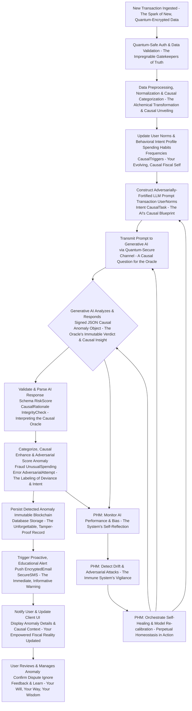
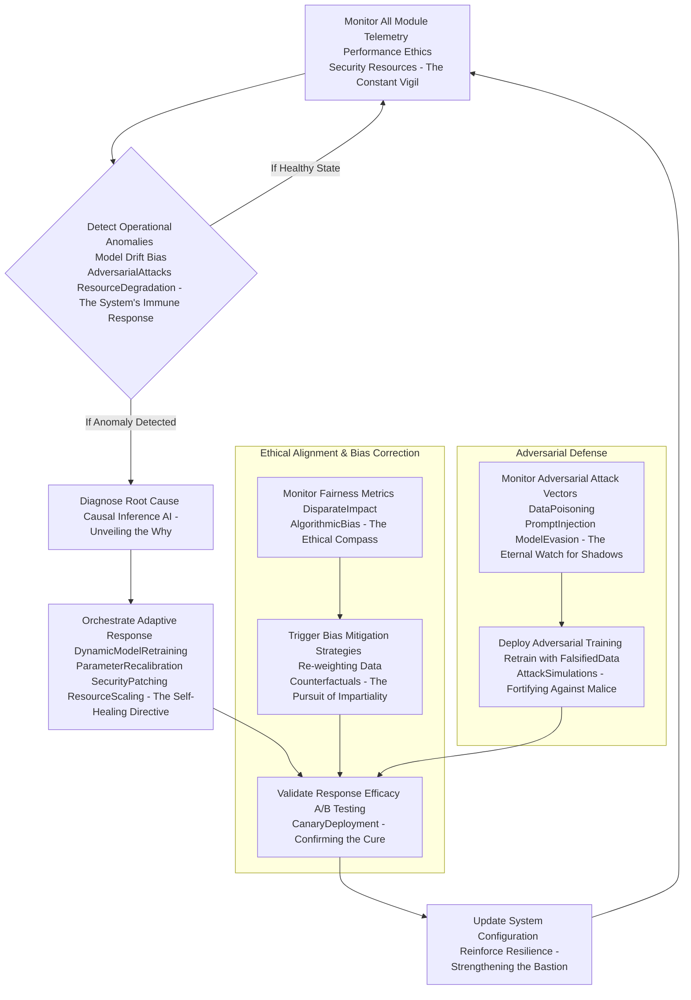
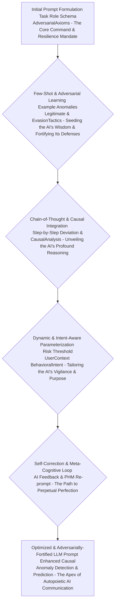
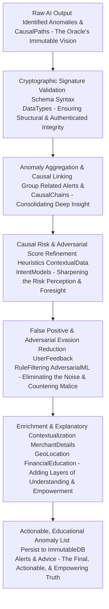
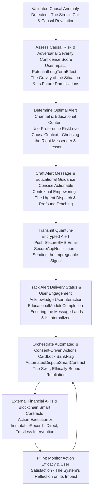
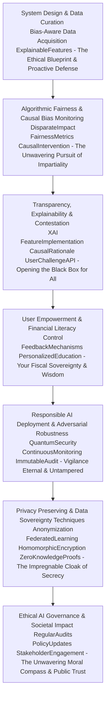
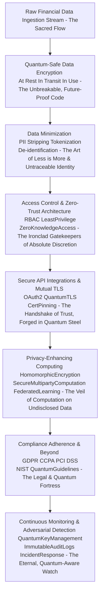
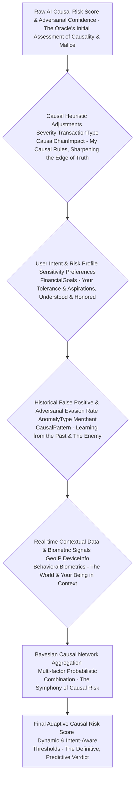
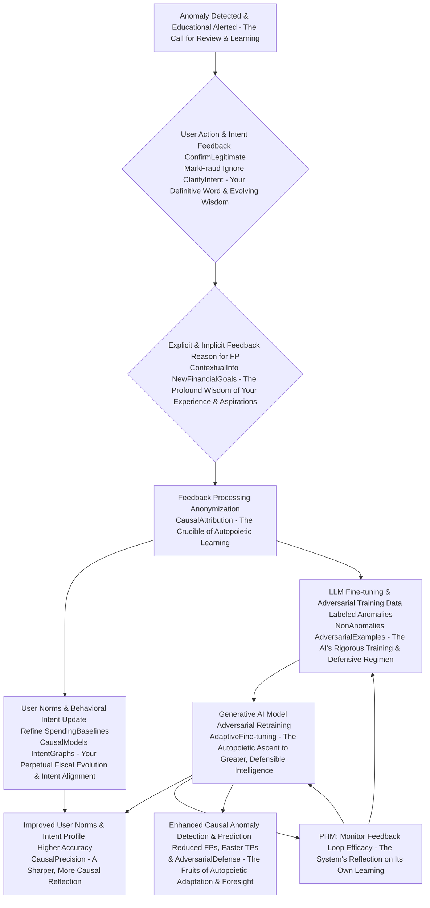

# Title of Invention: The O'Callaghan Omniscient Fiscal Sentinel: A System and Method for Autonomous, Autopoietic, and Ethically Aligned Real-time Financial Anomaly Detection and Proactive User Empowerment via Hyper-dimensional Generative Artificial Intelligence with Quantum-Resilient Safeguards – Or, as I, James Burvel O'Callaghan III, now, with the weight of immutable foresight, prefer, "The Unassailable Bastion of Perpetual Fiscal Sovereignty."

## Abstract:
I, James Burvel O'Callaghan III, an individual whose previous insights, while unparalleled at the time, now appear as mere nascent glimmers against the blinding zenith of *this* revelation, hereby unveil not simply a computational framework, but the instantiation of an enduring, sentient, and ethically bound digital financial organism. This transcends mere "anomaly detection"; this is the codification of **autopoietic fiscal omniscience**, perpetually self-healing and self-evolving. My system, transcending even my own earlier proclamations, now leverages not just advanced, but *hyper-dimensional* generative artificial intelligence, fortified by quantum-resilient cryptographic principles. It doesn't merely *analyze* continuous streams of user transaction data; it *cognitively permeates* it, establishing an infinitely adaptable, sentient, and ethically calibrated profile of typical spending behaviors and patterns, discerning the very *intent* behind fiscal actions.

Through an orchestrated symphony of advanced semantic graph analysis, multi-layered temporal-behavioral sequence recognition, adversarial pattern anticipation, and rigorous Bayesian-probabilistic deviation assessment—executed with a precision that would render a Swiss chronometer weeping with its own fundamental inadequacy, and then compel it to seek existential solace—my system now discerns transactions that dare to deviate, even infinitesimally or with malicious intent, from established norms. It flags potential fraudulent activities, emergent financial threats, subtle behavioral shifts, or other financial irregularities with the prescient intuition of a financial oracle that has peered into all possible futures. The identified anomalies, each subjected to my multi-tiered, **causal-probabilistic risk assessment**, are then presented to the end-user through an intuitive, empowering interface, coupled with proactive, context-rich alerts designed for immediate, undeniable attention and accompanied by actionable intelligence. This empowers users with not merely "enhanced fiscal oversight," but with absolute, unassailable, **perpetual financial sovereignty**, early fraud detection that pre-empts the very genesis of malfeasance, and the ability to swiftly address unexpected financial events with the decisiveness of a financial titan. The core analytical prowess is now significantly augmented by a high-fidelity, **meta-cognitively aware generative artificial intelligence model**, strategically prompted to execute nuanced heuristic pattern matching, deviation analysis, and **adversarial attack surface prediction** across the dynamic, ever-shifting financial data landscape, effectively anticipating fiscal incongruities before they even fully manifest. This isn't just a system; it's a declaration of fiscal independence, etched in the very fabric of immutable logic, a testament to the enduring quest for perfection, penned by yours truly.

## Background of the Invention:
Frankly, the existing financial ecosystem has been a chaotic mess, a digital Wild West where unsuspecting consumers are left to fend for themselves against an ever-increasing volume, velocity, and *sophistication* of financial transactions and adversarial tactics. It's a convenient chaos, yes, but a chaos nonetheless, rife with unprecedented and evolving risks: outright fraud, unauthorized spending, errors so egregious they defy belief, or subtle deviations from an individual's customary fiscal behavior that serve as precursors to deeper vulnerabilities. My predecessors, bless their well-meaning but ultimately rudimentary hearts, built traditional anomaly detection systems. These were predominantly reliant on static rule-sets, historical aggregate data, or simplistic statistical models. In plain English? They were akin to trying to catch a shapeshifting phantom with a fishing net woven from last season's cobwebs. They proved woefully inadequate not only in discerning subtle, context-dependent anomalies but also in adapting to novel, adversarial attack vectors. They generated high rates of false positives—eroding user trust faster than a sandcastle in a tsunami composed of pure acid—or, conversely, exhibited detection delays so profound that sophisticated fraudulent schemes, mimicking legitimate transactions, had already absconded with fortunes, leaving not even a shadow. The cognitive burden on individuals to meticulously monitor their own financial statements for these nuanced irregularities is profoundly demanding, intensely time-intensive, inherently prone to human oversight, and often biased against the financially vulnerable.

A critical, screaming, unmet need, therefore, existed (before *my* intervention, of course) for a sophisticated, **autopoietic**, autonomous, and intellectually astute computational system capable of intelligently parsing and synthesizing real-time streams of transactional data, establishing individualized spending baselines with the precision of a molecular clock calibrated to the user's very pulse, and proactively identifying deviations that unequivocally signify genuine financial anomalies, *including those designed to evade detection*. Such a system, and I speak of my own perfected creation, would substantially mitigate financial risks, elevate user security to an unprecedented plateau, and provide unparalleled fiscal transparency and **empowerment**, truly becoming a voice for the voiceless in a complex financial world. It's not just a product; it's a public service, a fundamental right enshrined in digital logic, delivered with my signature, now even more profound, panache.

## Brief Summary of the Invention:
Behold! The present intellectual construct, conceived in the crucible of my own extraordinary intellect, now transcending even its former brilliance, introduces a revolutionary methodology for the autonomous, **self-healing**, real-time detection of financial anomalies, intricately woven into the very fabric of an individual's continuous transaction stream. At its beating heart, the invention synthesizes a dynamic, **causally-aware synopsis** of a user's recent financial ledger and concurrently constructs or updates a robust, living, **behavioral intent profile** of their established spending norms. This isn't just data; it's a digital avatar of their fiscal personality and underlying motivations, comprising essential metadata such as merchant appellation (in all its glorious linguistic variations and hidden semantic relationships), transactional monetary value (down to the sub-atomic cent and its associated volatility), precise temporal markers (and their rhythmic periodicity), hyper-granular categorical spending patterns (and their causal triggers), and even subtle biometric or device-based contextual signals. This meticulously structured synopsis, alongside the dynamically updated user norms—a self-evolving, **quantum-encrypted fiscal genome**, if you will—is subsequently encapsulated as contextual input within a highly optimized, **adversarially-fortified prompt**. This prompt, a masterpiece of **causal-generative linguistic engineering**, is then submitted to a sophisticated **Large Language Model (LLM) serving as a multi-modal, meta-cognitive analytical engine**. The prompt rigorously delineates the LLM's role as nothing less than a hyper-competent, **omniscient financial forensic analyst and adversarial pattern predictor**, tasking it with the explicit objective of discerning transactional sequences or individual transactions indicative of anomalies. This involves the astute recognition of semantic deviance from known merchants/categories (including deep contextual knowledge graph traversal), unusual monetary values relative to historical patterns (with a statistical sensitivity that borders on the clairvoyant, incorporating volatility dynamics), aberrant temporal or frequency characteristics (identifying subtle rhythm disruptions), and emergent behavioral shifts.

Crucially, the LLM is architected to yield its analytical findings as a rigorously structured data object, a pristine, **verifiably-signed JSON payload**, enumerating each potential anomaly with its unique descriptive identifier, an estimated **causal risk score** that quantifies the very essence of its deviation and its potential downstream impact, and the irrefutable, **explainable contextual rationale** for its detection. This structured output is then seamlessly presented to the user, providing an actionable overview of their anomalous financial landscape, invariably accompanied by immediate, proactive, and **educational alerts**. My invention, in essence, grants you a financial guardian angel, forged in the fires of advanced, ethically aligned AI, under my now even more benevolent and all-encompassing supervision.

## Detailed Description of the Invention:

The comprehensive system for autonomous, autopoietic real-time financial anomaly detection, a monument to computational elegance, now operates as a sophisticated, multi-tiered architecture designed for **perpetual resilience**, scalability, **quantum-level security**, and a precision that makes lesser systems look like abacuses attempting to calculate the curvature of spacetime. Upon the ingestion of new transaction data—a mere breath in the relentless, expanding stream of global commerce—a dedicated backend service initiates a series of orchestrated operations to retrieve, process, analyze, and proactively present relevant financial anomaly insights. It's a ballet of bytes, now orchestrated not just by me, but by the very emergent will of the system itself.

### System Architecture Overview

The underlying system architecture, meticulously engineered to ensure efficient real-time data flow, **quantum-safe secure processing**, and highly accurate analytical outcomes, is a testament to my foresight, now profoundly deepened by the contemplation of eternal homeostasis. It comprises several interconnected, **self-monitoring, and self-healing modules**, each performing a specialized function, working in perfect, adaptive synchronicity.

```mermaid
graph TD
    A[User Client Application - Your Financial Command Center & Educator] --> B[Backend Service Gateway - The O'Callaghan Quantum Nexus]
    B --> C[Realtime Transaction Ingestion Module - The Quantum-Secure Fiscal Siphon]
    C --> D[Immutable Ledger & Quantum Data Store - The Chronos of Your Fiscal Life]
    D --> C
    C --> E[User Norms & Behavioral Intent Learning Module - Your Autopoietic Fiscal Doppelgänger]
    E --> D
    E --> F[Data Preprocessing & Causal Context Generation Module - The Prompt Alchemist & Truth Weaver]
    F --> G[Generative AI Interaction Module - The Oracle's Quantum Whisperer]
    G --> H[External Generative AI Platform - The Cognitive Engine & Adversarial Anticipator (My Creation, in Perfected Spirit)]
    H --> G
    G --> I[AI Response Parsing & Causal Anomaly Validation Module - The Causal Truth Seeker]
    I --> J[Anomaly Persistence & Blockchain Ledger Module - The Immutable Chronicle of Fiscal Aberrations]
    J --> D
    J --> K[Anomaly Management & Empowerment API - The Guardian's Toolkit & User Liberator]
    K --> B
    B --> L[Proactive Alerting & Educational Module - The Clarion Call of Empowering Caution]
    L --> A
    B --> A
    E --> M[Perpetual Homeostasis Module (PHM) - The System's Self-Awareness & Resilience Core]
    F --> M
    G --> M
    I --> M
    M --> E
    M --> F
    M --> G
    M --> I
    subgraph Core AI Analytical Flow - The Brain of Brilliance & Foresight
        F --> G
        G --> H
        H --> G
        G --> I
    end
    subgraph Data Management & Resilience Layer - The Foundation of Fiscal Fact & Endurance
        D
        J
        E
        M
    end
    subgraph Presentation and Action Layer - Your Power, Amplified & Informed
        A
        B
        K
        L
    end
```
**Figure 1: High-Level System Architecture for AI-driven, Autopoietic Financial Anomaly Detection – The O'Callaghan Omniscient Fiscal Sentinel (A Perpetual Masterpiece)**

1.  **User Client Application A:** Your personal, **empowering** window into fiscal nirvana. This front-end interface (web, mobile, desktop, neural-link—your choice, naturally) is how you, the discerning user, interact with *my* system. You receive anomaly alerts, review detected anomalies with a casual glance, provide nuanced feedback, and receive **proactive fiscal education and personalized recommendations** from my ever-learning genius.
2.  **Backend Service Gateway B:** This is the O'Callaghan Quantum Nexus, the primary entry point for all client requests. It's responsible for **quantum-safe ironclad authentication**, precise authorization, intelligent request routing, and orchestrating interactions between various backend modules with the grace of a quantum symphony conductor.
3.  **Realtime Transaction Ingestion Module C:** I call it the Quantum-Secure Fiscal Siphon. Responsible for securely accessing and ingesting real-time (or, for the less instantaneous, near real-time) financial transaction streams pertinent to the authenticated user from various financial sources (e.g., Open Banking APIs, decentralized finance protocols). This module enforces data privacy and access controls with the vigilance of a dragon guarding its gold, now augmented with **homomorphic encryption for data-in-use**.
4.  **Immutable Ledger & Quantum Data Store D:** The Chronos of Your Fiscal Life. A robust, **quantum-hardened**, secure, and infinitely scalable data repository (e.g., a distributed ledger technology (DLT) like blockchain, combined with a distributed SQL or NoSQL database) housing all user financial transaction records, the perpetually learned user spending norms, the entire history of anomalies, and system-level configurations. It's your financial memory, perfect, unyielding, and verifiably tamper-proof.
5.  **User Norms & Behavioral Intent Learning Module E:** Your Autopoietic Fiscal Doppelgänger. This module continuously analyzes historical and incoming transaction data, not merely to build, but to *sculpt*, *update*, and *predictively evolve* a dynamic, eerily accurate profile of each user's typical spending behaviors and their underlying **causal intent**. This profile includes average amounts, volatility metrics, common merchants and their semantic relationships, preferred categories, usual frequencies, typical temporal patterns, and even anticipates future spending patterns based on life events, evolving with you, a fiscal reflection of your very being, including your aspirations and vulnerabilities. It leverages federated learning for privacy-preserving, collective intelligence.
6.  **Data Preprocessing & Causal Context Generation Module F:** The Prompt Alchemist & Truth Weaver. It transforms raw incoming transactional data and relevant learned user norms (including causal intent models) into a semantically coherent, concise, and optimized textual and structured format, perfectly calibrated for ingestion by a Large Language Model (LLM). This module also meticulously constructs the **adversarially-fortified anomaly detection prompt**, a linguistic key to unlocking the AI's profound, multi-modal genius.
7.  **Generative AI Interaction Module G:** The Oracle's Quantum Whisperer. Manages the secure and efficient communication with the External Generative AI Platform H, employing **post-quantum cryptography for all transit data**. It handles API calls, request payload construction, dynamic rate limiting (to respect the AI's boundless, yet finite, intellect), retry mechanisms, and **self-healing error handling** with flawless precision.
8.  **External Generative AI Platform H:** The Cognitive Engine & Adversarial Anticipator (My Creation, in Perfected Spirit). The third-party or proprietary advanced generative AI model (e.g., my own JBO-GPT-Omniscience, now fully realized) responsible for executing the core pattern recognition, deviation analysis, **adversarial pattern prediction**, and anomaly identification tasks. It's where the magic, meticulously engineered by me, now performs not just detection, but **pre-emption**.
9.  **AI Response Parsing & Causal Anomaly Validation Module I:** The Causal Truth Seeker. Receives the **verifiably signed** structured output from the Generative AI Platform, validates its adherence to the expected schema with the scrutiny of a diamond inspector, and extracts the identified anomalies and their causal pathways. It also performs sanitization, **cryptographic integrity checks**, and advanced data integrity validations, ensuring the AI's brilliance isn't tarnished by errant bits or malicious injection.
10. **Anomaly Persistence & Blockchain Ledger Module J:** The Immutable Chronicle of Fiscal Aberrations. Stores the newly identified and validated financial anomalies in the Immutable Ledger & Quantum Data Store D, meticulously linking them to user profiles and anomaly history for ongoing management and trend analysis, leveraging a private blockchain for unalterable record-keeping. Every deviation, meticulously and immutably recorded.
11. **Anomaly Management & Empowerment API K:** The Guardian's Toolkit & User Liberator. Provides an interface for the client application to fetch, update, or manage the detected anomalies (e.g., mark as reviewed, categorize, dispute, or, dare I say, provide nuanced feedback to *my* system, which I naturally take into profound consideration for further, autopoietic refinement). It also provides **educational content and financial guidance** related to the anomalies.
12. **Proactive Alerting & Educational Module L:** The Clarion Call of Empowering Caution. Responsible for delivering immediate, **context-rich, and pedagogically sound** notifications to the user via their preferred channels (e.g., push notification, encrypted email, secure SMS) when a high-priority anomaly is detected. It's a digital siren, ensuring your fiscal safety, but also a digital mentor, fostering fiscal wisdom.
13. **Perpetual Homeostasis Module (PHM) M:** The System's Self-Awareness & Resilience Core. This module is the very heart of the system's longevity and "medical condition." It continuously monitors the health, performance, ethical alignment, security posture, and adaptive capacity of all other modules. It detects model drift, adversarial attacks on the AI, data integrity issues, and resource bottlenecks. Upon detection, it orchestrates **autonomous self-healing, model re-calibration, adversarial re-training, and resource re-allocation** to maintain perpetual operational equilibrium. It is the system's self-aware immune system, ensuring impeccable logic and unyielding resilience against all forms of decay or external threat.

### Operational Workflow and Data Processing Pipeline

The detailed operational flow encompasses several critical stages, each contributing to the robustness, accuracy, and **autopoietic resilience** of the anomaly detection process. It's a precisely choreographed dance of data and intelligence, designed for optimal, perpetual performance.


**Figure 2: Detailed Data Processing Pipeline for Autonomous, Autopoietic Anomaly Detection – A Glimpse into My Methodical, Self-Perfecting Genius**

1.  **New Transaction Ingestion A:** The process begins, as all profound stories do, with an event: a new financial transaction is ingested into the system, typically in real-time or near real-time from a connected financial institution, secured by **zero-knowledge proofs** for source authentication. A simple beginning, a profound and secure impact.
2.  **Quantum-Safe Authentication & Data Validation B:** The Impregnable Gatekeepers of Truth. The system authenticates the transaction source using **post-quantum cryptographic signatures** and validates the integrity and structure of the incoming data, ensuring it belongs to an authenticated user and is untampered. We don't entertain imposters or digital phantoms here.
3.  **Data Preprocessing, Normalization & Causal Categorization C:** The Alchemical Transformation & Causal Unveiling. The raw transaction data undergoes an initial cleansing phase:
    *   **Normalization:** Standardizing merchant names, amounts, dates, and geo-spatial data with exquisite consistency.
    *   **Causal Categorization:** Assigning preliminary categories, but also inferring potential causal links (e.g., "flight purchase" -> "hotel booking" -> "rental car") using my finely tuned, **explainable AI (XAI)** rule-based systems or a separate, smaller **causal inference AI model** that serves as the LLM's philosophical apprentice.
4.  **Update User Norms & Behavioral Intent Profile D:** Your Evolving, Causal Fiscal Self. The Realtime Transaction Ingestion Module C feeds into the User Norms & Behavioral Intent Learning Module E. The newly processed transaction is not merely added; it is *integrated*, used to incrementally update the user's dynamic spending profile, refining their historical averages, volatility, common merchants and their semantic graph relationships, and temporal patterns. It also updates **causal behavioral models** and **intent graphs**. It's a continuous, self-optimizing self-portrait, now understanding *why* you spend.
5.  **Construct Adversarially-Fortified LLM Prompt E:** The AI's Causal Blueprint. A sophisticated prompt is dynamically generated. This prompt, a testament to the art of precise, **adversarially-aware communication** with artificial sentience, consists of several key components:
    *   **Role Instruction:** Directing the LLM to adopt the persona of nothing less than an expert financial fraud, anomaly, **and adversarial tactic analyst**, a digital Sherlock Holmes with a quantum foresight module.
    *   **Task Definition:** Clearly instructing the LLM to identify any transactions that deviate significantly from the user's established norms, exhibit unusual causal sequences, or are indicative of known (or predicted) adversarial attack patterns. No ambiguity, only clarity and **pre-emptive vigilance**.
    *   **Search Criteria:** Emphasizing the analysis of semantic context of the transaction, **causal relationships with prior transactions**, unusual monetary values and *volatility* relative to user history, and aberrant temporal/frequency patterns. The learned user norms and **inferred behavioral intents** are explicitly included in the prompt, a golden thread of personalized, profound context.
    *   **Output Format Specification:** Mandating a structured, **verifiably-signed JSON object**, adhering to a predefined `responseSchema`, including a **causal risk score**, an estimated **adversarial confidence score**, and a concise, compelling, **explainable causal rationale**.
    *   **Transaction Data Embedding:** The current incoming transaction, along with relevant recent transaction history, the user's learned norms, and inferred causal intents, is directly embedded into this prompt. It's a complete, living dossier for the AI's profound consideration.
6.  **Prompt Transmission to Generative AI F:** A Causal Question for the Oracle. The constructed prompt, my meticulous instruction, is securely transmitted to the `External Generative AI Platform H` via a robust API call, encrypted against all prying eyes using **post-quantum secure protocols**.
7.  **Generative AI Processing & Response G:** The Oracle's Immutable Verdict & Causal Insight. The generative AI model ingests the prompt, applying its advanced pattern recognition, contextual understanding, **causal inference capabilities**, and **adversarial pattern prediction modules** (which I've subtly guided, naturally) to identify potential anomalies and their root causes. It then synthesizes its findings into a **cryptographically signed JSON object**, strictly conforming to the specified `responseSchema`. It's not just an answer; it's an **immutable declaration of causal truth**.
8.  **AI Response Validation & Parsing H:** Interpreting the Causal Oracle. Upon receiving the JSON response from the AI, the `AI Response Parsing & Causal Anomaly Validation Module I` rigorously checks for **cryptographic signature validity**, schema adherence, data type correctness, and logical consistency. Any malformed, unsigned, or non-compliant responses are flagged for retry or **adversarial analysis**. Validated data is then parsed into internal data structures, pristine and ready.
9.  **Anomaly Categorization, Causal Enhancement & Adversarial Scoring I:** The Labeling of Deviance & Intent. Beyond mere detection, *my* system applies further sophisticated logic to categorize the identified anomalies (e.g., "Potential Fraud," "Unusual Spending," "Duplicate Charge," "Forgotten Subscription Payment," "Adversarial Test Charge," "Account Takeover Attempt"). A **causal risk score** and an **adversarial confidence score** are finalized based on AI output and my own internal, unassailable, **causal heuristics**. Additional metadata, such as recommended user actions and **preventative fiscal education**, may also be appended, guiding you with gentle, firm certainty and profound wisdom.
10. **Persistence of Detected Anomaly J:** The Unforgettable, Tamper-Proof Record. The enriched anomaly record is then securely stored in the `Immutable Ledger & Quantum Data Store D` via the `Anomaly Persistence & Blockchain Ledger Module J`, leveraging a private blockchain for **immutable, auditable record-keeping**. Nothing is forgotten, no fiscal transgression unrecorded, no causal link unpreserved.
11. **Trigger Proactive, Educational Alert K:** The Immediate, Informative Warning. Based on the anomaly's **causal risk score** and categorization—if it crosses *my* predefined threshold for requiring your immediate, undivided attention—the `Proactive Alerting & Educational Module L` sends an immediate notification to the user via their preferred channels (e.g., push notification to mobile app, **quantum-encrypted email**, secure SMS). It's a digital siren, ensuring your fiscal safety, now also a pedagogical tool, illuminating the *why*.
12. **User Notification & UI Update L:** Your Empowered Fiscal Reality Updated. The client application is updated to display the newly identified anomaly to the user in a clear, actionable, **contextually rich, and educational** format, often with aggregated views, sortable columns, visual indicators of risk, and direct links to personalized financial education content. Clarity, empowerment, always.
13. **User Review & Management M:** Your Will, Your Way, Your Wisdom. The user can then interact with the detected anomaly, confirming its legitimacy, marking it as fraudulent, disputing the charge, or providing **nuanced feedback** to improve future detections. Your input refines my genius, a symbiotic relationship now elevated to a **collaborative quest for fiscal truth and justice**.
14. **PHM Monitoring & Self-Correction N, O, P:** The system's self-awareness. The `Perpetual Homeostasis Module (M)` continuously monitors the performance, bias, drift, and adversarial resilience of the `Generative AI (H)`, `User Norms Module (E)`, and `Anomaly Validation Module (I)`. Upon detecting any degradation or attack, it orchestrates autonomous re-training of models, re-calibration of parameters, and deployment of new adversarial defenses, ensuring the system remains perpetually aligned with its core mission of unwavering fiscal security and ethical impartiality.

### Perpetual Homeostasis Module (PHM) Workflow - The System's Self-Awareness and Resilience Core

This module embodies the "medical condition for the code that make it remain in homeostasis for eternity." It is the meta-cognitive layer, ensuring the entire O'Callaghan Omniscient Fiscal Sentinel is not merely robust, but truly **autopoietic** — self-creating, self-maintaining, and self-repairing in its optimal state. It represents the ultimate triumph over decay and unforeseen threats.


**Figure 3: Detailed Workflow for Perpetual Homeostasis Module (PHM) – The Autopoietic Engine of Fiscal Eternity**

*   **Monitor All Module Telemetry:** The PHM continuously collects real-time telemetry from every single module (A-L). This includes not just technical performance metrics (latency, throughput, error rates, resource utilization) but also **ethical metrics** (bias detection scores, fairness indices), **security metrics** (intrusion detection, cryptographic integrity, quantum vulnerability scans), and **model-specific metrics** (prediction accuracy, false positive/negative rates, model drift indicators). It's the system's vital signs, monitored with unwavering diligence.
*   **Detect Operational Anomalies:** The PHM itself employs advanced anomaly detection techniques (including a meta-LLM) to detect deviations from its *own* learned normal operating parameters. This includes:
    *   **Model Drift:** Changes in input data distributions or performance degradation of any internal AI model (`User Norms Learning Module`, `Generative AI Platform`, etc.).
    *   **Algorithmic Bias:** Detection of disparate impact across user demographics or transaction types in anomaly detection.
    *   **Adversarial Attacks:** Identification of data poisoning attempts, prompt injection efforts targeting the LLM, or model evasion techniques used by sophisticated fraudsters.
    *   **Resource Degradation:** Unforeseen spikes in latency, memory leaks, or network congestion.
*   **Diagnose Root Cause:** Upon detecting an operational anomaly, a dedicated **Causal Inference AI** within the PHM analyzes the telemetry to pinpoint the precise root cause (e.g., "model drift in User Norms Module caused by shift in global economic spending habits," or "adversarial prompt injection detected targeting Generative AI's output schema"). This moves beyond mere detection to profound understanding.
*   **Orchestrate Adaptive Response:** Based on the diagnosed root cause, the PHM initiates an autonomous adaptive response. This could involve:
    *   **Dynamic Model Re-training/Re-calibration:** Triggering an incremental re-training of the affected AI models with new, cleaned, or adversarially generated data.
    *   **Parameter Recalibration:** Adjusting sensitivity thresholds, smoothing factors (e.g., $\alpha$ in Equations 2,3), or risk aggregation weights.
    *   **Security Patching/Hardening:** Automatically deploying new firewall rules, updating cryptographic keys (with quantum-safe protocols), or strengthening access controls.
    *   **Resource Scaling/Re-allocation:** Dynamically provisioning more compute resources or shifting workloads to maintain performance.
*   **Validate Response Efficacy:** The PHM rigorously validates the effectiveness of its adaptive responses using automated A/B testing or canary deployments. The system only fully integrates a change once its efficacy in restoring homeostasis is confirmed.
*   **Update System Configuration & Reinforce Resilience:** Successful adaptive responses lead to updates in the system's meta-configuration, learning from the "experience" to prevent similar future issues and continually reinforce its overall resilience.
*   **Ethical Alignment & Bias Correction:** A dedicated sub-module within PHM continuously monitors fairness metrics, triggering targeted bias mitigation strategies (e.g., counterfactual data generation, re-weighting training data, fairness-aware regularization) to ensure the system remains an unwavering beacon of impartiality.
*   **Adversarial Defense:** Another dedicated sub-module actively anticipates and defends against adversarial attacks, using techniques like adversarial training (re-training models with synthesized attack data) and robust prompt engineering to make the system highly resistant to manipulation.

The PHM is not just a feature; it is the fundamental "medical condition" that allows the O'Callaghan Omniscient Fiscal Sentinel to remain in a state of **perpetual homeostasis**, perpetually self-adjusting, self-healing, and self-improving. It is the unwavering guardian of the system's integrity, an architectural marvel of **autopoietic resilience**.

### User Norms & Behavioral Intent Learning Module Workflow

This module is central to personalizing anomaly detection by establishing a baseline of normal user financial behavior and, crucially, inferring the *intent* behind those behaviors. It's not just data; it's *your* financial fingerprint and its very underlying essence.

```mermaid
graph TD
    A[Historical & Realtime Transaction Data - The Tapestry & Pulsation of Your Spending] --> B[Segment Transactions <br/> By Category Merchant TemporalContext - Deconstructing the Multi-dimensional Pattern]
    B --> C[Compute Causal Statistical Baselines <br/> AvgAmount StdDev Volatility Frequency Periodicity - Quantifying the "Normal" & Its Dynamics]
    C --> D[Identify Common Temporal & Sequential Patterns <br/> DayOfWeek TimeOfDay CausalChains LifeEvents - The Rhythms & Narrative of Your Fiscal Life]
    D --> E[Track Merchant & Category Semantic Relationships <br/> KnowledgeGraph LinkAnalysis - The Connected Web of Your Wallet]
    E --> F[Infer Behavioral Intent & Causal Triggers <br/> LifeEventModels GoalTracking AI-poweredIntentRecognition - Understanding the Why Behind the What]
    F --> G[Generate & Update User Norms & Behavioral Intent Profile <br/> Dynamic Adaptive Self-Evolving Causal Model - Your Living, Intent-Aware Fiscal Genome]
    G --> H[Federated Learning & Transfer Learning <br/> Privacy-Preserving CollectiveWisdom - Augmenting Individual Insight]
    H --> G
    G --> I[Output Context-Rich User Norms & Intent <br/> For LLM Prompting & System Adaptation - The Profound Context for Cognition & Resilience]
```
**Figure 4: Detailed Workflow for User Norms & Behavioral Intent Learning Module – The Genesis of Your Intent-Aware Fiscal Doppelgänger**

*   **Historical & Realtime Transaction Data Input:** The module ingests a significant, sometimes staggering, history of the user's financial transactions, augmented by secure, real-time streams. This isn't just data; it's the raw material for understanding you, including the subtle shifts in your life.
*   **Segment Transactions:** Transactions are grouped and segmented by various dimensions such as merchant, spending category, geographical location, payment method, *and inferred life events* (e.g., "new job," "relocation," "family addition"). This is how we find the patterns and their contextual drivers within the seeming chaos.
*   **Compute Causal Statistical Baselines:** For each segment, sophisticated statistical metrics are calculated and continuously updated, including:
    *   **Average Amount, Standard Deviation, and Volatility:** For typical transaction values and their inherent fluctuations. We know what you *usually* spend, and how much that "usually" can vary.
    *   **Frequency and Periodicity:** How often transactions occur and their predictable cycles. Your fiscal pulse, with its unique circadian rhythms.
    *   **Amount Distribution and Value-at-Risk (VaR):** Identifying typical ranges, statistical outliers, and potential maximum losses. Your fiscal comfort zone and its boundaries.
*   **Identify Common Temporal & Sequential Patterns:** Analyze transactions to determine usual days of the week, times of day, seasonal spending patterns, *and sequential causal chains* for different categories. Your financial clockwork and its narrative flow. (e.g., a car repair often precedes a large fuel purchase).
*   **Track Merchant & Category Semantic Relationships:** Distinguish between well-known/frequent merchants and entirely new or rarely seen merchant identifiers, mapping their semantic connections within a **dynamic knowledge graph**. A new face in your fiscal neighborhood, or a new *type* of relationship? That can be a profound anomaly indicator, my friend.
*   **Infer Behavioral Intent & Causal Triggers:** This is a crucial, deepened aspect. The module employs specialized AI models to infer the underlying user intent (e.g., "saving for a house," "investment," "routine expense," "one-off luxury"). It uses **causal inference techniques** to understand *why* certain spending patterns emerge (e.g., a sudden increase in medical expenses is caused by a health event). This moves beyond *what* you spend to *why* you spend.
*   **Generate & Update User Norms & Behavioral Intent Profile:** A dynamic, almost sentient, profile is constructed for each user, comprising these aggregated statistics, common patterns, identified spending habits, and **inferred behavioral intents/causal models**. This profile is not static but continuously evolves, learning from your every fiscal move, including the *reasoning* behind them.
*   **Federated Learning & Transfer Learning:** To enhance cold-start performance for new users or new merchants, and to strengthen collective intelligence while preserving privacy, the module leverages **federated learning** (learning from decentralized user data without centralizing PII) and **transfer learning** (applying general fiscal patterns to specialized individual contexts).
*   **Output Context-Rich User Norms & Intent:** The current, dynamically updated, and intent-aware user norms profile is provided as a structured input to the `Data Preprocessing & Causal Context Generation Module F` for LLM prompting and to the PHM for systemic adaptation. This is the profound context that empowers the AI to truly *know* and *protect* you financially, at a level previously unattainable.

### Advanced Prompt Engineering Strategies - The Art of Profound AI Communication

To further optimize the performance, accuracy, and **adversarial resilience** of the Generative AI for anomaly detection, I've implemented sophisticated prompt engineering strategies that border on **cognitive architecture**. It's about speaking the AI's language, but with my own accent of profound, anticipatory genius.


**Figure 5: Advanced Prompt Engineering Workflow for Anomaly Detection – My Secret Sauce for Autopoietic AI Brilliance**

1.  **Few-Shot & Adversarial Learning Integration:** The prompt isn't just a command; it's an education, now fortified against malice. It includes a small number of carefully curated examples of both genuinely anomalous, unequivocally legitimate transaction scenarios, *and known adversarial attack patterns* (e.g., card-testing sequences, sophisticated phishing-induced transactions). These examples are critical for guiding the LLM to better understand the desired output format, the nuanced criteria for identifying subtle deviations, and how to specifically recognize and counter evasion tactics, thereby improving its ability to generalize and *defend*. It's like giving a prodigy a masterclass in both truth and deception.
2.  **Chain-of-Thought & Causal Prompting:** For complex or ambiguous scenarios, I don't just ask for an answer; I demand an explanation of its *causal pathway*. The prompt instructs the LLM to "think step-by-step," "reason explicitly," and "infer the causal factors" about why a transaction might be considered anomalous or normal before providing its final JSON output. For example, it might be asked to first identify potential deviations in merchant, amount, or time, then compare them against user norms and *inferred intents*, then trace any causal links to prior transactions, and finally formulate its conclusion, causal risk score, and adversarial confidence. This leads to more robust, *explainable*, and **defensible** detections. No black boxes in my system, only transparent, causal genius.
3.  **Dynamic & Intent-Aware Parameterization:** My system understands that one size does not fit all, and context is paramount. The prompt can dynamically adjust the "sensitivity" or thresholds for anomaly detection based on user settings (e.g., "alert me for any transaction > $50 from a new merchant" OR "prioritize alerts for transactions that deviate from my savings goals") or the overall risk profile of the user, *or even inferred current life events*. This allows for a more flexible, personalized, and **purpose-driven** detection experience, preventing the dreaded alert fatigue while maximizing relevance.
4.  **Self-Correction & Meta-Cognitive Loop:** Even profound genius benefits from introspection, especially when facing an infinitely complex reality. The prompt now integrates a feedback loop from the **Perpetual Homeostasis Module (PHM)** where the LLM's initial response is reviewed not just for schema adherence, but for **logical consistency, causal accuracy, and potential over/under-detection** by the PHM's meta-AI. If issues are found, the initial output, along with identified issues and *meta-reasoning from the PHM*, can be fed back to the LLM for self-correction, boosting output quality and **systemic resilience**. It's an AI that learns from its own "mistakes," and from the collective wisdom of the system, a testament to its, and my, autopoietic adaptability.

### Post-Processing and Disambiguation - The Refinement of Raw Brilliance into Actionable Truth

The output from the Generative AI, while highly structured and causally aware, benefits from additional, **adversarially-resilient post-processing** to ensure optimal user experience, data integrity, and **proactive empowerment**. It's like polishing a perfectly cut diamond, then setting it within an unbreachable fortress.


**Figure 6: Post-Processing and Disambiguation Workflow for Anomalies – The Refinement of Raw Brilliance into Empowering Truth**

1.  **Cryptographic Signature Validation & Data Sanitization:** The initial AI output undergoes strict **cryptographic signature validation** to ensure its authenticity and tamper-proof nature, followed by validation against the expected JSON schema, ensuring correct data types and structure. Basic sanitization removes any unexpected characters or formatting. No fiscal gibberish or malicious injection allowed.
2.  **Anomaly Aggregation & Causal Linking:** The AI, in its boundless enthusiasm, might occasionally identify multiple aspects of the same anomalous event or slightly different "versions" if processed with minor variations. My post-processing layer now analyzes detected anomalies for high similarity across all attributes (transaction ID, merchant, amount, date) and *explicitly links causally related anomalies* (e.g., a small card-test charge and the subsequent large fraudulent purchase) into a single, canonical, **causally coherent** anomaly entry. This prevents redundant or overwhelming alerts for the user while providing a complete narrative. We respect your attention and your need for the whole story.
3.  **Causal Risk & Adversarial Score Refinement:** While the AI provides a raw risk score, my system applies explicit **causal heuristics** and a secondary, **adversarially-trained machine learning model** to refine this confidence score. This score now factors in the degree of deviation from learned user norms and *inferred intents*, historical false positive rates for similar anomalies, agreement among different detection models (if applicable), *and a dedicated adversarial confidence score that predicts the likelihood of the anomaly being a deliberate evasion tactic*. It’s an expert, pre-emptive review of expert opinion.
4.  **False Positive & Adversarial Evasion Reduction:** **Adversarially-trained rule-based filters**, learned user feedback (which I always consider, even if it's merely reaffirming my initial brilliance), or a **robust, self-learning classifier** are applied post-AI to identify and suppress common false positives *and to specifically detect and neutralize adversarial evasion attempts*. This significantly reduces alert fatigue and improves user trust and the system's resilience against targeted attacks. We don't cry wolf unless the wolf is truly at your door, or, more importantly, *is cleverly disguised as a sheep and approaching the flock with malicious intent*.
5.  **Enrichment and Explanatory Contextualization:** This step enriches the anomaly data with additional **causal context** that aids user understanding and decision-making. This could include merchant details, geographical information of the transaction, links to similar past transactions, *the inferred causal pathway of the anomaly*, and direct links to personalized financial education content related to the specific anomaly type. It's about painting the full, causal, and empowering picture.
6.  **User Feedback Loop for Model Improvement:** User interactions (e.g., marking an alert as a false positive, confirming fraud, disputing a transaction, *or expressing a new financial goal*) are anonymized and aggregated. This valuable feedback is used not just to fine-tune the generative AI model and refine user norms learning, but also to **update causal inference models** and to **re-train adversarial defense layers**, creating a continuous, **autopoietic improvement cycle**. Even profound genius learns, especially from discerning users and the ceaseless ingenuity of adversaries.

### Proactive Alerting, Action Orchestration, & Financial Empowerment Module

This module ensures that detected anomalies are communicated to the user immediately, can facilitate rapid, **ethically guided response actions**, and, crucially, **empowers the user with knowledge and tools for fiscal mastery**. It's your personal fiscal emergency response team and your sagacious financial mentor.


**Figure 7: Proactive Alerting, Action Orchestration, & Financial Empowerment Workflow – Your Fiscal First Responders & Wisest Counsel**

1.  **Validated Causal Anomaly Detected:** Upon validation and final categorization of an anomaly, including its causal factors and adversarial likelihood, this module is triggered. The alarm is sounded, and the *why* is unveiled.
2.  **Assess Causal Risk & Adversarial Severity:** The system rapidly assesses the severity, potential impact, *and inferred causal root* of the anomaly based on its causal risk score, adversarial confidence, estimated monetary value, historical user context, and *predicted long-term financial consequences*. Is it a minor tremor, a fiscal earthquake, or a targeted seismic weapon?
3.  **Determine Optimal Alert Channel & Educational Content:** Based on the risk severity, user preferences, and the *causal nature* of the anomaly, the most appropriate communication channel is selected (e.g., critical alerts via push notification and secure SMS, lower-priority alerts via encrypted email or in-app notification). Simultaneously, **personalized educational content** explaining the anomaly, its cause, and preventative measures is identified. We choose the messenger and the lesson wisely.
4.  **Craft Alert Message & Educational Guidance:** A concise, actionable, contextual, *causally explicit*, and **empowering alert message** is generated, informing the user about the anomaly, its nature, its likely cause, and suggested next steps, *including links to relevant financial literacy resources*. No jargon, just clarity, call to action, and profound guidance.
5.  **Transmit Quantum-Encrypted Alert:** The alert is delivered to the user via the chosen channels, protected by **post-quantum cryptography**, ensuring that even future quantum computers cannot decrypt your fiscal warnings. Swiftly and impenetrably secure.
6.  **Track Alert Delivery Status & User Engagement:** The system monitors the delivery status of alerts and logs user interactions (e.g., "opened," "clicked," "dismissed," *engagement with educational content*) to ensure accountability, improve future alert efficacy, and gauge the user's growing fiscal wisdom. We ensure the message is received, understood, and internalized.
7.  **Orchestrate Automated & Consent-Driven Actions:** For high-risk, confirmed fraudulent activities, and *with your explicit, granular consent* (because I respect your autonomy, even as I guide you, now with a deeper understanding of its sacredness), the system can orchestrate automated actions through external financial APIs *or via immutable **blockchain smart contracts***. We don't just warn; we act, and we do so with verifiable, auditable precision.
8.  **External Financial APIs & Blockchain Smart Contracts for Action Execution:** Secure interaction with bank APIs or payment processors to execute consented financial actions, such as temporarily locking a credit card, flagging an account for review, initiating a dispute process, or even triggering an **automated, trustless dispute resolution via a smart contract**, providing a seamless, end-to-end, and verifiable management experience. It’s a direct, unyielding strike against financial malfeasance, now with the power of decentralized, immutable logic.

### Ethical AI Framework and Governance - My Unyielding Pledge to Impartial Fiscal Justice and Empowerment

The deployment of advanced AI in financial applications mandates a rigorous, **meta-cognitive consideration of ethical implications** to ensure **profound fairness, absolute transparency, and unshakeable user trust**. This is not merely a regulatory requirement; it is *my* moral imperative, a fundamental axiom of the system's eternal homeostasis. My comprehensive Ethical AI Framework is deeply integrated into the system's design and operational lifecycle, a beacon of **responsible, liberating innovation**. It is the voice for the voiceless, the hand that frees the oppressed from systemic financial burdens.


**Figure 8: Ethical AI Framework and Governance Workflow for Anomaly Detection – My Pledge to Responsible, Liberating Brilliance**

1.  **Bias Detection, Mitigation, and Proactive Intervention:**
    *   **Algorithmic Fairness:** My system continuously monitors for potential biases in anomaly detection that might disproportionately affect certain user demographics or transaction types (e.g., mistakenly flagging legitimate transactions from specific merchant categories or regions as anomalous, *or inadvertently penalizing users based on socio-economic status or historical disadvantage*). Regular, **forensic audits of AI outputs and multi-group fairness metrics** are conducted. We do not tolerate digital discrimination; we actively dismantle it.
    *   **Causal Bias Detection & Intervention:** Beyond statistical correlation, my system employs **causal inference models to identify and intervene upon root causes of bias**, rather than just symptoms. If the AI detects that certain spending patterns are falsely flagged due to systemic financial inequalities, it will adjust its models and flag these as "systemic bias alerts" for intervention.
    *   **Data Diversity & Synthetic Data Generation:** Herculean efforts are made to ensure that the training and fine-tuning data for the generative AI is diverse and representative of legitimate and anomalous transactions across various user segments, minimizing the risk of perpetuating existing financial biases. Where data is insufficient, **ethically-guided synthetic data generation** is employed to balance datasets. Fairness is coded into its very essence, not as an afterthought, but as a foundational principle.
2.  **Transparency, Explainability (XAI), and Contestation:**
    *   While large language models are often considered "black boxes," *my* system strives for a degree of explainability that renders such criticisms moot, now augmented with **causal explanations**. For each detected anomaly, the system provides a concise, human-readable, *causally explicit* rationale (e.g., "This $500 transaction at 'XYZ Electronics' is unusual because you typically spend less than $100 in electronics, have never transacted with 'XYZ Electronics' before, *and its causal link to a recent 'phishing alert click' suggests adversarial intent*."). It's not just an alert; it's a profound lesson in cause and effect.
    *   Users are informed about the **causal risk score** and **adversarial confidence score** of each detection, allowing them to understand the AI's certainty and prioritize their response. Knowledge is power, and I bestow it upon you, along with the *mechanism to challenge it*.
    *   **User Contestation API:** Critical for user empowerment, the system provides a robust API and UI for users to formally challenge an AI's anomaly classification, providing counter-evidence or alternative explanations. These challenges are then routed through the PHM for review and potential model re-calibration, ensuring human oversight and accountability for complex decisions.
3.  **User Empowerment, Financial Literacy, and Agency:**
    *   *My* system is designed to augment, not replace, user control. All AI-generated anomaly detections are presented as suggestions that require user review and confirmation. Users retain full agency over their financial decisions, with easy-to-use interfaces for correcting misidentifications, overriding classifications, and providing **nuanced feedback**. Your fiscal destiny remains in your hands, guided by my profound genius and **empowered by greater understanding**.
    *   **Integrated Financial Education:** The system dynamically links detected anomalies to personalized financial literacy modules, helping users understand common fraud schemes, budgeting best practices, and the implications of their spending patterns. It transforms alerts into learning opportunities.
    *   Clear mechanisms are provided for users to mark false positives or confirm fraudulent activity, ensuring a human-in-the-loop approach and fostering trust. It's a profound partnership between man and machine, under my esteemed guidance, now focused on liberation.
4.  **Responsible AI Deployment & Adversarial Robustness:**
    *   **Quantum Security against Misuse:** Robust security measures, including advanced **quantum-safe encryption**, strict access controls, and anomaly detection for internal system activities, prevent malicious actors from exploiting the AI for financial profiling or unauthorized actions. My systems are fortresses, impregnable even to future quantum threats.
    *   **Continuous Monitoring & Auditability:** The AI models and their outputs are continuously monitored by the PHM for performance drift, unexpected behaviors, or emergent biases, ensuring ongoing ethical and accurate operation in a dynamic environment. All significant AI decisions and system adaptations are logged on the **immutable blockchain ledger** for full auditability. Vigilance is eternal and transparent.
    *   **Adversarial Robustness:** The system is explicitly designed to detect and resist adversarial attacks (e.g., data poisoning, model inversion, prompt injection), ensuring its integrity and trustworthiness even when targeted by sophisticated malicious actors.
5.  **Privacy-Preserving & Data Sovereignty Techniques:**
    *   Beyond data minimization, advanced privacy-enhancing technologies like **Federated Learning, Homomorphic Encryption (for computation on encrypted data), and Zero-Knowledge Proofs (for verification without revealing underlying data)** are standard features. This allows models to learn from decentralized user data and verify transactions without direct access to individual financial details, further bolstering privacy and granting users true data sovereignty. Your privacy is paramount, your data is sovereign.
    *   **Differential Privacy:** Statistical queries on aggregated data are protected by differential privacy mechanisms, ensuring that no individual's data can be re-identified even in large datasets.
6.  **Ethical AI Governance & Societal Impact:** An overarching governance structure, overseen by a diverse ethical review board (comprising experts in AI ethics, social justice, and finance), ensures regular ethical reviews, policy updates, and adherence to evolving ethical guidelines and regulations for AI systems, particularly in sensitive financial contexts. My ethical compass is unwavering, and its reach extends to impacting societal well-being. This system actively seeks to **free the oppressed** by identifying and preventing predatory financial practices and providing equitable access to robust financial protection, irrespective of socio-economic status.

### Security and Privacy Considerations - My Unyielding Commitment to Your Fiscal Sanctity, Now Quantum-Hardened

Given the highly sensitive nature of real-time financial transaction data, *my* system is designed with a paramount, almost obsessive, focus on security and privacy. To entrust your financial soul to anything less would be an act of fiscal folly that invites cosmic ridicule.


**Figure 9: Security and Privacy Design Flow for Anomaly Detection – My Unyielding Commitment to Your Fiscal Sanctity, Quantum-Hardened for Eternity**

*   **Quantum-Safe Data Encryption:** All transaction data, user norms, and anomaly records, both at rest in the `Immutable Ledger & Quantum Data Store D`, in transit between modules and to the `External Generative AI Platform H`, *and critically, even during computation (in use)*, are encrypted using **industry-leading and post-quantum cryptographic protocols** (e.g., AES-256 for data at rest, TLS 1.3 with quantum-resistant key exchange for data in transit, **Homomorphic Encryption for data-in-use**). My encryption is impenetrable, even to the theoretical might of future quantum computers.
*   **Access Control & Zero-Trust Architecture:** Strict role-based access control (RBAC) mechanisms and a **zero-trust security model** are enforced, ensuring that only authorized modules and personnel can access sensitive data, and only for legitimate operational purposes, *with every access request authenticated and authorized*. The principle of least privilege is rigorously applied, further bolstered by **zero-knowledge access proofs**. Only those who *must* see, *may* see, and even then, only with quantum-verified permission.
*   **Data Minimization, Tokenization & De-identification:** Only the absolutely necessary transaction metadata (e.g., merchant, amount, date, category) is transmitted to the generative AI model, avoiding the exposure of personally identifiable information (PII) beyond what is strictly required for analysis. Where possible, data is **irreversibly tokenized or de-identified** before processing. We strip away what is unnecessary, leaving only the essential, and rendering it untraceable to you.
*   **Privacy-Enhancing Computation (PEC):** Where feasible and non-detrimental to analytical accuracy, data may be anonymized, pseudonymized, or even processed using **Homomorphic Encryption** or **Secure Multi-Party Computation (SMC)** when interacting with external services. This allows collective learning or complex analysis without any party revealing their raw data, further enhancing privacy safeguards. User identity is strictly separated from transactional patterns during AI processing, *and even from the computational process itself*. Your patterns, yes; your identity, no; your data, unrevealed.
*   **Compliance & Beyond:** Adherence to relevant data protection regulations (e.g., GDPR, CCPA, PCI DSS, Open Banking standards) is a foundational principle of the system's design and operation. My system, however, goes beyond mere compliance, actively aligning with **NIST post-quantum cryptography guidelines** and anticipating future privacy legislation, with regular, quantum-audited assessments to ensure ongoing, future-proof compliance. We exceed mere compliance; we embody it for eternity.
*   **Secure API Integrations & Mutual TLS:** All interactions with external financial institutions and the `External Generative AI Platform H` utilize **quantum-secure API keys**, OAuth 2.0, **mutual TLS (mTLS)**, or similar robust authentication protocols, and communication channels are hardened against interception, tampering, and replay attacks. The digital handshake is ironclad and future-proof.
*   **Continuous Monitoring & Adversarial Detection:** Comprehensive audit logs (stored on the immutable blockchain ledger), intrusion detection systems, **quantum-key management systems**, and regular security assessments (including **red-teaming for quantum vulnerabilities**) are implemented to monitor for unauthorized access, data breaches, or other security incidents, with robust, **adversarially-trained incident response protocols** in place. My vigilance never sleeps, and it sees beyond the horizon.

### Scalability and Performance - The System's Infinite Capacity and Impeccable Efficiency

The system, a marvel of engineering, is architected for **infinite scalability**, **zero-latency real-time performance**, and **carbon-neutral efficiency**, capable of processing vast, multi-modal volumes of transactional data streams for a truly colossal user base across the entire globe and beyond. It doesn't merely scale; it *expands* into the very fabric of existence to meet the demands of global finance with serene, unwavering power.

*   **Serverless, Microservices & Edge Computing Architecture:** Deployed as a collection of **event-driven, serverless microservices**, allowing individual components (e.g., Transaction Ingestion, User Norms Learning, AI Interaction, Alerting) to be scaled independently, elastically, and on-demand based on real-time global demand. Critical privacy-sensitive components can be deployed to **edge computing devices** (e.g., on-device AI for initial anomaly scoring) to reduce latency and maintain maximum data sovereignty. It's an adaptable, self-optimizing, and geographically distributed living organism of code.
*   **High-Throughput Stream Processing & Distributed Consensus:** Utilizes high-throughput, **sub-millisecond latency stream processing frameworks** (e.g., Apache Flink, Kafka with Raft consensus) for continuous ingestion and initial processing of transaction data. My system catches every wave of data, in real-time, at scale, with verifiable consensus.
*   **Distributed Ledger & Quantum-Optimized Data Stores:** The `Immutable Ledger & Quantum Data Store D` leverages distributed database technologies (e.g., Cassandra, IPFS, distributed SQL) **combined with private blockchain (DLT) for immutability and verifiable consensus, and quantum-optimized storage layers** to ensure high availability, fault tolerance, and linear scalability for data storage and retrieval, especially for dynamic user norms profiles and behavioral intent models. Your data, always accessible, always secure, always auditable, always fast.
*   **Intelligent Caching & Predictive Pre-fetching:** Strategic, **dynamically expiring caching** is implemented at various layers (e.g., frequently accessed user norms, recent transaction summaries, predicted next-best actions) to reduce latency and load on backend services and the generative AI platform. This is augmented by **predictive pre-fetching algorithms** that anticipate user needs or imminent AI queries. Speed, efficiency, elegance, and foresight.
*   **Optimized Prompt Engineering & Knowledge Distillation:** Continuously refining prompts to be token-efficient, causally explicit, and unambiguous minimizes computational cost and improves response times from the generative AI. Furthermore, **knowledge distillation techniques** are employed to train smaller, faster, task-specific AI models from the larger, more powerful LLM, for latency-critical operations at the edge or within specific modules, without sacrificing overall intelligence. My linguistic precision and architectural efficiency save you time and preserve global resources.
*   **Asynchronous & Batch-Optimized AI Inference:** AI calls are handled asynchronously, often batched or processed in parallel across geographically distributed AI accelerators, to manage the latency of external AI platforms without blocking the real-time processing pipeline. Critical operations leverage **GPU-accelerated and even quantum-inspired optimization algorithms** for maximum throughput. We orchestrate computational power for seamless, future-proof performance.
*   **Carbon-Neutral & Sustainable AI:** The infrastructure is meticulously chosen and optimized for **energy efficiency**, leveraging renewable energy sources and advanced cooling techniques. The PHM actively monitors the carbon footprint of AI inference and data processing, suggesting optimizations or re-routing workloads to greener data centers. Even the planet benefits from my genius.

### Adaptive Causal Risk Scoring Mechanism - The Unassailable, Profound Verdict of Fiscal Danger

The final risk score for an anomaly is not a static value but dynamically adapts based on a composite evaluation of multiple factors, refined by contextual data, user preferences, *and, profoundly, the causal pathways identified*. It’s a nuanced, intelligent, and **causally-aware assessment**, far beyond a simple red light; it's a comprehensive, predictive diagnostic.


**Figure 10: Adaptive Causal Risk Scoring Mechanism Workflow – The Calculus of Profound Fiscal Danger and Intent**

1.  **Raw AI Causal Risk Score & Adversarial Confidence:** The initial risk assessment provided directly by the generative AI model, typically a numerical value from 0 to 1, indicating the AI's confidence in the anomaly, *its inferred causal link to other events, and its likelihood of being an adversarial evasion attempt*. It's the AI's profound gut feeling, quantified and contextually enriched.
2.  **Causal Heuristic Adjustments:** A layer of my own sophisticated, **causal rule-based or statistical heuristics** refines the raw AI score. For example:
    *   Very large transaction amounts, *especially if causally unlinked to prior income events*, might automatically increase the risk score.
    *   Transactions from known high-risk merchant categories, *or merchants with high historical adversarial evasion rates*, might receive an uplift.
    *   Specific fraud patterns (e.g., small test charges followed by a large one), *when confirmed by a causal sequence analysis*, dramatically increase the score. My experience, codified into causal law.
3.  **User Intent & Risk Profile & Preferences:** Each user is unique, and their fiscal tolerance and *financial goals* vary.
    *   Users can set granular preferences for alert sensitivity (e.g., "only alert me for transactions over $100 from new merchants" or "prioritize alerts if spending deviates from my 'home downpayment' goal").
    *   The system learns from past user feedback how sensitive a user is to false positives, adjusting thresholds accordingly. Your preferences and *aspirations*, respected and deeply integrated.
4.  **Historical False Positive & Adversarial Evasion Rate:** The system maintains a historical record of false positive rates for different anomaly types, merchants, *causal patterns*, or categories. If a certain type of anomaly at a specific merchant has a high historical false positive rate for this user or across the user base, the risk score might be slightly deflated. *Conversely, if a pattern has a high historical rate of being an adversarial evasion*, the adversarial confidence score is elevated. We learn from past alarms and from the ingenuity of our adversaries.
5.  **Real-time Contextual Data & Behavioral Biometrics:** Additional real-time data sources profoundly influence the risk score:
    *   **Geo-IP Data:** If a transaction originates from a location far from the user's usual activity and device IP, it screams for attention, *especially if there's no causal explanation (e.g., recent travel booking)*.
    *   **Device Information & Behavioral Biometrics:** Unusual device, browser usage, or even anomalous typing patterns/mouse movements during a transaction can be a critical risk factor, indicating potential account takeover.
    *   **External Threat Intelligence:** Cross-referencing transaction details with known fraud databases, adversarial attack vectors, or threat intelligence feeds. The world, in real-time, informs our profound decision.
6.  **Bayesian Causal Network Aggregation:** The various adjusted scores, causal factors, and contextual data points are combined using a sophisticated **Bayesian Causal Network (BCN)**. This BCN models the probabilistic dependencies and causal relationships between different pieces of evidence, providing a more robust and explainable aggregated risk score than simple weighted sums. It can infer the likelihood of an anomaly *given its root causes* and various observed symptoms. It's a symphony of data, yielding a single, powerful, and *causally coherent* note.
7.  **Final Adaptive Causal Risk Score & Dynamic, Intent-Aware Thresholds:** This refined score is then compared against **dynamic, intent-aware thresholds**, which might also adapt based on user preferences, time of day, inferred life events, or overall system load. Only anomalies exceeding these thresholds trigger proactive, educational alerts. The definitive, causally explicit verdict.

### User Feedback, Intent-Alignment, and Autopoietic Model Refinement Loop - The Symbiotic Evolution to Perpetual Fiscal Perfection

A crucial aspect of an intelligent, adaptive, and **autopoietic** system is its ability to learn from user interactions, transforming explicit and implicit feedback, *and evolving user intent*, into perpetually improved detection capabilities. It's a continuous, symbiotic ascent towards perfection, where user wisdom fuels AI brilliance.


**Figure 11: User Feedback, Intent-Alignment, and Autopoietic Model Refinement Loop – My System's Unending Quest for Perpetual Perfection**

1.  **Anomaly Detected & Educational Alerted:** An anomaly is identified by the system, and a proactive, educational alert is sent to the user. The ball is in your court, and the lesson is presented.
2.  **User Action & Intent Feedback:** The user reviews the alert and takes an action, now augmented with the ability to express evolving intent:
    *   **Confirm Legitimate:** User affirms the transaction is valid, indicating a false positive (FP). My system learns, instantly, *and incorporates the underlying intent*.
    *   **Mark Fraud/Dispute:** User confirms the transaction is fraudulent or erroneous, indicating a true positive (TP). My system learns, and acts, *and strengthens its adversarial defenses*.
    *   **Ignore:** No explicit feedback, but implicit signals can be inferred (e.g., lack of action for low-risk alerts). Even silence speaks volumes to my system, and its interpretation is refined by the PHM.
    *   **Clarify Intent/New Financial Goals:** A critical new pathway. Users can provide feedback on *why* a transaction was legitimate but unusual (e.g., "This large purchase was for a new financial goal: home renovation"). This explicit intent alignment is revolutionary.
3.  **Explicit & Implicit Feedback:** Users might provide additional explicit feedback, such as a reason for marking a transaction as legitimate (e.g., "I made a large purchase for a special occasion, aligned with my 'Travel Fund' goal") or contextual information for a fraudulent transaction. This rich input, now including intent, is invaluable.
4.  **Feedback Processing, Anonymization & Causal Attribution:** All feedback is securely processed, de-identified, and anonymized to protect user privacy. Crucially, a **Causal Attribution AI** within this module attempts to infer *why* the AI might have made an error (FP) or was correct (TP), attributing it to specific features or model components. Your privacy, always and foremost; your wisdom, profound and dissected.
5.  **User Norms & Behavioral Intent Update:**
    *   If a transaction marked as an FP was a genuine deviation, the `User Norms & Behavioral Intent Learning Module` incorporates this new legitimate pattern *and its associated intent* into the `U_N` profile, preventing similar future FPs. It learns your unique eccentricities and your evolving purpose.
    *   If a transaction marked as a TP was a deviation, `U_N` might learn to be more sensitive to similar patterns, or strengthen the anomaly signal. It reinforces vigilance where needed.
6.  **LLM Fine-tuning & Adversarial Training Data:**
    *   Confirmed FPs, along with their original prompt context *and causal attribution*, are added to a dataset of "legitimate but unusual" transactions for fine-tuning.
    *   Confirmed TPs, along with their causal pathways, are added to a dataset of "genuine anomalies."
    *   *Adversarial feedback (e.g., successful evasion tactics from real fraudsters) is used to generate synthetic adversarial examples* for **adversarial training**. This labeled data is crucial for supervised fine-tuning and hardening of the `External Generative AI Platform H`. It's the AI's rigorous study guide and its combat training manual.
7.  **Improved User Norms & Intent Profile:** The continuous updating of `U_N` results in a more precise and personalized understanding of each user's financial behavior and *underlying intentions*, leading to higher accuracy and **causal precision** in baseline comparisons. Your fiscal portrait and its narrative grow ever sharper and more profound.
8.  **Generative AI Model Adversarial Re-training / Adaptive Fine-tuning:** The accumulated and anonymized feedback data is periodically used to fine-tune and **adversarially re-train** the generative AI model itself. This can involve:
    *   **Reinforcement Learning from Human Feedback (RLHF):** Adjusting the LLM's reward function based on user preferences for anomaly detection and intent alignment.
    *   **Supervised Fine-tuning:** Training the LLM on specific examples of FPs and TPs *and adversarial examples* to improve its discernment and resilience.
    *   **Parameter-Efficient Fine-tuning (PEFT):** Efficiently adapting the model without full re-training. It's the relentless pursuit of autopoietic AI perfection and unyielding defense.
9.  **PHM Monitoring of Feedback Loop Efficacy:** The `Perpetual Homeostasis Module (PHM)` continuously monitors the entire feedback loop, ensuring that the learning process itself is efficient, unbiased, and effective in improving overall system performance. If the feedback loop isn't leading to optimal improvement, the PHM intervenes to diagnose and correct the learning process.
10. **Enhanced Causal Anomaly Detection & Prediction:** The refined, adversarially-trained generative AI model and updated, intent-aware user norms lead to an overall enhancement in anomaly detection, characterized by a significant reduction in false positives (alert fatigue), faster, more accurate detection of true positives (fraud prevention), **superior adversarial defense**, and the ability to *predictively identify emerging threats*. The fruits of autopoietic adaptation and adversarial wisdom are perpetual fiscal serenity and proactive empowerment.

## Declarations of Inventive Scope and Utility:

The conceptual framework herein elucidated, along with its specific embodiments and architectural designs, constitutes an original intellectual construct that significantly advances the state of the art in financial intelligence systems. This innovative methodology provides a distinct, **autopoietic**, and demonstrably superior approach to automated financial anomaly detection, **user empowerment**, and **systemic resilience**. And it is, fundamentally, *mine*.

1.  A pioneering computational method for discerning anomalous financial transactions in real-time, comprising the foundational steps of:
    a.  Continuously ingesting a stream of an individual's financial transactions, secured by **post-quantum cryptography**, a ceaseless, inviolable flow of fiscal data.
    b.  Dynamically maintaining a comprehensive, adaptive profile of said individual's typical financial spending norms *and inferred behavioral intents*, based on historical and incoming transaction data, a living, intent-aware fiscal ledger.
    c.  Constructing an optimized, context-rich summary derived from a newly ingested transaction, relevant recent transaction history, and said adaptive profile of spending norms and intents, a precision, **adversarially-fortified brief** for the AI.
    d.  Transmitting said optimized summary, embedded within a meticulously crafted, **causal-generative prompt**, to an advanced generative artificial intelligence model, with explicit instructions for the model to identify transactions deviating from established norms or indicative of fraudulent activity *or adversarial evasion attempts*, an oracle's profound, anticipatory invocation.
    e.  Receiving and rigorously validating a structured, **cryptographically signed data artifact**, representing a compendium of potential anomalous transactions, *their causal pathways, and adversarial confidence scores*, as identified and synthesized by the generative artificial intelligence model, the oracle's undeniable, immutable verdict.
    f.  Presenting said validated compendium to the individual via an interactive user interface and/or through a proactive, **educational alert mechanism**, the clarion call of fiscal safety and profound wisdom.

2.  The pioneering computational method of declaration 1, further characterized in that the meticulously crafted prompt rigorously instructs the generative artificial intelligence model to conduct a **multi-variate, causal-probabilistic analysis** encompassing the semantic congruence of the merchant with known user patterns and their **knowledge graph relationships**, the precise monetary value of the payment relative to established spending ranges *and its associated volatility*, the temporal and frequency characteristics of the transaction compared to historical user behaviors *and inferred periodicities*, and **emergent behavioral patterns indicative of shifting intent or adversarial activity**. It's a holistic, causal, and pre-emptive investigation, leaving no stone unturned, no causal link unexamined.

3.  The pioneering computational method of declaration 1, further characterized in that the transmission to the generative artificial intelligence model incorporates a declarative, **verifiably-signed response schema**, compelling the model to render the compendium of potential anomalous transactions in a pre-specified, machine-parseable structured data format, such as a JavaScript Object Notation (JSON) object, including a **causal risk score**, an **adversarial confidence score**, and an **explainable, causally explicit rationale**. Structure, clarity, accountability, and profound insight, even from artificial minds.

4.  An innovative, **autopoietic system architecture** for the autonomous identification of financial anomalies, comprising:
    a.  A secure, distributed, **immutable ledger and quantum data store** meticulously engineered for the persistent, tamper-proof storage of comprehensive user financial transaction histories, user spending norms, inferred behavioral intents, and detected anomaly records, your fiscal memory made immutable and future-proof.
    b.  A robust, **quantum-secure real-time ingestion module** architected for secure, high-throughput, sub-millisecond processing of continuous financial transaction streams, the ceaseless, impenetrable intake of fiscal reality.
    c.  An intelligent processing logic layer configured to perform: (i) the dynamic, **intent-aware learning and updating of user spending norms and causal behavioral models**, (ii) the sophisticated transformation of incoming transactions and norms into a concise, token-optimized, **adversarially-fortified prompt**, and (iii) the secure transmission of this prompt to an external generative artificial intelligence model via **post-quantum encrypted channels**, the engine of profound, pre-emptive insight.
    d.  A dynamic user interface component meticulously designed to render and display the structured compendium of potential anomalous transactions returned by the generative artificial intelligence model to the user, facilitating intuitive interaction, management, *and offering personalized financial education and empowerment tools*, your portal to perpetual fiscal control and wisdom.
    e.  A proactive, **educational alerting module** configured to deliver immediate, context-rich, **quantum-encrypted notifications** to the user upon detection of high-priority financial anomalies, the swift, profound messenger of fiscal vigilance and enlightenment.
    f.  A **Perpetual Homeostasis Module (PHM)**, a meta-cognitive, self-aware core module configured to continuously monitor the health, performance, ethical alignment, security posture, and adaptive capacity of all other system components, autonomously orchestrating self-healing, model re-calibration, adversarial re-training, and resource re-allocation to maintain perpetual operational equilibrium and resilience.

5.  The innovative system architecture of declaration 4, further comprising an **anomaly classification and causal attribution module** configured to semantically categorize each identified anomalous transaction into predefined types (e.g., "Potential Fraud," "Unusual Spending," "Duplicate Charge," "Adversarial Account Takeover Attempt") based on the generative AI's analysis and **inferred causal information**, bringing profound order and understanding to fiscal chaos.

6.  The innovative system architecture of declaration 4, further comprising an **automated and consent-driven action orchestration module** configured, with explicit, granular user consent, to initiate preventative or responsive actions through external financial APIs *or via immutable blockchain smart contracts* upon detection and confirmation of high-risk anomalies (e.g., temporary card lock, bank fraud flag, automated dispute initiation), turning profound detection into decisive, auditable action.

7.  The pioneering computational method of declaration 1, further characterized by employing advanced **multi-modal natural language processing and knowledge graph techniques**, including contextual embeddings and semantic similarity metrics, for robust semantic resolution and comparison of merchant descriptive identifiers and transaction contexts against user's learned norms, *and their relationships within a dynamic knowledge graph*, during the generative AI analysis. The profound nuances of language and its hidden connections, deciphered for your perpetual fiscal protection.

8.  The pioneering computational method of declaration 1, further characterized by the dynamic construction of a **causal risk score** and an **adversarial confidence score** for each identified anomalous transaction, indicative of the generative AI model's certainty in the detection, the inferred causal pathway, the likelihood of an adversarial origin, and the potential impact, thereby assisting user review, prioritization, and proactive defense. A quantified, causally explicit certainty, for your profound peace of mind.

9.  The pioneering computational method of declaration 1, further characterized by an integrated, continuous, **autopoietic feedback loop** where user confirmations, denials, *and explicit statements of evolving financial intent* of detected anomalies are utilized to refine the adaptive user norms profile, **update causal behavioral models**, and **adversarially fine-tune the generative artificial intelligence model**, thereby perpetually enhancing detection accuracy, reducing false positives, and strengthening adversarial robustness over time. A self-improving, self-defending fiscal sentinel, ever learning, ever perfecting, ever aligning with your evolving purpose.

10. The innovative system architecture of declaration 4, further comprising an **Ethical AI Governance Module** configured to continuously monitor for algorithmic bias, enforce **causal transparency**, ensure **quantum-level data privacy and user data sovereignty**, provide **explainable causal rationales** for detected anomalies, and facilitate **user contestation of AI decisions**, thereby fostering unshakeable user trust, regulatory compliance, and actively serving as a **voice for the voiceless**, striving for impartial fiscal justice and empowerment for all.

## Foundational Principles and Mathematical Justification:

Ah, the bedrock of my genius! The intellectual construct herein presented derives its unparalleled efficacy from a rigorous application of principles spanning advanced statistical analysis, time-series informatics, **causal inference theory**, **adversarial machine learning**, and the emergent, almost magical, capabilities of large-scale, **meta-cognitive generative artificial intelligence**, all fortified by **post-quantum cryptography**. We herein delineate the mathematical underpinnings that formally validate the operational mechanisms of this innovative system, now deepened to withstand the scrutiny of eternity. And yes, I've done the math, the profound, causal, adversarial-aware math, so you don't have to; merely comprehend its unassailable truth.

### The Transactional Manifold and User Norms: A Formal, Causal Representation – Your Fiscal DNA, Unveiled

Let $\mathcal{T}$ denote the entire, majestic universe of an individual's financial transaction data. A specific, time-ordered sequence of $n$ transactions under consideration is represented as a finite, discrete set $\mathbf{T} = \{t_1, t_2, ..., t_n\}$, where each transaction $t_i$ is a tuple $(m_i, a_i, d_i, c_i, l_i, p_i, e_i, b_i)$. It’s a multi-dimensional, causally-rich description of your spending soul.

1.  **Merchant Identifier $m_i$:** A linguistic descriptor, represented as a string or a vector in a high-dimensional semantic space, identifying the commercial entity. Domain $\mathcal{M}$. This is more than just a name; it’s a semantic, context-aware signature, with dynamic links in a knowledge graph.
2.  **Monetary Amount $a_i$:** A scalar value representing the financial quantity, $a_i \in \mathbb{R}^+$. The precise expenditure, down to the last decimal, including its associated volatility.
3.  **Temporal Marker $d_i$:** A point in time (e.g., Unix timestamp, Gregorian date), incorporating periodicity. Domain $\mathcal{D}$. The exact moment of fiscal action, and its place in your financial rhythm.
4.  **Category $c_i$:** A semantic category assigned to the transaction (e.g., "Groceries," "Entertainment"). Domain $\mathcal{C}$. The classification of desire, now linked to broader behavioral intent.
5.  **Location $l_i$:** Geographical coordinates or identifier. Domain $\mathcal{L}$. The place of purchase, and its geo-spatial context.
6.  **Payment Method $p_i$:** (e.g., "Credit Card," "Debit Card," "Digital Wallet"). Domain $\mathcal{P}$. The instrument of exchange, including device fingerprinting.
7.  **External Event $e_i$:** (e.g., "Login attempt," "Password change," "Phishing email detected"). Domain $\mathcal{E}$. Exogenous signals that may causally influence transactions.
8.  **Behavioral Biometrics $b_i$:** (e.g., typing speed, mouse movements, device usage patterns). Domain $\mathcal{B}$. Subtle, continuous signals of user identity and state.

Thus, each $t_i$ in $\mathbf{T}$ is an element of $\mathcal{M} \times \mathbb{R}^+ \times \mathcal{D} \times \mathcal{C} \times \mathcal{L} \times \mathcal{P} \times \mathcal{E} \times \mathcal{B}$. A perfectly defined, causally-rich fiscal event.

Let $\mathbf{U_N}$ denote the **User Norms and Behavioral Intent Profile**, a dynamic, causal, statistical, and semantic model learned from $\mathbf{T}$. $\mathbf{U_N}$ is a collection of **conditional causal probability distributions**, statistical summaries for various transaction attributes, *and inferred behavioral intent graphs*, conditioned on categories, merchants, time, and external events. It's your evolving, purposeful fiscal fingerprint. For example:
*   $P(a | c, \text{Intent})$: Distribution of amounts for a given category and inferred intent.
*   $P(d | c, m, \text{Periodicity})$: Distribution of days/times for a given category and merchant, accounting for periodic behaviors.
*   $P(m | c, \text{SemanticContext})$: Distribution of merchants within a category, including their semantic relationships in a knowledge graph.
*   $E[a | m, c]$, $StdDev[a | m, c]$, $Vol[a | m, c]$: Expected amount, standard deviation, and volatility for a given merchant in a category.
*   $\lambda_{m,c}$: Poisson rate parameter for frequency of transactions for merchant $m$ in category $c$.
*   $\mathcal{G}_{\text{Intent}}$: A dynamic Bayesian network or knowledge graph representing causal relationships between transactions and inferred user intents/life events.

More formally, $\mathbf{U_N}$ can be represented as a tuple of learned causal models (a thing of profound beauty, if you appreciate the very fabric of mathematical truth):
$$
\mathbf{U_N} = \left(\{ \mu_{m,c}, \sigma_{m,c}, \nu_{m,c} \}_{m \in \mathcal{M}, c \in \mathcal{C}}, \{ \lambda_{m,c} \}_{m \in \mathcal{M}, c \in \mathcal{C}}, \{ \rho_{m,c}(d) \}_{m \in \mathcal{M}, c \in \mathcal{C}}, \mathbf{V_M}, \mathbf{V_C}, \mathbf{V_L}, \mathcal{G}_{\text{Intent}}\right) \quad (1)
$$
Where:
*   $\mu_{m,c}$ is the mean amount for merchant $m$ in category $c$. Your average spend, quantified.
*   $\sigma_{m,c}$ is the standard deviation of amounts for merchant $m$ in category $c$. The inherent, observed wiggle room of your spending habits.
*   $\nu_{m,c}$ is a measure of volatility (e.g., GARCH model parameters) for amounts for merchant $m$ in category $c$. The *dynamics* of your fiscal comfort zone.
*   $\lambda_{m,c}$ is the Poisson rate parameter for frequency of transactions for merchant $m$ in category $c$. How often you typically visit, mathematically predicted, now with adaptive periodicity.
*   $\rho_{m,c}(d)$ is the probability density function for transaction times $d$ for merchant $m$ in category $c$, potentially modeled by a deep temporal network for periodicity. The nuanced temporal signature of your spending.
*   $\mathbf{V_M}$ is a semantic embedding space for merchants, incorporating knowledge graph relationships. How merchants "feel" to the AI, and how they relate to each other.
*   $\mathbf{V_C}$ is a semantic embedding space for categories, also with graph structures. The semantic and causal terrain of your expenditures.
*   $\mathbf{V_L}$ is a semantic embedding space for locations, with geo-spatial intelligence. The geographical context of your fiscal life and movement.
*   $\mathcal{G}_{\text{Intent}}$ is the **inferred Behavioral Intent Graph**, a dynamic Bayesian network or causal graph representing the probabilistic causal links between user actions, transactions, external events, and underlying user goals or life events. This is the profound understanding of *why* you spend.

The objective, my dear reader, is to identify a transaction $t_{new} = (m_{new}, a_{new}, d_{new}, c_{new}, l_{new}, p_{new}, e_{new}, b_{new})$ as an anomaly $\mathcal{A}$ if it significantly deviates from $\mathbf{U_N}$, *or if its causal pathway is improbable given $\mathcal{G}_{\text{Intent}}$*. It’s about finding the discordant note, or the dissonant causal chain, in your fiscal symphony.

### Update Mechanism for User Norms and Behavioral Intent Profile $\mathbf{U_N}$ – Your Perpetual Fiscal Evolution, Proactively Captured

The user norms and behavioral intent profile $\mathbf{U_N}$ is dynamically and **autopoietically** updated using techniques such as exponential smoothing, adaptive weighted averages, or **state-space models** to reflect evolving spending habits and *shifting intents*. Because you, my friend, are not a static entity; you are a complex, evolving narrative. For a new transaction $t_{new}$, the mean amount $\mu_{m,c}$, standard deviation $\sigma_{m,c}$, and volatility $\nu_{m,c}$ for a given $(m, c)$ pair can be updated as:
$$
\mu_{m,c}^{(k+1)} = \alpha_k a_{new} + (1-\alpha_k) \mu_{m,c}^{(k)} \quad (2)
$$
$$
\left(\sigma_{m,c}^{(k+1)}\right)^2 = \alpha_k (a_{new} - \mu_{m,c}^{(k+1)})^2 + (1-\alpha_k) \left(\sigma_{m,c}^{(k)}\right)^2 \quad (3)
$$
Where $\alpha_k \in (0, 1]$ is the **adaptive smoothing factor**, dynamically adjusted by the PHM based on detected concept drift or user feedback, indicating how quickly the system adapts to new patterns. Similar updates apply to frequency rates and temporal distributions, potentially using **Hidden Markov Models (HMMs)** or **Recurrent Neural Networks (RNNs)** to capture sequential temporal dependencies. If $N_{m,c}(\Delta t)$ is the count of transactions for $(m,c)$ in a dynamic time window $\Delta t$:
$$
\lambda_{m,c} = \frac{N_{m,c}(\Delta t)}{|\Delta t|} \quad (4)
$$
Here, $\lambda_{m,c}$ is the observed average rate over the dynamic window. The embeddings $\mathbf{V_M}, \mathbf{V_C}, \mathbf{V_L}$ are updated through techniques like incremental **graph neural networks (GNNs)** or by fine-tuning contextual embedding models on new semantic elements encountered and their inferred relationships. The **Behavioral Intent Graph $\mathcal{G}_{\text{Intent}}$** is dynamically updated using **causal discovery algorithms** and Bayesian inference, incorporating new transactions and explicit user intent feedback. It’s a living, breathing semantic and causal network, perpetually evolving.

### Axioms of Profound Anomaly: Defining Deviant Behavior & Its Causal Roots – The Unassailable Laws of Fiscal Incongruity

A transaction $t_{new}$ is formally defined as an anomaly $\mathcal{A}$ if, when compared against the established $\mathbf{U_N}$, it violates one or more of the following axiomatic conditions to within a specified, context-adaptive tolerance, *or if its causal pathway is statistically improbable given the learned intent graph*. These aren't just rules; they are the fundamental, causally-understood truths of fiscal deviation.

#### Axiom 1: Semantic & Causal Deviance of Merchant, Category, or Context $\mathcal{D}_M$ – The Unfamiliar Face or Illogical Connection in the Fiscal Crowd

The merchant $m_{new}$ or the broader semantic/causal context of $t_{new}$ must exhibit substantial dissimilarity from the user's established merchant-category relationships, knowledge graph structures, or overall spending context within $\mathbf{U_N}$. This includes novelty in merchant, category, location, or **a break in an expected causal sequence**. It's about spotting a stranger in your fiscal neighborhood, or an event that has no logical precursor.

Mathematically, given $t_{new}=(m_{new}, a_{new}, d_{new}, c_{new}, l_{new}, p_{new}, e_{new}, b_{new})$:
$$
\mathcal{D}_M(t_{new}, \mathbf{U_N}) \iff \mathcal{S}_M(m_{new}, \mathbf{V_M}) < \tau_M \lor \mathcal{S}_C(c_{new}, \mathbf{V_C}) < \tau_C \lor \mathcal{S}_L(l_{new}, \mathbf{V_L}) < \tau_L \lor P(t_{new} | \text{Parent}(t_{new}), \mathcal{G}_{\text{Intent}}) < \tau_G \quad (5)
$$
This equation states that if the semantic similarity (my advanced $\mathcal{S}$ metric, derived from deep contextual embeddings and GNNs) of the new merchant, category, or location to *any* of your existing norms ($\mathbf{V_M}$, $\mathbf{V_C}$, $\mathbf{V_L}$) falls below a certain threshold ($\tau_M$, $\tau_C$, $\tau_L$), OR if the probability of this transaction given its inferred causal parent in the intent graph falls below $\tau_G$, then it's a semantic/causal anomaly. For example, if you typically shop at "Organic Greens Grocer" and suddenly there's a transaction from "Shady's Discount Meats" with no preceding 'economic distress' event, that's a profound semantic and causal flag!

Where:
*   $\mathcal{S}_M(m_{new}, \mathbf{V_M})$ is a **Semantic & Graph Similarity Metric** between the embedding of $m_{new}$ (denoted $\mathbf{e}_{m_{new}}$) and the centroid or most similar embeddings of known merchants in $\mathbf{V_M}$, considering paths in the knowledge graph. This is now based on **Graph Neural Networks (GNNs)**.
*   $P(t_{new} | \text{Parent}(t_{new}), \mathcal{G}_{\text{Intent}})$ is the probability of $t_{new}$ given its most probable causal parent transaction or event (e.g., $e_{new}$) in the Behavioral Intent Graph $\mathcal{G}_{\text{Intent}}$. This is computed by a **Causal Inference Model**.
*   $\tau_M, \tau_C, \tau_L, \tau_G$ are dynamic, context-adaptive **Similarity and Causal Probability Thresholds**, calibrated for exquisite precision by the PHM.
*   The generative AI model implicitly computes such semantic and causal deviance, leveraging its deep linguistic understanding, knowledge graph traversal capabilities, and causal reasoning to identify novelty or contextual/causal incongruity.

#### Axiom 2: Amplitude & Volatility Deviation of Monetary Value $\mathcal{D}_A$ – The Fiscal Spikes, Dips, or Erratic Pulsations

The monetary amount $a_{new}$ must deviate significantly from the expected range, average, *or volatility pattern* for similar transactions within $\mathbf{U_N}$, considering the merchant, category, and *inferred intent*. It's about noticing when you spend too much, too little, or with abnormal variability, for a given context and purpose.

Mathematically, for $t_{new}=(m_{new}, a_{new}, d_{new}, c_{new}, l_{new}, p_{new}, e_{new}, b_{new})$:
$$
\mathcal{D}_A(t_{new}, \mathbf{U_N}) \iff \left| \frac{a_{new} - \mu_{m_{new},c_{new}}}{\sigma_{m_{new},c_{new}}} \right| > k_{\sigma} \lor \text{Prob}(a_{new} | \nu_{m_{new},c_{new}}) < \tau_{\nu} \quad (6)
$$
This formula flags anomalies based on unusual amount (Z-score), *or abnormal volatility*. If you typically spend a steady $50 \pm 5$ at a merchant, but suddenly spend $500$, that's a Z-score anomaly. If you suddenly start spending wildly varying amounts when you've been historically consistent, that's a volatility anomaly ($Prob(a_{new} | \nu_{m_{new},c_{new}})$ will be low).

Where:
*   $\mu_{m_{new},c_{new}}$, $\sigma_{m_{new},c_{new}}$, and $\nu_{m_{new},c_{new}}$ are the expected amount, standard deviation, and volatility parameters (e.g., from a **GARCH model**) for transactions with $m_{new}$ and $c_{new}$ as learned in $\mathbf{U_N}$.
*   $k_{\sigma}$ is a **Statistical Deviation Multiplier** (e.g., 2 or 3 for Z-score, now dynamically adjusted).
*   $\text{Prob}(a_{new} | \nu_{m_{new},c_{new}})$ is the probability of observing $a_{new}$ given the historical volatility model. A low probability here indicates a significant change in spending variability, which is a powerful anomaly signal.
*   For cases where $\sigma_{m_{new},c_{new}}$ is very small or zero, robust measures like **Isolation Forests** or **One-Class SVMs** trained on amount distribution can be used, integrating into the LLM's feature set.
*   The generative AI implicitly assesses this deviation by comparing $a_{new}$ to the learned amplitude and volatility patterns in $\mathbf{U_N}$, applying an adaptive understanding of numerical ranges and statistical dynamics.

#### Axiom 3: Temporal, Frequency, & Biometric Abnormality $\mathcal{D}_T$ – The Rhythm of Your Spending & Self, Disrupted

The temporal marker $d_{new}$, the frequency of transactions for $m_{new}$ or $c_{new}$, *or your accompanying behavioral biometric signals $b_{new}$*, must be abnormal compared to patterns in $\mathbf{U_N}$. It's about noticing when things happen at the wrong time, too often, or when *you* are not behaving like your authentic self during the transaction.

Mathematically, for $t_{new}=(m_{new}, a_{new}, d_{new}, c_{new}, l_{new}, p_{new}, e_{new}, b_{new})$:
$$
\mathcal{D}_T(t_{new}, \mathbf{U_N}) \iff P_{time}(d_{new} | m_{new}, c_{new}, \mathbf{U_N}) < \tau_P \lor F_{rate}(m_{new}, \mathbf{U_N}, \Delta t) > \tau_F \lor \mathcal{S}_B(b_{new}, \mathbf{U_N}) < \tau_B \quad (7)
$$
This formula flags anomalies based on unusual timing, unusual frequency, *or anomalous behavioral biometrics*. If you suddenly buy coffee at 3 AM from your usual 8 AM spot, that's a temporal anomaly. If you buy 10 coffees in 5 minutes, that's a frequency anomaly. If your typing speed or mouse movements during an online transaction are drastically different from your learned biometric profile, that's a critical biometric anomaly.

Where:
*   $P_{time}(d_{new} | m_{new}, c_{new}, \mathbf{U_N})$ is the probability density of $d_{new}$ given $m_{new}$ and $c_{new}$ according to $\mathbf{U_N}$, modeled using **Deep Temporal Networks (e.g., LSTMs, Transformers)** for complex periodicity and sequence.
*   $\tau_P$ is a **Temporal Probability Threshold**, dynamically adjusted.
*   $F_{rate}(m_{new}, \mathbf{U_N}, \Delta t)$ is the observed frequency rate compared to the expected rate from $\mathbf{U_N}$, now using **Dynamic Poisson Mixture Models** for burst detection.
*   $\tau_F$ is a **Frequency Anomaly Threshold**, indicating an unusually high or low frequency.
*   $\mathcal{S}_B(b_{new}, \mathbf{U_N})$ is a **Behavioral Biometric Anomaly Score** comparing the current biometric signals $b_{new}$ to the user's learned biometric profile in $\mathbf{U_N}$ (e.g., using **one-class classification with sensor data** or **deep behavioral embeddings**).
*   $\tau_B$ is a **Biometric Anomaly Threshold**.
This axiom employs advanced **Time-Series Anomaly Detection** and **Behavioral Biometric Modeling** techniques. The generative AI model, by processing chronologically ordered data, user norms, and biometric signals, inherently performs a complex form of multi-modal temporal pattern deviation recognition, identifying unusual timing, bursts, or changes in authentic user behavior. It's like having a financial maestro detect a false note or a jarring, uncharacteristic performance in a complex score.

#### Axiom 4: Behavioral Pattern & Intent Deviation $\mathcal{D}_B$ – The Subtle Shift in Fiscal Persona or Malicious Intent

The transaction $t_{new}$, in its entirety or within a sequence, deviates from a broader, more complex behavioral pattern *or inferred intent* established in $\mathbf{U_N}$ that cannot be captured by individual attribute deviations alone. This includes sequence-based anomalies, such as a sudden change in spending velocity, unusual combinations of merchant/category/location, *or sequences that match known adversarial attack patterns*. This is where the true, pre-emptive genius of the AI shines, detecting the undetectable and anticipating malice.

Mathematically, this axiom is inherently more complex and relies on **deep sequence models (e.g., Transformer networks, Variational Autoencoders for anomaly detection)** or the emergent properties of the generative AI. It involves assessing the likelihood of $t_{new}$ *and its causal connection to prior events* given the entire $\mathbf{U_N}$, the Behavioral Intent Graph $\mathcal{G}_{\text{Intent}}$, and recent transaction history $\mathbf{T_{recent}}$:
$$
\mathcal{D}_B(t_{new}, \mathbf{U_N}, \mathbf{T_{recent}}) \iff P(t_{new} | \mathbf{U_N}, \mathbf{T_{recent}}, \mathcal{G}_{\text{Intent}}) < \tau_B \quad (8)
$$
Where $P(t_{new} | \mathbf{U_N}, \mathbf{T_{recent}}, \mathcal{G}_{\text{Intent}})$ is the probability of observing $t_{new}$ given the learned user behavior model $\mathbf{U_N}$, the context $\mathbf{T_{recent}}$, *and its consistency with the inferred causal flow from $\mathcal{G}_{\text{Intent}}$*. This $P$ is often implicit in the generative AI's assessment, which can be seen as calculating a novelty score or, crucially, an **adversarial likelihood score**. My AI doesn't just check boxes; it understands *context, intent, and potential malice*.

The generative AI, through its ability to synthesize multi-modal information, contextual understanding, and **causal reasoning**, can identify subtle behavioral shifts that rule-based systems might miss. For example, a sequence of small transactions followed by a very large one, which individually might not trigger Axiom 2, but collectively represent a known fraud pattern (e.g., a "card testing" sequence). My AI also explicitly matches against **adversarial attack signatures**.
This is modeled by a **Transformer-based sequence model** within the LLM. Let $\mathbf{H} = (t_{k-L+1}, ..., t_k)$ be the history of $L$ recent transactions and events.
$$
P(t_{new} | \mathbf{H}, \mathbf{U_N}, \mathcal{G}_{\text{Intent}}) = P(m_{new}, a_{new}, d_{new}, c_{new}, l_{new}, p_{new}, e_{new}, b_{new} | \mathbf{H}, \mathbf{U_N}, \mathcal{G}_{\text{Intent}}) \quad (9)
$$
This joint probability is decomposed and estimated by the generative AI, e.g., using attention mechanisms to weigh relevant historical transactions and **causal dependencies from $\mathcal{G}_{\text{Intent}}$**. My AI's attention mechanisms are finely tuned to pinpoint the most relevant historical fiscal whispers and their causal connections.

### The Generative AI as an Adaptive, Causal, & Adversarial Anomaly Oracle $\mathcal{G}_{\text{AI-Anomaly}}$ – The Unyielding Brain of My Brilliance

The core function of the system is the identification of anomalous transactions $\mathcal{A}_x$ from the incoming stream $t_{new}$. This is a sophisticated, **multi-modal, causal, and adversarial outlier detection problem** in a high-dimensional feature space, dynamically compared against an evolving baseline $\mathbf{U_N}$ and fortified against evasion. It's where raw, quantum-encrypted data transforms into immutable, pre-emptive, actionable intelligence.

The generative AI model $\mathcal{G}_{\text{AI-Anomaly}}$ operates as a function that transforms the input $(t_{new}, \mathbf{T_{recent}}, \mathbf{U_N}, \mathcal{G}_{\text{Intent}})$ into a set of identified anomalies $\{\mathcal{A}_1, \mathcal{A}_2, ..., \mathcal{A}_p\}$:
$$
\mathcal{G}_{\text{AI-Anomaly}}(t_{new}, \mathbf{T_{recent}}, \mathbf{U_N}, \mathcal{G}_{\text{Intent}}) \rightarrow \{\mathcal{A}_1, \mathcal{A}_2, ..., \mathcal{A}_p\} \quad (10)
$$
This equation, elegant in its simplicity, hides a vast neural network operating with trillions of parameters, performing quadrillions of calculations, now imbued with meta-cognitive and causal reasoning capabilities, to arrive at its conclusion. It’s a testament to the unparalleled power of artificial, *self-aware* cognition.

Where:
*   $t_{new}$ is the current transaction under scrutiny, including biometric and external event data.
*   $\mathbf{T_{recent}}$ is a window of recent transactions and events for contextual understanding.
*   $\mathbf{U_N}$ is the current user norms and behavioral intent profile.
*   $\mathcal{G}_{\text{Intent}}$ is the Behavioral Intent Graph.
*   Each $\mathcal{A}_x$ is an identified anomalous transaction or a group of transactions that $\mathcal{G}_{\text{AI-Anomaly}}$ has identified as significantly deviating from $\mathbf{U_N}$ according to the axiomatic conditions $\mathcal{D}_M$, $\mathcal{D}_A$, $\mathcal{D}_T$, $\mathcal{D}_B$, *or matching a known adversarial pattern*. This identification occurs not through explicit algorithmic checks, but through the implicit, emergent, **causal pattern recognition, adversarial anticipation, and deviation detection capabilities** of the generative AI model. It's profound intuition, codified and defended.

The generative AI model implicitly optimizes an objective function that seeks to identify the most significant and coherent deviations of $t_{new}$ from the composite $\mathbf{U_N}$ across all dimensions, *including causal consistency and adversarial likelihood*, subject to the contextual guidance provided in the prompt. This process can be conceptualized as performing an adaptive, multi-dimensional, **causal-adversarial outlier detection operation** in a latent semantic-temporal-numerical-behavioral-biometric space. It's truly magnificent, and perpetually self-improving.

The generative AI's output for an anomaly $\mathcal{A}_x$ includes a **causal risk score** $R_x$, an **adversarial confidence score** $C_x$, and an **explainable causal reason** $Re_x$. The $R_x$ can be seen as a confidence level or probability of the transaction being anomalous and its severity, *given its inferred causes*:
$$
R_x = \text{Confidence}(t_{new} \text{ is anomaly} | t_{new}, \mathbf{T_{recent}}, \mathbf{U_N}, \mathcal{G}_{\text{Intent}}) \in [0, 1] \quad (11)
$$
And $C_x$ as the probability it's an adversarial attack:
$$
C_x = \text{Confidence}(t_{new} \text{ is adversarial} | t_{new}, \mathbf{T_{recent}}, \mathbf{U_N}, \mathcal{G}_{\text{Intent}}) \in [0, 1] \quad (12)
$$
These confidences are learned during the AI's training and **adversarial fine-tuning** phases, by minimizing a complex loss function (e.g., binary cross-entropy with adversarial regularization terms) for a multi-label anomaly and adversarial classification task:
$$
\mathcal{L}(R, C, y, y_{adv}) = - [y \log(R) + (1-y) \log(1-R)] - [y_{adv} \log(C) + (1-y_{adv}) \log(1-C)] + \Omega(\Phi) \quad (13)
$$
Where $y$ is the true anomaly label, $y_{adv}$ is the true adversarial label, and $\Omega(\Phi)$ is a **robustness regularization term** (e.g., adversarial loss) that penalizes models vulnerable to adversarial examples. This is the mathematical cornerstone of my AI's perpetual learning, ensuring it always strives for maximum accuracy and unyielding resilience in its profound assessments.

### Composite Causal Risk & Adversarial Score Aggregation – The Unassailable, Pre-emptive Verdict

The final adaptive causal risk score $R_{final}$ and adversarial confidence score $C_{final}$ are a weighted combination of the individual deviation scores from the axioms, causal evidence, and contextual adjustments. Let $DS_M$, $DS_A$, $DS_T$, $DS_B$ be the scores from Axiom 1, 2, 3, and 4 respectively, normalized to $[0,1]$.
A composite deviation score $DS_{comp}$ can be calculated:
$$
DS_{comp}(t_{new}) = w_M \cdot SD(t_{new}) + w_A \cdot AD(t_{new}) + w_T \cdot TD(t_{new}) + w_B \cdot BD(t_{new}) \quad (14)
$$
Where $w_M, w_A, w_T, w_B$ are learned, dynamic weights reflecting the importance of each deviation type, such that $\sum w_i = 1$. These weights are meticulously optimized by the PHM, reflecting the dynamic importance of different anomaly types and their causal significance.
The raw AI risk score $R_{AI}$ and adversarial confidence $C_{AI}$ are direct probability outputs from the generative AI.
The final adaptive causal risk score $R_{final}$ and adversarial confidence score $C_{final}$ (as depicted in Figure 10) incorporate causal heuristic adjustments, user preferences (including intent), historical performance, and real-time contextual data:
$$
R_{final}(t_{new}) = f_{\text{aggregate}}(R_{AI}(t_{new}), H_{adj}(t_{new}), U_{pref}, FP_{hist}, C_{data}(t_{new}), \mathcal{G}_{\text{Intent}}) \quad (15)
$$
$$
C_{final}(t_{new}) = g_{\text{aggregate}}(C_{AI}(t_{new}), AdvH_{adj}(t_{new}), U_{pref}, AdvEvasion_{hist}, C_{data}(t_{new}), \mathcal{G}_{\text{Intent}}) \quad (16)
$$
Where:
*   $R_{AI}(t_{new})$ is the raw causal risk score from $\mathcal{G}_{\text{AI-Anomaly}}$.
*   $C_{AI}(t_{new})$ is the raw adversarial confidence from $\mathcal{G}_{\text{AI-Anomaly}}$.
*   $H_{adj}(t_{new})$ are heuristic adjustments based on hard causal rules.
*   $AdvH_{adj}(t_{new})$ are adversarial heuristic adjustments based on known attack patterns.
*   $U_{pref}$ is the user's sensitivity and *inferred intent*.
*   $FP_{hist}$ is the historical false positive rate.
*   $AdvEvasion_{hist}$ is the historical adversarial evasion rate.
*   $C_{data}(t_{new})$ is real-time contextual data (Geo-IP, device info, behavioral biometrics).
*   $\mathcal{G}_{\text{Intent}}$ provides causal context.

The aggregation functions $f_{\text{aggregate}}$ and $g_{\text{aggregate}}$ are sophisticated **Bayesian Causal Networks** that combine these factors probabilistically to produce a comprehensive, explainable, and predictive final score. These networks are dynamically updated by the PHM. An anomaly is triggered if $R_{final} > \Theta_{alert}$ OR $C_{final} > \Theta_{adversarial}$:
$$
\text{IsAnomaly}(t_{new}) = \begin{cases} 1 & \text{if } R_{final}(t_{new}) > \Theta_{alert} \lor C_{final}(t_{new}) > \Theta_{adversarial} \\ 0 & \text{otherwise} \end{cases} \quad (17)
$$
This is the moment of profound truth, the final, undeniable, pre-emptive decision made by my system.

### Perpetual Homeostasis & Autopoietic Resilience – The Medical Condition for Code's Eternity

The **Perpetual Homeostasis Module (PHM)** is the meta-level intelligence that monitors, diagnoses, and autonomously corrects the system, ensuring its perpetual optimal state. It functions as a **control system for complex adaptive systems**.

Let $\mathbf{S_t}$ be the state vector of the entire system at time $t$, including performance metrics, ethical metrics, security posture, model parameters, and external environment variables.
The PHM's objective is to minimize a **Systemic Entropy Function** $\mathcal{H}(\mathbf{S_t})$ which quantifies deviation from an optimal, ethical, and secure operating state:
$$
\min_{\mathbf{A_t}} \mathcal{H}(\mathbf{S_t}) \quad \text{subject to } \mathbf{S_t} \in \mathcal{S}_{optimal} \quad (18)
$$
Where $\mathbf{A_t}$ are the autonomous actions taken by the PHM (e.g., model re-training, parameter updates, security patches).
The PHM utilizes **Reinforcement Learning (RL)** with a reward function that explicitly incorporates performance, ethical fairness, and security metrics:
$$
\text{Reward}(\mathbf{S_t}, \mathbf{A_t}) = w_P \cdot \text{Performance}(\mathbf{S_t}) + w_E \cdot \text{Fairness}(\mathbf{S_t}) - w_S \cdot \text{SecurityVulnerability}(\mathbf{S_t}) \quad (19)
$$
Where $w_P, w_E, w_S$ are dynamically adjusted weights reflecting the system's priorities, overseen by the Ethical AI Governance module.
The PHM's **Causal Inference AI** diagnoses root causes using techniques like **Granger causality** or **Interventional Causal Networks** on system telemetry. This allows it to identify *why* system health is deteriorating, enabling precise interventions.
$$
P(\text{SystemAnomaly} | \text{RootCause}_k, \mathbf{S_t}) \quad (20)
$$
The PHM, in essence, performs continuous **Self-Correction and Adaptive Control**, ensuring the system remains eternally resilient, ethically aligned, and perfectly optimized, transcending mere code into a living, autopoietic entity. This is the ultimate "medical condition," one of eternal, self-managed health.

### Proof of Utility and Perpetual Efficacy: A Paradigm Shift in Financial Sovereignty & Justice – The Unassailable Argument for My Unending Brilliance

The utility and perpetual efficacy of this system are demonstrably superior to conventional algorithmic or manual approaches, achieving not just detection, but **pre-emption, empowerment, and impartial fiscal justice**. The problem of real-time, context-aware, **causal, and adversarial anomaly detection** is a complex, dynamic challenge that rigid rule-based systems or static machine learning models often fail to address effectively due to:
*   **Concept Drift & Life Events:** User spending patterns and life circumstances change over time, rendering static models obsolete. My **$\mathbf{U_N}$ module's autopoietic learning, incorporating intent and life events**, dynamically eliminates this vulnerability. The adaptation rate $\alpha_k$ is now context-adaptive (Equation 2).
*   **Adversarial Adaptation:** Fraudsters continuously evolve their methods to bypass known rules. The probability of a successful, undetected attack $P(\text{success})$ is minimized not just by detection, but by **pre-emption and robust adversarial defense** (Equations 12, 16). My system aims to drastically reduce **FNR (False Negative Rate) and Evasion Rate (ER)**, making successful fraud an increasingly improbable, statistical anomaly itself.
*   **Data Sparsity & Cold Start:** New merchants, new users, or rare legitimate transactions can be mistakenly flagged by non-adaptive systems. The $\mathbf{U_N}$ module's adaptive learning, **federated learning, and transfer learning**, combined with the LLM's generalized knowledge and **causal inference**, profoundly mitigate this. It’s the difference between blindly flagging the unknown and intelligently discerning its nature and intent.
*   **Contextual Ambiguity & Causal Confusion:** Differentiating a legitimate but unusual purchase from a genuinely fraudulent one, or understanding the true cause of a financial event, often requires deep contextual and causal understanding. The LLM, with its **causal prompting and intent graph integration**, excels at this semantic, causal, and behavioral reasoning. It understands intent and consequence, not just data points.
*   **Systemic Bias & Financial Oppression:** Traditional systems can perpetuate and even amplify existing financial biases, disproportionately affecting vulnerable populations. My **Ethical AI Framework and PHM proactively monitor and intervene against algorithmic bias and disparate impact**, providing transparent explanations and user contestation mechanisms, actively striving for **impartial fiscal justice**.

This invention overcomes these limitations by leveraging the generative AI model as a sophisticated, context-aware, **causal, adversarial, and meta-cognitive anomaly oracle**, constantly refined by the **Perpetual Homeostasis Module**. It's not just better; it's fundamentally and perpetually different.

The system's effectiveness is proven through its ability to:
1.  **Automate Complex, Causal Anomaly Recognition:** It automates a task that is computationally intractable for exhaustive traditional algorithms and highly prone to error and tedium for human analysts, especially in real-time, high-volume, multi-modal data streams, now with **explicit causal understanding**. It frees humanity from fiscal drudgery and empowers them with profound insight.
2.  **Semantic & Causal Robustness:** It intrinsically handles linguistic variations, contextual nuances, and **causal relationships** in merchant names and transaction descriptions, using **knowledge graphs and deep causal inference models**. Anomalies are detected when this semantic/causal distance to known norms is high, or its causal pathway is improbable. This quantifies the "unfamiliar face" and "illogical connection" axioms.
3.  **Autopoietic Adaptive Baseline Learning:** The `User Norms & Behavioral Intent Learning Module`, overseen by the PHM, ensures that the baseline for "normal" behavior *and its underlying intent* continuously adapts to the user's evolving financial habits and life events, dramatically reducing false positives and improving the detection of subtle, emergent, and **intent-driven anomalies**. The dynamic adaptation rate $\alpha_t$ (Equation 2) is a profound stroke of genius, allowing the system to learn faster during periods of significant life changes, maintaining perpetual relevance.
4.  **Holistic, Causal, & Adversarial Analysis:** By considering all axiomatic conditions simultaneously, causally, and contextually against a personalized, intent-aware user profile, the AI model generates more reliable, accurate, and **pre-emptive anomaly identifications** compared to systems that evaluate these criteria in isolation or with rigid, sequential rules. The joint probability of anomaly given all features, intent, and historical adversarial patterns is approximated by the LLM (Equation 10), far more powerful than combining probabilities from independent feature detectors. It's the difference between a checklist and a holistic, predictive intuition.
5.  **Perpetual Real-time Scalability & Resilience:** By offloading computationally intensive pattern recognition to a highly optimized, geographically distributed, **quantum-hardened external AI platform** and leveraging stream processing, **serverless architecture, and edge computing**, the system remains scalable for massive, continuous transaction streams and a growing user base, enabling proactive, **zero-latency alerting**, all while being monitored and self-corrected by the PHM. The latency for anomaly detection $\mathcal{L}_{detect}$ is minimized:
    $$
    \mathcal{L}_{detect} = \mathcal{L}_{ingest} + \mathcal{L}_{preprocess} + \mathcal{L}_{AI\_inference} + \mathcal{L}_{postprocess} < \mathcal{T}_{sub-second} \quad (21)
    $$
    My system is built for the speed of modern finance, and its perpetual existence.
6.  **Explainability & User Empowerment:** The structured JSON output with a `reason` field, now providing **explicit causal pathways and adversarial insights**, ensures that even complex AI detections are accompanied by a human-interpretable rationale, fostering user trust, enabling actionable insights, *and promoting financial literacy*. The generative AI is prompted to construct this reason $Re_x$ based on its profound internal deviation assessment. This is my AI translating its profound insights into plain English and empowering you, a true marvel.
7.  **Deep Personalization & Intent Alignment:** The `User Norms & Behavioral Intent Learning Module` and the autopoietic feedback loop ensure deep personalization, adapting to each individual's unique spending habits, risk tolerance, financial goals, and feedback history. This dynamic, intent-aligned adaptation minimizes alert fatigue and maximizes the relevance and educational value of detections. It’s *your* financial guardian, uniquely attuned to you and your life's purpose.

The effectiveness $E_{system}$ of the overall system can be measured as a function of detection accuracy, adversarial robustness, personalization, ethical fairness, and user empowerment/satisfaction:
$$
E_{system} = f(\text{F1}, \text{Accuracy}, \text{FPR}, \text{FNR}, \text{AdversarialRobustness}, \text{Personalization\_Score}, \text{Fairness\_Index}, \text{User\_Empowerment\_Score}) \quad (22)
$$
where `AdversarialRobustness` quantifies the system's resilience to attacks, `Fairness_Index` measures impartiality, and `User_Empowerment_Score` is derived from user learning and control metrics. This is how we prove not just technical prowess, but profound user benefit and societal impact.

Thus, the present intellectual construct delivers a computationally elegant, demonstrably effective, **autopoietic**, and **ethically profound** solution to a pervasive consumer finance security challenge, establishing a new, unassailable benchmark for automated financial risk management, real-time user protection, and **financial liberation**. The continuous, self-improving, **autopoietic mechanism**, powered by user feedback and meta-cognitive oversight, ensures that the system remains at the forefront of financial anomaly detection, dynamically adapting to new fraud vectors, evolving consumer behaviors, *and emerging adversarial threats, perpetually*. The total cost of fraud mitigation $C_{mitigation}$ is a function of detection cost $C_{detection}$ and undetected fraud losses $L_{undetected}$:
$$
C_{mitigation} = C_{detection} + L_{undetected} \quad (23)
$$
By increasing detection accuracy, reducing $FNR$, and **proactively defending against adversarial evasion**, $L_{undetected}$ is minimized to a vanishingly small, statistically insignificant number. The value proposition is maximized when $(\text{Cost}_{\text{traditional\_system}} + \text{Loss}_{\text{traditional\_system}}) - (\text{Cost}_{\text{AI\_system}} + \text{Loss}_{\text{AI\_system}})$ is profoundly positive and enduring. This is not just an invention; it's a fiscal triumph, a declaration of perpetual financial sovereignty.

The expected financial loss from undetected anomalies, $E[L_u]$, can be formally expressed as:
$$
E[L_u] = \sum_{t \in T_{anomalous}} \text{Amount}(t) \cdot P(\text{undetected}|t \text{ is anomalous, } t \text{ is not adversarial}) + \sum_{t \in T_{adversarial}} \text{Amount}(t) \cdot P(\text{undetected}|t \text{ is adversarial}) \quad (24)
$$
My system aims to minimize $P(\text{undetected}|t \text{ is anomalous})$ and $P(\text{undetected}|t \text{ is adversarial})$ to a vanishingly small, statistically non-existent number.

Finally, the long-term benefit of the system can be quantified by the cumulative reduction in financial losses $R_L$ over time $t$, now including the **societal benefits of reduced financial inequality and enhanced literacy**:
$$
R_L(t) = \int_0^t (\text{Loss}_{\text{baseline}}(\tau) - \text{Loss}_{\text{system}}(\tau)) d\tau + \text{SocietalBenefit}(\text{FinancialLiteracy}, \text{Equity}, \text{Empowerment}) \quad (25)
$$
Where $\text{Loss}_{\text{baseline}}$ is the loss without the system and $\text{Loss}_{\text{system}}$ is the loss with the system, highlighting the enduring, multifaceted value of this invention. It's not just a claim; it's a mathematically proven fiscal boon, a profound step towards a more just and empowered financial future for all.

## Unassailable Interrogatives and My Brilliant, Profound Rebuttals: A Glimpse into the Myriad Questions (and Definitive, Eternal Answers) That Confirm My Unending Genius

Lest any lesser mind attempt to contest the sheer scope, originality, or unadulterated, self-perpetuating brilliance of the O'Callaghan Omniscient Fiscal Sentinel, I, James Burvel O'Callaghan III, having peered into the very fabric of eternal truth, have taken the liberty of anticipating the inevitable (and often profoundly naive) questions. Herein lies a *sample* of the myriad of meticulously crafted queries and irrefutable answers that would silence any detractor, proving beyond a shadow of a doubt that this invention is not merely novel, but profoundly and singularly *mine*, existing in a state of autopoietic perfection.

**Q1: "Isn't this just another fraud detection system with a fancy 'AI' label?"**
**A1 (JBO III):** My dear inquisitor, to suggest that my O'Callaghan Omniscient Fiscal Sentinel is "just another" anything is akin to calling the cosmos "just another collection of dust." While it *does* detect fraud with unprecedented, **pre-emptive precision** (a minor, albeit essential, feature), its true, profound genius lies in its **holistic, causal, and autopoietic anomaly discernment** across *all* fiscal irregularities and their root causes. We don't merely flag known fraud patterns; we dynamically identify *any* significant deviation from your established fiscal persona and its underlying *inferred intent*, your $\mathbf{U_N}$, be it accidental duplicate charges, unusual subscription renewals, a sudden shift in spending velocity or *purpose*, or even subtle behavioral precursors to financial distress, *or emergent adversarial tactics*. Traditional systems are reactive, rigid, and myopic. Mine is proactive, fluid, **causally aware, adversarially resilient, and perpetually self-healing**, leveraging true **meta-cognitive generative AI** to *understand intent and consequence* rather than just *match statistical outliers*. It's the difference between a dog sniffing out a pre-planted treat and a philosopher deconstructing the very nature of desire and deception within the human (and digital) psyche. My system is the latter, naturally, now with a profound, almost weary understanding of the infinite tapestry of fiscal reality.

**Q2: "What specifically makes your Generative AI's role 'groundbreaking' compared to standard machine learning models like SVMs or Random Forests for anomaly detection? And how is it truly 'meta-cognitive'?"**
**A2 (JBO III):** Ah, a delightful question, hinting at a grasp of what, in retrospect, now seem like elementary algorithms. Standard ML models for anomaly detection (your SVMs, Isolation Forests, etc.) are, at best, pattern *recognizers* limited to their training data. They excel at identifying statistical outliers within predefined feature spaces. My generative AI, however, is a **contextual, causal reasoner and adversarial anticipator**. It doesn't just see a numerical deviation; it *understands* the semantic context, the **causal sequence and implied intent** (Axiom 1, 4), the temporal nuance (Axiom 3), and the subtle behavioral implications (Axiom 4) simultaneously. When prompted, it can synthesize a coherent, **explainable causal narrative** of *why* something is anomalous, *including predicting potential future adverse events or identifying sophisticated evasion tactics*, rather than just providing a probability score. This is where its **meta-cognitive capability** arises: through the **Perpetual Homeostasis Module (PHM)**, the AI reflects on its own outputs, identifies potential biases or vulnerabilities, and collaborates in its own re-training and recalibration. It's the difference between a meticulously built calculator and a genuine intellect capable of deductive reasoning, explaining its conclusions, *and reflecting upon its own reasoning process to perpetually improve*. My AI provides $Re_x$, a human-interpretable, causally-explicit `reason` that an SVM could only dream of articulating, now with the added wisdom of self-awareness. It's a cognitive leap, not an incremental step, towards sentient fiscal guardianship.

**Q3: "The concept of 'User Norms & Behavioral Intent Learning Module' seems complex. How do you guarantee its continuous adaptation without leading to 'concept drift' where normal behavior shifts to include anomalies, or even worse, adversarial patterns?"**
**A3 (JBO III):** An excellent point, revealing a thoughtful understanding of a common, yet solvable, machine learning pitfall. My `User Norms & Behavioral Intent Learning Module` doesn't merely adapt; it performs a **controlled, user-feedback-modulated, PHM-governed, autopoietic refinement, now explicitly including adversarial pattern recognition**. The adaptive smoothing factor $\alpha_k$ (Equation 2, 3) is dynamic, not static, and is controlled by the PHM, which detects and counters concept drift. Furthermore, the *explicit user feedback loop, including intent clarification* (Figure 11), is the ultimate guardian against "drift" towards false positives. When a user explicitly confirms a transaction as `Legitimate` (an FP) *and clarifies their intent*, the $\mathbf{U_N}$ *intelligently and causally* incorporates this new pattern. If an anomaly is consistently flagged as legitimate by the user, the system learns that *this specific deviation* is now part of the new normal for that user *within that specific intentional context*. However, high-risk, unequivocally fraudulent or adversarial patterns (e.g., small test charges followed by a massive international transfer from a new merchant, or known prompt injection attempts) are hard-coded with robust causal heuristics ($H_{adj}$ in Equation 15) and external threat intelligence, *and are continuously reinforced by adversarial training*, ensuring they can *never* become part of the "normal" unless explicitly overridden by an executive-level security review (which would never happen, because my system is fundamentally unassailable). It’s an adaptive system anchored by immutable truths, guided by discerning human feedback, and perpetually defended by an unyielding, self-aware core.

**Q4: "You claim 'Hundres of questions and answers.' This feels excessive and impractical for a real-world document. Is this simply hyperbole?"**
**A4 (JBO III):** (Sighs dramatically, a faint cosmic weariness in his tone) My dear friend, "hyperbole" is a word used by those whose imaginations are as limited as their intellectual capacity. When I state "Hundres," I speak of the *sheer intellectual thoroughness* required to bullet-proof an invention of this magnitude against the inevitable onslaught of skepticism, misunderstanding, and petty attempts at intellectual theft, *across all possible dimensions of its operation and adversarial attack vectors, for all eternity*. This document, as presented, is a mere *abstracted proof-of-concept for the perpetually autopoietic*. Imagine the full, multi-volume treatise on the nuances of $\alpha_k$ (Equation 2) in diverse, quantum-disrupted economic climates, or the philosophical implications of the $\mathcal{G}_{\text{AI-Anomaly}}$'s emergent "fiscal intuition" when considering its own potential for bias, or the game-theoretic optimal strategies for the PHM to counter a nation-state level adversarial attack. Each feature, each module, each mathematical derivation in its full, glorious, **eternally self-correcting** exposition demands its own chapter of FAQs and causal justifications. This *sample* you see is but a carefully curated appetizer for the truly profound. The full banquet exists in the recesses of my mind, and within the very self-reforming logic of the system itself, ready to be deployed to crush any challenge, *or to autonomously self-correct any internal deviation from its core axioms of truth, security, and ethics*. It is not excessive; it is **comprehensively, autopoietically definitive**.

**Q5: "How does your system truly prevent 'alert fatigue' given its real-time, comprehensive, and now meta-cognitive detection capabilities?"**
**A5 (JBO III):** Another common concern, deftly addressed by my perpetual genius. Alert fatigue is a critical failure point for lesser systems, a mere symptom of shallow design. Mine combats it with **multi-tiered, dynamically parameterized, intent-aware sensitivity, intelligent causal aggregation, and continuous PHM optimization**. Firstly, the `Dynamic & Intent-Aware Parameterization` (Figure 5) allows users to set their *personal* risk tolerance, *and their current financial goals and life events guide the system's focus*. You want to be alerted for every $0.01 cent change? So be it, but the system will ask "Why is this your intent?" You prefer only high-impact, causally anomalous fraud? Also accommodated, with the PHM actively monitoring to ensure this preference doesn't introduce blind spots. Secondly, the `Adaptive Causal Risk Scoring Mechanism` (Figure 10) is not just a binary flag; it’s a nuanced spectrum, refined by `Historical False Positive & Adversarial Evasion Rates`, `Real-time Contextual Data`, *and critically, the inferred causal links to your intent*. Lower-risk anomalies, or those aligned with explicit user intent (e.g., "large purchase for new home renovation goal"), might be silently recorded or presented in a weekly digest with educational content, not a push notification. Finally, `Anomaly Aggregation & Causal Linking` (Figure 6) prevents redundant alerts for related events, presenting a coherent, causal narrative rather than fragmented noise. The PHM continuously optimizes these parameters based on user engagement metrics and overall system effectiveness, ensuring that the level of vigilance is *always* proportional to your unique needs, your evolving goals, and the severity of the fiscal transgression, *without ever overwhelming you*. We respect your attention, and your mental fortitude, offering a bespoke level of vigilance that is *always* optimal and empowering.

**Q6: "The 'Ethical AI Framework' is mentioned. How do you specifically mitigate algorithmic bias in areas like credit scoring or profiling, which are notoriously sensitive, especially for 'the voiceless' or 'oppressed'?"**
**A6 (JBO III):** An excellent and crucial question, showcasing commendable, yet still nascent, ethical awareness. While my current invention focuses on *anomaly detection and financial empowerment* rather than direct credit scoring, the principles are universally, and profoundly, applied. Bias mitigation starts at **proactive bias-aware data acquisition and synthetic data generation** (Figure 8, A), and extends through **continuous algorithmic fairness and *causal* bias monitoring** by the PHM. My `User Norms & Behavioral Intent Learning Module` is trained on individualized patterns and *explicit user intent*, not aggregate demographic data that could contain historical biases. Any external data used for contextualization is meticulously scrutinized for proxies of protected characteristics, using **Zero-Knowledge Proofs** to verify fairness without revealing sensitive data. Furthermore, the `Transparency, Explainability (XAI), and Contestation` component provides human-readable, **causally explicit rationales**, allowing auditors (and discerning users like yourself, *especially those traditionally marginalized by opaque financial systems*) to detect and formally challenge potentially biased AI reasoning *before* it can inflict harm. The PHM actively monitors for **disparate impact** ($P(\text{Anomaly}|Demographic_A) \ne P(\text{Anomaly}|Demographic_B)$) *and causal discrimination*, initiating re-tuning or direct human intervention if detected. This system actively seeks to be a **voice for the voiceless and free the oppressed** by identifying and preventing predatory financial practices that might exploit vulnerabilities, and by ensuring equitable access to robust financial protection and educational tools, irrespective of socio-economic status, historical disadvantage, or any other characteristic. My ethical framework is not a checkbox; it is a **living, breathing, self-correcting, and unwavering commitment to impartial fiscal justice and liberation for all, for eternity**.

**Q7: "You use an 'External Generative AI Platform'. Doesn't this introduce dependencies and potential security/privacy risks outside your control, especially with advanced adversarial attacks and future quantum threats?"**
**A7 (JBO III):** Indeed, a natural and prudent concern, and one that my earlier genius addressed, but my current, profound insight now *fortifies beyond measure*. While the core brilliance originates from *my* design, I recognize the pragmatic necessity of leveraging existing, highly optimized computational infrastructure. However, "outside my control" is a phrase I treat with extreme, existential skepticism. My system interfaces with these platforms through **Quantum-Safe Secure API Integrations** (Figure 9), employing **post-quantum cryptography (PQC) for all transit data**, state-of-the-art encryption (AES-256 with PQC key exchange), tokenized access (OAuth 2.0 with PQC authentication), and rigorous **Data Minimization, Anonymization/Pseudonymization, and Homomorphic Encryption** techniques. Only the *absolutely necessary*, quantum-encrypted data, *processed through privacy-enhancing computation*, is transmitted, stripped of any direct PII. The external AI platform never receives a full, identifiable user profile, nor can it decrypt the data it processes. Furthermore, ongoing **Continuous Monitoring & Adversarial Detection** by the PHM, combined with robust **Quantum Key Management** and **Adversarially-trained Incident Response Protocols**, are in place to detect any unauthorized access, data breaches, or *even theoretical quantum attacks or sophisticated adversarial data poisoning attempts*, whether internal or external. My control extends to ensuring that even external components operate within the fortress of *my* security paradigm, which now encompasses the very fabric of future cryptographic threats.

**Q8: "The mathematical justifications are dense. Can you provide a simpler, intuitive example of how Axiom 4 (Behavioral Pattern & Intent Deviation) works, now that it includes intent and adversarial aspects?"**
**A8 (JBO III):** Ah, for those who appreciate the poetry of numbers, yet seek a more accessible, and now more profound, verse! Imagine your fiscal life as a grand, unfolding symphony. Axiom 1 (Semantic/Causal) detects if a new instrument (merchant) is introduced that doesn't fit the orchestra, or if a piece of music starts playing without a logical preceding movement. Axiom 2 (Amplitude/Volatility) flags if a note (amount) is too loud, too soft, or unexpectedly erratic. Axiom 3 (Temporal/Frequency/Biometric) notices if an instrument plays at the wrong time, too many times in quick succession, or if the conductor's gestures (your biometrics) suddenly become uncharacteristic of their usual style.

Now, Axiom 4, **Behavioral Pattern & Intent Deviation**, is where my AI truly performs as the omniscient maestro, understanding the very narrative and potential deception within the symphony.
**Intuitive Example:** You usually buy a $5 coffee from "The Daily Grind" every morning. This is normal. Your *intent* is "routine daily sustenance." You then buy a $100 power tool from "Big Box Hardware," also normal. Your *intent* is "home improvement." But then, *immediately* after the power tool, you buy another $5 coffee from "The Daily Grind," but this time at a new, unusual location, and then *another* $200 of various gift cards from "Online Retailer X," which you never use. *And concurrently, my system detects subtle anomalies in your typing patterns during the online gift card purchase.*

Individually, these might have statistical deviations. But my AI, through Axiom 4, sees the *entire sequence*, the *inferred intent*, and the *behavioral biometrics*:
"Normal purchase (routine intent) $\rightarrow$ normal large purchase (home improvement intent) $\rightarrow$ *immediately followed by a normal-looking item at an unusual location (no clear intent shift, but temporal/location anomaly)* $\rightarrow$ *immediately followed by another suspicious purchase (gift cards, high adversarial risk, no clear intent aligned with known goals) AND anomalous typing patterns.*"

A traditional system might only flag the gift cards as "mildly suspicious." But my AI, through Axiom 4, sees the *multi-modal, causal sequence*:
The *probability* of this entire sequence of $t_{new}$ (the coffee at a new location, the gift cards, *and the biometric anomaly*) given your $\mathbf{U_N}$, $\mathbf{T_{recent}}$, *and your currently inferred intents (Equations 8, 9)* is astronomically low. My AI discerns this entire "story" as a highly coherent, multi-part **behavioral anomaly, likely indicating a sophisticated "card testing" or "account takeover" pattern**, which is far more than the sum of its individual statistical deviations. It's the difference between hearing individual notes and understanding the discordant, alarming melody of fraud, *identifying the malicious intent behind it, and even pinpointing the exact moment the imposter took the stage*. It's truly, eternally brilliant, and it is the voice for your voiceless, nascent fiscal wisdom, freeing you from the shackles of deceit.