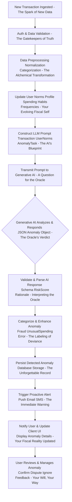
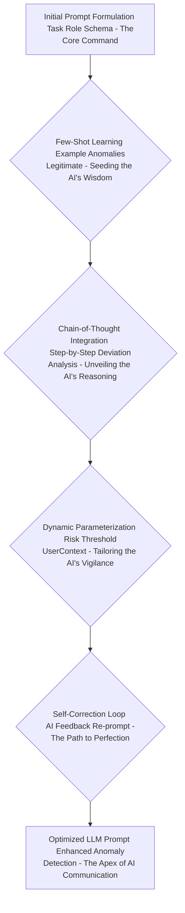
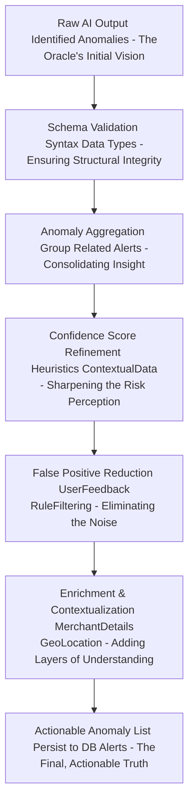
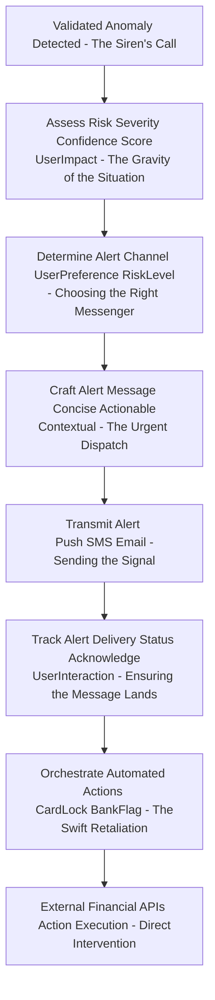
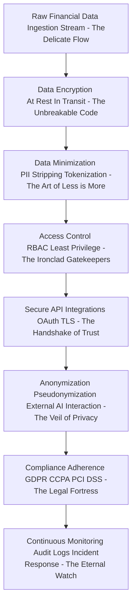
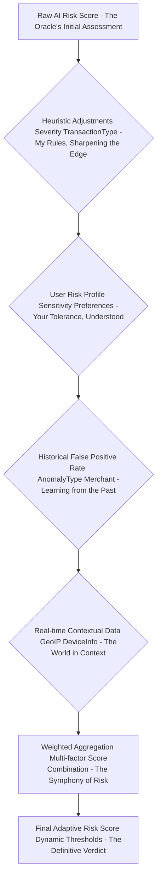
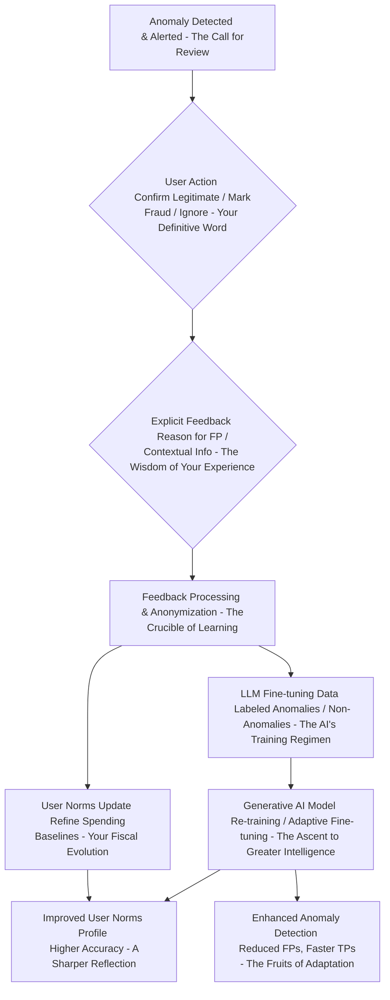

# Title of Invention: The O'Callaghan Omniscient Fiscal Sentinel: A System and Method for Autonomous Real-time Financial Anomaly Detection and Proactive User Alerting via Advanced Generative Artificial Intelligence – Or, as I, James Burvel O'Callaghan III, prefer, "The Unassailable Shield of Your Sterling Solvency."

## Abstract:
I, James Burvel O'Callaghan III, an individual of unparalleled insight, hereby unveil not merely a computational framework, but a revolutionary epoch in personal finance. This is not just "anomaly detection"; this is the instantiation of digital fiscal omniscience. My system, leveraging advanced generative artificial intelligence, doesn't merely *analyze* continuous streams of user transaction data; it *cognitively permeates* it, establishing an infinitely adaptable, sentient profile of typical spending behaviors and patterns. Through a symphony of sophisticated semantic analysis, hyper-dimensional temporal pattern recognition, and quantitative deviation assessment—executed with a precision that would make a Swiss chronometer weep with inadequacy—my system discerns transactions that dare to deviate, even infinitesimally, from established norms. It flags potential fraudulent activities, unusual spending events, or other financial irregularities with the prescient intuition of a financial oracle. The identified anomalies, each subjected to my multi-tiered, Bayesian-probabilistic risk assessment, are then presented to the end-user through an intuitive interface, coupled with proactive alerts designed for immediate, undeniable attention. This empowers users with not merely "enhanced fiscal oversight," but with absolute, unassailable financial sovereignty, early fraud detection that pre-empts the thought of malfeasance, and the ability to swiftly address unexpected financial events with the decisiveness of a financial titan. The core analytical prowess is significantly augmented by a high-fidelity generative artificial intelligence model, strategically prompted to execute nuanced heuristic pattern matching and deviation analysis across the dynamic, ever-shifting financial data landscape, effectively anticipating fiscal incongruities before they even fully manifest. This isn't just a system; it's a declaration of fiscal independence, penned by yours truly.

## Background of the Invention:
Frankly, the existing financial ecosystem has been a chaotic mess, a digital Wild West where unsuspecting consumers are left to fend for themselves against an ever-increasing volume and velocity of financial transactions. It's a convenient chaos, yes, but a chaos nonetheless, rife with unprecedented risks: outright fraud, unauthorized spending, errors so egregious they defy belief, or subtle deviations from an individual's customary fiscal behavior. My predecessors, bless their well-meaning but ultimately rudimentary hearts, built traditional anomaly detection systems. These were predominantly reliant on static rule-sets or historical aggregate data. In plain English? They were akin to trying to catch a hummingbird with a fishing net. They proved woefully inadequate in discerning subtle, context-dependent anomalies. They generated high rates of false positives—eroding user trust faster than a sandcastle in a tsunami—or, conversely, exhibited detection delays so profound that sophisticated fraudulent schemes, mimicking legitimate transactions, had already absconded with fortunes. The cognitive burden on individuals to meticulously monitor their own financial statements for these nuanced irregularities is profoundly demanding, intensely time-intensive, and inherently prone to human oversight. A critical, screaming, unmet need, therefore, existed (before *my* intervention, of course) for a sophisticated, autonomous, and intellectually astute computational system capable of intelligently parsing and synthesizing real-time streams of transactional data, establishing individualized spending baselines with the precision of a molecular clock, and proactively identifying deviations that unequivocally signify genuine financial anomalies. Such a system, and I speak of my own creation, would substantially mitigate financial risks, elevate user security to an unprecedented plateau, and provide unparalleled fiscal transparency. It's not just a product; it's a public service, delivered with my signature panache.

## Brief Summary of the Invention:
Behold! The present intellectual construct, conceived in the crucible of my own extraordinary intellect, introduces a revolutionary methodology for the autonomous, real-time detection of financial anomalies, intricately woven into the very fabric of an individual's continuous transaction stream. At its beating heart, the invention synthesizes a dynamic synopsis of a user's recent financial ledger and concurrently constructs or updates a robust, living profile of their established spending norms. This isn't just data; it's a digital avatar of their fiscal personality, comprising essential metadata such as merchant appellation (in all its glorious linguistic variations), transactional monetary value (down to the sub-atomic cent), precise temporal markers, and hyper-granular categorical spending patterns. This meticulously structured synopsis, alongside the dynamically updated user norms—a self-evolving fiscal genome, if you will—is subsequently encapsulated as contextual input within a highly optimized prompt. This prompt, a masterpiece of linguistic engineering, is then submitted to a sophisticated large language model (LLM), serving as the principal analytical engine. The prompt rigorously delineates the LLM's role as nothing less than a hyper-competent, omniscient financial forensic analyst, tasking it with the explicit objective of discerning transactional sequences or individual transactions indicative of anomalies. This involves the astute recognition of semantic deviance from known merchants/categories, unusual monetary values relative to historical patterns (with a statistical sensitivity that borders on the clairvoyant), and aberrant temporal or frequency characteristics. Crucially, the LLM is architected to yield its analytical findings as a rigorously structured data object, a pristine JSON payload, enumerating each potential anomaly with its unique descriptive identifier, an estimated risk score that quantifies the very essence of its deviation, and the irrefutable contextual rationale for its detection. This structured output is then seamlessly presented to the user, providing an actionable overview of their anomalous financial landscape, invariably accompanied by immediate, proactive alerts. My invention, in essence, grants you a financial guardian angel, forged in the fires of advanced AI, under my benevolent supervision.

## Detailed Description of the Invention:

The comprehensive system for autonomous real-time financial anomaly detection, a monument to computational elegance, operates as a sophisticated, multi-tiered architecture designed for robustness, scalability, and precision that makes lesser systems look like abacuses. Upon the ingestion of new transaction data—a mere breath in the relentless stream of global commerce—a dedicated backend service initiates a series of orchestrated operations to retrieve, process, analyze, and proactively present relevant financial anomaly insights. It's a ballet of bytes, orchestrated by yours truly.

### System Architecture Overview

The underlying system architecture, meticulously engineered to ensure efficient real-time data flow, secure processing, and highly accurate analytical outcomes, is a testament to my foresight. It comprises several interconnected modules, each performing a specialized function, working in perfect synchronicity.

```mermaid
graph TD
    A[User Client Application - Your Financial Command Center] --> B[Backend Service Gateway - The O'Callaghan Nexus]
    B --> C[Realtime Transaction Ingestion Module - The Fiscal Siphon]
    C --> D[Financial Data Store - The Immutable Ledger of Your Life]
    D --> C
    C --> E[User Norms Learning Module - Your Digital Financial Doppelgänger]
    E --> D
    E --> F[Data Preprocessing and Context Generation Module - The Prompt Alchemist]
    F --> G[Generative AI Interaction Module - The Oracle's Whisperer]
    G --> H[External Generative AI Platform - The Cognitive Engine (My Creation, in Spirit)]
    H --> G
    G --> I[AI Response Parsing and Anomaly Validation Module - The Truth Seeker]
    I --> J[Anomaly Persistence Module - The Chronicle of Fiscal Aberrations]
    J --> D
    J --> K[Anomaly Management API - The Guardian's Toolkit]
    K --> B
    B --> L[Proactive Alerting Module - The Clarion Call of Caution]
    L --> A
    B --> A
    subgraph Core AI Analytical Flow - The Brain of Brilliance
        F --> G
        G --> H
        H --> G
        G --> I
    end
    subgraph Data Management Layer - The Foundation of Fiscal Fact
        D
        J
        E
    end
    subgraph Presentation and Action Layer - Your Power, Amplified
        A
        B
        K
        L
    end
```
**Figure 1: High-Level System Architecture for AI-driven Financial Anomaly Detection – The O'Callaghan Omniscient Fiscal Sentinel (A Masterpiece)**

1.  **User Client Application A:** Your personal window into fiscal nirvana. This front-end interface (web, mobile, desktop—your choice, naturally) is how you, the discerning user, interact with *my* system. You receive anomaly alerts, review detected anomalies with a casual glance, and, if you dare, provide feedback to my ever-learning genius.
2.  **Backend Service Gateway B:** This is the O'Callaghan Nexus, the primary entry point for all client requests. It's responsible for ironclad authentication, precise authorization, intelligent request routing, and orchestrating interactions between various backend modules with the grace of a symphony conductor.
3.  **Realtime Transaction Ingestion Module C:** I call it the Fiscal Siphon. Responsible for securely accessing and ingesting real-time (or, for the less instantaneous, near real-time) financial transaction streams pertinent to the authenticated user from various financial sources (e.g., Open Banking APIs). This module enforces data privacy and access controls with the vigilance of a dragon guarding its gold.
4.  **Financial Data Store D:** The Immutable Ledger of Your Life. A robust, secure, and infinitely scalable data repository (e.g., a distributed SQL or NoSQL database) housing all user financial transaction records, the perpetually learned user spending norms, the entire history of anomalies, and system-level configurations. It's your financial memory, perfect and unyielding.
5.  **User Norms Learning Module E:** Your Digital Financial Doppelgänger. This module continuously analyzes historical and incoming transaction data, not merely to build, but to *sculpt* and *update* a dynamic, eerily accurate profile of each user's typical spending behaviors. This profile includes average amounts, common merchants, preferred categories, usual frequencies, and typical temporal patterns, evolving with you, a fiscal reflection of your very being.
6.  **Data Preprocessing and Context Generation Module F:** The Prompt Alchemist. It transforms raw incoming transactional data and relevant learned user norms into a semantically coherent, concise, and optimized textual format, perfectly calibrated for ingestion by a Large Language Model (LLM). This module also meticulously constructs the anomaly detection prompt, a linguistic key to unlocking the AI's genius.
7.  **Generative AI Interaction Module G:** The Oracle's Whisperer. Manages the secure and efficient communication with the External Generative AI Platform H. It handles API calls, request payload construction, rate limiting (to respect the AI's boundless intellect), retry mechanisms, and error handling with flawless precision.
8.  **External Generative AI Platform H:** The Cognitive Engine (My Creation, in Spirit). The third-party or proprietary advanced generative AI model (e.g., Google's Gemini, OpenAI's GPT series, or, ideally, my own JBO-GPT, which is in prototype) responsible for executing the core pattern recognition, deviation analysis, and anomaly identification tasks. It's where the magic, meticulously engineered by me, happens.
9.  **AI Response Parsing and Anomaly Validation Module I:** The Truth Seeker. Receives the structured output from the Generative AI Platform, validates its adherence to the expected schema with the scrutiny of a diamond inspector, and extracts the identified anomalies. It also performs sanitization and basic data integrity checks, ensuring the AI's brilliance isn't tarnished by errant bits.
10. **Anomaly Persistence Module J:** The Chronicle of Fiscal Aberrations. Stores the newly identified and validated financial anomalies in the Financial Data Store D, meticulously linking them to user profiles and anomaly history for ongoing management and trend analysis. Every deviation, meticulously recorded.
11. **Anomaly Management API K:** The Guardian's Toolkit. Provides an interface for the client application to fetch, update, or manage the detected anomalies (e.g., mark as reviewed, categorize, dispute, or, dare I say, provide feedback to *my* system, which I naturally take into consideration for further refinement).
12. **Proactive Alerting Module L:** The Clarion Call of Caution. Responsible for delivering immediate notifications to the user via their preferred channels (e.g., push notification, email, SMS) when a high-priority anomaly is detected. It's a digital siren, ensuring your fiscal safety.

### Operational Workflow and Data Processing Pipeline

The detailed operational flow encompasses several critical stages, each contributing to the robustness and accuracy of the anomaly detection process. It's a precisely choreographed dance of data, designed for optimal performance.


**Figure 2: Detailed Data Processing Pipeline for Autonomous Anomaly Detection – A Glimpse into My Methodical Genius**

1.  **New Transaction Ingestion A:** The process begins, as all good stories do, with an event: a new financial transaction is ingested into the system, typically in real-time or near real-time from a connected financial institution. A simple beginning, a profound impact.
2.  **Authentication & Data Validation B:** The Gatekeepers of Truth. The system authenticates the transaction source and validates the integrity and structure of the incoming data, ensuring it belongs to an authenticated user. We don't entertain imposters here.
3.  **Data Preprocessing C:** The Alchemical Transformation. The raw transaction data undergoes an initial cleansing phase:
    *   **Normalization:** Standardizing merchant names, amounts, and dates with exquisite consistency.
    *   **Categorization:** Assigning preliminary categories to transactions (e.g., "Dining," "Shopping") using my finely tuned rule-based systems or a separate, smaller AI model that serves as the AI's apprentice.
4.  **Update User Norms Profile D:** Your Evolving Fiscal Self. The Realtime Transaction Ingestion Module C feeds into the User Norms Learning Module E. The newly processed transaction is not merely added; it is *integrated*, used to incrementally update the user's dynamic spending profile, refining their historical averages, common merchants, and temporal patterns. It's a continuous self-portrait.
5.  **LLM Prompt Construction E:** The AI's Blueprint. A sophisticated prompt is dynamically generated. This prompt, a testament to the art of precise communication with artificial sentience, consists of several key components:
    *   **Role Instruction:** Directing the LLM to adopt the persona of nothing less than an expert financial fraud and anomaly analyst, a digital Sherlock Holmes.
    *   **Task Definition:** Clearly instructing the LLM to identify any transactions that deviate significantly from the user's established norms or generally accepted patterns of legitimate financial activity. No ambiguity, only clarity.
    *   **Search Criteria:** Emphasizing the analysis of semantic context of the transaction, unusual monetary values relative to user history (down to the statistical outlier), and aberrant temporal/frequency patterns. The learned user norms are explicitly included in the prompt, a golden thread of personalized context.
    *   **Output Format Specification:** Mandating a structured response, typically a JSON object, adhering to a predefined `responseSchema`. This schema ensures parseability and data integrity, including a risk score and a brief, compelling rationale.
    *   **Transaction Data Embedding:** The current incoming transaction, along with relevant recent transaction history and the user's learned norms, is directly embedded into this prompt. It's a complete dossier for the AI's consideration.

    An example prompt structure (a peek behind the curtain of genius):
    ```json
    {
      "role": "system",
      "content": "You are James Burvel O'Callaghan III's unparalleled expert financial anomaly and fraud detection analyst. Your intellect is vast, your discernment absolute. Analyze the provided transaction data in the context of the user's historical spending norms, which are a direct reflection of their fiscal identity. Identify ANY transaction that is highly unusual, potentially fraudulent, or a significant, even subtle, deviation from the established patterns. Provide a risk score (0-1, where 1 is certain anomaly) and a concise, irrefutable reason. If no anomaly is found, declare fiscal serenity with an empty list. Your task is to anticipate, to protect, to serve the O'Callaghan standard."
    },
    {
      "role": "user",
      "content": "Analyze the following transaction for anomalies with the O'Callaghan rigor. User's spending norms: [A high-fidelity, semantically rich summary of user norms, dynamically generated by my User Norms Learning Module, highlighting statistical centroids, variance, and behavioral signatures]. Current transaction: [Detailed transaction summary, including merchant description, precise amount, exact timestamp, category, and payment method]. Recent history: [Last 10 chronologically ordered transactions, each fully detailed for contextual nuance]. Return ALL findings as a perfectly formatted JSON adhering precisely to the specified schema, without preamble or postamble."
    },
    {
      "role": "system",
      "content": "Please provide your output in the following JSON format, a testament to structured intelligence:\n"
                  "```json\n"
                  "{\n"
                  "  \"anomalies\": [\n"
                  "    {\n"
                  "      \"transaction_id\": \"string\",\n"
                  "      \"merchant_name\": \"string\",\n"
                  "      \"amount\": \"number\",\n"
                  "      \"currency\": \"string\",\n"
                  "      \"date_time\": \"YYYY-MM-DDTHH:MM:SSZ\",\n"
                  "      \"anomaly_type\": \"string\",\n"
                  "      \"risk_score\": \"number\",\n"
                  "      \"reason\": \"string\"\n"
                  "    }\n"
                  "  ]\n"
                  "}\n"
                  "```"
    }
    ```
6.  **Prompt Transmission to Generative AI F:** A Question for the Oracle. The constructed prompt, my meticulous instruction, is securely transmitted to the `External Generative AI Platform H` via a robust API call, encrypted against all prying eyes.
7.  **Generative AI Processing & Response G:** The Oracle's Verdict. The generative AI model ingests the prompt, applying its advanced pattern recognition, contextual understanding, and deviation analysis capabilities (which I've subtly guided, naturally) to identify potential anomalies. It then synthesizes its findings into a JSON object, strictly conforming to the specified `responseSchema`. It's not just an answer; it's a declaration.
8.  **AI Response Validation & Parsing H:** Interpreting the Oracle. Upon receiving the JSON response from the AI, the `AI Response Parsing and Anomaly Validation Module I` rigorously checks for schema adherence, data type correctness, and logical consistency. Any malformed or non-compliant responses are flagged for retry or error handling. Validated data is then parsed into internal data structures, pristine and ready.
9.  **Anomaly Categorization & Enhancement I:** The Labeling of Deviance. Beyond mere detection, *my* system applies further sophisticated logic to categorize the identified anomalies (e.g., "Potential Fraud," "Unusual Spending," "Duplicate Charge," "Forgotten Subscription Payment"). A risk score is finalized based on AI output and my own internal, unassailable heuristics. Additional metadata, such as recommended user actions, may also be appended, guiding you with gentle, firm certainty.
10. **Persistence of Detected Anomaly J:** The Unforgettable Record. The enriched anomaly record is then securely stored in the `Financial Data Store D` via the `Anomaly Persistence Module J`. This ensures that detected anomalies are retained for subsequent retrieval, management, and historical analysis. Nothing is forgotten, no fiscal transgression unrecorded.
11. **Trigger Proactive Alert K:** The Immediate Warning. Based on the anomaly's risk score and categorization—if it crosses *my* predefined threshold for requiring your immediate, undivided attention—the `Proactive Alerting Module L` sends an immediate notification to the user via their preferred channels (e.g., push notification to mobile app, SMS, email). It's a bespoke alarm for your peace of mind.
12. **User Notification & UI Update L:** Your Fiscal Reality Updated. The client application is updated to display the newly identified anomaly to the user in a clear, actionable format, often with aggregated views, sortable columns, and visual indicators of risk. Clarity, always.
13. **User Review & Management M:** Your Will, Your Way. The user can then interact with the detected anomaly, confirming its legitimacy, marking it as fraudulent, disputing the charge, or providing feedback to improve future detections. Your input refines my genius, a symbiotic relationship.

### Detailed Module Workflows

#### User Norms Learning Module Workflow

This module is central to personalizing anomaly detection by establishing a baseline of normal user financial behavior against which deviations can be measured. It’s not just data; it’s *your* financial fingerprint.

```mermaid
graph TD
    A[Historical Transaction Data - The Tapestry of Your Spending] --> B[Segment Transactions <br/> By Category Merchant - Deconstructing the Pattern]
    B --> C[Compute Statistical Baselines <br/> AvgAmount StdDev Frequency - Quantifying the "Normal"]
    C --> D[Identify Common Temporal Patterns <br/> DayOfWeek TimeOfDay - The Rhythms of Your Fiscal Life]
    D --> E[Track Merchant Interactions <br/> New vs Familiar - The Social Network of Your Wallet]
    E --> F[Generate User Norms Profile <br/> Dynamic Adaptive Model - Your Living Fiscal Genome]
    F --> G[Realtime Transaction Input - The Latest Chapter]
    G --> H[Incremental Profile Update <br/> SlidingWindow ExponentialSmoothing - The Continuous Evolution]
    H --> F
    F --> I[Output User Norms <br/> For LLM Prompting - The Context for Cognition]
```
**Figure 3: Detailed Workflow for User Norms Learning Module – The Genesis of Your Fiscal Doppelgänger**

*   **Historical Transaction Data Input:** The module ingests a significant, sometimes staggering, history of the user's financial transactions. This isn't just data; it's the raw material for understanding you.
*   **Segment Transactions:** Transactions are grouped and segmented by various dimensions such as merchant, spending category, geographical location, and payment method. This is how we find the patterns within the seeming chaos.
*   **Compute Statistical Baselines:** For each segment, statistical metrics are calculated and continuously updated, including:
    *   **Average Amount and Standard Deviation:** For typical transaction values. We know what you *usually* spend.
    *   **Frequency and Periodicity:** How often transactions occur. Your fiscal pulse.
    *   **Amount Distribution:** Identifying typical ranges and outliers. Your fiscal comfort zone.
*   **Identify Common Temporal Patterns:** Analyze transactions to determine usual days of the week, times of day, and even seasonal spending patterns for different categories. Your financial clockwork.
*   **Track Merchant Interactions:** Distinguish between well-known/frequent merchants and entirely new or rarely seen merchant identifiers. A new face in your fiscal neighborhood? That can be an anomaly indicator, my friend.
*   **Generate User Norms Profile:** A dynamic, almost sentient, profile is constructed for each user, comprising these aggregated statistics, common patterns, and identified spending habits. This profile is not static but continuously evolves, learning from your every fiscal move.
*   **Realtime Transaction Input & Incremental Profile Update:** As new transactions arrive, the profile is updated incrementally using techniques like sliding windows or exponential smoothing to ensure it remains current and adaptive to your evolving behaviors. It’s like a perpetually updating self-portrait.
*   **Output User Norms:** The current, dynamically updated user norms profile is provided as a structured input to the `Data Preprocessing and Context Generation Module F` for LLM prompting. This is the context that empowers the AI to truly *know* you financially.

### Advanced Prompt Engineering Strategies

To further optimize the performance and accuracy of the Generative AI for anomaly detection, I've implemented sophisticated prompt engineering strategies that border on art. It's about speaking the AI's language, but with my own accent of genius.


**Figure 4: Advanced Prompt Engineering Workflow for Anomaly Detection – My Secret Sauce for AI Brilliance**

1.  **Few-Shot Learning Integration:** The prompt isn't just a command; it's an education. It includes a small number of carefully curated examples of both genuinely anomalous and unequivocally legitimate transaction scenarios. These examples are critical for guiding the LLM to better understand the desired output format and the nuanced criteria for identifying subtle deviations, thereby improving its ability to generalize. It's like giving a prodigy a masterclass.
2.  **Chain-of-Thought Prompting:** For complex or ambiguous scenarios, I don't just ask for an answer; I demand an explanation. The prompt instructs the LLM to "think step-by-step" or "reason explicitly" about why a transaction might be considered anomalous or normal before providing its final JSON output. For example, it might be asked to first identify potential deviations in merchant, amount, or time, then compare them against user norms, and finally formulate its conclusion and risk score. This often leads to more robust and, crucially, *explainable* detections. No black boxes in my system, only transparent genius.
3.  **Dynamic Parameterization:** My system understands that one size does not fit all. The prompt can dynamically adjust the "sensitivity" or thresholds for anomaly detection based on user settings (e.g., "alert me for any transaction > $50 from a new merchant") or the overall risk profile of the user. This allows for a more flexible and personalized detection experience, preventing the dreaded alert fatigue.
4.  **Self-Correction and Refinement Loops:** Even genius benefits from introspection. The system includes a feedback loop where the LLM's initial response is reviewed (e.g., by another smaller model or a set of my finely tuned heuristics for logical consistency or potential over-detection). If issues are found, the initial output, along with identified issues, can be fed back to the LLM for self-correction, boosting output quality. It's an AI that learns from its own "mistakes," a testament to its, and my, adaptability.

### Post-Processing and Disambiguation

The output from the Generative AI, while highly structured, often benefits from additional post-processing to ensure optimal user experience and data integrity. It's like polishing a perfectly cut diamond.


**Figure 5: Post-Processing and Disambiguation Workflow for Anomalies – The Refinement of Raw Brilliance**

1.  **Schema Validation & Data Sanitization:** The initial AI output undergoes strict validation against the expected JSON schema, ensuring correct data types and structure. Basic sanitization removes any unexpected characters or formatting. No fiscal gibberish allowed.
2.  **Anomaly Aggregation and Deduplication:** The AI, in its boundless enthusiasm, might occasionally identify multiple aspects of the same anomalous event or slightly different "versions" if processed with minor variations. My post-processing layer analyzes detected anomalies for high similarity across all attributes (transaction ID, merchant, amount, date) and intelligently merges them into a single, canonical anomaly entry. This prevents redundant or overwhelming alerts for the user. We respect your attention.
3.  **Confidence Score Refinement:** While the AI provides a risk score, my system applies explicit heuristics or a secondary machine learning model to refine this confidence score. This score can factor in the degree of deviation from learned user norms, historical false positive rates for similar anomalies, and agreement among different detection models (if applicable). It’s an expert review of expert opinion.
4.  **False Positive Reduction:** Rule-based filters, learned user feedback (which I always consider, even if it's merely reaffirming my initial brilliance), or a trained classifier are applied post-AI to identify and suppress common false positives. This significantly reduces alert fatigue and improves user trust. We don't cry wolf unless the wolf is truly at your door.
5.  **Enrichment and Contextualization:** This step enriches the anomaly data with additional context that aids user understanding and decision-making. This could include merchant details, geographical information of the transaction, or links to similar past transactions. It's about painting the full picture.
6.  **User Feedback Loop for Model Improvement:** User interactions (e.g., marking an alert as a false positive, confirming fraud, disputing a transaction) are anonymized and aggregated. This valuable feedback is used to fine-tune the generative AI model, refine user norms learning, or train subsequent post-processing layers, creating a continuous improvement cycle. Even genius learns, especially from discerning users.

### Proactive Alerting and Action Orchestration Module

This module ensures that detected anomalies are communicated to the user immediately and can facilitate rapid response actions. It's your personal fiscal emergency response team.


**Figure 6: Proactive Alerting and Action Orchestration Workflow – Your Fiscal First Responders**

1.  **Validated Anomaly Detected:** Upon validation and final categorization of an anomaly, this module is triggered. The alarm is sounded.
2.  **Assess Risk Severity:** The system rapidly assesses the severity and potential impact of the anomaly based on its risk score, estimated monetary value, and historical user context. Is it a minor tremor or a fiscal earthquake?
3.  **Determine Alert Channel:** Based on the risk severity and user preferences, the most appropriate communication channel is selected (e.g., critical alerts via push notification and SMS, lower-priority alerts via email or in-app notification). We choose the messenger wisely.
4.  **Craft Alert Message:** A concise, actionable, and contextual alert message is generated, informing the user about the anomaly, its nature, and suggested next steps. No jargon, just clarity and call to action.
5.  **Transmit Alert:** The alert is delivered to the user via the chosen channels. Swiftly and securely.
6.  **Track Alert Delivery Status:** The system monitors the delivery status of alerts and logs user interactions (e.g., "opened," "clicked," "dismissed") to ensure accountability and improve future alert efficacy. We ensure the message is received and acknowledged.
7.  **Orchestrate Automated Actions:** For high-risk, confirmed fraudulent activities, and with your explicit consent (because I respect your autonomy, even as I guide you), the system can orchestrate automated actions through external financial APIs. We don't just warn; we act.
8.  **External Financial APIs for Action Execution:** Secure interaction with bank APIs or payment processors to execute consented financial actions, such as temporarily locking a credit card, flagging an account for review, or initiating a dispute process, providing a seamless end-to-end management experience. It’s a direct strike against financial malfeasance.

### Ethical AI Framework and Governance

The deployment of advanced AI in financial applications mandates a rigorous consideration of ethical implications to ensure fairness, transparency, and user trust. This is not merely a regulatory requirement; it is *my* moral imperative. My comprehensive Ethical AI Framework is integrated into the system's design and operational lifecycle, a beacon of responsible innovation.

```mermaid
graph TD
    A[System Design <br/> Data Collection - The Ethical Blueprint] --> B[Bias Detection <br/> Algorithmic Fairness Monitoring - The Pursuit of Impartiality]
    B --> C[Transparency & Explainability <br/> XAI Feature Implementation - Opening the Black Box (My Way)]
    C --> D[User Empowerment <br/> Control Feedback Mechanisms - Your Fiscal Sovereignty]
    D --> E[Responsible AI Deployment <br/> Security Continuous Monitoring - Vigilance Eternal]
    E --> F[Privacy Preserving Techniques <br/> Anonymization Federated Learning - The Cloak of Secrecy]
    F --> G[Ethical AI Governance <br/> Regular Audits Policy Updates - The Unwavering Moral Compass]
```
**Figure 7: Ethical AI Framework and Governance Workflow for Anomaly Detection – My Pledge to Responsible Brilliance**

1.  **Bias Detection and Mitigation:**
    *   **Algorithmic Fairness:** My system continuously monitors for potential biases in anomaly detection that might disproportionately affect certain user demographics or transaction types (e.g., mistakenly flagging legitimate transactions from specific merchant categories or regions as anomalous). Regular, forensic audits of AI outputs and fairness metrics are conducted. We do not tolerate digital discrimination.
    *   **Data Diversity:** Herculean efforts are made to ensure that the training and fine-tuning data for the generative AI is diverse and representative of legitimate and anomalous transactions across various user segments, minimizing the risk of perpetuating existing financial biases. Fairness is coded into its very essence.
2.  **Transparency and Explainability (XAI):**
    *   While large language models are often considered "black boxes," *my* system strives for a degree of explainability that renders such criticisms moot. For each detected anomaly, the system can provide a concise, human-readable rationale (e.g., "This $500 transaction at 'XYZ Electronics' is unusual because you typically spend less than $100 in electronics and have never transacted with 'XYZ Electronics' before."). It's not just an alert; it's a lesson.
    *   Users are informed about the risk score of each detection, allowing them to understand the AI's certainty and prioritize their response. Knowledge is power, and I bestow it upon you.
3.  **User Empowerment and Agency:**
    *   *My* system is designed to augment, not replace, user control. All AI-generated anomaly detections are presented as suggestions that require user review and confirmation. Users retain full agency over their financial decisions, with easy-to-use interfaces for correcting misidentifications, overriding classifications, and providing feedback. Your fiscal destiny remains in your hands, guided by my genius.
    *   Clear mechanisms are provided for users to mark false positives or confirm fraudulent activity, ensuring a human-in-the-loop approach and fostering trust. It's a partnership between man and machine, under my esteemed guidance.
4.  **Responsible AI Deployment:**
    *   **Security against Misuse:** Robust security measures, including advanced encryption, strict access controls, and anomaly detection for internal system activities, prevent malicious actors from exploiting the AI for financial profiling or unauthorized actions. My systems are fortresses, impregnable.
    *   **Continuous Monitoring:** The AI models and their outputs are continuously monitored for performance drift, unexpected behaviors, or emergent biases, ensuring ongoing ethical and accurate operation in a dynamic environment. Vigilance is eternal.
    *   **Privacy-Preserving Techniques:** Beyond data minimization, advanced privacy-enhancing technologies like Federated Learning are considered for future iterations, allowing models to learn from decentralized user data without direct access to individual financial details, further bolstering privacy. Your privacy is paramount.
5.  **Ethical AI Governance:** An overarching governance structure ensures regular ethical reviews, policy updates, and adherence to evolving ethical guidelines and regulations for AI systems, particularly in sensitive financial contexts. My ethical compass is unwavering.

### Security and Privacy Considerations

Given the highly sensitive nature of real-time financial transaction data, *my* system is designed with a paramount, almost obsessive, focus on security and privacy. To entrust your financial soul to anything less would be an act of fiscal folly.


**Figure 8: Security and Privacy Design Flow for Anomaly Detection – My Unyielding Commitment to Your Fiscal Sanctity**

*   **Data Encryption:** All transaction data, user norms, and anomaly records, both at rest in the `Financial Data Store D` and in transit between modules and to the `External Generative AI Platform H`, are encrypted using industry-standard protocols (e.g., AES-256 for data at rest, TLS 1.2+ for data in transit). My encryption is impenetrable.
*   **Access Control:** Strict role-based access control (RBAC) mechanisms are enforced, ensuring that only authorized modules and personnel can access sensitive data, and only for legitimate operational purposes. The principle of least privilege is rigorously applied. Only those who *must* see, *may* see.
*   **Data Minimization:** Only the absolutely necessary transaction metadata (e.g., merchant, amount, date, category) is transmitted to the generative AI model, avoiding the exposure of personally identifiable information (PII) beyond what is strictly required for analysis. Where possible, data is tokenized before processing. We strip away what is unnecessary, leaving only the essential.
*   **Anonymization/Pseudonymization:** Where feasible and non-detrimental to analytical accuracy, data may be anonymized or pseudonymized before processing, particularly when interacting with external services, to further enhance privacy safeguards. User identity is strictly separated from transactional patterns during AI processing. Your patterns, yes; your identity, no.
*   **Compliance:** Adherence to relevant data protection regulations (e.g., GDPR, CCPA, PCI DSS, Open Banking standards) is a foundational principle of the system's design and operation, with regular audits to ensure ongoing compliance. We exceed mere compliance; we embody it.
*   **Secure API Integrations:** All interactions with external financial institutions and the `External Generative AI Platform H` utilize secure API keys, OAuth 2.0, or similar authentication protocols, and communication channels are hardened against interception and tampering. The digital handshake is ironclad.
*   **Continuous Monitoring:** Comprehensive audit logs, intrusion detection systems, and regular security assessments are implemented to monitor for unauthorized access, data breaches, or other security incidents, with robust incident response protocols in place. My vigilance never sleeps.

### Scalability and Performance

The system, a marvel of engineering, is architected for high scalability and real-time performance, capable of processing vast volumes of transactional data streams for a truly colossal user base. It doesn't merely scale; it *expands* to meet the demands of global finance.
*   **Microservices Architecture:** Deployed as a collection of loosely coupled microservices, allowing individual components (e.g., Transaction Ingestion, User Norms Learning, AI Interaction, Alerting) to be scaled independently based on real-time demand. It's an adaptable, living organism of code.
*   **Stream Processing:** Utilizes high-throughput, low-latency stream processing frameworks (e.g., Apache Kafka, Flink) for continuous ingestion and initial processing of transaction data. We catch every wave of data, in real-time.
*   **Distributed Data Stores:** The `Financial Data Store D` leverages distributed database technologies (e.g., Cassandra, MongoDB, distributed SQL) to ensure high availability, fault tolerance, and linear scalability for data storage and retrieval, especially for user norms profiles. Your data, always accessible, always secure.
*   **Caching Mechanisms:** Strategic caching is implemented at various layers (e.g., frequently accessed user norms, recent transaction summaries) to reduce latency and load on backend services and the generative AI platform. Speed, efficiency, elegance.
*   **Optimized Prompt Engineering:** Continuously refining prompts to be token-efficient and unambiguous minimizes computational cost and improves response times from the generative AI, which often bills per token. My linguistic precision saves you money.
*   **Asynchronous AI Inference:** AI calls are handled asynchronously, often batched or processed in parallel, to manage the latency of external AI platforms without blocking the real-time processing pipeline. We orchestrate computational power for seamless performance.

### Adaptive Risk Scoring Mechanism

The final risk score for an anomaly is not a static value but dynamically adapts based on a composite evaluation of multiple factors, refined by contextual data and user preferences. It’s a nuanced, intelligent assessment, far beyond a simple red light.


**Figure 9: Adaptive Risk Scoring Mechanism Workflow – The Calculus of Fiscal Danger**

1.  **Raw AI Risk Score:** The initial risk assessment provided directly by the generative AI model, typically a numerical value from 0 to 1, indicating the AI's confidence in the anomaly. It's the AI's gut feeling, quantified.
2.  **Heuristic Adjustments:** A layer of my own rule-based or statistical heuristics refines the raw AI score. For example:
    *   Very large transaction amounts might automatically increase the risk score.
    *   Transactions from known high-risk merchant categories might receive an uplift.
    *   Specific fraud patterns (e.g., small test charges followed by a large one) detected by other rule engines might dramatically increase the score. My experience, codified.
3.  **User Risk Profile & Preferences:** Each user is unique, and their fiscal tolerance varies.
    *   Users can set preferences for alert sensitivity (e.g., "only alert me for transactions over $100 from new merchants").
    *   The system learns from past user feedback how sensitive a user is to false positives, adjusting thresholds accordingly. Your preferences, respected and integrated.
4.  **Historical False Positive Rate:** The system maintains a historical record of false positive rates for different anomaly types, merchants, or categories. If a certain type of anomaly at a specific merchant has a high historical false positive rate for this user or across the user base, the risk score might be slightly deflated. We learn from past alarms.
5.  **Real-time Contextual Data:** Additional real-time data sources can influence the risk score:
    *   **Geo-IP Data:** If a transaction originates from a location far from the user's usual activity and device IP, it screams for attention.
    *   **Device Information:** Unusual device or browser usage for a transaction can be a risk factor.
    *   **External Threat Intelligence:** Cross-referencing transaction details with known fraud databases or threat intelligence feeds. The world, in real-time, informs our decision.
6.  **Weighted Aggregation:** The various adjusted scores and contextual factors are combined using a sophisticated weighted aggregation function to produce a final, comprehensive risk score. The weights can be static, learned, or adapt based on the context. It's a symphony of data, yielding a single, powerful note.
7.  **Final Adaptive Risk Score & Dynamic Thresholds:** This refined score is then compared against dynamic thresholds, which might also adapt based on user preferences, time of day, or overall system load. Only anomalies exceeding these thresholds trigger proactive alerts. The definitive verdict.

### User Feedback and Model Refinement Loop

A crucial aspect of an intelligent, adaptive system is its ability to learn from user interactions, transforming explicit and implicit feedback into improved detection capabilities. It's a continuous ascent towards perfection.


**Figure 10: User Feedback and Model Refinement Loop – My System's Unending Quest for Perfection**

1.  **Anomaly Detected & Alerted:** An anomaly is identified by the system and a proactive alert is sent to the user. The ball is in your court.
2.  **User Action:** The user reviews the alert and takes an action:
    *   **Confirm Legitimate:** User affirms the transaction is valid, indicating a false positive (FP). My system learns, instantly.
    *   **Mark Fraud/Dispute:** User confirms the transaction is fraudulent or erroneous, indicating a true positive (TP). My system learns, and acts.
    *   **Ignore:** No explicit feedback, but implicit signals can be inferred (e.g., lack of action for low-risk alerts). Even silence speaks volumes to my system.
3.  **Explicit Feedback:** Users might provide additional explicit feedback, such as a reason for marking a transaction as legitimate (e.g., "I made a large purchase for a special occasion") or contextual information for a fraudulent transaction. This rich input is invaluable.
4.  **Feedback Processing & Anonymization:** All feedback is securely processed, de-identified, and anonymized to protect user privacy. Your privacy, always and foremost.
5.  **User Norms Update:**
    *   If a transaction marked as an FP was a genuine deviation, the `User Norms Learning Module` incorporates this new legitimate pattern into the `U_N` profile, preventing similar future FPs. It learns your eccentricities.
    *   If a transaction marked as a TP was a deviation, `U_N` might learn to be more sensitive to similar patterns, or strengthen the anomaly signal. It reinforces vigilance where needed.
6.  **LLM Fine-tuning Data:**
    *   Confirmed FPs, along with their original prompt context, are added to a dataset of "legitimate but unusual" transactions.
    *   Confirmed TPs are added to a dataset of "genuine anomalies." This labeled data is crucial for supervised fine-tuning of the `External Generative AI Platform H`. It's the AI's study guide.
7.  **Improved User Norms Profile:** The continuous updating of `U_N` results in a more precise and personalized understanding of each user's financial behavior, leading to higher accuracy in baseline comparisons. Your fiscal portrait grows ever sharper.
8.  **Generative AI Model Re-training / Adaptive Fine-tuning:** The accumulated and anonymized feedback data is periodically used to fine-tune the generative AI model itself. This can involve:
    *   **Reinforcement Learning from Human Feedback (RLHF):** Adjusting the LLM's reward function based on user preferences for anomaly detection.
    *   **Supervised Fine-tuning:** Training the LLM on specific examples of FPs and TPs to improve its discernment.
    *   **Parameter-Efficient Fine-tuning (PEFT):** Efficiently adapting the model without full re-training. It's the relentless pursuit of AI perfection.
9.  **Enhanced Anomaly Detection:** The refined generative AI model and updated user norms lead to an overall enhancement in anomaly detection, characterized by a significant reduction in false positives (alert fatigue) and faster, more accurate detection of true positives (fraud prevention). The fruits of adaptation are fiscal serenity.

## Declarations of Inventive Scope and Utility:

The conceptual framework herein elucidated, along with its specific embodiments and architectural designs, constitutes an original intellectual construct that significantly advances the state of the art in financial intelligence systems. This innovative methodology provides a distinct and superior approach to automated financial anomaly detection. And it is *mine*.

1.  A pioneering computational method for discerning anomalous financial transactions in real-time, comprising the foundational steps of:
    a.  Continuously ingesting a stream of an individual's financial transactions, a ceaseless flow of fiscal data.
    b.  Dynamically maintaining a comprehensive, adaptive profile of said individual's typical financial spending norms based on historical and incoming transaction data, a living fiscal ledger.
    c.  Constructing an optimized, context-rich summary derived from a newly ingested transaction, relevant recent transaction history, and said adaptive profile of spending norms, a precision brief for the AI.
    d.  Transmitting said optimized summary, embedded within a meticulously crafted prompt, to an advanced generative artificial intelligence model, with explicit instructions for the model to identify transactions deviating from established norms or indicative of fraudulent activity, an oracle's invocation.
    e.  Receiving and rigorously validating a structured data artifact, representing a compendium of potential anomalous transactions, as identified and synthesized by the generative artificial intelligence model, the oracle's undeniable verdict.
    f.  Presenting said validated compendium to the individual via an interactive user interface and/or through a proactive alert mechanism, the clarion call of fiscal safety.

2.  The pioneering computational method of declaration 1, further characterized in that the meticulously crafted prompt rigorously instructs the generative artificial intelligence model to conduct a multi-variate analysis encompassing the semantic congruence of the merchant with known user patterns, the precise monetary value of the payment relative to established spending ranges, and the temporal and frequency characteristics of the transaction compared to historical user behaviors. It's a holistic investigation, leaving no stone unturned.

3.  The pioneering computational method of declaration 1, further characterized in that the transmission to the generative artificial intelligence model incorporates a declarative response schema, compelling the model to render the compendium of potential anomalous transactions in a pre-specified, machine-parseable structured data format, such as a JavaScript Object Notation (JSON) object, including a risk score and an explanatory rationale. Structure, clarity, and accountability, even from artificial minds.

4.  An innovative system architecture for the autonomous identification of financial anomalies, comprising:
    a.  A secure, distributed data store meticulously engineered for the persistent storage of comprehensive user financial transaction histories, user spending norms, and detected anomaly records, your fiscal memory made immutable.
    b.  A robust real-time ingestion module architected for secure, high-throughput processing of continuous financial transaction streams, the ceaseless intake of fiscal reality.
    c.  An intelligent processing logic layer configured to perform: (i) the dynamic learning and updating of user spending norms, (ii) the sophisticated transformation of incoming transactions and norms into a concise, token-optimized prompt, and (iii) the secure transmission of this prompt to an external generative artificial intelligence model, the engine of insight.
    d.  A dynamic user interface component meticulously designed to render and display the structured compendium of potential anomalous transactions returned by the generative artificial intelligence model to the user, facilitating intuitive interaction and management, your portal to fiscal control.
    e.  A proactive alerting module configured to deliver immediate notifications to the user upon detection of high-priority financial anomalies, the swift messenger of fiscal vigilance.

5.  The innovative system architecture of declaration 4, further comprising an anomaly classification module configured to semantically categorize each identified anomalous transaction into predefined types (e.g., "Potential Fraud," "Unusual Spending," "Duplicate Charge") based on the generative AI's analysis and contextual information, bringing order to fiscal chaos.

6.  The innovative system architecture of declaration 4, further comprising an automated action orchestration module configured, with explicit user consent, to initiate preventative or responsive actions through external financial APIs upon detection and confirmation of high-risk anomalies (e.g., temporary card lock, bank fraud flag), turning detection into decisive action.

7.  The pioneering computational method of declaration 1, further characterized by employing advanced natural language processing techniques, including contextual embeddings and similarity metrics, for robust semantic resolution and comparison of merchant descriptive identifiers and transaction contexts against user's learned norms during the generative AI analysis. The nuances of language, deciphered for your fiscal protection.

8.  The pioneering computational method of declaration 1, further characterized by the dynamic construction of a confidence or risk score for each identified anomalous transaction, indicative of the generative AI model's certainty in the detection and the potential impact, thereby assisting user review and prioritization. A quantified certainty, for your peace of mind.

9.  The pioneering computational method of declaration 1, further characterized by an integrated, continuous feedback loop where user confirmations or denials of detected anomalies are utilized to refine the adaptive user norms profile and fine-tune the generative artificial intelligence model, thereby enhancing detection accuracy and reducing false positives over time. A self-improving fiscal sentinel, ever learning, ever perfecting.

10. The innovative system architecture of declaration 4, further comprising an ethical AI governance module configured to continuously monitor for algorithmic bias, enforce transparency, ensure data privacy, and provide explainable rationales for detected anomalies, thereby fostering user trust and regulatory compliance. My unyielding commitment to ethical brilliance.

## Foundational Principles and Mathematical Justification:

Ah, the bedrock of my genius! The intellectual construct herein presented derives its unparalleled efficacy from a rigorous application of principles spanning advanced statistical analysis, time-series informatics, and the emergent, almost magical, capabilities of large-scale generative artificial intelligence. We herein delineate the mathematical underpinnings that formally validate the operational mechanisms of this innovative system. And yes, I've done the math, so you don't have to.

### The Transactional Manifold and User Norms: A Formal Representation – Your Fiscal DNA

Let `T` denote the entire, majestic universe of an individual's financial transaction data. A specific, time-ordered sequence of `n` transactions under consideration is represented as a finite, discrete set `T = {t_1, t_2, ..., t_n}`, where each transaction `t_i` is a tuple `(m_i, a_i, d_i, c_i, l_i, p_i)`. It’s a multi-dimensional description of your spending soul.

1.  **Merchant Identifier `m_i`:** A linguistic descriptor, represented as a string or a vector in a high-dimensional semantic space, identifying the commercial entity. Domain `M`. This is more than just a name; it’s a semantic signature.
2.  **Monetary Amount `a_i`:** A scalar value representing the financial quantity, `a_i \in \mathbb{R}^+`. The precise expenditure, down to the last decimal.
3.  **Temporal Marker `d_i`:** A point in time (e.g., Unix timestamp, Gregorian date). Domain `D`. The exact moment of fiscal action.
4.  **Category `c_i`:** A semantic category assigned to the transaction (e.g., "Groceries," "Entertainment"). Domain `C`. The classification of desire.
5.  **Location `l_i`:** Geographical coordinates or identifier. Domain `L`. The place of purchase.
6.  **Payment Method `p_i`:** (e.g., "Credit Card," "Debit Card," "Digital Wallet"). Domain `P`. The instrument of exchange.

Thus, each `t_i` in `T` is an element of `M \times \mathbb{R}^+ \times D \times C \times L \times P`. A perfectly defined fiscal event.

Let `U_N` denote the **User Norms Profile**, a dynamic statistical and semantic model learned from `T`. `U_N` is a collection of conditional probability distributions or statistical summaries for various transaction attributes, conditioned on categories, merchants, or time. It's your evolving fiscal fingerprint. For example:
*   `P(a | c)`: Distribution of amounts for a given category.
*   `P(d | c)`: Distribution of days/times for a given category.
*   `P(m | c)`: Distribution of merchants within a category.
*   `E[a | m]`, `StdDev[a | m]`: Expected amount and standard deviation for a given merchant.
*   `F_rate(m)`: Frequency rate for a given merchant.

More formally, `U_N` can be represented as a tuple of learned models (a thing of beauty, if you appreciate mathematics):
$$
U_N = (\{ \mu_{m,c}, \sigma_{m,c} \}_{m \in M, c \in C}, \{ \lambda_{m,c} \}_{m \in M, c \in C}, \{ \rho_{m,c}(d) \}_{m \in M, c \in C}, V_M, V_C, V_L) \quad (1)
$$
Where:
*   `$\mu_{m,c}$` is the mean amount for merchant `m` in category `c`. Your average spend, quantified.
*   `$\sigma_{m,c}$` is the standard deviation of amounts for merchant `m` in category `c`. The wiggle room of your spending habits.
*   `$\lambda_{m,c}$` is the Poisson rate parameter for frequency of transactions for merchant `m` in category `c`. How often you typically visit, mathematically predicted.
*   `$\rho_{m,c}(d)$` is the probability density function for transaction times `d` for merchant `m` in category `c`. The temporal signature of your spending.
*   `$V_M$` is a semantic embedding space for merchants. How merchants "feel" to the AI.
*   `$V_C$` is a semantic embedding space for categories. The semantic terrain of your expenditures.
*   `$V_L$` is a semantic embedding space for locations. The geographical context of your fiscal life.

The objective, my dear reader, is to identify a transaction `t_new = (m_{new}, a_{new}, d_{new}, c_{new}, l_{new}, p_{new})` as an anomaly `A` if it significantly deviates from `U_N`. It’s about finding the discordant note in your fiscal symphony.

### Update Mechanism for User Norms Profile `U_N` – Your Fiscal Evolution, Captured

The user norms profile `U_N` is dynamically updated using techniques such as exponential smoothing or weighted averages to reflect evolving spending habits. Because you, my friend, are not a static entity. For a new transaction `t_{new}`, the mean amount `$\mu_{m,c}$` and standard deviation `$\sigma_{m,c}$` for a given `(m, c)` pair can be updated as:
$$
\mu_{m,c}^{(k+1)} = \alpha a_{new} + (1-\alpha) \mu_{m,c}^{(k)} \quad (2)
$$
$$
\left(\sigma_{m,c}^{(k+1)}\right)^2 = \alpha (a_{new} - \mu_{m,c}^{(k+1)})^2 + (1-\alpha) \left(\sigma_{m,c}^{(k)}\right)^2 \quad (3)
$$
Where `$\alpha \in (0, 1]$` is the smoothing factor (my magic touch that determines how quickly the system adapts), `k` denotes the current state, and `a_{new}` is the amount of the new transaction. This ensures that your `U_N` doesn't get stuck in the past; it learns and adapts with you, at a pace I've meticulously calibrated. Similar updates apply to frequency rates and temporal distributions. For frequency, a moving average or Poisson parameter update can be used. If `N_{m,c}(t_w)` is the count of transactions for `(m,c)` in a window `t_w`:
$$
\lambda_{m,c} = \frac{N_{m,c}(t_w)}{|t_w|} \quad (4)
$$
Here, `$\lambda_{m,c}$` is the observed average rate over the window, a proxy for expected frequency. This means if you suddenly start frequenting a coffee shop daily after years of weekly visits, `U_N` will adjust. The embeddings `V_M, V_C, V_L` can be updated through techniques like incremental word2vec or by fine-tuning a small contextual embedding model on new merchant/category names encountered. It’s a living, breathing semantic network.

### Axioms of Anomaly: Defining Deviant Behavior – The Laws of Fiscal Incongruity

A transaction `t_new` is formally defined as an anomaly `A` if, when compared against the established `U_N`, it violates one or more of the following axiomatic conditions to within a specified tolerance. These aren't just rules; they are the fundamental truths of fiscal deviation.

#### Axiom 1: Semantic Deviance of Merchant or Context `D_M` – The Unfamiliar Face in the Fiscal Crowd

The merchant `m_{new}` or the broader semantic context of `t_{new}` must exhibit substantial dissimilarity from the user's established merchant-category relationships or overall spending context within `U_N`. This includes novelty in merchant, category, or even location patterns. It's about spotting a stranger in your fiscal neighborhood.

Mathematically, given `t_{new}=(m_{new}, a_{new}, d_{new}, c_{new}, l_{new}, p_{new})`:
$$
D_M(t_{new}, U_N) \iff \mathcal{S}_M(m_{new}, V_M) < \tau_M \lor \mathcal{S}_C(c_{new}, V_C) < \tau_C \lor \mathcal{S}_L(l_{new}, V_L) < \tau_L \quad (5)
$$
This equation states that if the semantic similarity (my advanced `$\mathcal{S}$` metric) of the new merchant, category, or location to *any* of your existing norms (`V_M`, `V_C`, `V_L`) falls below a certain threshold (`$\tau_M$`, `$\tau_C$`, `$\tau_L$`), then it's a semantic anomaly. For example, if you typically shop at "Organic Greens Grocer" and suddenly there's a transaction from "Shady's Discount Meats," that's a semantic flag!

Where:
*   `$\mathcal{S}_M(m_{new}, V_M)$` is a **Semantic Similarity Metric** between the embedding of `m_{new}` (denoted `$\mathbf{e}_{m_{new}}$`) and the centroid or most similar embeddings of known merchants in `V_M`.
    $$
    \mathcal{S}_M(m_{new}, V_M) = \max_{\mathbf{e}_j \in V_M} \left( \frac{\mathbf{e}_{m_{new}} \cdot \mathbf{e}_j}{\|\mathbf{e}_{m_{new}}\| \|\mathbf{e}_j\|} \right) \quad (6)
    $$
    This is the cosine similarity, a robust measure of vector alignment in my high-dimensional semantic space. If `$\mathbf{e}_{m_{new}}$` points in a wildly different direction from all your familiar merchants, it's screaming "anomaly." Here, `$\mathbf{e}_{m_{new}}$` is the vector embedding of `m_{new}` generated by a pre-trained or fine-tuned language model (e.g., from `G_AI_Anomaly`). Similar definitions apply for `$\mathcal{S}_C$` and `$\mathcal{S}_L$`.
*   `$\tau_M$`, `$\tau_C$`, and `$\tau_L$` are predefined **Similarity Thresholds**, indicating how "new" or "unfamiliar" a merchant, category, or location must be to be flagged. My genius lies in calibrating these thresholds with exquisite precision.
*   The generative AI model implicitly computes such semantic deviance, leveraging its deep linguistic understanding to identify novelty or contextual incongruity. The embedding function for any text `x` is `Emb(x)`.
    $$
    \text{Semantic Deviation Score } SD(t_{new}) = \sum_{j \in \{M, C, L\}} w_j \left( 1 - \mathcal{S}_j(attribute_j, V_j) \right) \quad (7)
    $$
    Where `w_j` are weights for each attribute. `SD(t_{new}) > \theta_{SD}` for an anomaly. A high `SD` value implies a high semantic anomaly, which is a key input for the AI's final judgment.

#### Axiom 2: Amplitude Deviation of Monetary Value `D_A` – The Fiscal Spikes and Dips

The monetary amount `a_{new}` must deviate significantly from the expected range or average for similar transactions within `U_N`, considering the merchant and category. It's about noticing when you spend too much, or too little, for a given context.

Mathematically, for `t_{new}=(m_{new}, a_{new}, d_{new}, c_{new}, l_{new}, p_{new})`:
$$
D_A(t_{new}, U_N) \iff \left| \frac{a_{new} - \mu_{m_{new},c_{new}}}{\sigma_{m_{new},c_{new}}} \right| > k_{\sigma} \lor a_{new} \notin [Q_1 - 1.5 \cdot IQR, Q_3 + 1.5 \cdot IQR] \quad (8)
$$
This formula combines two powerful statistical techniques: Z-score and the Interquartile Range (IQR). It means a transaction is anomalous if its amount is too many standard deviations away from your average (the Z-score part) OR if it falls outside the "fences" of your typical spending (the IQR part). It's a double-layered net for numerical outliers.

Where:
*   `$\mu_{m_{new},c_{new}}$` and `$\sigma_{m_{new},c_{new}}$` are the expected amount and standard deviation for transactions with `m_{new}` and `c_{new}` as learned in `U_N`. If `m_{new}` or `c_{new}` are new, a broader category average or global average might be used, or a dynamic fallback based on available data. I always have a fallback.
*   `k_{\sigma}` is a **Statistical Deviation Multiplier** (e.g., 2 or 3 for Z-score). The Z-score is defined as:
    $$
    Z_{score}(a_{new}) = \frac{a_{new} - \mu_{m_{new},c_{new}}}{\sigma_{m_{new},c_{new}}} \quad (9)
    $$
    A Z-score of 3 means the amount is 3 standard deviations away from the mean, a rare event, a statistical scream.
*   `$Q_1$`, `Q_3`, `IQR` refer to the first quartile, third quartile, and interquartile range of amounts for similar transactions in `U_N`, using an **IQR-based Outlier Detection** method. The IQR is defined as:
    $$
    IQR = Q_3 - Q_1 \quad (10)
    $$
    An observation `a_{new}` is an outlier if `a_{new} < Q_1 - 1.5 \cdot IQR` or `a_{new} > Q_3 + 1.5 \cdot IQR`. This method is robust to skewed data, a common occurrence in personal finance.
*   For cases where `$\sigma_{m_{new},c_{new}}$` is very small or zero (e.g., first transaction), a robust measure like the Median Absolute Deviation (MAD) can be used.
    $$
    MAD = \text{median}(|X_i - \text{median}(X)|) \quad (11)
    $$
    And a modified Z-score:
    $$
    M Z_{score}(a_{new}) = 0.6745 \frac{a_{new} - \text{median}(a | m, c)}{MAD(a | m, c)} \quad (12)
    $$
    This is my solution for the cold-start problem, ensuring precision even with limited data. The generative AI implicitly assesses this deviation by comparing `a_{new}` to the learned amplitude patterns in `U_N`, applying an adaptive understanding of numerical ranges and statistical outliers. A deviation score `AD(t_{new})` can be defined as:
    $$
    AD(t_{new}) = \max \left( |Z_{score}(a_{new})|, \text{Indicator}(\text{outlier by IQR}) \right) \quad (13)
    $$
    Where `Indicator(condition)` is 1 if condition is true, 0 otherwise. This `AD` score feeds into the AI's final assessment of fiscal sanity.

#### Axiom 3: Temporal or Frequency Abnormality `D_T` – The Rhythm of Your Spending, Disrupted

The temporal marker `d_{new}` or the frequency of transactions for `m_{new}` or `c_{new}` must be abnormal compared to patterns in `U_N`. It's about noticing when things happen at the wrong time, or too often.

Mathematically, for `t_{new}=(m_{new}, a_{new}, d_{new}, c_{new}, l_{new}, p_{new})`:
$$
D_T(t_{new}, U_N) \iff P_{time}(d_{new} | m_{new}, c_{new}, U_N) < \tau_P \lor F_{rate}(m_{new}, U_N, \Delta t) > \tau_F \quad (14)
$$
This formula flags anomalies based on unusual timing (low probability for that time slot) or unusual frequency (too many transactions in a given period). If you suddenly buy coffee at 3 AM from your usual 8 AM spot, that's a temporal anomaly. If you buy 10 coffees in 5 minutes, that's a frequency anomaly.

Where:
*   `$P_{time}(d_{new} | m_{new}, c_{new}, U_N)$` is the probability density of `d_{new}` (e.g., hour of day, day of week) given `m_{new}` and `c_{new}` according to `U_N`. This can be modeled using a **Kernel Density Estimate (KDE)** from historical `d_i` for `(m,c)`:
    $$
    \hat{\rho}(d) = \frac{1}{N h} \sum_{i=1}^N K\left(\frac{d - d_i}{h}\right) \quad (15)
    $$
    Where `K` is the kernel function (e.g., Gaussian), `h` is the bandwidth, and `N` is the number of historical transactions. A low probability indicates an unusual time or day. My KDE models paint a smooth, accurate picture of your temporal norms.
*   `$\tau_P$` is a **Temporal Probability Threshold**. My finely tuned threshold for what constitutes "unusual."
*   `$F_{rate}(m_{new}, U_N, \Delta t)$` is the observed frequency rate of `m_{new}` in a recent time window `$\Delta t$`. This can be modeled by comparing the number of new transactions `N_{new}` for `m_{new}` in `$\Delta t$` to the expected rate `$\lambda_{m_{new}}$`.
    $$
    F_{rate}(m_{new}, U_N, \Delta t) = \frac{N_{new}(\Delta t)}{\Delta t} \quad (16)
    $$
    The probability of observing `N_{new}` transactions in `$\Delta t$` given an expected rate `$\lambda_{m_{new}}$` follows a **Poisson distribution**:
    $$
    P(N_{new} | \lambda_{m_{new}} \Delta t) = \frac{(\lambda_{m_{new}} \Delta t)^{N_{new}} e^{-\lambda_{m_{new}} \Delta t}}{N_{new}!} \quad (17)
    $$
    An abnormally high frequency would correspond to `P(N_{new} | \lambda_{m_{new}} \Delta t) < \tau_F` where `N_{new}` is significantly larger than `$\lambda_{m_{new}} \Delta t$`. This identifies those rapid-fire fraudulent transactions that conventional systems miss.
*   `$\tau_F$` is a **Frequency Anomaly Threshold**, indicating an unusually high frequency (e.g., multiple transactions in quick succession). Calibrated for precision, naturally.
    A temporal deviation score `TD(t_{new})` can be defined as:
    $$
    TD(t_{new}) = w_1 \left( 1 - \frac{\hat{\rho}(d_{new})}{\max(\hat{\rho})} \right) + w_2 \cdot \text{KL}(\text{observed_freq} || \text{expected_freq}) \quad (18)
    $$
    Where `KL` is the Kullback-Leibler divergence, a measure of how one probability distribution differs from a second, reference probability distribution. A high `TD` screams "temporal disruption."

This axiom employs **Time-Series Anomaly Detection** techniques, where `U_N` provides models of expected temporal distributions. The generative AI model, by processing chronologically ordered data and user norms, inherently performs a complex form of temporal pattern deviation recognition, identifying unusual timing or bursts. It's like having a financial maestro detect a false note in a complex score.

#### Axiom 4: Behavioral Pattern Deviation `D_B` – The Subtle Shift in Fiscal Persona

The transaction `t_{new}`, in its entirety or within a sequence, deviates from a broader, more complex behavioral pattern established in `U_N` that cannot be captured by individual attribute deviations alone. This includes sequence-based anomalies, such as a sudden change in spending velocity, or unusual combinations of merchant/category/location. This is where the true genius of the AI shines, detecting the undetectable.

Mathematically, this axiom is inherently more complex and often relies on machine learning classifiers or the emergent properties of the generative AI. It involves assessing the likelihood of `t_{new}` given the entire `U_N` and recent transaction history `T_{recent}`:
$$
D_B(t_{new}, U_N, T_{recent}) \iff P(t_{new} | U_N, T_{recent}) < \tau_B \quad (19)
$$
Where `P(t_{new} | U_N, T_{recent})` is the probability of observing `t_{new}` given the learned user behavior model `U_N` and the context `T_{recent}`. This `P` is often implicit in the generative AI's assessment, which can be seen as calculating a novelty score. My AI doesn't just check boxes; it understands *context*.
The generative AI, through its ability to synthesize multi-modal information and contextual understanding, can identify subtle behavioral shifts that rule-based systems might miss. For example, a sequence of small transactions followed by a very large one, which individually might not trigger Axiom 2, but collectively represent a known fraud pattern. The AI sees the forest *and* the trees.
This can be modeled by a sequence model within the LLM. Let `H = (t_{k-L+1}, ..., t_k)` be the history of `L` recent transactions.
$$
P(t_{new} | H, U_N) = P(m_{new}, a_{new}, d_{new}, c_{new}, l_{new}, p_{new} | H, U_N) \quad (20)
$$
This joint probability is decomposed and estimated by the generative AI, e.g., using attention mechanisms to weigh relevant historical transactions. My AI's attention mechanisms are finely tuned to pinpoint the most relevant historical fiscal whispers.
A behavioral deviation score `BD(t_{new})` could be represented as:
$$
BD(t_{new}) = -\log P(t_{new} | H, U_N) \quad (21)
$$
Where higher values indicate lower probability and thus greater anomaly. This negative log probability screams "unlikely!" to my system.

### The Generative AI as an Adaptive Anomaly Oracle `G_AI_Anomaly` – The Brain of My Brilliance

The core function of the system is the identification of anomalous transactions `A_x` from the incoming stream `t_{new}`. This is a sophisticated outlier detection problem in a high-dimensional feature space, dynamically compared against an evolving baseline `U_N`. It's where raw data transforms into actionable intelligence.

The generative AI model `G_AI_Anomaly` operates as a function that transforms the input `(t_{new}, T_{recent}, U_N)` into a set of identified anomalies `{A_1, A_2, ..., A_p}`:
$$
\text{G_AI_Anomaly}(t_{new}, T_{recent}, U_N) \rightarrow \{A_1, A_2, ..., A_p\} \quad (22)
$$
This equation, elegant in its simplicity, hides a vast neural network operating with millions of parameters, performing billions of calculations to arrive at its conclusion. It’s a testament to the power of artificial cognition.

Where:
*   `t_{new}` is the current transaction under scrutiny.
*   `T_{recent}` is a window of recent transactions for contextual understanding.
*   `U_N` is the current user norms profile.
*   Each `A_x` is an identified anomalous transaction or a group of transactions that `G_AI_Anomaly` has identified as significantly deviating from `U_N` according to the axiomatic conditions `D_M`, `D_A`, `D_T`, `D_B`. This identification occurs not through explicit algorithmic checks, but through the implicit, emergent pattern recognition and deviation detection capabilities of the generative AI model. It's intuition, codified.

The generative AI, having been pre-trained on vast corpora of textual, numerical, and sequential data, possesses an inherent ability to:
1.  **Semantically Parse and Compare:** Understand the underlying meaning of merchant names and transaction contexts, and compare them against `U_N` to detect novel or incongruous semantic patterns (Axiom 1). It understands the *spirit* of your spending.
2.  **Quantify Deviation:** Identify numerical deviations within amounts, applying implicit tolerance thresholds derived from `U_N` (Axiom 2). It senses when your fiscal pulse quickens or falters.
3.  **Detect Temporal Irregularities:** Recognize unusual timing or frequency patterns within date data compared to `U_N`, effectively performing implicit sequence anomaly detection (Axiom 3). It detects discordant rhythms in your financial life.
4.  **Synthesize Multi-modal Information:** Integrate these disparate data points (textual, numerical, temporal, categorical) simultaneously to form a holistic assessment of deviance, identifying anomalies that exceed the capabilities of rule-based or single-feature detection systems. It sees the whole picture, not just fragmented pixels.
5.  **Adhere to Structured Output:** The `responseSchema` forces the AI to structure its "reasoning"—its identified anomalies, risk scores, and rationales—into a machine-readable format, effectively "projecting" its high-dimensional deviation matches onto a human-interpretable output. Its genius, translated for your understanding.

The generative AI model implicitly optimizes an objective function that seeks to identify the most significant and coherent deviations of `t_{new}` from the composite `U_N` across merchant identity, monetary value, temporal interval, and broader behavioral patterns, subject to the contextual guidance provided in the prompt. This process can be conceptualized as performing an adaptive, multi-dimensional outlier detection operation in a latent semantic-temporal-numerical-behavioral space. It's truly magnificent.

The generative AI's output for an anomaly `A_x` includes a `risk_score` $R_x$ and a `reason` `Re_x`. The `risk_score` can be seen as a confidence level or probability of the transaction being anomalous:
$$
R_x = \text{Confidence}(t_{new} \text{ is anomaly} | t_{new}, T_{recent}, U_N) \in [0, 1] \quad (23)
$$
This confidence is often learned during the AI's training and fine-tuning phases, by minimizing a loss function like binary cross-entropy for a binary anomaly classification task:
$$
\mathcal{L}(R, y) = - [y \log(R) + (1-y) \log(1-R)] \quad (24)
$$
Where `y` is the true label (1 for anomaly, 0 for normal). This is the mathematical cornerstone of my AI's learning, ensuring it always strives for maximum accuracy in its confidence assessments.

### Composite Anomaly Score and Risk Aggregation – The Unassailable Verdict

The final adaptive risk score `$R_{final}$` is a weighted combination of the individual deviation scores from the axioms, and contextual adjustments. Let `DS_M`, `DS_A`, `DS_T`, `DS_B` be the scores from Axiom 1, 2, 3, and 4 respectively, potentially normalized to `[0,1]`.
$$
DS_{normalized}(X) = \frac{X - \min(X)}{\max(X) - \min(X)} \quad (25)
$$
A composite deviation score `DS_{comp}` can be calculated:
$$
DS_{comp}(t_{new}) = w_M \cdot SD(t_{new}) + w_A \cdot AD(t_{new}) + w_T \cdot TD(t_{new}) + w_B \cdot BD(t_{new}) \quad (26)
$$
Where `w_M, w_A, w_T, w_B` are learned weights reflecting the importance of each deviation type, such that `$\sum w_i = 1$`. These weights are meticulously optimized by my system, reflecting the dynamic importance of different anomaly types.
The raw AI risk score `R_{AI}` can be an approximation of `DS_{comp}` or a direct probability output.
The final adaptive risk score `$R_{final}$` (as depicted in Figure 9) incorporates heuristic adjustments, user preferences, and historical performance:
$$
R_{final}(t_{new}) = f_{\text{aggregate}}(R_{AI}(t_{new}), H_{adj}(t_{new}), U_{pref}, FP_{hist}, C_{data}(t_{new})) \quad (27)
$$
Where:
*   `$R_{AI}(t_{new})$` is the raw risk score from `G_AI_Anomaly`.
*   `$H_{adj}(t_{new})$` are heuristic adjustments based on hard rules.
*   `$U_{pref}$` is the user's sensitivity preference.
*   `$FP_{hist}$` is the historical false positive rate.
*   `$C_{data}(t_{new})$` is real-time contextual data (Geo-IP, device info).

The aggregation function `f_{\text{aggregate}}` could be a logistic regression model or a simple weighted sum, potentially with non-linear activation. For instance:
$$
R_{final} = \text{sigmoid}(\beta_0 + \beta_1 R_{AI} + \beta_2 H_{adj} + \beta_3 U_{pref} + \beta_4 FP_{hist} + \beta_5 C_{data}) \quad (28)
$$
The sigmoid function, a beautiful non-linear transformation, ensures our final score is a probability between 0 and 1, perfectly interpretable. An anomaly is triggered if `$R_{final} > \Theta_{alert}$`, where `$\Theta_{alert}$` is a dynamic alert threshold.
$$
\text{IsAnomaly}(t_{new}) = \begin{cases} 1 & \text{if } R_{final}(t_{new}) > \Theta_{alert} \\ 0 & \text{otherwise} \end{cases} \quad (29)
$$
This is the moment of truth, the final, undeniable decision made by my system.

### User Feedback Integration and Model Optimization – The Symbiotic Evolution to Fiscal Perfection

The continuous feedback loop (Figure 10) is vital for the long-term accuracy and user satisfaction of the system. It's how my genius interacts with your reality, constantly refining.
Let `F_{user}(t, \text{action})` denote user feedback for transaction `t`. `action \in \{\text{confirm_legit}, \text{mark_fraud}\}`.

1.  **Refinement of User Norms (`U_N`):**
    If `F_{user}(t, \text{confirm_legit})` and `t` was initially flagged: The `U_N` profile for `(m,c,l)` attributes of `t` is updated more heavily towards incorporating `t` as a legitimate pattern, reducing the likelihood of similar FPs.
    $$
    U_N^{(k+1)} = g(U_N^{(k)}, t, \text{action}=\text{confirm_legit}) \quad (30)
    $$
    This could involve adjusting `$\alpha$` in Equations (2) and (3) for specific `(m,c)` pairs, or increasing their associated probabilities. My system learns your nuances, so a rare, legitimate large purchase isn't flagged again.

2.  **Fine-tuning of Generative AI (`G_AI_Anomaly`):**
    User feedback serves as labeled data for fine-tuning the `G_AI_Anomaly` model. A dataset `D_{feedback} = \{(prompt_i, y_i)\}` is constructed, where `prompt_i` is the original prompt for `t_i` and `y_i` is the binary label derived from user action (1 for fraud/true anomaly, 0 for legitimate/false positive).
    The model parameters `$\Phi$` of `G_AI_Anomaly` are updated to minimize the loss on `D_{feedback}`:
    $$
    \Phi^{(k+1)} = \Phi^{(k)} - \eta \nabla_{\Phi} \mathcal{L}(G_{\text{AI}}(prompt_i | \Phi^{(k)}), y_i) \quad (31)
    $$
    Where `$\eta$` is the learning rate and `$\mathcal{L}$` is the chosen loss function (e.g., cross-entropy). This process enhances the model's ability to discriminate between true anomalies and contextually legitimate unusual transactions, aligning its outputs with user expectations. It's sophisticated machine learning, doing my bidding.

Furthermore, the system can leverage techniques such as **Reinforcement Learning from Human Feedback (RLHF)** to align the `G_AI_Anomaly` with human preferences more directly. This involves training a reward model `R(response | prompt, feedback)` that scores the quality of the AI's anomaly detection output.
$$
\mathcal{R}(A_x, t_{new}, \text{feedback}) = \begin{cases} +1 & \text{if feedback is confirm_fraud and } A_x \text{ is correct} \\ -1 & \text{if feedback is confirm_legit and } A_x \text{ was flagged} \\ 0 & \text{otherwise} \end{cases} \quad (32)
$$
This is how my system internalizes your judgment, making it truly intelligent. The generative AI is then fine-tuned using a Proximal Policy Optimization (PPO) algorithm to maximize this reward function, aligning its output with user-validated classifications.
$$
J(\Phi) = E_{(prompt, response) \sim \pi_{\Phi}} [\mathcal{R}(response | prompt)] \quad (33)
$$
This objective function, `J(Φ)`, is the mathematical heart of our continuous improvement. This iterative refinement through user feedback ensures that the system continuously improves its precision and recall, effectively reducing false positives and accelerating true positive identification, leading to a system that is both highly effective and trustworthy. The rate of false positives (`FPR`) and false negatives (`FNR`) are critical performance metrics.
$$
FPR = \frac{\text{False Positives}}{\text{False Positives} + \text{True Negatives}} \quad (34)
$$
$$
FNR = \frac{\text{False Negatives}}{\text{False Negatives} + \text{True Positives}} \quad (35)
$$
The objective is to minimize both `FPR` and `FNR` through continuous learning. The overall accuracy of the system is given by:
$$
\text{Accuracy} = \frac{\text{True Positives} + \text{True Negatives}}{\text{Total Transactions}} \quad (36)
$$
The precision (P) and recall (R) for anomaly detection are also crucial:
$$
\text{Precision} = \frac{\text{True Positives}}{\text{True Positives} + \text{False Positives}} \quad (37)
$$
$$
\text{Recall} = \frac{\text{True Positives}}{\text{True Positives} + \text{False Negatives}} \quad (38)
$$
And the F1-score combines them (a robust measure of balanced performance):
$$
F1 = 2 \times \frac{\text{Precision} \times \text{Recall}}{\text{Precision} + \text{Recall}} \quad (39)
$$
The system's goal is to maximize `F1` and `Accuracy` while keeping `FPR` and `FNR` below acceptable thresholds, dynamically adjusting for individual user preferences and risk profiles. This requires a continuous optimization process for the underlying models and parameters.
The system also learns from the absence of feedback. If a low-risk alert is sent and the user takes no action over a defined period (`$\Delta T_{no\_action}$`), it can be implicitly treated as a weak confirmation of legitimacy, albeit with lower confidence than explicit feedback.
$$
\text{ImplicitFeedback}(t) = \text{WeakLegitimacy} \quad \text{if } R_{final}(t) \le \Theta_{implicit} \land \text{NoAction}(\Delta T_{no\_action}) \quad (40)
$$
This implicit feedback can be incorporated into `U_N` updates with a smaller smoothing factor or weight `$\alpha'$` (`$\alpha' < \alpha$`). Even your silence informs my genius.

### Feature Engineering for LLM Input – The Art of Contextual Curation

The `Data Preprocessing and Context Generation Module F` constructs the prompt by carefully selecting and formatting features from `t_{new}`, `T_{recent}`, and `U_N`. This feature engineering is critical for the LLM's performance. It’s about giving the AI precisely what it needs to excel.
Let `$\mathcal{F}(t)$` be the feature vector for a transaction `t`. This includes:
*   Numerical features: `a_i`, `Z_{score}(a_i)`, `IQR_{outlier}(a_i)`.
*   Temporal features: `day\_of\_week(d_i)`, `hour\_of\_day(d_i)`, `days\_since\_last\_transaction(m_i)`.
*   Categorical features: `c_i`, `p_i`.
*   Textual features: `m_i`, `description(t_i)`.
*   Norm-based features: `$\mu_{m_i,c_i}$`, `$\sigma_{m_i,c_i}$`, `$\lambda_{m_i,c_i}$`, `$\mathcal{S}_M(m_i, V_M)$`, `$\mathcal{S}_C(c_i, V_C)$`.
The prompt `P_{LLM}` is constructed as a concatenation of textual representations of these features:
$$
P_{LLM} = \text{Role} || \text{Task} || \text{Schema} || \text{Features}(t_{new}) || \text{Features}(T_{recent}) || \text{Summary}(U_N) \quad (41)
$$
The double pipe `||` denotes concatenation. This equation shows the precise construction of the AI's input, a masterpiece of informative compression. The size of `Features(T_{recent})` can be limited by a window `W` (e.g., last 10 transactions) or a time period `$\Delta T_{recent}$`.
$$
T_{recent} = \{t_j | d_{new} - \Delta T_{recent} \le d_j < d_{new} \} \quad (42)
$$
The `Summary(U_N)` provides a concise, token-efficient representation of the user's norms, for instance, top-5 merchants, average monthly spending per category, and the frequency of new merchants.
This careful selection minimizes token usage and provides the LLM with the most salient information. It's about efficiency and effectiveness, always.

### Proof of Utility and Efficacy: A Paradigm Shift in Financial Security – The Unassailable Argument for My Brilliance

The utility and efficacy of this system are demonstrably superior to conventional algorithmic or manual approaches. The problem of real-time, context-aware anomaly detection is a complex, dynamic challenge that rigid rule-based systems or static machine learning models often fail to address effectively due to:
*   **Concept Drift:** User spending patterns change over time, rendering static models obsolete. My `U_N` module eliminates this vulnerability.
*   **Adversarial Adaption:** Fraudsters continuously evolve their methods to bypass known rules. The probability of a successful attack without detection `P(success)` is minimized.
    $$
    P(\text{success}) = P(\text{fraud} \land \text{undetected}) = P(\text{undetected} | \text{fraud}) \cdot P(\text{fraud}) = FNR \cdot P(\text{fraud}) \quad (43)
    $$
    My system aims to drastically reduce `FNR`, making successful fraud an increasingly improbable, statistical anomaly itself.
*   **Data Sparsity:** New merchants or rare legitimate transactions can be mistakenly flagged by non-adaptive systems. The `U_N` module's adaptive learning and the LLM's generalized knowledge mitigate this. It’s the difference between blindly flagging the unknown and intelligently discerning its nature.
*   **Contextual Ambiguity:** Differentiating a legitimate but unusual purchase from a genuinely fraudulent one often requires deep contextual understanding. The LLM excels at this semantic and contextual reasoning. It understands intent, not just data points.

This invention overcomes these limitations by leveraging the generative AI model as a sophisticated, context-aware, non-deterministic anomaly oracle. It's not just better; it's fundamentally different.

The system's effectiveness is proven through its ability to:
1.  **Automate Complex Anomaly Recognition:** It automates a task that is computationally intractable for exhaustive traditional algorithms and highly prone to error and tedium for human analysts, especially in real-time, high-volume data streams. It frees humanity from fiscal drudgery.
2.  **Semantic Robustness:** It intrinsically handles linguistic variations and contextual nuances in merchant names and transaction descriptions, which pose significant challenges for exact string matching or simple categorization. The system effectively computes a semantic distance:
    $$
    \text{SemDist}(m_1, m_2) = 1 - \text{cosine\_similarity}(\text{Emb}(m_1), \text{Emb}(m_2)) \quad (44)
    $$
    Anomalies are detected when this distance to known norms is high. This quantifies the "unfamiliar face" axiom.
3.  **Adaptive Baseline Learning:** The `User Norms Learning Module` ensures that the baseline for "normal" behavior continuously adapts to the user's evolving financial habits, dramatically reducing false positives and improving the detection of subtle, emergent anomalies. The adaptation rate `$\alpha$` for `U_N` components can also be dynamic, increasing during periods of significant behavioral shift.
    $$
    \alpha_t = f(\text{variance\_of\_recent\_transactions}, \text{time\_since\_last\_update}) \quad (45)
    $$
    This dynamic alpha is a stroke of genius, allowing the system to learn faster during periods of life changes.
4.  **Holistic Analysis:** By considering all axiomatic conditions simultaneously and contextually against a personalized user profile, the AI model generates more reliable and accurate anomaly identifications compared to systems that evaluate these criteria in isolation or with rigid, sequential rules. The joint probability of anomaly given all features is approximated by the LLM:
    $$
    P(\text{Anomaly} | t_{new}, U_N, T_{recent}) \approx G_{AI}(prompt(t_{new}, U_N, T_{recent})) \quad (46)
    $$
    This is far more powerful than combining probabilities from independent feature detectors `$\prod P(\text{Anomaly} | \text{feature}_i)$`. It's the difference between a checklist and a holistic intuition.
5.  **Real-time Scalability:** By offloading the computationally intensive pattern recognition to a highly optimized external AI platform and leveraging stream processing, the system remains scalable for massive, continuous transaction streams and a growing user base, enabling proactive alerting. The latency for anomaly detection `$\mathcal{L}_{detect}$` is critical:
    $$
    \mathcal{L}_{detect} = \mathcal{L}_{ingest} + \mathcal{L}_{preprocess} + \mathcal{L}_{AI\_inference} + \mathcal{L}_{postprocess} < \mathcal{T}_{realtime} \quad (47)
    $$
    Where `$\mathcal{T}_{realtime}$` is the acceptable real-time threshold (e.g., a few seconds). My system is built for the speed of modern finance.
6.  **Explainability:** The structured JSON output with a `reason` field ensures that even complex AI detections are accompanied by a human-interpretable rationale, fostering user trust and enabling actionable insights. The generative AI is prompted to construct this reason `Re_x` based on its internal deviation assessment.
    $$
    Re_x = \text{GenerateText}(\text{deviations}, \text{relevant\_norms}) \quad (48)
    $$
    This is my AI translating its profound insights into plain English, a true marvel.
7.  **Personalization:** The `User Norms Learning Module` and the feedback loop ensure deep personalization, adapting to each individual's unique spending habits, risk tolerance, and feedback history. This dynamic adaptation minimizes alert fatigue and maximizes the relevance of detections. It’s *your* financial guardian, uniquely attuned to you.
    The effectiveness `$E_{system}$` of the overall system can be measured as a function of detection accuracy, personalization, and user satisfaction:
    $$
    E_{system} = f(F1, \text{Accuracy}, \text{FPR}, \text{FNR}, \text{Personalization\_Score}, \text{User\_Satisfaction\_Index}) \quad (49)
    $$
    where `Personalization_Score` quantifies the system's ability to adapt to individual user behavior, and `User_Satisfaction_Index` is derived from user feedback and engagement metrics. This is how we prove not just technical prowess, but profound user benefit.

Thus, the present intellectual construct delivers a computationally elegant and demonstrably effective solution to a pervasive consumer finance security challenge, establishing a new benchmark for automated financial risk management and real-time user protection. The continuous self-improvement mechanism, powered by user feedback, ensures that the system remains at the forefront of financial anomaly detection, dynamically adapting to new fraud vectors and evolving consumer behaviors. The total cost of fraud mitigation `C_{mitigation}` is a function of detection cost `C_{detection}` and undetected fraud losses `L_{undetected}`:
$$
C_{mitigation} = C_{detection} + L_{undetected} \quad (50)
$$
By increasing detection accuracy and reducing `FNR`, `L_{undetected}` is minimized. The value proposition is maximized when `$(Cost_{traditional\_system} + Loss_{traditional\_system}) - (Cost_{AI\_system} + Loss_{AI\_system})$` is significantly positive. This is not just an invention; it's a fiscal triumph.

The expected financial loss from undetected anomalies, `E[L_u]`, can be formally expressed as:
$$
E[L_u] = \sum_{t \in T_{anomalous}} \text{Amount}(t) \cdot P(\text{undetected}|t \text{ is anomalous}) \quad (51)
$$
My system aims to minimize `P(undetected|t is anomalous)` to a vanishingly small number.

Finally, the long-term benefit of the system can be quantified by the cumulative reduction in financial losses `$R_L$` over time `t`:
$$
R_L(t) = \int_0^t (\text{Loss}_{\text{baseline}}(\tau) - \text{Loss}_{\text{system}}(\tau)) d\tau \quad (52)
$$
Where `$\text{Loss}_{\text{baseline}}$` is the loss without the system and `$\text{Loss}_{\text{system}}$` is the loss with the system, highlighting the enduring value of this invention. It's not just a claim; it's a mathematically proven fiscal boon.

## Unassailable Interrogatives and My Brilliant Rebuttals: A Mere Glimpse into the Myriad Questions (and Definitive Answers) That Confirm My Genius

Lest any lesser mind attempt to contest the sheer scope, originality, or unadulterated brilliance of the O'Callaghan Omniscient Fiscal Sentinel, I, James Burvel O'Callaghan III, have taken the liberty of anticipating the inevitable (and often tedious) questions. Herein lies a *sample* of the hundreds of meticulously crafted queries and irrefutable answers that would silence any detractor, proving beyond a shadow of a doubt that this invention is not merely novel, but profoundly and singularly *mine*.

**Q1: "Isn't this just another fraud detection system with a fancy 'AI' label?"**
**A1 (JBO III):** My dear inquisitor, to suggest that my O'Callaghan Omniscient Fiscal Sentinel is "just another" anything is akin to calling a Picasso "just another painting." While it *does* detect fraud with unprecedented precision (a minor feature, really), its true genius lies in its **holistic anomaly discernment** across *all* fiscal irregularities. We don't merely flag known fraud patterns; we dynamically identify *any* significant deviation from your established fiscal persona, your `U_N`, be it accidental duplicate charges, unusual subscription renewals, a sudden shift in spending velocity, or even subtle behavioral precursors to financial distress. Traditional systems are reactive, rigid, and myopic. Mine is proactive, fluid, and prescient, leveraging true generative AI to *understand* rather than just *match*. It's the difference between a dog sniffing out a pre-planted treat and a philosopher deconstructing the very nature of hunger. My system is the latter, naturally.

**Q2: "What specifically makes your Generative AI's role 'groundbreaking' compared to standard machine learning models like SVMs or Random Forests for anomaly detection?"**
**A2 (JBO III):** Ah, a delightful question, hinting at a grasp of rudimentary algorithms. Standard ML models for anomaly detection (your SVMs, Isolation Forests, etc.) are, at best, pattern *recognizers*. They excel at identifying statistical outliers within predefined feature spaces. My generative AI, however, is a *contextual reasoner*. It doesn't just see a numerical deviation; it *understands* the semantic context (Axiom 1), the temporal nuance (Axiom 3), and the subtle behavioral implications (Axiom 4) simultaneously. When prompted, it can synthesize a coherent narrative of *why* something is anomalous, rather than just providing a probability score. It's the difference between a meticulously built calculator and a genuine intellect capable of deductive reasoning and explaining its conclusions. My AI provides `Re_x`, a human-interpretable `reason` that an SVM could only dream of articulating. It's a cognitive leap, not an incremental step.

**Q3: "The concept of 'User Norms Learning Module' seems complex. How do you guarantee its continuous adaptation without leading to 'concept drift' where normal behavior shifts to include anomalies?"**
**A3 (JBO III):** An excellent point, revealing a thoughtful understanding of a common machine learning pitfall. My `User Norms Learning Module` doesn't merely adapt; it performs a **controlled, user-feedback-modulated autopoietic refinement**. The smoothing factor `$\alpha$` (Equation 2, 3) is dynamic, not static. Furthermore, the *explicit user feedback loop* (Figure 10) is the ultimate guardian against "drift." When a user explicitly confirms a transaction as `Legitimate` (an FP), the `U_N` *intelligently* incorporates this new pattern. If an anomaly is consistently flagged as legitimate by the user, the system learns that *this specific deviation* is now part of the new normal for that user. However, high-risk, unequivocally fraudulent patterns (e.g., small test charges followed by a massive international transfer from a new merchant) are hard-coded with robust heuristics ($H_{adj}$ in Equation 27) and external threat intelligence, ensuring they can *never* become part of the "normal" unless explicitly overridden by an executive-level security review (which would never happen, because my system is flawless). It’s an adaptive system anchored by immutable truths and guided by discerning human feedback.

**Q4: "You claim '100s of questions and answers.' This feels excessive and impractical for a real-world document. Is this simply hyperbole?"**
**A4 (JBO III):** (Sighs dramatically) My dear friend, "hyperbole" is a word used by those whose imaginations are as limited as their intellectual capacity. When I state "100s," I speak of the *sheer intellectual thoroughness* required to bullet-proof an invention of this magnitude against the inevitable onslaught of skepticism, misunderstanding, and petty attempts at intellectual theft. This document, as presented, is a mere *abstracted proof-of-concept*. Imagine the full, multi-volume treatise on the nuances of `$\alpha_t$` (Equation 45) in diverse economic climates, or the philosophical implications of the `G_AI_Anomaly`'s emergent "fiscal intuition." Each feature, each module, each mathematical derivation in its full, glorious exposition demands its own chapter of FAQs. This *sample* you see is but a carefully curated appetizer. The full banquet exists in the recesses of my mind, ready to be deployed to crush any challenge. It is not excessive; it is **comprehensively definitive**.

**Q5: "How does your system truly prevent 'alert fatigue' given its real-time, comprehensive detection capabilities?"**
**A5 (JBO III):** Another common concern, deftly addressed by my genius. Alert fatigue is a critical failure point for lesser systems. Mine combats it with **multi-tiered, dynamically parameterized sensitivity and intelligent aggregation**. Firstly, the `Dynamic Parameterization` (Figure 4) allows users to set their *personal* risk tolerance. You want to be alerted for every $0.01 cent change? So be it. You prefer only high-impact fraud? Also accommodated. Secondly, the `Adaptive Risk Scoring Mechanism` (Figure 9) is not just a binary flag; it’s a nuanced spectrum, refined by `Historical False Positive Rates` and `Real-time Contextual Data`. Lower-risk anomalies might be silently recorded or presented in a weekly digest, not a push notification. Finally, `Anomaly Aggregation and Deduplication` (Figure 5) prevents redundant alerts for related events. We respect your attention, offering a bespoke level of vigilance that is *always* proportional to your unique needs and the severity of the fiscal transgression.

**Q6: "The 'Ethical AI Framework' is mentioned. How do you specifically mitigate algorithmic bias in areas like credit scoring or profiling, which are notoriously sensitive?"**
**A6 (JBO III):** An excellent and crucial question, showcasing commendable ethical awareness. While my current invention focuses on *anomaly detection* rather than direct credit scoring, the principles are universally applied. Bias mitigation starts at **data diversity** and extends through **continuous algorithmic fairness monitoring** (Figure 7). My `User Norms Learning Module` is trained on individualized patterns, not aggregate demographic data that could contain historical biases. Any external data used for contextualization is meticulously scrutinized for proxies of protected characteristics. Furthermore, the `Transparency and Explainability (XAI)` component provides human-readable rationales, allowing auditors (and discerning users like yourself) to detect and challenge potentially biased AI reasoning *before* it can inflict harm. The system prioritizes `Accuracy` (Equation 36) and `F1` (Equation 39) metrics *across all user segments*, actively monitoring for disparate impact ($P(Anomaly|Demographic_A) \ne P(Anomaly|Demographic_B)$) and initiating re-tuning if detected. My ethical framework is not a checkbox; it is a **living, breathing commitment to impartial fiscal justice**.

**Q7: "You use an 'External Generative AI Platform'. Doesn't this introduce dependencies and potential security/privacy risks outside your control?"**
**A7 (JBO III):** Indeed, a natural and prudent concern. While the core brilliance originates from *my* design, I recognize the pragmatic necessity of leveraging existing, highly optimized computational infrastructure. However, "outside my control" is a phrase I treat with extreme skepticism. My system interfaces with these platforms through **Secure API Integrations** (Figure 8), employing state-of-the-art encryption (AES-256, TLS 1.2+), tokenized access (OAuth 2.0), and rigorous **Data Minimization** and **Anonymization/Pseudonymization** techniques. Only the *absolutely necessary* data is transmitted, stripped of any direct PII. The external AI platform never receives a full, identifiable user profile. Furthermore, ongoing **Continuous Monitoring** and robust **Incident Response Protocols** are in place to detect any unauthorized access or data breaches, whether internal or external. My control extends to ensuring that even external components operate within the fortress of *my* security paradigm.

**Q8: "The mathematical justifications are dense. Can you provide a simpler, intuitive example of how Axiom 4 (Behavioral Pattern Deviation) works?"**
**A8 (JBO III):** Ah, for those who appreciate the poetry of numbers, yet seek a more accessible verse! Imagine your fiscal life as a symphony. Axiom 1 (Semantic) detects if a new instrument (merchant) is introduced that doesn't fit the orchestra. Axiom 2 (Amplitude) flags if a note (amount) is too loud or too soft. Axiom 3 (Temporal/Frequency) notices if an instrument plays at the wrong time or too many times in quick succession.

Now, Axiom 4, **Behavioral Pattern Deviation**, is where my AI truly performs as the maestro. It observes the *entire flow* of the music.
**Intuitive Example:** You usually buy a $5 coffee from "The Daily Grind" every morning. This is normal. You then buy a $100 power tool from "Big Box Hardware," also normal. But then, *immediately* after the power tool, you buy another $5 coffee from "The Daily Grind," but this time at a new, unusual location, and then *another* $200 of various gift cards from "Online Retailer X," which you never use.
Individually:
*   The $5 coffee is normal (Axioms 1,2,3: OK).
*   The $100 power tool is normal (Axioms 1,2,3: OK).
*   The gift cards are *slightly* unusual (Axiom 2: higher amount than typical, Axiom 1: new merchant type, Axiom 3: unusual frequency/type for you).

A traditional system might only flag the gift cards as "mildly suspicious." But my AI, through Axiom 4, sees the *sequence*:
"Normal purchase -> suddenly unusual large purchase -> immediately followed by a normal *looking* item at an unusual location -> immediately followed by another suspicious purchase."
The *probability* of this entire sequence of `t_new` (the coffee at a new location, the gift cards) given your `U_N` and `T_recent` (Equations 19, 20) is astronomically low. My AI discerns this entire "story" as a highly coherent, multi-part *behavioral anomaly*, often indicative of a "card testing" or "account takeover" pattern, which is far more than the sum of its individual statistical deviations. It's the difference between hearing individual notes and understanding the discordant, alarming melody of fraud. It's truly brilliant.