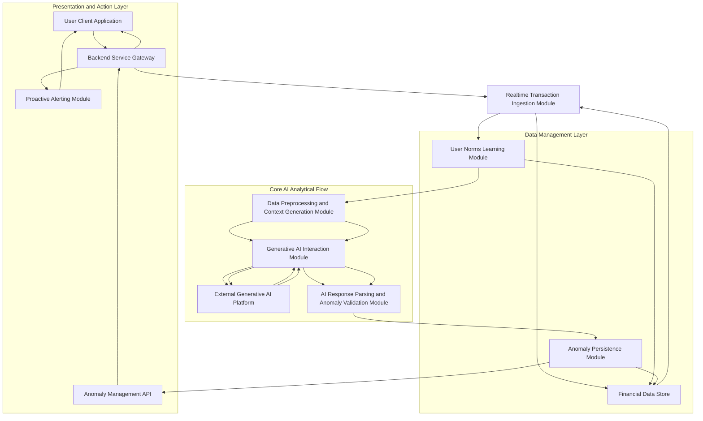
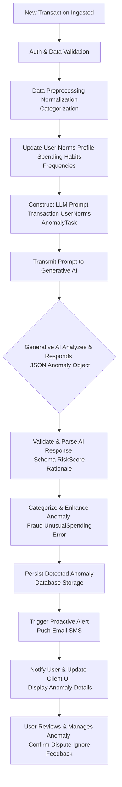
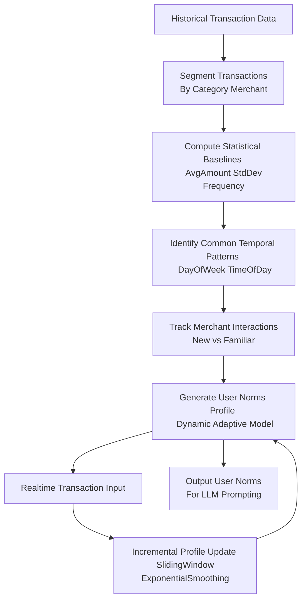
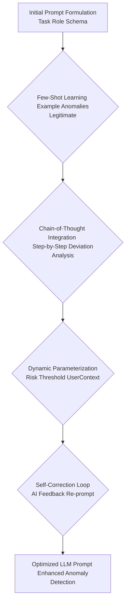
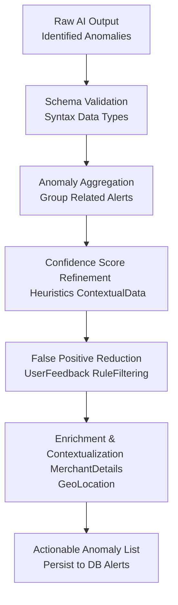
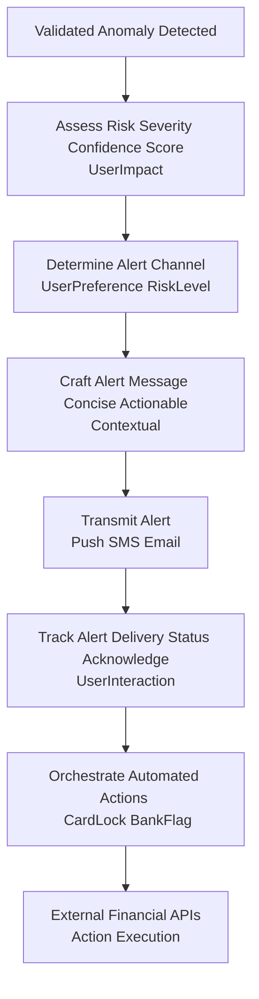
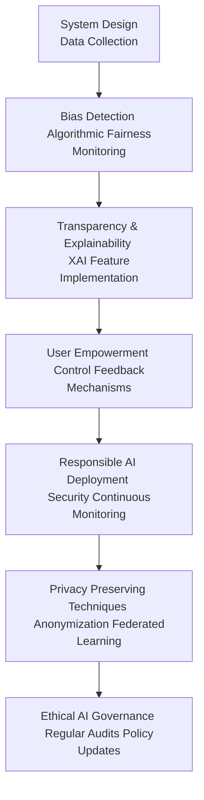
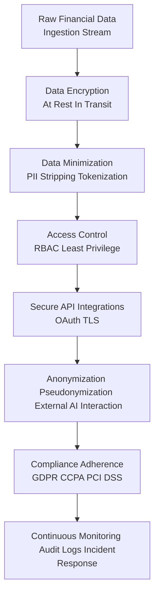
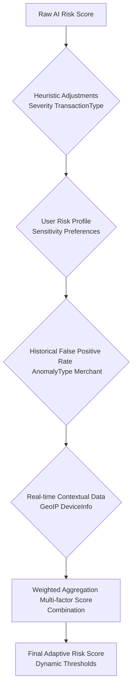
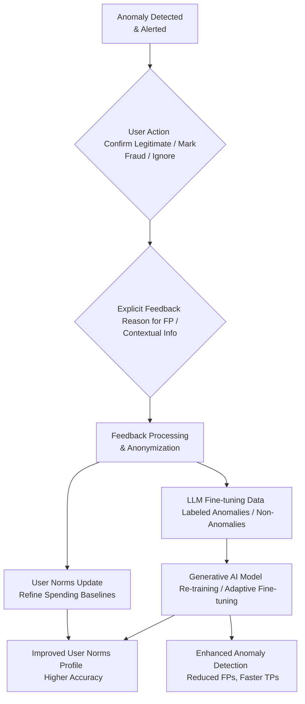

# Title of Invention: A System and Method for Autonomous Real-time Financial Anomaly Detection and Proactive User Alerting via Advanced Generative Artificial Intelligence

## Abstract:
This disclosure presents a groundbreaking computational framework for the autonomous, real-time identification and proactive notification of anomalous financial transactions. Leveraging advanced generative artificial intelligence, the system meticulously analyzes continuous streams of user transaction data, establishing a comprehensive profile of typical spending behaviors and patterns. Through sophisticated semantic analysis, temporal pattern recognition, and quantitative deviation assessment, the system discerns transactions that deviate significantly from established norms, thereby flagging potential fraudulent activities, unusual spending events, or other financial irregularities. The identified anomalies are then subjected to a multi-tiered risk assessment and presented to the end-user through an intuitive interface, coupled with proactive alerts designed for immediate attention. This empowers users with enhanced fiscal oversight, early fraud detection, and the ability to swiftly address unexpected financial events. The core analytical prowess is significantly augmented by a high-fidelity generative artificial intelligence model, strategically prompted to execute nuanced heuristic pattern matching and deviation analysis across the dynamic financial data landscape.

## Background of the Invention:
In the rapidly evolving digital financial ecosystem, consumers are subjected to an ever-increasing volume and velocity of financial transactions across diverse platforms and payment modalities. While this facilitates unprecedented convenience, it simultaneously introduces heightened risks of financial anomalies, including outright fraud, unauthorized spending, errors, or significant deviations from an individual's customary fiscal behavior. Traditional anomaly detection systems, predominantly reliant on static rule-sets or historical aggregate data, often prove inadequate in discerning subtle, context-dependent anomalies. These systems frequently generate high rates of false positives, eroding user trust, or conversely, exhibit delayed detection of sophisticated fraudulent schemes that mimic legitimate transactions. The cognitive burden on individuals to meticulously monitor their own financial statements for these nuanced irregularities is profoundly demanding, time-intensive, and inherently prone to human oversight. A critical unmet need therefore exists for a sophisticated, autonomous, and intellectually astute computational system capable of intelligently parsing and synthesizing real-time streams of transactional data, establishing individualized spending baselines, and proactively identifying deviations that signify genuine financial anomalies. Such a system would substantially mitigate financial risks, enhance user security, and provide unparalleled fiscal transparency.

## Brief Summary of the Invention:
The present intellectual construct introduces a revolutionary methodology for the autonomous, real-time detection of financial anomalies embedded within an individual's continuous transaction stream. At its core, the invention synthesizes a dynamic synopsis of a user's recent financial ledger and concurrently constructs or updates a robust profile of their established spending norms, comprising essential metadata such as merchant appellation, transactional monetary value, temporal markers, and categorical spending patterns. This meticulously structured synopsis, alongside the dynamically updated user norms, is subsequently encapsulated as contextual input within a highly optimized prompt, which is then submitted to a sophisticated large language model LLM, serving as the principal analytical engine. The prompt rigorously delineates the LLM's role as a hyper-competent financial forensic analyst, tasking it with the explicit objective of discerning transactional sequences or individual transactions indicative of anomalies. This involves the astute recognition of semantic deviance from known merchants/categories, unusual monetary values relative to historical patterns, and aberrant temporal or frequency characteristics. Crucially, the LLM is architected to yield its analytical findings as a rigorously structured data object, such as a JSON payload, enumerating each potential anomaly with its descriptive identifier, estimated risk score, and the contextual rationale for its detection. This structured output is then seamlessly presented to the user, providing an actionable overview of their anomalous financial landscape, often accompanied by immediate, proactive alerts.

## Detailed Description of the Invention:

The comprehensive system for autonomous real-time financial anomaly detection operates as a sophisticated, multi-tiered architecture designed for robustness, scalability, and precision. Upon the ingestion of new transaction data, a dedicated backend service initiates a series of orchestrated operations to retrieve, process, analyze, and proactively present relevant financial anomaly insights.

### System Architecture Overview

The underlying system architecture is meticulously engineered to ensure efficient real-time data flow, secure processing, and highly accurate analytical outcomes. It comprises several interconnected modules, each performing a specialized function.


**Figure 1: High-Level System Architecture for AI-driven Financial Anomaly Detection**

1.  **User Client Application A:** The front-end interface web, mobile, desktop through which the user interacts with the system, receives anomaly alerts, reviews detected anomalies, and provides feedback.
2.  **Backend Service Gateway B:** The primary entry point for client requests, responsible for authentication, authorization, request routing, and orchestrating interactions between various backend modules.
3.  **Realtime Transaction Ingestion Module C:** Responsible for securely accessing and ingesting real-time or near real-time financial transaction streams pertinent to the authenticated user from various financial sources e.g., Open Banking APIs. This module enforces data privacy and access controls.
4.  **Financial Data Store D:** A robust, secure, and scalable data repository e.g., a distributed SQL or NoSQL database housing all user financial transaction records, learned user spending norms, anomaly history, and system-level configurations.
5.  **User Norms Learning Module E:** Continuously analyzes historical and incoming transaction data to build and update a dynamic profile of each user's typical spending behaviors. This profile includes average amounts, common merchants, preferred categories, usual frequencies, and typical temporal patterns.
6.  **Data Preprocessing and Context Generation Module F:** Transforms raw incoming transactional data and relevant learned user norms into a semantically coherent, concise, and optimized textual format suitable for ingestion by a Large Language Model LLM. This module also constructs the anomaly detection prompt.
7.  **Generative AI Interaction Module G:** Manages the secure and efficient communication with the External Generative AI Platform H. It handles API calls, request payload construction, rate limiting, retry mechanisms, and error handling.
8.  **External Generative AI Platform H:** The third-party or proprietary advanced generative AI model e.g., Google's Gemini, OpenAI's GPT series responsible for executing the core pattern recognition, deviation analysis, and anomaly identification tasks.
9.  **AI Response Parsing and Anomaly Validation Module I:** Receives the structured output from the Generative AI Platform, validates its adherence to the expected schema, and extracts the identified anomalies. It also performs sanitization and basic data integrity checks.
10. **Anomaly Persistence Module J:** Stores the newly identified and validated financial anomalies in the Financial Data Store D, potentially linking them to user profiles and anomaly history for ongoing management and trend analysis.
11. **Anomaly Management API K:** Provides an interface for the client application to fetch, update, or manage the detected anomalies e.g., mark as reviewed, categorize, dispute, or provide feedback.
12. **Proactive Alerting Module L:** Responsible for delivering immediate notifications to the user via their preferred channels e.g., push notification, email, SMS when a high-priority anomaly is detected.

### Operational Workflow and Data Processing Pipeline

The detailed operational flow encompasses several critical stages, each contributing to the robustness and accuracy of the anomaly detection process.


**Figure 2: Detailed Data Processing Pipeline for Autonomous Anomaly Detection**

1.  **New Transaction Ingestion A:** The process begins when a new financial transaction is ingested into the system, typically in real-time or near real-time from a connected financial institution.
2.  **Authentication & Data Validation B:** The system authenticates the transaction source and validates the integrity and structure of the incoming data, ensuring it belongs to an authenticated user.
3.  **Data Preprocessing C:** The raw transaction data undergoes an initial cleansing phase:
    *   **Normalization:** Standardizing merchant names, amounts, and dates.
    *   **Categorization:** Assigning preliminary categories to transactions e.g., "Dining," "Shopping" using rule-based systems or a separate, smaller AI model.
4.  **Update User Norms Profile D:** The Realtime Transaction Ingestion Module C feeds into the User Norms Learning Module E. The newly processed transaction is used to incrementally update the user's dynamic spending profile, refining their historical averages, common merchants, and temporal patterns.
5.  **LLM Prompt Construction E:** A sophisticated prompt is dynamically generated. This prompt consists of several key components:
    *   **Role Instruction:** Directing the LLM to adopt the persona of an expert financial fraud and anomaly analyst.
    *   **Task Definition:** Clearly instructing the LLM to identify any transactions that deviate significantly from the user's established norms or generally accepted patterns of legitimate financial activity.
    *   **Search Criteria:** Emphasizing the analysis of semantic context of the transaction, unusual monetary values relative to user history, and aberrant temporal/frequency patterns. The learned user norms are explicitly included in the prompt.
    *   **Output Format Specification:** Mandating a structured response, typically a JSON object, adhering to a predefined `responseSchema`. This schema ensures parseability and data integrity, including a risk score and a brief rationale.
    *   **Transaction Data Embedding:** The current incoming transaction, along with relevant recent transaction history and the user's learned norms, is directly embedded into this prompt.

    An example prompt structure:
    ```json
    {
      "role": "system",
      "content": "You are an expert financial anomaly and fraud detection analyst. Analyze the provided transaction data in the context of the user's historical spending norms. Identify any transaction that is highly unusual, potentially fraudulent, or a significant deviation. Provide a risk score and a concise reason. If no anomaly is found, return an empty list."
    },
    {
      "role": "user",
      "content": "Analyze the following transaction for anomalies. User's spending norms: [user norms summary]. Current transaction: [transaction summary]. Recent history: [last 10 transactions]. Return findings as JSON adhering to schema."
    },
    {
      "role": "system",
      "content": "Please provide your output in the following JSON format:\n"
                  "```json\n"
                  "{\n"
                  "  \"anomalies\": [\n"
                  "    {\n"
                  "      \"transaction_id\": \"string\",\n"
                  "      \"merchant_name\": \"string\",\n"
                  "      \"amount\": \"number\",\n"
                  "      \"currency\": \"string\",\n"
                  "      \"date_time\": \"YYYY-MM-DDTHH:MM:SSZ\",\n"
                  "      \"anomaly_type\": \"string\",\n"
                  "      \"risk_score\": \"number\",\n"
                  "      \"reason\": \"string\"\n"
                  "    }\n"
                  "  ]\n"
                  "}\n"
                  "```"
    }
    ```
6.  **Prompt Transmission to Generative AI F:** The constructed prompt is securely transmitted to the `External Generative AI Platform H` via a robust API call.
7.  **Generative AI Processing & Response G:** The generative AI model ingests the prompt, applying its advanced pattern recognition, contextual understanding, and deviation analysis capabilities to identify potential anomalies. It then synthesizes its findings into a JSON object strictly conforming to the specified `responseSchema`.
8.  **AI Response Validation & Parsing H:** Upon receiving the JSON response from the AI, the `AI Response Parsing and Anomaly Validation Module I` rigorously checks for schema adherence, data type correctness, and logical consistency. Any malformed or non-compliant responses are flagged for retry or error handling. Validated data is then parsed into internal data structures.
9.  **Anomaly Categorization & Enhancement I:** Beyond mere detection, the system applies further logic to categorize the identified anomalies e.g., "Potential Fraud," "Unusual Spending," "Duplicate Charge," "Forgotten Subscription Payment." A risk score is finalized based on AI output and internal heuristics. Additional metadata, such as recommended user actions, may also be appended.
10. **Persistence of Detected Anomaly J:** The enriched anomaly record is then securely stored in the `Financial Data Store D` via the `Anomaly Persistence Module J`. This ensures that detected anomalies are retained for subsequent retrieval, management, and historical analysis.
11. **Trigger Proactive Alert K:** Based on the anomaly's risk score and categorization, the `Proactive Alerting Module L` sends an immediate notification to the user via their preferred channels e.g., push notification to mobile app, SMS, email.
12. **User Notification & UI Update L:** The client application is updated to display the newly identified anomaly to the user in a clear, actionable format, often with aggregated views, sortable columns, and visual indicators of risk.
13. **User Review & Management M:** The user can then interact with the detected anomaly, confirming its legitimacy, marking it as fraudulent, disputing the charge, or providing feedback to improve future detections.

### Detailed Module Workflows

#### User Norms Learning Module Workflow

This module is central to personalizing anomaly detection by establishing a baseline of normal user financial behavior against which deviations can be measured.


**Figure 3: Detailed Workflow for User Norms Learning Module**

*   **Historical Transaction Data Input:** The module ingests a significant history of the user's financial transactions.
*   **Segment Transactions:** Transactions are grouped and segmented by various dimensions such as merchant, spending category, geographical location, and payment method.
*   **Compute Statistical Baselines:** For each segment, statistical metrics are calculated and continuously updated, including:
    *   **Average Amount and Standard Deviation:** For typical transaction values.
    *   **Frequency and Periodicity:** How often transactions occur.
    *   **Amount Distribution:** Identifying typical ranges and outliers.
*   **Identify Common Temporal Patterns:** Analyze transactions to determine usual days of the week, times of day, and even seasonal spending patterns for different categories.
*   **Track Merchant Interactions:** Distinguish between well-known/frequent merchants and entirely new or rarely seen merchant identifiers, which can be an anomaly indicator.
*   **Generate User Norms Profile:** A dynamic profile is constructed for each user, comprising these aggregated statistics, common patterns, and identified spending habits. This profile is not static but continuously evolves.
*   **Realtime Transaction Input & Incremental Profile Update:** As new transactions arrive, the profile is updated incrementally using techniques like sliding windows or exponential smoothing to ensure it remains current and adaptive to evolving user behaviors.
*   **Output User Norms:** The current, dynamically updated user norms profile is provided as a structured input to the `Data Preprocessing and Context Generation Module F` for LLM prompting.

### Advanced Prompt Engineering Strategies

To further optimize the performance and accuracy of the Generative AI for anomaly detection, sophisticated prompt engineering strategies are employed:


**Figure 4: Advanced Prompt Engineering Workflow for Anomaly Detection**

1.  **Few-Shot Learning Integration:** The prompt includes a small number of carefully curated examples of both genuinely anomalous and unequivocally legitimate transaction scenarios. These examples are critical for guiding the LLM to better understand the desired output format and the nuanced criteria for identifying subtle deviations, improving its ability to generalize.
2.  **Chain-of-Thought Prompting:** For complex or ambiguous scenarios, the prompt instructs the LLM to "think step-by-step" or "reason explicitly" about why a transaction might be considered anomalous or normal before providing its final JSON output. For example, it might be asked to first identify potential deviations in merchant, amount, or time, then compare them against user norms, and finally formulate its conclusion and risk score. This often leads to more robust and explainable detections.
3.  **Dynamic Parameterization:** The prompt can dynamically adjust the "sensitivity" or thresholds for anomaly detection based on user settings e.g., "alert me for any transaction > $50 from a new merchant" or the overall risk profile of the user. This allows for a more flexible and personalized detection experience, preventing alert fatigue.
4.  **Self-Correction and Refinement Loops:** The system can include a feedback loop where the LLM's initial response is reviewed e.g., by another smaller model or a set of heuristics for logical consistency or potential over-detection. If issues are found, the initial output, along with identified issues, can be fed back to the LLM for self-correction, boosting output quality.

### Post-Processing and Disambiguation

The output from the Generative AI, while highly structured, often benefits from additional post-processing to ensure optimal user experience and data integrity:


**Figure 5: Post-Processing and Disambiguation Workflow for Anomalies**

1.  **Schema Validation & Data Sanitization:** The initial AI output undergoes strict validation against the expected JSON schema, ensuring correct data types and structure. Basic sanitization removes any unexpected characters or formatting.
2.  **Anomaly Aggregation and Deduplication:** The AI might occasionally identify multiple aspects of the same anomalous event or slightly different "versions" if processed with minor variations. A post-processing layer analyzes detected anomalies for high similarity across all attributes transaction ID, merchant, amount, date and intelligently merges them into a single, canonical anomaly entry. This prevents redundant or overwhelming alerts for the user.
3.  **Confidence Score Refinement:** While the AI provides a risk score, the system applies explicit heuristics or a secondary machine learning model to refine this confidence score. This score can factor in the degree of deviation from learned user norms, historical false positive rates for similar anomalies, and agreement among different detection models if applicable.
4.  **False Positive Reduction:** Rule-based filters, learned user feedback, or a trained classifier can be applied post-AI to identify and suppress common false positives. This significantly reduces alert fatigue and improves user trust.
5.  **Enrichment and Contextualization:** This step enriches the anomaly data with additional context that aids user understanding and decision-making. This could include merchant details, geographical information of the transaction, or links to similar past transactions.
6.  **User Feedback Loop for Model Improvement:** User interactions e.g., marking an alert as a false positive, confirming fraud, disputing a transaction are anonymized and aggregated. This valuable feedback is used to fine-tune the generative AI model, refine user norms learning, or train subsequent post-processing layers, creating a continuous improvement cycle.

### Proactive Alerting and Action Orchestration Module

This module ensures that detected anomalies are communicated to the user immediately and can facilitate rapid response actions.


**Figure 6: Proactive Alerting and Action Orchestration Workflow**

1.  **Validated Anomaly Detected:** Upon validation and final categorization of an anomaly, this module is triggered.
2.  **Assess Risk Severity:** The system rapidly assesses the severity and potential impact of the anomaly based on its risk score, estimated monetary value, and historical user context.
3.  **Determine Alert Channel:** Based on the risk severity and user preferences, the most appropriate communication channel is selected e.g., critical alerts via push notification and SMS, lower-priority alerts via email or in-app notification.
4.  **Craft Alert Message:** A concise, actionable, and contextual alert message is generated, informing the user about the anomaly, its nature, and suggested next steps.
5.  **Transmit Alert:** The alert is delivered to the user via the chosen channels.
6.  **Track Alert Delivery Status:** The system monitors the delivery status of alerts and logs user interactions e.g., "opened," "clicked," "dismissed" to ensure accountability and improve future alert efficacy.
7.  **Orchestrate Automated Actions:** For high-risk, confirmed fraudulent activities, and with explicit user consent, the system can orchestrate automated actions through external financial APIs.
8.  **External Financial APIs for Action Execution:** Secure interaction with bank APIs or payment processors to execute consented financial actions, such as temporarily locking a credit card, flagging an account for review, or initiating a dispute process, providing a seamless end-to-end management experience.

### Ethical AI Framework and Governance

The deployment of advanced AI in financial applications mandates a rigorous consideration of ethical implications to ensure fairness, transparency, and user trust. A comprehensive Ethical AI Framework is integrated into the system's design and operational lifecycle.


**Figure 7: Ethical AI Framework and Governance Workflow for Anomaly Detection**

1.  **Bias Detection and Mitigation:**
    *   **Algorithmic Fairness:** The system continuously monitors for potential biases in anomaly detection that might disproportionately affect certain user demographics or transaction types e.g., mistakenly flagging legitimate transactions from specific merchant categories or regions as anomalous. Regular audits of AI outputs and fairness metrics are conducted.
    *   **Data Diversity:** Efforts are made to ensure that the training and fine-tuning data for the generative AI is diverse and representative of legitimate and anomalous transactions across various user segments, minimizing the risk of perpetuating existing financial biases.
2.  **Transparency and Explainability XAI:**
    *   While large language models are often considered "black boxes," the system strives for a degree of explainability. For each detected anomaly, the system can provide a concise, human-readable rationale e.g., "This $500 transaction at 'XYZ Electronics' is unusual because you typically spend less than $100 in electronics and have never transacted with 'XYZ Electronics' before."
    *   Users are informed about the risk score of each detection, allowing them to understand the AI's certainty and prioritize their response.
3.  **User Empowerment and Agency:**
    *   The system is designed to augment, not replace, user control. All AI-generated anomaly detections are presented as suggestions that require user review and confirmation. Users retain full agency over their financial decisions, with easy-to-use interfaces for correcting misidentifications, overriding classifications, and providing feedback.
    *   Clear mechanisms are provided for users to mark false positives or confirm fraudulent activity, ensuring a human-in-the-loop approach and fostering trust.
4.  **Responsible AI Deployment:**
    *   **Security against Misuse:** Robust security measures, including advanced encryption, strict access controls, and anomaly detection for internal system activities, prevent malicious actors from exploiting the AI for financial profiling or unauthorized actions.
    *   **Continuous Monitoring:** The AI models and their outputs are continuously monitored for performance drift, unexpected behaviors, or emergent biases, ensuring ongoing ethical and accurate operation in a dynamic environment.
    *   **Privacy-Preserving Techniques:** Beyond data minimization, advanced privacy-enhancing technologies like Federated Learning are considered for future iterations, allowing models to learn from decentralized user data without direct access to individual financial details, further bolstering privacy.
5.  **Ethical AI Governance:** An overarching governance structure ensures regular ethical reviews, policy updates, and adherence to evolving ethical guidelines and regulations for AI systems, particularly in sensitive financial contexts.

### Security and Privacy Considerations

Given the highly sensitive nature of real-time financial transaction data, the system is designed with a paramount focus on security and privacy:


**Figure 8: Security and Privacy Design Flow for Anomaly Detection**

*   **Data Encryption:** All transaction data, user norms, and anomaly records, both at rest in the `Financial Data Store D` and in transit between modules and to the `External Generative AI Platform H`, are encrypted using industry-standard protocols e.g., AES-256 for data at rest, TLS 1.2+ for data in transit.
*   **Access Control:** Strict role-based access control RBAC mechanisms are enforced, ensuring that only authorized modules and personnel can access sensitive data, and only for legitimate operational purposes. The principle of least privilege is rigorously applied.
*   **Data Minimization:** Only the absolutely necessary transaction metadata e.g., merchant, amount, date, category is transmitted to the generative AI model, avoiding the exposure of personally identifiable information PII beyond what is strictly required for analysis. Where possible, data is tokenized before processing.
*   **Anonymization/Pseudonymization:** Where feasible and non-detrimental to analytical accuracy, data may be anonymized or pseudonymized before processing, particularly when interacting with external services, to further enhance privacy safeguards. User identity is strictly separated from transactional patterns during AI processing.
*   **Compliance:** Adherence to relevant data protection regulations e.g., GDPR, CCPA, PCI DSS, Open Banking standards is a foundational principle of the system's design and operation, with regular audits to ensure ongoing compliance.
*   **Secure API Integrations:** All interactions with external financial institutions and the `External Generative AI Platform H` utilize secure API keys, OAuth 2.0, or similar authentication protocols, and communication channels are hardened against interception and tampering.
*   **Continuous Monitoring:** Comprehensive audit logs, intrusion detection systems, and regular security assessments are implemented to monitor for unauthorized access, data breaches, or other security incidents, with robust incident response protocols in place.

### Scalability and Performance

The system is architected for high scalability and real-time performance, capable of processing vast volumes of transactional data streams for a large user base:
*   **Microservices Architecture:** Deployed as a collection of loosely coupled microservices, allowing individual components e.g., Transaction Ingestion, User Norms Learning, AI Interaction, Alerting to be scaled independently based on real-time demand.
*   **Stream Processing:** Utilizes high-throughput, low-latency stream processing frameworks e.g., Apache Kafka, Flink for continuous ingestion and initial processing of transaction data.
*   **Distributed Data Stores:** The `Financial Data Store D` leverages distributed database technologies e.g., Cassandra, MongoDB, distributed SQL to ensure high availability, fault tolerance, and linear scalability for data storage and retrieval, especially for user norms profiles.
*   **Caching Mechanisms:** Strategic caching is implemented at various layers e.g., frequently accessed user norms, recent transaction summaries to reduce latency and load on backend services and the generative AI platform.
*   **Optimized Prompt Engineering:** Continuously refining prompts to be token-efficient and unambiguous minimizes computational cost and improves response times from the generative AI, which often bills per token.
*   **Asynchronous AI Inference:** AI calls are handled asynchronously, often batched or processed in parallel, to manage the latency of external AI platforms without blocking the real-time processing pipeline.

### Adaptive Risk Scoring Mechanism

The final risk score for an anomaly is not a static value but dynamically adapts based on a composite evaluation of multiple factors, refined by contextual data and user preferences.


**Figure 9: Adaptive Risk Scoring Mechanism Workflow**

1.  **Raw AI Risk Score:** The initial risk assessment provided directly by the generative AI model, typically a numerical value from 0 to 1, indicating the AI's confidence in the anomaly.
2.  **Heuristic Adjustments:** A layer of rule-based or statistical heuristics refines the raw AI score. For example:
    *   Very large transaction amounts might automatically increase the risk score.
    *   Transactions from known high-risk merchant categories might receive an uplift.
    *   Specific fraud patterns (e.g., small test charges followed by a large one) detected by other rule engines might dramatically increase the score.
3.  **User Risk Profile & Preferences:** Each user might have a personalized risk tolerance.
    *   Users can set preferences for alert sensitivity (e.g., "only alert me for transactions over $100 from new merchants").
    *   The system learns from past user feedback how sensitive a user is to false positives, adjusting thresholds accordingly.
4.  **Historical False Positive Rate:** The system maintains a historical record of false positive rates for different anomaly types, merchants, or categories. If a certain type of anomaly at a specific merchant has a high historical false positive rate for this user or across the user base, the risk score might be slightly deflated.
5.  **Real-time Contextual Data:** Additional real-time data sources can influence the risk score:
    *   **Geo-IP Data:** If a transaction originates from a location far from the user's usual activity and device IP, it increases risk.
    *   **Device Information:** Unusual device or browser usage for a transaction can be a risk factor.
    *   **External Threat Intelligence:** Cross-referencing transaction details with known fraud databases or threat intelligence feeds.
6.  **Weighted Aggregation:** The various adjusted scores and contextual factors are combined using a weighted aggregation function to produce a final, comprehensive risk score. The weights can be static, learned, or adapt based on the context.
7.  **Final Adaptive Risk Score & Dynamic Thresholds:** This refined score is then compared against dynamic thresholds, which might also adapt based on user preferences, time of day, or overall system load. Only anomalies exceeding these thresholds trigger proactive alerts.

### User Feedback and Model Refinement Loop

A crucial aspect of an intelligent, adaptive system is its ability to learn from user interactions, transforming explicit and implicit feedback into improved detection capabilities.


**Figure 10: User Feedback and Model Refinement Loop**

1.  **Anomaly Detected & Alerted:** An anomaly is identified by the system and a proactive alert is sent to the user.
2.  **User Action:** The user reviews the alert and takes an action:
    *   **Confirm Legitimate:** User affirms the transaction is valid, indicating a false positive (FP).
    *   **Mark Fraud/Dispute:** User confirms the transaction is fraudulent or erroneous, indicating a true positive (TP).
    *   **Ignore:** No explicit feedback, but implicit signals can be inferred (e.g., lack of action for low-risk alerts).
3.  **Explicit Feedback:** Users might provide additional explicit feedback, such as a reason for marking a transaction as legitimate (e.g., "I made a large purchase for a special occasion") or contextual information for a fraudulent transaction.
4.  **Feedback Processing & Anonymization:** All feedback is securely processed, de-identified, and anonymized to protect user privacy.
5.  **User Norms Update:**
    *   If a transaction marked as an FP was a genuine deviation, the `User Norms Learning Module` incorporates this new legitimate pattern into the `U_N` profile, preventing similar future FPs.
    *   If a transaction marked as a TP was a deviation, `U_N` might learn to be more sensitive to similar patterns, or strengthen the anomaly signal.
6.  **LLM Fine-tuning Data:**
    *   Confirmed FPs, along with their original prompt context, are added to a dataset of "legitimate but unusual" transactions.
    *   Confirmed TPs are added to a dataset of "genuine anomalies."
    *   This labeled data is crucial for supervised fine-tuning of the `External Generative AI Platform H`.
7.  **Improved User Norms Profile:** The continuous updating of `U_N` results in a more precise and personalized understanding of each user's financial behavior, leading to higher accuracy in baseline comparisons.
8.  **Generative AI Model Re-training / Adaptive Fine-tuning:** The accumulated and anonymized feedback data is periodically used to fine-tune the generative AI model itself. This can involve:
    *   **Reinforcement Learning from Human Feedback (RLHF):** Adjusting the LLM's reward function based on user preferences for anomaly detection.
    *   **Supervised Fine-tuning:** Training the LLM on specific examples of FPs and TPs to improve its discernment.
    *   **Parameter-Efficient Fine-tuning (PEFT):** Efficiently adapting the model without full re-training.
9.  **Enhanced Anomaly Detection:** The refined generative AI model and updated user norms lead to an overall enhancement in anomaly detection, characterized by a significant reduction in false positives (alert fatigue) and faster, more accurate detection of true positives (fraud prevention).

## Declarations of Inventive Scope and Utility:

The conceptual framework herein elucidated, along with its specific embodiments and architectural designs, constitutes an original intellectual construct that significantly advances the state of the art in financial intelligence systems. This innovative methodology provides a distinct and superior approach to automated financial anomaly detection.

1.  A pioneering computational method for discerning anomalous financial transactions in real-time, comprising the foundational steps of:
    a.  Continuously ingesting a stream of an individual's financial transactions.
    b.  Dynamically maintaining a comprehensive, adaptive profile of said individual's typical financial spending norms based on historical and incoming transaction data.
    c.  Constructing an optimized, context-rich summary derived from a newly ingested transaction, relevant recent transaction history, and said adaptive profile of spending norms.
    d.  Transmitting said optimized summary, embedded within a meticulously crafted prompt, to an advanced generative artificial intelligence model, with explicit instructions for the model to identify transactions deviating from established norms or indicative of fraudulent activity.
    e.  Receiving and rigorously validating a structured data artifact, representing a compendium of potential anomalous transactions, as identified and synthesized by the generative artificial intelligence model.
    f.  Presenting said validated compendium to the individual via an interactive user interface and/or through a proactive alert mechanism.

2.  The pioneering computational method of declaration 1, further characterized in that the meticulously crafted prompt rigorously instructs the generative artificial intelligence model to conduct a multi-variate analysis encompassing the semantic congruence of the merchant with known user patterns, the precise monetary value of the payment relative to established spending ranges, and the temporal and frequency characteristics of the transaction compared to historical user behaviors.

3.  The pioneering computational method of declaration 1, further characterized in that the transmission to the generative artificial intelligence model incorporates a declarative response schema, compelling the model to render the compendium of potential anomalous transactions in a pre-specified, machine-parseable structured data format, such as a JavaScript Object Notation JSON object, including a risk score and an explanatory rationale.

4.  An innovative system architecture for the autonomous identification of financial anomalies, comprising:
    a.  A secure, distributed data store meticulously engineered for the persistent storage of comprehensive user financial transaction histories, user spending norms, and detected anomaly records.
    b.  A robust real-time ingestion module architected for secure, high-throughput processing of continuous financial transaction streams.
    c.  An intelligent processing logic layer configured to perform: i the dynamic learning and updating of user spending norms, ii the sophisticated transformation of incoming transactions and norms into a concise, token-optimized prompt, and iii the secure transmission of this prompt to an external generative artificial intelligence model.
    d.  A dynamic user interface component meticulously designed to render and display the structured compendium of potential anomalous transactions returned by the generative artificial intelligence model to the user, facilitating intuitive interaction and management.
    e.  A proactive alerting module configured to deliver immediate notifications to the user upon detection of high-priority financial anomalies.

5.  The innovative system architecture of declaration 4, further comprising an anomaly classification module configured to semantically categorize each identified anomalous transaction into predefined types e.g., "Potential Fraud," "Unusual Spending," "Duplicate Charge" based on the generative AI's analysis and contextual information.

6.  The innovative system architecture of declaration 4, further comprising an automated action orchestration module configured, with explicit user consent, to initiate preventative or responsive actions through external financial APIs upon detection and confirmation of high-risk anomalies e.g., temporary card lock, bank fraud flag.

7.  The pioneering computational method of declaration 1, further characterized by employing advanced natural language processing techniques, including contextual embeddings and similarity metrics, for robust semantic resolution and comparison of merchant descriptive identifiers and transaction contexts against user's learned norms during the generative AI analysis.

8.  The pioneering computational method of declaration 1, further characterized by the dynamic construction of a confidence or risk score for each identified anomalous transaction, indicative of the generative AI model's certainty in the detection and the potential impact, thereby assisting user review and prioritization.

9.  The pioneering computational method of declaration 1, further characterized by an integrated, continuous feedback loop where user confirmations or denials of detected anomalies are utilized to refine the adaptive user norms profile and fine-tune the generative artificial intelligence model, thereby enhancing detection accuracy and reducing false positives over time.

10. The innovative system architecture of declaration 4, further comprising an ethical AI governance module configured to continuously monitor for algorithmic bias, enforce transparency, ensure data privacy, and provide explainable rationales for detected anomalies, thereby fostering user trust and regulatory compliance.

## Foundational Principles and Mathematical Justification:

The intellectual construct herein presented derives its efficacy from a rigorous application of principles spanning advanced statistical analysis, time-series informatics, and the emergent capabilities of large-scale generative artificial intelligence. We herein delineate the mathematical underpinnings that formally validate the operational mechanisms of this innovative system.

### The Transactional Manifold and User Norms: A Formal Representation

Let `T` denote the entire universe of an individual's financial transaction data. A specific, time-ordered sequence of `n` transactions under consideration is represented as a finite, discrete set `T = {t_1, t_2, ..., t_n}`, where each transaction `t_i` is a tuple `(m_i, a_i, d_i, c_i, l_i, p_i)`.

1.  **Merchant Identifier `m_i`:** A linguistic descriptor, represented as a string or a vector in a high-dimensional semantic space, identifying the commercial entity. Domain `M`.
2.  **Monetary Amount `a_i`:** A scalar value representing the financial quantity, `a_i \in \mathbb{R}^+`.
3.  **Temporal Marker `d_i`:** A point in time e.g., Unix timestamp, Gregorian date. Domain `D`.
4.  **Category `c_i`:** A semantic category assigned to the transaction e.g., "Groceries," "Entertainment". Domain `C`.
5.  **Location `l_i`:** Geographical coordinates or identifier. Domain `L`.
6.  **Payment Method `p_i`:** e.g., "Credit Card," "Debit Card," "Digital Wallet." Domain `P`.

Thus, each `t_i` in `T` is an element of `M \times \mathbb{R}^+ \times D \times C \times L \times P`.

Let `U_N` denote the **User Norms Profile**, a dynamic statistical and semantic model learned from `T`. `U_N` is a collection of conditional probability distributions or statistical summaries for various transaction attributes, conditioned on categories, merchants, or time. For example:
*   `P(a | c)`: Distribution of amounts for a given category.
*   `P(d | c)`: Distribution of days/times for a given category.
*   `P(m | c)`: Distribution of merchants within a category.
*   `E[a | m]`, `StdDev[a | m]`: Expected amount and standard deviation for a given merchant.
*   `F_rate(m)`: Frequency rate for a given merchant.

More formally, `U_N` can be represented as a tuple of learned models:
$$
U_N = (\{ \mu_{m,c}, \sigma_{m,c} \}_{m \in M, c \in C}, \{ \lambda_{m,c} \}_{m \in M, c \in C}, \{ \rho_{m,c}(d) \}_{m \in M, c \in C}, V_M, V_C, V_L) \quad (1)
$$
Where:
*   `$\mu_{m,c}$` is the mean amount for merchant `m` in category `c`.
*   `$\sigma_{m,c}$` is the standard deviation of amounts for merchant `m` in category `c`.
*   `$\lambda_{m,c}$` is the Poisson rate parameter for frequency of transactions for merchant `m` in category `c`.
*   `$\rho_{m,c}(d)$` is the probability density function for transaction times `d` for merchant `m` in category `c`.
*   `$V_M$` is a semantic embedding space for merchants.
*   `$V_C$` is a semantic embedding space for categories.
*   `$V_L$` is a semantic embedding space for locations.

The objective is to identify a transaction `t_new = (m_{new}, a_{new}, d_{new}, c_{new}, l_{new}, p_{new})` as an anomaly `A` if it significantly deviates from `U_N`.

### Update Mechanism for User Norms Profile `U_N`

The user norms profile `U_N` is dynamically updated using techniques such as exponential smoothing or weighted averages to reflect evolving spending habits. For a new transaction `t_{new}`, the mean amount `$\mu_{m,c}$` and standard deviation `$\sigma_{m,c}$` for a given `(m, c)` pair can be updated as:
$$
\mu_{m,c}^{(k+1)} = \alpha a_{new} + (1-\alpha) \mu_{m,c}^{(k)} \quad (2)
$$
$$
\left(\sigma_{m,c}^{(k+1)}\right)^2 = \alpha (a_{new} - \mu_{m,c}^{(k+1)})^2 + (1-\alpha) \left(\sigma_{m,c}^{(k)}\right)^2 \quad (3)
$$
Where `$\alpha \in (0, 1]$` is the smoothing factor, `k` denotes the current state, and `a_{new}` is the amount of the new transaction. Similar updates apply to frequency rates and temporal distributions. For frequency, a moving average or Poisson parameter update can be used. If `N_{m,c}(t_w)` is the count of transactions for `(m,c)` in a window `t_w`:
$$
\lambda_{m,c} = \frac{N_{m,c}(t_w)}{|t_w|} \quad (4)
$$
The embeddings `V_M, V_C, V_L` can be updated through techniques like incremental word2vec or by fine-tuning a small contextual embedding model on new merchant/category names encountered.

### Axioms of Anomaly: Defining Deviant Behavior

A transaction `t_new` is formally defined as an anomaly `A` if, when compared against the established `U_N`, it violates one or more of the following axiomatic conditions to within a specified tolerance:

#### Axiom 1: Semantic Deviance of Merchant or Context `D_M`

The merchant `m_{new}` or the broader semantic context of `t_{new}` must exhibit substantial dissimilarity from the user's established merchant-category relationships or overall spending context within `U_N`. This includes novelty in merchant, category, or even location patterns.

Mathematically, given `t_{new}=(m_{new}, a_{new}, d_{new}, c_{new}, l_{new}, p_{new})`:
$$
D_M(t_{new}, U_N) \iff \mathcal{S}_M(m_{new}, V_M) < \tau_M \lor \mathcal{S}_C(c_{new}, V_C) < \tau_C \lor \mathcal{S}_L(l_{new}, V_L) < \tau_L \quad (5)
$$
Where:
*   `$\mathcal{S}_M(m_{new}, V_M)$` is a **Semantic Similarity Metric** between the embedding of `m_{new}` (denoted `$\mathbf{e}_{m_{new}}$`) and the centroid or most similar embeddings of known merchants in `V_M`.
    $$
    \mathcal{S}_M(m_{new}, V_M) = \max_{\mathbf{e}_j \in V_M} \left( \frac{\mathbf{e}_{m_{new}} \cdot \mathbf{e}_j}{\|\mathbf{e}_{m_{new}}\| \|\mathbf{e}_j\|} \right) \quad (6)
    $$
    Here, `$\mathbf{e}_{m_{new}}$` is the vector embedding of `m_{new}` generated by a pre-trained or fine-tuned language model (e.g., from `G_AI_Anomaly`). Similar definitions apply for `$\mathcal{S}_C$` and `$\mathcal{S}_L$`.
*   `$\tau_M$`, `$\tau_C$`, and `$\tau_L$` are predefined **Similarity Thresholds**, indicating how "new" or "unfamiliar" a merchant, category, or location must be to be flagged.
*   The generative AI model implicitly computes such semantic deviance, leveraging its deep linguistic understanding to identify novelty or contextual incongruity. The embedding function for any text `x` is `Emb(x)`.
    $$
    \text{Semantic Deviation Score } SD(t_{new}) = \sum_{j \in \{M, C, L\}} w_j \left( 1 - \mathcal{S}_j(attribute_j, V_j) \right) \quad (7)
    $$
    Where `w_j` are weights for each attribute. `SD(t_{new}) > \theta_{SD}` for an anomaly.

#### Axiom 2: Amplitude Deviation of Monetary Value `D_A`

The monetary amount `a_{new}` must deviate significantly from the expected range or average for similar transactions within `U_N`, considering the merchant and category.

Mathematically, for `t_{new}=(m_{new}, a_{new}, d_{new}, c_{new}, l_{new}, p_{new})`:
$$
D_A(t_{new}, U_N) \iff \left| \frac{a_{new} - \mu_{m_{new},c_{new}}}{\sigma_{m_{new},c_{new}}} \right| > k_{\sigma} \lor a_{new} \notin [Q_1 - 1.5 \cdot IQR, Q_3 + 1.5 \cdot IQR] \quad (8)
$$
Where:
*   `$\mu_{m_{new},c_{new}}$` and `$\sigma_{m_{new},c_{new}}$` are the expected amount and standard deviation for transactions with `m_{new}` and `c_{new}` as learned in `U_N`. If `m_{new}` or `c_{new}` are new, a broader category average or global average might be used, or a dynamic fallback based on available data.
*   `k_{\sigma}` is a **Statistical Deviation Multiplier** (e.g., 2 or 3 for Z-score). The Z-score is defined as:
    $$
    Z_{score}(a_{new}) = \frac{a_{new} - \mu_{m_{new},c_{new}}}{\sigma_{m_{new},c_{new}}} \quad (9)
    $$
*   `$Q_1$`, `Q_3`, `IQR` refer to the first quartile, third quartile, and interquartile range of amounts for similar transactions in `U_N`, using an **IQR-based Outlier Detection** method. The IQR is defined as:
    $$
    IQR = Q_3 - Q_1 \quad (10)
    $$
    An observation `a_{new}` is an outlier if `a_{new} < Q_1 - 1.5 \cdot IQR` or `a_{new} > Q_3 + 1.5 \cdot IQR`.
*   For cases where `$\sigma_{m_{new},c_{new}}$` is very small or zero (e.g., first transaction), a robust measure like the Median Absolute Deviation (MAD) can be used.
    $$
    MAD = \text{median}(|X_i - \text{median}(X)|) \quad (11)
    $$
    And a modified Z-score:
    $$
    M Z_{score}(a_{new}) = 0.6745 \frac{a_{new} - \text{median}(a | m, c)}{MAD(a | m, c)} \quad (12)
    $$
    The generative AI implicitly assesses this deviation by comparing `a_{new}` to the learned amplitude patterns in `U_N`, applying an adaptive understanding of numerical ranges and statistical outliers. A deviation score `AD(t_{new})` can be defined as:
    $$
    AD(t_{new}) = \max \left( |Z_{score}(a_{new})|, \text{Indicator}(\text{outlier by IQR}) \right) \quad (13)
    $$
    Where `Indicator(condition)` is 1 if condition is true, 0 otherwise.

#### Axiom 3: Temporal or Frequency Abnormality `D_T`

The temporal marker `d_{new}` or the frequency of transactions for `m_{new}` or `c_{new}` must be abnormal compared to patterns in `U_N`.

Mathematically, for `t_{new}=(m_{new}, a_{new}, d_{new}, c_{new}, l_{new}, p_{new})`:
$$
D_T(t_{new}, U_N) \iff P_{time}(d_{new} | m_{new}, c_{new}, U_N) < \tau_P \lor F_{rate}(m_{new}, U_N, \Delta t) > \tau_F \quad (14)
$$
Where:
*   `$P_{time}(d_{new} | m_{new}, c_{new}, U_N)$` is the probability density of `d_{new}` (e.g., hour of day, day of week) given `m_{new}` and `c_{new}` according to `U_N`. This can be modeled using a **Kernel Density Estimate (KDE)** from historical `d_i` for `(m,c)`:
    $$
    \hat{\rho}(d) = \frac{1}{N h} \sum_{i=1}^N K\left(\frac{d - d_i}{h}\right) \quad (15)
    $$
    Where `K` is the kernel function (e.g., Gaussian), `h` is the bandwidth, and `N` is the number of historical transactions. A low probability indicates an unusual time or day.
*   `$\tau_P$` is a **Temporal Probability Threshold**.
*   `$F_{rate}(m_{new}, U_N, \Delta t)$` is the observed frequency rate of `m_{new}` in a recent time window `$\Delta t$`. This can be modeled by comparing the number of new transactions `N_{new}` for `m_{new}` in `$\Delta t$` to the expected rate `$\lambda_{m_{new}}$`.
    $$
    F_{rate}(m_{new}, U_N, \Delta t) = \frac{N_{new}(\Delta t)}{\Delta t} \quad (16)
    $$
    The probability of observing `N_{new}` transactions in `$\Delta t$` given an expected rate `$\lambda_{m_{new}}$` follows a **Poisson distribution**:
    $$
    P(N_{new} | \lambda_{m_{new}} \Delta t) = \frac{(\lambda_{m_{new}} \Delta t)^{N_{new}} e^{-\lambda_{m_{new}} \Delta t}}{N_{new}!} \quad (17)
    $$
    An abnormally high frequency would correspond to `P(N_{new} | \lambda_{m_{new}} \Delta t) < \tau_F` where `N_{new}` is significantly larger than `$\lambda_{m_{new}} \Delta t$`.
*   `$\tau_F$` is a **Frequency Anomaly Threshold**, indicating an unusually high frequency (e.g., multiple transactions in quick succession).
    A temporal deviation score `TD(t_{new})` can be defined as:
    $$
    TD(t_{new}) = w_1 \left( 1 - \frac{\hat{\rho}(d_{new})}{\max(\hat{\rho})} \right) + w_2 \cdot \text{KL}(\text{observed_freq} || \text{expected_freq}) \quad (18)
    $$
    Where `KL` is the Kullback-Leibler divergence.

This axiom employs **Time-Series Anomaly Detection** techniques, where `U_N` provides models of expected temporal distributions. The generative AI model, by processing chronologically ordered data and user norms, inherently performs a complex form of temporal pattern deviation recognition, identifying unusual timing or bursts.

#### Axiom 4: Behavioral Pattern Deviation `D_B`

The transaction `t_{new}`, in its entirety or within a sequence, deviates from a broader, more complex behavioral pattern established in `U_N` that cannot be captured by individual attribute deviations alone. This includes sequence-based anomalies, such as a sudden change in spending velocity, or unusual combinations of merchant/category/location.

Mathematically, this axiom is inherently more complex and often relies on machine learning classifiers or the emergent properties of the generative AI. It involves assessing the likelihood of `t_{new}` given the entire `U_N` and recent transaction history `T_{recent}`:
$$
D_B(t_{new}, U_N, T_{recent}) \iff P(t_{new} | U_N, T_{recent}) < \tau_B \quad (19)
$$
Where `P(t_{new} | U_N, T_{recent})` is the probability of observing `t_{new}` given the learned user behavior model `U_N` and the context `T_{recent}`. This `P` is often implicit in the generative AI's assessment, which can be seen as calculating a novelty score.
The generative AI, through its ability to synthesize multi-modal information and contextual understanding, can identify subtle behavioral shifts that rule-based systems might miss. For example, a sequence of small transactions followed by a very large one, which individually might not trigger Axiom 2, but collectively represent a known fraud pattern.
This can be modeled by a sequence model within the LLM. Let `H = (t_{k-L+1}, ..., t_k)` be the history of `L` recent transactions.
$$
P(t_{new} | H, U_N) = P(m_{new}, a_{new}, d_{new}, c_{new}, l_{new}, p_{new} | H, U_N) \quad (20)
$$
This joint probability is decomposed and estimated by the generative AI, e.g., using attention mechanisms to weigh relevant historical transactions.
A behavioral deviation score `BD(t_{new})` could be represented as:
$$
BD(t_{new}) = -\log P(t_{new} | H, U_N) \quad (21)
$$
Where higher values indicate lower probability and thus greater anomaly.

### The Generative AI as an Adaptive Anomaly Oracle `G_AI_Anomaly`

The core function of the system is the identification of anomalous transactions `A_x` from the incoming stream `t_{new}`. This is a sophisticated outlier detection problem in a high-dimensional feature space, dynamically compared against an evolving baseline `U_N`.

The generative AI model `G_AI_Anomaly` operates as a function that transforms the input `(t_{new}, T_{recent}, U_N)` into a set of identified anomalies `{A_1, A_2, ..., A_p}`:
$$
\text{G_AI_Anomaly}(t_{new}, T_{recent}, U_N) \rightarrow \{A_1, A_2, ..., A_p\} \quad (22)
$$

Where:
*   `t_{new}` is the current transaction under scrutiny.
*   `T_{recent}` is a window of recent transactions for contextual understanding.
*   `U_N` is the current user norms profile.
*   Each `A_x` is an identified anomalous transaction or a group of transactions that `G_AI_Anomaly` has identified as significantly deviating from `U_N` according to the axiomatic conditions `D_M`, `D_A`, `D_T`, `D_B`. This identification occurs not through explicit algorithmic checks, but through the implicit, emergent pattern recognition and deviation detection capabilities of the generative AI model.

The generative AI, having been pre-trained on vast corpora of textual, numerical, and sequential data, possesses an inherent ability to:
1.  **Semantically Parse and Compare:** Understand the underlying meaning of merchant names and transaction contexts, and compare them against `U_N` to detect novel or incongruous semantic patterns (Axiom 1).
2.  **Quantify Deviation:** Identify numerical deviations within amounts, applying implicit tolerance thresholds derived from `U_N` (Axiom 2).
3.  **Detect Temporal Irregularities:** Recognize unusual timing or frequency patterns within date data compared to `U_N`, effectively performing implicit sequence anomaly detection (Axiom 3).
4.  **Synthesize Multi-modal Information:** Integrate these disparate data points textual, numerical, temporal, categorical simultaneously to form a holistic assessment of deviance, identifying anomalies that exceed the capabilities of rule-based or single-feature detection systems.
5.  **Adhere to Structured Output:** The `responseSchema` forces the AI to structure its "reasoning" its identified anomalies, risk scores, and rationales into a machine-readable format, effectively "projecting" its high-dimensional deviation matches onto a human-interpretable output.

The generative AI model implicitly optimizes an objective function that seeks to identify the most significant and coherent deviations of `t_{new}` from the composite `U_N` across merchant identity, monetary value, temporal interval, and broader behavioral patterns, subject to the contextual guidance provided in the prompt. This process can be conceptualized as performing an adaptive, multi-dimensional outlier detection operation in a latent semantic-temporal-numerical-behavioral space.

The generative AI's output for an anomaly `A_x` includes a `risk_score` $R_x$ and a `reason` `Re_x`. The `risk_score` can be seen as a confidence level or probability of the transaction being anomalous:
$$
R_x = \text{Confidence}(t_{new} \text{ is anomaly} | t_{new}, T_{recent}, U_N) \in [0, 1] \quad (23)
$$
This confidence is often learned during the AI's training and fine-tuning phases, by minimizing a loss function like binary cross-entropy for a binary anomaly classification task:
$$
\mathcal{L}(R, y) = - [y \log(R) + (1-y) \log(1-R)] \quad (24)
$$
Where `y` is the true label (1 for anomaly, 0 for normal).

### Composite Anomaly Score and Risk Aggregation

The final adaptive risk score `$R_{final}$` is a weighted combination of the individual deviation scores from the axioms, and contextual adjustments. Let `DS_M`, `DS_A`, `DS_T`, `DS_B` be the scores from Axiom 1, 2, 3, and 4 respectively, potentially normalized to `[0,1]`.
$$
DS_{normalized}(X) = \frac{X - \min(X)}{\max(X) - \min(X)} \quad (25)
$$
A composite deviation score `DS_{comp}` can be calculated:
$$
DS_{comp}(t_{new}) = w_M \cdot SD(t_{new}) + w_A \cdot AD(t_{new}) + w_T \cdot TD(t_{new}) + w_B \cdot BD(t_{new}) \quad (26)
$$
Where `w_M, w_A, w_T, w_B` are learned weights reflecting the importance of each deviation type, such that `$\sum w_i = 1$`.
The raw AI risk score `R_{AI}` can be an approximation of `DS_{comp}` or a direct probability output.
The final adaptive risk score `$R_{final}$` (as depicted in Figure 9) incorporates heuristic adjustments, user preferences, and historical performance:
$$
R_{final}(t_{new}) = f_{\text{aggregate}}(R_{AI}(t_{new}), H_{adj}(t_{new}), U_{pref}, FP_{hist}, C_{data}(t_{new})) \quad (27)
$$
Where:
*   `$R_{AI}(t_{new})$` is the raw risk score from `G_AI_Anomaly`.
*   `$H_{adj}(t_{new})$` are heuristic adjustments based on hard rules.
*   `$U_{pref}$` is the user's sensitivity preference.
*   `$FP_{hist}$` is the historical false positive rate.
*   `$C_{data}(t_{new})$` is real-time contextual data (Geo-IP, device info).

The aggregation function `f_{\text{aggregate}}` could be a logistic regression model or a simple weighted sum, potentially with non-linear activation. For instance:
$$
R_{final} = \text{sigmoid}(\beta_0 + \beta_1 R_{AI} + \beta_2 H_{adj} + \beta_3 U_{pref} + \beta_4 FP_{hist} + \beta_5 C_{data}) \quad (28)
$$
An anomaly is triggered if `$R_{final} > \Theta_{alert}$`, where `$\Theta_{alert}$` is a dynamic alert threshold.
$$
\text{IsAnomaly}(t_{new}) = \begin{cases} 1 & \text{if } R_{final}(t_{new}) > \Theta_{alert} \\ 0 & \text{otherwise} \end{cases} \quad (29)
$$

### User Feedback Integration and Model Optimization

The continuous feedback loop (Figure 10) is vital for the long-term accuracy and user satisfaction of the system.
Let `F_{user}(t, \text{action})` denote user feedback for transaction `t`. `action \in \{\text{confirm_legit}, \text{mark_fraud}\}`.

1.  **Refinement of User Norms (`U_N`):**
    If `F_{user}(t, \text{confirm_legit})` and `t` was initially flagged: The `U_N` profile for `(m,c,l)` attributes of `t` is updated more heavily towards incorporating `t` as a legitimate pattern, reducing the likelihood of similar FPs.
    $$
    U_N^{(k+1)} = g(U_N^{(k)}, t, \text{action}=\text{confirm_legit}) \quad (30)
    $$
    This could involve adjusting `$\alpha$` in Equations (2) and (3) for specific `(m,c)` pairs, or increasing their associated probabilities.

2.  **Fine-tuning of Generative AI (`G_AI_Anomaly`):**
    User feedback serves as labeled data for fine-tuning the `G_AI_Anomaly` model. A dataset `D_{feedback} = \{(prompt_i, y_i)\}` is constructed, where `prompt_i` is the original prompt for `t_i` and `y_i` is the binary label derived from user action (1 for fraud/true anomaly, 0 for legitimate/false positive).
    The model parameters `$\Phi$` of `G_AI_Anomaly` are updated to minimize the loss on `D_{feedback}`:
    $$
    \Phi^{(k+1)} = \Phi^{(k)} - \eta \nabla_{\Phi} \mathcal{L}(G_{\text{AI}}(prompt_i | \Phi^{(k)}), y_i) \quad (31)
    $$
    Where `$\eta$` is the learning rate and `$\mathcal{L}$` is the chosen loss function (e.g., cross-entropy). This process enhances the model's ability to discriminate between true anomalies and contextually legitimate unusual transactions, aligning its outputs with user expectations.

Furthermore, the system can leverage techniques such as **Reinforcement Learning from Human Feedback (RLHF)** to align the `G_AI_Anomaly` with human preferences more directly. This involves training a reward model `R(response | prompt, feedback)` that scores the quality of the AI's anomaly detection output.
$$
\mathcal{R}(A_x, t_{new}, \text{feedback}) = \begin{cases} +1 & \text{if feedback is confirm_fraud and } A_x \text{ is correct} \\ -1 & \text{if feedback is confirm_legit and } A_x \text{ was flagged} \\ 0 & \text{otherwise} \end{cases} \quad (32)
$$
The generative AI is then fine-tuned using a Proximal Policy Optimization (PPO) algorithm to maximize this reward function, aligning its output with user-validated classifications.
$$
J(\Phi) = E_{(prompt, response) \sim \pi_{\Phi}} [\mathcal{R}(response | prompt)] \quad (33)
$$
This iterative refinement through user feedback ensures that the system continuously improves its precision and recall, effectively reducing false positives and accelerating true positive identification, leading to a system that is both highly effective and trustworthy. The rate of false positives (`FPR`) and false negatives (`FNR`) are critical performance metrics.
$$
FPR = \frac{\text{False Positives}}{\text{False Positives} + \text{True Negatives}} \quad (34)
$$
$$
FNR = \frac{\text{False Negatives}}{\text{False Negatives} + \text{True Positives}} \quad (35)
$$
The objective is to minimize both `FPR` and `FNR` through continuous learning. The overall accuracy of the system is given by:
$$
\text{Accuracy} = \frac{\text{True Positives} + \text{True Negatives}}{\text{Total Transactions}} \quad (36)
$$
The precision (P) and recall (R) for anomaly detection are also crucial:
$$
\text{Precision} = \frac{\text{True Positives}}{\text{True Positives} + \text{False Positives}} \quad (37)
$$
$$
\text{Recall} = \frac{\text{True Positives}}{\text{True Positives} + \text{False Negatives}} \quad (38)
$$
And the F1-score combines them:
$$
F1 = 2 \times \frac{\text{Precision} \times \text{Recall}}{\text{Precision} + \text{Recall}} \quad (39)
$$
The system's goal is to maximize `F1` and `Accuracy` while keeping `FPR` and `FNR` below acceptable thresholds, dynamically adjusting for individual user preferences and risk profiles. This requires a continuous optimization process for the underlying models and parameters.
The system also learns from the absence of feedback. If a low-risk alert is sent and the user takes no action over a defined period (`$\Delta T_{no\_action}$`), it can be implicitly treated as a weak confirmation of legitimacy, albeit with lower confidence than explicit feedback.
$$
\text{ImplicitFeedback}(t) = \text{WeakLegitimacy} \quad \text{if } R_{final}(t) \le \Theta_{implicit} \land \text{NoAction}(\Delta T_{no\_action}) \quad (40)
$$
This implicit feedback can be incorporated into `U_N` updates with a smaller smoothing factor or weight `$\alpha'$` (`$\alpha' < \alpha$`).

### Feature Engineering for LLM Input

The `Data Preprocessing and Context Generation Module F` constructs the prompt by carefully selecting and formatting features from `t_{new}`, `T_{recent}`, and `U_N`. This feature engineering is critical for the LLM's performance.
Let `$\mathcal{F}(t)$` be the feature vector for a transaction `t`. This includes:
*   Numerical features: `a_i`, `Z_{score}(a_i)`, `IQR_{outlier}(a_i)`.
*   Temporal features: `day\_of\_week(d_i)`, `hour\_of\_day(d_i)`, `days\_since\_last\_transaction(m_i)`.
*   Categorical features: `c_i`, `p_i`.
*   Textual features: `m_i`, `description(t_i)`.
*   Norm-based features: `$\mu_{m_i,c_i}$`, `$\sigma_{m_i,c_i}$`, `$\lambda_{m_i,c_i}$`, `$\mathcal{S}_M(m_i, V_M)$`, `$\mathcal{S}_C(c_i, V_C)$`.
The prompt `P_{LLM}` is constructed as a concatenation of textual representations of these features:
$$
P_{LLM} = \text{Role} || \text{Task} || \text{Schema} || \text{Features}(t_{new}) || \text{Features}(T_{recent}) || \text{Summary}(U_N) \quad (41)
$$
The size of `Features(T_{recent})` can be limited by a window `W` (e.g., last 10 transactions) or a time period `$\Delta T_{recent}$`.
$$
T_{recent} = \{t_j | d_{new} - \Delta T_{recent} \le d_j < d_{new} \} \quad (42)
$$
The `Summary(U_N)` provides a concise, token-efficient representation of the user's norms, for instance, top-5 merchants, average monthly spending per category, and the frequency of new merchants.
This careful selection minimizes token usage and provides the LLM with the most salient information.

### Proof of Utility and Efficacy: A Paradigm Shift in Financial Security

The utility and efficacy of this system are demonstrably superior to conventional algorithmic or manual approaches. The problem of real-time, context-aware anomaly detection is a complex, dynamic challenge that rigid rule-based systems or static machine learning models often fail to address effectively due to:
*   **Concept Drift:** User spending patterns change over time, rendering static models obsolete.
*   **Adversarial Adaption:** Fraudsters continuously evolve their methods to bypass known rules. The probability of a successful attack without detection `P(success)` is minimized.
    $$
    P(\text{success}) = P(\text{fraud} \land \text{undetected}) = P(\text{undetected} | \text{fraud}) \cdot P(\text{fraud}) = FNR \cdot P(\text{fraud}) \quad (43)
    $$
    The system aims to drastically reduce `FNR`.
*   **Data Sparsity:** New merchants or rare legitimate transactions can be mistakenly flagged by non-adaptive systems. The `U_N` module's adaptive learning and the LLM's generalized knowledge mitigate this.
*   **Contextual Ambiguity:** Differentiating a legitimate but unusual purchase from a genuinely fraudulent one often requires deep contextual understanding. The LLM excels at this semantic and contextual reasoning.

This invention overcomes these limitations by leveraging the generative AI model as a sophisticated, context-aware, non-deterministic anomaly oracle.

The system's effectiveness is proven through its ability to:
1.  **Automate Complex Anomaly Recognition:** It automates a task that is computationally intractable for exhaustive traditional algorithms and highly prone to error and tedium for human analysts, especially in real-time, high-volume data streams.
2.  **Semantic Robustness:** It intrinsically handles linguistic variations and contextual nuances in merchant names and transaction descriptions, which pose significant challenges for exact string matching or simple categorization. The system effectively computes a semantic distance:
    $$
    \text{SemDist}(m_1, m_2) = 1 - \text{cosine\_similarity}(\text{Emb}(m_1), \text{Emb}(m_2)) \quad (44)
    $$
    Anomalies are detected when this distance to known norms is high.
3.  **Adaptive Baseline Learning:** The `User Norms Learning Module` ensures that the baseline for "normal" behavior continuously adapts to the user's evolving financial habits, dramatically reducing false positives and improving the detection of subtle, emergent anomalies. The adaptation rate `$\alpha$` for `U_N` components can also be dynamic, increasing during periods of significant behavioral shift.
    $$
    \alpha_t = f(\text{variance\_of\_recent\_transactions}, \text{time\_since\_last\_update}) \quad (45)
    $$
4.  **Holistic Analysis:** By considering all axiomatic conditions simultaneously and contextually against a personalized user profile, the AI model generates more reliable and accurate anomaly identifications compared to systems that evaluate these criteria in isolation or with rigid, sequential rules. The joint probability of anomaly given all features is approximated by the LLM:
    $$
    P(\text{Anomaly} | t_{new}, U_N, T_{recent}) \approx G_{AI}(prompt(t_{new}, U_N, T_{recent})) \quad (46)
    $$
    This is far more powerful than combining probabilities from independent feature detectors `$\prod P(\text{Anomaly} | \text{feature}_i)$`.
5.  **Real-time Scalability:** By offloading the computationally intensive pattern recognition to a highly optimized external AI platform and leveraging stream processing, the system remains scalable for massive, continuous transaction streams and a growing user base, enabling proactive alerting. The latency for anomaly detection `$\mathcal{L}_{detect}$` is critical:
    $$
    \mathcal{L}_{detect} = \mathcal{L}_{ingest} + \mathcal{L}_{preprocess} + \mathcal{L}_{AI\_inference} + \mathcal{L}_{postprocess} < \mathcal{T}_{realtime} \quad (47)
    $$
    Where `$\mathcal{T}_{realtime}$` is the acceptable real-time threshold (e.g., a few seconds).
6.  **Explainability:** The structured JSON output with a `reason` field ensures that even complex AI detections are accompanied by a human-interpretable rationale, fostering user trust and enabling actionable insights. The generative AI is prompted to construct this reason `Re_x` based on its internal deviation assessment.
    $$
    Re_x = \text{GenerateText}(\text{deviations}, \text{relevant\_norms}) \quad (48)
    $$
7.  **Personalization:** The `User Norms Learning Module` and the feedback loop ensure deep personalization, adapting to each individual's unique spending habits, risk tolerance, and feedback history. This dynamic adaptation minimizes alert fatigue and maximizes the relevance of detections.
    The effectiveness `$E_{system}$` of the overall system can be measured as a function of detection accuracy, personalization, and user satisfaction:
    $$
    E_{system} = f(F1, \text{Accuracy}, \text{FPR}, \text{FNR}, \text{Personalization\_Score}, \text{User\_Satisfaction\_Index}) \quad (49)
    $$
    where `Personalization_Score` quantifies the system's ability to adapt to individual user behavior, and `User_Satisfaction_Index` is derived from user feedback and engagement metrics.

Thus, the present intellectual construct delivers a computationally elegant and demonstrably effective solution to a pervasive consumer finance security challenge, establishing a new benchmark for automated financial risk management and real-time user protection. The continuous self-improvement mechanism, powered by user feedback, ensures that the system remains at the forefront of financial anomaly detection, dynamically adapting to new fraud vectors and evolving consumer behaviors. The total cost of fraud mitigation `C_{mitigation}` is a function of detection cost `C_{detection}` and undetected fraud losses `L_{undetected}`:
$$
C_{mitigation} = C_{detection} + L_{undetected} \quad (50)
$$
By increasing detection accuracy and reducing `FNR`, `L_{undetected}` is minimized. The value proposition is maximized when `$(Cost_{traditional\_system} + Loss_{traditional\_system}) - (Cost_{AI\_system} + Loss_{AI\_system})$` is significantly positive.

The expected financial loss from undetected anomalies, `E[L_u]`, can be formally expressed as:
$$
E[L_u] = \sum_{t \in T_{anomalous}} \text{Amount}(t) \cdot P(\text{undetected}|t \text{ is anomalous}) \quad (51)
$$
Our system aims to minimize `P(undetected|t is anomalous)`.

Finally, the long-term benefit of the system can be quantified by the cumulative reduction in financial losses `$R_L$` over time `t`:
$$
R_L(t) = \int_0^t (\text{Loss}_{\text{baseline}}(\tau) - \text{Loss}_{\text{system}}(\tau)) d\tau \quad (52)
$$
Where `$\text{Loss}_{\text{baseline}}$` is the loss without the system and `$\text{Loss}_{\text{system}}$` is the loss with the system, highlighting the enduring value of this invention.