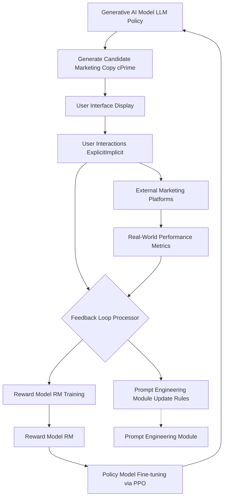
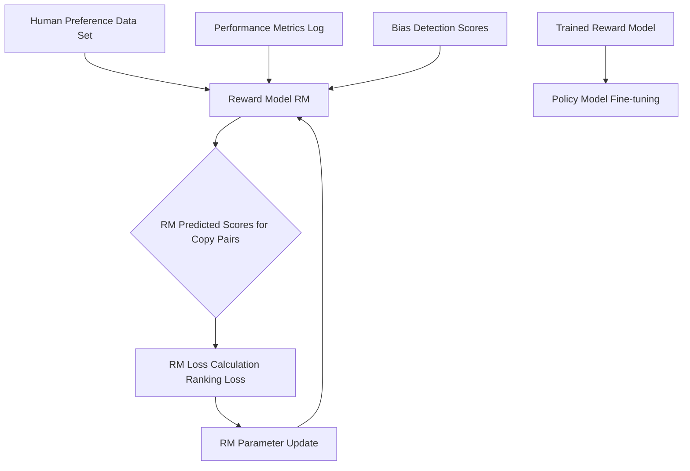
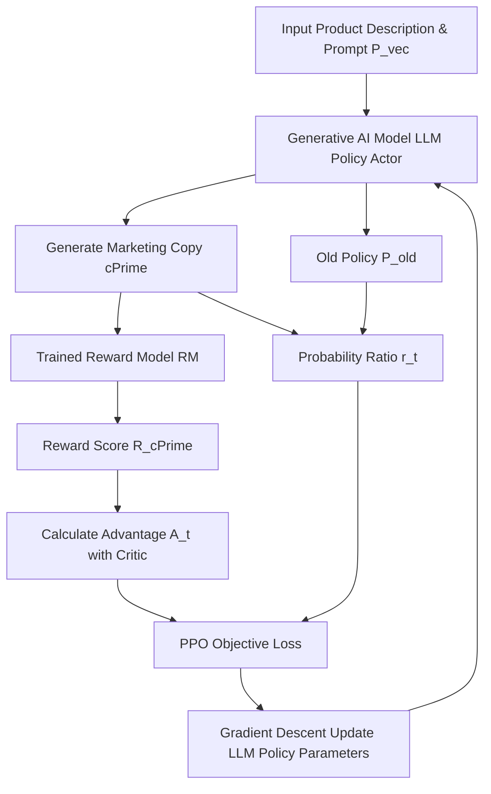
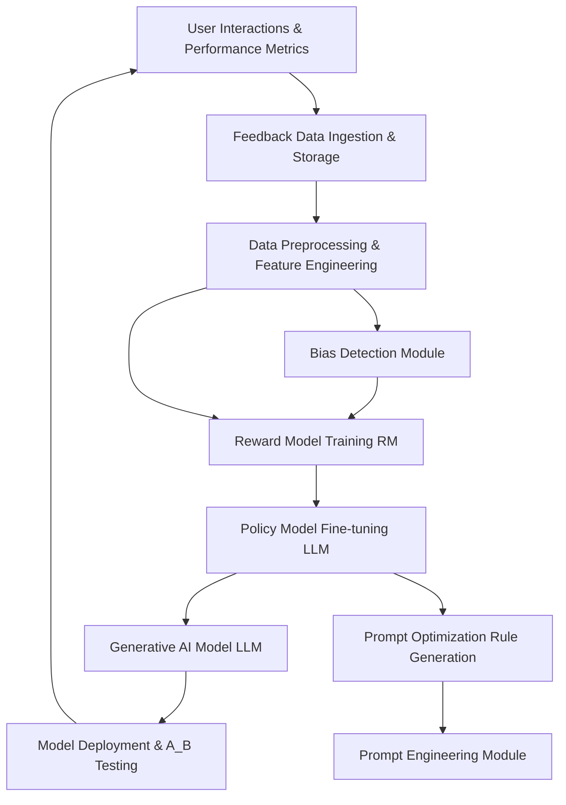

## **Title of Invention:** System and Method for Automated Semantically-Aligned Pervasive Marketing Asset Synthesis and Optimization: Reinforcement Learning with Human Feedback Implementation

## **Abstract:**
This document meticulously details the implementation of a Reinforcement Learning with Human Feedback RLHF paradigm, an integral and indispensable component of the inventive Feedback Loop Processor for the automated generation of marketing assets. The RLHF mechanism is rigorously engineered to continually align the Generative AI Model's linguistic synthesis capabilities with nuanced human preferences, empirical performance metrics, and predefined ethical guidelines. This adaptive system leverages a sophisticated Reward Model to quantify the desirability of generated marketing copy based on explicit user interactions and implicit engagement signals. Subsequently, an advanced policy gradient method, specifically Proximal Policy Optimization PPO, is employed to iteratively fine-tune the Generative AI Model, optimizing its parameter space to maximize the expected reward. Furthermore, a robust data pipeline is delineated, ensuring the seamless ingestion, preprocessing, and orchestration of feedback data for sustained and autonomous model adaptation, thereby asserting complete ownership over this advanced, self-optimizing content generation methodology.

## **Background and Context:**
The inherent dynamism of marketing efficacy necessitates a generative system capable of continuous, adaptive learning beyond its initial pre-training phase. While a Large Language Model LLM possesses prodigious linguistic capabilities, its outputs may not intrinsically align with specific brand voices, evolving market trends, or the subjective, often unstated, preferences of individual users. The `Feedback Loop Processor`, as introduced in the overarching patent, serves as the critical nexus for this continuous adaptation. Within this processor, Reinforcement Learning with Human Feedback stands as the advanced mechanism that transforms raw user interactions and quantifiable performance metrics into actionable learning signals. This document precisely elucidates the architectural and algorithmic underpinnings of this RLHF framework, bridging the gap between raw data and profound model intelligence, directly extending the `Feedback Optimization Functional` and `Prompt Optimization Algorithm` previously detailed.

## **I. The Reinforcement Learning with Human Feedback RLHF Paradigm for Marketing Asset Synthesis**
The RLHF paradigm within the present invention represents a profound leap in AI-driven content generation, enabling the `Generative AI Model LLM` to evolve its creative proficiency by learning directly from consequential feedback. It orchestrates a delicate dance between exploration (generating diverse copy) and exploitation (refining towards highly effective copy), guided by a quantitatively defined reward signal.

### **System Overview of RLHF Integration**
The RLHF workflow is intricately woven into the broader system architecture, ensuring a virtuous cycle of generation, evaluation, and refinement.


*   **Generative AI Model LLM Policy**: The core linguistic synthesizer, acting as the reinforcement learning policy, generates diverse marketing assets.
*   **Generate Candidate Marketing Copy cPrime**: The direct output from the LLM based on a product description and engineered prompt.
*   **User Interface Display**: Renders `cPrime` for user review and interaction.
*   **User Interactions ExplicitImplicit**: Captures explicit signals (selections, edits, rejections) and implicit signals (time-on-page, scroll depth) directly from the user.
*   **External Marketing Platforms**: Systems where generated copy is deployed, such as ad networks, email clients, or social media platforms.
*   **Real-World Performance Metrics**: Objective, quantifiable data collected from `External Marketing Platforms` (e.g., Click-Through Rate CTR, Conversion Rate, Engagement Rate, Bounce Rate).
*   **Feedback Loop Processor**: The orchestrator, responsible for ingesting, processing, and translating all feedback into actionable learning signals.
*   **Reward Model RM Training**: The continuous process of training and updating the `Reward Model` based on aggregated feedback data.
*   **Reward Model RM**: A specialized model within the `Feedback Loop Processor` that predicts a scalar desirability score for any given marketing copy.
*   **Policy Model Fine-tuning via PPO**: The core RL step where the `Generative AI Model LLM Policy` is updated using a policy gradient algorithm (specifically Proximal Policy Optimization PPO) to maximize the reward predicted by the `Reward Model`.
*   **Prompt Engineering Module Update Rules**: Heuristics and learned parameters derived from the RLHF process that inform the `Prompt Engineering Module` on how to construct more effective prompts in the future (`P-Optimality`).
*   **Prompt Engineering Module**: Integrates the `Update Rules` to dynamically refine prompt generation strategies.

## **II. Reward Function Architecture and Data Pipelines**
The efficacy of the RLHF system hinges on a robust `Reward Model` capable of accurately quantifying the "goodness" of generated marketing copy. This model is meticulously constructed and continuously refined through sophisticated data pipelines.

### **A. Feedback Data Ingestion and Normalization**
Raw feedback data, multifaceted in nature, undergoes rigorous ingestion and normalization to render it suitable for the `Reward Model`.

1.  **Explicit Feedback Collection**: User actions such as explicit selection, iterative editing (captured as edit distance or semantic divergence), rejection of generated copy, and direct ratings are logged with high fidelity.
2.  **Implicit Feedback Capture**: Passive user behaviors, including time spent reviewing a copy segment, scroll depth on a generated asset, copy-paste operations, and engagement patterns, are recorded.
3.  **Real-World Performance Integration**: Data from `External Marketing Platforms` (e.g., Google Ads, Meta Ads, Email Service Providers) concerning CTR, conversion rates, and other KPIs is ingested via the `External Integration API`.
4.  **Contextual Metadata**: The original product description, user-specified parameters, and the prompt `P_vec` that led to the generation of `c'` are always associated with the feedback.
5.  **Normalization and Alignment**: All disparate data types are standardized (e.g., scaling numerical values, canonicalizing textual feedback) and meticulously aligned to the specific `c'` they pertain to, resolving temporal and causal relationships.
6.  **Bias Detection and Penalization**: A dedicated `Bias Detection Module` analyzes `c'` for potential biases (e.g., gender stereotypes, cultural insensitivity) and generates a `C_bias` score, which serves as a critical penalty term in the overall reward function.

### **B. The Reward Model RM**
The `Reward Model` is a distinct neural network trained to predict human preferences, acting as the supervisor for the `Generative AI Model`.

1.  **Architecture**: The `Reward Model` is typically a smaller-scale Transformer-based network or a multi-layer perceptron, pre-trained on a diverse corpus of text and then fine-tuned specifically for preference prediction. Its input comprises the generated marketing copy `c'` (or its embedding), the associated product description `d`, and relevant contextual parameters `(A, M, S)`.
2.  **Training Data**: The `Reward Model` is trained on a meticulously curated dataset of preference comparisons or scalar ratings. For instance, given two generated copies `c_A` and `c_B` for the same input, human evaluators (or an aggregated signal from implicit feedback/performance) explicitly state a preference: `c_A > c_B`, `c_B > c_A`, or `c_A = c_B`. Alternatively, direct scores for individual `c'` are used.
3.  **Loss Function**: For preference comparisons, a pairwise ranking loss (e.g., binary cross-entropy or a margin-based loss) is employed. This encourages the model to assign a higher score to the preferred copy. For scalar ratings, mean squared error (MSE) is used.
4.  **Output**: The `Reward Model` produces a single scalar score `r(c', d, A, M, S)` that quantifies the predicted desirability or effectiveness of `c'` in its given context.

#### **Reward Model Training Flow**

*   **Human Preference Data Set**: A corpus of explicit human judgments on pairs or rankings of generated marketing copy.
*   **Performance Metrics Log**: Historical data linking generated copy to real-world marketing outcomes.
*   **Bias Detection Scores**: Quantified measures of bias derived from the `Bias Detection Module`.
*   **Reward Model RM**: The preference prediction neural network.
*   **RM Predicted Scores for Copy Pairs**: The `Reward Model`'s output scores for a given pair of marketing copies.
*   **RM Loss Calculation Ranking Loss**: The objective function (e.g., cross-entropy or hinge loss) used to train the `Reward Model` based on preference data.
*   **RM Parameter Update**: The process of adjusting the weights and biases of the `Reward Model` via backpropagation and an optimizer.
*   **Trained Reward Model**: The fully optimized `Reward Model` ready to assign desirability scores.
*   **Policy Model Fine-tuning**: The subsequent stage where the `Trained Reward Model` guides the fine-tuning of the `Generative AI Model`.

### **C. Reward Function Formalization and Weighting**
The comprehensive reward function `R(c')` is a composite of multiple signals, reflecting the `Axiom 6.1 Learning Signal Derivation` and `Theorem 6.1.3 Reward Function Construction` from the mathematical justification.

```
R(c') = w_phi * f_phi(phi) + w_perf * f_perf(perf) - lambda * C_bias(c')
```
*   **`w_phi * f_phi(phi)`**: This term quantifies the contribution of user interactions.
    *   `f_phi(phi)`: A utility function that maps explicit and implicit feedback `phi` to a scalar score. For example, an explicit selection yields a high positive score, a minor edit yields a slightly reduced positive score, a rejection a negative score. Implicit engagement metrics are scaled and summed for additional nuanced signal.
    *   `w_phi`: A tunable weight determining the relative importance of user preference.
*   **`w_perf * f_perf(perf)`**: This term integrates real-world business outcomes.
    *   `f_perf(perf)`: A function that transforms aggregated `Performance Metrics` (e.g., CTR, Conversion Rate, ROI) into a normalized utility score. This directly aligns the AI's output with tangible business value.
    *   `w_perf`: A tunable weight emphasizing the importance of empirical marketing performance.
*   **`- lambda * C_bias(c')`**: This term ensures ethical and responsible AI behavior.
    *   `C_bias(c')`: A quantifiable penalty derived from the `Bias Detection Module`, indicating the presence and severity of undesirable biases within `c'`.
    *   `lambda`: A critical safety weight, allowing for strict penalization of biased content, aligning with the ethical compliance mechanisms described in the overall invention.

The weights `w_phi`, `w_perf`, and `lambda` are hyperparameters, potentially adjusted adaptively or learned through meta-optimization, to reflect the system's strategic objectives and ethical commitments.

## **III. Policy Gradient Methods for Model Adaptation**
With a robust `Reward Model` in place, the next crucial step is to adapt the `Generative AI Model LLM` (our policy) to produce outputs that maximize this reward. Policy gradient methods are employed for this purpose.

### **A. The Policy Model Fine-tuning**
The `Generative AI Model LLM` functions as the policy `pi(c' | d, P_vec; Theta)`, where `Theta` represents its vast array of learned parameters. The objective of fine-tuning is to iteratively adjust `Theta` such that `E_c'[R(c')]` (the expected reward over generated copies) is maximized. This directly addresses `Implication 6.1.4 Gradient Ascent on R` from the mathematical framework.

### **B. Policy Gradient Algorithms**
While several policy gradient algorithms exist, **Proximal Policy Optimization PPO** is selected for its superior stability, sample efficiency, and effectiveness in complex high-dimensional action spaces (the C-space of marketing copy).

1.  **Why PPO?**: PPO addresses common challenges in RL such as unstable updates and poor sample efficiency. Its core innovation is a clipped objective function that constrains policy updates, preventing them from becoming too large and destabilizing training.
2.  **Core Components of PPO**:
    *   **Actor Network**: The `Generative AI Model LLM` itself. It takes `(d, P_vec)` as input and outputs a distribution over the tokens of `c'`.
    *   **Critic Network**: A separate value function network `V(d, P_vec)` estimates the expected cumulative reward (value) from a given input state. This helps in calculating the `Advantage` function. The `Reward Model` can sometimes serve or inform the critic, or a dedicated network is trained in parallel.
    *   **Advantage Function `A_t`**: Measures how much better an action (generating `c'`) was than expected. `A_t = Q(s,a) - V(s)` or `A_t = R_t + gamma * V(s_t+1) - V(s_t)`.
3.  **PPO Objective Function**: The policy is updated by maximizing a clipped surrogate objective function:
    ```
    L_PPO(Theta) = E_t [min(r_t(Theta) * A_t, clip(r_t(Theta), 1-epsilon, 1+epsilon) * A_t)]
    ```
    *   `E_t`: Expectation over a batch of data.
    *   `r_t(Theta)`: The ratio of the probability of `c'` under the new policy `pi_Theta` to the probability under the old policy `pi_Theta_old`. This ratio controls the step size.
    *   `A_t`: The advantage estimate at time `t`.
    *   `epsilon`: A small hyperparameter that defines the clipping range, ensuring that `r_t(Theta)` does not deviate too far from 1.
    *   This objective encourages improvement while preventing destructive large updates.

### **C. Fine-tuning Pipeline**
The PPO fine-tuning process operates in an iterative loop:

1.  **Data Generation (Rollouts)**: The current `Generative AI Model LLM Policy` (Actor) generates a batch of candidate marketing copies `c'` for a diverse set of `(d, P_vec)` inputs.
2.  **Reward Estimation**: Each generated `c'` is fed into the `Trained Reward Model RM`, which assigns a scalar reward score `R(c')`. If a Critic Network is used, it also estimates `V(d, P_vec)`.
3.  **Advantage Calculation**: The Advantage `A_t` is computed for each `c'` based on its reward and the value function (if applicable).
4.  **Policy Gradient Computation**: Using the `PPO Objective Function`, gradients are computed with respect to the `Generative AI Model`'s parameters `Theta`.
5.  **Model Update**: The `Generative AI Model`'s parameters `Theta` are updated via an optimizer (e.g., Adam) using the calculated gradients.
6.  **Iteration**: The process repeats, with the updated `Generative AI Model` generating new samples for further refinement.

#### **Policy Model Fine-tuning with PPO Flow**

*   **Input Product Description & Prompt P_vec**: The contextual information that guides the generation process.
*   **Generative AI Model LLM Policy Actor**: The current state of the generative model, acting as the policy actor.
*   **Generate Marketing Copy cPrime**: The output string of marketing copy produced by the LLM.
*   **Trained Reward Model RM**: The preference model that assigns a scalar score to `c'`.
*   **Reward Score R_cPrime**: The desirability score for the generated copy.
*   **Calculate Advantage A_t with Critic**: The difference between the actual reward and the expected reward, often calculated using a separate Critic network.
*   **Old Policy P_old**: A snapshot of the LLM policy before the current update step, used to compute the `probability ratio`.
*   **Probability Ratio r_t**: The ratio of the probability of `c'` under the current policy to its probability under the `old policy`.
*   **PPO Objective Loss**: The clipped surrogate objective function that guides the policy update.
*   **Gradient Descent Update LLM Policy Parameters**: The optimization step where the LLM's internal parameters are adjusted.

## **IV. Data Pipelines for Continuous Model Adaptation**
The entire RLHF process is sustained by robust and automated data pipelines designed for continuous learning and adaptation.

### **A. Data Collection and Aggregation**
1.  **Real-time Event Streaming**: User interactions (`phi`) and prompt requests are streamed in real-time to a secure logging service, ensuring immediate capture of feedback.
2.  **API Integration for Performance**: Scheduled jobs or webhook listeners periodically pull or receive `perf` data from `External Marketing Platforms` via the `IntegrationAPI`.
3.  **Contextual Data Enrichment**: All collected data is enriched with relevant metadata: user ID, timestamp, session ID, source prompt `P_vec`, and the initial `d`.
4.  **Distributed Storage**: Raw and enriched data is stored in a scalable `Data Persistence Layer` (e.g., a data lake or NoSQL database) optimized for high-volume ingestion and complex queries.

### **B. Data Preprocessing and Feature Engineering**
1.  **Data Cleaning and Validation**: Automated scripts filter out erroneous or duplicate entries, ensure data integrity, and validate schema adherence.
2.  **Semantic Embedding**: Generated copy `c'`, product descriptions `d`, and prompt components are transformed into dense semantic embeddings using pre-trained NLP models. This allows the `Reward Model` to process nuanced linguistic features.
3.  **Feature Vector Creation**: Raw numerical data (e.g., CTR) is normalized and scaled. Categorical data (e.g., marketing channel) is one-hot encoded or embedded.
4.  **Preference Label Generation**: For `Reward Model` training, raw `phi` and `perf` signals are translated into preference labels (e.g., `c_A` is preferred over `c_B`) or scalar reward values using heuristic rules or a smaller learned model.
5.  **Bias Score Generation**: The `Bias Detection Module` processes each `c'` and `d` to output the `C_bias` penalty score, which is then integrated into the reward signal.

### **C. Training Loop Orchestration**
1.  **Automated Triggering**: Training jobs for both the `Reward Model` and the `Generative AI Model` are automatically triggered based on data volume thresholds, time intervals, or detected model drift.
2.  **Distributed Training**: Leveraging cloud infrastructure, training is distributed across multiple GPUs/TPUs to handle large models and datasets efficiently.
3.  **Experiment Tracking**: A dedicated MLOps platform tracks all training runs, model versions, hyperparameters, and performance metrics, ensuring reproducibility and facilitating analysis.
4.  **Model Checkpointing**: Regular checkpoints of model weights are saved, enabling recovery from failures and facilitating iterative development.

### **D. Deployment and Monitoring**
1.  **A/B Testing Framework**: Fine-tuned `Generative AI Model` versions are deployed in a controlled A/B testing environment, comparing their performance against existing production models based on real-world KPIs.
2.  **Canary Deployments**: New models are initially rolled out to a small subset of users or traffic, gradually expanding as performance and stability are validated.
3.  **Performance Monitoring Dashboards**: Real-time dashboards track metrics such as `Reward Model` score distribution, `Generative AI Model` latency, output diversity, and actual marketing KPIs, with alerts for anomalies.
4.  **Drift Detection**: Automated systems continuously monitor for data drift or model performance degradation, triggering alerts or initiating retraining cycles when detected.
5.  **Rollback Mechanisms**: Robust rollback procedures are in place to revert to previous stable model versions in case of unforeseen issues.

#### **Continuous Adaptation Data Pipeline**

*   **User Interactions & Performance Metrics**: The raw input data from user feedback and external marketing channels.
*   **Feedback Data Ingestion & Storage**: The process of collecting and persistently storing all raw feedback data.
*   **Data Preprocessing & Feature Engineering**: Transformation of raw data into structured features suitable for machine learning models.
*   **Bias Detection Module**: A dedicated component for identifying and quantifying potential biases in the generated content and input data.
*   **Reward Model Training RM**: The iterative training process for the `Reward Model`, leveraging preprocessed data, bias scores, and preference labels.
*   **Policy Model Fine-tuning LLM**: The application of policy gradient methods to fine-tune the `Generative AI Model LLM` using the learned `Reward Model`.
*   **Generative AI Model LLM**: The continuously adapted and optimized generative model in active service.
*   **Model Deployment & A_B Testing**: The systematic deployment of new model versions and continuous A/B testing to validate their real-world efficacy.
*   **Prompt Optimization Rule Generation**: Derivation of improved prompt construction rules based on the fine-tuning results, to enhance future prompt engineering.
*   **Prompt Engineering Module**: The component responsible for constructing optimized prompts, now informed by the adaptive rules generated through RLHF.

## **V. Integration and Synergies**
The RLHF implementation is not an isolated component but deeply integrated, creating powerful synergies within the invention.

*   **Feedback Loop Processor Orchestration**: The `Feedback Loop Processor` acts as the master orchestrator, managing the entire RLHF lifecycle, from data ingestion to model deployment, ensuring seamless operation.
*   **Prompt Engineering Module `P-Optimality`**: The RLHF process provides empirical data on which prompt strategies lead to higher rewards. This intelligence directly feeds into the `Prompt Engineering Module's P-Optimizer Algorithm` (`Theorem 7.1.2 P-Optimizer Algorithm`), allowing it to dynamically evolve its prompt construction rules and parameters, moving beyond static heuristics.
*   **Explainability Module**: Insights gained from the `Reward Model` (e.g., features correlating with high rewards) can be leveraged by the `Explainability Module` to provide users with a deeper understanding of *why* certain copy is considered effective or preferred.
*   **Bias Mitigation**: The `C_bias` penalty term and the `Bias Detection Module` are directly integrated into the RLHF reward function, ensuring that the `Generative AI Model` learns to avoid generating biased or unethical content, actively enforcing the ethical compliance described in the main patent.

## **VI. Mathematical Justification for RLHF**
The RLHF framework for this invention is formally anchored in the `Mathematical Justification` section of the main patent, particularly **Section VI. The Feedback Optimization Functional: F-Learning**.

The `Axiom 6.1 Learning Signal Derivation` posits that a quantifiable learning signal `L(c', phi, perf)` can be derived from user interactions and observed performance. The `Reward Model RM` directly implements this axiom by translating these raw signals into the scalar reward `R(c')`.

The `Theorem 6.1.3 Reward Function Construction` formally defines `R(c') = w_phi * f_phi(phi) + w_perf * f_perf(perf) - lambda * C_bias(c')`. The `Reward Model` is trained to predict this `R(c')`, acting as a proxy for the true, latent effectiveness functional. The policy gradient methods (PPO) then perform `gradient ascent on R` (`Implication 6.1.4`), iteratively adjusting the `Generative AI Model LLM` to maximize this predicted reward, thus driving the system towards optimal marketing asset generation.

Furthermore, the RLHF process generates invaluable data that informs **Section VII. The Prompt Optimization Algorithm: P-Optimality**. By observing which prompts lead to highly rewarded generations, the `P-Optimizer Algorithm` can refine the `Prompt Parameter Space P_S` and develop more effective `Prompt Engineering Module Update Rules`, leading to `Dynamic Prompt Evolution` (`Implication 7.1.3`).

## **VII. Advanced Considerations and Future Enhancements**
The foundational RLHF implementation detailed herein lays the groundwork for continuous innovation:

1.  **Multi-objective RLHF**: Extending the reward function to simultaneously optimize for multiple, potentially conflicting, marketing objectives (e.g., conversion rate, brand safety, distinctiveness) by employing multi-objective reinforcement learning techniques or dynamic weighting of reward components.
2.  **Hierarchical RLHF**: Implementing hierarchical reinforcement learning where high-level policies select abstract creative strategies, and low-level policies fill in the specific textual details, allowing for more complex and coherent long-form content generation.
3.  **Personalized RLHF**: Developing individualized `Reward Models` or adapting the `Generative AI Model` to specific users or brand personas, enabling hyper-personalized content generation that aligns with highly granular preferences.
4.  **Adversarial Reward Learning**: Exploring methods where a discriminator network learns to distinguish between human-preferred and AI-generated outputs, providing a more robust and adaptive reward signal for the generative model, similar to Generative Adversarial Networks GANs.
5.  **Self-Correction and Explanation**: Enhancing the model's ability to not only generate preferred content but also to explain *why* it made certain choices or *how* it self-corrected based on feedback, increasing transparency and user trust.
6.  **Real-time Human-in-the-Loop Interventions**: Developing interfaces for human experts to provide real-time, fine-grained feedback during the generation process, acting as a "living critic" to guide the RLHF loop more efficiently in highly sensitive or novel contexts.